“这个数据库是强一致的。”

这句话听起来很有力量，放进设计文档却几乎无法验收。它没有说明一致的是单个 Key、一个对象、一次事务，还是多个服务共同产生的业务结果；没有说明要保留客户端程序顺序、因果顺序还是现实时间顺序；也没有说明网络分区、超时和副本落后时，系统会等待、拒绝还是返回旧数据。

一致性不是一个从“弱”到“强”的单旋钮，而是一组对**哪些执行历史合法**的约束。

只有先写出对象的顺序规范、事务边界、观察者范围和失败语义，才可能准确地说：这里需要线性一致，那里只需要会话内单调读，这组跨行更新必须可串行化，而报表读取可以接受带版本上界的陈旧快照。

本文是“有状态系统可靠性”学习路径中承上启下的一章。前面的 [《WAL 到底保证什么》](/signal-grid-blog/posts/write-ahead-log-durability-and-crash-recovery/) 解释了本地日志、提交确认与崩溃恢复；[《分布式时间：时钟、因果与租约》](/signal-grid-blog/posts/distributed-systems-time-clocks-ordering-and-leases/) 区分了墙钟、逻辑顺序与真实的协议决定。本文进一步回答：当多个调用发生重叠、多个事务并发、多个副本暂时分歧时，我们究竟允许调用方观察到什么。

下一章先进入[复制协议的设计空间](/signal-grid-blog/posts/replication-protocol-design-space-primary-backup-quorum-chain-smr/)，把“一致性契约”与副本确认、读取和故障转移路径分开；随后再读 [Raft 论文精读](/signal-grid-blog/posts/raft-consensus-leader-election-log-replication-and-safety/)，深入一种多数派日志协议。这样再看 [ZooKeeper](/signal-grid-blog/posts/zookeeper-coordination-consistency-and-recipes/) 与 [Kafka](/signal-grid-blog/posts/kafka-distributed-log-kraft-consumers-and-transactions/) 时，也不会把产品的某个写入协议直接等同于所有读、事务和外部副作用都具有同一种一致性。

本文主要依据 Herlihy 与 Wing 的线性一致原论文、Lamport 的顺序一致定义、Adya 的事务隔离形式化、Terry 等人的 Session Guarantees、Gilbert 与 Lynch 的 CAP 证明，以及 PostgreSQL、Spanner 的公开契约。示例均为重新设计的教学历史，不对应某个产品的隐藏实现。

## 1. 从 History 与实时先序开始

先给出一张不会偷换作用域的对照表。

| 模型         | 基本单位     | 必须存在的等价顺序     | 是否保留非重叠操作的现实时间先后 | 典型用途                           |
| ------------ | ------------ | ---------------------- | -------------------------------- | ---------------------------------- |
| 顺序一致性   | 单次对象操作 | 所有操作的某个合法全序 | 否，只保留每个进程的程序顺序     | 共享对象、复制寄存器的较弱模型     |
| 线性一致性   | 单次对象操作 | 某个合法全序           | 是                               | 锁、CAS、配置寄存器、主节点指针    |
| 可串行化     | 整个事务     | 某个合法串行事务顺序   | 否                               | 多行、多对象不变量                 |
| 严格可串行化 | 整个事务     | 某个合法串行事务顺序   | 是                               | 同时要求事务隔离与现实时间可解释性 |

这里已经能看见两个彼此独立的坐标：

- **操作还是事务**：一次 `get/put/CAS` 与一组多对象读写不是同一个原子单位；
- **是否服从现实时间**：等价串行顺序是否必须尊重“前一个已返回，后一个才开始”。

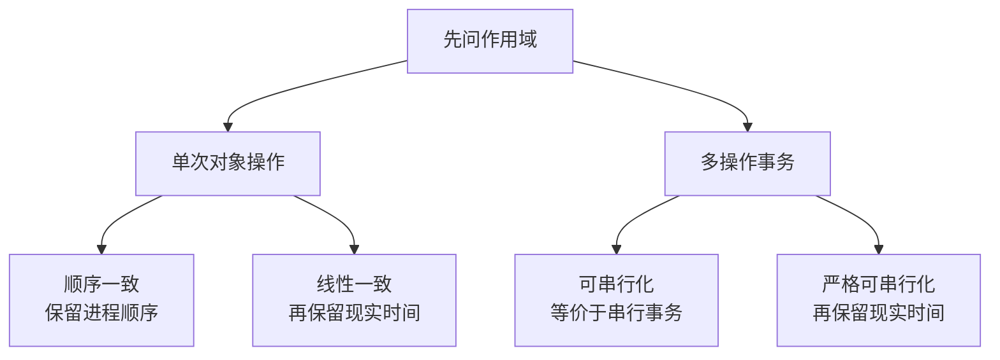

因此，下列说法都需要立即追问：

- “所有副本一致”——在什么时候、对哪些读取、允许落后多少？
- “事务是线性一致的”——是想表达严格可串行化，还是只验证了某个 Key 的 CAS？
- “用了 Raft 所以数据库可串行化”——Raft 对哪一份日志达成了共识，谁负责事务并发控制？
- “Serializable 是最强一致性”——它是否还承诺现实时间顺序？
- “最终一致就够了”——会话是否允许先看到新值、随后退回旧值？

后文会把这些问题逐一变成可以画历史、写反例和运行检查器的契约。

### 一致性模型判断的对象是 History

#### 一次操作不是一个点，而是一段时间区间

客户端调用 `write(1)` 时产生一个 **invocation** 事件；调用成功、失败或超时时产生一个 **response** 事件。

一次完成操作可以写作：

```text
invoke  p1  write(x, 1)  op=w1
ok      p1  write(x, 1)  op=w1
```

一次读取则同时记录输入与观察结果：

```text
invoke  p2  read(x)      op=r1
ok      p2  read(x) -> 1 op=r1
```

从调用到响应之间是一段区间。实现可以在区间中的某一时刻真正改变抽象状态，但客户端通常看不到那个内部时刻。

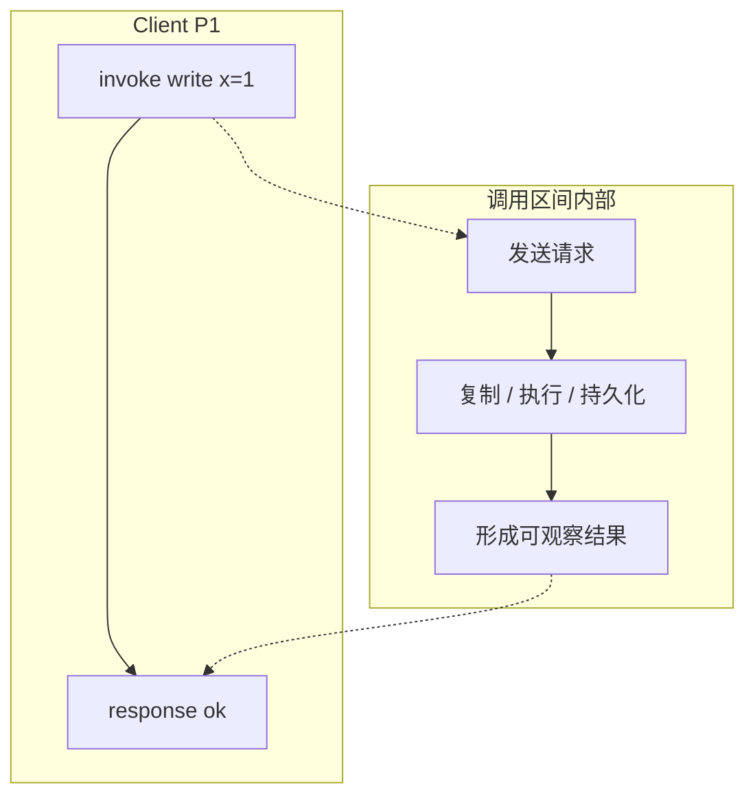

**History** 是多组 invocation 与 response 事件组成的执行记录，它保留：

- 哪个进程或会话发起操作；
- 操作类型、输入、结果与唯一 ID；
- 同一进程内的程序顺序；
- 不同操作是否重叠；
- 成功、明确失败与结果未知；
- 对事务而言，内部读写和最终 commit/abort。

一致性模型可以理解为一个历史集合：属于集合的 History 合法，不属于集合的 History 就是反例。

“更强”通常表示允许的历史更少，而不是服务一定更快、更可靠或更高级。

#### 完成、未完成与 well-formed

若每个 invocation 都有匹配 response，这个操作是 **complete**。

若客户端超时、连接断开或进程崩溃，History 里可能只有 invocation，这个操作是 **pending**。Pending 不等于“服务端没有执行”；它可能没有进入系统，也可能已经提交，只是响应丢失。

在经典定义中，检查一个含 pending 操作的 History 时，可以构造一个 completion：

- 为某些 pending 操作补上响应，表示它们确实生效；
- 删除另一些 pending 操作，表示它们没有生效。

这正是“结果未知”难以安全重试的形式化来源。

一个进程通常被建模为顺序发起调用：上一次操作响应后，才发起下一次操作。这样的 per-process History 是 well-formed。工程系统若允许同一连接 pipeline 多个请求，就应给它们独立 operation ID，并明确客户端并发模型，而不能假装它们天然有单线程程序顺序。

### Real-time precedence 不是比较墙钟时间戳

对于两个完成操作 `a` 与 `b`，若 `a` 的 response 出现在 `b` 的 invocation 之前，记作：

```text
a <H b
```

它表达的是：`a` 已经对调用者返回，然后 `b` 才开始。

这就是 History 的 **real-time precedence**，或称现实时间先序。

它不要求拿两台机器的 `currentTimeMillis()` 做大小比较。测试框架只需可靠记录调用与响应事件的可比较顺序；同一控制进程集中发压时尤其直接。跨独立采集器合并历史时，则必须明确同步误差或通过消息因果建立足够的先序边。

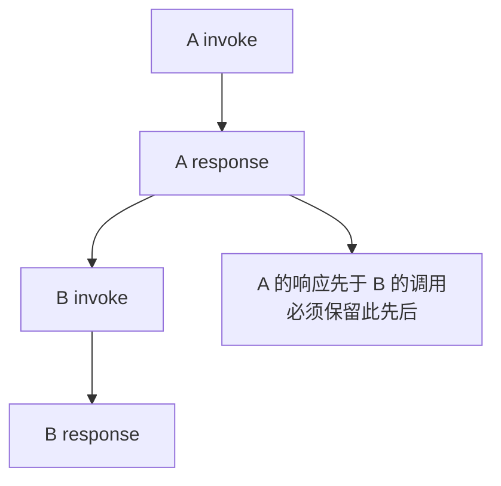

若两个操作的区间重叠，则 History 不给它们规定 real-time precedence：

```text
A invoke
B invoke
B response
A response
```

合法实现可以把 A 排在 B 前，也可以把 B 排在 A 前，只要结果符合对象的顺序规范。

这个“非重叠才约束，重叠可选择”是理解线性一致的关键。线性一致并不是根据调用开始时间排序，也不是根据响应完成时间排序。

## 2. 对象操作的一致性模型

### 线性一致性：定义需要三个部分

给定并发 History `H`，若存在一个顺序 History `S`，满足以下条件，就可以说 `H` 是线性一致的：

1. 在恰当处理 pending 操作后，`S` 与 `H` 对每个进程观察到的操作等价；
2. `S` 对对象的顺序规范是合法的；
3. 若 `a <H b`，则 `S` 中也必须把 `a` 排在 `b` 前。

“顺序规范”不能省略。

对寄存器而言，`write(v)` 改变当前值，`read()` 返回最近一次排在它之前的写值。

对队列而言，`enqueue(v)` 把元素放到尾部，成功的 `dequeue()` 返回最早尚未取出的元素。

对 CAS 寄存器而言，只有当前值等于 expected，`compareAndSet(expected, update)` 才能成功并写入 update。

没有抽象对象规范，“找到一个全序”没有意义：把任意错误结果随便排起来总能得到一串事件，却未必是合法对象执行。

#### Linearization point 是证明工具，不一定是一行固定代码

可以把每个操作想象成在 invocation 与 response 之间存在一个 **linearization point**：操作在那个瞬间原子地影响抽象状态。

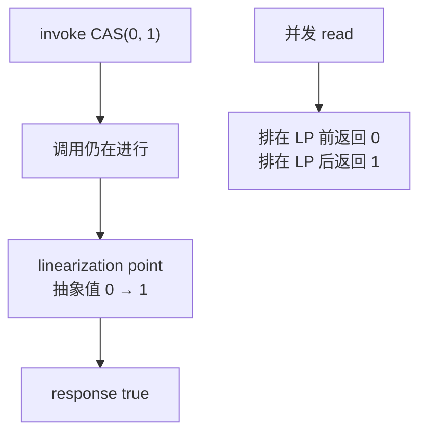

但不要把它误解为实现里一定有一条标着“原子发生”的源代码：

- 加锁实现可能在持锁区某次状态更新处线性化；
- CAS 循环常在线性化成功的 CAS 处生效；
- 帮助完成的无锁算法中，操作可能由另一个线程线性化；
- 某些证明要根据后续执行动态选择 linearization point；
- 失败操作与只读操作也需要安放到合法位置。

它首先是“存在这样一个位置”的证明义务，而不是监控系统能直接打印出的时间戳。

#### 非重叠旧读是最小反例

初始 `x=0`：

```text
P1: invoke write(x, 1)
P1: ok     write(x, 1)

P2: invoke read(x)
P2: ok     read(x) -> 0
```

写已经返回，读才开始，因此 `write(1) <H read()`。

任何尊重现实时间的顺序都必须先写后读；寄存器规范又要求读返回 1。返回 0 的 History 无法线性化。

如果读与写重叠：

```text
P1: invoke write(x, 1)
P2: invoke read(x)
P2: ok     read(x) -> 0
P1: ok     write(x, 1)
```

则把读排在写之前合法；返回 0 并不违反线性一致。

“读到了旧值”不是充分判据。必须先问读与写是否存在非重叠的 real-time precedence。

#### 线性一致是 safety，不是 latency 或 availability 承诺

线性一致规定**不能出现哪些结果**，却没有规定每个请求必须在多久内完成。

系统完全可以在无法联系多数派时一直等待或返回 unavailable，从而守住安全性但失去可用性。

因此：

- 线性一致不等于低延迟；
- 线性一致不等于永不超时；
- 线性一致不等于不会丢数据，持久性是另一项契约；
- 线性一致不等于事务原子性；
- 线性一致不等于所有客户端都连接同一物理节点。

### 线性一致为什么能按对象组合

Herlihy 与 Wing 证明了线性一致的 **locality**：一个 History 是线性一致的，当且仅当每个对象的子历史分别线性一致。

这让工程验证可以按 Key、Shard 或对象拆分，再组合推理。

但这里的“组合”很容易被夸大。

假设账户 A 和 B 各自都是线性一致寄存器，转账实现为：

```text
write(A, A - 10)
write(B, B + 10)
```

两个写分别合法且线性一致，观察者仍可能在中间读到总额少 10 的状态。

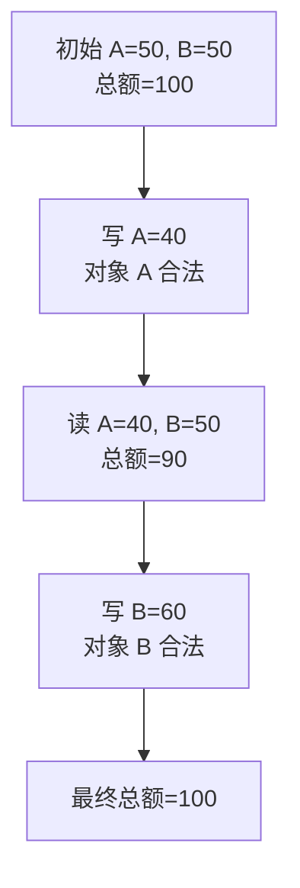

原因不是某个寄存器不线性一致，而是业务要求“两个写作为一个原子事务生效”。

线性一致的对象组合性不等于多对象操作自动获得事务原子性。

要维护跨对象不变量，需要把整组读写定义成一个更大的线性一致对象操作，或使用满足所需隔离级别的事务。

同理，“每个分片都可串行化”也不能自动推出跨分片全局可串行化。跨分片事务必须有统一的并发控制、依赖顺序与原子提交协议。

### 顺序一致性：保留程序顺序，但不保留跨进程现实时间

Lamport 在 1979 年给出的顺序一致性直觉是：执行结果看起来像所有处理器操作以某个顺序依次执行，并且每个处理器自己的操作在该顺序中仍保持程序规定的次序。

与线性一致相比，它少了一条约束：不要求保留不同进程之间由非重叠调用形成的 real-time precedence。

再次看这个 History：

```text
P1: write(x, 1) -> ok

P2: read(x) -> 0
```

现实世界里，P1 已收到成功，P2 才发起读。

线性一致不允许返回 0。

顺序一致却可能把 P2 的读排在 P1 的写之前，因为这样没有打乱 P1 或 P2 各自的程序顺序。

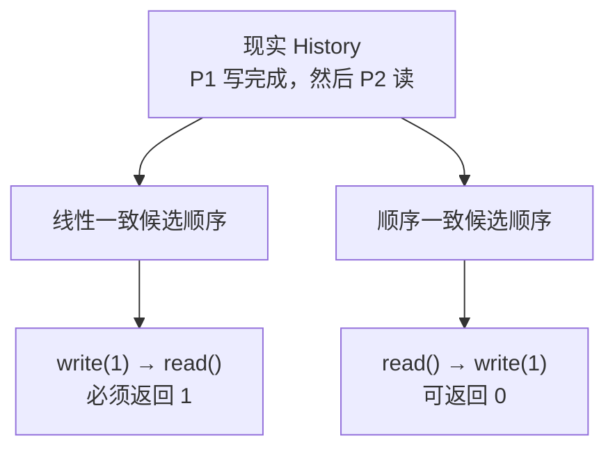

若 P2 在读之前收到 P1 的业务消息“写已经成功”，是否就必须保留这个先后？

这取决于模型如何定义 process order 与通信因果。不能只看两个匿名 RPC 的服务端日志，忽略客户端已经建立的程序顺序或因果边。

线性一致蕴含顺序一致；反过来不成立。

顺序一致也不是“每个副本内部有顺序”就够了。它要求所有进程的观察能解释为同一个全局顺序，并保留各自程序顺序。

## 3. 事务历史的一致性模型

### 可串行化：Serial 不等于 Serializable 的实现方式

事务 `T1`、`T2` 实际可以交错、并行、使用锁或 MVCC 执行。

**可串行化**要求它们的效果与某个逐个执行的串行顺序等价，而不是要求物理上真的一次只跑一个事务。

例如：

```text
T1: read A; write A; read B; write B; commit
T2: read C; write C; commit
```

两者操作可能交错，但只要最终观察与 `T1 → T2` 或 `T2 → T1` 某个串行执行等价，仍可以是可串行化的。

实现可以使用：

- 严格两阶段锁；
- 可串行化快照隔离；
- 乐观并发控制与提交验证；
- 确定性事务排序；
- 其他能拒绝非法依赖环的协议。

可串行化是结果约束，不是某一种锁算法的别名。

#### 冲突图给出一个重要直觉

当两个已提交事务访问同一数据项，且至少一个操作是写，就可能形成依赖边：

- `wr`：T2 读到了 T1 写的版本；
- `ww`：T2 的写覆盖在 T1 的写之后；
- `rw`：T1 读了旧版本，随后 T2 写出新版本，常称 anti-dependency。

若依赖关系要求：

```text
T1 → T2 → T3 → T1
```

就不存在同时满足这些先后的串行顺序。

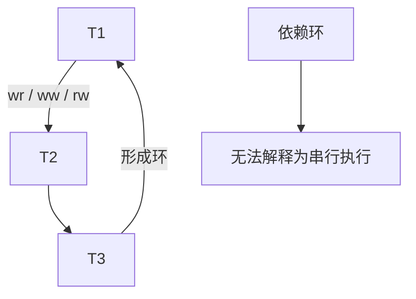

真实数据库的形式化比这张图细得多：需要版本顺序、谓词读取、提交与中止，以及不同隔离级别禁止的现象。Adya 的工作正是为了避免只用“脏读、不可重复读、幻读”几个口号描述实现相关行为。

#### 可串行化不自动保留现实时间

初始 `x=0`：

```text
T1: write x=1; commit

T2: read x=0; commit
```

假设 T1 已经向客户端报告 commit，然后 T2 才开始。

若只要求可串行化，可以把 T2 排在 T1 前，于是读到 0 仍能解释成某个串行顺序。

但这个顺序违背了现实时间。

因此“数据库声称 SERIALIZABLE”仍不足以单独推出“任何稍后开始的事务都必然看见先前已提交事务”。必须查看产品是否同时承诺 strict serializability、external consistency，或者读请求是否选择了可能陈旧的快照。

### 严格可串行化：可串行化加现实时间顺序

严格可串行化可以理解为：

```text
serializability + real-time precedence
```

每个事务整体像在开始与提交响应之间的某个瞬间原子发生；若 T1 已经提交返回，T2 才开始，那么合法串行顺序必须把 T1 放在 T2 前。

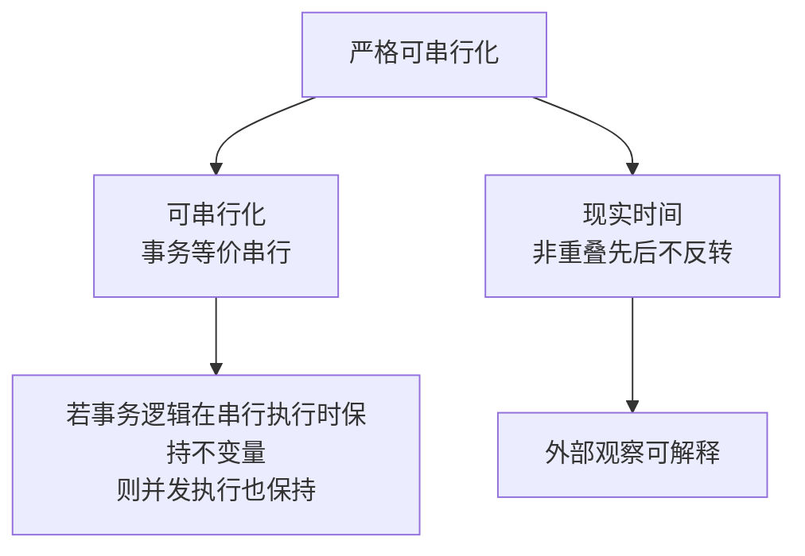

它把两条经常分开的理论主线接起来：

- 对单次对象操作，线性一致提供实时原子语义；
- 对多操作事务，严格可串行化提供实时原子事务语义。

不少资料把严格可串行化称为事务的 linearizability；这种说法可帮助建立直觉，但工程文档最好仍写出“事务严格可串行化”，避免与每个 Key 的单操作线性一致混为一谈。

#### External consistency 要看产品定义

Google Spanner 将 external consistency 描述为比普通 serializability 更严格的事务顺序保证，并明确将其与 strict serializability 联系起来：若事务 T1 在 T2 开始前提交完成，提交时间戳与串行顺序必须反映 T1 在前。

但“external consistency”在不同文献和产品里可能夹带时间戳、外部观察或提交顺序的具体表述。

使用时应引用产品契约，不要仅凭名称推断：

- 它覆盖读写事务还是也覆盖只读事务；
- 陈旧读、时间旅行读是否主动退出实时保证；
- commit response 与 commit timestamp 的关系；
- 跨数据库外部资源是否在同一原子边界。

即便数据库内部严格可串行化，数据库事务与支付 API、文件写入或消息发送之间也不会自动成为一个严格可串行化整体。

### Linearizable 绝不等于 Serializable

这两个词相似，是因为它们都用“某个顺序执行”帮助推理；它们约束的单位不同。

| 问题                     | 线性一致                   | 可串行化                                                           |
| ------------------------ | -------------------------- | ------------------------------------------------------------------ |
| 原子单位                 | 单个对象操作               | 整个事务                                                           |
| 核心规范                 | 对象的顺序语义             | 事务的串行等价                                                     |
| 是否天然保留现实时间     | 是                         | 否                                                                 |
| 是否天然保护跨对象不变量 | 否                         | 有条件：相关状态在同一事务内，且事务逻辑在串行执行时本就保持不变量 |
| 常见反例                 | 写已返回，后续读仍返回旧值 | 事务依赖图成环、write skew 等                                      |

四种组合在概念上都值得辨认：

1. 单 Key 操作线性一致，但跨 Key 更新没有事务，因此总额等不变量可破坏；
2. 事务可串行化，但不保留现实时间，因此稍后事务可能在等价顺序中排到前面；
3. 事务严格可串行化，同时获得串行等价与现实时间；
4. 系统只提供较弱读语义，既不线性一致，也不保证任意事务可串行化。

不要画一条“eventual → serializable → linearizable”的简单强弱直线。许多模型属于不同家族，彼此可能不可比较。

### Snapshot Isolation 很有用，但不是 Serializability

快照隔离通常让事务从一致快照读取，并阻止并发事务提交对同一数据项的冲突写。

它能消除许多异常，也能提供稳定读视图，却仍允许 **write skew**。

假设值班规则要求 Alice 与 Bob 至少一人在线，初始二者都在线：

```text
T1: 读 Alice=on, Bob=on；写 Alice=off
T2: 读 Alice=on, Bob=on；写 Bob=off
```

两个事务读取同一旧快照，却写不同的行，因此可能都提交；最终两人都离线，业务不变量被破坏。

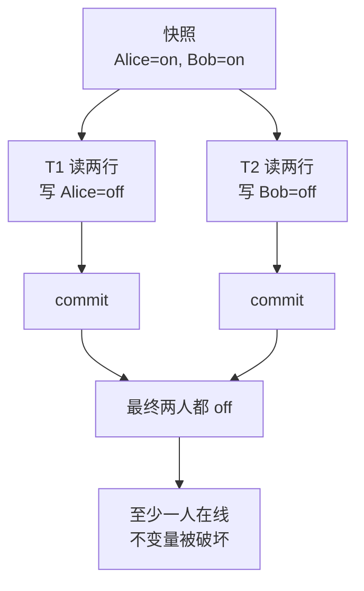

Serializable 实现需要让其中一个事务等待、冲突或以 serialization failure 中止，使已提交结果能够解释为某个串行顺序。

PostgreSQL 18 的官方文档明确要求：应用使用 Serializable 时必须准备重试 serialization failure。换句话说，强隔离不是“打开开关后业务完全不用管失败”；中止与重试是契约的一部分。

重试还必须考虑：

- 整个事务从头重跑，而不是只重发最后一条 SQL；
- 事务外副作用不能重复；
- 随机数、时间与外部读取是否会改变决策；
- 重试次数、退避和最终失败怎样暴露给上游。

### 单对象、多对象与“一份数据库”必须明确

设计一致性契约时至少写清四个 scope：

1. **对象范围**：一个 Key、一行、一份文档、一个分区还是整个数据库；
2. **操作范围**：单次读写、CAS、批量 API 还是事务；
3. **副本范围**：单区域、跨区域、只读副本、缓存和搜索索引是否包含；
4. **观察者范围**：一个会话、同一租户、所有客户端还是某个下游。

“主库可串行化”不代表：

- 异步只读副本也实时最新；
- Redis 缓存与主库原子更新；
- 搜索索引与数据库事务一起提交；
- 两个独立数据库的本地事务形成全局串行顺序；
- HTTP 成功返回后，所有 CDN 节点立即看见更新。

如果一个 API 从缓存读取，却在缓存 miss 时访问数据库，那么它的历史要包含完整路由语义。不能只证明数据库路径线性一致，就宣称整个 API 线性一致。

## 4. 弱模型仍然保留哪些关系

### Causal consistency：必须先看见原因，再看见结果

因果一致性保留 happened-before 关系。

常见因果边来自：

- 同一进程的程序顺序；
- 读取某个版本后基于它产生的新写；
- 消息发送先于接收；
- 上述关系的传递闭包。

假设用户先发布文章 P，另一用户读到 P 后发布评论 C。

`P → C` 是因果关系。一个观察者若已经看到 C，却仍看不到 P，就违反了这条因果可见性。

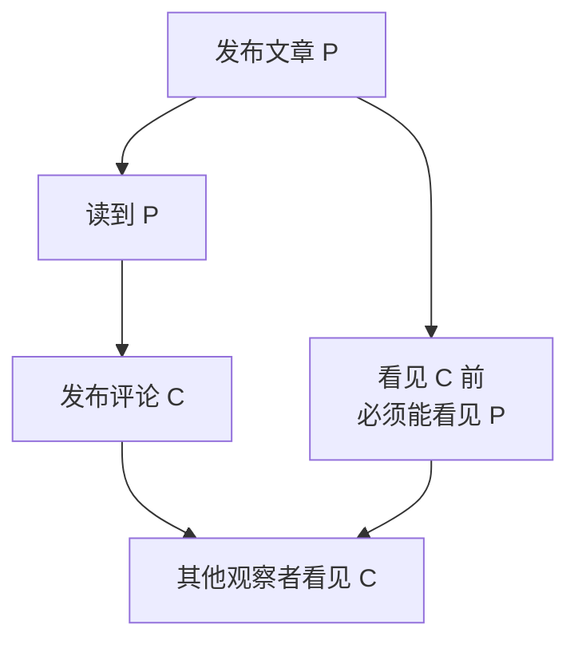

两个彼此没有信息流的并发写则不必在所有副本以同样顺序出现。系统可以用冲突合并规则使副本最终收敛。

因此因果一致：

- 约束已建立因果关系的可见顺序，但它本身是 safety 条件，不自动承诺最终传播或收敛；常说的 causal+ 还会另加冲突处理与收敛条件；
- 弱于要求**存在某个**合法全序、且保留非重叠操作现实先序的线性一致；重叠操作可能有多个合法 linearization，并不要求唯一全序；
- 可以允许旧读，只要不越过已建立的因果依赖；
- 通常需要携带依赖版本、向量或会话上下文；
- 不会自动把一组任意多对象操作变成原子事务。

“使用 Lamport Clock”也不自动得到因果一致。时间戳只是表示或排序工具，协议还必须阻止依赖尚未满足的版本过早可见。

### Eventual consistency 只承诺停止写入后的收敛

最终一致性的经典直觉是：如果不再产生新更新，经过足够时间，所有可达副本最终收敛到相同值。

它没有单独承诺：

- 一次读取能有多旧；
- 同一用户下一次读取不会倒退；
- 已确认写入多久后能在另一地区看见；
- 并发冲突采用什么业务规则；
- 删除是否会被旧副本复活；
- 持续写入时是否存在任何固定收敛时刻；
- 收敛后的值是否符合业务不变量。

“Eventually” 也不是一句可以无限延期的借口。生产契约通常还需要：

- replication lag 的正常范围与告警阈值；
- 最大可接受版本落后或时间落后；
- read repair、anti-entropy 与冲突合并机制；
- tombstone 的传播和垃圾回收条件；
- 分区恢复后的收敛目标；
- 用户是否能请求更强的读取模式。

最终收敛是一个 liveness 方向的承诺，而线性一致、可串行化主要是安全性约束；二者不能放在一把只标“强弱”的尺子上草率比较。

### Session Guarantees：给用户一条不倒退的个人时间线

Terry 等人在 Bayou 背景下提出四种经典 Session Guarantees。它们不是 ACID 事务，而是约束同一会话跨副本操作时的观察。

#### Read Your Writes

会话写入 `profile.name = "Lin"` 后，后续读取不能看见写入前的名字。

实现可以：

- 把会话粘到已接收该写的副本；
- 在请求中携带最小版本 token；
- 等待目标副本追上；
- 回源到权威副本；
- 无法满足时返回明确错误，而不是静默降级。

#### Monotonic Reads

若会话已经看过版本 12，后续读取不能退回版本 10。

它并不要求立刻看到版本 13，只要求已观察前缀不倒退。

#### Monotonic Writes

同一会话的写必须按会话顺序传播。若先改用户名、再创建引用新用户名的审计说明，副本不能先应用第二个写再应用第一个写。

#### Writes Follow Reads

若一个写基于先前读取的版本产生，该写必须排在所依赖版本之后传播。

这会保护“读文章后发表评论”一类因果边。

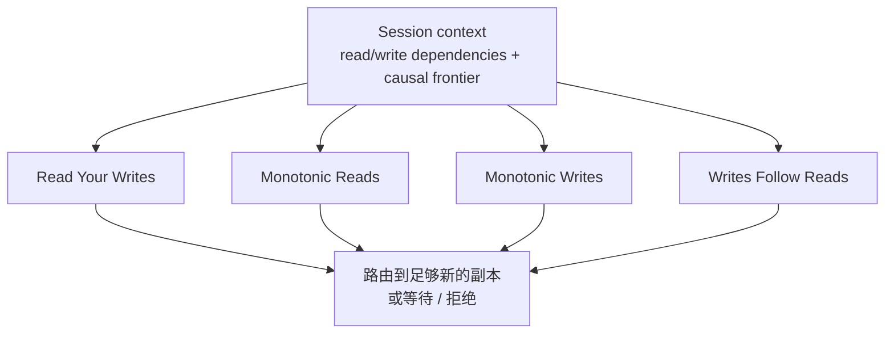

Session context 必须定义生命周期：跨设备是否继承、登出是否丢失、浏览器多个 Tab 是否共享、token 过大如何压缩、目标副本追不上时如何降级。只有系统确实存在满足语义的全局版本序时，一个标量 `minimumVersion` 才可能足够；一般情况下，Monotonic Writes 还要保留会话写顺序，Writes Follow Reads 还要携带读取依赖，系统可能需要 read/write set、vector 或 version frontier。

仅靠“通常粘到同一副本”不是可证明契约，因为负载均衡、故障转移和扩缩容随时可能改变路由。

### Stale read 也必须精确定义

“允许陈旧读”至少有五种不同含义：

- **任意陈旧**：只要是某个合法历史版本即可；
- **有界时间陈旧**：读取时间最多落后某个持续时间；
- **有界版本陈旧**：最多落后权威版本 N 个提交；
- **会话单调**：可以落后全局最新，但不能比会话已见版本更旧；
- **指定快照**：读取某个明确 commit timestamp、LSN 或 snapshot ID 的一致视图。

需要警惕“墙钟上的 5 秒陈旧”：

- 谁的墙钟定义这 5 秒；
- 同步误差是否包含在界限内；
- 写入时间、提交时间和副本应用时间用哪个；
- 长暂停或跨区域断链时是阻塞、拒绝还是突破界限；
- 多分片读取是否来自同一个一致快照。

可观测的版本 token 往往比模糊的“接近实时”更容易验收。

例如读响应可以携带：

```json
{
  "value": { "balance": "125.00" },
  "readMode": "bounded-stale",
  "snapshotVersion": "ledger-e17:88421",
  "servedBy": "replica-sh-02",
  "observedLagMillis": 180
}
```

这仍不能仅凭一个响应证明全程遵守界限，却能让测试、监控和事故分析知道实际读取了哪个版本。

## 5. CAP、Consensus 与 Transaction 的层次边界

### CAP 的精确边界：不是“C、A、P 三选二”按钮

Gilbert 与 Lynch 的经典结果讨论异步网络中的特定组合：在发生网络分区时，系统不能同时保证线性一致语义与其定义下的可用性。

这里的关键词必须保留：

- **Consistency** 指 atomic/linearizable object semantics，不是 ACID 中泛泛的业务约束；
- **Availability** 要求被非故障节点收到的每个请求最终得到响应；网络在请求到达节点前就把它丢掉，不属于这条前提；
- **Partition** 表示节点之间的消息可能丢失或无限延迟；
- 冲突集中发生在分区期间，而不是系统永远只能固定选择两个字母。

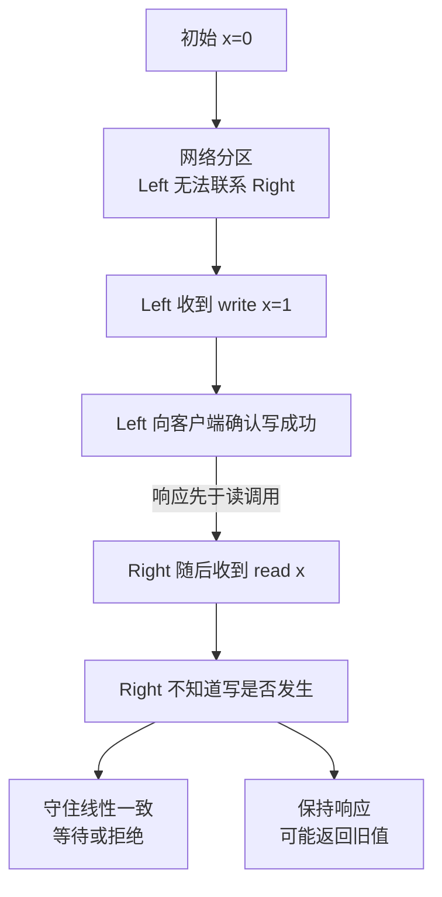

常见误解包括：

### “选择 CP”不代表系统完全不可用

系统可能只拒绝无法安全处理的写，仍提供缓存读取、不同分区键或不涉及冲突的操作。它也可以另设一个显式的 stale-read/bounded-stale API 主动降级并返回陈旧值，但该操作已经退出 CAP 中的线性一致 C，不能再把同一次旧读同时宣称为 linearizable。

可用性要按 API、数据范围和故障场景描述。

### “选择 AP”不代表没有任何一致性

系统仍可能按特定拓扑和可用性定义提供部分会话保证、因果关系、数据类型特定的合并、原子批次或局部事务；这些能力要逐项证明，不能由“AP”两个字母推出。尤其在普通 client-server 模型里，并非所有会话保证都能同时满足最强的 always-response 定义。

Bailis 等人的 HAT 工作正是在分析哪些事务与会话语义可以在高可用约束下实现，而不是把所有非线性一致系统归入一个模糊盒子。

### CAP 不直接判断普通时延取舍

没有分区时，跨区域协调仍有延迟成本；这是重要工程权衡，但不能把每次慢请求都叫作 CAP。

### CAP 的 C 不是数据库约束中的 C

账户余额不能为负、外键存在、借贷平衡等业务一致性，要靠事务、约束与应用协议维持。它们不是 CAP 字母 C 的同义词。

### Consensus 与 Transactions 解决的是不同层次

**共识**通常让多个参与者对某个值、Leader 任期或有序日志前缀达成一致。

**事务协议**则定义一组读写的原子性、隔离、提交与中止。它能让应用保护跨对象不变量的前提是：所有相关状态处在同一事务作用域内，而且事务在串行前提下确实读取、检查并维持该不变量；协议不会修复本来就错误的串行业务逻辑。

两者经常组合，却不能互相替代。

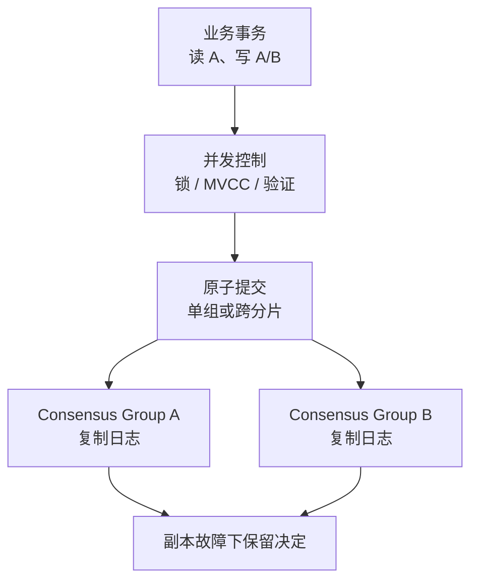

#### Raft 不自动提供数据库可串行化

Raft 可以让一个复制状态机对命令顺序达成一致。

若所有事务都作为完整命令进入同一个确定性状态机，并按日志顺序执行，那么上层可能获得串行语义；但这来自“命令边界 + 状态机执行规则 + 读协议”的组合，不是只要库里出现 Raft 就自动成立。

多 Raft Group 数据库还需要处理：

- 跨分片依赖和并发控制；
- 原子提交；
- 读时间戳或一致快照；
- Coordinator 故障与恢复；
- 事务重试和结果未知；
- 外部副作用。

#### Serializable 也不必依赖分布式共识

单机数据库可以用锁或 MVCC 提供可串行化事务，却没有任何跨节点共识。

这再次说明二者不在同一个定义维度。

#### 2PC 不是 Consensus

两阶段提交解决参与者对一个事务 commit/abort 的原子决定传播。

经典 2PC 在 Coordinator 失联时可能阻塞；共识协议解决的容错决定问题不同。生产数据库可能让事务记录、Coordinator 状态或每个分片自身由共识组复制，但“用了 2PC”与“用了 Raft”仍是两个需要分别审查的事实。

## 6. 给 API 写一致性契约，而不是写“strong”

一个可以评审和测试的 API 契约至少回答以下问题。

### 操作与对象

- 抽象对象是什么：寄存器、集合、队列、余额、订单状态机？
- 每个操作的顺序规范是什么？
- CAS 的比较对象是否包含版本、值或二者？
- 批量 API 是 all-or-nothing，还是逐项成功？

### 原子范围

- 单 Key、单分区、单表、整个数据库还是跨服务？
- 事务内部读取是否来自同一快照？
- 索引、缓存、消息和审计日志是否属于提交边界？

### 顺序保证

- 保留单客户端程序顺序吗？
- 保留因果依赖吗？
- 保留非重叠操作的现实时间顺序吗？
- 事务只可串行化，还是严格可串行化？

### 读取模式

- `linearizable`、`snapshot`、`bounded-stale`、`local` 各自含义是什么？
- 默认模式是什么？
- 客户端能否传入 minimum version 或 snapshot token？
- 无法满足版本要求时等待多久，随后返回什么错误？

### 确认与失败

- ACK 表示写到 Leader 内存、WAL、法定副本，还是已经应用？
- 超时是明确失败还是结果未知？
- 重试是否需要 idempotency key？
- serialization failure、not-leader、stale-token 怎样区分？

### 生命周期

- Session token、事务 ID、request ID 保留多久？
- 故障转移、备份恢复、区域迁移后是否仍有效？
- 老客户端缺少新字段时采用什么语义？

一段合格的契约可以写成：

> `compareAndSet` 在单个配置 Key 范围内线性一致。成功响应表示新版本已提交到当前法定副本；超时返回 `outcome_unknown`，客户端必须用 request ID 查询结果。普通 `GET` 默认走可能落后 2 秒的区域副本；携带 `minVersion` 时，服务等待最多 300 ms，无法满足则返回 `409 replica_too_stale`，不静默读取更旧版本。

这比“我们的配置中心强一致、高可用”多得多，也更容易验证。

## 7. 用 History 验证一致性契约

### History Checker 怎样寻找线性化顺序

线性一致检查器拿到并发 History 与顺序对象模型，尝试寻找一个合法线性化：

1. 选择当前已经 invocation、但尚未违反 real-time precedence 的候选操作；
2. 把它应用到抽象模型；
3. 检查实际 response 是否与模型结果匹配；
4. 递归探索其余操作；
5. 若所有分支都失败，输出不能线性化的最小或较小反例。

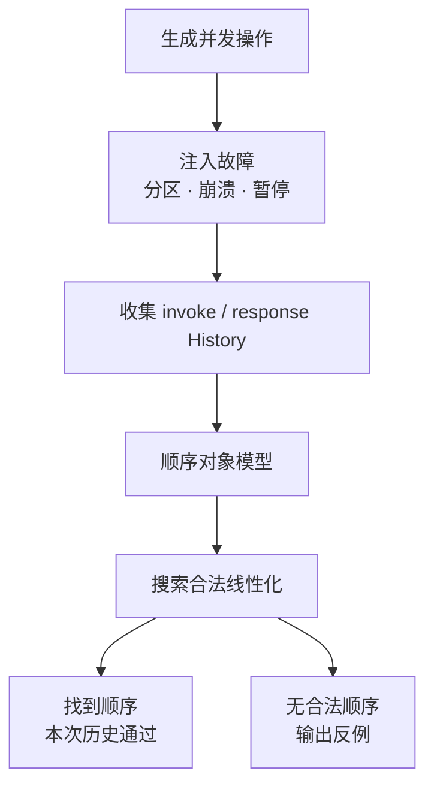

通用检查的搜索空间会随并发与结果未知迅速膨胀。

实战中常用以下办法控制复杂度：

- 只使用少量 Key 和小值域；
- 采用 register、set、queue 等有明确顺序规范的数据类型；
- 按互不相关的 Key 拆分历史，利用线性一致的 locality；
- 限制同时 pending 的操作数量；
- 缩短单 Key 的测试窗口，同时让完整测试覆盖长期变更；
- 使用唯一值避免多个相同写造成歧义；
- 保存原始 History，允许换检查算法后重新分析。

Jepsen 的 Knossos 用顺序模型检查线性一致历史；Porcupine 一类工作利用可组合性和分区缩小搜索。工具名不是正确性的来源，关键仍是 History 完整、模型准确、错误分类没有撒谎。

### 事务历史不能直接套单寄存器 Checker

多对象事务要记录每个事务内观察到的版本和提交结果，再推导依赖关系。

例如 append workload 可以让每个写产生唯一元素：

```text
T1: read x=[1]; append x=2; commit
T2: read x=[1,2]; append y=7; commit
```

观察结果能帮助推断：

- 哪个事务读到了哪个版本；
- 写写版本顺序；
- 读写 anti-dependency；
- 这些边是否构成 Adya 定义中的异常环；
- 是否存在违反现实时间的严格可串行化反例。

Elle 的方法通过精心设计数据类型和操作，从客户端可见结果推断依赖图，再给出具体异常，而不是只返回“约束求解失败”。

但任何黑盒 Checker 都有边界：

- 没有观察到的内部版本可能无法推断；
- predicate read 与 phantom 更难建模；
- 客户端驱动器可能改写事务或自动重试；
- 数据库返回成功之前，连接层可能已经超时；
- 检查到合法 History 只能说明这次执行没有找到反例，不能证明所有执行正确。

因此 History Checking 是强有力的反例搜索，不是一次通过即可颁发数学证明。

### 怎样构造一份可信的测试 History

#### 每次逻辑操作必须有唯一身份

记录：

```text
runId / processId / sessionId / operationId / attemptId
```

`operationId` 标识业务上的一次逻辑请求，`attemptId` 标识超时后的具体发送尝试。否则无法区分服务端重复执行与客户端主动创建的两个相同写。

#### 区分三种完成状态

- `ok`：系统明确承诺操作成功；
- `fail`：系统明确承诺操作没有生效或事务已中止；
- `info/unknown`：客户端无法判断是否生效。

把 timeout 一律记成 `fail` 会制造错误历史：Checker 可能删掉其实已经提交的写，并把随后的读取误判成“凭空出现的值”。

#### 记录请求边界，而不是只抓服务端日志

线性一致的 real-time precedence来自客户端可观察的 invocation 与 response。

只记录 Leader apply 时间会漏掉：

- 响应在网络中丢失；
- 客户端超时后重试；
- 旧 Leader 晚到的响应；
- 负载均衡路由变化；
- 客户端已经观察到的先后关系。

#### 故障要与 History 同一时间线关联

至少覆盖：

- Leader crash 与重启；
- 双向和单向网络分区；
- 丢包、延迟和乱序；
- 磁盘 force 失败或写入截断；
- 进程长暂停；
- 成员变更、扩缩容与快照安装；
- 只读副本落后；
- 客户端连接复用与 DNS/负载均衡切换。

故障日志用于解释反例和复现，不应被 Checker 当作替系统豁免错误的理由。

### 五个最值得放进回归测试的反例

1. **非重叠旧读**：初始为 0，`write(1)` 已成功返回，后发起的 `read()` 仍返回 0；它直接反驳线性一致。
2. **CAS 双赢**：初始为 0，两个并发 `CAS(0, 1)` 与 `CAS(0, 2)` 都返回成功；寄存器顺序规范至多允许一个成功。
3. **跨 Key 部分提交**：转账声称原子提交，却观察到 A 已扣款、B 未入账；这要用事务原子性或严格可串行化测试，而非单 Key Checker。
4. **Write skew**：两个事务从同一快照确认约束成立，各写不同记录并都提交，最终共同破坏约束；它区分 Snapshot Isolation 与 Serializability。
5. **会话读倒退**：先读到 version 9，随后读到 version 7；承诺 monotonic reads 时它是反例，只承诺任意陈旧读时则可能合法。

同一执行结果是否错误，完全取决于公开模型。这正是一致性契约必须先于测试的原因。

### 监控能发现风险，但不能单独证明一致性

生产监控至少应显式暴露四组证据：

- **复制与应用**：Leader commit index、各副本 match/applied index、lag 的版本数与持续时间、snapshot/replay 进度、term、epoch 与 Leader；
- **读取**：read mode、served-by replica、snapshot version、minimum version，以及因副本过旧产生的等待、拒绝和会话降级；
- **事务**：commit、abort、serialization failure、冲突重试、长事务、跨分片 prepare/commit、outcome unknown 的查询闭环；
- **History 采样**：按 request ID 保存 invoke/response 和版本依赖，在变更窗口提高采样率，并把反例关联到部署、拓扑和故障事件。

指标可以暴露“副本落后”“冲突突然增加”或“旧 Leader 仍在响应”，却不能仅凭 `replication_lag=0` 证明所有历史线性一致。协议实现可能在零 lag 时仍违反 ACK、读屏障或 epoch 规则。

## 8. 从业务选择模型，并写成可证伪的契约

### 一张决策表：业务到底需要哪一种保证

| 场景                 | 常见最低起点                 | 仍需补充的问题               |
| -------------------- | ---------------------------- | ---------------------------- |
| 分布式锁所有权       | 线性一致 CAS + fencing       | Lease 过期、旧持有者外部写入 |
| 主节点指针           | 线性一致读写                 | ACK、epoch、故障转移读屏障   |
| 银行转账             | 可串行化或严格可串行化事务   | 持久性、幂等、外部清算       |
| 社交动态跨区域读取   | 因果一致或会话保证           | 冲突合并、陈旧上界           |
| 用户刚修改自己的资料 | Read Your Writes             | token 生命周期与跨设备传播   |
| 离线报表             | 指定一致快照                 | 数据新鲜度和快照保留         |
| 搜索索引             | 最终一致 + 可观测 lag        | 删除传播、重建和回源策略     |
| Kafka 消费投影       | 分区顺序 + 幂等 + checkpoint | 跨分区事务与外部副作用       |

这张表不是自动选型器。同一个系统往往同时提供多种读取模式：账户写入用严格事务，用户详情页要求 read-your-writes，公共统计走有界陈旧副本，离线分析固定 snapshot。正确做法是让模式成为 API 的一部分，而不是在实现深处隐式变化。

### 把模型写成可证伪的契约

线性一致约束单次对象操作并保留现实时间；顺序一致保留每个进程的程序顺序，却可以重排不同进程间的现实先后；可串行化约束整个事务但不自动保留现实时间；严格可串行化才把事务串行等价与现实时间结合起来。

因果一致、最终一致、Read Your Writes 与 Monotonic Reads 也不是“完全没一致性”。它们保留不同关系，换取故障期间的可用性、跨区域延迟或离线能力。

真正专业的设计文档不写“我们选择强一致”，而会写：哪些调用属于同一个对象或事务，哪些 History 被允许，哪些先序必须保留，ACK 承诺到哪里，结果未知怎样恢复，读取能落后多少，以及什么测试可以构造出反例。

理解了这套语言，下一步才能正确阅读 [Raft 的选举、提交与线性一致读](/signal-grid-blog/posts/raft-consensus-leader-election-log-replication-and-safety/)，理解 [ZooKeeper 为什么写入有序但普通读仍可能旧](/signal-grid-blog/posts/zookeeper-coordination-consistency-and-recipes/)，也能在 [Kafka](/signal-grid-blog/posts/kafka-distributed-log-kraft-consumers-and-transactions/) 中区分分区顺序、事务原子性、消费者位置和外部 exactly-once 的边界。

## 原始论文与官方资料

- Maurice Herlihy、Jeannette Wing：[Linearizability: A Correctness Condition for Concurrent Objects](https://www.cs.cmu.edu/~wing/publications/HerlihyWing90.pdf)
- Leslie Lamport：[How to Make a Multiprocessor Computer That Correctly Executes Multiprocess Programs](https://lamport.azurewebsites.net/pubs/multi.pdf)
- Atul Adya：[Weak Consistency: A Generalized Theory and Optimistic Implementations for Distributed Transactions](https://dsf.berkeley.edu/cs286/papers/adya-phd1999.pdf)
- Atul Adya、Barbara Liskov、Patrick O’Neil：[Generalized Isolation Level Definitions](https://eecs.umich.edu/courses/cse584/static_files/papers/isolation_level.pdf)
- Philip Bernstein、Nathan Goodman：[Concurrency Control in Distributed Database Systems](https://dsf.berkeley.edu/cs286/papers/bernstein-csur1981.pdf)
- Douglas Terry 等：[Session Guarantees for Weakly Consistent Replicated Data](https://www.cs.cornell.edu/courses/cs734/2000FA/cached%20papers/SessionGuaranteesPDIS_1.html)
- Wyatt Lloyd 等：[Don’t Settle for Eventual: Scalable Causal Consistency for Wide-Area Storage with COPS](https://www.cs.princeton.edu/~mfreed/docs/cops-sosp11.pdf)
- Seth Gilbert、Nancy Lynch：[Brewer’s Conjecture and the Feasibility of Consistent, Available, Partition-Tolerant Web Services](https://groups.csail.mit.edu/tds/papers/Gilbert/Brewer6.pdf)
- Peter Bailis 等：[Highly Available Transactions: Virtues and Limitations](https://www.vldb.org/pvldb/vol7/p181-bailis.pdf)
- Google Research：[Spanner: Google’s Globally-Distributed Database](https://research.google/pubs/spanner-googles-globally-distributed-database-2/)
- Google Cloud：[Spanner: TrueTime and External Consistency](https://cloud.google.com/spanner/docs/true-time-external-consistency)
- PostgreSQL 18：[Transaction Isolation](https://www.postgresql.org/docs/18/transaction-iso.html)
- Jepsen：[Consistency Models](https://jepsen.io/consistency/models) · [Checker Documentation](https://jepsen-io.github.io/jepsen/jepsen.checker.html)
- Kyle Kingsbury、Peter Alvaro：[Elle: Inferring Isolation Anomalies from Experimental Observations](https://www.vldb.org/pvldb/vol14/p268-alvaro.pdf)
