“给每台机器装上 NTP，然后比较时间戳”听起来像是分布式系统里最自然的排序方案。可一旦网络变慢、时钟回拨、进程暂停或节点重启，它很快就会制造一批难以解释的问题：响应时间变成负数、后发生的写入带着更小的时间戳、两个节点都认为 Lease 仍有效、超时被当成宕机证明，或者一条已经提交的业务记录被“时间更晚”的旧数据覆盖。

根因不是时钟不够精确，而是我们把几种完全不同的问题都叫作“时间”：

- 现在是几点，用于审计、展示和跨系统对齐；
- 一段操作经过多久，用于超时、延迟和速率控制；
- 事件之间有没有因果关系，用于冲突检测与状态合并；
- 所有参与者最终采用什么唯一顺序，用于日志提交、选主和状态机复制。

这些问题需要的工具分别是墙钟、单调时钟、逻辑时钟，以及 sequencer 或共识协议。它们可以组合，却不能互相冒充。

本文是“有状态系统可靠性”学习路径的 Chapter 03。建议先读 [Chapter 01：有状态服务的高可用架构](/signal-grid-blog/posts/high-availability-stateful-service/) 建立故障模型，再由 [Chapter 02：WAL 到底保证什么](/signal-grid-blog/posts/write-ahead-log-durability-and-crash-recovery/) 理解本地持久前缀。本文把单机带入多节点世界：先拆开物理时间、因果顺序、超时与 Lease，下一章再用 [Chapter 04：Raft 论文精读](/signal-grid-blog/posts/raft-consensus-leader-election-log-replication-and-safety/) 说明多数副本怎样形成不可被未来 Leader 推翻的提交顺序。

本文以 Lamport 1978 年论文、NTPv4 RFC、JDK 25 API、Hybrid Logical Clock 原论文、Spanner/TrueTime 论文和 Gray–Cheriton Lease 论文为主要依据。示例是为解释不变量而重写的教学模型，不代表任一产品的完整实现。

## 1. 先问清楚：你要“时间”回答什么

一套系统通常同时需要至少五种时间语义。选错工具时，代码往往仍能运行，只是在故障发生后无法证明正确。

| 问题 | 真正需要的语义 | 合适工具 | 不能直接使用 |
| --- | --- | --- | --- |
| 这条审计记录何时发生 | 接近 UTC、可跨系统解释 | `Instant`、同步墙钟、时区元数据 | `nanoTime()` |
| 这个调用是否超时 | 同一进程内不回退的经过时间 | 单调时钟、deadline | `currentTimeMillis()` 差值 |
| A 是否可能影响了 B | 因果偏序 | happened-before、Vector Clock | 仅比较墙钟毫秒数 |
| 并发写怎样稳定合并 | 显式冲突或确定性裁决 | Version Vector、HLC + 规则、业务合并 | 裸 LWW 时间戳 |
| 哪条命令已成为权威历史 | 全员采用的唯一提交顺序 | 单写者序列、Raft/Paxos/ZAB | Snowflake ID、Lamport Clock |

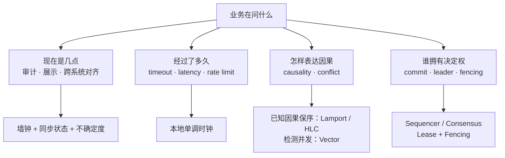

最重要的第一步不是选择 NTP、HLC 还是 Raft，而是把 API 合同写成一句可验证的话。例如：

- “日志时间用于人类审计，允许与真实 UTC 偏差 100 ms，不参与冲突裁决；超界或失联时节点标记为 unhealthy，并停止签发依赖该误差界的时间戳”；
- “请求在接收后的本地单调时间 200 ms 内必须完成，否则返回 deadline exceeded”；
- “同一订单的版本由 `(term, sequence)` 排序，墙钟只用于展示”；
- “只有携带不小于存储端已接受 fencing token 的写入才能改变状态”。

只写一个模糊的 `timestamp` 字段，会让后续每一层都自行猜测它的语义。

## 2. 物理时钟为什么天然带误差

计算机并没有直接读取“宇宙当前时间”。它依靠振荡器产生周期信号，再由硬件计数器、内核计时层、时间同步守护进程和运行时 API 把计数映射成时间。

这条链路里有几个常被混用的词：

- **offset**：某一时刻，本地时钟读数与参考时间的差；
- **frequency error**：本地时钟走得比理想时间快或慢多少，常以 ppm 表示；
- **drift / skew**：不同论文用法并不完全统一，工程文档必须明确是在说速率误差、速率误差的变化，还是两台钟的读数差；
- **resolution**：时钟读数最小可分辨的步进；
- **precision**：重复测量的结果有多集中；
- **accuracy**：读数距离真实参考时间有多近。
- **read overhead**：读取时钟本身需要多少 CPU 时间以及会扰动多少热路径。

“API 返回纳秒”只说明单位或表示精度，不说明每纳秒都会变化，更不说明它距离 UTC 只有 1 ns。

把真实时间写成 `t`，机器时钟写成 `C(t)`。一种常见故障模型会假定时钟速率受界：

```text
1 - ρ <= dC(t) / dt <= 1 + ρ
```

`ρ` 是最大相对频率误差。如果某节点断开时间源 100 秒，且最坏速率误差是 100 ppm，仅振荡器误差就可能累积约 10 ms。温度、电源、晶振老化、虚拟机迁移和宿主机暂停都会影响实际结果。

物理时钟因此从来不是一个裸数，而应被理解成：

```text
读数 + 来源 + 最近同步时间 + 估计偏差 + 不确定度 + 健康状态
```

## 3. 墙钟与单调时钟不是同一种 API

### 3.1 墙钟回答“日历上的什么时候”

墙钟（wall clock）尝试映射到 UTC 或某个民用时间尺度。它适合：

- 审计日志与用户界面；
- 跨系统粗粒度关联；
- 业务日历、结算日和证书有效期；
- 数据保留策略中的人类时间合同。

为了追上正确时间，系统可能直接 **step** 到新读数，也可能通过 **slew** 调整走时速率。step 可以向前跳，也可能向后跳；slew 不产生同样的瞬间跳变，却会让“一秒”在调整期内略快或略慢。闰秒与不同厂商的 smear 策略也会让两个都自称 UTC 的系统在窗口内出现差异。

因此，墙钟不能直接用来测经过时间：

```java
// 错误：系统时间回拨会得到负数，快进会制造虚假超时。
long startedAtMillis = System.currentTimeMillis();
doWork();
long elapsedMillis = System.currentTimeMillis() - startedAtMillis;
```

### 3.2 单调时钟回答“经过了多久”

单调时钟的核心合同是在同一时钟域内不倒退。它适合：

- elapsed time；
- timeout 与 deadline；
- 重试退避；
- 局部速率限制；
- 延迟测量。

JDK 25 对 `System.nanoTime()` 的定义很克制：它来自 JVM 的高分辨率时间源，只能测经过时间；原点任意，甚至可能是负数；不同 JVM 的原点通常不同；“纳秒”不代表纳秒分辨率。正确比较方式是做差：

```java
long startedAt = System.nanoTime();
long timeoutNanos = Duration.ofMillis(200).toNanos();

while (!completed()) {
    if (System.nanoTime() - startedAt >= timeoutNanos) {
        throw new TimeoutException("local monotonic deadline exceeded");
    }
    Thread.onSpinWait();
}
```

不要把 `nanoTime()` 写入数据库后拿到另一进程比较，也不要把它转成日期。它只在同一个 JVM 实例的相减结果中有意义。至于挂起期间是否继续计时、底层选择哪一种 OS clock，Java SE 合同没有给出跨平台的统一承诺；依赖这一点的系统必须验证目标 JDK、操作系统和虚拟化环境。

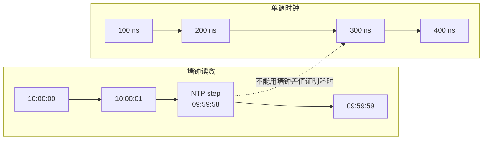

### 3.3 `Instant` 也不天然单调

`Instant.now()` 或注入的 `Clock` 很适合表达可序列化的时间点，但 `java.time` 并不承诺系统时钟亚秒级准确、单调或平滑。`Clock` 的重要价值之一是**把时间作为依赖注入**，使业务日历和过期逻辑可测试；它不会把墙钟变成单调时钟。

一个清晰的 Java 边界可以显式分成两套接口：

```java
interface TimeSource {
    Instant wallNow();          // 可审计时间点，不用于耗时
    long monotonicNanos();      // 本进程时间域，只用于做差
}
```

类型仍然都是数字，语义隔离必须由命名、封装和代码审查来维护。

### 3.4 UTC、闰秒与 smear 不能想当然

民用时间本身也不是一条毫无折点的数学直线。UTC 可能插入闰秒，不同平台又可能选择 step、重复某个秒，或在一个窗口内调整走时速率进行 smear。

Java Time-Scale 的规范描述采用 UTC-SLS 思路：在有闰秒的日期，把差异摊入当天最后 1,000 秒，使 API 表面仍是每天 86,400 个秒。但同一份 JDK 文档同时明确：实现**不必真的执行 UTC-SLS 调整**，也不必提供平滑、单调或亚秒准确的系统时钟。规范中的时间尺度不能被误读成“所有 JVM 都会自动用同一种方式处理闰秒”。

Google Public NTP 当前使用的是另一种 24 小时线性 smear。UTC-SLS 的 1,000 秒窗口、Google 的 24 小时窗口和不做 smear 的 UTC 源不是同一个时间尺度；在同一客户端混用 smeared 与 non-smeared 时间源，会把策略差异当成时钟错误。跨系统协议必须记录并统一所采用的时间尺度，而不是只写一个 `epochMillis` 就认为含义完全相同。

## 4. NTP 得到的是估计与误差，不是上帝视角

NTP 客户端 A 与服务端 B 的一次基本交换包含四个时间戳：

- `t1`：A 发送请求；
- `t2`：B 收到请求；
- `t3`：B 发出响应；
- `t4`：A 收到响应。

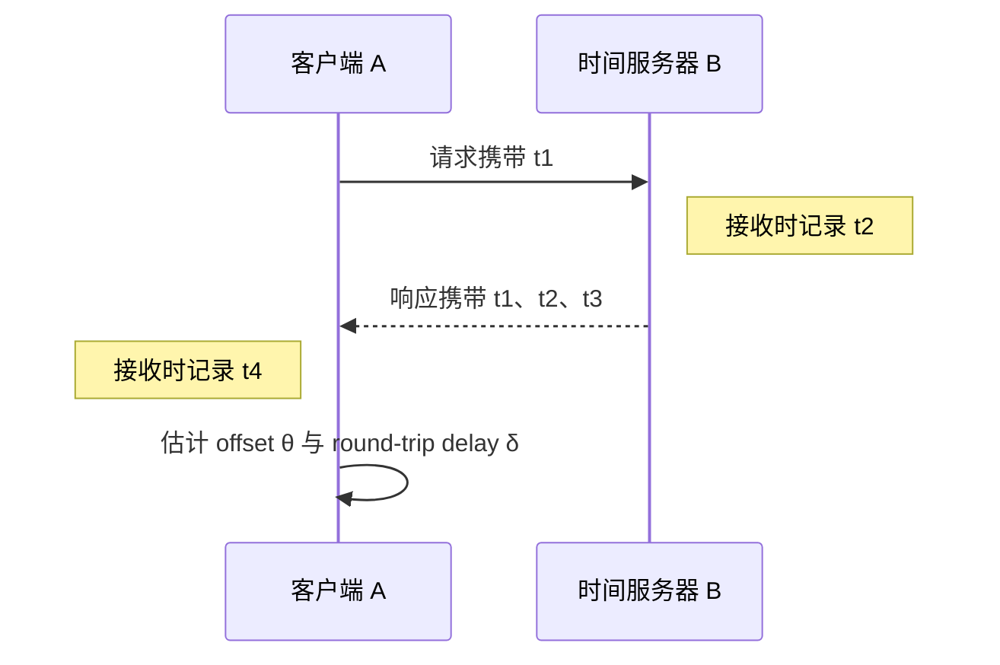

RFC 5905 给出的基本估计是：

```text
θ = 1/2 × [(t2 - t1) + (t3 - t4)]
δ = (t4 - t1) - (t3 - t2)
```

其中 `θ` 是 B 相对 A 的时钟偏差估计，`δ` 是扣除 B 处理时间后的往返延迟估计。设真实 offset 为 `θreal`，正向与反向延迟分别为 `df`、`dr`，则四时间戳估计满足：

```text
θestimated = θreal + (df - dr) / 2
```

这揭示了很强的现实限制：请求和响应路径延迟不一定对称。若去程排队 2 ms、回程排队 80 ms，客户端仅凭四个时间戳无法知道不对称部分该归到哪一边，offset 就会带有约 39 ms 的系统性误差。

成熟的 NTP 实现不会只信一包数据。它会过滤样本、组合多个时间源、维护 offset、delay、dispersion 与 jitter，并通过 clock discipline 调整本地时钟。这里有三条重要边界：

1. **stratum 表示到参考时钟的层级，不是准确度等级。** 网络质量差的低 stratum 源可能比路径稳定的更高 stratum 源表现差。
2. **同步是一段持续控制过程。** 一次请求成功不能证明之后一直准确；失去时间源后，不确定度会随本地时钟漂移增长。
3. **网络时间服务也是安全边界。** 错误或恶意时间源能影响证书、审计、Lease 和数据库排序；生产环境需要多源交叉验证、认证机制和异常隔离。

PTP、硬件时间戳和同机房专用网络可以显著缩小误差，却仍然是在某个故障模型下提供误差上界，不会产生零不确定度的全局真时钟。

## 5. “接收发生在发送之前”并不矛盾

假设节点 A 的墙钟比真实时间快 80 ms，节点 B 慢 40 ms：

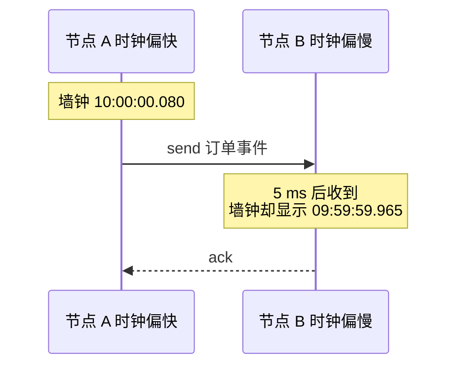

物理上，接收当然发生在发送之后；记录出来的墙钟时间却更小。这不是因果倒置，而是两只钟没有共享同一个准确坐标系。

即使所有时钟误差都小到 1 ms，两个相隔 100 μs 的并发事件也仍无法仅凭时间戳可靠排序。同步精度越高，只是缩小“无法确定”的窗口，不是消除它。

所以必须区分：

- **物理时间顺序**：真实世界中哪个先发生，但系统通常只能估计；
- **因果顺序**：一个事件是否有可能影响另一个，可由系统内可观察事件定义；
- **人工全序**：为了确定性处理，协议选择的一个总顺序；
- **提交顺序**：通过权威 sequencer 或共识确定、未来不能被推翻的前缀。

## 6. Lamport 的 happened-before：先定义因果，再谈时钟

Lamport 论文没有先假设一只完美钟，而是从系统能观察到的事件定义严格偏序 `→`：

1. 同一进程中，若事件 `a` 在 `b` 之前执行，则 `a → b`；
2. 若 `a` 是某条消息的发送，`b` 是同一条消息的接收，则 `a → b`；
3. 若 `a → b` 且 `b → c`，则 `a → c`。

如果 `a ↛ b` 且 `b ↛ a`，二者就是并发事件。这里的“并发”不是要求 CPU 在同一纳秒执行，而是说：在已发生的程序顺序和消息链中，没有证据表明一方可以影响另一方。

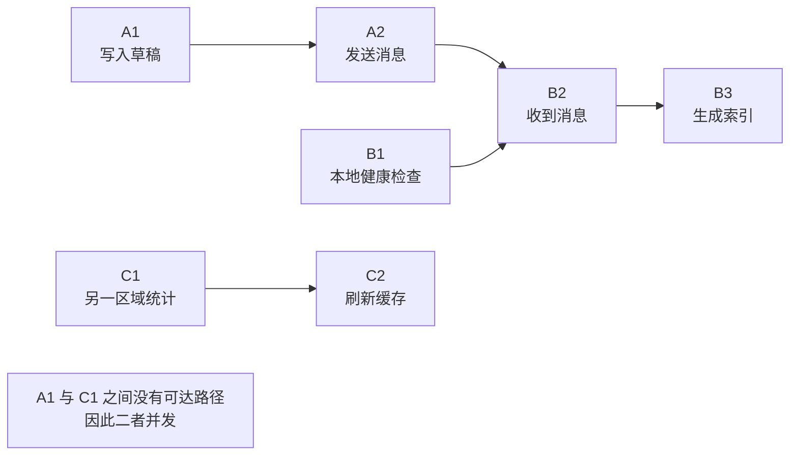

图中 `A1 → B3` 可以通过程序顺序与消息边传递得到；`A1` 与 `C1` 没有可达路径，因此是并发。把它们强行按墙钟排出先后，可能对日志展示有用，却没有新增因果事实。

这和 Java Memory Model 的 happens-before 共享“用可观察边建立偏序”的思想，但不是同一个形式系统。JMM 讨论线程内程序顺序、synchronizes-with 与内存可见性；Lamport 这里讨论分布式进程事件和消息。不能拿一个模型里的边，未经证明地替代另一个模型。

## 7. Lamport Clock：因果发生则数字一定增大

每个进程维护一个整数逻辑钟 `L`：

1. 本地事件发生前递增 `L`；
2. 发送消息时携带当前 `L`；
3. 收到携带 `Lm` 的消息时，设置 `L = max(L, Lm) + 1`。

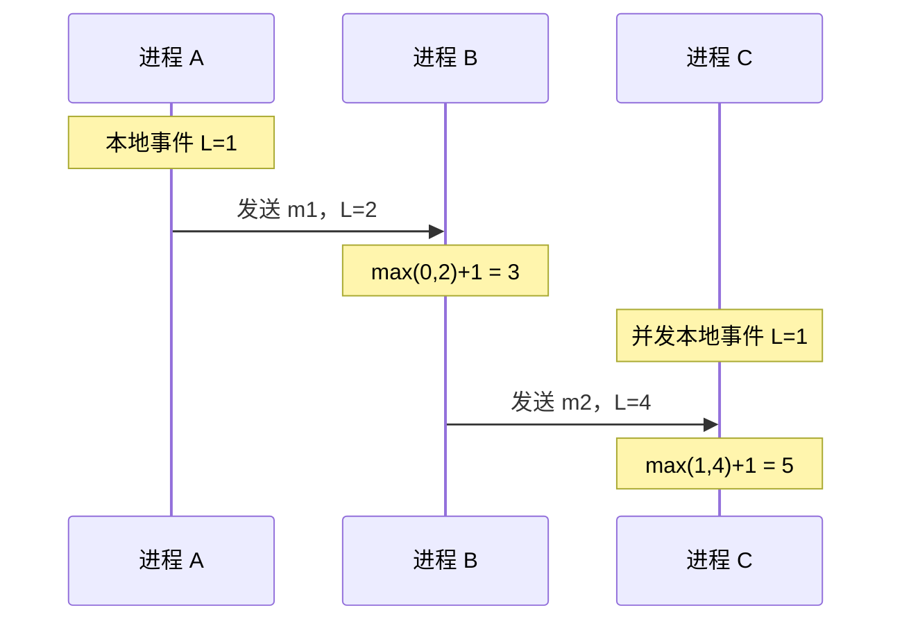

它保证 Clock Condition：

```text
a → b  =>  L(a) < L(b)
```

但逆命题不成立：

```text
L(a) < L(b)  不推出  a → b
```

两个完全并发的事件也可能得到 7 和 12。Lamport Clock 只保留“因果事件不能倒序”的必要条件，不负责识别所有并发关系。

如果系统再用 `(L, nodeId)` 打破相同逻辑值，就能得到一个确定的全序。这个全序是 happened-before 的一个线性扩展：因果边不会被颠倒，但并发事件由 nodeId 人为裁决。它适合做确定性排序或互斥协议的一部分，却仍不代表物理先后，也不代表该事件已经被多数副本提交。

## 8. Vector Clock：用不可比性看见并发

Vector Clock 为每个参与者维护一个分量。进程 `Pi`：

- 本地事件前递增自己的 `V[i]`；
- 发送消息时携带整个向量；
- 接收时先逐分量取 `max(local, remote)`，再递增自己的分量。

向量比较定义为：若所有分量 `Va[k] <= Vb[k]`，且至少一个严格小于，则 `Va < Vb`。在标准消息传递模型中：

```text
Va < Vb        表示 a 因果先于 b
Va 与 Vb 不可比 表示两者并发
```

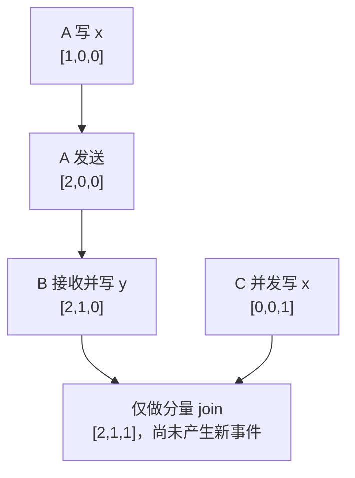

图中的 `[2,1,0]` 与 `[0,0,1]` 互不可比，因此并发；`[2,1,1]` 只是它们的逐分量 join。如果进程 B 随后把合并结果写成一个新事件，还要递增 B 自己的分量，得到 `[2,2,1]`。这对多主复制很有价值。收到两个版本时：

- 一个向量小于另一个，较小版本的历史已经被较大版本包含；
- 两个向量不可比，系统确实遇到了并发更新，应保留 siblings、调用业务合并或用明确的冲突策略裁决。

代价是元数据大小与参与者数相关。动态成员、离线客户端、节点重建、分片迁移和垃圾回收都会让“谁占一个分量、何时可忘记”变成协议问题。实际系统常用 version vector、dotted version vector 或压缩因果上下文；它们与“每个进程每个事件都有一维”的教科书 Vector Clock 相关，但不能只换名字就认为语义完全相同。

## 9. Hybrid Logical Clock：让时间戳接近墙钟，又不破坏因果

Lamport Clock 很适合因果排序，但数字 8,421 对运维和 MVCC 时间范围查询没有直觉。裸墙钟可读，却可能回拨并颠倒因果。Hybrid Logical Clock（HLC）把二者组合成 `(l, c)`：

- `l` 尽量跟随本地物理时钟；
- `c` 在物理部分没有前进、多个事件得到相同物理分量或收到未来值时提供逻辑增量。

一种典型更新规则如下。设当前状态为 `(l, c)`，本地物理读数为 `pt`：

```text
本地事件或发送：
  newL = max(l, pt)
  if newL == l: c = c + 1
  else:         c = 0
  l = newL
```

收到远端 `(lm, cm)` 时：

```text
newL = max(pt, l, lm)

if newL == l and newL == lm: c = max(c, cm) + 1
else if newL == l:            c = c + 1
else if newL == lm:           c = cm + 1
else:                          c = 0

l = newL
```

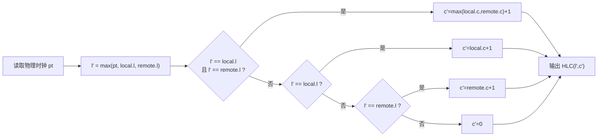

上图只描述“收到远端 HLC”的分支；本地事件与发送仍使用前一段较简单的规则。HLC 的关键收益是：在物理时钟偏差有界、输入时间戳可信且系统限制远未来值的前提下，时间戳可以保持接近物理时间，同时满足 `a → b` 时 `HLC(a) < HLC(b)`。如果这些前提失效，一个未来值就可能长期抬高 `l`，不能再宣称它“接近现在”。但 HLC 没有免费提供以下能力：

- 不能像 Vector Clock 一样仅凭两个 HLC 判断它们是否并发；
- 不能证明墙钟误差小于某个值，物理部分仍依赖同步质量；
- 不能自动产生全局唯一 ID，仍需 node/sequence 或其他去重域；
- 不能替代事务协议、复制确认或共识；
- 不能无条件接受来自客户端的“远未来”时间戳，否则一个异常节点会把逻辑时间推得很远。

生产实现还要限制最大可接受 clock offset、逻辑计数器溢出、持久化与重启行为，并明确比较、编码和版本兼容规则。

## 10. TrueTime：把“不知道”变成显式区间

普通时间 API 返回一个点：`now = 12:00:00.123`。这个界面掩盖了一个事实——系统并不知道真实绝对时间恰好是哪一刻。Spanner 的 TrueTime 选择返回区间：

```text
TT.now() = [earliest, latest]

并保证：earliest <= 调用发生时的真实绝对时间 <= latest
```

论文把区间半宽记为 `ε = (latest - earliest) / 2`；完整区间宽度是 `2ε`。时间源刚同步完成时区间可以较窄；同步间隔越长、网络越不稳定、参考源失效越多，保守上界应越宽。**正确性依赖不确定度上界诚实，性能依赖它足够小。**

Spanner 为读写事务选择提交时间戳 `s` 时，核心步骤可概括为：

1. 各参与者先取得锁、选出 prepare timestamp，并把 prepare 状态写入各自 Paxos 组；
2. 协调者收齐 prepare 后选择 `s`：它不小于所有 prepare timestamp 和提交请求到达后的 `TT.now().latest`，并严格大于该协调者 Leader 先前分配的时间戳；
3. 协调者通过 Paxos 持久化 commit decision；跨 Paxos 组事务才需要两阶段提交，单组事务可以省去这层 2PC；
4. 在协调者副本 apply 该 commit record、释放对外可见结果并响应客户端之前，等待到 `TT.after(s)` 为真；
5. 此时才能证明 `s` 已经处于真实绝对时间的过去。

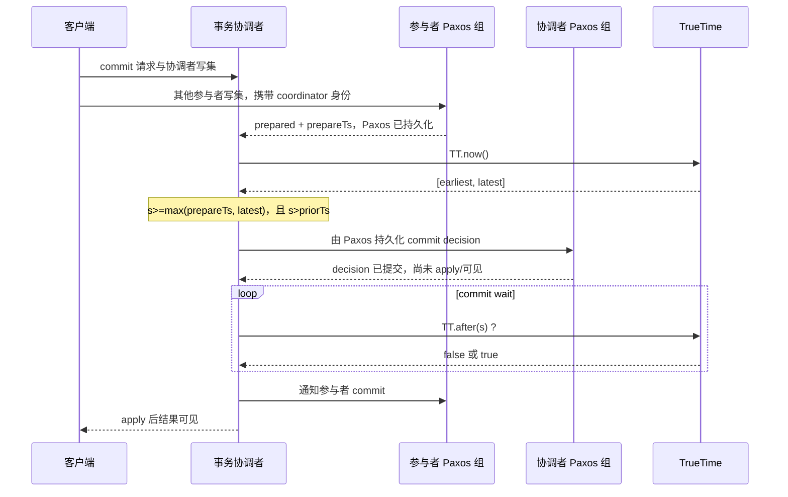

这使事务满足 external consistency：若事务 `T1` 的提交响应已经完成，之后事务 `T2` 才开始，那么 `timestamp(T1) < timestamp(T2)`。

但不要把它简写成“原子钟让数据库线性一致”：

- TrueTime 提供可信的不确定区间，不负责复制数据；
- Paxos 负责副本一致的日志，不负责事务隔离；
- 两阶段锁与 MVCC 负责事务隔离和历史版本，跨 Paxos 组事务再由两阶段提交协调；
- commit wait 把提交时间戳与真实时间先后联系起来。

这些职责必须由相应协议或等价机制承担，但并非每类事务都经过每一层；例如单 Paxos 组事务无需跨组 2PC。无论如何，都不能从一只更准的钟直接推出外部一致性。HLC 与 TrueTime 也不是替代关系：HLC 通过逻辑部分保持因果单调，TrueTime 暴露有界物理时间区间；它们解决的假设和承诺不同。

## 11. 时间戳排序不等于一致性

### 11.1 Linearizability 不是“按墙钟排序”

Linearizability 是一段并发 history 的性质：每个操作看起来在调用与响应之间某个瞬间原子生效，并保留互不重叠操作的现实先后。它可以由共识、锁或原子寄存器实现，并不要求参与者读取同步墙钟。

Serializability 则要求事务结果等价于某个串行顺序，不要求这个顺序符合现实先后。把 real-time precedence 也纳入事务顺序，才进入 strict serializability / 事务级 external consistency 的语境。

因此：

- “记录都有时间戳”不推出 linearizable；
- “事务可串行化”不推出后启动的事务一定排在先完成事务之后；
- “时钟误差很小”不推出协议已经形成唯一提交点。

### 11.2 Snowflake ID 不是提交证明

时间前缀 + nodeId + sequence 可以生成大致按时间增长的唯一 ID，但仍需处理：

- 节点 ID 是否被两个实例同时使用；
- 时钟回拨时是拒绝、等待、切换 epoch，还是生成错误 ID；
- 单毫秒序列耗尽；
- 节点重启后状态是否复用；
- ID 已生成但业务事务最终回滚。

ID 能回答“怎样命名”，不能回答“是否提交”“谁是 Leader”或“哪个并发更新应获胜”。

### 11.3 LWW 选的是最大时间戳，不是真实最后写

Last-Write-Wins（LWW）是一种确定性收敛规则：副本看到多个候选值时，保留排序键最大的一个。若排序键是墙钟，规则的真实含义是“最大墙钟时间戳获胜”，并非“现实中最后发生的写获胜”。

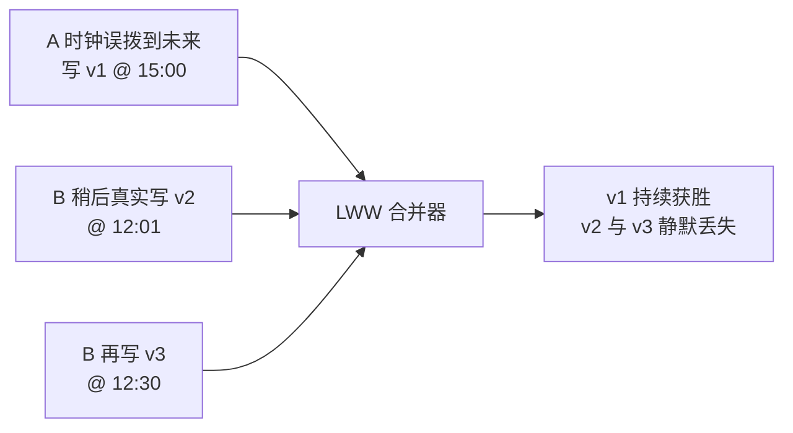

即使用 HLC 避免本节点时间回退，标量排序再配上 nodeId 等稳定 tie-breaker，也只能为并发写人为选出一个赢家；不同节点可能产生相同 `(l,c)`，HLC 本身既不保证全局唯一，也无法告诉业务“这里有两个并发意图”。如果冲突不能安全丢失，应考虑：

- 数据库事务或 compare-and-set version；
- append-only event + idempotency key；
- Vector/Version Vector 保留 siblings 后业务合并；
- 满足领域代数性质的 CRDT；
- 权威单写者或共识序列。

数据库里名为 `timestamp` 的字段也不天然是提交序。例如 PostgreSQL 的 `CURRENT_TIMESTAMP` / `now()` 表示当前事务开始时间，并在同一事务内保持不变；它不能用来推断事务提交先后或生成唯一版本。

## 12. Timeout 是停止等待，不是失败证明

在异步网络中，调用方观察不到响应，可能有很多原因：

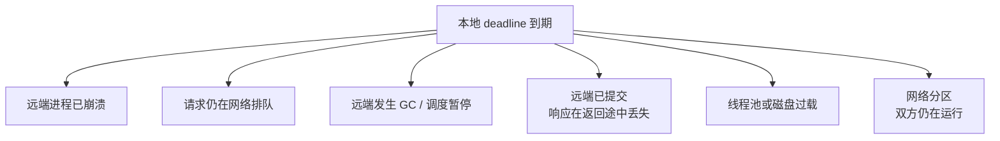

因此 timeout 只证明：

> 在调用方自己的时钟与等待策略下，截止时刻前没有观察到期望响应。

它不证明远端死亡，也不证明操作没执行。最危险的窗口是：远端已经把事务持久提交，响应尚未到达时客户端超时。客户端若换一个 requestId 盲目重试，就可能执行两次。正确接口应结合：

- 稳定的 request/idempotency key；
- 可查询的业务结果；
- 服务端持久去重；
- 明确的 `success / failed / unknown` 三态；
- 重试预算与退避。

这与 [WAL 的 force 成功但 ACK 丢失窗口](/signal-grid-blog/posts/write-ahead-log-durability-and-crash-recovery/) 是同一类不确定性。

### 12.1 Failure detector 输出“怀疑”

心跳超时本质上是 failure detector 的观测。它把“多久没收到消息”转换成“怀疑程度”或状态迁移，以帮助系统取得进展，而不是给出死亡证明。

Chandra–Toueg 用两类性质描述 failure detector：

- **completeness**：真正崩溃的进程最终会不会被怀疑；strong completeness 要求每个正确进程最终都永久怀疑每个故障进程；
- **accuracy**：正确进程会不会被误判；strong accuracy 要求从不误判，eventual strong accuracy 则允许启动或网络不稳定阶段误判，但要求某个时刻后不再怀疑正确进程。

Perfect failure detector 同时要求 strong completeness 与 strong accuracy。在纯异步系统里，“对端已崩溃”和“对端很慢、消息被无限延迟”对观察者不可区分，因此不能仅凭有限 timeout 实现这个理想合同。工程系统通常依赖 partial synchrony：系统稳定后，处理与网络延迟最终出现一个可用上界，于是 eventually perfect 一类性质才可能成立。

固定阈值 detector 只比较“距离最后一次心跳过去多久”。自适应或 accrual detector 则根据近期心跳间隔分布输出连续怀疑度，再由业务选择阈值。经典 φ-accrual 的直觉是：当前空窗在历史模型下越罕见，`φ` 越大；但它仍依赖样本窗口、分布假设与冷启动策略，不能把一个 `φ=8` 当成跨环境通用的宕机证明。

无论算法多复杂，都必须同时暴露 detector 的**输入质量**与**动作后果**：最后心跳时间、估计延迟分布、当前怀疑度、状态切换次数、误切换成本，以及新 owner 是否已经通过 quorum/epoch/fencing 真正取得权威。只有 timeout，没有代际和资源端隔离，最多只能更快地产生两个自认为是 Leader 的进程。

阈值越短：

- 故障切换更快；
- 暂停、抖动和排队更容易制造误判；
- 选举风暴、重复工作和缓存失效更多。

阈值越长则相反。没有一个脱离延迟分布、暂停上界和业务 RTO 的万能值。Raft 的随机 election timeout 主要帮助活性：误判可能触发更高任期和新一轮选举，降低可用性，但协议安全性仍来自任期、投票规则、日志匹配和多数派交集，而不是“时钟永远准确”。

### 12.2 跨服务传播 deadline，不要每跳重新发满额

假设端到端 SLO 是 500 ms：A 调 B 花了 80 ms，B 再调 C 时若重新设置 500 ms，总请求可能轻易超过 580 ms。每一跳都应继承**剩余预算**，并在本机重新建立单调 deadline。

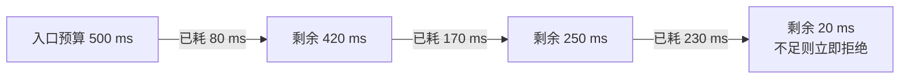

工程上还要处理网络传输耗时、预算序列化精度、负数立即过期、最大值 clamp 与取消传播。不能把某个进程的 `nanoTime()` 原值发给另一台机器比较。可持久化的业务到期点使用 `Instant` 合同；每次进程内等待则根据当前剩余预算创建本地单调 deadline。

## 13. Lease 是带假设的授权，不是“锁 + TTL”

Lease 是一份有期限的权利合同。经典文件缓存 Lease 中，服务端在 Lease 有效期内要尊重持有者的缓存权利；现代系统也用 Lease 维持一段有界领导权、Session、服务注册和临时所有权。`term` / `epoch` 是逻辑代际，Lease 是带时钟假设的限时授权，不能用 TTL 替代代际，也不能把二者混成一个字段。

安全 Lease 协议至少要回答：

1. 谁是唯一授权方，或多个授权方怎样通过共识避免重叠授予？
2. Lease 起点和终点由谁的钟计算？
3. 允许的最大 clock drift / uncertainty 是多少？
4. 持有者是否提前停止使用，授权方是否延后重新授予？
5. 授权记录、epoch 与重启恢复如何持久化？
6. 进程暂停、机器 suspend、网络分区和旧请求在途时怎样处理？

只在 Redis、ZooKeeper 或本地内存中写一个 `expiresAt`，不等于这些条件已经成立。

### 13.1 暂停会制造“双主错觉”

节点 A 获得 30 秒 Lease，然后发生 45 秒 Stop-The-World 或宿主机暂停。授权方观察 Lease 到期，把权利授给 B。A 恢复后可能继续执行已经排队的旧写，或者某条在暂停前发出的请求晚到下游。

即使 A 醒来立即检查本地时间并停止，也无法撤回已经在网络、线程池或存储队列中的请求。Lease 到期不是一束能远程杀死旧进程和旧 I/O 的光。

## 14. Fencing Token 把新旧所有者的顺序推到最终资源

解决旧 owner 外部写入的通用手段是 fencing token：每次成功取得所有权都获得一个来自权威序列的、更大的 token；**真正产生副作用的下游资源**原子记住已接受的最大 token，并拒绝更小值。

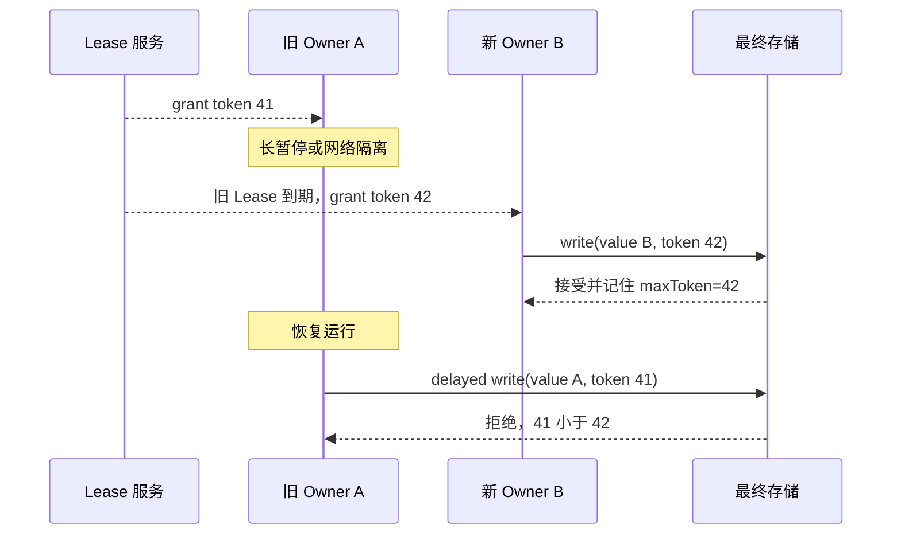

这里有四个不能省略的条件：

- token 必须来自针对**同一资源**的单调权威，例如共识 revision、持久 acquisition count，或能保证每次 ownership generation 都严格递增的专用 term/epoch；任意协议任期号不能直接拿来跨资源 fencing；
- 同一代所有重试复用同一个 token，不能每次请求随手加一；
- 下游必须把“比较 token + 写数据 + 更新 maxToken”放在同一原子边界；
- 每一个有副作用的出口都要执行 fencing，不能只在锁服务或日志里打印 token。

它的精确安全边界是：**只有当 token 42 已经在最终资源安装或被接受后，资源才有信息拒绝随后到达的 token 41。** 如果 A 的旧请求抢在 B 第一次把 42 送到资源之前抵达，资源尚未见过未来 token，仍可能接受 41。需要严格切换时，新 owner 必须先通过同一个有序网关或原子事务把 fence 推进到 42，再对外生效；这一步是 activation barrier，不能只靠 Lease 过期推断完成。

fencing 也不等于 exactly-once。同一个 token 42 的请求因超时而重试时，资源仍需 requestId、幂等键或事务约束，才能避免把同一副作用执行两次。

若对象存储、支付网关或第三方 API 不支持条件写，系统就不能声称获得了完整 fencing。此时需要代理写入、数据库事务、outbox、幂等键或补偿，并明确剩余风险。

Lease 与 fencing 的分工是：

- Lease 减少正常路径协调，帮助活性与性能；
- fencing 在旧请求晚到时守住安全性边界。

## 15. 事件时间、处理时间与确定性 Timer

数据系统里还常见三种“时间”：

| 名称 | 含义 | 典型用途 | 主要风险 |
| --- | --- | --- | --- |
| event time | 事件在来源业务中发生的时间 | 窗口聚合、业务归属 | 来源时钟错误、迟到、伪造 |
| ingestion time | 平台接收事件的时间 | 接入延迟、排障 | 入口时钟偏差、多入口不一致 |
| processing time | 算子实际处理的时间 | 运行调度、实时触发 | 重放时改变、受负载影响 |

Watermark 不是“全局时间已经走到这里”，而是系统基于来源进度和迟到策略作出的完整性声明：某个 event-time 之前再来数据的概率或允许程度已经足够低。它可能推进过慢，也可能把极晚事件判为 late data。

对复制状态机而言，各副本不能独立执行：

```java
if (Instant.now().isAfter(expireAt)) {
    state.remove(key); // 每个副本可能在不同日志位置删除
}
```

否则时钟误差和调度暂停会使确定性状态机分叉。最清晰的做法通常是让 Leader/共识模块把“Timer 到期”转换成一条有序日志事件，所有副本在相同位置应用。

“读取时忽略已过期值”只能避免各副本写出不同状态，**不会自动得到一致的读可见性**：如果副本各自用 `Instant.now()` 判断，同一次逻辑读取仍可能在 A 可见、在 B 不可见。若系统要承诺线性一致，evaluation time 必须来自 Leader/日志中的有序值，或由数据库明确的 MVCC/TTL 与有界不确定度合同支撑；否则只能承诺系统实际能证明的一致性模型；没有时钟误差和复制延迟上界时，通常至多是 best-effort TTL 或最终一致。确定性清理协议只负责回收空间，不能替代这个可见性合同。Aeron Cluster 的 timer、Kafka 的日志时间语义和数据库 TTL 都有各自合同，不能仅凭字段名相互套用。

## 16. 怎样为时间设计可测试的代码

### 16.1 分离墙钟与 ticker

业务代码不要在深层随处调用 `Instant.now()`、`currentTimeMillis()` 和 `nanoTime()`。把语义不同的时间源作为依赖：

```java
interface WallClock {
    Instant now();
}

interface MonotonicTicker {
    long readNanos();
}

final class Deadline {
    private final MonotonicTicker ticker;
    private final long startedAt;
    private final long timeoutNanos;

    Deadline(MonotonicTicker ticker, Duration timeout) {
        this.ticker = ticker;
        this.startedAt = ticker.readNanos();
        this.timeoutNanos = timeout.toNanos();
    }

    boolean expired() {
        return ticker.readNanos() - startedAt >= timeoutNanos;
    }
}
```

测试可以精确推进 fake ticker，不需要真实 `sleep()`。业务到期测试则注入 `Clock.fixed()` 或可推进的 `Clock`，把夏令时、闰日、回拨和未来时间都变成确定输入。

### 16.2 故障注入矩阵

时间相关测试至少覆盖：

- 墙钟向前 step、向后 step、缓慢 slew；
- 两节点有固定 offset，以及速率不同导致 offset 逐步扩大；
- 时间源失联，不确定度持续增长；
- 进程暂停超过 timeout/Lease，再恢复执行旧队列；
- 请求已提交但响应丢失；
- timer 到期后回调因调度晚执行；
- 远未来 HLC / LWW 时间戳；
- 节点重启后误复用旧 epoch、sequence 或 `nanoTime` 原点；
- 网络单向延迟不对称；
- leap second / smear 策略不一致的系统互通。

测试的目标不是证明“时间一直正确”，而是验证：时间不可靠时，系统是否仍守住自己的安全不变量。

### 16.3 观测同步质量，而不只记录 `now`

生产指标建议同时包含：

- 当前时间源与同步状态；
- offset 估计、root delay / dispersion / uncertainty；
- 最近成功同步距离现在多久；
- clock step/slew、源切换和异常节点隔离次数；
- monotonic duration 与 wall-clock start/end；
- deadline lateness、timer scheduling delay；
- Lease grant/renew/expire、epoch/token 与 stale write rejection；
- HLC physical-logical 分量、最大远未来偏差和拒绝计数。

日志里同时保留可读 `Instant`、节点身份、requestId、term/revision/sequence 和单调耗时，往往比试图寻找一个“万能 timestamp”更可审计。

## 17. 一张决策表：到底该用哪一种时间

| 需求 | 首选 | 必须附带的条件 | 常见错误 |
| --- | --- | --- | --- |
| 日志和人类审计 | UTC `Instant` | 时间源、时区、同步健康 | 当成提交顺序 |
| 本进程耗时与 timeout | monotonic ticker | 同一进程做差 | 跨 JVM 比较 `nanoTime` |
| 持久化业务到期 | `Instant` + 明确时区/日历合同 | 重启后重建本地 timer | 持久化 monotonic 原值 |
| 因果必要顺序 | Lamport Clock | 消息携带并正确更新 | 由较小值反推因果 |
| 检测并发版本 | Vector/Version Vector | 成员与压缩协议 | 把不可比叫“同一时刻” |
| 接近墙钟的因果时间戳 | HLC | offset 上界、未来值防护 | 当成共识或 duration clock |
| 有界物理时间语义 | uncertainty interval | 可信参考源与保守误差界 | 返回一个假装精确的点 |
| 权威提交顺序 | sequencer / consensus | 持久化、复制与 epoch | 用 Snowflake 或 LWW 替代 |
| 临时所有权 | Lease + fencing | 互斥授予、漂移假设、下游验证 | 只检查本地 TTL |
| 流处理窗口 | event time + watermark | 迟到与重放策略 | 把 processing time 当业务发生时间 |

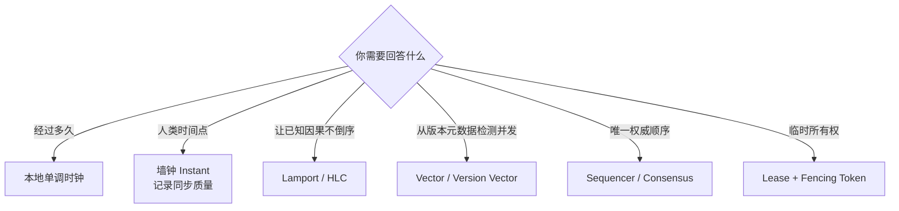

## 18. 设计评审清单

### 时间源

- 这个字段表示 wall time、elapsed time、event time、ingestion time，还是 commit version？
- 精度、分辨率、准确度和允许误差分别是多少？
- 时钟回拨、快进、slew、smear 与同步失联会怎样？
- 哪些值允许跨进程、跨机器、跨重启比较？

### 顺序与一致性

- 系统需要偏序、任意确定全序，还是不可回滚的提交顺序？
- Lamport/HLC 的反向推理是否被误用？
- 并发更新能否丢失，还是必须显式保留冲突？
- 数据库 timestamp 的合同究竟是事务开始、语句开始、调用时刻还是 commit timestamp？

### Timeout 与重试

- timeout 后结果是失败还是 unknown？
- requestId、查询结果和持久去重是否闭环？
- deadline 是否端到端递减，而不是每跳刷新？
- timer 晚执行时业务是否仍正确？

### Lease 与外部副作用

- 授权是否可能重叠？漂移和不确定度上界是什么？
- owner 暂停、重启或旧请求晚到时如何处理？
- fencing token 由谁产生，在哪里持久，最终由谁原子验证？
- 下游不支持 fencing 时，剩余风险是否写进合同？

## 19. 最后收束：时间是协议输入，不是事实本身

分布式系统没有一只可以同时回答所有问题的钟：

1. 墙钟让事件可被人类和外部系统解释，但它会漂移、校正并带不确定性；
2. 单调时钟可靠地测本地经过时间，却没有可跨机器解释的 epoch；
3. Lamport Clock 保留因果的必要顺序，Vector Clock 进一步识别并发；
4. HLC 把逻辑顺序拉近物理时间，仍不等于 TrueTime 或共识；
5. timeout 只产生怀疑，不能证明远端死亡或请求未提交；
6. Lease 的安全性依赖明确假设，外部写入还必须由 fencing 或最终资源处等价的“当前授权”条件检查守门；
7. 时间戳可以帮助排序，只有 sequencer、事务协议或共识才能定义权威历史。

一句话概括：

> 时间读数不是分布式事实，而是协议在特定时钟、网络和故障假设下取得的一份证据。先写清要证明什么，再选择时钟。

下一章进入 [Raft 论文精读](/signal-grid-blog/posts/raft-consensus-leader-election-log-replication-and-safety/)：Raft 的 term、选举超时与心跳会使用时间推动活性，但日志安全性来自投票限制、日志匹配和多数派交集，而不是同步墙钟。

## 官方与原始资料

- [Leslie Lamport：Time, Clocks, and the Ordering of Events in a Distributed System](https://lamport.azurewebsites.net/pubs/time-clocks.pdf)
- [Colin Fidge：Timestamps in Message-Passing Systems That Preserve the Partial Ordering](https://fileadmin.cs.lth.se/cs/Personal/Amr_Ergawy/dist-algos-papers/4.pdf)
- [Friedemann Mattern：Virtual Time and Global States of Distributed Systems](https://vs.inf.ethz.ch/publ/papers/VirtTimeGlobStates.pdf)
- [Sandeep Kulkarni、Murat Demirbas：Logical Physical Clocks and Consistent Snapshots in Globally Distributed Databases](https://cse.buffalo.edu/~demirbas/publications/hlc.pdf)
- [RFC 5905：Network Time Protocol Version 4](https://www.rfc-editor.org/rfc/rfc5905.html)
- [Google：Leap Smear 与时间源混用边界](https://developers.google.com/time/smear)
- [JDK 25：System.currentTimeMillis 与 System.nanoTime](https://docs.oracle.com/en/java/javase/25/docs/api/java.base/java/lang/System.html)
- [JDK 25：Instant 与 Java Time-Scale](https://docs.oracle.com/en/java/javase/25/docs/api/java.base/java/time/Instant.html)
- [JDK 25：Clock](https://docs.oracle.com/en/java/javase/25/docs/api/java.base/java/time/Clock.html)
- [Google Research：Spanner — Google's Globally-Distributed Database](https://storage.googleapis.com/gweb-research2023-media/pubtools/1974.pdf)
- [Maurice Herlihy、Jeannette Wing：Linearizability — A Correctness Condition for Concurrent Objects](https://cs.brown.edu/~mph/HerlihyW90/p463-herlihy.pdf)
- [Cary Gray、David Cheriton：Leases — An Efficient Fault-Tolerant Mechanism](https://www.cs.cmu.edu/afs/cs.cmu.edu/academic/class/15712-s12/www/papers/gray89.pdf)
- [Google Research：The Chubby Lock Service for Loosely-Coupled Distributed Systems](https://research.google.com/archive/chubby-osdi06.pdf)
- [Chandra、Toueg：Unreliable Failure Detectors for Reliable Distributed Systems](https://ecommons.cornell.edu/items/7948ff49-7263-49f8-a29b-d062e7cbb240)
- [Hayashibara 等：The φ Accrual Failure Detector](https://doi.org/10.1109/RELDIS.2004.1353004)
- [etcd：API Guarantees、Revision 与 timeout 结果未知](https://etcd.io/docs/v3.5/learning/api_guarantees/)
- [gRPC：Deadlines](https://grpc.io/docs/guides/deadlines/)
- [Apache Cassandra：Dynamo 架构、Timestamp 与 Last-Write-Wins](https://cassandra.apache.org/doc/latest/cassandra/architecture/dynamo.html)
- [PostgreSQL：Date/Time Functions and Current Time](https://www.postgresql.org/docs/current/functions-datetime.html#FUNCTIONS-DATETIME-CURRENT)
