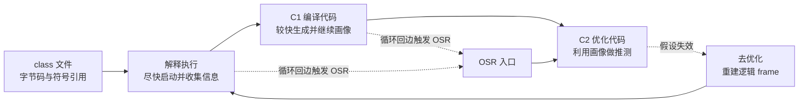
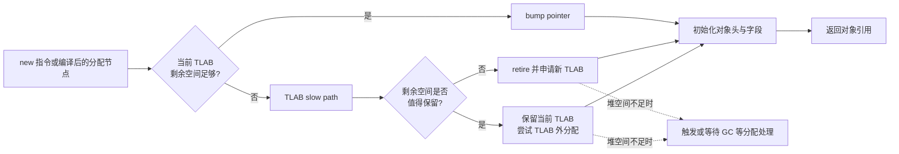
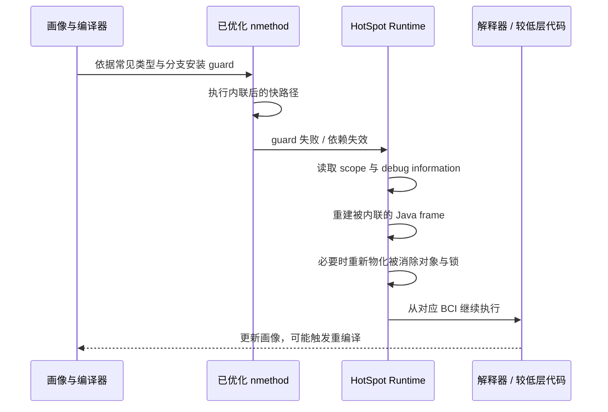
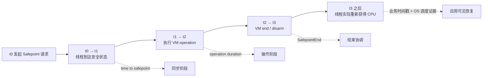

`javac` 已经把源码“编译”成了 class 文件，为什么 JVM 运行一段时间后还会继续编译？`new` 明明创建对象，为什么压测时可能观察不到相应的堆分配？一个方法已经生成了高度优化的机器码，为什么执行到一半又能退回解释器？GC 日志里的停顿，又为什么不能全部归因于 GC 算法本身？

这些问题指向同一个事实：**HotSpot 执行的不是一份永远不变的机器码，而是一套持续收集证据、建立假设、生成快路径，并在假设失效时恢复可解释状态的自适应系统。** TLAB 让“确实需要的堆分配”常常只剩线程私有的指针推进；逃逸分析可能让对象根本没有物理分配；JIT 利用运行时画像做内联和推测；去优化负责撤销已经不成立的假设；Safepoint 与线程局部 Handshake 则给运行时提供检查、修复和转换线程状态的协调边界。

本文是“Java 低延迟工程”的 Chapter 04。前面的 [Java Memory Model 与 VarHandle](/signal-grid-blog/posts/java-memory-model-varhandle-memory-ordering/) 解决并发语义，[Java 低延迟到底应该怎么测](/signal-grid-blog/posts/java-low-latency-measurement/) 建立测量方法，[Cache、局部性、伪共享与 NUMA](/signal-grid-blog/posts/java-low-latency-machine-model-cache-locality-false-sharing-numa/) 描述机器如何搬运数据。本文继续回答：**同一份 Java 代码在一次进程生命周期里，究竟会以哪些形态执行，这些形态转换如何进入尾延迟。**

版本边界是 **JDK 25 GA 的 HotSpot、默认分层编译器 C1/C2，以及不使用应用专用 AOT Cache 的常规动态执行路径**。JDK 25 已能把训练运行的方法画像放进 AOT Cache，让生产进程更早启动 JIT；它仍会在生产运行中继续画像和优化。因此 AOT 画像会缩短部分预热过程，却不会把下面的自适应模型变成静态编译模型。[JEP 515](https://openjdk.org/jeps/515)

## 1. Class 文件只规定程序含义，不规定 HotSpot 必须怎样执行

Java Virtual Machine Specification（JVMS）规定的是一台抽象机器。class 文件的 `Code` 属性保存字节码、最大操作数栈深度、局部变量表大小和异常表等信息；每次方法调用在概念上创建一个 frame，frame 包含局部变量、操作数栈和当前类的运行时常量池引用。JVMS 明确把解释、即时编译、内存布局和内部优化策略留给实现者。[JVMS 25 §2](https://docs.oracle.com/javase/specs/jvms/se25/html/jvms-2.html) · [JVMS 25 §4.7.3](https://docs.oracle.com/javase/specs/jvms/se25/html/jvms-4.html#jvms-4.7.3)

先看一个贯穿全文的小例子：

```java
public final class ExecutionProbe {
    record Pair(long left, long right) {}

    static long sumPairs(int limit) {
        long sum = 0;
        for (int i = 0; i < limit; i++) {
            Pair pair = new Pair(i, i + 1L);
            sum += pair.left() + pair.right();
        }
        return sum;
    }

    public static void main(String[] args) {
        int limit = Integer.parseInt(args[0]);
        long checksum = 0;
        for (int round = 0; round < 20; round++) {
            checksum ^= sumPairs(limit + (round & 1));
        }
        System.out.println(checksum);
    }
}
```

用 JDK 自带工具可以查看交付给 JVM 的静态输入：

```bash
javac --release 25 ExecutionProbe.java
javap -c -v -p ExecutionProbe
javap -c -v -p 'ExecutionProbe$Pair'
```

`javap -c` 会看到 `new`、`invokespecial`、字段访问器调用、整数转 `long`、循环跳转等字节码；`-v` 还会展示常量池、`Code`、`StackMapTable` 和行号等属性。[JDK 25 `javap`](https://docs.oracle.com/en/java/javase/25/docs/specs/man/javap.html) 这能证明“class 文件里有什么”，却不能证明生产运行时每次循环都解释了这些指令，也不能证明每个 `Pair` 都真的占据一块可观察的堆空间。

这里必须同时保留两种视角：

| 视角 | 它承诺什么 | 它没有承诺什么 |
| --- | --- | --- |
| JVMS 抽象语义 | `new` 产生正确初始化的对象引用，调用、异常与内存行为符合规范 | 一定使用模板解释器、一定分配到某个具体代、一定保留对象形态 |
| HotSpot 实现 | 在当前版本和配置下，以解释器、C1、C2、运行时桩和 GC 等组件实现规范 | 其他 JVM 或未来 HotSpot 必须采用相同层级、阈值、布局与机器指令 |

例如，JVMS 从逻辑上把类实例和数组放在垃圾收集堆中，但也明确允许实现采用内部优化。只要对象身份没有以程序可观察的方式暴露，HotSpot 可以把一次 `new` 的结果分解成几个标量，最终不产生物理对象。不能用“字节码里有 `new`”估算分配率，也不能用“源代码只有一个小方法”推断机器码只有一个物理栈帧。

解释执行时，一个字节码 frame 直观地对应一个 Java 方法调用。经过内联后，一个编译 frame 却可能承载多个 Java 方法的逻辑状态。HotSpot 必须为这些被折叠的 Java frame 保留足够的调试和去优化元数据，否则异常、栈遍历和退回解释器时无法重建语言层状态。这条约束会贯穿 JIT、标量替换与去优化，而不是编译器的附属功能。



这不是每个方法必经的固定流水线。冷方法可能始终解释执行；简单方法可能停留在 C1；编译策略可以跳过某些级别；已经安装的代码也可能失效或被替换。

## 2. 分层编译的核心不是阈值，而是用便宜执行换取可靠画像

HotSpot 的自适应编译先解决一个信息问题：如果程序还没有运行，编译器并不知道哪些方法最热、某个虚调用通常出现什么接收者类型、分支通常走哪边。把所有方法都用最激进的优化编译，既会拖慢启动、消耗编译线程与 Code Cache，也会把大量资源花在冷代码上。Oracle 的 JDK 25 VM Guide 将这一路径概括为：先用解释器启动并识别热点，再编译性能关键部分，并利用运行时信息做内联等优化。[Java Virtual Machine Technology Overview](https://docs.oracle.com/en/java/javase/25/vm/java-virtual-machine-technology-overview.html)

JDK 25 HotSpot 源码把执行级别定义为 0 到 4。下面的表是 **HotSpot 诊断语义**，不是 JVMS 的平台契约：[JDK 25 `compilerDefinitions.hpp`](https://github.com/openjdk/jdk/blob/jdk-25-ga/src/hotspot/share/compiler/compilerDefinitions.hpp)

| Level | 典型执行者 | 主要作用 |
| ---: | --- | --- |
| 0 | 解释器 | 直接执行字节码，建立初始调用与回边信息 |
| 1 | C1 simple | 快速生成较轻量的优化代码，不承担完整方法画像 |
| 2 | C1 limited profile | 生成代码并收集调用、循环回边等有限画像 |
| 3 | C1 full profile | 生成带更完整 MethodData 画像的代码，服务后续高层编译 |
| 4 | C2，或配置的 JVMCI 编译器 | 根据画像生成高度优化代码 |

编译策略观察的不只是“方法调用了多少次”。循环回边可以让一个只调用一次、但内部执行很久的方法变热；编译队列拥堵、Code Cache 压力、可用编译器和历史编译结果也会影响何时、以什么级别编译。`-XX:CompileThresholdScaling` 能整体缩放首次编译阈值，但 Oracle 文档没有把某个固定调用次数承诺为永久默认值。把“调用一万次一定进 C2”写进容量模型，是把实现启发式误当成协议。[JDK 25 `java` 的 JIT 选项](https://docs.oracle.com/en/java/javase/25/docs/specs/man/java.html#advanced-jit-compiler-options-for-java)

### OSR 解决“热点循环还没有返回”的问题

普通编译入口用于下一次从方法开头进入。可是下面的方法可能只被调用一次：

```java
static long runForever(int[] values) {
    long total = 0;
    for (;;) {
        for (int value : values) {
            total += value;
        }
    }
}
```

如果只能等方法返回后再使用机器码，这个热点永远没有机会切换。On-Stack Replacement（OSR）会针对某个 bytecode index 生成特殊入口，把正在解释或较低层执行的活动方法转换到已编译循环。`PrintCompilation` 输出里的 `%` 通常用于标示 OSR 编译，但输出格式属于诊断接口，应以所用 JDK 的实际图例和日志为准。

OSR 带来三个容易忽略的边界：

1. OSR nmethod 从循环中部进入，不等于正常方法入口已经安装同一版本；
2. 循环执行时间会混合解释、C1、C2 和转换成本，单次端到端计时未必代表稳态；
3. 画像不足时生成的早期机器码，可能在新类型或新分支出现后再次编译。

因此，低延迟系统的“预热”不是简单地把请求重放固定次数，而是要让**真实的调用形态、类型分布、分支比例和循环热点**进入目标编译层级。只预热 happy path，等于主动把罕见但合法的生产路径留给去优化阶段。

## 3. 画像只有穿过内联边界，才能变成更大的优化空间

设想一个撮合前风控调用：

```java
interface FeeModel {
    long fee(long notional);
}

static long payable(FeeModel model, long price, long quantity) {
    long notional = Math.multiplyExact(price, quantity);
    return notional + model.fee(notional);
}
```

字节码里的接口调用必须保持动态分派语义。但如果画像显示某个调用点长期只见到 `MakerFeeModel`，C2 可以生成类型守卫，把常见实现直接调用甚至内联，同时为其他类型保留慢路径或 uncommon trap。内联的价值不只是省去一次 `call`：它把调用者与被调用者放进同一优化图，随后才可能传播常量、消除冗余检查、发现对象不逃逸、消除锁或优化循环。


这种优化是有条件的。调用点逐渐变成多态或超多态、目标方法过大、内联深度和节点预算耗尽、类尚未加载，都会改变内联决策。`final`、`sealed` 和 Class Hierarchy Analysis 可以提供更强的静态信息，但动态类加载和类重定义仍可能让部分依赖失效。HotSpot glossary 对 dependency 的定义正是：nmethod 依赖某个乐观假设，类加载或替换使假设为假时，相关机器码必须被丢弃或去优化。[HotSpot Glossary](https://openjdk.org/groups/hotspot/docs/HotSpotGlossary.html)

可以先用产品 JDK 支持的诊断输出确认“编译和内联实际上发生了什么”：

```bash
java \
  -XX:+UnlockDiagnosticVMOptions \
  -XX:+PrintCompilation \
  -XX:+PrintInlining \
  ExecutionProbe 5000000
```

`PrintCompilation` 回答哪些方法何时被编译，`PrintInlining` 回答某个调用点为什么内联或拒绝内联。输出很大，实验时应再用 `CompileCommand` 限定目标方法。若要查看汇编，`-XX:+PrintAssembly` 或 `CompileCommand=print` 还需要目标 JDK 可用的反汇编支持；“命令没有报错但没有可读汇编”不能被解释成方法没有编译。[JDK 25 `java`](https://docs.oracle.com/en/java/javase/25/docs/specs/man/java.html)

### 机器码不是凭空出现，它占用 Code Cache

HotSpot 把生成的机器码及其相关元数据组织为 nmethod 并放入 Code Cache。启用分层编译且容量满足条件时，JDK 25 默认使用分段 Code Cache：

- non-method heap 保存解释器、编译器 buffer 和运行时 stub 等非方法代码；
- profiled heap 主要保存带画像、预期寿命较短的代码；
- non-profiled heap 主要保存完全优化、预期寿命较长的代码。

分段减少异质代码混放导致的扫描和碎片问题，并改善 iCache、iTLB 局部性；它不意味着容量从此不需要观测。分层编译会产生同一方法的多个版本，内联会扩大 nmethod，动态生成类和表达式的系统还可能持续制造新代码。Code Cache 压力会影响编译策略、清扫和代码安装，最终表现为预热延长、吞吐下降或延迟阶段性变化。[JEP 197](https://openjdk.org/jeps/197) · [JDK 25 VM Guide：Segmented Code Cache](https://docs.oracle.com/en/java/javase/25/vm/java-virtual-machine-guide.pdf)

运行中可以读取当前证据，而不是先调大 `ReservedCodeCacheSize`：

```bash
jcmd "$PID" Compiler.queue
jcmd "$PID" Compiler.codecache
jcmd "$PID" Compiler.codelist
jcmd "$PID" Compiler.CodeHeap_Analytics aggregate
```

可用命令会随构建和版本变化，应先执行 `jcmd "$PID" help`；每条命令的影响级别也应查对应帮助。`Compiler.codelist` 的文档标为 Medium impact，不适合作为高频生产探针。[JDK 25 `jcmd`](https://docs.oracle.com/en/java/javase/25/docs/specs/man/jcmd.html)

## 4. TLAB 把常见堆分配变成线程私有指针推进，但没有消除分配成本

逃逸分析之前，先看对象确实需要存在时发生什么。JDK 25 默认启用 Thread-Local Allocation Buffer（TLAB）。它不是 Java 栈，也不是堆外内存，而是从堆的年轻代空间划给某个 Java 线程的一段连续区域。线程在自己的 TLAB 内分配，常见路径可以近似理解为：

```text
oldTop = tlab.top
newTop = oldTop + alignedObjectSize

if newTop <= tlab.end:
    tlab.top = newTop
    初始化对象头与字段
    return oldTop
else:
    进入分配慢路径
```

这里的“快”来自线程独占分配指针：每次小对象分配通常不需要和其他分配线程竞争同一个全局 top。它仍然要执行边界检查、推进指针、写对象头，并保证字段具有 Java 要求的默认值。随后对对象字段的写入会消耗 store bandwidth 和 cache line；对象若存活，还会进入 GC 标记、复制或重定位工作。TLAB 降低了**分配协调成本**，并没有让高分配率免费。



图中慢路径是对 JDK 25 HotSpot 源码的简化。当前 `MemAllocator` 会先尝试现有 TLAB；失败后可能恢复被采样机制临时缩短的 TLAB 边界，可能因剩余空间较多而保留当前 TLAB 并走 TLAB 外分配，也可能退休旧 TLAB、申请一个大小自适应的新 TLAB；最终还可能直接向 heap allocator 请求空间。[JDK 25 `memAllocator.cpp`](https://github.com/openjdk/jdk/blob/jdk-25-ga/src/hotspot/share/gc/shared/memAllocator.cpp)

由此可以纠正三个常见误解。

第一，**TLAB 外分配不等于老年代分配**。它只表示没有从当前线程的 TLAB 完成；目标位置仍由所选 GC 的 heap allocator 决定。第二，**TLAB 用尽不等于立刻 GC**。补充 TLAB 可能直接成功，只有堆分配无法满足等条件才进入更重的分配失败处理。第三，**大对象不一定遵循一个可跨 GC、跨版本背诵的固定阈值**。是否放入 TLAB、如何选择区域和怎样处理 humongous/large object 都属于具体收集器与版本策略。

### TLAB 的尾延迟来自快慢路径比例，而不是平均分配纳秒数

假设线程每秒分配 4 GB，单次 TLAB 内 bump pointer 再快，也只是把压力移向：

- 更频繁的 TLAB refill 与退休，产生可观测的 refill waste；
- 更高的年轻代回收频率和复制带宽；
- 更大的对象初始化与写屏障流量；
- 分配突刺时更容易进入 TLAB 外或 allocation-failure 路径。

JFR 的 `jdk.ObjectAllocationInNewTLAB` 可以估算 TLAB refill 次数与容量，并定位“触发这次新 TLAB 申请”的那个分配点；它不能把该 TLAB 随后的全部对象都准确归因给这个调用栈。`jdk.ObjectAllocationOutsideTLAB` 用于观察 TLAB 外分配，而总体分配热点仍应结合带权的 `jdk.ObjectAllocationSample`。这些事件并不等价于“无开销地逐个记录所有小对象”：默认 JFR 配置甚至关闭高开销的详细 TLAB 事件。需要明确启用、限定时间窗口，并把记录开销纳入实验。[JDK 25 JFR 默认配置](https://github.com/openjdk/jdk/blob/jdk-25-ga/src/jdk.jfr/share/conf/jfr/default.jfc) · [Oracle JFR 故障排查指南](https://docs.oracle.com/en/java/javase/25/troubleshoot/troubleshoot-performance-issues-using-jfr.html)

统一日志提供另一种聚合视角：

```bash
java -Xlog:gc+tlab=debug ExecutionProbe 5000000
```

需要逐次细节时可以短暂提升到 `trace`，但输出和扰动会显著增加。真正要回答的问题不是“TLAB 开没开”——JDK 25 默认已经开启——而是**业务延迟异常时，分配是否从稳定的 TLAB 快路径转向了 refill、TLAB 外分配或 GC 关联路径**。[JDK 25 `-XX:+UseTLAB`](https://docs.oracle.com/en/java/javase/25/docs/specs/man/java.html)

## 5. 逃逸分析的主要收益是标量替换，不是“把对象放到栈上”

TLAB 让堆分配便宜；逃逸分析进一步问：**这次对象分配在程序可观察语义中真的必须存在吗？** C2 构造引用关系，保守分析对象是否越过当前编译范围或当前线程可见边界。HotSpot 文档常用三类状态解释结果：

| 状态 | 含义的直观近似 | 可支持的优化机会 |
| --- | --- | --- |
| `NoEscape` | 引用没有离开可分析范围；能否标量化还要满足额外条件 | 可能消除分配、标量替换或相关锁 |
| `ArgEscape` | 引用传给已分析调用或被参数关联引用，但没有全局逃逸 | 某些锁消除或受限优化，是否标量化取决于具体图 |
| `GlobalEscape` | 返回、存入全局/已逃逸对象，或流入无法证明安全的位置 | 通常必须保留真实对象与共享语义 |

这是 C2 的实现模型，不是 Java 语言给对象贴的永久标签。分析结果依赖当前编译图、内联结果和保守边界；同一段源码在不同 JDK、编译层级或调用形态下可能得到不同结果。[OpenJDK HotSpot Escape Analysis](https://wiki.openjdk.org/display/HotSpot/EscapeAnalysis) · [JDK 25 C2 `escape.cpp`](https://github.com/openjdk/jdk/blob/jdk-25-ga/src/hotspot/share/opto/escape.cpp)

回到 `sumPairs`。如果 `Pair` 构造器和访问器被内联，引用不返回、不存进共享字段，也不传给无法分析的调用，C2 可能把：

```java
Pair pair = new Pair(i, i + 1L);
sum += pair.left() + pair.right();
```

转化为概念上的：

```java
long left = i;
long right = i + 1L;
sum += left + right;
```

对象的字段变成 SSA value、寄存器值或必要时的栈槽，分配节点和字段 load/store 可以完全消失。这叫 **scalar replacement（标量替换）**。当前 C2 并不把所有未逃逸对象通用地改成传统意义上的“栈上对象”；OpenJDK 的实现说明明确写道，HotSpot C2 的常见路径是消除分配，而不是 stack allocation。把 EA 讲成“对象从堆搬到栈”会误导容量估算，也无法解释去优化时为什么需要重新物化对象。[HotSpot Escape Analysis and Scalar Replacement Status](https://cr.openjdk.org/~cslucas/escape-analysis/EscapeAnalysis.html)

如果代码发生以下变化，证明可能被破坏：

```java
static volatile Object sink;

static long escapingPair(long left, long right) {
    Pair pair = new Pair(left, right);
    sink = pair;                       // 向其他线程发布真实身份
    return pair.left() + pair.right();
}
```

返回对象、存入 `static` 字段或已逃逸对象、传给未内联且分析不到的调用、使用对象身份语义、复杂控制流让保守分析失去精度，都可能阻止标量替换。C2 的 EA 在 JDK 25 仍有分析范围和 flow-insensitive 等局限：某条冷分支上发生逃逸，可能让同一分配点在热分支也被保守地视为逃逸。不能从“人眼看起来不会逃逸”直接断言生产机器码没有分配。

### 用反事实实验验证分配消除，而不是靠源代码猜测

前面的 `ExecutionProbe` 可以做一个诊断性对照：

```bash
java -Xms128m -Xmx128m -Xlog:gc \
  -XX:+DoEscapeAnalysis \
  ExecutionProbe 5000000

java -Xms128m -Xmx128m -Xlog:gc \
  -XX:-DoEscapeAnalysis \
  ExecutionProbe 5000000
```

两次必须使用同一 JDK、同一参数、同一 CPU 约束和同一输入，并同时观察编译层级与 GC/分配证据。若默认组几乎不产生循环内分配，而关闭 EA 后出现显著 GC 压力，这支持“EA 参与消除了 `Pair`”这一解释。它仍不是业务性能结论：关闭 EA 会改变许多方法的编译结果，编译时机与代码形态也可能变化。要量化延迟收益，应回到 [Java 低延迟测量方法](/signal-grid-blog/posts/java-low-latency-measurement/) 的多 fork、预热、分布和反优化约束。

Oracle 产品构建支持 `-XX:-DoEscapeAnalysis` 作为对照，而网上常见的 `PrintEscapeAnalysis`、`PrintEliminateAllocations` 可能只存在于 debug/fastdebug 构建，生产 JDK 会直接拒绝。一个无法在目标构建启动的 flag 不是证据。更稳妥的证据链是：内联决策、分配采样、GC 差异、生成代码和禁用 EA 的受控反事实彼此吻合。[JDK 25 `-XX:+DoEscapeAnalysis`](https://docs.oracle.com/en/java/javase/25/docs/specs/man/java.html)

## 6. 去优化是推测式优化的正确性回路，不是 JIT “反悔”

高度优化的机器码之所以能快，是因为它不必为每种合法情况都铺一条同样快的路径。编译器可以依据画像和类层次建立可检查的假设：某调用点常见一种类型、某分支极少发生、某引用历史上从不为 `null`、某个类暂时没有新的子类。常见路径得到紧凑机器码，意外情况通过 guard 转到慢路径或 uncommon trap。

当 guard 失败或编译依赖被破坏时，HotSpot 必须继续满足 Java 语义。去优化（deoptimization）完成的不是简单“丢掉机器码并重跑整个请求”，而是把当前编译状态转换为可继续执行的较低优化状态：



编译器在 nmethod 中保存 frame 状态映射：机器寄存器和栈槽怎样对应 Java 局部变量、操作数栈、被内联方法以及对象字段。去优化处理器据此展开一个物理编译 frame，恢复多个逻辑 Java frame。若逃逸分析此前把 `Pair` 标量化，而恢复后的解释执行必须看到真实对象，HotSpot 会按保存的字段值在堆中 **rematerialize（重新物化）** 对象；若锁曾被消除，还可能恢复相应锁状态。JDK 25 `deoptimization.cpp` 中可以直接看到 `objects_to_rematerialize`、重新分配对象、恢复字段和 relock 的路径。[JDK 25 `deoptimization.cpp`](https://github.com/openjdk/jdk/blob/jdk-25-ga/src/hotspot/share/runtime/deoptimization.cpp)

不同原因的动作并不完全相同：

- uncommon trap 可能只把当前 activation 退回解释器，并根据 reason/action 决定是否重编译；
- 新类加载破坏 Class Hierarchy Analysis 依赖时，相关 nmethod 可能被标记为 not entrant，使新调用不再进入，并处理仍在栈上的 activation；
- JVMTI 类重定义、调试或栈状态修改，也可能要求撤销已编译状态；
- 已经被替代、长期不再使用的 nmethod，之后才有机会被 Code Cache 清扫回收。

所以“发生 deopt”本身不等于 JVM 出错。它是乐观优化保持正确性的必要出口。真正值得警惕的是 **deoptimization storm**：生产输入不断推翻画像，方法在优化、trap、退回和重编译之间抖动。它会同时制造同步慢路径、编译线程 CPU 竞争、Code Cache churn 和不稳定的指令布局，极易污染 p99.9。

观察去优化应同时保存事件原因与上下文：

```bash
java \
  -XX:+UnlockDiagnosticVMOptions \
  -XX:+LogCompilation \
  -XX:LogFile=hotspot.log \
  ExecutionProbe 5000000

jfr print --events jdk.Deoptimization recording.jfr
```

`LogCompilation` 的 XML 会记录编译、inline 与 uncommon trap 的 `reason` / `action`，JFR 的 `jdk.Deoptimization` 事件包含编译器、方法、BCI、指令、原因和动作等字段。[OpenJDK LogCompilation overview](https://wiki.openjdk.org/spaces/HotSpot/pages/11829268/LogCompilation%2Boverview) · [JDK 25 JFR metadata](https://github.com/openjdk/jdk/blob/jdk-25-ga/src/hotspot/share/jfr/metadata/metadata.xml) 单看计数仍不够：启动阶段少量合法 deopt 与稳态热路径每秒持续 deopt，工程含义完全不同。

## 7. Safepoint 提供全局一致观察，Handshake 则缩小协调范围

HotSpot 有时必须在一个不会看到“半更新 frame、半修改堆或未知 oop 位置”的边界执行 VM 操作。Safepoint 从局部看，是编译器和运行时知道线程可以安全停下、栈中对象引用可被准确解释的位置；从全局看，是 VM 确认相关 JavaThreads 都处于 safepoint-safe state 后执行某项全局操作的阶段。

“Stop-The-World”容易让人误以为 VM 发一个信号，所有 OS 线程瞬间同时冻结。HotSpot 实际采用协作式机制：请求方发起 Safepoint，正在执行 Java 的线程在 poll 或状态转换处响应；已经阻塞或处于可安全处理状态的线程可以被直接计入；执行 native code 的线程不必以同一种方式停在 Java 指令上，但在 Safepoint 期间不能不受控制地重新进入会破坏全局不变量的 VM/Java 状态。[OpenJDK HotSpot Runtime Overview](https://openjdk.org/groups/hotspot/docs/RuntimeOverview.html)

### 总停顿必须拆成“到达时间”和“操作时间”



图里的数字只是示意。对一次 Safepoint，至少要分别回答：

- **Time to safepoint / synchronization time**：从请求到所有目标 JavaThreads 被确认安全用了多久；
- **VM operation time**：真正的 GC phase、类重定义、栈处理或其他 VM operation 执行了多久；
- **VM 结束协调**：撤销 Safepoint 请求、disarm polling page，并让 JavaThreads 重新具备运行条件；
- **应用可见恢复**：线程真正被 OS 调度回 CPU、继续推进业务的时间；这一段位于 JFR `jdk.SafepointEnd` 事件之外，需要业务时间戳和调度证据补齐。

如果同步用了 80 ms、VM operation 只用了 1 ms，把 81 ms 全写成“GC 扫描慢”会把排障带错方向。问题可能是某线程很久没有执行 poll、停在耗时 VM/runtime 路径，或者只是被 Linux 长时间剥夺 CPU。某些具体 VM operation 还可能受 JNI critical 区域约束，但必须用对应事件链证明，不能把 JNI critical 当作所有 Safepoint 同步变慢的通用解释。相反，线程都迅速到达而 operation 本身很长，才应继续分析该操作的工作量。

编译代码通常在方法返回、调用边界或循环相关位置放置 poll；解释器可以通过切换 dispatch 行为响应 Safepoint；线程进出 native/VM 状态时也有相应检查。对 counted loop，HotSpot 还可以用 loop strip mining 在外层保留 Safepoint 机会、让内层批量迭代。JDK 25 暴露 `UseCountedLoopSafepoints` 与 `LoopStripMiningIter` 等实现选项，但默认值会受所选 GC 影响。盲目把迭代数调小可能增加热循环 poll 成本，调大则可能放大响应延迟，必须在目标 JVM 上用尾延迟和 Safepoint 同步证据验证。[JDK 25 `java`](https://docs.oracle.com/en/java/javase/25/docs/specs/man/java.html)

### Handshake 不等于一次更小的全局 Safepoint

JEP 312 引入 Thread-Local Handshake，使 HotSpot 可以让一个或一组 JavaThread 在 safepoint-safe state 执行 callback，而不必建立“所有 JavaThreads 同时处于全局 Safepoint”的条件。callback 可以由目标线程自己执行；目标线程已阻塞时，也可由 VM thread 在保持其阻塞的条件下代执行。每个线程完成自己的操作后即可继续，不必等全部线程形成一个共同停止窗口。[JEP 312](https://openjdk.org/jeps/312)

这一区别决定了它能证明什么：

| 机制 | 协调范围 | 能依赖的状态 |
| --- | --- | --- |
| 全局 Safepoint | 全部相关 JavaThreads | 存在全局一致的安全观察窗口，可执行要求全局不变量的 VM operation |
| 单线程 Handshake | 一个 JavaThread | 只在目标线程安全时执行局部操作，其他线程可继续运行 |
| 多线程 Handshake | 一个线程集合 | callback 分别在各目标线程安全状态完成，不自动提供“所有目标同时停止”的瞬间 |

JDK 25 的去优化实现就是版本演进的例子：对已标记 nmethod 的某些去优化处理，可以在不处于全局 Safepoint 时通过 Handshake 提交；若本来就在 Safepoint，则走相应全局路径。[JDK 25 `deoptimization.cpp`](https://github.com/openjdk/jdk/blob/jdk-25-ga/src/hotspot/share/runtime/deoptimization.cpp) 因此“deopt 一定触发 STW”与“有了 Handshake 就不再需要 Safepoint”都不成立。

Handshake 缩小的是影响面，不会让协调免费。目标线程若迟迟不 poll、处于不可安全处理的转换或长期得不到 CPU，单线程操作仍会延迟；callback 自身过重，也会直接暂停目标业务线程。低延迟设计要同时关心 **global pause distribution** 和 **per-thread handshake latency**，而不能只看 GC pause 名称。

## 8. 把执行层事件和业务延迟放在同一条证据时间线上

这些机制最大的排障陷阱，是每个工具都能讲出一个似乎合理的故事：看到 GC 就归因分配，看到编译就归因预热，看到 Safepoint 就归因 STW。可靠分析必须让主张、直接证据、反事实与证明边界互相约束。

| 待验证主张 | 直接证据 | 有界反事实 | 仍不能单独证明什么 |
| --- | --- | --- | --- |
| 方法仍在解释或低层执行 | `PrintCompilation`、JFR Compilation、编译队列 | 固定预热阶段；诊断性比较 `-Xint` / 限制 tier | 业务慢一定由 JIT 导致 |
| 调用点未内联 | `PrintInlining`、LogCompilation、目标汇编 | 改变可控的类型形态或隔离目标方法 | 强制内联一定更快 |
| 对象走 TLAB/refill/外部分配 | `gc+tlab` 日志、JFR TLAB 与 allocation sample | 短时比较 `-XX:-UseTLAB`，只作机制诊断 | TLAB 外分配一定进老年代或触发 GC |
| C2 消除了分配 | 内联 + allocation/GC + 生成代码相互印证 | `-XX:-DoEscapeAnalysis` 的同条件对照 | 源码中的对象永远不会物化 |
| 稳态画像反复失效 | JFR Deoptimization、LogCompilation reason/action | 固定输入类型分布，比较阶段切换前后 | 所有 deopt 都是性能故障 |
| Safepoint 拉长尾延迟 | Safepoint 同步、VM operation 与业务时间戳重合 | 分离 poll 延迟、operation 工作量与 OS 调度 | 任意时间接近的事件就是因果关系 |
| Code Cache/编译队列形成压力 | `jcmd` codecache、queue、codelist 与 JFR compiler 事件 | 控制动态类数量或编译负载 | 调大 Code Cache 自动改善 p99 |

一个短时、可复核的 JFR 采集可以这样启动：

```bash
java \
  -XX:StartFlightRecording=name=hotspot,settings=profile,duration=60s,dumponexit=true,filename=hotspot.jfr,jdk.Compilation#threshold=0ms,jdk.SafepointBegin#enabled=true,jdk.SafepointStateSynchronization#enabled=true,jdk.SafepointStateSynchronization#threshold=0ms,jdk.SafepointEnd#enabled=true,jdk.ExecuteVMOperation#enabled=true,jdk.ObjectAllocationInNewTLAB#enabled=true,jdk.ObjectAllocationOutsideTLAB#enabled=true \
  YourApplication
```

结束后先提取本文相关事件：

```bash
jfr print \
  --events jdk.Compilation,jdk.Deoptimization,jdk.SafepointBegin,jdk.SafepointStateSynchronization,jdk.SafepointEnd,jdk.ExecuteVMOperation,jdk.ObjectAllocationInNewTLAB,jdk.ObjectAllocationOutsideTLAB \
  hotspot.jfr
```

这里把采集硬性限制为 60 秒；`dumponexit=true` 只用于在应用提前退出时保留已采到的部分记录，并不会取消这个时长上限。命令还显式打开 `profile.jfc` 默认未启用的 Safepoint 同步/结束事件，同时把 `jdk.Compilation` 的 100 ms 默认阈值降为 0，以免只看到极慢编译。详细 TLAB 与零阈值编译事件会增加开销，只应在受控窗口使用；长期连续记录应从 `default.jfc` 起步，再按目标开启必要事件。还可以用统一日志补充 Safepoint 时间分解：

```bash
java \
  -Xlog:safepoint*=debug:file=safepoint.log:time,uptime,level,tags \
  YourApplication
```

JFR 的 `SafepointStateSynchronization`、`SafepointBegin/End` 与 `ExecuteVMOperation` 提供了拆分协调和操作阶段的原始材料；默认配置对部分事件设有阈值或直接关闭，分析前必须保存实际 JFC 和 JVM 参数，不能把“记录里没有”当成“运行时没有”。[JDK 25 JFR metadata](https://github.com/openjdk/jdk/blob/jdk-25-ga/src/hotspot/share/jfr/metadata/metadata.xml) · [JDK 25 Flight Recorder 配置](https://docs.oracle.com/en/java/javase/25/jfapi/configuration.html)

最后，把这些 JVM 事件与请求的单调时钟时间戳、负载阶段、CPU 调度和 GC 周期对齐。若 p99.99 抖动发生在 `jdk.Deoptimization` 之后，要继续问是否同一热方法、是否发生对象重新物化、是否进入编译队列、是否恰逢 CPU 饱和；若停顿与 Safepoint 重合，要分别读取同步阶段和 operation 阶段。只有事件链能够重复、反事实能够改变预期环节、其他混杂因素没有同步改变时，才有资格从“相关”推进到“原因”。

## 9. 低延迟的真正对象，是快路径之间的状态转换

HotSpot 的性能来自有条件的快路径，而不是某个永远成立的魔法开关。TLAB 把大部分真实堆分配压缩为线程私有指针推进，却仍把分配率交给内存带宽与 GC；逃逸分析能够彻底消除对象和相关锁，却依赖内联与保守证明，并不承诺通用栈上分配；C2 依据画像生成紧凑机器码，同时用 guard、依赖和去优化保留 Java 语义。

因此，去优化不是对 JIT 的否定，而是推测式优化能够安全存在的前提；Safepoint 也不只是“GC 停顿”，而是运行时获得全局一致状态的协调机制。Thread-Local Handshake 能把一部分操作收缩到单线程或线程集合，却不能替代需要全局不变量的 Safepoint。

对低延迟系统而言，稳态平均成本往往已经落在 TLAB 和 C2 快路径里，真正刺穿尾部的是 **TLAB refill、分配失败、OSR/重编译、uncommon trap、对象重新物化、到达 Safepoint 的等待和 VM operation**。能够把这些转换逐一投射到同一条业务延迟时间线，才算真正知道 HotSpot 在怎样执行你的代码，也才有基础进入下一章 [Java 低延迟 GC](/signal-grid-blog/posts/java-low-latency-gc-allocation-live-set-g1-zgc-shenandoah/)，讨论这些分配如何转化为 Live Set、回收周期与空间余量。
