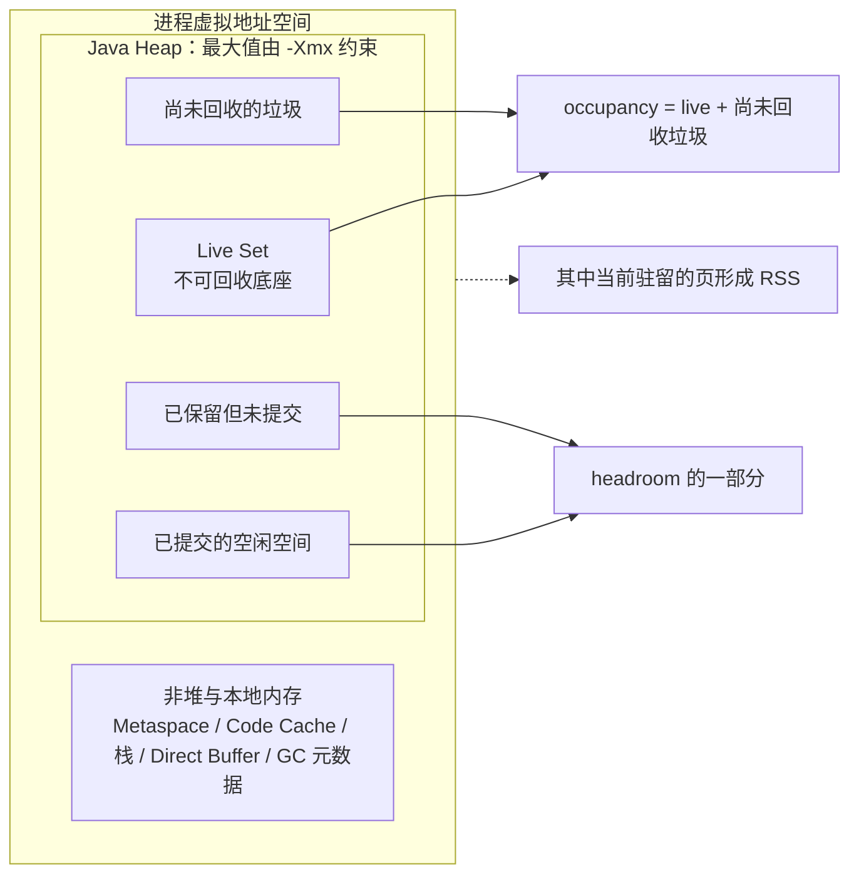
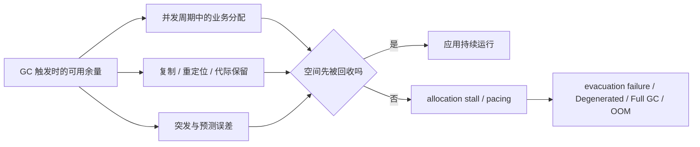
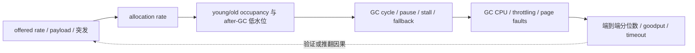

“换成 ZGC，就不会再有停顿了。”

这句话同时忽略了三件事：垃圾回收器必须追踪哪些对象仍然可达，必须找到可复用的空间，还必须在应用继续分配时赶上它。工作可以放进 Stop-The-World（STW）暂停，也可以并发执行；可以由 GC 线程承担，也可以变成每次引用读写都要支付的屏障成本；空间不足时，还可能让正在分配的业务线程等待。**没有一种收集器能消除回收成本，它们只是把成本放在不同位置。**

本文的主张是：低延迟 GC 首先是一个容量与速率问题，而不是参数记忆题。分配率决定新垃圾出现多快，存活对象决定一次回收必须处理多少工作，晋升率决定老年代压力增长多快，Live Set 决定堆的不可压缩底座，而 headroom 决定并发回收期间还有多少时间追赶应用。只有先量出这些量，G1、ZGC 或 Generational Shenandoah 的选择才有可证伪的依据。

这是“Java 低延迟工程”的 Chapter 05。上一章 [HotSpot 如何执行你的代码](/signal-grid-blog/posts/hotspot-execution-tlab-escape-analysis-jit-deoptimization-safepoint/) 解释对象怎样经 TLAB 分配、代码怎样被 JIT 编译，以及去优化与 Safepoint 为什么会制造延迟；本章把“对象分配很快”继续推到“空间怎样被持续回收”。下一章转向 [Monitor、AQS、park/unpark 与调度延迟](/signal-grid-blog/posts/java-thread-contention-aqs-park-unpark-scheduling/)，区分 GC 或 Safepoint 停顿、锁竞争、主动停车和线程获得 CPU 之前的调度等待。

版本边界是 **OpenJDK JDK 25**：G1 仍是大多数服务器配置上的默认收集器；`-XX:+UseZGC` 只会启用分代 ZGC，历史参数 `ZGenerational` 在 JDK 25 已是 obsolete，不应再写进新配置；Generational Shenandoah 已由 JEP 521 从 experimental 提升为 product feature，但 Shenandoah 默认仍使用单代模式，分代模式必须显式选择。本文讨论 Generational Shenandoah 的耗尽与退化路径时，以包含 [JDK-8368152](https://bugs.openjdk.org/browse/JDK-8368152) 修复的 **JDK 25.0.2 或供应商等效 backport** 为生产基线；供应商是否在特定平台构建 Shenandoah、是否带有相同修复，仍需用目标发行版核对。

## 1. 先把十个经常混用的量分开

GC 讨论最常见的错误不是算错，而是把不同口径叫成同一个“内存”。下面这些量必须分别记录。

| 名称             | 精确定义                                                              | 它不等于什么                                                                   |
| ---------------- | --------------------------------------------------------------------- | ------------------------------------------------------------------------------ |
| 最大堆 `-Xmx`    | JVM 允许 Java heap 增长到的硬上限                                     | 当前已占用内存、进程 RSS、容器内存上限                                         |
| Reserved heap    | 为堆保留的虚拟地址空间                                                | 已经有物理页承载的内存                                                         |
| Committed heap   | JVM 已向操作系统提交、可供堆使用的范围                                | 其中全是活对象，也不保证所有页此刻都驻留                                       |
| Used / occupancy | 某一时刻被收集器视为已占用的堆空间                                    | Live Set；其中可能有尚未识别或尚未回收的垃圾                                   |
| Live Set         | 从 GC Roots 出发仍可达、因而本轮不能回收的对象集合及其大小            | “GC 后 used”的永恒常数；并发标记有时间边界，工作负载也会变化                   |
| Allocation rate  | 单位时间内新分配的字节数，通常写成 B/s                                | 请求速率；一个请求可能分配 0 B，也可能分配数 MB                                |
| Survival rate    | 一批年轻对象经过指定 young GC 后仍存活的比例                          | Promotion rate；存活对象可能先进入 survivor 区或原地变老                       |
| Promotion rate   | 单位时间进入老年代的字节数                                            | 长期留存率；中等寿命对象之后仍可能在老年代死亡                                 |
| Headroom         | 回收进行期间可吸收业务分配、对象复制/重定位、突发和预测误差的可用余量 | 简单的 `Xmx - used`；保留区、碎片、代际配额都会减少可用余量                    |
| RSS              | 进程当前驻留在物理内存中的页                                          | Java heap；还包含 Metaspace、Code Cache、线程栈、直接内存、GC 元数据和本地库等 |

[Oracle JDK 25 GC Tuning Guide](https://docs.oracle.com/en/java/javase/25/gctuning/factors-affecting-garbage-collection-performance.html) 也明确区分 reserved、committed 与 heap 上限。`-Xms < -Xmx` 时，并不是全部保留空间都已经提交。再往下还有“已提交但尚未 fault-in 的页”与“当前驻留页”的区别，所以 `-Xmx=16g` 绝不等于 RSS 只有 16 GiB。



假设一个最大堆为 16 GiB 的进程当前 used 是 11 GiB，最近一次充分回收后的稳定占用约为 6 GiB。不能因此说“Live Set 是 11 GiB”，因为里面可能有 5 GiB 浮动垃圾；也不能说“headroom 一定是 5 GiB”，因为收集器可能需要 evacuation reserve，G1 还可能遇到 humongous object 的连续 region 需求，而代际收集器还要维护年轻代、老年代之间的容量边界。

### Live Set 是实验量，不是控制台上的一个万能字段

严格地说，Live Set 与“在哪个逻辑时刻观察可达性”有关。并发标记期间应用仍在修改对象图，SATB 等算法会维持特定快照语义；因此日志里一次 GC 的 `used after` 是一个很有用的占用观测，但不自动等于精确 Live Set。

工程上通常用稳态下多个可比回收周期后的低水位估计 Live Set，并同时保存收集器、事件类型和负载阶段。例如：G1 的一次普通 young GC 后，老年代里尚未进入 mixed collection 的垃圾仍然占空间；强行 `System.gc()` 得到一个“更干净”的低水位，又改变了正常运行路径。估计值必须标成估计值，不能抹掉测量方法。

### 堆外内存不会因为选择 ZGC 就消失

Direct `ByteBuffer`、Aeron 映射文件、JNI 分配、线程栈、JIT Code Cache 和 GC 自身元数据都可能让 RSS 超出 `-Xmx`。在容器中，内存上限约束的是整个 cgroup，而不是只约束 Java heap。一个 `-Xmx` 刚好等于容器 limit 的配置，几乎等于主动删除本地内存余量；最终可能由内核 OOM killer 终止进程，来不及产生 Java `OutOfMemoryError`。

## 2. 分配率与 Live Set 共同决定回收预算

对象分配的快路径可以只是 TLAB 中一次 bump-pointer 更新，但这不代表分配免费。每前进一个字节，最终都要由回收器证明它仍然存活，或者证明它可以复用。先定义窗口 `Δt` 内的分配率：

```text
allocationRate = allocatedBytes / Δt
promotionRate  = promotedBytes  / Δt
liveSetSlope   = (liveSetEnd - liveSetStart) / Δt
```

这三个斜率回答完全不同的问题：

- allocation rate 高，表示年轻代空间消耗快、GC 周期更频繁，但只要对象很快死亡，未必需要大 Live Set；
- promotion rate 高，表示年轻代无法快速过滤这些对象，老年代标记与回收压力会增加；
- live-set slope 持续为正，表示业务状态、缓存、积压或泄漏正在增加，单纯加大 young generation 不能解决长期容量问题。

“每秒分配 4 GiB”听起来可怕，但如果绝大多数对象在下一次 young collection 前死亡，分代收集器可以很高效地回收它们。反过来，每秒只分配 100 MiB，如果其中 80 MiB 长期存活，十分钟就会形成约 48 GiB 的新增留存压力。**回收难度更接近存活数据和对象图的形状，而不是累计分配总量。** HotSpot 的分代收集正是利用 weak generational hypothesis：多数对象很快死亡；官方实现说明也指出，年轻代回收成本的一阶近似与需要处理的存活对象量相关，而不是与已经死亡对象的字节数成正比。[Garbage Collector Implementation](https://docs.oracle.com/en/java/javase/25/gctuning/garbage-collector-implementation.html)

### 并发收集器需要时间缓冲

并发回收的空间约束不是一句无条件成立的 `分配率 × 周期时间`。在从触发到重新获得稳定余量的任意时刻 `t`，真正需要守住的是：

```text
initialUsableHeadroom
+ reusableBytesReleasedBy(t)
>= cumulativeAllocation(t)
 + relocationOrToSpaceConsumption(t)
```

这里的 `initialUsableHeadroom` 还必须已经扣除因碎片、代际边界或保留策略而暂时不可用的空间。并发收集器可能在周期尚未结束时就逐步释放可复用空间，所以右侧不能一概被当成“周期结束前全部净新增”。

若为了容量评审采用更保守、也更容易复核的假设——周期完成前不计任何空间复用，`Adesign` 是需要持续整个 `Tcycle` 的设计峰值——才可以写成：

```text
initialUsableHeadroom
  >= Adesign × Tcycle
   + incrementalBurst
   + peakRelocationReserve
   + safetyMargin
```

其中 `incrementalBurst` 只计基线 `Adesign × Tcycle` 之外的额外分配，不能把同一批字节重复相加。这些都不是 HotSpot 的精确内部公式，而是容量评审的守恒关系与保守上界。收集器的启发式会估计触发时机、周期耗时和代际大小，但无法预知尚未发生的业务突发。只看稳定平均分配率，会让一次流量尖峰、批量反序列化或缓存重建轻易吃光余量。



### 存活率决定一次暂停或并发周期搬多少东西

两次 young GC 之间分配了 8 GiB，回收后只有 160 MiB 继续存活，粗略 survival rate 是 2%。这 160 MiB 可能复制进 survivor，也可能因年龄、目标 survivor 容量或收集器策略进入老年代。若 160 MiB 都要在 STW evacuation 中复制，带宽、对象数量、引用更新与 remembered-set 扫描都会进入暂停预算；若并发搬迁，工作没有消失，只是与业务竞争 CPU、内存带宽和缓存。

字节存活率也不能独自解释成本。一亿个很小、指针密集的对象，通常比同样字节数的少量扁平数组需要更多对象头检查、引用扫描和转发处理。实验至少要保留对象数量、引用密度、Reference 类型、类卸载和 humongous allocation 等工作负载特征。

## 3. STW 与并发回收支付的是不同税负

把收集器排成“会停顿”和“不会停顿”两类会误导设计。现代低延迟收集器通常同时包含短暂停、并发阶段和 mutator barriers。差异在于每类工作占多少，以及空间不足时怎样退化。

| 成本位置                    | 业务看到的现象                         | 主要驱动因素                                                       | 只看 GC pause 会漏掉什么             |
| --------------------------- | -------------------------------------- | ------------------------------------------------------------------ | ------------------------------------ |
| STW pause                   | 所有或一组 Java 线程停止推进           | Roots、存活对象复制、引用处理、卡表/Remembered Set、Safepoint 同步 | 暂停外的 CPU 与屏障开销              |
| Concurrent GC threads       | 业务仍运行，但 service time 或吞吐变差 | 标记/重定位工作量、GC 线程数、CPU 与内存带宽竞争                   | 请求变慢却没有同长度 GC pause        |
| Mutator barriers            | 每次引用 load/store 的固定或条件成本   | 屏障快路径、慢路径命中率、对象图修改率                             | 成本分散在所有业务样本里             |
| Allocation stall / pacing   | 某些分配线程局部等待                   | headroom 耗尽、回收落后于分配                                      | 不是全局 STW，却直接进入请求尾延迟   |
| Full / Degenerated fallback | 明显长尾或服务失速                     | 并发周期启动过晚、evacuation 空间不足、碎片、极端突发              | 正常周期的漂亮分位数无法代表退化路径 |

```mermaid
gantt
  title 同一段业务时间里的 GC 成本位置（示意，不代表固定相位）
  dateFormat  X
  axisFormat %L
  section Java 线程
  正常执行与屏障成本       :a1, 0, 36
  STW 短暂停              :crit, a2, 36, 2
  并发阶段中的业务执行     :a3, 38, 42
  section GC 线程
  等待触发                :g1, 0, 18
  并发标记                :g2, 18, 18
  STW 相位切换            :crit, g3, 36, 2
  并发重定位 / 清理        :g4, 38, 30
```



G1 把年轻代和 mixed collection 的 evacuation 放在 STW 暂停中，把老年代可达性标记的大部分工作并发执行；ZGC 把包括重定位在内的昂贵工作尽量并发化，并通过 colored pointers 与 load/store barriers 保持对象图一致；Shenandoah 也并发标记、疏散与更新引用，并用 Load Reference Barrier 支撑并发压缩。于是收集器比较至少要同时报告：

- 单次暂停分布与单位时间总暂停；
- 业务线程端到端延迟、goodput 与拒绝；
- GC 并发线程 CPU、整机饱和度和内存带宽压力；
- 分配停顿、pacing、evacuation failure、Degenerated 或 Full GC；
- 相同流量下的总 CPU 与实际 RSS。

“p99 GC pause 是 0.8 ms”只描述 JVM 某类事件的分布，不能推出业务 p99 是 0.8 ms，也不能推出 p99.99 安全。前一章讨论的 Safepoint 到达延迟、Linux 抢占、缺页、JIT 去优化、锁竞争和下游 I/O 都仍然存在。Oracle 对 ZGC 的“暂停通常小于 1 ms”是收集器设计目标和适用范围说明，不是对任意业务、发行版、硬件和极端退化的 SLA。[Available Collectors](https://docs.oracle.com/en/java/javase/25/gctuning/available-collectors.html)

## 4. G1 用可预测的 STW evacuation 换取均衡吞吐

G1 是 **generational、region-based、evacuating、mostly concurrent** 的收集器。堆被划分为等大的 regions，region 可在不同阶段承担 Eden、Survivor、Old 或 Humongous 等角色。它不要求老年代是一块连续地址范围，而是从收益较高的 regions 逐步回收空间。

启动方式很简单：

```bash
java \
  -XX:+UseG1GC \
  -Xms16g -Xmx16g \
  -XX:MaxGCPauseMillis=20 \
  -XX:+AlwaysPreTouch \
  -Xlog:gc*,safepoint:file=/var/log/app/gc-%p.log:time,uptime,level,tags:filecount=10,filesize=100M \
  -jar app.jar
```

这里的 `16g` 和 `20 ms` 只是实验输入，不是推荐答案。`MaxGCPauseMillis` 是 **soft goal**，不是超时器或硬上限；设得越激进，G1 往往会缩小年轻代、增加 collection 频率并牺牲吞吐。官方建议从 `-Xmx`、可选的 `-Xms` 和暂停目标开始，让 ergonomics 控制 young generation；用 `-Xmn`、`NewSize` 或 `MaxNewSize` 把 young generation 固定住，会削弱甚至实质关闭 G1 的暂停控制能力。[G1 Tuning Guide](https://docs.oracle.com/en/java/javase/25/gctuning/garbage-first-garbage-collector-tuning.html)

### Young GC 的暂停取决于 Collection Set 里的活对象

Eden 填充到触发条件后，G1 在 Safepoint 选择 collection set（CSet），并行扫描 Roots、Remembered Sets 与脏卡，把其中仍存活的对象复制到 Survivor 或 Old regions，再释放整个被疏散 region。死亡对象无需逐个复制，所以一次 young pause 的主要变量不是“Eden 一共有多少已用字节”，而是：

- CSet 中存活对象的字节数、对象数和引用密度；
- 从 CSet 外指向 CSet 内的跨 region 引用；
- GC Roots、Reference processing 与其他暂停内固定工作；
- 可用 GC worker、CPU 调度和内存带宽；
- 是否有足够的 to-space 接纳 survivor 与 promotion。

G1 的 post-write/card barrier 会记录可能存在跨 region 引用的卡片；concurrent refinement 尽量在应用运行时整理这些卡片，剩余工作则进入暂停。它还使用 SATB pre-write barrier 支撑并发标记：应用覆盖一个旧引用时，屏障保存被覆盖值，使标记保持“周期开始时快照”的正确性。这些屏障就是 G1 在 mutator 路径上支付的税，不应被“GC 在线程池里跑”掩盖。

普通 young evacuation 会包含必要的 Reference processing，但**类卸载不是每次 young pause 的固定成本**；它主要出现在并发标记周期的 Remark 或 Full GC 等相应路径。分析暂停时必须先识别具体 GC phase，不能把不同阶段的工作混成一个“Young GC 成本”。

### Old 回收是“标记，然后分批混合疏散”

当老年代占用达到触发条件，G1 通过 Concurrent Start young pause 启动并发标记；主要标记工作与应用并发，之后经过 Remark 和 Cleanup，得到各 old region 的存活信息与回收收益。接下来的 mixed collections 仍是 STW evacuation，只是 CSet 同时包含 young regions 和一部分有收益的 old regions。

Adaptive IHOP 会根据历史老年代分配速度、标记耗时和可用缓冲预测何时启动周期。`InitiatingHeapOccupancyPercent` 的默认初始值是当前 old generation 的 45%，但在获得足够样本后，实际触发由 adaptive policy 决定；因此不要看到“45%”就把它当成恒定开关。[G1 Collector](https://docs.oracle.com/en/java/javase/25/gctuning/garbage-first-g1-garbage-collector1.html)

### 退化信号必须进入延迟预算

如果疏散时没有足够 to-space，日志会出现 evacuation failure；如果并发标记和 mixed reclamation 来不及释放空间，G1 可能进入 `Pause Full (G1 Compaction Pause)`。这是对“G1 每次只收一部分，所以不会 Full GC”的直接反例。常见驱动因素包括：

- allocation 或 promotion 突然加速，标记启动太晚；
- Live Set 太大，老年代可回收收益太低；
- 复制 survivor/promotion 的 reserve 不够；
- 大量 humongous objects 占据一个或多个连续 regions，造成空间效率和连续区间压力；
- 并发标记线程得不到 CPU，实际周期时间显著长于历史预测；
- `System.gc()` 或外部工具显式请求完整回收。

先从日志验证是哪一类失败，再决定动作。Object Copy 太长与并发周期启动太晚不是同一个问题；盲目降低 IHOP 可能增加并发 GC 占用，盲目加大年轻代又可能扩大 evacuation pause。Oracle 的 G1 调优文档明确建议通过 `gc+heap` 观察 humongous regions、通过 `gc+cpu` 区分 JVM 工作与系统调度，并把 Full GC 之前的 allocation/evacuation failure 作为证据，而不是只改一个百分比。

## 5. Generational ZGC 把昂贵工作并发化，但需要 CPU 与余量

JDK 25 中，正确的启动参数只有：

```bash
java \
  -XX:+UseZGC \
  -Xms16g -Xmx16g \
  -XX:+AlwaysPreTouch \
  -Xlog:gc*,safepoint:file=/var/log/app/gc-%p.log:time,uptime,level,tags:filecount=10,filesize=100M \
  -jar app.jar
```

从 JDK 24 起，ZGC 只保留 generational mode；在 JDK 25 继续写 `-XX:+ZGenerational` 或 `-XX:-ZGenerational` 只会得到 obsolete-option warning，不能切回历史上的单代实现。[JEP 490](https://openjdk.org/jeps/490) 这一点对升级尤其重要：旧监控里 memory pool、cycle 与 pause 的名字也可能因分代模型变化，不能假设仪表盘在换 JDK 后自动延续同一语义。

### Colored pointers 与两类屏障怎样支持并发重定位

ZGC 把 GC 元数据编码进 colored pointers，并在 JIT 生成的引用访问路径中加入屏障。Generational ZGC 维护 young 与 old 两个逻辑代，并能独立标记和重定位：

- **load barrier** 在解引用时去除/解释元数据；如果对象已被重定位，它把陈旧引用修正到新地址；
- **store barrier** 在引用写入时维护跨代 remembered set，并为 SATB marking 处理即将被覆盖的旧引用；
- JEP 439 把堆分块泛称为 region，JDK 25 HotSpot 源码中的具体单位则是 **ZPage**。每个 old ZPage 的 `ZRememberedSet` 有 current/previous 两张 bitmap，每一位对应该 page 内一个潜在对象引用字段地址；store barrier 向 current 写入，young marking 开始时切换全局 bitmap parity，GC 扫描 previous 的同时，mutator 继续填充 current。这是字段地址粒度的候选集，不表示每一位当前都一定保存 old-to-young 引用，GC 消费时仍会读取并过滤字段现值；
- 标记先得到每个 ZPage 的 liveness，再按 live bytes 与可回收收益选择 relocation set。没有入选的 dense young ZPage 不搬对象，而是推进 page age；到达自适应 tenuring threshold 时，它可以通过切换 page 元数据归属晋升 old。这里的 “aging in place” 指对象地址不变，不是把 ZPage 当成 G1 HeapRegion。

这使 ZGC 可以把标记、重定位、Reference processing、类卸载和大量 Root processing 放到并发阶段，暂停主要承担相位切换与仍需同步的工作。它仍然有暂停，引用 load/store 仍然执行屏障，并发线程仍然消耗 CPU。[JEP 439](https://openjdk.org/jeps/439) 给出设计原理；JDK 25 GA 的 [`ZRememberedSet`](https://github.com/openjdk/jdk/blob/jdk-25-ga/src/hotspot/share/gc/z/zRememberedSet.hpp)、[`ZPage`](https://github.com/openjdk/jdk/blob/jdk-25-ga/src/hotspot/share/gc/z/zPage.hpp) 与 [`ZRelocationSetSelector`](https://github.com/openjdk/jdk/blob/jdk-25-ga/src/hotspot/share/gc/z/zRelocationSetSelector.cpp) 则确认了实现术语与上述边界。

### `-Xmx` 是主要旋钮，因为并发周期必须追上分配

ZGC 会自适应 generation size、GC 线程规模和 tenuring threshold。先让默认策略工作，再用证据证明需要介入。Oracle JDK 25 指南把 `-Xmx` 称为最重要的 ZGC 调节项：堆既要装得下 Live Set，也要在 GC 并发运行时提供 allocation headroom。[ZGC Tuning](https://docs.oracle.com/en/java/javase/25/gctuning/z-garbage-collector.html)

`SoftMaxHeapSize` 可以表达“平时尽量控制在这里，突发时允许使用硬上限”的两段预算：

```bash
-Xmx16g -XX:SoftMaxHeapSize=14g
```

ZGC 会尽量在 14 GiB 内触发和回收，但为了避免 allocation stall，可以继续增长到 16 GiB。soft max 不是另一种 cgroup limit，也不保证占用永不超过 14 GiB。若 `-Xms` 小于 `-Xmx`，ZGC 默认还会把长期不用的内存 uncommit 给操作系统；这种 commit/uncommit 与后续缺页可能伤害极低延迟。固定 `-Xms=-Xmx` 并 `AlwaysPreTouch` 会把更多成本前移到启动期，但同时提高常驻内存承诺，必须与主机和容器预算一起验证。

### Allocation stall 是“低 GC pause”之外的失败路径

当可用空间耗尽而 GC 尚未回收出空间，分配线程只能等待。这种 allocation stall 不是所有线程一起 STW，却会直接进入承载该请求的线程延迟。看到 stall 时，问题通常属于以下至少一个：

- `Xmx - Live Set` 留给并发周期的余量过小；
- 峰值分配率高于策略的历史观测，周期启动不够早；
- GC 并发线程没有得到足够 CPU，或者与业务争抢到双方都变慢；
- Live Set 或对象图处理成本增长，让周期时间拉长；
- 容器 CPU quota、NUMA 远端内存或系统噪声破坏了裸机实验的吞吐假设。

解决方向可能是增加堆、降低分配/留存、保证 GC CPU，或者修正部署拓扑；不能看到 ZGC 就默认继续加 `ConcGCThreads`。线程太少会追不上分配，线程太多又会抢走业务 CPU。JDK 25 已提供自适应线程调节，手工覆盖必须由同负载 A/B 实验和 stall 消失、业务 goodput 改善共同证明。

## 6. Generational Shenandoah 在 JDK 25 已是产品特性，但不是默认模式

Generational Shenandoah 的 JDK 25 启动方式是：

```bash
java \
  -XX:+UseShenandoahGC \
  -XX:ShenandoahGCMode=generational \
  -Xms16g -Xmx16g \
  -XX:+AlwaysPreTouch \
  -Xlog:gc*,safepoint:file=/var/log/app/gc-%p.log:time,uptime,level,tags:filecount=10,filesize=100M \
  -jar app.jar
```

JDK 24 需要 `-XX:+UnlockExperimentalVMOptions`；JDK 25 的 [JEP 521](https://openjdk.org/jeps/521) 已取消这一要求，因为 generational mode 成为 product feature。但 JEP 521 同时明确：**默认 Shenandoah 仍然是 single-generation**。只写 `-XX:+UseShenandoahGC` 与显式选择 `ShenandoahGCMode=generational` 不是同一实验组。

还要验证发行版是否带有该收集器：

```bash
java -XX:+UseShenandoahGC \
     -XX:ShenandoahGCMode=generational \
     -Xlog:gc+init \
     -version

java -XX:+UseShenandoahGC \
     -XX:ShenandoahGCMode=generational \
     -XX:+PrintCommandLineFlags \
     -version
```

命令成功只能证明参数被目标 JVM 接受，不能证明适合生产；但它能避免拿“不含 Shenandoah 的 vendor build”或不同 JDK 的默认值讨论性能。

### Young 与 old 都可以并发收集

Generational Shenandoah 把 regions 分成 young、old 与 free 配额，主要分配进入 young。它沿用 Shenandoah 的并发标记、evacuation 和 reference update 思路，并加入代际协作：

- Load Reference Barrier（LRB）在业务加载引用时处理对象可能已经搬迁的情况；
- SATB barriers 维持并发标记的快照语义；
- card-table remembered set 记录 old-to-young 引用，并支持与 mutator 并发扫描；
- young marking/evacuation 可以多次执行，old marking 在后台推进，必要时让位给更紧迫的 young collection；
- old marking 完成后，后续 mixed evacuation 可以同时选择 young 与 old regions。

与 G1 的核心差异不是“有没有 generation”或“有没有 regions”，而是 Generational Shenandoah 的 young 与 mixed evacuation 也以并发方式推进。代价则进入 LRB、SATB/card barriers、并发 CPU、额外元数据与空间余量。[JEP 404](https://openjdk.org/jeps/404) 描述了其代际设计和屏障边界；JEP 521 表示的是 JDK 25 的产品化状态，不等于这些成本被取消。

### Pacing、Degenerated 与 Full GC 构成可观测的退化阶梯

Shenandoah 也必须“回收得比分配快”。空间压力上升时，其典型退化逻辑是：

1. **Pacing**：让正在分配的线程短暂等待，为并发 GC 争取进度；它是局部线程延迟，不一定出现在常规 STW pause 图上。
2. **Degenerated GC**：发生 allocation failure 后，把尚未完成的并发周期转入 STW，使用并行 GC workers 尽快完成。
3. **Full GC**：达到升级条件且 Degenerated 仍无法取得足够进展时，执行最后防线的 STW 全堆整理；若整理后仍无法满足分配，最终应进入 OOM，而不是无限制造“仍在回收”的假象。

这条路径描述的是设计上的典型退化阶梯，不应脱离具体 update 版本背诵。JDK 25 GA 与 25.0.1 存在 [JDK-8368152](https://bugs.openjdk.org/browse/JDK-8368152) 所记录的耗尽边界：达到 `ShenandoahFullGCThreshold` 前连续执行 Degenerated cycles，随后可能反复 Full GC 而不能按预期走向 OOM；修复已 backport 到 25.0.2。若仍运行更早的 25 update，必须确认供应商是否包含等效修复。

即使修复已经存在，“并发压缩”也不是无条件承诺。若日志中出现 pacing 直方图、`Degenerated GC` 或 `Full GC`，要回到 allocation rate、Live Set、cycle time 与 headroom，而不是只把 `ShenandoahPacingMaxDelay` 调大。延长 pacing 可能减少 Degenerated 次数，也可能只是把全局可见的 GC pause 变成更隐蔽的请求延迟。[OpenJDK Shenandoah Failure Modes](https://wiki.openjdk.org/display/Shenandoah#Main-FailureModes)

## 7. GC 日志、JFR 与业务指标要对齐到同一时间线

一个可用于比较三种收集器的基础日志配置是：

```bash
-Xlog:gc*,safepoint:file=/var/log/app/gc-%p.log:time,uptime,level,tags:filecount=10,filesize=100M
```

`gc*` 会选择带 `gc` 的所有 tag 组合，`safepoint` 额外记录非 GC Safepoint 与停止时间；`time` 用于和外部观测对齐，`uptime` 用于 JVM 内部相对顺序，`%p` 防止多实例写同一文件。Unified Logging 默认同步输出，慢磁盘可能让写日志本身成为延迟源。JDK 25 支持 `-Xlog:async:drop` 或 `-Xlog:async:stall`，但两者分别选择“缓冲满时丢日志”与“让产生日志的线程等待”；采用哪一种都要记录语义并测量开销，不能把观测损失当成系统变快。[java launcher unified logging](https://docs.oracle.com/en/java/javase/25/docs/specs/man/java.html#enable-logging-with-the-jvm-unified-logging-framework)

### `before -> after (capacity)` 不是一条万能结论

假设日志出现一条示意信息：

```text
[12.345s][info][gc] GC(84) Pause Young (...) 12G->7G(16G) 8.2ms
```

它只说明该事件报告的 heap used 从约 12 GiB 降到 7 GiB，当时报告容量为 16 GiB，暂停 8.2 ms。不能直接推出：

- 这段时间一共分配了 5 GiB；
- Live Set 精确等于 7 GiB；
- 老年代没有垃圾；
- 业务线程只停了 8.2 ms；
- 之后不会发生 allocation stall 或 Full GC。

应按 GC ID 把 start、phase、heap、cpu 和最终摘要关联起来，再与 Safepoint、JFR 和业务直方图按时间对齐。对 G1，至少关注 Eden/Survivor/Old/Humongous regions、Object Copy、Scan Heap Roots、Concurrent Mark、Mixed、evacuation failure 与 Full Compaction；对 ZGC，区分 young/old cycles、各 phase、allocation stalls 与 generation 占用；对 Shenandoah，区分 concurrent、pacing、Degenerated 和 Full cycles。

### 每个关键量都有适合的观测来源

| 要回答的问题       | 首选证据                                                                | 解释边界                                                |
| ------------------ | ----------------------------------------------------------------------- | ------------------------------------------------------- |
| 谁在制造分配压力   | JFR `jdk.ObjectAllocationSample`，必要时短时开启 TLAB allocation events | 采样能找热点，不等于逐对象精确账本                      |
| 每个线程分配多快   | JFR `jdk.ThreadAllocationStatistics` 的相邻窗口差值                     | 需要按同一线程和时间窗求差                              |
| GC 暂停了多久      | GC log 与 JFR `jdk.GCPhasePause`                                        | 还要看 Safepoint 到达、总暂停和业务延迟                 |
| 占用与低水位怎样变 | GC 前后 heap/generation 统计的时间序列                                  | after-GC occupancy 只是 Live Set 估计，不同事件不可混用 |
| G1 为什么超时      | `gc+phases=debug`、`gc+heap=info`、`gc+ergo+cset=debug`                 | 诊断级日志需要单独评估体量和开销                        |
| 并发 GC 是否抢 CPU | 进程/线程 CPU、JFR、`perf stat`、容器 throttling                        | 低 pause 不代表低 CPU 税                                |
| 业务是否受影响     | scheduled end-to-end latency、goodput、队列深度、超时/拒绝              | GC 指标不能替代业务 SLO                                 |
| 堆是否挤压整机     | RSS、cgroup memory、swap、major faults、native memory                   | heap used 不能代表进程足迹                              |

可以在不重启 JVM 的情况下开始一段有界 JFR：

```bash
jcmd <pid> JFR.start \
  name=gc-study \
  settings=profile \
  duration=30m \
  filename=/var/log/app/gc-study.jfr \
  maxsize=2g

jfr print \
  --events jdk.GarbageCollection,jdk.GCPhasePause,jdk.ThreadAllocationStatistics,jdk.ObjectAllocationSample \
  /var/log/app/gc-study.jfr
```

`profile` 比 `default` 记录更多事件，也有更高开销；正式低延迟计分与深度诊断应分开执行。`ObjectAllocationInNewTLAB` 不是“TLAB 内每个对象都产生一条事件”，而是围绕新 TLAB 分配边界提供信息；`ObjectAllocationSample` 则是采样事件。Oracle 的 JFR 故障排查指南建议用 `GCPhasePause` 看实际暂停，并用 allocation events 与 thread allocation statistics 定位分配压力，同时提醒 heap statistics / path-to-GC-roots 等高影响功能不要无条件在线上开启。[JFR GC Troubleshooting](https://docs.oracle.com/en/java/javase/25/troubleshoot/troubleshoot-performance-issues-using-jfr.html)

### 把低水位、速率和失败事件放在同一张图上

真正有解释力的图不是“GC pause 平均值”，而是同一时间轴上的：



若一次 p99.99 尖峰对应的是 ZGC allocation stall，就不该归因于 STW；若 `Real` pause 远大于 `User + Sys`，要调查 GC workers 是否未被调度；若 after-GC 低水位每小时上升，继续调 `MaxGCPauseMillis` 也不会消除留存增长。观测必须能区分这些因果分支。

## 8. 选型必须经过相同预算下的负载实验

三种收集器不是从“先进程度”排出的冠军榜。先按约束筛选，再用目标工作负载决胜。

| 决策维度       | G1                                                     | Generational ZGC                                    | Generational Shenandoah                                      |
| -------------- | ------------------------------------------------------ | --------------------------------------------------- | ------------------------------------------------------------ |
| 主要暂停模型   | young/mixed evacuation 为 STW，老年代标记大部并发      | 昂贵工作高度并发，仍有短暂 STW 相位                 | 标记、evacuation、update refs 高度并发，仍有短暂 STW 相位    |
| Mutator 税     | SATB + card/write barrier                              | colored pointers + load/store barriers              | LRB + SATB + card barriers                                   |
| 典型优势       | 默认成熟、吞吐与暂停均衡、诊断资料丰富                 | 很严格的 JVM pause 预算、超大堆时暂停与堆大小弱相关 | 并发压缩且支持 compressed oops，分代模式降低年轻垃圾处理成本 |
| 关键容量风险   | STW 复制量、to-space、humongous fragmentation、Full GC | concurrent cycle 追不上分配导致 allocation stall    | pacing、Degenerated、Full GC，以及 vendor/platform 可用性    |
| 起步参数       | `UseG1GC` + heap + soft pause goal                     | `UseZGC` + heap                                     | `UseShenandoahGC` + `ShenandoahGCMode=generational` + heap   |
| 不能由名称保证 | 一定满足暂停目标                                       | 零停顿、吞吐不降、不会 stall                        | 默认就是分代、不会 Degenerated                               |

### 第一轮先比较默认策略，不搬运旧调优参数

同一个构建、业务语义、数据集、CPU 集合、cgroup quota、NUMA 策略和 heap budget 下，分别运行三种收集器。除 `-Xms/-Xmx`、`AlwaysPreTouch`、日志/JFR 和 G1 明确的实验暂停目标外，先不抄入历史参数。G1 的固定 young-size 参数不能迁移给 ZGC；单代 Shenandoah 的 heuristics 调法也不能在没有 JDK 25 证据时直接迁移到 generational mode。

“相同 heap”是控制变量之一，不是唯一公平口径。还应做相同整机内存预算的比较，因为不同收集器的 native metadata 与 RSS 不同；也要报告相同 offered load 下总 CPU 和 goodput，避免用更多核心换来的低暂停被描述成无成本收益。

### 负载必须覆盖稳态、突发和 Live Set 变化

至少设计四类可重复阶段：

1. 稳态目标流量，验证 allocation rate、低水位与周期已经稳定；
2. 超过目标的阶梯升压，找到 goodput 开始下降与 GC 退化的拐点；
3. 短时分配突发，验证 headroom 是否能吸收业务峰值；
4. 缓慢增加 Live Set 或缓存规模，观察周期时间、promotion 和 fallback 怎样变化。

再按真实业务加入 humongous payload、Reference churn、类加载、批量队列积压或直接内存压力。每轮应持续到覆盖多次 old/major cycle；只跑一分钟，可能只测到 young generation 的幸福路径。预热阶段要等 JIT、缓存和对象年龄分布进入稳定状态，方法见 [Java 低延迟到底应该怎么测](/signal-grid-blog/posts/java-low-latency-measurement/)。

### 决策规则同时约束延迟、吞吐和资源

一个可执行的 admission rule 可以写成：

> 在固定 12 核 quota、24 GiB cgroup 内存和 16 GiB 最大堆下，持续 80,000 msg/s 两小时，并每 5 分钟注入 30 秒 1.5 倍突发。业务 p99.9 不超过 2 ms、p99.99 不超过 8 ms；超时与拒绝合计不超过 0.01%；无 G1 evacuation failure/Full GC、无 ZGC allocation stall、无 Shenandoah Degenerated/Full GC；GC 加业务总 CPU 不超过 quota 的 85%，RSS 峰值不越过 22 GiB，after-GC 低水位在稳态窗口无持续上升趋势。

这条规则不会偏爱某个收集器。它也暴露真实取舍：ZGC 也许暂停最短但 CPU 超标，G1 也许吞吐最高却在突发时越过尾延迟，Generational Shenandoah 也许满足两者但目标发行版缺少支持。只有满足业务语义和资源边界的结果才有资格比较。

调优顺序应沿着因果链前进：先删除无价值分配、修复无界缓存和队列积压；再为 Live Set、突发与并发周期分配 heap/headroom；然后比较收集器默认策略；最后才对已经由日志证明的瓶颈调整 GC 线程、暂停目标或启发式。一个参数同时改变频率、暂停、CPU 和空间时，必须重新跑完整负载，而不是只看它想改善的那一列。

## 9. 低延迟 GC 的保证来自守恒关系，而不是收集器名称

现在可以把全文压缩成四条因果结论：

1. allocation rate 决定空间被消耗多快，survival 与 promotion 决定回收和老年代要处理多少工作，Live Set 决定堆无法继续压缩的底座；四者不能被一个“heap usage”替代。
2. G1、ZGC 与 Generational Shenandoah 都要支付 Roots、标记、引用维护和空间回收成本。G1 更多地把 evacuation 放进可见 STW，ZGC 与 Shenandoah 更多地把工作变成并发 CPU、内存余量和 mutator barriers。
3. headroom 是并发周期的时间预算。回收速度或调度速度追不上峰值分配时，系统会通过 allocation stall、pacing、evacuation failure、Degenerated/Full GC 或 OOM 暴露守恒关系；“低暂停设计”不能取消这条边界。
4. 因此，收集器只保证一种机制和目标，不保证你的业务 SLO。可信结论必须把 GC 日志、JFR、CPU/RSS 和端到端业务分布对齐，并在稳态、突发和 Live Set 变化下重复验证。

下一章 [Java 线程为什么没有继续运行](/signal-grid-blog/posts/java-thread-contention-aqs-park-unpark-scheduling/) 会继续回答一个经常被 GC 参数掩盖的问题：某次长尾究竟来自回收或 Safepoint，还是 Monitor/AQS 竞争、`park/unpark` 唤醒链与调度延迟；再后面的 Java NIO 与 Linux 章节会把这条等待链接到 socket 和网卡队列。
