一段 Java 代码从源码变成 CPU 上的工作，中间隔着很多层。 Javac 生成字节码，HotSpot 解释或编译它；操作系统把线程放到某个逻辑 CPU；CPU 从寄存器、缓存、页表与内存中取数据；多个核心还要维护共享数据的缓存一致性。 因此，“这个字段在内存里”“这个对象在 L3”“加了 `volatile` 就会刷新到主内存”都不是足够严谨的性能解释。 低延迟工程真正需要的是一个能被测量、能被证伪的机器模型：

- 哪些是 Java Memory Model 的语义保证；
- 哪些是指令集体系结构对内存顺序的保证；
- 哪些只是某代处理器的微架构实现；
- 哪些由 Linux 的调度、分页与 NUMA 策略决定；
- 哪些结论只对当前机器、当前 JDK、当前负载成立。

这是“Java 低延迟工程”的 Chapter 03。 前两章分别回答了 [Java Memory Model 与 VarHandle](/signal-grid-blog/posts/java-memory-model-varhandle-memory-ordering/) 中的“并发程序是否正确”，以及 [Java 低延迟到底应该怎么测](/signal-grid-blog/posts/java-low-latency-measurement/) 中的“性能主张怎样形成证据链”。 本文继续向下：解释数据在机器里怎样移动、为什么两个互不相关的字段会互相拖慢，以及怎样证明瓶颈真的是缓存、TLB 或 NUMA，而不是先入为主的故事。 示例以 **JDK 25、Linux 与现代 x86-64 / AArch64 服务器**为背景。 但本文刻意不写死某个缓存容量、固定延迟或“远端内存一定慢几倍”。这些参数属于具体处理器、固件、内核配置和负载，应当在目标机器上发现与测量。

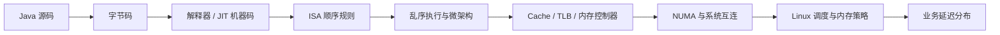
## 1. 先建立边界：机器模型不是一张固定的金字塔
教科书常画出一座整齐的金字塔：寄存器、L1、L2、L3、DRAM，越往下越大、越慢。 它适合帮助入门，却不足以指导生产优化。 现实机器可能有：

- 分离的 L1 指令缓存与数据缓存；
- 每核心私有的 L2，也可能由多个执行单元共享某一级缓存；
- 由若干 slice 组成、按地址散列的末级缓存；
- 不同核心簇、chiplet 或 die 之间不同的访问距离；
- 非包含、近似包含或排他的缓存策略；
- 性能核与能效核构成的混合拓扑；
- 带宽、容量、共享范围都不同的内存层次；
- 虚拟机或容器进一步裁剪后的可见 CPU 集合。

甚至“L3 是全插槽共享的”也不是可以跨机器复制的假设。 Linux 的 x86 拓扑文档明确指出，内核需要借助厂商特定的 CPUID leaf 枚举处理器拓扑和缓存层次；换句话说，拓扑是**运行时发现的机器属性**，不是 Java 代码里的常量。[Linux x86 topology](https://docs.kernel.org/arch/x86/topology.html)

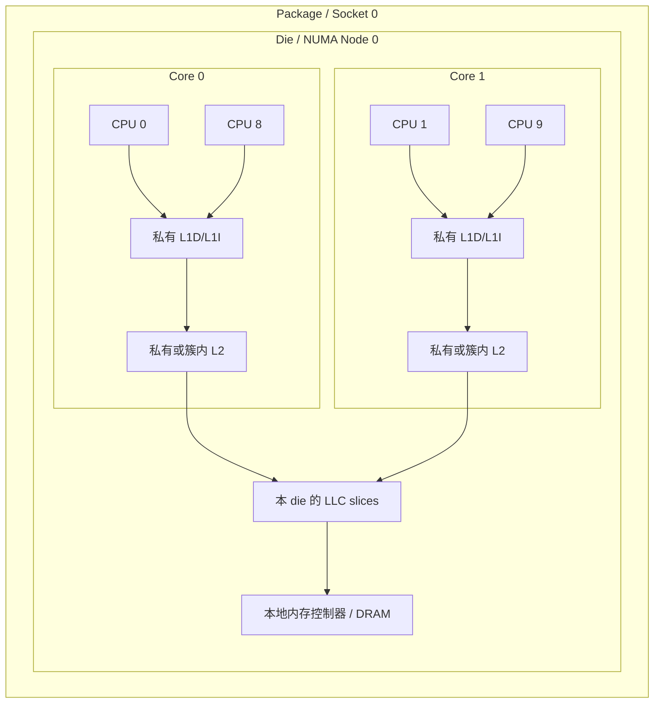

图只是一个可能的拓扑，不是规格承诺。
### 先发现目标机器，而不是背参数
在 Linux 上，至少保存以下信息：

```bash
lscpu -e=CPU,CORE,SOCKET,NODE,CACHE,ONLINE
lscpu
numactl --hardware
uname -a
java -version
```

然后直接检查 sysfs，而不是只相信人类可读摘要：

```bash
for index in /sys/devices/system/cpu/cpu0/cache/index*; do
  printf '%s: ' "$index"
  paste -d ' ' "$index"/{level,type,size,coherency_line_size,shared_cpu_list}
done
```

关键字段包括：

- `level`：缓存级别；
- `type`：Data、Instruction 或 Unified；
- `size`：该实例报告的容量；
- `coherency_line_size`：一致性粒度所用的 line size；
- `shared_cpu_list`：哪些逻辑 CPU 共享这个缓存实例；
- `ways_of_associativity` 与 `number_of_sets`：若平台导出，可帮助理解冲突失效。

不要把某次读取到的 64 字节 Cache Line 推广成“Java 规范规定 64 字节”。 Java SE 没有规定硬件 Cache Line 大小；即使主流服务器常见 64 字节，也必须查询目标硬件。
### 容量、延迟和带宽是三件事
“数据放进 L3 就快”过于粗糙。 至少要区分：

- **容量**：理论上能容纳多少数据；
- **命中延迟**：依赖链上的一次访问要等待多久；
- **吞吐能力**：单位时间能服务多少并行访问；
- **共享与竞争**：还有哪些核心或设备在使用同一资源；
- **可达带宽**：访问模式、并发度和内存控制器共同决定的结果。

独立 load 可以重叠，指针追逐却形成依赖链。 所以，随机链表的单次访问延迟和连续数组扫描的每元素成本不能互相替代。 Intel 的优化手册也把微架构特性、数据访问、预取、分支与拓扑分开讨论，而不是提供一个适用于所有处理器的固定“缓存延迟表”。[Intel Optimization Reference Manual](https://www.intel.com/content/www/us/en/developer/articles/technical/intel64-and-ia32-architectures-optimization.html)
## 2. 数据移动、所有权与局部性

### Cache Line：硬件搬运与争用的基本粒度
CPU 通常不会只为一个 `long` 从下一层取 8 字节。 缓存以 Cache Line 为基本块保存数据，一致性协议也围绕 line 的所有权和状态协调。 如果当前机器的 line 是 64 字节，那么访问其中一个 8 字节字段，通常会把包含它的整条 line 带入相应缓存层次。 这既是空间局部性的来源，也是伪共享的根源。

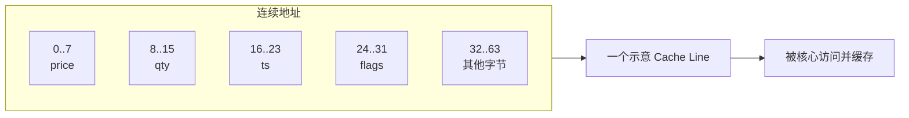

这张图里的 64 字节只是示意。 真正的结论是：**硬件搬运与共享的粒度通常大于 Java 字段的粒度。**
#### 时间局部性与空间局部性
时间局部性表示：刚访问的数据很快还会再次访问。 空间局部性表示：访问某个地址后，很可能继续访问附近地址。 典型受益者是紧凑数组和按顺序消费的 Ring Buffer：

```java
long sum = 0;
for (int i = 0; i < prices.length; i++) {
    sum += prices[i];
}
```

相反，多层对象引用会让一次业务操作变成多次位置不相关的加载：

```java
Order order = orders[i];
Instrument instrument = order.instrument();
RiskLimit limit = instrument.account().riskLimit();
```

“对象设计更自然”和“访问路径更局部”并不总是同一个目标。 但也不能反向得出“所有对象都应改成数组”。 如果算法每次确实同时使用对象里的大多数字段，紧凑的 AoS 可能比拆散后的 SoA 更局部；应按真实访问集合选择布局。
#### Working Set 比对象总大小更有解释力
工作集是某个时间窗口内频繁访问的数据与代码集合。 一个 20 GB 进程的热路径可能只有几百 KB；一个只有 200 MB 的进程，也可能因随机扫描和共享写入而不断冲掉缓存。 设计实验时应控制：

- 数据集大小；
- 热字段集合；
- 访问步长；
- 读写比例；
- 并发线程数；
- 数据是否跨页、跨节点；
- 预热后工作集是否已经进入稳态。

只报告“对象有多少个”不能解释缓存行为。
### Cache Coherence 不等于内存顺序，更不等于 JMM
这是全文最重要的边界。 **缓存一致性（cache coherence）**关注同一内存位置的缓存副本怎样保持一致。 **内存一致性模型（memory consistency model）**关注多个内存操作被不同观察者以什么顺序看见。 **Java Memory Model**再向上规定 Java 线程中的动作、同步顺序、happens-before、可见性与允许的执行结果。 三者互相关联，但不是同一层概念。

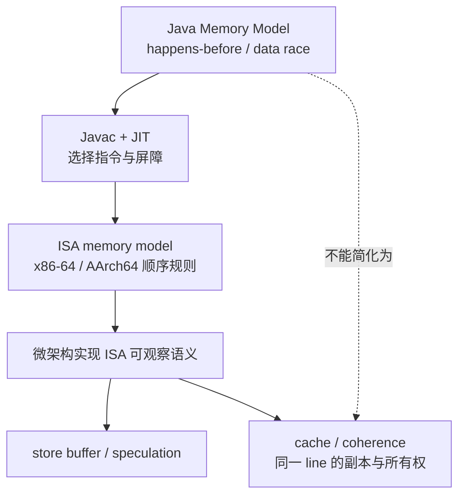

硬件保持 coherent，不代表下面的 Java 程序正确：

```java
int payload;
boolean ready;

// Thread A
payload = 42;
ready = true;

// Thread B
if (ready) {
    use(payload);
}
```

若没有同步动作，这里存在 data race。 编译器优化、指令顺序与处理器可见顺序都可能使 Thread B 的观察不符合作者的直觉。 正确做法是使用 `volatile`、锁、VarHandle 的匹配 release/acquire，或更高层并发结构建立 happens-before。 Arm 对缓存一致性和内存访问顺序也分别解释：硬件 coherent 可以使共享位置最终呈现一致视图，却不自动规定不同位置的访问观察顺序。[Arm cache coherency fundamentals](https://developer.arm.com/community/arm-community-blogs/b/architectures-and-processors-blog/posts/extended-system-coherency---part-1---cache-coherency-fundamentals) [Arm memory access ordering](https://developer.arm.com/community/arm-community-blogs/b/architectures-and-processors-blog/posts/memory-access-ordering---an-introduction)
#### MESI 适合解释所有权，不适合冒充全部实现
MESI 常用四种抽象状态帮助理解：Modified、Exclusive、Shared、Invalid。 当核心 A 要写一条也被核心 B 缓存的 line 时，A 需要取得写所有权，B 的副本会被失效或降级；如果所有权频繁在核心间移动，就会出现 cache-line bouncing。

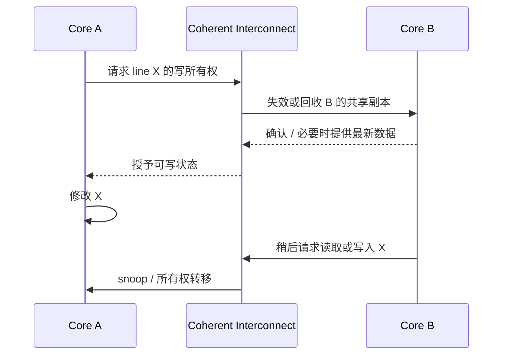

然而生产处理器可能采用 MESIF、MOESI、目录协议、snoop filter、不同的 LLC 策略以及厂商特定优化。 因此文章和排障记录可以用 MESI 讲机制，但不要声称“CPU 内部一定只有这四个状态”。
#### “刷新到主内存”通常是误导性的 Java 解释
`volatile` 写的语义重点是：在 JMM 中建立同步关系，并由 JVM 在目标 ISA 上生成足够的顺序约束。 它不要求每次都把数据写到 DRAM，再让读线程从 DRAM 读取。 最新数据可能通过 coherent cache hierarchy 和缓存间传输被观察到。 把 `volatile` 解释为“强制刷新主内存”会掩盖三个事实：

1. Java 规范定义的是程序可观察语义，不是某条缓存指令；
2. x86-64 与 AArch64 可能需要不同的机器指令序列；
3. 同样正确的同步仍可能引发严重的 Cache Line 所有权争用。 正确性问题看 JMM；物理争用问题看布局、写入拓扑和硬件计数器。
### Store Buffer：为什么写入能继续，别人却还没看见
如果每个 store 都必须等待缓存一致性事务完成，核心会频繁停住。 现代处理器通常让已执行的 store 先进入内部缓冲结构，再按体系结构规则对其他观察者变得可见。 这类结构常被概括为 store buffer。

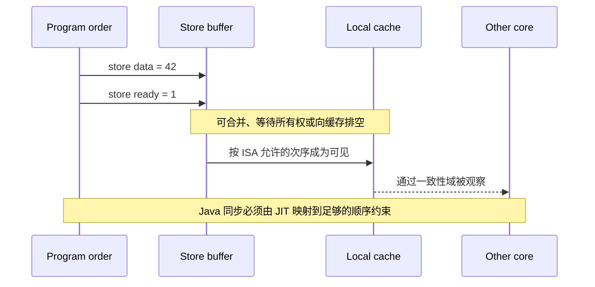

不能从这张图推导“所有 CPU 都会以同样方式重排”。 体系结构定义软件可见的允许结果；store buffer 是一种常见微架构解释。 Intel 的内存排序规则收录在 Software Developer’s Manual 中，AMD64 与 Arm 又各有自己的体系结构规则。[Intel Software Developer’s Manual](https://www.intel.com/content/www/us/en/developer/articles/technical/intel-sdm.html) [AMD64 Architecture Programmer’s Manual Volume 2](https://docs.amd.com/v/u/en-US/24593_3.44_APM_Vol2)
#### Store buffer 与写合并并不是免费的无限队列
如果持续写入的 line 尚未取得所有权，或下游缓存和互连无法及时接收，缓冲结构可能形成压力。 这时表现可能是：

- store 吞吐降低；
- 机器清空缓冲的等待增多；
- 原本能并行的 load 被依赖或资源约束阻塞；
- 同一 line 在核心间反复转移；
- 尾延迟随竞争线程增加而陡升。

不要用“写只是放进 buffer，所以很便宜”给共享计数器背书。 单线程低成本，不代表多核心所有权迁移也低成本。
#### Fence 是顺序工具，不是缓存加速器
Fence 或由同步操作产生的屏障用于限制可见顺序。 它们不是把任意数据“预热进 L1”的工具，也不会消除共享写争用。 过多 fence 可能限制乱序执行与内存级并行；过少则可能破坏正确性。 顺序应从并发协议推导，再让 JDK 的锁、原子类或 VarHandle 表达；不要先按性能直觉删除屏障。
### True Sharing 与 False Sharing
两个线程真的修改同一个逻辑状态，叫 true sharing。 两个线程修改不同字段，但字段碰巧落在同一条 Cache Line，叫 false sharing。 两者都会导致 line 所有权移动；区别在于是否存在业务上的共享必要性。

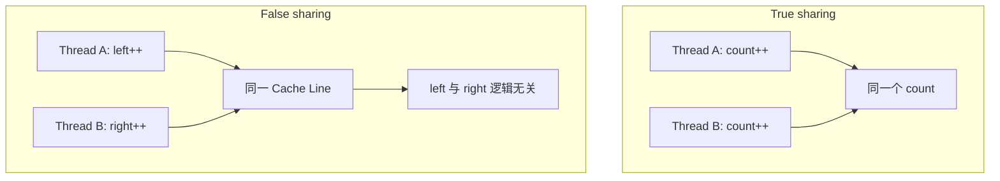
#### True sharing：先改协议，再谈 padding
如果所有线程都更新同一个精确总数，给字段周围填充 128 字节也不能消除所有权竞争。 更有效的方向通常是：

- 每线程或每分片累计，读取时聚合；
- 把写入交给 single writer；
- 批量合并多个更新；
- 降低严格全局可见的频率；
- 把业务状态划分到互不共享的所有者。

这些改变可能会调整读取语义。 例如 `LongAdder` 在高竞争下提升更新吞吐，但 `sum()` 不是与更新线性化的瞬时快照；不能无条件替换需要严格原子值的 `AtomicLong`。[JDK 25 LongAdder](https://docs.oracle.com/en/java/javase/25/docs/api/java.base/java/util/concurrent/atomic/LongAdder.html)
#### False sharing：不同地址仍会争同一所有权
看似没有共享：

```java
final class PairCounters {
    volatile long left;
    volatile long right;
}
```

Thread A 只写 `left`，Thread B 只写 `right`。 如果两个字段位于同一条 line，它们仍会一起参加一致性协议。 线程数增加时，性能可能不是平缓下降，而是在跨核心、跨簇或跨插槽后突然恶化。 Linux 内核的 false sharing 文档把它定义为独立数据共享同一 Cache Line 导致的竞争，并建议在热点确认后使用 `perf c2c` 定位具体 line 和偏移。[Linux false sharing documentation](https://docs.kernel.org/kernel-hacking/false-sharing.html)
#### Padding 不是“多写几个 long”这么简单
手工写占位字段存在边界：

- Java 不承诺普通对象字段按源码声明顺序布局；
- 对象起始地址未必正好按 Cache Line 对齐；
- HotSpot 版本、压缩指针和对象对齐选项会影响布局；
- 对象可能被 GC 移动；
- 相邻对象是否落在同一 line 也不能靠肉眼判断；
- padding 增加 footprint，可能反过来制造缓存和 TLB 压力。

OpenJDK 的 JEP 142 引入了 HotSpot 的 contended padding 机制，目的正是减少指定字段或对象的缓存争用；它同时明确指出 padding 会增加内存占用。[JEP 142](https://openjdk.org/jeps/142) 但应用代码面对的是 `jdk.internal.vm.annotation.Contended` 这一内部注解，而不是 Java SE 的可移植公共 API。 普通应用类在编译时需要显式导出内部包，HotSpot 默认又会限制应用类使用该注解，因此运行时还要关闭限制：

```bash
javac --add-exports java.base/jdk.internal.vm.annotation=ALL-UNNAMED \
  ContendedCounters.java
java --add-exports java.base/jdk.internal.vm.annotation=ALL-UNNAMED \
  -XX:-RestrictContended ContendedCounters
```

这些参数只是让特定 HotSpot 配置尊重注解，不构成对象必然按某个地址对齐的 Java SE 承诺。 优先考虑改变所有权和分片；确需 padding 时，应把参数纳入部署合同，并用 JOL 和硬件计数器复核**实际运行版本**的布局与效果。
#### 数组 stride 也必须验证
把每线程计数器放进数组，并让索引相隔若干元素，是常见实验手法：

```java
static final int STRIDE = 16;
long[] counters = new long[threadCount * STRIDE];

void increment(int threadIndex) {
    counters[threadIndex * STRIDE]++;
}
```

如果 `long` 为 8 字节，stride 16 提供 128 字节的逻辑间隔。 它能减少同一 line 的概率，却仍不是“元素必定处在 128 字节对齐边界”的 Java 规范保证。 并且更大的 stride 会触碰更多 Cache Line 和页面。 实验应比较多个 stride，并结合 `perf c2c`、对象布局和结果曲线，而不是只验证最快的那个点。
### AoS 与 SoA：布局要匹配访问集合
Array of Structures 把一条记录的字段放在一起。 Structure of Arrays 把同一种字段放在一起。

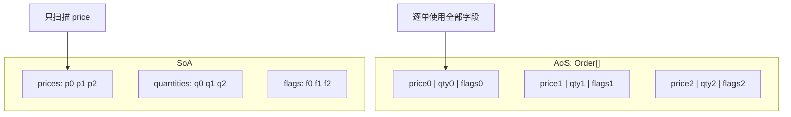
#### 只扫描少数字段时，SoA 往往更省带宽
假设风控只扫描 `price` 与 `quantity`，而对象还包含字符串、时间戳、状态和引用。 AoS 可能把这次计算不需要的字节一起带入 Cache Line。 SoA 可以让热字段连续，提升空间局部性，也更容易形成向量化机会。 Intel 的 NUMA 与数据布局指导使用 key 数组和 data 数组的示例说明：若循环只搜索 key，把不使用的数据一起搬入 Cache 会浪费传输。[Intel NUMA software approach](https://www.intel.com/content/www/us/en/developer/articles/technical/hardware-and-software-approach-for-using-numa-systems.html)
#### 每次都需要整条记录时，AoS 可能更合适
撮合热路径若读取 `price`、`quantity`、`side`、`orderId` 并立即更新状态，把它们拆成多个远离的数组可能增加独立地址流和 TLB 压力。 因此选择不是宗教问题，而是访问矩阵：

| 访问模式 | 倾向 | 需要验证的代价 |
| --- | --- | --- |
| 批量只读一两个数值列 | SoA | 多数组索引、写回同步 |
| 逐记录使用几乎全部热字段 | 紧凑 AoS | 冷字段是否混入 line |
| 热字段少、冷字段大 | Hot/Cold split | 额外间接访问 |
| 多线程按分片写独立列 | 分片 SoA | 页面与 NUMA 放置 |
| 对象关系复杂、更新稀疏 | 普通对象 | 指针追逐和分配成本 |
#### Java 对象不是 C struct
Java 对象通常包含对象头，引用指向独立对象；数组对象也有自己的头和对齐规则。 字段布局是 JVM 实现细节，不应把 C 的 `sizeof(struct)` 推导直接套到 Java。 OpenJDK JOL 项目可以检查指定 JDK 运行时的对象布局，但它给出的是**该环境下的观测**，不是 Java SE 永久承诺。[OpenJDK JOL](https://github.com/openjdk/jol) 上线记录应保存：

- JDK vendor 与完整版本；
- `UseCompressedOops`、`UseCompressedClassPointers` 等相关设置；
- 对象布局输出；
- 数据集实际 footprint；
- GC 与分配率变化；
- 同一负载下的硬件计数器。
### Hardware Prefetch：连续访问的朋友，也可能是噪声放大器
处理器会尝试识别连续或规则的访问流，提前把可能需要的数据带近核心。 这能隐藏一部分内存延迟，也是数组顺序扫描快于随机指针追逐的重要原因之一。

#### 预取没有独立的正确性语义
预取是性能机制。 它可能改变 Cache Line 到达核心附近的时间，却不会建立 happens-before，也不能代替 acquire、release、锁或原子操作；cache fill 仍受硬件一致性协议管理。 因此跨线程发布是否正确，只能由同步协议证明，不能由“数据大概已经预取进来了”证明。
#### 预取也会消耗资源
过度或错误的预取可能：

- 提前搬入最后根本没用的数据；
- 占用缓存容量，驱逐真正的热数据；
- 消耗内存带宽；
- 在多流并发时增加控制器压力；
- 让单线程吞吐提高，却扩大其他请求的尾延迟。

所以不要把“顺序访问”简化为“永远最快”。 如果顺序扫描的数据集远大于缓存并争夺共享带宽，它仍可能拖慢延迟敏感线程。
#### 软件预取必须晚于布局优化
JDK 普通 Java API 没有一个可移植的“把这个地址预取到 L1”保证。 JIT、Vector API、native library 或特定指令可能间接或显式使用预取，但收益强依赖处理器和访问距离。 优先顺序通常应是：

1. 去掉不必要的内存访问；
2. 压缩热数据；
3. 让访问连续；
4. 减少共享写；
5. 用计数器确认 memory bound；
6. 最后才实验软件预取。
### Branch Prediction：不要把所有 `if` 都改成位运算
现代 CPU 会预测条件分支的方向和目标，让后续指令提前进入流水线。 预测正确时，分支可能很便宜；预测错误时，错误路径上的推测工作需要被丢弃，并从正确路径恢复。

#### 可预测分支与随机分支差别很大
状态机中的稳定路径、循环退出和高度偏斜的条件通常容易预测。 接近随机的输入、数据相关的比较树或不断变化的模式更难预测。 因此基准数据分布必须接近生产：

- 不能用全相等输入代表订单价格分布；
- 不能用严格交替模式代表真实状态；
- 不能只测排序后的数据，再外推随机数据；
- 也不能只测随机数据，否定生产中高度稳定的分支。
#### Branchless 不是自动更快
所谓 branchless 写法可能引入：

- 更多指令；
- 更长的数据依赖链；
- 无论是否需要都执行的 load；
- 更复杂的可读性与边界条件；
- JIT 无法按预期生成的机器码。

应检查汇编和 `branch-misses`，并比较端到端尾延迟。 不要凭源码形状断言“没有 `if` 就没有分支”：JIT 可能把条件表达式生成分支，也可能生成条件移动；实现随平台变化。
## 3. 地址翻译与硬件拓扑

### TLB 与 Page：地址翻译也有工作集
Java 代码使用虚拟地址。 CPU 访问数据前需要得到物理页映射；页表保存映射，Translation Lookaside Buffer 缓存近期地址翻译。 TLB miss 不等于数据 Cache miss，它们是两条不同的问题链。

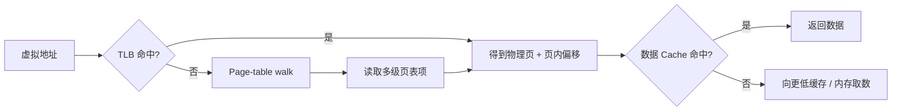
#### 大 footprint 会同时影响 Cache 和 TLB
把每个计数器填充到 256 字节，可能消除 false sharing，却让同样数量的计数器跨越更多页面。 结果可能是：

- false sharing 降低；
- LLC footprint 增大；
- dTLB miss 增加；
- 页表遍历增加；
- GC 扫描和内存占用增加。

优化必须看完整成本，不应只庆祝一个计数器下降。
#### Page fault 与 TLB miss 不是一回事
TLB miss 可以通过遍历已经存在的页表完成。 Page fault 则表示当前页表状态不足以完成访问，需要内核介入；它可能是首次为匿名页建立映射的 minor fault，也可能涉及存储 I/O 等更重路径。 测冷启动、预触页和稳态时，要把两者分开。
#### Huge Page 的收益和代价
更大的页可以让一个 TLB entry 覆盖更多地址空间，从而降低某些大工作集的翻译压力和页表开销。 但 HugeTLB 与 Transparent Huge Pages 不是一个开关，也不是无风险加速：

- 支持的页大小依平台和内核配置而定；
- 显式 HugeTLB 通常需要预留与容量管理；
- THP 的分配、折叠、拆分和回收可能影响延迟；
- 大页会增加内部碎片和迁移粒度；
- 虚拟机、容器与宿主机策略可能不一致；
- 某些工作集根本不是 TLB bound。

Linux 分别维护 [HugeTLB](https://docs.kernel.org/admin-guide/mm/hugetlbpage.html) 与 [Transparent Hugepage](https://docs.kernel.org/admin-guide/mm/transhuge.html) 文档；上线前应检查实际模式与每进程映射，而不是只看启动参数。

```bash
grep -E 'Huge|AnonHuge' /proc/meminfo
cat /sys/kernel/mm/transparent_hugepage/enabled
cat /proc/$PID/smaps_rollup
```

`-XX:+AlwaysPreTouch` 可以把一部分首次触页工作前移到 JVM 启动阶段，但它不自动证明页被放到了正确 NUMA 节点，也不等于启用 Huge Page。 需要同时验证 JVM、内核、CPU affinity 与 memory policy。
### NUMA：线程在哪里跑，页面就应该在哪里吗
NUMA 的核心事实不是“有多个 Socket”，而是不同 CPU 到不同内存目标的带宽与延迟不均匀。 同一 Socket 内也可能存在多个 NUMA node；有些系统还存在无 CPU 的 memory-only node 或异构内存层次。 Linux 可在 sysfs 中导出节点之间的拓扑，以及平台提供时的读写延迟和带宽属性。[Linux NUMA memory performance](https://docs.kernel.org/admin-guide/mm/numaperf.html)

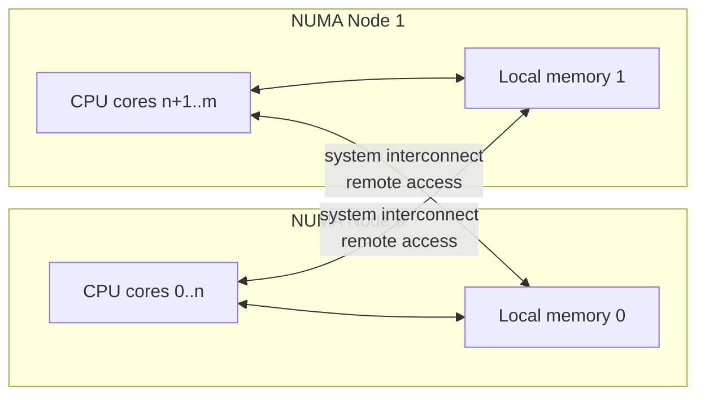
#### First-touch 是结果，不是 Java 语法
Linux 的系统默认策略通常优先从发起分配的 CPU 所在节点做 local allocation；匿名页往往在首次实际 fault 时才取得物理页。[Linux NUMA overview](https://docs.kernel.org/mm/numa.html) [Linux NUMA memory policy](https://docs.kernel.org/admin-guide/mm/numa_memory_policy.html) 这形成常说的 first-touch 效果：谁先触碰页面，会显著影响页面初始放置。 但“Java 线程 `new` 了数组”不一定等于它逐页触碰了全部 backing memory。 还要考虑：

- TLAB 和堆区域由 JVM 管理；
- 零页、延迟分配与预触页；
- GC 初始化和迁移；
- 初始化线程在哪个 CPU 上运行；
- 进程、VMA、cpuset 与容器的 memory policy；
- 自动 NUMA balancing 是否迁移页或任务；
- 节点内存不足后的 fallback。
#### 单线程初始化会制造远端访问
一个常见错误流程是：

1. 主线程恰好运行在 Node 0；
2. 主线程顺序初始化整个大数组；
3. 工作线程一半固定在 Node 0，一半固定在 Node 1；
4. Node 1 的工作线程长期读取 Node 0 的页面。

修复不一定是简单的 `numactl --interleave=all`。 如果每个 worker 只处理自己的分片，更合理的办法可能是：固定 worker，分别由每个 worker 初始化并拥有自己的页。 如果所有 worker 均匀读取全数据，interleave 才可能平衡带宽，但会让每个 worker 同时产生本地和远端访问。 策略必须匹配所有权模型。
#### CPU affinity 与 memory policy 必须成对设计
只用 `taskset` 固定线程，不会自动迁移既有页面。 只用 `numactl --membind` 固定内存，也不能阻止线程被调度到远端 CPU。 实验应至少区分：

```bash
# 软偏好，目标节点不足时允许 fallback
numactl --cpunodebind=0 --preferred=0 java ...

# 硬绑定，目标节点不满足时可能分配失败
numactl --cpunodebind=0 --membind=0 java ...

# 跨节点按页交错，常用于比较带宽而非保证最低单次延迟
numactl --interleave=all java ...
```

生产容器还要记录 cpuset CPU 和允许的 memory nodes。 Linux 内存策略受 cpuset 约束，策略只影响安装之后分配的页面；已经 fault 的页不会因为后来改变 task policy 就自动重新放置。
#### Remote 不应写成固定倍率
远端访问通常需要经过额外互连，并与其他流量竞争，因此可能有更高延迟和更低的有效带宽。 但代价取决于：

- CPU 与内存的实际距离矩阵；
- 是否命中远端核心的缓存或远端 DRAM；
- 访问是依赖链还是可并行流；
- 互连负载；
- BIOS 的 NUMA / NPS / SNC 等设置；
- 页迁移与线程迁移；
- 处理器型号与内存配置。

不要在文章、报警或容量模型里写“远端内存固定慢 2 倍”。 应在目标 SKU 上分别测 latency、bandwidth 和业务尾延迟。
### SMT：两个逻辑 CPU 不等于两个完整核心
Linux 把 hardware thread 暴露为逻辑 CPU。 同一物理核心上的 SMT siblings 会共享至少一部分前端、执行、缓存或其他微架构资源；具体共享内容随处理器而变。

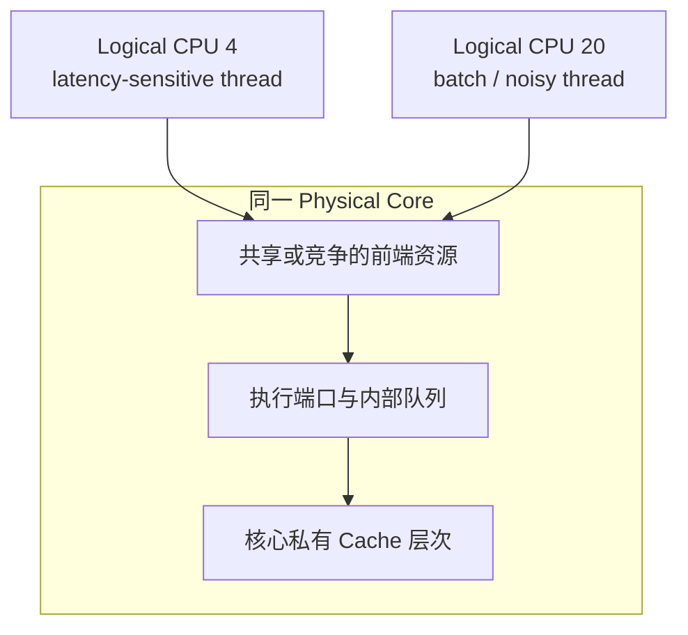

SMT 可以在一个 thread 等待时利用空闲资源，提高总吞吐。 它也可能让一个延迟敏感线程受到 sibling 上批处理、加密、压缩或内存流量的干扰。 所以“关闭 SMT 一定更低延迟”和“SMT 一定白送一倍吞吐”都不成立。
#### 先找 sibling，再设计线程拓扑
```bash
cat /sys/devices/system/cpu/cpu4/topology/thread_siblings_list
cat /sys/devices/system/cpu/cpu4/topology/core_id
cat /sys/devices/system/cpu/cpu4/topology/physical_package_id
```

实验至少比较：

- 单物理核心单线程；
- 同核心两个 SMT sibling；
- 不同物理核心；
- 同 NUMA node 的不同核心；
- 跨 NUMA node；
- sibling 空闲与 sibling 运行代表性噪声时。

线程数不应只按 `Runtime.getRuntime().availableProcessors()` 机械决定。 JDK 25 文档说明 `availableProcessors()` 返回 JVM 可用的处理器数，并且该值在一次 JVM 运行中都可能变化；它没有告诉应用哪些逻辑 CPU 共享物理核心、缓存或 NUMA node。[JDK 25 Runtime](https://docs.oracle.com/en/java/javase/25/docs/api/java.base/java/lang/Runtime.html)
## 4. 从设计上减少数据移动
CPU 优化最常见的误区是先调参数，再保留一个到处共享的状态模型。 更稳健的顺序是先减少跨所有者的数据移动。
### Single writer
把某片状态的修改权交给一个线程：

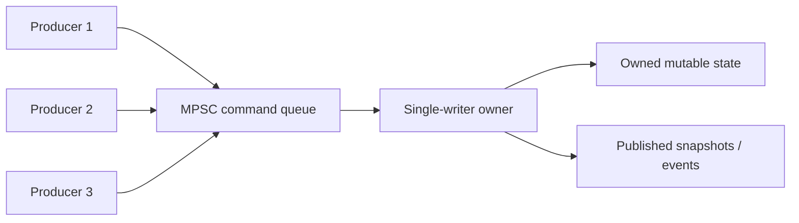

它不意味着整个系统只有一个线程。 可以按账户、品种、连接或分区分配多个 owner，只要同一可变状态在任一时刻有明确所有者。 代价是命令排队、跨分区操作和负载倾斜，需要靠容量和路由设计解决。
### Read mostly snapshot
配置、产品主数据和风控参数若读多写少，可以发布不可变快照，让读线程只读本地缓存副本。 更新时建立正确的发布边界，避免每次查询都争用一把锁。 这把 true sharing 从“每次读取”降低为“版本切换时发布”。
### 分片计数与批量聚合
监控计数常不需要每次更新都提供全局线性一致快照。 每线程计数、周期聚合可以大幅减少所有权迁移。 但业务资金、Sequence 或限额扣减可能需要严格语义，不能为了缓存友好而偷偷改成最终一致。 先写不变量，再选择分片策略。
## 5. 从 JMH 到硬件计数器

### JMH：怎样做一个不自欺的 Cache 实验
JMH 能帮助处理预热、fork、计时与死代码消除等 JVM 微基准问题，但它不会自动控制：

- 线程被放到哪个核心；
- 两个 worker 是否为 SMT siblings；
- 页面位于哪个 NUMA node；
- 字段实际位于哪条 Cache Line；
- 频率、功耗与系统噪声；
- PMU 事件是否被复用；
- 测试负载是否代表生产。

OpenJDK JMH 自己也提醒：harness 不能神奇消除基准陷阱，基准仍需要同行审查。[OpenJDK JMH](https://github.com/openjdk/jmh)
#### 一个实验矩阵，而不是一场最快成绩
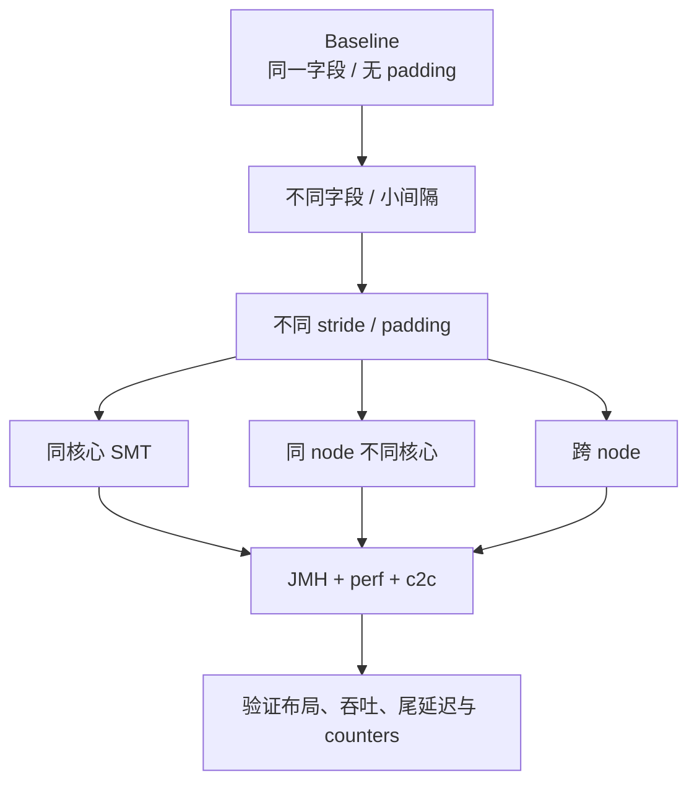

建议矩阵包括：

| 变量 | 取值示例 | 目的 |
| --- | --- | --- |
| writer 数 | 1、2、4、8 | 找扩展拐点 |
| 共享类型 | 同字段、同 line 不同字段、分离 line | 区分 true/false sharing |
| CPU 位置 | SMT sibling、同 node、跨 node | 区分资源与拓扑 |
| 工作集 | L1 级、LLC 级、远大于 LLC | 区分容量与争用 |
| 访问方式 | 顺序、固定步长、随机 | 观察预取与 TLB |
| page 策略 | 默认、THP、显式实验策略 | 检查翻译成本 |
| NUMA 策略 | local、bind、interleave | 观察页面放置 |
#### 基准状态域要符合共享关系
JMH 的 `@State` scope 会决定状态在 worker 间如何共享。 要测 false sharing，需要让不同线程并发修改处于同一对象或同一 backing array 中的不同位置；如果每个线程拿到完全独立的状态实例，实验根本没有制造目标现象。 反过来，想测单线程字段访问时若错误共享状态，就会把竞争混进单位成本。 OpenJDK JMH samples 中的 false-sharing 示例展示了从直接共享、层级 padding 到 contended padding 的不同方案，适合作为实验设计参考，而不是直接复制结论。[JMHSample_22_FalseSharing](https://github.com/openjdk/jmh/blob/master/jmh-samples/src/main/java/org/openjdk/jmh/samples/JMHSample_22_FalseSharing.java)

下面的骨架让每个 group 恰好有两个 writer，并让 `packed` 与 `spaced` 使用各自的 `Scope.Group` 状态。 返回递增结果使写入保持可观察；多个 fork 用来避免把一次 JIT 布局当成结论：

```java
@Fork(5)
@Warmup(iterations = 5)
@Measurement(iterations = 8)
@BenchmarkMode(Mode.AverageTime)
@OutputTimeUnit(TimeUnit.NANOSECONDS)
public class FalseSharingBenchmark {
    @State(Scope.Group)
    public static class Counters {
        final long[] values = new long[32];
    }

    @Benchmark @Group("packed") @GroupThreads(1)
    public long packedLeft(Counters s) {
        return ++s.values[0];
    }

    @Benchmark @Group("packed") @GroupThreads(1)
    public long packedRight(Counters s) {
        return ++s.values[1];
    }

    @Benchmark @Group("spaced") @GroupThreads(1)
    public long spacedLeft(Counters s) {
        return ++s.values[0];
    }

    @Benchmark @Group("spaced") @GroupThreads(1)
    public long spacedRight(Counters s) {
        return ++s.values[16];
    }
}
```

这仍不是完整的“绑核基准”：JMH 的方法名和 worker index 不等于 CPU 号。 运行脚本还要为每个 fork 设定 cpuset，记录 worker 实际落点，并分别比较 SMT sibling、同 NUMA node 与跨 node 场景。
#### 每个 fork 都要重新确认拓扑
`taskset` 可以限制整个 JVM 的 CPU 集合，但不能仅凭 JMH 的 thread index 保证 worker 与某个 CPU 一一对应。 如果实验依赖精确 sibling 或跨 node 配对，应：

1. 为每个场景使用明确 cpuset；
2. 在运行时记录线程实际 CPU；
3. 保存 `lscpu -e` 与 affinity；
4. 检查迁移计数；
5. 把定位手段写进实验脚本，而不是靠操作者记忆。
#### 常见 JMH 陷阱
- **死代码消除**：结果未消费，热循环被删掉；
- **常量折叠**：输入固定，计算在测量前完成；
- **共享域错误**：本应竞争的状态被复制，或本应独立的状态被共享；
- **只测一个 fork**：JIT 布局与系统噪声被误当成稳定结果；
- **预热不足**：编译、类加载、首次 fault 混入结果；
- **预热过度干净**：生产冷切换和突发行为被完全隐藏；
- **数据分布失真**：分支预测、命中率和工作集与生产不同；
- **GC 未纳入**：padding 或对象化后的 footprint 代价消失；
- **只报平均值**：拓扑迁移和周期性抖动被抹平；
- **未核对机器码**：源码直觉与 JIT 输出不一致。
#### Cache 冷暖不能靠一次 `System.gc()` 定义
没有可移植 Java API 能说“清空所有 CPU Cache”。 通过扫描大数组干扰缓存，也会同时影响 TLB、内存带宽、预取器和频率状态。 更诚实的做法是把实验命名清楚：

- 稳态热工作集；
- 每轮替换数据集；
- 随机大工作集；
- 冷进程启动；
- 故障切换后的首次访问。

不要把人为构造的“冷缓存”宣称为硬件精确清空。
### `perf stat`：计数器是证据，不是判决书
`perf stat` 可以运行命令并采集 PMU 与软件事件。 先看当前机器支持什么。 若要把硬件计数与 JMH 的测量操作对应，应优先让 JMH profiler 附着到 fork JVM，例如：

```bash
perf list
java -jar benchmarks.jar MachineModelBenchmark -prof perfnorm
```

`-prof perf` 提供原始计数，`-prof perfnorm` 把支持的计数归一到 benchmark operation；具体可用事件仍取决于 Linux perf 权限和当前 PMU。 相反，下面这种外层包裹只能作为**整个进程生命周期**的粗粒度诊断：它会同时覆盖 JVM 启动、预热和测量，若目标是 JMH，还会覆盖 host 与 fork JVM，不能把其 IPC/MPKI 直接对应到某个 JMH score。

```bash
perf stat -r 10 \
  -e task-clock,cycles,instructions,branches,branch-misses,\
cache-references,cache-misses,page-faults,context-switches,cpu-migrations \
  -- java -jar app.jar
```

常用派生量：

```text
IPC          = instructions / cycles
CPI          = cycles / instructions
Branch MPKI  = branch-misses / instructions * 1000
Cache MPKI   = cache-misses / instructions * 1000
```
#### IPC 不是统一成绩
高 IPC 可能表示流水线利用充分，也可能只是程序执行了很多便宜但无用的指令。 低 IPC 可能来自内存等待、分支错误、执行端口瓶颈、前端供给不足，也可能是不可并行的依赖链本来如此。 它只能在同一业务工作量、同一硬件和相近机器码下帮助比较。
#### `cache-misses` 不一定等于 LLC demand-load miss
通用事件名会映射到当前 PMU 提供的事件，其语义和可用性依处理器而异。 它可能不能准确回答：

- 是 L1、L2 还是 LLC miss；
- 是 demand load、prefetch 还是写回；
- 数据最终来自本地 DRAM、远端缓存还是远端 DRAM；
- miss 是否落在关键依赖链上。

使用 `perf list`、处理器事件文档和模型专用 metric group 核对定义。 `perf stat` 手册也允许 symbolic、raw 和 PMU-specific event，并报告计数器实际运行时间；这正说明事件不是跨机器无条件等价的抽象。[perf-stat manual](https://man7.org/linux/man-pages/man1/perf-stat.1.html)
#### 注意 multiplexing
硬件计数器数量有限。 一次请求过多事件时，perf 可能轮流启用不同事件并缩放计数。 输出中的 running percentage 明显低于 100% 时，事件并非全程同时测量。 对强烈阶段化的负载，缩放可能引入偏差。 应减少每组事件、重复运行，并保证各组负载稳定可比。
#### Cycles 不是墙钟时间
频率变化、Turbo、C-state、CPU migration 和混合核心会改变 cycles 的解释。 同时报告：

- `time elapsed`；
- `task-clock`；
- `cycles` 与 `instructions`；
- CPU migrations 与 context switches；
- 频率和功耗策略；
- 业务吞吐与延迟分布。

不能用 cycles 取代用户真正感受到的时间。
#### 不要把 miss 直接乘 line size 当成内存带宽
一个 miss 可能由相邻层、远端缓存或内存服务；预取、写分配、写回和一致性流量也会改变实际传输。 `cache-misses * 64` 只是一种非常粗糙且常常错误的估算，不是可靠的 DRAM bytes 指标。 需要带宽时使用平台支持的内存控制器 PMU、厂商工具或经过校准的带宽实验。
### `perf c2c`：从“怀疑伪共享”走到具体 Cache Line
`perf c2c` 用于 Shared Data Cache-to-Cache / HITM 分析，可以把高争用 Cache Line、访问指令或方法和 line 内偏移关联起来；只有调试信息与 JIT 映射链完整时，才可能进一步解析到 source line。基本流程：

```bash
cat /proc/sys/kernel/perf_event_paranoid
perf c2c record -- java -jar app.jar
perf c2c report --stdio
```

HITM 表示 load 命中了另一个缓存中处于 modified 状态的数据，是定位写共享的重要信号。

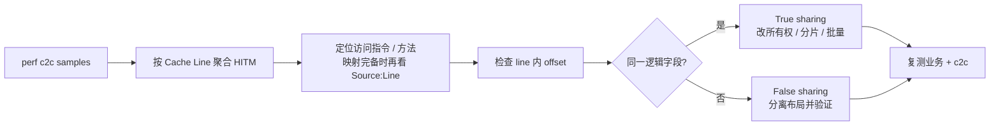
#### HITM 不是 false sharing 的自动证明
高 HITM 也可能是：

- 真共享锁字；
- 队列的 producer / consumer 协议字段；
- 引用计数；
- 热状态机版本号；
- 多字段但逻辑上必须一起更新；
- 内核或运行时数据结构，而非业务字段。

必须查看同一 line 上由哪些线程、指令和偏移访问，再结合业务所有权判断 true 还是 false sharing。 在受限容器或主机上，还要核对 `perf_event_paranoid`、`CAP_PERFMON` 等权限；拿不到事件与“没有争用”是两回事。

Java 符号也不会凭空出现。 `-XX:+PreserveFramePointer` 有助于展开调用栈，但不负责生成 JIT 符号；Linux 上可在目标进程存活时使用 `jcmd <pid> Compiler.perfmap`，或采用等价的 JIT/perf 集成生成映射。 即使报告能解析到方法和指令，移动 GC 下的采样地址也不能自动、稳定地证明“这就是某个 Java 字段”：仍要把 JOL 布局、字段 offset、访问线程和业务所有权交叉验证。
#### 支持能力依架构和 PMU 而异
`perf c2c` 在 Intel、AMD、PowerPC、Arm 上使用的硬件采样能力不同，部分处理器或内核组合不支持所需事件。 Arm64 通常依赖 SPE，AMD 支持范围也取决于 IBS 与具体代际。 上游手册明确列出了这些架构差异与限制。[perf-c2c manual](https://man7.org/linux/man-pages/man1/perf-c2c.1.html) 若命令不可用，不应把“没有样本”解释成“没有共享”。 应记录：

- CPU model；
- kernel 与 perf 版本是否匹配；
- `perf c2c record -e list`；
- `perf_event_paranoid` 与权限；
- 符号和 source line 是否可解析；
- 采样时间和负载阶段。
## 6. 一条可复现的诊断路径
当 p99.99 变差时，不要先搜索“Java Cache 优化参数”。 按下面顺序缩小问题：

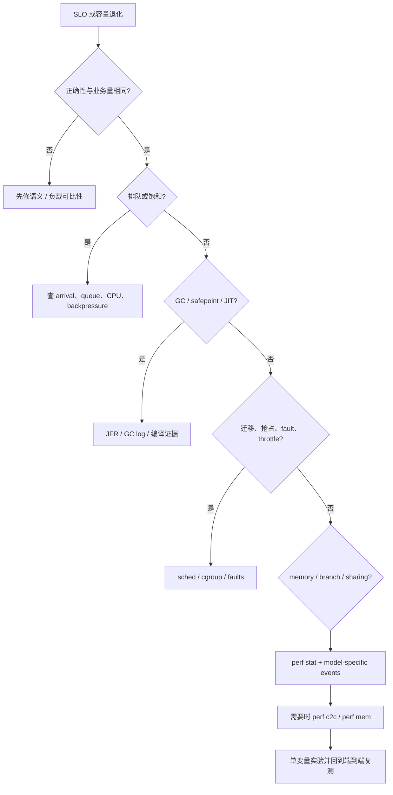
### 先确保同样的业务结果
优化前后必须相同：

- 接受的请求数；
- 拒绝、超时与错误策略；
- 数据一致性；
- 持久性级别；
- 输出内容；
- 批量边界；
- 线程与队列容量；
- 测试数据分布。

通过丢请求、放宽同步或延迟更新换来的“缓存优化”不具可比性。
### 一次只改变一个主要因子
不要同时：

- 改 padding；
- 开 Huge Page；
- 绑核；
- 换 GC；
- 改线程数；
- 升级 JDK。

否则即使结果变好，也无法知道原因。 先做受控微基准确认机制，再放入组件实验，最后回到端到端负载验证。
### 既要复现收益，也要复现退化
一个强证据不仅应在“优化后”更快，还应能：

1. 在制造 false sharing 时看到 HITM 与扩展性恶化；
2. 分离字段后看到 HITM 下降；
3. 把线程重新放到不利拓扑后，问题按模型回归；
4. 在不改变业务语义时重复得到相近结果。 能让问题消失，却不能按假设让它重新出现，因果证据仍不充分。
### 正确性不变量：性能优化不能穿透这些边界
缓存与 NUMA 优化前，先把不变量写进测试。
#### 发布不变量
若消费者观察到 `publishedSequence = n`，那么序号不大于 `n` 的 payload 必须已经完整可见。 不能为了减少 fence，把 sequence 提前发布。
#### 所有权不变量
任一可变分片在同一逻辑时刻最多有一个 writer；所有权转移必须经过明确协议。 线程 affinity 变化不等于业务所有权自动转移。
#### 计数不变量
若计数用于资金、限额或序列，它的读取语义必须明确：线性一致、快照一致还是最终聚合。 不能因为 `LongAdder` 更快就模糊语义。
#### 容量不变量
padding、分片和预触页后的内存上界必须可计算。 大页、`membind` 或预留失败时，系统必须有明确的启动失败或降级策略，不能悄悄落到未经验证的拓扑。
#### 恢复不变量
进程重启、故障切换和重新分片后，状态恢复结果必须与优化前一致。 “线程本地”或“节点本地”缓存不能成为唯一权威状态。
### 机器环境变化后必须重建基线

机器模型会因硬件、固件、内核、JDK 和容器策略改变而漂移。以下事件都应触发性能复验：

- 更换 CPU SKU 或云实例类型；
- BIOS / firmware / microcode 更新；
- kernel 或 perf 更新；
- JDK feature / update release；
- GC 或堆大小改变；
- 容器 cpuset、quota、NUMA 策略改变；
- 线程数或 affinity 改变；
- 对象布局、padding、批量或队列结构改变；
- THP / HugeTLB 配置改变；
- 同机部署新的高带宽工作负载。

## 7. 最终方法：从所有权到证据
低延迟机器模型可以压缩成七个问题：

1. **谁拥有这份可变状态？**
2. **一次业务操作实际触碰哪些字节？**
3. **这些字节如何分布在 Cache Line 和页面上？**
4. **线程运行在哪个 core、SMT sibling 与 NUMA node？**
5. **页面由谁首次触碰、最终放在哪个 node？**
6. **JMM 与 ISA 顺序是否满足正确性？**
7. **哪组实验和硬件计数器能够推翻当前假设？**

性能优化不是把每个字段都垫到 128 字节，也不是把每个线程都绑到 CPU 0。 它是尽量减少不必要的数据移动，让共享与业务所有权一致，并用可重复实验区分：容量、延迟、带宽、分支、翻译、争用、调度和 NUMA。 下一章 [LMAX Disruptor 4：Ring Buffer、消费拓扑与 Batch Rewind](/signal-grid-blog/posts/lmax-disruptor-ring-buffer-and-sequencing/) 会把这些原则落到 Sequence、gating、single writer 与消费者拓扑上。 后续的 [Agrona 2：DirectBuffer、并发队列与 Agent 执行模型](/signal-grid-blog/posts/agrona-direct-buffer-queues-and-agents/) 则会继续讨论紧凑 buffer、不同并发语义的队列与 Agent 所有权模型。 理解这些组件之前先理解机器模型，才能解释它们**为什么**在某些负载上快、在哪些拓扑上会退化，以及如何证明收益没有来自错误的测试边界。
## 参考资料
- [Intel 64 and IA-32 Architectures Optimization Reference Manual](https://www.intel.com/content/www/us/en/developer/articles/technical/intel64-and-ia32-architectures-optimization.html)
- [Intel 64 and IA-32 Architectures Software Developer’s Manuals](https://www.intel.com/content/www/us/en/developer/articles/technical/intel-sdm.html)
- [AMD64 Architecture Programmer’s Manual Volume 2](https://docs.amd.com/v/u/en-US/24593_3.44_APM_Vol2)
- [Arm: Cache Coherency Fundamentals](https://developer.arm.com/community/arm-community-blogs/b/architectures-and-processors-blog/posts/extended-system-coherency---part-1---cache-coherency-fundamentals)
- [Arm: Memory Access Ordering — an Introduction](https://developer.arm.com/community/arm-community-blogs/b/architectures-and-processors-blog/posts/memory-access-ordering---an-introduction)
- [Linux Kernel: x86 Topology](https://docs.kernel.org/arch/x86/topology.html)
- [Linux Kernel: False Sharing](https://docs.kernel.org/kernel-hacking/false-sharing.html)
- [Linux Kernel: NUMA Memory Policy](https://docs.kernel.org/admin-guide/mm/numa_memory_policy.html)
- [Linux Kernel: NUMA Memory Performance](https://docs.kernel.org/admin-guide/mm/numaperf.html)
- [Linux Kernel: HugeTLB Pages](https://docs.kernel.org/admin-guide/mm/hugetlbpage.html)
- [Linux Kernel: Transparent Hugepage Support](https://docs.kernel.org/admin-guide/mm/transhuge.html)
- [OpenJDK JEP 142: Reduce Cache Contention on Specified Fields](https://openjdk.org/jeps/142)
- [OpenJDK Java Microbenchmark Harness](https://github.com/openjdk/jmh)
- [OpenJDK JOL](https://github.com/openjdk/jol)
- [perf-stat manual](https://man7.org/linux/man-pages/man1/perf-stat.1.html)
- [perf-c2c manual](https://man7.org/linux/man-pages/man1/perf-c2c.1.html)
