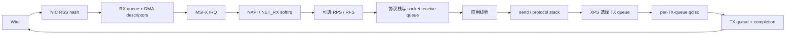
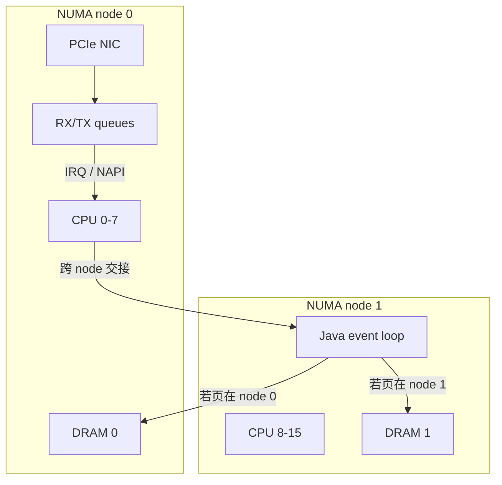
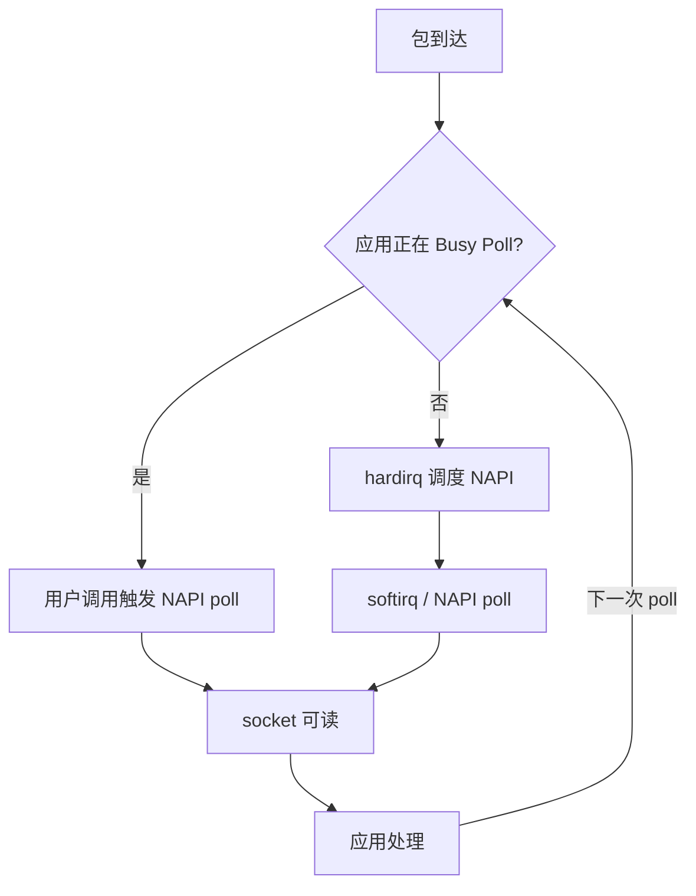

“把 Java 线程绑到 CPU 7，再关掉 `irqbalance`，延迟就稳定了。”

这类建议的问题，不只是过于绝对，而是跳过了真正需要证明的事情：包由哪条 NIC RX queue 接收？对应 IRQ 最终落在哪个逻辑 CPU？NAPI 和 `NET_RX` softirq 在哪里执行？RPS 是否又把包转交给另一个 CPU？应用线程在哪里读取 socket？它访问的堆、Direct Buffer 和状态页实际位于哪个 NUMA node？响应又由哪条 TX queue 发送和回收？

只固定应用线程，却不固定 IRQ、队列与内存，可能把一次随机迁移变成一次稳定的跨核或跨 NUMA 访问；把所有工作塞进同一个 CPU，又可能用局部性换来 IRQ 抢占、softirq 积压和突发时的队头阻塞。**Linux 低延迟调优的核心不是“绑核”，而是为数据路径建立可观察的所有权，使不必要的迁移、排队和唤醒变少，同时给必要的内核工作保留容量。**

这是“Java 低延迟工程”的 Chapter 06。[HotSpot 执行模型](/signal-grid-blog/posts/hotspot-execution-tlab-escape-analysis-jit-deoptimization-safepoint/) 已经解释 JVM 线程为什么会经历编译、去优化与 Safepoint，[低延迟 GC](/signal-grid-blog/posts/java-low-latency-gc-allocation-live-set-g1-zgc-shenandoah/) 则说明分配和回收怎样消耗 CPU 与内存余量；更早的 [机器模型](/signal-grid-blog/posts/java-low-latency-machine-model-cache-locality-false-sharing-numa/) 建立 Cache、伪共享与 NUMA 的物理边界，[测量方法](/signal-grid-blog/posts/java-low-latency-measurement/) 规定尾延迟主张必须怎样被证伪。本文把这些线程真正放进 Linux，以主线内核的通用网络栈、cgroup v2 和现代多队列 NIC 为边界。驱动、固件、虚拟化层、云厂商和发行版都可能改变可用接口；文中的 CPU 编号与参数只能作为实验形状，不能直接复制为生产配置。



## 1. 先把运行时画成五组映射，而不是一串开关

一条低延迟链路至少包含五组彼此独立、又必须相互对齐的映射：

1. **流到队列**：RSS 或显式硬件规则把网络 flow 映射到 RX queue；
2. **队列到 CPU**：队列的 MSI-X IRQ affinity 决定哪个 CPU 首先响应设备；
3. **内核处理到 CPU**：NAPI、softirq、RPS/RFS 决定上层协议处理是否留在该 CPU，还是发生一次跨 CPU 交接；
4. **业务到线程**：socket、acceptor、event loop 和业务分片决定最终由哪个线程消费；
5. **线程到内存与发送队列**：CPU affinity、NUMA policy 和 XPS 决定线程访问哪里的页、使用哪条 TX queue。

这五组映射中，任何一组都不能从另一组自动推出。把进程限制在 CPU 8–11，并不意味着 NIC IRQ 不会打到 CPU 8，也不意味着某个 Java event loop 固定在 CPU 9，更不意味着它的堆页在 NUMA node 1。`smp_affinity_list` 也只是 IRQ 的允许集合；支持 managed IRQ 的设备可能由内核管理最终位置，必须查看 `effective_affinity_list`。

| 资源 | 真正控制的问题 | 主要观察入口 | 常见误判 |
| --- | --- | --- | --- |
| RSS indirection / RX queue | 某个 flow 进入哪条硬件队列 | `ethtool -l/-x/-n`、队列计数器 | “多队列会自动均匀” |
| IRQ / NAPI | 谁接收通知并回收 RX/TX 完成 | `/proc/interrupts`、`effective_affinity_list`、`/proc/softirqs` | “IRQ 所在 CPU 等于应用 CPU” |
| RPS / RFS | 上层协议处理是否被转交 | `rps_cpus`、`rps_flow_cnt`、IPI 与 softirq 分布 | “开启就是多核加速” |
| 应用线程 | 谁读取 socket、修改业务状态 | `ps -L`、`/proc/<tid>/status`、应用线程名 | “进程绑核等于每个线程按角色绑核” |
| NUMA 页 | CPU 实际访问本地还是远端内存 | `numastat -p`、`/proc/<pid>/numa_maps` | “CPU 在 node 1，内存自然也在 node 1” |
| XPS / TX queue | 发送和 completion 由哪条队列承担 | `xps_cpus`、`xps_rxqs`、per-queue counters | “XPS 会把发送线程调度到指定 CPU” |

### 先记录机器事实

下面这组命令只读取状态，适合作为每次实验的拓扑快照：

```bash
lscpu -e=CPU,CORE,SOCKET,NODE,CACHE,ONLINE
numactl --hardware
uname -a

IFACE=eth0
ethtool -i "$IFACE"
ethtool -l "$IFACE"
ethtool -x "$IFACE"
ethtool -g "$IFACE"
ethtool -c "$IFACE"
readlink -f "/sys/class/net/$IFACE/device"
cat "/sys/class/net/$IFACE/device/numa_node"
grep -i "$IFACE" /proc/interrupts
```

这里的 `numa_node` 若为 `-1`，表示固件或内核不知道该 PCI 设备的节点，不等于 node 0。内核的 PCI sysfs ABI 也明确说，这个值来自 ACPI `_PXM` 等固件信息；若信息缺失或错误，首先应把它当作平台问题，而不是静默修改后继续假设。[PCI sysfs ABI](https://docs.kernel.org/admin-guide/abi-testing.html)

CPU 编号同样不是物理核心编号。两个逻辑 CPU 可能是同一核心的 SMT siblings，共享执行资源；某些服务器还存在多个 die、LLC domain 与 NUMA node。是否把 IRQ 与业务线程放到同一物理核心的两个 sibling 上，必须通过目标负载测试，不能从“CPU 利用率尚未到 100%”推断它们互不干扰。

## 2. 收包路径先由 RSS 与 IRQ 定位，再由 NAPI 和 RPS 决定是否转手

### RSS 选择的是 RX queue，不是业务线程

现代多队列 NIC 通常先对 IP 地址、端口等头字段计算 hash，再用 indirection table 把 hash 映射到 RX queue。同一 flow 在表不变时通常进入同一队列，这有利于顺序和缓存局部性；但它也意味着单个 elephant flow 不会因为机器有 32 条队列就自动使用 32 个 CPU。RSS 的职责是**硬件分流到队列**，不是理解 Java worker 的负载。

可以用 `ethtool` 查看队列数量、hash 字段和 indirection table：

```bash
ethtool -l eth0              # 当前与最大 channel 数
ethtool -x eth0              # RSS indirection table 与 hash key
ethtool -n eth0 rx-flow-hash tcp4
ethtool -S eth0              # 驱动提供的队列与丢包计数器，命名因驱动而异
```

Linux 的 [network scaling 文档](https://docs.kernel.org/networking/scaling.html) 给出了两个看似冲突、其实目标不同的方向：为低延迟分散队列可以缩短单队列排队；追求高包率效率时，又应选择“不会让任何处理 CPU 饱和的最少队列数”，因为更多队列也意味着更多 IRQ、ring、缓存工作集与协调成本。因此队列数的正确问题不是“是否等于 CPU 数”，而是：**当前 flow 分布下，最少多少条队列可以把每条队列的服务时间和积压控制在目标内？**

均匀的 indirection table 也不保证均匀的字节数、包数或计算成本。大量小流和一个超大流可能落到同一 queue；不同请求即使包率相同，协议与业务成本也可能不同。需要同时查看 per-queue packet/byte/drop delta，而不是只看配置表是否平均。

### IRQ 只负责通知，NAPI 才承担批量处理

队列收到数据时，NIC 通常通过 MSI-X vector 通知 CPU。驱动的中断处理不会为每个包完整跑一遍协议栈；常见路径是调度对应 NAPI instance，并在 NAPI 拥有该 instance 期间屏蔽或延后设备 IRQ。随后 NAPI poll 在 softirq 上下文批量回收 completion、处理 RX 包；如果 RX budget 耗尽而仍有工作，它会再次被 poll，而不必重新等待一次设备 IRQ。队列清空后，驱动完成 NAPI 并重新允许通知。[Linux NAPI](https://docs.kernel.org/networking/napi.html)

因此，下面三个数不能混成一个：

- 硬件 IRQ 次数；
- NAPI/`NET_RX` softirq 执行量与 CPU 时间；
- 最终进入应用的包数。

中断合并还会改变三者关系。提高 `rx-usecs` 或 `rx-frames` 可能减少 IRQ 并提高吞吐，却让首包等待更久；关闭合并可能降低轻载等待，却在高包率下产生 interrupt storm。`ethtool -c/-C` 暴露的是设备和驱动支持的 coalescing 控制，并非所有字段都可用。实验必须覆盖轻载、稳态与突发，而不是只在一个包率上选参数。[ethtool(8)](https://man7.org/linux/man-pages/man8/ethtool.8.html)

查看 IRQ 的允许与实际位置时，优先使用 CPU list，避免手算大机器上的长十六进制 mask：

```bash
IRQ=123
cat "/proc/irq/$IRQ/smp_affinity_list"
cat "/proc/irq/$IRQ/effective_affinity_list"
```

`smp_affinity_list` 表示允许目标；`effective_affinity_list` 才是内核当前采用的位置。若中断控制器不支持 affinity，写入值可能不发生预期变化；affinity-managed IRQ 更可能由内核和驱动按队列拓扑管理，用户空间不能假设 `/proc/irq/...` 一定可改。[SMP IRQ affinity](https://docs.kernel.org/core-api/irq/irq-affinity.html) [Affinity-managed IRQ](https://docs.kernel.org/core-api/irq/managed_irq.html)

### RPS 是 RSS 之后的软件交接，不是免费并行

RPS（Receive Packet Steering）在接收路径更靠后的位置根据 flow hash 选择 CPU，把包放入目标 CPU 的 backlog，并唤醒该 CPU。它可以给单队列 NIC 增加协议处理并行度，也能在硬件队列少于可用 CPU 时重新分布上层工作；代价是一次 per-CPU 队列入队、跨核缓存转移，并可能产生 IPI。

```text
RSS: NIC hash -> RX queue -> IRQ CPU
RPS: 当前 RX CPU -> 目标 CPU backlog -> 上层协议处理
```

每条 RX queue 的 `rps_cpus` 为零时，RPS 关闭，这是默认状态：

```bash
for q in /sys/class/net/eth0/queues/rx-*; do
  printf '%s rps_cpus=' "$q"
  cat "$q/rps_cpus"
done
```

如果 RSS 已经提供足够队列，队列 IRQ 又与消费线程对齐，RPS 往往只是增加第二次交接。反过来，单队列已经在一个 CPU 上饱和时，RPS 可能让上层协议处理扩展到同一 NUMA domain 的其他 CPU。是否值得，证据应是队列不再溢出、goodput 上升或尾延迟下降，并且 IPI、cache miss 与 CPU 成本仍在预算内，而不是“softirq 看起来更平均”。内核文档也明确指出，在 RSS 已为每个处理 CPU 配好硬件队列时，RPS 很可能是冗余的。[Linux network scaling](https://docs.kernel.org/networking/scaling.html#rps-receive-packet-steering)

### RFS 尝试追随应用，但不能消除拓扑设计

RFS（Receive Flow Steering）建立在 RPS 之上。它不只看 flow hash，还记录最近消费该 flow 的应用 CPU，目标是让上层协议处理靠近应用，提升数据缓存命中率。为了避免 flow 切换 CPU 时旧 CPU backlog 中的包落后于新包，RFS 会等旧队列中相关位置已经被消费后再迁移。

RFS 需要全局 flow table 与每 RX queue flow table：

```text
/proc/sys/net/core/rps_sock_flow_entries
/sys/class/net/<dev>/queues/rx-<n>/rps_flow_cnt
```

这不是“设一个很大的数就好”。表太小会发生 hash 冲突，太大则占用更多内存并扩大工作集；应用线程频繁迁移时，RFS 追踪的是一个移动目标。若 worker 本来就稳定按 flow 分片，硬件 RSS、IRQ 与 worker 的静态对齐可能更简单。若 acceptor 把连接随机交给可迁移 worker，RFS 或 accelerated RFS 才可能提供可测的局部性收益。硬件与驱动支持 accelerated RFS 时，内核还可以把 flow 直接导向更靠近目标 CPU 的硬件队列，但这依赖 `CONFIG_RFS_ACCEL`、驱动和 n-tuple 能力，不能仅凭 sysctl 推断已生效。

### XPS 决定 TX queue，不会调度发送线程

发送方向上，应用调用 `send` 后，协议栈需要在多条 TX queue 中选一条。XPS（Transmit Packet Steering）可以按当前 CPU 映射 TX queue，也可以把 RX queue 映射到 TX queue。前者可减少多个 CPU 争用同一 TX queue lock，并让 TX completion 靠近产生 `sk_buff` 的 CPU；后者适合“线程与 RX queue 绑定关系比线程与 CPU 更稳定”的 busy-poll 模型。

```text
/sys/class/net/<dev>/queues/tx-<n>/xps_cpus
/sys/class/net/<dev>/queues/tx-<n>/xps_rxqs
```

XPS 的语义是**选队列**，不是把当前线程迁到 bitmap 中的 CPU。单 TX queue 设备上没有可选队列，配置 XPS 没有效果；多队列设备上若所有 CPU 都可以随意使用所有 TX queue，也可能保留锁争用和 completion 迁移。内核会为 flow 缓存已选 TX queue；传统路径尽量在不破坏顺序的条件下重选，但 Linux 6.19 起的 `net.core.txq_reselection_ms` 允许繁忙连接按时间重新考虑 TX queue，非零时也必须接受重排序风险。因此动态改表后的即时效果不能只看 sysfs 配置，还要记录内核版本、该 sysctl 和 per-queue 实际流量。[Linux XPS](https://docs.kernel.org/networking/scaling.html#xps-transmit-packet-steering) · [Linux 6.19 network sysctl](https://docs.kernel.org/6.19/admin-guide/sysctl/net.html)

## 3. CPU affinity 只有与 IRQ、softirq 和线程角色共同设计才闭环

### 亲和性是允许集合，不是 CPU 预留

Linux 的 `sched_setaffinity` 给一个**线程**设置可运行 CPU mask。实际集合还会与在线 CPU、cpuset/cgroup 的 allowed CPUs 相交。即使 mask 只剩一个 CPU，其他进程、内核线程、IRQ 和 softirq 仍然可以在该 CPU 上执行，除非它们也被排除或迁移。因此：

```text
单 CPU affinity != 独占 CPU
进程 affinity != 每个 JVM 线程按职责排列
IRQ affinity != NAPI、RPS 与应用都在同一 CPU
```

`taskset` 适合实验和诊断：

```bash
# 在 CPU 8-11 的允许集合中启动；新线程通常继承创建者的 mask
taskset --cpu-list 8-11 java -jar service.jar

# 查看进程中当前所有线程，以及最近一次运行所在的 CPU
ps -L -p "$PID" -o pid,tid,psr,comm

# 检查某个具体 TID 的允许集合
grep -E 'Cpus_allowed|Mems_allowed' "/proc/$TID/status"

# 对当前已经存在的所有 task 查看或修改 affinity
taskset -apc 8-11 "$PID"
```

`ps` 的 `psr` 是线程**最近一次**运行的 CPU；睡眠线程也会保留旧值，所以它不是“这一采样瞬间正在 CPU 上执行”的证明。最后一条的 `-a` 只解决“当前 task 列表”，不能给 JIT compiler、GC worker、JFR、网络 event loop 等未来线程分配角色。Java SE 没有通用的线程亲和性 API；某些运行库通过 JNI、JNA、`sched_setaffinity` 或特定框架提供能力，但线程销毁重建、容器 cpuset 变化和 native thread 命名都必须纳入生命周期管理。对 JVM 来说，**启动时限制整个服务的 CPU envelope**相对容易；要把某个 event loop 固定到 CPU 9、GC worker 排除 CPU 9，则需要 JVM/库可观测的逐线程策略，不能由一条进程级 `taskset` 命令推断完成。[taskset(1)](https://man7.org/linux/man-pages/man1/taskset.1.html) [sched_setaffinity(2)](https://man7.org/linux/man-pages/man2/sched_setaffinity.2.html) [ps(1)](https://man7.org/linux/man-pages/man1/ps.1.html)

### IRQ 与应用同核还是分核，是一次明确的排队选择

可以把常见拓扑归纳为三种，但没有一种对所有负载最优：

| 拓扑 | 可能收益 | 主要风险 | 更适合验证的条件 |
| --- | --- | --- | --- |
| RX IRQ/NAPI 与消费线程同一逻辑 CPU | 减少跨 CPU backlog、IPI 与缓存迁移 | IRQ/softirq 会抢占应用，突发可能让两者一起积压 | 单 flow/单 owner、包率可控、同核总服务时间有余量 |
| IRQ/NAPI 与应用分在同一 LLC/NUMA node | 内核与用户态各有执行容量，远端内存风险较低 | 多一次交接，可能产生 IPI 与 cache-line transfer | 收包批次大、应用计算明显、同核干扰主导尾延迟 |
| 按多条 RX queue 与多个 worker 一一分片 | 扩展并行度，所有权清晰 | flow 倾斜、队列数/线程数增加工作集，重分片复杂 | 大量独立 flow，可稳定按 flow 路由与回压 |

“同核”必须说清是同一逻辑 CPU、同一物理 core 的 SMT sibling，还是同一 LLC/NUMA node。IRQ 在 CPU 8、应用在 CPU 24，如果它们恰好是 SMT siblings，既不是完全分离，也不等于真正同核串行：两条 hardware thread 会竞争执行端口、缓存与频率预算。保留或禁用 SMT 都应作为实验变量，而不是低延迟教条。

### 不要先关 irqbalance，先确定谁拥有 IRQ 策略

`irqbalance` 会根据拓扑和负载动态分布 IRQ，也可能覆盖人工写入的 affinity。对通用生产服务器，它提供的自适应通常比一次性手工表更稳健；对需要固定队列所有权的链路，动态移动又会破坏实验假设。正确做法是选择一个明确的控制者：

- 让 `irqbalance` 管理普通 IRQ，同时通过 `IRQBALANCE_BANNED_CPULIST` 排除已预留的应用 CPU；
- 或把特定 NIC IRQ / driver module 加入 ban list，由部署系统显式维护这些 IRQ；
- 只有当整机 IRQ 布局、CPU hotplug、设备重置和故障回退都另有控制者时，才考虑停止 daemon。

发行版的环境文件和 service 参数不同，应先查看实际版本的 `irqbalance --help`、unit 与日志。上游 `irqbalance` 的目标本来就是在拓扑上分散高负载 IRQ，并减少 cache miss；它不是一个应被默认关闭的“噪声进程”。[irqbalance upstream](https://github.com/Irqbalance/irqbalance) [irqbalance(1)](https://manpages.debian.org/unstable/irqbalance/irqbalance.1.en.html)

每次设备重置、channel 数变化、驱动升级或 VM 迁移后，都要重新验证映射，而不是只验证配置文件：

```bash
grep -i eth0 /proc/interrupts

for irq in 120 121 122 123; do
  printf 'IRQ %s allowed=' "$irq"
  cat "/proc/irq/$irq/smp_affinity_list"
  printf 'IRQ %s effective=' "$irq"
  cat "/proc/irq/$irq/effective_affinity_list"
done
```

## 4. NUMA 对齐要求 CPU、页与 NIC 拓扑一起成立

CPU affinity 只控制线程在哪运行；NUMA policy 决定新页优先或只能从哪些 node 分配。二者分开配置会产生一种很稳定、也很糟糕的状态：线程固定在 node 1 的 CPU，每次都访问 node 0 的堆页。



这张图只说明需要测量的边界。NIC 在 node 0 并不自动推出应用必须在 node 0：node 0 也可能已被其他服务占满，应用计算可能远大于收包成本，或硬件拓扑把多个 node 放在同一 socket。真正要比较的是端到端交接、远端访问、容量和故障余量。

### First touch 是时序规则，不是静态标签

Linux 默认本地分配策略通常在页第一次实际分配时选择触发 fault 的 CPU 所在 node。对匿名内存，这常表现为 first touch。它带来三个容易忽略的后果：

1. 先分配再绑核不会自动搬走旧页；
2. 单个启动线程初始化整个大数组，可能把页集中到它所在 node，随后多 worker 从远端读取；
3. JVM heap reservation 只保留虚拟地址，不等于所有物理页已经按最终 worker 拓扑放好。

NUMA policy 约束的是分配时的选择；`mbind`、page migration 或 cpuset 的后续变更可以尝试迁页，但迁移有成本，也不保证所有类型的页都完整移动。对 Java 服务，更可控的顺序通常是：**在进程启动前设 CPU/cpuset 与 memory policy，再完成堆预触碰和业务预热，最后开始计时。** 若使用 `-XX:+AlwaysPreTouch`，也仍要验证预触碰线程和最终页分布，而不是只看到 JVM 参数就宣布 NUMA 已对齐。

### `preferred`、`bind` 与 `interleave` 回答不同问题

`numactl` 把 Linux memory policy 暴露为可复核的启动方式：

```bash
# 示例：只在已经确认属于 node 1 的 CPU 8-11 上运行，内存严格来自 node 1
numactl --physcpubind=8-11 --membind=1 java -jar service.jar

# 示例：优先 node 1，但内存压力下允许回退
numactl --physcpubind=8-11 --preferred=1 java -jar service.jar

# 示例：跨 node 交错页，目标通常是聚合带宽而非最低单次访问延迟
numactl --cpunodebind=0-1 --interleave=0-1 java -jar batch-service.jar
```

- `--membind` 是严格集合；容量不足时分配可能失败，不能把它当作无代价的局部性开关；
- `--preferred` 优先指定 node，但允许回退，更适合希望局部、又不能因单 node 内存压力失败的服务；
- `--interleave` 把页分散到多个 node，可能提升并行内存带宽，却让单线程顺序访问必然包含非本地页；
- `--cpunodebind` 选某 node 的 CPU 集合，`--physcpubind` 选具体逻辑 CPU，语义不能混用。

Linux NUMA policy 还会受 cpuset 的 allowed memory nodes 约束；更具体的 VMA/shared policy 也可能覆盖 task default。内核文档明确要求区分 task policy、VMA policy、shared policy 与 cpuset 行政约束。[NUMA Memory Policy](https://docs.kernel.org/admin-guide/mm/numa_memory_policy.html) [numactl(8)](https://man7.org/linux/man-pages/man8/numactl.8.html) [set_mempolicy(2)](https://man7.org/linux/man-pages/man2/set_mempolicy.2.html)

### 看实际页，而不是只看启动命令

```bash
numastat -p "$PID"
head -80 "/proc/$PID/numa_maps"
grep -E 'Cpus_allowed_list|Mems_allowed_list' "/proc/$PID/status"
```

`numastat -p` 显示进程在各 node 的页量；`numa_maps` 进一步按映射展示 policy、匿名页、文件页和实际 node。裸执行 `numactl --show` 只显示执行该命令的进程所继承的策略，不能查询任意 `$PID`，因此不应把它当成目标 Java 服务的证据。`numastat` 与 `numa_maps` 都应在预触碰后、稳态中和内存压力场景下采样。只在进程刚启动时查看，可能看不到后续扩堆、Direct Buffer、线程栈、JIT code cache 与 mmap 文件的变化。[numastat(8)](https://man7.org/linux/man-pages/man8/numastat.8.html) [/proc/PID/numa_maps](https://docs.kernel.org/filesystems/proc.html)

自动 NUMA balancing 会通过 hinting fault 观察访问并尝试迁移 task 或页。对未显式规划的通用服务，它可能修复错误放置；对已经固定 CPU 和 memory policy 的低延迟实验，它的扫描、fault 与迁移也可能成为噪声。不要在共享生产机上凭经验全局关闭。先用 `numastat`、`numa_maps`、page fault 和尾延迟时间线证明发生了不利迁移，再在隔离实验中对比开关，最后回到生产同构环境验证。[Scheduler NUMA balancing](https://docs.kernel.org/scheduler/sched-debug.html#numa-balancing)

## 5. cpuset 能动态划分资源，但隔离必须保留 housekeeping

### affinity、cpuset 与 systemd 是嵌套约束

cgroup v2 的 cpuset controller 同时约束 CPU 与 memory node。`cpuset.cpus` / `cpuset.mems` 是请求集合，`cpuset.cpus.effective` / `cpuset.mems.effective` 才是经过父 cgroup、CPU hotplug 和在线状态后真正可用的集合。线程 affinity 还要与它们求交：

```text
实际可运行 CPU
  = thread affinity
  ∩ cpuset.cpus.effective
  ∩ online CPUs
```

这解释了为什么容器里 `taskset` 显示成功，线程却不能使用宿主机 mask 中的某些 CPU；也解释了为什么只查看 service 文件不足以证明部署状态。应同时读 `/proc/<tid>/status` 与 cgroup 的 effective 文件。

在 systemd 管理的主机上，优先让 systemd 成为 cgroup 配置所有者，而不是在 `/sys/fs/cgroup` 下手工写入与 unit 生命周期竞争。下面只是拓扑示例：

```ini
[Service]
ExecStart=/usr/bin/java -jar /opt/trading/gateway.jar

# task affinity envelope
CPUAffinity=8-11

# cgroup cpuset envelope
AllowedCPUs=8-11
AllowedMemoryNodes=1

# task NUMA allocation policy
NUMAPolicy=bind
NUMAMask=1
```

`CPUAffinity=` 设置进程执行上下文的 affinity；`AllowedCPUs=` / `AllowedMemoryNodes=` 通过 cpuset controller 限制整个 unit；`NUMAPolicy=` / `NUMAMask=` 设置任务内存策略。是否同时需要两层约束取决于运维模型，但若同时设置，它们必须一致。部署后要查看 systemd 计算出的 effective 集合，再回到 `/proc` 核对具体 TID：

```bash
systemctl show gateway.service \
  -p CPUAffinity -p AllowedCPUs -p EffectiveCPUs \
  -p AllowedMemoryNodes -p EffectiveMemoryNodes

ps -L -p "$PID" -o pid,tid,psr,comm
grep -E 'Cpus_allowed_list|Mems_allowed_list' "/proc/$TID/status"
```

这比把 unit 文本当作运行事实更可靠。[systemd.exec](https://www.freedesktop.org/software/systemd/man/latest/systemd.exec.html) [systemd.resource-control](https://www.freedesktop.org/software/systemd/man/latest/systemd.resource-control.html) [cgroup v2 cpuset](https://docs.kernel.org/admin-guide/cgroup-v2.html#cpuset)

这里还有明确的版本前提：`NUMAPolicy=` / `NUMAMask=` 从 systemd 243 起提供；`AllowedCPUs=` / `AllowedMemoryNodes=` 及对应的 `Effective*` 属性从 systemd 244 起提供，并依赖 unified cgroup v2 的 cpuset controller。目标发行版较旧、仍使用 cgroup v1，或 controller 没有被父层启用时，这组 unit 属性不能被当作已生效的证明。

Linux 6.1 起，`cpuset.cpus.partition=isolated` 可以建立没有调度器负载均衡的隔离 partition。与 boot-time `isolcpus=domain` 相比，它能在运行时管理，内核 CPU isolation 文档也把 cgroup v2 cpuset partition 作为优先路径。但“没有 scheduler load balancing”仍不等于没有 IRQ、timer、workqueue、内核线程或应用自己创建的额外 runnable task；多个线程落到同一 isolated partition 时，仍需显式分配每个线程的 CPU。[Linux CPU Isolation](https://docs.kernel.org/admin-guide/cpu-isolation.html)

### `isolcpus`、`nohz_full` 与 `rcu_nocbs` 各自只移走一种噪声

这些 boot 参数经常被写成一个神奇组合，实际语义各不相同：

- `isolcpus=domain,...` 把 CPU 从通用调度 domain 隔离，`domain` 隔离在启动后不可逆，内核参数文档已标为倾向使用 cpuset；
- `isolcpus=managed_irq,...` 只要求 managed IRQ 尽量避开这些 CPU，而且是 best effort：若某个 queue 的 managed affinity mask 中没有合适的 housekeeping CPU，它仍可能落到“隔离”CPU；
- `nohz_full=` 依赖 `CONFIG_NO_HZ_FULL=y`，并且系统至少要保留一个不在 adaptive-tick 集合中的在线 CPU；条件满足时，它让只有一个 runnable userspace task 的 CPU 停止调度 tick。syscall、异常、IRQ、多 runnable task、POSIX CPU timer 或不可靠 clocksource 都会破坏安静状态；
- `rcu_nocbs=` 依赖 `CONFIG_RCU_NOCB_CPU=y`，把 callback 从原 CPU 的 softirq 上下文交给 `rcuo*` kthread，但工作并没有消失。offload 也不会自动把 `rcuo*` 调度到隔离集合之外；必须用 affinity/cpuset 显式约束并检查这些 kthread 的实际位置。`nohz_full` 指定的 CPU 通常也会获得 RCU callback offload。

`nohz_full` 不是硬实时保证，也不会自动迁走设备 IRQ、未绑定 workqueue 和所有内核线程。内核文档还指出，残余 1 Hz 调度工作会由 housekeeping 侧的 workqueue 代办；若全局 workqueue 仍允许进入目标 CPU，隔离仍可能漏噪声。[Kernel parameters](https://docs.kernel.org/admin-guide/kernel-parameters.html) [Linux CPU Isolation](https://docs.kernel.org/admin-guide/cpu-isolation.html#full-dynticks) [RCU implications](https://docs.kernel.org/timers/no_hz.html#rcu-implications)

### Housekeeping 是必须预算的服务，不是剩下的 CPU

隔离设计必须明确哪些 CPU 承担：

- 非关键 IRQ 与 NIC 管理 IRQ；
- timers、workqueues、RCU callback 与 `ksoftirqd`；
- systemd、journald、监控、SSH 与运维 agent；
- JVM compiler、GC、日志、存储和故障恢复线程；
- 突发时超过 inline budget 的网络处理。

若把 16 个 CPU 中的 15 个都隔离，却让唯一 housekeeping CPU 同时处理所有 IRQ、RCU、监控和磁盘写回，尾延迟只是从应用 CPU 搬到了共享瓶颈。更糟的是，平均负载可能仍低，只有故障、日志爆发或网络突发时才暴露。

实验室可以用静态 IRQ、isolated partition、固定频率和关闭非必要服务来隔离因果；生产验收必须回到**生产同构配置**：真实 irqbalance/systemd/container 管理方式、监控与日志、主备切换、设备重置、背景流量和预留容量都在场。实验室结果证明“机制可能有效”，生产同构结果才证明“系统可以承担它”。

## 6. Busy Poll 把通知等待改成主动取包，代价是持续占用预算

普通 NAPI 路径由设备 IRQ 触发；Busy Poll 允许用户进程在中断到来前主动检查 NAPI 是否有包。它减少的主要是 IRQ 合并等待、唤醒与调度路径，不会消除 NIC、PCIe、协议栈、socket copy 或业务执行成本。



### 优先选择最小作用域

Linux 提供多种 Busy Poll 入口：

- `SO_BUSY_POLL`：在选定 socket 的阻塞接收路径设置近似轮询微秒数；
- `net.core.busy_read` / `net.core.busy_poll`：全局默认或 `poll/select` 行为，影响面更大；
- epoll `EPIOCSPARAMS`：按 epoll context 设置 `busy_poll_usecs`、budget 和 `prefer_busy_poll`；
- io_uring NAPI busy poll：适合已经用 io_uring 管理 I/O 的程序；
- threaded NAPI busy poll：由每 NAPI kthread 持续轮询，可把一个核心长期打到 100%，只适合有明确队列 owner 的特殊路径。

它们并不属于同一代内核。新接口设计必须先固定运行基线：

| 能力 | 最早进入主线的版本边界 | 迁移时要核对什么 |
| --- | --- | --- |
| socket `SO_BUSY_POLL` | Linux 3.11 | 内核配置、驱动与设备是否支持；socket 是否已经关联正确 NAPI context |
| epoll `EPIOCSPARAMS` | Linux 6.9；glibc 2.40 提供对应公开头文件 | kernel UAPI 与构建环境是否同时具备；不能只看运行机内核 |
| io_uring NAPI busy poll | Linux 6.9 | io_uring 注册路径、权限、NAPI ID 与应用 owner 模型 |
| per-NAPI IRQ suspension / `irq-suspend-timeout` | Linux 6.13 | 应用停止轮询后恢复 IRQ 的安全边界 |
| threaded NAPI busy polling | Linux 6.19 | NAPI kthread affinity、持续 CPU 占用与队列所有权 |

这张表说明的是接口出现的最低主线版本，不等于任一发行版都已启用或 backport 行为完全相同；最终仍以目标 kernel config、UAPI headers、驱动和运行时探测为准。

内核 sysctl 文档把 per-socket `SO_BUSY_POLL` 作为优先方式；全局 `busy_read` 会改变所有未覆盖 socket 的默认值，全局 epoll/poll 行为还可能让完全不需要低延迟的进程一起耗 CPU。Busy Poll 还要求内核启用相应配置、网络设备与驱动支持该路径；socket 通常要先从支持的设备收到数据，后续轮询才知道对应的 NAPI context。权限、内核和 libc 版本也会限制可设置的窗口与 epoll ioctl。调参应从单 socket 或单 epoll context 的小范围实验开始，而不是先写全局 sysctl。[socket(7)](https://man7.org/linux/man-pages/man7/socket.7.html) [net.core busy poll](https://docs.kernel.org/admin-guide/sysctl/net.html#busy-read) [ioctl_eventpoll(2)](https://man7.org/linux/man-pages/man2/ioctl_eventpoll.2.html)

epoll Busy Poll 还有一个容易遗漏的身份约束：同一 epoll context 中的 FD 应关联同一个 NAPI ID。可以用 `SO_INCOMING_NAPI_ID` 获得连接最近一次收包的 NAPI ID，再把连接分给对应 worker；也可以用 `SO_REUSEPORT` 与 BPF 按 NAPI/flow 设计分发。若一个 worker 的 epoll set 混入多个 NIC、多条无关 NAPI queue，轮询的队列所有权就不再清晰。[Linux NAPI Busy Poll](https://docs.kernel.org/networking/napi.html#busy-polling)

### Busy Poll 只在空闲间隙足够短时买得起

轮询窗口过小，应用仍频繁退回 IRQ/唤醒路径；窗口过大，轻载时大量 CPU 周期和功耗被浪费，并可能挤压同 core sibling、housekeeping 或其他租户。高负载下 Busy Poll 看似“CPU 早已 100%，没有额外成本”，但这 100% 也意味着：

- 没有多少 headroom 处理业务成本突增；
- 线程被抢占或停顿时，承诺的轮询节奏无法兑现；
- 过大的 poll budget 可能让一个热 queue 长时间占据 CPU，伤害公平性；
- `SO_PREFER_BUSY_POLL`、IRQ mitigation、`gro_flush_timeout` 与 `napi_defer_hard_irqs` 配合不当，会让 IRQ、timer poll 和应用 poll 互相争夺执行权。

NAPI 文档对 `gro_flush_timeout` 的边界很明确：值大可延后 IRQ、增加批处理，却在非满载时引入等待；值小又可能让 IRQ/softirq 干扰正在 Busy Poll 的应用。Linux 6.13 起的 per-NAPI IRQ suspension 机制用 `irq-suspend-timeout` 作为应用停顿时重新启用 IRQ 的安全边界，但它仍要求应用按承诺周期调用 epoll Busy Poll，不是“永久关闭中断”。

因此 Busy Poll 实验至少要扫一条参数曲线，而不是只测 on/off：

```text
busy_poll_usecs: 0 -> 很短窗口 -> 中等窗口
busy_poll_budget: 默认 -> 与实际 burst 大小匹配的有限预算
负载: 空闲 / 稳态 / 微突发 / 过载 / worker 短暂停顿
```

接受条件必须同时包含 p99.9/p99.99、goodput、丢包、每核 CPU、功耗或频率、IRQ/softirq 分布和过载恢复时间。只看轻载 p50，Busy Poll 几乎总能显得漂亮。

## 7. 典型失败不是“参数不够激进”，而是所有权彼此矛盾

下面的矩阵不是通用反模式清单，而是用于把观测反推到具体所有权断裂点：

| 观测 | 可能的所有权断裂 | 需要同时验证 | 不应直接采取的动作 |
| --- | --- | --- | --- |
| 某 RX queue 持续丢包，其他 queue 空闲 | RSS hash/indirection 遇到 elephant flow 或 flow 倾斜 | per-queue 包数、hash 字段、flow 分布 | 盲目增加所有队列 |
| IRQ 在 CPU 2，`NET_RX` 累计量主要在 CPU 9 | RPS/RFS、threaded NAPI affinity、IRQ 迁移，或其实来自另一接口/队列；普通 softirq defer 仍在同一 CPU 的 `ksoftirqd/N` | 路径 trace、queue/NAPI 身份、`rps_cpus`、IPI 与对应 CPU 的 `ksoftirqd`；`/proc/softirqs` 只是全局累计证据 | 只改 IRQ affinity |
| 应用绑在 node 1，remote access 仍高 | 页在 node 0，或 NIC/kernel buffer/共享映射不对齐 | `numa_maps`、`numastat`、NIC node、first-touch 顺序 | 启动后再执行一次 `taskset` |
| 手工 IRQ affinity 不生效，或设备 reset 后发生变化 | irqbalance 覆盖、驱动 reset/reallocation；managed IRQ 从分配时就由内核管理，不是稍后才“接管” | 写入结果、即时 allowed/effective mask、daemon 日志与设备事件 | 反复写同一个 mask，或直接停掉全机 irqbalance |
| isolated CPU 仍有周期尖峰 | tick 之外的 IRQ、workqueue、内核线程、SMT sibling 干扰 | tracepoint、线程/IRQ 分布、housekeeping 容量 | 继续叠加更多 boot 参数 |
| Busy Poll 降低 p50，却提高 p99.99 | 轮询预算侵占业务/housekeeping，或高负载无 headroom | CPU 饱和、频率、队列深度、过载恢复 | 加长轮询窗口 |
| XPS 已配置但 TX queue 仍倾斜 | socket 缓存旧 queue、flow hash、RXQ map 未命中或驱动差异 | per-TX queue delta、`xps_cpus/xps_rxqs`、实际 CPU | 把所有 CPU 写入所有 queue |
| CPU migration 为零，延迟仍有尖峰 | 迁移不是主因；可能是 IRQ、GC、page fault、锁或频率 | 同一时间轴的 JFR/perf/IRQ/NUMA/队列证据 | 认定“绑核没有生效” |

一个尤其常见的失败是“所有队列都绑到一个低延迟 CPU”。它确实消除了 IRQ 的随机位置，却把所有 flow、管理 IRQ、NAPI 与可能的 TX completion 串到一个服务中心。轻载时缓存局部、曲线很好；突发时该 CPU 的服务率低于到达率，所有 queue 一起排队。正确的 owner 单位通常是“队列/flow shard 与一个有容量的处理拓扑”，不是“整块 NIC 与一个神奇核心”。

## 8. 用受控实验从路径变化证明尾延迟变化

### 先写可被证伪的主张

比“绑核会更快”更好的主张是：

> 在 node 1 本地 NIC 的四条 RX queue 上，将 queue IRQ 分布到 CPU 8–11；四个 event loop 各自消费固定 flow shard，服务 CPU 与内存限制在 node 1，RPS 关闭，XPS 按 CPU 一对一映射。相对发行版默认配置，在 offered rate 200k msg/s 与 1.5 倍微突发下，端到端 p99.9 降低至少 20%，RX drop 不增加，goodput 不下降，每核峰值利用率低于 85%，故障后 30 秒内恢复稳态。

这段主张明确了拓扑、负载、目标与保护指标；实验失败时也知道是哪一层不成立。

### 基线必须包含运行事实

采样命令应写进实验脚本，并保存原始输出与时间戳：

```bash
# 线程调度与迁移
ps -L -p "$PID" -o pid,tid,psr,pcpu,stat,comm
pidstat -t -p "$PID" 1
mpstat -P ALL 1

# IRQ 与 softirq
grep -i eth0 /proc/interrupts
grep -E 'NET_RX|NET_TX|TIMER|RCU' /proc/softirqs

# 设备、队列和丢包；ethtool 字段名随驱动变化，应取前后 delta
ip -s -s link show dev eth0
ethtool -S eth0

# 进程 NUMA 与调度事件
numastat -p "$PID"
perf stat -p "$PID" \
  -e cycles,instructions,cache-misses,context-switches,cpu-migrations,page-faults \
  -- sleep 60
```

标准接口和 driver-defined `ethtool -S` 不是同一套语义。`rx_packets` 表示设备交给主机的好包，不保证上层最终消费；`rx_missed_errors` 常表示主机没有跟上而在设备侧错过；`rx_dropped` 还可能包含资源不足或协议不处理。驱动字段命名更不统一，必须查目标驱动文档并看**同一负载窗口的增量**。[Linux interface statistics](https://docs.kernel.org/networking/statistics.html)

### 一次只改变一层映射

推荐的实验顺序是因果顺序，而不是调优套餐：

1. **生产同构基线**：保留发行版 irqbalance、默认 RSS/RPS/XPS、默认 affinity；
2. **只固定应用 CPU/cpuset**：判断 thread migration 与调度竞争是不是主因；
3. **再固定 memory policy 与预触碰顺序**：判断 remote page 是否解释差异；
4. **对齐 RSS queue 与 IRQ**：观察 per-queue backlog、IRQ/softirq 和尾延迟；
5. **仅在硬件分流不足时试 RPS/RFS**：量化 IPI 与第二次交接的成本；
6. **独立试 XPS**：证明 TX lock/completion locality 是否改善；
7. **最后小范围扫 Busy Poll**：因为它会改变 CPU 利用、功耗与中断模型，最容易掩盖前面的问题；
8. **隔离实验确认机制后，回到生产同构配置复测**：加入日志、监控、故障与背景流量。

每个 variant 都要完整冷启动、预触碰、预热，并随机化或轮换执行顺序，避免温度、频率、邻居负载与时间漂移只偏向后测配置。不要在同一个 JVM 里连续改完五个 sysfs 后，把最后一段曲线归因给最后一个开关。

### 用队列论指标约束“优化”

每个窗口至少保存：

- offered、accepted、completed 与 goodput；
- p50、p99、p99.9、p99.99、max 与超时/拒绝；
- 每 RX/TX queue 的 packets、bytes、drops 与 backlog；
- 每 CPU 的 IRQ、softirq、user、system、steal 与 idle；
- 每 TID 的 CPU、迁移、context switch 与调度延迟；
- NUMA local/remote 页与 fault/migration；
- CPU 频率、功耗或整机能耗，尤其是 Busy Poll variant；
- 故障后的恢复时间和映射是否仍满足预期。

通过标准不是“p99 下降”这一项，而是一组不变量：

```text
业务语义与完成量不变
AND 丢包/超时不恶化
AND 目标分位数改善超过实验噪声
AND CPU、功耗与容量仍有余量
AND 队列/IRQ/TID/NUMA 的实际映射符合假设
AND 设备重置、进程重启、CPU hotplug 或流量突发后能回到合法状态
```

最后一条很重要。只在部署脚本刚执行后的五分钟正确，不是可运维拓扑。至少应演练 service restart、NIC link flap 或 driver 能安全支持的 reset、irqbalance rescan、CPU online/offline 边界，以及一个 worker 暂停时的过载恢复；pass criteria 是无静默丢包、无长期单队列饥饿、effective affinity 与 cpuset 恢复到声明状态、延迟回到稳态，而不是“命令退出码为零”。

## 9. 最低延迟来自更少的无谓交接，而不是更少的 CPU

Linux 网络路径中的 RSS、IRQ、NAPI、RPS/RFS、socket、应用与 XPS 是一条连续的所有权链。CPU affinity 只能约束其中的应用线程，NUMA policy 只能约束页分配，IRQ affinity 只能约束设备通知；只有把实际 queue、effective IRQ、softirq、TID、页位置与 TX queue 放在同一时间轴上，才能证明一次优化真的减少了迁移与排队。

这套模型给出四个可复用结论：

1. RSS 已充分分流并与 worker 对齐时，RPS 通常不应默认开启；硬件队列不足或应用局部性错位时，才值得用它换取一次软件交接。
2. CPU 绑定不是 CPU 隔离，CPU 隔离也不是无内核噪声。cpuset、IRQ、workqueue、RCU 与 housekeeping 容量必须共同设计。
3. NUMA 局部性是 CPU、首次触页、memory policy、NIC/PCIe 拓扑与运行期迁移共同产生的结果，启动参数只能提出假设，`numa_maps` 才给出证据。
4. Busy Poll 用 CPU 和功耗购买更短的通知等待，只应从 per-socket、per-epoll 或明确 io_uring/NAPI owner 的作用域开始，并在轻载、突发、过载与暂停场景下证明不会把尾延迟转移到别处。

它们都不保证硬实时，也不能替代 GC、JIT、锁、存储和业务背压的分析。它们真正提供的是一套可证明的运行时边界：知道数据在哪里排队、由谁处理、什么时候跨核、为什么访问远端页，以及改变映射后应看到什么证据。下一章 [LMAX Disruptor](/signal-grid-blog/posts/lmax-disruptor-ring-buffer-and-sequencing/) 会回到 Java 组件层，讨论在这套运行时边界上怎样组织 Ring Buffer、消费拓扑与等待策略。

### 一手资料

- [Linux Scaling in the Networking Stack](https://docs.kernel.org/networking/scaling.html)
- [Linux NAPI](https://docs.kernel.org/networking/napi.html)
- [SMP IRQ affinity](https://docs.kernel.org/core-api/irq/irq-affinity.html)
- [Affinity-managed interrupts](https://docs.kernel.org/core-api/irq/managed_irq.html)
- [Linux CPU Isolation](https://docs.kernel.org/admin-guide/cpu-isolation.html)
- [Kernel command-line parameters](https://docs.kernel.org/admin-guide/kernel-parameters.html)
- [Control Group v2 / cpuset](https://docs.kernel.org/admin-guide/cgroup-v2.html#cpuset)
- [NUMA Memory Policy](https://docs.kernel.org/admin-guide/mm/numa_memory_policy.html)
- [taskset(1)](https://man7.org/linux/man-pages/man1/taskset.1.html)、[sched_setaffinity(2)](https://man7.org/linux/man-pages/man2/sched_setaffinity.2.html)
- [numactl(8)](https://man7.org/linux/man-pages/man8/numactl.8.html)、[numastat(8)](https://man7.org/linux/man-pages/man8/numastat.8.html)
- [systemd.exec](https://www.freedesktop.org/software/systemd/man/latest/systemd.exec.html)、[systemd.resource-control](https://www.freedesktop.org/software/systemd/man/latest/systemd.resource-control.html)
- [socket(7) / SO_BUSY_POLL](https://man7.org/linux/man-pages/man7/socket.7.html)、[ioctl_eventpoll(2)](https://man7.org/linux/man-pages/man2/ioctl_eventpoll.2.html)
- [Interface statistics](https://docs.kernel.org/networking/statistics.html)、[ethtool(8)](https://man7.org/linux/man-pages/man8/ethtool.8.html)
