行情不是一串不断变化的价格，也不是“连上 WebSocket，把 JSON 写进 Map”就完成了。对交易系统而言，行情数据管线承担的是一项复制任务：把撮合引擎或交易所公开的权威状态变化，按协议定义的顺序复制到本地，再向策略、风控、图表和外部客户端提供可验证的物化视图。

这项任务的难点不在于把 bids 按价格降序、asks 按价格升序排列，而在于回答下面这些问题：

1. 本地收到的究竟是全量快照、绝对量替换、数量差值，还是单笔订单动作？
2. 快照对应增量流中的哪个切点，连接期间到达的更新放在哪里？
3. 序列号属于哪个产品、频道、连接或会话，什么才算真正的 Gap？
4. 一个批次尚未应用完时，读者能否看到半本订单簿？
5. 断线、缓存溢出、校验失败和慢消费者发生后，系统如何停止传播错误？
6. BBO、逐笔成交、K 线与跨交易所聚合视图，哪些能从订单簿派生，哪些不能？

本文是“交易系统”学习路径的 Chapter 11。建议先读 [Chapter 08：订单簿与自成交保护](/signal-grid-blog/posts/order-book-and-self-trade-prevention/) 和 [Chapter 09：撮合机制](/signal-grid-blog/posts/matching-engine-and-auctions/)；[Chapter 10：OMS 与私有执行回报](/signal-grid-blog/posts/oms-private-execution-reports-and-reconciliation/) 已解释客户端如何恢复私有订单事实，本文则说明同一撮合输出如何成为可复制、可恢复的公开行情。下一章再进入 [成交后的清算链](/signal-grid-blog/posts/post-trade-clearing-chain-trade-capture-novation-settlement/)，把 fill 与可履行义务分开。

> 本文以 2026-08-17 可查的一手协议为基线。交易所会修改频道、字段、权限、频率和恢复规则；生产实现必须把协议版本与产品元数据一起版本化，不能把本文示例当成永久不变的跨平台标准。

## 行情是撮合状态的投影，不是第二个撮合引擎

在自营交易所内部，撮合引擎消费一条权威命令序列，更新私有订单状态，并输出订单事件与成交事件。行情系统从这些事件中生成可公开的价格档位、逐笔成交、最优价和统计指标。外部行情消费者看到的是经过过滤与聚合后的投影，不是撮合内核的全部状态。

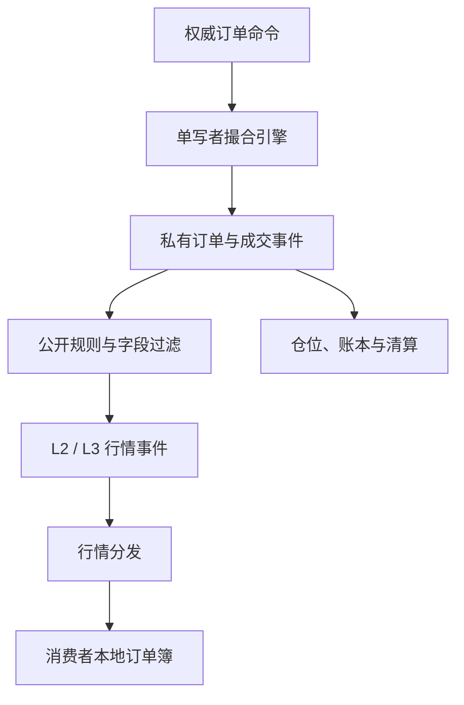

这条边界带来三个直接结论：

- 本地订单簿只是交易所权威簿的**受版本约束的物化视图**；
- 行情缺失不能靠猜测撮合结果修补，因为隐藏订单、STP、价格保护和订单修改语义可能不可见；
- “本地两边还能排出一个看似正常的价差”不等于状态正确。丢失一个深档更新，最优价暂时也可能完全正常。

对外部交易所而言，权威事件流已经由对方定义。消费者必须遵守其频道契约，不能把自己的数据模型反过来强加给协议。

### L1、L2、L3 与逐笔成交分别表达什么

“订单簿”常被笼统地使用，但不同粒度保留的信息不同。

| 数据类型 | 典型键 | 典型值 | 可以回答 | 无法回答 |
| --- | --- | --- | --- | --- |
| L1 / BBO | instrument | best bid/ask 与数量 | 当前公开最优价 | 深度、同价队列、订单身份 |
| L2 / MBP | side + price | 聚合数量，可选订单数 | 多档深度、价差、冲击成本近似 | 同价订单先后、单笔撤单来源 |
| L3 / MBO | orderId | price、remaining、priority | 单笔公开订单与队列演化 | 隐藏量、账户身份、未公开规则 |
| Trades | tradeId / matchId | price、qty、aggressor 等 | 已发生的公开成交 | 完整挂单状态与撤改单 |
| Ticker / Candle | instrument + window | 统计值 | 摘要与时间窗口统计 | 可逆恢复订单簿 |

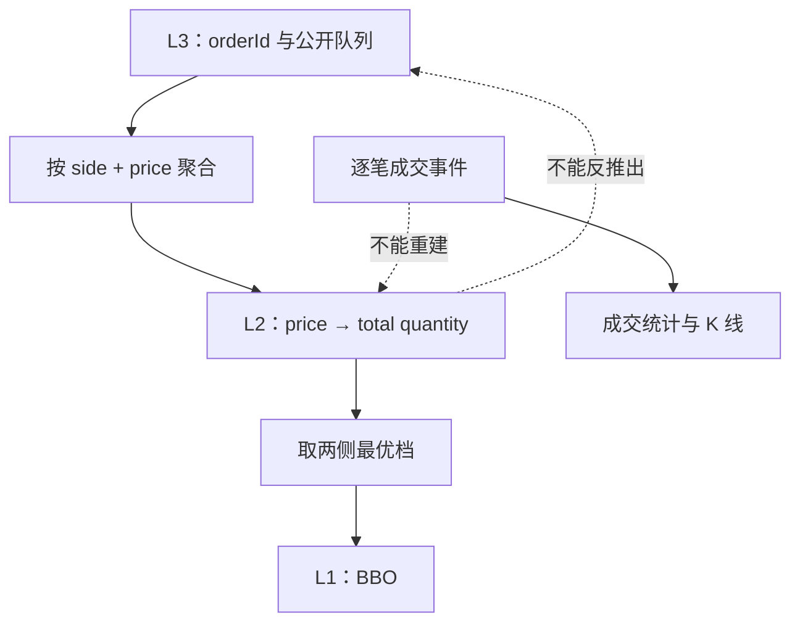

从 L3 聚合得到 L2 是有损压缩；从 L2 不能恢复订单 ID、同价 FIFO 或 queue position。L2 某档数量减少，可能来自成交、撤单、减量修改、订单过期或平台内部规则，不能据此虚构一笔 trade。

Nasdaq TotalView-ITCH 的协议把 Add、Executed、Cancel、Delete 和 Replace 定义为不同的 L3 动作；独立的 Trade 消息还明确不一定影响 displayed book。这是一个很好的反例：**成交流与订单簿流是两种权威投影，不能互相猜出来。**

### 先写清楚正确性合同

在选 Map、跳表或 off-heap 数组之前，先定义什么叫“本地簿正确”。至少要拆成五个维度：

| 维度 | 要回答的问题 | 典型证据 |
| --- | --- | --- |
| 身份 | 这是哪一个市场、频道、产品、深度和会话？ | `BookIdentity`、metadata version、path/logical feed epoch |
| 连续性 | 从快照切点之后是否看到了协议要求的连续更新？ | sequence range、`prevSeqId`、replay cursor |
| 物化正确性 | 更新是否按协议语义作用在正确档位或订单？ | golden replay、checksum、canonical hash |
| 原子可见性 | 读者会不会看到半个批次？ | immutable version、single-writer publish |
| 新鲜度 | 状态虽连续，但是否已经过旧或连接失活？ | heartbeat age、last valid update age、latency |

一个实用的模型不应只有 `symbol + lastSequence`。稳定身份、物理线路代际、逻辑源代际、重建代际和序列代际要分开：

```text
BookIdentity = (
  venue,
  feedVersion,
  channel,
  rawInstrument,
  bookKind
)

BookRuntime = (
  snapshotSeedLimit,
  maintainedDepthCap?,
  pathConnectionEpochs,
  logicalFeedEpoch,
  reconstructionEpoch,
  sequenceGeneration,
  metadataVersion,
  sourceCursor
)
```

`pathConnectionEpoch` 按每条 socket/UDP path 独立变化，只用于来源与传输取证；A 路重连而 B 路保持连续时，不应让整本簿换代。`logicalFeedEpoch` 表示仲裁或适配之后的一条逻辑权威流，只有无法跨源会话证明连续时才变化；`reconstructionEpoch` 随 fresh snapshot / 本地重建而变化；`sequenceGeneration` 则允许 OKX 这类 feed 在**同一逻辑源、同一本簿**上合法重置数值序列。序列号只在协议声明的 domain 与 generation 内有意义。两个交易所的 `10042` 没有关系；同一交易所不同频道、产品或逻辑源换代前后的 `10042` 也未必属于同一条序列。

#### 快照只覆盖它声明的范围

Snapshot 不是“宇宙中全部订单”的同义词。它可能只包含：

- 每侧前 5、10、100 或 5000 个价位；
- 可公开的 displayed quantity；
- 某个产品、频道和市场阶段；
- 某一序列切点已经生效的状态。

例如 Binance Spot REST depth snapshot 最多返回每侧 5000 档。这个数字是 `snapshotSeedLimit`，不是 diff stream 的持续 `maintainedDepthCap`：快照之外的价位之后一旦发生变化，仍会进入本地已知集合，不能在每批后机械截回 5000 档；但从未变化的远端档位依然未知。相反，Kraken 的订阅 `depth` 才是必须在每批后维护的显式 cap。两类限制必须分字段建模。

## 一条可审计的行情数据管线

生产管线最好把收包、协议解释、状态归约、验证和分发分开。每层都保留足够的来源信息，才可能在出错后回答“错在源头、解码、排序、重建还是下游”。

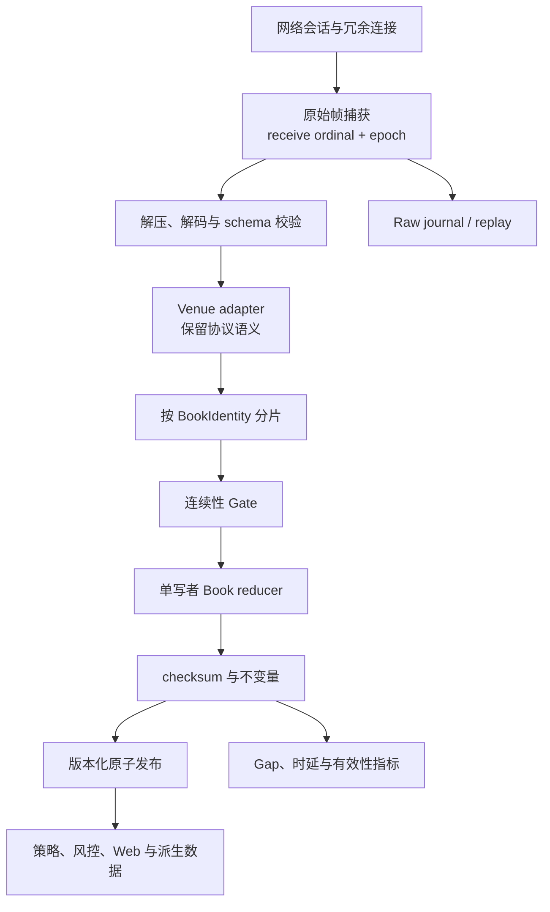

网络回调只应做有限工作：取得本地接收时间、记录连接与来源、完成边界检查并放入有界队列。不要在 I/O 线程里执行 JSON 树构建、磁盘同步、复杂指标或慢客户端回调。

队列满时不能静默 drop，但动作取决于它位于哪里：A/B 仲裁前的单路 queue overflow 先把该 path 标为 degraded，另一条具有共同序列域的线路仍可能补齐；若仲裁窗口结束两路都没有该序列，才形成逻辑 Gap。普通单路 feed，或仲裁后的 authoritative/decoder queue overflow，则立即使受影响的 logical continuity domain 进入 INVALID。失效时还必须推进 generation fence，使满队列中迟到的旧批次无法在重建后再次发布 `valid=true`。所有路径都要保留 overflow 计数与 raw/transport 证据。

### Canonical model 不等于最小公分母

归一化很有用，但不能抹掉协议差异。下面这些更新不是一种东西：

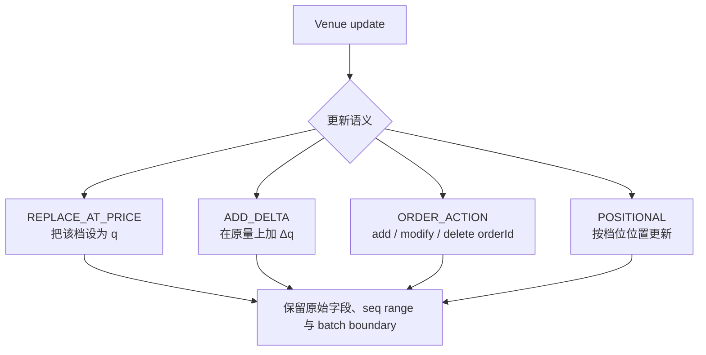

Binance Spot diff depth 与 Coinbase L2 的 quantity 都是**新绝对量**，不是 `old + delta`。Kraken 同一条消息里还可能多次更新同一价格，必须按消息顺序处理。若把所有消息压成 `price + signedDelta`，迟早会在重放、去重或批次折叠时得到另一份簿。

建议 canonical event 使用 tagged union，并保留：

- `sourceType`、`seqStart`、`seqEnd`、`prevSeq`、`checksum`；
- `batchId` 或协议定义的批次结束标记；
- 原始 decimal 字符串、单位和 instrument metadata version；
- raw journal offset，便于从规范事件追溯到原始帧；
- source time、gateway receive wall time、receive monotonic time、apply/publish time。

### 冗余实时源：先仲裁，再判断 Gap

两条网络线路不等于两条可以任意交错的消息流。只有交易所明确声明 A/B feed 属于**同一 feed/version、共享同一个序列域且内容等价**时，才可以按 packet sequence 做 first-arrival-wins：同一序列先到的一份进入解码，另一份作为重复证据；若 A 缺包而 B 随后补到，就用 B 的同序列包；两边都缺才进入官方 replay 或 snapshot 恢复。

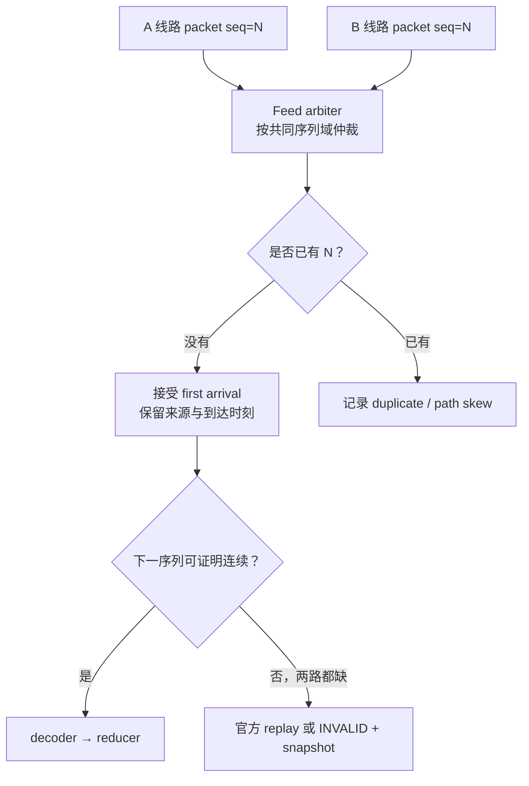

仲裁层应分别记录每条线路的 packet loss、first-arrival 比例、延迟分布和 A/B 到达偏差，不能在去重后抹掉 provenance。单边暂时迟到也不能立即宣称业务 Gap：要先按协议规定的窗口检查另一条冗余线路；但等待窗口必须有界，超过后仍要 fail closed。

同一 packet sequence 的 A/B payload 若不一致，不能任选先到的一份继续。因为 first arrival 可能已经被 apply/publish，发现 divergence 后必须立即推进 logical/generation fence，把该 continuity domain 标成 INVALID，向下游发送 discontinuity，保留两份 raw 证据，再通过官方 replay 或 fresh snapshot 重建。

普通的两条 WebSocket 连接通常没有这种共同 packet sequence 契约。它们可能接入不同后端、拥有不同 snapshot 或会话边界，不能把 A 的 seq 100 与 B 的 seq 101 拼成一条“完整流”。更稳妥的做法是各自独立建立并验证 candidate book，在计划换线时让新 candidate 追到 LIVE，再原子替换 active。CME MDP 3.0 的 A/B 增量源与恢复服务是“先证明同一序列域再仲裁”的典型参照，不应被泛化成所有双连接都可互补。

### Snapshot + Incremental 的核心：找到合法切点

快照和增量来自并行演进的状态。若先请求 REST snapshot，等它返回后才订阅 WebSocket，那么在两者之间发生的更新没有任何来源可以补回。

协议无关的安全状态机可以写成：

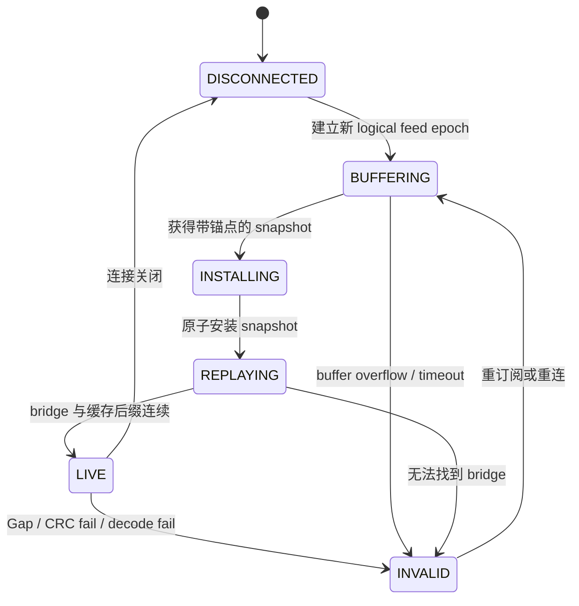

外置 snapshot 的通用流程是：

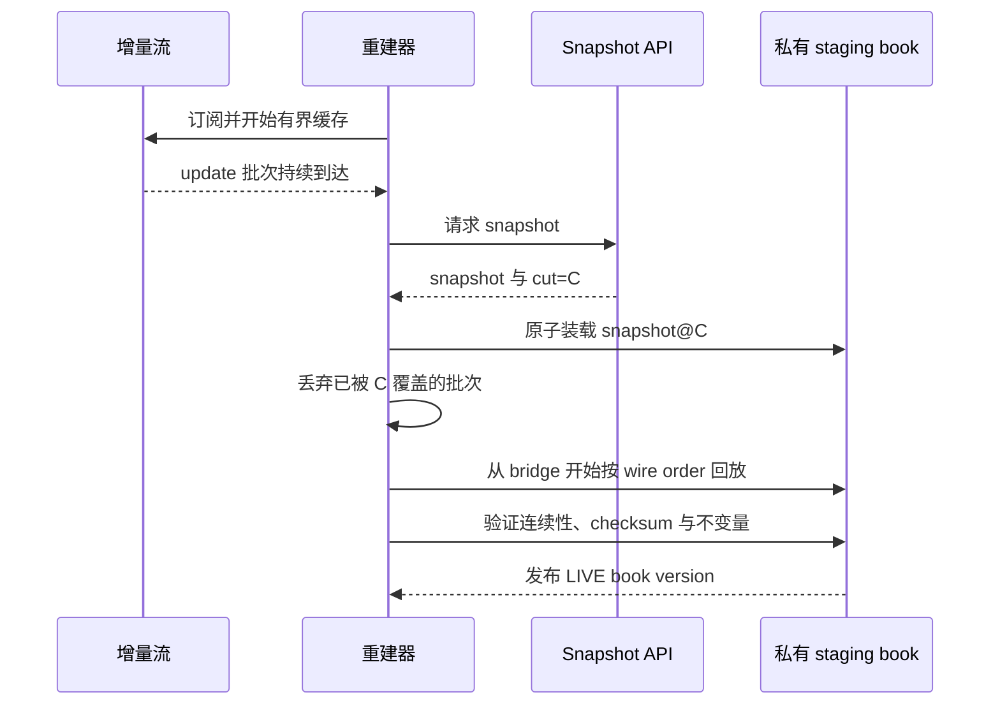

严格算法如下：

1. 逻辑连续性已经丢失时建立新的 `logicalFeedEpoch` / `reconstructionEpoch`，先把旧簿标记为 stale；计划内换线则保持旧 active LIVE，让 candidate 在旁路重建；
2. 订阅增量流并按接收顺序缓存 raw batch；
3. 获取带协议锚点 `C` 的 snapshot，校验产品、schema、depth 与 metadata；
4. 丢弃完全被 `C` 覆盖的缓存事件；
5. 用 venue adapter 找到第一个能从 `C` 衔接的 `NEXT` 或协议证明安全的 `SAFE_OVERLAP`；
6. 在不可见的 staging book 中安装 snapshot，并按协议顺序应用整个合法批次；signed delta / L3 action 若无法精确去掉已覆盖项，不能把部分重叠批次整批重放；
7. 每批验证 successor、数值、深度、checksum 与市场状态不变量；
8. 只有缓存追平并全部验证通过，才一次性发布 `(book, logicalFeedEpoch, reconstructionEpoch, sequenceGeneration, sourceCursor, bookVersion, valid=true)`；计划内换线此时才原子替换旧 active；
9. Gap、缓存溢出、无法 bridge 或校验失败都进入 `INVALID`，重新取得权威切点。

```text
install(snapshot):
  staging = build(snapshot)
  anchor = snapshot.cut

  for event in bufferedWireOrder:
    if adapter.covered(anchor, event):
      continue
    relation = adapter.relate(anchor, event)
    if relation not in [NEXT, SAFE_OVERLAP]:
      return invalidateAndResync()
    adapter.applyWholeBatch(staging, event)
    adapter.verify(staging, event)
    anchor = adapter.end(event)

  publishImmutable(fullBookViewAndStreamEnvelope(staging, anchor))
```

关键在于 `covered`、`relate` 和 `end` 必须由协议适配器定义。`SAFE_OVERLAP` 只适用于协议明确允许重放已覆盖部分的批次，例如 Binance 的 absolute replacement；ADD_DELTA 与 L3 action 若没有 entry-level cursor 去重，重放 overlap 会重复加量或重复 execute/cancel，应直接重建。不能把所有平台都硬编码成 `next == last + 1`。

## 协议案例：不同 venue 不能共用一套恢复模板

### Binance Spot：为什么 bridge 是区间关系

Binance Spot diff depth 每个事件包含首个 update ID `U` 和末尾 update ID `u`。安全流程是先连接并缓存，再取 REST snapshot 的 `lastUpdateId=S`。

完整启动筛选不要省略：

1. 连接 WebSocket，开始缓存，并记下首个事件的 `U0`；
2. 请求 REST snapshot；若 `S < U0`，说明 snapshot 早于可用缓存窗口，重新请求；
3. 丢弃所有 `u <= S` 的事件；
4. 第一个保留事件必须满足 `U <= S+1 <= u`，否则当前 snapshot 与缓存无法 bridge；
5. 实时阶段，官方规则允许忽略 `u < localId` 的旧事件；若 `U > localId+1` 则判 Gap。

假设缓存中有：

```text
E1 = [U=100, u=102]
E2 = [U=103, u=105]
snapshot S = 101
```

`E1.u > S`，不能丢弃；并且 `100 <= S+1=102 <= 102`，所以 E1 覆盖从 snapshot 之后开始所需的第一步。安装 snapshot 后应用整个 E1，local ID 变成 102，再应用 E2 到 105。

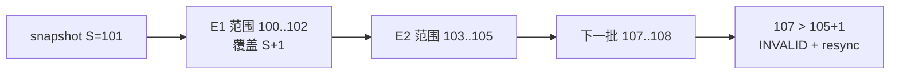

这解释了两个常见错误：

- 不能只接受 `U == S+1`，因为首个合法事件可能覆盖一个包含 `S+1` 的区间；
- 不能只看 `u` 单调增长，下一批 `[107,108]` 虽然更大，却明确跳过了 106。

应用价位时，`[price, qty]` 表示把该档数量**设为** `qty`；`qty=0` 删除。收到 `U > localId+1` 时，本地簿必须作废并重新同步，不能等后续更新“迟早把错档覆盖回来”。初始 5000 档只是 snapshot seed；diff stream 后来触及更远价位时应保留该已知档，不能每批 trim 回 5000。

Binance 文档还要求客户端考虑 WebSocket 连接最长 24 小时。生产系统可在旧连接到期前预热新连接和 candidate book，验证新的 logical/reconstruction epoch 达到 LIVE 后再原子切换，而不是等断线才临时重建。

### Coinbase：L2 与 Full/L3 是两套恢复协议

Coinbase Exchange 的 `level2` 频道订阅后先发送完整 `snapshot`，随后发送 `l2update`。这属于 inline snapshot：客户端不需要自己把 REST 快照与 L2 增量拼接，但仍需在看到 snapshot 前禁止发布有效簿。

`l2update.changes` 中的 size 是该价位更新后的总量，`0` 表示删除。一个消息可以包含多个 changes，应整批应用后再发布。

Full channel 则用于维护 L3：

1. 先订阅 Full 并缓存 WebSocket 消息；
2. 请求 REST L3 snapshot；
3. 丢弃 `sequence <= snapshot.sequence` 的缓存消息；
4. 按 sequence 回放剩余消息；
5. 追平后进入实时处理。

Full 频道的消息类型不能仅凭名字机械改簿：

- `received` 表示订单已被撮合引擎接受，不等于它已经 resting；
- `open` 与 `match` 会改变公开簿；
- 并非所有 `done` 或 `change` 都影响簿，因为它们可能针对从未挂入公开簿的订单。

Coinbase 还明确提醒，**对携带 sequence 且不承诺完整交付的普通频道**，即使客户端连接是 TCP/WebSocket，上游行情分发仍可能出现 drop 或 out-of-order。TCP 只能排序一条连接实际收到的字节，不能证明上游在写入该连接前没有遗漏。Exchange L2 的 payload 不要求客户端虚构 sequence gate，而是依赖该频道的 delivery guarantee；断连或 slow-consume 后仍应等待新 snapshot，不能沿用旧簿。

### Kraken：CRC 要在整批应用并截深之后计算

Kraken Spot WebSocket v2 `book` 频道先发送 snapshot，随后发送 price-level updates。它没有让客户端用一个通用 `last+1` 序列公式判断连续性，而是依赖流顺序与官方 CRC32 规范验证本地 top-10 视图。

正确顺序是：

1. 按消息中出现的顺序应用全部 asks/bids 更新；
2. 同一价格在一条消息中出现多次时也不能提前合并错序；
3. `qty=0` 删除价位；
4. 按订阅 depth 截断两侧，因为超出深度的档位不一定再收到显式删除；
5. 取 asks 低到高、bids 高到低的 top 10；
6. 每档分别把 price、qty 去掉小数点和前导 0，再拼成 `price + qty`；先拼完 asks，再拼 bids，对总字符串计算 unsigned CRC32；
7. 与消息 checksum 比较，不匹配就停止发布并重新订阅。

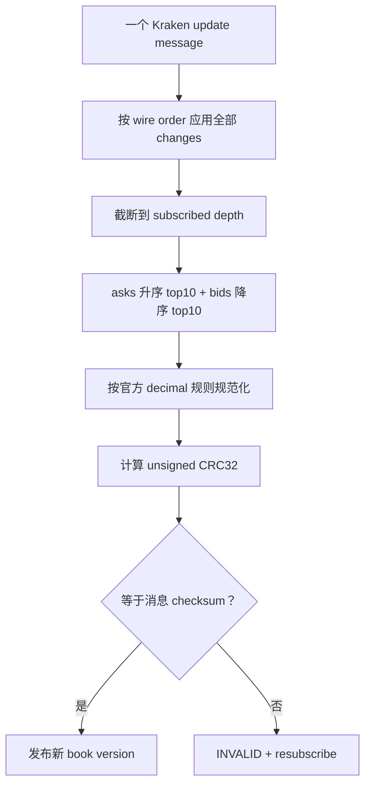

CRC 只覆盖 top 10，不是对订阅 100 或 1000 档的全深度证明；CRC32 也不是密码学完整性证明。它的价值是按协议定义的 canonical view 检测本地 materialization 偏差，不能替代 session、schema、深度和状态校验。

千万不要把 price/qty 先解析成 binary floating point 再格式化计算 checksum。`0.10`、`0.1` 与二进制近似值的字符串可能不同。应保留原始 decimal 语义，或精确转换为协议要求的定点表示。Kraken 官方 checksum 指南给出的 golden vector 期望 unsigned CRC 为 `3310070434`，适合直接放进回归测试。

### OKX：2026 年后 JSON 订单簿不再使用 checksum

这是旧教程最容易过时的地方。OKX 已从 **2026-06-23** 起弃用 JSON `books`、`books-l2-tbt` 与 `books50-l2-tbt` 的 checksum；字段仍存在但固定为 `0`，不得把 `0` 当成“校验成功”。当前连续性应使用 `seqId/prevSeqId`。

一个合法示例是：

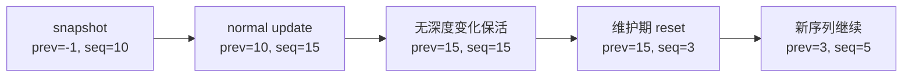

验证分两层，而且顺序不能反：**每条 update 都必须先满足 `prevSeqId == localSeq`**，然后才根据 `seqId` 与 `prevSeqId` 的关系解释动作：

- `seqId > prevSeqId`：普通更新；
- `seqId == prevSeqId`：无深度变化的合法保活可能使用这一形式；
- `seqId < prevSeqId`：在 `prevSeqId == localSeq` 的前提下，官方说明维护场景可能发生合法序列重置；保留当前簿，递增本地 `sequenceGeneration` 后继续；
- `prevSeqId != localSeq`：无条件视为不连续，立即 INVALID 并重新同步，不能用“可能是 reset”放行断链。

频道语义也不同：`books` 是首个全量、后续增量；`books5` 与 `bbo-tbt` 属于快照型频道，不能套用增量簿的状态机。2026 年新增的 `books-rpi` 又有自己的 tuple 语义：第三项是 non-RPI quantity，不是普通 books 中曾经固定为 0 的旧字段。所有判断都应绑定 `feedVersion + channel` feature flag，而不是写一个全站 `if (checksum == 0) success` 或复用同一 tuple decoder。

### 四个平台的协议差异放在一张表里

| Feed | 初始状态 | 更新语义 | 连续性 / 完整性 | 失败动作 |
| --- | --- | --- | --- | --- |
| Binance Spot diff depth | WS 先缓存，再取 REST `lastUpdateId` | L2 绝对量替换，0 删除 | `U/u` 区间 bridge 与 gap | 丢弃本地簿，重做 snapshot 流程 |
| Coinbase Exchange L2 | 同一频道首发 snapshot | L2 绝对量替换，0 删除 | 频道保证全部更新，仍监控连接与 schema | 等待新 snapshot / 重订阅 |
| Coinbase Exchange Full | WS 先缓存，再取 REST L3 snapshot | order lifecycle actions | per-product sequence 与消息类型语义 | 重新取得 L3 snapshot 并回放 |
| Kraken Spot WS v2 book | 同一频道首发 snapshot | L2 绝对量替换，0 删除 | 流顺序 + top-10 CRC32 | 标记 INVALID，重订阅 |
| OKX JSON books | 首发 snapshot，后续 update | L2 频道规则 | `prevSeqId/seqId`，checksum 已弃用 | 不连续则重订阅或重连 |

表格只能帮助比较，不能代替原始文档。尤其是产品权限、深度、推送频率、拍卖阶段与 heartbeat 规则，必须以当期频道说明为准。

## 本地物化必须以原子版本为边界

### 单写者 reducer 与原子版本发布

每个稳定 `BookIdentity` 最容易证明的并发模型是单写者：一个 reducer 按已验证顺序修改私有 working state，读者只读取已经发布的 immutable version。

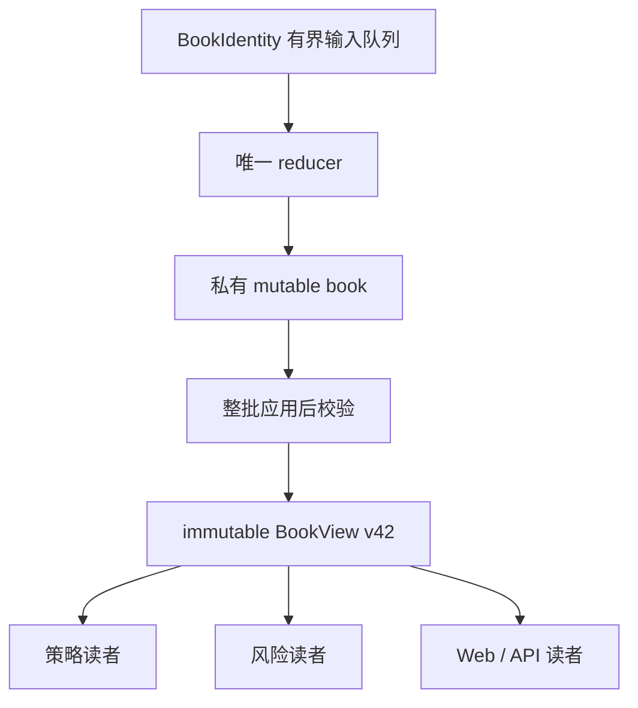

一个简化的 L2 核心可以是：

```java
record Level(long priceTicks, long quantityLots) {}

sealed interface SourceCursor
    permits BinanceCursor, OkxCursor, KrakenCursor {}

record BinanceCursor(long lastUpdateId) implements SourceCursor {}
record OkxCursor(long seqId) implements SourceCursor {}
record KrakenCursor(long localBatchOrdinal, long top10Crc) implements SourceCursor {}

record BookView(
    long logicalFeedEpoch,
    long reconstructionEpoch,
    long sequenceGeneration,
    long bookStreamOffset,
    long bookVersion,
    SourceCursor sourceCursor,
    long localJournalOffset,
    long metadataVersion,
    List<Level> bids,
    List<Level> asks,
    boolean valid) {}

final class L2BookReducer {
    private final NavigableMap<Long, Long> bids =
        new TreeMap<>(Comparator.reverseOrder());
    private final NavigableMap<Long, Long> asks = new TreeMap<>();
    private final AtomicReference<BookView> published = new AtomicReference<>();

    void replaceLevel(Side side, long priceTicks, long quantityLots) {
        NavigableMap<Long, Long> levels = side == Side.BUY ? bids : asks;
        if (quantityLots == 0) {
            levels.remove(priceTicks);
        } else if (quantityLots > 0) {
            levels.put(priceTicks, quantityLots);
        } else {
            throw new IllegalArgumentException("negative absolute quantity");
        }
    }
}
```

这段代码只表达 absolute replacement 协议，不适用于 signed delta 或 L3 action。`KrakenCursor.localBatchOrdinal` 只是本地顺序位置，不伪装成 venue sequence；`top10Crc` 也只记录指定视图的校验结果。真实实现还要满足：

- working state 不向读者暴露；
- 一条协议批次全部应用后才校验并发布；
- 批内失败时不发布，整个 builder 进入 INVALID 或回滚 staging；
- `BookView` 中的集合不可变，不能把 mutable Map 引用泄漏给读线程；
- sequence、epoch、validity 和 metadata version 与价格档一起切换；
- BBO 在批次 commit 后从同一版本的两侧计算。

#### 为什么一条消息也要当成事务边界

假设一个批次先删除旧 best ask，再添加新的 best ask。若读者在两步之间读取，可能看到空卖盘；相反的更新顺序还可能短暂制造 crossed book。平台发出的一个批次未必等于撮合事务，但只要协议规定它是不可分割的更新单位，消费者就必须把它作为原子 publish 边界。

CME MDP 3.0 的恢复文档明确要求：一个 Incremental Refresh 中全部更新处理完之前，订单簿不能视为 valid。分块 MBO snapshot 也必须收齐后才能发布。这个原则同样适合 JSON feed：**批中可变，批后验证，版本级可见。**

### 精确数值、单位和产品元数据

价格和数量不是无单位的 `double`。

#### 使用整数 ticks/lots 或精确 decimal

常见做法是：

```text
priceTicks   = exactPrice / tickSize
quantityLots = exactQuantity / lotSize
```

转换前必须验证整除、scale 和范围。对协议要求字符串 canonicalization 的场景，保留原始 decimal 字符串或使用精确十进制解析。binary floating point 不适合：

- 作为有序 Map 的价格键；
- 判断 tick/lot 合法性；
- 计算协议 checksum；
- 在多个服务之间形成稳定的 canonical bytes。

#### `size=10` 到底是什么单位

现货 quantity 常以 base asset 表示，但期货、永续和期权可能以 contracts 表示；线性与反向合约还可能使用不同 multiplier。Canonical instrument 至少需要版本化保存：

- venue 原始 symbol 与内部 instrument ID；
- base、quote、settlement asset；
- spot / perpetual / future / option；
- expiry、strike、option right；
- linear / inverse 与 contract multiplier；
- tick size、lot size、price/quantity scale；
- 交易状态、拍卖状态和 metadata 生效版本。

若元数据在重建期间改变，不能继续按旧 scale 解释新帧；应显式切换 metadata version，必要时开启新的 reconstruction epoch 并重建。

### Gap、重复、乱序、Reset 与重连要分开处理

`sequence <= last` 不能自动区分重复、迟到和另一会话的旧消息；`sequence > last+1` 也不一定适用于区间序列或 `prevSeqId` 链。正确做法是让 adapter 返回语义化结果：

| 关系 | 含义 | 动作 |
| --- | --- | --- |
| COVERED / DUPLICATE | 已被 snapshot 或已应用范围完整覆盖 | 按协议安全忽略 |
| NEXT | 从当前 cursor 的精确后继开始 | 整批应用并推进 cursor |
| SAFE_OVERLAP | 协议证明重放覆盖部分安全 | 由 adapter 整批应用并推进 cursor |
| RESET | `prev` 连续但数值序列进入新代际 | 保留当前簿，递增 sequence generation，或执行协议指定流程 |
| GAP | 中间存在无法证明已看到的变化 | 立即 INVALID，replay 或 fresh snapshot |
| MALFORMED | schema、decimal、深度或边界非法 | INVALID，保留 raw 证据并告警 |

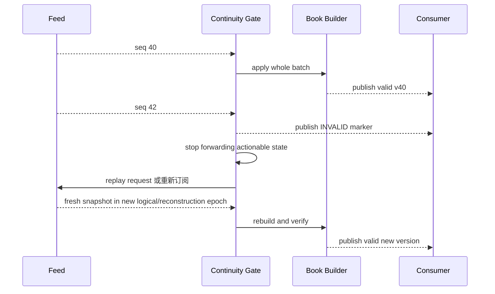

#### 乱序缓存不是默认修复手段

只有协议明确允许重排并给出窗口、唯一标识和补包机制时，才可以短暂缓存乱序消息。否则“等一会儿也许 41 会来”会让 stale book 继续对策略可见，还可能跨 reconnect 拼接两个 epoch。

#### 线路重连、逻辑源、重建与序列重置是四种边界

同一数值 sequence 在重连后可能重用或重置，但四种动作不能合并：

- 每条 transport path 的 reconnect 只建立该路新的 `pathConnectionEpoch`；A/B 中另一条路仍证明逻辑连续时，active book 不换代；
- 当 adapter/arbiter 无法把新源会话与当前 cursor 连续起来时，才建立新的 `logicalFeedEpoch`，旧逻辑源的 delta 不得接入；
- fresh snapshot / 本地丢簿重建建立新的 `reconstructionEpoch`；
- OKX 这类 `prev==local && seq<prev` 的 in-band reset 只递增 `sequenceGeneration`，继续使用当前已验证簿。

如果下游协议只能表达“epoch + delta”，那么本地必须先把 reset update 整批、恰好一次地应用到当前簿，再发显式 RESET 与**应用该批之后**的新-generation 完整 snapshot，之后才发送后续 delta；不能漏掉 reset 消息携带的档位变化，也不能让下游把它当成一份新簿的起点。

#### Heartbeat 与 book update 是两种指标

冷清市场长时间没有订单簿变化是正常的。应分别监控：

- 连接或 heartbeat 最后活跃时间；
- 最后一条连续协议消息时间；
- 最后一次有效 book version 时间；
- 最后一次真实深度变化时间；
- 当前数据从 source time 到 publish 的 age。

OKX 的空 asks/bids 保活可保持相同 `seqId`。把“序列没增加”直接判为断线，会制造不必要的重建风暴。

### Checksum、sequence 与不变量分别证明什么

三种证据互相补充，但不能互相替代：

- **sequence / prev 链**：证明在协议编号模型下没有观察到断点；
- **checksum**：检测本地按官方 canonicalization 物化出的指定视图是否不同；
- **业务不变量**：检查本地结构是否满足数量、排序、深度和市场阶段约束。

建议每批至少检查：

1. 所有存在的 level 数量都大于 0；
2. price 与 quantity 满足 tick、lot、scale 和范围；
3. bids 降序、asks 升序，BBO 与树顶一致；
4. 只有协议声明 `maintainedDepthCap` 时才检查并截深；`snapshotSeedLimit` 不能误当持续上限；
5. 当前状态为连续交易且 venue 规则要求未交叉时，`bestBid < bestAsk`；
6. logical feed/reconstruction epoch、sequence generation、metadata 和 typed source cursor 一致；
7. 协议定义 checksum 时，按准确的 side 顺序、top-N、decimal 格式和截深时机计算。

crossed book 不能无条件判错。集合竞价、pre-open 或特殊市场阶段可能允许表面交叉；跨交易所聚合视图更可能因传播延迟出现 locked/crossed。必须先看 market status，再决定不变量。

## 恢复与分发必须携带连续性证据

### 原始日志、Checkpoint 与可重放恢复

如果系统承诺可审计或可重放，至少保留三层数据：

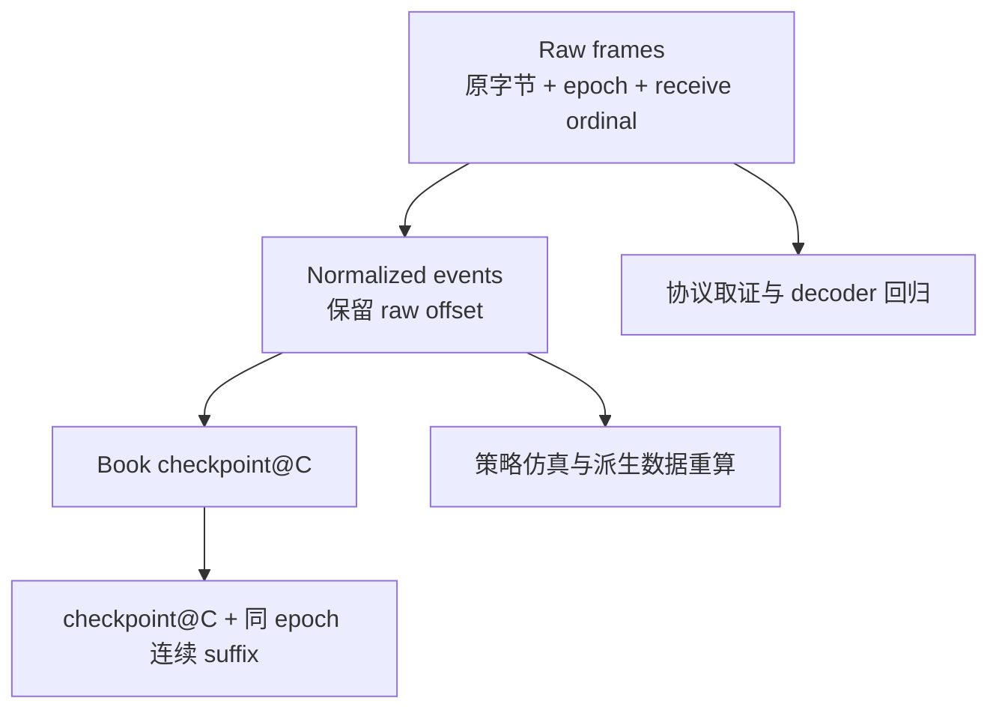

Raw record 建议包含：

- endpoint、channel、instrument、pathId 与 `pathConnectionEpoch`；
- 仲裁后的 `logicalFeedEpoch` / `reconstructionEpoch` / `sequenceGeneration`；
- 本地 receive ordinal；
- venue sequence/range 与 source timestamp；
- gateway receive wall time 与 monotonic time；
- schema、compression 和 metadata version；
- 原始 payload bytes 与校验信息。

先声明日志强度：

- **best-effort capture** 可以异步写 raw，但不能向下游承诺断电后仍能从本地无缺口重放；
- **durable replay channel** 必须先把 raw/normalized record 持久到声明的 durability boundary、推进 durable cursor，之后才能向该 channel 投递或标记为 replayable，更不可能先确认下游 ACK；磁盘满、`fsync`/`force` 失败必须 fail closed；
- 提前向低延迟读者发布但尚未 durable 的版本，只能进入明确标注的 tentative / best-effort channel。它不属于崩溃后可恢复承诺；进程恢复后必须发 RESET 或新 snapshot，不能同时宣称“已发布即永久可重放”。

Checkpoint 不是单独一个序列号，而应从同一个 immutable `BookView` 原子取得 canonical book、logical feed/reconstruction epoch、sequence generation、typed source cursor 与 `localJournalOffset`，再连同 depth config、checksum config 和 metadata version 持久化。Typed source cursor 用于验证 venue 协议连续性；真正定位本地恢复后缀的是不可重复的 durable journal offset/record ID，因为 OKX keepalive 等 source cursor 可能重复。Checkpoint 只能引用已经 durable 的本地 offset；写临时文件、校验、force、原子替换与目录持久化要构成完整发布协议，但文件原子替换只避免 checkpoint 自身撕裂，不能修复“簿与 cursor 来自两个版本”的逻辑错误。只有 checkpoint 本身已 durable，且所有受保护 replay cursor 都越过相应前缀后，才可以截断旧日志。合法恢复只能是：

```text
lastValidCheckpoint@localJournalOffset=J
  + same-reconstruction continuous durable suffix(J)
  + source cursor continuity validation
```

发现逻辑 Gap、无法衔接的新源会话或 fresh snapshot 时应写入 discontinuity marker；单路 `pathConnectionEpoch` 变化只写 transport provenance，不必打断仍连续的仲裁流。合法 in-band sequence reset 要先把 reset update 整批恰好应用一次，再写新的 `sequenceGeneration` 边界并保留簿连续性。不要为了让日志“看起来连续”，把两个没有共同序列契约的连接直接拼起来。恢复测试还要在 raw append、durable cursor、apply、publish 与 checkpoint 的每个边界注入崩溃，证明结果等价于某个合法 durable prefix。

#### 外部行情与内部行情的恢复边界不同

自营交易所可以从撮合引擎权威事件日志重新派生行情；外部 venue 消费者缺了对方的一段网络数据，自己的 raw journal 也不会凭空补出缺失事件。除非平台提供 replay 服务，否则只能重新取得 snapshot。

CME MDP 3.0 提供小范围 TCP Recovery：实时流先缓存，请求缺失 packet range，先应用补包再接回缓存流。这是协议明确的 replay，不是消费者自己猜测。

### 扇出与背压：不能让一个慢客户端拖住权威 ingest

交易所行情通常不会因为某个下游 `request(1)` 就降低源速率。系统只能在有界缓存、持久化回放、降级与断开之间作明确选择。

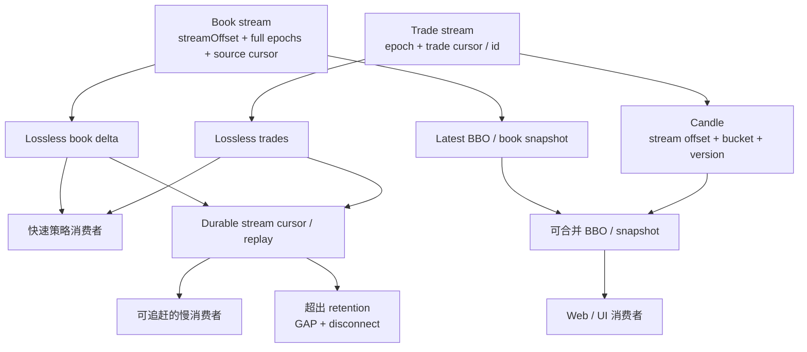

下游语义要分两类：

- **不可静默丢失**：逐笔成交、按序 book delta、订单动作。慢消费者只能从对应 stream 的 durable cursor 重放，或收到显式 GAP/RESET 后重新取得该 stream 的权威起点；
- **可合并的最新状态**：BBO、完整 book snapshot、未闭合 candle preview。可以只保留最新版，但仍要携带各自的 epoch、cursor/version、as-of 和 valid，让客户端知道中间版本被跳过。

Book、trade 与 candle 不能共用一个 `bookVersion`。Book delta/BBO 的 envelope 至少是 `(bookStreamId, bookStreamOffset, logicalFeedEpoch, reconstructionEpoch, sequenceGeneration, sourceCursor, bookVersion)`；其中本地单调 `bookStreamOffset` 用于下游 ACK/replay，完整三类代际与 typed source cursor 用于解释协议位置。Trade 使用 `(tradeStreamId, tradeStreamEpoch, tradeCursor)`；candle 则要有 `(candleStreamId, candleStreamEpoch, streamOffset, bucket, rulesVersion, tradeCursorRange, candleVersion)`。其中 `tradeCursorRange` 是血缘，不是可供整条 candle stream ACK 的全局游标；订阅者 ACK 应写成 `(streamId, epoch, cursor/streamOffset)`，否则一次 book ACK 可能被误当成 trade 已消费。

每个订阅者应有有界队列、last acknowledged cursor、queue age 和明确的 overflow policy。绝不能删除最老 delta 后继续假装序列完整。若 trade stream 出现 Gap，依赖它的 candle 必须标记 incomplete、从 durable trade cursor 重建，或等待权威更正，不能因为 book stream 仍连续就继续宣称 K 线完整。

权威 ingest、book reducer 与公网 WebSocket fanout 最好隔离线程、队列和故障域。公网慢客户端不应反压撮合输出或内部风控行情。

### 时间戳不是订单簿的排序权威

行情中至少存在这些时间：

| 时间 | 含义 | 能否用于簿顺序 |
| --- | --- | --- |
| venue event / transact time | 撮合或源系统记录的业务时间 | 不能替代 sequence |
| venue publish time | 源端发布时刻 | 不能证明无 Gap |
| gateway receive wall time | 本机接收的墙钟 | 适合审计，不保证单调 |
| gateway receive monotonic | 同进程接收耗时基准 | 只适合同进程 duration |
| decode / apply / publish time | 本管线各阶段时间 | 用于分解延迟 |
| client receive time | 下游观察时间 | 已包含网络与排队 |

同一簿的权威顺序应由协议 sequence、prev 链或频道顺序决定，不得按 timestamp 重排来“修复” Gap。墙钟可能重复、回拨，多个事件也可能共享相同 timestamp。

跨机器延迟应同时报告时钟同步质量；进程内阶段耗时用 monotonic clock。更完整的时钟边界可回看[《分布式系统里的时间》](/signal-grid-blog/posts/distributed-systems-time-clocks-ordering-and-leases/)。

## 派生、聚合与优化都必须服从正确性边界

### BBO、Trade、Candle 与指数如何正确派生

#### BBO

BBO 应在整个 book batch commit 后，从同一个 immutable version 的 `maxBid/minAsk` 取得，并携带完整的 `bookStreamId + bookStreamOffset + logicalFeedEpoch + reconstructionEpoch + sequenceGeneration + sourceCursor + bookVersion`。若直接消费 venue 的 `bookTicker`，它是另一条权威派生流；不要把不同 cut 的本地 BBO 与 bookTicker 强行逐条判等。

#### Trade

成交必须来自权威 trade/match feed，以协议声明的身份域做幂等，例如 `(venue, feed, instrument, session/domain, tradeId)`；裸 `tradeId` 未必跨产品、跨会话或跨日唯一。订单簿数量减少不能证明发生了成交。还要支持 trade bust/cancel：Nasdaq ITCH 的 Broken Trade 会引用原 match number，历史成交量、K 线和 time & sales 都必须按规则修正。

#### Candle

K 线至少要明确：

```text
(time basis, timezone/origin, interval,
 included trade types, late-event policy, bust policy)
```

窗口编号可以是：

```text
bucket = floor((eventTime - origin) / width)
```

但同 timestamp 的 open/close 顺序仍应使用 venue trade sequence 或权威事件顺序。High/Low/Volume 来自未被 bust 的合格成交；每个版本应携带已覆盖的 `tradeCursorRange`，迟到成交或撤销会产生新的 `candleVersion`。窗口结束不必然等于最终，final 需要 watermark 与 venue correction policy。

#### Index 与 Mark Price

指数价、溢价、基差和标记价格是带规则版本的产品模型，不是简单的 last trade。它们应保留成分 venue、权重、异常源剔除、时间窗和算法版本，不能塞进通用 `ticker.price` 后丢失血缘。

### 跨交易所聚合没有天然的全局快照

每个 venue 都有自己的 epoch、sequence 与延迟。聚合器在本机看到的只是多个独立最新版本的异步拼图。

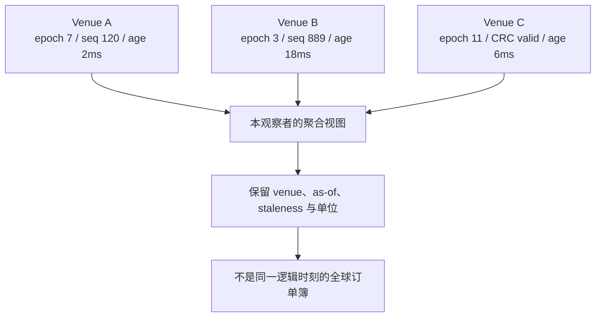

聚合前还要统一并保留：

- 现货、线性/反向合约、到期日和 multiplier；
- base/quote/settlement asset 与汇率来源；
- tick/lot、最小名义金额和数量单位；
- 手续费、返佣与可交易权限；
- venue 状态、数据年龄和有效性；
- 实际可下单数量与价格保护。

不同 venue 的 best bid/ask 交叉，可能只是传播延迟、时钟误差或产品并不等价。不要删除某一边来“修正”画面；应暴露每个来源的版本和 staleness，让策略自行决定是否可交易。

### 性能优化必须在正确参考模型之后

行情热路径确实关心解析、内存布局、cache miss、队列和批处理，但优化顺序应是：

1. 先用简单 `TreeMap + orderId Map` 写出可读的参考 reducer；
2. 用官方样例与自录 raw trace 建 golden replay；
3. 再实现 primitive map、稠密 price ladder、bitset、off-heap 或 SIMD decoder；
4. 对参考实现和优化实现做逐版本 differential test；
5. 最后用开放负载、尾延迟和恢复风暴验证生产容量。

不要只测 steady-state `apply one update`。真正危险的负载包括：snapshot 安装、10 倍突发、同一批数千更新、重连同时发生、慢消费者断开、checksum 计算、metadata 切换和 GC/CPU pause。

Java 并发与测量基础可分别回看 [Agrona](/signal-grid-blog/posts/agrona-direct-buffer-queues-and-agents/) 和[《Java 低延迟到底应该怎么测》](/signal-grid-blog/posts/java-low-latency-measurement/)。

## 用重放与故障注入证明管线正确

### Golden replay 与模型测试

- 用官方 payload 样例与自录 raw frames 重放到精确 anchor 和 canonical book hash；
- 朴素 Map/FIFO 参考实现与优化实现逐批对比；
- live replay、checkpoint 恢复和全量重放得到相同最终版本；
- checksum 使用官方 golden vector，例如 Kraken 文档给出的预期 CRC。

### 故障注入矩阵

| 故障 | 必须观察到的结果 |
| --- | --- |
| 完整 duplicate / covered event | 经 gate 证明已覆盖后忽略，状态不变 |
| partial overlap | 仅协议证明 `SAFE_OVERLAP` 时应用；signed delta/L3 action 否则重建 |
| 单批内同价多次更新 | 保留 wire order，批后结果正确 |
| drop / gap | 立刻 INVALID，不继续发布 actionable book |
| A/B 仲裁前单路 queue overflow | 该 path degraded；由另一同序列线路、replay 或有界等待决定是否形成逻辑 Gap |
| 单路或仲裁后 authoritative/decoder queue overflow | generation fence 推进，受影响 logical domain 立即 INVALID |
| A/B 单路丢包、迟到重复 | 由另一同序列线路补齐并保留 path 证据，不重复应用 |
| A/B 双路同序列缺失 | 进入官方 replay；不可补时 INVALID + fresh snapshot |
| A/B 同序列 payload 不一致 | logical domain 立即 INVALID、发 discontinuity，保留双份证据并 replay/resnapshot |
| out-of-order | 仅按协议允许的窗口处理，否则重建 |
| snapshot 太旧 | 无 bridge 或 buffer overflow 时重新取 snapshot |
| checksum mismatch | 不局部修档，重新同步 |
| partial JSON/SBE frame | 解码失败并保留 raw 证据 |
| 单路 reconnect | 只推进该 `pathConnectionEpoch`；逻辑连续时 active book 保持 LIVE |
| 无法衔接的新源 / fresh snapshot | 新 logical feed/reconstruction epoch，禁止跨会话拼接 |
| 合法 in-band sequence reset | 保留簿并递增 sequence generation；下游收到显式边界 |
| metadata scale 改变 | 版本切换或重建，禁止按旧单位解释 |
| slow consumer | 不拖住 ingest，显式 replay 或 GAP/RESET |
| wall clock 后跳 | sequence 与 materialization 结果不变 |
| trade stream gap | candle 标记 incomplete，并从独立 trade cursor 重建或更正 |
| late trade / bust | candle 与统计产生可审计 revision |
| disk full / `force` 失败 | durable channel fail closed，不推进 cursor、不投递 replayable 事件 |
| checkpoint 损坏或领先日志 | 拒绝该 checkpoint，回退到上一份可验证 durable 基线或停机修复 |

### 属性不变量

建议把下面这些写成自动化断言：

```text
LIVE
  => snapshot cut 已 bridge
  && successor chain 连续
  && metadata compatible
  && all published quantities > 0
  && BBO == roots(book)
  && reader sees whole versions only
```

还要验证：

- 重复或已覆盖事件不改变状态；
- 同一 snapshot + ordered patches 的重放确定；
- Gap 后永远不会继续标记 `valid=true`；
- lossless 下游要么连续，要么收到显式 discontinuity；
- continuous market 才使用 uncrossed invariant，auction 状态按规则放宽；
- candle 满足 `H >= max(O,C)`、`L <= min(O,C)`，volume 等于未撤销成交之和。

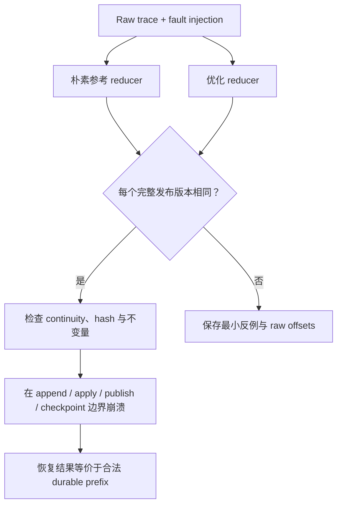

## 用运行证据识别失效合同并完成恢复

### 监控与故障处理 Runbook

单看 `websocket_connected=1` 远远不够。建议至少记录：

| 指标 | 说明 |
| --- | --- |
| `book_valid{bookIdentity}` | 当前版本是否可供交易消费者使用 |
| `path_connection_epoch` / `logical_feed_epoch` / `reconstruction_epoch` / `sequence_generation` | 线路、逻辑源、重建与序列代际 |
| `last_source_cursor` | 当前协议位置；按 feed 使用 typed cursor |
| `gap_total{reason}` | sequence、prev mismatch、buffer overflow 等 |
| `checksum_fail_total` | 按 feed/version 分组 |
| `resync_total` / `resync_duration` | 重建频率、耗时与尝试次数 |
| `buffer_events` / `buffer_bytes` | snapshot 期间缓存压力 |
| `decode_apply_publish_latency` | 分阶段延迟而非单个平均值 |
| `queue_depth` / `oldest_event_age` | ingest 与下游积压 |
| `last_heartbeat_age` | 连接活性 |
| `last_valid_book_age` | 交易可用状态年龄 |
| `duplicate_or_out_of_order_total` | 协议异常和冗余流行为 |
| `slow_consumer_disconnect_total` | 扇出容量与客户端问题 |

故障处理顺序应是：

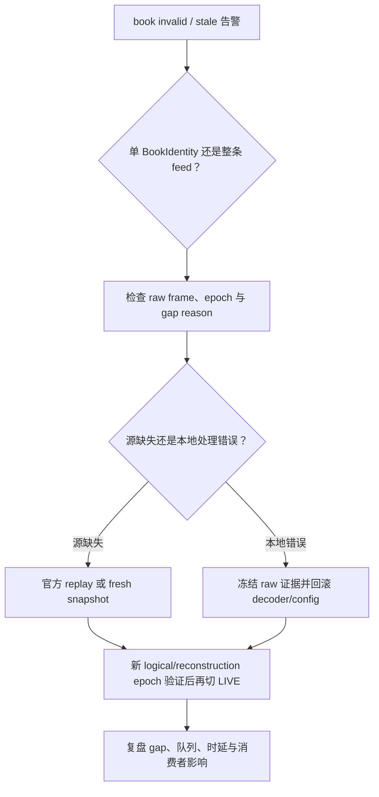

不要在告警后手工把 `valid` 改回 true，也不要清空 gap counter 后继续沿用旧簿。恢复的完成条件是新 snapshot、合法 bridge、追平和验证全部闭环。

## 结论：可信行情必须同时闭合身份、连续性、物化与恢复

一条可信的行情管线不是“把数据送得快”，而是同时守住四个闭环：

1. **身份闭环**：知道每条状态属于哪个稳定 `BookIdentity`，并区分线路、逻辑源、重建、序列与元数据代际；
2. **连续性闭环**：snapshot cut、增量 bridge、Gap 与 reset 都按协议证明；
3. **物化闭环**：精确数值、批次语义、checksum 与不变量共同验证本地簿；
4. **恢复闭环**：一旦无法证明正确，立即 INVALID，并通过 replay 或 fresh snapshot 回到新的合法版本。

只有做到这些，订单簿才是可以驱动策略和风控的状态，而不是一张恰好看起来合理的价格表。

## 参考资料

- [Binance Spot WebSocket Streams：本地订单簿重建](https://github.com/binance/binance-spot-api-docs/blob/master/web-socket-streams.md#how-to-manage-a-local-order-book-correctly)
- [Coinbase Exchange WebSocket Channels](https://docs.cdp.coinbase.com/exchange/websocket-feed/channels)
- [Coinbase Exchange WebSocket：Sequence Numbers](https://docs.cdp.coinbase.com/exchange/websocket-feed/overview#sequence-numbers)
- [Kraken Spot WebSocket v2 Book](https://docs.kraken.com/exchange/api-reference/spot-websocket-v2/book)
- [Kraken WebSocket v2 Book Checksum Guide](https://docs.kraken.com/exchange/guides/websockets/book-checksum-v2)
- [OKX API：Order Book Channel](https://www.okx.com/docs-v5/en/#order-book-trading-market-data-ws-order-book-channel)
- [OKX：2026 年订单簿 checksum 弃用公告](https://www.okx.com/en-us/help/okx-order-book-channels-checksum-field-deprecation)
- [FIX Trading Community：Market Data Book Management](https://www.fixtrading.org/wp-content/uploads/download-manager-files/MDOWG_Book_Mgt-v20.pdf)
- [CME MDP 3.0：Incremental Feed Arbitration](https://cmegroupclientsite.atlassian.net/wiki/spaces/EPICSANDBOX/pages/457672396/MDP+3.0+-+Incremental+Feed+Arbitration)
- [CME MDP 3.0：Recovery Services](https://cmegroupclientsite.atlassian.net/wiki/spaces/EPICSANDBOX/pages/457325847/MDP+3.0+-+Recovery+Services)
- [CME MDP 3.0：MBP / MBOFD Market Recovery](https://cmegroupclientsite.atlassian.net/wiki/spaces/EPICSANDBOX/pages/457672425/MDP+3.0+-+MBP+and+MBOFD+Market+Recovery)
- [CME MDP 3.0：TCP Recovery](https://cmegroupclientsite.atlassian.net/wiki/spaces/EPICSANDBOX/pages/457574209/MDP+3.0+-+TCP+Recovery)
- [Nasdaq TotalView-ITCH 5.0](https://www.nasdaqtrader.com/content/technicalsupport/specifications/dataproducts/NQTVITCHspecification.pdf)
