订单在进入风控和撮合之前，系统必须先知道它交易的究竟是什么。

`BTC-USDT` 是现货、保证金现货还是永续合约？`ESZ6` 的一张代表多少标的、以什么币种结算、何时到期？某期权的执行价按照哪种精度编码？今天是交易日还是自然日？当前允许新增风险、只允许撤单，还是处于集合竞价的不可撤单阶段？一张价格为 `100.005` 的订单究竟是合法价格、需要舍入，还是必须拒绝？

这些问题不属于撮合算法的细枝末节，而属于**交易品种主数据与市场状态**。它是 OMS、交易前风控、撮合、行情、清算和账本共同依赖的控制平面。只要其中一个服务使用了不同版本，系统就可能在各自“逻辑正确”的情况下合成一笔整体错误的交易。

本文是交易系统学习路径的 Chapter 02。建议先读 [CEX 交易系统全景](/signal-grid-blog/posts/cex-trading-system-overview/)，把本文放回订单入口、风险、撮合、清算和账本的端到端边界中理解。

> 本文讨论系统设计，不构成交易或投资建议。文中模型用于解释不变量，不是任何交易所的通用规则。本文以 2026-08-17 可查的一手协议与规则为基线；合约参数、交易时间、停牌流程和价格保护都会变化，生产实现必须以目标场所当期发布的规则和机器可读数据为准。

## 主数据不是后台表格，而是交易控制平面

不少系统最初会有一张 `symbol_config` 表：运营人员填写名称、价格小数位、数量小数位和启停开关，各服务每隔几十秒刷新缓存。

这种实现能支撑演示，却不能支撑可审计交易。原因是它把五种不同事实塞进了一行可变记录：

- 品种的稳定身份；
- 合约的经济含义；
- 某场所的上市与交易规则；
- 随时间变化的市场状态；
- 一次规则变更的生效边界。

真正的产品控制平面至少要输出两类流：

1. **定义流**：某个 instrument 是什么，价格与数量使用什么单位，何时上市、到期和结算；
2. **状态流**：它现在处于什么市场阶段，哪些动作被允许，当前价格边界是什么。

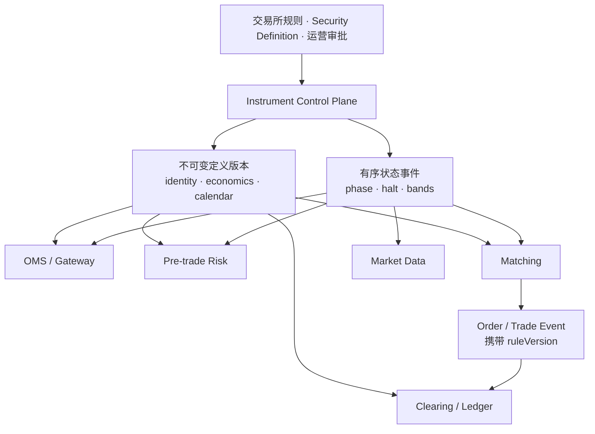

控制平面不必与撮合部署在同一个进程，但它必须给交易平面一个确定答案：**对命令序列中的第 N 条订单，究竟应用哪个规则版本。**

如果答案是“读取此刻数据库里的最新值”，重放就不再确定。昨天合法的一档价格今天可能因 tick 改变而非法；用今天的配置重放昨天的命令，会得到不同的拒绝、排队和成交结果。

因此本文的核心不是列字段，而是建立下面这条不变量：

```text
相同的输入命令序列
+ 相同的品种定义版本
+ 相同的市场状态事件序列
= 相同的校验、排序、成交与业务事件
```

## 产品身份、类型与数值单位必须一起建模

### 先区分 Asset、Instrument 与 Listing

交易系统常把“资产”“产品”“合约”“交易对”和“代码”混用。为了避免身份污染，可以先采用三层模型。

| 层次 | 回答的问题 | 例子 | 典型稳定性 |
| --- | --- | --- | --- |
| Asset | 经济对象或计价单位是什么 | BTC、USD、某公司普通股 | 较稳定，但也有拆分、迁移与重命名 |
| Instrument | 双方交易的权利义务是什么 | BTC/USD 现货、2026-12 到期期货、某执行价看涨期权 | 随合约生命周期创建和终止 |
| Listing | 这个 instrument 在哪个 venue/segment 上如何交易 | Nasdaq 某证券、CME Globex 某合约、某 CEX 的 `BTC-USDT` | 受场所代码、会话、tick 和状态约束 |

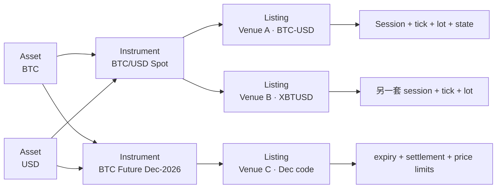

#### Asset 不是字符串币种

资产记录至少要包含稳定内部 ID，标准名、显示名与历史别名，资产类型，记账和展示单位；若可托管，还要保存链、合约地址、发行方等命名空间，并独立表达充值、提现、借贷与抵押能力。

`USDT` 这个显示符号不足以唯一识别资产。不同网络上的 token、包装资产和交易所内部负债可能有不同的托管与结算风险。反过来，同一个经济资产也可能在不同协议里写作 `BTC`、`XBT` 或数字 ID。

资产 ID 不应从显示符号生成，更不能在改名时更换。显示符号是属性，稳定 ID 才是引用键。

#### Instrument 描述经济契约

Instrument 把资产组合成可交易权利义务。它要描述产品类型，标的、报价、结算和保证金币种，数量与价格单位，合约乘数和线性/反向/quanto 结构，到期、行权、交割或资金费用规则，所引用指数、定盘价与结算过程，以及规则版本与生命周期。

两个 venue 可以列出经济上近似的合约，但如果指数、结算价、到期时刻、乘数或违约处理不同，就不能因为显示名称相似而合并成同一个 instrument。

#### Listing 描述在哪里、怎样交易

Listing 负责场所特有事实：`venueId`、market/segment/channel、原始 `securityId` 与符号、tick/lot/订单量边界、交易日历与 session template、撮合和订单能力、价格保护、上市与退市状态，以及行情、订单入口和清算映射。

CME MDP 3.0 的 Security Definition 消息就是一种机器可读 listing 定义：它标识 instrument，并携带到期、执行价等属性。Nasdaq TotalView-ITCH 的 Stock Directory 则携带日内 locate code、股票代码、市场类别、金融状态和 round-lot 等目录数据。两者字段形态不同，证明 canonical model 应保留场所语义，而不是强迫所有 venue 填一张“最小公分母”表。

#### 身份必须带命名空间和生命周期

一个实用的复合身份可以写成：

```text
ListingIdentity = (venue, marketSegment,
                   securityIdNamespace, securityId, identityEpoch)
```

为什么需要 `identityEpoch`？因为场所 ID 可能只保证在一个交易日、一个会话或 instrument 删除后的有限时间内不重用。CME 的部分 MDP 文档明确说明 `SecurityID` 在 instrument 到期或删除后的下一个 trade date 之前不会重用；这不是“永久全球唯一”的承诺。

因此不要把一个裸整数 `48` 放进全局 Map，也不要用 symbol 作为订单、成交和账本的永久外键。内部 `listingId` 应稳定且不重用，并保存 venue identity 的有效区间。

#### 符号映射不是一次性 ETL

对接系统通常需要同时保存：

```text
internalListingId, venueSecurityId + sourceNamespace,
venueSymbol, displaySymbol, clearingSymbol,
marketDataChannel, orderEntryRoute, effectiveFrom / effectiveTo
```

新旧 symbol 在一段迁移期内可能都出现。行情、成交回报和清算文件也未必使用同一种标识。映射层必须能够按**事件发生时的版本**反查，而不是只保存“当前 symbol”。

FIX Orchestra 也强调 `SecurityID(48)` 的含义由 `SecurityIDSource(22)` 判别；ID 值与来源字段共同构成语义。这个原则比记住某个 FIX tag 更重要：任何外部标识都必须带命名空间。

### 用判别联合建模产品，而不是一百个 nullable 字段

四类常见产品共享一些字段，但经济语义不同。一个 canonical definition 可以先分成公共头与产品载荷：

```text
InstrumentDefinition {
  identity, type, baseAsset?, quoteAsset?, settlementAsset,
  quantityUnit, priceUnit, listingRules, lifecycle,
  product: Spot | Future | Perpetual | Option,
  definitionVersion
}
```

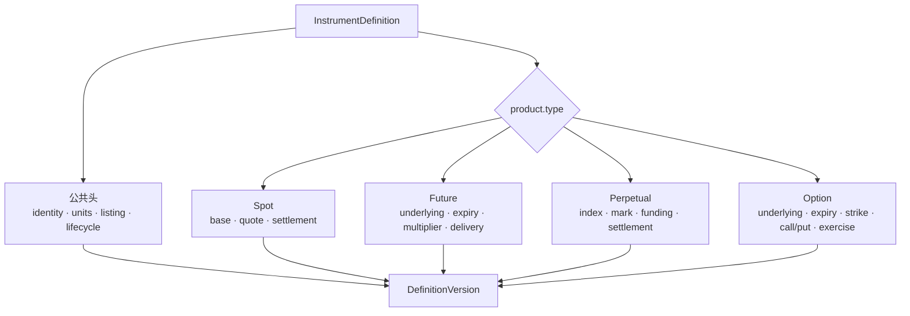

用判别联合而不是大量 nullable 字段，有三个好处：

1. `type=OPTION` 时，编译器和 schema 可以要求 `strike`、`optionRight` 和 `expiry`；
2. `type=SPOT` 时，不会误读上一版遗留的 `fundingInterval`；
3. 新增产品类型时，需要显式扩展所有消费者，而不是悄悄忽略字段。

#### 所有产品都应有的公共字段

| 字段组 | 最低要求 | 常见错误 |
| --- | --- | --- |
| Identity | 内部 ID、venue ID、命名空间、symbol、epoch | 裸 symbol 当主键 |
| Lifecycle | list、activate、expire、delist、settle 时间 | `active=true` 覆盖整个生命周期 |
| Units | price/qty/currency/contract 单位与 scale | 用小数位猜 tick |
| Trading | tick rule、lot rule、order limits、capabilities | 只保存 `pricePrecision` |
| Calendar | timezone、trade-date rule、session template、exceptions | 每天固定 UTC 开关盘 |
| Risk | price reference、bands、position/open-order limits 的版本引用 | 在各服务复制公式 |
| Provenance | source、source cursor、recordedAt、effectiveAt | 无法解释配置从哪里来 |

`pricePrecision=2` 只说明最多展示两位小数，不说明合法价格步长一定是 `0.01`。合法步长可以是 `0.05`、`0.25`，甚至按价格区间变化。

#### 现货字段

现货至少需要：

```text
baseAsset, quoteAsset, settlementAssets,
price = quoteAsset / baseAsset, quantity = baseAsset amount,
lotRule, minNotional?, feeScheduleRef
```

但不要把“现货数量一定是 base 数量”硬编码进所有订单接口。有些 venue 的市价买单按 quote 金额提交；有些接口同时支持 `base_size` 与 `quote_size`。订单必须带 `quantityType`，网关再按 listing capability 校验。

还要区分：

- 产品可交易；
- base 可充值；
- base 可提现；
- quote 可用作保证金；
- 该账户或地区可访问。

这些是不同能力，不应该被一个 `enabled` 布尔值控制。

#### 到期期货字段

期货需要在公共字段之外保存：

```text
underlying, contractMultiplier, quantityUnit = CONTRACT,
maturity / lastTradeTime, settlementTime,
deliveryType, settlementIndexRef?, deliveryTermsRef?, priceQuotation
```

一张合约的名义价值通常是：

```text
notional = contracts × contractMultiplier × price
```

但这只适用于对应的线性报价模型。反向或特殊计价合约的价值函数不同，必须由显式 `valuationModel` 或经过审核的产品类型决定，不能由 symbol 后缀猜测。

到期也不是一个时间字段能表达完：最后交易、停止开仓、到期、最终结算价确定、现金入账或实物交割可能发生在不同时间。

#### 永续合约字段

永续没有固定 maturity，但比期货少一个字段不代表模型更简单。至少需要：

```text
underlying / indexRef, contractMultiplier,
linear | inverse | quanto, settlementAsset,
markPriceRuleRef, fundingRuleRef,
fundingInterval / nextFundingTime source, positionModeCapabilities
```

资金费率周期、上限、溢价指数和结算时间可能按规则版本变化。它们不应成为永不变化的构造参数。

OKX 当前公开 instruments API 就把 `SPOT`、`SWAP`、`FUTURES` 和 `OPTION` 分开，并返回 `tickSz`、`lotSz`、`minSz`、合约价值、线性/反向类型、状态及 upcoming parameter changes。这是一个很好的工程提示：**产品规格既有快照，也会有未来生效的变化。**

#### 期权字段

期权至少需要：

```text
underlyingInstrument | underlyingAsset, expiry,
strike + strikeCurrency, optionRight, exerciseStyle,
settlementType, contractMultiplier,
premiumQuotation + premiumCurrency, exercise / assignment rule references
```

FIX/CME Security Definition 会为 outright options 使用 `PutOrCall(201)`、`StrikePrice(202)`、`StrikeCurrency(947)` 以及 underlying group。字段存在并不等于跨 venue 语义相同：期权权利金可以按币、美元、隐含波动率或其他方式输入和展示，订单 API 必须明确 `priceType`。

期权还有常被忽略的关联身份：

- 同一 underlying 与 expiry 的 option series；
- call/put 与 strike 组成的具体 contract；
- 期权对应的可交割标的，未必等于行情所引用的指数；
- 组合单的 legs、ratio 与 side。

不要从类似 `BTC-20261225-50000-C` 的字符串拆字段后就认为定义完整。symbol 语法可能变化，也无法表达所有结算和行权规则。

### Tick、Lot、Multiplier 与 Scale 是四件事

这四个词经常被错误地合并为“小数位”。

| 概念 | 含义 | 示例 |
| --- | --- | --- |
| Tick | 合法价格网格或其规则 | `0.25`，或价格区间对应不同 tick |
| Lot | 合法数量网格 | `1 contract`、`0.001 BTC` |
| Multiplier | 一单位合约代表的经济敞口 | `5 × index`、`0.01 BTC/contract` |
| Scale | 编码或展示的小数缩放 | 整数 `12345` 配 scale `2` 表示 `123.45` |

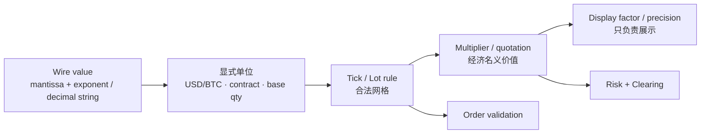

#### 用整数格点校验，不要用二进制浮点取模

若 tick 恒定为 `0.05`，合法价格满足：

```text
(price - origin) / tick ∈ Integer
```

生产实现应把 decimal 解析为统一 scale 的整数，或使用精确 decimal 类型：

```text
priceUnits = parseExact("100.15", scale=2)  // 10015
tickUnits  = parseExact("0.05", scale=2)    // 5
valid      = (priceUnits - originUnits) % tickUnits == 0
```

不要用 `double price % tick == 0`。`0.1` 在 IEEE 754 binary floating point 中通常不能精确表示，边界订单会产生不可解释的接受/拒绝差异。

也不要默认替客户舍入。将非法 `100.03` 悄悄改成 `100.05` 会改变订单经济含义和 maker/taker 结果。除非协议明确规定规范化方向，否则应拒绝并返回当前 rule version、合法 tick 和原始输入。

#### Tick 可以按价格区间变化

某些 instrument 使用 variable tick table：不同价格区间有不同增量。CME MDP 文档明确区分标准 tick 和 Variable Tick Table；标准 tick 可从 `MinPriceIncrement(969)` 获取，VTT instrument 则要按 tick rule 查表。

```text
TickBand {
  lower, lowerRelation, upper, upperRelation,
  tick, priceOrigin, effectiveAt
}
```

不能把所有区间硬编码成左闭右开：venue 规则可能同时使用 `≤`、`<`、`>` 等不同关系。需要明确每个切点的边界归属。例如从 `5.00` 开始 tick 从 `0.01` 变成 `0.05` 时，`5.00` 属于哪一档？跨档 amend 怎样校验？旧订单留在原价格还是被取消？这些都必须来自场所规则，不能由通用数学函数猜。

#### Lot、最小数量与最小名义价值不同

一张订单可以满足数量步长，却仍低于最小下单量或最小名义价值：

```text
qty % lotStep == 0
qty >= minQty
price × qty × multiplier >= minNotional
qty <= maxOrderQty
```

`minNotional` 又可能以 quote、settlement 或风险折算币种计算。市价单在没有确定成交价时，需要使用 venue 指定的保护价或本地保守参考，而不能拿最后成交价假装结果已知。

#### DisplayFactor 不是合约乘数，必须先完成单位转换

CME 的部分 Security Definition 使用 `DisplayFactor` 将 Globex wire price 转换为惯例展示价格；非分数报价应按协议应用该转换，分数报价则走场所规定的专门转换，不能机械套用同一因子。它与 contract multiplier 不是一回事：必须先把 wire price 归一化为约定的经济价格单位，再与 quantity、multiplier 等计算名义价值和损益。风控与清算必须明确 wire price、display price、economic price 的类型与转换链，不能把显示缩放当作可忽略的 UI 装饰，也不能把它重复乘进经济金额。

推荐把类型写进接口：

```text
WirePrice
DisplayPrice
EconomicPrice
OrderQuantity
ContractCount
BaseAmount
QuoteAmount
```

即使底层都用 `long`，也不要允许它们在没有转换函数时相加或相乘。

## 时间、市场状态与价格边界共同决定交易权限

### 交易时间不是每天两个 UTC 时刻

交易日历至少由四层组成：

1. venue timezone；
2. 普通周 session template；
3. 节假日、提前收盘和临时公告等 exception；
4. trade-date assignment rule。

CME 公布的 2026 Globex 日历明确提醒 holiday hours 可能调整，通常临近节日才最终确认；Nasdaq 2026 日历也单列全天休市和 13:00 提前收盘日。这说明“把全年开闭市时间编译进代码”不是可靠方案。

#### Event time、wall date 与 trade date 必须分开

一个夜盘事件可能在自然日 Sunday 发生，却属于 Monday trade date。连续交易市场也可能在维护窗前后保持同一个或切换到下一个业务日。

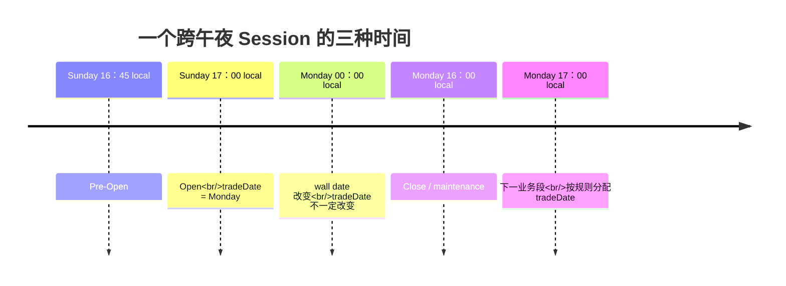

事件建议同时携带：

```text
sourceEventTimeUtc, receiveTimeUtc, receiveMonotonicNanos,
venueLocalDateTime?, tradeDate, sessionId,
sessionPhase, calendarVersion
```

UTC instant 负责跨系统定位；单调时钟负责本进程耗时；venue local time 与 trade date 负责业务解释。三者不能互相替代。

#### 时区必须保存 Zone ID，而不是固定 offset

`America/Chicago` 与 `UTC-06:00` 不是一回事。前者包含 DST 和历史规则，后者永远固定偏移。

正确流程是：

1. 保存 venue 公布的本地 session 规则和 IANA Zone ID；
2. 明确 DST overlap 时选择哪个 offset/fold，以及 gap 时拒绝、前移、后移还是采用 venue 公告的绝对时刻；
3. 在指定 tzdb 版本和上述消歧规则下展开为 UTC intervals；
4. 将物化后的 UTC intervals、tzdb version/source 与 `calendarVersion` 一起发布；
5. 在 DST gap、overlap 和规则更新时运行显式测试。

`ZoneId + LocalDateTime` 本身仍不足以消除歧义：overlap 中同一本地时刻有两个合法 offset，gap 中则没有合法 offset。JDK 的默认调整策略不等于 venue 合同，不能让各服务各自调用默认转换后碰巧得到同一结果。

不能只在应用启动时计算“今天开盘 UTC”。长期运行进程会跨越 DST、holiday exception 和紧急公告。

#### Session 是状态机，不只是 open/close

一个场所可能有：

- closed；
- pre-open；
- pre-open no-cancel；
- opening auction；
- continuous trading；
- pause/reserved；
- closing auction；
- post-close。

CME 的 Security Status 文档就区分 Pre-Open、No Cancel、Opening、Open、Pause、Close 与 Post Close，并分别给出 `SecurityTradingStatus` 和 `SecurityTradingEvent`。不要把这些值压成 `isOpen`。

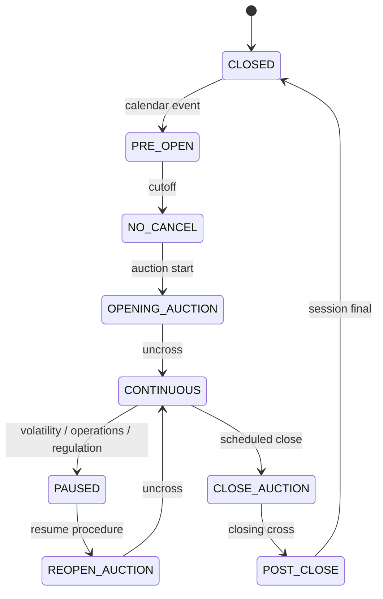

这张图只是参考拓扑。真实 venue 可能没有某些阶段，也可能允许从任何阶段进入 halt。实现时应读取 per-market transition table，不要把图写死成全局 enum 顺序。

#### Calendar 变更也是版本化规则

日历变更可能来自年度 holiday schedule、临时提前收盘、重大事件导致的延迟开盘、新产品改为 24/7、维护窗取消或延长，以及 venue 对此前公告的修正。

每次变更都要保存 source notice、recordedAt、effectiveAt 和受影响的 session 范围。若公告在事件发生后才被系统录入，回溯查询必须能区分“当时系统知道的日历”和“后来确认的真实日历”。

### 市场状态应表达权限矩阵

`TRADING`、`HALTED` 只是标签。真正影响交易的是当前允许哪些动作：

| 状态 | New | Amend | Cancel | Match | Market Data | 说明 |
| --- | ---: | ---: | ---: | ---: | ---: | --- |
| PRE_OPEN | 依规则 | 依规则 | 依规则 | 否 | Indicative | 收集竞价订单 |
| NO_CANCEL | 可能允许 | 通常受限 | 通常禁止 | 否 | Indicative | 防止临界点撤单 |
| CONTINUOUS | 是 | 是 | 是 | 是 | Live | 连续撮合 |
| HALTED | 通常否 | 否/受限 | 依规则 | 否 | Status only | 停牌原因和场所决定权限 |
| QUOTE_ONLY | 依规则 | 依规则 | 依规则 | 否 | Quotes/imbalance | 恢复前报价或竞价阶段 |
| POST_ONLY | 仅可增加流动性 | 受限 | 是 | 仅被动 | Live | venue 特有保护状态 |
| CLOSE_ONLY | 仅风险减少 | 仅风险减少 | 是 | 是/受限 | Live | 账户、产品或全局策略均可能触发 |
| CLOSED | 否 | 否 | 可能批量清理 | 否 | Final | 等待下一 session |

表中的“通常”不能变成代码默认。CME Globex Reference Guide 的状态表显示，不同 phase 对下单、修改和撤单的允许关系并不相同；Nasdaq ITCH 的 Trading Action 则区分 halted、paused、quotation only 和 trading。协议只给状态事实，订单入口仍要用 venue rule 映射为 capability。

建议状态对象直接输出能力：

```text
TradingPermissions {
  acceptNew, acceptCancel, acceptReplace, allowMatching,
  allowAggressive, allowRiskIncreasing, allowedOrderTypes,
  reasonCode, stateVersion
}
```

这样 OMS 不需要散落 `if (status == HALT)`，也不会漏掉 `NO_CANCEL`、`POST_ONLY` 或 `CLOSE_ONLY` 的特殊组合。

#### Venue state、instrument state 与 account restriction 要分层

最终权限通常是多层约束的交集：

```text
effectivePermissions =
  venuePermissions
  ∩ marketSegmentPermissions
  ∩ instrumentPermissions
  ∩ accountPermissions
  ∩ emergencyRiskPermissions
```

例如 venue 正常交易，但某 instrument 被停牌；或者 instrument 正常，某账户只允许平仓；又或者全平台触发 kill switch，只允许撤单。

不要把账户限制反写为 instrument `HALTED`，否则公共行情会错误宣称全市场停牌。每层状态都要有独立 source、scope、reason 与 version。

### Auction、Halt 与 Close-Only 不是同一种“不能正常下单”

#### Auction 需要单独的价格形成规则

集合竞价阶段通常接收一批订单，再按规则选择单一成交价。此时公开信息可能包括 indicative price、paired quantity 和 imbalance，而不是连续交易的 BBO。

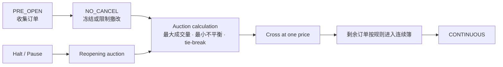

状态定义必须关联：

- 允许的订单类型；
- 是否发布 indicative 数据；
- cancel/amend cutoff；
- 竞价算法版本；
- 竞价订单如何获得连续交易优先级；
- 未成交余量是取消还是转入订单簿；
- 跨状态时价格带与风险参考如何重置。

“没有连续成交”不代表订单入口关闭。Nasdaq 的 quotation-only 状态就是恢复交易前可以报价、但尚未恢复正常交易的例子。

#### Halt 必须带 scope 与 reason

停牌至少可能是：

- 全市场监管停牌；
- 单一 venue 的 operational halt；
- 单一 instrument 事件；
- 一组关联合约的 volatility pause；
- 本平台因为行情不可信而主动 fail closed。

Nasdaq ITCH 明确把跨市场 Stock Trading Action 与单一 market center 的 Operational Halt 分成不同消息。这证明 `HALTED` 必须带 scope；否则路由器可能把“某 venue 暂停”误解为“所有 venue 都不可交易”，或者做出更危险的反向误判。

状态事件至少保存：

```text
scopeType, scopeId, state, reasonCode,
source, sourceSequence, effectiveAt, receivedAt, stateVersion
```

reason 不能只写给 UI。恢复 Runbook、合规报告和自动动作可能依赖“scheduled”“surveillance”“market event”“recovery in process”等差异。

#### Close-Only 是风险策略，不一定是 venue phase

`CLOSE_ONLY` 的语义应是“允许减少指定风险，不允许增加风险”，而不是简单允许 `SELL`：

- long 账户的 sell 可能减仓；
- short 账户的 sell 会继续增仓；
- hedge mode 下同一账户可同时有 long 与 short；
- 多张未成交 Reduce-Only 订单会竞争同一可减少数量；
- 组合保证金下，一条腿减仓也可能让组合风险增加。

因此 close-only 校验需要账户状态、持仓模式和同一风险版本。它可以由 venue、instrument、账户或紧急风控触发，但不应伪装成公共市场状态。

状态切换到 close-only 时，还要定义已有订单：保留全部、取消风险增加订单、缩量，还是只阻止新命令。默认“留着不管”会让切换前挂入的开仓单在切换后继续成交。

### Price Grid、Price Band、Daily Limit 与 Circuit Breaker 要分开

价格约束至少有四层：

1. **Price grid**：价格是否落在合法 tick 上；
2. **Order band**：一张新订单离动态参考是否太远；
3. **Trading limit**：该交易日允许成交的绝对上下界；
4. **Circuit breaker / pause**：价格运动满足条件后改变市场状态。

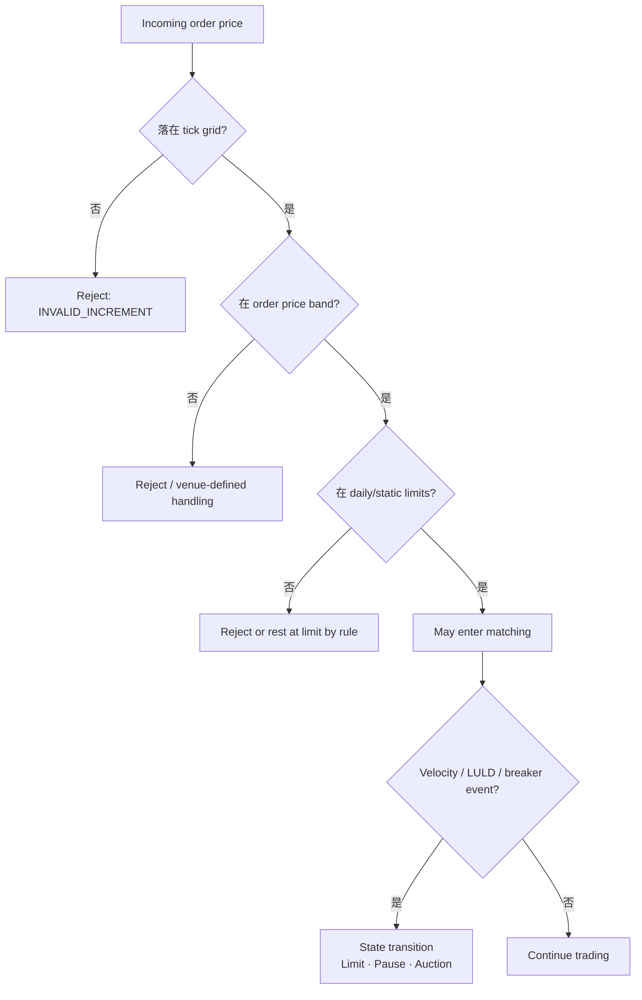

#### 静态边界与动态边界

静态边界通常由前结算、参考价或规则表在一个业务区间内计算；动态边界则随 last、BBO、指数、理论价值或时间窗口变化。

一个可审计的 band snapshot 应包含：

```text
referenceType, referenceValue, referenceSourceCursor,
lowerBound / upperBound, formulaVersion, roundingRule,
effectiveFrom, bandVersion
```

只保存上下界会丢掉“为什么是这个边界”。发生争议时，系统必须能证明使用了哪个参考值、哪一版公式和什么舍入规则。

CME 对 futures 与 options 采用不同的 price banding 机制，并说明参考可以来自 last trade、best bid/offer、settlement 或理论值；明显越界的价格型订单会被拒绝。它同时还有 daily price limits、Velocity Logic 和 dynamic circuit breakers。它们都是保护机制，却不是同一个开关。

#### LULD 说明价格带本身也是状态输入

美国股票的 Limit Up-Limit Down Plan 使用过去五分钟 eligible trades 的参考价格计算上下 band，并由 SIP 发布。价格不能简单被理解成 `last ± 固定百分比`；tier、时间段、低价股规则、参考更新与舍入都属于计划的一部分。

当报价触及或越过 band 时，Limit State、Straddle State、Trading Pause 与 reopening 又会影响订单是否可执行。SEC 2026 Rule 605 FAQ 也明确指出，位于 LULD bands 之外的 NBBO 没有执行机会。对 OMS 来说，这意味着 band 不是 UI 提示，而是可执行性合同的一部分。

#### 边界计算必须指定取整方向

假设理论上界是 `100.037`，tick 为 `0.05`，究竟发布 `100.00` 还是 `100.05`？若系统各自 `round()`，买卖两侧可能得到不同结论。

规则应显式描述：

```text
upper = greatestLegalPriceAtOrBelow(rawUpper, activePriceGrid)
lower = smallestLegalPriceAtOrAbove(rawLower, activePriceGrid)
```

这里的 `activePriceGrid` 已包含每个 tick band 的显式边界关系，因此不会先在切点选择错误的 tick，再做一次看似正确的 floor/ceil。这仍只是常见的保守模板，不是跨 venue 标准。实际方向、价格区间 tick 与 reference freeze 必须来自目标规则。最重要的是让所有服务调用同一个版本化算法，并用 golden vectors 验证每个切点和上下各一个 tick。

#### 参考源失效时不能沿用陈旧 band 假装安全

如果 band 依赖指数、BBO 或理论期权价格，参考源有 freshness contract。超过阈值后应进入明确状态：

- reject risk-increasing orders；
- close-only；
- pause matching；
- 或按照 venue 公布的 fallback 切换参考。

“继续使用最后一个值”只有在规则明确允许且有最大时限时才是策略。否则它只是把行情故障隐藏成价格保护。

## 规则必须有序分发并在命令序列上原子生效

### Security Definition 要有全量基线，也要有有序增量

成熟场所不会要求每个客户手工维护全部合约。FIX 提供 Security Definition、Security Status 和 Security Definition Update Report 等语义；具体 venue 再选择 FIX tag-value、SBE、ITCH 或自定义编码。

CME MDP 的 Instrument Replay feed 持续重放当前一周的 Security Definition：客户端从 `MsgSeqNum=1` 开始，使用 `TotNumReports(911)` 判断完整集合，且文档明确不保证定义消息的业务排序。周中 add/modify/delete 由 `SecurityUpdateAction(980)` 表达。

这揭示了一个通用恢复模型：

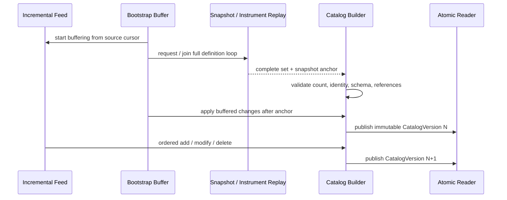

#### 完整性不能靠“等几秒应该收齐了”

全量结束条件必须来自协议：总报告数、end marker、snapshot token、文件 checksum 或经签名 manifest。超时只能触发失败或重试，不能把部分集合标成 READY。

构建阶段至少验证 ID/symbol 不冲突，underlying、currency、calendar 和 tick table 引用存在，产品判别字段完整，add/modify/delete 合法，生命周期时间有序，decimal 可无损表示，而且 source cursor 连续且未跨错误 epoch。

#### Definition 与 Status 是两条相关但不同的流

Definition 回答“是什么”，Status 回答“现在能做什么”。CME 的建议流程也是先处理 Security Definition 获得 instrument 信息，再按 Security Status 处理 market、instrument 和 implied matching 状态。

不能每次停牌都生成一份完整 definition，也不能把当前 `OPEN` 写进一个永不改变的合约对象。推荐读模型是：

```text
InstrumentView =
  Definition(definitionVersion) + Session(calendarVersion, sessionId)
  + TradingState(stateVersion) + PriceConstraints(bandVersion)
```

这个 view 可以缓存，但组成版本必须可见。

#### Snapshot 与 incremental 的切点必须可证明

若协议没有给 snapshot anchor，就不能安全地把任意快照和任意实时更新拼接。可能的安全方案包括：

- snapshot 自带最后处理的 incremental sequence；
- 在单一日志上读取 checkpoint offset；
- source 提供 generation + version；
- 暂停发布，在受控事务中导出一致集合。

CME MDP 的市场快照使用 `LastMsgSeqNumProcessed(369)` 与实时 feed 对齐，是“快照必须声明切点”的具体例子。Instrument Replay 的协议细节不同，不能把 book recovery 字段机械套在 definition feed 上；通用的是**切点要由源协议证明**。

### Version 不只是 `updated_at`

至少要区分四类版本：

| 版本 | 作用域 | 例子 |
| --- | --- | --- |
| SchemaVersion | 编码和字段解释 | 新增 enum、字段或消息模板 |
| DefinitionVersion | instrument 经济与交易规格 | tick、lot、multiplier、expiry 修正 |
| StateVersion | 有序市场状态 | halt → quote-only → trading |
| CatalogVersion | 一组定义的原子可见快照 | 全站规则切换批次 |

单个 instrument 的 `version=12` 与全局 catalog `version=12` 没有可比性。事件要带 scope 和 generation。

#### effectiveAt 与 recordedAt 解决两个不同问题

- `effectiveAt`：规则在业务世界何时生效；
- `recordedAt`：本系统何时得知并记录这条事实。

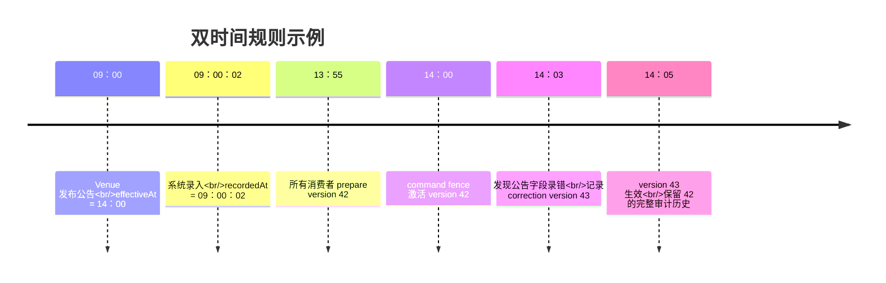

只有 `updated_at` 无法回答：

- 在 13:00，当时系统认为 14:00 会生效什么？
- 某笔 14:01 的订单实际使用哪一版？
- 14:03 才录入的修正是否应该重写历史成交？

通常不应原地修改 version 42，而应发布 correction version 43，并明确其有效区间与补救动作。已发生的成交是否调整是业务与规则决定，不能靠数据库 update 偷偷改历史。

#### 未来生效规则要进入调度表，不要靠 cron 改行

一条 upcoming change 应是不可变对象：

```text
RuleChange {
  changeId, affectedListings, previousVersion, nextVersion,
  effectiveAt, sourceNotice, approval, payloadHash
}
```

OKX instruments API 当前会返回 `upcChg`，其中包括即将变化的参数、新值和生效时间。这类数据应进入预演、冲突检查和激活流程，而不是到时间直接覆盖缓存。

### 规则切换必须在命令序列上原子化

即使所有服务最终都收到 version 42，也可能出现危险窗口：Gateway 已按新 tick 接单，Risk 仍按旧 multiplier 计算，Matching 仍按旧 price grid 排队。

“配置最终一致”不适合决定一笔订单是否合法。

#### Prepare、Activate、Fence、Observe

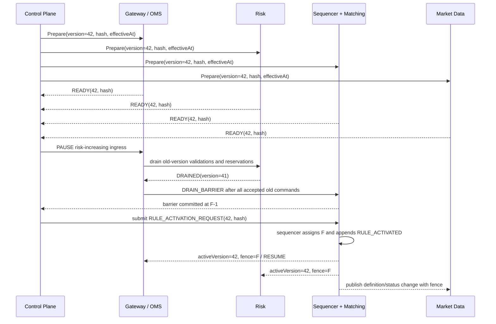

关键不是 Control Plane 猜一个将来的 sequence，也不是所有机器的 wall clock 在同一微秒触发，而是 **sequencer 在提交 activation request 时分配真实日志位置 `F`**：`F` 之前用 41，`F` 及之后用 42。图中采用“暂停入口、排空旧版本在途命令、提交 activation、恢复入口”的协议，因此不会出现订单已按 v41 做完风险预占、却在 fence 后才按 v42 进入撮合的跨版本决策。

更简洁的架构是**先排序，再做所有权威的版本敏感校验与预占**：sequencer 根据命令位置附上 authoritative rule version，Risk 与 Matching 都以它为准。若业务必须在排序前预占，则必须采用图中等价的 drain barrier，或者让 Matching 对版本重新校验，并为旧版预占提供确定性的撤销与重建协议。仅在成交结果上补一个 `ruleVersion` 只能帮助审计，不能修复已经发生的跨版本校验。

如果架构没有中央 sequencer，也要使用等价机制，例如按 partition epoch、Raft log position 或 venue source sequence 激活。纯 `effectiveAt` 只有在系统证明时钟误差、延迟和迟到命令处理语义后才足够。

#### 每条命令和结果都携带使用的版本

建议至少记录：

```text
OrderCommand.observedCatalogVersion + authoritativeFence
RiskReservation.ruleVersion + authoritativeFence
OrderAccepted.ruleVersion; OrderRejected.ruleVersion + rejectionRule
OrderRested.ruleVersion; Trade.productVersion + stateVersion + bandVersion
LedgerEntry.productVersion
```

`observedCatalogVersion` 只说明 Gateway 接单时看到了什么，不能冒充最终判定版本。`authoritativeFence` 由权威序列决定，并必须贯穿风险预占、撮合结果与后续账务。

这不意味着一次订单生命周期永远只能使用同一版规则。关键是明确每个动作的规则：

- 新订单按当前版本校验；
- 已挂订单在 tick 变化后 grandfather、取消、改价或迁移；
- cancel 通常仍应能引用旧版本订单；
- replace 是原订单修改还是新订单，由 venue 语义决定；
- fill 的经济解释必须能追溯到成交时产品版本。

#### Tick 或 lot 改变时，先决定旧订单命运

假设 tick 从 `0.01` 改为 `0.05`，簿上已有价格 `100.03`。激活方案至少有：

1. 切换前强制取消不合规订单；
2. 旧订单 grandfather，直到成交或撤销；
3. 按明确方向改价并改变优先级；
4. 暂停、重建订单簿，再恢复交易。

不能让各 shard 自选。迁移策略属于 RuleChange，需在 shadow book 上预演：会取消多少订单、释放多少余额、改变多少 BBO，以及客户端收到哪些回报。

#### 未就绪时 fail closed

只要 Gateway、Risk、Matching 中任一关键消费者没有准备好同一 payload hash，就不应激活 risk-increasing trading。安全动作可以是延迟切换、暂停新单或 close-only；不能让超时节点“先用旧版本顶着”。

Market Data 也不是旁观者。若撮合已切换 tick，而行情仍宣称旧定义，客户端会把合法价格判为非法或构造不合法订单。

## 恢复与演进都必须保留历史语义

### 缓存、重放与恢复：版本优先于 TTL

主数据读取频繁，当然需要缓存。但缓存正确性不能建立在“60 秒后大家会一致”。

推荐使用不可变 catalog snapshot：

```text
CatalogSnapshot {
  catalogVersion, schemaVersion, sourceCursors,
  generatedAt, payloadHash, instrumentsById,
  aliasesByEffectiveRange, calendars, tickTables
}
```

读线程只持有一个 snapshot 指针；新版本完整验证后原子替换。不要在共享 HashMap 上逐行修改，让读者看到半个版本。

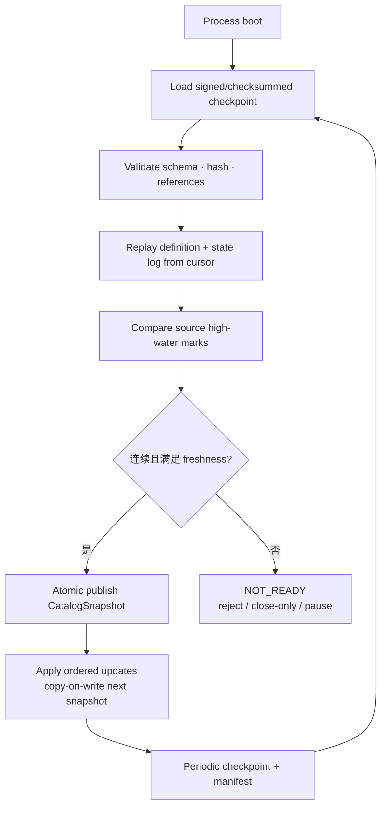

#### 恢复必须从权威记录重建

权威记录可以是 venue raw feed、内部 canonical event log 或两者组合。至少保留：

- 原始消息与来源连接/epoch；
- 解码 schema version；
- canonical change 与 source cursor；
- 审批、source notice 和 payload hash；
- 激活 fence；
- 消费者 acknowledgment；
- checkpoint manifest。

只保存最终数据库行，无法证明某次 tick 变化的到达、审批和激活顺序。

#### 删除使用 tombstone，不要立即遗忘身份

Instrument delist/delete 后仍会出现在历史订单、成交、账本和监管报告中。增量 `DELETE` 应关闭有效区间并产生 tombstone，而不是从所有映射中物理删除。

旧 symbol 的反查要按 event time/version 工作；新订单则必须拒绝引用已终止 listing。两者使用不同查询 API，避免“为了查历史而意外允许新交易”。

#### 缓存落后要可观测、可阻断

每个关键消费者报告：

```text
loadedCatalogVersion, activeRuleVersion, lastSourceCursor,
lastStateSequence, payloadHash, freshnessAge, readiness
```

负载均衡器不能只看 HTTP 200。节点若 active version 落后，应退出订单流量；查询服务可以继续提供带 stale marker 的结果，但不能把旧定义无标记地返回给交易客户端。

### Schema 演进要允许新字段，也要拒绝未知危险语义

SchemaVersion 解决“怎么解码”，DefinitionVersion 解决“这份业务规则是什么”。两者不能共用一个整数。

兼容策略应包括：

- 新增 optional 字段时旧读者可跳过；
- 已发布 field/tag ID 不重用；
- enum 保留 `UNKNOWN(code)` 原值，不把未知值映射成默认 OPEN；
- 修改单位或字段含义时创建新字段/新 schema，而不是静默重释；
- required 条件按 product discriminator 校验；
- 生产前用 venue conformance samples 和历史 raw data 回放。

FIX Orchestra 把字段定义视作 append-only 集合，并强调弃用字段的 ID 不应重用；它还能描述字段 presence、条件规则、场景和 workflow。内部 schema 也应该保存这种语义，不要只生成一个“所有字段都可空”的 DTO。

如果新 enum 影响交易权限，旧消费者应 fail closed：

```text
switch (state) {
  case CONTINUOUS -> normalPermissions();
  case HALTED -> haltPermissions();
  case UNKNOWN -> noRiskIncreasingPermissions();
}
```

最危险的兼容方式是 `unknown => OPEN`。

## 怎样验证和运营规则变更

### 测试重点是边界、版本和重放

#### Golden、Property 与状态模型

为每个 venue 保存经许可的官方样本或自行构造的最小消息，覆盖四类产品、add/modify/delete、标准与 variable tick、全部 market state/reason、holiday/early close/DST、band 舍入边界、新字段与未知 enum。断言不能止于“能 parse”，还要检查 canonical 输出、单位、hash、version 和最终 permissions。

关键性质包括：

```text
decode(encode(x)) == x
apply(snapshot, suffix) == replay(fullLog)
sameCommands + sameVersions == sameResults
catalogVersion published => all references resolved
stateSequence monotonic within epoch
acceptedPrice => price lies on active tick grid
acceptedRiskIncreasingOrder => all required rule sources fresh
```

对 decimal、tick band 边界和时间区间做生成式测试，尤其覆盖负价格、极大 mantissa、跨 scale、DST overlap 和恰好位于 effectiveAt 的事件。
把状态与允许动作写成 reference model，再随机生成 transition 和 command：

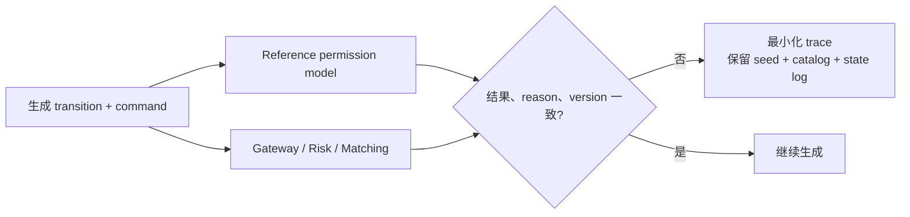

重点检查 cancel 与 halt 并发、切换 fence 前后、旧订单迁移、状态重复投递和迟到旧 epoch 事件。

#### Crash/recovery 与切换测试

分别在 snapshot 下载一半、全量完成但未 publish、RuleChange prepare 一半、activation 已落日志但部分服务未 ack、catalog 已切换但 checkpoint 未写、tombstone 已处理但 alias index 未切换时注入崩溃。重启必须得到同一个 catalog hash 与 active fence，不能在“数据库最新行”和权威日志冲突时随便选一个。

### 监控：不要只报“配置同步成功”

完整性指标至少包括 `catalog_active_version{service,shard}`、payload hash mismatch、source cursor lag、definition/state Gap、unresolved reference、unknown state code、calendar exception age 和 activation ack lag。

交易影响指标至少包括按 `ruleVersion + rejectReason` 聚合的拒单、invalid tick/lot/outside band、close-only 下风险增加请求、halt 后 match、切换导致的撤单/迁移，以及行情 definition version 与撮合 active version 的差异。

最新状态消息刚到不代表之前没有丢包；序列连续也不代表 reference 已新鲜。仪表盘必须把 continuity、completeness、freshness、activation 和 cross-service payload hash 分开显示。

### Runbook：变更与故障都要能安全收束

#### Tick/Lot 计划变更

1. 核对 notice、machine-readable update、受影响 listing、source hash 与 effectiveAt；
2. 生成 next definition，扫描 resting orders，并在 shadow 环境重放；
3. 明确 grandfather/cancel/reprice 策略，让所有关键服务 prepare 同一 payload；
4. 写入 activation fence，观察 version、拒单、BBO 与撤单；
5. 回滚使用 correction version，并保存公告、审批、hash、fence 与报告。

#### 市场状态 Gap 或未知状态码

1. 立即停止受影响 scope 的 risk-increasing command；
2. 保留 raw messages、connection epoch 和 source cursor；
3. 检查冗余 feed 或官方 recovery，不跨不相干序列拼接；
4. 获取 fresh baseline，验证 sequence、trade date、session 与 identity；
5. 以新 state epoch 原子发布 discontinuity，检查 resting order 与账户 restriction 后恢复。

#### 日历错误或 DST 错位

1. 冻结自动 session transition；
2. 对照 notice、calendar/tzdb version、计划 UTC interval 与实际 status；
3. 以 venue 权威状态为先，必要时 halt 本地接单；
4. 用 correction version 修正未来 interval，回查错位窗口内的订单；
5. 验证 trade date、结算批次和报表没有串日。

#### 错误版本已经部分激活

1. 不要直接把数据库行改回去；
2. 确定 activation fence 与已处理命令范围并停止扩大影响；
3. 发布 correction version 和新 fence，按旧、新版本分别重放；
4. 识别需要撤单、冲正、通知或人工审查的事件；
5. 证明所有服务收敛到同一 payload hash 后再恢复。

## 结论：主数据是可重放的交易事实

交易品种主数据并不是“给前端展示名称”的字典。它决定订单价格是否落在合法网格、数量代表多少经济敞口、哪一天属于哪个 trade date、当前能否撤改单、价格保护使用什么参考，以及成交和账本该按哪一版规则解释。

成熟实现最终会形成三条可审计链：

```text
外部定义/公告 → versioned definition → prepared catalog
  → activation fence → order/trade/ledger version
外部状态/session event → ordered state log
  → effective permissions → command decision + reason
snapshot/checkpoint + incremental log
  → deterministic recovery → identical catalog hash
```

只要这三条链存在，系统才能回答“为什么这张订单在那个时刻被接受或拒绝”，并在重启、升级和规则修正后给出同一个结果。

下一篇先进入 [现货、期货与永续合约：基差、收敛与对冲](/signal-grid-blog/posts/derivatives-contracts-and-basis/)，理解不同产品定义如何改变现金流与风险；再由 [期权合约生命周期](/signal-grid-blog/posts/options-contract-lifecycle-exercise-assignment-expiration-settlement/) 补齐权利义务、行权与到期终局，最后阅读 [交易订单语义：Market、Limit、TIF、Post-Only 与条件单](/signal-grid-blog/posts/order-types-and-execution-strategies/)，把 instrument capabilities、market state 和 rule version 接到真实订单契约上。

## 官方参考

- [FIX Trading Community：Orchestra Online](https://www.fixtrading.org/standards/fix-orchestra-online/)——机器可读 rules of engagement、字段场景、presence、workflow、ID 与字段演进原则。
- [FIX Trading Community：SecurityDefinitionUpdateReport](https://fiximate.fixtrading.org/legacy/en/FIX.5.0/body_57536680.html)——产品主数据 add、modify、delete 更新消息的标准语义。
- [CME MDP 3.0：Security Definition](https://cmegroupclientsite.atlassian.net/wiki/spaces/EPICSANDBOX/pages/457672532/MDP+3.0+-+Security+Definition)——instrument identity、到期、执行价等定义入口。
- [CME MDP 3.0：Security Definition Tag Usage](https://cmegroupclientsite.atlassian.net/wiki/spaces/EPICSANDBOX/pages/457575256/MDP+3.0+-+Security+Definition+Tag+Usage)——futures、options、spreads 的字段差异。
- [CME MDP 3.0：Instrument Recovery](https://cmegroupclientsite.atlassian.net/wiki/spaces/EPICSANDBOX/pages/457704421/MDP+3.0+-+Instrument+Recovery)——Instrument Replay、`TotNumReports` 与周中 add/modify/delete 恢复流程。
- [CME MDP 3.0：Security Status](https://cmegroupclientsite.atlassian.net/wiki/spaces/EPICSANDBOX/pages/457223126/MDP+3.0+-+Security+Status)——Pre-Open、No Cancel、Opening、Open、Pause、Close 与状态原因。
- [CME MDP 3.0：CME Globex Pricing](https://cmegroupclientsite.atlassian.net/wiki/spaces/EPICSANDBOX/pages/457225869/MDP+3.0+-+CME+Globex+Pricing)——标准 tick、Variable Tick Table 与 Security Definition 的关系。
- [CME Globex Reference Guide](https://www.cmegroup.com/content/dam/cmegroup/globex/files/GlobexRefGd.pdf)——session state、订单动作、price banding、price limits、Velocity Logic 与市场运维。
- [CME Group：2026 Holiday and Trading Hours](https://www.cmegroup.com/trading-hours.html)——年度 holiday hours、提前关闭与日历可能调整的官方入口。
- [Nasdaq TotalView-ITCH 5.0 Specification](https://www.nasdaqtrader.com/content/technicalsupport/specifications/dataproducts/NQTVITCHSpecification.pdf)——Stock Directory、Trading Action、quotation-only 与 Operational Halt 消息。
- [Nasdaq Trader：2026 Trading Calendar](https://www.nasdaqtrader.com/trader.aspx?id=calendar)——全天休市与提前收盘日历。
- [Limit Up-Limit Down Plan](https://www.luldplan.com/)——参考价格、Price Bands、Limit State 与交易暂停的当前官方说明。
- [SEC：Rule 605 FAQs，LULD 部分](https://www.sec.gov/rules-regulations/staff-guidance/trading-markets-frequently-asked-questions/frequently-asked-questions-rule-605-regulation-nms)——band 外报价的可执行性与 Straddle State 处理说明。
- [OKX API v5：Get instruments / Instruments channel](https://www.okx.com/docs-v5/en/)——现货、永续、期货、期权字段、状态、tick/lot 与 upcoming changes 的 venue 实例。
