交易系统最危险的一张表，往往叫 `balance`。

它看起来很简单：充值就加，提现就减，买入再减一次钱、加一次币。直到系统遇到部分成交、手续费返佣、消息重放、数据库超时、链上重组和人工调账，团队才发现这张表只能告诉你“现在是多少”，却回答不了：**为什么是这个数、哪一次变化已经生效、失败后能否安全重试、平台实际控制的资产是否足够覆盖用户权益。**

账本就是为这些问题存在的。它不是订单表的附属字段，也不是给财务月底导出 CSV 的日志；它是把成交、充值、提现、资金费用和清算结果转换为**不可变经济事实**的核心状态机。

本文是“交易系统”学习路径的 Chapter 09。前面的 [Chapter 05：撮合机制](/signal-grid-blog/posts/matching-engine-and-auctions/) 解释订单怎样产生 fill，[Chapter 06：行情数据管线](/signal-grid-blog/posts/market-data-pipeline-and-order-book-reconstruction/) 划清公开行情投影与资金事实的边界，[Chapter 07：合约仓位生命周期](/signal-grid-blog/posts/position-lifecycle-and-pnl/) 与 [Chapter 08：永续资金费率](/signal-grid-blog/posts/perpetual-funding-rate/) 则给出仓位、盈亏和资金费用这些具体现金流；本文把它们统一成可验证的账本模型。下一章 [保证金风险引擎](/signal-grid-blog/posts/margin-metrics-and-mark-price/) 再说明余额与仓位估值怎样进入风险计算。

> 本文讨论产品账本与交易系统工程，不构成会计、审计、法律、税务或监管意见。真实交易所还必须按法律实体、客户资产隔离、适用会计准则和当地监管要求设计总账及报表；本文的账户分类是可验证的工程模型，不替代持牌会计师和审计师的判断。

## 1. 先分清四层事实

订单、成交、账本和余额经常被塞进同一张“账户表”，但它们回答的问题完全不同：

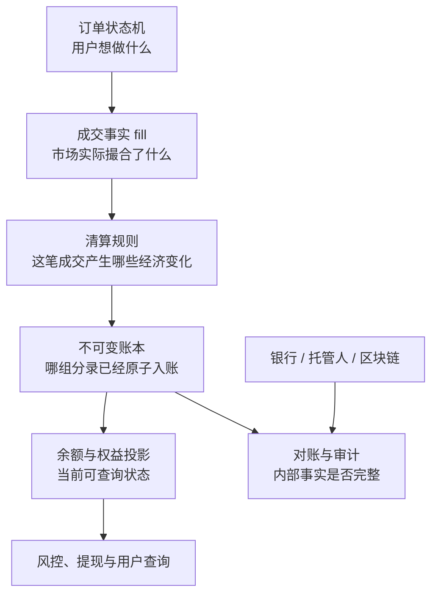

### 1.1 订单不是资产变化

一张订单可以被拒绝、挂单、部分成交、完全成交或撤销。`accepted` 只说明系统接受了一个交易意图；若订单尚未成交，买卖双方并未发生最终资产交换。

不过，订单通常会占用可用资金。这个“占用”可以建模为账本里的待定分录，也可以是与订单权威状态原子更新的 reservation。它改变的是**可支配性**，不一定改变总权益。

### 1.2 Fill 是市场事实，不是余额更新语句

撮合引擎产生的 fill 应至少带有：

```text
Fill {
  tradeId, productId, productVersion,
  makerOrderId, takerOrderId,
  makerAccountId, takerAccountId,
  priceAtoms, quantityAtoms, makerSide,
  matchSequence
}
```

它说明“谁与谁，以什么价格成交了多少”，却还没有定义手续费币种、返佣、现货资产转移、合约盈亏、税费或清算账户。那些属于版本化清算规则。

### 1.3 账本记录原因，余额只是结果

账本保存每次经济变化的分录及来源。余额是分录的聚合结果：

```text
balance(account, position) = fold(postings up to position)
```

可以为查询性能维护余额快照或物化投影，但投影丢失时必须能从账本恢复。若一张 `balance` 表无法追溯到分录，它就不是权威账本，只是一个无法解释的缓存。

### 1.4 外部资产是另一套事实

用户在平台看到 `1 BTC`，通常表示平台对用户负有 `1 BTC` 的内部义务；它不等于某一个链上地址恰好单独存着这枚币。平台控制的链上地址、托管账户或银行账户属于外部资产域，必须通过对账与内部负债连接。

因此，即使内部账本永远平衡，也仍可能发生：

- 托管私钥丢失；
- 银行付款失败；
- 链上交易被重组；
- 漏记一笔外部手续费；
- 把本不属于平台的资产记进来。

**双重记账能证明内部表达自洽，不能凭空证明外部资产存在。**

## 2. 双重记账不是“加一行、减一行”

双重记账，也就是复式记账法的工程表达，核心是：每个会计事件由同一原子事务中的两条或更多 posting 表达，借方总额与贷方总额相等。这里的“借”“贷”不是正负号的好坏，也不是“收钱”和“付钱”的同义词。

### 2.1 先固定观察视角

本文统一从**交易所运营主体**的视角记账：

| 账户类型 | 增加时 | 减少时 | 交易所中的例子 |
| --- | --- | --- | --- |
| 资产 Asset | 借记 Debit | 贷记 Credit | 银行存款、托管 BTC、应收款 |
| 负债 Liability | 贷记 Credit | 借记 Debit | 应付用户的 USDT/BTC 余额 |
| 权益 Equity | 贷记 Credit | 借记 Debit | 实收资本、留存收益 |
| 收入 Income | 贷记 Credit | 借记 Debit | 交易手续费收入 |
| 费用 Expense | 借记 Debit | 贷记 Credit | 返佣费用、网络费用、运营费用 |

用户存入 `1 BTC` 后，用户界面显示余额增加；从平台视角看，发生的是：

| 资产 | 借方 | 贷方 |
| --- | ---: | ---: |
| 托管 BTC 资产 | 1 BTC |  |
| 用户 BTC 负债 |  | 1 BTC |

平台控制的 BTC 资产增加，同时平台对用户的 BTC 义务增加。两边相等。

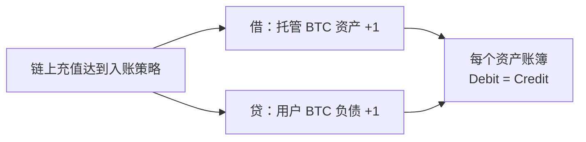

如果从用户个人视角做会计，账户类型和借贷方向会不同。混用观察视角，是“用户余额为什么算平台负债”这类争论的根源。

### 2.2 会计等式是一种类型系统

扩展会计等式可以写成：

```text
Assets - Liabilities = Equity + Income - Expenses
```

它的工程价值不只是月底报表，而是给账户赋予了类型。系统不再接受一条含义模糊的 `amount = -100`，而是要求回答：

1. 哪个法律实体、哪本 book？
2. 哪个资产或币种？
3. 哪个账户类型？
4. 借方还是贷方？
5. 为什么变化，来源业务对象是什么？

当清算规则把一笔 fill 编译成 postings 时，类型错误会比“余额对不上”更早暴露。

### 2.3 平衡必须在正确维度内成立

下面这句没有意义：

```text
0.1 BTC + 5,000 USDT = 0
```

不同资产不能直接相加。现货交易是一组**跨资产但各自平衡**的变化：BTC 账簿借贷相等，USDT 账簿也借贷相等；两个资产腿还必须属于同一个原子业务组。

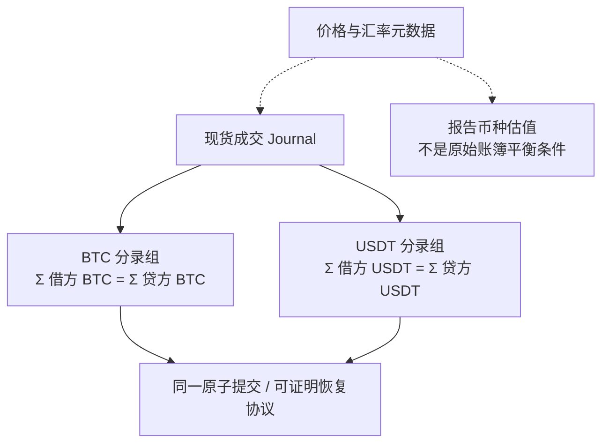

若数据库只保证单币种 journal 原子，而不能保证两个资产腿共同成功，就可能留下“扣了 USDT、没有加 BTC”的半笔交易。双重记账不能替代跨资产原子性。

## 3. 账户表不是用户表：先设计 Chart of Accounts

账户（ledger account）代表一个有明确经济含义的余额桶，不应等同于登录用户。一个用户通常会映射到多个账户。

### 3.1 账户身份至少包含哪些维度

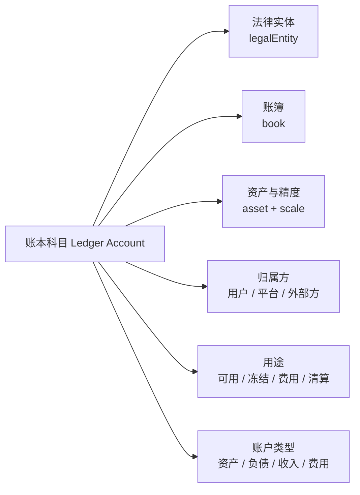

常见账户族包括：

- `custody_asset:{venue}:{asset}`：平台在托管人或链上的资产；
- `user_available:{user}:{asset}`：对用户可用余额的负债；
- `user_held:{user}:{asset}`：因订单、提现或风控而占用的负债；
- `fee_income:{entity}:{asset}`：按资产计量的手续费收入；
- `rebate_expense:{entity}:{asset}`：返佣费用或经会计政策确认的抵减收入；
- `deposit_clearing:{asset}`、`withdrawal_clearing:{asset}`：外部资金在途；
- `suspense:{asset}`：尚未归因的差异，必须有处置责任与期限。

账户 ID 应稳定且不可被重新赋予另一种含义。账户关闭后也不应把 ID 复用给新用户；否则历史分录的解释会随时间改变。

### 3.2 可用与冻结是同一负债的不同状态

假设用户有 `10,000 USDT` 可用余额，下一个买单需要占用 `5,010 USDT`。一种显式建模方式是把用户负债在两个子账户之间重分类：

| 账户 | 借方 | 贷方 |
| --- | ---: | ---: |
| 用户可用 USDT 负债 | 5,010 |  |
| 用户冻结 USDT 负债 |  | 5,010 |

负债总额没有改变，但可用部分减少、冻结部分增加。撤单时做反方向分录。

另一种实现是让 reservation 保持 pending，只影响 `availableBalance` 而不进入 posted ledger。两种模型都可以，前提是：

- 预占与订单受理属于同一个可证明的原子边界；
- 每个 hold 有稳定 ID、数量上限、释放原因和终态；
- fill 只能消耗自己的 hold，不能重复消耗；
- 撤单只释放未成交余量；
- 系统可从订单与账本重建 hold，不靠人工改余额。

### 3.3 金额必须是精确整数域

不要用 `double` 保存金额、数量或手续费。应把资产精度版本化，并转换为最小计量单位：

```text
amountAtoms = decimalAmount × 10^assetScale
```

例如 BTC scale 为 8 时，`0.1 BTC = 10,000,000 atoms`。实现可使用经过边界验证的 64/128 位整数，或数据库的精确 `NUMERIC`；每次乘法、除法和舍入都要绑定产品规则、方向和剩余尾差账户。

同一资产的 scale 不能在历史中静默改变。若代币精度、合约面值或结算规格升级，应创建新版本并定义迁移/换算事件。

## 4. 一个 Journal 到底要保存什么

一笔经济事件不应只写两行 `account_id + delta`。可恢复、可审计的最小模型通常有三层：

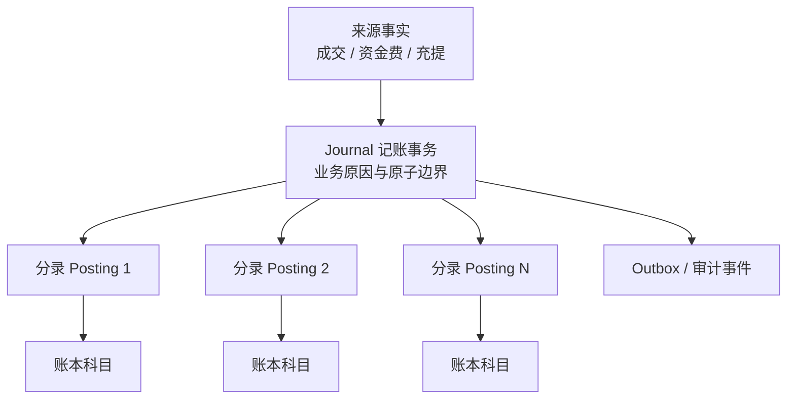

### 4.1 Journal 头

建议保存：

- `journalId`：账本内部唯一 ID；
- `bookId` 与 `legalEntityId`：平衡和报表边界；
- `sourceType + sourceId`：如 `FILL + tradeId`，作为业务幂等键；
- `reasonCode`：成交、手续费、返佣、资金费、充值、提现、冲正等；
- `ruleVersion` 与 `productVersion`：解释计算逻辑；
- `recordedAt`：账本实际接收并排序的时间；
- `effectiveAt`：业务生效时间，不替代记录顺序；
- `ledgerSequence`：该 book 内可比较的权威位置；
- `payloadHash`：同一幂等键重试时检测参数漂移；
- `reversalOf` 或 `correctionGroupId`：冲正关系；
- 发起者、审批者、服务身份与追踪 ID。

`ledgerSequence` 必须由真正的账本串行化域分配。数据库 sequence 可以有洞，回滚也不会收回号码，而且号码先取得不代表事务先提交；不能仅凭自增 ID 推导可见性或 durable commit 顺序。

### 4.2 Posting 行

每条 posting 至少需要：

```text
Posting {
  entryId, journalId, accountId,
  asset, scale, side, amountAtoms,
  entrySequence
}
```

`amountAtoms` 严格为正；零值不创建 posting，方向由 `DEBIT/CREDIT` 表达。这样不会同时存在“负数借方”“负数贷方”“signed delta”三套互相冲突的符号规则。

### 4.3 一个关系数据库骨架

下面只是表达不变量的骨架，不是可直接复制上线的完整 schema：

```sql
CREATE TABLE ledger_account (
  account_id       uuid PRIMARY KEY,
  book_id          uuid NOT NULL,
  legal_entity_id  uuid NOT NULL,
  asset_code       text NOT NULL,
  asset_scale      smallint NOT NULL,
  account_type     text NOT NULL,
  normal_side      char(1) NOT NULL CHECK (normal_side IN ('D', 'C')),
  purpose          text NOT NULL,
  owner_id         uuid,
  closed_at        timestamptz,
  UNIQUE (book_id, account_id)
);

CREATE TABLE journal (
  journal_id       uuid PRIMARY KEY,
  book_id          uuid NOT NULL,
  legal_entity_id  uuid NOT NULL,
  ledger_sequence  bigint NOT NULL,
  source_type      text NOT NULL,
  source_id        text NOT NULL,
  reason_code      text NOT NULL,
  payload_hash     bytea NOT NULL,
  effective_at     timestamptz NOT NULL,
  recorded_at      timestamptz NOT NULL DEFAULT clock_timestamp(),
  reversal_of      uuid REFERENCES journal(journal_id),
  CHECK (reversal_of IS NULL OR reversal_of <> journal_id),
  UNIQUE (book_id, ledger_sequence),
  UNIQUE (book_id, source_type, source_id),
  UNIQUE (book_id, legal_entity_id, journal_id),
  FOREIGN KEY (book_id, legal_entity_id, reversal_of)
    REFERENCES journal(book_id, legal_entity_id, journal_id)
);

CREATE UNIQUE INDEX journal_one_full_reversal
  ON journal (book_id, legal_entity_id, reversal_of)
  WHERE reversal_of IS NOT NULL;

CREATE TABLE posting (
  entry_id         uuid PRIMARY KEY,
  journal_id       uuid NOT NULL REFERENCES journal(journal_id),
  entry_sequence   smallint NOT NULL,
  account_id       uuid NOT NULL REFERENCES ledger_account(account_id),
  asset_code       text NOT NULL,
  component_code   text NOT NULL,
  side             char(1) NOT NULL CHECK (side IN ('D', 'C')),
  amount_atoms     numeric NOT NULL CHECK (
    amount_atoms > 0
    AND amount_atoms < power(10::numeric, 38)
    AND amount_atoms = trunc(amount_atoms)
  ),
  UNIQUE (journal_id, entry_sequence)
);
```

`CHECK` 只能验证单行字段，不能安全地证明同一 journal 的多行借贷合计相等。写入入口必须在同一个数据库事务或专用账本状态机中：先按 `(book, legalEntity, asset)` 对全部 postings 分组，验证每组借贷相等，再原子插入 journal、postings、余额投影和 outbox；任何一步失败就全部失败。一个成交事实可以生成同一 journal 下的 BTC、USDT 等多个资产分录组，但每组必须独立平衡；`componentCode` 用来区分本金、手续费、返佣等经济原因。

这里故意没有使用 `numeric(38, 0)`：PostgreSQL 会先把超出声明 scale 的输入舍入，再执行约束，调用方可能在不知情时把小数 atoms 写成整数。示例让原值进入无 typmod 的 `numeric`，再明确检查正数、整数和 38 位上界；`NaN` 与无穷值也无法同时通过这些比较。生产 schema 还应使用复合外键或等价机制，强制 posting 的 book、法律实体和资产与目标账户一致；这个教学骨架没有展开所有索引和权限策略。

posted journal 和 posting 应禁止业务用户执行 `UPDATE/DELETE`。需要更正时追加新 journal，而不是改历史。

## 5. 完整现货案例：预占、成交、手续费与返佣

现在把抽象模型接到一笔 `BTC-USDT` 成交。

### 5.1 场景与规则

- 买方 B 下单买入 `0.1 BTC`，预占 `5,010 USDT`；
- 卖方 S 预占 `0.1 BTC`；
- 最终以 `50,000 USDT/BTC` 成交，名义金额 `5,000 USDT`；
- 买方支付 `5 USDT` taker fee；
- 卖方获得 `1 USDT` maker rebate；
- 示例假设基础资产 BTC 不收手续费。

每个数都只是教学输入，真实费率、币种、精度和返佣政策必须从生效规则版本读取。

### 5.2 从订单到最终余额

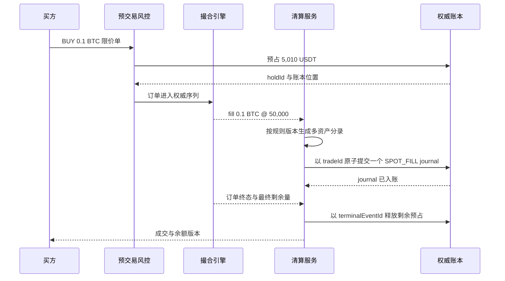

“先预占后送撮合”避免同一资金被多张订单重复使用。若预占成功但订单未能进入撮合，恢复协议必须根据稳定的 `orderId/holdId` 撤销或继续投递，不能让冻结资金永久悬挂。

### 5.3 下单预占

买方 USDT：

| Journal `ORDER_HOLD_BUY` | 借方 | 贷方 |
| --- | ---: | ---: |
| B 可用 USDT 负债 | 5,010 |  |
| B 冻结 USDT 负债 |  | 5,010 |

卖方 BTC：

| Journal `ORDER_HOLD_SELL` | 借方 | 贷方 |
| --- | ---: | ---: |
| S 可用 BTC 负债 | 0.1 |  |
| S 冻结 BTC 负债 |  | 0.1 |

这两笔 journal 分别平衡，只改变资金状态，不改变平台对所有用户的总负债。

### 5.4 同一成交 journal 的 BTC 资产分录组

| `SPOT_FILL` · BTC 分录组 | 借方 | 贷方 |
| --- | ---: | ---: |
| S 冻结 BTC 负债 | 0.1 |  |
| B 可用 BTC 负债 |  | 0.1 |

卖方的 BTC 债权减少，买方的 BTC 债权增加；平台托管 BTC 总资产不因内部成交变化。

### 5.5 同一成交 journal 的 USDT 资产分录组

| `SPOT_FILL` · USDT 分录组 | Component | 借方 | 贷方 |
| --- | --- | ---: | ---: |
| B 冻结 USDT 负债 | `PRINCIPAL` | 5,000 |  |
| S 可用 USDT 负债 | `PRINCIPAL` |  | 5,000 |
| B 冻结 USDT 负债 | `TAKER_FEE` | 5 |  |
| 交易手续费收入 USDT | `TAKER_FEE` |  | 5 |
| Maker 返佣费用 USDT | `MAKER_REBATE` | 1 |  |
| S 可用 USDT 负债 | `MAKER_REBATE` |  | 1 |

买方共消耗 `5,005 USDT`：`5,000` 是成交本金，`5` 是 taker fee；卖方收到 `5,001 USDT`，其中 `1` 是 maker rebate。六条 posting 同属这一个 fill journal，每条金额只对应一个 `componentCode`，因此既能逐组件复核流向，也能回答“毛手续费是多少、返了多少、净收入是多少”。直接只记净额 `4 USDT` 会丢失重要审计信息。

### 5.6 释放未使用的预占

买方预占 `5,010`，实际只用了 `5,005`，剩余 `5 USDT`：

| Journal `ORDER_HOLD_RELEASE` | 借方 | 贷方 |
| --- | ---: | ---: |
| B 冻结 USDT 负债 | 5 |  |
| B 可用 USDT 负债 |  | 5 |

这笔释放不是 `tradeId` 对应成交 journal 的一部分，而是由撮合引擎给出的订单终态或 reservation revision 驱动，使用独立且稳定的 `terminalEventId/revision` 作为来源事实。若订单只部分成交，不能一次释放全部余量。系统要重新计算未成交数量、最坏成交价格和剩余手续费预算，再调整 hold。取消请求还会与 fill 竞争：只能根据撮合引擎最终排序后的成交与 terminal order event 释放剩余 hold，不能在网关“收到 cancel”时立即把全部资金退回可用。

同一张订单的不同 fill 还可能分别成为 maker 或 taker。清算必须使用每个 fill 固化的 liquidity role、实际 fee asset、fee amount 与费率规则版本，不能在订单结束后用当前费率重算整张订单。

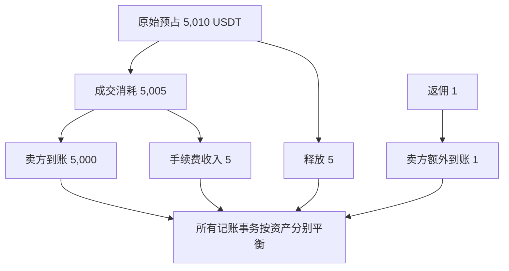

### 5.7 这组分录能证明什么

它能证明：

- 同一 fill 的 BTC 与 USDT 变化完整；
- 手续费、返佣和余量释放各有来源；
- 每个资产的借贷分别相等；
- 任一余额可以重放得出；
- 重复消费同一 `tradeId` 时可返回原结果，而不是再记一遍。

它不能单独证明：

- 平台真的控制足够的 BTC 与 USDT；
- 撮合价格符合全部市场规则；
- 返佣政策符合会计和监管要求；
- 下游缓存已经刷新；
- 用户不会因其他并发订单而透支。

这些要由对账、撮合不变量、并发控制和业务约束共同保证。

## 6. 余额不是一个数字

用户界面的“余额”可能同时指：

| 名称 | 典型含义 | 是否纯账本恒等式 |
| --- | --- | --- |
| Posted balance | 已入账分录的净额 | 是 |
| Pending balance | 假设待定项最终完成后的余额 | 取决于 pending 规则 |
| Available balance | 现在允许新订单/提现使用的额度 | 否，是策略投影 |
| Held / Frozen | 被订单、提现或风控占用的额度 | 来自 reservation 或子账户 |
| Equity | 钱包余额加上规则认可的估值、PnL、抵押品折扣 | 否，是风险模型 |
| Withdrawable | 在合规、风险、借贷和结算限制后可转出的额度 | 否，是业务策略 |

### 6.1 Posted balance 的计算

借方正常账户：

```text
postedBalance = totalPostedDebits - totalPostedCredits
```

贷方正常账户：

```text
postedBalance = totalPostedCredits - totalPostedDebits
```

### 6.2 Available balance 是保守决策

若冻结资金使用独立 posted 子账户，`user_available` 账户的当前贷方正常余额本身就是可用余额，不应再减一次 hold。若设计采用“posted 总余额 + reservation sidecar”，一个简单模型才是：

```text
available = postedBalance - activeOutgoingHolds - otherRiskReservations
```

但不能把它当成所有产品的固定公式。是否计入待到账充值、未实现盈利、可借额度、抵押品折扣和预计手续费，必须由账户模式与规则版本决定。

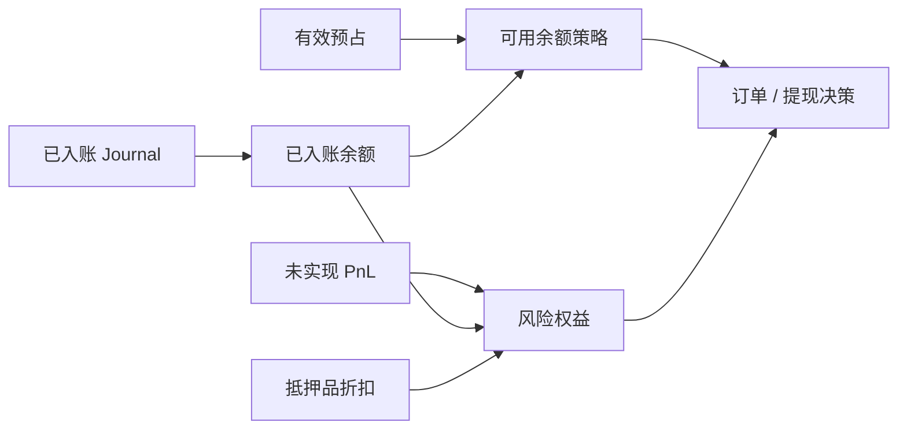

双重记账只保证 journal 平衡，并不自动阻止某个用户账户变成负数。一笔“把用户负债借记 1,000、平台收入贷记 1,000”的 journal 完全平衡，却可能让用户透支。账户下限、信用额度、预占和风险检查是额外不变量，必须与入账原子执行。

### 6.3 投影可以落后，但必须暴露位置

高吞吐系统常把 journal 写入与用户查询投影分开。此时 API 不应假装所有读取都瞬时最新，而应返回或内部跟踪：

- `ledgerSequence`；
- `projectionSequence`；
- `accountVersion`；
- `asOfRecordedAt`。

风控若依赖投影做资金检查，必须保证它不会读到比订单权威序列更旧的余额，或使用同一单写者状态机直接维护可用额度。仅靠“数据库最终会同步”无法防止超卖。

## 7. 合约、资金费与清算怎样入账

现货成交转移两种资产；衍生品 fill 首先改变仓位。两者不能使用同一个“买入就加币”的清算函数。

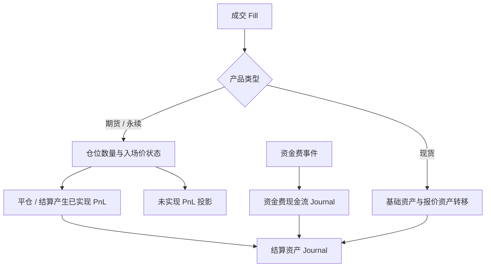

### 7.1 未实现 PnL 通常不是现金分录

未实现盈亏随标记价格变化，是风险引擎的估值投影。若每个价格 tick 都写正式现金 journal，账本会混入大量可逆估值，并把“市场价格变化”误写成“已经结算的资产转移”。

只有当产品规则执行逐日盯市、变动保证金结算或其他明确结算事件时，估值变化才转成实际账务现金流。不同交易场所可能不同，必须以产品契约为准。

### 7.2 已实现 PnL、资金费和手续费要分原因

即使它们都改变同一 USDT 余额，也应使用不同 `reasonCode`：

- `REALIZED_PNL`：减仓、平仓或交割确认；
- `FUNDING_PAYMENT`：持仓跨过资金费评估时点；
- `TRADING_FEE`：成交手续费；
- `LIQUIDATION_FEE`：清算规则产生的费用；
- `INSURANCE_FUND_TRANSFER`：保险基金相关转移；
- `ADL_SETTLEMENT`：平台规则下的自动减仓结算。

这样才能分别重算、解释和对账。把所有变化都标成 `BALANCE_ADJUSTMENT`，等于没有账本语义。

最简单的同结算资产已实现盈亏，本质上是用户负债之间的转移。例如账户 A 平仓亏损 `100 USDT`、账户 B 对应盈利 `100 USDT`：

| Journal `REALIZED_PNL` · USDT | 借方 | 贷方 |
| --- | ---: | ---: |
| A 可用 USDT 负债 | 100 |  |
| B 可用 USDT 负债 |  | 100 |

这张表只适用于无违约、无跨实体且结算规则允许直接净转移的教学场景。若亏损账户资金不足，不能把缺口偷偷记成负余额或从赢家金额中抹掉；清算、保险基金、追偿、socialized loss 或 ADL 必须按产品规则生成额外且可追溯的分录。

### 7.3 资金费理论零和，工程残差必须可解释

封闭合约市场中，同一产品的未平仓 long 与 short 数量相等；在相同资金费率、标记价格和名义价值公式下，理论资金流应由一侧支付给另一侧并净额为零。工程实现仍可能因逐账户舍入、不同结算币种或公式、扣款不足、账户隔离、规则上限与结算批次失败产生残差。账本需要显式的 clearing、rounding 或 shortfall account 记录这些差异，并把余额归因到明确规则；不能用“clearing”掩盖凭空造钱或丢钱。

无残差的最小资金费批次可以写成：

| Journal `FUNDING_PAYMENT` · USDT | 借方 | 贷方 |
| --- | ---: | ---: |
| Long 用户 USDT 负债 | 100 |  |
| Short 用户 USDT 负债 |  | 100 |

真实批次可能有成千上万条用户 posting，但仍应在同一产品、结算时点、资产与法律实体维度内证明总借方等于总贷方，并保存 rate、mark、position snapshot 与规则版本。

平台自有资金、保险基金和用户资金的账户类型还取决于法律结构。不要仅凭 UI 名称把“保险基金”硬编码为收入、负债或权益。

## 8. 幂等：同一事实只能入账一次

消息系统通常提供至少一次投递。数据库提交成功但响应丢失、消费者崩溃后重放、网络超时后客户端重试，都会让同一 fill 再次到达清算服务。

### 8.1 业务幂等键要来自源事实

对成交入账，推荐唯一约束类似：

```text
UNIQUE(bookId, sourceType = "FILL", sourceId = tradeId)
```

这里的唯一事实对应**一个包含所有资产分录组的 journal**：本金、fee 与 rebate 必须在同一数据库事务中一起成功或一起失败。不要为了绕过唯一约束把 BTC 腿、USDT 腿和 fee 腿伪装成不同 `sourceType`；那会重新引入“只入了一半”的状态。订单预占、预占调整和终态释放本来就是不同的源事实，应分别使用稳定的 `holdId`、reservation revision 或 `terminalEventId`。

不能每次重试都随机生成新 `journalId`，否则数据库无法识别重复。也不要只按 `(accountId, amount, timestamp)` 去重；两笔合法成交可能金额相同、时间接近。

### 8.2 同一 ID、不同内容必须报错

若重试携带相同 `tradeId`，但价格、数量、账户或规则版本不同，系统不应返回“已经成功”。应比较规范化 payload 的 hash，并进入数据完整性告警。这通常意味着上游身份复用或历史事实被篡改。

### 8.3 提交成功、响应丢失仍然是结果未知

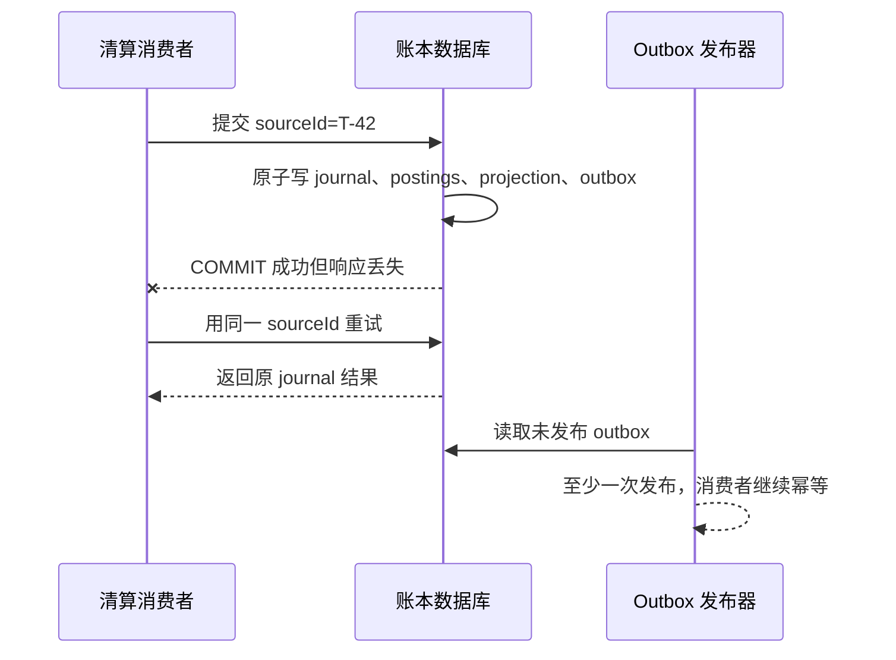

账本事务应该原子写入：

1. journal 头；
2. 全部 postings；
3. 必要的余额/版本投影；
4. outbox 事件。

事务提交后才确认入账。outbox 可重复发布，但下游用 `journalId/ledgerSequence` 幂等消费。仅仅“先写数据库，再发 Kafka”会在两步之间产生永久缺口；仅仅“先发 Kafka，再写数据库”会让下游看见尚未入账的事实。

这里的保证仍不是整个世界的 exactly-once：邮件、银行、区块链和第三方托管不参与本地事务。相关边界可结合 [Kafka 事务](/signal-grid-blog/posts/kafka-distributed-log-kraft-consumers-and-transactions/)、[WAL 的 ACK 语义](/signal-grid-blog/posts/write-ahead-log-durability-and-crash-recovery/) 与 [超时后的结果未知](/signal-grid-blog/posts/distributed-systems-time-clocks-ordering-and-leases/) 一起理解。

## 9. 并发：平衡不等于不会超卖

考虑账户有 `100 USDT`，两个请求同时各花 `80 USDT`：

```text
T1 read available = 100
T2 read available = 100
T1 post debit 80
T2 post debit 80
```

每笔 journal 都可以各自借贷平衡，但最终用户透支 `60 USDT`。因此账本写入还需要**账户约束的串行化点**。

### 9.1 常见实现策略

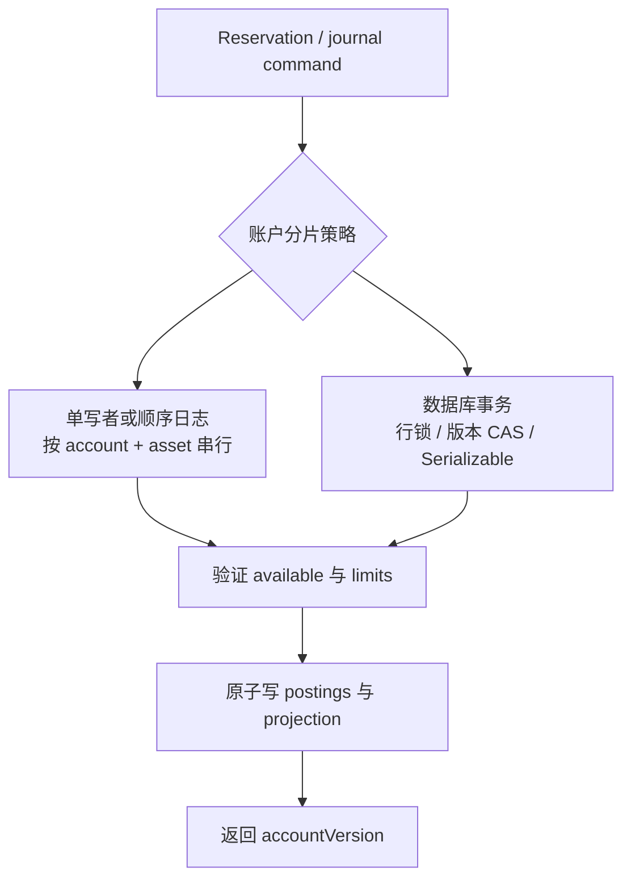

关系数据库中可选择：

- 按稳定顺序锁定所有受影响账户，减少死锁；
- 使用 `SELECT ... FOR UPDATE` 后验证并更新累计借贷；
- 使用版本号做条件更新，失败后从头重算；
- 使用 `SERIALIZABLE`，捕获序列化失败并以同一业务幂等键重试整个事务；
- 把账户命令路由给单写者分片，在可恢复日志上排序。

选择哪一种取决于吞吐、热点账户、跨分片原子性和恢复模型。无论哪种，都不能先在缓存里判断余额足够，再异步希望账本最终跟上。

### 9.2 热点系统账户

手续费收入、清算 clearing 和平台总账户可能成为所有交易共享的热点。解决方向包括：

- 按资产、产品或时间窗口分片系统账户；
- 把 journal 原子性与余额聚合解耦，postings 追加后异步汇总；
- 使用能原子更新累计 debit/credit 的专用账本引擎；
- 设计分层账户，避免所有用户都争用一个物理行。

分片后仍要能够汇总并证明整体平衡。为了性能把一个收入账户拆成 256 个 shard 没问题，但不能丢失它们属于同一会计类别的元数据。

### 9.3 PostgreSQL 中的一条重要边界

PostgreSQL 的 `CHECK` 约束只可靠检查当前行，不能引用其他 posting 行来证明整组 journal 平衡。可使用唯一约束确保业务幂等，用事务隔离/显式锁保证并发安全，并由受控写入函数或服务在提交前验证整组分录。

即使使用 `SERIALIZABLE`，应用也必须处理 `40001` 并重试整个事务；不能只重试最后一条 `INSERT`，否则先前读到的余额和规则快照已经失效。

## 10. 冲正：错误不能靠改历史修复

posted 分录一旦成为权威事实，就不应被原地修改或删除。正确流程是：

1. 保留原 journal；
2. 追加引用原 journal 的 reversal；
3. 若业务仍需发生，再追加 correction；
4. 把发现者、原因、审批、规则版本和工单关联起来。

“追加 reversal”本身也必须是同步受控操作，而不是随便填一个 `reversalOf`。写入事务要锁定原 journal，确认它已经 posted、不是当前 journal 自身，并属于相同 book 与法律实体。完整冲正的 posting 多重集合必须保留原来的 `(account, asset, amountAtoms, componentCode)`，只把每条 `DEBIT/CREDIT` 精确对调；同一原 journal 最多允许一个完整 reversal。上面骨架中的复合外键、自引用检查与部分唯一索引只是数据库护栏，受控写入入口仍要完成精确分录校验。若业务只需调整部分金额，应建立独立 correction 模型和明确原因，不能冒充完整冲正；reversal 自己也必须有稳定的业务幂等键。

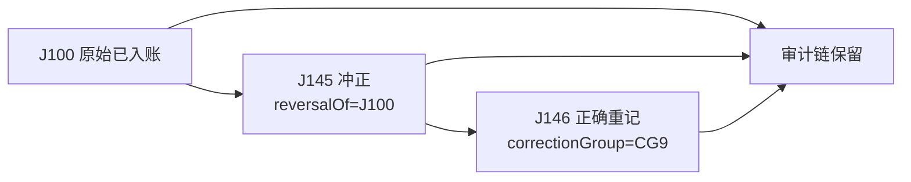

### 10.1 Pending 的取消与 Posted 的冲正不同

尚未 posted 的 pending transfer 可以 `VOID`，表示预期经济事件没有完成；已经 posted 的事件只能用反向分录抵消。把二者都叫“删除交易”，会让恢复和审计无法区分。

### 10.2 冲正不等于篡改业务时间

`effectiveAt` 可以表示“这笔调整属于昨天的业务日期”，但 `recordedAt` 和 `ledgerSequence` 必须显示它今天才被记录。回填历史不应插进旧序列、改变已经发布的余额版本。

需要“截至昨日”的报告时，可以按 effective time 重算报表；需要恢复和因果追踪时，必须按 recorded sequence 读取。两种时间语义不能共用一个字段。

### 10.3 人工调账也必须双重记账

禁止提供 `UPDATE balance SET amount = ...` 的后台按钮。人工修复应创建有权限、限额和双人复核的 adjustment journal，并指定对手账户。找不到归因时可暂入 suspense，但 suspense 不是“让借贷相等的垃圾桶”：

- 每笔差异有 owner；
- 有来源材料和推测原因；
- 有金额、资产和账龄；
- 有解决 SLA；
- 结案时通过新 journal 迁出，而不是删除。

## 11. 充值、提现与链上重组

内部成交只改变用户之间的权益；充值和提现跨越了平台账本与外部世界，状态更复杂。

### 11.1 充值状态机

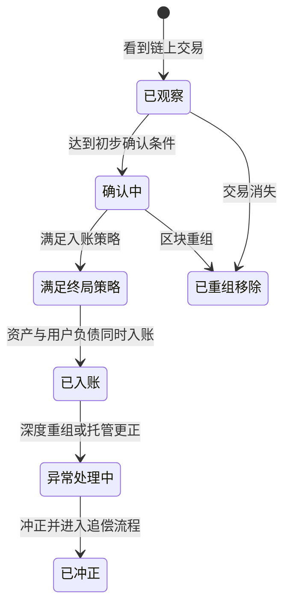

`Observed` 不等于可用余额。平台应按链、资产、金额和风险规则决定何时 `Credited`，并把 `(chainId, txHash, outputIndex 或 event/log index, asset)` 与观察到的 `blockHash/canonical` 状态作为来源证据；只用 `txHash` 可能无法区分同一交易中的多个转账事件。“等待 N 个确认”也是网络与风险政策，不是所有 PoW、PoS、L2 都共享的绝对终局保证。

若已入账后发生深度重组，不能删除原充值。需要追加冲正；若用户已经把资金交易或提出，系统可能产生负余额、应收款或损失，这些都要显式进入新的账户，而不是假装原事件没发生。

### 11.2 提现是一个结果未知协议

提现常经历：预占、合规审批、签名、广播、链上确认和最终完成。广播超时不能直接重发一笔新经济付款；旧交易可能已经进入网络。同一个 withdrawal intent 也可能因为 RBF、加速或重签名对应多个链上 attempt/tx hash。系统应使用稳定 withdrawal ID、链上 nonce/UTXO 计划和状态查询解决歧义，并确保最终只结算一次客户扣款。

账务上可先把用户可用负债迁到 `withdrawal_pending`，外部转账达到定义的确认点后，再减少 pending liability 与 custody asset。网络费由谁承担、何时确认收入或费用，必须作为独立规则和分录。

## 12. 三层对账：账本平衡只是第一层

一个生产交易所至少要做三类对账。

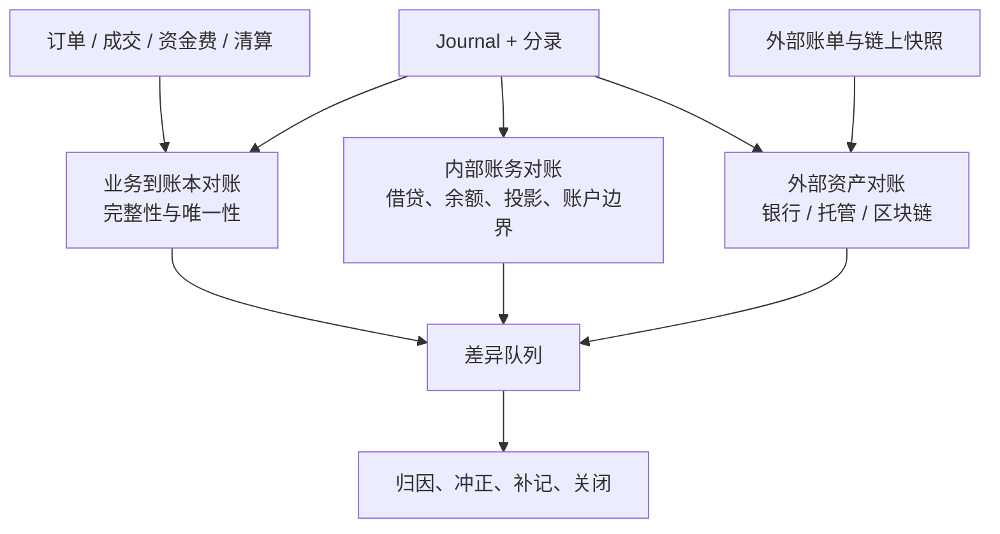

### 12.1 业务事实 ↔ 账本

要验证：

- 每个应清算 fill 恰好对应一个包含全部资产腿的 journal；
- 每个 journal 的 `sourceId` 都能找到权威来源；
- maker/taker 数量、价格、产品版本一致；
- fee、rebate、funding、settlement 没有漏项或重复；
- 清算消费位置形成连续前缀，没有越过 Gap；
- 取消或 STP 阻止的数量没有错误入账。

### 12.2 Journal ↔ 余额投影

要验证：

- 每个 journal 在 `book + asset` 范围内借贷相等；
- 累计 debit/credit 与账户投影一致；
- `projectionSequence` 不超前于 journal durable sequence；
- 账户正常方向、下限和信用额度没有越界；
- 冲正关系完整，没有循环或重复冲正；
- 关闭账户没有后续非法 posting。

### 12.3 内部账本 ↔ 外部资产

外部对账不能只比较两个“当前余额”。必须对齐：

- 法律实体与实际控制权；
- 资产、网络、合约地址和精度；
- 银行时区、账单日或区块高度；
- 已广播未确认提现；
- 已观察未入账充值；
- 托管人费用、链上 gas、返还和失败交易；
- 冻结、质押、借贷和其他不可立即动用的资产。

因此常见关系不是简单的：

```text
external custody balance == sum(user available balance)
```

而是要把用户可用、冻结、在途、平台自有资产、费用、应收应付和已知 break 放进同一个 as-of cut。对账差异为零，才表示在这个定义和时点下内部记录与外部报告一致。

### 12.4 不要平均掉差异

多地址、多托管人和多账户应保留明细差异。把 `+10 BTC` 和 `-10 BTC` 的两个 break 汇总成零，会隐藏错链、错实体或资金挪用。

每个 break 至少应有：

- `breakId` 与资产；
- 内部金额、外部金额和差额；
- as-of 时间/区块；
- 可能来源；
- 严重级别、账龄、owner 与 SLA；
- 解决 journal 或外部更正证据。

## 13. 故障窗口必须提前设计

| 故障 | 错误做法 | 正确恢复边界 |
| --- | --- | --- |
| 同一 fill 重复投递 | 再加减一次余额 | 以 `tradeId` 命中原 journal，校验 payload hash |
| DB commit 成功、响应丢失 | 换新 ID 再写 | 同一幂等键查询/重试，返回原结果 |
| 写账本成功、发消息失败 | 假设 Kafka 最终会有 | 同一事务写 outbox，发布器可重放 |
| 一组 postings 写到一半 | 修剩余几行 | journal 全组原子提交，失败全部回滚 |
| 余额投影落后 | 直接人工补余额 | 从 journal sequence 继续重放 |
| 并发订单都读到足额 | 让负数以后再处理 | 在同一串行化点预占并检查下限 |
| 提现广播结果未知 | 生成新提现重发 | 保留 withdrawal identity，查询外部状态 |
| 链上充值重组 | 删除充值记录 | 冲正并显式处理已消费资金 |
| force/磁盘/复制失败 | 继续 ACK 后续 journal | fail closed，按恢复协议确认 durable prefix |
| 规则计算错误 | UPDATE 历史分录 | reversal + correction + rule version |

“数据库有事务”只覆盖数据库内的原子性；“Kafka 有事务”只覆盖 Kafka 支持的边界；“双重记账”只覆盖会计表达平衡。生产设计必须把三者的边界写出来。

## 14. 怎样验证账本，而不是只测几个 API

### 14.1 每次提交的同步不变量

1. journal 至少有一条 debit 和一条 credit；
2. 对每个 `(book, legalEntity, asset)`，`Σ debit = Σ credit`；
3. 所有 posting 的账户与 journal 属于兼容 book/实体/资产；
4. 金额大于零、精度合法、计算不溢出；
5. `sourceType + sourceId` 唯一；
6. 同一幂等键的规范 payload 相同；
7. 账户下限、信用额度和 closed 状态合法；
8. 完整冲正与原 journal 同 book/实体、逐条精确换边且未被冲正过；
9. 多资产业务组全部成功或全部不成功。

### 14.2 持续异步不变量

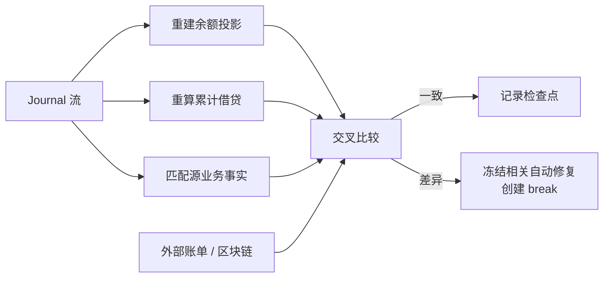

异步 verifier 不应自动用一条“补差额” journal 抹平异常。先冻结危险动作、保留证据并定位根因；只有明确业务含义后，才创建经审批的冲正或补记。

### 14.3 属性测试与状态机测试

为任意生成的充值、订单、部分成交、撤单、费用和提现序列验证：

- 任何已提交 journal 前缀都保持分资产借贷平衡；
- 重放任意已处理事件不改变最终余额；
- 任意失败点恢复后，结果等价于某个合法提交前缀；
- 订单成交量不超过有效数量；
- hold 消耗与释放之和不超过原预占；
- 同一 fill 的买卖数量一致；
- 投影清空后从 journal 重建得到相同状态；
- reversal 的净效果与原 journal 相抵，原记录仍可查询。

### 14.4 故障注入

应在这些边界注入崩溃：

- 生成 journal 后、写数据库前；
- journal 头后、postings 中途；
- 数据库 commit 前后；
- durable sequence 更新前后；
- ACK 返回前后；
- outbox 发布前后；
- 投影应用中途；
- 新 segment/快照发布前后；
- 主从切换和旧主恢复写入时。

每次都检查：已 ACK 的 journal 必须存在，未 ACK 的 journal 可以存在或不存在但不得出现半组，重试不能重复入账，新 writer 必须拒绝旧 epoch 的写入。

## 15. 生产监控应该看什么

最低限度应暴露：

- `unbalanced_journal_total`：必须为 0；
- `duplicate_source_conflict_total`：同 ID 不同 payload，必须立即告警；
- `ledger_commit_latency` 与失败率；
- `ledger_durable_sequence`、`projection_sequence` 与 lag；
- `settlement_source_sequence` 与待清算 Gap；
- active hold 数量、金额、最大账龄；
- 负余额、越限账户和 closed-account posting；
- reversal/correction 数量及原因；
- suspense 余额、break 数量、最大账龄；
- 内外部对账差异，按实体、资产、托管人分别展示；
- outbox lag 与重复投递率；
- 热点账户冲突、序列化失败和重试次数。

不要只看“总借方等于总贷方、账簿整体平衡”的一条绿灯。一个系统可能整体平衡，却把 A 用户的钱记给 B 用户；也可能内部完全平衡，却与银行或链上差 `100 BTC`。

## 16. 自建关系账本还是专用账本引擎

普通关系数据库可以构建正确账本，但需要自己实现并验证：

- 原子多分录；
- 业务幂等；
- 累计余额与高并发约束；
- 热点账户策略；
- append-only 权限；
- 冲正、历史余额与批量查询；
- 故障恢复、复制与运维工具。

专用账本数据库可能原生提供账户、transfer、pending/post/void、累计 debit/credit、幂等 ID 和链接事件。例如 TigerBeetle 把账户、transfer 和 ledger 作为核心数据模型，并要求同一 transfer 的 debit/credit 账户位于同一 ledger；跨币种交换可用原子 linked transfers 组合。

这并不意味着换一个数据库就完成了交易所账务。产品规则、法律实体、账户图、source identity、清算、外部对账和运营流程仍由应用负责。数据库只能强制它理解的不变量。

选择前至少做：

1. 用完整现货与合约场景验证账户模型；
2. 压测热点账户、批量 posting 与历史查询；
3. 验证 timeout、重试和 failover 的幂等语义；
4. 演练备份、恢复、升级和数据导出；
5. 确认能与外部总账、审计和监管报表连接；
6. 明确数据主权、访问控制与可观测性。

## 17. 最常见的反模式

| 反模式 | 为什么危险 |
| --- | --- |
| 只保存 `user.balance` | 无法解释来源、重放、冲正和对账 |
| 直接用正负数代替借贷类型 | 观察视角和账户类型容易混乱 |
| 把 BTC 与 USDT 数值加总配平 | 不同计量单位不能相加 |
| 每次重试生成新 journal ID | 同一 fill 会重复入账 |
| 用时间戳、金额近似去重 | 两笔合法交易可能相同，时钟也不是身份 |
| posted 后原地 UPDATE/DELETE | 审计链断裂，历史余额不可重建 |
| 认为 journal 平衡就不会透支 | 平衡是全局恒等式，不是单账户下限 |
| 先读缓存余额，稍后异步扣款 | 并发请求可以同时通过检查 |
| 把 unrealized PnL 当现金到账 | 估值与结算混为一谈 |
| fee、rebate、funding 全写 adjustment | 无法解释毛额、规则和业务原因 |
| 只做内部借贷平衡 | 无法发现外部资产缺失 |
| 用 suspense 自动吃掉所有差异 | 差异被隐藏而非解决 |
| 对账只比较当前总余额 | 在途、时区、区块高度和明细错配会被掩盖 |
| 把数据库/Kafka 事务称为全球 exactly-once | 外部银行、链和副作用不在同一事务边界 |

## 18. 一份可执行的设计检查表

### 账户与金额

- [ ] 统一从哪个法律实体和观察视角记账；
- [ ] 每个账户有稳定类型、资产、scale、owner 和 purpose；
- [ ] 不同资产分别平衡，跨资产腿原子关联；
- [ ] 使用整数原子单位或精确 decimal，不使用浮点；
- [ ] rounding 与 dust 有明确账户和规则。

### 事件与原子性

- [ ] order、fill、journal、posting 使用不同且稳定的 ID；
- [ ] 每种 source fact 有唯一幂等键和 payload 校验；
- [ ] journal、全部 postings、投影版本和 outbox 原子提交；
- [ ] ACK 发生在权威持久化之后；
- [ ] 多资产、多账户、跨分片失败不会留下半组。

### 余额与并发

- [ ] posted、pending、available、equity、withdrawable 语义分开；
- [ ] 预占与订单受理共享串行化边界；
- [ ] 账户下限与信用额度在提交时验证；
- [ ] 投影携带账本位置，可从 journal 重建；
- [ ] 热点账户不会破坏原子性或形成不可控延迟。

### 更正与对账

- [ ] posted 记录不可修改，只能 reversal/correction；
- [ ] effective time 与 recorded sequence 分开；
- [ ] 业务事实、内部账本、外部资产三层都对账；
- [ ] break 与 suspense 有 owner、账龄、SLA 和解决证据；
- [ ] 故障注入证明 ACK、重试、切换和重放不变量。

## 19. 最后记住四句话

1. **订单表达意图，fill 表达成交，journal 表达经济事实，balance 只是投影。**
2. **双重记账要求同一计量域内借贷相等，不允许拿 BTC 和 USDT 的数字互相抵消。**
3. **平衡只证明内部表达自洽；幂等、账户下限、外部资产和业务完整性需要独立证明。**
4. **错误通过冲正留下证据，故障通过稳定身份安全重放，差异通过对账暴露而不是被 adjustment 吞掉。**

下一章进入 [《保证金风险引擎》](/signal-grid-blog/posts/margin-metrics-and-mark-price/)：把这里的 posted balance、pending/available、仓位与未实现估值接入同一风险快照，继续区分权益、维持保证金、标记价格和清算触发边界。

## 官方参考

- [TigerBeetle：Financial Accounting](https://docs.tigerbeetle.com/coding/financial-accounting/)——从运营主体视角解释资产、负债、收入、费用及 debit/credit 方向。
- [TigerBeetle：Data Modeling](https://docs.tigerbeetle.com/coding/data-modeling/)——Account、Transfer、ledger 分区和跨币种 linked transfer 的建模边界。
- [TigerBeetle：Account Reference](https://docs.tigerbeetle.com/reference/account/)——累计 pending/posted debit/credit、账户不可复用及余额约束。
- [TigerBeetle：Transfer Reference](https://docs.tigerbeetle.com/reference/transfer/)——不可变 transfer、pending/post/void、linked events 与 correcting transfer。
- [Modern Treasury：Ledger Transactions Overview](https://docs.moderntreasury.com/ledgers/docs/ledger-transactions-overview)——多 entry 原子事务、借贷平衡和 posted 后不可变。
- [Modern Treasury：How to Think About Ledger Balances](https://www.moderntreasury.com/journal/how-to-think-about-ledger-balances)——posted、pending、available balance 的产品语义。
- [Modern Treasury：Account Reconciliation](https://docs.moderntreasury.com/ledgers/docs/account-reconciliation)——内部 ledger balance 与银行/供应商报告余额的对账边界。
- [PostgreSQL：Numeric Types](https://www.postgresql.org/docs/current/datatype-numeric.html)——精确 `numeric` 与非精确浮点类型的区别。
- [PostgreSQL：Constraints](https://www.postgresql.org/docs/current/ddl-constraints.html)——`CHECK` 不能可靠引用其他行，跨行不变量需另行设计。
- [PostgreSQL：Concurrency Control](https://www.postgresql.org/docs/current/mvcc.html)——事务隔离、锁与序列化失败重试。
- [OKX API：Account Balance](https://www.okx.com/docs-v5/en/)——真实产品 API 中 cash balance、available balance、frozen balance、order frozen 与 equity 的区分示例。
