“先写 WAL，再更新数据”几乎出现在每一篇数据库和存储教程里。它听起来像一个简单的文件操作顺序，却常被扩张成许多并不成立的结论：调用 `write()` 就不会丢、日志是追加文件所以不会损坏、写了 commit record 就天然原子、做了 checkpoint 就能删除之前全部日志，甚至“有 WAL 就是 exactly-once”。

这些说法把一个**恢复协议**缩成了一个 API 调用。

WAL（Write-Ahead Logging，常译“预写日志”）真正建立的是一组先后约束：在允许数据页进入持久介质之前，恢复所需的日志必须先稳定；在向调用方承诺“已持久提交”之前，提交记录及其依赖的日志必须先稳定。只有日志格式、日志序列号（Log Sequence Number，LSN）、同步屏障、确认策略、恢复算法、checkpoint 和保留策略一起闭环，这些顺序才会变成可验证的原子性与持久性。

本文是“有状态系统可靠性”学习路径的 Chapter 02。建议先读 [Chapter 01：有状态服务的高可用架构](/signal-grid-blog/posts/high-availability-stateful-service/) 建立故障模型、RTO/RPO 与恢复全景；下一章 [Chapter 03：分布式时间](/signal-grid-blog/posts/distributed-systems-time-clocks-ordering-and-leases/) 会先区分物理时间、逻辑顺序、超时与 Lease，再由 [Chapter 04：一致性模型](/signal-grid-blog/posts/consistency-models-linearizability-serializability-and-real-time-order/) 定义客户端能够观察到的 history；[Chapter 05：复制协议的设计空间](/signal-grid-blog/posts/replication-protocol-design-space-primary-backup-quorum-chain-smr/)先比较哪些副本、确认和读取路径能够建立复制承诺，随后 [Chapter 06：Raft 论文精读](/signal-grid-blog/posts/raft-consensus-leader-election-log-replication-and-safety/) 再深入一种多数派日志协议。

本文以 [ARIES 原论文](https://research.ibm.com/publications/aries-a-transaction-recovery-method-supporting-fine-granularity-locking-and-partial-rollbacks-using-write-ahead-logging) 解释经典事务恢复，以 [PostgreSQL 18 WAL 文档](https://www.postgresql.org/docs/18/wal-intro.html) 展示现代产品的承诺层级，再用 JDK 25 与 Linux/POSIX 的官方契约落到 Java 工程。ARIES 是一种重要算法，不是所有 WAL 产品的统一内部实现；PostgreSQL、Kafka、Raft 日志也不能彼此直接套用。

## 1. WAL 的保证从故障模型开始

WAL 能保证什么？一个不偷换前提的回答是：

> 在明确的故障模型、诚实履约的持久化栈和正确的恢复算法下，WAL 通过约束日志、数据页与提交确认的顺序，使系统能够在崩溃后恢复到某个合法的已提交前缀，并满足它公开承诺的事务原子性与持久性级别。

这句话里的每个限定都不能删。

本文从可靠性协议回答“提交确认后，崩溃恢复应得到什么”；如果你需要先看清 Page、Buffer Pool、WAL 与 Manifest 在单机存储引擎里的权威关系，以及 checkpoint 到底发布了哪一组可恢复材料，请先读[《存储引擎全景》](/signal-grid-blog/posts/storage-engine-pages-buffer-pool-wal-manifest-recovery-boundaries/)。两篇文章使用同一条先行顺序，但这里不重复展开页缓存和文件集合的内部结构。

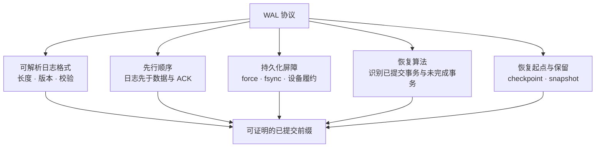

WAL 本身通常不保证：

- 事务之间的隔离级别或业务不变量；
- 多节点对同一日志前缀达成共识；
- WAL 所在磁盘永久损坏后仍可恢复；
- 跨数据库、HTTP、邮件和支付系统的原子副作用；
- 客户端超时重试时只执行一次；
- 静默位翻转一定能修复，而不只是被检测；
- 任意时长的时间点恢复（Point-in-Time Recovery，PITR）、备份或跨机房容灾。

因此，“用了 WAL”不是一个完整的可靠性声明。完整声明至少要写明：**防什么故障、ACK 代表什么、恢复到哪里、哪些数据可能丢、哪些副作用需要额外协议。**

### 故障模型决定“持久”这个词的强度

同一个字节可能依次存在于 Java 堆外缓冲、内核 page cache、控制器缓存、设备缓存和非易失介质。不同故障会清掉不同层。

| 故障               | 仍可能保留什么              | 单份本地 WAL 需要的边界                                       |
| ------------------ | --------------------------- | ------------------------------------------------------------- |
| 线程异常或业务回滚 | 进程与 OS 都在              | 正确事务语义与 undo/忽略策略                                  |
| JVM/进程崩溃       | 内核 page cache 通常仍在    | 不能把“通常”当 durable ACK；仍应按承诺 force                  |
| 内核崩溃或重启     | page cache 丢失             | 成功穿过 OS 同步屏障                                          |
| 整机断电           | 易失控制器/设备缓存也可能丢 | 文件系统、驱动、设备正确执行 flush / Force Unit Access（FUA） |
| 单盘永久损坏       | 本地文件可能全部消失        | 冗余副本、备份或介质恢复，不是单份 WAL                        |
| 静默损坏           | 文件还在但字节错误          | checksum 检测，加冗余才能修复                                 |
| 节点或机房永久丢失 | 本地介质不可访问            | 复制、异地备份和可演练恢复                                    |

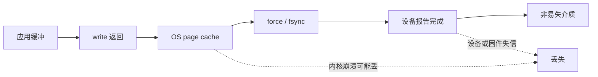

Linux 的 [`fsync(2)`](https://man7.org/linux/man-pages/man2/fsync.2.html) 契约是：把文件的内核缓存数据与元数据传给存储设备，并等待设备报告完成；它还明确指出，文件 `fsync` 不会自动保证父目录中的目录项也已持久。PostgreSQL 的[可靠性说明](https://www.postgresql.org/docs/18/wal-reliability.html)进一步提醒：控制器和磁盘的易失 write-back cache、错误的 flush 实现、部分页写入都可能破坏应用以为已经建立的顺序。

所以本文所说的“稳定存储”不是神奇硬盘，而是一个必须被验证的部署假设：

```text
JDK provider → OS → 文件系统 → 虚拟块设备 → RAID/控制器 → SSD 固件
```

任何一层谎报完成，应用层再严谨的 WAL 也无法凭空恢复缺失的字节。

## 2. 从先行规则到合法持久前缀

### WAL 规则一：日志先于脏数据页

更新后的数据页覆盖持久介质中的旧页之前，能够解释这次更新、满足恢复需要的日志必须已经稳定。

经典 ARIES 用 `pageLSN` 记录数据页包含到哪条更新。缓冲管理器准备把脏页写回时，要先保证日志的持久前沿已经覆盖该页：

```text
pageLSN <= durableLSN
```

如果页中可能含有未提交事务的修改，ARIES 至少要求相应 undo 信息先稳定。这样即使缓冲池采用 **steal**，把含有未提交修改的页提前写盘，恢复也有材料把 loser transaction 撤销。

### WAL 规则二：持久提交先于 ACK

系统向客户端返回“该事务已持久提交”之前，commit record 以及事务恢复所需的先前日志必须已经稳定：

```text
ackDurableCommit(txn) => durableLSN >= txn.commitLSN
```

因为日志 force 的通常是一个连续前缀，推进到 `commitLSN` 也覆盖它之前的相关记录。多个事务还可以共享同一次同步，这就是 group commit 的基础。

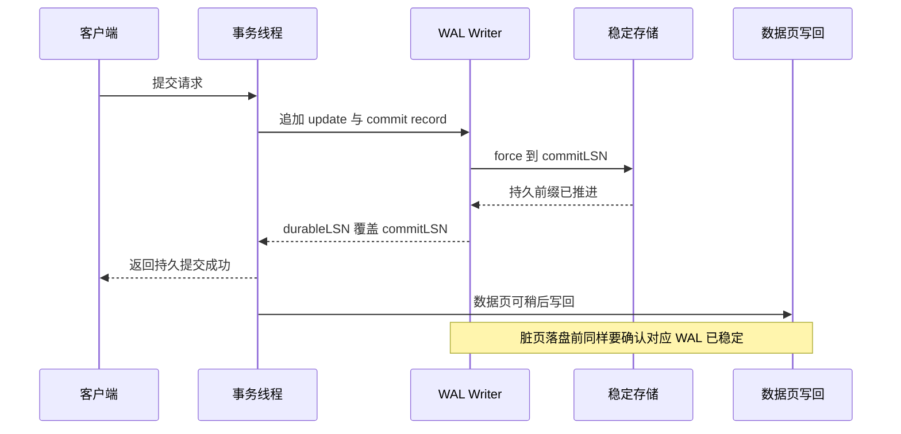

两条规则解决的是不同问题：

- 第一条保护数据页写回，允许恢复撤销或重做；
- 第二条定义成功响应的持久性语义，允许已提交事务的数据页延迟落盘。

若产品提供“异步提交”，它不是推翻第二条，而是明确把 ACK 降级为“逻辑完成、尚未承诺抗崩溃”。PostgreSQL 的[异步提交文档](https://www.postgresql.org/docs/18/wal-async-commit.html)说明：`synchronous_commit=off` 可能丢失近期已返回成功的事务，但恢复仍停在一个自洽的稳定 WAL 前缀；这和关闭 `fsync` 后可能破坏写入顺序、导致数据库损坏不是一回事。

### append、write、force 与 ACK 是四个不同状态

很多实现把下列变量都叫 `position`，然后在代码里悄悄混用：

- `appendLSN`：已经分配并编码到内存日志缓冲的末端；
- `writtenLSN`：已经交给内核文件缓存的末端；
- `durableLSN`：同步屏障成功覆盖的连续末端；
- `appliedLSN`：状态机已经消费到的末端；它可能只存在于内存，也不必与本地持久前沿同步；
- `pageLSN`：某个数据页已经包含的最新更新；内存页可以先更新，但该页持久化前必须等待 WAL 前沿覆盖它；
- `checkpointLSN` / `redoLSN`：恢复可以从哪里开始；
- `archivedLSN` / `replicatedLSN`：归档或远端副本分别到哪里。

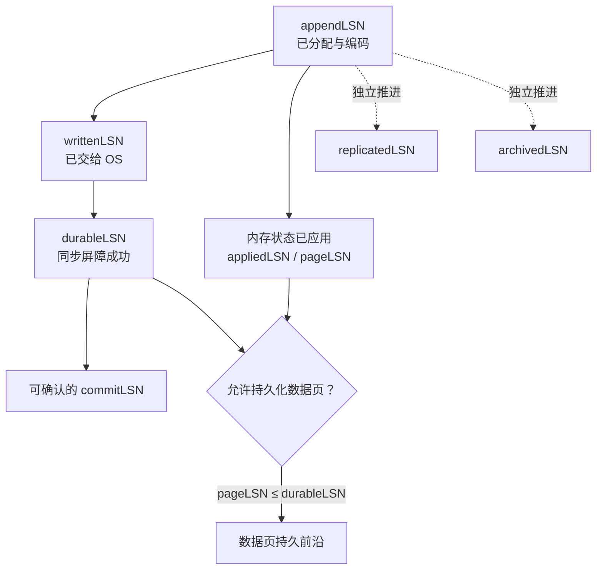

这些前沿可以互相超前：

- no-force 系统里，`durableLSN` 可远大于数据页的 `applied-on-disk LSN`；
- 异步提交里，ACK 可能先于 `durableLSN`，但产品必须公开这一风险；
- 复制落后不妨碍本地持久化，是否妨碍 ACK 取决于复制确认策略；
- checkpoint 只缩短恢复工作，不能替代 commit record；
- archive 可能落后于在线 WAL，因此 PITR 的 RPO 与本地 crash recovery 不同。

一个正确的日志写入器只能按**连续前缀**推进 `durableLSN`。不能因为 LSN 105 的某块先到盘，就越过不确定的 103、104 对 105 回 ACK。单写者、单一序列器和批次边界之所以常见，不只是为了性能，更是为了让这条证明足够简单。

### WAL 记录必须能证明“最长合法前缀”

日志是追加的，不代表每次追加原子。一次掉电可能留下：

- 完整 header，但 payload 只写了一半；
- payload 完整，CRC 或 footer 缺失；
- 长度字段被撕裂，变成荒谬的大数；
- 旧 sector 与新 sector 混合；
- `write()` 只写了请求的一部分，调用方却没有继续写；
- 文件内容已落盘，但新 segment 的目录项没有持久。

一个可恢复的 frame 至少要有明确边界与校验：

```text
magic | formatVersion | type | totalLength | LSN | txn/requestId
      | payloadLength | payload | CRC32C | optional repeatedLength
```

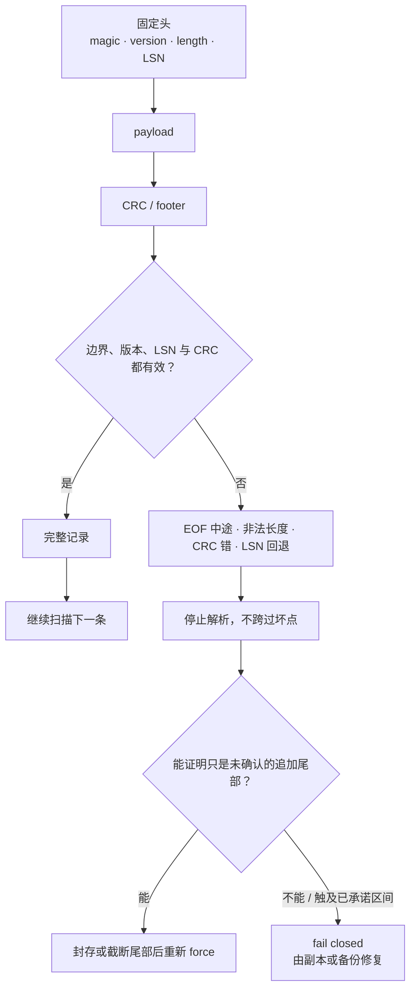

恢复扫描的安全默认是：

1. 校验 magic、版本、类型和长度上限；
2. 防止整数溢出和根据磁盘长度分配巨量内存；
3. 校验 LSN 单调与 CRC 覆盖范围；
4. 第一次遇到不完整或损坏记录就停止；
5. 将其后的字节视为未证明区域，不要搜索下一个 magic 后继续应用；
6. 只有在故障模型、segment 位置和受保护的提交元数据共同证明它只是**尚未确认的追加尾部**时，才可截到上一条合法边界并重新 force，或封存旧段、启新 segment；
7. 若坏点位于中间 segment、触及已返回 durable ACK 的区间，或根本无法证明承诺边界，就必须 fail closed，并从完整的冗余 WAL / 归档副本，或经验证的快照 / 基线加上从该点起连续的 WAL 修复，不能用“截断成功”掩盖已确认数据丢失。

单靠“这是最后一个文件”或“CRC 从这里开始失败”不能证明第 6 条：掉电撕裂的未确认尾部与设备在 ACK 之后发生的静默损坏，表面上可能一样。生产系统需要把 durable/commit frontier、segment 世代和恢复基线一并保护，并让修复策略与公开的故障模型一致。

CRC 只能帮助检测常见撕裂与损坏，不能让多 sector 写入变成原子，也不是防恶意篡改的认证码。任意 WAL 缺口需要完整日志副本或匹配的恢复基线；整页映像只用于重建它所覆盖的 torn data page，不能跨过缺失的事务或日志记录。

PostgreSQL 的 [`full_page_writes`](https://www.postgresql.org/docs/18/runtime-config-wal.html) 是一个典型例子：增量 WAL 不足以修复新旧混合的 torn page，所以每次 checkpoint 后页面第一次修改时会把整页映像写入 WAL。数据 checksum 负责检测，full-page image 提供重建材料；二者不能互相替代。

## 3. WAL 怎样形成事务原子性

“每条 frame 都完整”仍不等于“事务原子”。恢复必须知道哪些事务已经提交、哪些没有，以及失败时应 redo、undo 还是忽略。

最简单的 redo-only 设计可以采用：

```text
BEGIN(txn-7)
PUT(txn-7, account-1, afterImage)
PUT(txn-7, account-2, afterImage)
COMMIT(txn-7)
```

只有 durable prefix 内包含有效 `COMMIT(txn-7)` 时，恢复才重做这组修改。若主数据结构在 commit 前可能把未提交内容写盘，就还需要 before image、undo record、copy-on-write 或其他撤销机制。

日志“记录什么”和“能做什么”是两个维度：

| 维度     | 常见选择                               | 含义                                         |
| -------- | -------------------------------------- | -------------------------------------------- |
| 恢复方向 | redo-only / undo-only / undo-redo      | 能恢复已提交变化、撤销未提交变化，或两者兼具 |
| 内容表达 | before/after image / value / operation | 记录整块、字段值，或“字段加 5”一类操作       |
| 定位方式 | page-oriented / logical                | 直接定位页，或按 key/业务对象重新定位        |

后来的教材常把“物理定位到页、页内记录逻辑变化”的组合概括为 **physiological logging**。但不要把这个词、redo/undo 能力和 logical/physical 定位压成一条由低到高的分类轴；它们解决的问题不同。

还要注意：操作日志里的 `balance += 5` 并不天然幂等。恢复能安全跳过已应用记录，通常依靠 LSN、pageLSN、事务状态和条件判断，而不是因为“加 5”重复执行也没关系。

### 为什么经典数据库选择 steal + no-force

缓冲池有两个彼此独立的策略问题：

| 选择     | 允许什么                         | 恢复代价                          |
| -------- | -------------------------------- | --------------------------------- |
| steal    | 含未提交修改的页可以被换出并写盘 | 可能需要 UNDO                     |
| no-steal | 含未提交修改的页不能写盘         | 减少 UNDO，但长事务会钉住大量内存 |
| force    | 提交前把事务修改的所有数据页写盘 | 减少 REDO，但提交会变成随机 I/O   |
| no-force | 提交时不要求数据页全部写盘       | 需要 REDO，换来较轻的提交热路径   |

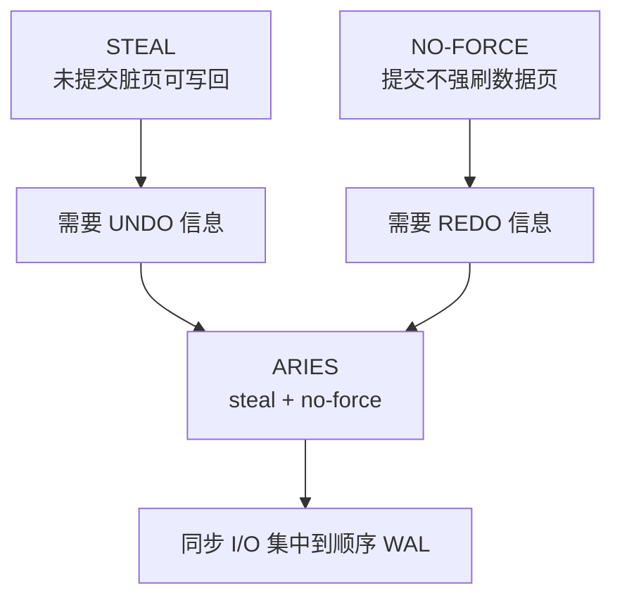

经典 ARIES 支持 `steal + no-force`：

- steal 让缓冲管理器在内存紧张时写出任何脏页，不必等待长事务结束；
- no-force 让 commit 只同步较小、连续追加的 WAL，不必随机刷遍事务触碰过的数据页；
- 代价是恢复既要重做 winner transaction 尚未写入数据页的变化，也要撤销 loser transaction 已经进入数据页的变化。

这也是 WAL 的性能本质：它不是消灭写入，而是把提交关键路径上的许多随机数据页写，转换成较小且可批处理的顺序日志同步。数据页仍要写，只是可以被后台合并和调度。

### ARIES 怎样从崩溃现场恢复

[ARIES 论文](https://research.ibm.com/publications/aries-a-transaction-recovery-method-supporting-fine-granularity-locking-and-partial-rollbacks-using-write-ahead-logging)把恢复组织成 Analysis、Redo、Undo 三阶段。它是理解 WAL 闭环的最佳模型之一，但不是所有产品的统一实现；例如 PostgreSQL 主要以 REDO 恢复物理页，并由 MVCC/事务状态处理未提交版本，不能把 ARIES 的逐条 UNDO / CLR 恢复流程原样套过去。

#### 先认识几个 LSN

| 名称       | 所属对象              | 回答的问题                       |
| ---------- | --------------------- | -------------------------------- |
| LSN        | 日志记录              | 这条记录位于日志空间哪里         |
| pageLSN    | 数据页                | 这个页已经包含到哪条更新         |
| RecLSN     | Dirty Page Table 条目 | 这个页本轮第一次变脏的位置       |
| LastLSN    | 事务表条目            | 该事务最近一条日志在哪里         |
| PrevLSN    | 日志记录              | 该事务上一条日志在哪里           |
| UndoNxtLSN | CLR                   | 该事务下一条仍需撤销的日志在哪里 |

LSN 是日志地址与恢复顺序标记，不是 wall-clock 时间，也不是跨数据库的全局业务序列号。

#### Analysis：重建崩溃时的元数据

Analysis 从最后一个完整 checkpoint 的记录开始扫到日志尾，重建：

- Transaction Table：哪些事务正在运行、已提交、正在回滚或处于 prepared 状态；
- Dirty Page Table：哪些页可能只在内存里更新过，以及它们的 `RecLSN`；
- loser transaction 集合；
- 每个事务的 `LastLSN` 与后续 undo 入口；
- `RedoLSN = min(RecLSN)`，即 redo 最早可能需要检查的位置。

#### Redo：repeat history，不只重做 winner

ARIES 的 Redo 会“重演历史”：把崩溃前已经发生、但尚未反映在持久数据页上的更新重新做一遍，**包括 loser transaction（崩溃时尚未提交、需要回滚的事务）的更新**。prepared / in-doubt transaction 已进入两阶段提交的不确定状态，不应被当作普通 loser 自动撤销；恢复必须重建它们的状态与锁，并等待协调者给出 COMMIT 或 ABORT 决议。常见跳过条件是：

1. 目标页不在 Dirty Page Table；
2. 记录 LSN 早于该页 `RecLSN`；
3. 读入页面后发现 `pageLSN >= record.LSN`。

只有仍缺失的更新才执行。这样先还原崩溃瞬间的物理状态，随后 Undo 才能沿正确历史撤销 loser。

#### Undo：撤销 loser，并写 CLR

Undo 沿各 loser transaction 的日志链逆序撤销。每完成一次补偿，就写一条 Compensation Log Record（CLR）：

- CLR 记录撤销动作对页面做了什么；
- CLR 是 redo-only，下一次恢复可以重做它；
- CLR 不再被 undo；
- `UndoNxtLSN` 指向下一条仍需撤销的记录。

因此恢复过程中再次断电，也不会出现“撤销一次撤销”或无限重复补偿。

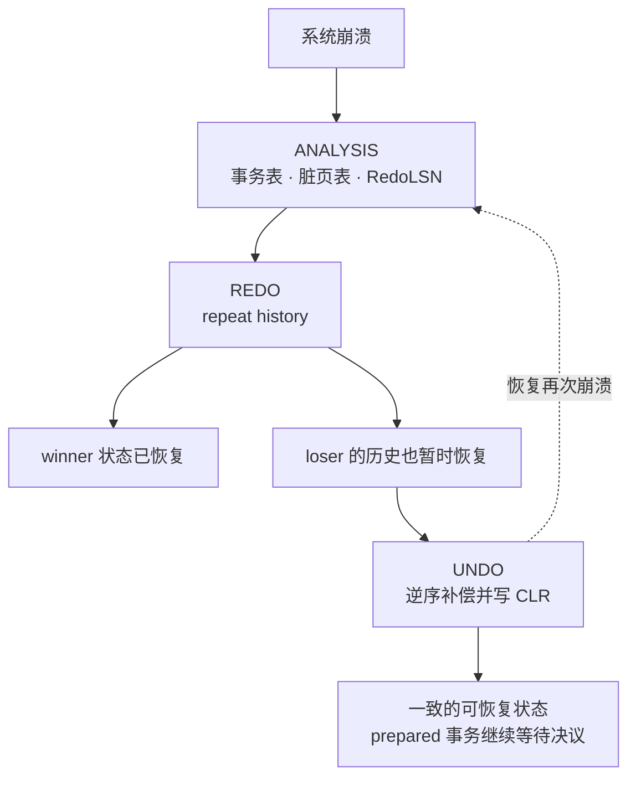

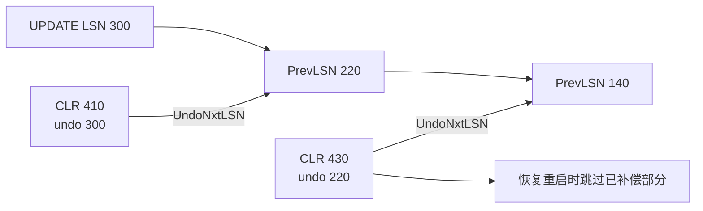

#### pageLSN 不是魔法幂等键

`pageLSN >= record.LSN` 让恢复判断“这个页已经包含该更新”，所以 redo 能被安全跳过。它不代表日志操作本身天然幂等，也不代表业务副作用可重复执行。

若一条日志描述“调用支付 API”或“发邮件”，页面上的 LSN 无法撤回外部世界。WAL 恢复只应直接重做它负责的持久状态；外部副作用要通过 outbox、幂等键、fencing 或可查询状态单独闭环。

### Checkpoint 不是 commit，也不是删除按钮

checkpoint 的共同目标是建立更近的恢复起点、缩短恢复工作；具体是否把所有脏页刷盘，取决于恢复算法。

ARIES 的 **fuzzy checkpoint** 会记录 Transaction Table 和 Dirty Page Table，checkpoint 期间事务继续运行，甚至不要求 checkpoint 时强刷任何脏页。PostgreSQL 的 [checkpoint](https://www.postgresql.org/docs/18/wal-configuration.html) 则会写出脏数据页，并在 WAL 中记录可用于 REDO 的位置。

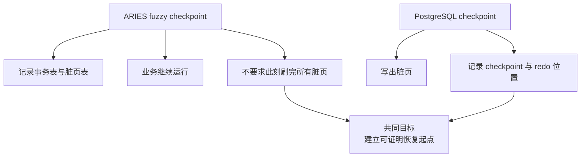

因此，不能从“checkpoint 完成”直接推出“之前的 WAL 全可删”。安全截断点必须满足所有恢复消费者：

```text
safeTruncateLSN = min(
    crashRecoveryRedoNeed,
    activeTransactionUndoNeed,
    snapshotOrBaseBackupNeed,
    replicaOrSlotNeed,
    archiveAndPitrRetentionNeed
)
```

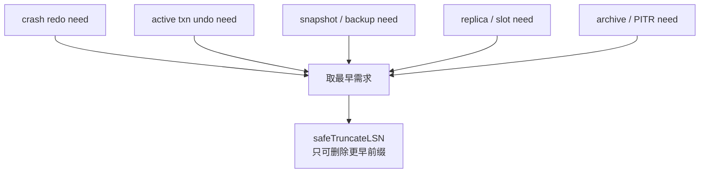

一个长事务可能仍要沿很早的 `PrevLSN` 链回滚；一个落后的副本或复制槽可能仍需要旧 segment；一个尚未完成的 base backup 需要从其起点开始的连续 WAL。PostgreSQL 文档也明确说明：归档失败或复制槽落后会让旧 WAL 累积，直至磁盘耗尽。

checkpoint、snapshot、backup 和 archive 要分开：

| 机制                   | 主要目标             | 单独能否恢复介质丢失         |
| ---------------------- | -------------------- | ---------------------------- |
| checkpoint             | 缩短 crash recovery  | 通常不能                     |
| snapshot / base backup | 提供完整状态基线     | 只能恢复到基线时刻           |
| online WAL             | 恢复近期崩溃         | WAL 设备丢失后不能           |
| archived WAL           | 把基线推进到后续时刻 | 必须配套可用基线             |
| replica                | 降低节点故障恢复时间 | 不是历史备份，错误也可能复制 |

## 4. ACK 合同、Group Commit 与 Java 持久化边界

### Group commit：一次 force 服务多个事务

同步屏障往往比编码和顺序写昂贵。若每个小事务都单独 force，吞吐会受存储同步延迟限制。Group commit 把一批事务的日志连续写入，再一次 force 到批次末端：

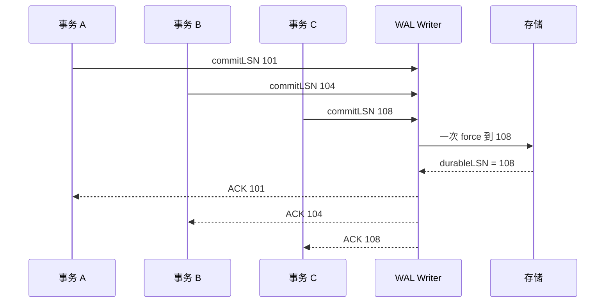

它没有降低每个事务的持久性：三个 ACK 仍都发生在 `durableLSN` 覆盖各自 `commitLSN` 之后。它交换的是等待策略：

- 更大的 batch 能摊薄同步成本、提高吞吐；
- 等待更多事务会增加低负载下的提交延迟；
- 太大的 batch 增加内存、排队和一次失败影响范围；
- 写入速率超过可持续 force 能力时，队列会持续增长，必须背压或拒绝。

PostgreSQL 的 [`commit_delay`](https://www.postgresql.org/docs/18/wal-configuration.html) 就是显式扩大“加入同一批 flush”的窗口。调优不能只看平均 TPS，还要观测：

- force 延迟的 p50 / p99 / p99.9；
- 每次 force 覆盖的事务数和字节数；
- WAL queue depth 与最老请求年龄；
- `writtenLSN - durableLSN`；
- ENOSPC、EIO、同步超时与日志盘余量；
- 崩溃恢复需要扫描的字节和耗时。

### ACK 是产品契约，不是一个固定按钮

“提交成功”可以对应不同耐久等级。PostgreSQL 18 的 `synchronous_commit` 很适合展示这条分层：

下表假设 `synchronous_standby_names` 非空，且系统已选出当前同步备库。若没有同步备库配置，`remote_write`、`on` 与 `remote_apply` 都不会凭参数名自动产生远端承诺，而只剩主库本地 WAL flush；`local` 本来就不等待远端。

| 模式           | 主库本地等待           | 同步备库等待                  | 剩余耐久边界                                                     |
| -------------- | ---------------------- | ----------------------------- | ---------------------------------------------------------------- |
| `off`          | 不等 WAL durable flush | 不等                          | 主库数据库或 OS 崩溃可丢近期成功事务                             |
| `local`        | WAL durable flush      | 不等                          | 主库节点或其持久介质永久丢失时没有同步副本承诺                   |
| `remote_write` | WAL durable flush      | 已写入备库 OS，但未必 durable | 若主库已丢失，备库又在 flush 前发生 OS 崩溃，事务仍可能丢失      |
| `on`           | WAL durable flush      | durable flush                 | 参与承诺的主库与同步备库持久存储同时丢失或损坏                   |
| `remote_apply` | WAL durable flush      | durable flush 且 replay 可见  | 耐久故障边界与 `on` 相同；额外等待可见性，但不等于外部副作用原子 |

这里最重要的不是照抄 PostgreSQL 参数，而是学会给自己的 API 命名：

```text
ACCEPTED        已进入进程队列
APPENDED        已编码进 WAL 缓冲
WRITTEN         已交给 OS
LOCALLY_DURABLE 本地同步屏障完成
QUORUM_COMMITTED 复制协议已提交
APPLIED         状态机已应用
EXTERNALLY_DONE 外部副作用已由独立协议确认
```

如果业务只返回一个 `success`，文档必须明确它对应哪一层。指标、超时和重试也应围绕同一语义，否则调用方会自然把最弱的成功理解成最强的保证。

### Java 中的 write、force、SYNC 与 mmap

#### `write()` 不等于写完整，更不等于 durable

JDK 的 `FileChannel.write()` 返回实际写入的字节数，一次调用可能没有消费完整个 `ByteBuffer`，甚至可以返回 0。可靠实现必须循环，并对长期无进展 fail closed：

```java
static void writeFully(FileChannel channel, ByteBuffer src) throws IOException {
    int noProgress = 0;

    while (src.hasRemaining()) {
        int written = channel.write(src);
        if (written > 0) {
            noProgress = 0;
            continue;
        }

        if (++noProgress > 1_000) {
            throw new IOException("WAL write made no progress");
        }
        java.util.concurrent.locks.LockSupport.parkNanos(10_000L);
    }
}
```

`BufferedOutputStream.flush()`、`BufferedWriter.flush()` 一类用户态 `flush()` 通常只把 Java 缓冲推给下一层；`close()` 释放资源。二者都不是 WAL 的 durable barrier，`FileChannel` 本身也没有 `flush()` 方法。Linux 还允许某些 write-back 错误延迟到后续 `fsync()` 才报告。

#### `FileChannel.force()` 的精确边界

[JDK 25 `FileChannel.force`](<https://docs.oracle.com/en/java/javase/25/docs/api/java.base/java/nio/channels/FileChannel.html#force(boolean)>) 规定：文件位于本地存储设备时，返回后，经该 channel 对文件作出的相关变化已经写到设备；非本地设备没有同样保证。

- `force(false)`：要求文件内容；
- `force(true)`：还要求文件元数据；
- `metaData` 是否产生实际差异由底层 OS 决定；
- 它只保证经该 channel（或关联的 `FileOutputStream` / `RandomAccessFile`）作出的修改；
- 对 mapped buffer 的修改可能刷、也可能不刷。

内存映射写入必须调用 [`MappedByteBuffer.force()`](<https://docs.oracle.com/en/java/javase/25/docs/api/java.base/java/nio/MappedByteBuffer.html#force()>)。它解决 persistence，不替代多线程可见性协议；共享映射里的结构仍需要单写者、锁或 VarHandle 等并发设计。

#### `SYNC` / `DSYNC` 不是事务

用 `StandardOpenOption.SYNC` 打开的文件，每次 write 要求同步内容与元数据；`DSYNC` 只要求内容以及后续正确读取所必需的元数据。JDK 同样把强保证限定在默认 provider 与本地设备。

它们不会：

- 把多次 write 合成一条原子记录；
- 自动生成 COMMIT/ABORT 语义；
- 保证父目录项；
- 替代记录 CRC 和恢复扫描；
- 自动处理多个文件之间的顺序。

WAL 常用普通 write 加批次 `force()`，因为这样能保留 group commit。是否改用 SYNC/DSYNC，要由目标文件系统上的故障测试与延迟证据决定。

## 5. 从单写者 WAL 骨架到 Segment 与 Manifest

### 一个可证明的单写者 WAL 骨架

`FileChannel` 可以被多线程调用，不代表多线程就能安全拼一条逻辑日志。一个 frame 可能跨多次 write；不同线程若在这些调用之间交错，字节边界、LSN 顺序和 batch ACK 都难以证明。JDK 还明确说明，多进程同时用 APPEND 时单次写的原子性依文件系统而定。

更易验证的结构是：

1. 多个业务线程把不带 LSN 的 command 放入有界队列；
2. 唯一 WAL writer 出队后分配 LSN，并形成只读的 `PendingRecord`；
3. writer 把这些 record 交给 `flushBatch`，编码完整 frame 并 `writeFully`；
4. writer 按批次 `force`；
5. force 成功后推进 `durableLSN`；
6. 只完成 `LSN <= durableLSN` 的 future；
7. force 失败后进入 failed 状态，不在可疑尾部继续追加。

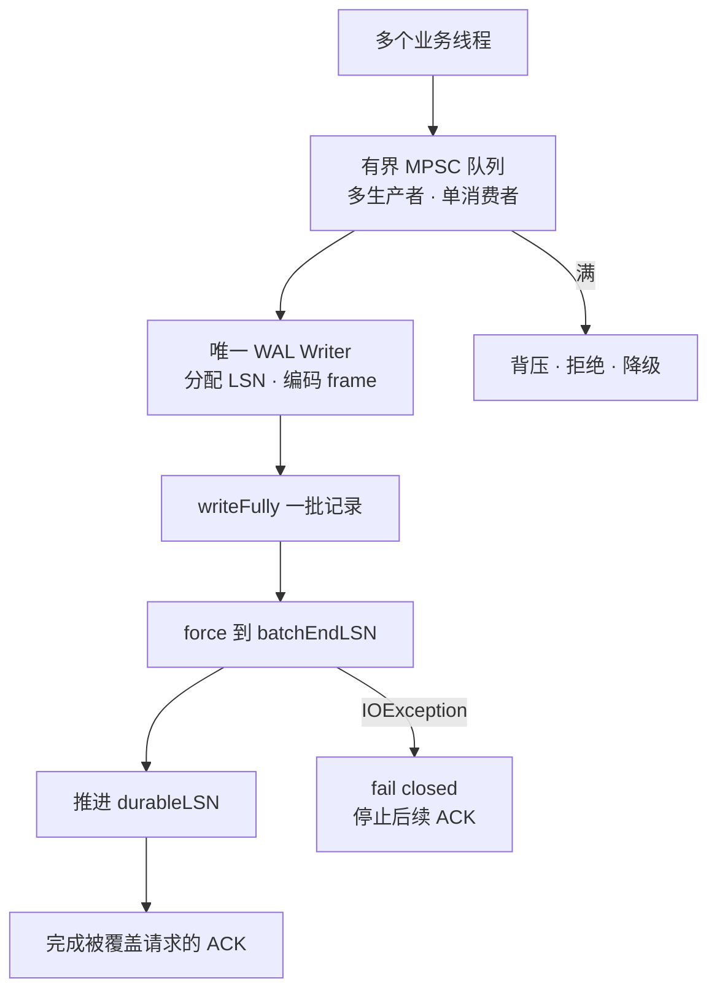

下面的代码只展示持久前沿，不是完整数据库。它假设 `PendingRecord` 的 LSN 已在同一个 writer 线程中分配，业务线程不能自行构造或修改；传给 `flushBatch` 的记录必须按 LSN 严格递增且连续，因此最后一条才代表整个批次的末端：

```java
final class WalWriter {
    private final FileChannel channel;
    private volatile long durableLsn;
    private boolean failed;

    WalWriter(FileChannel channel, long recoveredDurableLsn) {
        this.channel = channel;
        this.durableLsn = recoveredDurableLsn;
    }

    void flushBatch(List<PendingRecord> batch) throws IOException {
        if (failed) {
            throw new IOException("WAL is already failed");
        }
        if (batch.isEmpty()) {
            return;
        }

        try {
            for (PendingRecord pending : batch) {
                ByteBuffer frame = encodeFrame(
                    pending.lsn(),
                    pending.transactionId(),
                    pending.type(),
                    pending.payload()
                );
                writeFully(channel, frame);
            }

            // 保守示例。稳态 segment 能否用 force(false) 优化，
            // 必须依据 provider、文件系统合同与掉电测试。
            channel.force(true);

            long batchEndLsn = batch.getLast().lsn();
            durableLsn = batchEndLsn;
            for (PendingRecord pending : batch) {
                pending.ack().complete(pending.lsn());
            }
        } catch (IOException forceOrWriteFailure) {
            failed = true;
            for (PendingRecord pending : batch) {
                pending.ack().completeExceptionally(forceOrWriteFailure);
            }
            throw forceOrWriteFailure;
        }
    }
}
```

这段代码仍缺少：队列背压、segment roll、事务状态、CRC、恢复扫描、日志空间治理、超时、监控和目录同步。它刻意只证明一件事：**ACK 不会越过成功 force 的连续前缀。**

为什么 force 失败后不能“记录错误再继续”？因为此时你不知道：

- 哪些字节只在内核缓存；
- 哪些字节已经到设备；
- 尾部是否撕裂；
- 错误是否属于此前的 write-back；
- 新的记录会不会让损坏边界更难识别。

安全动作通常是停止写入和 ACK，重启后扫描并分类损坏。只有能证明故障位于未确认的追加尾部时才截断或启新 segment；若可能触及已承诺数据，就必须 fail closed 并从冗余材料修复。

### Segment 与 manifest：atomic rename 仍不等于 durable

快照、checkpoint manifest 和 WAL segment 经常采用“临时文件写完后 rename”发布。Linux 同一文件系统内的 [`rename(2)`](https://man7.org/linux/man-pages/man2/rename.2.html) 可以原子替换目标，使并发观察者看到旧名字或新名字；Java `ATOMIC_MOVE` 则只承诺操作要么原子完成、要么抛出异常，目标已存在时究竟替换还是失败取决于 provider，必须在部署平台验证。两者都不自动证明断电后新目录项还在。

POSIX 文件系统上的可靠替换通常是：

```text
同目录创建唯一临时文件
→ writeFully
→ force 临时文件内容与必要元数据
→ atomic rename
→ fsync 父目录
→ 才发布“新 manifest 已持久”
```


Linux `fsync(2)` 明确说：文件同步不会自动让包含它的目录项落盘，父目录还需单独同步。Java SE 没有给出可移植的 directory-fsync 契约；在这个边界上，生产实现要使用目标平台验证过的封装或原生能力，并在不支持时明确失败或降级，不能吞掉异常后宣称 crash-safe。

几个容易踩坑的点：

- 新 segment 首次承载可 ACK 记录前，要保证文件本身和名字都可在崩溃后找到；
- 已存在且目录项早已持久的稳态 segment，不必每批都同步目录；
- `AtomicMoveNotSupportedException` 不应悄悄退回 copy + delete；
- 跨目录 rename 的持久化更复杂，临时文件最好放目标同目录；
- 删除旧 segment 同样修改目录，若正确性依赖“它一定消失”，也要同步目录；
- 更稳健的恢复应由 manifest/epoch 判定有效集合，让多余旧文件只浪费空间而不会被误用。

## 6. 分布式与业务保证边界

### 本地 WAL、复制日志、备份是三个维度

本地 `force` 回答：“这台机器的这个日志前缀，是否能跨约定的本地崩溃保存？”

复制协议回答：“哪些节点认可同一前缀，失去部分节点后谁仍能继续？”

备份/PITR 回答：“在线副本都损坏、误删或被攻击后，能恢复到哪个历史时刻？”

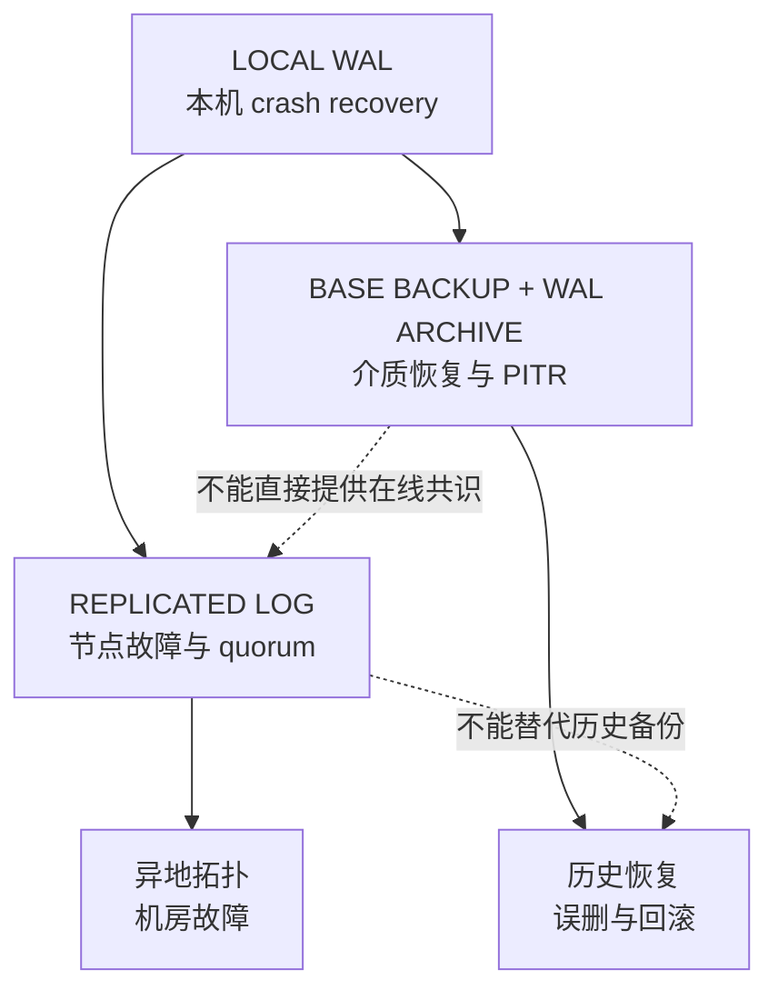

### 本地 WAL 不自动等于 quorum commit

Raft 的持久状态、日志复制和多数派提交规则属于另一层协议。后面的 Raft 章节会详细解释：某条记录存在于 Leader 本地 WAL，不等于它已 committed；即使客户端超时，记录也可能在后续选举中被保留并提交，或被新的权威日志覆盖。

Kafka 的 `acks=all` 也不是 `fsync all disks`。它等待**当前 ISR** 按 Kafka 协议确认复制，耐久性还依赖 replication factor、`min.insync.replicas`、leader election 与存储实现。完整边界见 [Kafka 4.3 深度指南](/signal-grid-blog/posts/kafka-distributed-log-kraft-consumers-and-transactions/)。

因此分布式系统要分别记录：

```text
localWrittenPosition
localDurablePosition
replicatedPosition
commitPosition
appliedPosition
archivedPosition
```

不要用一个 `position` 同时代表全部状态。

### WAL 不是完整备份

[PostgreSQL PITR 文档](https://www.postgresql.org/docs/18/continuous-archiving.html)要求：一个可用的 base backup，加上从该基线起连续、完整的 archived WAL。只有 WAL、没有匹配基线，通常无法从空盘重建全部数据；只有基线、没有后续 WAL，也只能恢复到基线时刻。

介质恢复还要测试：

- base backup 与 WAL timeline/版本是否匹配；
- 归档是否真正落到独立故障域；
- 加密密钥、配置和 schema 是否一并备份；
- 最旧可恢复时间是否符合保留策略；
- 从备份恢复的 RTO 是否经过实测；
- 归档损坏、缺 segment 或重复上传时能否 fail closed。

### WAL 为什么仍不能给出 exactly-once

设想一个事务已经完成 `force(commitLSN)`，但进程在把成功响应送达客户端前崩溃：

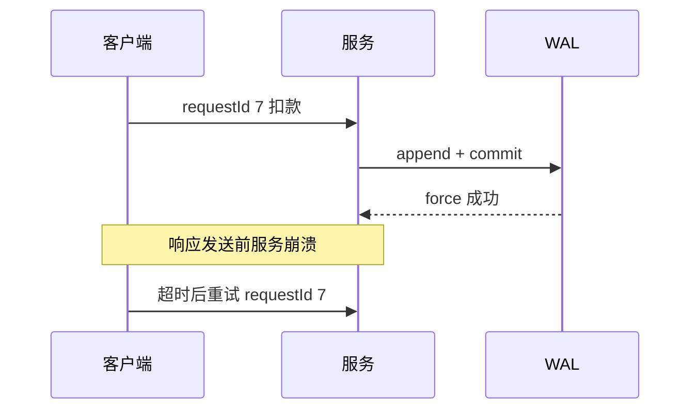

客户端看到超时，却无法从超时本身判断：

- 请求根本没进入系统；
- 日志只写了一部分；
- 事务已经 durable commit，只是响应丢失。

这是分布式交互的**结果未知**窗口，不是多调一次 fsync 就能消除。安全重试需要持久的 `requestId` 去重表，并让业务结果与去重结果进入同一原子状态：

```text
requestId -> COMPLETED(resultHash, resultPayload)
```

重复请求查到已完成结果时返回缓存结果，而不是再次执行状态变化。

#### 外部副作用要用 outbox/inbox

若事务还要发 Kafka、调用支付 API 或发邮件，本地 WAL 的 commit record 无法回滚另一个系统。常见办法是把“业务状态变化”和“待发送事件”写进同一数据库事务：

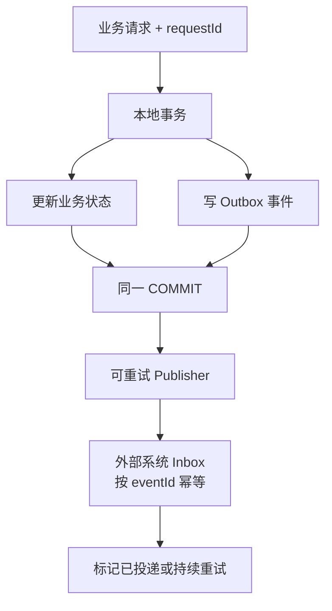

这提供的是“至少一次投递 + 幂等消费”的可恢复闭环，不应偷换成任意外部世界的绝对 exactly-once。Publisher 在发送成功、标记 outbox 前仍可能崩溃，所以外部接收方必须能识别重复；若外部系统不能幂等，也要接受人工对账、补偿或更强事务协调的成本。

## 7. 用崩溃测试证明可恢复性

只用 `kill -9` 测过，不代表断电安全。它主要验证进程退出，内核 page cache 仍可能把未 force 数据继续写盘，从而让实现显得比真实承诺更可靠。

至少分三层测试：

1. **进程级**：在每个代码边界 kill 进程；
2. **内核级**：强制重启或 panic，验证 page cache 丢失；
3. **电源/设备级**：在目标硬件或可控故障平台切电，验证控制器和设备缓存。

### 每个持久化边界都要能注入 crash

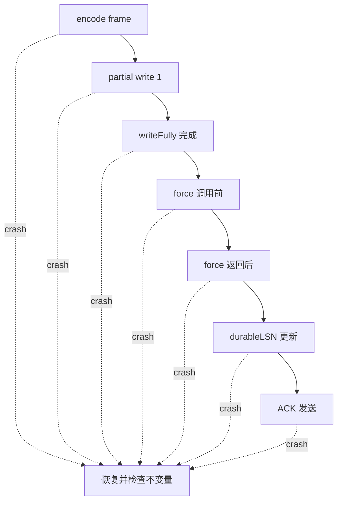

还要覆盖：

- short write、连续返回 0、EINTR；
- ENOSPC、EDQUOT、只读文件系统；
- EIO 延迟到 force 才出现；
- force 卡住及其 watchdog/隔离策略；
- segment 尾部截断、归零、随机翻位；
- record 跨页、跨 sector、跨 segment；
- segment header、manifest 或 checkpoint 损坏；
- rename 前后与目录同步前后的崩溃；
- 恢复过程中再次崩溃；
- 归档缺一个 segment、重复 segment、错误 timeline；
- 日志盘满导致不能记录 undo/CLR 的场景。

### 真正要断言的是不变量

每次故障恢复后至少验证：

- 所有已返回 durable ACK 的事务都存在；
- 未 ACK 的事务可以存在或不存在，但状态必须等价于某个合法 committed prefix；
- 没有半个事务进入可见业务状态；
- 第一个坏 frame 之后不会误解析并应用；
- LSN 不回退、不重复映射到不同内容；
- 恢复多次得到相同状态；
- loser transaction 全部撤销或按该系统设计被忽略；
- 去重表与业务状态位于同一恢复边界；
- checkpoint/manifest 指向的文件集合完整；
- 恢复时间与 WAL 保留空间满足 RTO/RPO。

用 property-based test 或确定性故障注入时，可以把每个持久化动作编号，在第 N 个动作后崩溃，遍历所有 N。这样比“随机 kill 几次看起来没坏”更接近证明。

## 8. WAL 的保证边界

WAL 不是“一个永远追加的文件”，而是一份可恢复协议的证据链：

1. 为每次状态变化建立有序、可校验的日志记录；
2. 在数据页写回前，先稳定恢复所需日志；
3. 在返回持久提交成功前，先稳定 commit record 与依赖前缀；
4. 崩溃后只信任最长合法持久前缀；
5. 用事务元数据、LSN 与恢复算法得到合法已提交状态；
6. 用 checkpoint 缩短恢复，但只在所有恢复需求都越过后截断；
7. 用复制、备份、PITR、幂等和 outbox 处理 WAL 责任之外的故障。

一句话收束：

> WAL 保证的不是“任何东西都不丢”，而是让系统能证明：在它承诺覆盖的故障模型里，哪些变化已经不可丢，哪些变化必须撤销，崩溃后应从哪一个合法前缀继续。

下一章进入 [《分布式时间》](/signal-grid-blog/posts/distributed-systems-time-clocks-ordering-and-leases/)：先解释为什么墙钟、逻辑顺序、超时与 Lease 不能互相替代；再由 [一致性模型](/signal-grid-blog/posts/consistency-models-linearizability-serializability-and-real-time-order/) 定义 history 与 API 承诺；随后用[复制协议设计空间](/signal-grid-blog/posts/replication-protocol-design-space-primary-backup-quorum-chain-smr/)比较多种复制和确认路径，最后由 [Raft 论文精读](/signal-grid-blog/posts/raft-consensus-leader-election-log-replication-and-safety/) 深入任期、选举、日志匹配与多数派提交。

## 官方资料

- [IBM Research：ARIES 论文页面](https://research.ibm.com/publications/aries-a-transaction-recovery-method-supporting-fine-granularity-locking-and-partial-rollbacks-using-write-ahead-logging)
- [ARIES 原论文 PDF](https://cs-people.bu.edu/mathan/reading-groups/papers-classics/aries.pdf)
- [PostgreSQL 18：Write-Ahead Logging](https://www.postgresql.org/docs/18/wal-intro.html)
- [PostgreSQL 18：Reliability](https://www.postgresql.org/docs/18/wal-reliability.html)
- [PostgreSQL 18：Asynchronous Commit](https://www.postgresql.org/docs/18/wal-async-commit.html)
- [PostgreSQL 18：WAL Configuration](https://www.postgresql.org/docs/18/wal-configuration.html)
- [PostgreSQL 18：WAL Settings](https://www.postgresql.org/docs/18/runtime-config-wal.html)
- [PostgreSQL 18：Continuous Archiving and PITR](https://www.postgresql.org/docs/18/continuous-archiving.html)
- [JDK 25：FileChannel](https://docs.oracle.com/en/java/javase/25/docs/api/java.base/java/nio/channels/FileChannel.html)
- [JDK 25：MappedByteBuffer](https://docs.oracle.com/en/java/javase/25/docs/api/java.base/java/nio/MappedByteBuffer.html)
- [JDK 25：Synchronized I/O File Integrity](https://docs.oracle.com/en/java/javase/25/docs/api/java.base/java/nio/file/package-summary.html#synchronized-io-file-integrity)
- [Linux man-pages：fsync / fdatasync](https://man7.org/linux/man-pages/man2/fsync.2.html)
- [Linux man-pages：rename](https://man7.org/linux/man-pages/man2/rename.2.html)
- [Linux Kernel：Writeback Cache Control](https://docs.kernel.org/6.10/block/writeback_cache_control.html)
