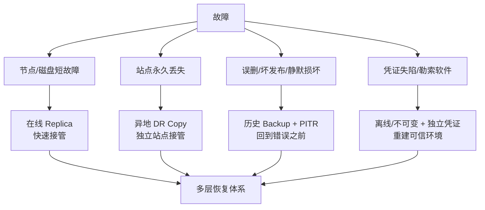
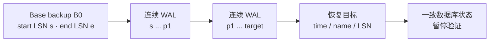
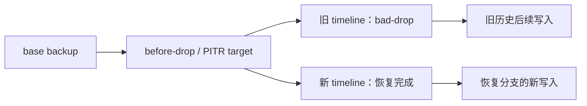
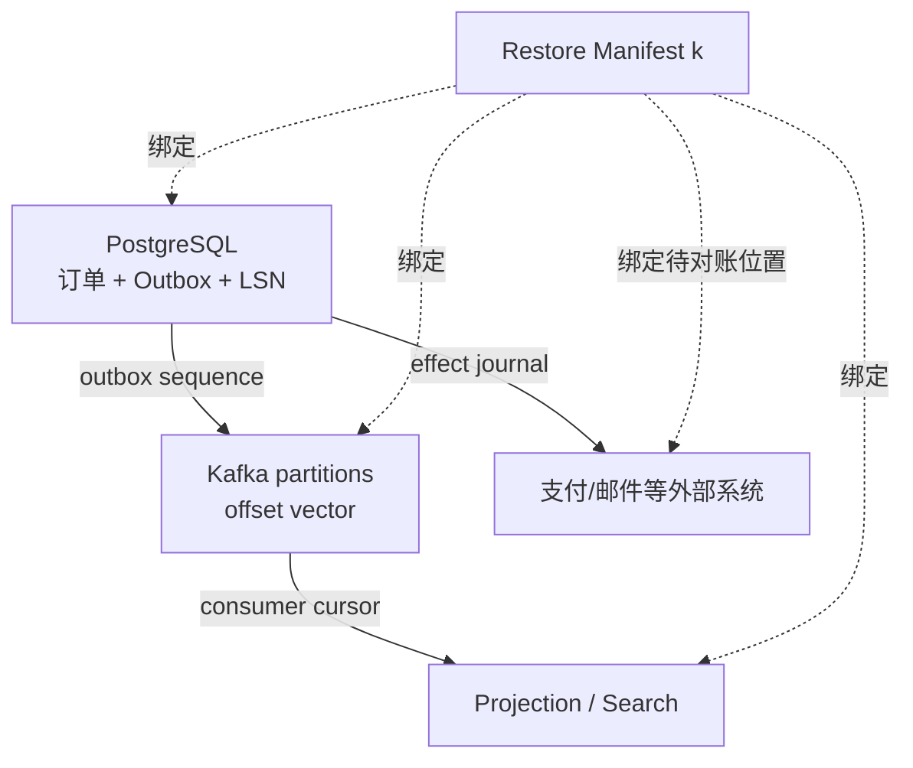
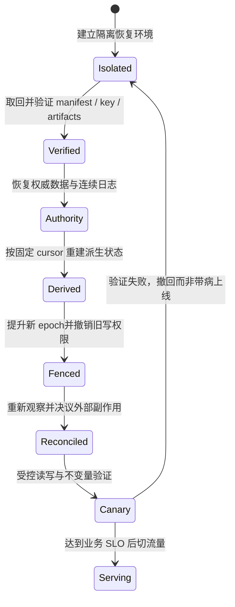

“我们有三个副本”是高可用回答，不是备份回答。

Leader 把一条误删除命令正确复制给两个 Follower，三个副本会一致地丢数据；勒索软件拿到与生产相同的对象存储凭证，会把原件和“备份”一起加密；应用把损坏页面写入复制流，异地集群也可能忠实接收；加密数据复制得再完整，唯一解密密钥丢失后仍然不可恢复。

副本的目标是让服务在部分组件失败时继续前进，备份的目标则是保留一个**不随当前错误一起变化的历史恢复点**。两者都重要，却对抗不同故障。

真正的备份系统不是一个定时复制任务，而是一条可验证的恢复链：

```text
威胁模型
  → 隔离且有保留历史的恢复材料
  → 一致的多组件恢复点
  → 可解析的代码、Schema、配置、身份与密钥
  → 有 fencing 的恢复顺序
  → 外部副作用对账
  → 在目标时间内完成的恢复演练证据
```

本文是“有状态系统可靠性”学习路径的 Chapter 15，承接 [WAL 到底保证什么](/signal-grid-blog/posts/write-ahead-log-durability-and-crash-recovery/)、[分布式快照与一致检查点](/signal-grid-blog/posts/distributed-snapshots-consistent-checkpoints-barriers-recovery-cursors/) 和 [Recovery Frontier](/signal-grid-blog/posts/history-retention-recovery-frontier-log-truncation-dedup-gc/)。它们分别解释单机怎样重放、状态与输入 cursor 怎样形成 consistent cut，以及哪些历史仍属于恢复依赖；本文把故障范围扩展到磁盘永久损坏、整站丢失、误操作、静默损坏、凭证失陷和勒索软件。ZooKeeper 与 Kafka 只作为产品案例，协议结论保持通用。

## 1. 先画威胁模型：Replica、DR Copy 与 Backup 回答不同问题

系统是否“有备份”，不能看存储里有几份字节，而要看每份材料对目标故障是否仍然独立、可读、可信。

### 在线副本优先解决可用性

复制协议通常追求低延迟和自动故障转移：

- Primary/Leader 接受写入；
- 更新近实时传播给 Follower；
- 节点或单盘故障时，仍存活的成员接管；
- 正确性由 quorum、term/epoch 和日志匹配等协议约束。

它非常适合机器宕机、单盘损坏和计划维护。但“近实时传播”也意味着逻辑错误会近实时传播。副本常与生产共享管理员、控制面、软件版本和网络路径，还可能位于同一电源、机架或云账号；这些相关故障会同时击穿多份数据。

### 异地 DR Copy 优先缩小站点故障的 RTO/RPO

跨地域 standby、Kafka MirrorMaker 或异步数据库复制把故障域拉远。它们可以在机房丢失时快速接管，也是灾难恢复的重要材料。但异步镜像仍处于**在线复制关系**：

- 数据存在复制 lag；
- 删除、坏数据和被授权的恶意写入可能继续传播；
- failover 后会产生新的写入历史，回切需要处理分叉；
- 目标集群的配置、ACL、消费位点或外部依赖未必与数据同步；
- 共用身份系统、云组织或 KMS 时，所谓“异地”不等于权限隔离。

所以 DR copy 可以是恢复层的一部分，却不能自动替代保留历史的隔离备份。

### 备份优先解决回到过去

备份至少要拥有四个性质：

1. **有界恢复点**：能说清它对应哪个已提交状态，而不是“昨晚某个目录”；
2. **保留历史**：当前数据被覆盖或删除后，旧 generation 仍在；
3. **故障域与权限隔离**：生产写者不能顺手改掉全部恢复副本；
4. **可验证、可解释**：manifest、checksum、日志链、版本和密钥足以让目标软件完成恢复。



一份对象位于另一个 bucket，并不天然满足这些条件。如果生产管理员能删除它、生命周期规则能把所有 generation 一起清掉、manifest 与数据能被同一攻击者同时改写，或 KMS key 只存在于原站点，它只是“另一份在线数据”。

### 用故障矩阵而不是副本数量作答

| 故障                | 在线同集群副本     | 异地在线镜像             | 隔离历史备份                 |
| ------------------- | ------------------ | ------------------------ | ---------------------------- |
| 单节点宕机          | 通常直接覆盖       | 能覆盖但接管更慢         | 能恢复但 RTO 往往更长        |
| 单站点永久丢失      | 同站副本一起失效   | 若故障域独立，可快速接管 | 若异地且材料完整，可重建     |
| 应用误删            | 删除通常被复制     | 可能继续镜像             | 可恢复到误删前               |
| 延迟发现的静默损坏  | 好副本可能已被覆盖 | 可能已经传播             | 需要足够长历史与校验         |
| 勒索软件/控制面失陷 | 常被同权攻击       | 共用凭证时仍危险         | 需不可变/离线和独立授权      |
| 加密密钥永久丢失    | 密文副本无用       | 密文镜像无用             | 只有可恢复密钥与元数据才有用 |

[CISA #StopRansomware Guide](https://www.cisa.gov/stopransomware/ransomware-guide)明确建议维护离线、加密备份并定期测试可用性与完整性，也解释了原因：许多勒索软件会寻找并删除或加密可访问备份。这里的重点不是机械追求“离线”标签，而是让一次生产凭证失陷无法同时摧毁全部历史。

## 2. RPO/RTO 是业务目标，必须用恢复证据测量

[NIST SP 800-34 Rev.1](https://csrc.nist.gov/pubs/sp/800/34/r1/upd1/final)把 Recovery Point Objective（RPO）定义为中断后数据必须恢复到的时间点，把 Recovery Time Objective（RTO）定义为系统组件能够处于恢复阶段、尚不至于影响业务使命的总体时长。

工程上可以把它们转成两个问题：

- **RPO**：这次故障后，最坏会丢掉多新的已承诺数据？
- **RTO**：从业务不可接受地中断开始，到服务重新达到约定能力，最多允许多久？

### RPO 不是备份任务间隔

“每 24 小时做一次 full backup”不必然意味着 RPO 是 24 小时。如果 base backup 后持续归档 WAL，且最后一段 WAL 已经安全到达独立存储，PITR 可能把恢复点推进到几分钟前。反过来，即使每分钟做 snapshot，只要 snapshot 依赖同一个易失控制面，或最近 12 小时全部损坏，可达 RPO 仍可能远差于一分钟。

设事故发生前的最后权威提交前沿为 `P_incident`，经过实际 restore 验证的最新可恢复前沿为 `P_restore`。若业务能把单调序列位置可靠映射到提交时间 `t(P)`，一次演练的观测数据损失年龄可以写成：

```text
RPO_observed = t(P_incident) - t(P_restore)
```

这里应优先记录 WAL LSN、Kafka `(topic, partition, offset)`、ZooKeeper zxid、账本 sequence 等单调身份，再附 UTC 时间用于人类解释。只比较两台机器的文件时间，会重新掉进分布式墙钟误差。

多组件系统没有一个天然标量 `P_restore`。它更像一组满足因果约束的恢复向量：

```text
P_restore = {
  postgresTimelineAndLSN,
  kafkaPartitionOffsets,
  zookeeperZxid,
  projectionCursors,
  externalEffectJournalPosition
}
```

不能分别选每个组件“最新”的点再拼接；它们必须共同形成 consistent cut。

### RTO 不在进程启动时停止计时

如果数据库已启动，但 Schema 不兼容、消费 backlog 尚未追平、旧 Primary 仍能写、支付副作用未对账、DNS 只切了一半，业务并未恢复。

一次端到端 RTO 先由两个业务事件定义：

```text
RTO_observed = T_service_SLO_reached - T_unacceptable_disruption_started
```

这段区间的关键路径包含 detect/declare、可信环境 provision、backup fetch/verify、base restore、log replay、validate/reconcile、fence/cutover 和恢复到 service SLO。部分阶段可以并行，所以不能机械地把每个 wall-clock duration 相加；但也不能把任何仍阻塞业务就绪的阶段从关键路径测量里删掉。RTO 的结束条件必须是业务化的，例如“写 API 达到 99% 成功率、关键读模型追到指定 cursor、旧站点写入全部被 fence”，而不是 `systemctl` 返回 0。

### 日志重放吞吐决定大数据集的恢复下限

若恢复时需要重放 backlog `B`，重放吞吐为 `r_replay`：

```text
停写恢复：T_replay >= B / r_replay

继续接收新流量：T_catchup >= B / (r_replay - r_ingress)
                 前提是 r_replay > r_ingress
```

当 `r_replay <= r_ingress` 时，系统永远追不上。这解释了为什么仅测“平时复制 lag 很小”不足以证明 RTO：灾难时可能同时发生冷缓存、限流、跨区下载、密钥审批和大段日志重放。

| 声明          | 需要的最小证据                                 | 常见伪证据              |
| ------------- | ---------------------------------------------- | ----------------------- |
| RPO ≤ 5 分钟  | drill 中最后已验证业务 sequence 与事故前沿之差 | backup job 最近成功时间 |
| RTO ≤ 30 分钟 | 从注入故障到达到业务 SLO 的完整时间线          | 数据库进程启动耗时      |
| 可跨站点恢复  | 独立站点实际读取备份、密钥并启动               | 控制台显示“已复制”      |
| 可抵抗误删    | 从误删前 generation 成功恢复                   | 当前 replica 正常       |

目标是预算；演练数据才是能力。一次成功的最好值也不是最坏承诺，至少要保留数据规模、backlog、限流、并发故障与版本等实验条件。

## 3. Base Backup、连续日志与 Timeline 共同定义 PITR

PITR（Point-in-Time Recovery）不是“从 WAL 文件里找到某一秒”。它需要一个可启动的基线，加上一条从基线覆盖到目标点、连续且可验证的变更历史。

### PostgreSQL 18：Base Backup 是起点，WAL 是路径

[PostgreSQL 18 Continuous Archiving 文档](https://www.postgresql.org/docs/18/continuous-archiving.html)给出的模型很清楚：恢复一个连续归档备份，需要 base backup，以及至少从该 backup 开始位置起连续覆盖目标点的 archived WAL。



两边缺一不可：

- 只有 WAL，没有包含所需关系文件和系统目录的基线，不能从无限久以前凭空重建；
- 只有 base backup，最多回到该 backup 能恢复出的起点，之后提交会丢；
- WAL 中间缺一个必需 segment，不能跳过去继续声称恢复到更晚位置；
- 目标点必须晚于 base backup 完成点；要恢复到 backup 进行期间的更早时刻，必须选更早的 base backup；
- `pg_dump` 是逻辑备份，不含连续归档恢复所需的文件级信息，不能作为这套 WAL replay 的 base backup。

PostgreSQL 的 online base backup 可以在文件变化时复制，因为恢复所需 WAL 会修正内部不一致；这是一项数据库协议能力，不是“任何活跃数据目录都能直接 `cp`”的通用许可。

### Timeline 防止 PITR 后的新历史覆盖旧历史

恢复到过去并重新接受写入后，系统从旧历史分叉。PostgreSQL 会创建新的 timeline，并归档 timeline history file，记录从哪个 timeline、哪个位置分支。



恢复 manifest 必须保存 timeline 身份和 history files。盲目使用“数字最大的 WAL 文件”可能走到错误分支；`recovery_target_timeline` 的 `latest`、`current` 或明确 timeline ID 各有不同语义。重复试恢复时尤其要固定想走的历史，而不是让目录里偶然存在的最新 timeline 替你决定。

### Kafka 和 ZooKeeper 的恢复材料不是“拷贝数据目录”四个字

Kafka 的业务历史按 topic partition 分散，还依赖 topic 配置、分区数、ACL、consumer group offsets、生产者/事务身份以及应用 Schema。Kafka 官方把 MirrorMaker 2 定义为跨集群镜像：它消费源集群并生产到 remote topic，还能生成源 offset 到目标 offset 的 checkpoint、同步部分配置和 ACL。checkpoint 记录不等于目标集群的 `__consumer_offsets` 已经更新；`sync.group.offsets.enabled` 默认关闭，而且同步 group offset 只适用于目标 group 不活跃的场景。它是异步 DR 数据流，不是一个冻结的多组件 backup generation；复制 lag、过滤规则、offset translation generation 和目标端已有写入都必须进入恢复证明。

对 Kafka 应用而言，恢复点至少是每个权威 partition 的 offset 向量，加上 consumer/projection cursor 和外部副作用位置。仅有 broker log 目录，未证明新的集群身份、元数据与应用消费者能在同一位置安全接续。

ZooKeeper 3.9.5 则明确区分 snapshot 和 transaction log。其管理员文档指出，生成 snapshot 时仍可能继续向旧 transaction log 追加，因此比 snapshot 更新的事务可能位于“snapshot 之前编号的最后一个日志文件”里，清理时不能只按文件名大小猜测依赖。

[ZooKeeper 3.9.5 Snapshot and Restore Guide](https://zookeeper.apache.org/doc/r3.9.5/zookeeperSnapshotAndRestore.html)提供了灾难性丢失 quorum 后的原生恢复流程：从具有最高 zxid 的在线成员取 snapshot；恢复 ensemble 时所有成员使用同一 snapshot，恢复前阻断客户端流量并保留原 `dataDir`/`dataLogDir`。这是该版本产品协议，不等于任意复制协调系统都能用单节点文件恢复。

磁盘恢复也不会把旧客户端 session 原样延续成安全运行状态。旧 session、ephemeral owner 和 watch 必须按事故边界过期或失效；客户端以新 session 重建 ephemeral 节点、watch、选举参与者和本地缓存，并通过业务 readiness 后，才允许恢复站点开放流量。

## 4. 多组件系统必须发布一个一致 Restore Manifest

一个真实服务很少只有 PostgreSQL。订单 API 可能写数据库 Outbox，Relay 发往 Kafka，流作业更新 Projection，ZooKeeper 保存协调状态，支付网关位于系统边界之外。各组件独立成功备份，不代表它们能共同恢复。

### “每个组件最新”经常构成不可能世界

设事务 `T42` 在 PostgreSQL 中写订单和 Outbox；Relay 把它发布到 Kafka；消费者据此更新 Projection。

若恢复时：

- PostgreSQL 回到 `T41`，订单 `T42` 不存在；
- Kafka 却恢复到已包含 `T42`；
- Projection 又回到消费 `T41` 后；

消费者重放 Kafka 后会重新制造一个权威库里不存在的订单投影。反过来，若 PostgreSQL 有 `T42` 而 Kafka 和 Outbox relay cursor 都越过了它，事件可能永久不再发布。



一致恢复有两条常见路线：

1. **协调切面**：短暂停写或使用 Barrier，让每个 authority 发布同一 generation 的 cursor 与状态；
2. **权威日志 + 确定性重建**：只把权威数据库/日志恢复到一致前缀，丢弃 Projection，再从 manifest 中记录的 cursor 重建。

第二条通常更简单，但前提是所有派生状态真的可重建、权威日志保留足够久、重建吞吐满足 RTO，外部副作用也有独立 journal 可对账。

### Restore Manifest 是恢复提交记录

一份教学化 manifest 可以长这样：

```yaml
restoreGeneration: dr-2026-08-18-001
createdFromEpoch: prod-481
authorities:
  postgres:
    systemIdentifier: "748..."
    engineMajor: 18
    runtimeImage:
      uri: "oci://registry.example/postgres@sha256:..."
      digest: "sha256:..."
    baseBackup:
      uri: "s3://immutable-backups/pg/base-20260818-1200/"
      manifestDigest: "sha256:..."
    walArchive:
      timeline: 7
      startLsn: "49F/00000000"
      endLsn: "4A2/8F001C20"
      signedIndexUri: "s3://immutable-backups/pg/wal/index-7-49f-4a2.json"
      signedIndexDigest: "sha256:..."
      objectUriTemplate: "s3://immutable-backups/pg/wal/%f"
      timelineHistory:
        uri: "s3://immutable-backups/pg/wal/00000007.history"
        digest: "sha256:..."
    timeline: 7
    targetLsn: "4A2/8F001C20"
    extensions:
      manifestUri: "s3://immutable-backups/contracts/pg-extensions-18.json"
      digest: "sha256:..."
    locale: "C.UTF-8"
    tablespaceMap:
      uri: "s3://immutable-backups/contracts/pg-tablespaces.json"
      digest: "sha256:..."
  kafka:
    sourceClusterId: "source-MkU..."
    targetClusterId: "dr-q91..."
    consumerGroup: "order-projection"
    replicationConfig:
      generation: "mm2-config-481"
      uri: "s3://immutable-backups/contracts/mm2-config-481.json"
      digest: "sha256:..."
    offsetCheckpointRecord:
      topic: "source.checkpoints.internal"
      partition: 0
      nextRecordOffset: 7722
      immutableCheckpointUri: "s3://immutable-backups/kafka/mm2-checkpoint-7721.bin"
      immutableCheckpointDigest: "sha256:..."
    partitions:
      - sourceTopic: "orders"
        sourceTopicId: "nZ..."
        remoteTopic: "source.orders"
        targetTopicId: "Qp..."
        partition: 0
        nextSourceOffset: 918244
        nextTargetOffset: 917990
  zookeeper:
    zxid: "0x7000012ab"
    snapshotUri: "s3://immutable-backups/zk/snapshot.7000012ab"
    snapshotDigest: "sha256:..."
    ensembleConfigUri: "s3://immutable-backups/zk/ensemble-481.cfg"
    ensembleConfigDigest: "sha256:..."
derivedState:
  orderProjectionCursor:
    clusterId: "dr-q91..."
    topic: "source.orders"
    topicId: "Qp..."
    partition: 0
    nextOffset: 917990
externalEffects:
  paymentJournalSequence: 771902
artifacts:
  applicationImage:
    uri: "oci://registry.example/app@sha256:..."
    digest: "sha256:..."
  schema:
    uri: "s3://immutable-backups/contracts/schema-481.json"
    digest: "sha256:..."
  config:
    uri: "s3://immutable-backups/contracts/config-481.json"
    digest: "sha256:..."
keyReferences:
  backupKey:
    provider: "kms"
    account: "recovery-security"
    region: "ap-east-1"
    keyId: "backup-kek"
    version: "v12"
    recoveryAuthorizationRef: "runbook://key-recovery/v5"
  databaseTlsCa:
    objectUri: "vault://recovery/pki/db-ca/v4"
    digest: "sha256:..."
```

它不是把所有 secret 明文塞进 YAML。`keyReferences` 记录 provider、控制域、不可变版本和恢复授权；密钥材料本身由独立、受审计的 key recovery 机制保管。每个可恢复对象都必须同时有可解析的 locator 与 digest，不能只留下一个人类可读 ID。WAL 的 signed index 要把 timeline、起止 LSN 和逐对象摘要绑定起来；Kafka 的 group、checkpoint record 位置、源/目标“下一条 offset”和复制配置 generation 也必须成组解释，不能把源 offset 裸抄到目标 consumer group。MM2 内部 checkpoint topic 是 compacted live state，历史 record 可能被清理；因此 topic/partition/offset 这里只作为 provenance，真正让这个 restore generation 长期可恢复的是额外导出的不可变序列化 record 及其 digest。若不导出，就必须另行证明内部 topic 的 retention floor 覆盖整个备份寿命。

只有当 manifest 及其引用的全部对象稳定、校验通过后，generation 才能发布为 `RESTORABLE`。上传了 99% 的 base backup、缺一个 WAL segment、某个 partition cursor 未落盘，都只能留在 `PENDING/INVALID`。

### 数据之外还有五类常被漏掉的恢复依赖

| 依赖                    | 缺失后的症状                     | 恢复时需要的证据                   |
| ----------------------- | -------------------------------- | ---------------------------------- |
| Schema/serializer       | 字节在，当前程序无法解释         | schema ID、迁移器、兼容测试        |
| 配置/feature flags      | 同一数据产生不同业务行为         | 审计过的配置版本与摘要             |
| 身份/epoch              | 新旧集群互相接入或旧 writer 复活 | cluster ID、node ID、fencing epoch |
| Secret/trust roots      | 无法认证依赖，或误连生产         | 独立恢复的证书、CA、凭证版本       |
| Encryption key material | 完整密文永久不可读               | 可演练的 KEK/DEK 恢复路径与授权    |

[NIST SP 800-57 Part 1 Rev.5](https://csrc.nist.gov/pubs/sp/800/57/pt1/r5/final)把 key backup、archive 与 recovery 纳入密钥生命周期。这里存在不可绕过的边界：若唯一解密材料永久丢失且无法重建，checksum 可以证明密文一字未变，却不能把它变回数据。

把所有 key 与备份放进同一个账号也不安全。合理设计需要同时满足两件看似相反的事：生产控制面失陷时攻击者不能销毁/导出全部恢复密钥；真正灾难发生时，经授权的恢复团队又能在 RTO 内取得所需 key version。只有演练能证明这两个条件不是纸面流程。

## 5. 恢复顺序必须先建立权威与 Fencing，再开放流量

恢复并不是“每个组件并行启动越快越好”。依赖关系和写入权决定顺序。

一个稳健的恢复状态机是：



### 隔离环境先于数据恢复

如果事故可能来自凭证失陷或恶意发布，直接在原账号、原镜像、原网络恢复，会把攻击者和故障一起带回来。先建立可信控制面、受限出口、干净运行时和可审计的临时身份，再让恢复实例读取备份。

恢复验证阶段默认禁止向支付、邮件、撮合、生产 Kafka 等真实外部端点写入。否则一次 drill 本身就会制造真实副作用。

### 先恢复 authority，再恢复可重建 projection

权威账本、订单事实或配置日志要先达到 manifest 的恢复前沿；索引、缓存、搜索、物化视图随后从固定 cursor 重建。若 projection 自称比 authority 更新，不能把它反向“补”进权威库，除非系统本来就有明确的双向协议。

Kafka、数据库和 ZooKeeper 谁先启动没有普适的产品顺序，取决于依赖 DAG。普适规则是：上游 authority 必须先固定恢复 generation，下游只能从 manifest 指定位置读取，不能自行选择 `latest`。

### 外部副作用必须对账，不能随数据库一起倒带

PITR 能把本地订单状态退回 10:00，却不能让银行自动忘记 10:01 已经扣过款，也不能撤回邮件。恢复后每个 effect ID 都可能处于三态：

- 本地与外部都确认已提交；
- 双方都确认未执行；
- 请求已发出但响应丢失，结果未知。

第三类可以在隔离环境里先做只读观察，但必须在旧站点和旧凭据被 fence 后重新查询，再按稳定 idempotency key 或 Drop Copy、支付账单、对账文件等权威事实补齐；否则观察结束后旧 writer 仍可能制造新副作用。把“本地没有记录”解释成“外部没有执行”，会造成双扣；把“可能执行过”解释成“一定成功”，又会漏业务。详细协议见[跨系统副作用](/signal-grid-blog/posts/cross-system-side-effects-idempotency-outbox-inbox-2pc-saga/)。

### DNS 与负载均衡只能导流，不能 Fencing

DNS TTL、连接池和长连接会让旧地址继续被访问；网络分区也可能让原 Primary 在另一侧活着。切 DNS 不会撤销旧进程写权限。

在恢复站点接受写入或据此修复外部副作用前，所有权威 Sink 必须接受新的单调 epoch/fencing token，并拒绝旧 epoch；旧站点的数据库角色、云凭据、支付/API 凭据和消息生产权限也要撤销或隔离。可以由共识租约、存储端 generation、数据库角色撤销或云级隔离实现，但判定必须落在**接收写入的一侧**。如果无法证明旧站点已断电或被 fence，新站点只能保持只读，不能冒险形成双主。

## 6. Corruption、Ransomware 与 Operator Error 要求历史和信任分层

硬件故障通常告诉你“现在坏了”，逻辑损坏和入侵却可能潜伏很久。发现时间 `T_detect` 不等于首次受损时间 `T_compromise`。若只保留最近两份备份，二者都可能已经包含后门或损坏数据。

### Retention 必须覆盖发现延迟

备份保留窗口至少要考虑：

```text
所需历史窗口 >= 最坏发现延迟 + 调查/选点时间 + 恢复演练时间
```

这不是鼓励无限保留。历史越长，成本、隐私义务和密钥生命周期越复杂；应由威胁模型、法规与业务损失共同决定 generation 密度和保留层级。

Operator error 也不只是一条 `DROP TABLE`。错误的 retention policy、自动清理脚本、Schema migration、ACL 变更和 KMS rotation 都可能摧毁恢复链。删除旧 base backup 前，必须知道是否有增量备份、WAL range、timeline history 或 manifest 仍依赖它。

### 不可变不是单一开关

对象锁/WORM 能阻止在保留期内覆盖或删除对象，但以下问题仍可能存在：

- 攻击者在备份生成前污染数据；
- 攻击者控制 backup job，停止创建新 generation；
- manifest 与签名/摘要一起被替换；
- KMS 管理员删除或禁用解密 key；
- 同一地域、账号或计费关系整体不可用；
- 保留期结束后自动删除，而入侵尚未被发现。

所以不可变存储要与独立凭证、跨故障域副本、监控“未产生新备份”、安全保存的 manifest 摘要和 key recovery 组合。

### Backup verification 有五个递进层次

| 层次                   | 能证明什么                       | 仍不能证明什么                 |
| ---------------------- | -------------------------------- | ------------------------------ |
| Inventory              | 对象数量、大小、range 看起来完整 | 内容未损坏                     |
| Cryptographic checksum | 字节匹配受信 manifest            | manifest 本身可信、软件能读取  |
| Log-chain parse        | 必需日志存在且格式可解析         | 回放后的业务语义正确           |
| Engine restore         | 目标版本能启动并完成 recovery    | 应用、外部依赖和业务不变量正确 |
| Service drill          | 真实依赖顺序、对账和 SLO 闭环    | 未覆盖的故障与更大数据规模     |

PostgreSQL 18 的 [`pg_verifybackup`](https://www.postgresql.org/docs/18/app-pgverifybackup.html)会检查 `backup_manifest`、文件清单/大小/checksum，并在 plain-format backup 上解析恢复该 backup 所需的 WAL range。官方文档同时明确提醒：工具无法覆盖服务器实际使用 backup 时的全部检查，仍然必须做 test restore 并验证数据库包含预期数据。

还有一个对抗性边界：若攻击者能同时修改数据和 manifest，普通 checksum 只能证明二者彼此一致，不能证明它们与可信历史一致。manifest digest 或签名需要存入攻击者不能一起改写的控制域。

## 7. 一个有边界的 PostgreSQL 18 恢复演练

下面不是适用于所有产品的“万能清单”，而是一个刻意收窄的实验：在无生产出口的隔离网络，把一份 PostgreSQL 18 plain-format base backup 恢复到预先创建的 named restore point，并收集数据库 RPO 与恢复阶段耗时。它验证 PostgreSQL 恢复链，不声称覆盖 fencing、Kafka、ZooKeeper、外部支付、切流，也不产出端到端 RTO。

### 实验合同

| 项目       | 固定条件                                                                                        |
| ---------- | ----------------------------------------------------------------------------------------------- |
| 输入       | `backup_manifest`、plain base backup、独立 WAL archive、明确 timeline                           |
| 目标       | `before_bad_migration_20260818` named restore point                                             |
| Tablespace | 本实验限定无用户 tablespace，`pg_tblspc` 必须为空；有 tablespace 时改用单独的受信映射流程       |
| 隔离       | 恢复主机无生产写出口，使用 drill 专用证书与角色                                                 |
| 失败策略   | checksum/WAL 缺口/目标不可达立即失败，不回退到“尽量新的点”                                      |
| 成功条件   | 到达目标并保持 recovery pause；关键表不变量、业务 sequence 和 Schema 摘要匹配；未产生外部副作用 |
| 时间证据   | 分别记录 fetch、verify、replay 与数据库验证耗时；完整 RTO 留给包含 fencing、对账和切流的演练    |

演练前，生产侧在变更前创建具名恢复点，并把返回 LSN 写入审计记录：

```sql
SELECT pg_create_restore_point('before_bad_migration_20260818');
```

具名点仍依赖连续 WAL 被成功归档；它只是 WAL 中的标记，不会替你复制日志。演练开始前必须证明 `base backup end LSN < restore-point LSN`，目标 timeline 是 base timeline 的同一分支或可达后代，并且两点之间的 WAL 与 timeline history 连续可读；否则这个 target 从所选 base 根本不可达。

### 在一次性工作目录展开并验证，不修改唯一备份

先验证不可变 generation，再把它复制到全新的一次性工作目录。示例路径只是占位，实际工具必须记录复制退出码、文件 owner/mode、generation marker 与 tablespace 映射：

```bash
set -euo pipefail

export DRILL_ROOT=/srv/drill/pg18-20260818
export DRILL_PGDATA=/srv/drill/pg18-20260818/data
export SOURCE_BACKUP=/mnt/read-only-backups/pg18/base-20260818-1200
export DRILL_WAL=/mnt/read-only-wal/cluster-a

test -d "$SOURCE_BACKUP"
test -f "$SOURCE_BACKUP/backup_manifest"
test -d "$DRILL_WAL"
test ! -e "$DRILL_ROOT"

install -d -m 0750 -o postgres -g postgres "$DRILL_ROOT"
test ! -e "$DRILL_PGDATA"
test ! -e "$DRILL_ROOT/pg_wal-from-base"

/opt/postgresql/18/bin/pg_verifybackup \
  --wal-directory="$DRILL_WAL" \
  "$SOURCE_BACKUP"

cp -a "$SOURCE_BACKUP" "$DRILL_PGDATA"
test -f "$DRILL_PGDATA/backup_manifest"
test -d "$DRILL_PGDATA/pg_tblspc"
chown -R postgres:postgres "$DRILL_PGDATA"
chmod 0700 "$DRILL_PGDATA"

if ! find "$DRILL_PGDATA/pg_tblspc" -mindepth 1 -print -quit \
  > "$DRILL_ROOT/pg-tablespace-probe.txt"; then
  echo "cannot inspect pg_tblspc" >&2
  exit 1
fi
test ! -s "$DRILL_ROOT/pg-tablespace-probe.txt"

# 复制后、修改工作副本前，再验证真正将要启动的 PGDATA。
/opt/postgresql/18/bin/pg_verifybackup \
  --wal-directory="$DRILL_WAL" \
  "$DRILL_PGDATA"

# 只在 disposable working copy 内隔离 base backup 自带的 pg_wal。
mv "$DRILL_PGDATA/pg_wal" "$DRILL_ROOT/pg_wal-from-base"
install -d -m 0700 -o postgres -g postgres "$DRILL_PGDATA/pg_wal"
```

这个 bootstrap 片段需要由受控的特权恢复任务执行，因为它创建目录并设置 `postgres` owner；后续数据库进程绝不能继续以 root 运行。这里还必须使用与 backup 对应版本的 `pg_verifybackup`/`pg_waldump` 做 WAL 验证。命令非零退出即中止 generation；不要用 `--skip-checksums` 或 `--no-parse-wal` 把红灯改绿。本实验以 `pg_tblspc` 为空作为 fail-closed 前提，因此 `cp -a` 不会把 user tablespace 的绝对链接带回旧环境；若存在 tablespace，必须按受信 map 把每个目录复制到 `DRILL_ROOT/tablespaces/`，重写链接，并验证所有 `realpath` 都位于 disposable root 后再启动。还要从独立保存的未归档 WAL 与 archive 中恢复所需范围。上述移动只允许发生在 disposable copy，绝不能清理唯一备份。tar-format backup 在 PostgreSQL 18 的 WAL verification 有不同限制，不能照抄这段 plain-format 实验。

### 固定 Restore Command、Target 与 Timeline

在 drill 专用配置中写明：

```ini
restore_command = 'cp /mnt/read-only-wal/cluster-a/%f %p'
recovery_target_name = 'before_bad_migration_20260818'
recovery_target_timeline = '7'
recovery_target_action = 'pause'
hot_standby = on
```

然后创建 `recovery.signal` 并启动隔离实例：

```bash
runuser -u postgres -- touch "$DRILL_PGDATA/recovery.signal"
runuser -u postgres -- /opt/postgresql/18/bin/pg_ctl \
  -D "$DRILL_PGDATA" \
  -l "$DRILL_ROOT/postgresql-recovery.log" \
  start
```

`restore_command` 在文件不存在时必须返回非零；PostgreSQL 会处理某些正常的“请求不存在文件”情形，但若配置了 recovery target 而 archive 在到达目标前结束，PostgreSQL 18 会 fatal shutdown，不能把提前停止当成功。示例只适用于未压缩 WAL；若归档使用 gzip、zstd 或加密封装，命令必须先校验并解压/解密到 `%p`，不能照抄 `cp`。

`recovery_target_action = 'pause'` 让实例在目标点停住供查询验证。不要在验证前 `promote`，否则会产生新 timeline，使重复实验和选择历史更复杂。

### 等待确实暂停在目标，再用业务不变量验收

实例启动和 `pg_is_in_recovery() = true` 都不表示已到目标；hot standby 可能在 replay 途中就允许查询。测试 harness 必须用本机单调时钟设置上限，循环检查进程仍存活与 `pg_get_wal_replay_pause_state()`，只有观察到 `paused` 才继续；超时或进程提前退出立即失败：

```text
deadline = monotonicNow() + 10 minutes
while monotonicNow() < deadline:
  assert postgres process is alive
  if query("SELECT pg_get_wal_replay_pause_state()") == "paused": break
  wait 1 second
assert pause state == "paused"
```

随后隔离连接至少记录这些事实：

```sql
SELECT pg_is_in_recovery();
SELECT pg_get_wal_replay_pause_state();
SELECT pg_last_wal_replay_lsn();

-- 示例：账本必须逐币种借贷平衡；真实列名按系统 Schema 固定
SELECT currency, SUM(debit_minor) - SUM(credit_minor) AS imbalance
FROM ledger_entries
GROUP BY currency
HAVING SUM(debit_minor) <> SUM(credit_minor);

-- 示例：恢复点之前的迁移存在，错误迁移尚未出现
SELECT version, checksum
FROM schema_history
ORDER BY installed_rank DESC
LIMIT 5;
```

“查询能执行”不够。实验应把 `pg_last_wal_replay_lsn()` 与审计保存的 restore-point LSN 比较，确认目标确实可达；再用目标前后哨兵事实证明停点没有越过。随后把预期业务 sequence、行数分区摘要、账本平衡、Schema checksum 和恢复 LSN 与 restore manifest 对比。账本查询返回任何行、目标 Schema 不匹配、pause state 不是 `paused`、replay LSN 未到审计目标或目标后的错误迁移已经出现，都判失败。

### 形成证据包，演练结束后丢弃恢复实例

证据包至少包含：

```json
{
  "restoreGeneration": "dr-2026-08-18-001",
  "backupManifestSha256": "...",
  "timeline": 7,
  "targetName": "before_bad_migration_20260818",
  "targetLsnObserved": "...",
  "latestBusinessSequenceObserved": 9918821,
  "verifySourceBackupExit": 0,
  "verifyWorkingCopyExit": 0,
  "externalWritesObserved": 0,
  "databaseRpoObservedSeconds": 73,
  "databaseRestorePhaseSeconds": 1400,
  "phaseDurationsSeconds": {
    "detectAndDeclare": 90,
    "provision": 280,
    "fetchAndVerify": 410,
    "restoreAndReplay": 522,
    "validate": 188
  },
  "result": "PASS"
}
```

这些数值只是格式示例，不能拿来当本站系统的能力声明。真实 `databaseRpoObservedSeconds` 必须由事故前沿与恢复业务 sequence 映射计算；`databaseRestorePhaseSeconds` 也只是数据库分项耗时，不是 RTO。只有再纳入 fencing、依赖恢复、外部对账、受控切流并达到安全服务水平，才能记录端到端 observed RTO。

演练实例不成为新的生产 Primary；收集证据后关闭并销毁。若目标是完整 DR cutover drill，还必须另做 Kafka/ZooKeeper 恢复、旧站 fencing、外部 effect reconciliation 和流量回切，不能用这个数据库子实验替代。

## 8. 备份的完成条件，是另一套环境真的恢复过

副本、异地镜像、checkpoint、WAL、base backup、PITR 和灾难恢复不是互斥选项，而是不同时间尺度的层次：

```text
Replica       缩短组件故障的中断
DR Copy       缩短站点故障的接管时间
Checkpoint    缩短计算状态的重放距离
Base + Log    提供可选择的历史恢复路径
Isolated Backup
              抵抗误删、长期损坏与控制面失陷
Restore Drill 把纸面 RPO/RTO 变成观测证据
```

一套可信方案最终必须能回答：

- 针对哪种故障，哪些恢复材料不会一起损坏或被删除；
- 每个 generation 对应哪些 authority cursor、timeline 和外部副作用位置；
- 代码、Schema、配置、身份、secret 与 key material 怎样一起恢复；
- 谁先成为新写入权威，旧 writer 如何被接收端 fence；
- 本地历史倒带后，现实世界里已经发生的付款、成交和消息怎样对账；
- 在真实规模、真实限流和空环境里，最坏 RPO/RTO 证据是什么。

如果这些问题只能由“备份任务昨晚是绿色”回答，系统拥有的是备份文件，不是恢复能力。备份真正完成的时刻，不是上传进度到 100%，而是另一套可信环境使用它恢复到明确位置、验证了业务不变量，并把失败边界与耗时留成可复核证据。下一章继续处理一种更隐蔽的失败：当所有副本都在线但内容已经损坏时，怎样用 [Checksum、Scrubbing、损坏隔离与权威修复](/signal-grid-blog/posts/silent-data-corruption-checksum-scrubbing-isolation-authoritative-repair/) 阻止坏数据扩散到复制链和备份链。

### 一手与官方资料

- NIST，[SP 800-34 Rev.1: Contingency Planning Guide for Federal Information Systems](https://csrc.nist.gov/pubs/sp/800/34/r1/upd1/final)，RPO、RTO 与恢复规划定义。
- CISA，[#StopRansomware Guide](https://www.cisa.gov/stopransomware/ransomware-guide)，离线、加密、不可变备份与定期恢复测试建议。
- NIST，[SP 800-57 Part 1 Rev.5: Recommendation for Key Management](https://csrc.nist.gov/pubs/sp/800/57/pt1/r5/final)，密钥生命周期、backup/archive 与 key recovery。
- PostgreSQL 18，[Continuous Archiving and Point-in-Time Recovery](https://www.postgresql.org/docs/18/continuous-archiving.html)，base backup、连续 WAL、recovery target 与 timelines。
- PostgreSQL 18，[WAL Recovery Configuration](https://www.postgresql.org/docs/18/runtime-config-wal.html#RUNTIME-CONFIG-WAL-RECOVERY)，`recovery.signal`、`restore_command`、target/timeline/action 语义。
- PostgreSQL 18，[pg_verifybackup](https://www.postgresql.org/docs/18/app-pgverifybackup.html)，manifest、文件校验、WAL verification 与 test restore 边界。
- Apache Kafka 4.3，[Geo-Replication with MirrorMaker](https://kafka.apache.org/43/operations/geo-replication-cross-cluster-data-mirroring/)，跨集群 topic/config/group offset/ACL 镜像语义。
- Apache Kafka 4.3，[MirrorMaker Configs](https://kafka.apache.org/43/configuration/mirrormaker-configs/)，checkpoint、offset sync 与 heartbeat 配置边界。
- Apache ZooKeeper 3.9.5，[Snapshot and Restore Guide](https://zookeeper.apache.org/doc/r3.9.5/zookeeperSnapshotAndRestore.html)，灾难性 quorum 丢失后的 snapshot/restore 协议。
- Apache ZooKeeper 3.9.5，[Administrator's Guide](https://zookeeper.apache.org/doc/r3.9.5/zookeeperAdmin.html)，snapshot、transaction log 与持久文件保留关系。
