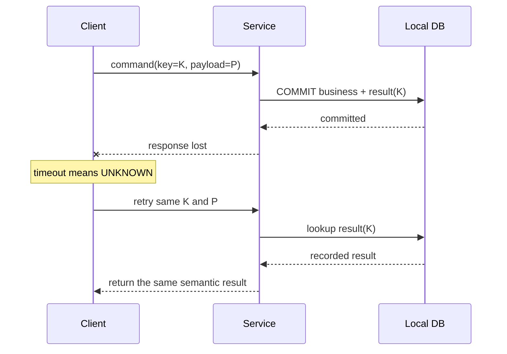
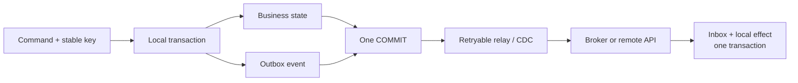
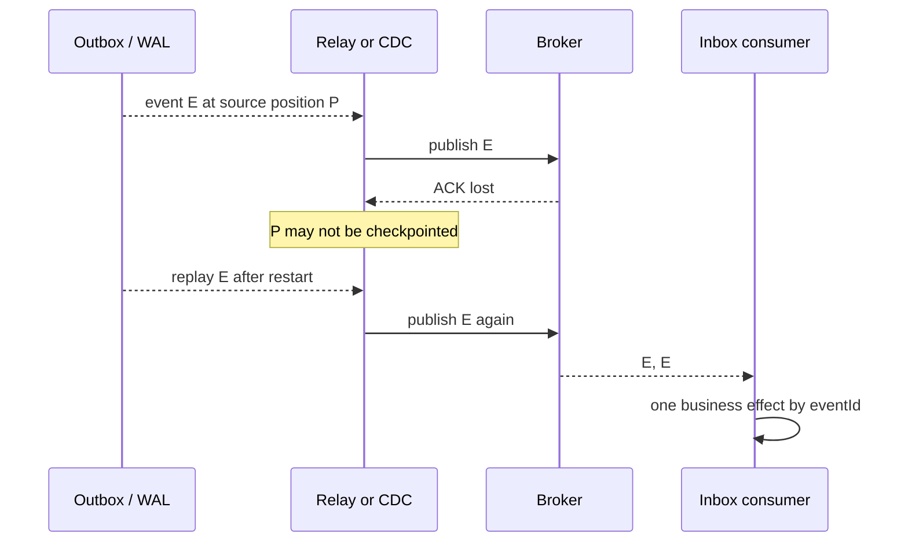
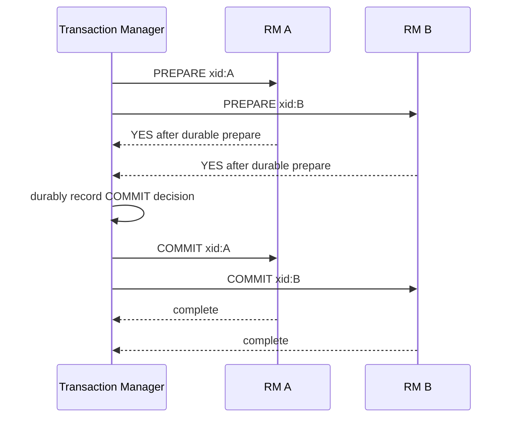
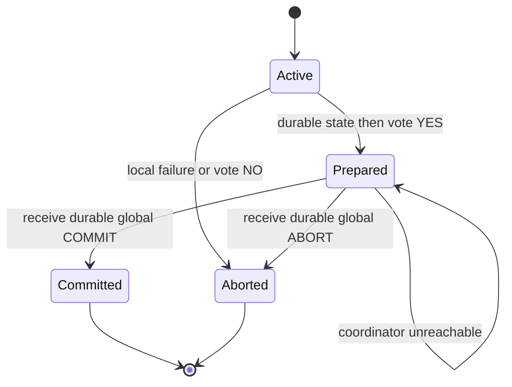
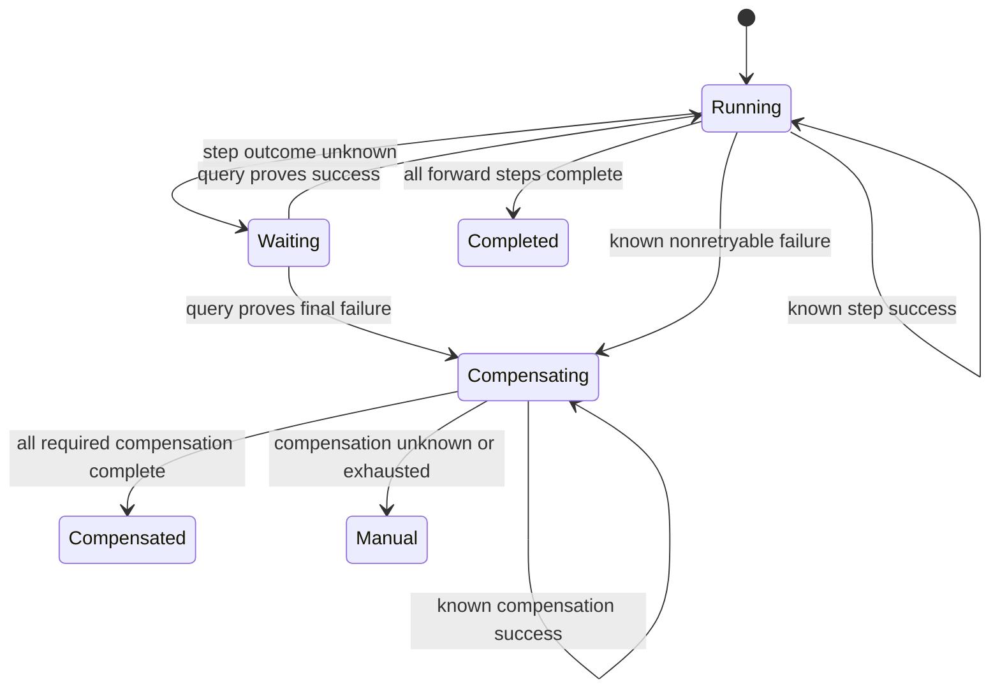

一次请求同时改数据库、发消息、扣款或调用第三方 API 时，最危险的并不是明确失败，而是某一步已经生效、确认却没有抵达调用方。调用方看到 timeout，真实世界可能仍在继续；若直接换一个请求 ID 重试，就可能把同一业务意图执行两次。

本文的核心结论是：跨系统可靠性不是寻找一个“绝不重复”的传输层，而是让每次业务意图具有稳定身份，把本地状态与待办事实放进可恢复边界，并让最终产生副作用的系统参与去重、事务或补偿。Outbox/Inbox、2PC 与 Saga 是三种不同取舍，不能互相冒充。

本文是“有状态系统可靠性”学习路径的 Chapter 10。建议先读 [WAL 到底保证什么](/signal-grid-blog/posts/write-ahead-log-durability-and-crash-recovery/) 理解本地提交与 ACK，[分布式时间](/signal-grid-blog/posts/distributed-systems-time-clocks-ordering-and-leases/) 理解 timeout 只能产生怀疑，[Raft 论文精读](/signal-grid-blog/posts/raft-consensus-leader-election-log-replication-and-safety/) 理解提交后响应丢失，以及 [Kafka 4.3 深度指南](/signal-grid-blog/posts/kafka-distributed-log-kraft-consumers-and-transactions/) 和 [分布式消息序列号](/signal-grid-blog/posts/distributed-message-sequencing/) 中的 offset、eventId 与恢复位置边界。

## 结果未知是跨系统副作用的起点

### timeout 只描述观察，不描述事实

设服务要完成两件事：在本地数据库创建订单，并通知另一个系统扣款。下面这些响应不能压成一个 `success: boolean`：

- **已知成功**：权威系统已提交，且调用方拿到可验证的结果；
- **已知失败**：权威系统证明该业务意图没有生效，或返回不可重试的业务拒绝；
- **结果未知**：调用方未取得终局证据，操作可能未开始、正在执行、已经提交，或只丢了响应。

结果未知不是一种罕见异常，而是任何跨网络提交都会出现的合法状态。请求可能已经到达服务，服务也可能已经 `COMMIT`，只是进程在返回响应前崩溃。timeout 最多证明“在调用方 deadline 前没有观察到响应”；它不能证明远端没有执行。[分布式时间章节](/signal-grid-blog/posts/distributed-systems-time-clocks-ordering-and-leases/) 和 [Raft 客户端语义](/signal-grid-blog/posts/raft-consensus-leader-election-log-replication-and-safety/) 已分别从 timeout 与复制状态机说明了同一个窗口。



安全重试的第一条规则因此是：**同一个业务意图必须复用同一个身份，不能因为一次 timeout 就生成新身份。** 新 key 表示新操作，服务端没有依据把它与上一次可能已生效的操作合并。

### 一张 failure matrix 比一句“至少一次”更有用

假设本地事务写入业务行和 outbox，relay 把事件发到 broker，consumer 再更新自己的数据库。下表把最常见的崩溃切口逐一摊开：

| 崩溃或丢包位置                            | 已经成立的事实                     | 可能观察到什么      | 安全恢复动作                                     |
| ----------------------------------------- | ---------------------------------- | ------------------- | ------------------------------------------------ |
| 本地事务提交前                            | 业务行与 outbox 都未提交           | 请求失败或超时      | 用原 key 重试                                    |
| 本地事务提交后、响应前                    | 业务行与 outbox 都已存在           | 客户端超时          | 查询或用原 key 重试，返回已记录结果              |
| relay 发布前                              | outbox 仍在                        | 下游暂时没有事件    | 从 outbox 继续发送                               |
| broker 接收后、ACK 丢失                   | broker 可能已有事件                | relay 看到超时      | 用同一 `eventId` 重发，接受可能重复              |
| ACK 后、outbox 标记前崩溃                 | broker 已有事件，outbox 仍像未发送 | 恢复后再次发送      | 下游 Inbox 按 `eventId` 去重                     |
| consumer 业务事务提交前                   | 下游业务状态未改变                 | 消息会重投          | 重新处理同一事件                                 |
| consumer 本地提交后、broker checkpoint 前 | 业务状态和 Inbox 已提交            | 消息会重投          | Inbox 命中后不再产生业务效果，再推进 checkpoint  |
| checkpoint 先于业务提交                   | 恢复点越过未生效事件               | 消息不会再投        | **非法顺序**；必须改成 effect 先提交或同边界提交 |
| 外部 API 生效后、响应前                   | 外部世界可能已经改变               | worker 看到 timeout | 复用外部幂等键、查询权威状态；不能盲目创建新调用 |

这张表揭示了两类不同的问题：

1. **丢失窗口**来自“先宣布完成，再做效果”，例如先提交 consumer offset、后更新数据库；
2. **重复窗口**来自“先做效果，再记录完成”，例如 broker 已接收、relay 尚未标记 outbox。

对不支持共同事务的两个系统，通常不能同时消灭二者。可靠设计会选择不丢失，把重复变成协议可识别的输入，再由最终效果所有者去重。故障注入的通过判据也不应是“消息数量恰好一次”，而应是：已确认意图不丢、在声明的效果所有者与幂等参与边界内同一意图最多产生一个业务效果、未知结果能收敛到可查询终态，并且每个 checkpoint 都没有越过未提交效果。

## 幂等协议必须绑定意图、结果与生命周期

“接口支持幂等”只有在四个问题都有答案时才是一份合同：key 属于谁、key 绑定什么意图、并发重复怎样裁决、去重证据保存多久。

### stable key 必须绑定 stable intent

一个实用的去重主键通常包含作用域：

```text
(tenantId, operationName, idempotencyKey)
```

服务端还应保存请求的规范化 fingerprint：

```text
fingerprint = H(
  protocolVersion,
  operationName,
  targetResource,
  businessPayload,
  semanticOptions
)
```

trace ID、发送时间、重试次数和传输 header 通常不属于业务意图；金额、币种、目标账户、订单版本和“追加还是覆盖”则必须进入 fingerprint。JSON 不能直接拿原始字节散列后就宣称语义一致：字段顺序、数字格式、默认值与 Unicode 规范化都可能改变字节。要么定义版本化 canonical encoding，要么对已解析、已校验的语义字段编码后散列。

服务端处理规则应是：

| key 查询结果 | fingerprint 比较 | 裁决                                                |
| ------------ | ---------------- | --------------------------------------------------- |
| 不存在       | —                | 原子占用 key，并开始该意图                          |
| 已完成       | 相同             | 返回持久保存的原结果，不重新执行                    |
| 执行中       | 相同             | 返回 `IN_PROGRESS`、等待同一执行，或提供 status URI |
| 任意已有状态 | 不同             | 拒绝为协议冲突，绝不能当新请求执行                  |

[Stripe 的官方 API 契约](https://docs.stripe.com/api/idempotent_requests)就是一个具体产品例子：同一 key 保存第一次执行结果，相同 key 但参数不同会报错；其 v1 key 至少保留 24 小时，清理后复用会被视为新请求。这个期限只描述 Stripe 的产品边界，不能抄成所有系统的通用安全窗口。IETF HTTPAPI 工作组曾在 [Idempotency-Key Internet-Draft](https://datatracker.ietf.org/doc/draft-ietf-httpapi-idempotency-key-header/) 中定义 key、fingerprint 与 expiry 词汇；截至 2026-08-18，该文档已过期且不是 RFC，本文只把它当设计术语来源，不把它写成现行 HTTP 标准。

### 并发重复必须由存储原子裁决

下面的流程存在竞态：两个线程同时查不到 key，随后都执行副作用，再各自插入结果。正确性必须落在数据库唯一约束、compare-and-set 或单一序列器上，而不是依赖“通常不会同时重试”。

本地数据库内的命令可以把去重与业务更新放进同一事务：

```sql
BEGIN;

INSERT INTO command_result(
  tenant_id, operation_name, idempotency_key,
  payload_fingerprint, status, result_payload
)
VALUES (:tenant, :operation, :key, :fingerprint, 'STARTED', NULL)
ON CONFLICT DO NOTHING;

-- 只有成功取得 key 的执行者才能继续修改业务状态。
-- 同一事务最终写 SUCCEEDED / REJECTED 与可重放结果。

COMMIT;
```

这段 SQL 是机制示意，不是可直接复制的并发实现：应用必须检查 `INSERT` 是否真的插入；失败者要读取已有 fingerprint 与状态；事务隔离、锁等待、死锁重试和结果大小也要按目标数据库实现。关键不变量是：

```text
same key + same fingerprint  => same durable semantic result
same key + different fingerprint => protocol error
durable success => business state and dedupe result committed together
```

外部调用不能被这个本地事务包住时，`STARTED` 也不能证明外部效果尚未发生。worker 必须把同一 key 传给外部系统，或先查询外部权威状态；若对方两种能力都没有，崩溃后的 `STARTED` 就是需要对账的 `UNKNOWN`，不能靠把状态改回 `NEW` 来消除不确定性。

### 去重记录的回收是一项安全证明

固定“保留 7 天”不是证明。一个 key 只有在所有可能的重复来源都越过它之后才可回收：

```text
safeToForget(K) =
  clientRetryWindowClosed(K)
  AND transportReplayFloorPast(K)
  AND brokerOrArchiveCannotRedeliver(K)
  AND failoverAndManualReplayCannotReintroduce(K)
  AND producerWillNeverReuseKForAnotherIntent
```

如果任一来源没有可证明上界，安全选择是保留业务唯一约束或结果摘要，或者关闭旧 client/session epoch 并明确拒绝其晚到请求。仅按本地创建时间删除 Inbox 行，随后从一个更老的 Kafka offset、CDC checkpoint 或灾备归档重放，会把历史事件重新变成“第一次”。

可回收的常见形式有三种：

- 去重表和消费 checkpoint 在同一数据库；只有当权威恢复点已越过事件、所有备用恢复路径也不会回退时，才删除旧明细；
- 按 client incarnation 保存单调 sequence；旧 incarnation 被永久封存后，可把明细压缩成“最大连续序号 + 必要结果窗口”，但并行未完成请求需要 hole/window，不能只存最大值；
- 对支付单号、订单号一类业务身份，直接保留永久唯一约束，而不是把它当短期缓存。

幂等也不等于交换律。`set balance=100` 重复执行可能幂等，却与并发扣款不交换；`debit 10` 不是幂等，却可以通过 operation ID 变成效果幂等。协议审查应问“同一意图是否只改变业务一次”，而不是只看 handler 名字里有没有 `idempotent`。

## Outbox 与 Inbox 把双写改造成可恢复接力

直接执行“提交数据库，然后发送消息”会在两步之间丢事件；反过来“先发消息，再提交数据库”会让下游看到最终回滚的意图。把两次调用包在一个进程内的 `try/catch` 也没有帮助，因为崩溃和网络结果未知恰好发生在 catch 无法运行的时候。

Transactional Outbox 改变的不是 broker，而是本地原子边界：业务状态和“将来必须发送的事件”由**同一个数据库事务**提交。提交后，异步 relay 可以失败和重启；只要 outbox 仍在，发送责任就不会随进程内存一起消失。



### Outbox 保存事实，而不是一条临时通知

一条可演进的 outbox 记录至少应表达：

```text
eventId
aggregateType + aggregateId
aggregateVersion or domainSequence
eventType + schemaVersion
payload
causationId + correlationId
createdAt for audit, not for authority ordering
```

`eventId` 在所有 relay 重试中保持不变；`aggregateId` 常用作下游 partition key，使同一聚合的事件进入同一顺序域；`aggregateVersion` 用于检测缺口、旧版本和乱序。墙钟时间适合审计，不应替代数据库提交顺序、业务版本或消息分区顺序。

[Debezium Outbox Event Router 官方文档](https://debezium.io/documentation/reference/stable/transformations/outbox-event-router.html)把 `id` 定义为可供下游去重的唯一事件 ID，并把 `aggregateid` 用作消息 key 以维护 Kafka partition 内的正确顺序。文档的默认表只是一个产品约定；真实协议仍要自行定义 schema 版本、业务顺序、租户边界与敏感字段治理。

Outbox 能证明：

```text
business commit => matching outbox intent exists
no business commit => matching outbox intent is not visible
```

它不能证明 broker 已接收、consumer 已处理或第三方已经产生效果。`outbox.status = SENT` 最多是 relay 的本地观察，不是所有下游完成的全局事实。

### Inbox 把重复投递收敛为一次本地效果

下游 consumer 收到事件时，应在自己的本地事务里同时完成三件事：

1. 以 `(source, eventId)` 插入 Inbox 唯一记录并校验 payload fingerprint；
2. 只有第一次插入成功时才改变业务状态；
3. 同一事务写入由本次处理产生的后续 outbox 事件；若该数据库还是恢复位置的权威，则只能把位点推进到**所有更小位置都已提交的连续前缀**。

```text
BEGIN
  claim inbox(source, eventId, fingerprint)
  if first_seen:
      apply business transition with version check
      append derived outbox events
  mark source position complete
  advance checkpoint to highest contiguous completed prefix if authoritative
COMMIT
```

同一个 `eventId` 带着不同 fingerprint 到达，不是“选择最新一份”的机会，而是生产者复用了身份、schema 解码不一致或数据已损坏。consumer 应隔离该事件并告警，不能悄悄覆盖 Inbox 后继续。

Inbox 只能去掉**同 ID 的重复**。上游若在 timeout 后为同一业务意图生成新的 `eventId`，下游看到的是两个合法新事件；要阻止这种语义重复，还需要订单号、付款号或 command ID 等业务唯一约束。

若同一 partition 由多个 worker 并行处理，完成顺序可能是 `43 → 42`。此时不能因为 43 已完成就直接把 next position 写成 44，否则恢复会越过仍未提交的 42。实现必须按 partition 串行提交位点，或维护完成 hole，只在 `[oldCheckpoint, n)` 全部成功后推进到 `n`。不同 partition 各有自己的连续前缀，不能合成一个最大 offset。

若 consumer group offset 保存在 broker，而业务效果保存在数据库，两者仍不在同一原子事务。安全的 at-least-once 顺序是先提交数据库的 Inbox + effect，再提交 broker offset；broker checkpoint 可以暂时落后，重复由 Inbox 吸收，但同样不能跨过未完成 hole。另一种办法是把 source position 与 effect 一起写进目标数据库，恢复时从该位置主动 `seek`；此时必须只有这一份 checkpoint 是权威，不能让自动提交的 group offset 另开一条恢复路径。

## Relay 与 CDC 仍必须正视重复和清理边界

Outbox 修复了业务数据库与发送意图之间的丢失窗口，却没有把 relay 的发送和 outbox 清理变成同一事务。无论 relay 是轮询表，还是 CDC 读取事务日志，都必须明确自己的重放合同。

### 先标记还是先发送，是 loss 与 duplicate 的选择

轮询 relay 有两个看似合理的顺序：

```text
A. mark sent -> publish
B. publish -> mark sent
```

A 在标记后崩溃会永久丢消息；B 在 broker 接收后、标记前崩溃会重复发送。可靠系统通常选择 B，再让接收端按稳定 `eventId` 去重。即使 broker 返回成功，relay 也只能证明消息进入了 broker 的既定确认边界，不能证明所有 consumer 的外部效果完成。

CDC 把“哪些 outbox 行已提交”交给数据库事务日志和 connector checkpoint，避免业务进程自己扫描与抢锁，但不会天然取消重复。connector 可能在写出记录后、保存 source offset 前崩溃，恢复后再次发出同一变化。[Debezium 当前文档](https://debezium.io/documentation/reference/stable/configuration/eos.html)明确把默认保证写成 at-least-once，并说明某些 connector 在满足 Kafka Connect 分布式模式、worker 配置与 connector 能力条件时可以利用 source exactly-once。这个产品能力只收窄 Debezium→Kafka 的重复窗口，不能替代 consumer Inbox，也不能扩张到支付、邮件或另一个集群。



### 顺序、并行和背压要落到明确的域

多个 relay worker 可以提高吞吐，但不能让同一 aggregate 的版本 42、43 随机并行后又假设 broker 会恢复业务顺序。安全设计通常选择以下一种：

- 由数据库正式暴露的 commit sequence 决定全局顺序，relay 严格按该序列单写；
- 只要求每个 aggregate 有序，用 `aggregateId` 稳定分区，并在分区内串行；
- 明确允许乱序，下游用 `aggregateVersion` 缓冲、查缺或拒绝旧版本。

上述三种保证不同。数据库自增 ID 可以是 relay 扫描位置，但并不自动等于事务 commit order；批量事务、sequence 预分配和回滚都可能留下错觉。CDC 用户应使用 connector 暴露的事务日志位置与事务边界，业务连续性仍由版本或 domain sequence 证明。

relay 必须有界处理 backlog。broker 故障时不能无限把 payload 搬入内存；应停在持久 outbox 上，通过 batch 上限、租约/锁超时和退避控制并发。关键观测量不是一个 `sent_total`，而是：最老未投递年龄、outbox 增长速率、source position 到 relay checkpoint 的差、发布结果未知次数、重复率、Inbox 冲突，以及按 aggregate 的顺序缺口。

### Outbox 与 Inbox 的清理需要两份不同证明

Outbox 行可以清理的前提是 relay 已把对应 source position 稳定推进到不会回退的位置，并且恢复不再依赖该行。轮询 relay 的“收到 broker ACK”仍有 ACK 已返回但删除未提交的重复窗口，这没关系；有问题的是先删除再发送。CDC 则要确认 connector 已越过相应数据库日志位置、不会因重新 snapshot 把同一行再导出，并保留满足审计和重放需求的独立材料。

Inbox 行能否清理取决于**所有重复入口**，通常比 outbox 更严格：broker retention、死信队列回放、灾备切换、人工 replay 和生产者 retry horizon 都必须越过它。只因为主 consumer offset 已前进就删除 Inbox，会在旧归档或另一条交付路径重放时再次产生效果。

因此遗忘条件应写成对所有重复入口的合取，而不是把不同坐标里的数值直接相减：

```text
safeToDeleteOutbox(E) =
  relayWillNotNeed(E)
  AND auditReplayWillNotNeed(E)
  AND cdcSnapshotWillNotReemit(E)

safeToForgetInbox(E) =
  everyDeliveryPathCannotRedeliver(E)
  AND failoverCannotReintroduce(E)
  AND manualReplayCannotReintroduce(E)
  AND businessRetryWindowClosed(E)
```

只有先把 Kafka offset、CDC LSN、Archive position、灾备恢复点和人工批次映射到同一个事件身份域或同一 source-position 域，才可以在该域内把最保守水位写成 `min(...)`。无法建立映射或证明上述条件时，宁可把明细压缩成不可复用的 key/fingerprint/结果摘要，也不要把删除后的重复误当新业务。

## 2PC 用阻塞与资源占用换原子决议

Outbox/Inbox 接受跨系统最终一致，并用重复可识别来换取解耦。如果一笔操作要求两个资源管理器在同一个全局事务里一起提交或一起回滚，而且二者都实现 XA/prepare/recovery 一类协议，就可以选择 Two-Phase Commit（2PC）。

2PC 不是“先调用 A，再调用 B 两次”，而是事务管理器（Transaction Manager，TM）与可恢复资源管理器（Resource Manager，RM）之间的协议：



### Phase 1 的 YES 是一份持久承诺

在 prepare 阶段，每个参与者完成本地校验并投票：

- `NO`：该分支不能提交，协调者应决定全局 abort；
- `READ_ONLY`：该参与者没有需提交的更新，可退出第二阶段；
- `YES/PREPARED`：参与者已经把足以在崩溃后完成 commit 或 rollback 的状态稳定保存，并保留所需锁和资源，等待全局决定。

[Jakarta Connectors 2.0 的 XAResource 合同](https://jakarta.ee/specifications/connectors/2.0/connectors-spec-2.0)要求投出 prepare 成功的 RM 稳定记录提交所需资源，并一直持有到 TM 指示 commit 或 rollback。`YES` 因此不是“检查通过，稍后再试试看”；参与者一旦投出 YES，就不能因为自己的 timeout 擅自按普通失败回滚。

协调者只有在所有必要参与者都能提交时才可选择 COMMIT；否则选择 ABORT。全局决定必须先进入协调者的可恢复日志，再发送第二阶段消息。第二阶段消息可以重试，参与者通过 `xid` 幂等识别；协调者崩溃恢复后也必须重新传播同一决定，不能重算出另一个答案。

### Prepared 之后的沉默叫 in-doubt

若参与者已经 prepared，但协调者在它收到最终决定前失联，该分支处于 **in-doubt**：本地知道“我承诺能提交”，却不知道全局选择了 commit 还是 abort。安全动作是保留 prepared state，恢复后通过 TM 日志或恢复协议查询决定。



这就是经典 2PC 的阻塞边界：协调者决定暂时不可获得时，prepared 参与者可能长时间占用锁、版本和日志空间。Gray 与 Lamport 的[《Consensus on Transaction Commit》](https://www.microsoft.com/en-us/research/?p=147285)在其模型中把传统 2PC 描述为 Paxos Commit 的 `F=0` 特例；协调者故障期间协议可能阻塞，直到含决定的日志恢复。复制协调者日志、重启恢复和 presumed-abort/commit 变体可以缩短或改变恢复路径，却不能把一个没有终局证据的 prepared 分支安全地“猜成”成功或失败。

[PostgreSQL 18 `PREPARE TRANSACTION`](https://www.postgresql.org/docs/18/sql-prepare-transaction.html)展示了这一运维代价：事务变成与原 session 脱离的持久 prepared state，之后只能 `COMMIT PREPARED` 或 `ROLLBACK PREPARED`；它继续持有原有锁，长期遗留还会妨碍 VACUUM 和事务 ID 治理。官方明确建议由外部事务管理器跟踪并尽快结束 prepared transaction，而不是让普通应用自行调用后忘记。

### heuristic resolution 是原子性告警，不是成功降级

若协调者永久丢失、故障恢复长期无法完成，管理员或 RM 可能做 heuristic decision：在不知道全局决定时单方面 commit 或 rollback。XA 用 `XA_HEURCOM`、`XA_HEURRB`、`XA_HEURMIX` 和 `XA_HEURHAZ` 一类结果报告启发式提交、回滚、混合或不确定；[Jakarta Transactions](https://jakarta.ee/specifications/transactions/2.0/jakarta-transactions-spec-2.0.html)的 `HeuristicMixedException` 就表示相关更新一部分提交、一部分回滚。

此时全局原子性已经无法由 2PC 证明。正确处置是保留 xid、各分支决定、业务对象与操作证据，停止自动重试扩大影响，并进入对账/修复；不能把 `forget` 理解成“异常已经自动一致”。`XAResource.forget` 清理的是启发式结果的协议记忆，应在 TM 已记录并处理该异常之后使用。

下面的故障矩阵是 2PC 上线前必须能回答的恢复合同：

| 故障位置                                      | 可安全决定什么                                         | 仍需什么证据                                     |
| --------------------------------------------- | ------------------------------------------------------ | ------------------------------------------------ |
| 参与者在 prepare 前失败                       | 协调者可决定 ABORT                                     | 参与者没有投出持久 YES                           |
| 参与者已 prepared、YES 响应丢失               | 协调者未收齐 YES 时不能决定 COMMIT；参与者不能自行回滚 | RM 的 prepared 记录与 TM 的最终 durable decision |
| 协调者在记录全局决定前崩溃                    | 恢复协议按协调者日志与协议变体裁决                     | 不能由单个参与者猜测                             |
| 协调者已稳定记录 COMMIT、通知部分参与者后崩溃 | 未收到者保持 prepared，恢复后补发 COMMIT               | durable coordinator decision                     |
| 协调者日志永久丢失                            | 可能永久 in-doubt，强制处置会产生 heuristic 风险       | 副本/备份、参与者证据、人工裁决与对账            |

2PC 还不等于 Two-Phase Locking（2PL）。2PC 负责多个资源的 commit/abort 原子决议；并发隔离由各资源的锁、MVCC 与隔离级别决定。严格 2PL 常让写锁跨过 prepare 并保留到第二阶段，所以两者经常一起出现，但仅开启 XA 不能自动消除 lost update、write skew 或业务不变量竞态。

最后，只有真正实现 prepare、stable recovery 和同一事务管理器协议的资源才能参加 2PC。普通 HTTP API、邮件、对象存储以及 Kafka producer transaction 都不能因为代码里放进同一个方法就变成 XA participant。若某个“2PC”参与者只能返回普通 200/500，它实际上仍暴露结果未知，需要幂等、查询或 Saga。

## Saga 用显式状态机管理部分完成

2PC 要求所有参与者在同一全局事务中等待决定。长时间业务流程、由不同团队拥有的服务和普通外部 API 往往不具备这个条件。Saga 选择另一条路：把全局流程拆成一系列各自提交的本地事务，并为已完成步骤定义后续推进或补偿。

Garcia-Molina 与 Salem 的 [1987 年 Saga 原论文](https://doi.org/10.1145/38713.38742)讨论的是长事务如何分解为可与其他事务交错的子事务；现代微服务的编排与编舞是这一思想的工程化形态，不应反过来把原论文简化成某个消息中间件配方。

### 每一步提交后都已进入真实世界

Saga 的典型路径可以写成：

```text
T1: create order       / C1: cancel order
T2: reserve inventory  / C2: release inventory
T3: authorize payment  / C3: void or refund
T4: arrange shipment   / C4: cancel shipment if still possible
```

`T1`、`T2` 各自在自己的服务里提交后，其结果可能被其他请求读到。Saga 没有像全局 ACID 事务那样隐藏全部中间状态，也没有自动提供跨服务隔离；lost update、dirty read 和业务资源超卖仍需版本检查、reservation、semantic lock、配额或可交换更新处理。[Azure Saga 官方说明](https://learn.microsoft.com/en-us/azure/architecture/patterns/saga)同样把缺少跨服务内建隔离，以及并发 Saga 造成的数据异常列为显式边界。

因此，Saga 不是“发生错误就发几个反向消息”，而应是一台持久状态机：



这台状态机至少要持久保存：

- `sagaId`、业务对象和流程定义版本；
- 每个 `stepId` 的 stable command ID、目标 participant 与 payload fingerprint；
- `NOT_STARTED / IN_FLIGHT / SUCCEEDED / FAILED_FINAL / UNKNOWN` 等可裁决状态；
- 正向结果、外部引用号、重试 deadline 和下一步；
- 已登记的 compensation、执行结果与人工处置证据。

一次网络 timeout 在缺乏“该操作确定未执行”的权威证据时，应把 step 移到 `UNKNOWN`，而不是直接标成 `FAILED_FINAL`。只有对 participant 查询权威结果，或用同一 stable command ID 重试并获得去重结果后，orchestrator 才知道该进入下一步还是补偿。对一个其实已经成功的未知步骤立即执行正向重试和补偿，可能同时制造两种相反副作用。

Saga 状态转移、待发送 step command 和收到的 step result 也需要本地 Outbox/Inbox。否则 orchestrator 可能已经把状态改成 `STEP_2_SENT`，消息却未发；或 participant 已执行成功，结果事件在返回途中丢失。Saga 负责决定业务路径，Outbox/Inbox 负责让每条路径变化可恢复，两者不是替代关系。

### Orchestration 与 Choreography 只改变控制权位置

| 维度           | Orchestration                        | Choreography                              |
| -------------- | ------------------------------------ | ----------------------------------------- |
| 下一步由谁决定 | 持久 orchestrator 根据全局状态发命令 | participant 消费事件并发出后续事件        |
| 流程可见性     | 状态、超时和补偿集中，较易审计       | 控制图分散在订阅关系中，需额外关联视图    |
| 耦合形态       | participant 依赖命令/结果合同        | participant 依赖彼此事件语义，易形成环    |
| 故障边界       | orchestrator 必须复制、恢复并幂等    | 每个 participant 和事件链都必须恢复并幂等 |
| 适用规模       | 多步骤、分支、人工审批和复杂补偿     | 参与者少、事件反应简单且边界稳定          |

Orchestration 的中心控制器若只有一份易失实例，确实会成为单点故障；一个持久、可重放、具备主从/fencing 的 orchestrator 则可以恢复。Choreography 没有中心调度器，不代表没有单点，也不代表全局流程天然可观察：任何关键 participant、topic 或隐藏的环形依赖都可能卡住业务。

两种形式都必须携带 `sagaId + stepId + commandId + causationId`，并为同一步的并发结果定义 compare-and-set。transport 顺序不能替代流程状态版本；晚到的 `STEP_2_SUCCEEDED` 不能把已经人工终止、补偿完毕或升级到新流程版本的 Saga 随意拉回 Running。

## 不可补偿副作用决定工作流的真正边界

“补偿”这个词最容易制造一种错觉：系统仿佛能回到操作开始前的精确快照。事实上每个本地事务早已提交，其他用户和系统可能基于它继续行动；补偿只是一个新的、同样会失败的业务动作。

退款不是删除原付款，取消航班可能产生手续费，释放库存时商品可能已经被另一订单占用，发送邮件后无法让收件人失忆。正确账本应同时保留原动作和补偿动作，不能改写历史伪装成“从未发生”。[Azure Compensating Transaction 官方模式](https://learn.microsoft.com/en-us/azure/architecture/patterns/compensating-transaction)明确指出，补偿不一定恢复初始数据，也不一定按原步骤的严格逆序执行；它需要考虑并发变化，补偿本身还应可重试、幂等并持久记录进度。

### 补偿是一条新的结果未知链路

每个 compensation 都应拥有独立 command ID 与 fingerprint，例如：

```text
forward command:      (saga-7, reserve-inventory, v1)
compensation command: (saga-7, release-inventory, v1)
```

补偿重试复用 compensation ID，不能每次生成新的“释放库存”命令。若释放已经成功、响应丢失，新 ID 会把库存加回两次。participant 还要验证正向动作是否确实由同一个 Saga 完成、是否已经补偿，以及资源版本是否允许当前补偿。

补偿顺序应服从业务依赖图，而不是机械地反转数组。可以并行释放彼此独立的资源；也可能要先撤销最敏感的权限，再慢慢退款。判据是“哪些已完成步骤仍需抵消、哪些补偿依赖另一个补偿先完成”，并保留每个节点的终局证据。

### Pivot 之后通常只能向前恢复

有些步骤不可逆或不可安全重试，例如不可撤回的对外披露、已经交割的链上转账、法律上已生效的指令，或者不支持查询与幂等的第三方动作。Saga 设计应显式标出 pivot / point of no return：

| 步骤类型                          | 失败策略                     | 设计要求                                                       |
| --------------------------------- | ---------------------------- | -------------------------------------------------------------- |
| Compensable                       | 后续失败时执行业务补偿       | 保存补偿所需引用与版本                                         |
| Pivot                             | 越过后不再回到“全部撤销”路径 | 所有关键校验和可补偿准备应尽量在此前完成                       |
| Retryable                         | pivot 后必须最终完成         | 命令幂等、可查询、有界退避和人工升级                           |
| Irreversible / unknown-capability | 不能自动恢复到原状态         | 延后执行、改成 reservation/authorization，或接受人工与财务风险 |

例如支付可以先 authorization、最后 capture；库存可以先带期限 reservation；邮件可以先生成待发送记录，等所有关键步骤确认后再由 outbox 投递。这些改造不是让不可逆动作变可逆，而是把真正不可逆的时刻推迟到系统已经收集足够证据之后。

如果 pivot 后某一步长期失败，安全目标通常从“向后补偿”改为“向前完成或人工裁决”。工作流应能进入 `MANUAL_REVIEW`、冻结冲突操作并携带完整证据，而不是在两个方向无限自动重试。一个诚实的 Saga 终态可以是 `COMPLETED`、`COMPENSATED` 或 `FAILED_MANUAL`；只有前两种都不能覆盖时，显式异常终态比伪造成功更可靠。

## Exactly-once 只能成立在共同参与的边界内

“Exactly-once”至少可能指三件不同的事：

- **delivery once**：消息只被 transport 交付一次；
- **processing once**：某段 consumer 代码只运行一次；
- **effect once**：对已接受的同一业务意图，权威资源在承诺的可用性条件下最终产生一次效果；所有重试返回同一语义结果。

可靠系统真正关心的是第三种。消息可以重复到达、handler 也可以在提交前多次运行，只要最终资源用 stable ID 原子吸收重复，业务效果仍可保持一次。反过来，即使 broker 只交付一次，handler 在外部 API 成功后、checkpoint 前崩溃，恢复重试仍可能产生第二次效果。

[Saltzer、Reed 与 Clark 的 End-to-End Arguments 原论文](https://web.mit.edu/Saltzer/www/publications/endtoend/endtoend.pdf)早已指出：低层即使抑制传输重复，应用自己的故障重试仍可能生成重复请求，最终正确性需要端到端参与者的知识。Kafka 4.3 [官方 delivery semantics](https://kafka.apache.org/43/design/design/)也把边界写得很清楚：Kafka transaction 能原子提交 Kafka 输出和消费 offset；写往其他 destination 的 exactly-once 通常需要目标系统合作。

### 每种机制的承诺都要带作用域

| 机制                         | 能证明什么                                                                                        | 不能证明什么                                        |
| ---------------------------- | ------------------------------------------------------------------------------------------------- | --------------------------------------------------- |
| 单数据库事务                 | 该数据库内业务状态、去重结果和 outbox 一起提交                                                    | broker、HTTP 或另一数据库同步生效                   |
| Outbox + at-least-once relay | 本地已提交意图最终可重试发送                                                                      | broker 只出现一份、consumer 已完成                  |
| Inbox + 本地事务             | 保留期和 ID 作用域内，同一事件最多产生一次该数据库效果                                            | 不同 ID 的语义重复、Inbox 清理后的无限历史重放      |
| Kafka transaction            | Kafka 管理的 output partition 与 consumer offset 原子提交                                         | 任意外部数据库、支付、邮件或另一 Kafka 集群         |
| 2PC / XA                     | 在协议故障模型内且没有 heuristic completion 时，所有合格 participant 接受同一个 commit/abort 决议 | 协调者不可用时仍推进、普通非 XA API、Saga 式隔离    |
| Saga                         | 在 participant 与恢复路径最终可用的前提下，已提交步骤走向完成、补偿或显式人工状态                 | 瞬时全局原子性、跨步骤隔离、精确回到初始世界        |
| 外部幂等 API                 | 对方公布的 key 作用域与保留期内吸收同意图重试                                                     | 超出保留期、换 key、不同 payload 或未公布的内部效果 |

因此，声称“效果 exactly-once”之前，至少要能逐项证明：

```text
1. intent identity is stable across every retry
2. the same identity cannot bind to a different payload
3. authority atomically records effect and dedupe/result
4. a checkpoint never passes an uncommitted effect
5. dedupe evidence outlives every accepted replay path, or older epochs are rejected
6. EXTERNALLY_DONE comes from external authority evidence
```

第 6 条尤其重要。本地 outbox 的 `SENT`、broker ACK、HTTP socket 写完和 worker 日志都只是中间证据。只有外部系统返回可重复查询的资源 ID/终态、用同一 idempotency key 返回既有结果，或作为 2PC participant 提交，调用方才有依据把外部效果标为完成。

若外部系统既不支持事务，又没有 stable idempotency key、条件写或 status query，就不存在一个本地算法能在“它已执行但响应丢失”和“它根本没执行”之间可靠区分。此时可选的不是偷偷宣称 exactly-once，而是改变集成边界：把写入收口到支持唯一约束的代理、改用 reservation/authorization、接受 Saga 补偿，或把未知结果交给对账和人工裁决。

### 从结果未知到可证明终态

这条因果链最终可以收束成四个结论：

1. timeout 把操作带入 `UNKNOWN`，稳定身份和权威查询让它重新获得终局证据；
2. Outbox/Inbox 不消灭重复，而是把危险双写改造成可恢复投递与可吸收重复；
3. 2PC 只适用于共同实现 prepare/recovery 的资源，它用锁、日志和阻塞换全局原子决议；
4. Saga 接受中间状态可见，用持久流程、幂等步骤和业务补偿换取长流程的可恢复性，但补偿不是时间倒流。

所以，跨系统副作用的可靠性不在于链路上某一层写着 `exactly-once`，而在于最终效果所有者是否参与证明：这个身份代表同一个意图、这个结果已经提交、这个恢复点没有越过未完成事实，以及旧证据何时才真的可以忘记。

## 一手资料

- [Birrell、Nelson：Implementing Remote Procedure Calls](https://birrell.org/andrew/papers/ImplementingRPC.pdf)
- [Saltzer、Reed、Clark：End-to-End Arguments in System Design](https://web.mit.edu/Saltzer/www/publications/endtoend/endtoend.pdf)
- [IETF HTTPAPI：Idempotency-Key Internet-Draft 状态页（已过期，非 RFC）](https://datatracker.ietf.org/doc/draft-ietf-httpapi-idempotency-key-header/)
- [Stripe API：Idempotent requests](https://docs.stripe.com/api/idempotent_requests)
- [Debezium：Outbox Event Router](https://debezium.io/documentation/reference/stable/transformations/outbox-event-router.html)
- [Debezium：Exactly once delivery 与默认 at-least-once 边界](https://debezium.io/documentation/reference/stable/configuration/eos.html)
- [Apache Kafka 4.3：Design 与 Message Delivery Semantics](https://kafka.apache.org/43/design/design/)
- [PostgreSQL 18：PREPARE TRANSACTION](https://www.postgresql.org/docs/18/sql-prepare-transaction.html)
- [PostgreSQL 18：Two-Phase Transactions](https://www.postgresql.org/docs/18/two-phase.html)
- [Jakarta Transactions 2.0 Specification](https://jakarta.ee/specifications/transactions/2.0/jakarta-transactions-spec-2.0.html)
- [Jakarta Connectors 2.0：XAResource Two-phase Commit Contract](https://jakarta.ee/specifications/connectors/2.0/connectors-spec-2.0)
- [Jim Gray、Leslie Lamport：Consensus on Transaction Commit](https://www.microsoft.com/en-us/research/?p=147285)
- [Garcia-Molina、Salem：Sagas](https://doi.org/10.1145/38713.38742)
- [Azure Architecture Center：Saga distributed transactions pattern](https://learn.microsoft.com/en-us/azure/architecture/patterns/saga)
- [Azure Architecture Center：Compensating Transaction pattern](https://learn.microsoft.com/en-us/azure/architecture/patterns/compensating-transaction)
