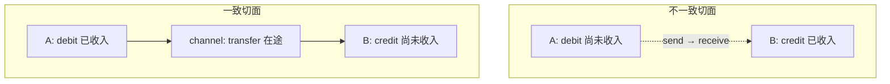
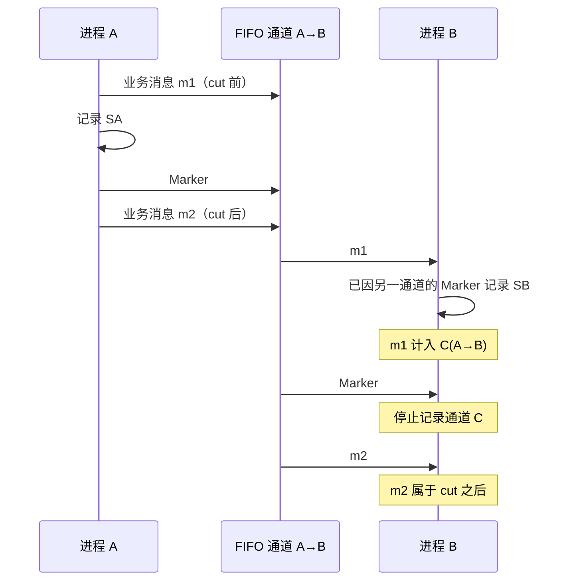
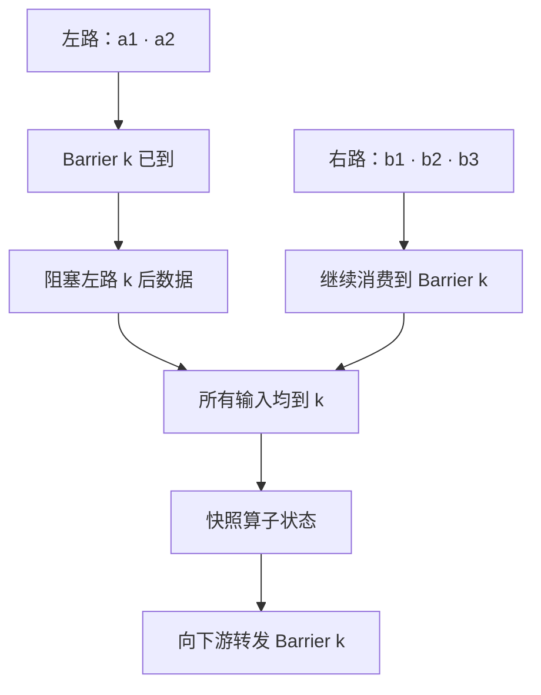
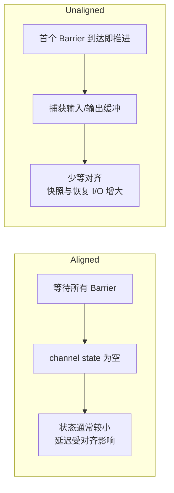
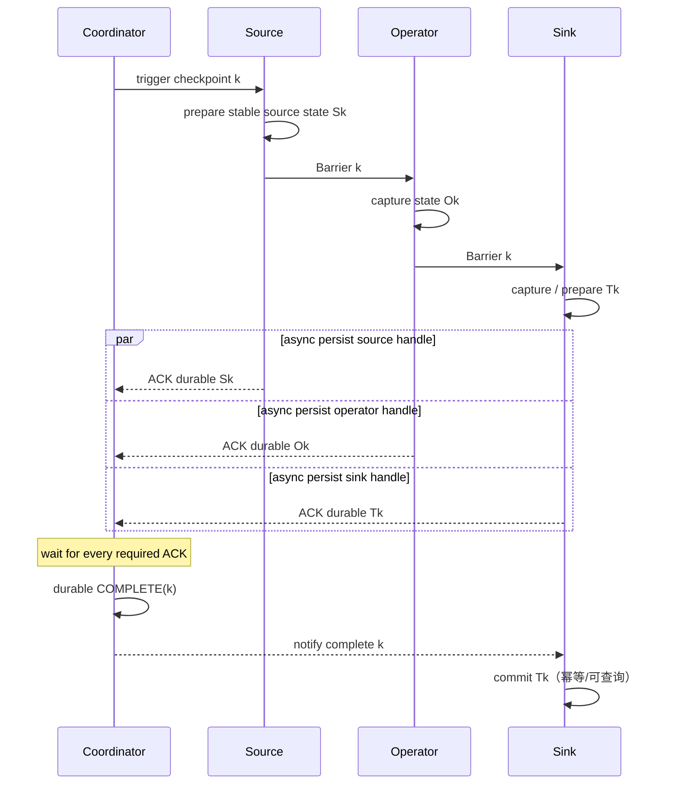
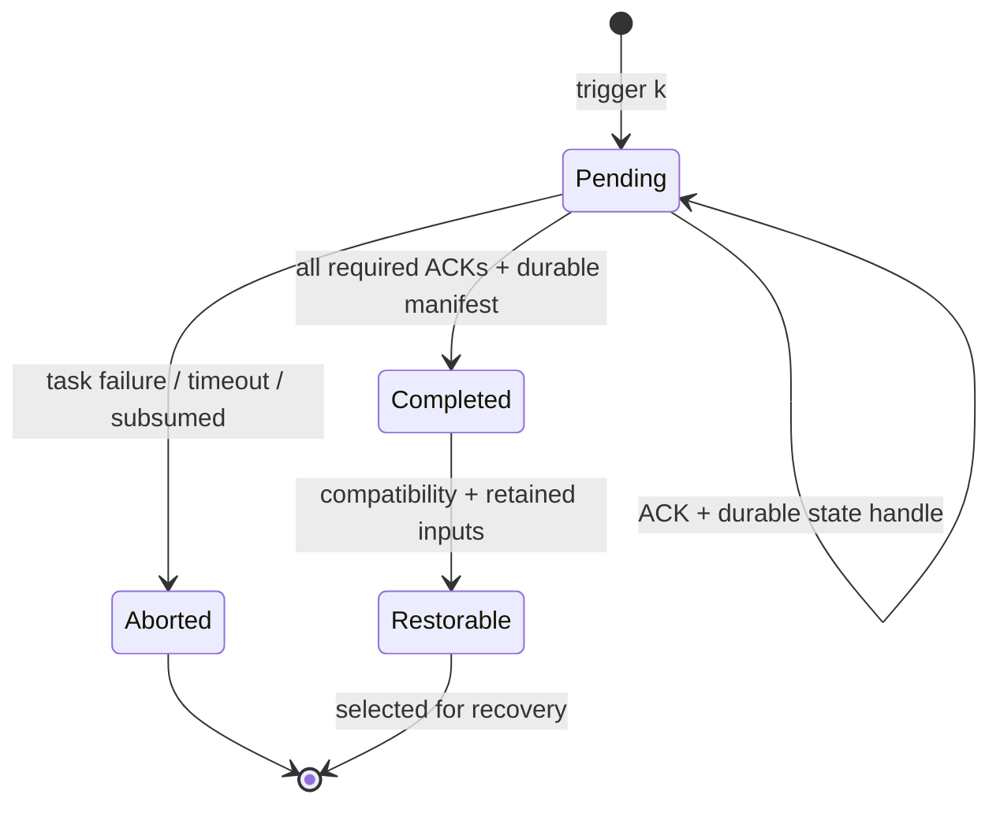

“把所有节点的数据文件各复制一份”并不等于拿到了分布式快照。即使这些文件只相差几毫秒，也可能出现一个节点已经记录“收到转账”，另一个节点却尚未记录“发出转账”的不可能世界；反过来，一条已经发出、尚未到达的消息如果没有进入任何节点状态，也会在恢复后凭空消失。

问题的核心不是复制是否同时，而是复制结果是否形成一个**因果一致的切面**：凡是切面里已经发生的事件，它的因果前提也必须在切面里；跨越切面的在途消息还必须有明确归属。

这条约束从 Chandy–Lamport 分布式快照一路延伸到现代流处理的 Barrier 与 Checkpoint。产品名和存储后端一直在变，恢复证明却始终围绕同一个三元组展开：

```text
可恢复状态 = 计算状态 + 输入恢复位点 + 尚未决议的输出副作用
```

少其中任何一项，系统都只能“重启”，不能证明“恢复”。

本文是“有状态系统可靠性”学习路径的 Chapter 13。建议先读[分布式系统里的时间](/signal-grid-blog/posts/distributed-systems-time-clocks-ordering-and-leases/)，理解 happened-before 不是墙钟先后；再读 [Kafka：分布式日志、KRaft、消费者与事务](/signal-grid-blog/posts/kafka-distributed-log-kraft-consumers-and-transactions/)，掌握分区位点和“下一条 offset”的含义。还应结合[跨系统副作用](/signal-grid-blog/posts/cross-system-side-effects-idempotency-outbox-inbox-2pc-saga/)理解检查点之外的世界，由[过载也是故障](/signal-grid-blog/posts/overload-backpressure-admission-control-retry-budget-load-shedding/)理解 Barrier 延迟与队列堆积，并由紧邻的[状态所有权迁移](/signal-grid-blog/posts/state-ownership-migration-shard-catchup-handoff-fencing/)明确权威代际与恢复切点；本文在这些基础上建立一致检查点与恢复位点。

Chandy–Lamport 部分以 1985 年原论文为准；产品案例固定到 **Apache Flink 2.3.0**。Flink 的配置名和实现能力属于这个版本，不能反向冒充所有数据流系统的通用定义。

## 1. 一致快照不是“同一墙钟时刻”的照片

先把“快照”从直觉变成可验证的对象。

设系统里每个进程都有一串本地事件。发送消息、接收消息、本地状态变更都是事件。Lamport 的 happened-before 关系 `→` 至少包含三类边：

1. 同一进程内，较早事件先于较晚事件；
2. 一条消息的发送先于对应接收；
3. 关系具有传递性。

一个 **cut** 是在每个进程事件序列上各切一刀，保留每条序列的某个前缀。它是 **consistent cut**，当且仅当：

```text
若 e 已被 cut 收入，且 d → e，则 d 也必须被收入。
```

对消息而言，这可以读成更直观的条件：**不能收入 receive 而遗漏对应 send**。收入 send、尚未收入 receive 则完全合法；这条消息属于 cut 的 channel state，也就是在途消息。



因此，一个分布式全局状态不只是节点本地状态的集合，而是：

```text
G = (S1, S2, ... Sn, C1, C2, ... Cm)

Si = 进程 i 在切面上的本地状态
Cj = 通道 j 中跨越切面的在途消息
```

### 为什么“时间很接近”仍然不够

假设 A 在 10:00:00.010 扣减余额，随后向 B 发消息；B 在自己时钟的 10:00:00.008 收到消息并增加余额。两台机器的时钟相差 5 ms 很常见。若运维脚本按本地墙钟“10:00:00.009”复制文件，可能保留 B 的 credit，却遗漏 A 的 debit。

把同步误差压到微秒也没有修复证明：

- 墙钟读数不编码消息因果；
- 网络、调度和持久化延迟都可能跨过采样边界；
- NTP 调整、虚拟机暂停和闰秒策略会改变读数；
- 即使物理时间有严格误差界，也仍需协议说明误差区间重叠时如何裁决。

一致性来自消息协议或共享提交点，不来自文件修改时间看起来相近。

### “相加仍守恒”只是性质，不是快照算法

经典例子是一枚 token 在两个进程之间移动。全局不变量是：

```text
token(A) + token(B) + token(channels) = 1
```

独立复制 A 与 B，可能得到 0 或 2；把 channel state 纳入后才重新得到 1。这个例子也揭示了一个重要边界：快照算法记录状态，而“余额守恒”“作业没有死锁”属于在状态上判断的**性质**。记录出一致状态，不会自动证明业务不变量本身正确。

## 2. Chandy–Lamport 用 Marker 记录切面与通道状态

[Chandy–Lamport 原论文](https://www.microsoft.com/en-us/research/wp-content/uploads/2016/12/Determining-Global-States-of-a-Distributed-System.pdf)研究的是：业务消息继续流动时，怎样在没有全局时钟、没有共享内存的系统里记录一致全局状态。

原始算法建立在明确前提上：

- 进程通过单向通道通信；
- 通道可靠、FIFO，消息最终到达；
- 记录期间，进程和通道按模型正常运行；
- 进程能区分 Marker 与普通业务消息；
- 发出 Marker 与之后的业务消息遵守同一 FIFO 顺序。

Marker 还必须能够到达每个参与进程：可以由每个进程各自发起一次，也可以由一个发起者沿有向通道到达全部进程；“通信图强连通且只有一个发起者”只是满足可达性的充分条件，不是算法唯一允许的拓扑。某个进程记录完自己的状态，也只说明它的局部部分完成；要得到可消费的全局结果，还要有独立的收集与终止协议，确认所有进程状态和通道状态都已经上报。

无限缓冲是论文用来简化基础模型的假设，不是生产系统可以忽略容量的理由。若通道会丢包、乱序、断开或进程在协议中途永久失败，就必须补消息序列、确认、重传、成员变更和快照终止条件；不能仍把原算法的结论原样搬过来。

### Marker 规则

发起快照的进程先记录自己的本地状态，然后在发送任何后续业务消息之前，向每条出站通道发送 Marker。

某进程从入站通道 `c` 收到 Marker 时，分两种情况：

1. **这是它看到的第一个 Marker**：立刻记录本地状态，把 `c` 的通道状态记为空；随后在发送更多业务消息前，从所有出站通道发 Marker，并开始记录其他入站通道上的业务消息。
2. **它已经记录过本地状态**：停止记录 `c`；从本地状态记录之后、到该 Marker 到达之前在 `c` 上收到的业务消息，就是 `c` 的通道状态。



FIFO 是这里不可删除的前提。它让 Marker 成为发送方 cut 前、cut 后消息之间的边界：Marker 前发送的消息不可能在 Marker 之后才被接收。如果底层可能乱序，单独一枚 Marker 就无法区分 `m1` 与 `m2`；协议至少需要逻辑序号或另一种能够界定前缀的机制。

### 为什么通道状态正好是不多不少的在途消息

以 `A → B` 通道为例：

- A 记录本地状态前发送、B 记录本地状态前收到的消息，已经反映在两边本地状态里；
- A 记录前发送、B 记录后收到的消息，跨越了 cut，必须进入 channel state；
- A 记录后才发送的消息属于 cut 之后，不能进入快照。

Marker 和 FIFO 恰好把第二类圈出来。这也是算法的实质，不是“广播一条特殊消息”这么简单。

### 记录结果不一定是历史上某个瞬间真的组合

分布式快照常被误称为“冻结某一时刻”。原论文给出的结论更细：记录到的全局状态可能没有作为所有进程同时处于的一个物理瞬间出现过，但可以通过交换彼此并发、互不因果的事件，得到一条与原执行等价的计算，使这个状态位于发起与完成之间。

因此它适合判断 **stable property**：一旦成立便不会在后续执行中消失的性质，例如“计算已经终止”“某种死锁已经形成”。它并不把任意瞬时业务查询自动变成线性一致读，也不提供一个真实 UTC 时间戳。

## 3. Barrier 把 Marker 嵌入数据流，Alignment 用等待换空通道

流处理系统把不断到达的记录视为长时间运行的计算。若每次故障都从最初重放，恢复成本会随历史无限增长；于是系统周期性记录算子状态与输入位置，从最近一次完整检查点恢复。

Barrier 与 Marker 扮演相似角色：它在数据流中划分“检查点 `k` 之前”和“检查点 `k` 之后”。但数据流引擎知道作业拓扑，Source 还能在同一 checkpoint generation 内保存一个可重放的输入 cursor，因此能建立更工程化的检查点协议；cursor 属于 Source 状态，不是 Barrier 的载荷。

以固定版本 [Flink 2.3.0 Checkpoint 文档](https://nightlies.apache.org/flink/flink-docs-release-2.3/docs/concepts/stateful-stream-processing/)为例：Coordinator 触发 checkpoint `k` 后，Source 记录各输入流当前恢复位置，并注入只标识 `k` 的 Barrier。下文这一节讨论 aligned checkpoint：Barrier 与普通记录同流前进，不越过它之前的记录。Unaligned checkpoint 会优先处理 Barrier，并把被越过的输入缓冲显式纳入 channel state，不能套用这句“不越过”。

### 单输入算子：状态位于前缀与后缀之间

单输入算子收到 Barrier `k` 时：

1. 之前的记录都已经被算子处理；
2. 算子触发本地状态快照；
3. 向下游转发 Barrier `k`；
4. 继续处理之后的记录。

状态数据写入远端存储可以异步完成，但逻辑快照必须对应这个边界。异步只是缩短同步停顿，不允许快照线程把 Barrier 后的可变状态混进去；实际状态后端会通过 copy-on-write、持久化数据结构或等价机制稳定要写出的版本。

### 多输入算子：快输入必须等待慢输入

如果一个 join 有两个输入，收到左路 Barrier 并不代表右路在 `k` 之前的记录已经到齐。Aligned checkpoint 会暂时阻塞已到 Barrier 的左路，继续消费右路，直到右路也收到同一个 `k`。



在无环数据流、所有逻辑入边都参与对齐的前提下，这种对齐把切面前的记录全部排到算子状态之前，把切面后的记录挡在通道上。算子快照因而不必另存 Barrier 前的 channel state：逻辑上它是空的。这不是网络突然没有缓冲，而是 aligned 协议确保不会漏掉跨 cut 的旧记录。

### Alignment 的代价是把上游偏斜显式化

若右路因反压、网络拥塞或数据倾斜迟迟不来，左路会持续阻塞。阻塞沿上游传播，检查点时长和业务延迟一起上升。Flink 的监控区分几个不同量：

- **start delay**：Barrier 在 Source 创建到该 subtask 收到并开始处理首个 Barrier 之间的时间，常暴露传播路径上的 mailbox 忙碌或持续反压；
- **alignment duration**：某输入首次看到 Barrier 到所有输入对齐的时间；
- **checkpointed data / state size**：真正写入的状态量；
- **asynchronous duration**：状态异步持久化耗时；在 unaligned checkpoint 中还可能包含等待其余 Barrier 与持久化 in-flight data 的时间。

这些量回答不同问题。只看“checkpoint 总耗时”会把通道拥塞、算子忙碌和状态存储慢混在一起。

还要区分 aligned checkpoint 与 **at-least-once 模式下跳过对齐**：后者允许记录在恢复时重复，因为它没有保存足够的 channel state；它不是下一节所说的 unaligned exactly-once checkpoint。

## 4. Unaligned Checkpoint 不等待齐步，而是把拥塞带进快照

Alignment 的问题不是逻辑错误，而是在严重反压时 Barrier 可能被大量缓冲数据堵在后面。Unaligned checkpoint 选择另一条等价路线：不再等通道排空，而是把跨越 cut 的缓冲数据也纳入 checkpoint。

一个多输入算子首次看到 Barrier `k` 时，会优先处理这个 Barrier，使它可以越过已经排队的输入数据；算子随即记录状态、转发 Barrier，并把被越过的输入缓冲以及必要的输出在途数据作为 **channel state** 持久化。恢复时必须先把这些在途数据恢复到原逻辑通道，在允许正常上游数据交错之前重新消费，再与 Source 从 `k` 的位置继续读出的数据衔接。



这正是 Chandy–Lamport 的核心取舍在现代数据流里的再现：

```text
等待通道排空，或把在途消息记录下来。
```

### 它缩短 Barrier 传播，不会治愈反压

Unaligned checkpoint 常被描述成“反压下更快”，但边界必须讲清：

- 它主要减少 Barrier 在缓冲队列后的等待；
- 它不会增加下游处理能力，也不会修复热点 key、慢 Sink 或不足的网络带宽；
- 队列越深，channel state 越大，checkpoint 存储带宽和恢复读取成本越高；
- 当前正在执行的一条长记录、同步外部调用或状态后端卡顿，仍会延迟 checkpoint；
- 恢复必须精确重建缓冲数据的归属和顺序，否则会丢失或重复。

因此启用它是延迟与 I/O 的交换，不是“开启 exactly-once”的开关。

### Flink 2.3.0 的具体边界

以下是产品版本事实，不是通用定义：

- Unaligned checkpoint 只能用于 `EXACTLY_ONCE` 模式；
- 最大并发 checkpoint 数必须为 1；
- Flink 2.3 引入了 unaligned recovery 期间继续 checkpoint 的能力，但该能力默认关闭，并受额外配置约束；
- 恢复时 Watermark 的可见顺序可能变化，依赖“最新 Watermark”的逻辑必须把相关值纳入算子状态；pointwise、broadcast 等特殊边对 channel-state 捕获还有额外限制；
- Savepoint 始终使用 aligned 路径；“checkpoint 可以 rescale”不等于任意拓扑升级或记录顺序变化都受支持；
- 调整 timeout 让 aligned checkpoint 超时后切换 unaligned，是一种运维策略，不代表根因消失。

Flink 2.3 的 checkpoint 保证还明确限定在 **non-iterative jobs**。迭代作业默认启用 checkpoint 会报错；即使强制开启，loop edge 上的 in-flight records 及相应状态变化也可能不被快照捕获，不能沿用本文针对 DAG 的证明。上述细节以后可能变化，所以生产配置必须以部署版本文档和实际恢复演练为准。

## 5. 完整 Checkpoint 必须原子绑定 State、Cursor 与 Sink 决议

只保存 `MapState` 或 RocksDB 文件还不够。恢复正确性需要同一 checkpoint generation 内的所有恢复材料共同成立。一个教学化的 manifest 可以写成：

```text
Ck = {
  checkpointId: k,
  jobGraphVersion,
  executionAttemptId,
  operatorStateHandles,
  sourceCursorMap,
  channelStateHandles,
  sinkPendingCommitSet,
  schemaAndConfigDigests
}
```

其中：

- `operatorStateHandles` 指向算子状态的不可变版本；
- `sourceCursorMap` 指向每个分区、split 或日志的下一恢复位置；
- `channelStateHandles` 在需要时保存 in-flight records；
- `sinkPendingCommitSet` 记录已经 prepare、尚待外部决议的输出；
- 版本与摘要决定这些字节能否被当前代码解释；
- `executionAttemptId` 记录本次执行归属，但它不凭字段名产生 fencing。真正的 token 必须由 HA/控制面权威签发、不可复用，并由外部 Sink 在写入时原子校验“当前授权”；若接收端采用数值 high-watermark，token 才必须单调递增。`checkpointId`、manifest 和文件名都不能自行授予写权限。

### Cursor 必须与状态属于同一个切面

设算子已经把输入 `0..99` 聚合进状态，Kafka 风格的恢复位点通常应表示“下一条读取位置 100”。三种组合的结果截然不同：

| 恢复材料                       | 重启后结果                      |
| ------------------------------ | ------------------------------- |
| 状态含 `0..99`，cursor = `100` | 正确继续                        |
| 状态含 `0..99`，cursor = `90`  | `90..99` 重放；无幂等保护会重复 |
| 状态含 `0..89`，cursor = `100` | `90..99` 永久跳过               |

所以“最后处理 offset”和“下次消费 offset”不能混写；[Kafka 4.3 `KafkaConsumer` Javadoc](https://kafka.apache.org/43/javadoc/org/apache/kafka/clients/consumer/KafkaConsumer.html)把 position/committed offset 定义为下一条要取的位置。更重要的是，cursor 不能独立于状态另行覆盖：两者必须由一个已完成 manifest 共同引用。

输入源也必须保留足够历史。如果日志在 checkpoint 成为可用恢复点前已经删除了所需前缀，manifest 再完整也无法重放。

### 外部 Sink 是最容易被遗漏的第三边

考虑处理输入 `x` 后向支付系统写结果：

1. 外部写成功；
2. 进程在 checkpoint 完成前崩溃；
3. 恢复后再次处理 `x`。

算子状态与 cursor 即使完全一致，支付仍可能执行两次。端到端 exactly-once 需要 Sink 参与协议，常见路线有：

- checkpoint 内 prepare 一个以 `(job, checkpointId, subtask, attempt)` 或稳定 effect ID 标识的事务；
- 只有 checkpoint 全局完成后才允许事务对外 commit；
- 失败或被取代的 checkpoint abort；
- 恢复时查询并决议遗留的 prepared/commit-unknown 事务；
- 外部系统以稳定幂等键去重，或通过 Inbox/Outbox 把副作用移到可恢复边界。



完成通知本身可能重试、延迟或在进程崩溃时丢失。正确的 Sink 不能把“一定收到一次 callback”当正确性前提；它要能按稳定事务身份重复 commit/abort，并在恢复时查询外部决议。

Flink 官方的[端到端容错说明](https://nightlies.apache.org/flink/flink-docs-release-2.3/docs/connectors/datastream/guarantees/)也明确区分：Source 可重放、算子状态 checkpoint 只能保证流引擎内部；端到端语义还取决于 Sink 是否事务化或幂等。数据库、对象存储、HTTP 服务和邮件系统的能力不同，不能统一标成一个 `exactlyOnce=true`。

## 6. Coordinator 提交完整代次，恢复只能选择已完成证据

Checkpoint Coordinator 不是“定时发 Barrier 的 cron”。它维护一个分布式提交协议：触发 generation、收集所有参与者 ACK、确认状态句柄已经持久化、处理超时/失败，并把完整 generation 发布为可恢复的 completed checkpoint。

[Flink 2.3 `CheckpointCoordinator` Javadoc](https://nightlies.apache.org/flink/flink-docs-release-2.3/api/java/org/apache/flink/runtime/checkpoint/CheckpointCoordinator.html)将其职责概括为触发 task checkpoint、接收 ACK、维护 pending 与 completed checkpoints。实现可以异步上传大状态，但**只有所有必需参与者和元数据都闭环后，`k` 才能从 pending 变成 completed**。



### 为什么不能“找最新文件凑一套”

假设 `k+1` 已经写完 9 个算子的状态，最后一个算子在 ACK 前失败；`k` 则有完整 manifest。即使 `k+1` 的文件时间更新、覆盖记录更多，也不能用 9 份 `k+1` 加 1 份 `k` 拼接。它们不在同一 consistent cut，Source cursor 与 Sink 事务也不匹配。

恢复选择必须是：

```text
latest checkpoint k
such that COMPLETE(k) is durable
  and all handles are readable and checksummed
  and source history still covers cursor(k)
  and code/schema/topology is compatible
  and sink decisions can be resolved
```

“latest”排在所有条件之后，而不是之前。

### 恢复不是加载状态就结束

从 `k` 恢复至少包含一条有序链：

1. HA/控制面为新执行签发不可复用的 current fencing token，旧 task、旧 Source lease 与旧 Sink writer 被接收端拒绝；数值 high-watermark 方案还要求新 token 更高；
2. 所有算子加载同一个 `k` 的 state handles；
3. 若有 channel state，先恢复它在拓扑中的归属并消费到协议允许的位置，再开放正常上游输入；
4. Source 回到 `sourceCursorMap(k)`，而不是“现在最新位置”；
5. Sink 对 `sinkPendingCommitSet(k)` 以及更晚的孤儿事务做查询、commit 或 abort；
6. 确认拓扑和 schema 兼容后才恢复流量。

少了 epoch/fencing，故障前暂停的旧进程可能苏醒并继续写；少了 Sink 决议，恢复会把“未知”武断地解释成“失败”；少了 cursor 保留，系统会启动成功却悄悄留下数据洞。

### Checkpoint 到外部提交闭包的最小反例集

| 故障窗口                                                             | 恢复应看到什么                                                | 不能接受的猜测                          |
| -------------------------------------------------------------------- | ------------------------------------------------------------- | --------------------------------------- |
| 状态句柄写了一半，尚未 ACK                                           | `k` 仍是 pending/aborted，只能回到前一个 completed            | 按文件 mtime 使用半份新状态             |
| 所有 ACK 已到，`COMPLETE(k)` 尚未稳定                                | 仍不能把 `k` 当恢复点                                         | “内存里已经 complete”                   |
| `COMPLETE(k)` 已稳定，Sink commit 响应丢失                           | 按稳定事务 ID 查询/重试决议                                   | 超时就创建新事务再写一次                |
| Unaligned channel state 恢复中再次崩溃                               | 仍回到完整 generation；未恢复完的在途数据不可与新上游输入混跑 | 从半恢复缓冲继续追加                    |
| Rescale 后 state ownership 不唯一，或 pointwise/broadcast 边无法映射 | 兼容性检查失败并关闭                                          | 任意把 handle 分给“看起来对应”的新 task |
| 任一 state/channel handle 缺失或校验失败                             | 整个 generation 不可恢复                                      | 跳过坏 handle 后启动                    |

这张表不是上线清单，而是从 checkpoint 到外部提交闭包的一组最小反例；它并没有穷举所有故障。实现如果不能对每个窗口给出唯一恢复行为，所谓 exactly-once 仍只是正常路径描述。

## 7. 多输入、Rescaling 与拓扑演进要求状态能够重新归属

一致切面解决“记录哪一刻”，却不自动解决“状态恢复给谁”。并行度变化、Source 分片重分配和算子拓扑升级都会改变状态所有者。

### 多输入必须覆盖每条逻辑入边

对一个有多个 upstream subtask 的算子，Barrier 对齐不是只按“左表/右表”两个业务名称计算，而是按所有实际输入 channel 追踪。漏掉任何一条 channel，就可能遗漏该 channel 的 cut 前记录。

动态加入一条输入边也不能悄悄沿用旧 checkpoint：旧 manifest 根本没有该边的 cursor 与 channel state。拓扑版本必须进入兼容性判断。

### Keyed State 需要稳定的逻辑归属单位

Flink 将 key 空间划分为 key groups，key group 是 rescaling 时重新分配 keyed state 的原子单位。恢复时不是把“旧 Task 2 的整个目录”交给“新 Task 2”，而是根据新并行度，把 key groups 映射给新的 subtasks。

Operator State 还需要声明 union、even-split 等重新分配语义；Source 则要重新发现并认领 split，同时恢复每个 split 的 cursor。以下身份必须稳定：

- operator UID 或等价稳定算子身份；
- state name、serializer/schema 与迁移规则；
- key selector 和 key-group/max-parallelism 约束；
- source split ID 与 cursor 编码；
- sink transaction/effect ID 的派生规则。

换一个 lambda、改一次 UID、调整 key 编码，都可能让字节仍在却找不到合法所有者。

### Channel State 让非对齐快照更依赖原拓扑

Unaligned checkpoint 保存的不只有业务状态，还有特定输入/输出 channel 上的缓冲记录。这些记录携带旧拓扑的路由、Watermark 与记录类型语义；恢复必须先重放 channel state，再允许正常上游数据进入。Flink 2.3 对 pointwise、broadcast 等边的 channel-state 捕获也有明确限制，所以“能 rescale”不等于“能任意改图”。其[能力矩阵](https://nightlies.apache.org/flink/flink-docs-release-2.3/docs/ops/state/checkpoints_vs_savepoints/)明确支持从 unaligned checkpoint rescale，也支持拓扑及在途记录类型不变的 non-arbitrary job upgrade；但不支持 arbitrary job upgrade，也不承诺 Flink minor-version upgrade。计划内改分区方式、边或 in-flight record 类型时，应建立产品明确支持的 savepoint/检查点边界，而不是凭 keyed state 可重分配就推断 channel state 也兼容。

这里也要区分 checkpoint 与 savepoint：前者主要服务自动故障恢复，生命周期可能由系统管理；后者通常服务计划内升级、迁移和显式保留，并始终走 aligned 路径。两者可能共享状态格式，但用途、保留语义和兼容承诺不必相同。

### 用可观察证据证明，而不是看作业“又跑起来了”

一个可信的故障注入实验应同时保留：输入序列、checkpoint manifest、状态摘要、Sink effect ID、`executionAttemptId` 和权威 fencing token。注入点应覆盖上一节矩阵，而不只是在 Barrier 前、状态 ACK 后和 Sink commit 响应丢失时各杀一次；还要覆盖 unaligned channel state 恢复、rescale ownership 和缺失 handle。

对确定性教学算子，可以用下列不变量验收：

```text
1. 每个 completed checkpoint 的 state、cursor、channel state、sink set 使用同一 k
2. 恢复输出的业务 effect ID 集合与无故障基线相同
3. 输入前缀内没有洞；允许内部重放，但外部已提交 effect 不重复
4. 任何旧 fencing token 的写入都被接收端拒绝
5. 删除一个 state handle 或截断输入历史时，恢复失败关闭，而不是带缺口启动
```

这比比较最终行数更强。总行数相同仍可能是一条丢失、另一条重复；只有稳定身份和前缀证据能分辨。

## 8. 从一致切面到可恢复系统，中间隔着一个提交协议

Chandy–Lamport 回答了最基础的问题：在没有全局时钟的异步系统里，怎样记录一个不违反因果关系的全局状态。Barrier 把 Marker 嵌入数据流；alignment 通过等待让通道状态变空，unaligned checkpoint 则显式保存 in-flight records。

但生产级恢复还需要继续跨过三道边界：

```text
consistent cut
  + durable state handles
  + replayable source cursors
  + resolvable sink effects
  + generation completion record
  + epoch fencing and compatibility
  = 可证明的恢复点
```

因此，以下概念不能互换：

- **时间接近**不等于 consistent cut；
- **本地 snapshot** 不等于全局 completed checkpoint；
- **算子 exactly-once state** 不等于外部副作用 exactly-once；
- **作业成功重启**不等于恢复无洞、无重效；
- **最新文件**不等于最新可恢复 generation。

当我们把恢复点视为一份带因果边界、完整成员和外部决议的证据，而不是一堆备份文件，Checkpoint 才从性能功能变成正确性协议。下一章先用 [Recovery Frontier](/signal-grid-blog/posts/history-retention-recovery-frontier-log-truncation-dedup-gc/) 回答哪些旧日志、快照和去重证据已经失去恢复用途、可以安全删除；随后再进入[备份与 PITR](/signal-grid-blog/posts/backup-pitr-disaster-recovery-and-restore-drills/)，处理更长时间尺度的介质损坏、误删除和整站丢失，而不是无限延长在线 checkpoint 的保留期。

### 一手资料

- K. Mani Chandy、Leslie Lamport，[Distributed Snapshots: Determining Global States of Distributed Systems](https://www.microsoft.com/en-us/research/wp-content/uploads/2016/12/Determining-Global-States-of-a-Distributed-System.pdf)，分布式快照原论文。
- Leslie Lamport，[Time, Clocks, and the Ordering of Events in a Distributed System](https://lamport.azurewebsites.net/pubs/time-clocks.pdf)，happened-before 与逻辑时钟原论文。
- Paris Carbone 等，[Lightweight Asynchronous Snapshots for Distributed Dataflows](https://arxiv.org/abs/1506.08603)，ABS/Barrier 快照论文。
- Apache Flink 2.3，[Stateful Stream Processing](https://nightlies.apache.org/flink/flink-docs-release-2.3/docs/concepts/stateful-stream-processing/)，Barrier、对齐、非对齐与恢复语义。
- Apache Flink 2.3，[Checkpointing](https://nightlies.apache.org/flink/flink-docs-release-2.3/docs/dev/datastream/fault-tolerance/checkpointing/)，Checkpoint 配置与 Unaligned Checkpoint 版本边界。
- Apache Flink 2.3，[Checkpoint Monitoring](https://nightlies.apache.org/flink/flink-docs-release-2.3/docs/ops/monitoring/checkpoint_monitoring/)，alignment、start delay、state/channel state 指标。
- Apache Flink 2.3，[Fault Tolerance Guarantees of Data Sources and Sinks](https://nightlies.apache.org/flink/flink-docs-release-2.3/docs/connectors/datastream/guarantees/)，端到端保证的 Source/Sink 前提。
- Apache Flink 2.3，[Checkpoints versus Savepoints](https://nightlies.apache.org/flink/flink-docs-release-2.3/docs/ops/state/checkpoints_vs_savepoints/)，自动恢复与计划迁移的用途边界。
