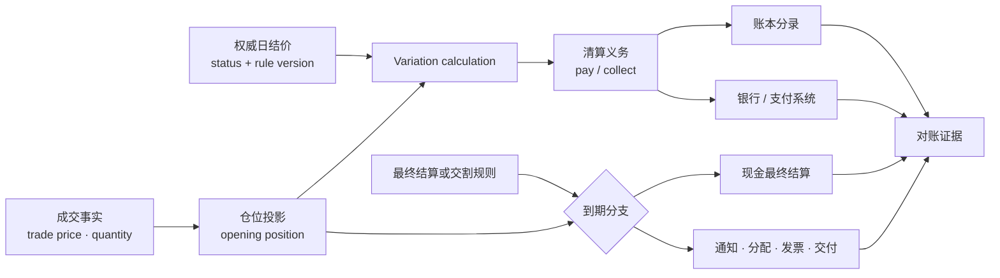
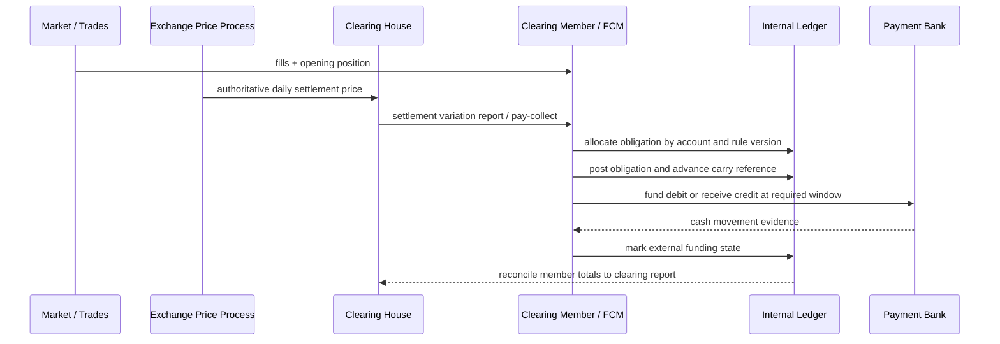
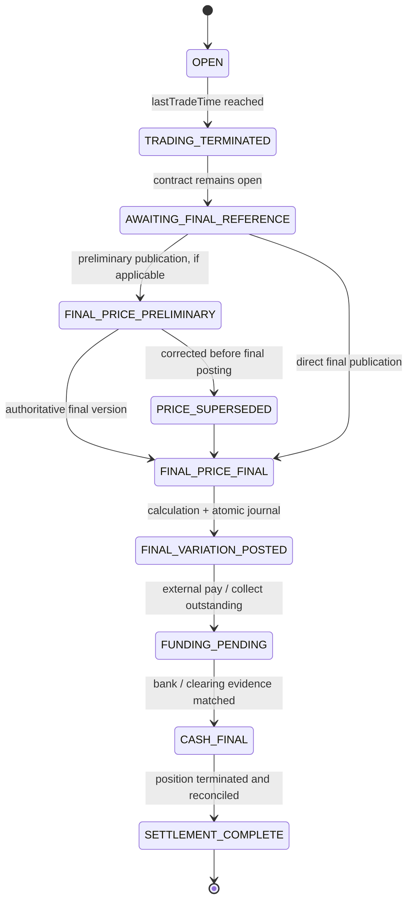
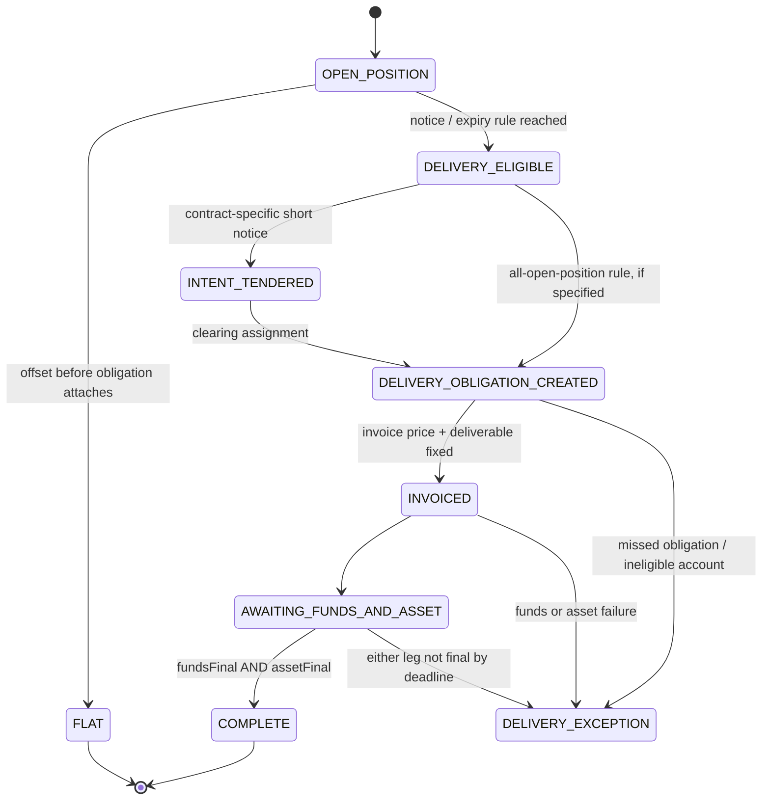
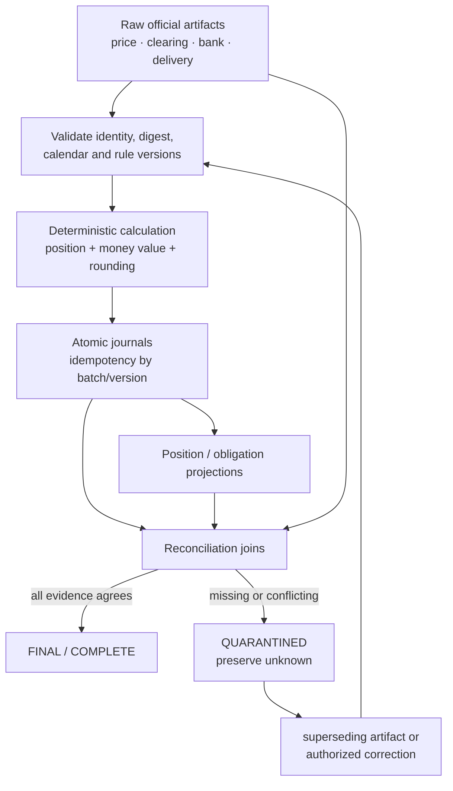

一张期货仓位不会因为屏幕上的倒计时归零，就自动变成一笔“已结算盈亏”。在持仓期间，它通常每天按权威结算价产生现金变动；临近到期，它还会经过最后交易、通知、最终价格确定、资金收付或交割义务履行等不同阶段。任何一个阶段用错价格、日期、合约版本或外部回执，都可能让仓位、余额和清算报告各自看起来合理，合在一起却无法闭合。

本文的论点是：**期货结算不是一次价格计算，而是一条由产品规则驱动、以清算证据封口的状态转换链。** 每日盯市把价格路径切成可收付的 Variation Margin；最终结算决定剩余仓位走现金还是交割分支；账本、银行和交割系统则分别证明义务、资金与标的是否真的完成。

阅读前应先理解 [交易品种主数据与规则版本](/signal-grid-blog/posts/trading-instrument-master-market-state-and-rule-versioning/) 和 [合约仓位生命周期](/signal-grid-blog/posts/position-lifecycle-and-pnl/)。前者回答“这是什么合约、哪版规则在何时生效”，后者回答“哪些成交形成了多少仓位”；本文接着回答“开放仓位怎样每天产生现金，最后又怎样退出清算系统”。

> 本文讨论交易系统与清算工程，不构成交易、法律、税务或会计建议。CME、ICE 等 venue 的例子只用于说明机制差异；最后交易日、结算算法、通知期限、可交割品、仓位限额、资金截止时间与违约处置，必须以具体合约在目标业务日期生效的规则、清算所程序和清算会员协议为准。

## 结算首先是一条权威事实链，而不是“取当天收盘价”

“价格”一词经常把交易事实、风险估值和清算事实混在一起。结算系统至少要分清以下四种输入：

| 价格 | 回答的问题 | 典型用途 | 不能证明什么 |
| --- | --- | --- | --- |
| `lastTradePrice` | 最近一笔成交在哪里发生 | 行情展示、成交回放 | 不能证明它仍有代表性，也不能自行成为结算价 |
| `markPrice` / 风险参考价 | 当前仓位按什么口径估值 | 未实现盈亏、保证金与清算风险 | 名称和算法不跨 venue 通用；不能代替正式清算结果 |
| `dailySettlementPrice` | 本清算日按哪一价格计算日终 pay/collect | 每日盯市、Variation Margin、次日 carry reference | 不必等于最后成交，也不必等于到期最终结算价 |
| `finalSettlementPrice` / `EDSP` | 到期剩余义务按什么值终结 | 最终现金差额或交割发票规则 | 不保证在最后一笔成交时已经可知 |

[CFTC Futures Glossary](https://www.cftc.gov/LearnAndProtect/AdvisoriesAndArticles/CFTCGlossary/index.htm) 将 settlement price 定义为清算机构用于清算成交、结算清算会员账户的每日价格，并将 mark-to-market 描述为每天把价格损益加到或减到账户余额的现金流系统。这个定义中的关键不是“收盘”，而是**由规则授权、供清算使用**。

具体算法则属于产品规则。CME 的[每日结算程序总表](https://www.cmegroup.com/market-data/cme-group-settlement-procedures.html)明确覆盖不同 futures/options 产品，并提醒 preliminary settlement price 可能不同于 final settlement price。某些合约使用结算窗口内的成交量加权平均，流动性不足时再按规则逐级使用价差、报价或前结算；ICE UKA Futures 当前公开规格则写明，其日终结算使用指定窗口内的成交加权平均，低流动性时可能使用 quoted settlement price。二者都说明：

```text
settlementPrice != blindly(lastTradePrice)
settlementPrice != necessarily(markPrice)
dailySettlementPrice != necessarily(finalSettlementPrice)
```

系统不应只保存一个 `price=5000`，而要保存它的身份与证据：

```text
SettlementPriceFact {
  venue,
  clearingVenue,
  instrumentId,
  contractMonth,
  businessDate,
  priceType,          // DAILY | FINAL | DELIVERY_INVOICE_REFERENCE
  publicationStatus, // PRELIMINARY | FINAL | CORRECTED
  priceAtoms,
  currency,
  scale,
  publishedAt,
  effectiveRuleVersion,
  sourceDocumentId,
  sourceDigest,
  supersedes?
}
```

`publicationStatus` 不能省略。收到 preliminary price 可以驱动预估、预警或待确认计算，但只有系统合同所接受的权威状态才能让正式结算批次不可逆入账。若最终价更正，新的事实应通过 `supersedes` 指向旧版本，不能原地改掉历史价格，让已经生成的分录失去输入。

### 产品主数据必须包含“怎样结束”，而不只是 expiry

一个 `expiry` 时间戳无法描述完整的期货生命周期。实际系统至少要把以下规则绑定到版本化产品事实：

```text
FuturesSettlementRuleVersion {
  instrumentId, version, effectiveFrom, effectiveTo,
  clearingVenue, businessCalendarRef, timezone,

  moneyValueRuleRef, settlementCurrency, roundingRuleRef,
  dailySettlementMethodRef, dailySettlementWindow,
  dailyPricePublicationPolicy,

  lastTradeTime,
  firstNoticeTime?, lastNoticeTime?,
  finalObservationWindow?, finalPricePublicationTime?,
  finalSettlementTime,

  settlementMethod, // CASH | PHYSICAL | CONTRACT_SPECIFIC_OPTION
  finalSettlementMethodRef,
  deliveryTermsRef?, deliverableSpecRef?,
  deliveryPeriod?, invoicePriceRuleRef?,
  positionLimitScheduleRef?, deliveryEligibilityRef?,

  correctionPolicyRef, disruptionFallbackRef,
  sourceUri, sourceDigest
}
```

这里的问号不是鼓励默认为空，而是表示并非每个合约都有同一种通知或交割阶段。例如现金结算指数期货通常没有可交割仓单；某些实物交割合约有 first notice day，另一些则规定停止交易时仍开放的全部仓位直接形成交割义务；还有合约允许按特定程序在 EFP delivery 与现金结算之间选择。**缺字段时必须由产品类型证明“不适用”，不能由业务代码猜默认值。**



这张图刻意把“计算义务”和“资金已经到账”画成两个节点。结算价发布只能证明计算输入出现了；Variation 计算只能证明谁应付谁；银行回执、清算报告和账本提交共同完成后，系统才有资格宣称资金已结算。

## 每日盯市把价格路径切成现金流，但不会改变总损益

期货保证金不是买入标的的首付款。Initial Margin / Performance Bond 用来覆盖未来潜在暴露，Variation Margin 则处理已经发生的当前价格暴露。ICE Clear Europe 的 [PFMI Disclosure](https://www.ice.com/publicdocs/clear_europe/ICE_Clear_Europe_Disclosure_Framework.pdf) 也明确区分：IM 面向潜在未来暴露，VM 对应当前暴露和 settlement movement。

因此，开放期货仓位通常不是等到平仓才一次性确认从入场价到退出价的全部现金损益。清算系统每天把“上一个结算基准到今天结算价”的变化收付掉，再把今天的结算价作为下一周期的 carry reference。

### 先由产品规则定义 Variation，再看线性合约的可分解示例

令：

- `q0`：日初带符号净仓位，多头为正、空头为负；
- `S_prev`：上一清算日的正式结算价；
- `S_today`：本清算日的正式结算价；
- `Δq_j`：当日第 `j` 笔成交带来的带符号数量，买入为正、卖出为负；
- `T_j`：该笔成交价；
- `cycleAuxInputs`：本周期规则要求的 FX、曲线、转换因子或其他辅助输入。

跨产品真正通用的原语应由产品版本选择完整算法：

```text
VM_cycle = settlementVariation(
  ruleVersion,
  openingPosition = q0,
  trades = {(Δq_j, T_j)},
  priorCarryReference = S_prev,
  currentSettlement = S_today,
  cycleAuxInputs)

q_close = q0 + Σ_j Δq_j
```

若产品采用可加的 normal futures money-value 规则，并暂时忽略最终的规则化舍入，上式才可以展开成便于教学的形式：

```text
VM_cycle
  = q0 × [M(S_today) - M(S_prev)]
  + Σ_j Δq_j × [M(S_today) - M(T_j)]
```

第一项处理周期开始时带入的仓位；第二项把本周期每笔新成交从成交价结到当前结算价。它也自然处理了周期内平仓：一笔方向相反的成交会抵消原仓位在“成交之后到结算价”这一段的影响，最终留下上一 carry reference 到实际平仓价的损益。

[CME Money Calculations for Futures and Options](https://www.cmegroup.com/clearing/files/CME-Money-Calculations-Futures-and-Options.pdf) 给出的 normal method 具有“新成交从 trade price 结到 settlement、带入仓位从 prior settlement 结到 current settlement”的结构；同一文档的 special-notional 与 inverse 示例却要求按另一顺序组合价差、数量、factor、FX 与舍入。生产系统不能把 `M(P)` 永远写成 `P × multiplier`，也不能假定“逐笔先舍入再相加”等于“聚合后舍入”。应完整执行产品定义的 money-value、辅助输入和 rounding pipeline；不要先用浮点数算一个“差不多”的 PnL。

如果清算所在同一业务日发出 intraday cycle，每个周期都要有自己的 `cycleId`、输入 cut、prior/current carry reference 和 obligation。日终总额是各周期权威 obligation 的和，而不是再次用昨日结算价覆盖整天重算，否则盘中已经结过的区间会重复计入。

### 三天时间线说明“重置”到底重置了什么

考虑一个简化的线性指数期货：每点价值 `50 USD`，交易者买入 `2` 张。忽略手续费，按每个阶段给出的价格直接结算：

| 阶段 | 事件 | 本阶段 Variation | 累计已结现金 | 下一阶段 carry reference |
| --- | --- | ---: | ---: | ---: |
| D0 成交 | 以 `5000` 买入 2 张，日结 `5004` | `2 × 50 × (5004 - 5000) = +400` | `+400 USD` | `5004` |
| D1 日结 | 日结价变为 `4998` | `2 × 50 × (4998 - 5004) = -600` | `-200 USD` | `4998` |
| D2 平仓 | 以 `5003` 卖出 2 张 | `2 × 50 × (5003 - 4998) = +500` | `+300 USD` | 无开放仓位 |

在这个线性、整数点值且没有路径舍入差的例子中，累计结果仍然是：

```text
2 × 50 × (5003 - 5000) = +300 USD
```

所以每日盯市在经济上把同一价格路径分段收付，并不凭空创造或抹掉损益；真实产品的逐周期舍入、费用和其他现金项仍可能产生必须按规则解释的残差。分段后的现金尤其重要：D0 的盈利可能已经可用，D1 的亏损也必须在清算截止时间前被支付；即使 D2 最终盈利，账户仍可能因 D1 无法满足资金义务而提前进入违约或强制处置流程。**最终方向正确，不能补救中途现金流断裂。**



图中的先后关系是逻辑依赖，不是所有 venue 的固定时刻表。carry reference 由已接受的结算价和本周期计算推进，与银行是否已经完成收付是正交状态；付款失败会留下未履行义务并进入资金/default 流程，却不能让下一周期继续沿用旧 reference、重复计算同一段价格变化。CFTC 对 Variation Margin 的定义包含 daily **或 intraday** payment；清算所可以在日终之外追加盘中调用。系统应把 `cycleId`、`callType` 和截止时间放进结算批次，而不是假定“每天午夜跑一次”。

### Carry reference 重置，不等于删除原始成本

工程讨论里常说“每日结算后成本价被重置为结算价”。更精确的表达是：

- 清算计算的下一周期参考价重置为正式结算价；
- 从该参考价之前产生的 Variation 已经进入应收应付或现金流程；
- 原始成交价、成交序列和累计 Variation 仍必须保留；
- UI 的平均入场价、策略成本、会计成本与税务成本是否重置，是另外的产品、报表和法域问题。

如果数据库只覆盖 `averageEntryPrice = settlementPrice`，历史重放就无法证明“为什么账户已经收了 400、又付了 600”。正确模型至少同时保留：

```text
originalTradeFacts
currentPositionQty
currentCarryReference
cumulativeSettledVariation
pendingVariation
lastFinalSettlementPriceVersion
```

这样既能从成交解释整个经济结果，也能从 carry reference 精确计算下一周期，而不把“已实现/未实现”的 UI 命名误当成现金是否真正支付的证据。

## Variation Margin 必须穿过清算、资金与账本三层

Variation calculation、clearing obligation 和 cash settlement 是三个不同状态：

```text
CALCULATED -> OBLIGATION_FINAL -> FUNDING_PENDING -> FUNDED -> RECONCILED
```

`CALCULATED` 只说明公式得到一个金额；`OBLIGATION_FINAL` 说明清算所或会员侧报告确认应收应付；`FUNDED` 需要支付银行或受认可资金系统的证据；`RECONCILED` 则要求内部账本、清算报告与银行实际变动在同一批次上闭合。把它们压成 `settled=true`，会让超时后的重试无法判断究竟应该重新计算、重新记账，还是只查询银行结果。

### CCP、清算会员与终端客户不是同一个账户边界

中央对手方通常直接面对 clearing member，而不是会员的每个终端客户。会员可能在清算层按 proprietary/customer account、币种和规则允许的净额收到一个 pay/collect，再在内部按账户、仓位和成交分摊。FCM 对客户还可以设置高于交易所/清算所的保证金要求。

因此下面两个推断都不成立：

- “会员在某币种净收 0，所以每个客户都没有 Variation”；
- “客户界面已增加余额，所以清算所已经把钱付到银行”。

每一层都需要自己的 obligation identity、netting scope 与证据。建议显式保存：

```text
ClearingObligationKey {
  clearingVenue,
  clearingMemberAccount,
  businessDate,
  cycleId,
  settlementCurrency,
  externalReportVersion
}

CustomerAllocationKey {
  legalEntity,
  customerAccount,
  instrumentId,
  positionSnapshotId,
  clearingObligationKey,
  allocationRuleVersion
}
```

### 分录要表达“应收应付”与“已经收付”

下面从 FCM / 平台法律实体视角给出一个简化的客户透传模型。它只是工程上的账户边界示例，不替代实际会计准则、客户资产隔离或监管科目。继续使用上一节的 `+400 / -600 USD`：

| 事件 | 借方 | 贷方 | 证明了什么 |
| --- | --- | --- | --- |
| 清算报告确认客户应得 `400` | CCP Variation 应收资产 `+400` | 客户已结算现金负债 `+400` | 形成应收与对客户义务，尚未证明银行到账 |
| 支付银行收到 `400` | 清算银行现金资产 `+400` | CCP Variation 应收资产 `-400` | 外部应收已转成现金 |
| 下一日客户应付 `600`，且客户余额充足 | 客户已结算现金负债 `-600` | CCP Variation 应付负债 `+600` | 客户权益减少并形成对 CCP 的应付 |
| 支付银行付出 `600` | CCP Variation 应付负债 `-600` | 清算银行现金资产 `-600` | 外部应付已经履行 |

若客户余额不足，不能为了让分录平衡而把余额静默改成任意负数。系统可能按合同形成 customer receivable、触发 margin call、限制新增风险、强制减仓或进入客户违约流程，但**清算会员对 CCP 的付款期限不会因为内部客户页面尚未更新就自动暂停**。会员需要用自身流动性先履行清算义务还是采取其他安排，取决于适用规则和协议。

这也解释了为什么初始保证金与 Variation 不能共用一个“margin delta”：

| 量 | 经济角色 | 常见状态 | 失败含义 |
| --- | --- | --- | --- |
| Initial / Original Margin | 覆盖平仓期间潜在未来暴露 | 抵押、折价、可退还但受限制 | 缓冲不足会引发追加或风险缩减 |
| Variation Margin / Settlement Variation | 结算已经发生的当前价格变动 | 现金 pay/collect 或规则指定结算方式 | 未按时支付可能直接成为资金违约 |
| Delivery Margin / Buyer-Seller Security | 覆盖交割阶段的履约风险 | 通常在交割期间单独占用 | 不代表标的或全额发票款已经交付 |

ICE Clear Europe 的[资金与银行页面](https://www.ice.com/clear-europe/treasury-and-banking)分别列出可用于初始保证金的抵押品、Variation Margin 的币种及含现金变动的清算报告；CME 的交割说明也明确，进入可交割状态后还可能单独收取 delivery margin。系统数据模型应保留这些 bucket 的原因和限制，不能只显示一个 `marginBalance`。

### 分配、净额与舍入都必须可重放

会员外部报告与客户内部结果之间可能存在：

- 产品级或组合级净额；
- customer 与 house account 隔离；
- 不同币种及 FX 转换；
- 逐成交、逐仓位或逐账户的舍入差；
- 费用、利息和其他现金项目；
- clearing report 的后续更正。

因此，分配引擎的输出必须绑定 `positionSnapshotId + priceVersion + allocationRuleVersion + roundingRuleVersion`。舍入残差也应进入有明确科目的 residual account，不能被随意塞给最后一个客户。对于同一外部 report version，所有内部 journal 只能提交一次；收到重复文件或重启重放时，幂等键必须阻止二次入账。

## 最后交易日之后，现金结算才开始决定最终事实

`lastTradeTime` 只说明该合约何时停止接受新的正常交易，不自动等于：

- 最终参考值已经可得；
- 最终 Variation 已经计算；
- 银行资金已经完成；
- 仓位已经在所有投影中归零；
- 交易所不再发布更正。

现金结算合约通常在最终参考价正式确定后，把开放仓位从上一 carry reference 结到 final settlement price，再终止合约仓位。对一个在最终阶段没有其他成交的线性仓位，可以写成：

```text
FinalVariation
  = signedQty × [M(FinalSettlementPrice) - M(PreviousCarryReference)]
```

这通常结算的是剩余价格差额，并不是要求多头支付整个名义本金、空头再收到整个名义本金。具体合约若定义其他现金流、转换因子或交付价值，仍以其规则为准。

### 最终结算价可以来自完全不同的观察过程

CME 的[股指期货最终结算程序](https://www.cmegroup.com/trading/equity-index/settlement.html)给出一个清楚的反例：多种美国股指期货以成分股开盘价形成的 Special Opening Quotation（SOQ）现金结算。成分股并不会同时开盘，SOQ 也可能不同于屏幕上当时的普通指数值，甚至未必落在当日连续指数的直觉范围内。

ICE 也展示了合约级差异：

- [30-Year Euro Swapnote Future](https://www.ice.com/products/37612668/THIRTY-YEAR-SWAPNOTE-FUTURE) 的 EDSP 依据固定名义现金流和指定曲线折现，并有自己的舍入规则；
- [Brent Crude Futures](https://www.ice.com/products/219) 的公开规格描述了 EFP delivery 与按 ICE Brent Index 现金结算的合同选择，现金结算价在最后交易日之后发布。

所以“最后交易价就是到期价”“最后交易日结束立刻能关账”“所有现金期货都按收盘指数结算”都不成立。系统需要把 observation、publication、calculation、funding 和 position termination 分开：



这里没有用 `EXPIRED` 代表资金终局，因为合约的法律到期时刻由产品规则决定，不能被内部银行状态改写。`SETTLEMENT_COMPLETE` 是本文采用的强完成语义：它表示价格、分录、资金与仓位已经闭合。交易查询层可以更早显示 `TRADING_TERMINATED`、`CONTRACT_EXPIRED` 或 `AWAITING_SETTLEMENT`，但不能把“不可再交易”或“合约已到期”误报为“全部义务完成”。如果目标 venue 在资金完成前就把交易持仓移出普通 position report，内部仍要保留独立 settlement obligation，直到外部证据闭合。

### 最终价格更正必须留下经济轨迹

如果 preliminary 价格尚未正式入账，最简单的处理是废弃旧计算并基于 final version 重算。如果旧版本已经按照明确制度产生了正式分录，后续更正必须：

1. 保存新的权威价格事实并指向被替代版本；
2. 找到所有使用旧 `priceVersion` 的 calculation 与 journal；
3. 生成冲正和补记，或使用制度允许的差额调整事件；
4. 重新对账仓位、客户分配、清算报告和银行现金；
5. 保留两个版本、原因、审批和外部通知证据。

这是一条有界的更正协议，不是“直接 UPDATE settlement_price”。只有完整轨迹才能同时回答：旧报表当时为什么成立、新报表为什么变化、客户是否收到/支付了差额。

## 实物交割把仓位变成通知、分配、发票和标的义务

“实物交割”并不总意味着卡车开到交易所门口。可交割对象可能是仓单、shipping certificate、vault receipt、国债、排放配额、注册系统中的权利，或通过管道/电网提名的交付量。真正的共同点是：开放合约最终变成了**交付合格标的与支付交割价款的双边义务**。

[CME 的 Delivery 101](https://www.cmegroup.com/articles/brochures-and-handbooks/101-overview-delivery.html)用一个明确标为示例的三阶段过程说明：short clearing member 提交交割意向，CME Clearing 将其与 long clearing member 匹配；随后生成 notice/invoice；最后完成交付和付款。页面同时强调，实际流程因产品而异。

ICE 的 [EUA Futures](https://www.ice.com/products/197)又给出另一种“physical”的具体形态：一张合约代表指定数量的排放配额，开放仓位要在规定 delivery period 内通过 Trading Account 转移配额；产品规格还分别定义 delivery delay 与 delivery failure。这个例子说明，系统不能根据 `settlementMethod=PHYSICAL` 就自动生成“仓库地址”字段。

### First Notice Day 不是统一的强平日

CFTC glossary 将 First Notice Day 定义为首次可以收到实物交割意向通知的日期。它不是以下任何一个行业通用规则：

- 所有客户必须在这一天之前平仓；
- 这一天就是 last trading day；
- 这一天立刻发生标的转移；
- 只有 short 有风险，long 可以随时忽略通知。

经典通知型合约里，short 可能在允许窗口提交 intent，清算所再按规则把义务分配给合格 long；一旦 notice/assignment 生效，之后卖出一张期货未必能撤销已经形成的交割义务。另一些合约没有相同的 first-notice 流程，而是让停止交易时仍开放的仓位直接进入交割。

经纪商或 FCM 还可能在交易所期限之前设置自己的 close-out、资金或交割资格截止时间。它是会员对客户的控制边界，不应覆盖交易所主数据中的 official last trade / notice date。系统应同时保存：

```text
exchangeRuleDeadline
clearingHouseDeadline
memberCustomerCutoff
sourceAndRuleVersionForEach
```

### 仓位限额与交割能力是两个门，不是一个数字

CFTC 的[衍生品仓位限额说明](https://www.cftc.gov/IndustryOversight/MarketSurveillance/SpeculativeLimits/index.htm)显示，联邦 spot-month limits 适用于指定的 referenced contracts，并按规则区分实物结算与现金结算头寸；某些合约还有随临近到期逐步下降的限额。交易所还可设置自己的 limits 或 accountability levels，并存在严格条件下的 bona fide hedge 等豁免。

因此系统不能写一个跨产品的 `maxPosition=1000`，更不能假定“套保账户无限制”。至少需要：

- 按业务日期生效的 limit schedule；
- futures-equivalent 聚合与关联账户规则；
- spot / non-spot、cash / physical 的分组；
- 已审批豁免的范围、数量和有效期；
- 当前 deliverable supply 或规则引用；
- 会员自身更严格的客户限额。

通过仓位限额也不代表有交割能力。进入 delivery period 前，long 需要能够支付 full delivery value 并接收合格标的；short 需要控制合格可交割品、交割凭证或提名能力。清算会员还要验证账户、银行、仓库/注册系统身份、制裁与合规状态、操作人员和截止时间。

### Assignment 是清算分配，不是订单簿再次撮合

订单簿的 fill 决定期货仓位怎样形成；delivery assignment 决定已经进入交割流程的 short obligation 对应哪一个 long clearing member。二者可以使用完全不同的顺序、分配和账户粒度。系统需要新的身份：

```text
DeliveryObligation {
  deliveryId,
  instrumentId,
  ruleVersion,
  contractMonth,
  clearingLongAccount,
  clearingShortAccount,
  assignedQuantity,
  deliverableSpecVersion,
  deliveryLocationOrRegistry,
  invoicePriceVersion,
  invoiceAmount,
  noticeId?,
  assignmentId?,
  deliveryWindow,
  fundsDeadline,
  assetDeadline,
  state
}
```

发票金额也不一定是 `futuresPrice × simpleMultiplier`。可交割品可能有质量、地点、应计利息、conversion factor、升贴水或其他 invoice rule。结算服务必须保存“选择了哪一种 deliverable、使用哪版因子、怎样舍入”，否则钱和物都到账后仍可能无法解释差额。



这个状态机中的 `INTENT_TENDERED` 和直达 `DELIVERY_OBLIGATION_CREATED` 是互斥的产品分支，不是要求每个合约都走两遍。`COMPLETE` 则必须同时依赖资金和标的终局证据；仓库/注册系统显示资产已转移但发票款未完成，或者银行已付款但 deliverable 未转移，都只能停在 exception/pending，而不能把仓位和义务一起删掉。

## 资金失败、交割失败和成员违约是不同的边界

结算系统最危险的降级方式，是把所有异常都写成“稍后重试”。有些异常确实只是权威数据暂未到达；有些已经越过付款或交割截止时间，必须进入合同定义的 default / failure 流程；还有些发生在客户—会员层，但会员—CCP 层的义务仍然准时到期。

下面的失败矩阵把检测信号、允许动作和禁止伪造的事实放在一起：

| 故障 | 系统看到什么 | 正确边界 | 必须守住的不变量 |
| --- | --- | --- | --- |
| 日结价缺失或仍为 preliminary | 结算窗口结束但没有可接受 final version | 冻结正式批次；只使用合约 disruption/fallback rule 明确允许的输入 | 不用 last、mark 或人工猜价冒充正式结算 |
| 官方价格更正 | 新 price version supersedes 已消费版本 | 废弃未提交计算；对已提交结果做可追踪冲正/补记 | 旧、新价格及其所有 journal 关系可审计 |
| 客户 Variation 资金不足 | 内部分配为负且可用资金不够 | 客户 margin/default 流程；清算会员外部义务独立处理 | 不把未收款标成 funded，不因内部短缺修改 CCP 报告 |
| 清算会员未按时付款 | CCP payment call 未满足 | 由有权的 CCP 按 clearing rules 判断是否宣告 member default，并执行相应 default management | 普通重试不能越过法定/合同截止时间掩盖违约 |
| 支付银行超时或回执 unknown | 指令已发出但结果未知 | 查询原指令、银行流水和唯一 reference；必要时升级流动性事件 | 结果未知时不得盲发第二笔或宣称已支付 |
| long 无 full invoice funds | 已 assignment/invoice，但买方资金未就绪 | delivery failure / customer or member default，按规则处置 | 不能仅因仓位已从交易界面消失就完成交割 |
| short 无合格 deliverable | 凭证、品级、地点、注册账户或数量不满足 | delivery failure，调用替代、损害赔偿或违约程序 | 不创建不存在的仓单/配额/资产转移 |
| 标的转移成功、资金失败，或反之 | 两条外部腿状态分裂 | 保持 delivery obligation 打开并隔离后续动作 | `COMPLETE => assetFinal && fundsFinal` |
| 重复清算文件或恢复重放 | 相同外部 report/version 再次到达 | 以外部 identity + digest 幂等，内容冲突则隔离 | 同一经济义务最多产生一组有效 journal |
| 日历或产品版本不一致 | 本地认为未到期，外部已进入 notice；或反之 | 停止该合约自动结算，核对生效版本与 source notice | 不跨 rule version 混用价格、仓位和期限 |

### CCP 降低对手方风险，不等于兜底所有结果

CME 的公开交割说明给出了一个必须精确保留的边界：CME Clearing **不保证实物本身完成交付**；当 delivery failure 发生时，其规则下承担的是对无过错清算会员的金融履约责任，例如由 Clearing House 决定的合理 replacement cost。它不因此必须亲自交付或接收实际标的。

同一页面还说明，清算会员未及时履行对 Clearing House 的义务、破产或资不抵债可触发 default；违约资源的使用与后续 financial safeguards waterfall 依规则进行。工程上不能把这翻译成“用户肯定拿到原物”或“所有损失都由 CCP 无限承担”。正确表达是：

```text
customer obligation failure
  != automatically clearing-member default

clearing-member default
  != ordinary payment retry

financial performance protection
  != guaranteed physical performance
```

应用状态也应把 `CUSTOMER_DEFAULT_REVIEW`、`MEMBER_DEFAULT_DECLARED`、`DELIVERY_FAILURE` 和 `OPERATIONAL_UNKNOWN` 分开。谁有权宣告 default、何时可平仓/转移仓位、怎样使用保证金和 guaranty resources，属于规则和法律权限，不能由一个定时任务看到 `timeout` 后自行决定。

### 安全降级不是把权威事实降级成估计值

在价格源、银行或交割基础设施中断时，系统仍可以做很多安全动作：停止扩大到期仓位、保留现有 obligation、提高人工升级级别、生成流动性需求预测、保存所有外部原始报文。但它不能为了让 dashboard 变绿而：

- 用 last trade 填 settlement price；
- 把发出的支付指令当成已支付；
- 把 assignment 当成 asset delivered；
- 删除无法匹配的清算差额；
- 用当前产品规则重算旧业务日。

这些限制不是保守风格，而是恢复能力的前提：只有 unknown 仍被如实保存，后续回执才能把状态推进到唯一正确结果。

## 对账与恢复要重建同一结算批次，而不是修一个余额

期货结算至少跨越五套权威或准权威事实：

1. 交易与仓位：fills、exercise/expiry、cleared position report；
2. 价格：daily/final settlement publication 及版本；
3. 清算：member statement、pay/collect、margin 与 delivery report；
4. 资金：payment bank、APS 或其他受认可支付系统流水；
5. 交割：notice、assignment、invoice、仓库/注册系统/托管人回执。

内部账本是平台经济事实的权威记录，但它不能单独证明外部清算所、银行或注册系统已经完成相应动作。恢复不是选一份看起来最新的余额覆盖其他系统，而是把同一批次的来源、计算、分录和外部结果重新连接。

### 结算批次要有稳定身份和单向状态推进

先用不含外部报告版本的稳定键标识同一个经济周期：

```text
SettlementCycleKey = hash(
  legalEntity,
  clearingVenue,
  clearingMemberAccount,
  businessDate,
  cycleId,
  settlementCurrency
)
```

随后让每一版外部事实形成不可变批次版本，并显式链接被替代版本：

```text
BatchVersionId = hash(
  SettlementCycleKey,
  externalReportVersion,
  sourceDigest)

supersedesBatchVersionId?
```

这样重复交付同一版本不会二次入账，而正式更正仍属于同一个经济周期，可以通过冲正/补记推进，不会伪装成毫无关系的新业务。批次版本内部再保存：

```text
inputPositionSnapshotId
inputPriceVersions[]
productRuleVersions[]
calculationDigest
externalObligationIds[]
customerAllocationIds[]
journalIds[]
paymentInstructionIds[]
deliveryObligationIds[]
reconciliationState
```

状态只能基于证据向前推进；更正通过新 version 与冲正推进，而不是把旧状态倒写成“从未发生”。原始清算文件、银行回执和 delivery notice 应以不可变对象保存 digest，解析后的数据库行则必须能反查到原始字节与 parser version。



### 不变量比“任务成功”更能证明恢复正确

一次 batch job 返回 0，只能证明进程没有主动报错。下面这些不变量才约束经济结果：

| 不变量 | 表达 | 能发现什么 |
| --- | --- | --- |
| 仓位守恒 | `closing = opening + signedTradeDeltas + signedTerminalDeltas`，其中现金到期或实物交割的 terminal delta 必须使 long/short 都向 0 收敛 | 漏成交、重复到期、交割后仍留仓 |
| Variation 路径闭合 | 每个 cycle 用当时的 `settlementVariation(ruleVersion, cycle inputs)` 重算后，与 clearing obligation 和 ledger 逐周期一致；累计解释显式包含舍入、费用及其他现金残差 | carry reference/aux input 错、漏周期、重复入账 |
| 分录平衡 | 每个 legal entity / book / asset / journal 内借方等于贷方 | 单腿入账、跨币种错误相加 |
| 清算分配闭合 | 客户/house 分配加 residual 等于外部 member obligation | 净额范围错、舍入丢失、账户串线 |
| 资金终局 | `FUNDED` 必须引用唯一银行终局回执，金额、币种、value date 一致 | 指令 unknown 被当成功、重复付款 |
| 现金结算终局 | `CASH_SETTLEMENT_COMPLETE => position=0 && finalVariationPosted && fundingFinal` | 仅停盘或合约到期就误报全部义务完成、最终资金悬空 |
| 实物交割终局 | `COMPLETE_PHYSICAL => assetFinal && fundsFinal && invoiceMatched` | 钱物单边完成、错 deliverable |
| 版本一致 | 每项 calculation 的 price、product、calendar、rounding 在业务日期同时有效 | 用新规则改算旧历史 |
| 幂等 | 同一 external identity/version 最多一组有效 journal；冲正有显式引用 | 文件重放、灾备切换后重复加钱 |

“Variation 路径闭合”需要尊重产品算法，不能强求一个错误的无限精度路径等式。CME 的 money-calculation 文档展示了 normal、special-notional 与 inverse 规则在辅助输入、聚合和舍入位置上的差别；测试应对每个周期执行当时版本的完整 `settlementVariation`，与 clearing report 的精确结果逐周期比较。跨周期累计结果若包含舍入、费用或其他现金项，也必须进入显式 residual/科目和对账解释，而不是被当成计算噪声抹掉。

### 对账必须同时看 position、cash 和 delivery

每天至少要形成三类差异，而不是一个总的 `reconciliationStatus`：

```text
PositionBreak
  = internalClearedPosition - clearingPositionReport

CashBreak
  = internalFundedCashMovement - paymentBankMovement

ObligationBreak
  = internalOpenSettlementOrDeliveryObligations
    - clearingOpenObligationReport
```

三者可能独立出现：仓位已经在 clearing report 归零，但银行最终现金尚未到；Variation 现金完全对上，但某份 delivery assignment 没有进入内部系统；资金和仓位都对上，客户分配却因为舍入版本错误而不闭合。

差异记录至少要包含 firstSeen、age、amount/quantity、currency/deliverable、source versions、owner 与 allowed next transition。自动修复只能执行预先证明幂等、不会制造第二笔外部效果的动作，例如重新拉取报告、重建投影或查询已有 payment reference；新发付款、人工调账、替换结算价或宣告 default 都需要更高权限和独立证据。

### 一次恢复怎样证明没有多付、少付或错交割

恢复时应从不可变外部 artifacts 和内部 journals 重建 projection，而不是从旧缓存继续：

```text
official price versions
  + cleared position snapshot
  + effective product / calendar / rounding rules
  -> deterministic obligations
  -> idempotent journals
  -> payment and delivery joins
  -> invariant evaluation
```

故障注入应覆盖几个真正改变证明边界的时点：

| 注入点 | 重启后允许的结果 | 不允许的结果 |
| --- | --- | --- |
| price 已保存、calculation 未提交 | 用同一 price version 重算出同一 digest | 换成当前 price 或 current rule |
| journal 原子提交后、offset 未保存 | 幂等查询返回既有 journal | 再生成一组相同分录 |
| payment 发出后超时 | 以原 reference 查询终局 | 自动生成第二个 payment |
| asset delivered、funds unknown | 保持 obligation 非 COMPLETE | 因一条腿成功而关单 |
| clearing correction 到达中途宕机 | 最终只有旧有效分录加一组可追踪冲正/补记 | 原地覆盖旧金额、无法解释历史报表 |
| 灾备从旧快照恢复 | 从 checkpoint 后 artifacts 重放并得到相同 batch/invariants | 用旧 carry reference 重复结算一个业务日 |

通过条件不是“消费者追上最新 offset”，而是：所有应处理 batch 的唯一身份稳定，journal 没有重复，外部付款没有重发，仓位/现金/交割差异归零或被明确隔离，并且上述不变量全部成立。

## 结论：结算完成必须由价格、义务与外部终局共同证明

期货结算的因果链现在可以压缩成四句话：

1. daily/final settlement price 是带规则版本与发布状态的权威事实，不是 last 或 mark 的别名；
2. 每日盯市把总价格损益切成多次 Variation cash flow，重置的是下一周期 carry reference，不是原始成交历史；
3. 到期后，现金结算以最终参考值完成剩余差额，实物交割则通过 notice、assignment、invoice、资金与 deliverable 的状态机完成；
4. 只有内部 journal、清算报告、银行资金和交割回执共同满足不变量，系统才能从 `calculated` 走到真正的 `final`。

这套模型能保证的是：每个金额和状态都能追溯到成交、价格、产品规则与外部证据，重复消息或重启不会再次产生经济效果，失败时也不会把 unknown 伪装成完成。它不能保证市场永远有流动性、客户或会员永不违约、标的一定按原物交付，也不能把某家 venue 的期限和处置方式推广为全行业规则。

下一篇可继续阅读 [永续合约资金费率：溢价、结算与基差交易](/signal-grid-blog/posts/perpetual-funding-rate/)，比较“没有到期日的周期现金流”与本文逐日/最终结算的差别；随后由 [费率与返佣引擎](/signal-grid-blog/posts/trading-fee-rebate-engine-versioning-reconciliation/) 固化费用现金流，最后进入 [交易账本与双重记账](/signal-grid-blog/posts/trading-ledger-double-entry-accounting-and-reconciliation/)，把 Variation、最终现金结算、费用和交割应收应付接入完整的不可变账本。

## 官方参考

- [CFTC：Futures Glossary](https://www.cftc.gov/LearnAndProtect/AdvisoriesAndArticles/CFTCGlossary/index.htm)——Settlement Price、Final Settlement Price、Mark-to-Market、Variation Margin、First Notice Day、Cash Settlement 与交割凭证等术语边界。
- [CFTC：Position Limits for Derivatives](https://www.cftc.gov/IndustryOversight/MarketSurveillance/SpeculativeLimits/index.htm)——联邦 referenced contracts、spot-month limits、cash/physical 分组及豁免边界。
- [CME Group：Daily Settlement Procedures](https://www.cmegroup.com/market-data/cme-group-settlement-procedures.html)——各产品日结算法入口，以及 preliminary 与 final settlement price 的区别。
- [CME Group：Money Calculations for CME-cleared Futures and Options](https://www.cmegroup.com/clearing/files/CME-Money-Calculations-Futures-and-Options.pdf)——日初仓位、当日成交、money value 与舍入下的 settlement variation 计算。
- [CME Group：Final Settlement Procedures](https://www.cmegroup.com/trading/equity-index/settlement.html)——股指期货 SOQ 最终结算及其与普通指数/开盘值的差别。
- [CME Group：101 Overview — Delivery](https://www.cmegroup.com/articles/brochures-and-handbooks/101-overview-delivery.html)——通知、分配、发票、交付、delivery margin、交割失败与金融履约边界。
- [CME Group：Rulebooks](https://www.cmegroup.com/market-regulation/rulebook.html)——CME、CBOT、NYMEX/COMEX 的通用规则与逐产品章节入口；生产规则应读取目标交易所的当前有效版本。
- [ICE Clear Europe：PFMI Disclosure Framework](https://www.ice.com/publicdocs/clear_europe/ICE_Clear_Europe_Disclosure_Framework.pdf)——IM/VM 暴露边界、盘中风险调用和 default management 的清算所级说明。
- [ICE Clear Europe：Treasury and Banking](https://www.ice.com/clear-europe/treasury-and-banking)——Variation Margin 币种、支付银行、抵押品与清算报告的外部资金边界。
- [ICE：UKA Futures](https://www.ice.com/products/80216150) 与 [EUA Futures](https://www.ice.com/products/197)——日结窗口、注册系统实物交割、delivery period、delay/failure 的产品级例子。
- [ICE：Brent Crude Futures](https://www.ice.com/products/219) 与 [30-Year Euro Swapnote Future](https://www.ice.com/products/37612668/THIRTY-YEAR-SWAPNOTE-FUTURE)——EFP/cash 选择和曲线型 EDSP，展示 final settlement 并无跨产品统一公式。
