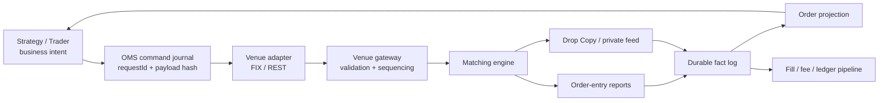
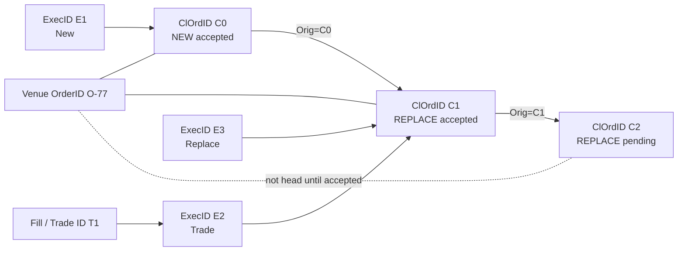
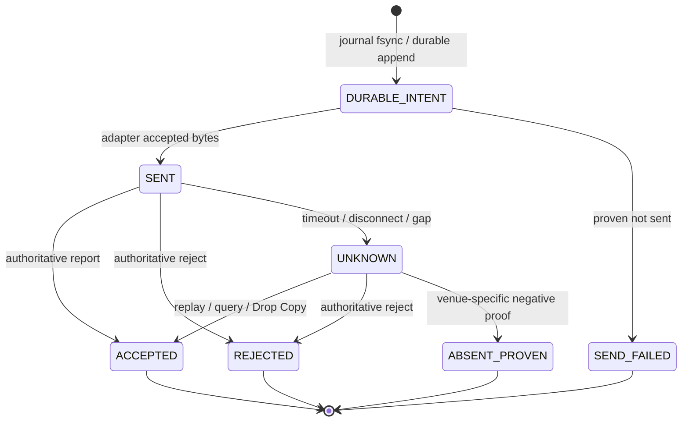
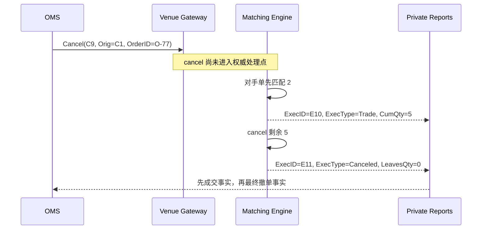
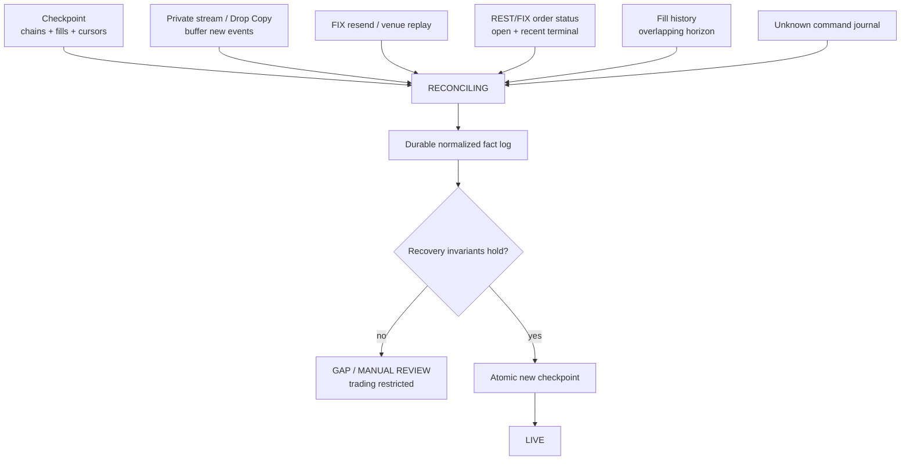

一次下单请求超时，OMS 不知道订单是否已经进入交易所；几毫秒后，交易员又发出撤单；连接恢复时，Drop Copy 先送来一笔成交，订单查询却仍显示 `open`。如果系统只有一个 `status` 字段，它很快就会陷入自相矛盾：这张订单到底是“下单失败”“待撤”“部分成交”，还是“已经取消”？

问题不在于状态枚举不够多，而在于系统混淆了三类不同事实：**客户端想做什么、某条命令传到了哪里、交易场所最终接受并执行了什么**。OMS（Order Management System）真正要维护的不是一张可随意覆盖的订单表，而是一套能在重复、乱序、超时、断线和多条回报路径之间恢复同一订单历史的证据协议。

本文沿用前面 [交易订单语义](/signal-grid-blog/posts/order-types-and-execution-strategies/)、[订单簿与自成交保护](/signal-grid-blog/posts/order-book-and-self-trade-prevention/) 和 [撮合机制](/signal-grid-blog/posts/matching-engine-and-auctions/) 的模型：撮合引擎按权威命令顺序产生订单与成交事实；本文站在参与者一侧，说明这些事实怎样穿过 FIX、REST、WebSocket 与 Drop Copy，最终成为可信的本地订单状态。

文中的 FIX 字段以 **FIX Trading Community 的 FIX Latest** 为一般模型，venue 案例以 2026-08-18 可查的官方文档为准。FIX 定义消息和字段语义，不替任何交易所承诺改单优先级、回放保留期、标识符全局唯一性或 REST 一致性；这些都必须绑定具体 venue、市场、接口和版本。

## OMS 首先要把命令与事实分开

客户端点击“买入”产生的是意图；OMS 写入并准备发送的是命令；交易所发回订单接受、成交或撤单确认，才是 venue 事实。三者可以在正常路径上快速连续发生，但故障时必须独立保存。



这条链上至少有五种不同记录：

| 层次 | 例子 | 能证明什么 | 不能证明什么 |
| --- | --- | --- | --- |
| 业务意图 | “以不高于 100 买入 10” | 用户希望执行的约束 | 命令是否持久化、是否发出 |
| OMS 命令 | `NEW`、`CANCEL`、`REPLACE` | 本地已接受一项操作 | venue 是否收到或执行 |
| 传输结果 | socket write、裸 HTTP 2xx、FIX Logon / Resend / GapFill | 按接口合同完成了本地写、HTTP 处理或 FIX 会话建立/恢复阶段 | 应用订单已被接受、成交或撤销；2xx 中若含 venue 状态仍须按该 endpoint 解释 |
| venue 事实 | ExecutionReport、私有订单事件、fill | venue 对订单链的权威判断 | OMS 是否已持久消费、账本是否已入账 |
| 本地投影 | 当前状态、累计成交、剩余量 | 已消费事实形成的查询视图 | 在存在 Gap 时是否仍完整 |

因此，`send()` 返回成功不能把订单改成 `NEW`，HTTP 超时也不能把订单改成 `REJECTED`。前者通常只说明字节已被本地网络栈或远端 API 接受，后者只说明调用者没拿到可解释的结果。OMS 应把二者分别记录为“发送尝试完成”和“结果未知”，等待 venue 事实裁决。

同样，OMS 可以拥有自己的权威决定，例如“因风控冻结，不再允许该策略发新单”；它却不能据此把 venue 上仍在工作的订单写成 `CANCELED`。一个实用投影应同时暴露：

```text
venueOrderState = NEW | PARTIALLY_FILLED | FILLED | CANCELED | ...
localConfidence = LIVE | RECONCILING | GAP | UNKNOWN
pendingCommand  = NONE | NEW | CANCEL | REPLACE
```

`venueOrderState` 来自交易场所，`localConfidence` 表示本地证据是否连续，`pendingCommand` 表示尚未裁决的操作。把三者压进一个枚举，正是“待撤订单收到成交后不知道该怎么写”的根源。

## 一张订单需要多套身份，而不是一个万能 ID

`clientOrderId`、`orderId` 和 `executionId` 经常都被简称为“订单号”，但它们标识的是不同对象。FIX 的字段语义尤其能说明这一点：`ClOrdID(11)` 由客户端一侧分配，`OrderID(37)` 由 sell-side 或 venue 分配给订单链，`ExecID(17)` 则标识一条 ExecutionReport。`ExecID` 中的 execution 指“执行回报消息”，不等于每次都发生了一笔 trade。

| 身份 | 所属方与典型作用域 | 标识的对象 | 主要用途 |
| --- | --- | --- | --- |
| `requestId` | OMS 内部，跨重试稳定 | 一次业务操作 | API 幂等、payload 冲突检测 |
| `clientOrderId` / `ClOrdID` | 客户端分配；作用域由协议规定 | 新单或某一版 replace/cancel 请求 | 请求关联、超时查询、改单链 |
| `OrigClOrdID` | 客户端链内引用 | 上一版被引用的 `ClOrdID` | 定位被撤或被替换的版本 |
| `orderId` / `OrderID` | sell-side / venue 按 profile 分配 | sell-side 或 venue 订单/订单链 | 订单查询、成交归属 |
| `executionId` / `ExecID` | sell-side / venue 按 profile 分配 | 一条执行回报事件 | 去重、重放、纠错引用 |
| `fillId` / `tradeId` / `matchId` | venue 分配，语义因市场而异 | 一笔成交或撮合结果 | 成交账本、费用、trade correction |
| 私有流 sequence | 接口或会话分配 | 传输流中的位置 | Gap 检测与 replay |

[FIX Latest 的 `ClOrdID`](https://fiximate.fixtrading.org/en/FIX.Latest/tag11.html) 要求在协议规定的发送方作用域内保持唯一；[`OrigClOrdID`](https://fiximate.fixtrading.org/en/FIX.Latest/tag41.html) 指向**前一张订单请求**，不是当天最初那张订单。FIX ExecutionReport 进一步规定 `OrderID` 应在一条订单链内保持唯一，而 `ExecID` 通常标识 sell-side 分配的执行消息。这些是 FIX 一般模型；具体 venue 仍可能收紧 UUID 格式、改变唯一性窗口，或为 cancel 请求另设 ID。

即使在 FIX 一般模型内，`ExecID` 也不是无条件的万能主键：FIX Latest 允许 `ExecType=Order Status` 的查询型回报使用特殊值 `0`。因此内部 `ExecutionKey` 必须由 venue profile 定义；普通事件可以使用带作用域的 `ExecID`，status snapshot 则可能还需要 `OrdStatusReqID`、查询代际或接收 cursor。不能把所有 `ExecID=0` 的状态查询误判成同一条重复消息。

一条成功的改单链可以表示为：



如果 `C2` 的 replace 被拒绝，当前链头仍是 `C1`；不能因为 OMS 已经发出 `C2`，就把本地订单版本提前切过去。下一次 cancel/replace 应引用哪个 `OrigClOrdID`，也要服从 venue 已确认的链头，而不是“本地最后生成的 ID”。

数据库键还必须带上真实作用域。裸 `orderId=123` 或 `executionId=456` 很可能在测试与生产、不同账户或不同 venue 之间碰撞。更安全的内部键类似：

```text
VenueOrderKey = (venue, environment, accountOrPortfolio, orderId)
ClientRequestKey = (venue, accountOrPortfolio, clientOrderIdScope, clientOrderId)
ExecutionKey = venueProfile.eventKey(rawReport, feedCursor)
```

作用域不能凭经验猜测，应从当前接口契约中配置并版本化。若文档只承诺“交易日内唯一”，就不能把它擅自升级为跨账户、跨年份全局唯一。

### 业务幂等不能只依赖 venue 拒绝重复 ID

OMS 接受命令时，应先以稳定 `requestId` 写入命令台账，并保存规范化 payload 的哈希：

```text
同 requestId + 同 payload  → 返回同一命令记录和当前裁决结果
同 requestId + 不同 payload → 拒绝为 IDEMPOTENCY_CONFLICT
新 requestId                → 创建新命令，分配协议要求的 clientOrderId
```

复用 `clientOrderId` 是否会由 venue 返回原结果、拒绝重复，还是被当成新请求，属于 venue-specific 行为。FIX 的“必须唯一”不是通用幂等承诺。发生超时后，OMS 应先用原身份查询、恢复回报或对账；在旧请求命运未决时生成一个全新 ID 重发，可能得到两张都有效的订单。

## Pending 与 Unknown 必须成为状态机的一等公民

下单、撤单和改单不是本地函数调用，而是跨故障边界的协议。每条命令都可能停在“本地已持久化但未发送”“已发送但未收到 venue 事实”“收到事实但尚未持久化”之间。OMS 必须记录这些中间态，才能在重启后继续裁决。



“proven not sent”比普通网络错误强得多：只有命令在到达任何可能转发到 venue 的边界前明确失败，OMS 才能安全地把它归入 `SEND_FAILED`。一旦字节可能被对方读取，超时就是 `UNKNOWN`，不是失败。

订单状态与命令状态应并行演化。例如当前 venue 订单是 `PARTIALLY_FILLED`，同时可以存在 `pendingCommand=CANCEL`。在取消最终确认到达前，订单仍可能继续成交；风险占用也不能因为“撤单按钮已点”就释放。

[FIX ExecutionReport](https://fiximate.fixtrading.org/en/FIX.Latest/msg9.html) 对此给出了很清楚的模型：`Pending Cancel` 只表示撤单请求已处于待处理状态，**不表示订单已经取消**；`Pending Replace` 也不表示新版本已经生效。FIX 还允许在 pending 状态期间继续报告 trade，此时 `ExecType=Trade` 说明本条消息是一笔成交，`OrdStatus=Pending Cancel` 则说明订单链仍处在待撤状态。

### 失败矩阵要写出裁决证据

| 故障窗口 | 客户端可观察结果 | OMS 必须保存 | 恢复动作与通过条件 |
| --- | --- | --- | --- |
| 命令日志落盘后、网络发送前崩溃 | 无响应 | 原 `requestId`、payload、未发送证据 | 用同一命令恢复发送；venue 最终至多出现一张订单 |
| 发送后、首条 ExecutionReport 前断线 | 超时 | 原 `clientOrderId`、发送 attempt、`UNKNOWN` | replay/query/Drop Copy 裁决；未裁决前不换新 ID 重发 |
| cancel 发出后继续收到 fill | “撤单中”但成交增加 | cancel 命令与每笔 fill | fill 只应用一次；最终 cancel 只终止剩余量 |
| replace 发出后响应丢失 | 旧版或新版都可能仍有效 | candidate `ClOrdID`、上一已确认链头 | 按两套身份查询；只能有一个已确认活动版本 |
| cancel/replace 被拒绝 | 命令失败 | reject 针对的命令 ID、原因、原订单状态 | reject 本身不拒绝原订单；继续采用其他 venue 事实给出的当前状态 |
| 私有流缺一段后又继续到数 | 页面看似恢复更新 | feed identity、expected/actual sequence、Gap | 停止宣称 `LIVE`，补齐或完成 REST/fill 对账后建立新 cursor |
| 重放产生重复 ExecutionReport | 同一事实再次到达 | `ExecutionKey`、原始报文、重放标志 | 投影和账本不重复变化 |

最后一行说明了“幂等消费者”的真实含义：不是发现重复后简单丢弃所有同 ID 报文，而是先确认 venue 对 `ExecID`、correction 和 fragmentation 的规定。FIX 的 trade correction 或 trade cancel 会通过引用关系修改既有成交；它们不是普通重复。

风险系统对 `UNKNOWN` 应采用保守暴露。最简单的下单未知场景里，既不能假定订单不存在，也不能假定它已经成交；通常要同时保留可能的挂单占用与最大可能成交暴露，直到私有事实或查询把不确定性缩小。具体额度算法由产品和账户模型决定，但“把超时当失败释放全部占用”不是一个安全默认值。

## Cancel/Replace 是并发协议，也是队列优先级合同

撤单与撮合会竞争同一张工作订单。即使 cancel 已到达 venue gateway，撮合序列里排在它前面的对手单仍可先成交；网络上的先后到达也不等于撮合核心的权威顺序。



这条序列没有矛盾：cancel 的目标是阻止**尚未执行的剩余量**，不是撤销已经排在它前面的合法成交。若 venue 支持 trade bust/correction，那也是另一条显式事实，不能由 OMS 因“用户早就点了撤单”而自行生成。

改单还多一层订单版本链。OMS 至少要遵守以下转换：

1. 新 replace 使用新的命令身份，并引用当前**已接受**链头；
2. pending replace 只是候选版本，不覆盖活动版本；
3. replace accepted 后才推进链头，继承的 `CumQty` 与 fill 历史不能清零；
4. replace rejected 只否决候选版本，最后已接受的链头不变；订单当前却可能已在 pending 期间部分/全部成交或进入其他终态，必须采用 `OrderCancelReject.OrdStatus` 与期间的 ExecutionReport 重建，不能一律写回 `WORKING`；
5. 同一订单链上的 cancel/replace 默认串行化，除非 venue 明确支持流水化请求并定义引用规则。

### 数量语义会和并发成交相撞

假设原订单总量为 10，已经成交 3，用户想把**剩余量**从 7 减到 5。若 venue 的 replace 字段表达整条链的新 `OrderQty`，OMS 需要发送 8，而不是 5。若请求在途时又成交 2，venue 接受“总量 8”后剩余量只会是 3。

因此 UI 上的“剩余量改成 5”和协议里的“订单总量改成 8”不是同一命令。OMS 必须明确：

- 用户输入约束的是总量、剩余量，还是减少量；
- venue 在 in-flight fills 下怎样解释新数量；
- `newQty < CumQty` 时是拒绝、截到 CumQty，还是采用专门 amend 语义；
- replace 回报中的 `OrderQty/CumQty/LeavesQty` 是否以整条订单链为口径。

不把这些口径写进 adapter，就会出现“用户只想减两手，结果把剩余量又减了两手”的竞态。

### 是否保留队列优先级只能由 venue 规则回答

FIX 的 OrderCancelReplaceRequest 规定消息关联与状态回报，但不替交易所决定价格时间优先级。官方 venue 文档展示了三种可验证的具体行为：

| 实现 | 允许的修改 | 订单身份 | 优先级行为 |
| --- | --- | --- | --- |
| FIX 一般模型 | 用 Cancel/Replace 改参数 | 用 `ClOrdID` 链与 `OrderID` 关联 | 不提供跨 venue 的统一保证 |
| Coinbase Exchange FIX 5 | 修改限价、数量及部分条件字段 | 修改后沿用父订单 `OrderID`，新 `ClOrdID` 形成链 | 减少数量保留；增加数量或改价失去优先级 |
| Binance Spot Keep Priority | 只允许减少数量 | 原 `orderId` 保持，可配置新 `clientOrderId` | 专用 amend 保留；cancel-new 明确失去时间优先级 |

Coinbase 的 [OrderCancelReplaceRequest 文档](https://docs.cdp.coinbase.com/exchange/fix-api/order-entry-messages/order-entry-messages5#ordercancelreplacerequest-35g) 还说明部分成交会被带入子版本，并反映在新的 `LeavesQty`；Binance 则把 [Order Amend Keep Priority](https://github.com/binance/binance-spot-api-docs/blob/master/faqs/order_amend_keep_priority.md) 做成只减量的独立能力。这些都属于具体实现，不能倒推“所有市场减量都保优先级”。

OMS 的订单投影最好显式保存 `priorityOutcome = RETAINED | RESET | UNKNOWN | NOT_APPLICABLE` 及来源事件。若 venue 不回报或不保证，就保持 `UNKNOWN`；不能因为请求看起来只是改小数量，便向策略承诺原队列位置仍在。

## ExecutionReport 要同时保留事件含义与订单链状态

FIX ExecutionReport 里最容易被误用的是 `ExecType(150)` 与 `OrdStatus(39)`。前者说明**这条回报发生了什么**，后者说明**订单链此刻是什么状态**。把二者映射成同一个内部 `status` 会丢掉信息。

| 场景 | `ExecType` 的问题 | `OrdStatus` 的问题 | OMS 应怎样解释 |
| --- | --- | --- | --- |
| 新单接受 | 本条回报确认什么动作 | 订单是否已工作 | 建立已接受链头 |
| 一笔 fill | 本条是否新增/修正成交 | fill 后订单链仍处于何状态 | 先应用执行事实，再更新链投影 |
| Pending Cancel | 是否确认收到 cancel | 当前状态是否待撤 | 不释放剩余风险，不宣称已撤 |
| cancel 完成 | 本条是否终止余量 | 当前订单是否终态 | 终止工作量，保留既有 fills |
| replace 完成 | 本条是否接受新版本 | 订单链当前状态 | 推进已接受 `ClOrdID` 链头 |
| status response | 本条是查询响应 | venue 当前看到的订单状态 | 用于对账，不虚构中间事件 |

下面是一条符合 FIX 一般状态模型的简化序列；具体 venue 可能不发送 pending 回报，或只支持其中一部分状态：

| 顺序 | `ExecType` | `OrdStatus` | `CumQty` | `LeavesQty` | 含义 |
| ---: | --- | --- | ---: | ---: | --- |
| 1 | New | New | 0 | 10 | 订单开始工作 |
| 2 | Trade | Partially Filled | 3 | 7 | 新增成交 3 |
| 3 | Pending Cancel | Pending Cancel | 3 | 7 | cancel 在途，尚未取消 |
| 4 | Trade | Pending Cancel | 5 | 5 | 待撤期间又成交 2 |
| 5 | Canceled | Canceled | 5 | 0 | 剩余 5 被终止 |

对于工作订单，FIX Latest 给出的常见数量关系是：

```text
LeavesQty = OrderQty - CumQty
```

但在 `Canceled`、`Expired`、`Rejected` 等终态，`LeavesQty` 可以为 0；没有成交的残余量已经不再“可继续执行”，不能继续套用工作态公式。若协议提供 `CxlQty`，可以用它表达被取消的剩余量；否则 OMS 要从已确认版本和执行历史推导，并标明推导口径。

`AvgPx` 也不是最后一笔成交价。它通常表示订单链已计入 fills 的数量加权平均：

```text
AvgPx = Σ(fillQtyᵢ × fillPxᵢ) / Σ(fillQtyᵢ)
```

生产实现应使用协议规定的十进制定点精度，并处理费用币种、合约乘数和多腿产品；不要用二进制浮点重新计算后拿微小误差误报对账失败。

### Trade correction 会破坏“累计量永远单调”的假设

FIX 的 `ExecType=Trade Correct` 与 `Trade Cancel` 会引用先前执行事实。发生纠错或 bust 后，`CumQty` 可以下降，`AvgPx` 可以变化，账本也需要冲正。于是下面这条常见断言只在“没有 correction 的普通前向执行段”成立：

```text
nextCumQty >= previousCumQty
```

更稳健的 reducer 应先保存原始事件和引用关系，再从有效 fill 集合派生累计量：

```java
void apply(ExecutionReport report) {
    persistRawBeforeAdvancingCursor(report);

    if (!executionIndex.markFirstSeen(report.executionKey())) {
        return; // 同一事实的传输重放
    }

    switch (report.execType()) {
        case TRADE -> fillLedger.add(report.fillFact());
        case TRADE_CORRECT -> fillLedger.correct(report.execRefId(), report.fillFact());
        case TRADE_CANCEL -> fillLedger.cancel(report.execRefId());
        default -> orderChain.applyStateEvent(report);
    }

    orderProjection.recomputeFrom(orderChain, fillLedger);
    verifyVenueSpecificInvariants(report);
}
```

这段代码只展示处理顺序，不是可直接套用的 FIX engine：`executionKey()` 必须处理 status snapshot 的特殊 `ExecID`，同一个 `ExecID` 是否会因报文分片复用、correction 用哪个引用字段、fill identity 从哪里取得，也都必须按 venue dictionary 实现。

还要避免用 `CumQty` 与 `AvgPx` 代替逐笔成交账本。累计字段足以回答“订单大致执行到哪里”，却不能还原每笔 fill 的价格、数量、流动性角色、费用和纠错关系。下游 [交易账本与双重记账](/signal-grid-blog/posts/trading-ledger-double-entry-accounting-and-reconciliation/) 应消费可唯一识别的成交事实，并把 correction/bust 表达为可审计冲正，而不是覆盖历史余额。

最后，字段是否必填也是 venue-specific。FIX Latest 对一般 ExecutionReport 给出一套条件，而 Coinbase Exchange Drop Copy 明确说明某些以 `CashOrderQty` 提交的 market order 不发送 `LeavesQty`。归一化 schema 应保留 `absent` 与 `zero` 的差别，不能把缺失字段静默填成 0。

## 私有流的 sequence 只能证明它所属的那条流

私有执行回报通常来自 FIX order-entry session、WebSocket user stream、专用 Drop Copy 或多者并行。每条路径可能都有自己的 sequence、重连代际和重放规则。一个 `lastSequence=1234` 若没有 feed identity，几乎没有恢复意义。

```text
PrivateFeedCursor = (
  venue,
  environment,
  accountOrPortfolio,
  interface,
  targetSessionOrChannel,
  sessionEpoch,
  sequence
)
```

FIX `MsgSeqNum(34)` 首先是会话层连续性，不是全账户的成交序号，也不能跨 session reset 直接比较。FIX Latest 的 `ApplicationSequenceControl` 明确面向 Drop Copy，且不用于 transactional applications；普通 order-entry session 不能把它当成通用应用序列。某个 venue 是否另行提供业务序列、作用域与恢复合同，仍必须由会话 profile 明确。`ExecID` 用来识别执行回报事实，不能替代 stream cursor；反过来，连续的 `MsgSeqNum` 也不能替代 `ExecID` 去重，因为 resend 会重复发送业务消息。

一个具备 sequence 的消费者至少要区分三种输入：

```text
seq == expected       → 持久化、应用、expected++
seq < expected        → 可能是 replay / duplicate，按事实 ID 幂等处理
seq > expected        → GAP，停止推进可信 cursor，发起 venue-defined recovery
```

重放标志也不能被当作“整条消息都可丢弃”。FIX retransmission 常带 `PossDupFlag`，但本地进程可能此前收到却尚未持久化这条消息；正确做法仍是按 `ExecutionKey` 判断事实是否已经提交。

### Drop Copy 是独立交付路径，不是第二个撮合真相

[Coinbase Exchange FIX Drop Copy](https://docs.cdp.coinbase.com/exchange/fix-api/drop-copy) 是只读 session，可以汇总同一 API key 通过其他 FIX sessions 或 REST 产生的 ExecutionReport；[CME Globex Drop Copy](https://www.cmegroup.com/solutions/market-access/globex/trade-on-globex/faq-drop-copy.html) 则把一个或多个 iLink source sessions 的执行回报、确认和 trade bust 复制到一个或多个 target sessions，并明确不能通过 Drop Copy 下单或撤单。

两者都说明 Drop Copy 很适合做独立接收、风控监控和对账，但它仍是 venue 事实的另一条**传输路径**：

- 它不会让 order-entry 与 Drop Copy 两条消息变成两个不同成交；
- 它不天然提供无限历史，replay 与保留期要看当前 venue 契约；
- 聚合多个 source session 后，target session sequence 仍属于该目标流；
- CME 还提示一个 Drop Copy group 可能需要多个 target sessions，因此不能假定所有活动共享一条全局 sequence；
- 两条路径同时消费时必须用执行与订单身份去重，不能靠“哪个先到”决定权威性。

Coinbase 当前 FIX 5 文档提供 session resume 与分页 ResendRequest，但也会对某些不可回放范围发送 GapFill，说明 FIX 恢复窗口是有限合同，不是永久日志。OMS 应把当前 venue 的 replay 上限、分页规则、reset 行为和 `PossDupFlag` 语义作为连接配置，而不是写死一个跨场所常量。

并非所有私有 WebSocket 都给出可证明连续性的业务序号。Binance Spot 的官方 [User Data Stream](https://github.com/binance/binance-spot-api-docs/blob/master/user-data-stream.md) 会推送 `executionReport`，示例字段包含事件时间、订单身份、执行类型和累计量，但没有一个可让消费者仅凭该事件流证明“中间绝无遗漏”的单调业务 sequence。时间戳不能替代 sequence：两条事件可以同毫秒，网络也可以在丢消息后继续发送更晚时间。

遇到这种接口，实时流只能提供低延迟通知；完整性必须由查询、重叠回看、订单与 fill 对账来补。系统应诚实地把 `localConfidence` 标为 `RECONCILING`，而不是因为 WebSocket 又开始跳动就恢复 `LIVE`。

## 对账与恢复要把 replay、查询和 checkpoint 接成闭环

断线恢复不是简单执行一次 `GET /open-orders`。当前 open orders 只能说明查询时仍工作的集合，无法单独回答断线期间哪些订单已成交后结束、哪些 cancel/replace 被拒绝、哪些 fill 发生过 correction。OMS 至少要联合四份证据：本地命令台账、私有事件/Drop Copy、订单状态查询、逐笔 fills 查询。



一个安全的重连过程可以这样组织：

1. **进入 `RECONCILING`**：保留撤险能力，但按风险合同限制新订单；不要让策略把旧投影当实时状态。
2. **加载合法 checkpoint**：恢复订单链、fill/correction 集合、未决命令和每条私有流的完整 cursor identity。
3. **先建立实时缓冲**：若接口允许，先连接私有流或 Drop Copy 并缓存新事件，避免查询期间继续产生盲区。
4. **优先恢复序列**：在 FIX resend 或 venue replay 可覆盖的范围内补齐 Gap；所有重放仍经过事实 ID 去重。
5. **用查询补足语义**：分页获取 open orders、近期 terminal orders 与 fills，并使用重叠时间/ID 区间，不能只取第一页。
6. **逐项裁决 `UNKNOWN`**：按原 `clientOrderId`、candidate replace ID 与 `orderId` 查询，区分 accepted、rejected、仍不可证明不存在。
7. **合并并验证**：先落原始证据，再重建投影；比较订单累计量、fill 集合、链头与风险占用。
8. **原子推进 checkpoint**：只有投影和原始事实都持久化后，才能推进 feed cursor 并恢复 `LIVE`。

[Coinbase REST 订单文档](https://docs.cdp.coinbase.com/api-reference/exchange-api/rest-api/orders/get-all-orders) 明确提醒 open orders 在请求与响应之间仍可能变化，默认查询也不会返回已经结束并 settled 的订单；[fills 接口](https://docs.cdp.coinbase.com/api-reference/exchange-api/rest-api/orders/get-all-fills) 则按 `trade_id` 分页。其 [REST pagination](https://docs.cdp.coinbase.com/exchange/rest-api/pagination) 使用 `before/after` cursor，并默认返回最新数据。这类接口很适合对账，却不是一个自动与私有流对齐的原子快照。

若 venue 没有提供“查询结果对应 private stream 的 cut”，就不能声称一次查询完成了无缝 bridge。可采用保守的重叠算法：先缓冲实时流，反复拉取覆盖 checkpoint 前后的订单与 fills，合并去重，直到两个相邻轮次在同一 horizon 上收敛；但这只能在 venue 数据保留、分页和最终可见性合同允许的范围内提高置信度。仍无法解释的差异必须留在 `GAP/UNKNOWN`，不能用最后写入获胜把它抹掉。

### Checkpoint 必须冻结事实位置与派生状态

一个可恢复 checkpoint 不只是序列号。至少应包含：

| 内容 | 恢复作用 |
| --- | --- |
| 命令日志位置与未决 `requestId` | 防止重启后把旧 UNKNOWN 当新请求 |
| 每条 feed 的完整 cursor 与 session epoch | 判断从哪里 replay，避免跨 reset 比较 |
| 已持久化 raw report 的高水位 | 约束 cursor 不能跑在事实日志前面 |
| `ExecutionKey` / fill / correction 索引 | 对重放幂等，重算累计量与均价 |
| 每个 `OrderID` 的已接受 `ClOrdID` 链头与候选版本 | 正确恢复 cancel/replace 引用 |
| venue schema、适配器和规则版本 | 按当时语义解码历史 |
| 最近一次对账 horizon、分页 cursor 与差异集 | 知道哪些范围已证明，哪些仍未知 |

对每一条 feed，checkpoint 的提交关系必须满足：

```text
durableRawCursor >= consumedCursor
checkpoint.projectionState 与 checkpoint.consumedCursor 原子提交
```

`consumedCursor` 必须精确说明 checkpoint 中的投影已经消费到哪里。若 cursor 已推进到 1000，而 raw fact log 只持久到 990，崩溃后系统会从 1001 继续，永久跳过 991–1000；若投影包含到 1000 的状态却把 cursor 写成 990，重启又会重复应用 991–1000。反过来，raw log 比投影和 consumed cursor 更靠前没有安全问题：重启后可以幂等重放尚未物化的尾部。

### 恢复完成要由不变量证明

恢复过程至少应验证以下不变量；它们不是泛化上线清单，而是 OMS 状态机的正确性条件：

1. 每个 venue `OrderID` 至多有一个已接受活动链头；pending/rejected replace 不会成为链头。
2. 每条有效 fill 只归属一个订单链，并按 venue 身份应用一次；correction/bust 有可追踪引用。
3. 工作态数量满足当前协议的 `OrderQty/CumQty/LeavesQty` 关系；终态未成交残量不会被误记为 fill。
4. 每个私有 feed cursor 都不超过已经持久化的 raw fact 高水位。
5. 已知 sequence Gap、无法解释的累计量差异和有实质风险的 `UNKNOWN` 命令存在时，系统不会标记 `LIVE`。
6. 订单投影、风险占用与成交账本共享同一组执行事实；账本 correction 不会被订单状态覆盖掉。

自动对账还要保存“差异怎样被解决”，而不只是修正后的最终行。新增 venue fill、撤销本地幽灵订单、发现未知 replace 已接受，都是独立 reconciliation fact；它们应带证据来源、观察时间、原始 payload 与规则版本，才能在事故复盘中解释为什么系统改变了判断。

最终权威边界也要保持清楚：venue 决定订单是否接受、成交或取消；OMS 决定本地是否拥有足够连续证据继续交易；账本决定成交经济效果怎样入账。Drop Copy、REST 与私有 WebSocket 是这些 venue 事实的不同观察渠道，不是三个可以多数投票的独立真相。

## 结论：可信 OMS 保存的是可裁决历史

OMS 的核心不是把 `status` 更新得更快，而是让每次命令在故障后仍能被裁决。稳定 `requestId` 防止业务重试创造第二个意图，`ClOrdID` 链描述 cancel/replace 的请求版本，`OrderID` 绑定 venue 订单链，`ExecID` 与 fill identity 让重放、成交和纠错可以幂等归并。

Cancel 和 Replace 都可能与成交并发；`Pending Cancel` 不是取消完成，replace candidate 也不是活动链头。`ExecType` 保留本条事实的动作，`OrdStatus` 保留订单链的当前状态，累计字段则必须在工作态、终态和 correction 三种边界内解释。

私有流 sequence 只能证明其所属会话的连续性，Drop Copy 只是独立交付路径，REST 查询也通常不是与事件流原子对齐的快照。可信恢复来自 raw fact、replay、查询、fill 对账与 checkpoint 的同一条因果链；无法闭合时，正确状态是 `GAP` 或 `UNKNOWN`，不是猜一个看起来合理的终态。

下一章 [行情数据管线与订单簿重建](/signal-grid-blog/posts/market-data-pipeline-and-order-book-reconstruction/) 会转向公开市场数据。两条路径面对的恢复问题相似，但权威投影不同：私有回报回答“我的订单发生了什么”，公开行情回答“市场向参与者公开了什么”，不能互相推导替代。

## 一手资料

- [FIX Trading Community：ExecutionReport](https://fiximate.fixtrading.org/en/FIX.Latest/msg9.html)——ExecutionReport 用途、`ExecType` 与 `OrdStatus` 的双重语义、状态优先级和数量字段。
- [FIX Trading Community：ClOrdID](https://fiximate.fixtrading.org/en/FIX.Latest/tag11.html)——客户端订单身份及其一般唯一性范围。
- [FIX Trading Community：OrigClOrdID](https://fiximate.fixtrading.org/en/FIX.Latest/tag41.html)——引用上一订单请求而非初始请求的链语义。
- [FIX Trading Community：ExecType](https://fiximate.fixtrading.org/en/FIX.Latest/tag150.html)——Trade、Pending Cancel、Replace、Trade Correct 与 Trade Cancel 等事件类型。
- [FIX Trading Community：OrderCancelReject](https://fiximate.fixtrading.org/en/FIX.Latest/msg10.html)——撤单/改单拒绝与原订单状态的边界。
- [FIX Trading Community：Order State Changes](https://www.fixtrading.org/wp-content/uploads/download-manager-files/FIX-Latest-as-of-EP284-Order-State-Changes.pdf)——pending、fill、replace 与 cancel 竞争的官方状态转换示例。
- [Coinbase Exchange：FIX 5 Order Entry](https://docs.cdp.coinbase.com/exchange/fix-api/order-entry-messages/order-entry-messages5)——session resume、ResendRequest、Cancel/Replace、OrderStatusRequest 与 ExecutionReport。
- [Coinbase Exchange：FIX Best Practices](https://docs.cdp.coinbase.com/exchange/fix-api/best-practices)——减量保优先级和独立 Drop Copy session 建议。
- [Coinbase Exchange：FIX Drop Copy 5.0](https://docs.cdp.coinbase.com/exchange/fix-api/drop-copy)——跨 FIX/REST 下单路径的只读执行回报汇总及字段边界。
- [Coinbase Exchange：Get all orders](https://docs.cdp.coinbase.com/api-reference/exchange-api/rest-api/orders/get-all-orders)、[Get all fills](https://docs.cdp.coinbase.com/api-reference/exchange-api/rest-api/orders/get-all-fills) 与 [REST pagination](https://docs.cdp.coinbase.com/exchange/rest-api/pagination)——断线对账所需的订单、成交与分页合同。
- [CME Group：Drop Copy FAQ](https://www.cmegroup.com/solutions/market-access/globex/trade-on-globex/faq-drop-copy.html)——source/target session、只读边界、多 target streams 与实时风控定位。
- [Binance Spot：Order Amend Keep Priority](https://github.com/binance/binance-spot-api-docs/blob/master/faqs/order_amend_keep_priority.md)——只减量保留队列优先级与 cancel-new 的差异。
- [Binance Spot：User Data Stream](https://github.com/binance/binance-spot-api-docs/blob/master/user-data-stream.md)——私有 `executionReport` 的 venue-specific 字段与无业务 sequence 场景。
