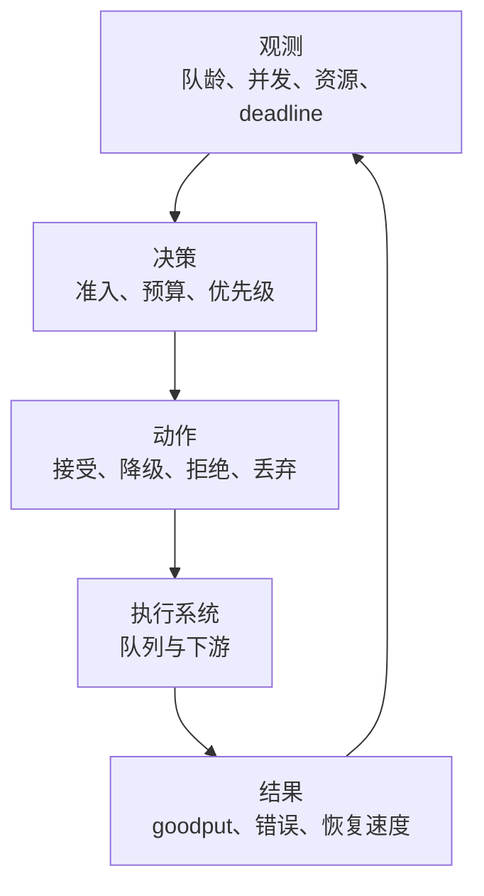
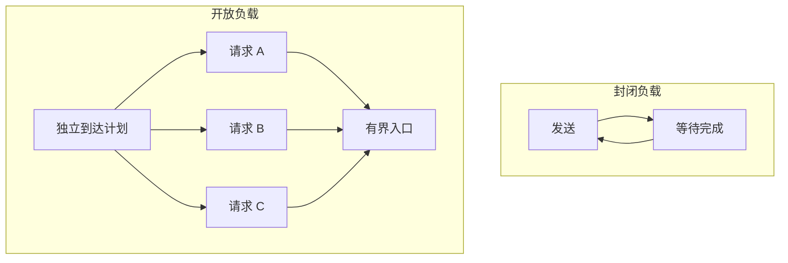
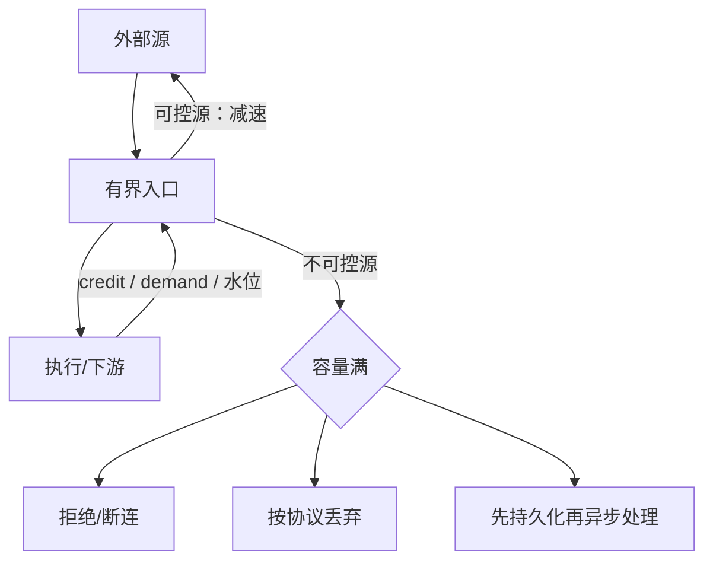
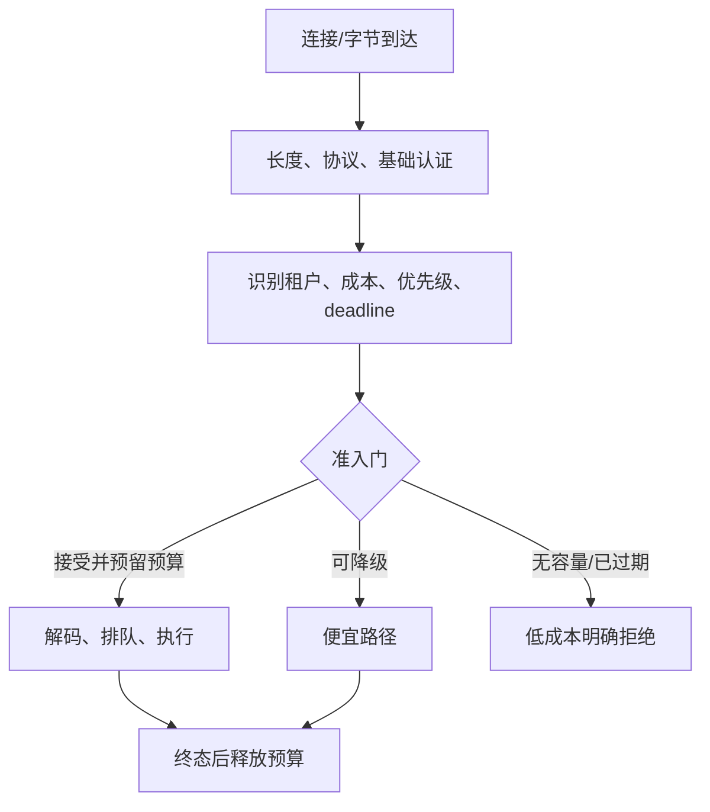
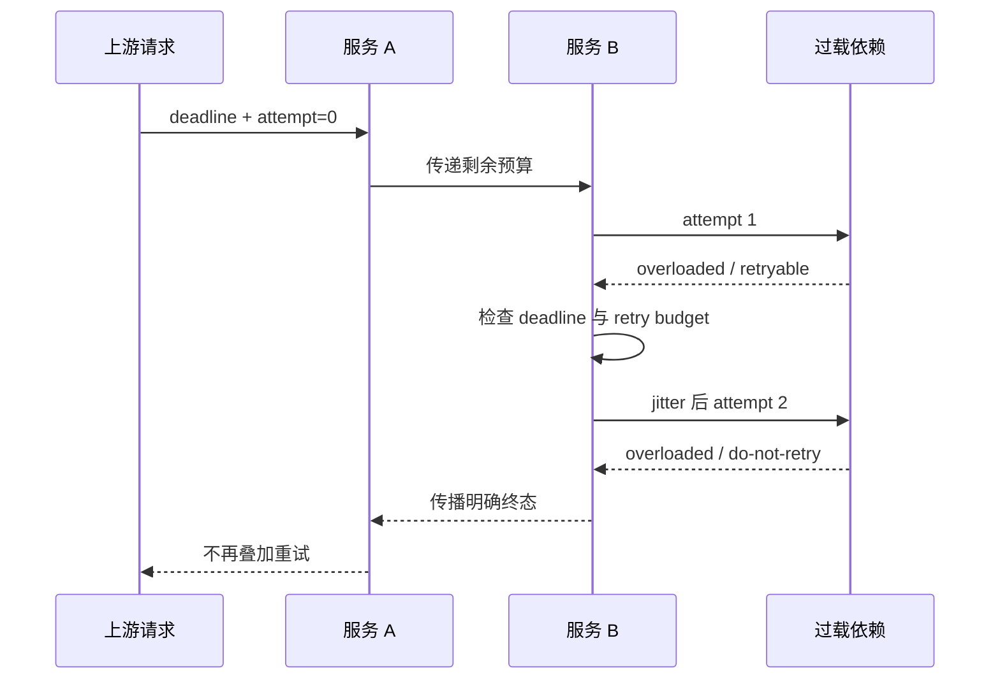

系统没有崩溃、线程也都活着，却已经无法在承诺时间内完成新工作——这同样是故障。更危险的是，过载通常会伪装成“只是慢一点”：请求进入队列、客户端超时重试、更多连接和对象被保留，直到 GC、线程池、文件描述符或下游一起失去进展。

因此，过载保护不是在监控里加一条 CPU 告警，也不是给线程池套一个无限队列。它是一份端到端协议：**谁可以进入系统，已经接下的工作必须获得什么结果，容量不足时牺牲什么，重试还能增加多少负载，以及压力消失后系统能否自己恢复。**

本文是“有状态系统可靠性”学习路径的 Chapter 11。[Java 低延迟测量](/signal-grid-blog/posts/java-low-latency-measurement/) 已经说明为什么要同时报告 offered、admitted、durably accepted、completed、goodput、拒绝和队龄；[分布式系统里的时间](/signal-grid-blog/posts/distributed-systems-time-clocks-ordering-and-leases/) 说明了截止时间为什么必须沿调用链递减。本文把这些证据组织成过载控制面，并在最后给出可证伪的正确性与恢复实验；下一章把这些容量边界带入[状态所有权迁移](/signal-grid-blog/posts/state-ownership-migration-shard-catchup-handoff-fencing/)，处理 Catch-up、切流和旧 Owner fencing。

## 1. 先定义过载：系统欠下了无法按时偿还的工作

过载不是某个 CPU 百分比，而是一个动态关系。设外部有效到达率为 `λ`，当前条件下系统可持续完成率为 `μ`：

```text
λ < μ  且资源有余量：积压最终会消退
λ ≈ μ：任何抖动都可能形成很长的队列
λ > μ：未完成工作持续增加，有限资源最终耗尽
```

这里的 `μ` 不是压测报告里的单一峰值。它会随请求成本、缓存命中、数据倾斜、批次、GC、下游延迟、磁盘尾延迟和故障副本数变化。一次数据库抖动把平均服务时间从 2 ms 拉到 20 ms，即使入口 QPS 没变，也可能把原本健康的系统推入过载。

Google 的 SRE 资料专门提醒，单用 QPS 建模往往不可靠：不同请求消耗的 CPU、内存和依赖资源可能相差几个数量级，软件版本变化也会改变单位请求成本。因此更实用的对象是一张**容量信封**，而不是一个“实例最多 10 万 QPS”的常数。

| 维度 | 信封要表达的边界                      | 越界后的早期信号               |
| ---- | ------------------------------------- | ------------------------------ |
| 入口 | 每类请求的速率、突发和并发            | admission reject、连接排队     |
| 执行 | CPU 时间、worker、事件循环 duty cycle | run queue、executor load、队龄 |
| 内存 | 每个在途请求、队列项和重试保留的字节  | live set、分配率、GC 周期      |
| 依赖 | 连接、下游并发、磁盘 IOPS/带宽        | pool wait、throttle、超时      |
| 时限 | 请求剩余 deadline 与最坏可完成时间    | 入队即已无机会按时完成         |

### 过载控制的四条不变量

在选择限流算法之前，先写下系统不可破坏的约束：

1. **资源有界**：队列、在途请求、连接、重试和每租户占用都有明确上限；“等一会儿”不能变成无限占用。
2. **接单有含义**：内部通过准入只叫 `admitted`；只有跨过对外声明的确认点才可返回 `accepted` 或 durable receipt。已确认工作必须按声明的持久性和幂等协议完成或给出可查询状态，不能在队列尾部静默丢掉。
3. **牺牲可解释**：拒绝、降级和丢弃按业务类别执行；低价值洪峰不能把控制请求、撤单或恢复流量饿死。
4. **系统可恢复**：当原始到达率重新低于安全容量时，积压、重试率和资源压力必须在有界时间内下降，而不是停在一个自我维持的坏状态。

这四条不变量把控制环连接起来：



控制环还需要防止振荡。阈值附近频繁开关会让连接、缓存和 autoscaling 一起抖动；通常需要平滑观测、进入/退出采用不同条件，或规定最短保持时间。但这些参数必须用目标工作负载校准，不能把“CPU 80%”写成跨系统真理。

## 2. 队列为何从缓冲突发变成故障放大器

队列的合理用途是吸收**有限突发**和解耦短时间抖动，不是把持续容量缺口藏起来。若生产持续快于消费，队列只是把立即拒绝改成延迟失败，并让失败发生在已经占用了更多内存、连接和 deadline 之后。

### Little 定律告诉你的不是“队列该配多大”

John D. C. Little 在 1961 年证明了排队关系 `L = λW`。对一个边界一致、长期稳定且相应平均值存在的系统：

```text
L = λ × W

L：系统内平均工作数，包括排队和正在执行的工作
λ：实际流经该边界的长期平均有效速率
W：一项工作在该边界内停留的平均时间
```

假设服务实际完成 20,000 项/秒，平均停留 50 ms，那么系统内平均约有 1,000 项工作；平均停留升到 500 ms，平均在途就约为 10,000。若每项连同对象、缓冲、trace 和 future 实际保留 8 KiB，仅这些在途状态就接近 78 MiB，还没有算 socket、线程栈和下游状态。

但 Little 定律有三个常见误用：

- 它描述稳定系统的长期平均关系，不保证某一时刻的队列，也不告诉你 p99；
- `λ` 应与 `L`、`W` 使用同一边界，过载时不能拿 offered rate 配上只统计成功请求的延迟；
- 它不能证明无限队列稳定。若到达长期高于服务能力，稳定所需的有限平均值本身就不存在。

在容量规划中，更直接的恢复近似是：已有积压 `B`，持续服务能力 `μ`，恢复期间仍有原始到达 `λ`，且 `μ > λ` 时：

```text
drainTime ≈ B / (μ - λ)
```

例如积压 100 万项，服务能力 120k/s，入口仍有 100k/s，净排空只有 20k/s，至少约 50 秒；若超时客户端继续重试使总到达回到 120k/s，积压就不会下降。这个算式只是固定速率下的估算，却能迅速识别“扩队列以后多久恢复”是否现实。

### 开放负载会继续到来，封闭负载会替服务端踩刹车

封闭压测中，一个虚拟用户通常等待前一请求完成才发送下一条。服务越慢，压测端发得越少，于是系统恰好在最坏时刻获得了负反馈。真实的行情、设备事件、定时任务和大量服务调用通常是开放到达：外部事件不会因为当前请求慢了就自动消失。



所以过载实验必须从**计划到达时刻**计端到端延迟，并分别记录生成器晚发、入口拒绝和迟到完成。否则一次 500 ms 停顿可能只留下少数慢样本，停顿期间本应到达的请求被协调遗漏，系统看起来反而很健康。

### 队列长度不如队龄接近业务真相

队列中 1,000 项到底危险不危险，取决于消费速率和 deadline。相同长度在 1M/s 的流水线上可能只是 1 ms，在 1k/s 的依赖前却意味着约 1 秒。至少同时观测：

- 当前/最大队列深度，以及最老任务的 queue age；
- 入队到开始执行、执行本身、下游等待的分段耗时；
- deadline 已过期但尚未出队的“僵尸工作”；
- 按租户、成本和优先级分组的占用，而不是只有全局总数；
- offered、admitted、durably accepted、started、completed 和 timely goodput 的守恒关系。

FIFO 还可能产生队头阻塞：一个慢请求占住串行执行者，后面大量便宜请求即使有足够剩余 deadline 也无法越过。仅增加 worker 会把压力移到数据库连接池；仅增加连接又可能把数据库推入更严重的尾延迟。队列必须与真正的瓶颈容量一起设计。

## 3. Backpressure 是流控协议，不是容量魔法

背压的本质是下游把“我现在还能接多少”反馈给上游。它可以表现为 credit/demand、窗口、`offer` 失败、队列水位、阻塞写入或显式 throttle。只有上游**收到信号并且真的减少产生或发送**，反馈环才闭合。

Reactive Streams 把这个约束写得很清楚：Subscriber 通过 demand 控制最多还能收到多少元素，Publisher 不得越过 demand。可如果源头的产生速率不可控制，例如时钟 tick、鼠标事件或外部 UDP 数据，Publisher 仍只能在边界处选择缓冲或丢弃；demand 不能让已经发生的现实事件倒流。

因此必须明确：**backpressure 并不保证不可控源降速。每个异步边界仍需 bounded queue，并在容量耗尽时选择 reject、drop、disconnect 或 persist。** 没有这个终端动作，“支持背压”只是一条没有关闭的信号线。



### 同一个“满了”，不同动作承诺完全不同

| 动作     | 适合的边界                                 | 必须暴露的语义                                    | 主要风险                           |
| -------- | ------------------------------------------ | ------------------------------------------------- | ---------------------------------- |
| 有界等待 | 调用者可以被可靠减速，且剩余 deadline 足够 | 等待也计入端到端延迟                              | 占满调用线程或连接，形成传播式阻塞 |
| 立即拒绝 | 可重试查询、明确准入的命令                 | `overloaded` 与是否可重试、`Retry-After`/pushback | 拒绝本身太贵时仍会耗尽服务         |
| 丢弃     | 遥测、可替代快照、允许缺口的流             | drop policy、序列号/gap 指标                      | 静默丢失被误当成功                 |
| 断开连接 | 对端不尊重流控或单连接持续越界             | close 原因、重连退避、恢复游标                    | 全连接重连形成新风暴               |
| 持久化   | 工作不能丢，允许延后完成                   | durable-ack 边界、重放、保留期和查询状态          | 把内存积压变成磁盘积压，容量仍有限 |

“持久化”不是无限缓冲的许可证。若入口长期 120k/s、后台只能 100k/s，每秒仍欠下 20k 项；磁盘只把耗尽时间推迟。系统还必须定义 backlog 上限、保留和补偿策略，并验证恢复带宽高于持续入口。关于 durable-ack 到底保证什么，可回看 [WAL 的持久性与崩溃恢复](/signal-grid-blog/posts/write-ahead-log-durability-and-crash-recovery/)。

### 把具体组件的信号翻译成业务决策

- **[Aeron](/signal-grid-blog/posts/aeron-stack-transport-archive-cluster-overview/)** 的 `Publication.offer()` 非阻塞返回；`-2` 表示 back pressured。它只告诉应用本次没有写入 publication，应用必须决定稍后重试、降速、丢弃还是先写入可靠 outbox，不能把返回值忽略成成功。
- **[Kafka producer](/signal-grid-blog/posts/kafka-distributed-log-kraft-consumers-and-transactions/)** 的本地缓冲和 `max.block.ms` 给等待设置了边界，broker quota 也可通过 throttle 形成反馈；但 `send()` 排队成功不等于记录已持久，buffer 耗尽后的超时仍要进入业务结果。
- **按 demand 的流**能把受控 Publisher 的未交付数限制在请求额度内；一旦接入不可回压的源，适配器必须公开 overflow 策略，不能暗中换成无界 `List`。

背压还可能把故障向左传播：数据库变慢，consumer 少 poll，消息队列积压，producer 阻塞，最终把 HTTP worker 全部占满。这种传播有时正是所需的端到端限速，但必须在每一跳都有有限等待和截止时间；否则局部“没有丢消息”会以全链路失去活性为代价。

## 4. Admission Control：在昂贵工作发生前决定是否接单

背压处理的是已经建立的流，Admission Control 处理的是**这项新工作是否应进入昂贵路径**。准入越晚，失败越贵：如果已经完成大 payload 反序列化、创建 trace、占用数据库连接并写了一半状态，再返回 503，系统几乎没有省下资源。

合理的入口顺序通常是：



不能把所有检查都放到准入之前。完整鉴权可能依赖远程服务，复杂反序列化也可能很贵；但若完全不识别租户，又无法隔离滥用者。工程上常先做常数时间的帧长与协议校验、使用本地可验证凭据识别 principal，再进入按租户和全局的准入门，昂贵的业务校验放在接受之后。

### Rate、Concurrency、Queue 和 Cost 是四种不同的限制

| 控制器                          | 直接约束                           | 保护不了什么                         |
| ------------------------------- | ---------------------------------- | ------------------------------------ |
| token/leaky bucket              | 一段时间内的速率和允许突发         | 单次请求突然变慢造成的在途堆积       |
| semaphore / concurrency limiter | 同时执行或等待依赖的数量           | 极短请求的高频冲击、请求成本差异     |
| bounded queue                   | 等待项数量或字节                   | worker、下游连接和 deadline 是否足够 |
| weighted cost budget            | 估计 CPU、字节、fan-out 或配额单位 | 成本模型漂移和未建模的共享资源       |

它们通常要组合。比如每租户 token bucket 限制突发，实例级 concurrency cap 保护 worker 和下游，按字节/预计 fan-out 扣 cost units，再用有界队列吸收可证明能排空的微突发。只使用其中一个，会把压力转移到未受保护的资源。

Google SRE 的过载经验也强调 per-customer quota：全局过载时，应隔离超额客户，而不是让一个租户消耗完共享容量后随机伤害所有人。全局预算与租户预算要同时获取，并以一致顺序释放，避免一个请求拿到全局 permit 后长期等待租户 permit。

### 容量信封要由饱和曲线产生

静态阈值可以作为第一道保护，但阈值不应来自猜测。对每类代表性 workload 扫描 offered load，找出同时满足下列条件的最大可持续区域：

- backlog 不随时间持续增长；
- p99/p99.9、deadline miss 和错误满足目标；
- completed goodput 跟得上 admitted rate；
- CPU、内存、GC、连接、磁盘与依赖仍有故障余量；
- 停一个实例或一个依赖副本时，保护机制仍能稳定拒绝而非崩溃。

得到的不是一个点，而是类似下面的信封：

```text
small-read:  <= 40k admitted/s, <= 800 in-flight
large-read:  <=  4k admitted/s, <= 120 in-flight, <= 64 MiB queued bytes
write:       <=  8k admitted/s, <= 200 in-flight, <= 70% WAL bandwidth
```

这些数字只对相应硬件、版本、数据分布和故障假设有效。发布改变了序列化成本或 fan-out 后，信封必须重新测量。autoscaling 可以扩展长期容量，但启动、预热和负载再平衡都有延迟；准入负责在新容量真正可用前保护当前实例。

### Deadline 也是准入预算

一个剩余 5 ms 的请求，前面已有预计 20 ms 工作，即使队列还有空槽也不该入队。最简单的保守判断是：

下式中的 `localDeadline` 必须先被转换到当前进程的单调时钟域；不能把另一台机器的 `System.nanoTime()` 原值放进请求再直接相减。

```text
remaining = localDeadline - monotonicNow
predicted = queuedWork / conservativeServiceRate
          + estimatedOwnCost
          + safetyMargin

admit only if remaining > predicted
```

预测不是正确性证明，所以还要在出队、调用下游和长循环中重新检查 deadline。沿 RPC 链传播的是原始 deadline 或扣除已耗时后的剩余预算，不能每跳重新发一份完整 timeout。gRPC 的 deadline 指南还指出：服务端收到取消后，应用生成的后台工作不会自动停止，业务代码必须协作检查并释放资源。

过期工作若有副作用，不能简单中断到任意位置。正确做法取决于提交点：提交前可安全放弃；提交后即使客户端已超时，也必须完成可恢复的状态转移并允许调用者用幂等键查询结果。deadline 决定“调用者还愿意等多久”，不自动撤销已经发生的事实。

### 拒绝路径也需要容量

TLS、认证、解析和构造错误响应都有成本。Google 的案例指出，服务甚至可能把大部分 CPU 花在拒绝请求上。因此应尽可能在靠近来源处做客户端限速、边缘准入和连接级保护，并为健康检查、控制操作、撤单或恢复流量保留资源。拒绝响应要短小、可分类，并告诉客户端该失败是否允许重试；模糊的 500 只会诱发更多负载。

## 5. Retry Budget：不要让恢复机制制造第二波流量

重试是在“失败可能短暂、再次尝试可能成功”时，用额外负载换成功率。过载时这个前提最容易失效：下游已经没有容量，客户端却把每个超时复制成更多请求。重试不是免费可靠性，而是一笔必须预先定价的额外流量。

AWS Builders' Library 给出过一个经典放大例子：五层调用栈，每层对下游最多执行三次，同一份底层工作在最坏情况下可被尝试 `3^5 = 243` 次。实际系统还会叠加连接重建、服务发现和消息重投，放大不一定正好是这个数，但“每层各自重试会相乘”是确定的。



### 先判定“能不能重试”，再计算等多久

一次重试至少要同时满足：

1. **失败被分类为暂态**：连接竞争、部分实例故障或明确的 retryable/pushback；认证失败、参数错误和容量长期不足不会因重复立即变好。
2. **操作可安全重复**：天然只读，或携带稳定幂等键并由服务端持久化去重结果。客户端没收到响应只表示结果未知，不表示服务端未执行。
3. **端到端 deadline 仍允许**：剩余时间要覆盖 backoff、网络、排队和一次有意义的执行；每次 attempt 不能重置整份 timeout。
4. **本请求还有 attempt 预算**：防止单条请求无限循环。
5. **该 client/依赖还有总量预算**：防止成千上万条请求各自“只重试两次”仍把下游压垮。

超时命令尤其需要谨慎。若订单、转账或写入在服务端已经提交，盲目生成新业务 ID 重试会产生第二份效果。应复用 idempotency key，并让服务端返回第一次执行的已知结果；去重记录的保留时间必须覆盖客户端可能重试和离线恢复的窗口。跨系统副作用可继续看 [幂等、Outbox、Inbox、2PC 与 Saga](/signal-grid-blog/posts/cross-system-side-effects-idempotency-outbox-inbox-2pc-saga/)。

### Backoff 与 jitter 解决同步，不解决容量

常用的 capped exponential backoff 会逐次扩大等待，并设置上限：

```text
capForAttempt = min(maxBackoff, base × 2^attempt)
sleep         = random(0, capForAttempt)   // Full Jitter 示例
```

jitter 把大量客户端从同一重试时刻摊开，降低周期性尖峰；在竞争场景中，它还可能通过减少碰撞来降低**实际**调用数和总工作量。但它既不限制配置允许的最坏尝试上界，也不会创造下游容量。所有客户端在 cap 后永久重试，仍会形成稳定的额外洪峰。因此 backoff 必须与最大 attempts、总 deadline 和 retry budget 一起使用。

服务端若能给出 `Retry-After`、gRPC server pushback 或明确 `do-not-retry`，客户端应优先遵守，但仍不能越过自己的 deadline 和预算。协议允许时，服务端可给出分散的恢复窗口；客户端也可在不早于服务端指示的前提下加入有限 jitter，避免同批客户端在同一毫秒恢复。

### Retry Budget 把“最多多大负载”写进协议

只有 per-request `maxAttempts=3`，在大面积故障时仍可能接近三倍尝试。总量预算可以写成滑动窗口约束：

```text
allowedRetries(window)
  <= ratio × originalRequests(window) + smallLowTrafficAllowance
```

`ratio=10%` 是 Google SRE 文档中的具体实践，不是通用常数。窗口、基数、低流量 allowance、失败扣多少 token、成功如何补 token，都需要按可用容量和恢复目标设计。gRPC 的 retry throttling 和 AWS SDK 的 retry quota 都用 token 状态在持续失败时暂停重试，说明预算应随近期结果收紧，而不是只看单条请求。

一个完整预算至少有四层：

| 预算           | 回答的问题               | 耗尽后的动作                       |
| -------------- | ------------------------ | ---------------------------------- |
| attempt budget | 单请求最多尝试几次       | 返回最后一次明确失败或 unknown     |
| time budget    | 整条调用链还剩多久       | 不再 backoff，取消未开始工作       |
| rate budget    | 这一窗口允许多少额外尝试 | 本地 fail fast，不把请求发上网     |
| cost budget    | 重试会重复多少昂贵工作   | 对高成本调用更快停止或改走恢复流程 |

重试应该集中在最能判断语义、又不会重复大量已完成工作的层。Google SRE 的实践是让紧邻拒绝方的上一层处理重试，并向更上层传播“不要再重试”的结果；AWS 则建议对低成本控制面和数据面操作通常只在调用栈的一个位置重试。两者共同否定的是“每个 SDK 都默认重试、彼此互不知情”。

Hedging 是并发发出备用 attempt，能降低某些尾延迟，却比串行重试更快消耗容量。它只适合可安全重复、可取消、尾部由少数慢副本造成且系统有明确冗余预算的请求；备用 attempt 从发出那一刻就必须计入 retry/cost budget，不能只统计最终赢家。

## 6. 有价值的工作先活下来：公平、Brownout 与 Load Shedding

随机拒绝看似公平，实际上会让低价值洪峰和关键控制流量按数量竞争。过载策略必须回答两个问题：哪些工作仍值得完成，以及共享容量怎样分配才不会让某个租户或类别独占。

### Priority 不是给请求贴一个数字

Google 的过载设计把 criticality 与 latency requirement 分开：一个输入联想请求可能延迟要求很严，却可以直接丢弃；一项后台恢复操作可以等很久，却对系统恢复至关重要。把“急”和“重要”混成同一个 priority，会让短 deadline 流量永久压住维护与恢复。

优先级还必须来自可信入口或服务端策略，不能允许普通客户端自行声明“最高”。类别应保持少而稳定，并沿调用链传播；下游不能把上游的可丢请求自动升级为关键请求。

共享 FIFO 会产生优先级反转：

```text
低优先级大请求占住 worker / lock / connection
                    ↓
高优先级小请求在同一资源后等待
                    ↓
高优先级虽先被调度，仍无法完成
```

可选的缓解方式包括：

- 按类别建有界队列，并为控制面、恢复、关键写入预留最小并发；
- 在剩余容量上使用 weighted fair queueing 或 Deficit Round Robin，让大包/高成本任务按 cost 记账；
- 对每租户设置速率、并发和排队上限，避免单一租户占满某一 priority；
- 设置 aging 或最低服务份额，防止低级别工作在长期压力下永久饥饿；
- 对共享锁和连接池单独观察 owner 与 waiter，入口优先级无法自动穿透已经占用的资源。

完全物理隔离能提供强边界，但会损失空闲容量；完全共享利用率高，却容易相互拖垮。常见折中是“关键类别保留容量 + 剩余容量可借用”：平时 work-conserving，过载时保留份额可被收回。借用和收回必须防抖，并在测试中验证不会让旧低优先级长任务继续占住所有资源。

### Brownout 是关掉可选计算，不是偷偷破坏正确性

Klein 等人在 ICSE 2014 提出的 Brownout，把应用拆成必需部分与可选部分，再用一个可动态调整的 dimmer 控制可选计算比例。目标是在资源缩减或流量突增时降低单位请求成本，让核心功能继续满足时延，而不是等整个服务一起黑屏。

| 可以作为可选部分                | 必须保持的核心契约              |
| ------------------------------- | ------------------------------- |
| 推荐、相关推荐、额外聚合        | 请求的主要业务结果              |
| 更大的搜索候选集、更精细排序    | 已声明的最低结果质量            |
| 非关键 enrichment、同步画像刷新 | 身份、权限与审计                |
| 可接受时使用较旧的缓存投影      | 明确的 freshness 上限和来源标记 |
| 高分辨率遥测或调试字段          | 最低故障与计费证据              |

不能把跳过风控、降低持久性、放宽账本平衡、关闭鉴权或静默返回陈旧交易状态包装成 Brownout。那些是正确性或合规契约，不是“用户体验装饰”。如果降级改变了结果质量、数据新鲜度或完整性，协议和指标必须显式标注，调用者也要知道自己拿到的是什么。

Brownout 路径平时很少被触发，最容易在事故中第一次真正运行。因此应持续让少量流量经过降级路径，校验结果语义、成本确实更低、依赖没有被意外调用，并观察 dimmer 进入与退出时是否振荡。

### Load Shedding 要在最便宜、最确定的位置发生

Load shedding 是主动不处理一部分工作，以保存整体 useful goodput。越靠前拒绝越省资源，但越靠后越知道请求的真实成本与业务状态。实践中常有多层闸门：

1. 客户端用本地 retry/rate budget 避免把必败请求发出；
2. edge 按连接、租户和粗粒度请求类别拒绝；
3. 服务入口按 deadline、cost 和实时资源压力准入；
4. 队列中淘汰已过期或已被新快照替代的工作；
5. 执行中只取消仍未跨越副作用提交点的可中断工作。

不同数据类型允许的 shedding 语义不同：

| 工作类型   | 通常可接受的动作                                | 不可接受的伪装                     |
| ---------- | ----------------------------------------------- | ---------------------------------- |
| 查询       | 快速拒绝、较小结果集、带版本/年龄的缓存         | 把降级结果标成完整强一致结果       |
| 幂等命令   | 提交前拒绝；提交后返回结果或 unknown + 查询句柄 | 接受后在内存队列静默删除           |
| 遥测       | 采样、聚合、按优先级丢弃并计 gap                | 丢弃后仍报告 100% 覆盖             |
| 状态快照流 | 丢旧保新、以序列号检测缺口                      | 对必须逐事件处理的账本套用同一策略 |
| 审计/账本  | 先可靠持久化、限入口、延后处理                  | 为降低延迟跳过记录或破坏顺序       |

行情类数据尤其要区分“可替代快照”和“不可替代增量”。可替代的旧快照可以被新快照覆盖；订单簿增量若丢失，必须通过序列号检测 gap，暂停应用并恢复快照，不能继续输出貌似连续的状态。[分布式消息序列号](/signal-grid-blog/posts/distributed-message-sequencing/) 展开了这条恢复协议。

### 多个控制器会互相反馈

限流、load balancing、autoscaling、retry 和 shedding 各自正确，组合后仍可能产生正反馈。Google SRE Workbook 记录过一个典型案例：某区域开始 shed 请求后 CPU 被限制在阈值，负载均衡器却把被拒请求误算成低单位成本，于是向该区域发送更多流量，导致更强 shedding。

所以控制面指标必须共享终态：负载均衡器看到的是 admitted/durably accepted/completed/rejected 分解，不是把所有响应混成一个 QPS；autoscaler 既看资源也看 queue age 与 shed rate；重试器识别全局 overload 后停止；保护阈值应先于资源崩溃、但通常晚于正常扩容触发。任何自动控制器都要有禁用和回退路径。

## 7. 过载正确性：拒绝、丢弃和持久化分别承诺什么

过载实现最容易犯的错误，是把内部动作和外部结果混成一个布尔值。`offer=false`、HTTP 503、客户端 timeout、连接断开、服务端取消和业务拒绝不是同一件事。协议至少要区分：

| 外部结果                       | 服务端可能状态                                        | 调用者下一步                                        |
| ------------------------------ | ----------------------------------------------------- | --------------------------------------------------- |
| `REJECTED_BEFORE_ACCEPT`       | 未进入业务提交点                                      | 按 retryability、deadline 和预算决定是否重试        |
| `ADMITTED_VOLATILE / ENQUEUED` | 只进入进程内有界队列，尚未获得对外 durable acceptance | 进程失败后可能丢，适合明确允许重发的工作            |
| `ACCEPTED_DURABLE(receipt)`    | 已跨越声明的 durable-ack 点                           | 不应创建新业务命令；用 receipt/idempotency key 查询 |
| `COMPLETED(resultVersion)`     | 已产生权威结果                                        | 缓存或返回同一幂等结果                              |
| `UNKNOWN`                      | 客户端无法判断服务端是否越过提交点                    | 使用同一幂等键查询或重试，不能假定未执行            |
| `DROPPED_WITH_GAP`             | 协议允许丢弃且已记录缺口                              | 采样继续，或触发 snapshot/replay 恢复               |

若 API 只返回一个通用 timeout，调用者只能猜；猜测会转化为重复副作用或不必要的人工对账。明确的 receipt、序列号、attempt、`retryable` 和 overload reason，是可靠性协议的一部分。

### 准入必须先预留，再把工作暴露给队列

下面是一个 Java 风格的骨架。重点不是类名，而是决策顺序：检查剩余时间，按可信分类估算 cost，原子预留全局/租户/类别预算，再尝试进入有界队列；任一步失败都释放预留。

```java
record RequestMeta(
    String tenant,
    WorkClass workClass,
    long deadlineNanos,
    int attempt,
    int payloadBytes,
    String idempotencyKey) {}

sealed interface AdmissionDecision {
    record Admitted(long admissionId) implements AdmissionDecision {}
    record Rejected(Reason reason, RetryAdvice retryAdvice) implements AdmissionDecision {}
}

enum RetryAdvice { DO_NOT_RETRY, RETRY_AFTER_PUSHBACK }

AdmissionDecision tryAdmit(RequestMeta meta, long nowNanos) {
    long remaining = meta.deadlineNanos() - nowNanos;
    if (remaining <= 0) {
        return new AdmissionDecision.Rejected(Reason.EXPIRED, RetryAdvice.DO_NOT_RETRY);
    }

    if (!retryBudget.allows(meta.tenant(), meta.attempt(), remaining)) {
        return new AdmissionDecision.Rejected(Reason.RETRY_BUDGET, RetryAdvice.DO_NOT_RETRY);
    }

    Cost cost = costModel.estimate(meta.workClass(), meta.payloadBytes());
    if (predictor.queueAndServiceNanos(cost) >= remaining) {
        return new AdmissionDecision.Rejected(
                Reason.CANNOT_MEET_DEADLINE, RetryAdvice.DO_NOT_RETRY);
    }

    // 一次操作同时预留 global、tenant、class、bytes 和 dependency permits。
    Reservation reservation = budgets.tryReserve(meta.tenant(), meta.workClass(), cost);
    if (reservation == null) {
        return rejectedByPolicy(Reason.CAPACITY, meta, remaining);
    }

    boolean ownershipTransferred = false;
    try {
        long admissionId = admissionIds.next();
        QueuedWork work = new QueuedWork(admissionId, meta, cost, reservation);
        if (!boundedQueue.offer(work)) {
            return rejectedByPolicy(Reason.QUEUE_FULL, meta, remaining);
        }

        // 只有入队成功后，reservation 的所有权才转移给 QueuedWork/worker。
        ownershipTransferred = true;
        return new AdmissionDecision.Admitted(admissionId);
    } finally {
        if (!ownershipTransferred) {
            reservation.close();
        }
    }
}
```

这段骨架仍需要生产级约束：

- `tryReserve` 必须非阻塞并避免先拿 A 再等 B 的 hold-and-wait；
- `Reservation.close()` 必须幂等且在完成、取消、异常、queue eviction 每条终态路径都执行；
- `rejectedByPolicy` 只有在操作可安全重复、剩余 deadline 足够，并且服务端给出 pushback 或存在已知替代容量时才返回有限重试建议；本地 overload 不能默认扩张为 `retryable=true`；
- cost model 的误差要记录并回灌，不能让低估成本的请求长期逃逸配额；
- worker 出队后再次检查 deadline，并在调用每个下游前传递剩余时间；
- 入队成功与 durable acceptance 不能共用同一个术语。

### Durable accept 的顺序不能被优化掉

对“接单后不能丢”的命令，常见顺序是：

```text
cheap validation
  -> reserve bounded durable-ingress capacity
  -> append command + idempotency key
  -> satisfy declared WAL/replica durability point
  -> return durable receipt
  -> asynchronously apply
  -> persist/query final result
```

如果在 WAL 之前返回 `accepted`，崩溃会把已确认命令抹掉；如果 durable ack 之后因内存队列满就删除，持久化只成了昂贵的假承诺。恢复时必须从 WAL/日志重新驱动未完成命令，幂等状态要和业务结果落在同一权威边界。

持久入口本身也要准入。磁盘剩余空间、WAL append latency、replication lag 和 replay backlog 已越过信封时，应在 durable ack **之前**拒绝新命令，而不是继续收单后祈祷后台追上。

### Load shedding 不能越过副作用提交点

任务可以在三个阶段被取消：

1. **提交前**：释放 reservation，返回明确拒绝；通常可以安全重试。
2. **提交中且结果未知**：完成恢复协议或把状态标为可查询 unknown；不能随意中断造成半写。
3. **提交后**：即使客户端 deadline 已过，也要完成必要的日志、索引或回执状态，使重放和查询得到同一结果。

数据库事务 rollback 只覆盖该数据库事务；已发送的消息、邮件或外部 API 不会一起回滚。负载丢弃只能作用于协议明确可放弃的工作，不能把跨系统半完成流程当作普通队列项清除。

### 把正确性写成可自动检查的不变量

比“过载时没有报错”更有价值的是持续检查：

```text
offered = rejectedBeforeAdmission + admitted

admitted = completed + failedAfterAdmission + cancelledBeforeCommit
         + stillInFlight                    // 在同一观测边界内

reservedCost = queuedCost + runningCost
             + explicitlyRecoveringCost

validReceipt(id, now) =>
  recoverablePendingCommand(id) OR durableFinalResult(id)
completed(id)       => oneFinalResult(id)
effectCount(id, declaredEffectOwnerBoundary) <= 1
```

命令完成并经过安全压缩后，不必永远保留原始 command bytes，但在 receipt 声明的有效期内，必须能解析到仍可恢复的 pending command 或持久终态；若结果已经归档，还要保留 receipt→archive 的稳定映射。`effectCount` 只在系统声明的 effect owner 或已接入幂等协议的参与者边界内成立；它不能凭本地 `completed` 推导任意外部系统全局只有一次副作用。计数等式还要考虑窗口起止时已经在途的工作，不能把不同时间窗硬相减。除此之外，还应断言队列项数/字节永不越界、过期工作不开始昂贵步骤、permit 最终释放、低优先级不能消耗关键保留份额、retry attempts 不越过预算，以及任何 drop 都对应可观测 gap 或明确拒绝。

## 8. 用开放负载和故障注入证明系统真的会恢复

过载保护的成功标准不是“压测没有 OOM”，而是在真实到达模型下，系统越过容量拐点后仍保持契约，并在压力解除后回到健康稳态。实验必须能让设计失败，而不是只演示 happy path。

### 先画完整的负载—结果曲线

使用独立到达计划，从安全容量的低位逐档升高，越过 admission/shedding 阈值，再把流量逐档降回。每个档位保持足够久以观察队列、GC、依赖和控制器稳定状态，并同时记录：

| 层次 | 关键观测                                                                           |
| ---- | ---------------------------------------------------------------------------------- |
| 输入 | scheduled/offered、实际发送、生成器 lag/drop、原始与 retry 流量                    |
| 准入 | admitted、durably accepted、各 reason 的 reject、每租户/类别 budget、cost estimate |
| 排队 | 项数、字节、最老 queue age、过期淘汰、priority wait                                |
| 执行 | started/completed、service/dependency time、permit、取消点                         |
| 结果 | timely goodput、late completion、unknown、durable receipt、drop/gap                |
| 资源 | CPU/run queue、分配/GC、内存、连接、文件描述符、磁盘/WAL                           |
| 控制 | brownout dimmer、shed level、autoscaling、load-balancer 分配                       |

百分位按结果和工作类别拆分。只看成功请求 p99 会隐藏拒绝；只看全局 p99 会隐藏低优先级饥饿；只看 CPU 会隐藏连接、磁盘或内存已经饱和。原始请求与重试必须使用不同标签，否则无法计算放大率。

曲线至少应呈现三个区域：低负载下拒绝接近零；接近拐点时 queue age 和尾延迟先抬升、准入开始保护；越过信封后 admitted/goodput 被稳定限制，拒绝上升但内存、在途和下游负载仍有界。流量下降后，队列与 shed rate 应按预期回落，而不是因重试保持在高位。

### 用故障矩阵逐条攻击不变量

| 注入                    | 容易出现的坏行为           | 必须观察到的证据                          |
| ----------------------- | -------------------------- | ----------------------------------------- |
| 2–10 倍微突发           | 无界排队、p99 爆炸         | queue 上限成立，突发后在预测时间内排空    |
| 持续 `λ > μ`            | 内存随时间增长             | admitted 被限制，资源进入平台而非斜坡     |
| 下游变慢/卡死           | worker 和连接全部占满      | dependency permit 有界，deadline 到期释放 |
| 单实例/单分片故障       | retry 集中到剩余实例       | retry budget 生效，原始流量与重试可分辨   |
| 所有下游都 overload     | 每层继续重试               | do-not-retry 传播，总 attempt 不超过预算  |
| 单租户洪峰              | 其他租户一起失败           | tenant quota 隔离，关键类别保留 goodput   |
| 大 payload / 高 fan-out | 以一项工作逃过 count limit | byte/cost budget 生效，估计误差有记录     |
| 请求排队至过期          | 过期后仍做昂贵调用         | 出队检查命中，未跨提交点工作被取消        |
| WAL 变慢或磁盘逼近上限  | durable ack 后无法消化     | ack 前准入收紧，已确认命令可恢复          |
| 保护阈值来回穿越        | brownout/shed 高频振荡     | 进入/退出行为有界，控制器可禁用           |
| 低级别长任务占资源      | 高级别请求仍超时           | 预留容量、等待时间和 owner 证据可见       |
| 客户端超时后响应丢失    | 新 ID 重试产生双效果       | 同一幂等键返回同一结果，unknown 可查询    |

故障应覆盖渐进变慢和突然失效。只让依赖立即报错，测不到最危险的情况：连接仍通、请求一直占用、响应在 deadline 之后才回来。还要随机化故障时机，攻击“已预留未入队”“已入 WAL 未回 ack”“已提交客户端断开”等窄窗口。

### 恢复本身有可量化判据

在时刻 `T` 移除故障，并把**原始**到达降到已知安全容量以下。随后验证：

```text
queueAge(t)        -> baseline
inFlight(t)        -> baseline
retryRatio(t)      -> normal range
shed/reject rate   -> normal range
resource pressure  -> baseline
completed goodput  -> offered original work
```

同时给每项设最大恢复时间。若原始流量已经下降，系统却因历史重试、连接重建或恢复任务继续过载，就出现了 metastable failure：触发因素消失，内部反馈仍维持故障。此时继续扩 queue 只会延长恢复；需要收紧 retry budget、给恢复流量单独份额、限制连接重建并清除已无价值的过期工作。

恢复测试还要核对数据：durable receipts 对应的命令全部可查，幂等键没有多次业务效果，gap 都被检测并按协议补齐，Brownout 没有改变核心不变量。性能恢复而账本少了一笔，不叫恢复成功。

### 结论：把过载当作一份可执行的故障协议

过载的因果链很短，却经常被组件名掩盖：到达或单位成本越过可持续能力，队列积累，deadline 被消耗，客户端重试增加到达，最终资源耗尽。背压只有在上游能响应时才会闭环；面对不可控源，必须在有界边界选择拒绝、丢弃、断连或持久化。

稳定系统因此需要一组互补机制：Admission Control 在昂贵工作前守住容量信封和 deadline；Retry Budget 限制恢复流量；公平调度保住关键类别与租户隔离；Brownout 降低可选成本；Load Shedding 在明确业务语义下牺牲部分工作。它们共同服从同一条原则：**资源必须有界，接受必须有含义，牺牲必须可解释，压力解除后必须能自行恢复。**

### 一手资料与原论文

以下资料均在 2026-08-18 核验；产品文档会演进，具体默认值应以部署版本为准。

- [John D. C. Little：A Proof for the Queuing Formula: L = λW（Operations Research, 1961）](https://pubsonline.informs.org/doi/10.1287/opre.9.3.383)
- [Reactive Streams JVM Specification：Subscriber-Controlled Queue Bounds](https://github.com/reactive-streams/reactive-streams-jvm)
- [Google SRE：Handling Overload](https://sre.google/sre-book/handling-overload/)
- [Google SRE：Addressing Cascading Failures](https://sre.google/sre-book/addressing-cascading-failures/)
- [Google SRE Workbook：Managing Load](https://sre.google/workbook/managing-load/)
- [AWS Builders' Library：Timeouts, Retries, and Backoff with Jitter（PDF）](https://d1.awsstatic.com/builderslibrary/pdfs/timeouts-retries-and-backoff-with-jitter.pdf)
- [AWS Architecture Blog：Exponential Backoff and Jitter](https://aws.amazon.com/blogs/architecture/exponential-backoff-and-jitter/)
- [gRPC：Deadlines 与 Deadline Propagation](https://grpc.io/docs/guides/deadlines/)
- [gRPC：Retry、Retry Throttling 与 Server Pushback](https://grpc.io/docs/guides/retry/)
- [Envoy：Overload Manager 与 Load Shed Points](https://www.envoyproxy.io/docs/envoy/latest/intro/arch_overview/operations/overload_manager.html)
- [Aeron：Publications, `offer` 与 Back Pressure](https://aeron.io/docs/aeron/publications-subscriptions/)
- [Klein 等：Brownout: Building More Robust Cloud Applications（ICSE 2014 preprint）](https://people.cs.umu.se/cklein/publications/icse2014-preprint.pdf)
- [Shreedhar 与 Varghese：Efficient Fair Queueing Using Deficit Round-Robin（SIGCOMM 1995）](https://dl.acm.org/doi/10.1145/217382.217453)
- [Bronson 等：Metastable Failures in Distributed Systems（HotOS 2021）](https://sigops.org/s/conferences/hotos/2021/papers/hotos21-s11-bronson.pdf)
