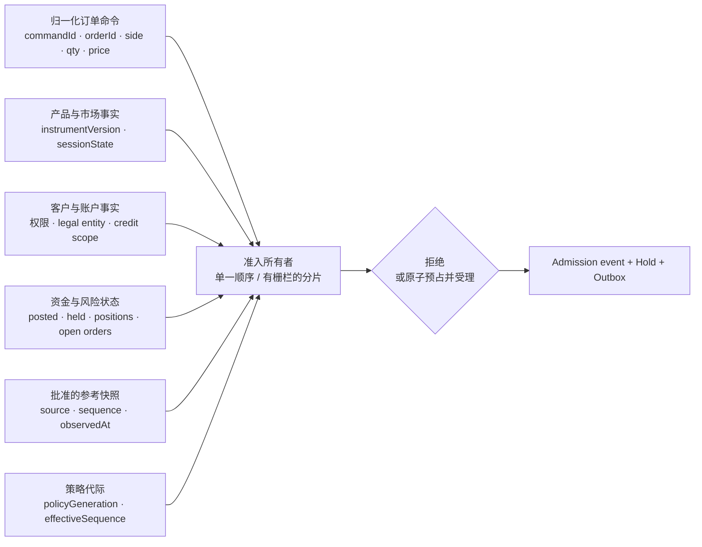
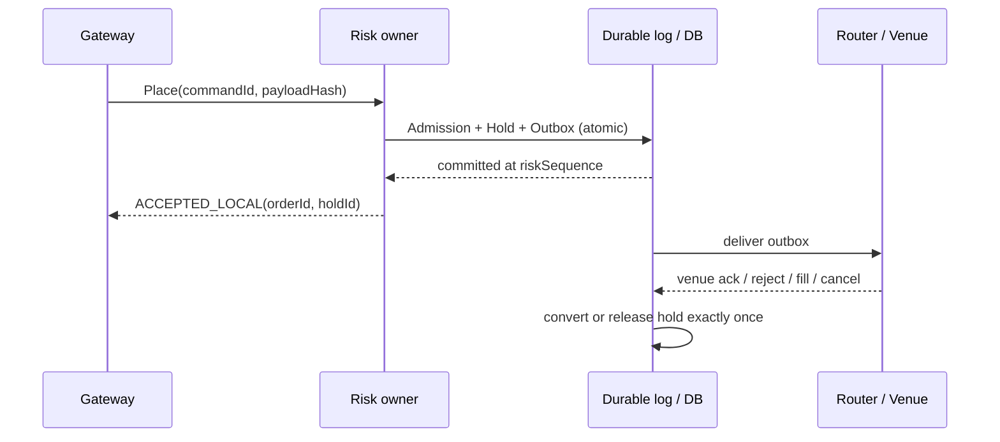
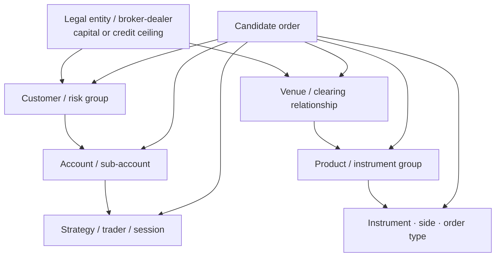
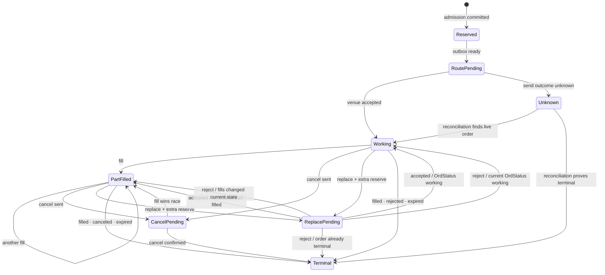
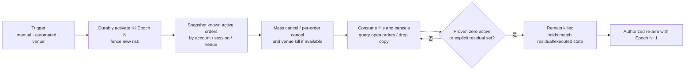
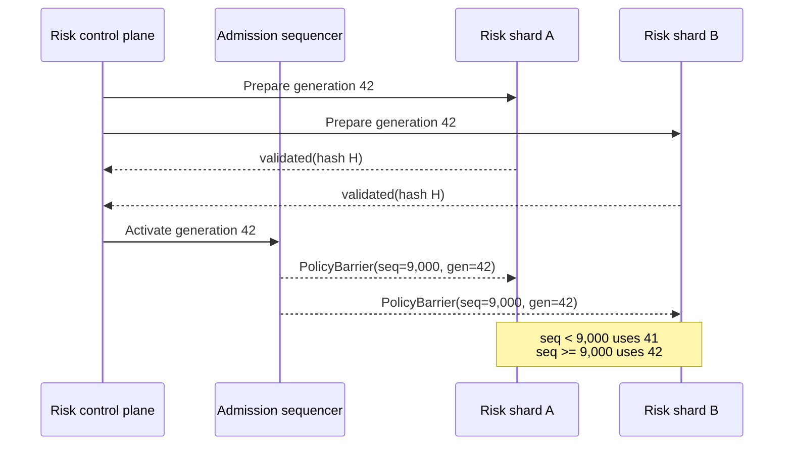
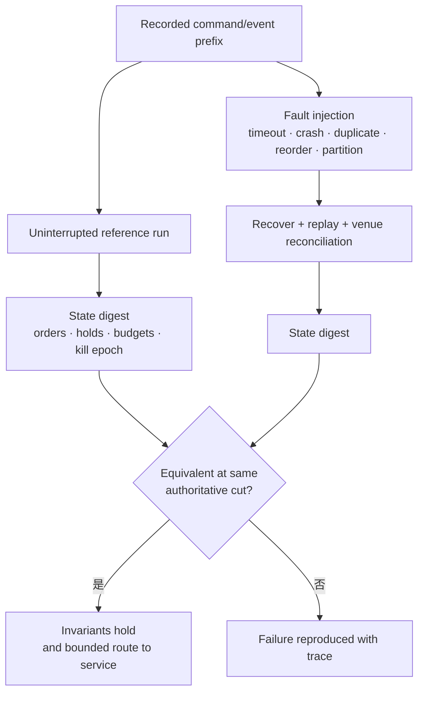

交易前风控常被画成订单网关前的一排 `if`：余额够不够、数量大不大、价格离市场远不远，全部通过就把订单发出去。真正危险的地方恰恰藏在“通过”之后：两张并发订单是否消费了同一份余额？请求超时后重试是否又占了一次限额？Cancel/Replace 在旧单仍可能成交时释放了多少资金？进程重启后，系统能否证明场内挂单与本地预占仍然一一对应？

本文的核心结论是：**交易前风控不是一个无状态校验函数，而是一笔带版本、可幂等、可恢复的订单准入事务。** 它要在同一个权威顺序里决定订单能否进入下一阶段，并原子地预占会被该订单消耗的资金、信用或风险预算；后续再由成交、拒绝和撤单等权威事件结转或释放预占。

本文承接 [交易品种主数据与市场状态](/signal-grid-blog/posts/trading-instrument-master-market-state-and-rule-versioning/) 和 [交易订单语义](/signal-grid-blog/posts/order-types-and-execution-strategies/)。前者提供 instrument identity、tick、lot、交易阶段与规则版本，后者定义 Market、Limit、TIF、Post-Only、Reduce-Only 及订单状态机。这里不重复这些定义，而是回答：一张语义合法的订单，凭什么获得进入路由或撮合的资格。

> 本文讨论交易系统工程，不构成法律、监管、投资或风险管理意见。SEC Rule 15c3-5、欧盟 MiFID II/RTS 6、CME Globex、HKEX 与 FIX 的适用主体和技术语义并不相同；文中引用只用于建立可验证边界。真实控制必须以业务所在司法辖区、持牌实体、客户关系、交易场所、清算安排和当期规则为准。交易前检查只能限制已建模的风险，不能消除价格跳空、流动性枯竭、模型错误、场所故障或未知风险。

## 准入结论只和它读取的权威输入一样可靠

一张订单是否可接受，不只取决于订单自身。它是在某个明确切点上，对订单、客户、产品、账户、市场和风险参数做出的联合判断。若这些输入来自不同时间、不同版本或不同身份空间，代码中的每个比较都可能“局部正确、整体错误”。



### 输入不是字段清单，而是带来源和时效的事实

最低限度应区分下面几类输入。表中“失效策略”是工程默认值，不是所有场所的统一规则。

| 输入 | 权威来源或所有者 | 必须携带的证据 | 缺失、过期或冲突时 |
| --- | --- | --- | --- |
| 订单命令 | 接入网关完成认证后的 canonical command | `commandId`、账户、原始 payload hash、接收序列 | 拒绝；不能补猜账户或订单类型 |
| 产品规则 | 版本化 Instrument Master | instrument/listing ID、rule version、单位、tick/lot、能力 | 拒绝新风险；撤单仍应放行 |
| 市场阶段 | 场所状态机或内部撮合序列 | venue、session、state sequence | 按权限矩阵收缩；不能把未知当 Open |
| 账户与客户 | 账户/客户主数据控制平面 | legal entity、risk group、权限版本、状态 | 冻结对应作用域；不能退回匿名默认组 |
| 资金与仓位 | 账本、仓位与订单风险投影 | 权威游标、估值版本、已用与已预占 | 不再增加风险，等待恢复或对账 |
| 参考价格 | 获准的行情/指数/理论价管线 | source、sequence、event time、receive time、quality | 使用批准的降级源或拒绝价格敏感订单 |
| 风控参数 | 受控发布的 policy generation | 审批、hash、effective sequence、适用范围 | 保持最近已验证代际；未知代际不得准入 |

这里的“权威”不是说某个价格代表客观公允价值，而是说**该系统已明确批准谁在这个规则下提供输入**。最优买卖价可以是真实盘口的权威副本，却仍可能很薄；指数可以更抗单一盘口噪声，却可能延迟；期权理论价依赖波动率曲面，也可能失真。风控必须保存选择依据与质量状态，而不是只保存一个 `referencePrice`。

### 先把订单归一化，再谈限额

进入准入域的订单不应仍是一包含糊的 UI 字段。一个简化的 canonical command 可以是：

```text
OrderCommand {
  commandId, clientOrderId, orderChainId,
  legalEntityId, customerId, accountId, strategyId,
  listingId, instrumentVersion,
  side, orderType, tif, executionRestrictions,
  quantityLots: int64,
  limitPriceTicks?: int64,
  stopPriceTicks?: int64,
  quantityType,
  receivedAt, ingressSequence,
  payloadHash
}
```

`symbol` 不能代替 `listingId`，小数位不能代替 tick/lot，`customerId` 不能代替承担信用风险的法律实体。条件单也要说明风控发生在**条件单登记时、触发时，还是两次都发生**：登记时完全不占用预算，触发瞬间可能因额度不足而失败；登记时全额预占，又会长期冻结资源。两种策略都可以存在，但必须成为产品合同而不是偶然实现。

### 动态输入必须有一致切点

并不要求产品、余额、行情和策略来自同一数据库事务，但准入记录必须能重建“当时看到了什么”。至少保存：

```text
AdmissionContext {
  instrumentVersion,
  accountVersion,
  balancePosition,
  positionSequence,
  marketDataSource,
  marketDataSequence,
  referenceObservedAt,
  policyGeneration,
  admissionSequence
}
```

时间戳只能说明时间，不能提供顺序或完整性。行情 `observedAt` 很新，也可能在中间漏过一段增量；余额缓存延迟 2 ms，也可能遗漏一笔已经 durable 的 hold。每种输入都要有与其协议相符的 freshness、gap 与完整性判定。

这也是为什么“风控服务超时就绕过”通常是错误降级：超时意味着系统失去了证明准入安全所需的事实，而不是证明订单安全。更合理的降级是**停止增加风险，同时维持撤单、Kill Switch、状态查询和对账通道**。

监管要求也应按适用范围理解。美国 SEC 对具有 market access 的 broker-dealer 的 [Rule 15c3-5 FAQ](https://www.sec.gov/rules-regulations/staff-guidance/trading-markets-frequently-asked-questions/divisionsmarketregfaq-0) 概括了预设客户及 broker-dealer 聚合信用/资本阈值、异常价格或数量及重复订单控制，并强调相关控制通常应由承担义务的 broker-dealer 直接且专属控制。它不是所有资产、所有国家、所有自营交易系统的通用法条，但给出了一个重要的系统边界：**真正承担风险责任的主体不能把准入决定悄悄外包给不受其控制的请求方。**

## “通过检查”与“占用额度”必须是一个原子状态转换

最经典的超卖不是公式错，而是 check-then-act：两条线程都看到 `available = 100`，各自检查一张需要 `80` 的订单，然后分别扣减。最终系统受理了 `160`，尽管每次比较都通过。

正确的不变量不是“校验时余额足够”，而是：

```text
对每个受约束作用域 s：
committedUsage(s) + reservedUsage(s) + delegatedLease(s) <= limit(s)
```

若管理者把限额主动下调到已用量以下，可以出现显式的 `overLimitDebt`，但该状态不得再批准正向风险增量：

```text
available(s) = limit(s) - committedUsage(s) - reservedUsage(s) - delegatedLease(s)
additionalReserve(s, candidate) = max(
  0,
  worstCaseUsage(s, currentState + candidate) - currentUsage(s)
)
admit(candidate) only if additionalReserve(s, candidate) <= max(0, available(s))
```

可能降低风险的订单可以得到 `additionalReserve = 0`，但不能在成交前产生负预占或释放现有使用量；只有后续权威 fill 才能把实际风险下降计入 `committedUsage`。

### 准入事务要先落下可恢复事实，再产生外部副作用

单数据库实现可以用行锁、乐观版本或串行izable事务；低延迟系统也可以由单写者在有序日志中提交。载体不同，边界相同：

```text
admit(command):
  1. lookup (commandId, payloadHash)
     - same hash  -> return prior result
     - other hash -> reject IDEMPOTENCY_CONFLICT
  2. bind one instrumentVersion + policyGeneration + reference snapshot
  3. compute required hold and every affected limit delta
  4. lock or own all affected budget scopes in deterministic order
  5. re-read authoritative utilization; evaluate every invariant
  6. atomically append:
       AdmissionAccepted(commandId, orderId, context, decisionDigest)
       HoldCreated(holdId, orderId, components, upperBounds)
       BudgetReserved(scopeDeltas)
       OutboxRouteOrder(orderId, wirePayload)
  7. commit
  8. only then may the outbox/router send to the venue or matcher
```

先发订单再记 hold，会在“场所已接受、进程尚未提交”时制造无预占挂单；先提交 hold 再直接调用网络，则会在网络结果未知时留下预占。后者可以靠 outbox 与恢复协议解决，前者却可能已经突破限额。因此，**允许留下可恢复的保守占用，不允许留下无法归因的场外风险。**



`ACCEPTED_LOCAL` 只表示本地准入和预占已经 durable，不表示交易场所已接受，更不表示成交。客户端状态至少要区分：

```text
REJECTED_LOCAL
ACCEPTED_LOCAL
ROUTE_PENDING
VENUE_WORKING
PARTIALLY_FILLED
CANCEL_PENDING
TERMINAL
UNKNOWN_RECONCILING
```

### 预占金额必须覆盖订单可能产生的经济上界

现货限价买单的教学模型可以写成：

```text
quoteHold = ceil_to_quote_atom(
    quantityBaseAtoms × limitPriceRational
  + worstCaseFee
  + venueSpecificBuffer)
```

现货卖单通常预占 base 数量；若允许借币、负余额或以其他资产付费，还要把借贷权限、利息、手续费币种和抵押品规则纳入模型。市价单没有确定成交价，不能拿最后成交价假装上界。系统应要求 `maxSpend`，使用 venue collar/本地风险价形成可证明上界，或者在无法界定损失时拒绝。

衍生品更不能把 `price × quantity` 当成通用保证金。一个更合适的接口是：

```text
incrementalRequirement = riskModel(
  portfolioBefore,
  portfolioBefore + candidateOrderWorstCaseFill,
  openOrderSet,
  marketSnapshot,
  marginPolicyVersion)
```

它可能是逐仓初始保证金、基于合约 margin rate 的敞口，也可能是组合情景下的增量要求。对冲能否净额、两侧挂单能否同时成交、期权 Greek 如何压力、跨产品价差是否享受抵扣，全部是模型版本的一部分。CME 当前 [Globex Credit Controls](https://www.cmegroup.com/tools-information/webhelp/globex-credit-controls/Content/CME-Globex-Credit-Controls-Management.html) 就按清算实体、执行机构与交易所分组管理期货/期权 exposure 和可选 maximum quantity；这说明场所控制本身也有明确作用域和产品算法，不能被抄成一条通用公式。

### 精确数值类型是正确性要求，不是性能装饰

建议在类型层区分：

```text
PriceTicks       = int64
QuantityLots     = int64
AssetAtoms       = int64 or checked big integer
MoneyAtoms       = int64 or checked big integer + CurrencyId
Rate             = integer numerator/denominator or fixed-scale decimal
RiskAmount       = checked 128-bit/fixed decimal equivalent
```

乘法必须先提升到足够宽的精确域并检查溢出，再按规则指定的方向舍入。Java 可在低频控制面使用 `BigInteger`/`BigDecimal`，热路径使用经过边界证明的 `long` 或十进制定点类型；但不能让 `long × long` 先溢出，再把错误结果装进大数。`double` 既不能精确表达多数十进制 tick，也无法为资金上界提供稳定舍入。

预占还要满足守恒关系：

```text
createdHold = remainingHold + convertedToFill + released + explicitlyAdjusted
```

每个分量都必须有事件 ID 与原因。部分成交只结转对应数量和费用，撤单只释放确认不再可能成交的 leaves；不能把“已经发送 Cancel”当作“场所已经没有订单”。

## 限额是一组相交的预算，不是一张 `customer_limit` 表

同一张订单可能同时受法律实体、客户、账户、交易台、策略、venue、产品、instrument、方向与订单类型约束。只检查最细粒度账户，会让许多账户共同突破 firm cap；只检查公司总额，又无法阻止单一客户或产品集中度失控。



### 每类限额回答的问题不同

| 控制 | 主要问题 | 典型计量 | 为什么不能被另一项替代 |
| --- | --- | --- | --- |
| 权限/限制名单 | 这个主体能否交易这个产品 | 布尔权限 + 规则版本 | 有钱不代表有权交易 |
| 单笔数量 | 这张命令是否异常大 | lots/contracts/base atoms | 总额度很大仍可能误敲一个数量级 |
| 单笔价值 | 这张订单的经济量级是否异常 | 精确 notional/risk value | 相同数量在不同价格或 multiplier 下风险不同 |
| Open order 数/消息率 | 是否在制造容量与操作风险 | count、messages/window | 金额很小也能打爆网关或撤改单路径 |
| Gross buy/sell exposure | 两侧最坏情况下可能成交多少 | side-specific amount | 净额会掩盖两侧挂单同时成交 |
| Net exposure/position | 最终方向性风险 | signed quantity/value | gross 很大但真正方向风险可能较小 |
| Credit/capital | 承担风险主体最多承诺多少 | currency/risk units | 单产品合规不代表总体偿付能力足够 |
| Concentration | 是否过度集中于一个标的或因子 | share、bucket exposure | 总风险未超限也可能高度相关 |
| Loss/drawdown | 是否应停止新增风险 | realized/unrealized loss | 订单大小检查看不到累计损失 |

这些控制并非越多越安全。若作用域和更新语义不清，多个计数器只会产生互相矛盾的“可用额度”。每项 limit 都应定义：owner、unit、scope key、aggregation rule、policy generation、reset rule、对 fill/cancel/replace 的状态转换，以及越限后的动作。

### 多级预算必须共同串行，或被安全地切成额度租约

若账户分布在多个网关，而每个网关都从一个略有延迟的 firm utilization 副本准入，就会在公司级限额上超发。常见的两种正确方案是：

1. **共同所有者。** 将会共同竞争的预算放到一个串行化域，或用跨行事务按固定顺序锁定所有层级；
2. **额度租约。** firm owner 给各分片分配带 epoch/fence 的子额度，使 `sum(active leases) <= firm limit`。分片只能在自己的 lease 内准入，耗尽就申请新额度或拒绝。

额度租约不是缓存。失联分片的额度不能因“几秒没心跳”就立即发给别人；旧分片可能仍在运行。回收必须依赖可证明的租约到期、单调 epoch、旧 writer fencing 和场内订单对账。否则系统把一致性问题伪装成了 TTL。

### 风险降低也必须由权威结果确认

系统可以给撤单、Reduce-Only 或风险降低命令更高通行优先级，但不能提前把预期收益计入可用额度：

- 发送卖单并不等于已经减掉 long position；它可能被拒绝或只成交一部分；
- 发送 Cancel 并不等于 working order 已消失；撤单途中仍可能成交；
- 同一账户的 buy 与 sell 不一定能完全抵销；两者可能在不同场所、不同合约或不同时间成交；
- 组合保证金中的“风险降低”取决于完整情景与当前组合，不能靠 side 名称判断。

因此，准入引擎可以计算候选订单的保守 `deltaRisk`，但只有 fill、cancel ack、order status/drop copy 或本地撮合权威事件才能改变 committed/remaining 状态。

美国规则与欧盟规则在适用对象和措辞上不同，却都说明聚合层不可忽略。SEC FAQ 提到按每个 customer 及 broker-dealer 聚合的预设 credit/capital threshold；欧盟 [RTS 6 Article 20](https://eur-lex.europa.eu/eli/reg_del/2017/589/oj) 则要求 DEA provider 的客户订单始终经过由 provider 设置并控制的 pre-trade controls，并把限额建立在其对 DEA client 的信用与风险限额上。工程上不能把这些话简化为“建一张客户额度表”，但可以据此检查：承担义务的主体是否拥有聚合视图、参数控制权和可审计的准入证据。

期货领域还要换一套适用性分析。美国 [CFTC Regulation 1.73 最终规则](https://www.cftc.gov/LawRegulation/FederalRegister/FinalRules/2012-7477.html) 针对作为 DCO clearing member 的 FCM，要求按 proprietary/customer account 设置基于 position size、order size、margin requirements 等因素的 risk-based limits，并对 electronic market access/automated execution 使用 automated screening。它不是 SEC 15c3-5 的期货版逐字复制，也不能据此宣称所有期货交易主体都负有同样义务。正确的配置主键始终包含**司法辖区、受规制主体、产品、客户关系与 venue/profile**。

## Fat Finger、价格带与信用检查在拦截不同的错误

“价格不对”至少可能表示四件不同的事：价格编码不合法、订单经济量级异常、价格偏离参考过远，或超出交易场所当前允许的价格范围。把它们都返回成 `RISK_REJECT`，既无法解释拒绝，也无法证明控制覆盖完整。

### 先按依赖顺序做检查

一个可解释的顺序通常是：

```text
1. Identity / permission
   account、listing、客户、session、restricted instrument

2. Structural validity
   必填字段、order type capability、TIF、tick、lot、min/max quantity

3. Market-state permission
   Open、Auction、Halt、Cancel-Only、Close-Only 对动作的权限

4. Single-order fat-finger
   max quantity、max order value、duplicate burst、message rate

5. Price plausibility / collar
   与批准参考快照比较，处理 stale/missing/crossed market

6. Aggregate capacity
   funds、credit、margin、position、gross/net exposure、open orders

7. Atomic reservation
   所有作用域一起提交 hold、decision 和 outbox
```

顺序主要影响成本与拒绝原因，不能改变最终集合。例如，先做便宜的权限和网格校验可以避免无意义的组合保证金计算；但不得因为单笔名义价值很小，就跳过受限产品或客户聚合信用检查。

欧盟 [RTS 6 Article 15](https://eur-lex.europa.eu/eli/reg_del/2017/589/oj) 对其适用的 algorithmic investment firms 明确列出 price collars、maximum order value、maximum order volume 与 maximum message limits，并要求把发往场所的订单立即纳入 pre-trade limit 计算。这里的意义不是让所有系统复制四个字段，而是说明：**价格、单笔规模、消息容量和累计使用量是不同控制面。**

### Fat Finger 是本方的异常意图检测

Fat Finger 控制试图发现“这大概不是操作者或算法原本想发的订单”。常见维度包括：

- 数量超过 instrument/account/strategy 的单笔上限；
- 单笔 notional 或风险价值超过阈值；
- 价格相对批准参考偏离过大；
- 短时间内出现重复 `clientOrderId`、相同 payload 或异常消息突发；
- 把百分比、收益率、wire price、display price 或经济价格混用了单位；
- 市价单没有可证明的 `maxSpend`/保护边界。

它是配置化的风险判断，不是“明显错误”的客观真理。深度很薄的远月合约、刚开盘的 IPO、接近零或允许负价的产品、复杂期权和拍卖阶段都可能让普通百分比阈值失效。参数必须按 instrument class、session phase、side、order type 与参考源版本化。

一个简化的 side-aware collar 可以写成：

```text
buyUpper  = askReference + max(absoluteTicks, ceil(askReference × bps / 10_000))
sellLower = bidReference - max(absoluteTicks, ceil(abs(bidReference) × bps / 10_000))

limit buy  requires price <= buyUpper
limit sell requires price >= sellLower
```

这只是示意，不是普适公式。若 book crossed、没有 ask/bid、reference 为零或负数、价格采用收益率方向、instrument 处于 auction，必须进入该产品定义的分支。所有中间量应使用整数 tick 或精确有理数，阈值向更保守方向舍入，并在拒绝事件中记录 reference、quality、age、band 和 policy generation。

### Venue price band 是场所的可接受边界，不是本方损失上限

交易场所的 price band/collar 保护其市场秩序。本方 Fat Finger 保护客户、broker 或交易系统。二者可能都拒绝同一张订单，却不能互相替代：

- venue band 可能比客户授权宽得多；订单在场所合法，仍可能对该账户荒谬；
- 本方参考可能过期，而 venue 使用更接近撮合引擎的状态；
- venue band 可能盘中调整，且不保证订单在 band 内就有足够流动性；
- 本方通过不等于 venue 接受，venue 通过也不等于订单不会产生亏损。

CME 对 [Price Banding](https://www.cmegroup.com/education/articles-and-reports/understanding-price-limits-and-circuit-breakers) 的公开说明是：场所会拒绝给定范围外的订单；该机制与产品 price limits、circuit breakers、velocity logic 也不是同一件事。具体 band 值和参考规则按产品与市场状态变化，因此本文不提供可硬编码的“CME 百分比”。系统应消费场所机器可读参数或受控配置，并把 venue rule generation 与本方 risk policy generation 分开保存。

最终边界通常取多层控制的交集：

```text
admissible(order) =
  instrument-valid
  AND market-state-allowed
  AND customer-fat-finger-pass
  AND firm-credit-pass
  AND local-price-collar-pass
  AND venue-known-band-pass
```

即使全部为真，也只证明订单没有违反这些已知边界，不证明价格“公平”、一定成交或一定盈利。

### 数量、价值和保证金必须按各自单位比较

设订单数量为 `qtyLots`，产品版本提供 `lotSizeAtoms`、`contractMultiplier` 与 price quotation。现货线性产品的名义价值或许可以表达为：

```text
baseAtoms   = checkedMultiply(qtyLots, lotSizeAtoms)
quoteAtoms  = roundUp(baseAtoms × priceRational)
```

线性期货的教学式可能是：

```text
notional = contracts × multiplier × economicPrice
```

反向、quanto、债券收益率、期权权利金或价差产品则有不同价值函数。`maxOrderValue`、credit usage 和 initial margin 也不是同一个数字。应让产品版本选择经过审核的 valuation/risk function，而不是靠 symbol 后缀猜。

还要给所有转换设上界测试：最大合法 `qtyLots`、最大/最小价格、最大 multiplier、币种 scale、汇率与费率相乘时不得溢出；除法余数要按“资金预占向上、释放不超额”等业务方向处理。若系统无法精确表示候选值，正确结果是明确拒绝 `NUMERIC_RANGE_EXCEEDED`，不是饱和到 `Long.MAX_VALUE` 后继续比较。

## 并发、重试与改单竞态决定限额是不是真的存在

单线程单账户的 happy path 很容易通过测试。真正会击穿限额的是同一风险预算上的并发、网络结果未知和订单链状态竞争。

### 幂等键要绑定 payload，而不是吞掉所有重复请求

客户端重试必须沿用稳定 `commandId`；服务端保存：

```text
(principal, commandId) -> {
  payloadHash,
  decision,
  orderId?, holdId?,
  policyGeneration,
  resultVersion
}
```

同 key、同 hash 返回先前结果；同 key、不同 hash 必须报冲突。若第一次请求已经提交但响应丢失，第二次不能新建 hold；若第一次在提交前失败，重试才有资格执行新的准入事务。

FIX 的 [`ClOrdID(11)`](https://fiximate.fixtrading.org/en/FIX.Latest/tag11.html) 是订单链中的客户侧标识；FIX 规范至少要求在单个交易日内唯一，并建议跨日订单使用更长唯一范围。内部 `commandId`、`orderId`、venue `OrderID`、FIX `ClOrdID` 与 `ExecID` 仍是不同命名空间：不能拿可能重置的 session sequence 或数据库自增 ID 替代业务幂等键。

### Cancel/Replace 不能提前释放旧订单预占

在 Cancel/Replace pending 期间，旧订单可能先成交，改单也可能被拒绝。安全模型要看场所合同：

```text
oldRisk = reserve(old leaves)
newRisk = reserve(proposed new leaves)
```

- 若场所保证同一订单链的 replace 原子替换，可以在发送前持有 `max(oldRisk, newRisk)`，但在 replace ack 前不能按新单较小值释放旧 hold；
- 若“撤旧”和“发新”是两个独立动作，最坏窗口可能需要 `oldRisk + newRisk`，否则应串行等待旧单终态；
- 增量改单应先取得额外额度，再发送；额度不足时拒绝改单，但保留原订单与原 hold；
- 减量改单也要等权威 ack 后再释放差额，因为旧 leaves 在途中仍可能成交。

FIX [`OrderCancelReplaceRequest`](https://fiximate.fixtrading.org/en/FIX.Latest/msg17.html) 用新的 `ClOrdID` 标识 replacement，并由 `OrigClOrdID` 指向上一张未被拒绝的订单。这个消息关系帮助关联订单链，却没有替本地系统提供资金事务，也没有消除请求与 fill 的竞态。



实现上不能只按枚举大小覆盖状态。`CancelPending` 后来的 fill 仍然合法，迟到的 New Ack 可能在 fill 之后到达，drop copy 与 order entry channel 也可能交错。事件应用要依据 venue order identity、execution identity、leaves/cum quantity、业务序列和允许的状态转换去重。

FIX [`ExecutionReport(35=8)`](https://fiximate.fixtrading.org/en/FIX.Latest/msg9.html) 区分描述当前订单链状态的 `OrdStatus` 与描述本次事件的 `ExecType`，并用 `CumQty`/`LeavesQty` 表达已成交与剩余量；`Pending Cancel` 也不表示撤单已经完成。具体场所是否发送 pending 状态、如何重放、哪个通道最权威仍由 venue profile 决定。接入实现必须以目标 profile 和认证测试为准。

### Fill、拒绝和撤单只能各结转一次

事件处理至少需要三类幂等键：

- 订单命令：`principal + commandId`；
- 场所订单链：`venue + session/partition + venueOrderId`；
- 成交/执行事件：venue 定义的 `ExecID`、trade ID 或 partition sequence。

一笔部分成交到达时，应在同一原子边界内：

1. 去重 execution；
2. 从 remaining hold 转换对应成交资金/保证金；
3. 更新 committed exposure、position pending state 与 order leaves；
4. 记账或向清算 outbox 发出唯一 fill 事实；
5. 仅释放已经确定不再需要的剩余 buffer。

如果账本入账与风险投影不在同一数据库，需使用可重放事件和游标把它们连接起来，并在恢复时证明二者收敛；不能在一个回调里先减 hold、再 best-effort 写账本。

### 热点账户与全局限额不能靠“最终一致”准入

允许查询副本最终一致，不代表准入写入可以最终一致。对一个共享额度，至少需要以下之一：单写者分片、可串行化事务、带版本的 compare-and-swap，或上文有 fence 的额度租约。无论选哪种，都要用同一组竞争测试证明：

```text
N 个并发请求，每个消耗 x，初始 available = k × x
=> 恰有 k 个请求提交 hold
=> 其余明确拒绝或等待
=> 重试、超时、主从切换后仍不超过 k
```

吞吐优化应围绕 ownership、批量与数据局部性展开，而不是先放行订单、稍后再发现超限。事后告警只能缩短风险暴露时间，不能把交易前控制变成交易后统计。

## COD、Mass Cancel 与 Kill Switch 是三种不同的紧急语义

断开连接、批量撤单和 Kill Switch 经常被统称为“一键撤单”。它们的触发者、作用域、是否阻止新单、是否尽力执行和结果证明方式都不同。若系统只保存一个 `killed=true`，故障后几乎无法回答哪些订单仍可能在场。

对适用的欧盟 algorithmic investment firm，[RTS 6 Article 12](https://eur-lex.europa.eu/eli/reg_del/2017/589/oj) 要求具备紧急取消任一或全部、发往任一或全部已连接 venue 的未执行订单的 kill functionality，并能把订单归属到相应 algorithm、trader、desk 或 client。这是一项能力与治理要求，不是“跨场所原子撤单已经完成”的分布式事务保证；工程上仍要逐 venue、逐 order 收敛结果。

| 机制 | 典型触发 | 典型作用域 | 是否天然阻止新单 | 完成证据 |
| --- | --- | --- | --- | --- |
| Cancel on Disconnect（COD） | 场所检测到指定 session 非正常断连 | connection/session 发出的部分订单 | 不一定；重连行为按场所规则 | 场所回报 + open-order/drop-copy 对账 |
| Order Mass Cancel | 客户端显式发送批量撤单请求 | instrument、product、session、market 或 all 等协议范围 | 通常不阻止并发新单 | Mass cancel response + 每张订单终态/场所查询 |
| 本地 Kill Switch | 风控、运维或自动规则触发 | strategy/account/customer/firm/venue | 应先在本地 fence 新风险 | kill epoch 已提交 + 路由拒绝 + 场内清零证明 |
| Venue Kill Switch | 有权限的场所/清算/执行主体管理员触发 | 场所提供的 firm/session/entity 范围 | 取决于 venue，常见行为是 block new entry | venue 状态、拒绝、订单与 quote 对账 |

### COD 是场所功能，不是 TCP/FIX 自动语义

FIX [Session Layer](https://www.fixtrading.org/standards/fix-session-layer-online/) 明确把连接终止对 application layer 的影响留给应用层定义。也就是说，TCP 断开或 FIX Logout 本身不会按标准自动撤掉订单。

两个场所示例足以说明不能泛化：

- CME 当前 Session ID 文档说明，启用 COD 且发生非正常断连时，会取消该 iLink Session ID 的 **非 GTC/GTD** 订单；该功能可由 clearing firm administrator 启停。参见 [CME View Session ID Report](https://www.cmegroup.com/tools-information/webhelp/fadb/Content/session-ids-tab.html)；
- HKEX OCG-C 把 COD 定义为可选的 session 级功能，并明确说在特定断连场景下按 **best effort** 取消该 session 的 outstanding orders。参见 [HKEX OCG-C FAQ](https://www.hkex.com.hk/global/exchange/faq/securities-market/trading/orion-central-gateway-securities-market-%28ocgc%29?sc_lang=en)。

因此内部状态不能写成：

```text
socket disconnected => every venue order canceled => release every hold
```

正确反应是先关闭该路由的新增风险，把关联订单标为 `UNKNOWN_RECONCILING`，保留 hold，再从 drop copy、order status/open-order query、成交回报和场所运维确认中收敛。COD 可以缩短裸奔时间，不能替代订单恢复。

### Mass Cancel 是一个异步命令，不是数据库 `DELETE`

FIX [`OrderMassCancelRequest(35=q)`](https://fiximate.fixtrading.org/en/FIX.Latest/msg50.html) 请求取消符合条件的一组订单的剩余数量；`MassCancelRequestType` 可以表达 security、product、session、market 或 all 等范围。目标 venue profile 未必支持全部范围，也可能通过 [`OrderMassCancelReport(35=r)`](https://fiximate.fixtrading.org/en/FIX.Latest/msg51.html) 返回拒绝或其采取的范围。该 report 是对批量请求的应用响应，不足以替代每张订单的成交/终态收敛。

稳健的本地流程是：

```text
1. 先提交 scopeGate = CANCEL_ONLY / KILLED(epoch)
2. 截取该 scope 当前已知 active order set 与场所游标
3. 发送 venue 支持的 mass cancel；必要时逐单补撤
4. 持续接收 fill、cancel、expire、reject
5. 从场所权威查询/回报证明 open set 为空或列出残余
6. 逐单结转或释放 hold
```

顺序中的第一步很关键。若先 mass cancel、后阻止新单，批量命令切点之后进入的新订单可能留在场内；监控却会看到“mass cancel 成功”。

### Kill Switch 要先 fence，再撤单，最后证明场内状态



`KillEpoch` 必须持久化，并进入所有路由命令。旧 gateway 即使从网络分区恢复，也不能带旧 epoch 发单。重启默认继承 KILLED，而不是因为内存布尔值丢失就自动恢复交易。

CME 当前 [Kill Switch](https://www.cmegroup.com/tools-information/webhelp/globex-credit-controls/Content/Kill-Switch.html) 展示了一个具体但非通用的 venue 实现：可按 Legal Clearing Entity、Execution Firm、Sender Comp 等层级，对发往 CME core matching engines 的相应订单流执行；启用后禁止该范围的 new order entry，并取消 Day/Good Till orders。不过文档也列出边界：市场关闭或开盘前最后 30 秒不取消 resting orders，Mass Quotes 不会被取消，级联撤单完成可能晚于 blocking。由此能推出的不是“CME kill 一定清空所有服务与风险”，而是：**任何 Kill Switch 都必须把作用域、阻断新流量与清理既有订单分成可观测事实。**

Kill 也不能撤销已经发生的 fill。触发过程中到达的成交要正常清算、记账并占用 position/credit；否则应急操作反而会破坏账本。重新开放前至少需要新的授权代际、场内订单集合、账户/仓位/hold 对账和受控的小流量恢复，不能只点一个 `unkill`。

## 参数热更新必须定义代际、切点与旧订单命运

风险阈值会盘中变化：客户信用调整、产品状态变化、波动放大、场所更新 price band、账户进入只减仓，都会要求新规则快速生效。问题不在于配置能否“秒级推送”，而在于同一张订单只能被一个完整代际判断，并且所有人都能解释代际切换前后的状态。

```text
RiskPolicyGeneration {
  generationId,
  schemaVersion,
  scope,
  limitsAndActions,
  referencePolicy,
  effectiveAt?,
  effectiveAdmissionSequence,
  createdBy, approvedBy, reason,
  sourceRevision, payloadHash,
  supersedes,
  expiresAt?
}
```

### 生效点应落在权威命令序列，而不是各机墙钟

控制面可以用时间表达业务意图，但热路径应把变化编译成一个序列屏障：



订单到达网关的墙钟时间、进入准入序列的时间和真正执行的时间可能不同。绑定 `effectiveAdmissionSequence` 后，恢复重放不会因为机器时钟或处理延迟而换一套规则。若系统有多个互不共享顺序的风险分片，应分别记录每个分片的 barrier 与安装确认，不能谎称存在一个全局原子纳秒。

### 收紧限额不等于篡改历史，也不自动撤掉旧单

新 limit 低于当前 `committed + reserved + delegatedLease` 时，系统进入显式 over-limit。这里采用非重叠口径：父级 `reserved` 只统计父级直接预占，已经切给子分片的容量全部记在 `delegatedLease`，不能再把子分片内部 reservation 重复加一次：

```text
overLimitDebt = max(
  0,
  committed + parentDirectReserved + activeDelegatedLeaseCapacity - newLimit)
```

收紧代际不能只更新父级数字。激活前必须推进 lease epoch、栅栏旧租约并按新上限重新签发；若旧租约尚不能安全回收，就把其全部容量继续视为已占用，并停止父级直接准入和新增 lease。否则失联分片仍可在旧租约内接单，新限额只是控制面上的愿望。

over-limit 的通用安全含义是阻止正向风险增量，而不是回滚已经发生的 fill。对 working orders 有三种合法策略，必须由 policy 指明：

1. **Grandfather。** 旧订单保留原 hold，新代际只约束新单/改单；
2. **Re-evaluate and cancel。** 按可解释优先级撤销部分旧单，直到使用量回到边界；
3. **Enter cancel/reduce-only。** 整个作用域停止新增风险，由风险处置流程收敛。

任何策略都不能先释放旧 hold，再希望撤单成功。若取消顺序影响客户公平、队列位置或业务损失，还必须保存排序规则和每张订单的处置原因。

放宽限额也不是无风险操作。适用 Rule 15c3-5 的 broker-dealer 需要保有相应控制权；对适用 RTS 6 的 DEA provider，[Article 20](https://eur-lex.europa.eu/eli/reg_del/2017/589/oj) 规定 provider 应保留设置或修改其 pre-/post-trade controls 与监控参数的专属权利。工程上应把 trader request、risk approval、policy activation 分离，禁止订单 payload 携带一个更大限额让热路径照单全收。

### Override 是短期、窄作用域的新规则，不是 `skipRisk=true`

一个可审计例外至少应带：

```text
Override {
  overrideId,
  exact scope and affected controls,
  temporary limits,
  reason and evidence,
  requester, risk approver,
  validFromSequence, expiresAt/sequence,
  max uses?,
  automatic rollback generation
}
```

欧盟 RTS 6 Article 15 对其适用主体允许在 exceptional circumstances 下处理被 pre-trade controls 阻挡但仍希望提交的特定交易，并要求临时、特定、经 risk management 验证及指定人员授权。它支持的是受控例外流程，不是永久白名单。

到期也必须生成权威事件，不能依赖某个进程的 timer 把内存标志翻回去。所有拒绝和接受事件应记录实际采用的 base generation 与 override ID，才能在事后回答“为什么同样参数的两张订单结果不同”。

### 场所参数更新有自己的生效合同

内部配置已经激活，不等于场所配置同步生效。CME GC2 的公开文档就区分实时生效的 exposure/max quantity 更新、按交易时段切换的 weekday/weekend limits，以及在后续 Sunday start-up 才生效的 exchange regrouping。这个例子只代表 CME 当前工具，却揭示了通用要求：

```text
desiredPolicy != locallyActivePolicy != venueAcknowledgedPolicy
```

系统要分别跟踪三者，记录场所确认与实际拒绝回报。若本地认为限额已放宽、场所仍使用旧值，订单会被场所拒绝；反过来更危险——场所已放宽而本地失去控制时，不能把 venue setting 当作唯一防线。

## 故障恢复必须重建“订单—预占—场内状态”的同一事实

准入系统重启时，最危险的做法是从 `orders where status='WORKING'` 重新算余额，然后把差额人工调平。订单表可能落后于场所、fill 可能在另一个通道、cancel 可能结果未知，旧 policy 也可能已经被覆盖。恢复必须从 durable 事件位置重建，再与外部权威状态对账。

### Checkpoint 必须包含足够的可恢复状态

一个风险 checkpoint 至少应原子覆盖：

```text
RiskCheckpoint {
  sourceEventPosition,
  activePolicyGenerations and barriers,
  activeKillEpochs and scope gates,
  budgetUsageByScope,
  delegatedLeases and fences,
  holds with remaining/converted/released components,
  orderChains and known venue identities,
  dedupe results for commands/executions,
  reference-data versions,
  outbox/inbox cursors,
  schemaVersion,
  stateDigest
}
```

恢复过程是：加载 checkpoint，按权威日志重放其后事件，恢复 outbox/inbox 幂等状态，默认关闭新增风险，然后从 venue/drop copy、matcher、账本、仓位与订单查询取得对账事实。只有残余差异被解释或被隔离，相关作用域才可以重新开放。

不能只 checkpoint `availableCredit`。它是 `limit - committed - reserved - leased` 的投影；没有组成项、订单关联和事件游标，就无法判断一笔差额应该重放、释放还是继续冻结。

### 把结果未知当成状态，而不是异常字符串

| 故障窗口 | 不能直接断言 | 安全状态与恢复动作 | 通过证据 |
| --- | --- | --- | --- |
| DB commit 返回前超时 | “事务失败，可以新 key 重试” | 用原 `commandId` 查询；同 payload 重试 | 恰有一个 decision/hold 或明确无提交 |
| Outbox 发送后进程崩溃 | “venue 没收到”或“肯定收到” | 保留 hold；仅在 venue profile 明确保证相应 replay/去重语义时沿原身份恢复发送，否则查询与对账 | 单一 venue order identity，未重复下单 |
| Venue ack 丢失 | “订单被拒绝” | `UNKNOWN_RECONCILING`，查 open orders/drop copy | 找到 working/terminal 事实及序列 |
| Cancel 发出后断线 | “leaves 已释放” | 继续保留 remaining hold，处理竞争 fill | cancel terminal 或残余订单已列明 |
| Fill 重复/乱序 | “每条消息都应结转” | 按 execution identity 去重并按合法转换应用 | `CumQty`、leaves、hold 守恒 |
| Risk owner failover | “新主拿到最新状态” | fence 旧 epoch，重放至 committed position | 单一 active owner，预算不超发 |
| Policy 切换中崩溃 | “所有分片都是新规则” | 从 barrier 恢复每个分片代际 | 每个 decision 都绑定唯一 generation |
| Kill 中途重启 | “重启即解除” | 恢复 active KillEpoch，继续对账与撤单 | 新单持续被 fence，残余集可解释 |
| Venue 与本地 open set 不同 | “以本地为准释放” | 冻结作用域，导入场所事实并查事件 gap | 差集归零或形成经审批的残余处置 |

这个矩阵不是上线清单，而是故障模型：每一行都规定了错误断言、恢复状态和可判定的通过条件。

### 用不变量和状态机证明，而不是只测几个拒绝码

至少应持续验证这些不变量：

1. **准入—预占原子性：** 每个 routed order 都能追到一个先提交的 admission 与 active/converted hold；每个 hold 也只能归属于明确订单或额度租约；
2. **预算守恒：** 每个 scope/generation 的 committed、reserved、leased 与显式 over-limit debt 可重算，任何成功准入都没有突破允许边界；
3. **预占守恒：** `created = remaining + converted + released + adjusted`，所有调整有唯一事件与原因；
4. **订单链单调：** fill、cancel、replace、expire 的交错只产生协议允许的状态；terminal release 恰好一次；
5. **幂等：** 相同 command/execution 重放不改变最终状态，不同 payload 复用 key 必须失败；
6. **代际确定性：** 同一权威事件前缀在相同产品、policy 与 schema 版本下重放得到相同 digest；
7. **Kill fencing：** 旧 epoch 在 failover、重连和延迟消息下都不能重新增加风险；
8. **外部收敛：** 本地 active orders、场所 open orders、drop copy executions、holds、仓位与账本游标能对到同一切点。



测试应主动覆盖：临界额度上的数百并发请求、相同 key 重试与不同 payload 冲突、部分成交和减量改单竞态、Cancel 与 fill 交叉、stale/crossed/missing reference、整数溢出、policy barrier 前后一条命令、kill 过程中 failover、COD 未覆盖 GTC/GTD、mass cancel 部分失败，以及恢复时场所多出/少一张订单。

通过条件不是“没有抛异常”，而是同一权威切点上的合法状态等价、所有预算与 hold 守恒、旧 owner 被 fence、未知结果没有被误判，以及系统存在一条有界的恢复服务路径。

### 对账是控制的一部分，不是夜间报表

欧盟 RTS 6 Article 17 对其适用主体要求将本方电子交易日志与 venue、broker、DEA provider、clearing member、CCP 或数据提供方给出的 outstanding orders 与 risk exposures 做 reconciliation。即使不直接受该条款约束，这仍是重要工程提示：pre-trade control 维护的是对未来成交的承诺，若不持续校准场内 working orders 与 fills，它的“可用额度”会逐渐失去事实基础。

实时对账可以分层：

- 每条 execution/order event 应推进已知 sequence/cursor；
- drop copy 与 order entry 回报做连续性和集合交叉校验；
- 定期 open-order snapshot 与本地 active set 做差；
- 账本、仓位与风险投影按相同 fill cursor 比较；
- 差异超过作用域阈值时自动进入 cancel-only/killed，而不是继续用旧缓存准入。

“对账发现差异”不等于自动以场所覆盖本地。需要先保存证据、识别消息 gap、重复 identity、人工订单、场所 bust/correct 或错误账户映射，再用可审计事件修正投影。

## 准入系统真正保证的是有界承诺，而不是无风险交易

交易前风控能给出的强保证，不是“这张订单不会亏”，而是：在一个明确的产品、市场、账户、参考数据和策略代际下，系统只让满足权限与限额的订单进入下一阶段；每次受理都先形成可恢复预占，并能由后续订单与成交事实精确结转。

这项保证依赖四个因果边界：

1. 权威输入带身份、版本、游标和 freshness，未知时不继续增加风险；
2. 准入与预算预占共享一个串行化/原子提交边界，发送是其后的可恢复副作用；
3. fill、cancel、replace、COD、Mass Cancel 与 Kill Switch 都按各自协议收敛，结果未知不会被冒充成功；
4. policy generation、kill epoch、事件日志和外部对账让 failover 与重放仍能证明相同不变量。

保证之外仍有广阔风险：参考价格可能失真，合法 price band 内仍可能滑点巨大，场所可能暂停或故障，模型可能漏掉相关性，订单通过后市场也会变化。风险检查的正确目标，是把**已知且可度量的承诺**限制在经授权边界内，并在事实不足时安全收缩；它不能把不确定市场变成确定结果。

### 一手资料与适用边界

- [SEC：Rule 15c3-5 Market Access FAQ](https://www.sec.gov/rules-regulations/staff-guidance/trading-markets-frequently-asked-questions/divisionsmarketregfaq-0)：适用于该规则覆盖的 broker-dealer market access，概括 credit/capital、erroneous order、权限、控制权与审查要求；
- [EUR-Lex：Commission Delegated Regulation (EU) 2017/589（RTS 6）](https://eur-lex.europa.eu/eli/reg_del/2017/589/oj)：本文引用 Article 12、15、17、20 等关于 kill functionality、pre-trade controls、reconciliation 与 DEA provider 控制的条款；
- [EUR-Lex：Commission Delegated Regulation (EU) 2017/584（RTS 7）](https://eur-lex.europa.eu/eli/reg_del/2017/584/oj/eng)：交易场所侧 price collars、maximum order value/volume 等要求，不能与投资公司自身控制混为一层；
- [CFTC：Regulation 1.73 最终规则](https://www.cftc.gov/LawRegulation/FederalRegister/FinalRules/2012-7477.html)：说明 DCO clearing member FCM 的账户 risk-based limits 与 automated screening 边界，不能与美国证券 market-access 规则混用；
- [FIX Trading Community：FIX Session Layer](https://www.fixtrading.org/standards/fix-session-layer-online/)、[ClOrdID](https://fiximate.fixtrading.org/en/FIX.Latest/tag11.html)、[Order Mass Cancel](https://fiximate.fixtrading.org/en/FIX.Latest/msg50.html)、[Execution Report](https://fiximate.fixtrading.org/en/FIX.Latest/msg9.html)：提供消息与订单链语义；具体支持范围、重放和 COD 行为仍由 venue profile 决定；
- [CME Globex Credit Controls](https://www.cmegroup.com/tools-information/webhelp/globex-credit-controls/Content/CME-Globex-Credit-Controls-Management.html)、[Kill Switch](https://www.cmegroup.com/tools-information/webhelp/globex-credit-controls/Content/Kill-Switch.html)、[Session ID/COD](https://www.cmegroup.com/tools-information/webhelp/fadb/Content/session-ids-tab.html) 与 [Price Banding](https://www.cmegroup.com/education/articles-and-reports/understanding-price-limits-and-circuit-breakers)：是 CME 当前场所实现示例，不应外推为所有交易所的统一合同；
- [HKEX OCG-C FAQ](https://www.hkex.com.hk/global/exchange/faq/securities-market/trading/orion-central-gateway-securities-market-%28ocgc%29?sc_lang=en)：说明 HKEX 的 session 级可选 COD 采用 best-effort 语义，与 CME 的订单范围并不相同。
