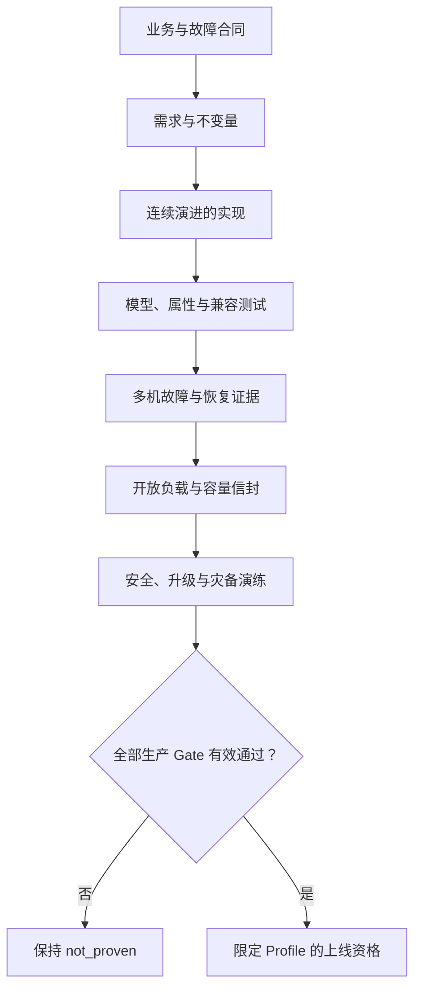
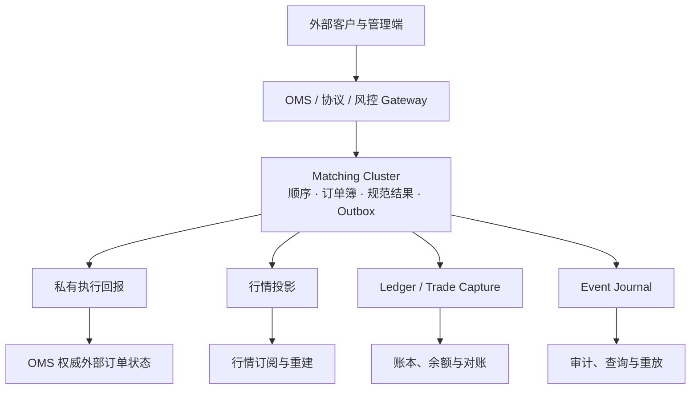
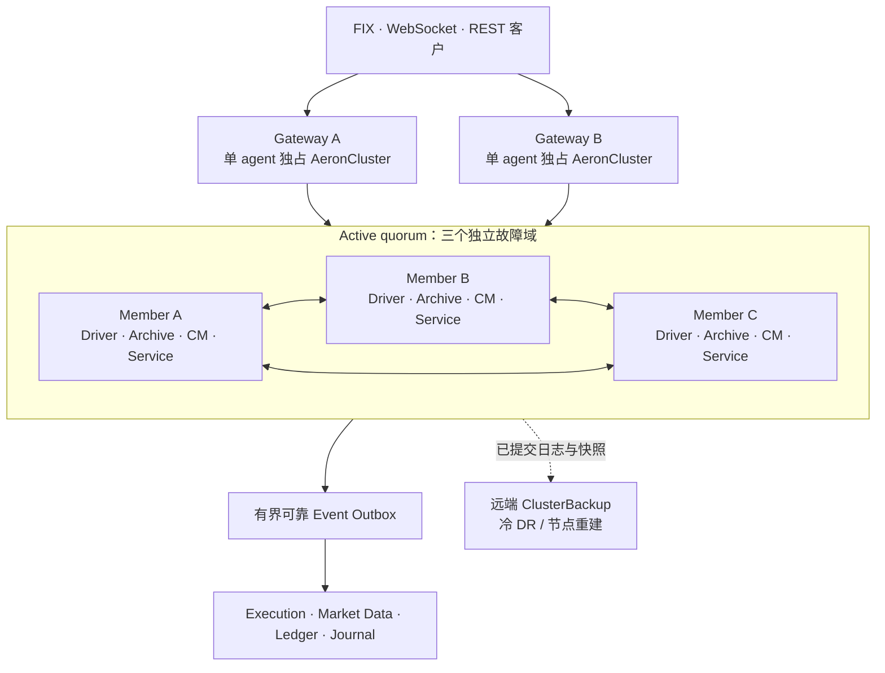
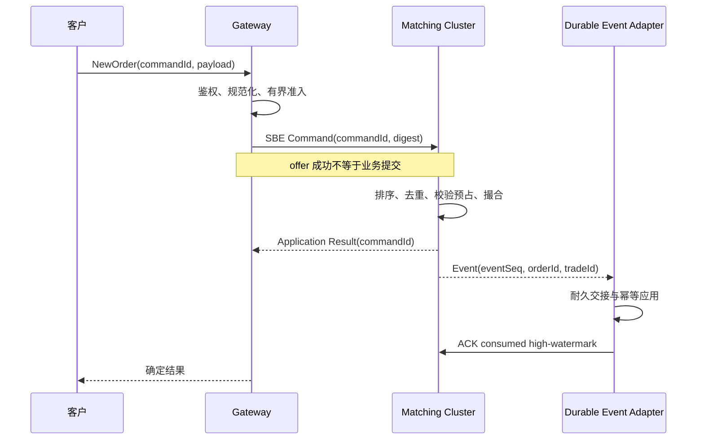

这不是一篇“启动三个节点、提交一笔订单、截图证明成功”的教程。

我们要开始的是一个长期项目：沿同一个版本化代码库，逐步构建一套以 **Aeron Cluster** 为复制与高可用核心的中央限价订单簿撮合系统。每一章都必须让同一个系统向前演进，每个阶段都必须产生可复现交付物；P0 先冻结工程合同，从 P1 开始持续演进同一套代码、配置、故障轨迹和验收证据。最终能不能上线，不由文章标题决定，而由正确性、容量、恢复、安全、升级和灾备 Gate 决定。

因此，项目的第一个交付物不是订单簿代码，而是一份工程合同。

这份合同要先回答：谁拥有订单和成交事实，客户端超时后到底发生了什么，三节点怎样才算高可用，快照漏掉去重表会造成什么后果，慢行情消费者能不能拖死撮合，节点恢复和整站灾备分别保证什么，以及我们要怎样证明目标流量下的 p99.9 不是一个漂亮但无效的数字。

项目当前只有框架，**还没有实现，更没有获得生产上线资格**。完整需求、不变量、ADR、风险、任务和证据状态保存在持续更新的 [PROJECT_RECORD](https://github.com/lcha-reln/signal-grid-blog/blob/main/docs/projects/aeron-cluster-matching-engine/PROJECT_RECORD.md) 中。本文只负责把这条交付路线讲清楚。

## 1. “生产级”不是功能数量，而是一条证据链

一个撮合系统可以很快写出看得见的功能：New、Cancel、价格时间优先、三节点启动、leader 退出后重新选举。这些功能都重要，但它们没有单独回答生产问题。

真正的生产问题是连续的：

- 一条订单在 Gateway 超时，但实际上已经提交，客户重试时会不会重复下单？
- leader 在成交后、执行回报发出前退出，OMS、行情和账本会恢复到哪一个位置？
- Snapshot 恢复了订单簿，却漏掉 `tradeId` 水位或命令去重表，会不会生成重复成交？
- 行情消费者停顿 30 秒，撮合是无限缓存、阻塞、断开，还是受控停盘？
- 三个成员进程都在一台机器上，能不能抵抗主机、供电、网卡或 NVMe 故障？
- Aeron Cluster 已经多数派提交，是否意味着整站断电后仍然 RPO=0？
- 10 万 TPS 是哪种订单比例、多少产品、什么簿深、哪种持久化配置和哪台机器上的结果？

如果这些问题没有精确合同，“高可用”和“低延迟”就只是形容词。



这里的限定 Profile 很关键。我们最终证明的不会是“这个系统永远能承载真实流量”，而是：在某个固定的业务语义、工作负载、硬件、网络、JDK、Aeron 配置、持久化强度和故障模型下，它满足一组可验证目标。一旦其中任何条件变化，相关证据就会变成 `stale`，需要重新验证。

### 目标、决定和观察不能混在一起

项目记录把信息分成几种不同身份：

- `REQ` 是要达到的目标，不代表已实现；
- `INV` 是必须始终成立的状态谓词，需要强制点和 Oracle；
- `ADR` 是工程选择记录；只有 `accepted` 才约束当前实现，`proposed` 只是待评审候选；
- `EVD` 是指定版本、环境和时间下的实验观察，不能无限外推；
- `RISK` 保存仍可能发生的失败；
- `GATE` 决定某个生产声明是否被证据支持。

这能阻止一个很常见的滑坡：设计文档写了“三节点、p99 小于 1ms、RPO=0”，后来这些目标在叙述中逐渐变成了已经实现的事实。

## 2. 先冻结业务边界，再决定什么进入 Cluster

Project 01 的候选 V1 是一个价格时间优先的连续竞价 CLOB：整数 tick/lot，支持 New、Cancel、Cancel/Replace、GTC、IOC、FOK、价格保护、STP、Trading Halt 和 Kill Switch。

这只是当前用于推进设计的候选范围。Auction、Iceberg、Pegged、组合订单、衍生品保证金、强平、清算和托管不会悄悄塞进第一版。每增加一种订单语义，都会改变状态机、协议、快照、恢复、容量和兼容性证明，必须显式进入需求和 ADR。

现有专题已经分别讲过[撮合机制](/signal-grid-blog/posts/matching-engine-and-auctions/)、[订单簿与 STP](/signal-grid-blog/posts/order-book-and-self-trade-prevention/)、[交易前风控](/signal-grid-blog/posts/pre-trade-risk-and-order-admission/)、[OMS 与私有执行回报](/signal-grid-blog/posts/oms-private-execution-reports-and-reconciliation/)、[行情重建](/signal-grid-blog/posts/market-data-pipeline-and-order-book-reconstruction/)和[双重记账](/signal-grid-blog/posts/trading-ledger-double-entry-accounting-and-reconciliation/)。实战线不会把这些理论再复述一遍，而是要决定它们在同一个真实系统里的权威边界和恢复接口。

### Matching Cluster 拥有什么

撮合 Cluster 是以下事实的唯一权威来源：

- 已准入命令的确定性执行顺序；
- 当前订单簿、活动订单和撮合状态；
- `orderId`、`tradeId`、`engineSeq`、`bookSeq` 和业务事件序列；
- 每个“认证逻辑主体 + `commandId`”的去重状态与唯一规范结果；
- 已消费的风险预占凭证；
- 影响撮合的产品、交易状态、价格带、停牌和 Kill Switch 版本；
- 尚未被下游可靠接收的有界业务事件 Outbox。

### Matching Cluster 不拥有什么

外部 FIX/WebSocket 会话、客户认证、账户总资产、会计分录、行情客户订阅、监管报表和分析查询都不属于撮合状态机。它们由 OMS/Gateway、Risk、Ledger、Market Data、Identity 和 Data Platform 分别拥有。



边界不是为了画出更多方框，而是为了保护确定性。Aeron 官方把“业务逻辑必须确定性”称为不可打破的规则，并明确建议 Cluster 业务逻辑不要直接做外部 I/O。[Efficient Business Logic](https://aeron.io/docs/aeron-cluster/efficient-business-logic/)

所以撮合服务里不能查询数据库判断余额，不能调用 HTTP 获取产品配置，不能用系统时间决定订单优先级，也不能在成交后同步写 Kafka 或账本。所有影响结果的输入必须成为有序命令；所有外部副作用必须通过可恢复协议离开。

## 3. 高可用拓扑从故障域开始，而不是从进程数开始

候选生产拓扑包含三个 voting members。稳定运行时恰有一个 leader、另外两个是 followers；同一个 leadership term 至多有一个 leader，选举期间则可能暂时没有 leader，并出现 candidate。三节点多数派是 2，可以容忍一个 member 故障，前提是剩余两个成员彼此可达并形成健康 quorum；没有 quorum 时不能产生新的 committed business result。三个进程如果共享同一台主机、供电、网卡或磁盘，就不能称为能抵抗主机故障的高可用系统。

每个 member 至少包含专属 Media Driver、本地 Archive、Consensus Module 和 Matching `ClusteredService`。这些组件最终是同进程还是分进程，不在项目地图里拍板：分进程能改善故障隔离，合并进程可能减少部署与通信成本，必须由固定拓扑下的故障和性能证据决定。



Aeron 官方建议外部协议通过 Gateway 进入 Cluster。Gateway 隔离 leader 变化、外部协议和客户连接，还可以把认证、协议解析、初步校验和客户级扇出移出单线程业务热路径。[Gateway Design](https://aeron.io/docs/aeron-cluster/gateway-design/)

每个 Gateway 中的 `AeronCluster` 客户端由一个 duty-cycle agent 独占，并持续轮询 egress 和连接状态。不会为每个终端客户创建 Cluster session，也不会把一个客户端当作多线程连接池。官方默认 cluster session 上限很小，这本身就在提醒我们：终端连接的扩展点是 Gateway，不是 Consensus Module。[Cluster Clients](https://aeron.io/docs/aeron-cluster/cluster-clients/)

Gateway 的目标是**不拥有撮合权威状态且可以被替换**，不是字面上的“无状态”。FIX sequence、WebSocket/REST 会话、外部订单视图、待确认请求和连接恢复本身都有状态。双 Gateway 最终采用 active/passive 还是 active/active、谁拥有一条外部会话、怎样 fencing 旧 owner、这些状态从哪里恢复，都仍是待评审合同；在这些问题关闭以前，“部署两个 Gateway”不等于 Gateway 高可用已经成立。

### ClusterBackup 的正确位置

另一个故障域中会部署开源 `ClusterBackup`。它复制已提交日志和快照，可用于冷 DR 或重建成员；它不参与 active quorum，不会在 leader 故障时自动成为 voter，也不能让异步远端备份天然获得 RPO=0。[Cluster Backup](https://aeron.io/docs/aeron-cluster/cluster-backup/)

因此后续会分别测量：active failover、Gateway 重连、节点重建、cold DR 和整站恢复。这五件事不能合成一个含糊的“切换时间”。

## 4. 一条订单必须有可恢复的身份和结果

候选命令协议不会把一个裸 `commandId` 当作全世界共享的身份。幂等身份至少由认证后的 tenant/venue/client principal 与稳定的 128-bit `commandId` 共同组成；payload digest 覆盖规范化后的 command type、主体、schema/规则版本和 payload。相同主体、ID 和 digest 表示重试同一个命令；相同主体与 ID、不同 digest 是协议冲突，必须拒绝；查询规范结果也必须由同一主体授权。

如果外部协议原生携带稳定 request key，Gateway 必须原样保持其映射。如果 `commandId` 由 Gateway 生成，就必须从稳定的外部 key/client sequence 确定性派生，或把 `externalKey -> commandId` 映射耐久化并让接管 Gateway 可恢复；超时重试切到另一 Gateway 时，绝不能为同一业务意图分配新 ID。Cluster session ID 只代表某次连接，重连后会变化，不能承担客户身份或幂等语义。这套身份模型仍需在 ADR 中接受并用实现证据验证。



最危险的窗口发生在 Cluster 已提交、但结果响应丢失以后。客户看到 timeout，只能得出“我没有观察到结果”，不能得出“订单没有执行”。正确接口必须暴露三态：成功、明确拒绝、结果未知。结果未知时，同一认证主体用同一稳定业务身份查询或重试；使用新 ID 表示一个新的业务命令。

这条协议会和[边缘一致性、幂等请求与 Projection 恢复](/signal-grid-blog/posts/aeron-cluster-edge-consistency-gateway-idempotency-read-barrier-projection-recovery/)中的基础机制衔接，但实战必须再回答两个容量问题：规范结果保留多久，以及在哪些合法重放入口都越过这条记录以后才能安全 GC。保留“七天”不是证明；Broker、DR、人工重放和客户重试的坐标域不同，必须逐入口建立 safe-to-forget 条件。

### 确定性不仅是“不调用随机数”

Aeron Cluster 已提交日志给出命令的唯一执行全序，并决定订单进入状态机后的时间优先序；撮合内核仍然先选择最优价格，再在同价位按已提交 priority sequence FIFO。Cancel 和管理命令同样进入日志，但它们没有所谓“价格优先”。客户 wall-clock timestamp 只用于审计。价格和数量使用整数 tick/lot；所有溢出确定性拒绝。状态机不能读取本地配置、遍历结果不稳定的容器、依赖节点时钟或用不同 JVM 上可能分叉的行为决定状态。

核心撮合代码会与 Aeron adapter 分离成纯状态机，并同时维护一个朴素参考模型。相同有效 snapshot 和相同 committed suffix 必须得到相同最终 canonical state hash、相同 retained delivery control state，以及该 suffix 产生的相同规范事件。三副本执行同一个错误程序并不会修复错误；一个 poison command 甚至可能让所有副本以同样方式失败。所以高可用测试必须和模型、属性、fuzz、确定性重放一起存在。

## 5. 即时 Egress 不足以承担交易事实

Cluster egress 适合低延迟响应，但客户或下游在断线期间可能错过消息。它不是天然的业务 WAL，也不会自动给 OMS、行情和 Ledger 提供 exactly-once。

Project 01 的候选设计是在 Cluster 权威状态中维护**有界业务 Event Outbox**。每个事件携带 `streamId`、generation、`eventSeq`、`engineSeq`、`bookSeq`、subject-bound command identity、`orderId`、`tradeId` 和 schema version。不同下游维护独立 cursor：

- 私有执行回报按自己的流恢复 OMS 状态；
- 行情投影器按完整批次更新 book snapshot/delta；
- Ledger/Trade Capture 以稳定 trade/event identity 幂等入账；
- Event Journal 提供长期审计和重放材料。

这里的 generation 是业务 engine/stream epoch，不是 Aeron leadership term。Leader election、Gateway 重连和普通进程重启都不得重置业务序列。只有经过日志排序的权威 epoch transition，携带 predecessor、cutover position 和 rebuild anchor，才能开启新 generation；旧 generation 的 ACK 必须被 fencing。具体何时允许这种转换仍是待决定 ADR，不能由某个节点本地自增。

下游先完成自己的耐久交接，再通过有序 ingress ACK 已消费高水位。候选 ACK 至少携带稳定的 `logicalConsumerId`、`consumerEpoch`、`streamId`、generation 和 `highestContiguousEventSeq`；不能用重连后会变化的 Cluster session ID 标识消费者。Cursor 只能单调推进，不能越过已发布高水位或跨过 Gap；多实例接管时，最终资源必须以更高 consumer epoch fencing 旧实例。

对每一个 required consumer，候选 GC 位置都必须满足以下二选一条件：它在同一 `streamId/generation` 上的连续 cursor 已经越过该位置；或者一条有序控制命令已经把它从 required set 中 detach，并固定了以后必须使用的 snapshot/rebuild anchor。只有这个逐消费者谓词对所有 required consumers 都成立，Cluster 才能清理对应 Outbox；不同 generation 的数值 cursor 不能直接比较。Crash 发生在投递、下游提交或 ACK 任一窗口时，允许重复投递，但不能静默跳过 Gap。

### “有界”会迫使我们选择业务语义

如果某个消费者永久停顿，Outbox 不能无限长。系统最终必须在几种有代价的动作中选择：让消费者从 snapshot/cursor 重建、断开非关键流、背压新准入、进入 brownout，或在无法保护关键交易事实时受控停盘。

这不是上线清单里的一个复选框，而是系统正确性的一部分。无界队列只把故障推迟到内存耗尽；静默丢消息让下游得到一个看似健康但不可证明的世界；让慢客户端同步反压单线程撮合，又会把一个局部故障放大为全市场停顿。

因此每个队列都要有 owner、容量、年龄、满载动作和恢复协议。后续性能篇不仅会测平均吞吐，也会把 Outbox 满、慢消费者、retry storm 和 10 倍 burst 放进同一个开放负载实验。

## 6. 日志、快照、复制和备份是四种不同承诺

Aeron Cluster 的多数派提交解决 active cluster 内的排序和复制，但不能单独证明整站断电后的物理持久性。应用 ACK 的第一层语义是命令已经 quorum commit 并由状态机应用；这个逻辑提交能否在进程崩溃、内核崩溃或整站断电后物理存活，另由 durability profile 决定。Archive、catalog、Consensus Module 的 sync 配置，文件系统、驱动、控制器和设备 cache 会共同决定 ACK 穿过了哪一个耐久边界。

Aeron 1.52.2 中 Archive `fileSyncLevel`、catalog sync level 和 Consensus Module `fileSyncLevel` 默认均为 0；Archive 还要求 catalog 的 sync level 不低于数据文件 sync level，否则配置会在启动时失败。默认值因此只能作为待评估起点，不能直接支持掉电 RPO 声明。

所以项目不会先写“RPO=0”，再寻找能支持它的配置。我们会建立多个明确的 `DURABILITY_PROFILE`，分别记录：

- Archive/catalog/Consensus Module 的 sync 设置；
- 该逻辑 ACK 在当前 sync、文件系统和设备合同下获得哪一级物理存活保证；
- 进程崩溃、内核崩溃、整站断电和设备损坏时分别承诺什么；
- 每种强度对 p99.9、吞吐和恢复的代价。

### Snapshot 必须保存恢复语义，而不只是订单簿

一个能恢复价格档位的 Snapshot 仍然可能是错误的。如果它漏掉 `orderId`/`tradeId` 水位、命令规范结果、风险预占消费、Outbox，或者 required consumer registry、consumer epoch、stream generation、连续 ACK cursor、detach 状态、rebuild anchor 与 GC floor，重启后就可能重复编号、重复成交、重复扣款、接受 stale ACK 或提前丢事件。

Snapshot 因此必须覆盖完整权威状态，并记录 magic、snapshot schema、application/min-reader version、feature set、build SHA、源日志位置、leadership term、engine/stream generation 及 predecessor/cutover 元数据、计数、分块校验和、canonical state hash 和 EOS。加载时先进入 staging state，只有版本、完整性和所有业务不变量通过以后才能原子替换 active state。部分、损坏或未知版本的 Snapshot 必须 fail closed。

恢复的核心证明要分成三个不同 Oracle：

```text
stateHash(restore(snapshot@S) + replay((S, C]))
  == stateHash(replay((0, C]))

retainedDeliveryState(restore(snapshot@S) + replay((S, C]))
  == retainedDeliveryState(replay((0, C]))

eventsProducedBy(replay((S, C]))
  == filter(eventsProducedBy(fullReplay((0, C])), sourcePosition in (S, C])
```

`retainedDeliveryState` 包括尚未 GC 的 Outbox 和前述 consumer/epoch/cursor/detach/rebuild 控制状态。读取可以从 Aeron position `S` 建立，但 Snapshot 已代表的 command transition 不得再次应用，`S` 之前已经 ACK 并清理的事件也不得作为新事件重新投递。等号比较的是规范状态和相同 suffix 的规范事件，不是要求 Snapshot 恢复伪造一次完整历史重发。我们会在[三节点故障实验](/signal-grid-blog/posts/aeron-cluster-failure-lab-snapshot-election-backup-recovery/)的基础上，把每个 command、snapshot chunk、Outbox ACK 和发布窗口都变成可注入 crash 点。

## 7. 性能从 Workload Profile 开始，不从 TPS 开始

Aeron Cluster 的业务状态机必须以同一顺序处理命令，业务逻辑平均成本会直接限制稳定吞吐。官方性能说明用 `L=1` 的 Little's Law 视角解释了这一点：减少命令处理时间很重要，但网络 RTT、CPU、GC、idle strategy 和磁盘同样会进入最终延迟。[Performance Limits](https://aeron.io/docs/aeron-cluster/performance-limits/)

在 Project 01 中，任何性能或可用性结论前都要固定四份 profile。

### Workload Profile

它包含产品数、活跃比例、簿深分布、New/Cancel/Replace/Fill 比例、消息尺寸、STP/FOK 等分支比例、平稳和 burst 到达形态，以及下游断线和重放量。一个 90% Cancel 的浅簿负载与一个热点 FOK 扫描深簿的负载没有可比性。

### Hardware Profile

它包含 CPU、socket/NUMA/SMT、频率策略、内存、NIC/队列/IRQ、交换网络、NVMe、文件系统、kernel、JDK/GC、Aeron 线程和 CPU ownership。Laptop 的结果不会被改个标题就变成生产数字。

### Durability Profile

它绑定前述 sync/ACK/故障承诺。降低持久化强度得到的吞吐不能用来支持更强的 RPO 声明。

### Failure Profile

它冻结要覆盖的进程、主机、故障域、网络、磁盘和整站失效，明确暂停、延迟、损坏与组合故障的上界，也明确每种场景应该继续服务、受控拒绝、停盘还是进入 DR。没有这份合同，“切主成功”无法外推成高可用。

测量使用开放负载，从计划到达时间计算延迟，同时报告 offered、admitted、committed、goodput、queue age、reject、timeout 和 unknown；不能让生成器追不上时静默少发，也不能平均多个窗口的 p99。方法会复用[Java 低延迟到底应该怎么测](/signal-grid-blog/posts/java-low-latency-measurement/)中的约束。

候选容量 Gate 会要求目标峰值下 backlog 不持续增长，并保留不少于 30% 的余量。但这仍只是待产品接受的目标，不是当前观察。具体 TPS、p99、p99.9、failover 和 RTO 要等目标 profile 与真实多机环境存在以后才能写进证据。

### 为什么第一版不急着分片

按 symbol 分片能局部扩展订单簿，却会立刻遇到跨 symbol 信用、账户 Kill Switch、全局身份、下游顺序和灾备协调。Aeron 官方的分片讨论也把强信用约束列为核心张力，并指出“不分片、先优化单 cluster”是最简单且可用性最高的起点，直到实测容量逼近边界。[On Sharding](https://aeron.io/docs/aeron-cluster/on-sharding/)

因此，只有容量证据证明单状态机不够，而且新的跨 shard 正确性合同被业务接受以后，我们才会打开分片 ADR。不会先分片，再把风险正确性留给未来。

## 8. 后续章节如何交付同一个系统

项目被拆成十个阶段，而不是十个互不相关的示例：

| Phase | 交付物 | 阶段结束时必须回答的问题 |
| --- | --- | --- |
| P0 | 项目合同、版本、业务/故障/性能 Profile | 我们到底要证明什么？ |
| P1 | 纯 Java 参考模型与确定性撮合内核 | 相同 trace 是否得到相同事件和状态？ |
| P2 | Command/Event/Snapshot SBE 协议 | 新旧版本、畸形输入和 poison message 怎样处理？ |
| P3 | 单节点真实 Cluster | restart、replay 和 snapshot restore 是否等价？ |
| P4 | 三节点 HA 与双 Gateway | 峰值切主时已提交订单和结果未知怎样恢复？ |
| P5 | Risk、OMS、行情、Ledger 和 Journal 边界 | 每个副作用 crash window 是否可对账？ |
| P6 | JVM/Linux、开放负载、过载和容量信封 | 目标流量下是否稳定且保留余量？ |
| P7 | 安全、运维、Backup、节点重建与 DR | 失去节点或站点后怎样安全恢复服务？ |
| P8 | mixed-version、Snapshot 迁移、Feature Gate 与回滚 | 带流量升级失败时还能回到哪里？ |
| P9 | soak、完整故障矩阵和生产资格审查 | 所有声明是否有仍然有效的证据？ |

每章都会绑定同一个实现仓库的 commit/tag、配置摘要、测试、故障 seed/trace、证据和未关闭风险。文章发布后才进入公开学习路径；未发布路线只保存在 PROJECT_RECORD，避免“规划标题”在首页假装成已经交付的课程。

项目记录的前 100 行还有一份 Resume Capsule。上下文被压缩、工作中断或换人以后，下一位执行者先核对 branch、HEAD、工作树、当前任务和证据有效期，再继续工作。这能让长期项目的关键决定不依赖某次聊天记录，也防止旧 benchmark 在代码、配置或硬件已经变化后继续被引用。

当前我们停在 P0 的第一个任务：框架已经建立，撮合实现尚未开始。下一步不是直接写一个 `TreeMap` 订单簿，而是确认实现仓库、V1 业务语义，以及第一版 Workload、Hardware、Durability 和 Failure Profile。只有这些合同冻结以后，代码和测试才知道自己究竟要证明什么。

## 一手资料

- [Aeron 1.52.2 Release](https://github.com/aeron-io/aeron/releases/tag/1.52.2)
- [Aeron 1.52.2 Javadoc](https://javadoc.io/doc/io.aeron/aeron-all/1.52.2)
- [Aeron Cluster Overview](https://aeron.io/docs/aeron-cluster/overview/)
- [Gateway Design](https://aeron.io/docs/aeron-cluster/gateway-design/)
- [Efficient Business Logic](https://aeron.io/docs/aeron-cluster/efficient-business-logic/)
- [Cluster Clients](https://aeron.io/docs/aeron-cluster/cluster-clients/)
- [Client Consistency](https://aeron.io/docs/aeron-cluster/client-consistency/)
- [Performance Limits](https://aeron.io/docs/aeron-cluster/performance-limits/)
- [On Sharding](https://aeron.io/docs/aeron-cluster/on-sharding/)
- [Cluster Backup](https://aeron.io/docs/aeron-cluster/cluster-backup/)
- [SBE 1.39.0 Release](https://github.com/aeron-io/simple-binary-encoding/releases/tag/1.39.0)
- [Agrona 2.5.0 Release](https://github.com/aeron-io/agrona/releases/tag/2.5.0)
