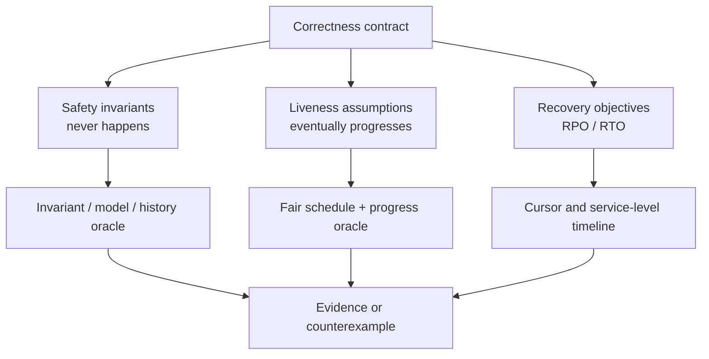
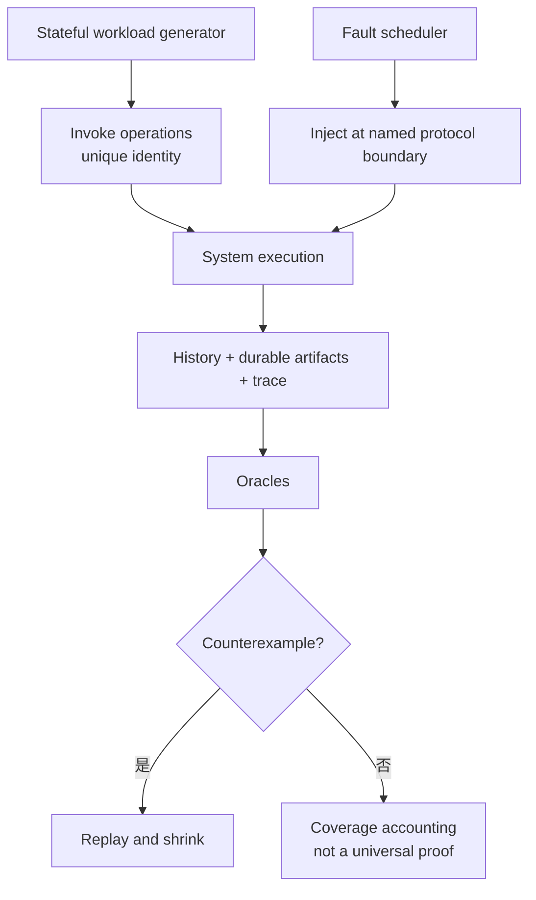
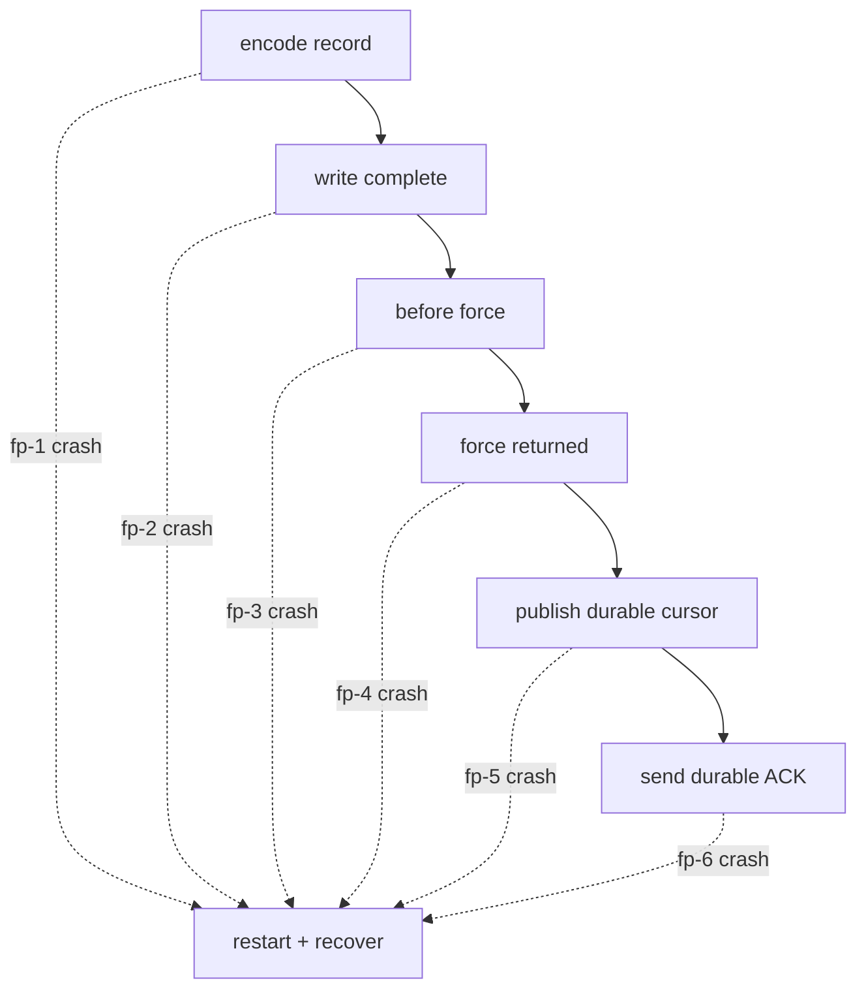
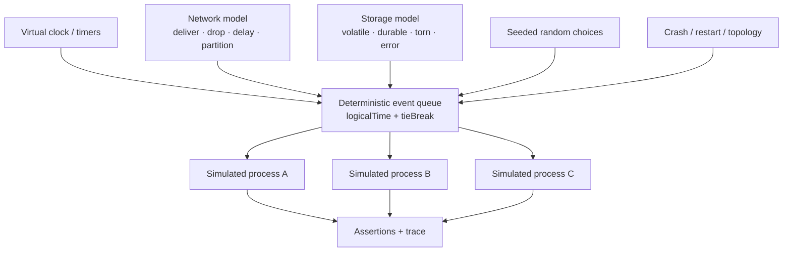
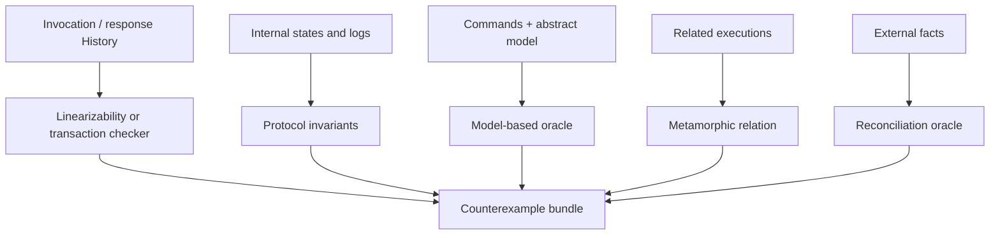
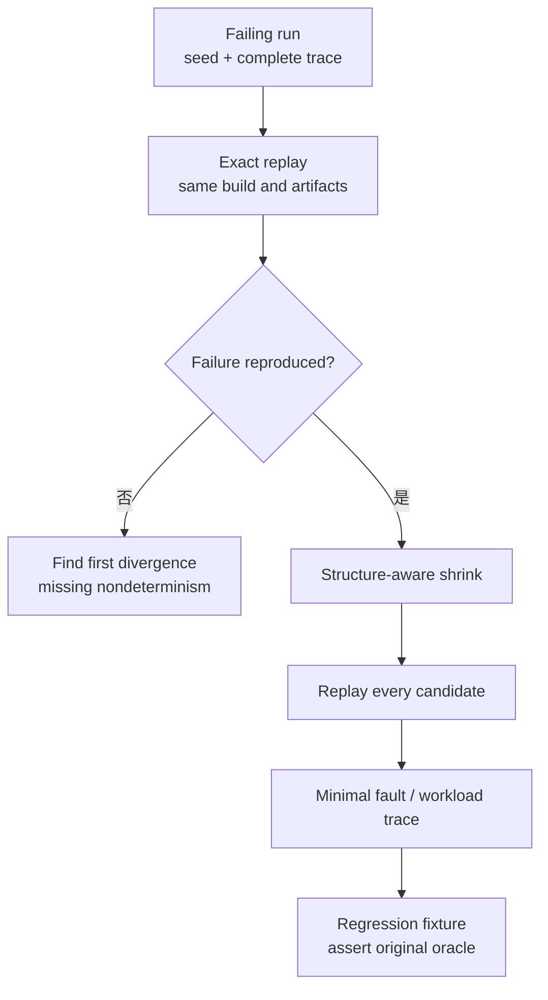
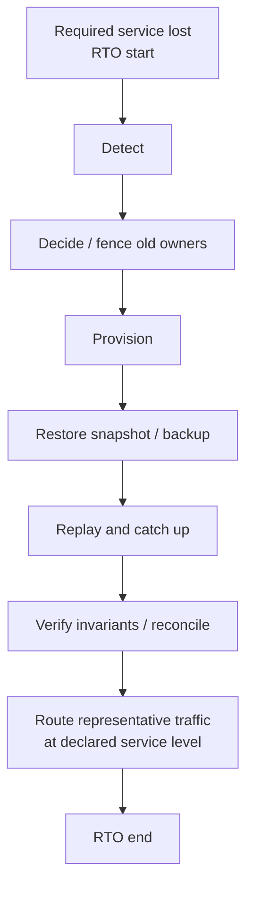

“我们做过 Chaos Test，随机杀了几百次节点，数据没坏。”

这句话只能证明几百次实验没有触发测试能够识别的错误。它没有说明故障落在协议的哪个边界、负载是否真的产生竞争、超时被记成失败还是结果未知、恢复后检查了什么，也没有说明相同失败能否重放。

恢复协议的可靠性不能由故障数量证明，而要由一条完整证据链建立：**先把安全性、活性和恢复目标写成可证伪主张；再生成会触及这些主张的 workload 与 fault schedule；用可重放的执行器产生 History 和持久状态；最后由与主张同层次的 oracle 判断结果。**

本文是“有状态系统可靠性”专题的 capstone。前面的 [WAL](/signal-grid-blog/posts/write-ahead-log-durability-and-crash-recovery/) 给出了本地 crash boundary，[Raft](/signal-grid-blog/posts/raft-consensus-leader-election-log-replication-and-safety/) 给出了提交前缀，[一致性模型](/signal-grid-blog/posts/consistency-models-linearizability-serializability-and-real-time-order/) 定义了合法 History，[分布式快照](/signal-grid-blog/posts/distributed-snapshots-consistent-checkpoints-barriers-recovery-cursors/) 约束状态与恢复游标，[备份与灾难恢复](/signal-grid-blog/posts/backup-pitr-disaster-recovery-and-restore-drills/) 定义 RPO/RTO，[滚动升级](/signal-grid-blog/posts/stateful-system-rolling-upgrades-protocol-snapshot-migration-safe-rollback/) 又引入 mixed-version History。本章把这些协议边界变成可执行、可重放、可审计的验证方法。

本文讨论非拜占庭的崩溃恢复、网络分区、存储失败与版本切换。确定性模拟、Jepsen、property-based testing 和硬件故障实验是互补工具；任何一个工具单独“跑绿”都不是对全部实现状态的数学证明。

## 先写待证明的主张，再决定注入什么故障

恢复测试最常见的错误是先列工具：kill、partition、latency、disk full、clock skew，然后希望监控没有报错。正确顺序相反：先声明系统不能发生什么、在什么条件下必须最终发生什么，再为每条主张选择可观察证据。

| 主张类别        | 典型形式                                    | 反例是什么                         | 合适的 oracle                     |
| --------------- | ------------------------------------------- | ---------------------------------- | --------------------------------- |
| Safety          | 同一 log index 不能提交两条命令             | 两个已应用状态在 index 41 内容不同 | 协议不变量、committed-prefix 比较 |
| Durability      | 已返回 durable ACK 的事务必须跨约定故障存在 | 恢复状态缺少已确认事务             | ACK ledger 与恢复结果对账         |
| Atomicity       | 一个事务不能只恢复一部分                    | 借方已扣、贷方未增                 | reference model、业务不变量       |
| Linearizability | 完成操作可排入合法实时全序                  | 非重叠写后读仍返回旧值             | History Checker                   |
| Idempotency     | 同一 operation ID 至多产生一个业务效果      | 超时重试导致重复扣款               | 结果表、状态机模型、外部对账      |
| Liveness        | 故障停止且法定人数可通信后最终恢复推进      | 在公平调度下永久无 commit          | progress monitor + 明确 fairness  |
| RPO             | 恢复点满足业务允许的数据丢失界限            | 恢复游标早于允许边界               | 权威时间/位置与恢复 cursor        |
| RTO             | 在规定服务等级下按时恢复安全服务            | 进程已启动但仍不能安全接流         | 端到端恢复时间线与业务探针        |



### 不变量必须引用权威状态，而不是展示指标

`replicationLag == 0` 是观察，不是不变量。协议实现可能在所有副本位置相同时仍错误 ACK、错误应用或接受旧 Leader 写入。更有约束力的断言类似：

```text
forall replica a, b, index i:
  applied(a, i) and applied(b, i) => command(a, i) == command(b, i)

clientObservedDurableAck(op) =>
  committedEffect(op) persists after every failure in the declared durability model

idempotencyContract(opId) =>
  effectCount(opId) <= 1 across every accepted retry path

activeWriter(resource, epoch=e) =>
  no writer with epoch < e can mutate(resource)

sameRecoveryCut(
  snapshot.state,
  snapshot.dedupeState,
  snapshot.outboxState,
  snapshot.inputCursor)
```

这些断言仍有作用域。第一条要求比较的是同一个 cluster incarnation 与同一个 log index；第二条只证明已确认事实在声明的故障模型中不丢，不能单独推出重试无重复；第三条还要求 API 提供稳定 operation ID、持久去重与足够长的保留合同。fencing 断言依赖外部资源真的检查 token；一致切面也不能由几个相同 generation 标签替代内容与游标的一致性。Durability 与 idempotency 两份合同同时成立时，才能进一步讨论同一业务意图的 exactly-one effect。

### Safety、liveness 与性能必须分别判定

一个永远拒绝请求的系统很容易保持安全，却没有活性；一个在分区时两边都继续写的系统很“可用”，却可能破坏单一历史；一个恢复正确但耗时两小时的系统又可能违反 RTO。

因此测试结果不能只返回 `PASS/FAIL`。至少要分开报告：

```text
safety: pass | counterexample | inconclusive
liveness: pass-under-assumptions | stalled | not-evaluated
recovery-point: measured cursor/time and target
recovery-time: distribution and service-level endpoint
```

`inconclusive` 很重要。History 太大导致 Checker 超时、观察丢失或模型无法表达某类事务时，不能把“没有判出失败”涂成绿色通过。

## Workload 与 fault schedule 要共同生成危险 History

故障本身不会自动产生反例。若测试期间只有串行读取，即使网络被切成十段，也很难验证 CAS、事务冲突或重复请求。Workload 必须主动制造协议最难处理的交错。

### 状态化生成器要知道自己刚做了什么

一个有效 workload generator 不是均匀随机选择 `GET`/`PUT`。它应维护抽象状态和待完成操作，使下一步能针对当前边界生成命令：

- 对刚返回成功的写立即发起非重叠读，建立 real-time precedence；
- 对同一个 expected version 并发发多个 CAS，制造竞争；
- 在 cancel、commit、snapshot 或 membership change pending 时注入故障；
- 对已超时的 operation ID 重试，而不是创建另一个业务请求；
- 让少量 hot key 承受高竞争，同时保留多 Key 事务；
- 混合长短 value、空集合、最大数值、重复 ID 和 schema 边界；
- 在恢复追赶中继续产生受控前台流量，覆盖 replay/live handoff。

每个逻辑请求至少记录：

```text
runId, clientId, sessionId,
operationId, attemptId,
invokeEvent, responseEvent,
input, observedOutput,
ackClass, protocolVersion
```

`operationId` 识别业务上的同一次请求，`attemptId` 识别网络重试。缺少这个区分，就无法判断两条相同扣款是系统重复执行，还是测试自己生成了两笔合法业务。

### Fault schedule 是有因果位置的事件序列

“第 30 秒杀 Leader”依赖机器速度，通常无法重放。更好的 schedule 引用协议事件：

```text
after  node2.persist(logIndex=41)
before node2.send(AppendEntriesAck(index=41))
crash  node2(powerLossModel)

after  leader.commit(index=45)
before client.receive(response, operationId=op-9)
drop   response(op-9)

when   follower.snapshotInstall(offset=8MiB)
corrupt nextStorageWrite(mode=torn-tail)
```



故障计划要包含 targeted 与 generative 两部分。Targeted schedule 穷举持久化、ACK、角色转换等已知危险窗口；generative schedule 用带权随机组合发现设计者没预料到的交互。只做随机会很少命中一条纳秒级边界，只做手写又会被设计者自己的心智模型限制。

### 分布要能证明自己覆盖了什么

随机数不会自动带来多样性。测试报告应给出生成分布：并发度、key 热度、事务大小、未完成操作数、重试率、故障类型、故障持续时间、拓扑、版本组合、snapshot/log 距离。若 99.9% 请求是无竞争读取，“跑了一亿次”仍可能不如一百次精心构造的 CAS 竞争有价值。

## Failpoint 要模拟协议边界，而不是随便抛异常

Failpoint 是代码中一个稳定、命名、可寻址的故障位置。它最有价值的用途，是把“崩溃发生在动作 A 与动作 B 之间”变成可穷举的实验。

以 WAL 提交为例：



在每个位置崩溃后，允许结果并不相同：

| 崩溃位置                      | 允许的恢复结果                                               | 不允许的结果                              |
| ----------------------------- | ------------------------------------------------------------ | ----------------------------------------- |
| force 前                      | 操作存在或不存在，取决于故障模型；客户端不能已有 durable ACK | 半条记录被当成提交                        |
| force 返回后、ACK 前          | 操作可能已经 durable，客户端结果未知                         | 若 API 承诺幂等，同 ID 重试产生第二次效果 |
| durable cursor 发布后、ACK 前 | 恢复必须与 cursor 的持久规则一致                             | cursor 越过缺口                           |
| ACK 后                        | 已承诺操作必须存在；若另有幂等合同，同 ID 重试仍至多一次     | 丢失已确认事实，或违反已声明的幂等合同    |

`force returned, ACK lost` 首先产生的是结果未知，不是无条件的 exactly-once 要求。没有稳定 operation ID 与服务端去重合同的 API，客户端重试可能合法地产生第二份效果；测试应分别报告 durability violation 与 idempotency violation，不能用前者偷偷承诺后者。

### “抛 IOException”不等于断电

不同 fault model 要改变不同层：

- **进程 crash**：进程内存丢失，内核 page cache 可能继续存在；
- **内核/断电**：未稳定 page cache 与设备易失缓存按模型丢失；
- **torn write**：最后一次写可能只保留一部分 sector/page；
- **latent I/O error**：先前 write 的错误可能到 `fsync` 才报告；
- **ENOSPC**：日志无法继续，包括恢复时写补偿记录；
- **silent corruption**：读到长度正确但 checksum 错误的字节；
- **slow/stuck I/O**：没有返回错误，却永久或长时间不完成。

若测试只在 `write()` 处抛异常，它没有覆盖“字节已经部分进入介质”“force 成功但 ACK 丢失”或“旧 write-back 错误延迟报告”。存储模拟器必须区分 volatile bytes、durable bytes、目录项和同步屏障，并按选择的文件系统/设备模型在 crash 时重建可见内容。

### Failpoint 本身也要稳定和可审计

一个可用声明应包括：

```java
failpoint.hit(
    "raft.append.persisted.before-success-response",
    Map.of("term", term, "index", index, "node", nodeId)
);
```

名称应描述协议语义，而不是源文件行号；上下文要足以选择条件，例如“只在 term 7、index 41、node 2 触发”。代码重构若删除或绕过关键 failpoint，coverage gate 应失败。FoundationDB 的 Code Probe 体现了相似思想：它不只问某行是否执行，而是记录在特定条件下的重要路径是否被模拟覆盖。

不要在 production path 为测试写另一套协议。Failpoint 应位于真实持久化、发送和状态转换边界，默认关闭时只留下可控的极小开销；模拟器与生产实现尽可能共享状态机和 codec，差异集中在时间、网络、存储和调度适配器。

## 确定性模拟要接管所有会改变顺序的输入

普通集成测试很难重放，因为线程调度、时钟、网络和存储完成顺序来自操作系统。确定性模拟的核心不是“固定一个随机 seed”这么简单，而是让所有影响可观察执行的非确定性都经过一个可记录的调度器。



### 一个最小事件循环的结构

```text
state = initialCluster(seed, topology, versions)
queue = priorityQueue(orderBy logicalTime, deterministicTieBreak)

while queue not empty and step < budget:
    event = queue.pop()
    logicalTime = event.time
    trace.record(event, stateDigestBefore)
    effects = deliver(event, state)
    assertStepInvariants(state)
    queue.addAll(schedule(effects, seededRandom))
```

为了让相同 trace 真正重放，以下输入都要虚拟化或记录：

- monotonic time、wall-clock projection、timer firing；
- message send、delivery、drop、duplicate、reorder 与 partition；
- storage write、flush、completion、corruption 与 crash image；
- process lifecycle、thread/actor scheduling 与 callback order；
- random number、UUID、负载分布与故障选择；
- DNS、配置读取、feature version 与成员信息；
- 外部服务响应，或可复现的 stub/model。

只固定 RNG，却让真实线程竞争，仍可能每次得到不同 History。FoundationDB 官方文档明确说明，其 simulator 在单线程进程内模拟整个集群，并用确定性随机源驱动随机行为与故障；当测试 workload 自行引入真实多线程时，失败就可能失去可复现性。

### 虚拟时间不能偷换真实硬件

逻辑时钟可以在几秒 CPU 内推进数小时超时，快速探索 lease、重试、选举和 GC 窗口。但它无法证明：

- 真实 SSD 是否诚实执行 flush；
- Linux 调度、JVM safepoint 或 NIC 队列会产生怎样的长尾；
- 网络设备是否以模型未包含的方式丢包；
- CPU 内存模型、native code 或数据竞争是否符合单线程模拟；
- 真实部署权限、证书、DNS 与限流配置是否正确。

因此 FoundationDB 同时使用 simulation、真实性能环境和硬件故障测试。确定性模拟擅长扩大协议状态空间和复现反例，真实集群验证模型保真度、性能与运维集成；两者不能互相替代。

### Fairness 必须写入活性模型

若调度器可以永远不投递一条关键消息，任何协议都可能“永久不推进”。但仅声明“消息最终会到”仍然不够：调度器可以公平地让每次心跳都在 election timeout 之后抵达，使集群永久选举抖动。活性实验要声明 eventual synchrony / quiet-window 前提，例如：在 GST 之后故障停止，法定人数与成员配置稳定；消息和存储完成存在上界，且该上界落在协议 timeout 预算内；没有无限进程暂停；随机数或 timeout 选择最终能打破候选者对称；客户端仍持续发起符合协议的请求。

只有在这些前提成立后，`commitIndex`、服务成功响应或 recovery phase 仍长期不前进，才是 liveness counterexample。若模型没有提供足够长的稳定窗口，结果只能记为 stall/inconclusive，不能归罪于协议活性。安全性则不需要公平：即使消息永远延迟，协议也不能提交冲突历史。

## Oracle 要分层：模型、History 与蜕变关系各证明一件事

没有 oracle 的故障注入只是在制造日志。一个成熟 harness 通常同时运行多层 oracle，由便宜的局部断言尽早截断，再由更昂贵的全局检查分析完整 History。

| Oracle 层               | 输入                        | 擅长发现                          | 不能单独证明                   |
| ----------------------- | --------------------------- | --------------------------------- | ------------------------------ |
| Step invariant          | 每次状态转换后的内部状态    | term 回退、双 Leader、cursor 越界 | 黑盒 API 的实时语义            |
| Reference model         | 命令与抽象状态              | 业务守恒、去重、合法状态机转换    | 实现内部持久化是否正确         |
| Committed-prefix oracle | 各副本 log/snapshot/state   | 同 index 分叉、应用越过提交       | 客户端看到的调用区间           |
| History Checker         | invocation/response History | linearizability、事务异常         | 没被 workload 观察到的内部错误 |
| Metamorphic oracle      | 两次相关执行或输入变换      | 没有简单精确答案的关系错误        | 关系之外的所有正确性           |
| Differential/shadow     | 两个实现消费同一 trace      | 版本语义漂移                      | 两个实现共同拥有的 bug         |
| External reconciliation | 场外权威结果与本地 ledger   | 副作用重复、遗漏、fencing 失败    | 内部未外显的分叉               |



### Linearizability Checker 的输入边界

Herlihy 与 Wing 的线性一致定义要求每个完成操作能安放在 invocation 与 response 之间的某个点，并保留非重叠操作的现实先序。一个 register Checker 需要：

```text
invoke p1 write(x, 1) op=w1
ok     p1 write(x, 1) op=w1
invoke p2 read(x)     op=r1
ok     p2 read(x)->0  op=r1
```

上例无法线性化，因为写已返回，读才开始，却读到旧值。若两次调用重叠，读到 0 可能合法。

History 中必须区分：

- `ok`：系统明确承诺成功；
- `fail`：系统明确承诺没有生效；
- `info/unknown`：客户端无法判断结果。

把 timeout 全部记成 `fail` 会删除可能已经提交的操作，制造错误模型；把它们全部当成功又会掩盖丢失。Checker 应按模型允许 completion：某些 pending/unknown 操作可能生效，另一些可能不存在。

Porcupine 接收一个可执行顺序规范与并发 History，并利用 P-compositionality 缩小检查空间。Jepsen/Knossos 同样以模型检查历史。它们能找到一份具体 History 的反例，却不能从一次 `valid` 推出所有未来 History 合法；模型错、采集漏事件、driver 自动重试或检查超时都可能让结论失真。

History 的实时先序本身也必须可信。harness 应记录每个 client 的单调程序顺序，以及由同一观察者明确看到的 invocation/response；只有能够证明某个 response 已发生、另一个 invocation 才开始时，才加入 real-time edge。跨主机 wall clock 即使经过 NTP 也只能作诊断，不能凭时间戳大小制造线性一致的先序；弱内存架构上的记录器还要用可靠的 atomic/同步边界发布事件。采集丢事件、缓冲溢出、重试被错误折叠或顺序无法判定时，Checker 结果应是 inconclusive，而不是把残缺 History 判成 valid。

### 事务不能套单 Key register 模型

多对象事务要检查事务原子性、版本依赖和隔离级别。Elle 通过精心设计的 list-append workload，从客户端可见值推断 `wr`、`ww`、`rw` 依赖，再寻找 Adya 异常；论文也明确其边界，例如谓词读取不在完整覆盖范围内。

因此，“用了线性一致 Checker”不能证明数据库事务严格可串行化。必须让 workload 的数据类型暴露所需依赖，并选择对应 Checker；若业务不变量涉及余额总额、唯一约束或订单生命周期，还要运行领域 reference model。

### Property-based 与 model-based testing 的分工

Property-based testing 用生成器产生大量输入，并持续检查性质；model-based testing 进一步维护一个比实现简单的抽象状态机，根据已知命令预测允许结果。二者的质量取决于生成分布和性质，不是随机库的名字。

一个去重状态机模型可以写成：

```text
if operationId not seen:
    apply business transition
    seen[operationId] = result
else:
    return seen[operationId] without reapplying
```

随后生成首次调用、ACK 丢失、相同 ID 重试、不同 payload 复用 ID、Leader 切换和 snapshot restore，检查实现与模型允许集合是否一致。模型必须表达 `outcome_unknown`，否则会对合法的未确认操作给出假阳性。

### 没有精确答案时使用 metamorphic relation

某些大状态无法逐项构造期望输出，但可以定义相关执行之间必须成立的关系：

```text
restore(snapshot@K) + replay(K+1..N) == fullReplay(1..N)

replay(initialState, committedPrefix) on repeated fresh runs == sameLogicalState

addCrashBeforeNonDurableAck does not remove earlier durable ACKs

permuteDeliveryOfIndependentCommands preserves allowed final projection
```

这类关系比“最终文件 hash 相同”更接近语义。它也不是万能 oracle：关系写错、规范化遗漏字段或两个路径共享同一个 bug 时仍会漏错。

## Seed 只是入口，完整 trace 才是可重放证据

很多系统保存一个 `seed=42` 就宣称可复现。只要生成算法、二进制、并发调度或依赖版本变化，同一个 seed 就可能产生另一条执行。可重放 bundle 至少应包含：

```text
source/build/dependency digest
schema + feature + configuration digest
topology and initial durable image
workload seed and every generated operation
scheduler choices and logical timestamps
network/storage/failpoint decisions
process incarnation and membership changes
client invoke/response History
durable artifact checksums
oracle version and result
```

### Trace replay 要验证每一步没有漂移

重放器不能在缺少事件时“继续尝试”。它应在每个关键 step 比较 state digest、queue head、durable cursor 与已消费 choice；第一个漂移点立即失败。否则最终也许再次出错，却不是同一个反例。



### Shrink 不能破坏因果前提

直接删除随机事件可能得到一个无法执行的 trace：删除了 Leader 当选，却保留“Leader ACK 后崩溃”；删除了 snapshot begin，却保留尾部分片。Shrinker 应理解结构：

- 先减少无关客户端、Key 和命令；
- 缩短故障持续时间与消息延迟；
- 删除不在反例因果锥中的节点事件；
- 保留 invocation/response 配对与 operation identity；
- 保留 failpoint 前置事件和持久化依赖；
- 每次候选都重放同一个 oracle，确认仍是同类失败。

最小反例不是越短越好，而是足以解释 bug 的最小合法 History。失败类型也要稳定：不能把“线性一致性反例”缩成“测试进程 OOM”。

### State hash 必须绑定位置、版本与规范化规则

比较副本状态时，摘要记录应类似：

```text
StateDigest(
  clusterIncarnation,
  committedPosition,
  appliedPosition,
  snapshotVersion,
  activeFeatureSet,
  canonicalStateHash,
  dedupeHash,
  timerHash,
  outboxHash
)
```

只有对应的 committed prefix 相同、且 `appliedPosition` 也相同时，才直接比较状态机的 canonical hash；应用尚未追到同一位置的副本 hash 不同并非分叉。规范化序列化必须固定字段、集合和数值表示。摘要相同是强证据而非绝对数学等价：hash 存在碰撞，且遗漏字段会制造假一致；关键反例应保留可逐项 diff 的逻辑状态。

Committed-prefix oracle 也不能只比 `lastIndex`。同一 index 必须比较 term/epoch、command identity 与内容；snapshot 覆盖的前缀还要用 `lastIncludedPosition` 和 state digest 衔接。否则两个不同历史恰好长度相同，会被错误判成一致。

## RPO、RTO 与 liveness 要从恢复完成的业务边界测量

NIST SP 800-34 把 RPO 定义为灾难后数据需要恢复到的历史时间点；RTO 是系统组件可以处于 recovery phase 的目标时长，并且必须小于业务可容忍的最大中断时间 MTD。工程验证应把这些目标转换成系统自己的权威位置和服务等级，而不是只记录“Pod Ready”。

### RPO 的证据是恢复游标与 ACK 合同

若 API 返回 `LOCALLY_DURABLE`，它只承诺约定的本地崩溃/断电模型，不承诺节点或介质永久丢失；若返回 `QUORUM_COMMITTED`，它承诺复制协议定义的提交前缀；异步灾备可能仍允许一个非零 DR RPO。测试必须先区分 ACK class，再计算恢复结果是否越过该类承诺。

一次演练可以记录：

```text
lastPrimaryCommittedPosition = 9_840_120
lastRemoteArchivedPosition   = 9_838_900
restoredPosition             = 9_838_900
firstMissingBusinessEventAt  = 14:31:22.180+08:00
declaredDrRpo                = 5 minutes
```

但对已经公开承诺“跨该灾难仍 durable”的 ACK，恢复后缺失一条就是 durability violation，不能用“整体 RPO 仍小于 5 分钟”掩盖。对客户端超时且结果未知的操作，则允许存在或不存在，但去重与查询协议必须给出合法结果。

多组件系统还要比较共同 restore point：数据库恢复到 `LSN D`、Kafka consumer offset、对象存储 manifest 和搜索索引 cursor 必须能解释为同一业务切面。取每个组件“最新可用点”可能拼出从未存在过的世界。

### RTO 终点是安全接流，不是进程启动



如果服务只启动了 HTTP 端口，却仍在 replay、没有 fenced 旧主、读不到 required version 或拒绝全部写，RTO 尚未结束。终点应包含：

- 恢复到允许的 RPO；
- 安全不变量通过；
- 旧 owner 被 fence；
- 必要外部依赖与密钥可用；
- 代表性读写在声明的延迟/错误率下成功；
- 结果未知与外部副作用有明确 residual set。

RTO 要报告分布，不只报告最好一次。故障检测、人工授权、对象存储下载、日志重放、索引重建、DNS/流量切换都应分段计时；测试数据量、增量日志长度和恢复时前台负载必须接近目标场景。

### Liveness 是在公平前提下的进展证据

模拟器可在故障停止后检查：

```text
eventually leader exists
eventually commitPosition advances
eventually every attempt reaches success, reject, or outcome_unknown within its deadline
eventually each stable operationId resolves to committed or not-committed
  when query/retry authority and external decision paths are eventually available
eventually restore reaches target cursor
```

第一条 operation 相关断言是 attempt 层的响应合同，`unknown` 可以是合法结果；第二条才是业务 operation 层的收敛合同，需要 stable ID、权威查询/重试以及外部决议路径最终可用。一个永远只返回 `unknown` 的系统不能借第一条冒充业务活性；如果公开协议允许永久 unknown，就必须诚实地承认它没有提供第二条进展保证。

“eventually” 仍要有测试预算。可以定义 `N` 个逻辑事件或目标时长内必须推进，否则输出 stall trace；但超出预算只证明在该预算下未推进，除非模型有严格上界，不能直接宣称协议永久死锁。相反，只看吞吐恢复而不跑 safety oracle，也可能是在 split brain 下“两边都很快”。

## Coverage 说明搜索到了哪里，不能把有限实验变成全称证明

代码行覆盖率不足以表达分布式状态空间。更有意义的 coverage 维度包括：

- protocol state/transition：角色、term、commit、snapshot、restore phase；
- failpoint：每个持久化、发送、ACK、membership 与 activation 边界；
- fault combination：单故障、相关双故障、故障恢复交错；
- history shape：并发度、pending 数、non-overlap edge、事务依赖类型；
- data shape：空/满/边界值、热 Key、长日志、旧 snapshot、schema 版本；
- topology/version：法定人数、故障域、old/new role permutation；
- oracle：每条不变量被触发检查的次数，以及 Checker 的 valid/invalid/inconclusive；
- recovery objective：不同数据量和增量长度下的 RPO/RTO 分布。

FoundationDB 的 Code Probe 就是一个有界例子：它允许声明“某个有意义条件应在 simulation 中被命中”，并由 Test Harness 汇总未覆盖 probe。它比普通行覆盖更接近协议语义，但“所有 probe 命中”仍不证明 probe 列表完整，也不证明模型与真实硬件完全一致。

### 用证据矩阵决定能否接纳恢复协议

下面是 capstone 的 admission matrix。它不是泛化上线清单；每一行都对应本文前面定义的 proof obligation。

| 主张                | 必需证据                                                           | 失败判据                                                | 仍未覆盖的边界                    |
| ------------------- | ------------------------------------------------------------------ | ------------------------------------------------------- | --------------------------------- |
| 持久 ACK 与幂等重试 | 穷举 WAL/replication ACK failpoint + 冷恢复；声明幂等时重试同 opId | 任一已承诺操作缺失；若声明幂等，`effectCount(opId) > 1` | 设备谎报 flush 需硬件断电测试     |
| 单一提交历史        | 角色/分区/重启生成 + committed-prefix oracle                       | 同 index/term 映射不同内容或 apply 越界                 | Byzantine corruption 不在模型内   |
| API 一致性          | 完整 invocation/response History + 对应 Checker                    | 产生模型禁止的 History                                  | 未被 workload 观察的对象          |
| Snapshot 可替代前缀 | full replay 与 snapshot+replay metamorphic test                    | 状态、cursor、dedupe/outbox 不一致                      | 未采样的超大状态形状              |
| 故障后能推进        | 故障停止、法定人数互通的公平 trace                                 | 在预算内无进展并可重复                                  | 预算外只能报告 inconclusive/stall |
| 升级后恢复一致      | old/new role matrix、shadow replay、activation failpoint           | 同一边界产生不同状态或旧节点接管新语义                  | 未支持的版本跳跃                  |
| DR 满足 RPO/RTO     | 真实数据规模的隔离恢复演练                                         | restore cursor 或安全接流时间越界                       | 未演练供应商/区域级相关故障       |
| 外部副作用可对账    | ACK 丢失、publisher crash、fencing 与 residual set                 | 重复不可识别、旧主仍写、差集不可解释                    | 不支持幂等的第三方人工流程        |

### 哪些结论永远不能由一次测试推出

即使全部矩阵通过，也不能诚实宣称：

- 所有可能调度都已经探索；
- 模拟存储等价于每一种真实文件系统与设备固件；
- reference model 本身没有错误；
- 没有观察到的内部状态一定正确；
- 未来编译器、依赖、配置与硬件仍产生相同执行；
- Byzantine、恶意输入和安全攻击已被 crash-fault 测试覆盖；
- RTO 在任何数据规模和相关故障下都成立。

形式化规范可以对抽象模型做更广的状态探索或证明，却仍要验证实现 refinement；确定性模拟直接运行更多生产代码，却只搜索有限 trace；History Checker 从黑盒观察寻找反例，却受 workload 与可见信息限制；真实故障演练最接近部署，却慢、贵且难穷举。可靠性来自这些证据彼此交叉，而不是给某个工具冠以“证明器”名称。

这套方法最终把“Chaos 跑过了”改写成可审计结论：在固定 build、schema、拓扑、故障模型和 trace budget 下，哪些不变量逐步成立，哪些 History 被 Checker 接受，哪些恢复游标满足 RPO，系统在什么服务等级下达到 RTO，以及哪些状态空间仍未覆盖。

它能强有力地发现反例、固定崩溃边界并把事故变成永久回归样本；它不能把有限实验变成无限状态空间的全称证明。最可信的恢复协议不是那个从未出现红灯的协议，而是那个每个绿色结论都有精确 oracle、每个红色反例都能完整重放、每个未知区域都被明确标出来的协议。

## 原始论文与官方资料

- Maurice Herlihy、Jeannette Wing：[Linearizability: A Correctness Condition for Concurrent Objects](https://www.cs.cmu.edu/~wing/publications/HerlihyWing90.pdf)
- Leslie Lamport：[Time, Clocks, and the Ordering of Events in a Distributed System](https://lamport.azurewebsites.net/pubs/time-clocks.pdf)
- FoundationDB SIGMOD 2021：[FoundationDB: A Distributed Unbundled Transactional Key Value Store](https://www.foundationdb.org/files/fdb-paper.pdf)
- FoundationDB Documentation：[Simulation and Testing](https://apple.github.io/foundationdb/testing.html)
- FoundationDB Documentation：[Client Testing、determinism 与 simulation workload](https://apple.github.io/foundationdb/client-testing.html)
- FoundationDB Documentation：[Internal Dev Tools、Code Probes 与 Test Harness](https://apple.github.io/foundationdb/internal-dev-tools.html)
- Jepsen：[Framework source and documentation](https://github.com/jepsen-io/jepsen)
- Jepsen：[Checker API](https://jepsen-io.github.io/jepsen/jepsen.checker.html)
- Anish Athalye：[Porcupine linearizability checker](https://github.com/anishathalye/porcupine)
- Horn、Kroening：[Faster linearizability checking via P-compositionality](https://arxiv.org/abs/1504.00204)
- Kyle Kingsbury、Peter Alvaro：[Elle: Inferring Isolation Anomalies from Experimental Observations](https://www.vldb.org/pvldb/vol14/p268-alvaro.pdf)
- Koen Claessen、John Hughes：[QuickCheck: A Lightweight Tool for Random Testing of Haskell Programs](https://dl.acm.org/doi/10.1145/351240.351266)
- Chan、Chen、Cheung、Lau、Yiu：[Application of Metamorphic Testing in Numerical Analysis](https://researchportal.hkust.edu.hk/en/publications/application-of-metamorphic-testing-in-numerical-analysis/)
- TigerBeetle：[Software Reliability and VOPR](https://docs.tigerbeetle.com/single-page/#software-reliability)
- TigerBeetle：[TigerStyle — simulation finds bugs, assertions define understanding](https://github.com/tigerbeetle/tigerbeetle/blob/main/docs/TIGER_STYLE.md)
- NIST SP 800-34 Rev. 1：[Contingency Planning Guide for Federal Information Systems](https://csrc.nist.gov/pubs/sp/800/34/r1/upd1/final)
