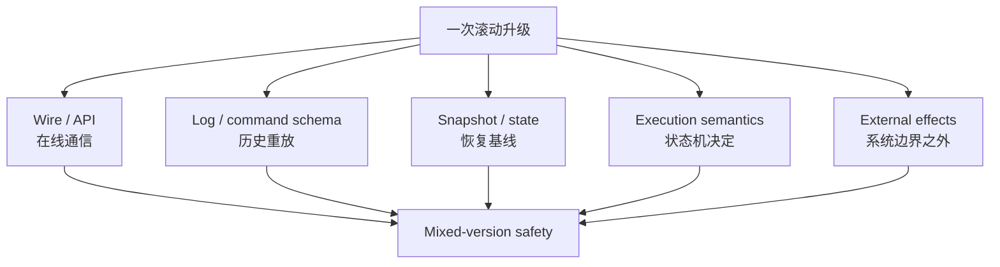
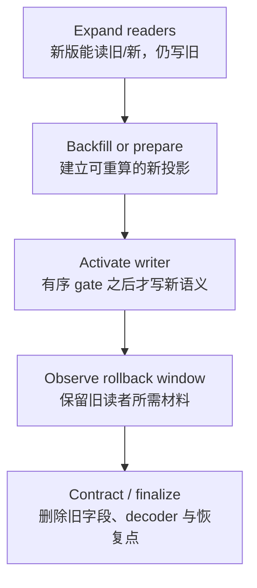
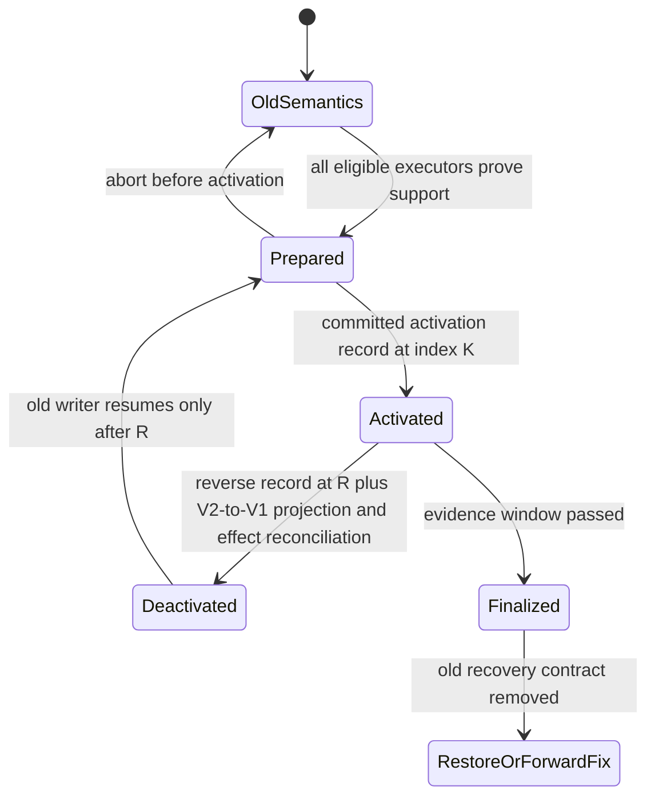
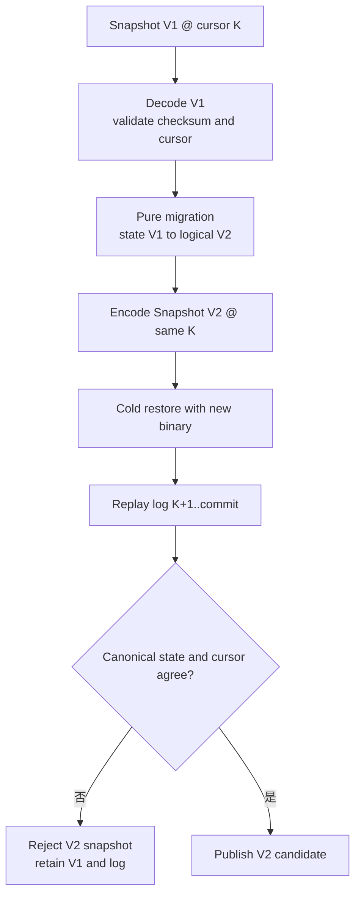
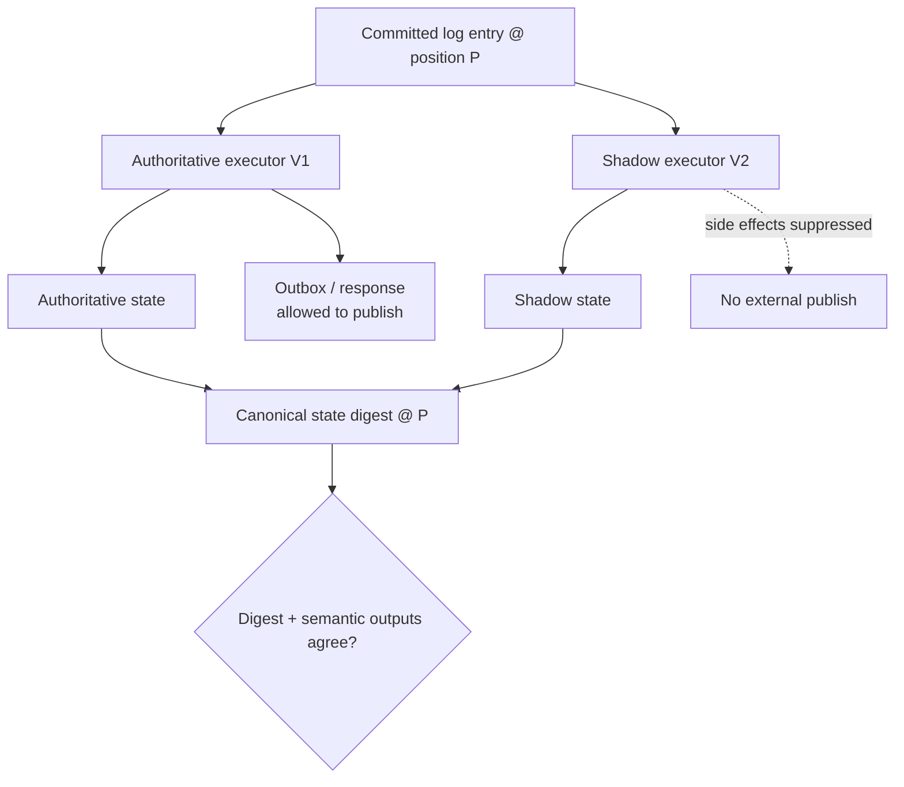
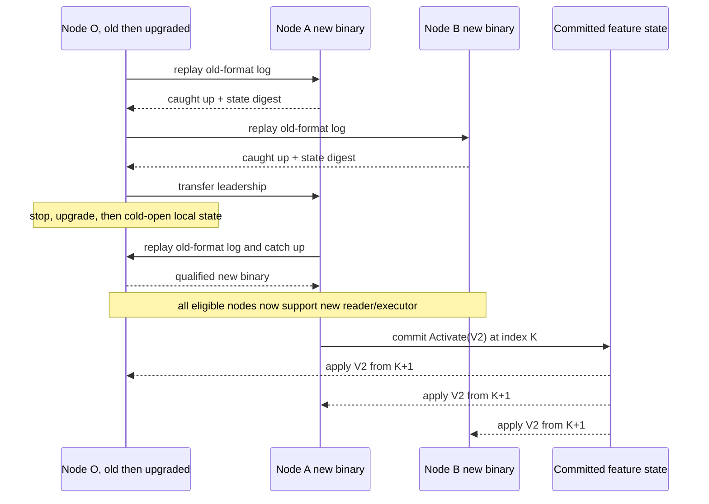
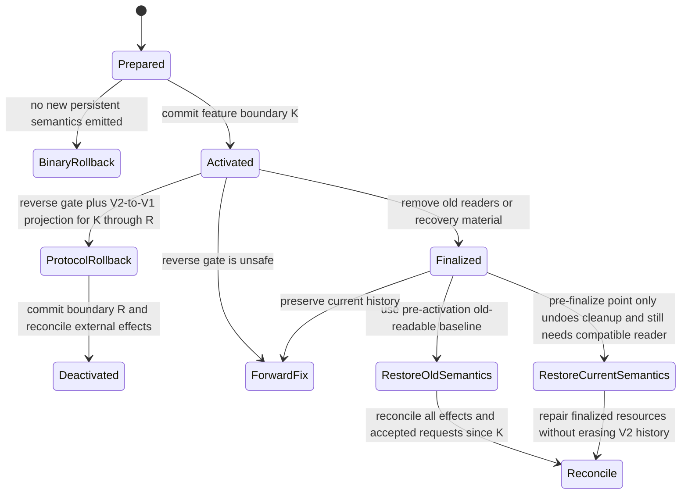

无状态服务的滚动升级通常可以简化为：启动新实例，通过健康检查后切流，再停止旧实例。有状态系统不能只看“新进程活着”。升级期间，旧节点可能继续当 Leader，新节点可能从旧快照恢复，任一版本都可能重放跨越数年的日志；客户端、复制协议和外部消费者也不会在同一瞬间切换。

真正的问题不是“二进制能否混跑”，而是：**在旧版与新版同时存活、任一合法故障转移仍可能发生时，所有节点是否会对同一条命令作出相同决定，并且每个已经持久化的字节仍有合格的读者。**

本文把滚动升级视为一个受共识约束的状态迁移。核心方法是先扩展读取与执行能力，继续写旧格式；等所有可能接管权威角色的节点都证明兼容后，再通过有序日志激活新语义；最后才回收旧格式、旧快照和降级路径。`prepare → activate → finalize` 中，前两步仍应保留可逆条件，`finalize` 则必须被当成明确的不可逆边界。

阅读本文前，建议先理解 [一致性模型](/signal-grid-blog/posts/consistency-models-linearizability-serializability-and-real-time-order/) 中的合法 History、[Raft](/signal-grid-blog/posts/raft-consensus-leader-election-log-replication-and-safety/) 的提交前缀与成员变更、[WAL](/signal-grid-blog/posts/write-ahead-log-durability-and-crash-recovery/) 的持久前沿，以及 [分布式快照](/signal-grid-blog/posts/distributed-snapshots-consistent-checkpoints-barriers-recovery-cursors/) 的状态—游标一致性。升级前的可恢复基线与灾难回退由 [备份、PITR 与恢复演练](/signal-grid-blog/posts/backup-pitr-disaster-recovery-and-restore-drills/) 负责，不能用在线副本代替。

本文讨论非拜占庭、崩溃恢复模型下的复制状态机、协调服务与分布式日志。产品是否正式支持某两个版本混跑，必须以该产品对应版本的升级文档为准；通用方法不能覆盖一个产品明确禁止的路径。

## 滚动升级改变的是一组可接受历史，而不只是一批进程

一次升级会同时触碰多个版本域。它们常被压缩成一个 `version=2`，但故障边界并不相同。

| 版本域               | 谁读取或执行                 | 不兼容时发生什么           | 必须保留到何时               |
| -------------------- | ---------------------------- | -------------------------- | ---------------------------- |
| 客户端 API           | SDK、网关、批处理任务        | 新字段被误解、重试语义改变 | 所有受支持客户端退出         |
| 节点间 wire protocol | Leader、Follower、Controller | 握手失败、消息被错解       | 最后一个旧节点退出           |
| 命令/事件 schema     | 状态机与日志重放器           | 同一日志产生不同状态       | 对应日志被安全截断           |
| 持久日志格式         | WAL、Archive、元数据日志     | 重启后无法扫描合法前缀     | 最旧恢复基线越过该格式       |
| snapshot/checkpoint  | 恢复器、备份、灾备节点       | 无法启动或恢复到错误游标   | 旧恢复点过期且已演练新格式   |
| 状态机语义           | 所有可能执行命令的成员       | 相同输入得到不同输出       | 新语义被有序激活之后仍需审计 |
| 控制面与配置         | 运维工具、自动化、节点       | 新旧节点得到不同策略       | 所有控制面读者完成迁移       |
| 外部副作用协议       | Outbox、支付、消息消费者     | 重复、遗漏或旧主越权       | 外部幂等与 fencing 代际闭环  |



“两版可以互相建连”最多证明 wire decoder 没有立刻报错。它没有证明旧状态机理解新命令、旧恢复器能读新快照，也没有证明一次 Leader 切换后不会让已确认结果倒退。

对版本 `i` 与历史产物 `j`，兼容至少要拆成三类谓词：

```text
parse_i(bytes_j)              // 字节能否被完整、无歧义地解析
interpret_i(record_j)         // 解析结果是否有相同业务含义
execute_i(state, command_j)   // 是否产生协议允许的状态和输出
```

`parse=true` 而 `interpret=false` 是最危险的情况：系统看起来运行正常，却在后台生成不同状态。一次安全升级必须保证，在 feature 尚未激活时，所有可能执行同一提交前缀的版本都满足同一状态转换规范；激活之后，任何不支持新规范的节点都不得再成为权威执行者。

### Mixed-version safety 要覆盖故障后的角色重排

只验证拓扑 `old Leader + new Followers` 不够。滚动期间还可能出现：

- 新 Follower 刚重启，旧 Leader 崩溃；
- 旧 Follower 在网络分区后重新加入并参选；
- 新节点从旧快照启动，再重放新日志；
- 运维系统误把尚未追平的节点提升为投票成员；
- 回滚一个二进制后，它读到了新版刚写出的持久记录；
- 客户端超时重试跨越了激活边界。

因此验证矩阵必须包含每一种**协议允许的角色组合**，而不是只覆盖预期的顺利顺序。若旧版本仍是投票成员，它就仍可能参与选举；除非协议能让不支持已激活 feature 的节点拒绝领导权或被安全移出配置，否则“多数节点已经升级”不是充分条件。

## 先画读写兼容矩阵，再决定 expand-contract 的切点

设旧版为 `O`，新版为 `N`；`R_x(W_y)` 表示版本 `x` 能正确读取并解释版本 `y` 写出的产物。一个常见的安全准备态是：

| Reader \ Writer | 旧格式 `W_O` | 新格式 `W_N`                               |
| --------------- | ------------ | ------------------------------------------ |
| 旧版 `R_O`      | 必须通过     | 激活前可以不通过，但任何新版都不得写新格式 |
| 新版 `R_N`      | 必须通过     | 必须通过                                   |

这个矩阵解释了为什么“先部署兼容读者，再打开新写入”比“新代码启动就写新格式”安全：在所有节点升级完成之前，系统只产生 `W_O`，旧版与新版都能消费；只有确认旧版不再可能接管后，才允许产生 `W_N`。

但字节级兼容仍不够。每个格子还要验证：

```text
semanticMeaning(readerVersion, bytes) is preserved
unknown fields survive required read-modify-write paths
default / absent / null retain the intended distinction
numeric range and enum handling do not narrow silently
re-encoding does not destroy data needed by newer readers
```

### Protobuf 的 wire-safe 不等于应用安全

Protocol Buffers 的官方指南把变更分成 binary wire-safe、wire-compatible 与 wire-unsafe。添加新字段通常是 binary wire-safe：旧解析器可以跳过未知字段；删除字段后也必须保留或 `reserved` 原 field number，不能把编号分配给新含义。修改已有 field number、把字段移进既有 `oneof` 等则是不安全变更。

即使属于 wire-safe，仍可能破坏应用：

- 旧代码对 enum 做穷尽 `switch`，遇到新值时走错误分支；
- 新字段缺失时默认 `0`，业务却无法区分“未提供”与“明确为 0”；
- 旧服务把消息转成 JSON 或手工复制已知字段，未知字段没有被保留；
- 新版用新字段改变幂等键或权限判断，旧版虽然能解析，却执行另一套语义；
- map、未知字段与不同语言实现的序列化顺序不同，不能直接把 Protobuf bytes 当规范化状态哈希。

因此 schema registry 需要保存的不只是 `.proto` diff，还应有 producer/consumer 组合测试与业务断言。兼容判断的单位是“真实读写路径”，包括代理、落盘、解码、修改、再编码和下游消费。

### Expand-contract 是四个阶段，不是一次发布



`expand` 先扩大可接受输入集合；`activate` 才改变输出集合；`contract` 最后缩小兼容面。把三者塞进一个部署，会让任何回滚同时面对“旧程序读不了新数据”和“新程序已经清理了旧材料”两种风险。

数据库列迁移也遵守同一结构。先新增 nullable 列与双读逻辑，再按稳定游标回填；切换权威读取来源前比较旧列与新列；等所有读者迁移且回滚窗口结束后，才删除旧列。这里的“dual write”只是某些存储迁移策略，不是默认正确答案：若两份写不在同一事务或同一有序日志里，崩溃会留下分叉，必须有可恢复的 repair cursor 和权威来源。

## Capability negotiation 必须落成共识状态，而不是一次握手印象

节点启动时上报 `supportedFeatures` 很有用，但它只是某个时刻的观察。连接可能断开、旧节点可能恢复、成员配置可能变化。真正控制新语义的 gate 应成为复制状态的一部分，并由所有节点按同一日志位置应用。

一种通用记录可以写成：

```text
PrepareFeature(
  feature = SNAPSHOT_V3,
  requiredReaderVersion = 2,
  requiredExecutorVersion = 2,
  membershipConfigId = 74,
  eligibleExecutors = {
    member-1/incarnation-9: buildDigest + capabilityDigest,
    member-2/incarnation-4: buildDigest + capabilityDigest,
    member-3/incarnation-7: buildDigest + capabilityDigest
  },
  evidenceDigest = sha256(compatibility-matrix-artifacts)
)

ActivateFeature(feature = SNAPSHOT_V3)
// activationIndex 取这条 Activate 记录实际提交并应用的日志位置，不能由请求 payload 声称。

FinalizeFeature(feature = SNAPSHOT_V3, minRecoverableVersion = 3)
```

三条记录承担不同责任：

1. **Prepare** 把 committed membership/config 代际、所有 eligible executor 的 incarnation、build 与 capability 证据绑定起来，但不改变写入；
2. **Activate** 在同一个复制状态机步骤重新核对当前 committed membership 完全被 qualified set 覆盖，再以该记录真实的 applied log index 作为切换位置；
3. **Finalize** 声明旧 reader、旧快照或降级路径可以回收，是不可逆操作的授权。



### 激活条件要覆盖所有可能的执行者

只要求“当前多数派支持”可能仍不安全。若一个不支持新语义的旧投票节点之后和其他节点组成合法多数，它可能当选并读取已经激活的日志。安全选择通常有两种：

- 所有仍有资格成为 Leader/执行状态机的投票成员都支持该 feature；
- 先通过正式成员变更把旧成员移出决定集合，再激活 feature。

Learner 或只读副本若未来会被提升，也必须在提升前证明兼容。节点启动时若发现 committed feature 高于自身支持上限，应 fail closed：拒绝加入、拒绝投票或停止服务，不能“尽量跳过不认识的命令”。

`PrepareFeature` 之后发生的成员变更、节点 incarnation 变化或 build/capability 变化都会使 preparation 失效。新成员加入决定集合、Learner 被提升，或旧节点以另一份二进制重启后，都必须先产生一份覆盖当前 committed membership 的新 Prepare 证据；Activate handler 不能只相信旧 digest。feature 已经激活后，新加入或被提升的节点则必须先证明支持当前 active feature，否则不得进入 eligible executor 集合。

### Kafka 的 metadata.version 展示了“部署”和“最终化”分离

Apache Kafka 的 KRaft 升级流程把 server binary 与 feature level 分开。Kafka 4.3 文档中的 4.2 升级步骤先要求逐台升级 broker，验证行为与性能后，再通过 `kafka-features.sh ... upgrade --release-version 4.2` 最终化对应版本。文档还明确：能否降低 metadata version 取决于跨越的版本是否包含 metadata changes，不能把“这次可以 downgrade”推广为任意版本都可逆。

```bash
bin/kafka-features.sh --bootstrap-controller controller1:9093 describe

# 只有产品升级文档允许、且所有相关节点均支持后，才执行最终化。
bin/kafka-features.sh --bootstrap-server broker1:9092 \
  upgrade --release-version 4.2
```

这个例子最值得借鉴的不是命令本身，而是语义分层：新二进制先以旧的已最终化 feature level 运行；确认混跑安全后，才让控制面产生新元数据语义。不同 Kafka 版本的可降级范围不同，必须读取目标版本的 upgrade guide 与 feature 输出，不能照搬这里的版本号。

## 日志与快照要独立演进，并始终带着恢复游标

日志描述从状态 `S_k` 到 `S_{k+1}` 的变化，快照描述某个已提交位置 `k` 上的物化状态。二者生命周期不同：一条旧日志可能保留很久，一个新快照也可能在发布后立即成为重启入口。把命令 schema、领域对象和 snapshot DTO 共用一个 Java 类，会让一次字段重构同时破坏在线协议与离线恢复。

更稳健的边界是：

```text
wire command codec     独立版本
replicated command     稳定、可长期重放的语义
domain model           只服务当前实现
snapshot codec         独立版本 + state cursor
external API DTO       独立版本
```

### 不重写已提交历史，让 reader 承担演进

提交日志是权威历史。为了升级而原地改写旧 record 会破坏 checksum、复制位置、审计身份与备份连续性。更常见的方案是保留多版本 decoder：

```java
State apply(LogRecord record, State state) {
    return switch (record.schemaVersion()) {
        case 1 -> applyV1(decodeV1(record.payload()), state);
        case 2 -> applyV2(decodeV2(record.payload()), state);
        default -> throw new UnsupportedLogVersion(record.schemaVersion());
    };
}
```

`applyV1` 不能随业务代码“顺手重构”而改变历史含义。若旧 bug 已经形成提交历史，回放器通常要复现当时的确定性结果，再用一条新的修复命令迁移状态；否则同一日志在新节点上会得到另一份状态。

### 快照迁移是带 cursor 的纯状态变换

一个可审计的快照 header 至少应包含：

```text
clusterId
snapshotSchemaVersion
stateMachineVersion
lastIncludedTerm / epoch
lastIncludedLogPosition
featureSet
producerBuildDigest
payloadLength + checksum
```

迁移器接收完整旧快照，输出新快照，并保持“状态与恢复位置”不变量：

```text
decodeV1(snapshot@K) -> logicalState
migrate_1_to_2(logicalState) -> logicalStateV2
encodeV2(logicalStateV2, cursor=K) -> snapshotV2@K
```

它不能把“生成文件的当前时间”当成业务时间，也不能在迁移中查询会变化的外部数据库。若迁移需要参考数据，参考版本必须作为输入并进入证据摘要。新快照只有在完整写入、校验、持久发布并成功试恢复后，才有资格替代旧基线；旧快照与覆盖它之后的日志必须保留到 rollback window 结束。



Snapshot manifest 还必须携带 `minReaderVersion` 与 `featureSet`。激活前，V2 只能是 shadow/candidate，不能把旧恢复器共同读取的 `current` 指针提前改到 V2；恢复器应按自身 capability 选择仍受支持的 V1 或 V2，遇到未知格式必须 fail closed。只有 committed gate 已证明所有可能恢复/接管的 reader 合格后，系统才能有序切换默认 snapshot pointer；删除 V1 与覆盖日志仍属于更晚的 Finalize。

这与 [分布式快照](/signal-grid-blog/posts/distributed-snapshots-consistent-checkpoints-barriers-recovery-cursors/) 的核心不变量相同：快照内容、日志游标、去重表、租约/epoch 和外部投影 cursor 必须描述同一个一致切面。只有业务对象，没有 replay position 的“新格式快照”无法证明从哪里继续。

Aeron Cluster 的公开接口可以记录 application version，并用 `AppVersionValidator` 检查兼容；其 snapshot mark 也携带 `appVersion`。Aeron 文档还建议让 command/event、domain model 与 snapshot model 独立版本化。这些是构建迁移协议的材料，不是“任意两个 Aeron 应用版本可自动热升级”的承诺；应用仍必须实现 decoder、确定性迁移、混跑验证与回滚边界。

## 双读、双写与影子执行只能有一个权威结果

“让新旧版本同时跑，结果一致就切换”听起来简单，首先要回答：谁能修改权威状态，谁能产生外部副作用？

| 技术             | 合理用途                           | 主要风险                   | 必须固定的权威                 |
| ---------------- | ---------------------------------- | -------------------------- | ------------------------------ |
| Dual read        | 同时读旧/新投影并比较              | 读取时点不同造成假差异     | 同一 snapshot/cursor           |
| Dual write       | expand-contract 期间维护两种表示   | 原子性缺口、失败后只写一边 | 单一事务或有序事件源           |
| Backfill         | 从权威历史补建新表示               | 与在线增量竞态             | backfill cursor + live handoff |
| Shadow execution | 新逻辑消费同一提交日志，不对外生效 | 非确定输入、比较口径错误   | 旧执行器仍权威                 |
| Double execution | 在切换边界前后比较两套状态机       | 两套都发副作用、资源翻倍   | 唯一 commit/egress owner       |

### 同一提交日志必须先产生同一旧语义

复制状态机依赖确定性。混跑期间，即使新版修复了一个业务 bug，也不能让新版 Follower立即按新逻辑解释旧 Leader 的命令；否则提交日志相同，状态却分叉。

安全做法是把语义变化放到日志中的 activation boundary：

```text
index < K  => semantics V1
index = K  => ActivateSemantics(V2)
index > K  => semantics V2
```

在 `K` 之前，新版以 compatibility mode 执行 V1；在 `K` 之后，所有仍有执行资格的节点都已经支持 V2。语义版本来自已应用日志，不来自进程启动参数或本地墙钟。

### Shadow 只能观察，不能拥有外部世界



比较必须发生在同一 committed position，并使用规范化逻辑状态。把 JVM 对象的 `hashCode()`、HashMap 迭代顺序或原始 Protobuf serialization bytes 当状态摘要都不可靠；Protobuf 官方明确不承诺序列化结果 canonical。规范化过程应固定字段顺序、数值尺度、字符编码、集合排序，并包含真正影响恢复的状态：去重表、定时器、feature set、租约 epoch 与投影 cursor。

需要注入或记录的非确定输入包括：

- 业务时间与超时决定；
- 随机数与 ID 分配；
- 本地配置、feature flag 和 reference-data version；
- Locale、时区、浮点舍入与集合迭代顺序；
- 外部查询结果与响应顺序；
- 异步回调的调度顺序。

新逻辑若确实需要不同输出，shadow 的目标就不是“永远相等”，而是验证一个明确关系：例如余额总额守恒、旧响应映射到新响应、只有指定命令出现差异。下一章 [恢复协议验证](/signal-grid-blog/posts/recovery-protocol-verification-failpoints-simulation-history-checking/) 会把这种 reference model、metamorphic relation 与 trace replay 变成可重复实验。

## 滚动顺序必须维持法定人数、可接管状态与旧语义

逐节点替换不是简单的 `for node in nodes: restart(node)`。每一次停机都会改变可用法定人数，每一次重启都会触发 snapshot load、log catch-up、协议握手和可能的 Leader 选举。成员变更、软件升级和 feature 激活应是三件分开的操作；把它们叠在同一窗口会让失败原因和回滚目标都不清楚。

一个三投票成员集群的有界过程如下。每一阶段只有满足右侧证据才允许进入下一阶段。

| 阶段            | 动作                                        | 进入下一阶段的证据                                                                                 | 失败时动作                         |
| --------------- | ------------------------------------------- | -------------------------------------------------------------------------------------------------- | ---------------------------------- |
| 基线冻结        | 固定旧/新 build、schema、配置与恢复基线     | 可从基线冷恢复；commit/applied/archive cursor 已记录                                               | 不开始滚动                         |
| 升级 Follower A | 停一台、换二进制、仍以旧 feature 运行       | 加入同一集群；catch-up 到允许 lag；状态摘要一致                                                    | 隔离 A，保留旧多数派               |
| 混合角色验证 A  | 在旧 feature 下让 A 接管/退出并冷重启角色   | old/new 两种 Leader/Follower 排列都只写旧语义；旧 binary 可 cold-open 新 binary 已触碰的本地持久物 | 不继续滚动，修兼容或恢复旧 build   |
| 升级 Follower B | 重复相同步骤，并交换 A/B 的接管角色         | 新版节点形成可用多数；另一组 old/new 排列与冷重启通过                                              | 隔离 B 或恢复旧 build              |
| 转移领导权      | 把 leadership 转给已追平新版节点            | 新 Leader 本任期权威成立；读写 History 合法                                                        | 停止变更，恢复稳定 Leader          |
| 升级最后旧节点  | 旧 Leader 退位后升级并追平                  | 所有 eligible executor 支持目标 feature                                                            | feature 保持未激活                 |
| 全新版本观察    | 所有节点仍在旧 feature 下跑代表性负载与故障 | 无 decoder error、状态分叉、旧主写入或 RTO 退化；旧 binary 仍可读取 node-local metadata/storage    | 证据不足则不激活 feature           |
| 激活            | 提交 activation record                      | 所有节点在同一 index 切换；外部消费者已兼容                                                        | 只走已定义 reverse gate 或前进修复 |
| 最终化          | 经过恢复演练与保留窗口后回收旧格式          | 新快照可恢复；旧日志/客户端均越过边界                                                              | 尚无证据则保持 Activated           |



### Leadership 与 membership 各自有协议边界

不要通过直接修改配置文件“顺便”替换投票成员。Raft 的 joint consensus、ZooKeeper 的动态重配置、Kafka KRaft 的 controller membership 都有自己的过渡规则。软件滚动期间最好保持成员集合稳定；如果必须更换机器，应先完成成员协议，再在一个已知稳定配置上升级软件。

升级 Leader 前先做受支持的 leadership transfer，目标节点必须已经加载快照、重放到提交前沿，并具备当前 feature 的完整执行能力。直接 kill Leader 可以测试容错，却不是可控升级顺序；它把预期交接变成一次选举故障，并放大客户端 `outcome_unknown`。

### 产品的“支持滚动”都有条件

ZooKeeper 当前项目说明建议按支持路径做 rolling upgrade，并特别限定：只要客户端尚未开始使用新 feature，quorum 才能在推荐路径上保持可用。这个条件正是“先升级 reader，后激活 writer”的产品表达；跳版本、启用新 API 或改变动态配置仍要按目标 release note 验证。

Kafka 的 controller quorum、broker 数据复制和客户端协议是不同版本域。KRaft metadata feature 最终化不等于所有 topic 数据、Kafka Streams 状态或第三方客户端都已兼容。Aeron 的 `appVersion` 与 validator 也只提供应用校验入口；若对应版本没有明确的 open-source rolling-upgrade 保证，就应把停机升级、备用集群切换或应用自建双版本协议作为不同方案评估，不能从类名推导产品承诺。

## Finalize 之后，回滚二进制往往已经变成恢复历史

“回滚”至少有三种完全不同的动作：

1. **Binary rollback**：把进程换回旧版本，继续读取当前数据；
2. **Protocol rollback**：提交反向 feature gate，让所有节点从边界 `R` 恢复旧语义；
3. **Restore**：恢复到激活或最终化之前的状态，再处理之后的业务差异。

只有第一种不改变数据历史。它成立的前提是旧二进制仍能读取当前日志、快照、schema 与控制面状态。新格式一旦被写出，Binary rollback 可能已经不合法。



`V1-readable` 只是字节兼容，不足以授权 Protocol rollback。边界 `K..R` 内的每条命令与状态都必须存在明确的 V2→V1 投影或逆迁移，旧 writer 只能在 committed reverse record `R` 之后重新获得资格，期间已经发生的外部效果还要逐项对账。若 V2 已产生 V1 无法表示的状态，就只能前进修复，或恢复到 **pre-activation** 的 old-readable baseline 并处置 `K` 之后的全部差异；pre-finalize 恢复点只能撤销清理动作，不能把已经激活的新语义变回旧语义。

### 不可逆边界必须由显式 finalize 授权

下列动作会把“降级”推向“恢复”：

- 写出旧 decoder 无法理解的新 log record 或 metadata record；
- 让新版状态机产生旧语义无法表示的状态；
- 把 snapshot 全部迁到新格式并删除旧快照与连续日志；
- 复用被删除 schema 的 field number 或改变字段含义；
- 回填完成后删除旧列、旧索引或旧 encryption key；
- 提升 metadata/feature version，而产品明确不支持跨该版本降级；
- 截断激活点之前的日志，使旧状态机无法从兼容基线重建；
- 让外部消费者只接受新版事件，随后清理旧转换器。

`FinalizeFeature` 应记录最小可恢复版本、不可逆资源清单、基线 ID 和证据摘要。执行者必须幂等，并逐项记录实际完成位置；不能因为控制面把状态标成 FINALIZED，就假设对象存储、日志保留和密钥系统都已经同步完成。

### Restore 不能抹掉已经发生的外部副作用

若在 `K` 之后已经向客户确认订单、扣款或发出消息，把数据库恢复到 `K-1` 不会让外部世界倒退。恢复流程必须列出：

- `K` 之后哪些请求已被 ACK；
- 哪些 Outbox 事件已经投递，哪些结果未知；
- 下游是否按稳定 `eventId` 幂等；
- 旧 Leader 或旧 publisher 是否被新 epoch fence；
- 恢复后要重放、查询、补偿还是人工处置哪些副作用。

Shadow executor 永远不应直接发外部副作用。权威 Outbox 记录应携带 command identity、activation version、log position 与 fencing epoch，使恢复方能判断一条事件属于哪段历史。若最终化后必须恢复，流程应从 [经过演练的 PITR/灾备基线](/signal-grid-blog/posts/backup-pitr-disaster-recovery-and-restore-drills/) 启动，而不是在存活副本上手工删除“看起来是新版”的记录。

## 升级门禁要证明具体主张，而不是展示一片绿色

滚动升级是少数适合使用有界 admission gate 的场景，但每一项必须对应一个安全主张、证据和失败动作。下面的矩阵不是通用上线清单，而是本文协议的 proof obligations。

| 要证明的主张                      | 实验与证据                                          | 通过条件                                                   | 不通过时的边界                     |
| --------------------------------- | --------------------------------------------------- | ---------------------------------------------------------- | ---------------------------------- |
| 新版完整读取旧历史                | 用生产同源 snapshot + retained log 冷恢复           | cursor 到达目标 commit；业务不变量与 canonical digest 一致 | 不得部署首个新版节点               |
| 激活前旧版仍可接管                | old/new 角色排列与 Leader failover                  | 任一合法旧 Leader 只产生旧格式；History 满足公开一致性     | 保持旧集群或修 reader/writer gate  |
| 所有 eligible executor 支持新语义 | 节点 capability、build/schema digest 与成员配置快照 | 没有旧投票成员、旧 writer 或未知 build                     | 不提交 activation record           |
| 激活边界确定                      | 故障注入 activation append、commit、apply、ACK 之间 | 每个恢复结果等价于 `K` 前或 `K` 后合法前缀，无半激活       | fail closed，保留 feature 未最终化 |
| Snapshot V2 可恢复                | V1→V2 migration、V2 round-trip、损坏与中断恢复      | 状态与 cursor 一致；半快照不发布；V1 仍可用                | 不回收 V1 与覆盖日志               |
| 两版执行关系成立                  | 同一提交日志做 authoritative/shadow replay          | 每个比较点满足相等或预先定义的 metamorphic relation        | 禁止语义切换                       |
| 外部副作用单一                    | 在 publisher/ACK/fence 边界崩溃并对账               | 一个权威 owner；重复可识别；结果未知有查询路径             | 不允许流量跨 activation            |
| 回滚或恢复达到目标                | 从冻结基线完成全链路演练                            | 恢复点、RPO、RTO、密钥、配置与残余副作用均有证据           | 不执行 finalize                    |
| 性能没有把活性拖垮                | 混跑与迁移负载下测 quorum、replay、snapshot 尾延迟  | 仍满足定义好的提交与恢复预算                               | 降低节奏或重新设计迁移             |

一次矩阵通过不能证明未来所有升级。它证明的是固定 build digest、schema digest、拓扑、数据样本与 fault schedule 下没有发现反例。发布物必须保留这些身份和原始 trace，失败才能重放；成功也必须写清未覆盖的客户端版本、极端数据形状、硬件故障和外部系统。

安全滚动升级最终依赖一条因果链：先让每个未来读者理解旧历史与新候选格式，再让每个未来执行者在旧语义下得到相同状态；随后由复制日志决定唯一激活位置；新格式经过恢复和故障证据后，才允许最终化并删除旧世界。

它能保证的是：在声明的版本矩阵、故障模型和恢复材料内，不会因为一次合法 Leader 切换或节点重启而产生两套权威历史。它不能保证任意跳版本、任意第三方客户端或任意外部副作用自动可逆。越过 finalize 之后，最诚实的动作往往不是“把包降回去”，而是前进修复，或从已验证恢复点重建并对账。

## 原始论文与官方资料

- Diego Ongaro、John Ousterhout：[In Search of an Understandable Consensus Algorithm — Extended Version](https://raft.github.io/raft.pdf)
- Apache Kafka 4.3：[Upgrading](https://kafka.apache.org/43/getting-started/upgrade/)
- Apache Kafka 4.2：[KRaft feature versions and controller membership](https://kafka.apache.org/42/operations/kraft/)
- Protocol Buffers：[Updating a Message Type](https://protobuf.dev/programming-guides/proto3/#updating)
- Protocol Buffers：[Proto Best Practices](https://protobuf.dev/best-practices/dos-donts/)
- Protocol Buffers：[Encoding](https://protobuf.dev/programming-guides/encoding/)
- Protocol Buffers：[Proto Serialization Is Not Canonical](https://protobuf.dev/programming-guides/serialization-not-canonical/)
- Apache ZooKeeper：[News、supported upgrade path 与 compatibility 说明](https://zookeeper.apache.org/news/)
- Apache ZooKeeper 3.9：[Dynamic Reconfiguration 与 rolling upgrade 边界](https://zookeeper.apache.org/doc/r3.9.4/zookeeperReconfig.html)
- Aeron 1.52.2 Javadoc：[ClusteredServiceContainer.Context appVersion / AppVersionValidator](https://www.javadoc.io/doc/io.aeron/aeron-all/1.52.2/io/aeron/cluster/service/ClusteredServiceContainer.Context.html)
- Aeron Documentation：[Reference Data and independently versioned snapshot model](https://aeron.io/docs/aeron-cluster/reference-data/)
