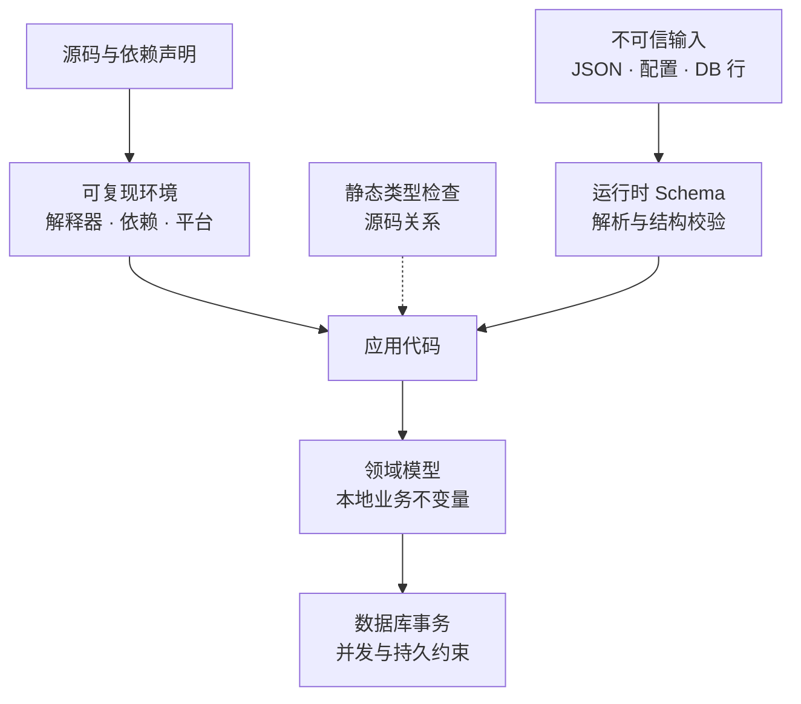
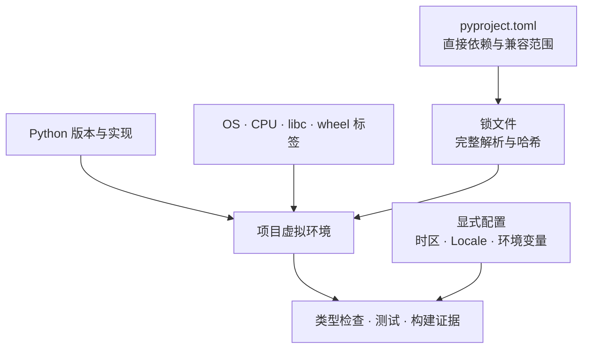
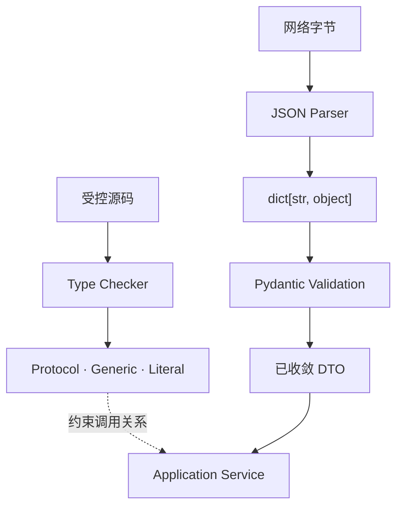
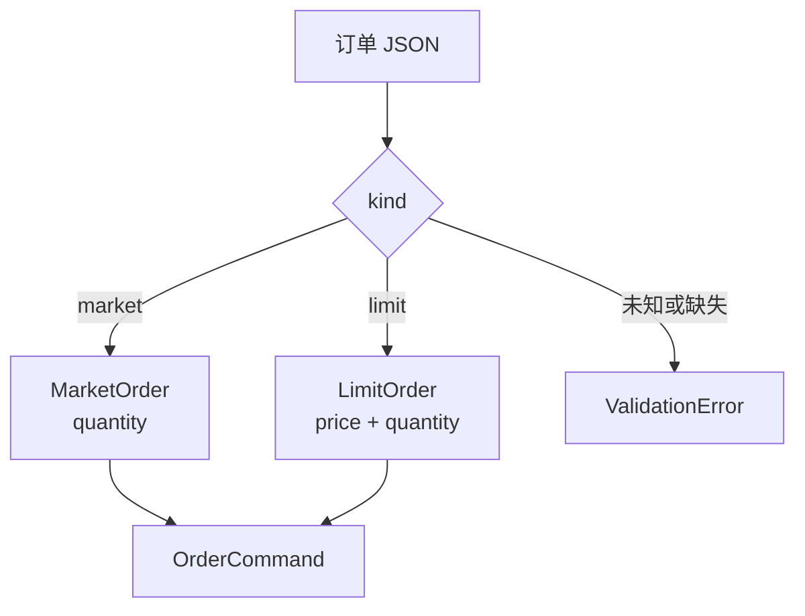
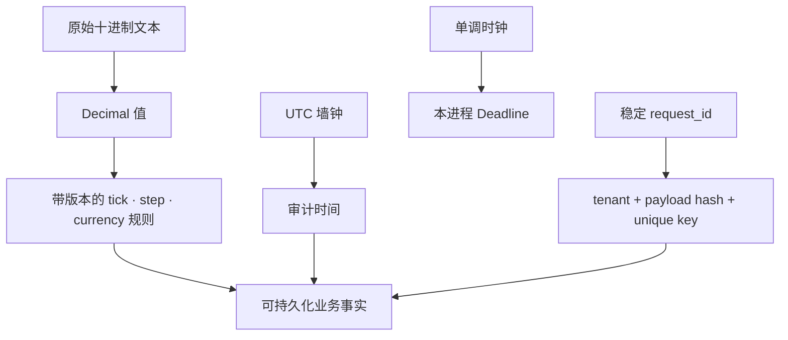
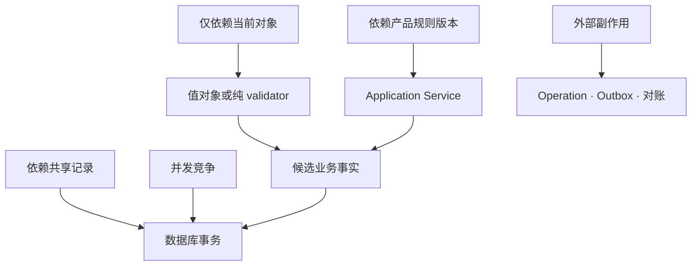
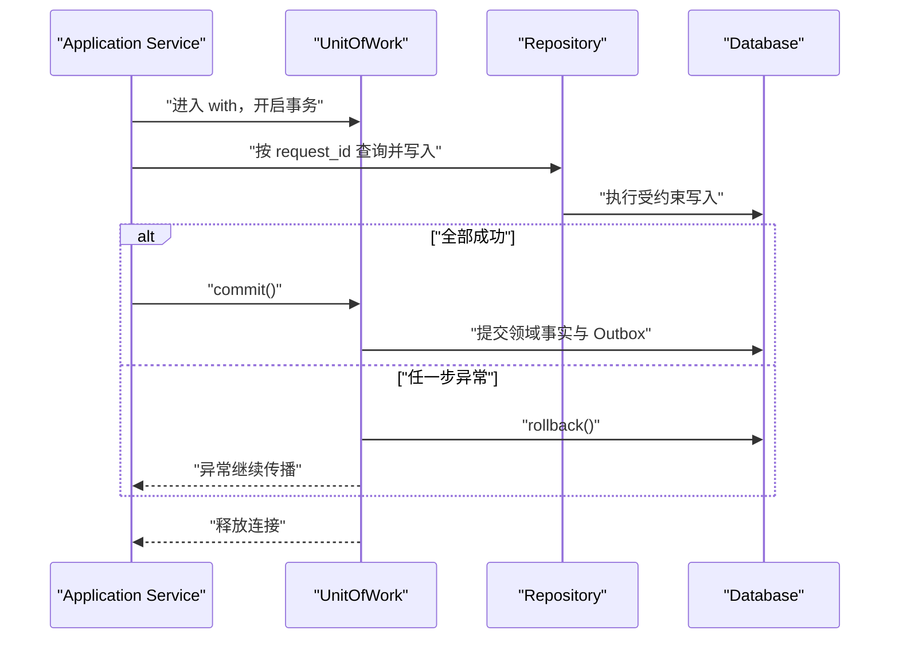
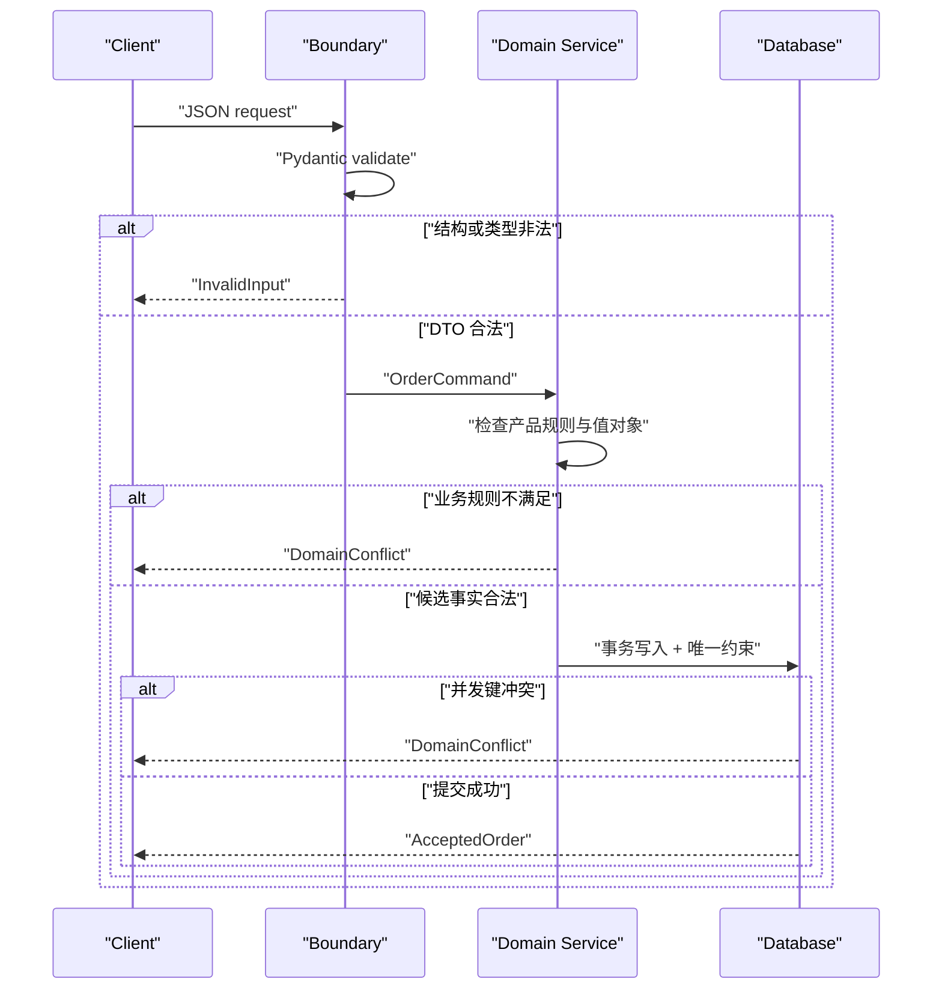

有 Java、Go 或 C++ 经验的人第一次用 Python 写 AI 后端，往往会走向两个极端：要么把类型标注当注释，所有输入一路用 `dict[str, Any]` 传到底；要么给每个类都加上类型和 Pydantic，便以为系统已经获得了与静态语言相同的边界。

两种做法都忽略了真正的问题。Python 的动态运行时并不妨碍严谨工程，**含糊的状态所有权和互相冒充的约束层才会**。

静态类型检查器只能检查源码关系；Pydantic 只能把当前输入收敛成符合 Schema 的对象；领域模型负责单个业务事实的不变量；数据库负责并发写入下仍然成立的唯一性、外键和事务约束；锁文件与固定运行时则回答“同一份代码是否运行成同一个系统”。少了任何一层，另外几层都不能自动补位。

本文是“AI Agent 后端工程”专题的 Chapter 02。上一章 [AI Agent 后端工程地图](/signal-grid-blog/posts/ai-agent-backend-engineering-map/) 划清了概率模型与确定性系统的职责；本章把“代码负责边界”落实到 Python 的类型、数据模型、领域值对象与可复现环境。

版本基线核对于 **2026-08-24**：示例以当前稳定的 [Python 3.14.7](https://www.python.org/downloads/release/python-3147/)、[Pydantic 2.13.4](https://github.com/pydantic/pydantic/releases/tag/v2.13.4) 和 [uv 0.12.5](https://pypi.org/project/uv/0.12.5/) 为准。Pydantic 2.14.0b1 仍是预发布版本，因此不用于正文契约。版本号会变化，但本文讨论的分层原则不依赖某个 Agent 框架。

## Python 的动态性不等于系统没有边界

一个请求从网络进入数据库，至少经过五种不同的证明。先把它们分开，后面的 API 才不会被赋予并不存在的保证。



这五层回答的问题完全不同：

| 层次 | 能证明什么 | 不能证明什么 |
| --- | --- | --- |
| 解释器、环境与锁文件 | 运行时和依赖解析符合记录的版本集合 | 外部服务、时钟和并发调度会重现 |
| 静态类型检查 | 已检查代码中的参数、返回值与协议关系一致 | 网络 JSON、数据库行或反射得到的对象合法 |
| Pydantic 运行时模型 | 输入能被解析为声明的类型并满足局部约束 | 调用者有权限、记录未重复、余额足够 |
| 领域模型与应用服务 | 一个命令或聚合满足业务规则 | 并发事务之间不会同时通过检查 |
| 数据库约束与事务 | 所有写入者在提交点仍满足唯一性、外键与原子性 | 上游输入含义正确、外部副作用只发生一次 |

这张表也解释了为什么“所有模型都继承 `BaseModel`”不是体系设计。边界 DTO、领域值对象、端口协议和持久化实体承担不同职责；把它们合成一个万能类，反而会让输入兼容、业务演进和数据库语义互相牵制。

### `Any` 不是动态性的代名词，而是检查的退出点

类型未知时，优先用 `object`，然后通过 `isinstance`、模式匹配或运行时 Schema 收窄。`Any` 的语义更强：它允许几乎所有操作继续通过静态检查，并把不确定性传播给后续表达式。

```python
from typing import Any


def unsafe(payload: Any) -> str:
    # 类型检查器不会阻止不存在的方法一路传播。
    return payload.customer.name.normalized()


def narrow(payload: object) -> str:
    if not isinstance(payload, dict):
        raise TypeError("payload must be an object")
    value = payload.get("customer_id")
    if not isinstance(value, str):
        raise TypeError("customer_id must be a string")
    return value
```

当然，手写每个字段的收窄既冗长又容易产生不一致。Pydantic 的价值正是在系统边界集中完成这件事，而不是让 `Any` 穿过整个调用链。

## 同一份代码必须先运行成同一个系统

Python 项目最常见的“在我机器上可以”并不是语言动态性造成的，而是运行时没有被描述完整：开发机用了另一个 Python patch 版本，CI 解析到了新的传递依赖，容器架构选中了不同 wheel，或有人在共享虚拟环境里临时安装了包。

一个可复核的项目至少要记录四类输入：



### `pyproject.toml` 声明意图，锁文件记录一次解析结果

[`pyproject.toml`](https://packaging.python.org/en/latest/specifications/pyproject-toml/) 是标准项目元数据和工具配置入口。它描述兼容范围，不应冒充完整锁文件：`pydantic>=2.13,<3` 没有记录最终选择的 patch 版本，也没有记录 Pydantic 的传递依赖和平台 wheel。

下面是一份适合本文示例的最小配置：

```toml
[project]
name = "tradeops-contracts"
version = "0.1.0"
requires-python = ">=3.14,<3.15"
dependencies = [
  "pydantic>=2.13,<3",
]

[dependency-groups]
dev = [
  "mypy>=1.20,<2",
  "pytest>=9,<10",
  "ruff>=0.16,<0.17",
]

[tool.mypy]
python_version = "3.14"
strict = true
plugins = ["pydantic.mypy"]
warn_unreachable = true

[tool.pytest.ini_options]
addopts = ["--strict-config", "--strict-markers"]

[tool.ruff]
target-version = "py314"
```

`requires-python = ">=3.14,<3.15"` 只是兼容范围，不会固定解释器的 patch 版本。`dependency-groups` 已由 PEP 735 标准化；它表达开发、测试等非发布依赖。真正部署时仍需提交锁文件。本文使用 uv，因此项目内提交 `.python-version` 和 `uv.lock`；[uv 官方文档](https://docs.astral.sh/uv/concepts/projects/sync/)明确区分了 locking 与 syncing，并提供 `--locked` 在锁文件过期时失败，而不是悄悄重解依赖。

```bash
# 写入精确解释器版本；CI 仍要核对实际 python --version
uv python pin 'cpython@3.14.7+gil'

# 首次由维护者明确生成或升级解析结果
uv lock

# CI 和部署只接受已经提交且仍与 pyproject.toml 一致的锁
uv lock --check
uv sync --locked

# 命令也在项目环境和已锁依赖中运行
uv run --locked mypy src
uv run --locked pytest
uv run --locked ruff check .
```

不要把 `--frozen` 和 `--locked` 混为一谈。uv 的 `--locked` 会检查锁是否与项目元数据一致；`--frozen` 使用现有锁而不做这项新鲜度检查。CI 通常需要前者提供失败关闭的证据。

这里按 [uv 的版本请求语法](https://docs.astral.sh/uv/concepts/python-versions/#requesting-a-version) 显式写 `cpython@3.14.7+gil`：实现、patch 版本和 GIL 变体都进入项目约束，而不是留下 implementation 未定的 `3.14` 请求，或在 PATH 优先出现 free-threaded 解释器时意外选中 `3.14t`。CI 仍应输出 `python -VV` 作为证据。

`.venv` 是当前机器上由某个解释器创建的环境实例，[标准库文档](https://docs.python.org/3.14/library/venv.html#how-venvs-work)说明脚本 shebang 会写入解释器绝对路径，因此它既不应提交，也不应搬到另一台机器复用。CI 和部署必须从版本文件、锁文件及受控基础镜像重新创建环境；若要求制品级复现，还要固定镜像 digest、平台 wheel 和系统库，而不只是一行 Python 兼容范围。

Python 生态还通过 PEP 751 标准化了工具无关的 [`pylock.toml`](https://packaging.python.org/en/latest/specifications/pylock-toml/) 格式。uv 可以导出它，但 `uv.lock` 与 `pylock.toml` 的表达能力并不完全相同。正确做法是明确哪一个文件是项目的权威锁，由工具生成并提交；不要同时手工维护两份“看起来差不多”的解析结果。

### 锁住依赖仍不等于整个执行可重现

锁文件解决的是依赖解析，不会冻结以下输入：

- 外部模型和 API 的响应；
- 当前时间、数据库内容和网络顺序；
- CPU 架构、系统库以及容器基础镜像；
- 并发任务的调度与完成顺序；
- 未显式记录的环境变量、Locale 和时区；
- 模型服务端的版本、路由和采样实现。

固定随机种子也只控制使用同一个伪随机生成器的那部分路径。更稳妥的方式是注入专用实例，而不是共享模块级全局状态：

```python
from random import Random


def choose_probe(candidates: tuple[str, ...], rng: Random) -> str:
    return rng.choice(candidates)


test_rng = Random(20260824)
assert choose_probe(("orders", "balances"), test_rng) == choose_probe(
    ("orders", "balances"),
    Random(20260824),
)
```

这个断言不代表模型响应、线程调度或网络结果可复现。测试若依赖时间，应注入 `Clock`；依赖随机性，应注入 `Random`；依赖模型和存储，应使用有契约的 Fake。把不确定输入变成显式依赖，比在测试入口调用一次 `random.seed()` 更有证明力。

它也只证明同一受控运行时内的选择可重复。[`random` 文档](https://docs.python.org/3.14/library/random.html#notes-on-reproducibility)只对兼容 seeder 下的 `Random.random()` 序列给出长期兼容承诺，`choice()` 等辅助算法仍可能随版本变化；严格历史重放应记录已经作出的决定，而不只是 seed。`random.seed()` 也不会固定 [`PYTHONHASHSEED`](https://docs.python.org/3.14/using/cmdline.html#envvar-PYTHONHASHSEED)、`set` 遍历或内置 `hash()`，后两者都不能用作持久 ID 和协议顺序。

## Type hints 约束代码关系，却不检查网络上的字节

Python 类型标注主要服务于静态分析和开发工具。解释器不会因为函数声明了 `str` 就拒绝传入整数，`TypedDict` 在运行时也只是普通 `dict`。[Python `typing` 文档](https://docs.python.org/3.14/library/typing.html)明确把这些构件定位为类型提示，而不是隐式运行时验证器。

Python 3.14 还有一个容易被旧教程掩盖的变化：PEP 649 让注解默认延迟求值。不要无解释地继续复制 `from __future__ import annotations`，它会启用旧的字符串化注解语义；[`annotationlib` 文档](https://docs.python.org/3.14/library/annotationlib.html#security-implications-of-introspecting-annotations)还提醒，反射读取 `__annotations__`、`typing.get_type_hints()` 或 `annotationlib` 可能执行注解中的代码，不能拿它们解析不可信输入。注解解决的是源码契约，不是安全的数据格式。

### `Protocol` 描述需要的能力，而不是类的家谱

`Protocol` 使用结构化子类型：实现方只要提供匹配的成员，就能满足端口，无需显式继承。这使领域服务依赖“能做什么”，而不是依赖具体数据库客户端。

```python
from types import TracebackType
from typing import Literal, Protocol, Self
from uuid import UUID


class OrderRecord(Protocol):
    @property
    def request_id(self) -> UUID: ...


class OrderRepository(Protocol):
    def find_by_request_id(self, request_id: UUID) -> OrderRecord | None: ...

    def add(self, order: OrderRecord) -> None: ...


class UnitOfWork(Protocol):
    @property
    def orders(self) -> OrderRepository: ...

    def __enter__(self) -> Self: ...

    def __exit__(
        self,
        exc_type: type[BaseException] | None,
        exc: BaseException | None,
        traceback: TracebackType | None,
    ) -> Literal[False]: ...

    def commit(self) -> None: ...
```

Java `interface` 与 Python `Protocol` 都能隔离调用者和实现，但二者并不完全等价：

| 维度 | Java `interface` | Python `Protocol` | Pydantic Model |
| --- | --- | --- | --- |
| 主要职责 | 声明名义实现契约 | 声明结构化源码契约 | 验证和序列化运行时数据 |
| 实现方是否显式声明 | 通常需要 `implements` | 不需要继承 | 需要调用模型验证入口 |
| 运行时是否自动检查参数 | 否 | 否 | 仅在执行验证时检查 |
| 是否生成 JSON Schema | 否 | 否 | 是 |
| 是否证明业务授权或数据库唯一性 | 否 | 否 | 否 |

`@runtime_checkable` 也不能把 `Protocol` 变成完整运行时接口检查。官方文档明确说明，它主要检查属性是否存在，不校验方法签名和属性类型，而且可能比普通 `isinstance` 更慢。它适合少量能力探测，不适合替代边界验证。

### `Literal`、`Enum` 与 Generic 解决的是不同问题

- `Literal["BUY", "SELL"]` 表示一组封闭的字面值，便于类型收窄和 JSON Schema 枚举；
- `Enum` 或 `StrEnum` 提供有身份的方法与运行时枚举对象，适合内部领域行为；
- Generic 保留容器里“装的是什么”，避免 `Page[Any]` 让类型信息在边界后消失。

Python 3.12 起支持更紧凑的类型参数语法，Pydantic 也支持泛型模型：

```python
from pydantic import BaseModel, ConfigDict


class Envelope[T](BaseModel):
    model_config = ConfigDict(frozen=True, extra="forbid")

    data: T
    trace_id: str


ok: Envelope[int] = Envelope(data=42, trace_id="trace-7")
```

但 `Envelope[int]` 仍只在执行构造或 `model_validate*` 时做运行时验证。静态检查与运行时验证可以使用同一份类型标注，却仍然是两次不同的证明。

### `TypedDict` 是静态字典形状，不是 DTO 验证器

```python
from typing import TypedDict


class RawOrder(TypedDict):
    symbol: str
    quantity: str


payload: RawOrder = {"symbol": "BTC-USDT", "quantity": "0.010"}
```

运行时的 `payload` 仍是 `dict`。来自 `json.loads()` 的对象不会自动变成 `RawOrder`，缺字段、额外字段或错误值也不会因为赋值标注而抛错。`TypedDict` 适合描述受控代码中的字典协作；不可信输入应进入显式验证入口。



## Pydantic 只负责把不可信输入收敛成明确 DTO

Pydantic 官方对“validation”有一个很重要的限定：它保证**处理后的输出对象**符合声明类型与约束，不保证输入原本就具有该类型。默认模式会进行转换，例如把字符串整数转成 `int`；这对表单和配置很方便，却未必适合金额、权限和工具参数。

### 失败关闭要显式选择 strict、forbid 与冻结策略

Pydantic 默认会忽略额外字段，模型默认可变，许多类型默认允许合理转换。安全边界不应依赖这些默认值：

```python
from pydantic import BaseModel, ConfigDict


class BoundaryModel(BaseModel):
    model_config = ConfigDict(
        strict=True,
        extra="forbid",
        frozen=True,
        validate_default=True,
    )
```

四项配置分别回答不同问题：

- `strict=True`：按 [Pydantic conversion table](https://docs.pydantic.dev/latest/concepts/conversion_table/) 显著收紧 Python 输入转换，而不是假定所有类型之间都绝不转换；
- `extra="forbid"`：客户端拼错或提前发送新字段时明确失败，而不是静默丢弃；
- `frozen=True`：阻止模型字段被普通赋值改写；
- `validate_default=True`：让默认值也经过验证，而不是信任类定义里的值。

它们也都有边界。

第一，Pydantic 的 strict 模式在验证 JSON 时比验证 Python 对象更宽松，因为 JSON 没有 UUID、日期等原生类型；官方 strict-mode 文档明确展示了这种差异。因此接口测试必须走实际使用的 `model_validate_json()` 路径，不能只拿 Python `dict` 测一次便推断线上行为。

第二，`frozen` 是浅层的“faux immutability”。若字段内部装着可变 `list` 或 `dict`，容器内容仍可能变化。稳定快照应优先使用 `tuple`、`frozenset` 和自身不可变的嵌套值对象。

第三，`model_copy(update=...)` 的 update 值**不会重新验证**；`model_construct()` 更是明确绕过验证，只能接收已经可信的数据。不要因为模型被冻结，就用这两个入口把不可信更新塞回对象。

```python
# 不要对外部输入这样做，update 不会被验证。
changed = existing.model_copy(update={"quantity": "not-a-decimal"})

# 需要更新时重新走模型入口。
candidate = existing.model_dump(round_trip=True)
candidate["quantity"] = proposed_quantity
changed = type(existing).model_validate(candidate)
```

### 有多种消息形状时，用可判别联合而不是猜测

市场单和限价单不是“价格可空”的同一个松散对象。前者不应携带价格，后者必须携带价格。使用带 `Literal` 标签的 discriminated union，解析器只进入明确分支，错误也更聚焦。



```python
from datetime import UTC, datetime
from decimal import Decimal, InvalidOperation
import re
from typing import Annotated, Literal
from uuid import UUID

from pydantic import (
    AwareDatetime,
    BeforeValidator,
    Field,
    PlainSerializer,
    TypeAdapter,
    WithJsonSchema,
    field_validator,
)


DECIMAL_TEXT_PATTERN = r"^(?:0|[1-9][0-9]*)(?:\.[0-9]+)?$"
DECIMAL_TEXT_RE = re.compile(DECIMAL_TEXT_PATTERN)
MAX_DECIMAL_TEXT_LENGTH = 40
MAX_DOMAIN_DIGITS = 28
MAX_DOMAIN_PLACES = 8


def has_supported_decimal_shape(value: Decimal) -> bool:
    if not value.is_finite():
        return False
    parts = value.as_tuple()
    if not isinstance(parts.exponent, int):
        return False
    total_digits = len(parts.digits) + max(parts.exponent, 0)
    decimal_places = max(-parts.exponent, 0)
    return total_digits <= MAX_DOMAIN_DIGITS and decimal_places <= MAX_DOMAIN_PLACES


def parse_decimal_text(value: object) -> Decimal:
    if isinstance(value, Decimal):
        if value.is_signed():
            raise ValueError("must be a non-negative decimal")
        if not has_supported_decimal_shape(value):
            raise ValueError("decimal exceeds the supported digits or scale")
        return value
    if (
        not isinstance(value, str)
        or len(value) > MAX_DECIMAL_TEXT_LENGTH
        or DECIMAL_TEXT_RE.fullmatch(value) is None
    ):
        raise ValueError("must be a non-negative plain decimal string")
    try:
        parsed = Decimal(value)
    except InvalidOperation as exc:
        raise ValueError("must be a valid decimal string") from exc
    if not has_supported_decimal_shape(parsed):
        raise ValueError("decimal exceeds the supported digits or scale")
    return parsed


def dump_decimal(value: Decimal) -> str:
    return format(value, "f")


DecimalText = Annotated[
    Decimal,
    BeforeValidator(parse_decimal_text),
    PlainSerializer(dump_decimal, return_type=str, when_used="json"),
    WithJsonSchema(
        {
            "type": "string",
            "pattern": DECIMAL_TEXT_PATTERN,
            "maxLength": MAX_DECIMAL_TEXT_LENGTH,
        },
        mode="validation",
    ),
]


class OrderBase(BoundaryModel):
    request_id: UUID
    symbol: str = Field(pattern=r"^[A-Z0-9]+-[A-Z0-9]+$")
    side: Literal["BUY", "SELL"]
    quantity: DecimalText
    requested_at: AwareDatetime

    @field_validator("requested_at", mode="after")
    @classmethod
    def normalize_utc(cls, value: datetime) -> datetime:
        return value.astimezone(UTC)


class MarketOrder(OrderBase):
    kind: Literal["market"]


class LimitOrder(OrderBase):
    kind: Literal["limit"]
    price: DecimalText


OrderCommand = Annotated[
    MarketOrder | LimitOrder,
    Field(discriminator="kind"),
]

ORDER_ADAPTER: TypeAdapter[OrderCommand] = TypeAdapter(OrderCommand)
```

这里故意要求金额字段在 JSON 中是普通十进制字符串，并在进入 `Decimal` 前拒绝 JSON number、指数形式、负数、`NaN` 和 `Infinity`。这不是 Pydantic 的通用默认，而是本文为交易示例定义的传输契约。

这也是一个刻意覆盖 strict 默认行为的例子：JSON 路径只接受 ASCII 十进制文本，`BeforeValidator` 再返回真正的 `Decimal` 给后续 Schema；Python 路径额外接受已经规范化且仍满足同一位数约束的 `Decimal`，用于受控的领域重建和 `model_dump(round_trip=True)` 往返。长度、总位数和小数位都在解析前后显式限制，HTTP 层仍应再限制整个请求体大小。

`TypeAdapter` 让联合、列表、`TypedDict` 等不需要额外 `BaseModel` 外壳的类型也能获得验证、序列化和 JSON Schema。请求边界可以直接调用：

```python
raw = b"""{
  "kind": "limit",
  "request_id": "5b8c056a-5a22-4ced-881d-bc121186cce5",
  "symbol": "BTC-USDT",
  "side": "BUY",
  "quantity": "0.015",
  "price": "50000.10",
  "requested_at": "2026-08-24T03:30:00Z"
}"""

command = ORDER_ADAPTER.validate_json(raw, strict=True)
assert isinstance(command, LimitOrder)
assert command.price == Decimal("50000.10")
```

### JSON Schema 是边界描述，不是完整业务证明

`ORDER_ADAPTER.json_schema(mode="validation")` 可以生成 JSON Schema，供 API 文档、代码生成或契约测试使用。Pydantic 当前默认面向 JSON Schema Draft 2020-12，并兼容 OpenAPI 3.1 的表达需要。

但 Schema 看不到实时的产品元数据、账户权限、数据库唯一键和市场状态。例如 `price` 是合法十进制字符串，不代表它符合 BTC-USDT 当前的 tick size；`request_id` 是 UUID，不代表它没有被使用过；`side="BUY"` 也不代表调用者有交易权限。

生成 Schema 时还必须区分 validation 与 serialization。本文验证十进制字符串，并把 `Decimal` 以字符串序列化；如果自定义 validator 接受的输入和输出类型不同，两个模式的 Schema 也可能不同。Schema 快照测试应固定你真正发布给客户端的模式。

Pydantic 2.13 还加入了可选的 polymorphic serialization。它会按运行时子类暴露更多字段；这在插件模型中可能有用，也可能把子类新增的 secret 带进响应。边界 DTO 应默认按声明类型序列化，只有在审查过字段集合后才显式开启多态序列化。

## 金额、时间和身份必须成为值对象

Pydantic 解决了“输入能否成为某种 Python 值”，但交易后端还必须说明值的业务含义。`Decimal`、`datetime` 和 UUID 只是构件，不是完整领域模型。

### `Decimal` 必须从十进制意图进入系统

二进制浮点不能精确表示大多数十进制小数。更隐蔽的是，`Decimal` 接收 `float` 时会忠实记录那个二进制值，而不是恢复用户原本想输入的十进制文本：

```python
from decimal import (
    Context,
    Decimal,
    DivisionByZero,
    InvalidOperation,
    Overflow,
    ROUND_HALF_EVEN,
    localcontext,
)


DOMAIN_CONTEXT = Context(
    prec=38,
    rounding=ROUND_HALF_EVEN,
    Emin=-999_999,
    Emax=999_999,
    capitals=1,
    clamp=0,
    traps=[InvalidOperation, DivisionByZero, Overflow],
)


def require_domain_decimal(
    value: Decimal,
    *,
    name: str,
    allow_negative: bool = False,
) -> None:
    if not has_supported_decimal_shape(value):
        raise DomainViolation(f"{name} exceeds the supported digits or scale")
    if not allow_negative and value.is_signed():
        raise DomainViolation(f"{name} cannot be negative")


assert Decimal("0.1") == Decimal("0.1")
assert Decimal(0.1) != Decimal("0.1")
```

因此，金额、价格、数量和费率应从字符串或明确的整数最小单位构造。若某个 SDK 已经把 JSON number 解成 `float`，再调用 `Decimal(str(value))` 只是把当前浮点的短表示转回十进制，不能证明恢复了原始报文和原始精度。

### 小数位数、舍入和合法步长是三件事

`quantize(Decimal("0.01"))` 可以把值舍入到两位小数，却不能验证它是否是 `0.05` 的整数倍。对于外部订单，静默舍入还会改变调用者意图。更安全的默认是拒绝非法步长，并把需要舍入的场景命名为显式业务政策。

```python
from dataclasses import dataclass
from decimal import Decimal


def is_exact_multiple(value: Decimal, step: Decimal) -> bool:
    if (
        not has_supported_decimal_shape(value)
        or not has_supported_decimal_shape(step)
        or step <= 0
    ):
        return False
    try:
        with localcontext(DOMAIN_CONTEXT):
            return value % step == 0
    except InvalidOperation:
        return False


@dataclass(frozen=True, slots=True)
class InstrumentRules:
    symbol: str
    price_tick: Decimal
    quantity_step: Decimal

    def __post_init__(self) -> None:
        require_domain_decimal(self.price_tick, name="price_tick")
        require_domain_decimal(self.quantity_step, name="quantity_step")
        if self.price_tick == 0 or self.quantity_step == 0:
            raise DomainViolation("tick and step must be positive")

    def validate_limit(self, price: Decimal, quantity: Decimal) -> None:
        if price <= 0 or not is_exact_multiple(price, self.price_tick):
            raise DomainViolation("price does not match the current tick")
        if quantity <= 0 or not is_exact_multiple(quantity, self.quantity_step):
            raise DomainViolation("quantity does not match the current step")
```

动态产品规则不应硬编码进通用 Pydantic DTO。tick、step、合约乘数和状态属于带版本的权威产品元数据；应用服务应读取明确版本的 `InstrumentRules`，并把该版本与接受结果一起记录。否则一次历史重放可能悄悄套用今天的规则。

这里把传输值限制为最多 28 位数字和 8 位小数，并完整固定领域 `Context` 的精度、舍入、指数范围与 trap，再让每次运算通过 `localcontext(DOMAIN_CONTEXT)` 使用它的副本。这避免加法和取模继承进程里恰好生效的全局 Context；另一种更容易证明的做法，是把金额与数量转换成整数最小单位。无论选哪一种，都必须在进入领域时拒绝 `NaN`、Infinity、超范围位数和非法 scale。

### 时区明确不等于拥有全局顺序

对外事件时间使用带时区的 `datetime`，进入领域后规范化为 UTC：

```python
from datetime import UTC, datetime


now = datetime.now(UTC)
assert now.tzinfo is UTC
```

仍需区分至少三个时间：

| 字段 | 来源 | 用途 |
| --- | --- | --- |
| `requested_at` | 调用者墙钟 | 审计请求声称何时发生，不用于证明到达顺序 |
| `received_at` | 服务端墙钟 | 日志、审计和跨进程关联 |
| monotonic deadline | 当前进程单调时钟 | 超时与剩余预算，不可序列化后跨进程比较 |

UTC 解决的是表示和换算，不保证墙钟单调，也不产生跨节点全序。下一章讨论 Deadline 时会改用本进程的单调时钟计算耗时，而不是拿 `datetime.now()` 相减决定超时。

### 身份要稳定，也要声明作用域

UUID 能降低碰撞概率，却不会自动带来幂等。`request_id` 只有在下面三个条件同时成立时才有业务意义：

1. 同一个逻辑请求的所有重试都复用它；
2. 唯一约束绑定正确作用域，例如 `(tenant_id, request_id)`；
3. 重复键还要核对规范化 payload hash，防止同键不同请求被误当作成功重试。



这些值对象的共同目标不是“让代码更面向对象”，而是防止一个裸 `str`、`Decimal` 或 `datetime` 在不同位置被赋予不同含义。

## 业务不变量需要比 Schema 更权威的所有者

订单 DTO 通过验证后，只能说明“请求形状清楚”。接下来还要把它转成领域命令，并在正确的权威层验证状态。

### 本地不变量适合放进不可变领域对象

下面三个模型故意不用 Pydantic。它们只由受控代码创建，`dataclass` 更直接地表达不可变领域事实：

```python
from dataclasses import dataclass
from decimal import Decimal


class DomainViolation(ValueError):
    pass


@dataclass(frozen=True, slots=True)
class Balance:
    asset: str
    available: Decimal
    held: Decimal
    total: Decimal

    def __post_init__(self) -> None:
        require_domain_decimal(self.available, name="available")
        require_domain_decimal(self.held, name="held")
        require_domain_decimal(self.total, name="total")
        with localcontext(DOMAIN_CONTEXT):
            if self.available + self.held != self.total:
                raise DomainViolation("available + held must equal total")


@dataclass(frozen=True, slots=True)
class Position:
    symbol: str
    quantity: Decimal
    average_entry_price: Decimal | None

    def __post_init__(self) -> None:
        require_domain_decimal(
            self.quantity,
            name="quantity",
            allow_negative=True,
        )
        if self.quantity == 0 and self.average_entry_price is not None:
            raise DomainViolation("flat position cannot retain an entry price")
        if self.quantity != 0:
            if self.average_entry_price is None:
                raise DomainViolation("open position needs a positive entry price")
            require_domain_decimal(self.average_entry_price, name="average_entry_price")
            if self.average_entry_price == 0:
                raise DomainViolation("open position needs a positive entry price")


@dataclass(frozen=True, slots=True)
class Trade:
    trade_id: str
    symbol: str
    price: Decimal
    quantity: Decimal
    fee_asset: str
    fee: Decimal

    def __post_init__(self) -> None:
        require_domain_decimal(self.price, name="price")
        require_domain_decimal(self.quantity, name="quantity")
        require_domain_decimal(self.fee, name="fee")
        if self.price == 0 or self.quantity == 0:
            raise DomainViolation("trade values are outside the legal range")
```

这些检查都是纯函数式的本地不变量：只看构造参数就能判定。它们不访问数据库、不读取当前市场状态，也不依赖本机墙钟，因此创建、测试和重放都具有相同含义。

### 跨记录和并发不变量必须留在事务提交点

以下规则不能仅靠 Pydantic validator 或 `__post_init__` 保护：

- 同一租户的 `request_id` 只能对应一个规范化 payload；
- 一笔成交引用的买卖订单必须存在；
- 余额预占不能在两个并发事务中重复花费；
- 版本号只能从当前值原子推进；
- Outbox 事件与领域写入必须同事务提交。

原因不是 Pydantic 功能不够，而是这些规则需要看到**共享权威状态和并发提交顺序**。即使两个请求都在应用层读到“余额足够”，数据库仍可能需要行锁、原子条件更新、唯一约束或可串行化事务拒绝其中一个。



不要在 Pydantic validator 里查询数据库来“统一所有校验”。validator 可能在不同入口、嵌套模型或重放中被多次调用；把 I/O 塞进去会让对象创建依赖隐式环境，还让 JSON Schema 看起来比实际保证更强。输入结构保持纯验证，动态规则放应用服务，并发不变量放事务，是更清晰的状态所有权。

### 四类错误也不应压成一个 `ValidationError`

边界需要保留错误来源：

```python
class InvalidInput(ValueError):
    """输入无法形成受支持的命令。"""


class DomainConflict(RuntimeError):
    """输入合法，但与当前业务状态冲突。"""


class DependencyUnavailable(RuntimeError):
    """暂时无法确认或提交结果。"""


class OutcomeUnknown(RuntimeError):
    """请求可能已提交，调用方必须按稳定键查询。"""
```

API 层可以把它们映射为不同状态和机器可读错误码。尤其不能把数据库超时包装成“输入无效”：超时可能发生在提交成功但响应丢失之后，结果未知与明确拒绝是两种完全不同的重试语义。

## Context Manager 把资源生命周期写进控制流

`with` 的价值不只是少写一行 `close()`。它把资源获取、正常提交、异常回滚和释放放在同一个词法范围内，让所有提前返回和异常路径共享清理协议。



一个同步 Unit of Work 可以这样表达：

```python
from contextlib import ExitStack
from types import TracebackType
from typing import Literal


class SqlUnitOfWork:
    def __enter__(self) -> "SqlUnitOfWork":
        with ExitStack() as setup:
            self.connection = self.pool.acquire()
            setup.callback(self.pool.release, self.connection)

            self.transaction = self.connection.begin()
            self._committed = False
            setup.callback(self._rollback_unless_committed)

            self.orders = SqlOrderRepository(self.connection)
            self._cleanup = setup.pop_all()
        return self

    def _rollback_unless_committed(self) -> None:
        if not self._committed:
            self.transaction.rollback()

    def commit(self) -> None:
        self.transaction.commit()
        self._committed = True

    def __exit__(
        self,
        exc_type: type[BaseException] | None,
        exc: BaseException | None,
        traceback: TracebackType | None,
    ) -> Literal[False]:
        self._cleanup.close()
        return False
```

`__exit__` 的类型被收窄为 `Literal[False]`，明确这类 Unit of Work 永远不吞掉业务异常。`ExitStack` 还保证 `begin()` 或 Repository 初始化失败时，已经取得的连接和事务仍会按逆序清理；没有显式 `commit()` 的正常退出也回滚，避免遗漏提交语句时静默持久化半成品。

这只是教学骨架。具体数据库驱动还要定义 commit 失败、rollback 失败、连接失效和“服务器已提交但客户端未确认”的结果未知；清理本身再次失败时也要保留原始异常链并上报告警，不能用一条 cleanup error 静默覆盖真正的业务故障。

异常映射也应保留原因链：

```python
from pydantic import ValidationError


try:
    command = ORDER_ADAPTER.validate_json(raw, strict=True)
except ValidationError as exc:
    raise InvalidInput("order payload rejected") from exc
```

`raise ... from exc` 让 API 可以返回稳定错误码，同时 Trace 仍保留原始字段路径和失败类型。不要在底层 `except Exception: return None`；那会把输入错误、程序缺陷和依赖故障压成同一个假结果。`asyncio.CancelledError` 在现代 Python 中直接继承 `BaseException`，普通 `except Exception` 捕获不到它；若为了清理而显式捕获取消，通常必须清理后重新抛出，下一章会完整展开这条边界。

## 一条订单摄取链把五层契约接起来

现在把环境、类型、Schema、领域与事务串成一次完整提交。先定义验证后的领域事实：

```python
from dataclasses import dataclass
from datetime import datetime
from decimal import Decimal
from uuid import UUID

from pydantic import ValidationError


@dataclass(frozen=True, slots=True)
class AcceptedOrder:
    request_id: UUID
    symbol: str
    side: Literal["BUY", "SELL"]
    kind: Literal["market", "limit"]
    quantity: Decimal
    price: Decimal | None
    requested_at: datetime
    rules_version: int


def accept_order(
    raw: bytes,
    *,
    rules: InstrumentRules,
    rules_version: int,
    uow: UnitOfWork,
) -> AcceptedOrder:
    try:
        command = ORDER_ADAPTER.validate_json(raw, strict=True)
    except ValidationError as exc:
        raise InvalidInput("order payload rejected") from exc

    if command.symbol != rules.symbol:
        raise DomainConflict("instrument rules do not match the request")

    if isinstance(command, LimitOrder):
        rules.validate_limit(command.price, command.quantity)
        price: Decimal | None = command.price
    else:
        if command.quantity <= 0 or not is_exact_multiple(
            command.quantity,
            rules.quantity_step,
        ):
            raise DomainViolation("quantity does not match the current step")
        price = None

    accepted = AcceptedOrder(
        request_id=command.request_id,
        symbol=command.symbol,
        side=command.side,
        kind=command.kind,
        quantity=command.quantity,
        price=price,
        requested_at=command.requested_at,
        rules_version=rules_version,
    )

    with uow:
        existing = uow.orders.find_by_request_id(accepted.request_id)
        if existing is not None:
            # 生产实现还要比较规范化 payload hash，才能区分安全重试和键冲突。
            raise DomainConflict("request_id already exists")
        uow.orders.add(accepted)
        uow.commit()

    return accepted
```

这段代码的重点不是仓储模式本身，而是拒绝位置可解释：



同一个请求可能在不同层失败，但每层拒绝的是不同命题：

| 输入或故障 | 拒绝层 | 证明 |
| --- | --- | --- |
| `price` 发送为 JSON number | Pydantic decimal parser | 协议要求原始十进制文本 |
| 多出 `admin_override` 字段 | `extra="forbid"` | 未声明字段不能静默穿透 |
| `requested_at` 没有时区 | `AwareDatetime` | 审计时间必须可换算 |
| 价格不符合当前 tick | `InstrumentRules` | 使用了记录版本的产品规则 |
| `available + held != total` | `Balance` 值对象 | 单个余额事实内部一致 |
| 两个请求争用同一业务键 | 数据库 UNIQUE/事务 | 并发提交后仍然唯一 |
| commit 响应超时 | Operation 查询与对账 | 结果未知，不能伪装成明确失败 |

### 让失败案例成为可执行证据

最小测试不只验证“合法输入能过”，还要证明非法输入在预期层失败：

```python
from datetime import UTC, datetime
from decimal import Decimal
from uuid import UUID

import pytest
from pydantic import ValidationError


VALID = b"""{
  "kind": "limit",
  "request_id": "5b8c056a-5a22-4ced-881d-bc121186cce5",
  "symbol": "BTC-USDT",
  "side": "BUY",
  "quantity": "0.015",
  "price": "50000.10",
  "requested_at": "2026-08-24T03:30:00Z"
}"""


def test_valid_order_preserves_decimal_intent() -> None:
    command = ORDER_ADAPTER.validate_json(VALID, strict=True)
    assert isinstance(command, LimitOrder)
    assert command.price == Decimal("50000.10")
    assert command.model_dump_json().find('"price":"50000.10"') >= 0


@pytest.mark.parametrize(
    "fragment",
    [
        b'"price": 50000.10',
        b'"price": "NaN"',
        b'"price": "5e4"',
    ],
)
def test_decimal_transport_rejects_ambiguous_forms(fragment: bytes) -> None:
    raw = VALID.replace(b'"price": "50000.10"', fragment)
    with pytest.raises(ValidationError):
        ORDER_ADAPTER.validate_json(raw, strict=True)


def test_extra_fields_fail_closed() -> None:
    raw = VALID.replace(b'"side": "BUY"', b'"side": "BUY", "admin": true')
    with pytest.raises(ValidationError):
        ORDER_ADAPTER.validate_json(raw, strict=True)


@pytest.mark.parametrize("value", [Decimal("-1"), Decimal("-0.00")])
def test_python_decimal_path_has_the_same_non_negative_domain(value: Decimal) -> None:
    with pytest.raises(ValidationError) as error:
        LimitOrder.model_validate(
            {
                "kind": "limit",
                "request_id": UUID("5b8c056a-5a22-4ced-881d-bc121186cce5"),
                "symbol": "BTC-USDT",
                "side": "BUY",
                "quantity": "0.015",
                "price": value,
                "requested_at": datetime(2026, 8, 24, 3, 30, tzinfo=UTC),
            },
            strict=True,
        )
    assert {tuple(item["loc"]) for item in error.value.errors()} == {("price",)}


def test_balance_is_not_merely_well_typed() -> None:
    with pytest.raises(DomainViolation):
        Balance(
            asset="USDT",
            available=Decimal("80"),
            held=Decimal("30"),
            total=Decimal("100"),
        )
```

再把类型检查、Schema 与运行时测试放进同一个门禁：

```bash
uv lock --check
uv sync --locked
uv run --locked mypy src tests
uv run --locked ruff check .
uv run --locked pytest
```

这里仍没有证明数据库并发约束和真实驱动事务。那部分需要集成测试：用真实数据库启动两个竞争事务，断言最终只有一个提交，并检查异常被映射成稳定业务结果。Fake Repository 适合验证应用分支，却不能证明数据库隔离级别和约束行为。

### 还有三条容易绕过验证的捷径

第一，`model_construct()` 只用于已经可信或预验证的数据。Pydantic V2 中普通验证已经很快，官方也提醒不要默认认为 construct 一定有性能优势；在热路径采用前应测量，并给可信来源写出证明。

第二，`model_copy(update=...)` 不验证 update。对冻结模型进行业务更新时，应重新走领域构造或 `model_validate`，而不是把它当成安全 setter。

第三，模型序列化不是持久化事务。`model_dump_json()` 能生成稳定形状，不会替你提供数据库原子性、Outbox、幂等键或跨版本迁移。

## 结论：动态运行时可以接受，含糊的状态所有权不可以

Python AI 后端可以同时拥有灵活开发体验和严格工程边界，前提是每一层只承担自己能证明的事情：

1. `pyproject.toml` 表达兼容意图，锁文件、解释器和平台记录实际执行环境；
2. Type hints、`Protocol` 与 Generic 检查受控源码关系，不验证外部字节；
3. Pydantic 在边界把不可信输入收敛成明确 DTO，但 Schema 通过不代表授权和业务成功；
4. `Decimal`、UTC 时间与稳定身份必须携带明确传输和领域语义，不能只靠基础类型名称；
5. 本地不变量属于值对象，动态规则属于应用服务，并发约束属于数据库，外部副作用还需要独立 Operation、幂等和对账。

真正危险的不是 Python 允许动态对象，而是系统无法回答：这个值在哪里变得可信，谁有权改变它，冲突由谁拒绝，失败后用什么证据判断结果。

下一章将进入 `asyncio`，讨论这些同步边界在 Deadline、取消、有界并发和部分失败下如何继续成立。

## 参考资料

- [Python 3.14.7](https://www.python.org/downloads/release/python-3147/)：本文解释器稳定版本基线。
- [Python Typing 文档](https://docs.python.org/3.14/library/typing.html) 与 [Typing Specification](https://typing.python.org/en/latest/spec/)：`Protocol`、Generic、`Literal`、`TypedDict` 与静态类型语义。
- [Python `decimal`](https://docs.python.org/3.14/library/decimal.html)：十进制构造、Context、舍入、signal 与浮点转换边界。
- [Python `datetime`](https://docs.python.org/3.14/library/datetime.html)：aware/naive 时间、UTC 与时间算术。
- [Python `with` 语句](https://docs.python.org/3.14/reference/compound_stmts.html#the-with-statement) 与 [`contextlib`](https://docs.python.org/3.14/library/contextlib.html)：Context Manager 的进入、退出和异常传播语义。
- [`pyproject.toml` 规范](https://packaging.python.org/en/latest/specifications/pyproject-toml/)、[`pylock.toml` 规范](https://packaging.python.org/en/latest/specifications/pylock-toml/) 与 [uv Locking and syncing](https://docs.astral.sh/uv/concepts/projects/sync/)：项目元数据、可复现解析和锁文件新鲜度。
- [Pydantic 2.13.4 Release](https://github.com/pydantic/pydantic/releases/tag/v2.13.4) 与 [Version Policy](https://docs.pydantic.dev/latest/version-policy/)：稳定版本和兼容政策。
- [Pydantic Models](https://docs.pydantic.dev/latest/concepts/models/)、[Strict Mode](https://docs.pydantic.dev/latest/concepts/strict_mode/)、[Validators](https://docs.pydantic.dev/latest/concepts/validators/) 与 [Unions](https://docs.pydantic.dev/latest/concepts/unions/)：输入转换、严格模式、额外字段、验证器和可判别联合。
- [Pydantic TypeAdapter](https://docs.pydantic.dev/latest/concepts/type_adapter/)、[JSON Schema](https://docs.pydantic.dev/latest/concepts/json_schema/) 与 [Serialization](https://docs.pydantic.dev/latest/concepts/serialization/)：非模型类型验证、两种 Schema 模式和序列化边界。
- [PostgreSQL Constraints](https://www.postgresql.org/docs/current/ddl-constraints.html) 与 [Transaction Isolation](https://www.postgresql.org/docs/current/transaction-iso.html)：唯一性、外键、检查约束与并发事务边界。
