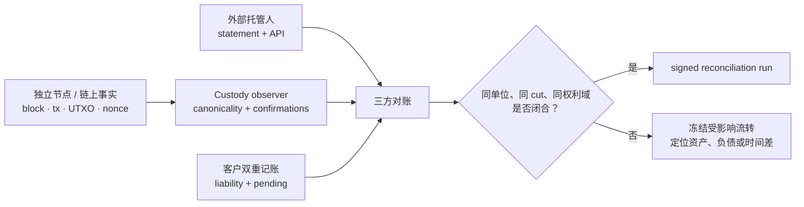
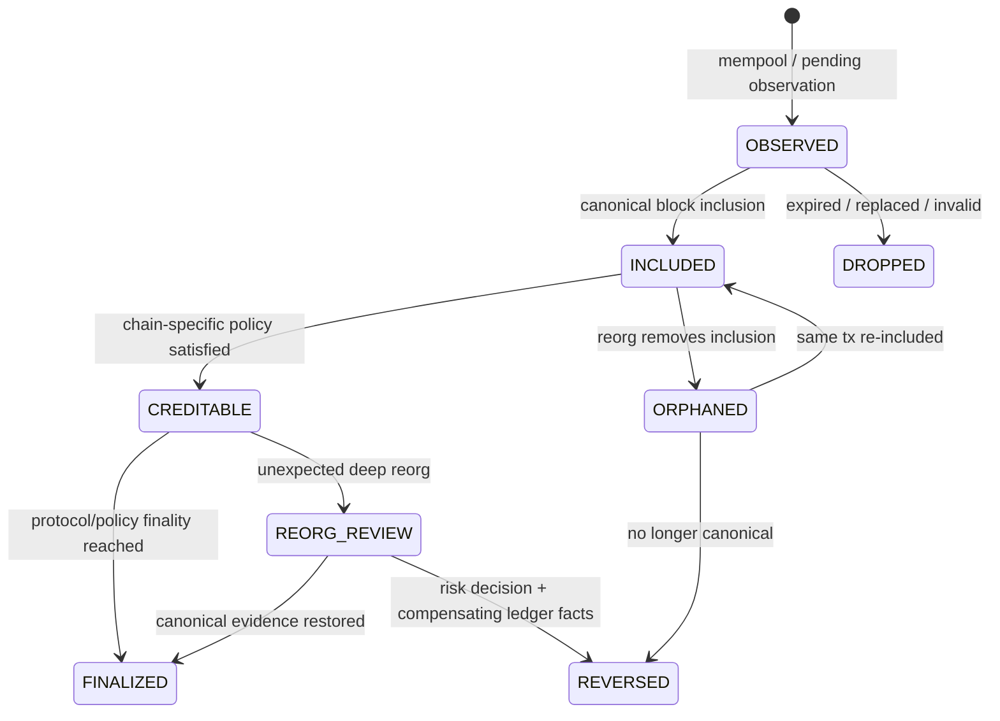
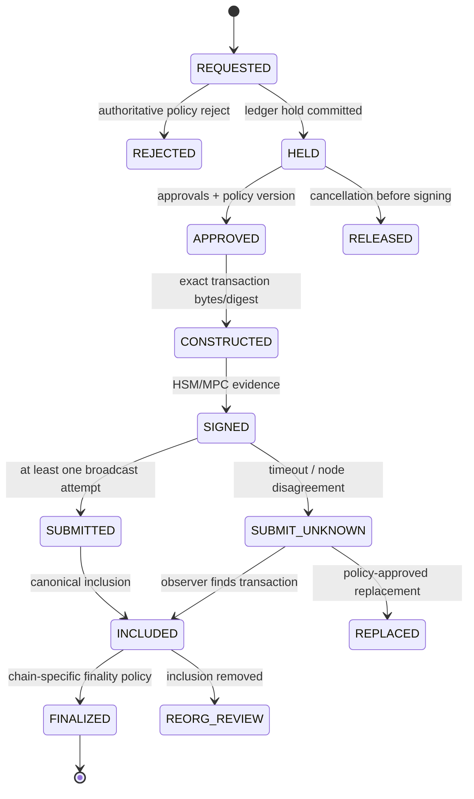

一家交易平台的内部账本可能始终借贷平衡，用户余额合计也可能与“托管总额”报表一致，但这仍然不能证明平台控制着足够的链上资产。原因很简单：账本证明的是平台承认了多少负债；区块链、托管人和密钥控制记录证明的，才是资产在哪里、能否被合法花费。若两类证据被压成一个 `balance`，重复入账、链重组、签名泄露或提现广播未知都可能长期隐藏。

本文的论点是：**数字资产托管必须同时维护“账本权利义务”和“可验证资产控制”两条独立事实链，并通过充值、提现和周期性三方对账把它们闭合。** 链上交易出现、内部账本记账和最终可用性不是同一时刻；签名完成、广播成功和链上终局也不是同一状态。

这是 Trading 路径 Chapter 18。阅读前应先理解 [交易账本与双重记账](/signal-grid-blog/posts/trading-ledger-double-entry-accounting-and-reconciliation/)；下一章将进入 [保证金指标、标记价格与风险率](/signal-grid-blog/posts/margin-metrics-and-mark-price/)。本文以账户型链与 UTXO 型链的共同边界为主，不把某条链当前的确认数、finality、手续费或地址格式写成跨链常量。

> 本文讨论托管系统工程，不构成投资、法律、税务、会计或合规建议。充值确认、资产隔离、Travel Rule、客户资产保护、密钥托管与记录保留要求因法域、牌照、链和托管安排而异，生产合同必须引用目标业务日期生效的协议规则、监管要求和服务协议。

## 账本平衡只证明负债闭合，不能证明资产存在

托管平台至少同时面对三种余额：客户账本负债、平台控制的链上资产，以及由外部托管人代持的资产。它们的计量口径和权威来源不同。

| 事实层   | 典型对象                                | 权威证据                             | 能证明什么                 | 不能证明什么                           |
| -------- | --------------------------------------- | ------------------------------------ | -------------------------- | -------------------------------------- |
| 客户账本 | available、locked、pending withdrawal   | 已提交双重记账分录                   | 平台对客户承认的权利义务   | 对应币是否真的在链上                   |
| 托管控制 | 地址余额、UTXO 集、账户 nonce、签名策略 | 独立节点观察、钱包清单、密钥控制证据 | 哪些资产位于平台控制域     | 资产是否应归属于某位客户               |
| 外部托管 | omnibus/sub-account、冻结与可提额度     | 托管人报表、API 与法律账户映射       | 外部服务方承认的持仓与状态 | 托管人是否有链上足额资产，除非另有证据 |

因此，“储备”不能由内部数据库自证。一个最低限度的资产负债恒等式可以写成：

```text
controlledOnChainAssets
+ externallyCustodiedAssets
- platformOperationalLiabilities
- restrictedOrUnspendableAssets
>= customerLedgerLiabilities + requiredReserves
```

这个式子仍需明确 `asOf`、资产单位、链、token 合约、估值规则和可花费条件。一个已被锁定、质押、跨链桥托管或受法务冻结的余额，不能在没有规则依据时与热钱包可用余额等价相加；同名 ticker 也不能证明是同一链上资产。



图中三条输入必须独立取得。若链上余额和内部账本都由同一个钱包数据库导出，一个错误投影可以同时污染“资产”和“对账”，产生虚假的一致。

工程上应保留一个版本化 `CustodyAssetKey`：

```text
(networkId, assetContractOrNativeId, tokenStandard, decimals, custodyDomain)
```

而不是用 `symbol=USDT` 作为主键。资产映射变更、token 迁移和链分叉都要通过新版本生效，历史分录继续引用当时的键与小数精度。

## 地址只是路由入口，Memo 与账户映射才决定归属

链上只认识协议对象，不认识平台用户。地址型链可能为每位用户派生独立地址，也可能多人共享一个充值地址、再用 Memo、Tag 或 calldata 区分；UTXO 链则可能从扩展公钥派生大量地址并在归集后失去“每地址一用户”的表面对应。内部归属必须由版本化映射证明：

```text
DepositRouteVersion {
  routeId,
  networkId,
  assetKey,
  address,
  memoOrTag?,
  customerAccountId,
  validFrom,
  validTo?,
  derivationDescriptorRef?,
  riskPolicyVersion,
  proofOfControlRef
}
```

匹配键必须服从具体链协议：有的地址大小写带校验，有的 Memo 是字符串，有的 destination tag 是整数，有的 token 转账需要解析合约事件。先把用户输入“规范化”成一个猜测值再匹配，可能把本应人工处理的充值错误归给另一账户。

正确的入口顺序是：

1. 先按 `networkId + canonical transaction identity` 去重原始观察；
2. 验证交易是否真的转移目标资产到受控 route，而不是只看交易的 `to`；
3. 按当时有效的地址、Memo/Tag 与资产版本解析归属；
4. 无唯一匹配时进入 `UNATTRIBUTED`，不得自动记到“最像”的账户；
5. 人工补录必须产生带授权人、依据和原始证据引用的新归属事实。

地址复用也带来隐私和运维风险。Bitcoin 开发者文档在交易说明中建议避免密钥/地址复用；生产钱包还要把派生区间、gap limit、地址状态和备份恢复合同绑定，避免恢复后漏扫已经分配但未使用的地址。[Bitcoin 交易开发指南](https://developer.bitcoin.org/devguide/transactions.html)说明 UTXO 由前序交易输出的 `txid + output index` 标识；这也意味着“地址余额”只是 UTXO 投影，不是可用于花费与对账的最细身份。

## 充值不是看到交易就入账，而是逐步收敛 canonicality 风险

充值至少经历 `OBSERVED -> INCLUDED -> CREDITABLE -> FINALIZED`。这些状态不是为了给 UI 增加文案，而是表达链上事实可能被替换的程度：



PoW 链的确认深度通常只降低被重组的概率，不创造绝对终局；PoS 链可能区分 head、safe 和 finalized，但节点实现、网络状态与协议升级仍决定这些标签的具体语义。[Bitcoin 区块链指南](https://developer.bitcoin.org/devguide/block_chain.html)解释了区块通过前序块哈希连接、交易输出分为已花费与 UTXO，也说明分叉会使旧分支区块失效。[Ethereum PoS 文档](https://ethereum.org/developers/docs/consensus-mechanisms/pos/)则给出其验证与 finality 模型。这些机制不能被统一成“所有链等 12 个块”。

平台可以在协议 finality 之前按风险政策提前给客户可交易额度，但必须把它记成平台承担的信用决定：

```text
onChainState = INCLUDED_NOT_FINAL
ledgerCreditState = PROVISIONAL_AVAILABLE
riskOwner = DEPOSIT_CREDIT_POLICY
reversalCapability = defined
```

若该充值随后被 Reorg 移除，系统不能删除原分录。应追加冲正或冻结事实，并处理客户已经成交、提现或转移造成的二阶负债。只重扫链上数据库却不重放账本后果，会让资产观察恢复正确而客户余额仍错误。

链观察器还应至少交叉核对两个独立节点或受控数据源，并保存 `(blockHash, blockHeight, txIndex, eventIndex)`。仅按 `txHash` 去重不总是足够：事件型 token 一笔交易可以产生多个转账；重组后同一交易也可能在新块重新出现。幂等键必须对应真正的资产转移事件。

## 密钥控制是权限协议，冷热钱包与 HSM/MPC 只是实现手段

“私钥在 HSM 里”不是完整托管安全论证。FIPS 140-3 规定的是密码模块及其接口、角色认证、敏感参数管理、自检和生命周期保证等安全要求；[NIST FIPS 140-3](https://csrc.nist.gov/pubs/fips/140-3/final)并不替业务系统决定谁有权发起哪笔提现，也不证明整条钱包系统符合某法域的托管要求。

同理，MPC/threshold signing 可以避免在单点重构完整私钥，但不能自动消除以下风险：

- 多个 share 被同一管理面、云账户或部署流水线同时控制；
- 所有参与方对同一个恶意交易盲签；
- 策略引擎、地址白名单或解析器被篡改；
- 备份恢复后 share 代际、参与者集合与链上公钥不一致；
- 签名完成但广播与账本命运未知。

真正的控制合同应把“能签名”拆成可审计的职责：

| 阶段       | 所需权威                 | 关键证据                                          | 失败时不得做什么                       |
| ---------- | ------------------------ | ------------------------------------------------- | -------------------------------------- |
| 提现意图   | 客户认证、账户与合规策略 | immutable request、认证上下文、规则版本           | 未裁决就生成可广播交易                 |
| 资金预留   | 账本与并发额度           | hold 分录、稳定 requestId                         | 只扣 available、不记 pending liability |
| 交易构造   | 链适配器                 | inputs/nonce、fee、destination、payload digest    | 签名后悄悄替换任何字段                 |
| 审批       | 分权策略                 | approver set、policy result、时间与设备身份       | 审批人和签名人共享不可见上下文         |
| 签名       | HSM/MPC signer           | exact digest、key epoch、attestation/audit record | 只保存“签名成功”布尔值                 |
| 广播与确认 | broadcaster + observer   | raw tx、tx identity、节点响应、canonical evidence | 把 RPC 成功写成最终完成                |

热钱包适合受限额度的在线流量，冷钱包用更强隔离换取较慢操作；二者之间的补充和回收本身也是资金转移协议。每日限额、单笔限额、目的地址策略、双人审批与紧急停止应按钱包域和 key epoch 生效，不能只有一个全平台布尔开关。

## 归集、Gas、Nonce 与 UTXO 让“可用余额”成为调度问题

链上总余额足够，不代表下一笔提现能构造出来。账户型链可能缺支付手续费的原生资产，nonce 队列可能被一笔低费交易阻塞；UTXO 型链可能只有大量尘埃、小 UTXO 被并发预留，或缺少满足手续费与隐私约束的输入集合。

[Ethereum 交易文档](https://ethereum.org/developers/docs/transactions/)把 nonce 定义为账户按序递增的交易计数。它不是“每次请求随便取最新值再加一”；多 broadcaster 并发时必须由单一所有者或带 fencing 的租约分配：

```text
NonceLease {
  networkId, address, keyEpoch,
  fencedOwnerEpoch,
  nextNonce,
  leasedRange,
  sourcePendingNonce,
  lastCanonicalNonce,
  recoveryCursor
}
```

相同 nonce 的替换交易、交易长时间 pending、节点 mempool 差异和重启恢复都要求保留“nonce 槽位 -> 候选交易版本”链。只保存最新 `txHash` 会丢掉被替换版本，链上若确认旧版本，账本就无法解释。

UTXO 钱包则需要原子 coin selection reservation：

```text
AVAILABLE -> RESERVED(withdrawalId, leaseEpoch) -> SIGNED -> SUBMITTED -> SPENT
                      \-> RELEASED only if "no signature was issued" is proven
SIGNED / SUBMITTED -> SUPERSEDED only after a canonical replacement/conflict consumes the inputs
```

Bitcoin 的 UTXO 模型要求每个输入引用一个未花费输出，输入价值不足会使交易无效，多余价值通常形成 change 或手续费。并发构造若挑中同一 UTXO，会产生双花候选；其中一笔广播失败也不代表可以立刻释放，因为另一节点可能已经收到它。只要有效签名交易仍可能被广播，就不能把 inputs 重新分给不相关提现；要释放或改派，必须证明从未产生签名，或者让一个经授权的 replacement/conflict 在规范链上消费这些 inputs，使旧候选确定失效。

归集同样不是“把小余额扫到大地址”这么简单。系统应同时优化手续费、热钱包暴露、UTXO 碎片、nonce 堵塞、隐私和提现 SLA，并把每次归集当作平台内部资产转移：有独立 `transferId`、分录、链上状态和对账，不应从客户负债中凭空消失。

## 提现要先冻结账本权利，再生成不可变的签名内容

提现流程必须在同一业务身份下跨越账本、策略、签名与链上系统。一个可恢复状态机如下：



从 `CONSTRUCTED` 开始，目的地址、Memo、金额、资产、chain id、inputs/nonce、手续费上限和合约 calldata 都属于被审批的签名内容。任何变化都必须产生新 `transactionVersion` 并重新经过所需审批；不能把“只提高 gas”当成与资产控制无关的小修改。

账本也不应在广播后才第一次扣款。接受提现时先做内部转账：

```text
Dr customer.available liability
Cr customer.withdrawal_pending liability
```

链上最终完成后，再把 pending liability 与托管资产流出相匹配；拒绝或在可证明未签名前取消，则追加逆向分录。手续费由客户承担、平台承担或分摊，都应是显式费用事实，不能靠 `onChainAmount != requestedAmount` 推测。

审批系统还应控制批量交易。一个 batch 可能包含多个客户提现和 change，单个输出失败未必能独立撤销；其账本命运必须通过 `batchId + outputIndex` 关联到客户请求，并定义替换、拆批和重建规则。

## 广播成功只证明节点响应，结果未知必须等待链上裁决

节点 RPC 返回 `txHash`，最多证明某个节点按其接口合同接受或识别了交易；它不证明交易已传播、被打包、执行成功或最终不可逆。账户型智能合约链还可能出现“交易已上链但合约执行失败”，其 nonce 与 gas 已消耗，资产却没有按预期转移。

因此提现不能只有 `SUCCESS/FAILED`：

| 观察                      | 合法结论                     | 不合法的跳跃             |
| ------------------------- | ---------------------------- | ------------------------ |
| 签名成功、尚未调用节点    | 存在可广播交易               | 提现失败或完成           |
| RPC 接受并返回 hash       | 至少一个节点接受/已知        | 资产已到账               |
| RPC timeout               | 广播结果未知                 | 安全重用 nonce/UTXO      |
| mempool 可见              | 交易在观察节点待确认         | 一定会被打包             |
| canonical block inclusion | 当前规范链包含它             | 已达到业务 finality      |
| receipt success           | 合约执行在当前规范链成功     | 收款方已满足全部业务条件 |
| policy finality           | 达到该链与风险策略的完成条件 | 法律结算在所有法域完成   |

`SUBMIT_UNKNOWN` 的恢复步骤是用**同一签名交易身份**查询多个节点、mempool 和 canonical chain，再按链规则决定重播、费率替换或冲突处理。绝不能因 HTTP 超时重新构造一笔新 nonce/新 inputs 的同额交易，否则原交易与新交易都可能生效。

对于账户型链，替换策略要记录 `(from, nonce)` 下所有候选 hash；对于 UTXO 链，要记录所有花费同一 inputs 的候选版本。最终观察到哪个版本 canonical，才由哪个版本驱动资产分录和客户回报。另一个候选被节点拒绝不是独立的提现失败，而是同一提现版本链的一部分。

## 三方对账以同一 cut 重建资产、托管与账本，而不是比较三个总数

可靠对账至少有三条腿：

1. **链上腿**：由独立节点按固定 block hash/height 重建受控地址、UTXO、pending 与受限资产；
2. **托管腿**：外部托管人的账户、冻结、可用、在途和 statement 版本；
3. **账本腿**：客户负债、平台自有余额、充值 pending、提现 pending、费用与内部归集分录。

三者必须使用同一资产主键和可解释的 cut。把 UTC 00:00 的账本余额与稍后十分钟的链上 head 比较，会把正常在途交易制造成差异。一个对账运行应不可变记录：

```text
CustodyReconciliationRun {
  runId,
  assetKey,
  ledgerCommitId,
  chainBlockHash,
  chainHeight,
  externalStatementId?,
  addressSetVersion,
  keyEpochSet,
  valuationAndRestrictionRuleVersion,
  observedAt,
  artifactsDigest,
  status
}
```

差异也要按身份解释，而不是人工填一个 adjustment 让总数相等：

| 差异类型           | 可能原因                                  | 安全处置                  | 关闭证据                            |
| ------------------ | ----------------------------------------- | ------------------------- | ----------------------------------- |
| 链上多、账本少     | 未归属充值、平台自有资金、漏记托管转入    | 隔离到 suspense，不猜客户 | route/ownership 事实与补充分录      |
| 账本多、链上少     | 重复充值、未记录提现、密钥损失或资产受限  | 冻结相关提现并升级事件    | 权威资产恢复或经批准的损失/负债处置 |
| pending 长期不闭合 | nonce/UTXO 阻塞、节点遗漏、托管人结果未知 | 按交易身份重放观察        | canonical/托管回执与账本投影一致    |
| 同 ticker 数量不等 | 链/合约/decimal 映射错误                  | 停止跨资产净额抵消        | 主数据修复、历史重算与独立复核      |

通过条件不是“差额小于某个随意阈值”，而是每个差异都有责任域、稳定身份、时间线与权威关闭证据。金额阈值可以决定升级级别，却不能把无法解释的资产缺口变成正确。

这一章最终建立了三项边界：双重记账证明内部权利义务闭合，不证明链上足额；密钥或 MPC 能力证明某个策略域可以签名，不证明提现已经执行；节点广播和确认是逐步收敛的链上证据，不等于无条件终局。只有地址与资产身份、链上 canonicality、签名版本、账本分录和三方对账运行能够相互追溯，平台才有资格说明某笔充值为何可用、某笔提现是否完成，以及资产负债在给定 cut 上是否真正闭合。

下一章 [保证金指标、标记价格与风险率](/signal-grid-blog/posts/margin-metrics-and-mark-price/) 将在此基础上讨论：当资产可以被可靠计量后，风险系统怎样把抵押品、负债和价格转换为可执行的保证金约束。
