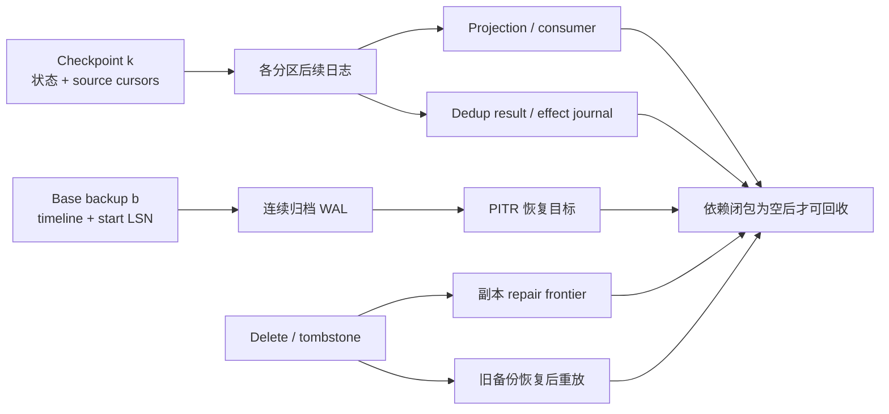
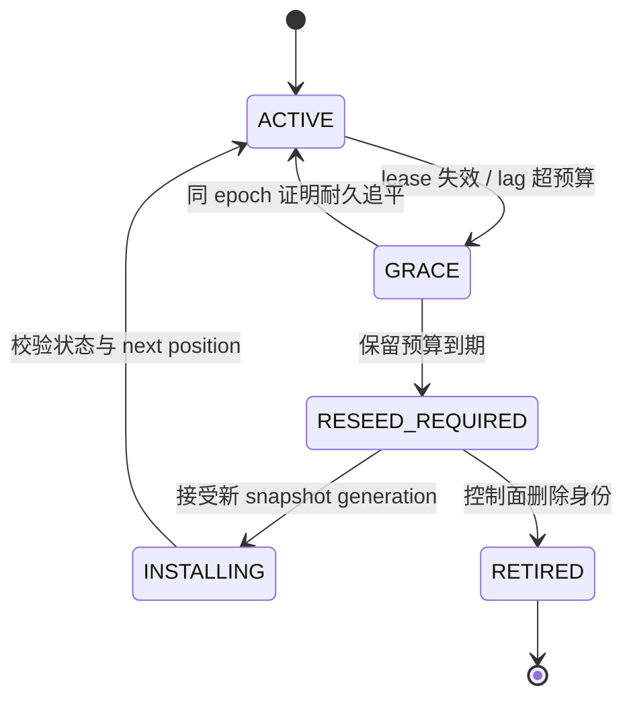

磁盘用了 80%，把七天前的日志删掉似乎只是容量管理；消费者都报告 offset 以后，取一个最小值似乎就能得到截断点；幂等键已经保留 24 小时，过期后清掉似乎也只是 TTL。真正危险的事故往往就从这些“似乎”开始。

日志、快照、消费位点、幂等结果和墓碑不是互相独立的旧文件。它们共同证明一件事：系统仍能从某个可信状态恢复，并且恢复后不会重做已经发生的副作用、漏掉尚未投影的事件，也不会让已经删除的数据复活。删除其中一项，可能同时切断几条恢复路径。

本文要论证的命题是：**历史只有在所有受支持的恢复、重放、重试、修复与审计路径都不再依赖它，而且这份“不再依赖”的事实已经持久化并受代际约束时，才可以删除。** 本文把这份证明抽象为 **Recovery Frontier**。它是本文使用的通用工程模型，不是某个产品里同名的单一配置项。

本文位于 Availability 路径中[分布式快照与一致检查点](/signal-grid-blog/posts/distributed-snapshots-consistent-checkpoints-barriers-recovery-cursors/)之后、[备份与 PITR](/signal-grid-blog/posts/backup-pitr-disaster-recovery-and-restore-drills/)之前。前者回答“哪些状态与 cursor 构成一致恢复点”，后者回答“灾难后保留哪些独立恢复材料”；本文专门回答它们之间最容易被忽略的问题：**哪些旧材料已经被新的恢复证据完整替代。**

通用模型不绑定具体存储引擎；产品事实以 Raft 扩展论文、写作时的 PostgreSQL 18、Apache Kafka 4.3、Apache Cassandra 5.0.9 与 Stripe API v1 官方资料为界。它们用于检验模型，某个产品的默认保留时间或字段名不应被外推成分布式系统定律。

## 1. 删除历史是一条正确性协议，不是一个按时间运行的清理任务

先区分几类外观看起来都叫“历史”的对象：

- 复制日志、WAL、Commit Log 与 CDC 段，保存状态转移；
- Snapshot、Checkpoint 与 Base Backup，保存某个切面上的状态；
- Consumer、Projection、Outbox Relay 与副本的 cursor，声明读取或持久化到了哪里；
- Dedup Claim、请求指纹与结果记录，裁决一次重试是不是旧操作；
- Tombstone、撤销事件和过期标记，保存“某个值不应再存在”的负面事实；
- Timeline、Schema、配置、密钥版本与 Manifest，解释其他字节属于哪段历史。

一个对象“很旧”只描述它与墙钟的关系，没有说明还有没有合法读者。安全回收必须先声明故障模型和产品承诺：允许节点离线多久？消费者能否从任意旧位置恢复？幂等重试窗口多长？PITR 承诺覆盖多少天？旧备份是否仍可被恢复？审计与法律保留是否允许销毁？这些问题的答案不同，同一份字节的删除结论也会不同。

设历史对象为 `x`，最保守的安全谓词可以写成：

```text
SafeToDelete(x) =
    SupersededByDurableEvidence(x)
  ∧ x ∉ Closure(SupportedRecoveryBases)
  ∧ x ∉ Closure(ActiveReadersAndReplicas)
  ∧ x ∉ Closure(ValidRetriesAndUnknownResults)
  ∧ x ∉ Closure(RepairAndNegativeKnowledge)
  ∧ x ∉ PolicyOrAuditHold
  ∧ ReclaimDecisionIsDurableAndFenced(x)
```

这里的 `Closure` 是依赖闭包：不仅看谁直接引用 `x`，还要沿着恢复链继续追踪。例如一个 Base Backup 引用起始 WAL，一个 Projection Cursor 引用输入分区，一个 Dedup Result 又可能引用账本序号；只检查第一层引用会遗漏真正的恢复前提。

因此，“超过保留天数”最多是一个**候选条件**。它可以触发重新计算证明，但不能自己充当证明。

## 2. Recovery Frontier 是带类型的依赖切面，不是一个全局最小 offset

最容易实现的错误模型是：收集所有组件报告的位置，然后执行 `min(offset)`。它只在所有位置都属于同一条、同一代、同一语义的全序日志时才有意义；真实系统通常不满足这个前提。

下面这些位置不能直接比较：

- `orders-7@offset=420` 与 `payments-2@offset=910` 属于不同分区；
- Raft 的 `(term=12, index=800)` 与 PostgreSQL 的 `(timeline=4, LSN=...)` 属于不同历史域；
- Checkpoint 保存的是“下一条要读的位置”，Snapshot 记录的可能是“最后一条已应用的位置”；
- 幂等键的失效边界是 API 合同与操作身份边界，不是消息 offset；
- Tombstone 的安全回收依赖副本修复与旧备份恢复路径，不只依赖前台消费者；
- 审计保留按业务事件、主体或法规分类，未必能映射为一个连续日志前缀。

更合适的表示是一个带类型的向量与依赖图：

```text
RecoveryFrontier F = {
  log[(stream, partition, epoch)]       -> firstRequiredPosition,
  snapshot[(stateOwner, generation)]   -> includedPosition,
  reader[(readerId, inputDomain)]       -> nextRequiredPosition | RESEED_REQUIRED,
  replica[(memberId, shard, epoch)]     -> durablePosition | REBOOTSTRAP_REQUIRED,
  dr[(site, channel, failoverEpoch)]    -> durableVerifiedRemotePosition | RESEED_REQUIRED,
  retry[(namespace, contractVersion)]   -> oldestValidOperationIdentity,
  repair[(keyRange, replicaSetEpoch)]   -> repairedThrough,
  backup[(timeline, recoveryClass)]     -> oldestSupportedRecoveryPoint,
  hold[(policy, scope)]                 -> retainedObjects
}
```

这里的 frontier 不是“已经处理到哪里”的仪表盘值，而是“从哪里开始，仍可能被合法路径需要”的边界。每个分量必须携带自己的 domain、epoch/generation 和包含端点语义。只有在显式映射存在时，两个域才能建立先后关系。

对某个日志域，若 `firstRequiredPosition=p` 表示位置 `p` 仍要保留，那么 `position < p` 的对象也只是候选；它还必须通过其他域的依赖闭包检查。反过来，控制器不能因为另一个分区的数字更大，就删除本分区的位置。类型和代际必须先相同，数值比较才有意义。



这张图说明 frontier 更像一个 consistent cut：切面之后的每条受支持路径都必须拥有完整输入，切面之前才可能成为删除候选。对某个分区取最小 cursor 仍然有用，但它只是向量的一个分量，不是整个系统的垃圾回收答案。

## 3. Snapshot 只有和连续日志组成恢复基座，才能替代旧历史

快照完成不等于它之前的日志立刻可删。一个可用的 **recovery basis** 至少要包含：

```text
RecoveryBasis(target) =
  可验证的状态基线
  + 从基线边界到 target 的连续日志链
  + 解释这段历史的 epoch/timeline、Schema、配置与密钥
  + 尚未决议的外部副作用及其对账位置
```

对状态机复制，Snapshot 必须证明自己只覆盖已提交、已应用的前缀，并保留把后续日志接回来的身份。Raft 原论文的快照包含 `lastIncludedIndex`、`lastIncludedTerm` 和当时的集群配置；本地快照持久完成后，节点才可以删除不晚于该 index 的日志。若 Leader 已删除某个 Follower 需要的下一条日志，则通过 `InstallSnapshot` 重新建立基线，而不是假装还能增量追赶。[Raft 扩展论文](https://raft.github.io/raft.pdf)给出的正是这条“快照替代前缀、快照安装替代过旧追赶”的边界。

对 PITR，恢复基座不是单个最新备份。PostgreSQL 官方文档明确要求：连续归档恢复需要一个文件系统级 Base Backup，以及至少从该备份开始处连续延伸的 WAL；只有这条链完整，才能在基线之后选择停止点。[PostgreSQL 18 Continuous Archiving 与 PITR](https://www.postgresql.org/docs/18/continuous-archiving.html)也因此把 Base Backup 与 WAL Archive 作为组合，而不是两种互不相关的保留任务。

于是，删除旧 WAL 之前必须回答两个不同问题：

1. **在线恢复**：现有 Snapshot/Checkpoint 是否已经耐久，所有仍被支持的副本和消费者能否从它或更晚基线继续？
2. **历史恢复**：RPO/PITR 承诺中的每个目标区间，是否仍至少有一条完整且已验证的 `base → logs → target` 路径？

假设保留三个周备份 `B1 < B2 < B3`。虽然 `B3` 最新，合规策略可能仍承诺恢复到 `B1` 之后的某一天；此时 `B1` 与通向目标日的日志链仍在依赖闭包中。只有先缩短承诺、让该恢复类过期，或提供另一条覆盖同一区间的完整恢复基座，才可以删除它们。

### 快照发布必须是原子的事实

快照文件写完、上传完成、Manifest 发布和控制面采用是四个不同事件。安全实现应让 Manifest 至少包含：

- generation 与 source epoch；
- 状态 checksum、大小、分片清单与格式版本；
- 每个输入域的 included/next-required 位置及端点语义；
- 所需 Schema、配置、密钥和外部副作用 cursor；
- 完整性验证状态与创建者 fencing token。

只有 Manifest 以原子方式进入权威元数据，并且读取者能从它解析出完整基座，Snapshot 才能推进 frontier。孤立在对象存储中的一组“上传成功”文件不能替代日志。

## 4. 消费者和副本只能用耐久位置保留历史，过期参与者必须转入重建路径

一条日志往往同时服务在线副本、异步索引、CDC、审计导出和临时分析。每个读者报告的位置都必须回答三个问题：

1. 这是 `received`、`processed`、`applied`，还是已经 `fsync/commit` 的位置？
2. 位置属于哪个 `(stream, partition, epoch)`，端点是“最后已完成”还是“下一条需要”？
3. 这个读者仍在支持范围内，还是已经被明确废弃并要求重新引导？

只有**耐久完成**能推进保留边界。消费者先在内存中处理到 `p`，随后上报 `p`，但业务状态与 cursor 尚未原子持久化；若日志按该上报删除，崩溃后它既没有结果也没有输入。正确的 cursor 要么与投影状态在同一事务中提交，要么由一致 Checkpoint 把二者绑定。

异步灾备链路也不能把 `queued`、`sent` 或远端仅收到的字节当成复制完成。`dr` 分量只有在远端独立故障域已经持久化数据与 Manifest、重新读取并验证完整性，而且该位置属于当前 `failoverEpoch` 时才能推进。远端证据过期或 failover/failback 改变历史代际后，旧位置只能触发重新建基线，不能继续为本地历史回收背书。

PostgreSQL 的 replication slot 是一个具体例子：它让 Primary 保留 Standby 或逻辑消费者仍可能需要的 WAL，即使消费者断开；官方同时警告，失联 slot 可以让 `pg_wal` 持续增长直至占满空间。配置上限后，如果 slot 落后过远，所需 WAL 可能被删除，slot 随之不再可用。[PostgreSQL 18 Replication Slots](https://www.postgresql.org/docs/18/warm-standby.html#STREAMING-REPLICATION-SLOTS)展示了一个重要取舍：系统不必为失联读者无限保留历史，但必须把结果表达成“旧读者已失去增量恢复资格”，而不是仍宣称它可以从旧 cursor 续读。

因此，参与者状态机应是显式的：



当节点进入 `RESEED_REQUIRED` 后，它的旧 cursor 不再阻塞日志 GC；代价是它回来时必须安装受信 Snapshot、校验 generation，再从新位置追赶。旧实例还必须被 fencing：它不能拿着旧 epoch 重新成为写者，也不能用过期位置把 frontier 向后拖。

这让“无限保留”和“静默丢历史”之间出现一条可控路径：容量预算耗尽时，牺牲某个参与者的增量追赶能力，而不是牺牲整个集群的磁盘，或伪造它仍可恢复。

## 5. Dedup 生命周期必须覆盖合法重试与 Unknown，而不只是缓存命中率

幂等记录保存的不是普通缓存，而是对一次操作身份的裁决。典型记录至少包含：

```text
(scope, idempotencyKey) -> {
  requestHash,
  state: CLAIMED | COMMITTED | REJECTED,
  operationId,
  authoritativeEffectPosition,
  responseOrResponseReference,
  contractVersion,
  expiresAt
}
```

请求可能已经提交副作用，但响应在网络中丢失。此时客户端看到的是 `Unknown`：它不知道“没有执行”，还是“执行成功但响应丢了”。如果服务端先清掉 dedup 记录，随后把同一个 key 当成新请求执行，就可能发生二次扣款、二次下单或二次发货。

所以 dedup 的最短安全寿命不是一个孤立 TTL，而应覆盖。若下面各项可以顺序发生，就必须取它们的最坏路径总和；若产品合同证明它们重叠，才可以取相应最大值：

```text
dedupHorizon >=
  合法客户端重试/离线队列的最坏时间路径
  + 服务端不可用与恢复时间
  + 尚未包含在前两项中的 Unknown 查询和副作用对账时间
  + 时钟与调度安全余量
```

更精确地说，服务必须让“旧操作身份不可再合法提交”与“删除其裁决记录”形成先后关系。实现上有三种常见边界：

- 在合同窗口内保留完整结果，重试返回同一结果；
- 结果正文可以更早转冷，但保留紧凑的 `key + requestHash + finalState + operationId`，重试返回可查询的权威 operation；
- 窗口结束后，协议拒绝旧代际 key，返回 `IDEMPOTENCY_WINDOW_EXPIRED`，而不是把它悄悄解释为新操作。

[Stripe 的幂等请求文档](https://docs.stripe.com/api/idempotent_requests)是一个具体而非通用的合同示例：API v1 保存第一次开始执行后的状态码与响应，并允许至少 24 小时后清除 key；key 被清除后再次使用会被视为新请求。这恰好说明“24 小时”不是幂等性的数学常数，而是客户端必须知道并遵守的服务语义。

Dedup Verdict 还必须与业务状态转移建立原子关系：它们可以位于同一数据库事务、同一复制状态机命令，或由持久化 operation/effect journal 连接。若副作用已经提交而 Claim 仍停在临时内存，任何保留窗口都无法修复这个原子性空洞。

### 结果与去重标记可以分层回收

大响应体、错误详情和审计附件不必与去重裁决保留同样久。可以把记录拆成：

```text
Result Blob      -> 用于原样返回，可较早转冷或按隐私策略删除
Dedup Verdict    -> 防止同 key 再次产生副作用
Effect Journal   -> 证明 operationId 对应的权威副作用
Key Epoch Fence  -> 让过期客户端不能把旧 key 当新 key 使用
```

但拆分后必须保持引用完整。若 `Dedup Verdict` 仍指向已删除结果，协议要返回明确的“结果已过期，但操作已提交”，并携带可查询的 `operationId`；不能因为无法重放原响应就再次执行。相反，如果 API 承诺无限期接受相同 key，却没有永续裁决存储，那么它给出了无法实现的幂等保证。

## 6. Tombstone 保存的是负面知识，必须等修复与旧恢复路径都越过它

值可以通过 Snapshot 替代，删除却要额外防止**复活**。Tombstone 的含义不是“这里没有数据”，而是“所有早于版本 `v` 的同 key 数据都已被删除”。只要某个合法来源仍可能带回旧值，这条负面知识就仍在依赖闭包中。

旧值可能来自：

- 删除发生时离线、尚未接收 Tombstone 的副本；
- 超过保留窗口后才恢复的 CDC 或 compacted-log 消费者；
- 删除之前制作、后来被用于灾备恢复的旧 Snapshot/Base Backup；
- 未完成 anti-entropy/repair 的 SSTable 或离线介质；
- 跨地域镜像、缓存回填或人工导入任务。

Apache Cassandra 将删除写成带时间戳的 Tombstone。官方文档说明，如果副本离线太久、未接收删除，而 Tombstone 已在其他副本被清理，后续 repair 可能把旧值作为“仍存在的数据”传播回来；因此 repair 至少要在未修复数据越过 `gc_grace_seconds` 前完成，或使用只清理已修复 Tombstone 的约束。[Cassandra 5.0.9 Tombstone 与 Compaction 源文档](https://github.com/apache/cassandra/blob/cassandra-5.0.9/doc/modules/cassandra/pages/managing/operating/compaction/overview.adoc)给出了这一 zombie 数据机制。

Kafka compacted log 也保留同类边界：key 的 `null` value 是 delete marker，旧值会被压缩掉，delete marker 自己则可在保留期后清理。官方保证要求从日志起点重建的消费者必须在 `delete.retention.ms` 窗口内追到 head，才保证能观察到全部 delete marker；落后更久的消费者可能错过删除。[Kafka 4.3 Log Compaction Design](https://kafka.apache.org/43/design/design/#log_compaction)因此不能被解读为“压缩后任何旧消费者都能重建当前状态”。

安全回收 Tombstone 至少需要同时满足：

```text
TombstoneEligible(key, version) =
    repairFrontier[keyRange, replicaSetEpoch] >= version
  ∧ everySupportedReaderHasCrossed(deletePosition)
  ∧ everySupportedRestoreBasisEither
      (includes the deletion)
      or (retains a continuous replay path through the deletion)
  ∧ no stale writer/read-repair source can reintroduce an older version
```

特别要注意旧备份：把删除之前的备份恢复出来并直接对外服务，会绕过在线集群已经完成的 Tombstone GC。正确恢复流程必须继续重放穿过删除位置，或在隔离环境完成与权威状态的差异校验；“备份文件能启动”不是删除不会复活的证据。

## 7. Frontier 必须先持久化、再标记、后回收，并对并发代际 fail closed

Recovery Frontier 本身也是有状态协议。若控制器只在内存里算出截断点，先删除 segment，随后在记录决定前崩溃，恢复后的系统既不知道删过什么，也无法证明剩余历史完整。正确顺序应让删除决定可重放、可审计且幂等。

一个最小的回收控制面可以使用如下记录：

```java
record DomainPosition(String domain, long epoch, long position) {}

record ReclaimManifest(
    long manifestVersion,
    long ownerEpoch,
    long dependencyCatalogRevision,
    Map<String, Long> sourceGenerations,
    Map<String, DomainPosition> firstRequired,
    Set<String> recoveryBasisIds,
    Set<String> expiredParticipantIds,
    Set<String> policyHoldIds,
    List<String> objectIds,
    String dependencyDigest,
    String state // PLANNED, MARKED, SWEPT
) {}
```

控制器不是直接对每个文件执行 `deleteIfOlderThan()`，而是走四个有顺序的状态转移：

1. **Compute**：从权威、耐久的 Snapshot Manifest、reader cursor、replica/DR 状态、dedup 合同、repair 证据、backup catalog 与 hold 记录计算依赖闭包，并把统一依赖目录的 `dependencyCatalogRevision` 与各域 `sourceGeneration` 固化进不可变候选集。
2. **Publish**：用 `(manifestVersion, ownerEpoch, dependencyCatalogRevision)` 的 compare-and-set 持久化 `PLANNED` Manifest；任何 Unknown、缺失域或代际不一致都使计算失败关闭。新增或恢复 reader、replica/DR 身份、hold、backup validation 与 dedup 合同的操作，必须推进同一权威目录修订号，或在同一事务中检查当前 frontier 不会把它落在已关闭范围。
3. **Mark**：在线性化事务中重验目录修订号与各域 generation 未变，关闭旧范围的新引用入口，并持久化 `MARKED`；任一修订变化都废弃 Manifest、重新计算。已有 reader 通过 generation/refcount 或 lease 完成排空。
4. **Sweep**：经过读者安全期并复核 Manifest 后物理删除，记录每个 object 的结果，最后将状态推进为 `SWEPT`。重复执行必须得到同一结果。

同一 epoch 内 frontier 只能单调前进。成员变更、Shard 迁移、恢复分叉或 Timeline 切换会产生新 epoch，新 epoch 必须重新建立域映射，不能把旧 epoch 的“最小安全位置”直接复制过来。`ownerEpoch` 只 fence 回收控制器；真正阻止“计算后新增依赖”的是统一目录修订号、各域 generation 与 Mark 事务共同建立的引用关闭边界。

### 故障矩阵把清理脚本变成可证伪的协议

| 注入点                                          | 若实现错误会发生什么               | 必须观察到的通过条件                                                      |
| ----------------------------------------------- | ---------------------------------- | ------------------------------------------------------------------------- |
| Snapshot 字节上传后、Manifest 发布前崩溃        | 孤立文件被当成恢复基座，旧日志被删 | frontier 不推进；孤立对象可回收，旧 basis 仍完整                          |
| Manifest 发布后、最后一段归档 WAL 复制前断网    | PITR 链中间断裂                    | archive evidence 未齐，相关 WAL 不进入候选集                              |
| 远端 DR durable ACK 前断网、本地随后触发回收    | 远端没有独立恢复基座               | `dr` frontier 不推进；本地仍保留日志或把远端标成 `RESEED_REQUIRED`        |
| failover/failback 切换后复用旧远端 cursor       | 跨代位置被错误比较                 | `failoverEpoch` 不匹配使旧证据失效，新代必须重新建立基线                  |
| Consumer 上报后、业务状态与 cursor 落盘前崩溃   | 恢复后需要已删输入                 | 只有原子持久的 cursor 推进 frontier                                       |
| Dedup 结果提交后响应丢失，跨回收窗口重试        | 同一副作用执行两次                 | 窗口内返回原裁决；窗口外拒绝旧 key 或用 operationId 解析，不重新提交      |
| 副本离线超过日志预算后携旧 epoch 回归           | 旧节点阻塞 GC 或重新提供旧状态     | 节点被 fence 并进入 `REBOOTSTRAP_REQUIRED`，从受信 Snapshot 重建          |
| Tombstone 清理前暂停一个副本，清理后执行 repair | 已删除值复活                       | repair frontier 未越过删除前，Tombstone 不可 sweep                        |
| 从删除前 Base Backup 恢复并尝试开放流量         | 旧状态绕过在线 GC 对外可见         | 必须重放穿过删除或完成权威对账，否则恢复门禁拒绝服务                      |
| Mark 与 Shard owner epoch 切换并发              | 旧控制器删除新 owner 所需对象      | CAS 失败；新 epoch 重算闭包，旧 Manifest 只能完成无害清理或被明确 abandon |

这些测试的 oracle 不是“GC 任务返回成功”，而是四条不变量：每个承诺恢复点仍存在至少一条完整 basis；每个合法 reader 都能续读或收到明确的 reseed 结果；每个合法重试都不会重复副作用；任何旧值都不能跨越 Tombstone 与 epoch fencing 重新成为权威状态。

## 8. 安全回收的边界：删除的是材料，不是尚未履行的承诺

Recovery Frontier 能保证的是：在声明的故障模型、恢复窗口、参与者集合和 API 合同内，被删除对象已不再是任何合法恢复路径的必要前提。它不能让无限 PITR、无限离线消费者、无限幂等重试和有限磁盘同时成立，也不能替代合规销毁、取证保留或隐私删除策略。

一条可靠的回收链具有明确因果顺序：先发布可验证的 Snapshot/Backup 与连续日志基座，再让读者、副本、Dedup 和 Repair 位置耐久越过旧历史；随后用带 epoch 的 Manifest 固化依赖闭包，最后才标记与物理清理。容量压力只能改变产品承诺或让落后参与者进入重新引导，不能把未知依赖自动解释成安全。

因此，真正值得监控的不是“删了多少 GB”，而是 frontier 为什么停住、由哪个域阻塞、如果强行推进会失去哪项恢复承诺，以及一次真实恢复能否从保留下来的 basis 到达预期状态。历史可删除的证明，最终必须能被下一次故障恢复重新验证。

## 9. 一手资料与产品边界

下面的资料支撑文中的具体产品行为；Recovery Frontier 向量、依赖闭包和回收状态机是从这些机制抽象出的通用设计，不声称是某份文档中的原名协议。

- Diego Ongaro、John Ousterhout：[In Search of an Understandable Consensus Algorithm（Extended Version）](https://raft.github.io/raft.pdf)
- PostgreSQL 18：[Continuous Archiving and Point-in-Time Recovery](https://www.postgresql.org/docs/18/continuous-archiving.html)
- PostgreSQL 18：[Log-Shipping Standby Servers — Replication Slots](https://www.postgresql.org/docs/18/warm-standby.html#STREAMING-REPLICATION-SLOTS)
- Apache Kafka 4.3：[Log Compaction](https://kafka.apache.org/43/design/design/#log_compaction)
- Apache Cassandra 5.0.9：[Compaction Overview — Tombstones](https://github.com/apache/cassandra/blob/cassandra-5.0.9/doc/modules/cassandra/pages/managing/operating/compaction/overview.adoc)
- Apache Cassandra 5.0.9：[Repair](https://github.com/apache/cassandra/blob/cassandra-5.0.9/doc/modules/cassandra/pages/managing/operating/repair.adoc)
- Stripe：[Idempotent Requests](https://docs.stripe.com/api/idempotent_requests)
