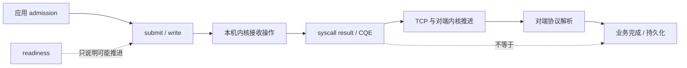
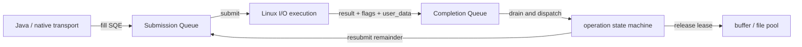
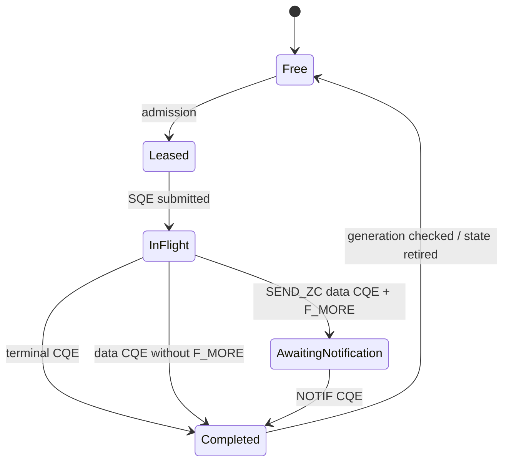
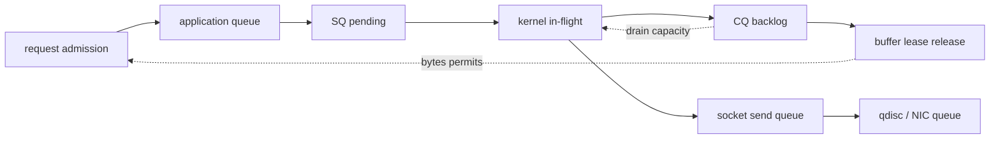

把 `Selector` 换成 io_uring，网络 I/O 就会从“轮询”升级成“异步”，系统调用会消失，数据也会自动零拷贝——这是一组很诱人的结论，但每一句都压扁了关键边界。

`Selector` 返回的是 **readiness**：某个操作现在可能推进；io_uring 的 CQE 返回的是某个已提交操作的 **completion**：这次操作已经以某个结果结束或推进。两者都不等于“完整业务消息已经处理”，也不等于“对端已经把结果持久化”。io_uring 还能把更多操作放进 flight，注册文件与 Buffer，使用 `SEND_ZC` 等路径减少复制；代价是应用必须维护更多尚未完成的身份、资源租约、取消竞态和完成队列容量。

因此，真正的问题不是“epoll 和 io_uring 谁更快”，而是：

> **在给定消息语义、负载形状、内核与硬件上，哪种机制能用最少的状态转换完成相同工作；提交以后，谁拥有 Buffer，何时可以复用，压力又怎样从最下游返回入口？**

这是“Java 低延迟工程”的 **Chapter 09**。上一章 [Java NIO 的真实数据路径](/signal-grid-blog/posts/java-nio-selector-socket-data-path-backpressure/) 已经完成 framing、partial read/write、`SelectionKey` 生命周期、`OP_WRITE` 与有界发送队列；本文不重写 event loop，而是从它停下的 socket 与 syscall 边界继续进入 completion 和 zero-copy。下一章 [Linux 低延迟运行时](/signal-grid-blog/posts/linux-low-latency-runtime-cpu-affinity-numa-irq-rss-rps-xps-busy-poll/) 再把同一条路径接到 NAPI、IRQ、RSS/RPS/XPS、CPU affinity 与 NUMA。

版本边界是 **Java SE 25、OpenJDK 25 GA 的 Linux 实现证据与主线 Linux 文档**；文中纯 Java 示例另外使用 OpenJDK 25.0.2 编译验证。Java SE 25 没有标准 io_uring API。OpenJDK 25 GA 在 Linux 上的默认 `Selector` 是 `EPollSelectorProvider`，`AsynchronousSocketChannel` 的默认 provider 使用 `EPollPort`，虚拟线程的 socket poller 也使用 `EPollPoller`；这些都是该版本 OpenJDK 的实现事实，不是 Java API 对所有平台的承诺，也不能写成“异步 channel 或虚拟线程会自动走 io_uring”。要从 Java 使用 io_uring，必须引入 native binding、FFM/JNI 封装或第三方 transport，并把它的 ABI、内核能力探测和资源生命周期纳入系统合同。[Selector API](https://docs.oracle.com/en/java/javase/25/docs/api/java.base/java/nio/channels/Selector.html) · [OpenJDK 25 DefaultSelectorProvider](https://github.com/openjdk/jdk/blob/jdk-25-ga/src/java.base/linux/classes/sun/nio/ch/DefaultSelectorProvider.java) · [LinuxAsynchronousChannelProvider](https://github.com/openjdk/jdk/blob/jdk-25-ga/src/java.base/linux/classes/sun/nio/ch/LinuxAsynchronousChannelProvider.java) · [DefaultPollerProvider](https://github.com/openjdk/jdk/blob/jdk-25-ga/src/java.base/linux/classes/sun/nio/ch/DefaultPollerProvider.java)

## 1. 先分清四种完成：ready、syscall、transport 与业务

网络路径至少有四个不能合并的进度平面：

| 平面                     | 可以证明什么                         | 仍不能证明什么                           |
| ------------------------ | ------------------------------------ | ---------------------------------------- |
| readiness                | 当前调用有机会推进，不一定阻塞       | 会推进多少字节、完整消息是否到齐         |
| syscall / CQE completion | 这次内核操作返回了具体字节数或错误   | 全部请求完成、对端已经收到               |
| transport progress       | TCP 已确认某些字节，连接状态继续演进 | 对端进程已解析、执行业务或持久化         |
| protocol acknowledgement | 对端按应用协议确认某个身份或状态     | 更强持久性与副作用保证，除非协议明确规定 |



`SocketChannel.write` 返回 `n > 0`，表示本次调用消费了源 Buffer 的 `n` 个字节；io_uring 的 send CQE 返回 `res = n`，同样只报告这次请求的结果。`n` 可以小于原请求长度，后续字节仍需要新的提交。即使全部字节都被本机 socket 接受，连接也可能在对端业务处理前断开。需要 exactly-once 风格业务效果时，仍要使用 request identity、幂等状态机、应用确认与断线对账；换 I/O API 不会提升业务保证。

这也解释了为什么 completion 不是 readiness 的“更正确版本”。readiness 模型把“何时尝试”交给应用；completion 模型把一次操作及其资源先交给内核，稍后返回结果。前者的主要状态是 **尚未提交的剩余字节**，后者还多出 **已提交但尚未完成的 in-flight 操作**。

## 2. epoll 与 io_uring 改变的是交互协议，不自动改变业务工作量

典型非阻塞 Java event loop 大致执行：从 `epoll_wait` 获得 ready keys，调用 `read`/`write` 推进，直到返回 0、预算耗尽或消息处理完成。批量 ready events 可以摊薄等待调用，但每次实际读写仍有 syscall、Buffer 管理和协议解析成本。

io_uring 在用户态与内核之间建立 Submission Queue（SQ）和 Completion Queue（CQ）。应用填充 SQE，通过 `io_uring_enter` 或启用相应轮询模式通知内核；内核完成操作后写入 CQE，应用消费 CQE 并推进自己的状态机。一次进入可以提交或获取多项完成，注册文件与 Buffer 还可以减少每次操作的查找、映射或固定成本。[io_uring_setup(2)](https://man7.org/linux/man-pages/man2/io_uring_setup.2.html) · [io_uring_enter(2)](https://man7.org/linux/man-pages/man2/io_uring_enter.2.html) · [io_uring_register(2)](https://man7.org/linux/man-pages/man2/io_uring_register.2.html)

但 completion 模型并不代表内核不再使用 readiness 或 helper thread。io_uring 的 socket send/recv 通常先尝试操作，遇到 would-block 后再在内核中挂 poll；`IORING_RECVSEND_POLL_FIRST` 只是在预期 socket 不可读/不可写时跳过第一次尝试。`IOSQE_ASYNC` 则可让请求从开始就交给异步 helper，代价是额外调度；它不应被当作通用加速开关。[io_uring `SEND/RECV`](https://man7.org/linux/man-pages/man2/io_uring_enter.2.html) · [`IOSQE_ASYNC`](https://man7.org/linux/man-pages/man3/io_uring_sqe_set_flags.3.html)



这个结构能减少某些 syscall 和上下文交互，却不保证每个 workload 都更快：

- 单连接、一次只有一个小请求在 flight 时，ring 管理、native crossing 和 dispatch 可能大于省下的成本；
- payload 解析、TLS、校验或业务逻辑占主导时，优化 submission 只改变总延迟的一小段；
- SQPOLL 会让内核线程主动轮询 SQ，减少提交通知的同时持续消耗 CPU，并受权限和部署策略约束；
- IOPOLL 面向支持 polling 的存储设备，不是让普通 TCP 自动变成 busy-poll；
- 网络 multishot、provided buffer、zero-copy receive 等能力都依赖具体内核版本、操作类型和配置，不能从“支持 io_uring”推导出全部可用。

Java 侧还有一层实际成本。标准 `Selector`、`SocketChannel` 与 `FileChannel` 有稳定的 Java API 合同；native transport 必须额外维护 FFM/JNI 调用、结构体布局、errno、内核 feature probe、线程模型、关闭顺序和 native memory accounting。若框架宣称在 Linux 上使用 io_uring，应把“启用条件、fallback 路径、目标内核和实测 provider”输出到诊断信息，而不是仅通过配置名推断实际路径。

## 3. SQE/CQE 是一套身份协议：提交成功不等于操作成功

一个异步操作至少需要这组状态：

```text
NEW -> ADMITTED -> SUBMITTED -> COMPLETED
                    |     \
                    |      -> CANCEL_REQUESTED -> COMPLETED / CANCELED
                    -> PARTIAL -> RESUBMITTED -> ...
```

应用通常把稳定的 operation id 编入 SQE 的 `user_data`，CQE 再原样返回它。这个值不是随便放一枚可复用对象地址：延迟 CQE 可能在对象重新分配后到达。安全实现会使用带 generation 的槽位、单调 id 或其他能够拒绝 stale completion 的身份，并让每个操作只有一次终态回收。

CQE 的 `res` 既可能是非负结果，也可能是负 errno。对非零长度的流式 socket recv，io_uring CQE 的 `res == 0` 表示有序 EOF；Java `SocketChannel.read` 则用 `-1` 表示 EOF，不要把两层合同混写。成功的 send 仍可能是 partial completion，`EAGAIN`、取消和超时也各有独立终态。linked SQE 可以表达操作依赖，但 link failure、timeout 和实际 I/O 之间仍形成状态组合，应用必须逐个消费 CQE，而不是认为“一条链只会回来一个结果”。

取消尤其容易制造 use-after-free。取消请求与原操作并发：原操作可能先完成，取消可能找不到目标，也可能成功使原操作以取消状态完成。业务 deadline 到期只表示调用方不再愿意等待；它不证明内核已经停止访问 SQE 引用的 Buffer。正确顺序是：

1. 将业务状态标记为 timeout/cancel requested，阻止结果再次提交业务副作用；
2. 提交取消或关闭动作，但保留 operation identity 与所有 native 资源；
3. 继续 drain CQ，处理“原操作先完成”和“取消先成立”的两种顺序；
4. 只有收到合同要求的终态 completion/notification，才能释放或复用 Buffer、文件槽位与 operation slot。

取消请求的 CQE 与目标请求的终态 CQE 可以任意顺序到达。取消 CQE 的 `-ENOENT` 表示未找到目标，`-EALREADY` 表示目标正在完成；已经开始的某些磁盘 I/O 也未必可取消。因此不能只看 cancel CQE 就回收资源。这与 Java `Future.cancel` 的直觉不同：异步 native I/O 的核心不是把一个布尔值改成 canceled，而是证明再没有执行者持有那段内存。[io_uring cancellation](https://man7.org/linux/man-pages/man7/io_uring_cancelation.7.html)

## 4. 注册资源减少重复成本，也把生命周期变成 lease

io_uring 可以注册 files 和 fixed buffers，也可以注册 provided buffer ring。三者不是同一个池：registered file 让内核长期持有 file reference，fixed buffer 长期 pin/map 用户内存，provided buffer ring 则让支持的操作从应用提供的 buffer group 中选槽位。这些机制能减少每次操作的查找或映射开销；它们同时把“方法返回后 Buffer 可复用”的同步习惯改成异步 lease：



注册 Buffer 不是无限资源。它会固定内存页并建立长期映射；`RLIMIT_MEMLOCK`、cgroup 与内核记账的具体规则随内核版本变化，初始化必须把 `ENOMEM` 和当前 limits 当作可观测的启动结果。大池还可能跨 NUMA 节点，降低本来想优化的局部性。fixed-file table 也有槽位更新、关闭和 reuse 竞态。可靠封装至少公开：

- registered / leased / in-flight / recyclable Buffer 数与字节数；
- fixed-file 槽位的 generation、owner 与关闭状态；
- SQ occupancy、CQ backlog、最老 completion age；
- operation deadline、取消中的数量和 stale CQE 次数；
- native allocation、locked memory 与 NUMA placement。

若 Java 封装把这些状态都藏在一个 `ByteBuffer` 或 `CompletableFuture` 后面，调用者仍需要一个明确合同：完成回调前是否可修改；回调在哪个线程运行；关闭 channel 是否等待 CQ 排空；callback 抛异常后谁回收 lease；fallback 到普通 send 时是否仍使用同样的生命周期。

## 5. “零拷贝”必须写出起点、终点和被省掉的那一段

网络发送并不是一次抽象的 `copy(data, peer)`。以普通 heap 数据发送为例，路径可能包含 heap 到 direct 临时区、用户页到 kernel socket buffer、协议栈到 NIC DMA，以及接收端的反向路径。不同机制只省掉其中某些步骤：

| 机制                                  | 主要避免或摊薄什么                                          | 没有自动消失的成本与限制                                                             |
| ------------------------------------- | ----------------------------------------------------------- | ------------------------------------------------------------------------------------ |
| direct `ByteBuffer`                   | 避免某些 heap/native staging，便于 native I/O               | 用户到内核 payload copy、协议栈、DMA、生命周期                                       |
| gathering write                       | 一次调用提交多个 Buffer，少做拼接与 syscall                 | payload 仍可能复制；partial write 仍逐 Buffer 推进                                   |
| `FileChannel.transferTo` / `sendfile` | 让文件页缓存到 socket 的传输绕过应用态搬运                  | 不承诺所有平台都走 `sendfile`；页缓存、协议栈、partial/0 result 仍存在               |
| `splice`                              | 在 fd 与 pipe 之间移动数据，避免 payload 经过用户态         | 至少一端必须是 pipe；`SPLICE_F_MOVE` 只是 hint，数据仍可能复制                       |
| `MSG_ZEROCOPY`                        | 对合适 payload 尝试避免用户页到内核的复制                   | 页 pin/引用、socket error queue 通知、阈值、fallback copy、重传与协议栈仍存在        |
| `IORING_OP_SEND_ZC`                   | 通过 io_uring 提交 zero-copy send 并用 CQE 跟踪发送与 lease | 通常有 data CQE 与 NOTIF CQE；可 fallback copy 或不支持                              |
| io_uring zero-copy receive            | 让支持的 NIC/队列把 payload 放进应用管理的内存区            | 需要特定 NIC、header/data split、flow steering、RSS 和内核配置；普通 recv 不自动获得 |

Java `FileChannel.transferTo` 的 API 只承诺“可能比普通循环更高效”，实现可以直接传输，也可以使用其他路径；它没有给出跨平台 zero-copy 保证。OpenJDK 25 GA 的 Linux fast path 会进入 native `transferTo0`，先尝试 `copy_file_range`，不适用时再尝试 `sendfile`；上层还保留 mmap 和 read/write 回退。这是对当前 OpenJDK/Linux 的实现证据，实际 syscall 仍应在目标运行时观测。[FileChannel.transferTo](<https://docs.oracle.com/en/java/javase/25/docs/api/java.base/java/nio/channels/FileChannel.html#transferTo(long,long,java.nio.channels.WritableByteChannel)>) · [OpenJDK 25 `FileChannelImpl`](https://github.com/openjdk/jdk/blob/jdk-25-ga/src/java.base/share/classes/sun/nio/ch/FileChannelImpl.java) · [Linux `transferTo0`](https://github.com/openjdk/jdk/blob/jdk-25-ga/src/java.base/linux/native/libnio/ch/FileDispatcherImpl.c) · [sendfile(2)](https://man7.org/linux/man-pages/man2/sendfile.2.html) · [splice(2)](https://man7.org/linux/man-pages/man2/splice.2.html)

`MSG_ZEROCOPY` 通过 page pinning 把每字节复制换成页记账和完成通知开销。它是 copy-avoidance hint，内核可以 deferred-copy；safe-to-reuse 通知从 socket error queue 读取，只表示内核已释放对用户页的占用，不是发送完成或对端确认。Linux 文档还指出，它通常只对约 10 KiB 以上的写入有利，TCP/UDP loopback 会 deferred-copy；因此验证 copy avoidance 应在两台主机间完成，不能用本机 loopback 得出结论。[MSG_ZEROCOPY](https://docs.kernel.org/networking/msg_zerocopy.html)

`IORING_OP_SEND_ZC`（Linux 6.0 起可用，`SENDMSG_ZC` 为 6.1）更能说明“少一次 copy”为何会增加协议。普通 send 的 Buffer 在操作 CQE 后通常可以复用；send-zc 的第一个 CQE 报告 send 结果，若它带 `IORING_CQE_F_MORE`，之后还会产生带 `IORING_CQE_F_NOTIF` 的通知 CQE，表示发送 Buffer 可以安全复用。即使第一个 CQE 报错，也可能还有 notification，所以必须检查 `F_MORE`，不能只看 `res`：看到 `F_MORE` 就保留 Buffer 到 notification；没有 `F_MORE` 才能把第一个 CQE 当成该 Buffer 的最后事件。`IORING_SEND_ZC_REPORT_USAGE` 还可在 notification 中报告是否发生 fallback copy。通知的意义只是控制 Buffer 生命周期，不证明数据已发出或被对端收到。省下复制换来的是更长且可变的 Buffer lease。[io_uring `SEND_ZC`](https://man7.org/linux/man-pages/man2/io_uring_enter.2.html) · [io_uring_prep_send_zc(3)](https://man7.org/linux/man-pages/man3/io_uring_prep_send_zc.3.html)

接收侧也不能笼统写成“io_uring 支持零拷贝”。`IORING_OP_RECV_ZC` 自 Linux 6.15 起可用；内核的 ZC Rx 文档还要求 NIC header/data split、专用 memory area、flow steering 和 RSS 等条件，TCP header 仍由内核协议栈处理。它是一条硬件与部署协同的数据路径，不是把普通 `recv` opcode 换名字。[io_uring zero copy Rx](https://docs.kernel.org/networking/iou-zcrx.html) · [`IORING_OP_RECV_ZC`](https://man7.org/linux/man-pages/man2/io_uring_enter.2.html)

TLS 是另一条边界。Java `SSLEngine` 路径需要把 plaintext 交给 `wrap`，再把生成的 ciphertext Buffer 发往 socket；因此明文文件不能用 `FileChannel.transferTo(socket)` 绕过这个 record 状态机。对 ciphertext 使用 send-zc 可能减少其后某一段复制，却不会消除加密。kTLS 或硬件 offload 可能重建某些加速路径，但 Java SE 25 不规定 kTLS 合同，必须以目标 cipher、内核、NIC 和 fallback 证据为准。任何 zero-copy 基准若关闭了生产中的 TLS、压缩、校验或 framing，比较的已经不是同一语义。[Java SE 25 `SSLEngine`](https://docs.oracle.com/en/java/javase/25/docs/api/java.base/javax/net/ssl/SSLEngine.html) · [Linux Kernel TLS](https://docs.kernel.org/networking/tls.html)

## 6. Ring depth 不是背压：容量要覆盖六级队列与资源年龄

只把 SQ 深度设为 4096，并没有建立“最多 4096 个请求”的可靠边界。一次业务请求可能拆成多个 SQE，CQE 未消费时 CQ 会积压，send-zc 的 Buffer 在通知前仍被占用，socket send buffer 和 NIC queue 还会继续排队。真正的数据通路是：



Admission 至少同时约束：

```text
admit =
  queuedRequests < requestLimit
  && queuedBytes + requestBytes <= byteLimit
  && inFlightOps + requiredSqes <= opLimit
  && leasedBytes + requestBytes <= leaseLimit
  && now + estimatedService <= deadline
  && cqBacklog < cqSafetyWatermark
```

SQ entries 只限制一批能放入多少待提交项，不是 ring 能承载的总 in-flight 上限。从应用视角看，Buffer 槽位还应满足这个守恒关系：

```text
free
  + queued-not-submitted
  + in-flight-no-CQE
  + completed-not-reaped
  + awaiting-zc-notification
  + application-owned
= pool capacity
```

普通工作负载下 CQ 默认通常是 SQ 的两倍，但 multishot 和 zero-copy notification 可以让一个 SQE 产生多个 CQE。支持 `IORING_FEAT_NODROP` 的内核在 CQ 满时会进入更慢的 overflow 路径；更旧内核还可能丢 CQE。因此 CQ headroom 与 overflow 计数是 admission 证据，不是只在故障后查看的调试数字。[liburing queue sizing](https://man7.org/linux/man-pages/man3/io_uring_queue_init_params.3.html)

每个 permit 的释放点必须与资源事实一致：普通复制 send 可以在相应操作终结后释放源 Buffer；send-zc 必须等 notification；业务并发许可可能要等协议 ACK，而不是本机 CQE。若只按 request count 限流，一个包含 8 MiB 文件的请求与 64 B 心跳会被当成同一成本；若在 SQE 提交时就释放 bytes permit，系统会在内核仍持有旧 Buffer 时继续借出新 Buffer，最终把压力移到 locked memory 或 native pool。

CQ draining 也属于服务容量。event loop 如果在 completion 回调里执行无界业务、日志或用户 Future continuation，CQ 可能比 SQ 更先成为瓶颈。处理策略应给每轮 CQE 数与业务工作设置预算，把重任务交给有界下游，同时保证 ring owner 能持续 reap completion。CQ overflow、最老 CQE age 与 available Buffer 一起上升/下降，才构成完整的背压信号。

重试必须沿 deadline 和剩余工作推进。`EAGAIN`、partial send 或暂时没有 Buffer 时，立即在 tight loop 重提会制造 retry amplification；应该等待新的 capacity/readiness/completion 信号，并扣减已经成功的字节。对过期请求，应停止新增工作、启动取消并保留资源直到终态，而不是用“超时了”当作 free 的理由。

## 7. 一个可编译、可验证的 Java 边界：`transferTo` 也必须处理 0 与 partial

Java SE 没有标准 io_uring API，所以不能写一个貌似纯 Java 的 `IoUringSocket` 来掩盖 native 合同。下面保留 Java 标准库能真实验证的一段：不可变文件通过非阻塞 `SocketChannel` 发送，`transferTo` 只推进它实际返回的字节数；返回 0 时把控制权交回 Selector，而不是自旋或假定 EOF。

```java
import java.io.EOFException;
import java.io.IOException;
import java.nio.channels.FileChannel;
import java.nio.channels.SocketChannel;
import java.time.Duration;
import java.util.Objects;

public final class TransferToState {
    private static final long MAX_CHUNK = 1L << 20;

    private static final int MAX_ZERO_PROGRESS = 8;

    public enum Step { PROGRESSED, WOULD_BLOCK, FALLBACK_REQUIRED, DONE }

    private final FileChannel file;
    private final SocketChannel socket;
    private final long endExclusive;
    private final long deadlineNanos;
    private long position;
    private int zeroProgress;

    public TransferToState(
            FileChannel file,
            SocketChannel socket,
            long position,
            long length,
            Duration timeout) throws IOException {
        this.file = Objects.requireNonNull(file);
        this.socket = Objects.requireNonNull(socket);
        Objects.requireNonNull(timeout);
        if (socket.isBlocking()) {
            throw new IllegalArgumentException("socket must be non-blocking");
        }
        if (position < 0 || length < 0 || position > Long.MAX_VALUE - length) {
            throw new IllegalArgumentException("invalid file range");
        }
        long timeoutNanos = timeout.toNanos();
        if (timeoutNanos <= 0) {
            throw new IllegalArgumentException("timeout must be positive");
        }
        this.position = position;
        this.endExclusive = position + length;
        if (file.size() < endExclusive) {
            throw new EOFException("file range is not present");
        }
        this.deadlineNanos = System.nanoTime() + timeoutNanos;
    }

    public Step pump() throws IOException {
        if (position == endExclusive) {
            return Step.DONE;
        }
        if (System.nanoTime() - deadlineNanos >= 0) {
            throw new IOException("send deadline exceeded at " + position);
        }

        long remaining = endExclusive - position;
        long transferred = file.transferTo(
                position, Math.min(remaining, MAX_CHUNK), socket);
        if (transferred > 0) {
            position += transferred;
            zeroProgress = 0;
            return position == endExclusive ? Step.DONE : Step.PROGRESSED;
        }
        if (file.size() < endExclusive) {
            throw new EOFException("file was truncated during transfer");
        }
        return ++zeroProgress >= MAX_ZERO_PROGRESS
                ? Step.FALLBACK_REQUIRED
                : Step.WOULD_BLOCK;
    }

    public long remaining() {
        return endExclusive - position;
    }
}
```

使用方只在本轮预算内连续调用 `pump()`。得到 `WOULD_BLOCK` 后为该 channel 保留 `OP_WRITE`，下一次 writable readiness 再继续；连续多轮 writable 却仍返回 0 时得到 `FALLBACK_REQUIRED`，上层应切换到有界的 direct-buffer read/write 路径，而不是让一个永久不适用的 native fast path 反复占用 event loop；`DONE` 后移除 `OP_WRITE` 并关闭该传输状态。代码假设发送区间在传输期间不可修改，实际系统应通过 immutable segment、文件版本或独占 lease 保证；仅在 0 返回时比较 `size()` 不能发现同尺寸内容被替换。

这段代码也刻意不把 `DONE` 称为“对端完成”。它只表示目标字节范围已经被本地传输操作消费。若文件代表命令、账务结果或必须去重的快照，协议仍需要内容身份、checksum、对端确认和断线恢复位点。

若把底层换成 io_uring，业务状态中的 `position/endExclusive/deadline` 不会消失，只是每次 `transferTo` 调用变成带 `user_data` 的 SQE，`WOULD_BLOCK` 变成等待 CQE/Buffer capacity，源 Buffer 或文件槽位的 lease 必须跨越 in-flight 区间。

## 8. Failure matrix：优化路径必须允许退回，而不能改变语义

| 故障或边界                        | 错误处理                                     | 必须保持的不变量                              | 恢复动作                                                     |
| --------------------------------- | -------------------------------------------- | --------------------------------------------- | ------------------------------------------------------------ |
| io_uring opcode / feature 不可用  | 启动失败或静默假装启用                       | 实际 provider 与能力可观测                    | feature probe 后显式 fallback 或 fail fast                   |
| SQ 满 / 无 operation slot         | 无界排队、忙等重提                           | admission 不超过 ops/bytes/deadline           | 拒绝、延后或从上游降速                                       |
| CQ 未及时 drain                   | 继续提交直到 overflow                        | 每个提交最终只有一次终态处理                  | 优先 reap；隔离重回调；触发降载                              |
| partial send                      | 把 CQE success 当全量完成                    | `position` 只加实际 `res`                     | 按剩余字节重新提交                                           |
| timeout/cancel 与 completion 竞态 | 看到 cancel CQE 立即释放 Buffer              | cancel CQE 与 target CQE 任意顺序均只回收一次 | 标记业务超时，继续 drain 直到 target 终态与必要 notification |
| send-zc 实际 fallback copy        | 把 zero-copy 当正确性分支                    | copy 与 zc 的业务结果相同                     | 只把它作为性能观测维度                                       |
| fixed-file 槽位更新并复用         | 将旧 CQE 归因到新连接，或回收新 owner 的资源 | application slot 必须有 generation/owner      | 按 operation identity drain，递增 generation 后复用应用槽位  |
| TLS 或平台不支持优化路径          | 关闭 TLS 获得漂亮数据                        | 安全与协议语义不因优化改变                    | 走等价 fallback，并分别测量                                  |
| 本地 send 完成后连接断开          | 假定对端业务已完成并丢状态                   | 业务完成只由协议确认推进                      | 用 request id 重试、查询或对账                               |

这张表给出一个重要设计原则：**优化路径与 fallback 必须共享同一个上层状态机。** 是否使用 sendfile、SEND_ZC 或普通 send，只能改变资源占用与性能计数，不能改变消息身份、partial progress、deadline、确认或幂等语义。否则一次内核升级或能力降级就会变成业务协议变更。

关闭也是一种故障路径。可靠 shutdown 顺序通常是停止 admission、等待或取消 in-flight、持续 drain CQ、处理 zero-copy notification、注销 registered resources，最后关闭 ring 与 native Arena。直接关闭 Java wrapper 再释放 shared Arena，恰好会在晚到 completion 最可能发生时撤销内存。

## 9. 选择 I/O 路径，要证明瓶颈移动了且总合同仍成立

测试不能只报告“io_uring 比 epoll 快 30%”。至少固定消息协议、TLS、payload 分布、连接数、并发深度、CPU 集合、NIC queue、内核、JDK、native binding 与所有 admission limits，并同时记录：

- offered、admitted、completed、业务 ACK、rejected、timed out 与 goodput；
- 端到端 p50、p99、p99.9/p99.99，以及 submit-to-CQE、CQE-to-ACK 分段延迟；
- 每请求 syscall、context switch、CPU cycles、instructions、cache/TLB miss；
- SQ occupancy、in-flight ops、CQ backlog、socket queue、最老 operation age；
- registered/leased/pinned bytes、Buffer wait、send-zc notification latency 与 fallback copy；
- 在目标 payload、TLS 和 NIC 上实际启用的 provider、opcode 与 offload。

实验矩阵至少覆盖小消息低并发、小消息高并发、大 payload、慢接收端、突发、连接重置、CQ handler 停顿、Buffer pool 耗尽与取消风暴。若 io_uring 只在高并发大 payload 胜出，这不是失败，而是适用边界；若 p50 降低但 CQ 排队使 p99.99、内存或拒绝恶化，也不能称为低延迟收益。

选型可以收敛为三类：

1. **继续使用 Java NIO/epoll**：连接状态机复杂但 in-flight 深度低，标准 API、可移植性和成熟诊断更重要，现有 event loop 已满足 SLO。
2. **使用成熟 native io_uring transport**：大量独立操作能批量提交，目标 Linux 能力固定，团队能够维护 native lifecycle，并由实测证明 syscall/dispatch 是显著瓶颈。
3. **只为特定数据段引入 zero-copy**：大文件、日志 segment 或固定 payload 的复制成本明确，而控制消息仍走普通路径；按 bytes、lease age 和 notification 建立独立容量池。

最后应保留四条不变量：readiness 不是消息，completion 不是业务确认；partial progress 永远按实际字节推进；资源必须活到最后一个可能访问它的执行者退出；所有排队层都必须回到入口 admission。io_uring 和 zero-copy 的价值，正是在不破坏这四条合同的前提下减少某些固定成本，而不是让这些合同消失。

下一章 [Linux 低延迟运行时](/signal-grid-blog/posts/linux-low-latency-runtime-cpu-affinity-numa-irq-rss-rps-xps-busy-poll/) 将继续回答：这些 SQ/CQ owner、socket softirq 与 NIC queue 最终在哪个 CPU 上推进，NAPI、RSS/RPS/XPS、NUMA 和 Busy Poll 怎样让刚刚建立的容量边界变得稳定，或被跨核与调度再次放大。

### 官方一手资料

- [Java SE 25 Selector](https://docs.oracle.com/en/java/javase/25/docs/api/java.base/java/nio/channels/Selector.html)
- [Java SE 25 SocketChannel](https://docs.oracle.com/en/java/javase/25/docs/api/java.base/java/nio/channels/SocketChannel.html)
- [Java SE 25 FileChannel.transferTo](<https://docs.oracle.com/en/java/javase/25/docs/api/java.base/java/nio/channels/FileChannel.html#transferTo(long,long,java.nio.channels.WritableByteChannel)>)
- [Java SE 25 SSLEngine](https://docs.oracle.com/en/java/javase/25/docs/api/java.base/javax/net/ssl/SSLEngine.html)
- [OpenJDK 25 Linux DefaultSelectorProvider](https://github.com/openjdk/jdk/blob/jdk-25-ga/src/java.base/linux/classes/sun/nio/ch/DefaultSelectorProvider.java)
- [OpenJDK 25 LinuxAsynchronousChannelProvider](https://github.com/openjdk/jdk/blob/jdk-25-ga/src/java.base/linux/classes/sun/nio/ch/LinuxAsynchronousChannelProvider.java)
- [OpenJDK 25 Linux DefaultPollerProvider](https://github.com/openjdk/jdk/blob/jdk-25-ga/src/java.base/linux/classes/sun/nio/ch/DefaultPollerProvider.java)
- [OpenJDK 25 Linux EPollSelectorImpl](https://github.com/openjdk/jdk/blob/jdk-25-ga/src/java.base/linux/classes/sun/nio/ch/EPollSelectorImpl.java)
- [OpenJDK 25 FileChannelImpl](https://github.com/openjdk/jdk/blob/jdk-25-ga/src/java.base/share/classes/sun/nio/ch/FileChannelImpl.java)
- [OpenJDK 25 Linux FileDispatcherImpl.c](https://github.com/openjdk/jdk/blob/jdk-25-ga/src/java.base/linux/native/libnio/ch/FileDispatcherImpl.c)
- [Linux io_uring_setup(2)](https://man7.org/linux/man-pages/man2/io_uring_setup.2.html)
- [Linux io_uring_enter(2)](https://man7.org/linux/man-pages/man2/io_uring_enter.2.html)
- [Linux io_uring_register(2)](https://man7.org/linux/man-pages/man2/io_uring_register.2.html)
- [liburing SQ/CQ sizing and overflow](https://man7.org/linux/man-pages/man3/io_uring_queue_init_params.3.html)
- [liburing cancellation](https://man7.org/linux/man-pages/man7/io_uring_cancelation.7.html)
- [Linux sendfile(2)](https://man7.org/linux/man-pages/man2/sendfile.2.html)
- [Linux splice(2)](https://man7.org/linux/man-pages/man2/splice.2.html)
- [Linux MSG_ZEROCOPY](https://docs.kernel.org/networking/msg_zerocopy.html)
- [Linux Kernel TLS](https://docs.kernel.org/networking/tls.html)
- [Linux io_uring zero-copy receive](https://docs.kernel.org/networking/iou-zcrx.html)
- [liburing send-zc manual](https://man7.org/linux/man-pages/man3/io_uring_prep_send_zc.3.html)
