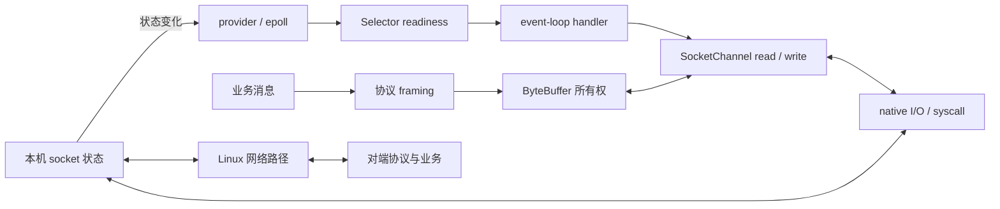
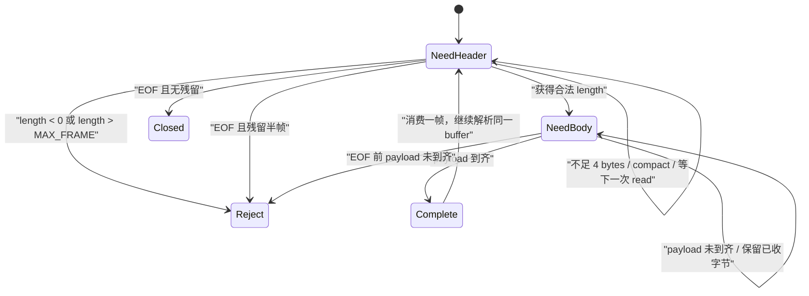
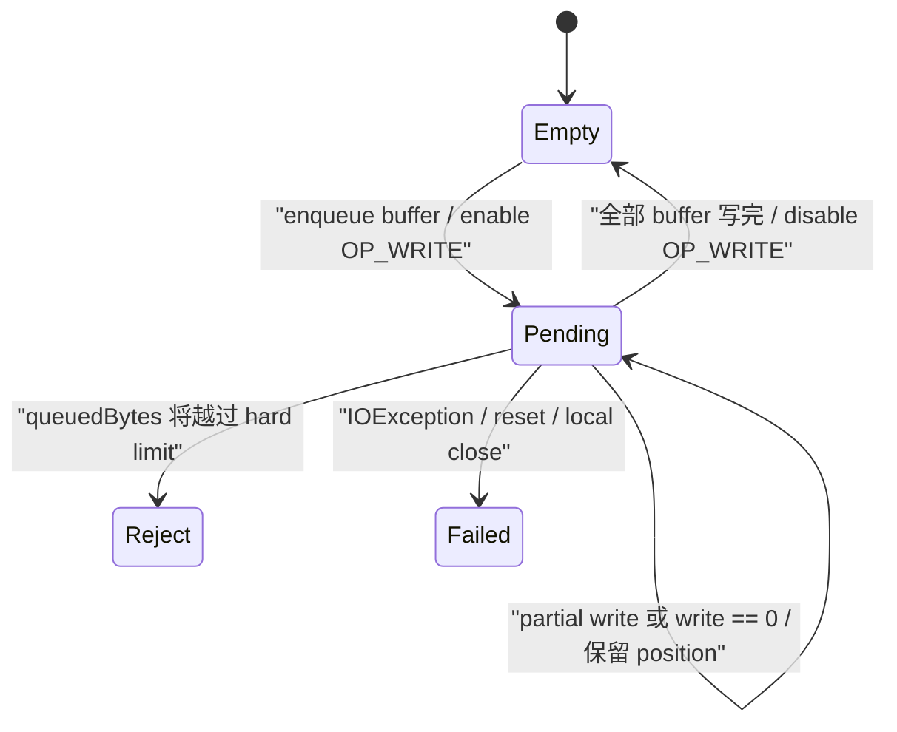
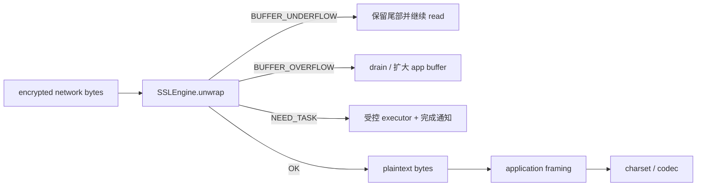

`SelectionKey.isReadable()` 变成 `true`，是不是说明一条消息已经到齐？`SocketChannel.write(buffer)` 返回正数，是不是说明对端已经收到？把 heap `ByteBuffer` 换成 direct buffer，是不是就完成了“零拷贝”？这些直觉都把不同层次的状态压成了一个布尔值。

Java NIO 暴露的是一组**非阻塞字节流原语**。它告诉应用某个操作现在可能推进，并通过 `ByteBuffer.position()` 记录已经消费或提交了多少字节；它不替应用定义消息边界、发送队列上限、慢对端策略，也不把写入本机 socket send buffer 升格为对端业务完成。低延迟实现真正要维护的是一条跨层协议：

这是“Java 低延迟工程”的 **Chapter 07**。上一章 [Java 线程为什么没有继续运行：Monitor、AQS、park/unpark 与调度延迟](/signal-grid-blog/posts/java-thread-contention-aqs-park-unpark-scheduling/) 已经把等待拆成锁协议、唤醒许可与调度推进；本章沿着 event-loop 线程继续向外追踪字节怎样进入内核、怎样形成排队以及应用如何把压力反向传播。下一章 [Linux 低延迟运行时](/signal-grid-blog/posts/linux-low-latency-runtime-cpu-affinity-numa-irq-rss-rps-xps-busy-poll/) 再把同一条时间线推进到 IRQ、NAPI、RSS/RPS/XPS、CPU affinity 与 NUMA。



本文以 **Java SE 25、OpenJDK 25 GA 与 Linux 的 stream socket** 为边界。Java API 的规范合同优先；`EPollSelectorImpl`、`eventfd`、`readv/writev` 等只描述该版本 OpenJDK 在 Linux 上的实现路径，不是其他 JDK、操作系统或未来版本必须维持的形状。本文也不重写 RSS、IRQ、NAPI 与 NIC queue：它们属于后续的 [Linux 低延迟运行时](/signal-grid-blog/posts/linux-low-latency-runtime-cpu-affinity-numa-irq-rss-rps-xps-busy-poll/)。Aeron 的可靠 UDP、流控和重传是另一套传输协议，也不能由这里的 TCP/NIO 结论代替。

## 1. Readiness 只是“现在值得尝试”，不是操作完成

Java NIO 文档对 readiness 的措辞非常克制：一个 selection key 报告 ready，只是提示对应操作**可能**不阻塞，不是保证。真正的状态变化仍以 `read`、`write`、`accept` 或 `finishConnect` 的返回值和异常为准。[Java SE 25 `java.nio.channels`](https://docs.oracle.com/en/java/javase/25/docs/api/java.base/java/nio/channels/package-summary.html)

对已经连接且处于 non-blocking mode 的 `SocketChannel`，单次读写至少要区分这些结果：

| 调用结果           | 能推出什么                                                | 不能推出什么                                       |
| ------------------ | --------------------------------------------------------- | -------------------------------------------------- |
| `read(dst) > 0`    | 有这些字节进入 `dst`，`position` 已前进                   | 一条业务消息已经完整；下一次读不会返回 `0`         |
| `read(dst) == 0`   | 本次没有搬入字节                                          | 已到 EOF；连接空闲；稍后一定还会收到数据           |
| `read(dst) == -1`  | 输入方向已经到达 stream end                               | 本地此前写出的响应已被对端处理；整个双向连接已完成 |
| `write(src) > 0`   | 这些字节已从 `src` 提交给本机 I/O 路径，`position` 已前进 | 整个 buffer 写完；字节已上网；对端已读取或处理     |
| `write(src) == 0`  | 本次没有接收更多字节                                      | 消息可以丢弃；连接已坏；应在当前线程持续重试       |
| 抛出 `IOException` | 当前 I/O 路径失败，需要进入连接失败语义                   | 哪些业务消息已被对端处理                           |

`SocketChannel` 的 Javadoc 明确允许 `read` 和 `write` 返回 `0`，也明确把 `-1` 定义为 end-of-stream。[Java SE 25 `SocketChannel`](https://docs.oracle.com/en/java/javase/25/docs/api/java.base/java/nio/channels/SocketChannel.html) `SelectionKey.OP_READ` 还可能因为 EOF、对端关闭写方向或 pending error 而 ready；`OP_WRITE` 也可能与对端关闭读方向或错误一起报告。因此，`isReadable()` 后仍要调用 `read()`，`isWritable()` 后仍要调用 `write()`，并处理其真实结果。[Java SE 25 `SelectionKey`](https://docs.oracle.com/en/java/javase/25/docs/api/java.base/java/nio/channels/SelectionKey.html)

这给出第一个不变量：

```text
已接收字节 = 所有成功 read 返回值之和
已提交字节 = 所有成功 write 返回值之和

readiness 不增加其中任何一个量
```

readiness 解决的是“何时再尝试”，`position` 和返回值才解决“推进了多少”。把二者混用，会同时制造丢字节、重复发送和空转。

## 2. TCP 只提供有序字节流，消息边界必须由 framing 状态机恢复

一次发送对应一次接收，是 stream protocol 上最常见的错误假设。发送方连续写出的 header 与 payload 可能被一次读合并，也可能被拆成多次读；两条消息也可能同时出现在一个 inbound buffer 中。TCP 保留字节顺序，不保留应用调用边界。

本文用一个简单的 length-prefixed frame 作为规范示例：

```text
+----------------------+--------------------+
| length: int32, BE    | payload: length B  |
+----------------------+--------------------+
```

解析器不能“看到四字节长度就立刻分配任意大小的对象”，而要先验证：

- header 是否完整；
- `length` 是否非负且不超过协议上限；
- buffer 中是否已有完整 payload；
- EOF 到达时是否还残留半个 header 或半个 payload；
- 完整 frame 的字节所有权何时从 inbound buffer 移交给业务或 outbound path。



`flip()` 把刚写入的 buffer 切换到读取视图，`compact()` 则把尚未消费的后缀搬到开头，并把 position 放到后缀之后，供下一次 channel read 继续追加。这里不能在 frame 不完整时调用 `clear()`：`clear()` 只重置游标，不会替你保存“已经收到但尚未组成 frame”的字节。[Java SE 25 `ByteBuffer.compact`](<https://docs.oracle.com/en/java/javase/25/docs/api/java.base/java/nio/ByteBuffer.html#compact()>)

一个解析循环的核心形状是：

```java
in.flip();
while (in.remaining() >= Integer.BYTES) {
    in.mark();
    int length = in.getInt();
    if (length < 0 || length > MAX_FRAME) {
        throw new ProtocolException("invalid frame length: " + length);
    }
    if (in.remaining() < length) {
        in.reset();
        break;
    }
    consumeExactlyOneFrame(in, length);
}
in.compact();
```

`consumeExactlyOneFrame` 必须恰好推进 `length` 字节。若它把 `slice()` 交给另一个线程或发送队列，随后又 `compact()` 并继续读，原始 buffer 的共享存储可能被覆盖；正确做法是同步完成消费，或者复制到一个生命周期独立且受界限约束的 buffer。framing 不只是解码格式，它同时规定了容量、所有权与 EOF 失败语义。

## 3. Selector 管理的是三组 key；跨线程变更必须经过命令与 wakeup

一个 `Selector` 同时维护 registered key set、selected-key set 与 cancelled-key set。`cancel()` 会立即使 key 失效，但真正从 selector 的集合中移除并 deregister channel，要到下一次 selection operation 处理取消队列时发生。selected-key set 不会自动替应用清空；传统迭代写法必须调用 iterator 的 `remove()`。[Java SE 25 `Selector`](https://docs.oracle.com/en/java/javase/25/docs/api/java.base/java/nio/channels/Selector.html)

```java
selector.select();
var iterator = selector.selectedKeys().iterator();
while (iterator.hasNext()) {
    SelectionKey key = iterator.next();
    iterator.remove();

    if (!key.isValid()) {
        continue;
    }
    handle(key);
}
```

`SelectionKey` 的 interest set 表示下一次 selection 要关注什么，ready set 表示上次 selection 观察到了什么。selection 已经进行时修改 interest set，不会改变那次正在进行的查询，只会被后续 selection 看见。虽然 Selector、key set 和 `SelectionKey` 的部分操作有并发合同，selected-key set 本身并不适合多线程随意修改；更重要的是，让多个业务线程同时修改 attachment、buffer、queue 和 interestOps，会把协议所有权拆散。

更容易证明的模型是：**一个 event-loop 线程拥有 selector、key、attachment 与每个连接的可变 I/O 状态；其他线程只提交有界命令。**

```java
if (!commands.offer(command)) {
    throw new RejectedExecutionException("selector command queue full");
}
selector.wakeup();
```

event loop 则在 selection 前后都 drain 命令：

```java
drainCommands();
selector.select();
drainCommands();
processSelectedKeys();
```

这个顺序利用了 `wakeup()` 的规范语义：若 selector 已阻塞，当前 selection 返回；若还没进入 selection，下一次 selection 会立即返回。连续两次 selection 之间的多次 `wakeup()` 会合并成一次效果，所以 wakeup 不能充当“命令计数器”，真正的命令必须保存在队列中。[Java SE 25 `Selector.wakeup`](<https://docs.oracle.com/en/java/javase/25/docs/api/java.base/java/nio/channels/Selector.html#wakeup()>)

在 OpenJDK 25 GA 的 Linux 实现中，默认 provider 使用 `EPollSelectorImpl`，并以一个注册到 epoll 的 `eventfd` 实现 wakeup；interestOps 变更进入 update queue，再转换为 `EPOLL_CTL_ADD/MOD/DEL`。这是理解 syscall 和 wakeup 成本的实现证据，不是 Java SE 对所有平台的保证。[OpenJDK 25 `EPollSelectorImpl`](https://github.com/openjdk/jdk/blob/jdk-25-ga/src/java.base/linux/classes/sun/nio/ch/EPollSelectorImpl.java)

## 4. OP_WRITE 只应在仍有待发送字节时存在

新连接通常很快就具备写入空间。如果一个没有待发送数据的连接长期注册 `OP_WRITE`，selector 可能持续报告 writable，event loop 每轮醒来却没有工作，形成高 CPU 空转。正确协议由 outbound queue 的状态驱动 interestOps：



可以把关键不变量写成：

```text
queuedBytes = Σ outboundBuffer.remaining()
0 <= queuedBytes <= hardLimit

outboundQueue 为空  => 不关注 OP_WRITE
outboundQueue 非空  => 关注 OP_WRITE，直到所有 position == limit
```

当业务产生响应时，先把拥有独立生命周期的 buffer 放入有界队列；若队列此前为空，打开 `OP_WRITE`。随后可以立即做一次 non-blocking write，减少一次 selector 往返；若只写了一部分或返回 `0`，保留 buffer 的新 position，等待后续 writable。只有队列完全排空，才关闭 `OP_WRITE`。

队列必须按**剩余字节**而不是消息条数计量。一千条 32 B heartbeat 与一千条 1 MiB snapshot 的内存和排队时间完全不同。常见策略是：

- soft/high watermark：暂停该连接继续读取请求，或让上游 admission control 降速；
- low watermark：队列回落后恢复读取，避免在阈值附近反复开关；
- hard limit：拒绝新工作、关闭慢连接或进入协议定义的降级，绝不继续扩容；
- global limit：除 per-connection 上限外，再限制所有连接合计的 buffer 与任务数量，防止大量慢连接各自“合法”却拖垮进程。

暂停 `OP_READ` 时还要处理 application buffer 里已经存在的完整 frame：不能只等下一次 socket readiness，否则可能有一条已到齐的消息永久留在用户态 buffer。实现可以在恢复读兴趣前先重新 drain 已缓存 frame，或像后面的核心示例那样采用更简单的 hard-limit-close 策略。选择哪一种，属于协议的过载语义。

最后，`write` 完成只表示本机路径接受了这些字节。若业务需要“对端已处理”，必须由对端 application acknowledgement、sequence 或幂等状态机给出证据，不能把 `buffer.hasRemaining() == false` 当作交付确认。

## 5. DirectBuffer 减少的是某些中间复制，不是所有权问题

Java SE 25 对 direct buffer 的保证是“JVM 会尽力让 native I/O 直接作用于它”，不是“永远零拷贝”。Javadoc 同时提醒 direct buffer 的分配与回收通常更昂贵，内容可能位于普通 GC heap 之外，内存足迹不一定显眼；只有大型、长寿命、确实参与 native I/O 且有测量收益的 buffer 才是合理起点。[Java SE 25 `ByteBuffer`](https://docs.oracle.com/en/java/javase/25/docs/api/java.base/java/nio/ByteBuffer.html)

| 选择                  | 适合起点                                 | 必须计入的代价                                     |
| --------------------- | ---------------------------------------- | -------------------------------------------------- |
| heap `ByteBuffer`     | 小控制消息、业务代码频繁访问、短生命周期 | native I/O 可能需要实现内部的临时复制              |
| direct `ByteBuffer`   | 大型或长期复用的 I/O buffer              | native footprint、分配/回收、池化上限、泄漏与 RSS  |
| `slice` / `duplicate` | 在同一存储上建立独立 position/limit 视图 | 内容仍共享；父 buffer 回收或复用前必须收回所有视图 |
| pooled buffer         | 稳定容量级别、生命周期可明确归还         | 池耗尽语义、代际/引用泄漏、敏感数据清理、全局上限  |

`Buffer` 明确不是多线程安全对象；即使 channel 允许一个 reader 与一个 writer 并发，某个具体 buffer 的 position、limit、mark 和内容所有权仍要单独定义。[Java SE 25 `Buffer`](https://docs.oracle.com/en/java/javase/25/docs/api/java.base/java/nio/Buffer.html) `slice()` 与 `duplicate()` 只有游标独立，底层内容共享。把一个 slice 发布给 worker 后立刻把父 buffer 归还池，会产生比普通数据竞争更隐蔽的逻辑 use-after-reuse。

一个可审计的池化合同至少包含：

```text
FREE -> OWNED_BY_CONNECTION -> QUEUED_FOR_WRITE -> FREE

任何时刻只有一个 owner 可以修改 content/position/limit
只有 write 完整消费或连接失败清理后才能归还
池容量 + 每连接队列 + 连接数共同形成 native memory 上限
```

池化也不能把“不知道最大 frame”合理化。先用协议上限拒绝恶意或错误长度，再决定使用固定 size class、组合 header/payload buffer，还是在冷路径分配大对象。将 `SO_SNDBUF` 调大也不是应用队列上限：JDK 把它定义为给实现的 sizing hint，实际值可能不同；更大的 kernel buffer 可能吸收更大突发，也可能把慢消费者隐藏得更久。[Java SE 25 `StandardSocketOptions.SO_SNDBUF`](https://docs.oracle.com/en/java/javase/25/docs/api/java.base/java/net/StandardSocketOptions.html#SO_SNDBUF)

## 6. Gather/scatter 减少调用与拼接，但不会让 frame 原子发送

`SocketChannel` 同时实现 `ScatteringByteChannel` 与 `GatheringByteChannel`。因此 header 和 payload 可以保持为两个 buffer，再用一次 gathering write 提交：

```java
ByteBuffer header = encodeHeader(payload.remaining());
ByteBuffer[] batch = {header, payload};

long written = channel.write(batch);
if (written == 0 || header.hasRemaining() || payload.hasRemaining()) {
    retainBothUntilNextWritableEvent(header, payload);
}
```

规范只承诺按 buffer 顺序尝试写入，并分别推进各 buffer 的 position；返回值仍可能小于总 remaining，甚至是 `0`。它不承诺一次调用对应一个 TCP segment、一次 kernel syscall、一个对端 read，或整条 frame 原子出现。[Java SE 25 `GatheringByteChannel`](https://docs.oracle.com/en/java/javase/25/docs/api/java.base/java/nio/channels/GatheringByteChannel.html)

在 OpenJDK 25 GA 的 Unix I/O 实现中，多 buffer 路径会构造 native iovec，并受平台 `IOV_MAX`、临时 direct buffer 和单次 I/O 上限约束；这是为什么 gather/scatter 常能减少用户态拼接和调用次数，也是为什么它仍要通过目标 JDK 与 workload 测量。[OpenJDK 25 `IOUtil`](https://github.com/openjdk/jdk/blob/jdk-25-ga/src/java.base/share/classes/sun/nio/ch/IOUtil.java) Linux `readv/writev` 对单个调用中的多个 buffer 给出顺序与原子性边界，但 non-blocking stream socket 仍可能只推进前缀。[Linux `readv(2)` / `writev(2)`](https://man7.org/linux/man-pages/man2/readv.2.html)

批处理也必须有公平性预算。一个始终 writable 的大连接若每次都 drain 全部队列，会让其他 selected key 饥饿；一个始终 readable 的连接若无限 `read` 到 `0`，也会霸占 event loop。每轮可以限制：

- 每个 key 最大读取/写入字节；
- 最大 frame 或 handler 数；
- gathering buffer 数；
- 单轮总 CPU 时间或 command 数。

达到预算后保留 interestOps，让后续 loop 继续推进。预算太小会增加 selection 与 syscall；预算太大则扩大队头阻塞。它们只能在相同业务结果和负载下做实验。

`TCP_NODELAY` 只关闭 Nagle 合并算法，不会关闭 socket queue、拥塞控制、对端 delayed ACK，也不会解决应用自己逐字节 write 的调用成本。[Java SE 25 `StandardSocketOptions.TCP_NODELAY`](https://docs.oracle.com/en/java/javase/25/docs/api/java.base/java/net/StandardSocketOptions.html#TCP_NODELAY) 正确顺序仍是先定义 frame、批处理与背压，再把 socket option 作为受控变量，而不是把一个开关当成低延迟协议。

## 7. TLS 与字符解码各自增加一层可暂停状态机

裸 TCP frame 到齐，不代表 TLS record 或字符序列恰好完整。`SSLEngine` 是 transport-independent、non-blocking 的状态机：`unwrap` 可能返回 `BUFFER_UNDERFLOW`，要求积累更多 network bytes；也可能返回 `BUFFER_OVERFLOW`，要求扩大或 drain application buffer。握手还可能返回 `NEED_WRAP`、`NEED_UNWRAP` 或 `NEED_TASK`。delegated task 可能执行证书验证、密钥选择或签名，并可能耗时甚至阻塞，不能直接塞进延迟敏感 event loop。[Java SE 25 `SSLEngine`](https://docs.oracle.com/en/java/javase/25/docs/api/java.base/javax/net/ssl/SSLEngine.html)



三层 buffer 不应混成一个游标：

1. network input/output：TLS records；
2. plaintext application bytes：业务 framing；
3. decoded objects/chars：业务字段。

每层都可能 underflow、overflow 或只推进部分输入。UTF-8 等多字节字符也可能跨 socket read；`CharsetDecoder` 的 `UNDERFLOW` 既可能表示输入全部消费，也可能表示还缺后续字节。最终 EOF 时必须以 `endOfInput=true` 持续 decode、处理 `OVERFLOW`，再持续 `flush()` 直到 `UNDERFLOW`，才能把残留非法序列和 decoder 尾部状态完整收束。[Java SE 25 `CharsetDecoder`](https://docs.oracle.com/en/java/javase/25/docs/api/java.base/java/nio/charset/CharsetDecoder.html)

TLS 还有独立的关闭合同：TCP EOF 不等于收到了合法的 TLS `close_notify`。实现应让 `SSLEngine.closeInbound()` 验证 inbound 是否按序关闭；缺失关闭通知必须进入截断失败语义，不能把仍可能不完整的 plaintext 当作正常 EOF。[Java SE 25 `SSLEngine.closeInbound`](<https://docs.oracle.com/en/java/javase/25/docs/api/java.base/javax/net/ssl/SSLEngine.html#closeInbound()>)

TLS/codec 的线程拓扑必须保留顺序：同一个 `SSLEngine` 不能让两个线程并发调用同方向的 `wrap` 或 `unwrap`；异步 delegated task 完成后也要把“继续握手”作为有界命令送回 owner event loop。将所有 TLS 工作无条件扔进 worker pool，会在 channel、engine、buffer 与 key 之间制造新的跨线程所有权协议。

## 8. 一个可编译的有界 length-prefixed event loop

下面的服务器是**正确性与背压骨架**，不是吞吐排行榜。它完成四件重要的事：

- 单线程拥有 selector、connection state 与 buffer pool；
- inbound frame 有固定最大长度，EOF 半帧按协议错误处理；
- outbound buffer 在完整写完前不会归还，并以 per-connection wire bytes、buffer 数和全局 pool 三重限制；
- gathering write 只做一次有界尝试，partial/zero write 留给下一次 `OP_WRITE`。

保存为 `NioFramedEchoServer.java`，使用 JDK 25 编译：

```bash
javac --release 25 NioFramedEchoServer.java
java NioFramedEchoServer 9000
```

```java
import java.io.Closeable;
import java.io.IOException;
import java.net.InetSocketAddress;
import java.net.ProtocolException;
import java.net.StandardSocketOptions;
import java.nio.ByteBuffer;
import java.nio.ByteOrder;
import java.nio.channels.CancelledKeyException;
import java.nio.channels.SelectionKey;
import java.nio.channels.Selector;
import java.nio.channels.ServerSocketChannel;
import java.nio.channels.SocketChannel;
import java.util.ArrayDeque;
import java.util.Arrays;
import java.util.HashSet;
import java.util.Iterator;
import java.util.Set;

public final class NioFramedEchoServer {
    private static final int MAX_FRAME = 64 * 1024;
    private static final int BUFFER_CAPACITY = Integer.BYTES + MAX_FRAME;
    private static final int MAX_CONNECTIONS = 512;
    private static final int POOL_BUFFERS = 1_024;
    private static final int MAX_ACCEPTS_PER_TICK = 64;
    private static final int MAX_READ_BYTES_PER_TICK = 256 * 1024;
    private static final int MAX_GATHER = 16;
    private static final int MAX_QUEUED_BUFFERS = 4;
    private static final long MAX_QUEUED_BYTES = 4L * BUFFER_CAPACITY;

    private final Selector selector;
    private final ServerSocketChannel server;
    private final BufferPool pool = new BufferPool(POOL_BUFFERS);
    private final Set<Conn> connections = new HashSet<>();

    private NioFramedEchoServer(
            Selector selector,
            ServerSocketChannel server
    ) {
        this.selector = selector;
        this.server = server;
    }

    private static NioFramedEchoServer open(int port) throws IOException {
        Selector selector = Selector.open();
        try {
            ServerSocketChannel server = ServerSocketChannel.open();
            try {
                server.configureBlocking(false);
                server.bind(new InetSocketAddress(port));
                server.register(selector, SelectionKey.OP_ACCEPT);
                return new NioFramedEchoServer(selector, server);
            } catch (IOException | RuntimeException | Error failure) {
                closeOnFailure(server, failure);
                throw failure;
            }
        } catch (IOException | RuntimeException | Error failure) {
            closeOnFailure(selector, failure);
            throw failure;
        }
    }

    private static void closeOnFailure(
            Closeable resource,
            Throwable failure
    ) {
        try {
            resource.close();
        } catch (IOException closeFailure) {
            failure.addSuppressed(closeFailure);
        }
    }

    public static void main(String[] args) throws Exception {
        int port = args.length == 0 ? 9000 : Integer.parseInt(args[0]);
        open(port).run();
    }

    private void run() throws IOException {
        try (selector; server) {
            while (!Thread.currentThread().isInterrupted()) {
                selector.select();
                Iterator<SelectionKey> it = selector.selectedKeys().iterator();
                while (it.hasNext()) {
                    SelectionKey key = it.next();
                    it.remove();

                    if (!key.isValid()) {
                        continue;
                    }
                    try {
                        if (key.isAcceptable()) {
                            onAccept();
                        } else {
                            onConnectionReady(key);
                        }
                    } catch (CancelledKeyException failure) {
                        if (key.attachment() instanceof Conn conn) {
                            close(conn);
                        } else {
                            throw failure;
                        }
                    } catch (IOException failure) {
                        if (key.attachment() instanceof Conn conn) {
                            close(conn);
                        } else {
                            throw failure;
                        }
                    } catch (RuntimeException failure) {
                        if (key.attachment() instanceof Conn conn) {
                            close(conn);
                        } else {
                            throw failure;
                        }
                    }
                }
            }
        } finally {
            for (Conn conn : Set.copyOf(connections)) {
                close(conn);
            }
        }
    }

    private void onAccept() throws IOException {
        for (int accepted = 0; accepted < MAX_ACCEPTS_PER_TICK; accepted++) {
            SocketChannel channel = server.accept();
            if (channel == null) {
                return;
            }
            if (connections.size() >= MAX_CONNECTIONS) {
                channel.close();
                continue;
            }

            ByteBuffer inbound = pool.acquire();
            if (inbound == null) {
                channel.close();
                continue;
            }

            try {
                channel.configureBlocking(false);
                channel.setOption(StandardSocketOptions.TCP_NODELAY, true);
                Conn conn = new Conn(channel, inbound);
                conn.key = channel.register(selector, SelectionKey.OP_READ, conn);
                connections.add(conn);
            } catch (IOException | RuntimeException failure) {
                pool.release(inbound);
                channel.close();
            }
        }
    }

    private void onConnectionReady(SelectionKey key) throws IOException {
        Conn conn = (Conn) key.attachment();
        if (key.isReadable()) {
            onRead(conn);
            if (key.isValid() && !conn.outbound.isEmpty()) {
                onWrite(conn); // One immediate, non-blocking attempt.
            }
        } else if (key.isWritable()) {
            onWrite(conn);
        }
    }

    private void onRead(Conn conn) throws IOException {
        int budget = MAX_READ_BYTES_PER_TICK;
        while (budget > 0) {
            int read = conn.channel.read(conn.inbound);
            if (read > 0) {
                budget -= read;
                decodeFrames(conn);
                continue;
            }
            if (read == 0) {
                return;
            }

            // EOF is legal only at a frame boundary. Drain queued echoes first.
            if (conn.inbound.position() != 0) {
                throw new ProtocolException("EOF in the middle of a frame");
            }
            conn.inputClosed = true;
            conn.key.interestOpsAnd(~SelectionKey.OP_READ);
            if (conn.outbound.isEmpty()) {
                close(conn);
            }
            return;
        }
    }

    private void decodeFrames(Conn conn) throws IOException {
        ByteBuffer in = conn.inbound;
        in.flip();
        try {
            while (in.remaining() >= Integer.BYTES) {
                in.mark();
                int length = in.getInt();
                if (length < 0 || length > MAX_FRAME) {
                    throw new ProtocolException("invalid frame length: " + length);
                }
                if (in.remaining() < length) {
                    in.reset();
                    return;
                }
                enqueueEcho(conn, in, length);
            }
        } finally {
            in.compact();
        }
    }

    private void enqueueEcho(Conn conn, ByteBuffer in, int length)
            throws IOException {
        int frameBytes = Integer.BYTES + length;
        if (conn.queuedBytes + frameBytes > MAX_QUEUED_BYTES
                || conn.queuedBufferCount >= MAX_QUEUED_BUFFERS) {
            throw new IOException("outbound queue limit exceeded");
        }

        ByteBuffer out = pool.acquire();
        if (out == null) {
            throw new IOException("global direct-buffer pool exhausted");
        }

        boolean ownedByConnection = false;
        try {
            out.putInt(length);
            int oldLimit = in.limit();
            try {
                in.limit(in.position() + length);
                out.put(in);
            } finally {
                in.limit(oldLimit);
            }
            out.flip();

            conn.outbound.addLast(out);
            conn.queuedBytes += frameBytes;
            conn.queuedBufferCount++;
            ownedByConnection = true;
            conn.key.interestOpsOr(SelectionKey.OP_WRITE);
        } finally {
            if (!ownedByConnection) {
                pool.release(out);
            }
        }
    }

    private void onWrite(Conn conn) throws IOException {
        int count = 0;
        for (ByteBuffer buffer : conn.outbound) {
            conn.gather[count++] = buffer;
            if (count == MAX_GATHER) {
                break;
            }
        }

        if (count == 0) {
            conn.key.interestOpsAnd(~SelectionKey.OP_WRITE);
            if (conn.inputClosed) {
                close(conn);
            }
            return;
        }

        long written;
        try {
            written = conn.channel.write(conn.gather, 0, count);
        } finally {
            Arrays.fill(conn.gather, 0, count, null);
        }
        conn.queuedBytes -= written;

        while (!conn.outbound.isEmpty()
                && !conn.outbound.peekFirst().hasRemaining()) {
            pool.release(conn.outbound.removeFirst());
            conn.queuedBufferCount--;
        }

        if (conn.outbound.isEmpty()) {
            conn.key.interestOpsAnd(~SelectionKey.OP_WRITE);
            if (conn.inputClosed) {
                close(conn);
            }
        }
        // partial or zero write leaves OP_WRITE enabled and positions intact.
    }

    private void close(Conn conn) {
        if (conn.closed) {
            return;
        }
        conn.closed = true;
        connections.remove(conn);
        if (conn.key != null) {
            conn.key.cancel();
        }
        try {
            conn.channel.close();
        } catch (IOException ignored) {
            // The connection is already failed; release all owned buffers.
        }
        pool.release(conn.inbound);
        while (!conn.outbound.isEmpty()) {
            pool.release(conn.outbound.removeFirst());
        }
        conn.queuedBytes = 0;
        conn.queuedBufferCount = 0;
    }

    private static final class Conn {
        final SocketChannel channel;
        final ByteBuffer inbound;
        final ArrayDeque<ByteBuffer> outbound = new ArrayDeque<>();
        final ByteBuffer[] gather = new ByteBuffer[MAX_GATHER];
        SelectionKey key;
        long queuedBytes;
        int queuedBufferCount;
        boolean inputClosed;
        boolean closed;

        Conn(SocketChannel channel, ByteBuffer inbound) {
            this.channel = channel;
            this.inbound = inbound;
        }
    }

    private static final class BufferPool {
        private final ArrayDeque<ByteBuffer> free = new ArrayDeque<>();

        BufferPool(int count) {
            for (int i = 0; i < count; i++) {
                free.addLast(ByteBuffer.allocateDirect(BUFFER_CAPACITY)
                        .order(ByteOrder.BIG_ENDIAN));
            }
        }

        ByteBuffer acquire() {
            ByteBuffer buffer = free.pollFirst();
            return buffer == null ? null : buffer.clear();
        }

        void release(ByteBuffer buffer) {
            free.addLast(buffer.clear().order(ByteOrder.BIG_ENDIAN));
        }
    }
}
```

示例在 overload 时关闭连接，而没有假装发出一个可能同样排不进去的错误响应；在真实协议中，可以在进入重负载前预留固定 control buffer，或由上游 admission control 更早拒绝。示例也没有 TLS、跨线程业务 worker 和 graceful process shutdown，这些都需要额外状态机，不能靠在 handler 外再包一层线程池自动获得。

## 9. 用故障矩阵和同一时间线证明 I/O 协议，而不是只测 echo QPS

NIO 代码最危险的测试，是在 loopback 上每次写一整条消息、对端立即读取，然后用平均 QPS 宣布完成。可靠性测试要主动破坏调用边界和容量假设：

| 注入条件                                     | 实现必须保持的状态                                               | 通过证据                                               |
| -------------------------------------------- | ---------------------------------------------------------------- | ------------------------------------------------------ |
| header 分 1/3 字节到达，payload 再分多次到达 | 未完整前不调用业务；leftover 经 `compact` 保留                   | 每个输入 frame 恰好产生一次合法输出                    |
| 多条 frame 合并到一次 read                   | 循环解析全部完整 frame，保留最后半帧                             | 输入序列与输出序列一一对应                             |
| 强制 short/zero write                        | buffer position 只按返回值推进；不重复、不跳过                   | 对端重组字节与源 frame 完全相同                        |
| 对端停止读取或持续发送极小 frame             | queuedBytes 或 queuedBufferCount 到达上限后拒绝/关闭             | 每连接 wire backlog 与预留内存均不越界，其他连接仍推进 |
| 对端在 frame 边界 half-close output          | 本地观察 `read == -1`，按协议排空已接受响应后关闭                | 无半帧、无 buffer 泄漏，关闭时间有界                   |
| 对端发送半帧后 half-close                    | 识别 truncated frame，不能当作正常完成                           | protocol error 计数增加，无业务回调                    |
| RST、网卡断开或任意 `IOException`            | key 取消、channel 关闭、全部 buffer 归还；业务结果标为未知或失败 | pool 守恒、连接数回落、没有静默重试                    |
| enqueue 后更新 interestOps 前 key 被取消     | buffer 只属于连接一次，并由统一 close 路径归还                   | 无重复 buffer identity；free + owned 恒等于池容量      |
| 监听端口占用或 listener key 失败             | 已打开的 server/selector 立即关闭，服务启动或运行明确失败        | FD 回落且错误没有变成 selector 空转                    |
| selector 命令与 selection 并发               | 命令先入有界队列，wakeup 只做通知，变更由 owner 应用             | 命令无丢失；队列满时显式拒绝                           |
| TLS record / UTF-8 字符跨 read               | 各层 underflow 独立保留；EOF 触发最终校验                        | plaintext framing 与解码结果稳定一致                   |
| 单连接持续洪泛                               | 每 key 有字节/handler budget                                     | 其他连接的 loop lag 与尾延迟不发生无界饥饿             |

业务测量要沿用 [Java 低延迟测量方法](/signal-grid-blog/posts/java-low-latency-measurement/) 的开放负载、scheduled latency、goodput 和饱和曲线；I/O 侧再补这些原始量：

- 每 loop 的 `select` 阻塞时间、selected key 数、command 数与 loop lag；
- 每连接 read/write 调用数、bytes、zero/partial 次数、EOF、reset 与异常类型；
- inbound leftover、outbound queuedBytes、queuedBufferCount、全局 pool 使用量、高水位持续时间与拒绝数；
- 每 frame 从首字节、完整解码、入业务、入发送队列到完整提交的分段时间；
- CPU、allocation、context switch、syscall 与 native stack；
- socket send/receive queue、重传、拥塞与对端消费阶段，且与应用时间窗对齐。

JFR 的 `jdk.SocketRead` / `jdk.SocketWrite` 可以帮助定位耗时 socket I/O；默认配置通常按 duration threshold 过滤，Oracle 的 JDK 25 故障排查指南提醒默认只记录超过 20 ms 的相关事件。对微秒级 non-blocking 调用，“JFR 没事件”绝不等于“没有 read/write”；应同时保留应用计数器，并把降低阈值后的诊断运行与正式计分分开。[JDK 25 I/O Performance Troubleshooting](https://docs.oracle.com/en/java/javase/25/troubleshoot/troubleshoot-io-performance-issues.html)

在 Linux 上，可以用 `perf`/tracepoint 或有界 syscall tracing 验证 `epoll_wait`、`read/readv`、`write/writev` 的调用与调度关系，但不能把 OpenJDK 实现路径写成 Java API 保证。Linux epoll 支持 level-triggered 与 edge-triggered；默认是 level-triggered，而 Java Selector 仍然只承诺 provider-independent readiness hint。[Linux `epoll(7)`](https://man7.org/linux/man-pages/man7/epoll.7.html) OpenJDK 25 GA 的实现证据应与当前 JDK build 一起保存。

最终可以把这条数据路径压缩成五个结论：

1. Selector 只提示某个操作值得尝试，`read/write` 的返回值和 buffer position 才是字节进度的权威。
2. TCP 不携带应用消息边界；framing 必须同时定义长度上限、半帧保留、EOF、错误和 buffer 所有权。
3. `OP_WRITE` 是待发送状态的派生量，而不是常驻配置；有界 outbound queue 才能把慢消费者从内存泄漏变成显式背压。
4. direct buffer、gather/scatter、TLS 和 codec 都只改变某一层的数据移动或状态机，不能取消 partial I/O、生命周期和对端确认边界。
5. 因此，低延迟网络 I/O 的保证不是“用了 epoll”或“用了 DirectBuffer”，而是每一字节只被消费一次、每一 buffer 始终有唯一 owner、每一队列有硬上限、每一种断线都有可观察结果，并能在真实饱和与故障下重复证明。

下一章 [Linux 低延迟运行时](/signal-grid-blog/posts/linux-low-latency-runtime-cpu-affinity-numa-irq-rss-rps-xps-busy-poll/) 会从本机 socket queue 继续向下，解释 RSS、IRQ、NAPI、RPS/RFS、XPS、CPU affinity 与 NUMA 怎样决定这些 syscall 最终由谁推进、在哪里排队，以及为何 Java 层正确的背压仍可能被错误的内核数据路径放大。

### 一手资料

- [Java SE 25 `java.nio.channels`](https://docs.oracle.com/en/java/javase/25/docs/api/java.base/java/nio/channels/package-summary.html)
- [Java SE 25 `Selector`](https://docs.oracle.com/en/java/javase/25/docs/api/java.base/java/nio/channels/Selector.html)
- [Java SE 25 `SelectionKey`](https://docs.oracle.com/en/java/javase/25/docs/api/java.base/java/nio/channels/SelectionKey.html)
- [Java SE 25 `SocketChannel`](https://docs.oracle.com/en/java/javase/25/docs/api/java.base/java/nio/channels/SocketChannel.html)
- [Java SE 25 `ByteBuffer` 与 `Buffer`](https://docs.oracle.com/en/java/javase/25/docs/api/java.base/java/nio/ByteBuffer.html)
- [Java SE 25 `SSLEngine`](https://docs.oracle.com/en/java/javase/25/docs/api/java.base/javax/net/ssl/SSLEngine.html)
- [Java SE 25 `CharsetDecoder`](https://docs.oracle.com/en/java/javase/25/docs/api/java.base/java/nio/charset/CharsetDecoder.html)
- [OpenJDK 25 GA `EPollSelectorImpl`](https://github.com/openjdk/jdk/blob/jdk-25-ga/src/java.base/linux/classes/sun/nio/ch/EPollSelectorImpl.java)
- [OpenJDK 25 GA `IOUtil`](https://github.com/openjdk/jdk/blob/jdk-25-ga/src/java.base/share/classes/sun/nio/ch/IOUtil.java)
- [Linux `epoll(7)`](https://man7.org/linux/man-pages/man7/epoll.7.html)
- [Linux `epoll_ctl(2)`](https://man7.org/linux/man-pages/man2/epoll_ctl.2.html)
- [Linux `readv(2)` / `writev(2)`](https://man7.org/linux/man-pages/man2/readv.2.html)
