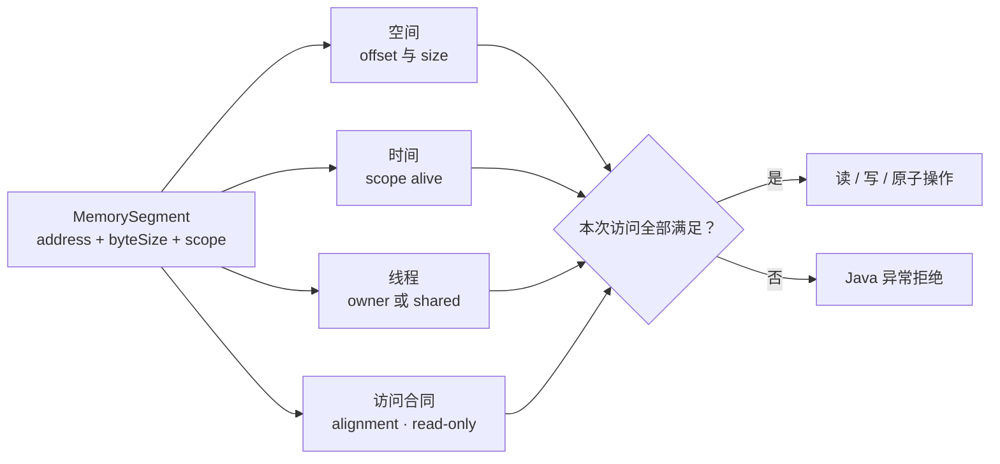
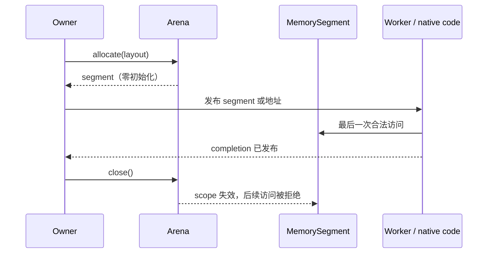
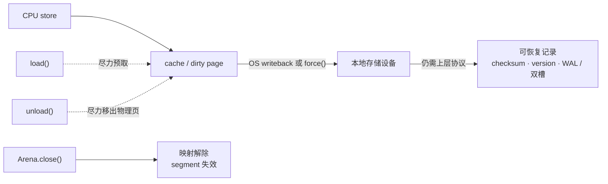
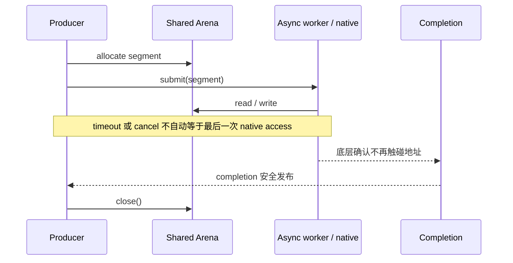

“把对象搬到堆外，就能避开 GC；再把 `Unsafe` 换成 FFM，就会同时得到更低延迟和内存安全。”

这句话把三个不同问题混在了一起：字节存放在哪里、谁有资格访问它们、底层操作究竟要花多少成本。堆外内存不会自动消除分配、清零、页错误、TLB miss、NUMA 远端访问和释放成本；Foreign Function & Memory API（FFM）也不可能验证任意 native 代码是否写坏了地址。它真正改变的是 Java 侧的建模方式：

> **`MemorySegment` 不是一枚可以到处传递的裸指针，而是一个带空间、时间与线程边界的能力对象；`Arena` 则把这项能力何时失效、由谁失效写进程序结构。**

本文以 **Java SE 25 / OpenJDK 25.0.2** 为基线。FFM 已在 JDK 22 通过 [JEP 454](https://openjdk.org/jeps/454) 定稿，本文使用的分配、布局与映射 API 不需要 preview 参数；会导致 JVM 崩溃或内存静默损坏的受限操作仍受 native access 控制。本文不展开 jextract、C ABI 或 JNI 调用教程，而是聚焦所有 native 数据通路共同依赖的内存合同。

这是“Java 低延迟工程”的 **Chapter 13**。前面的 [JMM 与 VarHandle](/signal-grid-blog/posts/java-memory-model-varhandle-memory-ordering/) 给出线程间可见性的证明方法，[低延迟测量](/signal-grid-blog/posts/java-low-latency-measurement/) 规定性能主张需要什么证据，[机器模型](/signal-grid-blog/posts/java-low-latency-machine-model-cache-locality-false-sharing-numa/)、[HotSpot](/signal-grid-blog/posts/hotspot-execution-tlab-escape-analysis-jit-deoptimization-safepoint/)、[Vector API 与 SIMD](/signal-grid-blog/posts/java-vector-api-simd-data-layout-auto-vectorization-benchmarks/)、[GC](/signal-grid-blog/posts/java-low-latency-gc-allocation-live-set-g1-zgc-shenandoah/)、[线程等待](/signal-grid-blog/posts/java-thread-contention-aqs-park-unpark-scheduling/)、[NIO 数据路径](/signal-grid-blog/posts/java-nio-selector-socket-data-path-backpressure/)、[io_uring 与零拷贝](/signal-grid-blog/posts/java-epoll-io-uring-zero-copy-completion-backpressure/) 与 [Linux 运行时](/signal-grid-blog/posts/linux-low-latency-runtime-cpu-affinity-numa-irq-rss-rps-xps-busy-poll/) 解释成本从哪里来；[Disruptor](/signal-grid-blog/posts/lmax-disruptor-ring-buffer-and-sequencing/) 和 [Agrona](/signal-grid-blog/posts/agrona-direct-buffer-queues-and-agents/) 再把所有权落实到队列、Buffer 与 Agent。本章最后收束一个问题：当字节离开 Java Heap，如何仍然证明每次访问合法。

## 1. 堆外内存真正缺少的不是地址，而是访问资格

传统裸指针只回答“从哪个地址开始”。一次合法访问至少还要回答五个问题：

```text
legalAccess(segment, offset, layout, operation, thread)
  = withinSpatialBounds
  ∧ temporalScopeIsAlive
  ∧ threadIsAllowed
  ∧ addressMeetsAlignment
  ∧ operationIsAllowedByMutability
```

FFM 把这些条件放进 [`MemorySegment`](https://docs.oracle.com/en/java/javase/25/docs/api/java.base/java/lang/foreign/MemorySegment.html)、它关联的 scope 和访问布局中：

- **空间边界（spatial bound）**：segment 由起始地址与字节长度界定；越过范围的访问抛出 `IndexOutOfBoundsException`。`asSlice` 可以交出更窄的子能力，而不必暴露整个分配区。
- **时间边界（temporal bound）**：segment 只在其 scope 存活时可访问；关闭 Arena 会同时使它分配的 segment 及其派生 slice 失效，后续访问抛出 `IllegalStateException`。
- **线程边界（thread bound）**：confined segment 只能由 owner thread 访问；其他线程触碰会得到 `WrongThreadException`。shared segment 允许多线程触碰，但不自动提供业务同步。
- **对齐与可变性边界**：访问地址必须满足布局要求；写入只读 segment、用不兼容的对齐访问都会在 Java 侧被拒绝。



这比“FFM 是安全的”精确得多。它能在 Java 访问点检查边界，却不能让一个错误的 C 函数变安全；native 代码仍可以保存过期地址、越界写入或按错误 ABI 解读参数。尤其是 [`reinterpret`](<https://docs.oracle.com/en/java/javase/25/docs/api/java.base/java/lang/foreign/MemorySegment.html#reinterpret(long)>) 一类受限操作，会人为扩大 Java 认为合法的范围：调用者一旦谎报大小或生命周期，检查仍会执行，只是检查依据已经错了。

还要注意 `address()` 的含义。native segment 返回可交给外部代码的物理地址；heap segment 的地址只是相对于堆内对象的虚拟化偏移，并不是可以随意交给 C 保存的稳定指针。只传出一个 `long` 地址会抹掉 segment 上的全部能力信息，因此调用者必须另外保留 segment，并证明它在外部操作结束前一直可达且未关闭。

**FFM 提供的是安全包络，不是 native 世界的全局证明。** 后文所有 Arena 选择、异步关闭和故障处理，都从这个边界继续推导。

## 2. Arena 不是分配器选项，而是释放条件的所有者

segment 的时间边界来自 scope；应用通常通过 [`Arena`](https://docs.oracle.com/en/java/javase/25/docs/api/java.base/java/lang/foreign/Arena.html) 同时获得 scope 与 allocator。选择 Arena 时，关键问题不是“哪一个 API 最方便”，而是**谁知道最后一次合法访问已经发生**。

| Arena                | 哪些线程能访问        | 谁决定失效                  | 回收时机          | 适合表达的所有权                       |
| -------------------- | --------------------- | --------------------------- | ----------------- | -------------------------------------- |
| `Arena.ofConfined()` | 创建它的 owner thread | owner thread 调用 `close()` | 确定              | 单线程方法、事件循环或同步 native 调用 |
| `Arena.ofShared()`   | 任意线程              | 任意线程调用 `close()`      | 确定              | 有明确完成信号的跨线程或异步操作       |
| `Arena.ofAuto()`     | 任意线程              | GC 管理，不可手动关闭       | 不确定            | 生命周期确实等同于 Java 可达性的对象图 |
| `Arena.global()`     | 任意线程              | 不会失效，不可关闭          | 永不由 Arena 回收 | 进程级常量、真正需要活到进程退出的区域 |

`ofConfined()` 与 `ofShared()` 都给出有界、可关闭的生命周期，区别是线程权限与谁可以执行关闭。`ofAuto()` 也有受 GC 管理的有限生命周期，但规范不承诺何时回收；`global()` 的 scope 永远存活，使用它分配的内存也不会被 Arena 释放。把临时请求 Buffer 放进 global Arena，只是把 use-after-free 风险换成了无界 native 内存增长。



Arena 的 native allocation 有几个常被“堆外无 GC”口号遮住的事实：

1. `arena.allocate(...)` 分配的 native memory 会被**零初始化**；分配、清零与第一次触页都可能进入延迟分布。
2. `allocate(layout)` 同时使用布局的大小与对齐；手工传 `byteSize` 和 `byteAlignment` 时，大小、正数 2 的幂对齐以及平台可分配性仍要合法，失败可能抛出 `IllegalArgumentException` 或 `OutOfMemoryError`。
3. Arena 实现本身是线程安全的，并保证由同一 Arena 分配的区域不重叠；普通 `SegmentAllocator` 接口却不作同样的普遍承诺，定制 allocator 可以返回重叠 slice，也可能拥有不同生命周期。
4. `Arena.close()` **不是幂等操作**：重复关闭会抛出 `IllegalStateException`。`auto` 与 `global` Arena 不支持关闭，会抛出 `UnsupportedOperationException`。
5. shared Arena 的“可由任意线程关闭”不等于“随时关闭都安全”。若关联 segment 正被另一个线程访问，例如参与仍在执行的 downcall，关闭可能抛出 `IllegalStateException`；应用仍须先建立完成协议。

因此，`try (Arena arena = Arena.ofConfined())` 不只是资源管理语法糖。它把“能力只在这个词法区间内有效”变成可以审查的结构。只有真正无法从业务完成事件推出关闭点时，才应接受 auto Arena 的不确定回收；global Arena 则应像进程级单例一样稀少。

## 3. MemoryLayout 把二进制格式变成可检查的数据合同

`MemorySegment` 只知道一段字节；[`MemoryLayout`](https://docs.oracle.com/en/java/javase/25/docs/api/java.base/java/lang/foreign/MemoryLayout.html) 才描述这些字节的大小、对齐、嵌套关系和命名路径。对落盘 Header、共享内存协议或 native struct 而言，布局应当是协议的一部分，而不是散落在代码里的 offset 常量。

下面定义一个 16 字节 Header：

```java
private static final MemoryLayout HEADER = MemoryLayout.structLayout(
        JAVA_INT.withOrder(ByteOrder.BIG_ENDIAN).withName("magic"),
        JAVA_SHORT.withOrder(ByteOrder.BIG_ENDIAN).withName("version"),
        MemoryLayout.paddingLayout(2),
        JAVA_LONG.withOrder(ByteOrder.BIG_ENDIAN).withName("sequence")
).withByteAlignment(8);

private static final VarHandle MAGIC =
        HEADER.varHandle(groupElement("magic"));
private static final VarHandle VERSION =
        HEADER.varHandle(groupElement("version"));
private static final VarHandle SEQUENCE =
        HEADER.varHandle(groupElement("sequence"));
```

这里有三条不能交给“平台通常会这样做”的隐含假设。

第一，`structLayout` **不会自动插入 C 编译器式 padding**。`int` 占 4 字节，`short` 占 2 字节；若希望 `long` 从 offset 8 开始，就必须显式加入 2 字节 padding。FFM 不知道目标 C 编译器的 ABI，也不会猜协议作者的落盘格式。

第二，[`ValueLayout.JAVA_*`](https://docs.oracle.com/en/java/javase/25/docs/api/java.base/java/lang/foreign/ValueLayout.html) 默认使用本机字节序。进程内临时数据可以把 native order 当作实现选择；只要数据会落盘、过网络、进入共享内存或被另一种实现读取，就应使用 `withOrder(...)` 把字节序写进协议。否则同一份源码在不同架构上可能生成不同字节。

第三，对齐既影响合法性，也影响可用的原子访问模式。布局派生的 VarHandle 会把 `MemorySegment`、基址 offset 和未绑定的路径索引作为坐标；访问时会检查最终地址。基于 aligned value layout 的 VarHandle 可以支持相应的原子与内存顺序模式；基于 unaligned layout 的 VarHandle 只保证 plain `get`/`set`，其他访问模式会抛出 `UnsupportedOperationException`，而 plain 访问还可能发生 word tearing。

这也把本章重新接回 JMM，但不能直接套用普通字段的结论。FFM package summary 明确提醒：native segment 背后的堆外区域不享有 JLS 17.4 对普通 Java 共享变量的通常保证。shared Arena 只表示“这个线程被允许触碰字节”，不表示“它一定看见另一个线程刚写的 payload”。并发读写应使用 aligned layout 派生的 VarHandle 及其明确支持的 acquire/release、volatile 或原子模式，并用锁、队列、Executor 等上层协议交接 Java 侧的 segment 引用和生命周期；不能声称一次普通 happens-before 会自动发布此前的 plain native store。[VarHandle JDK 25](https://docs.oracle.com/en/java/javase/25/docs/api/java.base/java/lang/invoke/VarHandle.html) · [FFM package summary](https://docs.oracle.com/en/java/javase/25/docs/api/java.base/java/lang/foreign/package-summary.html)

布局因此同时承担两个任务：让 offset、大小、对齐和字节序可审查；让访问点选择与并发协议匹配的语义。它不是序列化框架，也不会自动提供 schema evolution。给 Header 增加字段、改变 padding 或改变字节序，仍需版本号、兼容读取规则和 golden bytes 测试。

## 4. 一个 JDK 25 可运行程序把分配、映射与交接连起来

下面的完整程序用同一个 Header 布局证明三件事：

- confined Arena 中的 native allocation 可读写，关闭后 escaped segment 的访问被拒绝；
- `FileChannel.map(..., arena)` 产生的映射可用同一套 VarHandle 访问，`force()` 后再映射能读回内容，关闭 Arena 给出确定的 unmap 点；
- 跨线程 segment 使用 shared Arena；Executor 交接 Java 侧引用，`setRelease/getAcquire` 明确排序堆外值，owner task 在最后一次访问后先关闭再完成 `CompletableFuture`；调用方取消返回的 Future 不拥有底层资源，应用层包装器负责把非幂等的 Arena close 收敛为可重试的幂等语义。

```java
import java.io.IOException;
import java.lang.foreign.Arena;
import java.lang.foreign.MemoryLayout;
import java.lang.foreign.MemorySegment;
import java.lang.invoke.VarHandle;
import java.nio.ByteBuffer;
import java.nio.ByteOrder;
import java.nio.channels.FileChannel;
import java.nio.file.Files;
import java.nio.file.Path;
import java.util.concurrent.CompletableFuture;
import java.util.concurrent.ExecutorService;
import java.util.concurrent.Executors;

import static java.lang.foreign.MemoryLayout.PathElement.groupElement;
import static java.lang.foreign.ValueLayout.JAVA_BYTE;
import static java.lang.foreign.ValueLayout.JAVA_INT;
import static java.lang.foreign.ValueLayout.JAVA_LONG;
import static java.lang.foreign.ValueLayout.JAVA_SHORT;
import static java.nio.channels.FileChannel.MapMode.READ_WRITE;
import static java.nio.file.StandardOpenOption.CREATE;
import static java.nio.file.StandardOpenOption.READ;
import static java.nio.file.StandardOpenOption.WRITE;

public final class FfmMemoryDemo {
    private static final MemoryLayout HEADER = MemoryLayout.structLayout(
            JAVA_INT.withOrder(ByteOrder.BIG_ENDIAN).withName("magic"),
            JAVA_SHORT.withOrder(ByteOrder.BIG_ENDIAN).withName("version"),
            MemoryLayout.paddingLayout(2),
            JAVA_LONG.withOrder(ByteOrder.BIG_ENDIAN).withName("sequence")
    ).withByteAlignment(8);

    private static final VarHandle MAGIC =
            HEADER.varHandle(groupElement("magic"));
    private static final VarHandle VERSION =
            HEADER.varHandle(groupElement("version"));
    private static final VarHandle SEQUENCE =
            HEADER.varHandle(groupElement("sequence"));
    private static final VarHandle SHARED_LONG = JAVA_LONG.varHandle();

    public static void main(String[] args) throws Exception {
        nativeRoundTrip();

        Path file = Files.createTempFile("ffm-header-", ".bin");
        try {
            mappedRoundTrip(file);
        } finally {
            Files.deleteIfExists(file);
        }

        try (ExecutorService worker = Executors.newSingleThreadExecutor()) {
            long value = handOffToWorker(worker).join();
            if (value != 42L) {
                throw new AssertionError(value);
            }
        }
    }

    private static void nativeRoundTrip() {
        MemorySegment escaped;
        try (Arena arena = Arena.ofConfined()) {
            MemorySegment header = arena.allocate(HEADER);
            MAGIC.set(header, 0L, 0x53475244);
            VERSION.set(header, 0L, (short) 1);
            SEQUENCE.set(header, 0L, 42L);

            if ((int) MAGIC.get(header, 0L) != 0x53475244
                    || (short) VERSION.get(header, 0L) != 1
                    || (long) SEQUENCE.get(header, 0L) != 42L) {
                throw new AssertionError("round trip failed");
            }
            escaped = header;
        }

        try {
            escaped.get(JAVA_BYTE, 0);
            throw new AssertionError("use-after-close was not rejected");
        } catch (IllegalStateException expected) {
            // Arena 的时间边界拒绝 use-after-close。
        }
    }

    private static void mappedRoundTrip(Path file) throws IOException {
        try (FileChannel channel =
                     FileChannel.open(file, CREATE, READ, WRITE)) {
            if (channel.size() < HEADER.byteSize()) {
                extendFile(channel, HEADER.byteSize());
            }

            try (Arena arena = Arena.ofConfined()) {
                MemorySegment mapped =
                        channel.map(READ_WRITE, 0, HEADER.byteSize(), arena);
                MAGIC.set(mapped, 0L, 0x53475244);
                VERSION.set(mapped, 0L, (short) 1);
                SEQUENCE.set(mapped, 0L, 99L);
                mapped.force();
            } // 确定的 unmap 点
        }

        try (FileChannel channel = FileChannel.open(file, READ);
             Arena arena = Arena.ofConfined()) {
            MemorySegment mapped = channel.map(
                    FileChannel.MapMode.READ_ONLY,
                    0,
                    HEADER.byteSize(),
                    arena
            );
            if ((long) SEQUENCE.get(mapped, 0L) != 99L) {
                throw new AssertionError(
                        "mapped value was not persisted"
                );
            }
        }
    }

    private static void extendFile(
            FileChannel channel,
            long size
    ) throws IOException {
        ByteBuffer marker = ByteBuffer.wrap(new byte[]{0});
        long position = size - 1;
        int noProgress = 0;
        while (marker.hasRemaining()) {
            int written = channel.write(marker, position);
            if (written > 0) {
                position += written;
                noProgress = 0;
            } else if (++noProgress > 1_000) {
                throw new IOException("file extension made no progress");
            } else {
                Thread.onSpinWait();
            }
        }
        if (channel.size() < size) {
            throw new IOException("file was not extended to mapped size");
        }
        channel.force(true);
    }

    private static CompletableFuture<Long> handOffToWorker(
            ExecutorService worker
    ) {
        SharedBuffer buffer = new SharedBuffer(Long.BYTES);
        SHARED_LONG.setRelease(buffer.segment(), 0L, 42L);
        CompletableFuture<Long> result = new CompletableFuture<>();
        try {
            worker.execute(() -> {
                try {
                    long value = (long) SHARED_LONG.getAcquire(
                            buffer.segment(),
                            0L
                    );
                    buffer.close();
                    result.complete(value);
                } catch (Throwable failure) {
                    closeAfterFailure(buffer, failure);
                    result.completeExceptionally(failure);
                }
            });
        } catch (RuntimeException | Error failure) {
            closeAfterFailure(buffer, failure);
            throw failure;
        }
        return result;
    }

    private static void closeAfterFailure(
            SharedBuffer buffer,
            Throwable failure
    ) {
        try {
            buffer.close();
        } catch (RuntimeException | Error closeFailure) {
            failure.addSuppressed(closeFailure);
        }
    }

    private static final class SharedBuffer implements AutoCloseable {
        private final Arena arena = Arena.ofShared();
        private final MemorySegment segment;
        private boolean closed;

        SharedBuffer(long bytes) {
            segment = arena.allocate(bytes, Long.BYTES);
        }

        synchronized MemorySegment segment() {
            if (closed) {
                throw new IllegalStateException("buffer already closed");
            }
            return segment;
        }

        @Override
        public synchronized void close() {
            if (closed) {
                return;
            }
            arena.close();
            closed = true;
        }
    }
}
```

这份源码已用 Oracle/OpenJDK 官方发布的 **OpenJDK 25.0.2+10-69，macOS AArch64** 实际编译运行：

```text
$ javac -Xlint:all FfmMemoryDemo.java
$ java FfmMemoryDemo
# exit 0，无标准输出
```

验证所用压缩包 SHA-256 为：

```text
7581b0d1752cd5acbf39e286c03f07b6cd6c205b562eb2fe753ff0253cf4c1bf
```

它与 [OpenJDK 官方归档](https://jdk.java.net/archive/) 提供的校验值一致。程序没有使用受限 FFM 方法，所以不需要 `--enable-native-access`。这是一份**语义样例**，不是持久化基准：临时文件上的一次读回只证明当前运行里观察到了写入，不能单独证明掉电、文件系统元数据或跨主机存储的恢复合同。

## 5. mmap 建立的是映射；load、unload 与 force 各有边界

JDK 25 的 [`FileChannel.map(MapMode, long, long, Arena)`](<https://docs.oracle.com/en/java/javase/25/docs/api/java.base/java/nio/channels/FileChannel.html#map(java.nio.channels.FileChannel.MapMode,long,long,java.lang.foreign.Arena)>) 返回 mapped `MemorySegment`。这条 API 把两个过去容易缠在一起的生命周期分开：

- 关闭 `FileChannel` 不会使已经建立的映射失效；
- 关闭关联的 closeable Arena 会使 segment 失效，并解除映射；
- 因此 Channel 的所有者与映射的所有者可以不同，但二者都必须有明确结束条件。

映射页通常按需进入物理内存。`load()`、`unload()`、`isLoaded()` 和 `force()` 处理的是不同维度：

| 操作         | 它试图改变什么                                                              | 它不保证什么                                           |
| ------------ | --------------------------------------------------------------------------- | ------------------------------------------------------ |
| `load()`     | 尽力把映射内容装入物理内存                                                  | 所有页永远驻留、后续访问无 page fault                  |
| `unload()`   | 尽力让物理内存中的映射内容可被移出                                          | unmap、segment 失效、文件关闭或内容删除                |
| `isLoaded()` | 给出映射内容是否驻留的提示                                                  | 精确、稳定且可作为控制协议的状态                       |
| `force()`    | 对本地存储的 READ_WRITE 映射，把自映射建立或上次 force 后的修改写到存储设备 | 远程存储同等保证、跨记录事务原子性、新文件目录项持久化 |



[`MemorySegment.force()`](<https://docs.oracle.com/en/java/javase/25/docs/api/java.base/java/lang/foreign/MemorySegment.html#force()>) 对本地存储 READ_WRITE 映射有明确设备写回保证，I/O 失败以 `UncheckedIOException` 报告；对远程存储没有同等保证，对只读或 private mapping 可能没有效果。但设备写回不是事务提交：若两处字段需要原子改变，崩溃仍可能留下旧 Header 与新 payload、半写记录或校验不一致。应用必须另行设计 checksum、版本、双槽切换、WAL 或 copy-on-write 发布协议，并定义恢复时接受哪个完整状态。

`unload()` 更不能写成“释放 mmap”。它只处理物理驻留提示，segment 仍然 alive，虚拟地址范围仍然存在，下一次访问仍可重新触页。真正的确定性 unmap 点是 closeable Arena 的 `close()`。

映射也不是文件内容的隔离快照。其他进程或同一进程的其他 Channel 可以修改 backing file；如果文件被截断，使映射区域的一部分不再可访问，后续访问会在当前或稍后的某个点抛出未指定异常。不能把这类异常类型写成恢复协议，更不能继续读一个已知被外部破坏的映射并假设剩余字节权威。文件大小、所有者、版本和截断流程必须由更高层协调。

所以 mmap 的真实优势是让文件页直接成为可寻址数据通路，并把映射生命周期纳入 Arena；它没有把文件系统、存储设备和崩溃恢复压缩成一个 `force()` 调用。

## 6. 异步访问的关闭条件必须是“最后一次 native touch 已完成”

同步词法作用域很容易审查：

```java
try (Arena arena = Arena.ofConfined()) {
    MemorySegment request = arena.allocate(REQUEST_LAYOUT);
    invokeSynchronously(request);
} // 调用返回，native 端也不再保留地址，才可关闭
```

异步路径的真正不变量则是：

```text
LAST_NATIVE_ACCESS(segment)
  → completion 被安全发布
  → CLOSE(arena)
```

这里的箭头不是“业务上大概结束了”，而是一个可证明的顺序：跨线程时必须有 happens-before；涉及内核或 native library 时，completion 还必须表示底层不会再读写或保留该地址。超时、Future 被 cancel、Java 回调返回失败，都不一定说明底层 I/O 或 native 操作已经停止。



两个 API 边界尤其容易踩错。

### `asByteBuffer()` 没有解除 segment 的约束

`segment.asByteBuffer()` 只是创建 NIO 视图。Buffer 的可访问生命周期和线程限制仍依赖原 segment；由 confined segment 创建的 Buffer 交给 `AsynchronousSocketChannel.read/write` 等异步操作，官方文档明确警告可能抛出未指定异常。解决办法不是捕获某个固定异常，而是改变所有权：使用 shared Arena，并在异步操作真正完成后关闭。

视图还重新引入了 `ByteBuffer` 的容量上限。大于 `Integer.MAX_VALUE` 的 segment 不能整体表示为一个 ByteBuffer；需要 slice 成多个可表达窗口，或让消费端直接接受 MemorySegment。[`asByteBuffer()` JDK 25](<https://docs.oracle.com/en/java/javase/25/docs/api/java.base/java/lang/foreign/MemorySegment.html#asByteBuffer()>)

### 传出 `address()` 后，Java 仍要保活能力对象

若把 `segment.address()` 交给 JNI、设备库或其他保存 raw pointer 的外部组件，segment 必须在整个操作期间保持强可达，Arena 也必须仍 alive。auto Arena 的回收时机依赖可达性；只把地址保存成 `long`，却让 segment 引用消失，会把生命周期交给不可观察的 GC 时机。

同步 downcall 返回时，FFM 可以结束它所追踪的访问；但若 native 函数把 pointer 注册进自己的事件循环并在返回后继续使用，FFM 无法猜出最后一次 touch。此时协议需要显式的 unregister/ack、引用计数或 completion token。shared Arena 只允许回调线程访问，不会替这个协议计数。

前面示例的 `SharedBuffer` 正是最小化表达：任务提交交接 Java 引用，同一 aligned VarHandle 上的 release/acquire 排序堆外值，成功与异常路径均由 owner task 负责关闭，因此清理独立于调用方对返回 Future 的 cancel，并在最后一次访问之后先关闭再发布完成。若提交被同步拒绝，提交线程立即关闭；若 Arena close 失败，包装器不会提前标记 `closed`，后续恢复路径仍可重试。真实 I/O 必须把 completion 定义得比“Java Future 状态改变”更严格，且需要访问租约或引用计数防止 close 与仍在执行的 native touch 并发。

## 7. DirectByteBuffer、JNI、Unsafe 与 FFM 解决的不是同一层问题

FFM 不是把所有旧 API 统一判为“慢且过时”。迁移是否成立，取决于原 API 承担的职责。

| 机制                        | 主要能力                                                 | 生命周期与边界                                     | FFM 不能直接替代的部分                                     |
| --------------------------- | -------------------------------------------------------- | -------------------------------------------------- | ---------------------------------------------------------- |
| `ByteBuffer.allocateDirect` | 与 NIO、Channel 和大量既有库互操作                       | `int` 索引与容量；释放通常受 GC/cleaner 可达性影响 | 既有 API 只接受 ByteBuffer 时仍需视图或适配                |
| `MemorySegment` + Arena     | long 尺寸、slice、布局访问、native allocation、mmap      | 显式空间/时间/线程能力，可确定关闭                 | 不自动提供协议演进、持久化事务或并发所有权                 |
| JNI                         | 通过 `JNIEnv` 操作 Java 对象、回调 JVM，并调用 native 库 | 大量边界由手工 C/JNI 代码维护                      | FFM 聚焦外部函数与内存，不是完整 `JNIEnv` 替代             |
| `sun.misc.Unsafe`           | raw memory、对象字段和数组的低级访问                     | 很多错误绕开正常 Java 检查；内存访问方法已待移除   | heap 字段/数组迁移目标通常是 VarHandle，不是 MemorySegment |

DirectByteBuffer 仍是重要互操作边界，但它不是理想的所有权模型。容量与索引受 `int` 限制；释放时机通常受 GC 管理；频繁创建和释放的成本也可能比堆上小对象更高。FFM 可以通过 `asByteBuffer()` 接入旧 API，也能用 `MemorySegment.ofBuffer(...)` 为 Buffer 建立 segment 视图；转换不会凭空改变底层存储或复制数据，原对象与视图的生命周期关系仍要保留。[ByteBuffer JDK 25](https://docs.oracle.com/en/java/javase/25/docs/api/java.base/java/nio/ByteBuffer.html)

`-XX:MaxDirectMemorySize` 的官方定义针对 `java.nio` direct-buffer allocation，不应被当成“进程全部 native 内存预算”。FFM allocation、mmap、JNI 库、线程栈、JIT code cache 和 libc 自身都有不同治理路径。JVM 的 [Native Memory Tracking](https://docs.oracle.com/en/java/javase/25/vm/native-memory-tracking.html) 也明确不跟踪用户 native memory、第三方 native code 和部分 JDK class library 分配；它还有约 5%–10% 开销。因此，堆外治理至少需要应用层按 owner 统计已分配/已关闭字节，并结合进程 RSS、cgroup、page fault 与映射清单。

对于 Unsafe，迁移也应按内存域拆开。对象字段、数组元素和并发状态优先迁移到 VarHandle 或 `java.util.concurrent`；堆外区域、C 数据和 mmap 才是 FFM 的主场。JDK 23 通过 [JEP 471](https://openjdk.org/jeps/471) 将 Unsafe 内存访问方法标记为待移除，JDK 24/25 默认在首次调用时给出警告，但这不构成“把所有 Unsafe 调用机械替换成 segment.get/set”——生命周期、对齐、字节序和并发语义都必须重新建模。

最后，FFM 的受限方法不是普通便利 API。错误的 `reinterpret`、function descriptor、ABI 或长期保存的地址可能造成 JVM 崩溃或静默数据损坏；`--enable-native-access` 只是调用方明确承认风险，不是运行时替它验证 native 合同。[JDK 25 restricted methods](https://docs.oracle.com/en/java/javase/25/core/restricted-methods.html)

## 8. 故障矩阵决定错误能被 Java 拒绝，还是会越过安全包络

安全性不能只写“有异常会抛”。下面这张代表性故障矩阵要区分：哪些错误在 Java 访问点被确定拒绝，哪些错误只得到尽力而为的 I/O 结果，哪些错误已经越过了 FFM 能验证的边界。

| 故障注入或错误条件                                | 可观察结果                                       | 被证明的边界         | 系统应如何解释                          |
| ------------------------------------------------- | ------------------------------------------------ | -------------------- | --------------------------------------- |
| offset 或访问宽度越过 segment                     | `IndexOutOfBoundsException`                      | 空间边界             | 编程/数据格式错误，不应重试同一访问     |
| Arena 已关闭后访问                                | `IllegalStateException`                          | 时间边界             | use-after-close，修复所有权             |
| 非 owner 线程访问 confined segment                | `WrongThreadException`                           | 线程边界             | 错误交接；不能靠 shared 掩盖同步缺失    |
| 非 owner 线程关闭 confined Arena                  | `WrongThreadException`                           | 关闭者身份           | 由 owner 收回，不能跨线程代关           |
| 对只读 segment 写入                               | `IllegalArgumentException`                       | 可变性边界           | 权限或 MapMode 选择错误                 |
| 最终地址不满足 layout 对齐                        | `IllegalArgumentException`                       | 对齐边界             | 修正布局、slice 或分配对齐              |
| 对 unaligned VarHandle 使用原子模式               | `UnsupportedOperationException`                  | 原子访问能力         | 不能退回 plain 并声称原子               |
| 非法 allocation 大小/对齐或资源耗尽               | `IllegalArgumentException` / `OutOfMemoryError`  | 分配前置条件与容量   | 拒绝、背压并记录 owner，不要无限重试    |
| 第二次关闭 closeable Arena                        | `IllegalStateException`                          | 非幂等关闭语义       | 由资源包装器收敛一次性 owner            |
| 关闭 auto/global Arena                            | `UnsupportedOperationException`                  | 生命周期策略         | 说明 Arena 类型选择错误                 |
| segment 正被并发访问时关闭                        | 可能 `IllegalStateException`                     | 关闭与访问互斥条件   | 等待真实 completion，不把异常当同步器   |
| dead/wrong-thread Arena 传给 `FileChannel.map`    | `IllegalStateException` / `WrongThreadException` | 映射 scope 前置条件  | 不建立映射，修复生命周期与 owner        |
| 对非 mapped segment 调用 load/unload/force        | `UnsupportedOperationException`                  | mapped-only 操作     | 不能把驻留/写回动作套在普通分配上       |
| 超过 `Integer.MAX_VALUE` 的 segment 转 ByteBuffer | `UnsupportedOperationException`                  | NIO 视图容量上限     | slice 成可表达窗口或直接使用 segment    |
| mapped `force()` 写回失败                         | `UncheckedIOException`                           | 本次写回未获保证     | 不得发布 durable ack，进入失败/恢复路径 |
| backing file 被外部截断                           | 当前或稍后出现未指定异常                         | 映射依赖外部文件状态 | 隔离映射并按权威版本恢复                |
| 错误的受限 reinterpret / ABI / retained pointer   | JVM 崩溃或静默损坏                               | 已越过 Java 安全包络 | 只能靠 native 合同、隔离与故障测试预防  |

这张表也给出本文的 **P0 红线**。出现下面任一设计表述，都说明保证边界已经被写错：

- “FFM 让 native memory 绝对安全”——受限操作和错误 native code 仍能崩溃或静默损坏。
- “shared Arena 已经解决线程安全”——它只解除线程限制，不建立 happens-before，也不提供原子复合状态。
- “`unload()` 会释放 mmap”——确定 unmap 来自 closeable Arena 的关闭。
- “`force()` 等于事务提交或完整 fsync 协议”——它不替代记录原子性、目录项、远程存储与恢复设计。
- “Future timeout/cancel 后可以立刻 close”——必须证明底层已经完成最后一次 native access。
- “auto Arena 最适合被 native 长期保存的地址”——raw pointer 不会替 segment 保持强可达。
- “`structLayout` 会按 C ABI 自动补齐，`JAVA_LONG` 也天然是协议字节序”——padding 与持久化字节序都必须显式。
- “confined segment 转成 ByteBuffer 后就能安全交给异步 Channel”——视图仍受原 segment 的时间和线程边界约束。
- “一个热缓存循环证明堆外比堆内快”——它没有测分配、清零、页错误、释放、并发和真实工作集。

红线不是风格偏好，而是可直接生成反例的错误命题。故障注入也不应停在“看见了预期异常”：还要断言失败后没有 durable ack、owner 计数回到正确值、映射没有继续对外服务、恢复得到完整合法记录，才算证明了系统级性质。

## 9. 只有拆开生命周期成本与访问成本，性能结论才可证伪

JEP 454 的目标是让 FFM 的性能与 JNI、Unsafe 相当或更好，同时提供更安全、可组合的模型；它没有承诺任意业务把数据搬到堆外都会更快。一个可信假设应当能够被数据推翻，例如：

> 在 JDK 25.0.2、固定 CPU/NUMA 拓扑和 64 字节记录下，复用的 confined MemorySegment 在 8 MiB working set 的顺序读写 p99 不劣于 DirectByteBuffer；若把 allocation、零初始化与 close 纳入每次操作，总 goodput 仍高于基线，且 RSS 在预算内。

这个假设至少包含版本、拓扑、记录、工作集、生命周期、指标和资源约束。实验应拆成相互独立的因果问题：

| 实验                | 必须控制的变量                                           | 要报告的证据                                        | 它不能单独证明            |
| ------------------- | -------------------------------------------------------- | --------------------------------------------------- | ------------------------- |
| allocation 生命周期 | bytes、alignment、Arena 类型、批次、是否触页             | ns/op、分配失败、RSS、minor/major fault、close 成本 | 稳态访问更快              |
| 稳态访问            | heap/direct/segment、相同布局与边界检查、读写比          | throughput、p50/p99/p99.9/max、CPU                  | 分配与释放便宜            |
| 布局语义            | aligned/unaligned、native/swapped endian、VarHandle mode | 单位操作成本、生成代码与正确性断言                  | 跨线程协议正确            |
| working set         | L1/L2/LLC/DRAM 跨度、stride、预取、NUMA node             | bandwidth、cache/TLB miss、远端访问                 | 线上队列无积压            |
| mmap 读路径         | 冷页/热页、文件大小、page cache、`load()`                | fault、RSS、磁盘读、尾延迟                          | `force()` 的持久化延迟    |
| mmap 写回           | dirty bytes、文件系统、存储介质、force 频率              | force 分布、写入量、错误与恢复结果                  | 远程或掉电合同            |
| 并发交接            | 线程数、owner、同步协议、false sharing                   | goodput、排队、失败、p99.9                          | shared Arena 本身提供同步 |

局部机制用 [OpenJDK JMH](https://github.com/openjdk/jmh) 测量时，allocation benchmark 与 access benchmark 应分开；使用 fork、充分 warmup 和 Blackhole/返回值防止死代码消除；每个参数组合重新稳定 JIT；不要在“稳态访问”方法里偷偷创建 Arena，也不要为了得到漂亮数字把范围检查、字节序转换或业务校验从某个实现中删掉。

mmap 还必须区分冷启动与热页。刚被另一个 trial 读过的文件通常已在 page cache 中；`load()` 的执行时间也不能从端到端样本里消失。`force()` 应在单独实验中报告 p50、p99、p99.9、max、dirty bytes、设备与文件系统，并对失败运行恢复校验。把 hot read 与 force 混成一个平均值，既解释不了读路径，也解释不了持久化尾部。

端到端判断则回到 Chapter 02 的证据链：同时报告 offered、accepted、completed、goodput、拒绝与错误；把 page fault、RSS、cgroup memory、CPU、磁盘写回、GC 和 owner 级 native bytes 与延迟时间线对齐。NMT 只能解释它覆盖的 JVM 分类，不能作为“没有 native leak”的唯一证据。

### Chapter 13：把“堆外更快”改写成可证明的所有权问题

走完整条 Java 低延迟路径后，FFM 的位置已经很清楚：

1. `MemorySegment` 保证的是 Java 访问点所依据的空间、时间、线程、对齐和可变性边界；它不证明 native 代码、持久化协议或多线程业务状态正确。
2. Arena 的选择必须从最后一次合法访问与唯一关闭者推出；confined/shared 是明确所有权，auto/global 是有意识接受不确定或无限生命周期。
3. MemoryLayout 让 padding、alignment、endianness 和 VarHandle 路径成为数据合同；shared access 仍须回到 JMM 证明可见性。
4. mmap 的映射、驻留、写回和解除是四件事；`load`/`unload` 是尽力提示，`force` 有本地设备边界，确定 unmap 来自 Arena close。
5. 性能收益只有在正确性语义相同、生命周期成本完整、工作集和故障模型真实时才成立；有时 FFM 的主要收益不是更低的纳秒数，而是终于能解释谁拥有这段内存、它何时失效，以及失败后为什么不会继续被访问。

这正是 Chapter 01 的 JMM、Chapter 02 的测量方法、Vector API 的数据布局与执行证据、GC 的分配预算、NIO、io_uring 与 Linux 的真实数据路径以及 Agrona 的 Buffer 所有权最终汇合的地方：**低延迟不是绕开管理，而是把过去隐含在地址和惯例里的边界，提升为可以检查、测量和证伪的协议。**

### 官方一手资料

- [JEP 454：Foreign Function & Memory API](https://openjdk.org/jeps/454)
- [MemorySegment — Java SE 25](https://docs.oracle.com/en/java/javase/25/docs/api/java.base/java/lang/foreign/MemorySegment.html)
- [Arena — Java SE 25](https://docs.oracle.com/en/java/javase/25/docs/api/java.base/java/lang/foreign/Arena.html)
- [SegmentAllocator — Java SE 25](https://docs.oracle.com/en/java/javase/25/docs/api/java.base/java/lang/foreign/SegmentAllocator.html)
- [MemoryLayout 与 ValueLayout — Java SE 25](https://docs.oracle.com/en/java/javase/25/docs/api/java.base/java/lang/foreign/MemoryLayout.html)
- [VarHandle — Java SE 25](https://docs.oracle.com/en/java/javase/25/docs/api/java.base/java/lang/invoke/VarHandle.html)
- [FileChannel.map — Java SE 25](https://docs.oracle.com/en/java/javase/25/docs/api/java.base/java/nio/channels/FileChannel.html)
- [Restricted Methods — JDK 25](https://docs.oracle.com/en/java/javase/25/core/restricted-methods.html)
- [JEP 471：Deprecate the Memory-Access Methods in sun.misc.Unsafe for Removal](https://openjdk.org/jeps/471)
- [OpenJDK JMH](https://github.com/openjdk/jmh)
- [Native Memory Tracking — JDK 25](https://docs.oracle.com/en/java/javase/25/vm/native-memory-tracking.html)
