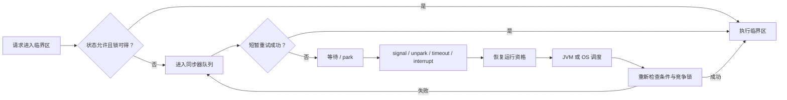
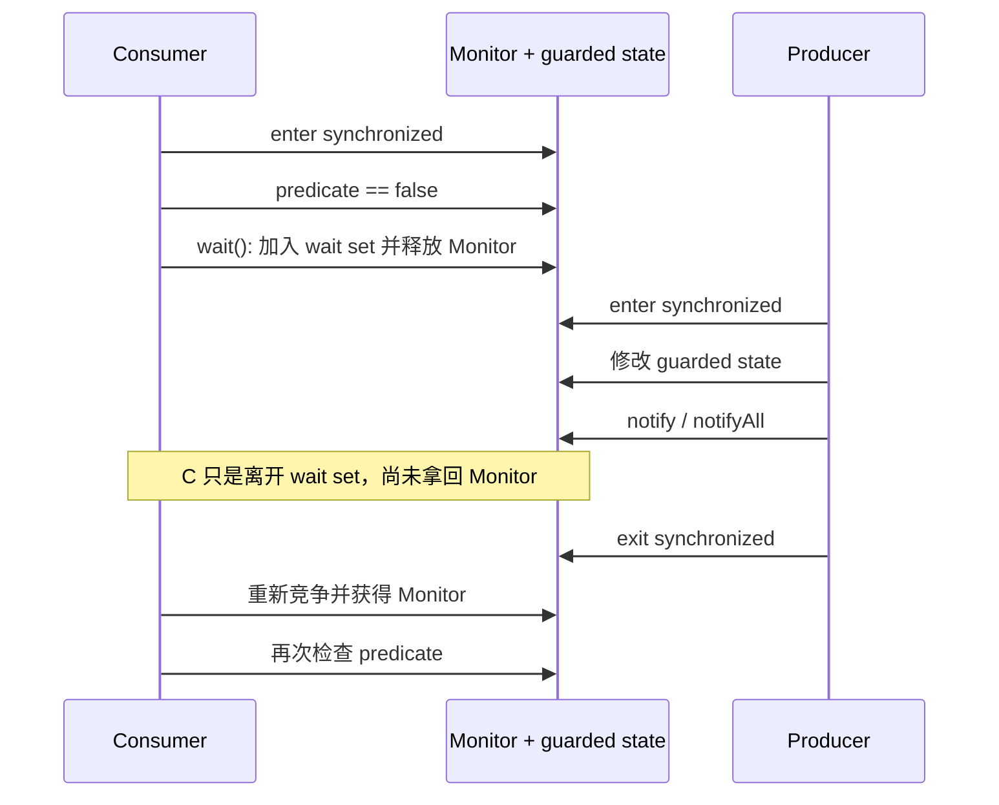
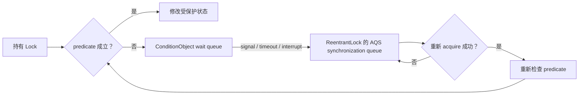
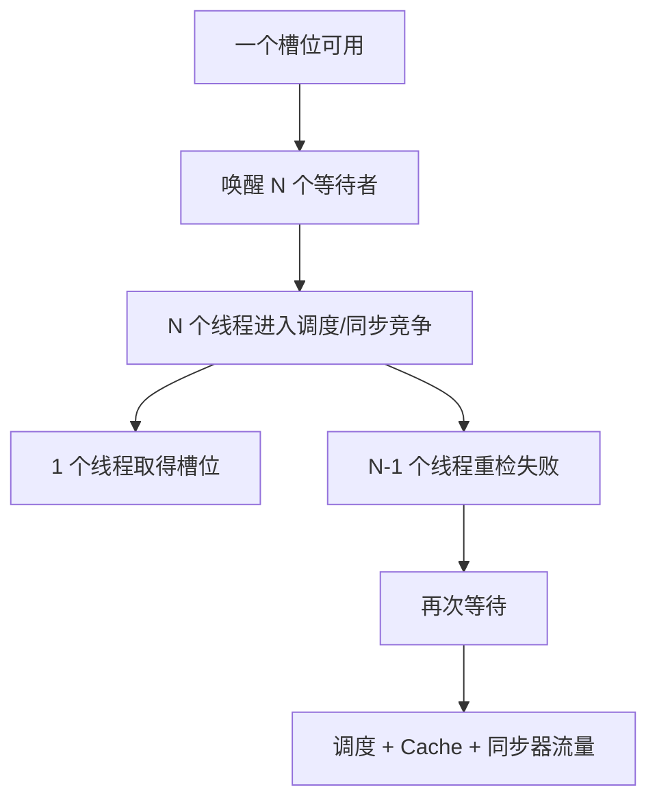

“线程已经被 `unpark`，为什么过了 2 ms 才继续执行？”

这个问题常被压缩成一句“锁竞争很严重”或“Linux 调度抖了”。但从一个线程发现条件不满足，到它再次执行下一条业务指令，中间可能经历的是完全不同的机制：它可能仍在等锁持有者退出临界区，可能已经进入同步队列，可能主动调用了 `park`，可能已经被唤醒但还在等 CPU，也可能拿到 CPU 后又输掉了锁的重新竞争。

**被通知、可以运行和正在运行是三件不同的事。** 低延迟分析必须把共享状态的条件、同步器的准入、JVM 的等待机制与操作系统的调度分开；否则一次线程 dump 里的 `WAITING`、一个 `unpark` 调用或一段 off-CPU 栈，都不足以解释业务尾延迟。

本文以 **Java SE 25、JDK 25 GA 的 OpenJDK/HotSpot 与主线 Linux 文档**为基线。Java 规范定义 Monitor、等待集、线程状态和并发 API 的语义；HotSpot 决定这些语义在当前 JVM 中怎样走快慢路径；Linux 决定平台线程什么时候真正获得 CPU。三层可以互相解释，但不能互相冒充。本文不重讲 [JMM 与 happens-before](/signal-grid-blog/posts/java-memory-model-varhandle-memory-ordering/)、[JFR/perf 的通用使用方法](/signal-grid-blog/posts/java-low-latency-measurement/)、[HotSpot 的 JIT 与 Safepoint](/signal-grid-blog/posts/hotspot-execution-tlab-escape-analysis-jit-deoptimization-safepoint/)，也不重复 [Linux 绑核、IRQ 与网卡队列](/signal-grid-blog/posts/linux-low-latency-runtime-cpu-affinity-numa-irq-rss-rps-xps-busy-poll/)。这里专注回答一件事：**一条本来能继续的 Java 执行路径，在哪一层失去了运行资格，又在哪一层重新获得资格。**

这是“Java 低延迟工程”的 Chapter 07。上一章 [Java 低延迟 GC](/signal-grid-blog/posts/java-low-latency-gc-allocation-live-set-g1-zgc-shenandoah/) 已经说明分配、并发回收和空间余量怎样占用 CPU；本章继续区分业务线程是主动等待、被同步器阻挡，还是已经可运行却没有得到 CPU。下一章将进入 [Java NIO、Selector 与 Socket 数据路径](/signal-grid-blog/posts/java-nio-selector-socket-data-path-backpressure/)，把这里的等待、唤醒和调度模型接到 readiness、partial I/O、发送队列与背压。

## 1. “没有继续运行”至少要拆成五段时间

假设线程 `T2` 想进入一个由 `T1` 持有的临界区。一次等待可能包含五段时间：

1. **剩余持锁时间**：`T1` 还没有发布新状态并释放同步器；
2. **同步器排队时间**：`T2` 已经表达获取意图，但前面还有其他竞争者；
3. **休眠时间**：同步器决定不再让 `T2` 消耗 CPU，于是让它等待通知；
4. **唤醒到调度时间**：`T2` 已恢复 runnable 资格，却还没有被 OS 或虚拟线程调度器选中；
5. **重新竞争时间**：`T2` 真正运行后再次检查条件或尝试获取同步器，仍可能失败并回到队列。

可以把一次停顿写成一个诊断模型，而不是一个固定公式：

```text
T_stall
  = T_owner_remaining
  + T_sync_queue
  + T_parked
  + T_wakeup_to_run
  + T_reacquire
```

有些等待不会经过全部阶段：无竞争的锁获取可能只有一次原子快路径；短暂竞争可能在重新尝试时成功而从未真正休眠；`Condition.await()` 则一定先释放关联锁，返回前再重新获取。这个分解的作用不是相加得到一个“理论延迟”，而是要求每一段都对应不同证据。



因此，“`unpark` 到业务代码恢复用了 2 ms”至少提出两个不同问题：permit 何时可见，以及线程何时实际被调度。只测 `park` 的总时长会把它们混在一起；只看 CPU 利用率也无法知道线程是在同步器里休眠，还是已经 runnable 但排在 run queue 上。

还要区分**等待条件**与**等待锁**。线程可以因为队列为空而主动等待，也可以在数据已经存在时仅仅因为另一个线程持有锁而无法读取。两者都可能表现为“业务没有进展”，但前者应由生产者改变谓词并通知，后者应缩短临界区或减少共享所有权。把两者都归因于“锁慢”，通常会得到错误优化。

## 2. Monitor 把互斥准入与条件等待放在同一个对象上

Java 的每个对象都关联一个 Monitor。`synchronized` 先获取对象的 Monitor，再执行临界区，离开时释放；同一线程可以重入。这里的规范保证是互斥与内存同步，不是某种固定的机器指令、固定大小的锁记录或必然发生的系统调用。[JLS 25 §17.1](https://docs.oracle.com/javase/specs/jls/se25/html/jls-17.html#jls-17.1) · [JVMS 25 `monitorenter`](https://docs.oracle.com/javase/specs/jvms/se25/html/jvms-6.html#jvms-6.5.monitorenter)

Monitor 上存在两个很容易混淆的等待原因：

- 线程想进入 `synchronized`，但 Monitor 正被其他线程持有；
- 线程已经持有 Monitor，却发现业务谓词不成立，于是调用 `Object.wait()` 进入该对象的等待集。

第二种路径不是“拿着锁睡觉”。按照 JLS，线程调用 `wait` 时会进入对象的等待集，并执行与当前重入次数相同数量的 unlock action；从等待集中移出后，它仍要重新获得同一 Monitor，并恢复原来的重入状态，才能从 `wait` 返回。移出原因可以是 `notify`、`notifyAll`、interrupt、timeout 或实现允许的 spurious wakeup。[JLS 25 §17.2](https://docs.oracle.com/javase/specs/jls/se25/html/jls-17.html#jls-17.2) · [`Object.wait` JDK 25](<https://docs.oracle.com/en/java/javase/25/docs/api/java.base/java/lang/Object.html#wait()>)



这解释了两个常见误判。

第一，`notify()` **不把锁直接交给被选中的线程**。通知者仍持有 Monitor，直到退出临界区；被通知者随后还要和其他进入者竞争。如果代码在 `notify` 后继续做序列化、日志或 I/O，那么这段工作仍会计入消费者的恢复延迟。

第二，通知不是业务状态。`notify()` 只从等待集中选择一个线程，选择规则不构成业务正确性；spurious wakeup 也被规范允许。因此谓词必须在同一 Monitor 保护下用 `while` 重检：

```java
synchronized (guard) {
    while (!ready && !closed) {
        guard.wait();
    }
    if (closed) {
        return;
    }
    consume();
}
```

把 `while` 改成 `if`，会把“被唤醒”错误地当成“条件已经成立”。这不是微小概率的调优问题，而是协议错误。

HotSpot 可以为无竞争 Monitor 使用很短的快路径，在竞争、等待或其他条件下再进入更复杂的运行时路径。JDK 25 的 [`synchronizer.cpp`](https://github.com/openjdk/jdk/blob/jdk-25-ga/src/hotspot/share/runtime/synchronizer.cpp) 与 [`objectMonitor.cpp`](https://github.com/openjdk/jdk/blob/jdk-25-ga/src/hotspot/share/runtime/objectMonitor.cpp) 可以用来核对当前实现；但“轻量锁必然多少纳秒”“Monitor 必然等于一个内核 mutex”都不是 Java SE 承诺。诊断应先确认是否真的发生竞争，再进入特定 JDK 的实现细节。

## 3. AQS 把状态判定与排队机制分开，Condition 又增加了一次队列迁移

`AbstractQueuedSynchronizer`（AQS）不是一把锁，而是构造锁、Latch、Semaphore 等同步器的框架。子类用一个原子 `int state` 定义“能否 acquire / release”，AQS 负责排队、可能的阻塞、取消和唤醒。它支持 exclusive 与 shared 两种模式；`ReentrantLock` 等上层类型把公开语义建立在这些机制之上。[AQS JDK 25](https://docs.oracle.com/en/java/javase/25/docs/api/java.base/java/util/concurrent/locks/AbstractQueuedSynchronizer.html) · [OpenJDK 25 `ReentrantLock`](https://github.com/openjdk/jdk/blob/jdk-25-ga/src/java.base/share/classes/java/util/concurrent/locks/ReentrantLock.java)

AQS 的核心循环可以抽象为：

```text
while (!tryAcquire(arg)) {
    enqueue if needed;
    possibly block;
}
```

这句话包含三个边界：

- `tryAcquire` 的业务含义由具体同步器定义，AQS 不理解“订单”“容量”或“连接已关闭”；
- 队列是 FIFO 形状，不代表获取一定严格 FIFO；新线程可以在入队前先尝试，非公平策略允许 barging；
- 被唤醒只表示应该再次尝试，`tryAcquire` 仍可能失败，线程也可能因 timeout 或 interrupt 取消。

AQS 官方文档明确说明，内部 FIFO 队列本身不会自动强制 FIFO acquisition policy。默认的 barging 策略通常有更高吞吐和可伸缩性；公平同步器可以用 `hasQueuedPredecessors()` 抑制插队，但取消、并发入队和实际调度仍使“公平”等价于“严格按墙钟到达顺序完成”这个结论不成立。

`Condition` 又引入了另一个队列。接口允许不同实现提供不同的等待、通知与顺序语义；下面“condition queue 转移到 AQS synchronization queue”的具体路径，描述的是 `ReentrantLock` 创建的 `AQS.ConditionObject`，不是所有 `Condition` 实现的通用内部结构。调用 `await()` 的线程必须持有关联 Lock；调用会原子地释放 Lock 并进入条件等待。`signal()` 只能使一个等待者离开条件等待并获得重新竞争资格；线程在 `await` 返回前必须重新获得 Lock。[`Condition` JDK 25](https://docs.oracle.com/en/java/javase/25/docs/api/java.base/java/util/concurrent/locks/Condition.html)



因此，Condition 的总等待至少包含“等待条件变化”和“等待重新获得锁”两部分。只把 `await` 到返回的时长命名为 `condition_wait`，会失去关键归因；更有用的业务事件应分别记录：谓词何时变为真、signal 何时发生、线程何时从 `await` 返回、返回后多久获得可提交结果。

多个 Condition 的价值不是“API 更高级”，而是把不同谓词的等待者分开。例如有界容器可以用 `notEmpty` 和 `notFull`，生产者腾出一个槽位时只唤醒一个等待容量的线程，而不是让所有消费者和生产者都起来抢同一把锁。反过来，终止状态通常影响所有谓词，关闭时才需要在持锁状态下更新 `closed` 并对相关 Condition 执行 `signalAll()`。

AQS 的 `getQueueLength()`、`hasQueuedThreads()` 等方法只提供监控估计。线程可能并发入队或因超时取消，返回值不能作为“现在可以安全关闭”或“下一位必然是谁”的控制条件。**监控队列不是协议状态。**

## 4. LockSupport 的 permit 防止丢失先到通知，但不替你定义条件

`LockSupport.park/unpark` 是实现同步器的底层构件。每个使用它的线程关联一个 permit：

- permit 最多为一个，不会累计；
- permit 已存在时，下一次 `park` 立即返回并消费它；
- permit 不存在时，`park` 可能阻塞；
- 对已经启动的目标线程，`unpark(thread)` 让 permit 可用；它先于目标线程调用 `park` 时，后续 `park` 也可以直接返回。若目标线程尚未启动，这个效果不保证保留。

这解决了 `Thread.suspend/resume` 那种“恢复发生得太早而永久睡眠”的竞态，却没有把 permit 变成业务事件计数器。连续十次 `unpark` 仍只留下一个 permit；若协议需要累计十个任务，任务数量必须保存在队列、计数器或其他受同步保护的状态中。[`LockSupport` JDK 25](https://docs.oracle.com/en/java/javase/25/docs/api/java.base/java/util/concurrent/locks/LockSupport.html)

可靠用法仍然是“状态 + permit”，而不是裸 `park`：

```java
while (!canProceed()) {
    LockSupport.park(blocker);
    if (Thread.currentThread().isInterrupted()) {
        return CANCELLED;
    }
}
```

循环不能省略，原因至少有三个：`park` 可以无原因返回；interrupt 会让它返回；某次 `unpark` 只表示“值得再检查”，不证明当前线程最终拥有资源。`LockSupport` 文档还要求用 volatile 或原子状态控制是否等待；它维护的调用顺序与 volatile 访问相关，但不承诺替普通非 volatile payload 建立所需发布关系。完整内存顺序仍应回到 [JMM 章节](/signal-grid-blog/posts/java-memory-model-varhandle-memory-ordering/) 证明。

带 `blocker` 的重载应优先使用。JVM 诊断可以通过 `LockSupport.getBlocker(thread)` 或 `ThreadInfo` 显示线程因哪个同步对象而 park；如果传 `null`，一次 WAITING 快照只剩栈位置，很难把等待映射回具体队列或服务实例。

下面的单等待者 Gate 只用于展示 permit 与谓词的关系，不是建议重新实现生产锁：

```java
final class OneShotGate {
    private volatile boolean open;
    private volatile Thread waiter;

    boolean await() {
        waiter = Thread.currentThread();
        while (!open) {
            LockSupport.park(this);
            if (Thread.currentThread().isInterrupted()) {
                return false;
            }
        }
        return true;
    }

    void open() {
        open = true;
        Thread thread = waiter;
        if (thread != null) {
            LockSupport.unpark(thread);
        }
    }
}
```

如果 `open()` 先发生，后来的 `await()` 会从 volatile `open` 直接看到状态；如果 waiter 已登记，`unpark` 提供恢复资格。这里仍没有多等待者、公平、超时、重复关闭或失败传播语义，所以真实代码应优先使用已经验证的 `CountDownLatch`、Semaphore、Lock/Condition 或有界队列。

最重要的实现边界是：**Java API 没有规定 `park` 必须等于 Linux futex。** HotSpot 会通过自身运行时与平台代码实现等待，不同 JDK、OS、线程类型和执行路径可以不同。Linux futex 可以是调查某个固定环境时发现的底层机制，但不能从 Java 源码中的 `park()` 直接推导“发生了一次 futex syscall”，更不能据此估算固定唤醒延迟。

## 5. spin、yield 与 park 是三种预算，不是快慢排名

等待策略真正选择的是：**在条件可能很快改变的窗口里，继续占用执行资源是否比放弃资源再被唤醒更便宜。**

| 策略             | 保留了什么                       | 支付什么                                     | 主要失败方式                                  |
| ---------------- | -------------------------------- | -------------------------------------------- | --------------------------------------------- |
| spin             | 保留运行资格并持续重检           | 核心、功耗、缓存流量、SMT 邻居干扰           | 等待稍长就烧掉整个 CPU 预算                   |
| `Thread.yield()` | 提示调度器愿意让出机会           | 结果依赖调度器，仍可能马上继续或长时间不运行 | 被误当成公平或有界延迟保证                    |
| park             | 让同步器可以停止当前线程消耗 CPU | 入睡、唤醒、run queue 与重新获取成本         | 轻载唤醒尾部、丢失 blocker/原因、恢复后再竞争 |

`Thread.onSpinWait()` 只是自旋提示，没有同步语义，也不承诺当前处理器一定执行某条特定指令。`Thread.yield()` 同样不是线程交接协议：API 不保证让给谁，也不保证何时再次运行。正确性必须来自共享谓词和内存顺序，不能来自“我已经 yield 三次”。

固定写“自旋 100 次再 park”也不是可移植模型。合理窗口取决于：

- 临界区剩余持有时间与分布，而不是平均持锁时间；
- 是否有独占物理核，SMT sibling 是否在跑关键任务；
- 竞争者数量、到达突发和同步器公平策略；
- 容器 CPU quota、GC/JIT 线程和邻居工作负载；
- 唤醒后 run queue 延迟，以及拿到 CPU 后再次失败的概率。

若锁持有者自己已经被抢占，更多竞争者持续 spin 不会让它更快释放锁，只会占用本可运行 owner 的 CPU。这个现象常被称为 lock-holder preemption：等待者看似“积极”，系统进展反而下降。相反，在确有独占核、等待通常短于一次调度往返、且空载功耗可接受时，有限自旋可能减少短等待尾部。两种结论都必须在目标拓扑上验证，不能从类名 `BusySpin` 或 `Yielding` 推导。

自适应策略至少要按状态区分指标：尝试次数、真正 park 次数、park 时长、wake-to-run、重新竞争失败数，以及等待期间的 CPU 消耗。只报告最终吞吐，会把“用三颗额外核心换来 5 μs”写成免费收益；只报告 CPU，又会遗漏尾延迟是否真的改善。

## 6. interrupt、timeout 与 cancel 必须成为等待协议的一部分

等待不是只有“成功返回”一条出口。生产线程可能被 shutdown，调用方 deadline 可能耗尽，任务可能被取消，依赖也可能永久失败。同步器 API 提供 interruptible、timed 与 uninterruptible 形式，但它们只提供机械出口；业务仍要定义每种出口对状态和调用者意味着什么。

| 触发              | 本地机械结果                                                                | 协议必须回答                                 |
| ----------------- | --------------------------------------------------------------------------- | -------------------------------------------- |
| interrupt         | `wait` / `await` 或 interruptible acquire 抛异常；`park` 返回且保留中断状态 | 是取消、进程关闭还是仅一次唤醒？谁清理登记？ |
| timeout           | timed acquire/await 返回失败或剩余时间耗尽                                  | 操作是否从未生效，还是结果仍可能稍后发生？   |
| close/cancel flag | 共享谓词改变并通知等待者                                                    | 新请求如何拒绝？已接收任务是否排空？         |
| spurious return   | 等待方法返回但业务条件未变                                                  | 是否在锁内用 `while` 重检谓词？              |

interrupt 的机械语义还要按 API 拆开。`Object.wait()` 与 `Condition.await()` 抛出 `InterruptedException` 并清除 interrupted status；调用者通常要等 Monitor 或 Lock 重新取得后才能处理结果，所以中断不等于立刻跳到取消处理器。`LockSupport.park()` 因中断返回时不清除状态。`lockInterruptibly()` 若在竞争 Lock 时被中断，则可以在未取得该 Lock 的情况下抛出异常。若当前方法不能继续向上抛而要把中断翻译成取消结果，通常应在完成必要清理后调用 `Thread.currentThread().interrupt()` 恢复标志；若方法本身声明 `throws InterruptedException`，直接传播能保留更清晰的取消语义。无论哪种选择，都不应吞掉中断后假装正常成功。

timeout 应作为一个递减预算，而不是在每次 spurious wakeup 后重新等待完整时长。`Condition.awaitNanos` 返回估计的剩余纳秒数，正适合写成：

```java
long remaining = timeoutNanos;
while (!predicate()) {
    if (remaining <= 0L) {
        return TIMED_OUT;
    }
    remaining = condition.awaitNanos(remaining);
}
```

在跨多步逻辑中，使用单调时间源计算 deadline，避免墙钟校时改变预算；同一方法里直接沿用 `awaitNanos` 的 remaining value，还能避免多次换算与截断让总等待系统性漂移。分布式 deadline 的传播属于另一层协议，这里只约束单进程等待。

关闭动作必须先在同步保护下改变谓词，再通知相关等待者。例如同时存在 `notEmpty` 与 `notFull` 时，`closed` 会使两类等待都结束，关闭路径应对两者 `signalAll`。只 interrupt 一条当前观察到的线程既可能漏掉后续入队者，也没有发布关闭原因；只 signal 而不写 `closed`，被唤醒线程重检后又会继续睡眠。

取消还会改变公平与容量判断。AQS 队列中的线程可以因 interrupt 或 timeout 离开，因此 queue length 是瞬时估计；业务队列里的任务是否取消，则必须由任务状态机决定，不能把“等待锁的 Java 线程消失了”当成“业务请求从未发生”。

## 7. 公平、convoy 与惊群描述的是不同失败模式

“打开公平锁就不会有尾延迟”把三个问题混在了一起。

**公平策略**限制新到线程是否能绕过已排队线程。它改善长期插队风险，却不能保证被选中的线程立刻获得 CPU，也不能让持锁时间变短。以 `ReentrantLock` 为例，公平构造参数描述的是竞争下的获取偏好；线程调度公平不是它的保证，未定时 `tryLock()` 也不因锁被配置为 fair 就自动遵守同样的排队策略。[`ReentrantLock` JDK 25](https://docs.oracle.com/en/java/javase/25/docs/api/java.base/java/util/concurrent/locks/ReentrantLock.html)

**convoy** 是一串线程的进展被同一个慢 owner 或队首等待者拖住。常见原因不是锁实现本身，而是临界区包含阻塞 I/O、日志 flush、不可控回调、page fault，或 owner 被调度器长时间移出 CPU。严格按队列交接可能减少插队，却也可能让后来的短操作无法绕过一个迟迟未运行的前驱；非公平 barging 可能提高吞吐，但在持续竞争中增加个别线程饥饿风险。选择必须同时约束最大等待与整体 goodput。

**惊群** 是一次状态变化唤醒远多于可取得进展的线程。`notifyAll`、`signalAll` 或 shared release 并不天然错误：关闭、配置代际切换或多个不同条件同时失效时，唤醒全部等待者可能是正确协议。但如果只释放一个槽位却唤醒数百线程，它们会争用相同状态、污染缓存、发生上下文切换，绝大多数随后再次休眠。



优先级反转又是第四种问题：高重要度线程等待低重要度 owner，而 owner 没有及时运行。Java `Thread` priority 对平台和 OS 的映射不是可移植实时调度合同，虚拟线程的 priority 还是固定值；公平 Lock 也不提供 priority inheritance。工程上更可靠的做法通常是缩短临界区、按所有权分片、把不可控工作移出锁、让高低优先级任务避免共享同一串行 owner，并用 OS 调度证据确认 owner 为什么没有运行。

因此，选择 fair/nonfair、signal/signalAll 或 spin/park 之前，应先写出真正的进展合同：哪些请求允许插队，最长等待受什么上界约束，一次状态变化能让多少等待者成功，取消后容量怎样归还。没有合同的“公平”只是一个听起来安全的形容词。

## 8. JVM 线程状态、OS task 状态与虚拟线程调度不是同一坐标系

`Thread.State` 文档直接声明：这些是 JVM 状态，不反映操作系统线程状态。尤其要记住两点：

- Java `RUNNABLE` 表示线程在 JVM 中可执行或执行中，也可能正在等待 OS 提供 CPU；
- Java `BLOCKED` 专指等待 Monitor 进入或 `Object.wait` 返回后的 Monitor 重入，不包括所有“业务阻塞”。AQS/LockSupport 等等待通常表现为 `WAITING` 或 `TIMED_WAITING`。

[`Thread.State` JDK 25](https://docs.oracle.com/en/java/javase/25/docs/api/java.base/java/lang/Thread.State.html)

| 观察层                        | 它能回答                                               | 它不能单独回答                        |
| ----------------------------- | ------------------------------------------------------ | ------------------------------------- |
| 业务状态                      | 请求在队列、处理、取消还是完成                         | Java 线程为何未运行                   |
| `Thread.State` / `ThreadInfo` | Monitor、wait、park、blocker 与当前栈的 JVM 快照       | Linux run queue 等了多久              |
| HotSpot 事件                  | Monitor enter/wait、park 等 JVM duration               | 被唤醒后何时获得物理 CPU              |
| Linux task/trace              | platform TID 的 wakeup、sched switch 与 runnable delay | 这个 TID 当时代表哪个虚拟线程业务任务 |

对平台线程，HotSpot 通常以一个 OS 线程承载其整个生命周期，所以可以把 Java thread identity、native TID 与 `sched_wakeup` / `sched_switch` 时间线关联。Linux delay accounting 还能区分 runnable task 等 CPU、同步块 I/O、内存回收和 IRQ/softirq 等延迟；但功能需要相应内核配置并在任务启动前启用，不能看到工具输出为空就断言没有调度等待。[Linux Delay Accounting](https://docs.kernel.org/accounting/delay-accounting.html) · [Linux ftrace](https://docs.kernel.org/trace/ftrace.html)

虚拟线程多了一层。JDK 运行时把大量虚拟线程调度到少量 carrier platform threads；一个虚拟线程因支持的阻塞操作卸载后，不再占住原 carrier。它恢复时先要进入 JDK 虚拟线程调度，再由某个 carrier 真正在 OS CPU 上运行。因此只追一个 carrier TID，不能自动还原同一虚拟线程的完整等待历史。[`Thread` JDK 25](https://docs.oracle.com/en/java/javase/25/docs/api/java.base/java/lang/Thread.html) · [`VirtualThreadSchedulerMXBean` JDK 25](https://docs.oracle.com/en/java/javase/25/docs/api/jdk.management/jdk/management/VirtualThreadSchedulerMXBean.html)

还要丢掉一条已经过时的结论：“虚拟线程只要进入 `synchronized` 就一定 pin carrier。”在 JDK 25 默认且受支持的锁模式下，JEP 491 改进后的 Monitor 允许虚拟线程因进入、持有 Monitor 或 `Object.wait` 而阻塞时通常释放 carrier；显式强制已经废弃的 legacy locking mode 不在这项实现保证内。[JEP 491](https://openjdk.org/jeps/491) 仍需区分另一条边界：虚拟线程在 native/foreign frame 存在时执行需要卸载的阻塞操作，可能无法卸载；并不是“调用过 native 方法”本身就自动构成 pinning。“不再因普通 Monitor 阻塞而 pin”同样不代表没有锁竞争：一百万虚拟线程争用同一临界区，串行容量仍然只有一个 owner。

虚拟线程适合大量主要时间都在阻塞的任务，不以长时间 CPU 密集工作为目标。它们降低平台线程资源成本，不降低临界区工作量，也不提供微秒级调度上界。需要固定 OS 身份、明确 CPU placement、持续轮询或严格控制唤醒路径的热循环，平台线程通常仍是更直接的工程边界；控制面、大量独立阻塞调用则可能从虚拟线程获得更好可伸缩性。这是工作负载选择，不是“新线程一定更快”。

## 9. 用业务时间线、JVM 等待事件和 OS 调度证据闭合因果链

诊断的目标不是收集更多工具截图，而是回答每一段时间由谁拥有。一个最小证据链可以分三层。

第一层是业务与同步器事实。为关键路径记录同一单调时钟上的：请求到达、开始 acquire、获得同步器、进入/离开临界区、谓词改变、signal、等待返回和业务完成。事件应带同步器或分片身份、队列深度和结果；只记录“方法耗时 8 ms”无法知道时间花在锁前还是锁后。这里的“同一”只约束业务事件自身：`System.nanoTime()`、JFR ticks 与 ftrace timestamp 属于不同时间域，不能直接相减。跨层关联要注入可配对 marker 或记录显式 offset，并保存校准方法与误差。

第二层是 JVM 等待事实。`ThreadInfo` 能给出 Monitor owner、LockSupport blocker、栈与 ownable synchronizer 的快照；启用 contention monitoring 后还能得到近似 blocked/waited 累计时间，但它默认关闭、精度有限，而且是监控数据而非控制状态。[`ThreadInfo` JDK 25](https://docs.oracle.com/en/java/javase/25/docs/api/java.management/java/lang/management/ThreadInfo.html) JFR 的 `jdk.JavaMonitorEnter`、`jdk.JavaMonitorWait` 与 `jdk.ThreadPark` duration event 可以把具体等待放进 JVM 时间线，但事件有 threshold：JDK 25 自带 `default.jfc` 对这些事件默认约 20 ms，`profile.jfc` 通常为 10 ms，所以“没有 JFR 事件”不能排除一次 2 ms 等待。实验必须记录 JFC、每类 threshold、stack trace 配置与 lost events；针对短停顿降低 threshold 时，还要测量事件量和观测开销。虚拟线程实验同时启用或核对 `jdk.VirtualThreadPinned`。通用实验约束回到 [测量章节](/signal-grid-blog/posts/java-low-latency-measurement/)。

第三层是平台调度事实。对锁定的平台 native TID 或 carrier，把同一次 activation 的 `sched_waking` / `sched_wakeup` 与 `sched_switch.next_pid` 配对，差值才支持“恢复 runnable 后仍在等调度”的判断；线程若此前已经 runnable，可能没有新的 wakeup transition，不能拿“最近的一次 wakeup”硬配。跨 CPU 实验还要记录或设置 trace clock，使用可比较的全局时钟，并记录 trace buffer overrun / lost events；连续 `sched_switch` 则可以显示 owner 是否被抢占。对虚拟线程，还要把虚拟线程 identity 和 carrier 变化一同关联，不能拿 carrier 的 off-CPU 总时长直接记到某个请求头上。[Linux scheduler wakeup latency 示例](https://docs.kernel.org/trace/histogram.html)

| 观察到的组合                                    | 支持的解释                     | 仍不能声称                     |
| ----------------------------------------------- | ------------------------------ | ------------------------------ |
| 长 `JavaMonitorEnter`，owner 临界区也长         | Monitor 持有或排队主导         | 一定发生了某个固定内核 syscall |
| `ThreadPark` 长，业务谓词很晚才改变             | 主动等待条件主导               | OS 调度器有问题                |
| signal 很早，`sched_wakeup → sched_switch` 很长 | runnable 调度延迟显著          | 锁本身实现很慢                 |
| 获得 CPU 后多次 acquire 失败                    | barging、竞争或条件重新失效    | 单次 `unpark` 丢失             |
| 虚拟线程 scheduler queued 数上升、carrier 饱和  | JDK 调度层容量不足或载荷偏 CPU | 增加虚拟线程数会自动扩容 CPU   |

### 一个可运行的 deadline-aware 等待示例

下面的单槽 Mailbox 不是为了替代 `ArrayBlockingQueue`，而是把本章的等待合同放进一段可编译代码：两个 Condition 分离“无数据”和“无容量”；初次获取 Lock 使用同一 timeout 预算；所有条件等待用 `while` 重检；预算沿 `awaitNanos` 递减；interrupt 向上传播；关闭先写状态再唤醒两类等待者；返回值区分 stored、timed out 与 closed。

这里的 timeout 是 deadline-aware 预算，不是硬实时墙钟上界。初次准入可以用 timed `tryLock` 消耗预算，但 `Condition.awaitNanos` 在 signal、timeout 或 interrupt 后仍要重新取得 Lock 才能返回，线程也可能已经 runnable 却迟迟未获 CPU；`close()` 本身同样要等待 Lock。代码因此约束“何时不再继续主动等待”，不能保证调用在某个纳秒点之前完成。

```java
import java.time.Duration;
import java.util.concurrent.CountDownLatch;
import java.util.concurrent.TimeUnit;
import java.util.concurrent.atomic.AtomicReference;
import java.util.concurrent.locks.Condition;
import java.util.concurrent.locks.ReentrantLock;

public final class ConditionMailboxDemo {
    enum PutStatus { STORED, TIMED_OUT, CLOSED }
    enum TakeStatus { VALUE, TIMED_OUT, CLOSED }

    record Take<T>(TakeStatus status, T value) {
        static <T> Take<T> value(T value) {
            return new Take<>(TakeStatus.VALUE, value);
        }

        static <T> Take<T> timedOut() {
            return new Take<>(TakeStatus.TIMED_OUT, null);
        }

        static <T> Take<T> closed() {
            return new Take<>(TakeStatus.CLOSED, null);
        }
    }

    static final class Mailbox<T> {
        private final ReentrantLock lock = new ReentrantLock();
        private final Condition notEmpty = lock.newCondition();
        private final Condition notFull = lock.newCondition();

        private T value;
        private boolean full;
        private boolean closed;

        PutStatus put(T next, Duration timeout) throws InterruptedException {
            long remaining = requireNonNegative(timeout);
            long started = System.nanoTime();
            if (!lock.tryLock(remaining, TimeUnit.NANOSECONDS)) {
                return PutStatus.TIMED_OUT;
            }
            remaining = subtractElapsed(remaining, started);
            try {
                while (full && !closed) {
                    if (remaining <= 0L) {
                        return PutStatus.TIMED_OUT;
                    }
                    remaining = notFull.awaitNanos(remaining);
                }
                if (closed) {
                    return PutStatus.CLOSED;
                }

                value = next;
                full = true;
                notEmpty.signal();
                return PutStatus.STORED;
            } finally {
                lock.unlock();
            }
        }

        Take<T> take(Duration timeout) throws InterruptedException {
            long remaining = requireNonNegative(timeout);
            long started = System.nanoTime();
            if (!lock.tryLock(remaining, TimeUnit.NANOSECONDS)) {
                return Take.timedOut();
            }
            remaining = subtractElapsed(remaining, started);
            try {
                while (!full && !closed) {
                    if (remaining <= 0L) {
                        return Take.timedOut();
                    }
                    remaining = notEmpty.awaitNanos(remaining);
                }
                if (!full) {
                    return Take.closed();
                }

                T result = value;
                value = null;
                full = false;
                notFull.signal();
                return Take.value(result);
            } finally {
                lock.unlock();
            }
        }

        void close() {
            lock.lock();
            try {
                closed = true;
                notEmpty.signalAll();
                notFull.signalAll();
            } finally {
                lock.unlock();
            }
        }

        private static long requireNonNegative(Duration timeout) {
            if (timeout.isNegative()) {
                throw new IllegalArgumentException("negative timeout");
            }
            return timeout.toNanos();
        }

        private static long subtractElapsed(long remaining, long started) {
            long elapsed = System.nanoTime() - started;
            return elapsed >= remaining ? 0L : remaining - elapsed;
        }
    }

    public static void main(String[] args) throws Exception {
        Mailbox<String> mailbox = new Mailbox<>();

        System.out.println(mailbox.put("A", Duration.ofSeconds(1)));
        System.out.println(mailbox.put("B", Duration.ofMillis(10)));
        System.out.println(mailbox.take(Duration.ofSeconds(1)));

        CountDownLatch started = new CountDownLatch(1);
        Thread waiter = new Thread(() -> {
            started.countDown();
            try {
                mailbox.take(Duration.ofDays(1));
                throw new AssertionError("take should have been interrupted");
            } catch (InterruptedException expected) {
                Thread.currentThread().interrupt();
                System.out.println("INTERRUPTED");
            }
        }, "mailbox-waiter");

        waiter.start();
        started.await();
        waiter.interrupt();
        waiter.join();

        mailbox.close();
        System.out.println(mailbox.take(Duration.ofMillis(10)));

        verifyAdmissionTimeout();
    }

    private static void verifyAdmissionTimeout() throws Exception {
        Mailbox<String> contended = new Mailbox<>();
        CountDownLatch locked = new CountDownLatch(1);
        CountDownLatch release = new CountDownLatch(1);
        CountDownLatch probeDone = new CountDownLatch(1);
        AtomicReference<PutStatus> result = new AtomicReference<>();
        AtomicReference<Throwable> failure = new AtomicReference<>();
        Thread holder = new Thread(() -> {
            contended.lock.lock();
            try {
                locked.countDown();
                release.await();
            } catch (InterruptedException unexpected) {
                Thread.currentThread().interrupt();
                failure.compareAndSet(null, unexpected);
            } finally {
                contended.lock.unlock();
            }
        }, "mailbox-lock-holder");
        holder.setDaemon(true);

        holder.start();
        Thread probe = null;
        try {
            if (!locked.await(2, TimeUnit.SECONDS)) {
                throw new AssertionError("holder did not acquire lock");
            }

            probe = new Thread(() -> {
                try {
                    result.set(contended.put("X", Duration.ofMillis(5)));
                } catch (Throwable unexpected) {
                    failure.compareAndSet(null, unexpected);
                } finally {
                    probeDone.countDown();
                }
            }, "mailbox-timeout-probe");
            probe.setDaemon(true);
            probe.start();

            if (!probeDone.await(2, TimeUnit.SECONDS)) {
                throw new AssertionError("lock admission ignored timeout budget");
            }
        } finally {
            release.countDown();
            if (probe != null) {
                if (probe.isAlive()) {
                    probe.interrupt();
                }
                probe.join(2_000);
            }
            holder.join(2_000);
            if (holder.isAlive()) {
                holder.interrupt();
                holder.join(2_000);
            }
        }

        if (probe == null || probe.isAlive() || holder.isAlive()) {
            throw new AssertionError("fault-test threads did not terminate");
        }
        if (failure.get() != null) {
            throw new AssertionError("fault-test thread failed", failure.get());
        }
        if (result.get() != PutStatus.TIMED_OUT) {
            throw new AssertionError("lock admission should time out: " + result.get());
        }

        contended.lock.lock();
        try {
            if (contended.full || contended.value != null) {
                throw new AssertionError("timed-out put modified mailbox state");
            }
        } finally {
            contended.lock.unlock();
        }
    }
}
```

在 JDK 25 上保存为 `ConditionMailboxDemo.java` 后运行：

```bash
javac --release 25 ConditionMailboxDemo.java
java -ea ConditionMailboxDemo
```

输出中的 record 默认会显示字段：

```text
STORED
TIMED_OUT
Take[status=VALUE, value=A]
INTERRUPTED
Take[status=CLOSED, value=null]
```

`verifyAdmissionTimeout()` 是一个最小故障测试：另一线程持有 Lock 超过 5 ms 时，独立 probe 必须在初次准入阶段返回 `TIMED_OUT`，而不是取得锁后才重新开始完整预算；结束后还要证明槽位没有被修改。测试级的两秒 watchdog、daemon 线程、`finally` 释放与有界 join 负责把实现回退后的死锁变成显式失败。它刻意不把 5 ms 写成实际耗时硬上界，因为测试线程的运行、定时器唤醒和 Lock 重新竞争仍受调度影响。

这段程序只证明等待协议在这些路径上有明确结果，不证明它比 JDK 队列更快。性能实验还必须增加多生产者/消费者、临界区延长、owner 抢占、突发、timeout 与 close 竞态，并比较语义等价实现。验证通过的条件也不是“没有异常”，而是：每个已存入值最多取出一次；timeout 不修改槽位；interrupt 不被吞掉；close 后不再接受新值。这些是可观察的退出机制，不构成无条件 eventual-return 保证；只有在锁持有者最终释放、该等待者最终获得关联锁且调度器持续提供进展的前提下，timeout、interrupt 与 close 路径才最终可观察到结果。

### 官方资料与因果结论

- [JLS 25 Chapter 17：Threads and Locks](https://docs.oracle.com/javase/specs/jls/se25/html/jls-17.html)
- [Java SE 25 `java.util.concurrent.locks`](https://docs.oracle.com/en/java/javase/25/docs/api/java.base/java/util/concurrent/locks/package-summary.html)
- [AQS、Condition 与 LockSupport JDK 25 API](https://docs.oracle.com/en/java/javase/25/docs/api/java.base/java/util/concurrent/locks/AbstractQueuedSynchronizer.html)
- [OpenJDK 25 GA HotSpot synchronization source](https://github.com/openjdk/jdk/tree/jdk-25-ga/src/hotspot/share/runtime)
- [JEP 491：Synchronize Virtual Threads without Pinning](https://openjdk.org/jeps/491)
- [Linux Delay Accounting](https://docs.kernel.org/accounting/delay-accounting.html)
- [Linux ftrace](https://docs.kernel.org/trace/ftrace.html)

线程是否继续运行从来不是一层的决定。Monitor 或 AQS 决定它是否拥有同步资格，Condition 与 LockSupport 决定它是否仍主动等待，JVM 决定平台线程或虚拟线程如何承载执行，OS 再决定可运行的平台线程何时获得 CPU。signal 和 unpark 只能推动这条链，不能跳过后续阶段。

低延迟优化因此不应从“把锁换成无锁”开始，而应先找到时间属于谁：谓词尚未成立、owner 尚未释放、同步器仍在排队、线程仍被 park、已经 runnable 却没得到 CPU，还是恢复后又输掉竞争。只有业务时间线、JVM 等待事件与 OS 调度事件对上同一个线程和同一次请求，才有资格说清楚：**线程为什么没有继续运行。**

下一章 [Java NIO、Selector 与 Socket 数据路径](/signal-grid-blog/posts/java-nio-selector-socket-data-path-backpressure/) 会沿用这套分层：Selector 唤醒只表示 readiness 需要重检，`SocketChannel` 可写不等于业务消息已经离开内核队列，事件循环 runnable 也不等于它已经获得 CPU。线程等待的因果链将在那里继续延伸到 Java 与 Linux 之间的 I/O 边界。
