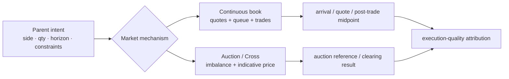

“平均成交价比到达时中间价好 2 个基点”看起来是一项明确的成交质量结论，但它可能混合了开盘拍卖与连续交易、可成交订单与被动限价单、上涨与下跌行情，以及完成订单与大量未成交订单。只展示一个平均值，好的数字既可能来自优秀执行，也可能来自挑选了更容易成交的样本。

本文的论点是：**成交质量不是成交价的单点排名，而是相对于明确决策时刻、市场机制、可执行基准和完整订单结果建立的反事实比较。** Spread、depth、队列位置、price impact 和 implementation shortfall 各自回答不同问题；只有时钟、订单生命周期和行情重建可信，它们才能组成可证伪的执行归因。

这是 Trading 路径 Chapter 25。前一章 [统一账户与组合保证金](/signal-grid-blog/posts/unified-account-and-portfolio-margin/) 处理跨资产风险聚合；下一章 [智能订单路由与执行算法](/signal-grid-blog/posts/smart-order-routing-execution-algorithms/) 将把本章的测量模型变成路由和调度决策。本文讨论工程测量，不构成交易或最佳执行法律意见；SEC Rule 605、Nasdaq Cross 等例子只适用于其规则覆盖的美国市场与业务日期，不能直接套用到期货、数字资产或其他法域。

## 先识别成交机制，否则相同价格没有可比含义

订单驱动市场通常把买卖意图放入限价订单簿，由价格、时间或其他 venue-specific 优先级撮合；集合竞价则把一段时间内的订单集中到一个或少数价格裁决。二者面对的反事实不同：连续交易问“当时可成交的盘口是什么”，拍卖问“在同一 imbalance 与规则下，哪个 clearing price 最大化可成交量并处理剩余优先级”。



[Nasdaq Opening and Closing Cross 官方说明](https://www.nasdaqtrader.com/Trader.aspx?id=OpenClose)展示了 venue-specific 差异：On-Open、Imbalance-Only、On-Close 等订单在指定 cross 参与，交易所还发布 imbalance 信息；其 [Cross FAQ](https://www.nasdaqtrader.com/content/ProductsServices/Trading/Crosses/openclose_faqs.pdf)说明开收盘 cross 会确定官方开收盘价。用连续簿上一秒的 best ask 评价一张 MOC 订单，会忽略订单实际选择的执行机制。

每笔评估对象因此要携带：

```text
ExecutionContext {
  parentOrderId,
  venue,
  instrumentVersion,
  sessionAndMarketState,
  mechanism,          // CONTINUOUS | OPEN_AUCTION | CLOSE_AUCTION | ...
  orderTypeAndTif,
  side,
  decisionTime,
  arrivalTime,
  executableTime,
  targetQuantity,
  limitAndParticipationConstraints,
  completionPolicy
}
```

`decisionTime`、`arrivalTime` 和 `executableTime` 不能合并。策略决定交易、broker 接收订单、venue 允许订单参与可能相隔很久；如果事后选择最有利的一个作为基准，就发生 benchmark shopping。

## Spread、Depth 与 Resilience 分别描述价格、容量和恢复速度

流动性不是一个数。至少要分开三维：

```text
quotedSpread(t) = bestAsk(t) - bestBid(t)

depth(side, Δp, t)
  = 在距离 best price 不超过 Δp 的价位内可见数量

resilience(shock, τ)
  = 冲击后在 τ 时间内 spread、depth 或价格恢复到指定基线的程度
```

Spread 小只说明最优买卖价格接近，不说明大单能否成交；depth 大只说明当时展示的数量，不保证它在你的订单到达前仍存在；resilience 快则说明流动性冲击后补充得快，但必须定义“冲击”和“恢复”。

| 观察               | 可以支持的结论             | 不能支持的结论             |
| ------------------ | -------------------------- | -------------------------- |
| best spread 收窄   | 顶层即时交易成本代理下降   | 大额执行成本一定下降       |
| 多档 depth 增加    | 给定价差范围的显示容量增加 | 隐藏流动性、撤单概率不变   |
| 冲击后 500 ms 恢复 | 该样本与指标下恢复较快     | 其他波动状态也会恢复       |
| 成交量很大         | 已发生交易活跃             | 未成交订单能以相同价格成交 |

Resilience 的实验必须围绕同类冲击对齐事件时间，例如大额 marketable order 或订单簿深度骤降，然后追踪多个 horizon 的 spread、midpoint 与 depth。只在一天结束后比较平均深度，会把“冲击后立即枯竭、几秒后恢复”和“始终中等”混成同一结果。

可见订单簿也不是全部流动性。iceberg、hidden、RFQ、内部化和跨 venue 流动性会改变可执行量；数据订阅深度、聚合规则与 feed 丢包还会改变观察。测量报告必须明确它评价的是“所见市场”还是“可路由市场”，不能把缺失数据解释为没有流动性。

## Price-Time 与队列位置决定被动单是否成交，却很少能被直接观察

在 price-time 场所，同价更早到达的订单通常优先；但另一些产品可能使用 pro-rata、size-time、allocation 或 auction-specific 规则。队列模型首先要绑定 venue、产品、市场状态和规则版本，不能只写 `queuePosition = volumeAhead`。

即使规则是 price-time，市场数据也通常不能完整暴露你的真实位置：

- 同价位订单可能在 feed 观察前已存在；
- cancel、replace、self-trade prevention 和部分成交会改变前序量；
- iceberg replenishment、隐含订单或优先级例外不可见；
- feed sequence Gap 让本地 depth 投影失去连续性；
- 本地下单时间不是 venue 接受时间。

因此队列位置应表示为区间或模型状态：

```text
QueueEstimate {
  orderId,
  venueAcceptedAt,
  priceLevel,
  lowerBoundAhead,
  upperBoundAhead,
  modelVersion,
  feedCursor,
  confidence,
  invalidatedByGap
}
```

被动单的质量也不能只评价“成交价格好”。未成交等待期间，市场可能朝不利方向移动；成交发生时，又可能正因为有信息的对手方选择在价格即将穿过时击中它。比较策略时至少同时报告 fill probability、time-to-fill、cancel/replace 次数、markout 和未完成量，而不是只对成功 fill 做幸存者分析。

一个可证伪的队列模型要做 calibration：按预测分位分组，比较预测 fill probability 与实际结果；在相同 venue、价格距离、市场状态和 horizon 下，预测 `80%` 的组应接近相应经验频率。若模型只输出排序分数而没有误差区间，它不能支持“预计 3.2 秒成交”这种精确结论。

## Adverse Selection 与 Price Impact 相关，但观察到价格移动不等于证明因果

流动性提供者成交后，市场朝对手方有利方向移动，常被称为不利选择；主动大单执行过程中推动市场，则常被描述为价格冲击。二者在数据上都可能表现为成交后 midpoint 变化，但因果解释不同。

令买入方向 `d=+1`、卖出方向 `d=-1`，成交价为 `p`，成交时或统一基准时的 midpoint 为 `m0`，之后 `Δ` 的 midpoint 为 `mΔ`。一个方向归一化的 markout 是：

```text
markout(Δ) = d × (mΔ - p)
```

对主动买入，正 markout 表示后续市场高于成交价；对被动卖方看则是相反的库存结果。报告若不声明视角，正负号会被解读成相反结论。

后续价格变化还可能来自公开新闻、整个市场 beta、相关资产冲击或订单本来就选择在趋势开始时执行。把 `mΔ-m0` 全部归因于本订单，会把相关性写成因果。更严谨的设计会提供对照：

- 与相同 instrument、时段、波动和订单大小的未执行/不同路由样本匹配；
- 用市场或行业因子去除共同价格移动；
- 分离 temporary impact 与较长 horizon 的 persistent component；
- 在多个 horizon 报告分布，而不是挑选一个最有利时点。

[SEC 2024 Rule 605 adopting release](https://www.sec.gov/files/rules/final/2024/34-99679.pdf)把 price impact 视作 adverse selection 的代理，并明确 realized spread 与 price impact 的关系；文件也提醒，由于有效价差和实现价差可能使用不同时间基准，监管报表里的分解不一定精确。这里的“代理”很重要：它是可操作的测量，不是对交易者信息状态的法律或心理判定。

## 有效价差与实现价差把同一成交拆成即时成本和事后价格移动

在一个内部一致、使用同一 `m0` 的分析模型里：

```text
effectiveSpread = 2 × d × (p - m0)
priceImpact(Δ)  = 2 × d × (mΔ - m0)
realizedSpread  = 2 × d × (p - mΔ)

effectiveSpread = priceImpact(Δ) + realizedSpread
```

对主动单，effective spread 衡量相对 midpoint 支付的即时成本；对提供流动性的一侧，realized spread 是在观察 horizon 后仍保留的价差代理。两者都不等于 broker 的会计利润，也不覆盖显式手续费、返佣、持仓风险和对冲成本。

[SEC Rule 605 最新 FAQ](https://www.sec.gov/rules-regulations/staff-guidance/trading-markets-frequently-asked-questions/frequently-asked-questions-rule-605-regulation-nms)给出了覆盖订单的统计口径，并说明 midpoint、effective spread、quoted spread 与 realized spread 使用已成交股份加权；2024 修订还增加了多个 realized-spread horizon 等指标。它是美国 NMS stocks 的法定报告合同，不是跨资产标准。数字资产报告若借用相同术语，应明确 consolidated best bid/offer 是否存在、跨 venue quote 怎样合成、locked/crossed market 怎样处理。

以下例子只演示公式，不代表任何 venue 合规报告：买单在 midpoint `100.00` 时以 `100.02` 成交，1 秒后 midpoint 为 `100.03`：

```text
effective spread = 2 × (100.02 - 100.00) = 0.04
price impact     = 2 × (100.03 - 100.00) = 0.06
realized spread  = 2 × (100.02 - 100.03) = -0.02
```

主动买方支付了相对初始 midpoint 的成本，但市场随后上移得更多；站在流动性提供者视角，负 realized spread 表明事后价格移动超过了收取的即时价差。若另选一个更有利的基准、只写成“获得 1 bp price improvement”，就会同时遗漏基准差异与这段时序后果。

聚合时应同时报告均值、中位数、尾部和样本权重。大额订单数量加权、parent-order 等权和 fill 等权回答不同问题，报告必须声明，不能在图表之间切换权重而不说明。

## Slippage 与 Implementation Shortfall 必须包含未成交量的机会成本

Slippage 经常被定义为成交价相对某个期望价格的差；问题是“期望价格”可能是下单前 last trade、arrival midpoint、模拟 quote 或策略生成价。没有固定 benchmark，slippage 只是一个可被选择的差值。

Implementation shortfall 更适合评价完整 parent order，因为它比较实际执行后的组合价值与决策时立即按基准完成的反事实。对买入目标数量 `Q`，决策价 `P0`，成交 `(q_i, p_i)`，评估结束时未成交量 `Q_u` 的价格 `P_end`，再加费用 `fees`，一个简化成本是：

```text
IS_buy = Σ_i q_i × (p_i - P0)
       + Q_u × (P_end - P0)
       + fees

Q = Σ_i q_i + Q_u
```

卖出方向应统一符号。第二项是 delay/opportunity cost 的简化代理：如果市场上涨而买单未完成，未成交也有成本；若策略按明确条件决定不再买，是否仍计入取决于 parent intent 和 completion policy。不能在事后把不利未成交量移出样本。

[Almgren–Chriss 的原始执行研究](https://doi.org/10.21314/JOR.2001.041)把执行问题表述为交易成本与价格不确定性的权衡。这提醒我们：最快完成可以降低未成交风险，却可能增加 impact；被动等待可以降低即时价差，却暴露机会成本。不存在脱离目标、horizon 和风险偏好的单一“最好成交”。

IS 还应按机制拆解而不双重计数：

```text
total shortfall
  = delay cost before first executable action
  + trading cost of executed quantity
  + opportunity cost of residual quantity
  + explicit fees/rebates under stated treatment
```

对跨币种或衍生品，所有项还要固定 FX、multiplier 和价格单位版本。先把不同资产转成美元、事后再用当天收盘 FX，会把汇率变化混入执行归因。

## 基准、时钟和行情质量决定指标是否真的可重现

精确到微秒的小数并不等于准确。订单事件与行情来自不同 feed、机器和时钟域；1 ms 的偏移足以让 benchmark 落到 price jump 的另一侧。测量管线必须同时保存源时间、接收时间和时间置信度：

```text
TimedFact {
  sourceTimestamp,
  sourceClockDomain,
  receiveMonotonicTimestamp,
  normalizedUtcTimestamp,
  synchronizationErrorBound,
  sequence,
  feedIdentity
}
```

[SEC Rule 613 / Consolidated Audit Trail](https://www.sec.gov/about/divisions-offices/division-trading-markets/rule-613-consolidated-audit-trail)要求报告事件能够贯穿订单生成、路由、修改、取消和执行被准确链接，并要求业务时钟同步；SEC 对 CAT NMS Plan 的说明还提到交易所时钟与 NIST 时间的严格同步标准。该规则不适用于所有市场，但它说明跨系统排序是审计与测量的前提，不是日志展示细节。

一个可发布的成交质量结果至少冻结：

| 证据                                             | 为什么必要                          |
| ------------------------------------------------ | ----------------------------------- |
| parent/child/fill 身份与完整终态                 | 防止只抽取成功成交                  |
| instrument、venue 与规则版本                     | 解释 tick、priority、auction 与 fee |
| 原始行情 sequence 与 Gap 区间                    | 证明 midpoint/depth 可重建          |
| benchmark 定义与计算代码版本                     | 防止事后换基准                      |
| clock offset/error bound                         | 量化事件错序风险                    |
| bust/correct、corporate action 与 symbol mapping | 避免历史数据静默漂移                |
| sample inclusion/exclusion reason                | 让幸存者偏差可审计                  |

行情 Gap 内的订单不应被悄悄沿用上一报价。可以标记 `BENCHMARK_UNAVAILABLE`、用明示的备用数据源并降低置信度，或从特定指标剔除；无论哪种，都必须保留原因与占比。剔除 1% 还是 40% 的样本，对结论可信度完全不同。

## 只有分组、对照与反例能把“改善”变成可证伪结论

全局平均通常由订单 mix 驱动。新算法上线后如果恰好遇到更低波动、更小订单或更高流动性，IS 下降不证明算法更好。最终归因应至少按预先定义的维度分组：

```text
instrument liquidity bucket
× volatility / spread regime
× side and order aggressiveness
× parent size / expected volume
× venue and market mechanism
× time-of-day / event window
× completion requirement
```

比较应使用同口径基线、时间上相近的 control 或可解释的配对样本，并报告置信区间与 tail。对同一 parent 做 counterfactual replay 可以辅助诊断，但 replay 无法知道算法改变后其他参与者会如何响应，不能当作真实因果实验。

一个合格声明应可被明确证伪，例如：

> 在预先登记的高流动性股票、正常波动、目标量不超过预测成交量 2% 的买卖 parent orders 中，新策略相对旧策略使数量加权 implementation shortfall 中位数下降至少 1 bp，同时 95 分位不恶化超过 0.5 bp，完成率差异在给定容差内；行情 Gap、auction 与人工干预样本单独报告。

相应证据必须能回答：样本是否完整，基准是否在实验前固定，两个策略面对的市场状态是否可比，改善是否只来自少成交，以及最坏尾部是否转差。如果其中任何一项不成立，正确结论是“证据不足”或“只在该分组有效”，不是把结果推广到所有订单。

本章最终把成交质量从价格印象还原为测量合同：市场机制决定合法基准，spread/depth/resilience 描述不同流动性维度，队列与不利选择解释被动执行的不确定性，effective/realized spread 和 IS 则在不同 horizon 分解成本。它们都不能单独证明最佳执行；只有完整订单生命周期、可重建行情、受约束时钟和预先定义的分组反例，才能让“执行改善”成为可复核、可推翻的技术结论。

下一章 [智能订单路由与执行算法](/signal-grid-blog/posts/smart-order-routing-execution-algorithms/) 将使用这些指标定义目标函数、在线约束和执行反馈，而不是用一个无法审计的“最佳 venue 分数”替代决策。
