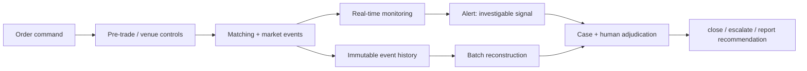
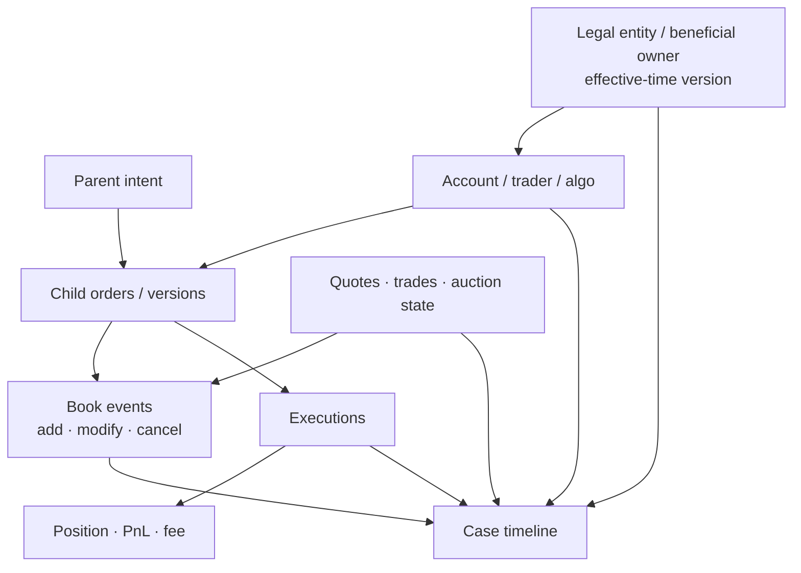
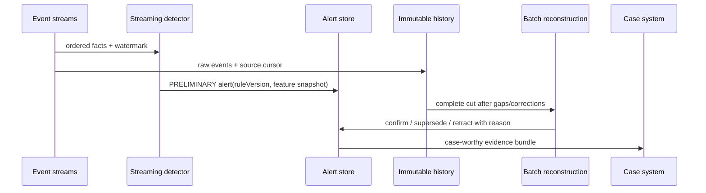
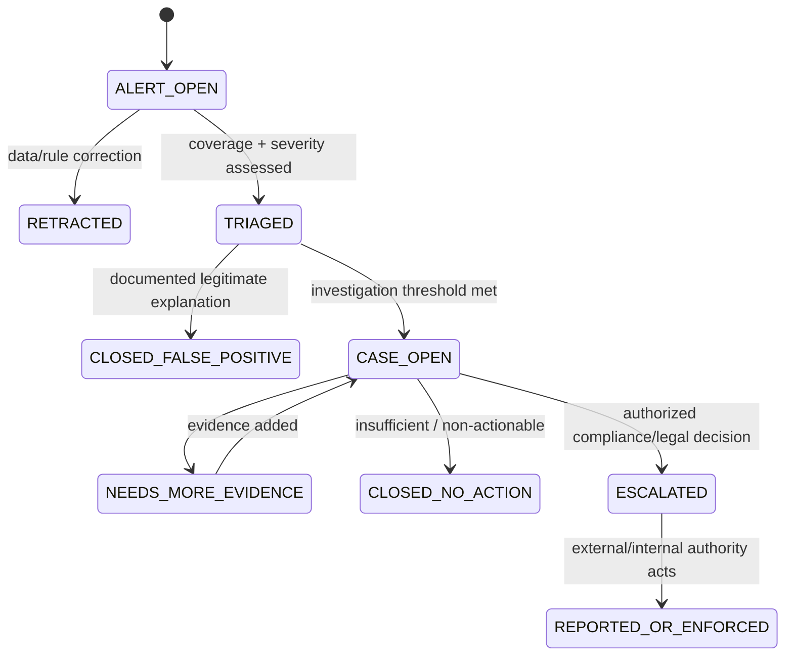

监控规则发现某账户在买盘堆出多层大单、价格上涨后迅速撤单，另一侧小单成交。这个模式值得调查，却不能仅凭规则命中就宣布“构成 Spoofing”：大单可能因风险限额、行情变化或父订单调度而合法撤销；真正的规则适用还依赖市场、行为上下文、账户关联、意图证据与法域标准。

本文的论点是：**市场监控系统产生的是可重建、可排序、可解释的调查线索；法律、监管或 venue 规则结论必须由完整证据和有权限的人类裁决形成。** 因此工程目标不是把告警率调到最高，而是让每个 Alert 能回到原始订单、成交、行情、账户与规则版本，让 Case 可以检验反例、记录判断并在历史规则变化后重放。

这是 Trading 路径 Chapter 28，也是当前交易系统主线的收束章节。阅读前应理解 [做市机制与策略](/signal-grid-blog/posts/market-making-mechanics-and-strategies/) 以及订单簿、OMS、账本和成交质量章节。本文不构成法律或合规建议；Spoofing、wash trade、市场操纵、报告义务、证据保留和受益所有人要求必须由适用法域、监管主体、venue 规则与专业人员裁决。

## Surveillance 与撮合风控保护的对象不同，不能共用一个裁决

撮合前风控和实时市场保护回答的是“这条命令现在能不能进入或继续影响市场”；Surveillance 回答的是“一段行为是否形成值得调查的模式”。前者通常有毫秒级阻断权限，依赖确定性限额和 venue 规则；后者跨越更长时间、多个账户和市场，允许候选、补数与人工判断。

| 系统                    | 输入                         | 典型动作                  | 合法结论                   | 不应直接得出的结论    |
| ----------------------- | ---------------------------- | ------------------------- | -------------------------- | --------------------- |
| Pre-trade Risk          | 当前订单、资金、信用与价格带 | reject、hold、kill switch | 命令不满足准入合同         | 交易者实施市场操纵    |
| Matching protection     | 订单簿与 venue 状态          | STP、价格保护、消息限流   | 命令违反执行或市场保护规则 | 账户具有非法意图      |
| Real-time monitoring    | 流式订单、成交和行情         | alert、升级观察、受控干预 | 市场或行为出现异常候选     | 已构成法律违规        |
| Post-trade Surveillance | 完整历史、账户关联、规则版本 | case、调查、报告建议      | 模式与证据达到调查阈值     | 无需人类/法务即可定罪 |

[CFTC Regulation 38.156/38.157 的成规说明](https://www.cftc.gov/LawRegulation/FederalRegister/FinalRules/2012-12746.html)区分了自动交易监控与实时市场监测：前者要能够处理订单和成交、识别模式、重建市场活动并支持深入调查，后者用于识别无序交易及市场或系统异常。这个美国 DCM 监管例子说明“实时”和“调查”都是必要能力，但不意味着一条实时规则就是最终执法裁决。



如果监控确需触发交易暂停或账户限制，动作也应经过独立、版本化的控制策略：`surveillanceAlertId -> interventionDecision -> authorizedAction`。这保留了“检测到什么”和“谁根据哪项权限采取了什么行动”的边界，避免模型误报直接造成不可逆客户影响。

## 调查始于把订单、成交、行情和账户事件拼成同一时间线

孤立 fill 很少能说明行为模式。Spoofing 候选需要订单新增、修改、撤销、对侧成交与盘口反应；wash-trade 候选需要买卖双方、受益所有人和持仓变化；跨市场操纵还要引用相关现货、期货、期权或结算基准。

最小事件图应保存稳定身份和原始来源：

```text
Order chain: parentOrderId -> clientOrderId versions -> venueOrderId
Execution: executionId / tradeId -> makerOrderId + takerOrderId
Market data: venue + channel + sequence -> book/trade event
Account: accountId -> legalEntityId -> beneficialOwnerVersion
Session: gatewaySession + participant/trader/operator identity
Rule: ruleSetVersion + featureVersion + thresholdVersion
Time: sourceTimestamp + receiveTimestamp + clockErrorBound
```

这些映射必须是业务日期有效的历史版本。账户今天属于 entity B，不能把它覆盖后用于解释去年属于 entity A 的交易；trader 换 desk、算法换 owner、账户代理权限变更也一样。



[SEC Rule 613 / CAT 说明](https://www.sec.gov/about/divisions-offices/division-trading-markets/rule-613-consolidated-audit-trail)要求美国 NMS 报告事件能够把订单从生成、路由、修改、取消到执行贯穿链接，并为账户与具有交易裁量权的人提供一致标识。它不是所有市场的 schema，却准确展示了调查为何需要身份链而不是几张按时间排序的日志表。

时钟也必须带误差界。若账户 A 的撤单和账户 B 的成交相差 80 微秒，而系统之间最大同步误差是 500 微秒，就不能声称撤单“一定发生在成交之后”。当顺序无法证明时，Case 应展示 partial order 或时间区间，不能由数据库排序产生伪精度。

Feed Gap、trade bust/correct 和 late report 必须进入时间线置信度。检测器可以先发 `PRELIMINARY` Alert，但完整性恢复前不能把缺失区间当作“没有其他订单”。

## Spoofing 与 Layering 规则只能筛选候选，撤单率本身不证明意图

高撤单率、短驻留时间、大额多层挂单、对侧小单成交、成交后快速撤单与价格反转，常被组合成 Spoofing/Layering 候选特征。但任何单一特征都有合法反例：做市更新、公允价变化、库存控制、价差扩大、风控 kill、父订单取消和 venue 重连都可能导致快速撤单。

[CFTC 的反干扰交易解释指引](https://www.cftc.gov/LawRegulation/FederalRegister/FinalRules/2013-12365.html)及其[问答](https://www.cftc.gov/sites/default/files/idc/groups/public/%40newsroom/documents/file/dtpinterpretiveorder_qa.pdf)把相关美国期货法规中的 spoofing 与下单时取消意图联系起来；[CME Rule 575 Advisory](https://www.cmegroup.com/rulebook/files/cme-group-Rule-575.pdf)则给出该 venue 对 bona fide orders、误导性消息和扰乱性行为的规则与例子。二者都说明**意图与适用规则重要**，而不是“撤单超过 90% 自动违规”。

一个候选模式可以明确写成可反驳的假设：

```text
H1: actor 在同一决策域中，于一侧提交显著展示量，
    该展示改变了可观察 depth/price，
    actor 同期在对侧寻求或获得成交，
    随后迅速取消展示量，
    且行为不能被已记录的合法策略/风险事件充分解释。
```

检测器只负责计算支持与反对 H1 的事实：

| 证据维度   | 支持候选的观察                      | 必须同时检查的反例                                |
| ---------- | ----------------------------------- | ------------------------------------------------- |
| 规模与分层 | 相对正常 depth 显著、多价位同向堆叠 | 客户真实大额执行、iceberg 替代、auction imbalance |
| 时序       | 对侧成交后展示量集中撤销            | 市场整体跳变、risk limit、session drop            |
| 可成交性   | 展示单远离预期成交却影响盘口        | 合理限价、逐级执行计划、tick 变化                 |
| 重复性     | 多日、多产品出现相似序列            | 同一算法正常做市模板、共同行情因子                |
| 经济结果   | 对侧获利或降低执行成本              | 亏损并不能排除，盈利也不能单独证明                |

Layering 常用于描述多个价位共同制造深度外观的候选，但具体术语和构成因规则而异。系统应把 `candidatePattern=SPOOFING_OR_LAYERING` 与 `applicableRuleAssessment` 分开，避免把内部标签当成正式法律结论。

## Wash Trade 需要穿透账户关系，自成交也不自动等于违规

买卖订单成交于相同 account 是最明显的自成交，但并非唯一 wash-trade 候选：不同子账户、法人、broker、算法或 nominee 可能受同一受益所有人控制；反过来，同一机构不同独立策略无意交叉，也不必然具有制造虚假交易的目的。

[FINRA Rule 5210](https://www.finra.org/rules-guidance/rulebooks/finra-rules/5210)提供了有用的美国证券市场边界：无受益所有权变化的同公司意外 self-trades 一般可能仍是 bona fide，但成员需要有政策程序审查并防止来自单一或关联算法/desk 的模式。这说明“同 firm”既不能自动定罪，也不能成为忽略重复自成交的理由。

关联图至少应按有效时间包含：

```text
account -> customer -> legal entity -> beneficial owner
account -> authorized trader / API key / algo / desk
entity  -> parent / subsidiary / common control
fund    -> manager / mandate / discretionary controller
device  -> session / network indicators (supporting evidence only)
```

设备、IP、资金往来或共同联系人只能支持关联调查，不能单独证明受益所有权。[FinCEN CDD Final Rule 页面](https://www.fincen.gov/resources/statutes-and-regulations/cdd-final-rule)说明其覆盖金融机构识别、验证法律实体客户的自然人受益所有人并持续监控的要求；这是特定美国合规范围，其门槛、例外和 2026 年更新不能被写成全球统一 UBO 定义。

Wash-trade 候选应区分至少三层：

```text
SELF_MATCH              // matching identities coincide
COMMON_CONTROL_CANDIDATE // historical relationship graph suggests shared control
NO_BENEFICIAL_CHANGE_HYPOTHESIS // case hypothesis requiring evidence
```

调查还要检验仓位和市场风险是否真实变化、订单是否预先协调、是否影响公开成交量/价格、STP 为什么没有阻止、策略是否独立、发生频率与经济结果。自动系统可以发现重复结构，却不能读取交易者主观目的。

## Streaming Detection 负责及时发现，Batch Reconstruction 负责完整解释

实时检测与批量重建不应竞争“谁是唯一真相”。流式系统在水位线前只有有限上下文，适合快速候选和风险升级；批量系统在交易日结束、补数和关联数据到齐后，可以重建更长窗口和跨市场关系。



流式 detector 必须声明 event-time window、allowed lateness、watermark 和 Gap 行为。迟到成交落入已关闭窗口时，不可静默忽略；要么产生 correction/retraction，要么标记待 batch 裁决。Alert 的身份最好由 `(ruleId, ruleVersion, subject, window, episodeKey)` 稳定派生，重放不能制造无穷重复案件。

Batch reconstruction 也不能只从流式聚合表读取，因为聚合已丢失反例。它应从不可变订单、成交、行情、账户版本和 source cursors 重建，验证：

```text
stream episode facts ⊆ complete batch episode facts
all known gaps are closed or explicitly unresolved
bust/correct and identity versions are applied as-of event time
```

实时与批量结果不同并不一定是 bug：可能是迟到数据、规则版本或窗口定义不同。真正的错误是没有记录差异来源，让 case analyst 看见两个互相冲突的分数却不知道哪个 cut 更完整。

过载时，Surveillance 不能靠随机丢弃低优先级事件降级。原始事实应先持久化；检测可以延迟、降低实时 feature 或转批处理，并公开 monitoring lag 和 coverage gap。若连原始事件都无法保全，系统必须宣告审计范围中断，而不是继续显示绿色状态。

## Alert 进入 Case 后才开始裁决，分数不能替代调查理由

Alert 是机器生成的候选；Case 是有负责人、证据、判断与期限的调查对象。多条 Alert 可能属于同一行为 episode，一条 Alert 也可能在补数后被撤回。直接让 `alertId = caseId` 会制造重复调查和相互冲突的结论。



Case 最少要冻结：

```text
Case {
  caseId,
  subjects,
  episodeWindow,
  applicableVenueAndJurisdiction,
  linkedAlertVersions,
  hypotheses,
  supportingEvidenceRefs,
  counterEvidenceRefs,
  coverageAndClockLimitations,
  analystDecisions,
  reviewerApprovals,
  disposition,
  dispositionRuleBasis,
  auditTrail
}
```

人工裁决不是一个可随意编辑的备注框。每个 disposition 要选择结构化 reason、引用证据与适用规则，由有权限的 analyst/reviewer 签署；后续发现新事实时追加新版本并 supersede，不覆盖原结论。

模型分数只能排序调查资源。阈值 `0.93` 不表示 93% 法律违法概率，除非模型经过与该命题匹配的校准，而现实标签通常是选择性调查结果、不是完整 ground truth。报告应同时展示覆盖率、precision 的可观察估计、analyst disagreement 和从 Alert 到 Case 的选择偏差。

## 规则版本和历史回放才能区分行为变化与检测器变化

监控阈值、feature、关系图、产品映射和 venue 规则都会变化。若系统只保存当前 SQL，昨天的 Alert 明天就无法解释；若直接用新规则覆盖历史结果，又会把检测器变化误认为市场行为突变。

每个 Alert 应保存完整执行合同：

```text
DetectionRunRef {
  ruleId,
  semanticRuleVersion,
  executableArtifactDigest,
  featureSchemaVersion,
  thresholdVersion,
  identityGraphVersion,
  marketDataCursorRange,
  orderTradeCursorRange,
  clockPolicyVersion,
  runId,
  generatedAt
}
```

历史回放至少有三个不同目的，不能混成一次重算：

| 回放类型               | 固定什么                    | 变化什么              | 能回答的问题                |
| ---------------------- | --------------------------- | --------------------- | --------------------------- |
| Reproducibility replay | 旧数据 cut 与旧规则全部固定 | 运行环境              | 旧 Alert 能否精确重现       |
| Rule backtest          | 同一冻结历史样本            | 候选新规则            | 新规则覆盖与误报怎样变化    |
| Correction replay      | 规则语义固定                | 补齐/更正后的权威数据 | 旧 Alert 是否因数据问题失效 |

误报不能只作为 analyst 的个人标签。关闭时应记录合法解释类别，例如 risk-triggered cancel、session recovery、independent desks、auction mechanics、market-wide repricing，并把它们转成新规则的反例 corpus。反例 corpus 必须保持调查权限和隐私限制，不能为训练方便复制到无治理环境。

规则发布门禁应是证据而非通用 checklist：在已裁决的时间分层样本上比较旧/新版本，报告新增命中、丢失命中、不同市场状态的 precision proxy、容量和延迟；对高风险漏检逐案说明。若标签只来自旧规则挑中的 Case，评估必须承认 selection bias，不能声称全市场召回率。

## 不可变证据、最小权限和保留策略共同决定结论能否被复核

调查证据不仅要“不能删除”，还要证明来源、版本、访问和导出过程。一个可验证 evidence bundle 可以包含原始事件分片、索引、schema、规则 artifact、身份图快照、时钟报告和 manifest digest：

```text
EvidenceManifest {
  caseId,
  artifactRefs[],
  contentDigests[],
  sourceCursorRanges[],
  schemaVersions[],
  createdAt,
  legalHoldId?,
  signerIdentity,
  exportAuditTrail
}
```

[SEC Rule 17a-4 电子记录 FAQ](https://www.sec.gov/rules-regulations/staff-guidance/trading-markets-frequently-asked-questions/rule-amendments-broker)说明美国 broker-dealer 可使用不可重写不可擦除的 WORM，或满足要求、能够重建被修改/删除原始记录的 audit-trail alternative。它不意味着所有机构都必须采用同一存储技术，也不意味着“放进 object lock”就自动满足适用保留义务；记录范围、期限、可访问性和出示要求必须按主体确认。

权限应至少分离：detector 能生成 Alert，analyst 能查看被授权市场与账户，reviewer 能批准 disposition，管理员能维护系统但不能静默修改 Case，导出者的每次访问可审计。受益所有人、设备标识和通信记录尤其需要 purpose limitation、字段级授权和最小披露；“为了监控”不是全员无限访问的理由。

保留策略也不是一条固定 `deleteAfter=7y`。它由记录类型、法域、venue、调查状态、legal hold 与诉讼/监管要求共同决定：

```text
effectiveDeletionTime
  = max(baseRetentionByRecordClass,
        venueOrJurisdictionRequirement,
        caseRetention,
        legalHold)
```

到期删除要由可审计策略执行，同时保留“不再持有”的最小证明；legal hold 生效时要阻止 compaction、对象生命周期和密钥销毁。相反，无限期保留所有账户数据也会扩大隐私与泄露风险，不是更安全的默认值。

这一章最终划清了监控系统的保证：它可以证明在给定数据 cut、身份版本和规则 artifact 下，某段行为满足了哪些候选条件；它不能从分数直接证明违法意图，也不能替有权限的调查、法律与监管流程下结论。只有流批结果可追溯、反例被认真检验、Case 决策版本化、证据具备完整性与受控访问，Alert 才会从“可疑图形”升级为经得起复核的交易审计事实。
