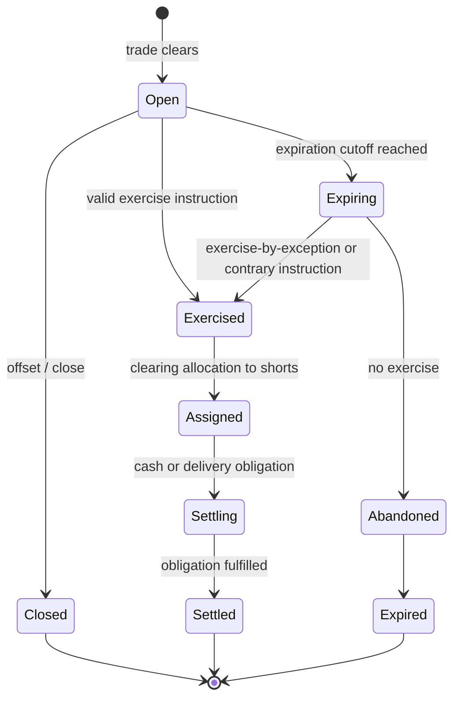
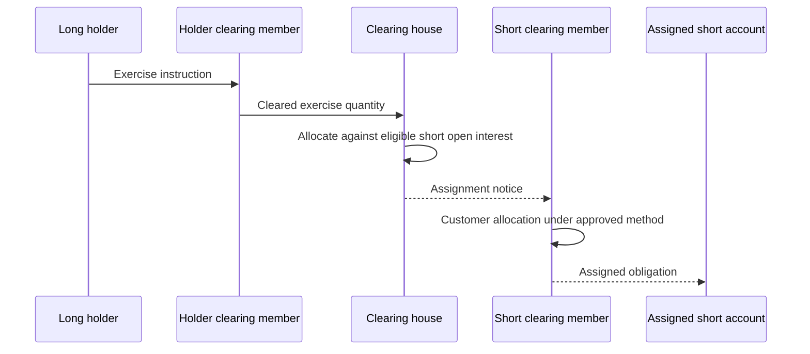

把期权理解成“期货再加几个 Greeks”，会在合约最重要的地方出错：期货多空双方通常承担对称的履约义务，期权买方取得的是一项**选择权**，卖方承担的是被选择后的义务。到期前是否可以行权、何时停止接受指令、如何把行权分配给空头、最终交付现金还是标的，都不是定价公式能决定的。

本文的中心论点是：**期权是一台由合约版本驱动的非对称状态机；成交只建立权利义务，Exercise、Assignment、Expiration 与 Settlement 才决定它如何终局。** 系统只有把这些阶段分别建模，才能在截止时间、重复消息和结算更正发生时恢复出同一个结果。

本文是交易系统学习路径的 Chapter 04。上一章 [现货、期货与永续合约](/signal-grid-blog/posts/derivatives-contracts-and-basis/) 已建立合约乘数、结算币种与到期规则这些产品事实；下一章 [订单类型与执行策略](/signal-grid-blog/posts/order-types-and-execution-strategies/) 再讨论如何交易这些合约。

> 本文讨论交易所交易期权的一般系统模型，不构成交易、法律或税务建议。美式/欧式、自动行权、经纪商截止时间、指派算法、价格单位与结算方式都以具体交易所、清算机构和经纪商的当期规则为准；文中的 OCC、Cboe 与 CME 案例均是 venue-specific 示例，不是跨市场标准。

## Call 与 Put 建立的是非对称权利义务

先固定四种基本头寸。这里的“买入、卖出标的”描述合约的经济权利；现金结算期权会用现金差额履行，而不真的交付标的。

| 头寸      | 持有人在规则窗口内的权利 | 空头被指派后的义务          | 建仓时的期权费方向    |
| --------- | ------------------------ | --------------------------- | --------------------- |
| Long Call | 按执行价买入标的         | Short Call 按执行价卖出标的 | Long 支付，Short 收取 |
| Long Put  | 按执行价卖出标的         | Short Put 按执行价买入标的  | Long 支付，Short 收取 |

权利不等于必须行使。Long 可以在到期前平仓、按规则提交 Exercise，也可以让没有经济价值的合约到期失效；Short 不能挑选对手方，也不能因为履约不利而拒绝 Assignment。卖方收到 Premium，是承担这项或有义务的对价，不是已经结清的最终盈亏。



这张状态图故意没有把 `ITM` 直接连到 `Settled`。价内只是一个依赖最终结算价的经济判定；是否产生行权、怎样指派及如何履约，还要经过各自的权威规则与记录。

## Premium、Multiplier 与价格单位共同决定真实现金额

行情里的 `2.50` 不能脱离合约规格解释。它可能表示每股 2.50 美元、每个指数点 2.50、基础币数量，或者另一种由产品定义的报价单位。对采用 upfront premium 的简单合约，现金额可抽象为：

```text
premiumCash
  = quotedPremium
  × quoteUnitValue
  × contractMultiplier
  × numberOfContracts
  × currencyConversionIfAny
```

这个式子只有在量纲同时成立时才有意义。例如：

```text
quotedPremium      [quote unit / underlying unit]
quoteUnitValue     [premium currency / quote unit]
contractMultiplier [underlying unit / contract]
numberOfContracts  [contract]
```

量纲约掉后才得到 premium currency。如果产品已把每张合约价值编入 `quoteUnitValue`，就不能再乘一次 `contractMultiplier`；真正的公式必须来自当期合约规格。

但这不是所有期权的统一结算公式。至少要版本化保存：

```text
instrumentId, optionType, underlyingId, strike,
expiryInstant, exerciseStyle, settlementMethod,
contractMultiplier, premiumQuoteUnit, premiumCurrency,
strikeQuoteUnit, settlementCurrency, productRuleVersion
```

美国标准股票期权常见一张对应 100 股，但公司行动可能调整乘数、执行价或交付篮子；期货期权的 Premium 则依赖底层期货的合约规模与报价方式。还有市场采用 futures-style premium：合约价值通过逐日变动处理，并非简单地在成交时一次性全额交换。系统因此不能把 `price × 100` 写成“期权公式”，更不能从交易代码猜乘数。

价格和金额还必须使用各自的整数最小单位或精确十进制类型。对 `quotedPremium`、最终现金额及币种换算分别规定精度与舍入，才能保证订单预估、清算结果和账本分录一致。

## European 与 American 决定合法行权窗口

European-style 通常只允许在合约规定的到期行权时点行权；American-style 通常允许从可行权日起至到期日（含）按规则行权。这里的地理名称不代表交易地点，也不能由标的是股票还是指数反推。

| 规则维度                 | European-style | American-style                       |
| ------------------------ | -------------- | ------------------------------------ |
| 到期前主动行权           | 通常不允许     | 通常允许                             |
| 空头提前被指派           | 通常没有       | 可能发生                             |
| 估值必须处理提前行权边界 | 一般不需要     | 需要，尤其涉及股息、借券与持有成本时 |
| 最终依据                 | 具体合约规格   | 具体合约规格                         |

Cboe 的美国市场案例能说明“产品决定规则”：许多股票与 ETF 期权是美式、实物交割；SPX 等指数期权通常是欧式、现金结算。但不能把这个组合推广到所有指数、期货或其他司法辖区。Cboe 的 VX 期货期权就是“欧式行权、实物结算为期货头寸”的另一种组合。

行权服务应读取 `exerciseWindowVersion` 并用交易所业务日历判断合法性，而不是只比较服务器本地日期。休市、提前收市、时区、底层合约到期日与期权自身到期日都可能改变窗口。

## Exercise、Abandon 与 Cutoff 是命令边界，不是同义词

Long 提交 Exercise，是在合法窗口内主张权利；Abandon 或 contrary instruction，是要求某个本来可能按默认流程行权的头寸不行权；Cutoff 则是清算链停止接受某类指令的边界。三者必须拥有独立的事件身份和裁决结果。

一些清算机构采用 exercise-by-exception：到期时达到其规则阈值的价内头寸默认行权，清算会员仍可在截止前提交相反指令。这个机制不等于“所有价内期权必然自动行权”：

- 阈值、参考价格和适用合约是 venue-specific；
- 客户经纪商可以设置早于清算机构的内部截止时间；
- 账户可能缺乏交付标的、现金或保证金，经纪商会有自己的处置规则；
- 停牌、价格更正和特殊公司行动可能触发例外流程；
- 指令发送超时会产生 `UNKNOWN`，不能靠重复发送一个无幂等身份的请求解决。

服务端应把 `receivedAt`、`businessDate`、`cutoffVersion`、`instructionId` 与原始渠道证据一起保存。截止前已接收但处理较晚的合法指令，不能因处理线程跨过 cutoff 就被错误拒绝；截止后到达的指令也不能通过回写时间戳混入前一批次。

## Assignment 是清算分配，不是找回原始卖方

集中清算后，行权买方通常不再与最初卖出合约的人维持一一对应关系。清算机构先把行权义务分配给持有相应空头的清算会员，再由会员依据获准规则分配给客户账户。



OCC 的标准程序使用带随机起点的 assignment wheel，另有适用 pro rata 的类别；CME 的期货期权资料也明确说明分配可能采用随机或按比例方法。它们证明的是**分配算法必须来自清算规则**，不是任何市场都该复制同一个随机算法。

系统至少要区分：

- `exerciseQuantity`：被有效行权的多头数量；
- `clearingAssignment`：CCP 分给某清算会员的数量；
- `customerAssignment`：会员分给最终空头账户的数量；
- `deliveryOrCashObligation`：指派后实际生成的履约义务。

若 Assignment 通知中断，空头账户不能因为“没有收到实时消息”就被当作没有义务。恢复要以清算机构的最终文件、序列或查询结果为权威，并让重复通知命中同一个 assignment identity。

## 到期价只决定经济状态，终局还需规则裁决

对执行价 `K`、最终结算值 `S_settle`，到期内在价值为：

```text
callIntrinsic = max(S_settle - K, 0)
putIntrinsic  = max(K - S_settle, 0)
```

`S_settle` 不是天然等于底层最后一笔成交。它可能是开盘特别报价、收盘价、时间窗口平均、指数计算值或底层期货的结算价，并绑定价格源、取样窗口、异常处理、精度和发布时间。AM-settled 与 PM-settled 合约即使引用同一指数，也可能得到不同的最终值。

因此终局判定至少需要两层：

1. `moneynessDecision` 根据最终结算值判定 ITM、ATM 或 OTM，并保存精确比较规则；
2. `exerciseDecision` 结合有效指令、默认行权规则与 cutoff，判定 Exercised 或 Abandoned。

价内程度小于费用、税收或交付成本时，持有人可能选择不行权；反之，在特殊情况下也可能提交 contrary instruction。交易停止、到期、最终结算值发布和结算完成是四个时间点，不能压成一个布尔字段 `expired=true`。

## 现金结算与实物交割产生不同的后续状态

现金结算通常把行权价值转换为结算币中的应收应付。简化的 long 现金结算额为：

```text
cashSettlement = intrinsicValue × multiplier × exercisedContracts
```

实际金额还可能受报价单位、币种转换、舍入、费用和合约上限影响。Long 的应收与 assigned Short 的应付必须在同一结算批次中配平；“计算出金额”不代表银行、托管或内部账本已经最终入账。

实物交割则生成两个相互依赖的义务：按执行价支付现金，以及交付 `multiplier × contracts` 的标的。期货期权的“实物”常指生成底层期货多空头寸，而不是立即搬运商品。CME 的一般示例中，Long Call 行权形成 long future，assigned Short Call 形成 short future；Put 的方向相反。

| 结果          | 新权威事实                     | 关键失败状态                          |
| ------------- | ------------------------------ | ------------------------------------- |
| 现金结算      | 结算币应收/应付与账本分录      | 金额已确定但入账结果未知              |
| 股票/ETF 交付 | 标的证券与执行价现金的交收指令 | 一腿完成、另一腿失败；fail-to-deliver |
| 期货头寸交付  | 底层期货的成对多空头寸         | 头寸已建立但下游风险快照尚未更新      |

结算引擎必须将 `obligation created`、`submitted`、`acknowledged` 与 `final` 分开。超时后的正确动作是按稳定 settlement identity 查询和对账，而不是重新生成第二笔义务。

## 版本化终局才能经受更正与恢复

最终结算值可能被官方更正，公司行动可能改变交付篮子，清算机构也可能发布替代文件。正确做法不是覆盖旧值并重跑所有当前代码，而是保留一条可审计的版本链：

```text
ExpirationRun {
  runId, instrumentVersion, cutoffVersion,
  positionSnapshotSequence, instructionCut,
  settlementPriceId, settlementPriceVersion,
  assignmentMethodVersion, status
}

Correction {
  correctionId, supersedesRunId, reason,
  authoritativeSource, effectiveAt
}
```

更正批次以冲正和替代事件表达，使下游仓位、账本和交收投影都能从同一来源恢复。至少要持续证明以下不变量：

| 不变量                                                      | 它排除的错误           |
| ----------------------------------------------------------- | ---------------------- |
| 同一 `instructionId` 最多产生一次有效行权裁决               | 重试导致双重行权       |
| 每个到期批次读取冻结的头寸与指令边界                        | 运行中仓位漂移         |
| 有效 Exercise 总量与 clearing Assignment 总量一致           | 空头义务丢失或凭空增加 |
| 每笔 Assignment 只生成一个可追踪的结算义务                  | 重放通知导致双重交付   |
| Settled、Expired 与 Closed 都是终态，不能被普通实时消息倒退 | 乱序消息复活合约       |
| 更正只能 supersede，不能抹掉原始版本                        | 无法解释历史余额变化   |

这套模型保证的是：在给定合约、价格、截止与分配规则版本下，系统能把同一头寸集合恢复成同一批可审计终局。它不保证期权一定盈利，也不保证默认行权永远符合持有人的经济利益，更不替代经纪商、清算机构和交收系统对外部履约的最终确认。

### 官方参考

- [OCC：Characteristics and Risks of Standardized Options](https://www.theocc.com/company-information/documents-and-archives/options-disclosure-document)——标准化期权的权利义务、行权、到期、公司行动与风险披露。
- [OCC：Standard Assignment Procedures](https://www.theocc.com/getcontentasset/0cdda3c2-ab81-450f-b8b8-7ce84d88fce7/dfc3d011-8f63-43f6-9ed8-4b444333a1d0/standard-assignment-procedures.pdf)——标准 assignment wheel、随机起点及适用例外。
- [Cboe：The Facts About Options](https://optionsfacts.cboe.com/)——美式/欧式行权与现金/实物结算的一手产品说明。
- [Cboe：Equity FLEX Options Specifications](https://www.cboe.com/tradable_products/equity_indices/flex_options/specifications)——证明行权风格、报价、乘数和结算方式都是产品规格，而非固定组合。
- [CME Group：Options on Futures Exercise and Assignment](https://www.cmegroup.com/clearing/options-on-futures-the-exercise-and-assignment-process.html)——期货期权的行权、指派算法与时序。
- [CME Group：Fundamentals of Options on Futures](https://www.cmegroup.com/education/whitepapers/fundamentals-of-options-on-futures)——Call/Put、Premium、执行价、到期和底层期货头寸关系。
