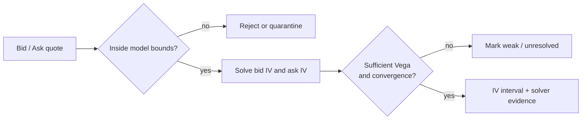
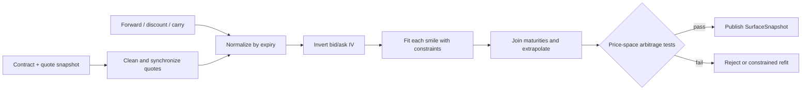

“给 Black-Scholes 输入一个波动率，就能得到期权真实价值”是两个误区的叠加：市场并不存在一个对所有执行价和到期日都相同的可观测波动率；模型输出也不是对未来收益的无条件预测。真实系统要先固定合约、Forward、利率、股息或持有成本与行情时点，再从带点差和噪声的报价中恢复一张满足约束的估值面。

本文的中心论点是：**期权估值是一条带版本的证据链——无套利关系约束可接受价格，模型定义从输入到价格与敏感度的映射，市场报价反解出隐含参数，曲面再把离散报价组织成可查询但仍有边界的风险快照。** Greeks 与 Surface 都是模型条件下的局部描述，不是市场承诺。

本文是交易系统学习路径的 Chapter 20。上一章 [保证金风险引擎](/signal-grid-blog/posts/margin-metrics-and-mark-price/) 已说明风险决定必须绑定仓位、价格与规则快照；本文把期权价格和敏感度接入该快照。下一章 [现货保证金融资](/signal-grid-blog/posts/spot-margin-lending-borrowing-interest-liquidation/) 再处理借贷现金流、抵押品与强平边界。

> 本文讨论标准 European/American vanilla options 的估值工程，不构成投资建议或模型认可。利率曲线、股息、借券成本、结算时点、行权规则和行情质量均依赖产品与 venue；文中的 Cboe 方法是 venue-specific 案例，模型与参数不能未经验证直接移植到其他资产。

## 无套利边界先于任何模型价格

估值输入必须引用 [期权合约生命周期](/signal-grid-blog/posts/options-contract-lifecycle-exercise-assignment-expiration-settlement/) 中的合约版本，而不是仅凭 `BTC-30SEP-C-50000` 一类显示代码猜测。最小快照至少包括：

```text
ValuationInput {
  instrumentVersion, optionType, exerciseStyle,
  strike, expiryInstant, settlementMethod, multiplier,
  spotOrForwardSnapshotId, discountCurveId,
  dividendOrCarryCurveId, borrowCurveId,
  marketQuoteSnapshotId, valuationInstant
}
```

对同一到期、同一执行价、同一结算条款的 European Call/Put，设 `F` 为该到期 Forward，`D` 为到期现金的折现因子，在常见非负标的与可复制假设下有：

```text
D × max(F - K, 0) ≤ Call ≤ D × F
D × max(K - F, 0) ≤ Put  ≤ D × K
Call - Put = D × (F - K)
```

最后一式是 put-call parity。它不是说任何两个屏幕中间价都必须精确相等：bid/ask、不同时间戳、交收、借券限制、税费和美式提前行权都会改变可交易边界。但若同一冻结快照中的清洁报价系统性违反基本上下界或执行价凸性，首先应怀疑数据、Forward 或合约映射，而不是立即“校准更复杂的模型”。

Forward 也不是 `spot × exp(rT)` 的无条件真理。股票要处理离散股息与借券，外汇涉及两条利率曲线，商品包含仓储和便利收益，期货期权可能直接以期货为底层。任何未绑定来源和版本的输入，都会让后续 IV 与 Greeks 失去可重放性。

## 模型与 Measure 决定输出可以解释什么

Black-Scholes-Merton 从无套利复制和特定动态假设推导 European option 价格；Black-76 常用于以 Forward/Futures 为输入的 European options；二叉树、有限差分或其他数值方法可显式处理 American early exercise 和离散现金流。模型选择取决于合同与用途，不存在跨产品唯一“正确公式”。

更重要的是区分两个问题：

- **风险中性估值**：在给定模型和可交易输入下，为无套利复制、报价与风险聚合构造价格；
- **真实世界预测**：估计未来价格分布、实现波动率、成交和对冲损益。

风险中性分布不是系统对真实上涨概率的直接预测。把由期权价格反解出的 IV 当成未来实现波动率的保证，或把 risk-neutral delta 直接解释成现实概率，都会越过模型边界。

| 合同/用途                          | 可选基准方法                | 不能自动保证的事                    |
| ---------------------------------- | --------------------------- | ----------------------------------- |
| European 股票期权，连续 carry 近似 | Black-Scholes-Merton        | 离散股息、借券紧张与跳跃风险        |
| European 期货/Forward 期权         | Black-76                    | 底层期货与期权结算时点一致          |
| American option                    | Tree / finite difference 等 | 网格足够细、公司行动处理正确        |
| Vanilla 曲面插值                   | SVI/SABR/样条等受约束参数化 | 外插区有流动性或适合 exotic hedging |

Black-Scholes 的历史价值在于给出一个透明的复制基准，不是证明现实波动率恒定。Dupire、SABR、SVI 等方法分别解决动态、Smile 拟合或参数化问题，也各自引入新的假设。模型名字不能替代模型验证。

## Greeks 是绑定约定的局部导数

若估值时点为 `t`、到期时点为 `T`，剩余期限为 `τ = T - t`，Greek 是在其他输入按约定冻结时对某个维度的局部敏感度：

```text
Delta = ∂V/∂S       Gamma = ∂²V/∂S²
Vega  = ∂V/∂σ       Theta = ∂V/∂t = -∂V/∂τ
Rho   = ∂V/∂r
```

上式中 Theta 的等号只在除时间外的输入都按声明约定冻结时成立；若每前进一天还同时滚动利率曲线、Forward 或 Surface，那就是另一种日历情景，必须单独命名。这些导数回答“在当前模型附近做一个规定大小的 bump，模型价格如何变化”，而不是定义期权的最大损失或保证下一笔 PnL。接口必须随数值一起返回约定：

| Greek | 容易被省略的约定                                           | 省略后的风险             |
| ----- | ---------------------------------------------------------- | ------------------------ |
| Delta | spot/forward、premium-adjusted、sticky strike/sticky delta | 对冲数量方向或尺度不一致 |
| Gamma | 对 spot 还是 forward 的二阶导，价格单位                    | 不同资产无法聚合         |
| Vega  | 波动率 bump 是 `1.0` 还是 1 vol point                      | 结果相差 100 倍          |
| Theta | 每年、每日还是 business day，是否滚动曲线                  | 日 PnL explain 对不上    |
| Rho   | 哪一条 discount/forward curve 被 bump                      | 多曲线风险被压成一个数   |

Delta hedge 只在小幅、连续变动和频繁再平衡的理想化条件下消除一阶风险。标的跳空、Gamma、Vol Surface 移动、交易成本、离散对冲和模型误差都会留下残余 PnL。所谓 `sticky strike` 与 `sticky delta` 还会给同一标的 bump 产生不同的 Vol 重映射，因此风险引擎不能只传一个裸 `delta=0.42`。

高阶 Greeks 只有在明确决策中增加证据时才值得计算。数值噪声很大的 vanna/volga 表格，不会比一个经过场景回放验证的 PnL explain 更可靠。

## 隐含波动率是带约束的数值反解

给定一个模型价格函数 `M(σ; inputs)` 和观察价格 `P_obs`，IV 是满足下式的参数：

```text
M(σ; inputs) = P_obs
```

它不是传感器直接观测的“市场波动率”，而是**在指定模型、Forward、曲线、时间和价格选择下**对报价重新编码。换用 bid、ask、mid、last trade 或另一条股息曲线，都会得到不同 IV。

一个稳健求解器应先验证价格位于模型的无套利边界内，再在正波动率区间用有界 Brent/bisection 一类方法求根。纯 Newton 法在 Vega 很小、初值差或临近到期的深度 ITM/OTM 区域可能发散；不能用 `NaN -> 0%` 把失败伪装成有效波动率。



保存 bid-IV 与 ask-IV 区间通常比只保存 mid-IV 更诚实：它保留了可交易不确定性。对零 bid、极宽点差、陈旧 quote、交叉市场和没有敏感度的点，应打质量标记或拒绝进入校准，而不是为了曲面“完整”强行填值。

## Smile、Skew 与 Term Structure 是同一张面上的不同切片

如果常数波动率模型完全描述市场，同一到期的各执行价会反解出相同 IV。现实中 IV 随 Strike 改变，形成 smile 或 skew；ATM IV 又随到期变化，形成 term structure。它们共同组成 `σ(K,T)`，但直接用绝对执行价比较不同到期并不稳定，因为 Forward 会移动。

常见坐标包括：

```text
forwardLogMoneyness k = ln(K / F(T))
totalVariance       w = σ² × T
```

也有外汇和做市系统以 Delta 作为横轴。Delta 本身依赖模型和 smile convention，所以“25-delta put”必须同时携带 delta 定义与曲面版本。

Skew 的形状是市场报价在某个时点的风险中性相对价格结构，不自动揭示单一成因。尾部需求、跳跃风险、供需和市场机制都可能影响它。Term structure 也不是把一个 30 日 IV 线性外推到一年；事件、流动性和不同时段的方差预期会形成局部结构。

Cboe 的 VIX 方法使用一组 SPX options 的 bid/ask mid-quotes，并明确过滤 zero-bid 等输入。它证明了“波动率指标依赖具体报价筛选与期限插值规则”，但 VIX 不是任意单个期权的 IV，也不是一张可直接用于所有产品估值的通用 Surface。

## 曲面构造必须同时拟合市场与排除静态套利

曲面构造不是对散点做漂亮的二维插值。一个可审计流程应保留从原始行情到已发布 Surface 的每一步：



对同一到期的 European Call，在统一折现与合约条款下，Price 关于 Strike 应非增且凸：

```text
∂C/∂K ≤ 0
∂²C/∂K² ≥ 0
```

前者排除垂直价差套利，后者对应 butterfly 约束。跨到期的 calendar 约束应在一致的 Forward/折现和坐标下在**价格空间**验证；简单要求“同一绝对 Strike 的 IV 永远随 T 上升”并不正确。

普通样条或无约束逐期 SVI 可以很好拟合样本，却仍在节点之间产生 butterfly/calendar arbitrage。Gatheral 与 Jacquier 给出的 SVI 研究说明，参数化只有配合明确条件才可保证无静态套利。即使整个校验网格通过，也只能证明指定域、分辨率和输入假设下未发现静态套利，不能证明外插到无限 Strike 或所有 exotic 都安全。

## 校准、版本与降级共同定义生产可用性

校准目标通常不应让一个流动性很差的尾部报价与紧点差 ATM 报价拥有相同权重。可以按 bid/ask 宽度、Vega、成交新鲜度和可靠性加权，但每种权重都在表达“系统相信什么”，必须成为版本化配置。

一个 Surface 快照至少应保存：

```text
SurfaceSnapshot {
  surfaceId, underlyingId, valuationInstant,
  contractUniverseVersion, quoteSnapshotId,
  forwardCurveId, discountCurveId, carryCurveId,
  modelFamily, modelVersion, calibrationConfigVersion,
  parametersByExpiry, acceptedQuoteIds, rejectedQuoteReasons,
  fitMetrics, arbitrageTestDomain, qualityState
}
```

行情中断或校准失败时，系统不能悄悄切换成 flat vol 并继续输出“正常”风险。安全降级取决于用途：

| 用途        | 可接受降级                          | 必须暴露的限制               |
| ----------- | ----------------------------------- | ---------------------------- |
| 用户展示    | last-good surface + 明确 stale 时间 | 不是实时可成交估值           |
| 风险监控    | last-good + 保守 vol/spot shocks    | 质量状态与附加风险缓冲       |
| 做市报价    | 缩量、加宽或停止受影响到期          | 禁止把 stale 面当新报价依据  |
| 清算/保证金 | 由治理批准的 fallback 规则          | 规则版本、触发原因与退出条件 |

恢复时先补齐行情与曲线，再用相同配置重新校准，并发布新的 `surfaceId`。不要原地修改旧参数；历史 PnL 和风控决定必须继续引用当时实际使用的快照。

## 验证与风险接口决定这张面能否成为证据

曲面发布前后的证明义务应围绕模型声称的性质，而不是围绕“优化器收敛”一个绿灯：

- **输入一致性**：合约、报价、Forward 与曲线时间戳处于允许的 skew 内；
- **价格回代**：模型价格落在目标 bid/ask 内，或残差符合已声明容忍度；
- **静态套利**：在发布域检查上下界、put-call parity、Strike 单调/凸性与跨期限约束；
- **数值一致性**：解析/自动微分 Greeks 与独立有限差分 bump 在容差内一致；
- **历史解释**：用固定 surface snapshots 重放 PnL explain，区分 spot、vol、time、rate 与 residual；
- **独立性**：关键合约由第二实现或受控参考值交叉验证，故障样本能被拒绝而非静默修复。

风险引擎接口不应只返回一个 Price：

```text
ValuationResult {
  positionId, instrumentVersion,
  surfaceId, curveIds[], modelVersion,
  valueBasis, positionQuantity, contractMultiplier,
  price, priceUnit, reportingCurrency, fxSnapshotId,
  delta, gamma, vega, theta, rho,
  greekConventions, bumpDefinitions,
  qualityState, warnings[], calculatedAt
}
```

`valueBasis` 必须明示 `PER_UNDERLYING_UNIT`、`PER_CONTRACT` 或 `POSITION`。估值和 Greeks 只有在归一到同一报告币种、并且对 `contractMultiplier` 与 `positionQuantity` 各应用且只应用一次后才能汇总，否则一个正确的 per-unit Delta 也会被误放大或缩小。

保证金与限额服务据此才能区分“正常模型风险”“使用陈旧 Surface 的保守估值”和“无可靠估值必须拒绝新增风险”。场景损失还应直接重估整个组合，不能只把一阶 Greeks 相加后冒充跳空或大幅 Vol 移动下的精确 PnL。

这条证据链保证的是：在给定合约、行情、曲线、模型与校准版本下，系统可以重建同一价格、Greeks 和经过声明域验证的 Surface。它不保证模型代表真实世界分布，不保证 IV 会实现，也不保证局部 Greeks 能覆盖跳跃、流动性枯竭和模型切换造成的损失。

### 一手资料与论文

- [Black & Scholes（1973）：The Pricing of Options and Corporate Liabilities](https://www.journals.uchicago.edu/doi/10.1086/260062)——从无套利复制推导 European option 定价的原始论文。
- [Cboe：American-Style Options Implied Volatility Calculation Methodology](https://cdn.cboe.com/api/global/us_indices/governance/Cboe_American_Style_Options_Implied_Volatility_Calculations_Methodology.pdf)——用 CRR tree 反解美式期权 IV、插值与外插的 venue-specific 方法。
- [Cboe：VIX Methodology](https://cdn.cboe.com/resources/vix/VIX_Methodology.pdf)——报价选择、zero-bid 过滤、期限插值与输入异常处理的一手方法。
- [Dupire（1994）：Pricing with a Smile](https://www.risk.net/sites/default/files/import_unmanaged/risk.net/data/Pay_per_view/risk/technical/1994/risk_0194_volatility.pdf)——从 European option 价格面连接风险中性密度与 local volatility 的原始论文。
- [Hagan、Kumar、Lesniewski、Woodward：Managing Smile Risk](https://www.next-finance.net/IMG/pdf/pdf_SABR.pdf)——SABR、Smile 动态和模型对冲边界的原始论文全文。
- [Gatheral & Jacquier：Arbitrage-Free SVI Volatility Surfaces](https://arxiv.org/abs/1204.0646)——带静态无套利条件的 SVI Surface 构造研究。
