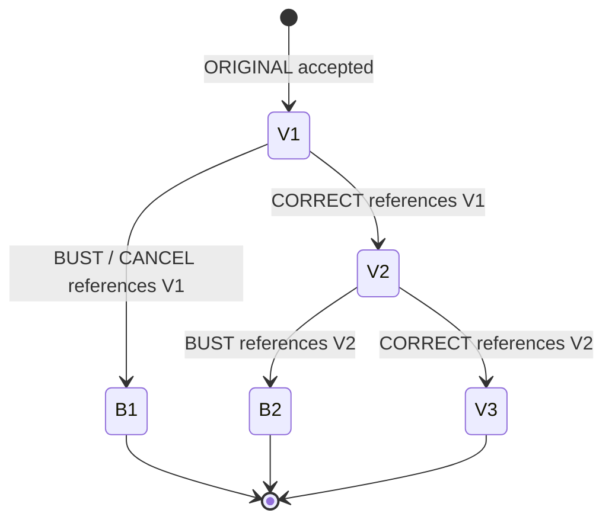
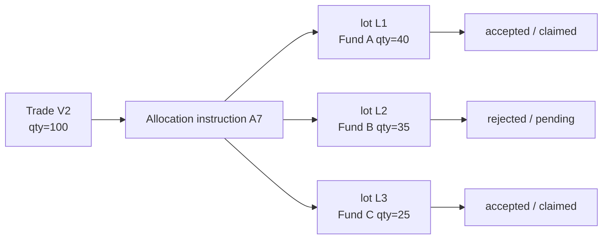
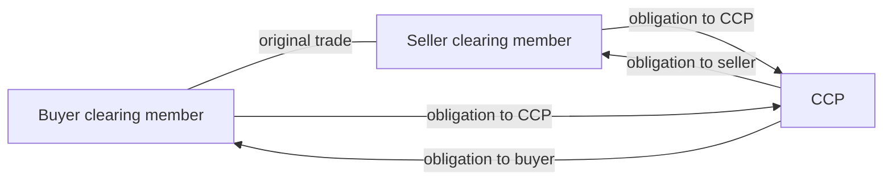
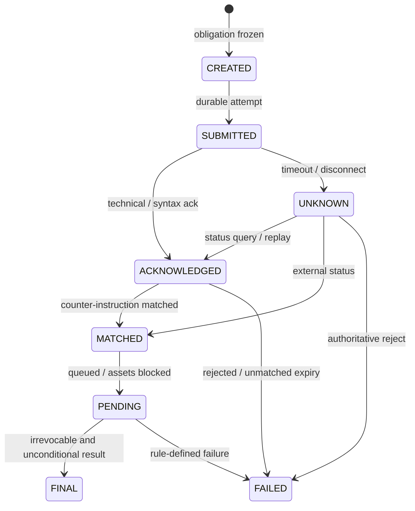
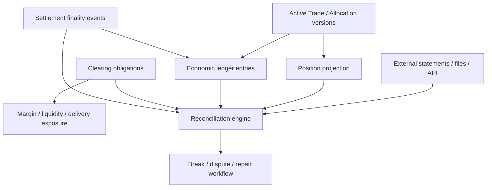

撮合引擎报告一笔成交，前台页面已经更新，仓位也增加了，于是系统很容易把这件事理解为“交易结束”。事实上，撮合只确定了某个市场规则下的成交事实；这笔事实还要被捕获、匹配、分配到账户、由清算安排承接、转换为应收应付义务，最后通过资金、证券、商品或其他资产转移获得法律与操作上的最终性。

本文的中心结论是：**撮合产生的是成交事实，清算系统负责把它转化成最终可履行的义务。** `Fill`、`Trade`、`Clearing Instruction`、`Obligation` 与 `Settlement Result` 不是同一对象的几个状态，而是不同所有者在不同权威域中生成的事实。把它们压进一张可覆盖的 `trade` 表，纠错、give-up、净额和结果未知很快就会互相污染。

本文是交易系统学习路径的 Chapter 12，承接 [行情数据管线与订单簿重建](/signal-grid-blog/posts/market-data-pipeline-and-order-book-reconstruction/) 对撮合公开投影的边界；下一章 [合约仓位生命周期](/signal-grid-blog/posts/position-lifecycle-and-pnl/) 会说明清算认可的成交怎样形成账户仓位与盈亏。

本文以 [FIX Trading Community 的 Trade Capture 模型](https://fiximate.fixtrading.org/en/FIX.Latest/msg64.html)、[CPMI-IOSCO PFMI](https://www.bis.org/cpmi/publ/d101.htm) 和公开 CCP/交易所规则建立通用工程模型，资料核对截止 2026-08-27。实际 novation 时点、give-up 责任、净额法律效力、结算资产和 finality 都取决于产品、交易场所、CCP、CSD/支付系统、会员协议与司法辖区；文中 CME 等案例只证明“规则必须显式”，不构成跨市场的统一规则或法律意见。

## Fill、Trade 与 Clearing Instruction 是三层事实

撮合核心最自然的输出是 `Fill`：某个权威撮合序列位置上，买卖两张订单以价格 `p` 成交数量 `q`。但后续系统需要的 `Trade` 往往还包含业务日、市场、交易类型、交易双方、清算资格、费用口径与修正身份；再向清算基础设施提交时，还可能形成一个或多个 `ClearingInstruction`。


三层对象解决的问题不同：

| 对象                  | 权威问题                                                | 典型身份                                   | 不能单独证明                       |
| --------------------- | ------------------------------------------------------- | ------------------------------------------ | ---------------------------------- |
| `Fill`                | 撮合序列中哪两侧成交了多少？                            | venue match/fill ID + side/order scope     | 已获清算接受、已正确分配或已结算   |
| `Trade`               | 哪份经济成交记录当前有效，双方和条款是什么？            | scoped trade ID + version/correction chain | CCP 已 novate 或结算资产已转移     |
| `ClearingInstruction` | 哪份 trade/version 以什么账户、会员和产品规则提交给谁？ | instruction ID + submission attempt        | 外部已接受，或 settlement 已 final |

一笔 fill 是否一对一成为 trade 没有通用答案。场所可能把两侧分别报告，按组合腿拆分，按平均价组聚合，或把场外协商交易直接送入 trade capture 而没有本地撮合 fill。[FIX `TradeCaptureReport(35=AE)`](https://fiximate.fixtrading.org/en/FIX.Latest/msg64.html)明确允许报告双方成交、送往 trade matching system、主动报告以及 matched/unmatched trades，本身就比“撮合回报”覆盖更广。

因此内部模型应保存来源关系，而不是强行一对一：

```text
FillRef[]  --supports--> TradeVersion
TradeVersion --submitted-as--> ClearingInstruction[]
ClearingInstruction --accepted-as--> ClearingRecord / Obligation[]
```

这条 lineage 让系统能回答：一个仓位来自哪版成交，一条结算指令基于哪次 allocation，修正后哪些下游投影必须反向或重算。没有 lineage，后续只能用金额和时间“猜哪条对哪条”。

## Trade Capture 需要稳定实体身份和独立消息身份

Trade capture 至少同时处理两类身份：**经济成交实体**与**报告消息**。两者看似相近，在重放与更正时却必须分开。[FIX Latest TradeCaptureReport](https://fiximate.fixtrading.org/en/FIX.Latest/msg64.html)支持两种模型：用 `TradeID(1003)` 标识 trade entity，或用 `TradeReportID(571)` 与 `TradeReportRefID(572)` 形成消息链。

内部模型可以写成：

```text
TradeKey = (
  sourceSystem, environment, market,
  clearingBusinessDate, tradeIdScope, tradeId
)

TradeReportKey = (
  sourceSystem, reportSessionOrFile,
  reportId
)

TradeVersion = (
  tradeKey, version,
  effectiveEventId, transactionType,
  priorVersionRef, payloadHash
)
```

为什么不能只用一个 `tradeId`？因为不同 venue、环境、业务日和清算服务可能重复使用相同裸值；同一 trade 又可能有多份报告、重发、对手方视角、平均价派生或监管副本。相反，如果只用 `TradeReportID` 当实体主键，每次 correction 都会看成一笔新成交。

捕获层还必须冻结会改变经济含义的主数据版本：instrument、multiplier、price/quantity unit、currency、trade date、clearing business date、party/account、market、trade type 与 settlement convention。将 `symbol=ABC` 留到夜间再查“最新主数据”，可能用新版 multiplier 重算旧成交。

一个适合审计的写入路径是：

```text
1. persist raw report with source cursor and receive time
2. validate schema, identity scope and referenced master-data versions
3. derive TradeKey and TradeReportKey using the active venue profile
4. deduplicate the report message; never deduplicate a correction as an original
5. append TradeVersion / RejectedTradeReport
6. publish downstream effects from the accepted version graph
```

`TradeCaptureReportAck` 只证明接收方按其 profile 接受或拒绝了这份报告；它不自动代表 CCP novation，更不代表结算最终性。每个外部确认必须绑定它实际确认的对象和阶段。

向 CCP 或清算服务提交 `ClearingInstruction` 时也需要稳定 `instructionId`、不可变 payload digest 与 attempt history。网络超时只能得到 `CLEARING_SUBMISSION_UNKNOWN`；恢复应先以原身份查询或重放同一指令，不能换新 ID 再提交一份经济上相同的 trade。后续 `ACCEPTED/REJECTED/NOVATED` 必须引用原 instruction 和被接受的 trade/allocation version。这个 Unknown 属于“是否进入清算”的边界，和后文“结算资产是否最终转移”的 Unknown 是两段独立风险。

## Bust 与 Correct 应追加版本，而不是覆盖历史

成交可能被 bust、correct、reverse 或 restate。最危险的实现是直接修改原 trade 的 `price/qty/status`：下游曾经基于旧值记过仓位、费用和账，覆盖之后既不知道差异何时生效，也无法证明冲正是否只执行一次。

更安全的模型是不可变版本图：



[FIX `TradeReportTransType(487)`](https://fiximate.fixtrading.org/legacy/en/FIX.4.4/tag487.html)标识 trade report 的事务类型，`TradeReportRefID(572)` 用于 cancel/replace 引用。这里的 replace 是成交报告版本变化，不是订单 Cancel/Replace。每个新事实都应保存 `effectiveAt`、source cursor、旧版引用、reason 和 payload digest。

下游不应“再收一笔负数量 trade”却丢失因果关系，而应消费显式效果：

```text
TradeAccepted(V1)       -> apply economics(V1)
TradeCorrected(V1, V2)  -> reverse economics(V1), apply economics(V2)
TradeBusted(V2, B2)     -> reverse economics(V2)
```

这些效果必须以 correction event ID 幂等。重复收到同一个 bust 不得再冲一次；收到指向未知旧版的 correct 也不能猜测，应进入 `REFERENCE_GAP` 并请求历史。若 correction 在净额、保证金或结算指令生成后到达，下游需要生成新的 obligation adjustment 或按规则进入人工异常流程，不能静默改写已 final 的外部结果。

版本不变量至少包括：

```text
C1: 同一 TradeKey 在同一有效切点最多一个 active economic version
C2: 每个非 original 版本必须引用可证明的先前版本或进入 gap
C3: correction/bust 的每个下游反向效果最多应用一次
C4: 已达到法律 finality 的结算结果不被本地覆盖；后续变化是新义务或规则化补救
```

这使恢复从“把数据库修成最终值”转变为“重放版本图得到相同当前值和相同历史责任”。

## Allocation 与 Give-up 改变账户归属，也改变责任链

执行账户不一定是最终持仓账户。资产管理人可能把一笔 block trade 分配给多个基金；执行经纪商可能按 give-up 安排把成交交给 carrying/clearing firm。Allocation 不是给 trade 补一个 `accountId`，而是产生带数量守恒、接受状态和责任转移点的新对象。

[FIX AllocationInstruction](https://fiximate.fixtrading.org/legacy/en/FIX.4.4/body_495774.html)把一个订单或订单集合拆分到一个或多个账户；[CME Front End Clearing FIXML API](https://www.cmegroup.com/clearing/files/allocate-claim-fixml-api-users-guide-overview-v2-3.pdf)则展示了 venue-specific 的 give-up/claim 流程，包括按单笔或分组分配、claim firm/account 和后续 claim。



分配层至少维持：

```text
sum(active allocation quantities) + unallocatedQty == active trade quantity
```

但“active”必须按版本和状态解释。部分 allocation 可以接受、另一些拒绝；原 trade 被 correct 后，旧 allocation 可能需要 cancel/reallocate；平均价组还可能把多笔 execution 重新分配为不同的 account lots。不能在 instruction 发出时就把全部数量从执行账户移走。

Give-up 的核心是责任转移点，而不是消息发送成功。CME 公布的 [Allocate and Claim 规则说明](https://www.cmegroup.com/tools-information/lookups/advisories/clearing/Chadv11460.html)明确给出其场所案例：为 give-up 执行的 trade 在 carrying firm claim 之前仍由 executing firm 负责。别的市场可能有不同 agreement、时间窗和自动接受规则，因此模型要显式保存：

```text
responsiblePartyBeforeClaim
claimingParty
claimState = PENDING | ACCEPTED | REJECTED | REVERSED
responsibilityEffectiveEvent
```

只有权威 claim/acceptance 事件到达，风险、保证金和仓位所有者才按规则迁移。超时不是接受，也不是拒绝；它是分配结果未知，并且旧责任不能提前消失。

## Novation 把交易对手风险转换为 CCP 义务

中央对手方并不是“交易所数据库的另一个副本”。在适用的法律和规则下，CCP 通过 novation、open offer 或类似安排介入交易，成为卖方的买方和买方的卖方。原双边关系何时被替换，是法律与 rulebook 事实，不由内部 `cleared=true` 布尔值决定。



[CPMI-IOSCO PFMI](https://www.bis.org/cpmi/publ/d101a.pdf)把 CCP 定义为介入市场合约、成为每个卖方的买方和每个买方的卖方的基础设施，同时强调法律基础、信用、流动性、抵押品和违约管理。CCP 降低参与者之间的双边风险，但也集中风险；“已送清算”绝不等于“风险已经消失”。

Novation 生效点必须来自具体规则。例如 [CME Rulebook Rule 804](https://www.cmegroup.com/rulebook/CME/I/8/8.pdf)规定其清算所于买卖双方清算会员提交的 trade data 成功匹配后，通过 novation 替代为相关合约的买方与卖方。这是 CME 的明确规则，不应推导成“所有 CCP 都在撮合时 novate”。另一市场可能在执行时 open offer、在双方确认时 novate，或对不合格 trade 拒绝清算。

系统需要分别保存：

```text
tradeCaptureState   = CAPTURED | MATCHED | REJECTED | DISPUTED
clearingState       = SUBMITTED | ACCEPTED | NOVATED | REJECTED | UNKNOWN
novationRuleVersion = rulebook + market + product + effectiveDate
counterpartySet     = beforeNovation / afterNovation
```

若 CCP 拒绝或暂时无法确认，原责任按适用合同继续存在还是进入异常处置，必须由规则决定。内部系统不能因 API timeout 自行制造 novation，也不能在收到技术 ack 后删除原对手方信息；它必须保留完整 lineage 以支持违约、争议和监管取证。

## Gross 与 Net Obligation 不是简单的数据库求和

清算系统可以逐笔保留 gross obligations，也可以在合法 scope 内进行 bilateral 或 multilateral netting。净额减少待结算数量和流动性需求，却会丢失逐笔可见性；更重要的是，数学上可相加不代表法律上可抵销。

净额键至少包含：

```text
NettingSet = (
  clearingEntity, clearingMember,
  accountOrOmnibusScope,
  productOrFungibilityClass,
  settlementAsset, settlementLocation,
  valueDate, settlementCycle,
  ruleVersion
)
```

对同一 netting set，可从有效 trade/allocation versions 推导：

```text
netQuantity = sum(signedDeliveries)
netCash     = sum(signedCashObligations + eligibleFeesOrAdjustments)
```

但 `eligible` 是关键。不同币种、不同 CSD、不同 value date、客户隔离账户、不同法律实体或不可互换证券通常不能因为字段长得相似就跨集合抵销。费用、保证金、variation margin 和本金结算也可能处在不同义务域。

[BIS 的 DvP 报告](https://www.bis.org/cpmi/publ/d06.pdf)区分 gross、bilateral/multilateral netting、position netting 与 payment netting；[PFMI](https://www.bis.org/cpmi/publ/d101a.pdf)进一步指出，无论采用 gross 还是 net，技术、合同、法律和风险框架都要保证相互关联义务的最终性关系。数据库 `GROUP BY member, currency` 只能计算一个数，不能建立净额协议的可执行性。

因此净额结果应是可追溯的派生对象：

```text
ObligationBatch {
  nettingSet,
  generation,
  inputTradeVersionIds[],
  grossLegsHash,
  netLegs[],
  ruleVersion,
  status
}
```

trade bust/correct 到达时，不能覆盖旧 batch。若 batch 尚可撤销，生成 superseding generation；若已进入不可撤销或 final 阶段，按规则生成 adjustment、next-cycle obligation 或异常处置。净额提高效率，但绝不允许删除从净义务回溯到 gross trades 的证据。

## Settlement Instruction 的技术成功仍可能留下结果未知

结算指令把清算义务交给支付系统、CSD、托管人、清算银行或交割设施。它可能包含现金腿、证券腿、币种、数量、账户、value date、settlement location 和 DvP/PvP/FoP 模式。发送成功、消息被接收、指令匹配、资产被锁定、最终转移是不同阶段。



[FIX `SettlementObligationReport`](https://fiximate.fixtrading.org/en/FIX.Latest/msg102.html)用于报告最终的货币结算义务；FIX Latest 还分别定义 Settlement Instructions 和 Settlement Status 消息。字段齐全与消息 ack 只说明协议处理阶段，真正 finality 必须由外部系统及其规则确认。

[PFMI Principle 8](https://www.bis.org/cpmi/publ/d101a.pdf)要求 FMI 清晰界定结算何时 final，并至少在 value date 结束前提供明确最终结算；final settlement 是不可撤销、无条件的资产转移或义务解除。这个定义说明“银行 API 返回 200”“链路收到 ACK”或“本地状态写成 COMPLETED”都不能自行创造 finality。

结果未知时，重试必须复用稳定 `instructionId` 和同一 payload digest，并先查询/恢复原指令。生成新 ID 直接重发可能造成两笔都有效的支付或交割。系统还要区分：

| 外部观察                         | 本地状态                | 安全动作                          |
| -------------------------------- | ----------------------- | --------------------------------- |
| 明确 syntax reject，且未进入处理 | `REJECTED_NOT_ACCEPTED` | 修正后以新版本提交                |
| timeout，外部可能已接受          | `UNKNOWN`               | 用原身份查询/恢复，禁止盲目新建   |
| matched 但未 final               | `PENDING_SETTLEMENT`    | 保留 obligation 与流动性/库存占用 |
| final confirmation               | `FINAL`                 | 只执行一次最终结转                |
| final 后出现差异通知             | 新 adjustment/dispute   | 不覆盖原 final 证据               |

结算消费者必须幂等处理状态重放；超时期间也不能释放交付资产或现金预算。所谓“最终一致”只有在存在明确的外部 finality 事件、查询协议和异常升级路径时才有工程含义。

## 仓位、账本与外部对账各自证明不同命题

清算链最终会影响仓位、账本、风险、费用和外部结算，但任何单一投影都不能反过来替代源事实。仓位回答某账户在某口径下持有什么；双重记账回答内部经济变动是否平衡；外部对账回答本地记录是否与 venue、CCP、clearing broker、custodian、CSD 或 bank 的声明一致。



边界可以用以下映射表达：

| 投影或证据              | 权威输入                              | 能证明                   | 不能证明                         |
| ----------------------- | ------------------------------------- | ------------------------ | -------------------------------- |
| OMS fill view           | execution/private reports             | 订单产生了哪些成交回报   | trade capture/clearing 已接受    |
| Position                | active trade/allocation versions      | 账户数量、成本与方向投影 | 内部账平衡、外部资产已转移       |
| Ledger                  | trade、fee、margin、settlement events | 内部借贷守恒与余额变动   | CCP/CSD/银行同意这些记录         |
| Obligation              | clearing/netting generations          | 谁在何时应交付什么       | 义务已经 final discharge         |
| External reconciliation | 对方独立记录                          | 双方在某切点是否一致     | 哪一方必然正确，或法律争议已解决 |

恢复时应从不可变的 trade version graph、allocation/claim facts、clearing acceptance、obligation generations 和 settlement events 重建所有投影，再按同一 cut 与外部声明对账。不能拿当前仓位表反推出历史 trades，也不能因为双重记账借贷相等就断言外部 CCP 真的持有相同义务。

一组可验证的不变量是：

```text
R1: 每个 position/ledger delta 都能回溯到唯一 active economic event
R2: bust/correct 使旧经济效果被显式反向，新效果只应用一次
R3: allocation activeQty + unallocatedQty 与 active trade qty 守恒
R4: 每个 obligation batch 可回溯到精确 gross inputs 和 rule version
R5: FINAL 只来自外部规则认可的 finality evidence
R6: reconciliation break 不通过覆盖本地或外部历史“消失”
```

故障测试要覆盖 trade report 重放、未知引用 correction、部分 allocation reject、claim ack 丢失、CCP 接受前断线、净额生成中途崩溃、settlement timeout 后重复回报以及 final 后 correction。通过标准是重放后 active versions、仓位、账本、obligation 和 break 集合完全一致，而不是“批处理最终跑完”。

## 清算完成的含义由最后一条可证明义务决定

撮合引擎能够证明一笔 fill 在权威序列中发生；trade capture 把它变成带身份和版本的经济事实；allocation/give-up 决定账户和责任归属；CCP 规则决定是否以及何时 novate；netting 在法律允许的集合内生成 gross 或 net obligations；settlement infrastructure 最终决定这些义务是否不可撤销、无条件地解除。

这条链没有任何一个通用 `SUCCESS` 可以跨越全部阶段。可靠系统保留每一步的对象、身份、版本、rule generation、结果未知和外部证据，让 correction 能显式反向，让 give-up 责任不会提前消失，让净额仍可回溯到逐笔成交，让 finality 不由本地想象。下一章才能在这个基础上讨论仓位：**仓位不是撮合消息的计数，而是被当前有效成交与账户归属共同约束的投影。**

### 一手资料

- [FIX Trading Community：TradeCaptureReport](https://fiximate.fixtrading.org/en/FIX.Latest/msg64.html)——matched/unmatched trade、trade entity 与 report message chain 的标准字段。
- [FIX Trading Community：TradeReportID](https://fiximate.fixtrading.org/en/FIX.Latest/tag571.html)、[TradeReportTransType](https://fiximate.fixtrading.org/legacy/en/FIX.4.4/tag487.html)——报告身份、cancel/replace 引用和版本事务类型。
- [FIX Trading Community：AllocationInstruction](https://fiximate.fixtrading.org/legacy/en/FIX.4.4/body_495774.html)——订单/成交集合向一个或多个账户分配的一般消息模型。
- [CME Group：Front End Clearing FIXML Allocate/Claim Guide](https://www.cmegroup.com/clearing/files/allocate-claim-fixml-api-users-guide-overview-v2-3.pdf)——CME give-up、group、allocation 与 claim 的具体协议规则。
- [CME Group：Allocate and Claim responsibility](https://www.cmegroup.com/tools-information/lookups/advisories/clearing/Chadv11460.html)——claim 前 executing firm 责任的场所案例。
- [CME Rulebook Chapter 8](https://www.cmegroup.com/rulebook/CME/I/8/8.pdf)——Rule 804 的 CME novation 生效条件与清算所责任边界。
- [CPMI-IOSCO：Principles for Financial Market Infrastructures](https://www.bis.org/cpmi/publ/d101.htm)——法律基础、CCP、settlement finality、money settlement 与 physical delivery 原则。
- [BIS：Delivery versus payment in securities settlement systems](https://www.bis.org/cpmi/publ/d06.htm)——gross/net、DvP 模型、principal risk 与最终转移的权威框架。
- [FIX Trading Community：SettlementObligationReport](https://fiximate.fixtrading.org/en/FIX.Latest/msg102.html)——CCP 或交易对手报告最终货币结算义务的消息模型。
