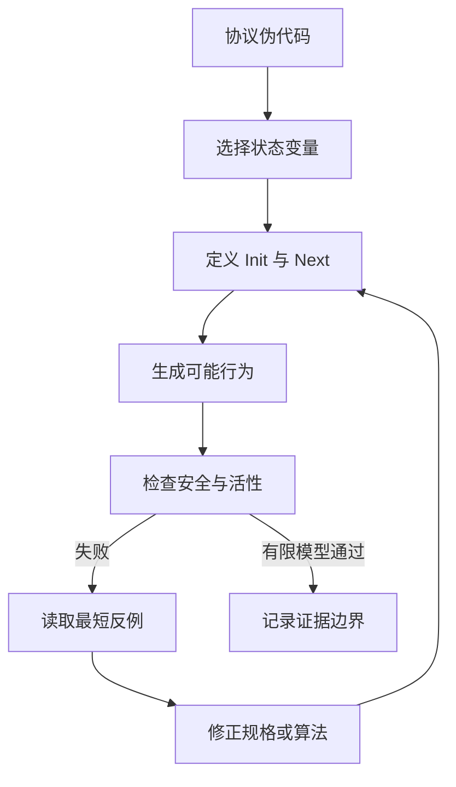
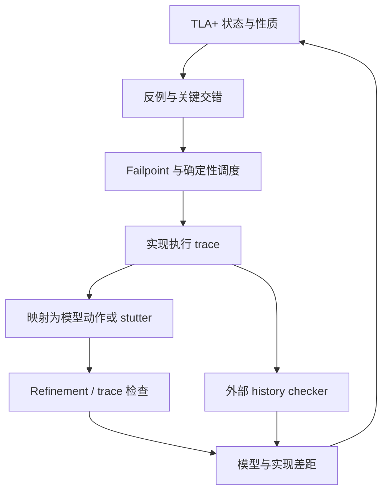

协议伪代码很擅长描述设计者希望发生的主流程：收到迁移请求，提升 epoch，切换 owner，更新下游 fence。它不擅长回答另一类更危险的问题：`Send` 能否和 `Handoff` 交错？已经在途的旧请求何时到达？某个动作漏写一个字段时，那个字段究竟保持不变，还是可以任意变化？调度器永远不执行一个已就绪动作，算不算合法执行？

这些问题不是实现细节。它们共同定义了协议允许哪些执行历史，而安全性恰恰取决于“所有允许的历史”，不是取决于评审会上讲过的那一条历史。

本文的中心论点是：**把协议写成 TLA+，不是把伪代码换一种语法抄一遍，而是先明确状态、动作与行为集合，再把安全、活性和抽象关系写成可被反例推翻的命题。** TLC 可以穷举一个有限模型中的行为并给出反例，但它不是无界数学证明；PlusCal 可以降低算法描述门槛，但不会自动补上正确的原子性；refinement mapping 可以连接不同抽象层，却不会自动消除模型与生产代码之间的语义鸿沟。

我们用[状态所有权迁移](/signal-grid-blog/posts/state-ownership-migration-shard-catchup-handoff-fencing/)中的 owner epoch 与下游 fencing 做一个最小模型。模型很小，却足以展示一次真实的 stale effect：控制面已经把写权交给新 owner，下游仍按旧 epoch 接受了迟到请求。读完后，再把它与[Raft 的安全性论证](/signal-grid-blog/posts/raft-consensus-leader-election-log-replication-and-safety/)、[一致性模型与历史检查](/signal-grid-blog/posts/consistency-models-linearizability-serializability-and-real-time-order/)和[恢复协议验证](/signal-grid-blog/posts/recovery-protocol-verification-failpoints-simulation-history-checking/)连起来，会更容易看清不同验证工具各自证明了什么。

## 1. 形式化的对象不是流程图，而是一组可能行为

一段命令式伪代码通常从入口沿控制流向下读。TLA+ 的起点不同：先选择一组变量构成系统状态，再用逻辑关系描述相邻两个状态之间允许发生什么。

设变量元组为：

```text
vars == <<epoch, owner, fenceEpoch, fenceOwner, pending, accepted>>
```

一个 **state** 是这些变量在某一瞬间的完整赋值。一个 **action** 是当前状态与下一状态之间的关系，因此动作可以同时引用未加撇号的当前值 `x` 和加撇号的下一值 `x'`。一个 **behavior** 则是无限状态序列：

```text
s0, s1, s2, s3, ...
```

这三个概念改变了协议评审的提问方式：

- 不再只问 `Handoff` 的代码按什么顺序执行，而要问哪些 `(s, s')` 被 `Handoff` 允许；
- 不再只问一次正常迁移会怎样，而要问所有由 `Init` 开始、反复满足 `Next` 的行为会怎样；
- 不再把“不会双写”留作注释，而要写成对全部允许行为都成立的公式。



这里最重要的不是 Mermaid 中的工具步骤，而是因果方向：性质检查的是行为集合；行为集合由状态边界和动作关系决定。若模型把一次本应可交错的网络发送写成原子动作，TLC 再彻底也只会检查这个被过度压缩的世界。

因此建模的第一项工作不是“覆盖多少行实现”，而是确认抽象保留了会影响性质的区别。例如在 ownership 协议里，我们可以省略 socket、线程池和序列化格式，却不能把控制面的 `(epoch, owner)` 与下游实际安装的 `(fenceEpoch, fenceOwner)` 合并成一个变量。两者暂时不一致，正是故障窗口本身。

## 2. `Init /\ [][Next]_vars` 定义了什么

一个常见的 TLA+ 状态机规格写成：

```text
Spec == Init /\ [][Next]_vars
```

它很短，但每一部分都有严格含义。

### `Init` 是状态谓词

`Init` 只约束第一个状态，不描述“初始化函数怎样执行”。下面的公式允许任意一个 `Owners` 成为初始 owner，同时要求下游 fence 与控制面一致：

```text
Init ==
    /\ epoch = 0
    /\ owner \in Owners
    /\ fenceEpoch = epoch
    /\ fenceOwner = owner
    /\ pending = {}
    /\ accepted = {}
```

若 `Owners` 有两个元素，TLC 会生成两个初始状态。这不是随机选择，而是同时检查两个可能初值。

### `Next` 是动作的析取

```text
Next ==
    \/ Send
    \/ \E newOwner \in Owners : Handoff(newOwner)
    \/ \E m \in pending : Deliver(m)
```

每一步只要满足其中一个分支即可。`\E` 表示存在量化：模型检查器会枚举当前有限模型中所有满足条件的参数，而不是按代码里某个固定循环顺序挑选。

### `UNCHANGED` 是约束，不是装饰

TLA+ 动作必须约束它关心的下一状态。`UNCHANGED x` 等价于 `x' = x`；`UNCHANGED <<x, y>>` 同时保持两个变量不变。

如果在 `Send` 中忘记写：

```text
/\ UNCHANGED <<epoch, owner, fenceEpoch, fenceOwner, accepted>>
```

并不表示这些变量“自然不变”。在 TLA+ 的数学语义中，它表示该动作没有约束这些变量的下一值；本文的 `TypeOK` 只是检查项，不会替 `Next` 施加类型边界。对这种无法确定的下一状态，TLC 通常会报告 next-state variable 未被完全指定，而不是在某个类型域里自动任选。编程语言的赋值直觉在这里会制造欠约束规格，甚至让模型无法执行。

### 方括号主动加入 stuttering

`[Next]_vars` 定义为：

```text
Next \/ UNCHANGED vars
```

因此规格允许 **stuttering step**：所有可观察变量都不变的一步。TLA+ 的 behavior 是无限序列；一个实现停止后，可以被表示为随后无限重复最后状态，而无须发明“序列结束”的特殊语义。更重要的是，高层一个动作在低层可能由多个步骤实现；其中一些低层步骤映射到高层变量不变，stuttering 让这种 refinement 成为可能。

允许 stuttering 也意味着：仅有 `Init /\ [][Next]_vars` 时，系统可以从初始状态开始永远什么都不做。Safety 并不介意，liveness 却必须额外说明哪些一直可执行的动作最终不能再被调度器忽略。这个问题会在第 5 节回到 fairness。

## 3. 一个可执行的 owner epoch 与 fencing 规格

下面是本文实际交给 SANY 与 TLC 的完整小规格。它抽象了两个权威面：

- `epoch, owner`：控制面当前声明的写权；
- `fenceEpoch, fenceOwner`：最终副作用接收端已经安装的 fence；
- `pending`：可能被任意延迟和重排的请求；
- `accepted`：用于验证的观察记录，保存请求身份以及被接受时的控制面身份。

常量 `Buggy` 让同一份规格可以切换错误和修正后的 `Handoff`。`accepted` 是 ghost state：它帮助陈述性质，不要求生产系统真的维护同样的数据结构。

```text
---------------------------- MODULE OwnerEpoch ----------------------------
EXTENDS Naturals, FiniteSets

CONSTANTS Owners, MaxEpoch, Buggy

ASSUME /\ Cardinality(Owners) >= 2
       /\ MaxEpoch \in Nat
       /\ Buggy \in BOOLEAN

VARIABLES epoch, owner, fenceEpoch, fenceOwner, pending, accepted

vars == <<epoch, owner, fenceEpoch, fenceOwner, pending, accepted>>

Message == [from : Owners, e : 0..MaxEpoch]

Receipt ==
    [ requestEpoch : 0..MaxEpoch,
      requestOwner : Owners,
      controlEpoch : 0..MaxEpoch,
      controlOwner : Owners ]

Init ==
    /\ epoch = 0
    /\ owner \in Owners
    /\ fenceEpoch = epoch
    /\ fenceOwner = owner
    /\ pending = {}
    /\ accepted = {}

Send ==
    LET m == [from |-> owner, e |-> epoch]
    IN  /\ m \notin pending
        /\ pending' = pending \cup {m}
        /\ UNCHANGED <<epoch, owner, fenceEpoch, fenceOwner, accepted>>

Handoff(newOwner) ==
    /\ epoch < MaxEpoch
    /\ newOwner \in Owners \ {owner}
    /\ epoch' = epoch + 1
    /\ owner' = newOwner
    /\ IF Buggy
          THEN UNCHANGED <<fenceEpoch, fenceOwner>>
          ELSE /\ fenceEpoch' = epoch + 1
               /\ fenceOwner' = newOwner
    /\ UNCHANGED <<pending, accepted>>

Deliver(m) ==
    /\ m \in pending
    /\ pending' = pending \ {m}
    /\ IF /\ m.e = fenceEpoch
           /\ m.from = fenceOwner
          THEN accepted' = accepted \cup
                   {[ requestEpoch |-> m.e,
                      requestOwner |-> m.from,
                      controlEpoch |-> epoch,
                      controlOwner |-> owner ]}
          ELSE UNCHANGED accepted
    /\ UNCHANGED <<epoch, owner, fenceEpoch, fenceOwner>>

Next ==
    \/ Send
    \/ \E newOwner \in Owners : Handoff(newOwner)
    \/ \E m \in pending : Deliver(m)

Spec == Init /\ [][Next]_vars

TypeOK ==
    /\ epoch \in 0..MaxEpoch
    /\ owner \in Owners
    /\ fenceEpoch \in 0..MaxEpoch
    /\ fenceOwner \in Owners
    /\ pending \subseteq Message
    /\ accepted \subseteq Receipt

NoStaleEffect ==
    \A r \in accepted :
        /\ r.requestEpoch = r.controlEpoch
        /\ r.requestOwner = r.controlOwner

DeliveryFairness ==
    \A m \in Message : WF_vars(Deliver(m))

LiveSpec == Spec /\ DeliveryFairness

EveryPendingMessageLeaves ==
    \A m \in Message : [](m \in pending => <>(m \notin pending))
=============================================================================
```

模型配置把无界概念实例化为 TLC 可以穷举的有限集合：

```text
CONSTANTS
    Owners = {oldOwner, newOwner}
    MaxEpoch = 1
    Buggy = TRUE

SPECIFICATION Spec

INVARIANTS
    TypeOK
    NoStaleEffect
```

上面保存为 `OwnerEpoch-buggy.cfg`。修正版本 `OwnerEpoch-fixed.cfg` 只把 `Buggy` 设为 `FALSE`，其余检查保持不变；活性检查使用下面这份完整配置：

```text
CONSTANTS
    Owners = {oldOwner, newOwner}
    MaxEpoch = 1
    Buggy = FALSE

SPECIFICATION LiveSpec

INVARIANTS
    TypeOK
    NoStaleEffect

PROPERTY
    EveryPendingMessageLeaves
```

其中 `oldOwner` 与 `newOwner` 是 **model values**：它们只表示两个互不相同、没有额外结构的身份。我们没有偷偷利用字符串排序、整数加法或某种主机名格式来完成证明。`MaxEpoch = 1` 则是明确的有限边界，不代表真实 epoch 只能增长一次。

`NoStaleEffect` 没有写成“旧请求不能到达”。旧请求当然可以迟到；正确的 fencing 语义是它到达后不能被接受。性质比较的是请求携带的 authority 与接收那一刻控制面记录的 authority：

```text
accepted(r) =>
    r.requestEpoch = r.controlEpoch /\
    r.requestOwner = r.controlOwner
```

这个最小模型故意把安全边界放在最终接收端。若只在网关路由或旧 owner 本地检查 epoch，网络中已经发出的请求仍可能绕过新的所有权事实。

## 4. Counterexample 不是报错文本，而是一条可重放的行为

以 `Buggy = TRUE` 运行 TLC 时，`Handoff` 提升控制面 epoch，却让下游 fence 保持不变：

```text
/\ IF Buggy
      THEN UNCHANGED <<fenceEpoch, fenceOwner>>
      ELSE /\ fenceEpoch' = epoch + 1
           /\ fenceOwner' = newOwner
```

TLC 在深度 4 找到 `NoStaleEffect` 反例。把每个状态相对前一状态的变化还原成协议语言，就是：

| 状态 | 动作                  | 控制面          | 下游 fence               | 在途/已接受                    |
| ---- | --------------------- | --------------- | ------------------------ | ------------------------------ |
| `s1` | `Init`                | `(0, oldOwner)` | `(0, oldOwner)`          | 空                             |
| `s2` | `Send`                | `(0, oldOwner)` | `(0, oldOwner)`          | 旧请求进入 `pending`           |
| `s3` | `Handoff(newOwner)`   | `(1, newOwner)` | **仍为 `(0, oldOwner)`** | 旧请求仍在途                   |
| `s4` | `Deliver(oldRequest)` | `(1, newOwner)` | `(0, oldOwner)`          | 下游接受旧请求，Invariant 失败 |

这条轨迹揭示的不是“迁移代码少写了一行”这么简单，而是协议缺少一个原子边界：控制面宣布新 owner 与最终接收端拒绝旧 owner 之间存在可观察窗口。在真实系统里，这两个动作通常不能做成同一条本地原子赋值，因此修复未必是照抄模型的 `ELSE` 分支；更完整的协议可能需要 `Preparing -> Fenced -> Active` 三阶段，并规定新 owner 只能在所有 required sinks 安装新 fence 后激活。

不过在本模型选择的抽象层中，`Handoff` 就代表“控制面与唯一 required sink 共同完成切换”的原子动作。把 `Buggy` 改为 `FALSE` 后，TLC 对两个 owner、epoch `0..1` 的模型生成 66 个状态、找到 40 个不同可达状态，完整状态图深度为 8，`TypeOK` 与 `NoStaleEffect` 均未发现错误。

反例应按三个层次阅读。

### 先找第一个坏状态

Invariant 报告中的最后状态告诉我们性质在哪里首次为假。这里新增的 `Receipt` 同时包含旧请求 `(0, oldOwner)` 和当前控制面 `(1, newOwner)`，因此失败不是由类型错误或输出格式引起。

### 再找使它成为可能的最早分叉

真正的根因位于 `s3`：控制面和 fence 的代际第一次分离。若只盯着最后一次 `Deliver`，容易错误地给投递线程加重试或延迟；那只会改变反例长度，不会恢复唯一写权。

### 最后核对抽象是否忠实

模型把 `pending` 写成集合，所以不区分重复副本，也不表达有序队列；这对“一个旧请求能否被接受”足够，却不能证明去重、FIFO 或重试语义。一个反例只要使用了系统真实允许的行为，就是有效缺陷证据；一个通过结果则必须受模型遗漏约束。两者的证据强度不对称。

TLC 通常会给出一条短反例，但“短”不等于唯一。修复后应重新检查原性质，也要检查类型与辅助不变量，防止通过收窄行为、写错 `Init` 或让关键动作永远不可执行来“修掉”反例。

## 5. Safety、Liveness 与 Fairness 回答不同问题

`NoStaleEffect` 是一个状态谓词。要求它在每个可达状态都成立，就是检查一个 invariant：

```text
[]NoStaleEffect
```

Invariant 违反后存在一个有限坏前缀；一旦 stale receipt 已经进入 `accepted`，追加再多状态也无法抹去“曾经接受过旧代际副作用”这一事实。这是 safety 的典型形态：坏事永远不发生。

但“每个已经发送的请求最终都会离开 pending”不是单个状态能判断的。它必须观察未来：

```text
EveryPendingMessageLeaves ==
    \A m \in Message :
        [](m \in pending => <>(m \notin pending))
```

`<>P` 表示未来某个状态满足 `P`，`[]P` 表示从现在起每个状态都满足 `P`。这条 temporal property 描述 liveness：某个好结果最终发生。

### Invariant 不等于全部 safety

Invariant 是最常用、最容易由 TLC 检查的一类 safety property，但不要把两个词完全等同。某些安全命题依赖历史，例如“响应只能对应此前出现过的请求”。要把它写成当前状态谓词，往往需要加入记录历史的辅助变量。加入 ghost/history variable 不改变协议可见行为，却让“过去发生过什么”在当前状态中可表达。

有限模型中 TLC 检查所有可达状态，不等于已经得到参数化的归纳证明。若要用数学归纳或 TLAPS 证明一个无界规格，常见结构是找到足够强的归纳不变量 `Ind`：

```text
Init => Ind
Ind /\ [Next]_vars => Ind'
Ind => NoStaleEffect
```

目标性质本身经常不够强，必须加入类型、epoch 单调性、fence 与激活阶段关系等 lemma。TLC 很适合帮助发现缺了哪条加强条件，但不会自动把有限检查升级为这个证明。

### Stuttering 迫使我们明确进展假设

`Spec` 允许永远 stutter，因此单独检查 `EveryPendingMessageLeaves` 必然可能失败：请求进入 `pending` 后，系统可以永远保持原状态。为 `Deliver(m)` 加弱公平性：

```text
DeliveryFairness ==
    \A m \in Message : WF_vars(Deliver(m))

LiveSpec == Spec /\ DeliveryFairness
```

`WF_vars(A)` 的直觉是：如果动作 `A` 从某一点开始持续可执行，就不能永远不执行。本文模型中，消息一旦进入 `pending`，除 `Deliver(m)` 外没有动作会移除它，所以弱公平足以推出它最终离开。

强公平 `SF_vars(A)` 要求更强：如果动作反复变为可执行，即使中间又失效，也不能永远避开。不能为了让 liveness 变绿就无条件加 `SF`。Fairness 是环境和调度的假设，不是队列、线程或重试机制本身；假设强于实现保证时，模型会证明一个生产系统并不拥有的进展性质。

本文用 TLC 对 `LiveSpec` 和 `EveryPendingMessageLeaves` 做了有限活性检查：仍是 40 个不同可达状态，temporal checking 未发现错误。这个结果说明选定模型和公平假设相容，不说明真实线程调度、网络或进程恢复一定提供同样公平性。

## 6. TLC 穷举的是有限模型，不是数学宇宙

TLA+ 规格可以包含自然数、任意集合和无限行为；TLC 必须从具体配置得到一个可计算的有限模型。本文使用的命令是：

```console
java -cp tla2tools.jar tla2sany.SANY OwnerEpoch.tla
java -cp tla2tools.jar tlc2.TLC -config OwnerEpoch-buggy.cfg OwnerEpoch.tla
java -cp tla2tools.jar tlc2.TLC -config OwnerEpoch-fixed.cfg OwnerEpoch.tla
```

SANY 负责解析与语义检查；TLC 从所有初始状态开始展开后继状态，并检查 invariant 或 temporal property。对给定有限模型，这比随机测试强得多：它系统性覆盖模型允许的调度和状态，而不是只采样几条执行。但结论必须准确表述为：

> TLC 在指定常量、状态边界、约束、工具语义和指纹假设下，没有找到违反性质的行为。

不能把它缩写成“协议已经被数学证明正确”，更不能缩写成“生产代码已经被证明正确”。

### Constants 与 model values 决定检查世界

常量把同一规格实例化为不同世界。至少要记录：

- 节点、owner、客户端或消息身份的有限集合；
- term、epoch、序列号和队列长度的上界；
- 是否允许崩溃、重启、丢包、重复、乱序和分区；
- 哪些布尔开关选择了协议分支。

model value 适合表示纯身份，因为 TLC 只知道它们彼此不同。若把节点写成整数，并在规格中意外比较大小，模型可能借用了真实协议不存在的顺序结构。

### Symmetry 能降状态数，也能改变问题

若三个 server 完全可互换，给它们重命名不应产生一个本质不同的状态。对真正对称的常量集合使用 symmetry set，理论上可能把排列导致的状态数按阶乘级压缩。

前提是 `Init`、`Next` 和被检查性质都不区分这些身份。`oldOwner` 与 `newOwner` 在本文反例里承担不同角色，因此没有为它们启用 symmetry。更要谨慎对待 symmetry 与 temporal/liveness checking 的组合：TLA+ 官方材料对某些用法明确给过正确性警告，具体行为还依赖工具版本。安全做法是把“是否启用 symmetry”视为模型语义选择，保留关闭优化的对照运行，而不是把它当成无条件的性能开关。

### State explosion 应通过抽象治理

系统有 `n` 个节点、`m` 条在途消息、`k` 个 epoch 和有界队列后，状态数很快不是简单相加，而是组合爆炸。减少状态不能靠删除故障路径；应该问某个细节是否影响待检查性质：

- 验证 fencing 时，payload 字节通常可抽象成消息身份与 epoch；
- 验证日志匹配时，值内容可抽象，但 index、term 和前缀关系不能删除；
- 验证重试去重时，消息计数和 request identity 可能关键，集合就未必足够；
- 验证恢复活性时，崩溃次数和公平假设必须显式建模。

小模型能发现许多深层错误，因为错误往往只需两个节点、一个在途消息和一次代际切换；这是一种有价值的小范围假设，不是普遍定理。应通过逐步增加边界、改变拓扑和比较状态图来验证它，而不是把第一次绿色运行当成终点。

还要区分 **constraint** 与 **invariant**：constraint 会剪掉状态或行为，可能让错误永远到不了；invariant 保留行为并在坏状态处报告失败。若用 `pending` 长度约束控制状态空间，报告中必须承认超过边界的行为没有被检查，不能把剪枝条件包装成系统保证。

## 7. PlusCal 降低描述门槛，但原子性仍由作者负责

TLA+ 的 action 风格很适合关系式状态机，却与工程师熟悉的 `while`、`if`、赋值和进程结构不同。PlusCal 提供命令式算法语言，并由 translator 生成 TLA+；TLC 最终检查的仍是翻译后的 TLA+ 规格。

这个定位带来三点直接后果。

第一，PlusCal 的 **label 是原子步骤边界**。同一 label 到下一个 label 之间的语句通常被翻译成一个 action。把“读取 epoch、发网络请求、等待响应、安装 fence”放进一个大步骤，会抹掉真实可交错窗口；给每条局部赋值都加 label，又可能引入实现不具备的中间可见状态并扩大状态空间。Label 不是排版标记，而是模型的一致性边界。

第二，PlusCal 不是代码生成器。它可以让锁算法、并发进程或消息循环更容易阅读，但 translator 的目标是 TLA+，不是 Java、Go 或 Rust。变量类型、持久化、异常、内存模型和 I/O 语义仍需要在实现层单独建立对应关系。

第三，反例调试最终要能回到生成的 action。PlusCal 工具会维护算法与翻译结果的对应；团队不能把翻译块当成永远不看的产物。遇到奇怪的 enabledness、`UNCHANGED` 或 fairness 结果时，生成的 TLA+ 才是 TLC 实际解释的语义。

选择并非“直接 TLA+ 高级、PlusCal 初级”。如果协议主要由若干进程和清晰控制流组成，PlusCal 往往更易评审；如果核心是集合、关系、任意消息选择或多层抽象映射，直接写 TLA+ 可能更简洁。两者都必须先决定保留哪些交错，再决定语法。

## 8. Refinement mapping 连接抽象层，而不是匹配函数名

到目前为止，我们只检查了一个抽象规格自身。真实 ownership 迁移通常有更多阶段：元数据 CAS、旧 owner drain、多个 sink 安装 fence、新 owner activate、网关路由刷新。怎样说明这个具体协议实现了抽象的“唯一写权切换”？

Refinement 的核心不是让两个模块拥有同名动作，而是定义一个 **state mapping**：从每个具体状态计算抽象变量。示意形状如下；它不是独立可运行模块，而是在具体规格中实例化抽象模块时使用的映射：

```text
Abstract == INSTANCE OwnerEpochAbstract
    WITH epoch       <- meta.epoch,
         owner       <- IF phase = "Active"
                           THEN activeOwner
                           ELSE previousOwner,
         fenceEpoch  <- MinInstalledFence(requiredSinks),
         fenceOwner  <- CommonFenceOwner(requiredSinks),
         pending     <- AbstractInFlight(network, retryQueues),
         accepted    <- AcceptedReceipts(sinkHistory)

RefinesOwnerEpoch == Abstract!Spec
```

用具体 `ConcreteSpec` 检查 `RefinesOwnerEpoch`，意图是：具体系统的每条行为经过映射后，都是抽象规格允许的行为。具体的“写审计日志”“刷新指标”或某个内部重试可能不改变任何抽象变量，于是映射为 stuttering；这正是第 2 节必须保留 stuttering 的原因。

### Mapping 映射状态，不要求动作一一对应

一个抽象 `Handoff` 可以由五个具体动作实现；一个具体批处理也可能同时实现多个抽象效果。按函数名或事件名做一一对应，会把实现结构误当成语义。真正要检查的是相邻具体状态映射后是否满足抽象 `Next`，以及初始具体状态是否映射到抽象 `Init`。

### 有些正确实现没有简单的 refinement mapping

具体状态可能暂时没有足够信息决定抽象动作发生在何时。Abadi 与 Lamport 证明体系中的 history、prophecy 和 stuttering variables 正是为这些情况服务：

- history variable 记录过去，帮助抽象状态表达已经发生的选择；
- prophecy variable 描述未来选择，用于处理当前无法判断的线性化点；
- stuttering variable 调整具体与抽象步数的对应。

这些辅助变量应保守地加入并解释其不改变可观察行为。它们不是为了把失败公式“调到通过”，而是为了构造正确的状态映射。

### 从生产 trace 到 refinement 还有一道边界

可以让实现发出 `MetaCAS(e+1)`、`FenceInstalled(sink,e+1)`、`Activated(owner,e+1)` 和 `EffectAccepted(request,e)` 等事件，再把日志规范化为模型 action 或 stutter。这样能检查一条生产或故障注入 trace 是否符合抽象规格。

但有限 trace conformance 仍是测试：它只覆盖实际观察到的执行。完整 refinement 结论还需要说明事件采集没有漏掉影响抽象状态的步骤、日志顺序反映了所需的因果关系、映射对所有实现执行都有定义，并证明或系统检查具体转换保持抽象规格。相同字段名和一条成功 trace 不能填补代码语义、编译器、存储系统与模型之间的鸿沟。

因此证据应分层表述：TLC 检查有限抽象模型，TLAPS 或手工证明处理参数化公式，refinement 连接两个规格层，trace 检查采样的实现执行。它们可以互相增强，但不能互相冒名。

## 9. 形式模型应进入故障实验与历史证据的闭环

一份 `.tla` 文件若只在设计评审时运行一次，很快会与实现分叉。更稳固的用法，是让模型产出的状态、反例和边界直接决定实现验证要观察什么。



在本文的 fencing 例子中，这条闭环可以非常具体：

1. TLC 反例确定关键交错是 `Send(old) -> Handoff -> Deliver(old)`，不是泛化的“迁移期间随机故障”；
2. 实现把 failpoint 放在元数据 epoch 提升之后、required sink 安装 fence 之前，并暂停旧请求的网络发送；
3. 确定性调度器在新 owner 激活后释放旧请求，记录控制面 epoch、sink fence、request epoch 与 accept/reject 决定；
4. trace adapter 将内部步骤映射到模型的 `Send`、`Handoff`、`Deliver` 或 stutter，检查是否出现模型不允许的转换；
5. 外部 history checker 再从客户端可见调用与响应判断线性一致性、去重或结果未知语义，避免内部自报“已拒绝”掩盖真实副作用。

这几层捕获的错误不同：TLC 擅长穷举小模型中的调度组合；failpoint 与确定性模拟检验真实恢复代码是否能走过那些组合；history checker 根据公开语义判断结果；observability 则让失败能够被定位和重放。关于最后一层需要哪些 epoch、commit、cursor 与 recovery 字段，可以继续阅读[有状态系统可观测性](/signal-grid-blog/posts/stateful-system-observability-epoch-commit-lag-cursor-recovery/)。

最终，形式化规格的价值不是得到一个“verified”徽章，而是压缩歧义：状态变量说明什么事实决定正确性，`Init/Next` 说明系统允许什么行为，Invariant 与 temporal property 说明不能发生和必须发生什么，counterexample 给出可重放的失败顺序，refinement mapping 说明两个抽象层怎样对应。TLC 的有限检查边界越诚实，后续证明、故障注入和历史检查就越知道自己还必须覆盖哪里。

从伪代码走向形式化，不是从可读文本走向晦涩数学；是从“我们认为流程应该这样跑”，走向“这里是全部被允许的行为，以及一条足以推翻我们判断的证据”。

### 一手资料

- Leslie Lamport, [Specifying Systems: The TLA+ Language and Tools for Hardware and Software Engineers](https://lamport.azurewebsites.net/tla/book.html?back-link=learning.html)：State、Action、Behavior、`Init /\ [][Next]_vars`、stuttering、TLC 与 refinement 的系统性定义。
- Leslie Lamport, [A High-Level View of TLA+](https://lamport.azurewebsites.net/tla/high-level-view.html)：从状态机、时序逻辑与 PlusCal 理解 TLA+ 的官方概览。
- Leslie Lamport, [Safety Properties](https://lamport.azurewebsites.net/tla/safety-liveness.pdf)：Safety、Liveness 及其行为语义的原始论文脉络。
- Yuan Yu, Panagiotis Manolios, Leslie Lamport, [Model Checking TLA+ Specifications](https://lamport.org/pubs/yuanyu-model-checking.pdf)：TLC 的设计、有限状态探索、Invariant 与状态指纹等原始论文。
- Leslie Lamport, [The PlusCal Algorithm Language](https://lamport.azurewebsites.net/pubs/pluscal.pdf)：PlusCal 的语义、到 TLA+ 的翻译与算法表示边界。
- Martín Abadi, Leslie Lamport, [The Existence of Refinement Mappings](https://lamport.azurewebsites.net/pubs/abadi-existence.pdf)：refinement mapping 以及 history、prophecy、stuttering variables 的理论基础。
- TLA+ Foundation, [TLA+ tools repository](https://github.com/tlaplus/tlaplus) 与 [official examples](https://github.com/tlaplus/Examples)：TLC、SANY、Toolbox、版本发布和可运行规格的官方维护入口。
