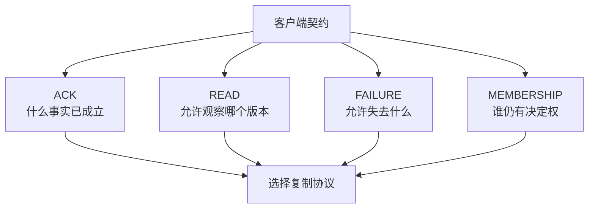
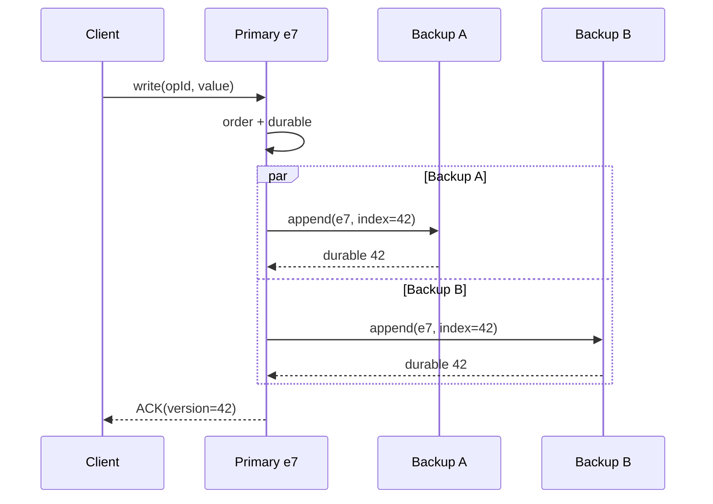
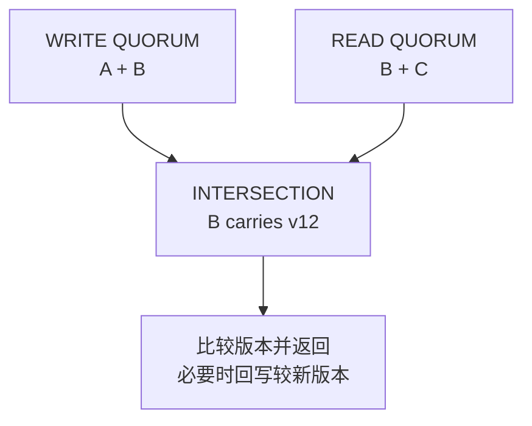
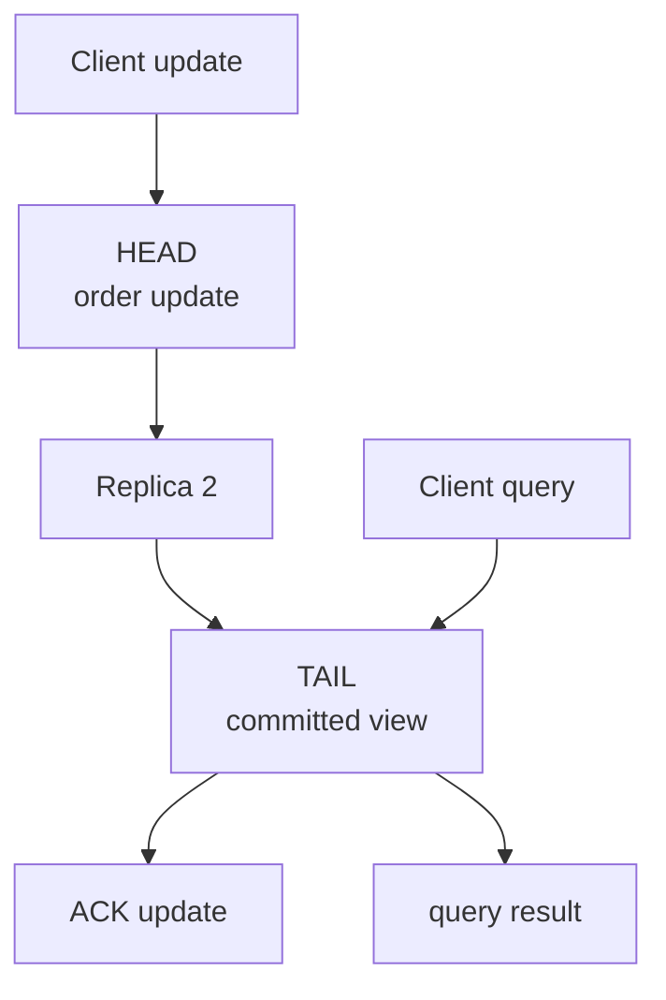
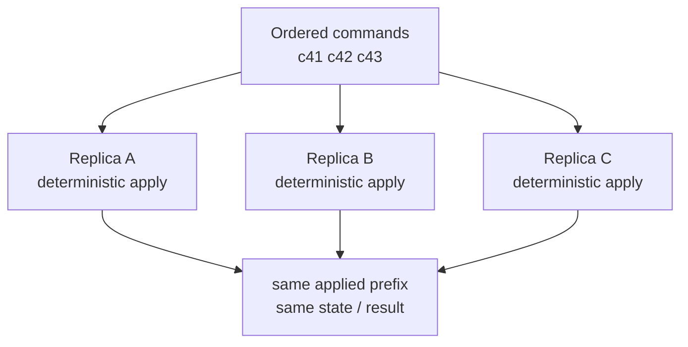
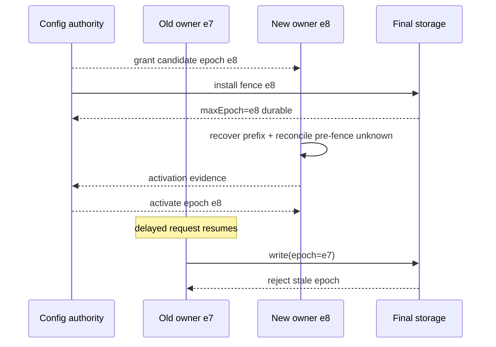

“把数据写到三台机器”经常被直接翻译成“高可用、强一致、不会丢”。这句话跳过了最重要的部分：三台机器中的哪几台决定成功，读取从哪里发生，主节点失联后谁有权接管，已经返回成功但尚未到达所有副本的数据又属于谁。

复制不是一个单独算法，而是一组必须共同闭合的合同。

本文的中心论点是：**先定义 ACK、读取与故障合同，再选择复制算法。** Primary-Backup、Quorum、Chain Replication 和状态机复制分别改变写入路径、权威状态与恢复证明；它们不是从“弱”到“强”的产品档位，也不能只凭副本数判断语义。

本文是“有状态系统可靠性”学习路径的 Chapter 05，讨论异步网络中的 crash-stop / crash-recovery 节点：消息可能延迟、丢失、重复和乱序，节点可能崩溃并在持久状态上恢复；不讨论 Byzantine 节点、恶意数据和 CRDT 冲突合并。上一章 [《一致性不是一个形容词》](/signal-grid-blog/posts/consistency-models-linearizability-serializability-and-real-time-order/) 已定义客户端 History；[《WAL 到底保证什么》](/signal-grid-blog/posts/write-ahead-log-durability-and-crash-recovery/) 已区分本地 write、force 与 durable ACK。本文把这两层连接起来，但不重讲下一章 [Raft 的选举与日志安全性](/signal-grid-blog/posts/raft-consensus-leader-election-log-replication-and-safety/)。

## 1. 复制合同必须先于拓扑

画出三个 Replica 和几条箭头，并不能回答任何客户端可验收的问题。一个复制设计至少要先固定四件事：

1. **对象与顺序**：复制的是单个寄存器、日志、页、事务结果，还是确定性命令；谁定义合法顺序；
2. **ACK**：成功响应要求哪些副本完成了内存接收、本地持久化、提交或应用；
3. **读取**：读从哪个角色发生，要观察到哪个版本，无法满足时等待、拒绝还是返回旧值；
4. **故障与成员资格**：允许失去哪些节点和故障域，谁发布新配置，旧 Owner 如何被隔离。



复制系统里常见的几个前沿不能混成一个 `offset`：

| 前沿        | 已经成立的事实                           | 尚未自动成立的事实             |
| ----------- | ---------------------------------------- | ------------------------------ |
| `accepted`  | 某节点收到了请求                         | 请求有稳定顺序、重启后仍存在   |
| `ordered`   | 请求取得协议位置或版本                   | 该位置已持久、已被足够副本接受 |
| `durable`   | 某个副本在本地持久化                     | 未来合法 Owner 一定包含它      |
| `committed` | 按当前协议，该事实不能被合法后继历史推翻 | 状态机已执行、客户端已收到响应 |
| `applied`   | 某副本状态已经反映该决定                 | 该副本拥有当前读取权           |

例如 `replicaCount=3`、`ack=2` 仍然不完整。还要问：这两个 ACK 是否来自当前配置；ACK 前是否持久化；其中是否包含权威 Primary；节点分布在哪些故障域；选主时是否保证新 Owner 拿到所有已确认写；读取是否等到 `applied >= requiredVersion`。

### 用不变量写出“成功”

对于同时承诺线性一致与“ACK 后跨声明故障仍持久”的单对象复制，一个有用的安全目标是：

```text
ACK(write v at version k)
  => every later legal owner can recover a history containing k or equivalent state
  => a later linearizable read cannot return a version before k
```

第一条箭头约束 ACK 的持久性合同与故障转移；第二条才把它连接到可观察的线性一致读取。只证明“两个副本存过 `k`”仍不够：如果新配置可以绕开这两个副本，或者旧 Primary 还能继续对外写，`k` 依旧可能消失或被分叉。

活性合同也要单独写。常见形式不是“永远可用”，而是：

> 在某个稳定期内，只要当前配置仍有规定数量的互通、非故障 Replica，并且配置服务能够完成代际推进，请求最终可以完成。

这句话把网络恢复、故障检测和成员变更留在了前提中。安全性可以要求任何时刻都不产生两个合法历史；活性通常只能在网络最终稳定后讨论。

### 副本数只在故障域独立时有意义

三份副本若位于同一宿主机、同一机架电源、同一可误删账户或同一存储控制面，并不对应三个独立故障。协议层的 `N=3` 只能说明投票集合大小；它不能替代：

- 节点、磁盘、机架、可用区与控制面的故障域分析；
- 副本本地持久化合同；
- checksum、scrubbing 与损坏修复；
- 备份和跨灾难域恢复。

复制主要提升在线冗余与故障切换能力。它不是备份，也不会阻止错误删除被忠实地复制到每一份副本。

## 2. Primary-Backup 的强弱由 ACK 决定

Primary-Backup 先把一个配置期内的写入权收敛到 Primary。客户端写入由 Primary 排序，再传播给 Backup；Backup 不应独立接受会与 Primary 冲突的写。

一种简化的同步路径是：



图里的“等待两个 Backup”只是一个例子。实际系统可以选择不同 ACK 点，而每个选择对应不同的失败结果：

| ACK 合同                         | 成功时已证明什么       | Primary 永久丢失后的风险                      |
| -------------------------------- | ---------------------- | --------------------------------------------- |
| Primary 内存接收                 | 进程当前知道请求       | 进程崩溃即可丢失                              |
| Primary 本地持久化               | 单机重启可恢复         | 整机或磁盘丢失仍可能丢                        |
| Primary 与至少一个 Backup 持久化 | 两个节点保留该写       | 必须保证接管集合会选择包含它的合法后继        |
| 当前配置 Quorum 持久化           | 写已进入相交的法定集合 | 仍需正确的选主、版本和重配置协议              |
| 所有当前 Replica 持久化          | 当前副本全部拥有该写   | 最慢副本进入 ACK 尾延迟，且不替代成员资格协议 |

因此，“同步复制”本身不是精确保证。同步到谁、同步到内存还是稳定存储、同步完成是否已经构成不可回滚的 commit，必须逐项声明。

### 异步复制把已确认写暴露给 RPO

异步复制常在 Primary 本地完成后立即 ACK，再由后台把日志或数据发送给 Backup：

```text
t0  Primary durable(k)
t1  ACK(k) to client
t2  Primary host is permanently lost
t3  Backup has only k-1
```

如果 `t2 < replication(k)`，新 Primary 只能从 `k-1` 恢复。系统也许仍保持一份内部自洽的历史，但客户端已经观察到的 `k` 消失了；这首先违反 ACK 的 durability contract。若恢复后的线性一致读取又返回 `k` 之前的状态，才形成可观察的 linearizability 违反。

异步复制不是错误选择。缓存、可重建索引、遥测聚合或明确接受近端数据损失的系统，可能用它换取更低写延迟和更高故障隔离度。关键是把 ACK 写成“Primary durable，节点永久丢失时 RPO 非零”，而不是继续称为“已安全提交”。

RPO 也不能只写“约 1 秒”。基于时间的估计还依赖写入流量和后台调度。更可审计的接口会同时暴露：

```text
primaryOrderedVersion
primaryDurableVersion
primaryAckedVersion
backupDurableVersion[replica]
safeFailoverVersion
oldestUnreplicatedAge
```

`primaryOrderedVersion - primaryAckedVersion` 描述尚未确认尾部，`primaryAckedVersion - safeFailoverVersion` 才暴露“已经确认、却无法由合法接管集合恢复”的危险区间。只有位置稠密、无洞且每个单位含义固定时，版本差才近似“决定数量”；否则还要直接报告记录数、字节或业务工作量。时间差回答最老暴露已经持续多久。

### 半同步仍要证明后继 Owner 包含确认写

等待任意一个 Backup 成功，看起来能够容忍 Primary 丢失。但若四个节点中每次任意选一个 Backup，两个连续写可能落到互不相同的副本集合；故障转移又可能选择没有最新确认写的节点。

安全性不是“曾有两份”，而是：

```text
write acknowledgement set
    intersects
every legal recovery / election set
```

这正是 Quorum 思想出现的位置。Primary 负责形成顺序；相交集合负责让该顺序跨越故障和权威切换。

## 3. Quorum 的核心是交集，不是数字过半

Quorum 不是某个固定产品拓扑，而是一种集合证明：每次决定接触一个足够大的集合，使随后任何合法决定都至少遇到一份承载旧事实的 Replica。

对总投票权重 `V`、读 Quorum `R` 和写 Quorum `W`，经典 Weighted Voting 条件是：

```text
W > V / 2        // 任意两个写 Quorum 相交
R + W > V        // 任意读 Quorum 与写 Quorum 相交
```

在三个等权 Replica 中，`W=2, R=2` 是常见选择。写 `x=7@v12` 到 `{A,B}`，随后读取 `{B,C}`，交点 `B` 可以携带版本 12。



但“集合相交”只是安全证明的一条边，不是完整算法。交点中的节点还必须能够回答：哪个版本更新、这个版本是否完成、并发 Writer 使用什么权威序列、旧配置的票是否仍有效。

### 交集需要版本协议才能传递事实

若 Replica 只存值、不存版本，读取 `{B,C}` 看见 `7` 和 `5` 时不知道谁更新。若版本来自未受约束的墙钟，又可能让时钟漂移制造虚假的“最新”。

以 ABD-style 原子寄存器为例，协议需要同时定义：

- 可全序比较的版本，例如受协议约束的 `(counter, writerId)`；
- Writer 如何产生更高版本：经典 ABD 的单 Writer 可以本地递增 timestamp；多 Writer 扩展通常先观察最高版本，再生成 `(counter, writerId)`；
- 写入何时得到写 Quorum 的确认；
- 读取如何查询读 Quorum 并选择最高版本；
- 为什么读取还需要把所选值写回一个 Quorum。

Attiya、Bar-Noy 与 Dolev 的经典工作说明了最后一点：在异步消息系统中模拟原子寄存器，读取不能总是“问多数、取最大、立即返回”。如果一次写只到达部分 Replica 后 Writer 崩溃，读者看见新值却不传播它，下一次读取可能只碰到旧副本并发生版本倒退。Read-back 把已观察到的最高版本重新建立为能够与后继读相交的事实。它是 ABD-style 协议处理 incomplete write 的关键步骤，不是所有名为 Quorum read 的系统都能无条件照搬的通用要求。

这也说明一个重要边界：**Quorum 是构造复制对象的工具，不自动等于 Consensus。** 单写者寄存器、多写者寄存器、日志槽位和成员配置需要不同协议；不能只把 `R+W>N` 写进配置，就宣称任意业务状态已经线性一致。

### “任意可用节点凑够数量”可能破坏交集

假设正常副本集合是 `{A,B,C}`，网络分区后为了继续写，系统临时把 `{X,Y}` 当成替代节点并凑出两个 ACK。若后续读取仍只查询 `{A,B,C}`，两个集合可能没有交点。

这类机制如果要成立，必须另有：

- 明确的 hinted handoff 和版本传播协议；
- 读取何时可能返回旧值的公开合同；
- 冲突版本的保留与裁决规则；
- 新旧集合之间恢复交集的条件。

这些已经不是“同一个强一致 Quorum 只是更可用”。本文不展开多写者冲突合并；这里只保留审查结论：**动态放宽法定集合时，一致性合同也可能随之改变。**

### Quorum 规模不等于故障域覆盖

五个 Replica 的写 Quorum 为三，如果其中三台恰在同一可用区，失去该区仍可能丢掉某次已确认写。投票权重与放置策略必须共同证明：任何允许的故障集合之后，仍有合法恢复集合与所有已确认写相交。

因此设计文档不应只写 `N=5, W=3, R=3`，还要画出 Replica 到故障域的映射，并说明重配置前后哪些集合有资格投票。

## 4. Chain Replication 用拓扑分离写入与读取

Chain Replication 把 Replica 排成有方向的链。更新从 Head 进入，沿链逐跳传播；Tail 代表已经穿过整条链的状态，查询由 Tail 提供。原始论文在 fail-stop 存储服务模型下，用这种非对称路径同时追求高吞吐与强一致语义。它的正确性还依赖相邻链路可靠 FIFO；工程实现若没有这一传输保证，就必须用序号、重传和去重构造等价的有序无遗漏通道。



这个拓扑建立了一个直观边界：

- Head 的状态可以包含尚未到达 Tail 的 pending update；
- Tail 已执行的前缀才对查询可见；
- 写入 ACK 从 Tail 返回，说明更新已经穿过当前链；
- 正常查询不会误读 Head 上的未提交尾部。

### 链不是“Primary 加串行网络”这么简单

如果 Middle Replica 崩溃，不能只让前驱改连后继然后继续发送。原始设计让前驱保存已经转发、但尚未收到 Tail 沿链回传确认的 `Sent` 列表；移除内部节点时，再结合新后继报告的 last-received sequence 计算并补发 `Sent` suffix，之后才形成新链。重配置至少必须知道：

- 前驱有哪些已经发送、但尚未收到 Tail 回传确认的 update；
- 后继已经执行到哪个前缀；
- 新后继已经连续接收到哪个序号、还缺哪段后缀；
- 新链形成期间客户端应该等待还是切换；
- 被移除节点恢复后如何防止它继续扮演旧角色。

Tail 故障又是另一条边界：它的前驱可以被提升为新 Tail，而某些已经到达前驱、尚未到达旧 Tail 的 update 可能由此进入新历史。由于旧 Tail 尚未返回 ACK，客户端看到的是结果未知，而不是“肯定没执行”。安全重试必须复用稳定 `operationId`，允许协议位置变化，同时让去重状态保证同一业务意图至多产生一次效果。

原始 Chain Replication 设计依赖一个 Master 维护对象到 Chain 的映射，并协调故障后的链重构。Master 不是无关的服务发现组件；它参与“当前哪条链合法”这一安全边界，因此自身也需要容错与一致的配置发布机制。

### 性能优势来自角色分工，也带来不同瓶颈

Chain Replication 让 Head 集中接收更新、Tail 集中处理查询，中间 Replica 主要做流水复制。多个对象或分片可以采用不同链和 Head/Tail，从而分散总体负载。

它的代价也很具体：

- 单次写延迟经过整条链，而非向多个 Replica 并行发送；
- Head 或 Tail 的热点会分别限制写入或查询吞吐；
- 链越长，单写延迟与重配置状态越多；
- 一个慢 Middle 会对后继形成背压；
- 客户端必须及时获取新 Head/Tail 身份，并拒绝旧映射。

所以 Chain Replication 适合能够按对象分片、查询可集中到 Tail、更新可流水化的存储服务。它不是所有事务系统的通用替代，也不会单独解决跨对象原子事务。

## 5. 状态机复制与数据复制复制的是不同事实

Primary-Backup、Chain 和 Quorum 描述了权威与通信结构的不同方面；状态机复制（State Machine Replication，SMR）进一步规定：从相同初始状态出发，正确 Replica 对相同的已应用命令前缀执行确定性转移，因而得到相同状态和输出。Replica 可以暂时落后，并不要求所有健康成员在任意墙钟时刻已经应用到同一位置。



数据复制则可以复制 WAL 字节、页、文件块、对象版本或已经计算好的状态增量。Replica 未必重新执行同一业务命令。

| 维度           | 状态机复制                               | 数据或日志复制                       |
| -------------- | ---------------------------------------- | ------------------------------------ |
| 复制单元       | 有序命令与必要协议元数据                 | WAL、页、块、对象版本或增量          |
| 一致结果的条件 | 相同初始状态、相同已应用前缀、确定性转移 | 格式、顺序、应用与恢复协议正确       |
| 非确定性       | 必须转成有序输入或由权威节点给出结果     | 可以复制权威节点已产生的结果         |
| 读取           | 常从已应用状态机读取，仍需权威/版本屏障  | 取决于副本应用进度与读路由           |
| 恢复           | Snapshot 加命令日志追赶                  | 基线数据加日志、页或对象增量追赶     |
| 典型适用       | 控制面、元数据、订单状态机、协调服务     | 数据库存储、文件系统、大对象与物理页 |

### 这两类不是互斥产品

一个系统可以用状态机复制维护“当前配置、分片 Owner 和提交位置”，再用 Primary-Backup 复制每个分片的数据；也可以用 Primary 对命令排序，让 Backup 以相同顺序执行确定性状态机。Viewstamped Replication 与 Raft 都具有 Primary/Leader 角色，也都用于构造复制状态机。

因此更准确的问题不是“Primary-Backup 还是 SMR”，而是：

1. Primary 排序的是业务命令，还是已经产生的存储变化；
2. Replica 需要重复计算，还是只重放权威结果；
3. 配置与数据是否由同一复制组决定；
4. Snapshot 覆盖哪些业务状态、去重状态和成员元数据；
5. 新 Replica 从哪个已证明前缀开始追赶。

Microsoft Research 的 PacificA 就明确分开配置管理与数据复制，并比较复制日志、内存状态等不同层次。这种分层不是纯性能优化；它决定故障恢复时哪个表示是权威的、能否从一种表示重建另一种表示。

### 非确定性和外部副作用不会被 SMR 自动消除

如果每个 Replica 在执行命令时各自调用墙钟、随机数、线程竞态或外部 HTTP API，相同命令序列仍可能产生不同结果。安全做法通常是：

- 把时间、随机结果和外部输入先变成日志中的确定值；
- 给迭代顺序、浮点环境和版本差异建立确定性边界；
- 把外部副作用写成 durable intent，再由带幂等身份和 fencing 的投递器执行；
- 把 request 去重与结果缓存纳入 Snapshot。

SMR 保证正确 Replica 对相同的已应用命令前缀得到相同状态；它不让邮件、支付、对象存储自动加入同一个原子提交。

## 6. 写入安全不代表任意副本读取都安全

一个写已经满足 Quorum 或穿过 Chain，不意味着随便找一台 Replica 读取都会立刻看到它。读取还要回答两个问题：这台 Replica 是否属于当前合法配置；它的 `appliedVersion` 是否覆盖本次读取要求。

| 读取路径                 | 可能提供的合同                    | 必须补齐的机制                                |
| ------------------------ | --------------------------------- | --------------------------------------------- |
| 当前 Primary 本地读      | 线性一致或最新已提交读            | 确认仍有权威、建立 read barrier、等待应用前沿 |
| Quorum read              | 原子寄存器式最新读                | 版本选择、相交集合、必要的 read-back          |
| Chain Tail read          | 当前合法 Chain 配置内的强一致查询 | Tail 身份发布、重配置屏障、旧 Tail 隔离       |
| Follower / Backup 本地读 | 陈旧或有界陈旧读                  | 明确 version/lag 上界，无法满足时拒绝或等待   |
| Snapshot read            | 指定历史版本的一致视图            | Snapshot 身份、保留期和跨对象作用域           |

### “读 Primary”仍要证明它还是 Primary

网络分区后，旧 Primary 可能仍在运行，只是无法看到新配置。如果它继续从本地状态返回读取，就可能在新 Owner 已提交更新后返回旧值。

线性一致 Primary read 通常至少需要：

```text
authority is current
AND appliedVersion >= readBarrierVersion
```

第一项可以来自一次当前配置的 Quorum 确认，或者建立在有严格时钟与 Lease 假设的授权上；第二项避免 Primary 已知道 commit 位置，却从尚未应用到该位置的状态读取。

这两个条件解决不同问题：authority 防旧主；apply barrier 防当前主自己的状态落后。只检查进程角色字段 `role=PRIMARY`，两者都证明不了。

### 陈旧读取必须给出可观察上界

“最终会追上”无法指导客户端决策。更有用的读取响应会携带：

```json
{
  "readMode": "bounded-stale",
  "valueVersion": "shard-7/e12/8842",
  "currentKnownCommit": "shard-7/e12/8890",
  "servedBy": "replica-c",
  "observedLagEntries": 48
}
```

客户端还可以提交 `minVersion`。Replica 若尚未应用到该版本，应等待到 deadline、转发权威节点，或返回 `replica_too_stale`；不能静默返回更老值。

按毫秒声明陈旧上界更难。版本落后可以直接比较；时间落后还依赖写入事件时间、时钟误差和复制暂停。如果系统没有这些上界，就只能诚实提供版本界限，而不能声称“最多旧 100 ms”。

### Session token 把一次成功写带到后续读

客户端写入成功后取得 `(group, epoch, version)` token，后续读取携带它，服务端就能提供 Read Your Writes：

```text
read(minVersion = writeAck.version)
```

token 不能只含一个裸 `offset`。分片迁移、备份恢复或集群重建后，同一个数字可能属于不同历史；`groupId + epoch + version` 才能把它锚定在特定权威世代。服务端还必须定义旧 epoch token 是映射到新历史、等待迁移完成，还是明确拒绝。

## 7. 故障转移的核心是推进权威世代

Timeout 只能产生“怀疑 Primary”的信号，不能证明 Primary 已停止。安全故障转移不是最快找一台 Backup 改名，而是完成一个权威世代转换：

```text
configuration e7  ->  configuration e8
```

新世代至少要建立四个事实：

1. `e8` 是由合法配置协议产生的唯一后继，但此时还不是可接流的 Active Owner；
2. 旧写路径已冻结，接收副作用的最终资源已经持久安装 `e8`，并拒绝 `epoch < e8`；
3. 新 Owner 已恢复所有对客户端承诺的历史，并对账 Fence 安装前所有结果未知或在途副作用；
4. 只有上述条件成立后，新 Owner 才开始 ACK 写入和强一致读取。



Fencing 必须在最终产生副作用的资源处执行，并把“比较 epoch、写数据、推进最大 epoch”放进同一原子边界。只在新 Owner 日志里打印 `e8`，不能阻止旧 Owner 的在途 I/O 晚到。若实现因资源约束必须先恢复、后安装 Fence，那么恢复期间必须已用另一条可证明的机制冻结所有旧写，并把 Fence 安装前的结果未知集合纳入对账；否则恢复前缀与外部事实之间仍有竞态窗口。

### 成员资格是被复制的安全状态

增加一个 Replica 不能直接把它计入 Quorum。它可能只有 Snapshot，却缺少 Snapshot 之后的提交尾部；也可能完成数据复制，却仍持有旧配置身份。

一个常见的安全迁移形态是：

```text
non-voting catch-up
  -> prove snapshot/log continuity
  -> enter a protocol-defined transition configuration
  -> commit the new configuration
  -> remove old voting rights
```

具体协议可能采用联合配置、逐节点重配置、外部配置共识或 Chain Master 协调；这些算法的生效点不可拼接。必须从所选协议本身证明：过渡期间不会出现两个互不相交、却都能提交的合法集合。

### 少数派停写是安全行为，不是自动修复目标

当系统无法取得当前合法 Quorum，也无法证明安全的后继配置时，正确行为通常是停止强一致写和读取，而不是临时降低 ACK 数量。

可以另设显式降级 API，例如返回带版本的 stale read，但不能让同一个接口悄悄从 linearizable 变成 local。Availability 是按操作定义的：失去写入权时，健康检查、缓存查询或不受影响的其他分片仍可服务；这不等于冲突分区也能继续确认权威写。

### 用故障矩阵证明代际切换

协议验收应在动作边界注入故障，并断言历史性质：

| 故障点                         | 允许的结果                                                                      | 不允许的结果                      |
| ------------------------------ | ------------------------------------------------------------------------------- | --------------------------------- |
| Primary 本地持久后、复制前崩溃 | 只有协议能证明该尾部未 commit、未被合法读取或后续因果操作观察时，才可保留或丢弃 | 仅凭客户端没收到 ACK 就判定未执行 |
| 复制 ACK 丢失，commit 状态未知 | 重试可获得新的协议位置，但复用同一 `operationId`，业务效果至多一次              | 把同一意图执行成两个业务效果      |
| Commit 后客户端回复丢失        | 从持久去重/结果表返回同一结果                                                   | 再次执行已提交操作                |
| 新 Owner 恢复一半时崩溃        | 下一次恢复继续或回到旧稳定基线                                                  | 对外暴露半恢复状态                |
| Fence 安装前新 Owner 收到请求  | 等待或拒绝                                                                      | 提前执行不可撤回副作用            |
| 旧 Owner 恢复并发送延迟写      | 最终资源拒绝旧 epoch                                                            | 覆盖新世代数据                    |
| 成员变更中网络分区             | 至多一个集合能继续决定                                                          | 新旧配置分别提交                  |

通过条件不是“服务最终又有 Primary”，而是：所有成功 ACK 都存在于合法后继历史、任何时刻至多一个世代能产生权威决定、恢复后读路径不倒退到承诺版本之前。

## 8. 用证明义务选择协议

现在可以把协议选型从产品偏好改写成证明义务。

| 需求形态                                       | 更自然的起点                       | 仍需明确的边界                              |
| ---------------------------------------------- | ---------------------------------- | ------------------------------------------- |
| 单写者、低写延迟，可接受节点丢失时少量数据回退 | 异步 Primary-Backup                | 非零 RPO、结果回退和客户端补偿              |
| 单写者，已确认写必须跨节点故障保留             | 同步 Primary-Backup + 相交接管集合 | 持久 ACK、选主、重配置与 fencing            |
| 单对象读写，需要通过相交集合容错               | 完整的 Quorum register protocol    | 版本、并发 Writer、read-back 与固定成员资格 |
| 大量可分片对象，写可流水、读可集中             | Chain Replication                  | Master 容错、链重构和 Head/Tail 热点        |
| 业务命令能确定性执行，需要统一有序历史         | 状态机复制                         | 命令身份、Snapshot、读取与外部副作用        |
| 大数据状态已有 WAL/Page/Object 表示            | 数据或日志复制                     | 权威表示、恢复连续性、配置与数据的原子衔接  |

最终评审应能回答以下问题，而不是只说“我们用三副本”：

1. 成功响应时，哪些 Replica 对哪个版本完成了什么动作？
2. 任意允许故障后，合法恢复集合为什么必然包含所有已确认写？
3. 读取怎样证明当前权威与最小可见版本？
4. 慢 Replica、旧 Primary 和旧配置如何被拒绝，而不只是被超时怀疑？
5. Snapshot、日志与应用状态以哪个前沿衔接？
6. 重配置期间哪个集合能够决定，生效点由哪条协议规则定义？

Primary-Backup 的价值是集中写入权与顺序；Quorum 的价值是用集合交集把事实带到后继操作；Chain Replication 的价值是用 Head、Tail 和流水拓扑分离更新与查询；状态机复制的价值是让相同命令顺序产生相同状态。它们都不能脱离 ACK、读取和成员资格合同单独保证“强一致高可用”。

本文能够保证的是一套审查框架：从客户端 History 反推复制前沿、法定集合和代际切换。它不替代具体协议的安全性证明，也不涵盖 Byzantine 容错、多写者冲突合并、跨服务事务和灾难备份。下一章进入 [Raft](/signal-grid-blog/posts/raft-consensus-leader-election-log-replication-and-safety/)，会在这套框架上具体回答：一个 Leader 型状态机复制协议怎样通过 term、投票限制、日志匹配与多数派提交维护不可回滚前缀。

## 9. 原始论文与一手资料

- [David K. Gifford：Weighted Voting for Replicated Data](https://doi.org/10.1145/800215.806583)
- [Hagit Attiya、Amotz Bar-Noy、Danny Dolev：Sharing Memory Robustly in Message-Passing Systems](https://research.ibm.com/publications/sharing-memory-robustly-in-message-passing-systems)
- [Robbert van Renesse、Fred B. Schneider：Chain Replication for Supporting High Throughput and Availability](https://www.usenix.org/conference/osdi-04/chain-replication-supporting-high-throughput-and-availability)
- [Fred B. Schneider：Implementing Fault-Tolerant Services Using the State Machine Approach](https://www.cs.cornell.edu/fbs/publications/86-800.pdf)
- [Barbara Liskov、James Cowling：Viewstamped Replication Revisited](https://pmg.csail.mit.edu/papers/vr-revisited.pdf)
- [Wei Lin 等：PacificA — Replication in Log-Based Distributed Storage Systems](https://www.microsoft.com/en-us/research/publication/pacifica-replication-in-log-based-distributed-storage-systems/)
- [Mike Burrows：The Chubby Lock Service for Loosely-Coupled Distributed Systems](https://research.google.com/archive/chubby-osdi06.pdf)
- [Maurice Herlihy、Jeannette Wing：Linearizability — A Correctness Condition for Concurrent Objects](https://cs.brown.edu/~mph/HerlihyW90/p463-herlihy.pdf)
- [Diego Ongaro、John Ousterhout：In Search of an Understandable Consensus Algorithm](https://raft.github.io/raft.pdf)
