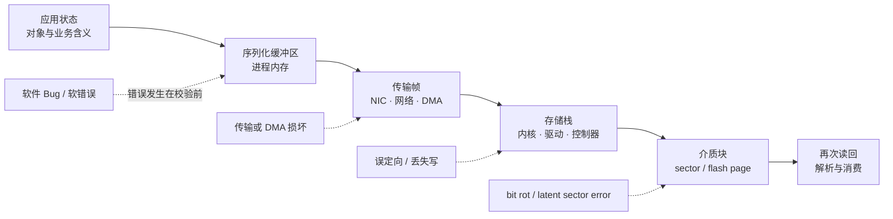
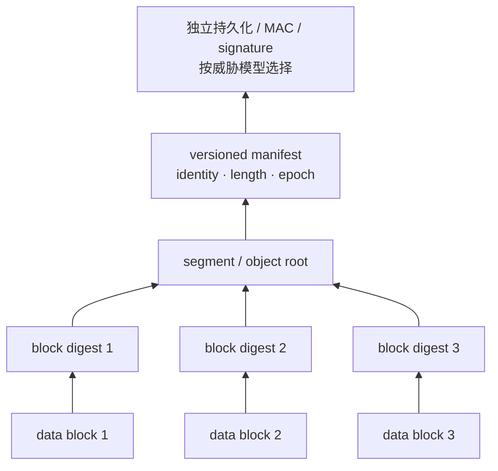
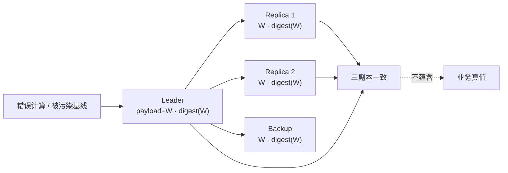
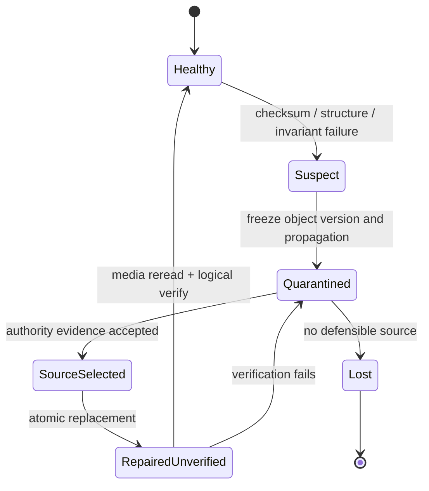
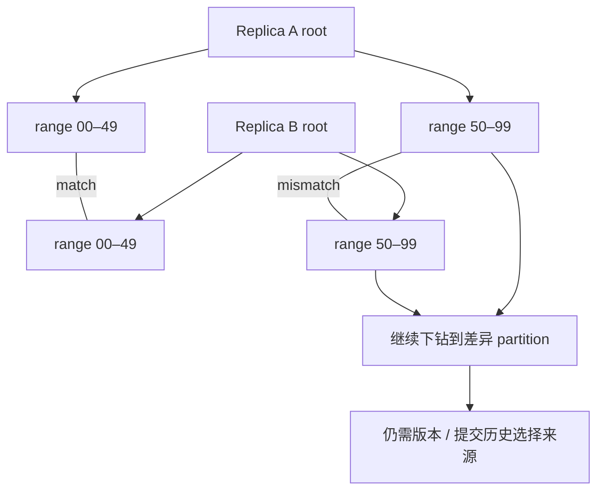

凌晨两点，存储集群的所有节点都在线，复制因子是三，副本延迟是零，健康检查全部为绿色。应用却从三个副本读出了同一笔错误余额。

这并不矛盾。复制协议回答的是“哪些节点拥有同一份已提交状态”，而数据完整性还要回答“这些字节是否仍是当初提交的字节，以及当初提交的内容是否符合业务规则”。如果 Leader 在内存中已经算错，随后为错误值计算 checksum，再把它正确复制给两个 Follower，三个副本会**一致地错**；多数派、CRC 和零复制延迟都无法把错误值变回正确值。

因此，可靠的数据系统不能把“副本在线”和“checksum 通过”当作终点。它需要闭合另一条恢复协议：

```text
定义受保护对象与版本
  → 在可信边界生成完整性证据
  → 读时校验热数据、Scrub 冷数据
  → 将不一致对象隔离而不是继续传播
  → 用提交历史、受保护基线或可验证重放选择权威来源
  → Repair / Re-replication / Restore
  → 重新校验物理字节、逻辑结构与业务不变量
```

本文讨论的是**偶发位翻转、潜伏扇区错误、误定向写、传输和内存损坏，以及由它们引发的副本分歧与恢复**。CRC、hash、MAC 各自能证明什么会被严格区分；恶意篡改只在完整性证据的认证边界内讨论，不把普通 checksum 冒充安全机制。

本文是“有状态系统可靠性”学习路径的 Chapter 16，承接[备份不是副本](/signal-grid-blog/posts/backup-pitr-disaster-recovery-and-restore-drills/)对历史恢复材料的讨论，并为后续[有状态系统如何滚动升级](/signal-grid-blog/posts/stateful-system-rolling-upgrades-protocol-snapshot-migration-safe-rollback/)补上“迁移前后的字节是否可信”这一层。通用结论不依赖具体产品；例子以 PostgreSQL 18、Apache Kafka 4.0，以及截至 2026-08-27 的 OpenZFS、Ceph 和 Apache Cassandra 官方文档为边界。

## 1. “成功读出”不是“内容正确”：先把完整性故障分层

磁盘返回 I/O error 是显式故障；更危险的是设备、内核、网络和应用都报告成功，返回内容却已经变化的 **Silent Data Corruption（SDC，静默数据损坏）**。系统如果没有独立证据，可能把坏字节交给业务、复制给其他节点，并写入下一轮备份。

一条持久化路径至少跨过这些位置：



不同故障需要不同证据，不能统称为“磁盘坏了”：

| 故障                 | 系统实际发生了什么                                          | 低层 ECC/CRC 可能发现吗                         | 还需要什么证据                                  |
| -------------------- | ----------------------------------------------------------- | ----------------------------------------------- | ----------------------------------------------- |
| Bit rot / 介质退化   | 已正确落盘的位在以后发生变化                                | 设备 ECC 可能纠正或报告；超出能力时未必足够     | 持久化 checksum、定期实际读取                   |
| Latent sector error  | 某扇区已经不可读，但直到未来访问才暴露                      | 访问该扇区时通常报告错误                        | Scrub 在冗余仍健康时提前访问                    |
| 误定向写             | 正确内容写到了错误 LBA、页号或对象                          | 只校验 payload 可能仍通过                       | 把逻辑地址、对象身份和版本绑定进证据            |
| 丢失写 / 陈旧写      | 设备确认成功，读取时仍是旧版本                              | 旧字节自己的 CRC 可能完全正确                   | version、epoch、sequence 与提交前沿             |
| 传输、DMA 或驱动损坏 | 发送端和接收端看到的字节不同                                | 某一跳的 CRC 只覆盖该跳                         | 由发送端生成、在最终持久化后验证的端到端 digest |
| 内存或 CPU 软错误    | 序列化前后、计算中或校验计算本身发生错误                    | 若错误发生在生成 checksum 前，checksum 会“合法” | ECC、重复计算、结构校验、业务不变量与可重放输入 |
| 软件 Bug / 错误操作  | 程序生成了语义错误但格式合法的值，并正常提交、校验和复制    | 不能                                            | 领域不变量、审计日志、版本化程序与历史恢复点    |
| 有意篡改             | 攻击者修改 payload，并可能同时重算或替换未受保护的 checksum | 普通 checksum 不能                              | 受保护的 MAC、数字签名或可信 manifest root      |

[Bairavasundaram 等人的 latent sector error 研究](https://research.cs.wisc.edu/wind/Publications/latent-sigmetrics07.html)分析了 32 个月、约 153 万块生产磁盘的数据。它的重要结论不是某个可永久套用的故障率，而是：潜伏错误直到相应扇区被访问才显现，且在重建冗余时遇到它会把单点介质问题放大成数据丢失风险。[同一团队对存储栈数据损坏的研究](https://www.usenix.org/legacy/event/fast08/tech/full_papers/bairavasundaram/bairavasundaram_html/)还观察到控制器、总线与其他栈组件都可能成为静默损坏来源。因此，“磁盘带 ECC”不能覆盖整个数据路径。

### 完整性契约必须同时绑定内容、身份与历史位置

对逻辑对象 `x` 的版本 `v`，可验证记录至少应包含：

```text
IntegrityRecord(x, v) = {
  objectId,                 // 这是谁的数据
  logicalRange,             // page / offset / key range / part
  versionOrEpoch,           // 属于哪代历史
  encodedLength,
  algorithm,
  digest,
  provenance               // 由谁、在路径的哪一端生成
}
```

读路径的物理完整性不变量可以写成：

```text
Serve(x, v, bytes)
  ⇒ Committed(x, v)
  ∧ Digest(bytes, identity(x, v)) = TrustedDigest(x, v)
  ∧ SourceNotQuarantined(x, v)
```

其中 `identity(x, v)` 不能只是一段 payload。若 digest 没有绑定页号，对页 A 的完整字节被误写到页 B 时仍可能校验通过；若没有绑定 epoch，旧版本被重新放回当前槽位也可能被接受。另一方面，即使这条不变量成立，也只说明读到的是**协议认定的已提交字节**，不说明业务计算一定正确。业务正确性还要另有不变量。

## 2. End-to-end 不是“选一种更强 hash”，而是覆盖正确的边界

[Saltzer、Reed 与 Clark 的 end-to-end argument 原论文](https://web.mit.edu/saltzer/www/publications/endtoend/endtoend.pdf)用文件传输说明：网络内部的重试和校验可以降低错误率，但接收端仍要从最终存储读回文件、重新计算 checksum，并与发送端的原始证据比较，才能判断整个传输是否完成。中间层保护有价值，却不能替代知道应用对象含义的端点。

这意味着“每层都有 checksum”和“有一个端到端 checksum”是两个不同命题：

- **逐跳校验**缩短故障定位范围，例如网卡帧、传输包、磁盘 sector 各自检测本层变化；
- **端到端校验**让证据跨越所有不可信变换，从生产者认可的对象一直活到最终持久化和再次消费；
- **语义校验**判断内容之间的关系，例如账本借贷守恒、索引项一定能指向 heap tuple；它不是 checksum 的变体。

### 校验粒度决定能发现什么，也决定修复要重写多少

| 边界                    | 证据应覆盖什么                                           | 能有效发现                                        | 仍然看不见的边界                          |
| ----------------------- | -------------------------------------------------------- | ------------------------------------------------- | ----------------------------------------- |
| Sector / physical block | payload + LBA/reference tag + application tag            | 位错误；绑定 reference tag 时可发现一部分误定向写 | 文件、页和业务版本语义                    |
| Database page           | 完整页 + block number / page identity                    | 页落盘后位变化、错误页位置                        | 跨页索引关系、缺行、多写/少写             |
| Record / record batch   | header、长度、序号、压缩后载荷或规范化记录               | 截断、帧边界错、批次内容变化                      | Producer 在 checksum 前已经产生的错误记录 |
| Segment / SSTable       | segment identity、记录范围、索引、footer 与子块 digest   | 整段缺失、索引与数据不匹配、局部块定位            | 多 segment 合并后是否满足业务语义         |
| Object / multipart file | object key、version、总长度、part 顺序、full-object root | 传输缺 part、乱序、对象内容变化                   | 错误对象被合法上传、错误版本被控制面选中  |
| Dataset / snapshot      | manifest、成员集合、每项 digest、提交前沿与父历史        | 缺对象、混入其他代次、快照不完整                  | 一致快照中所有对象共同包含同一个业务 Bug  |
| Application invariant   | 解码后的实体、跨对象关系、账本或状态机规则               | 格式正确但语义错误、跨记录不一致                  | 未被写成不变量的真实业务规则              |

例如，[PostgreSQL 18 data checksum 文档](https://www.postgresql.org/docs/18/checksums.html)说明它在写出数据页时生成 checksum、读入时验证；保护范围是数据页，不包括所有内部结构和临时文件。[`amcheck` 文档](https://www.postgresql.org/docs/18/amcheck.html)则明确指出：页面格式和自身 checksum 都正确，关系之间仍可能存在逻辑损坏，而且检查工具一般只能证明发现了损坏，不能证明系统里绝无损坏。这正是 page-level 与 semantic-level 的边界。

Kafka 又展示了 record batch 边界。[Kafka 4.0 message format](https://kafka.apache.org/40/implementation/message-format/)规定 batch 的 CRC-32C 覆盖从 attributes 到 batch 末尾的字段，但 `partitionLeaderEpoch` 不在覆盖范围内；这项 CRC 能保护批次编码，却不等于业务 Producer 到 Consumer 的永久端到端证明。旧版 [`ConsumerRecord#checksum` 文档](https://kafka.apache.org/22/javadoc/org/apache/kafka/clients/consumer/ConsumerRecord.html#checksum--)也特别警告：Broker 格式转换可能改变 checksum，v2 格式改为 batch checksum，应用不能依赖这个 API 获得端到端投递保证。

对象存储还要区分 part 与完整对象。[Amazon S3 官方完整性文档](https://docs.aws.amazon.com/AmazonS3/latest/userguide/checking-object-integrity-upload.html)区分 full-object checksum 与由各 part 汇总的 composite checksum，并提醒 multipart 对象的 ETag 不一定是整个对象内容的 MD5。工程协议必须记录算法与 checksum type，不能把任意 ETag 当作跨实现的内容身份。

### 证据必须与数据分离到足以抵抗共同损坏

若 payload 与 checksum 在同一块内被一起覆盖成旧版本，两者会彼此匹配；若攻击者能同时修改对象和对象旁边的 `.sha256` 文件，比较也会通过。可靠设计通常把小范围 digest 逐层汇总到更受保护的 root：



树并不会凭空产生信任。可信度来自 root 的来源、不可变版本和访问边界；叶子 hash 只是把差异定位到较小范围。

## 3. 读时校验保护热数据，Scrubbing 必须主动触达冷数据

只在正常读取时验证 checksum，热对象能较快暴露损坏，归档对象却可能几年都不被访问。到某块盘故障、系统开始从其余副本重建时，才发现另一个副本有潜伏扇区错误，此时“还有两份”已经变成“没有完整来源”。

Scrub 的工作不是查询文件元数据或确认设备在线，而是：

1. 枚举某个明确 generation 的受保护数据；
2. 实际读取覆盖范围内的字节；
3. 用记录的算法重新计算 digest，并与对应身份的可信证据比较；
4. 报告覆盖率、失败范围和不可读范围；
5. 只有权威来源可证明时才触发自动修复；
6. 修复后重新从介质读回并再次验证。

读时校验与 scrub 是互补关系：

```text
DetectionLatency(x) = min(TimeUntilNextVerifiedRead(x), TimeUntilScrub(x))

要保持可修复：
DetectionLatency(x) + RepairLatency(x) < RedundancySurvivalWindow(x)
```

右侧不是磁盘厂商给出的一个常数。它受故障域相关性、剩余副本数量、介质年龄、重建带宽和共同软件版本影响。因此 scrub 周期不能只按“每月一次”照抄；它应由最大允许的潜伏时间倒推，并通过覆盖完成时间证明。

[OpenZFS 的 checksum 文档](https://openzfs.github.io/openzfs-docs/Basic%20Concepts/Checksums.html)把 checksum 存在 block pointer 中，并把读时验证、冗余下的自动修复和周期性 scrub 连成一体。[OpenZFS scrub 文档](https://openzfs.github.io/openzfs-docs/Basic%20Concepts/Operations/Scrub%20and%20Resilver.html)进一步明确：scrub 会遍历数据并验证每个 block；没有冗余时仍能检测、定位损坏，却不能修复。它还指出 scrub 是 I/O 密集型操作，顺序重建结束后需要再做 scrub，因为快速重建过程本身没有验证 checksum。

### 在线 Scrub 必须定义一个可解释的覆盖切面

活跃系统在 scrub 期间持续写入。若扫描一半时对象被覆盖，最后得到的不是某一瞬间的快照。可接受的协议通常选择一种语义：

- 固定 snapshot/generation，完整扫描该不可变集合；
- 对 copy-on-write 块树固定 root，扫描 root 可达的对象；
- 允许在线变化，但按对象记录验证时的 version，结束时报告覆盖向量而非伪造一个全局完成时刻；
- 对扫描期间变化的对象重新入队，直到变化率允许收敛，或明确宣布本轮未覆盖。

进度也必须区分“已枚举”“已读取”“已验证”“已修复”。`scrub_job_success = true` 如果只表示任务进程退出，会掩盖被限流、跳过、权限失败或在任务期间新产生的数据。

## 4. Checksum 只能判等，不能认证来源，更不能投票选真相

一个 checksum 匹配只意味着 `Checksum(currentBytes, coveredIdentity) == expectedDigest`。它不能排除碰撞；随机损坏的漏检上界是否可接受，必须结合算法、覆盖长度、故障模型与业务风险预算评估。匹配也不直接说明参考 digest 是谁生成的、是否属于当前对象、是否被替换，更不说明内容满足业务语义。

[NIST 对 CRC 的定义](https://csrc.nist.gov/glossary/term/cyclic_redundancy_check)明确把它归为非密码学 hash，适合预期为偶发变化的完整性服务。若威胁模型包含主动攻击者，普通 CRC 不够：攻击者可以修改 payload 后重算 CRC。此时需要把对象身份、版本和 digest 放进受密钥保护的 MAC，或由可信身份签名；但 MAC 和签名同样只能认证“某个主体认可了这些字节”，不会证明主体的软件没有 Bug。

### 三个相同副本可能比一个不同副本更危险

下面四条路径都会形成“所有副本 checksum 正确、内容却错误”：

1. Leader 的计算逻辑产生错误值，再为错误值生成 checksum；
2. 内存软错误发生在 checksum 生成之前，错误字节与对应 digest 一起写出；
3. 一个格式合法但历史代次错误的 snapshot 被用于建立所有副本；
4. 后台 repair 误把坏副本当权威，把它覆盖到其他副本并更新各自 digest。

多数派能证明协议成员对某个值达成了一致，前提是故障模型和 quorum 交集成立；它不能证明多数成员没有共享同一个软件 Bug、坏基线或控制面误操作。复制的方向甚至会让错误更快扩散。



反过来，两个副本不一致时也不能用“二比一”机械裁决。少数副本可能是唯一未被错误 repair 覆盖的好副本；多数副本可能来自同一个坏 snapshot。选择权威来源必须引入副本内容之外的证据：提交历史、epoch、受保护 manifest、已知健康的历史基线或确定性重放。

## 5. 一旦发现不一致，第一动作是隔离传播路径

“checksum mismatch 后从别的副本读一次”只解决了当前请求，没阻止坏块继续进入 compaction、snapshot、re-replication、索引构建和备份。完整性事件首先是一项**污染控制**任务。

最小状态机应把“已修复”与“已经证明修复”分开：



### 隔离单位要比损坏范围更大一点，而不是整集群或一个字节

若一个 page checksum 失败，最小物理范围是该 page；但它所属的 B-tree 可能已经用坏 key 生成父节点，基于它构建的增量备份也可能受污染。隔离范围应沿派生关系扩张到“所有可能消费过坏数据的结果”，同时避免无证据地停掉全系统。

事件记录至少要保留：

```text
CorruptionEvidence = {
  objectId, logicalRange, versionOrEpoch,
  expectedDigest, observedDigest, algorithm,
  replicaId, deviceAndPath, detectionMode,
  firstObservedAt, lastKnownGoodVersion,
  consumersAndBackupsPossiblyExposed
}
```

不要把 `objectId`、page number 或用户 key 直接做成指标 label；高基数字段进入可检索事件。聚合指标只保留稳定维度，例如 `layer`、`detector`、`device_class`、`repair_result`。

### Fail closed 还是降级读取，由数据语义决定

- 对账本余额、权限、密钥材料和共识元数据，无法验证时应拒绝返回，防止错误成为新的外部副作用；
- 对可从源事件重建的缓存或搜索索引，可停止该 shard 服务、切换到较慢的权威读或重建；
- 对图片、分析结果等可标记降级的数据，可以返回最后已验证版本，但必须携带 staleness 语义，不能冒充当前值；
- 任何 fallback 都不能绕过版本和 checksum 再把 suspect 副本当普通副本加入负载均衡。

在覆盖坏副本之前，应保留只读证据或 copy-on-write 快照。直接原地修复会同时销毁根因调查材料；如果修复来源后来被证明也错，系统甚至失去了比较基线。

## 6. 权威副本来自协议证据，不来自节点角色或墙钟新旧

“Primary 上的就是权威数据”只在 Primary 自己已经通过完整性与历史校验时成立。角色说明谁当前有权接受写入，不说明它的每个旧块都未损坏；文件修改时间更不能区分正确新值、错误新值和被放回的旧值。

可以把一个候选来源 `s` 对对象版本 `(x, v)` 的可接受条件写成：

```text
AuthoritativeSource(s, x, v) =
    CommitHistoryContains(x, v)
  ∧ EpochAndIdentityMatch(x, v)
  ∧ DigestVerifiedAgainstProtectedRoot(s, x, v)
  ∧ SourceFaultDomainNotSuspect(s)
  ∧ DecoderAndSchemaCanValidate(v)
```

这一定义仍是**协议权威性**：它能证明 `v` 就是系统当时提交并受保护的版本。若 `v` 本身来自业务 Bug，还需回到错误引入前的基线，修正程序后重放，或执行一条审计可见的补偿交易。

### 来源选择是一组证明义务

| 观测                         | 可自动采用的来源                                        | 必须停止自动修复的条件                               |
| ---------------------------- | ------------------------------------------------------- | ---------------------------------------------------- |
| 一个副本 checksum 失败       | 同一 committed version、通过受保护 root 校验的独立副本  | 其他副本版本不同，或 root 与数据位于同一可疑故障域   |
| 一个副本不可读               | 同版本健康副本或由校验通过的 erasure fragments 重建     | 剩余材料不能重构，或重构结果无法匹配可信 digest      |
| 副本 digest 相互不同         | 能被提交日志、epoch 和可信 manifest 唯一指认的候选      | 只有副本票数，没有独立历史证据                       |
| 所有副本一致但违反业务不变量 | 错误引入前的不可变基线 + 经过验证的日志前缀             | 只剩包含同一逻辑错误的在线副本和备份                 |
| 当前副本与备份都可疑         | 从另一个故障域验证过的 backup generation 或原始事件重建 | 无法证明 backup 早于污染，也无法证明重放输入未被污染 |
| 没有任何候选满足权威谓词     | 无                                                      | 必须声明局部数据丢失，进入业务重建或人工裁决         |

[Ceph 官方 PG troubleshooting 文档](https://docs.ceph.com/en/latest/rados/troubleshooting/troubleshooting-pg/)提供了一个很诚实的边界：deep scrub 会读取对象并计算 checksum，`pg repair` 会尝试用判定为 authoritative 的副本覆盖坏副本；但在 digest 缺失等情形下，匹配的记录 checksum 和现算 checksum 都不能证明某个具体副本必然权威，自动选择可能需要人工介入。文档中“无 checksum 时可能偏向 Primary”的具体选源路径属于已经弃用的 FileStore 后端；BlueStore 有内部 checksum，仍不能因此证明业务内容或历史版本权威。产品提供 `repair` 命令，并不等于任何不一致都有安全的自动答案。

### “最新”必须来自单调历史，而不是墙钟

权威比较使用 `(term/epoch, log position, object version)` 等协议身份。若两个副本分别声称：

```text
Replica A: epoch=41, version=900, wallClock=10:00:02
Replica B: epoch=42, version=873, wallClock=09:59:58
```

不能因 A 的 version 或墙钟更大就覆盖 B。必须先解释 epoch 42 是否由合法成员变更或恢复分支产生、version 的命名空间是否跨 epoch 可比，以及哪个位置已经进入权威提交历史。时间戳只用于事件调查，不承担历史选择。

## 7. Repair、Re-replication、Restore 与 Anti-entropy 各解决一层问题

选择出权威来源之后，修复仍是一次会失败、重试和并发的状态迁移。一个安全 repair 不是 `copy(source, target)`，而是带 generation fence 的条件更新：

```text
Repair(jobId, x, badGeneration, sourceVersion, sourceDigest):
  params = (x, badGeneration, sourceVersion, sourceDigest)
  prior = RepairJournal.get(jobId)
  if prior exists:
    require prior.params == params
    if prior.state == VERIFIED: return prior.evidence
    return resumeFromDurableState(prior)
  else:
    durableCreate RepairJournal(jobId, params, PLANNED)

  require target(x).generation == badGeneration
  require AuthoritativeSource(source, x, sourceVersion)
  require readAndDigest(source) == sourceDigest

  write replacement to a new generation
  fsync / durable-complete replacement and its manifest
  durableUpdate RepairJournal(jobId, PREPARED, replacementGeneration)
  durableCAS activeGeneration: badGeneration -> replacementGeneration
  durableUpdate RepairJournal(jobId, ACTIVATED)
  reread replacement from final storage
  verify physical digest + logical structure
  durableUpdate RepairJournal(jobId, VERIFIED, evidence)
```

`jobId` 只有绑定不可变参数与持久 Repair Journal 才能让重试幂等；同 ID 不同参数必须拒绝。`resumeFromDurableState` 必须把持久指针和 Journal 联合解释：

- `PREPARED` 且 active 仍是 `badGeneration`：重试同一笔 `durableCAS`；
- `PREPARED` 且 active 已是 `replacementGeneration`：说明切换成功、Journal 更新丢失，继续介质复读与验证；
- `PREPARED` 且 active 已是第三个 generation：把任务持久标记为 `SUPERSEDED/ABORTED`，绝不能再激活旧 replacement；
- `ACTIVATED`：先确认 active 仍等于 `replacementGeneration`，否则重新隔离并进入冲突裁决；相等时才继续复验。

`badGeneration` 防止慢 repair 覆盖期间发生的新写，先写新 generation 再做耐久 CAS 则保留回退与取证材料。只有最终介质重读通过后，目标副本才能重新加入读流量和后续复制来源。

### 四条恢复路径的适用前提不同

- **局部 Repair**：已唯一识别坏 page、record range 或 object，且存在同版本权威副本；只替换最小安全范围。
- **Re-replication / Rebuild**：整个 replica 或设备故障；从同一 committed generation 的已验证健康全量副本/range，或从已验证 snapshot 加 committed-log catch-up 建立目标，最终做全量或抽样结构校验。
- **Restore / PITR**：在线副本可能共同污染；从错误引入前的隔离 backup generation 恢复，再只重放经过审查的历史。若错误 mutation 本身位于 WAL，机械重放会重新制造损坏。
- **Deterministic reconstruction**：投影、索引或缓存可由可信输入重算；应把旧产物完全隔离，以固定代码版本和输入 cursor 重建，并比较新旧业务不变量。

### Merkle Tree 定位差异，不决定哪边正确

Merkle tree 将大量对象的 hash 分层汇总。根相同可以高概率说明同一规范化范围相同；根不同则沿树下钻，只传输差异 range，避免比较全部对象。它非常适合 anti-entropy 的**差异发现和带宽缩减**。



[Apache Cassandra repair 文档](https://cassandra.apache.org/doc/latest/cassandra/managing/operating/repair.html)说明 repair 会为共同 token range 构造 Merkle trees、比较数据集，并传输不同步范围。文档也指出 hints 是 best effort；只做 incremental repair 不能覆盖磁盘损坏、操作失误和软件 Bug，因此仍需周期性 full repair。这里的“repair”服务于 Cassandra 的版本合并和最终一致协议，不能泛化成“两个任意二进制副本不一样时，Merkle tree 会告诉你真值”。

### 修复闭环必须阻断备份污染

新 backup generation 进入保留集合前，应有不可变 manifest，记录数据成员、checksum type、父 generation、软件与 schema 版本、创建期间的 commit frontier，以及 scrub/结构校验状态。最近一次备份任务成功并不代表材料未污染。

发现损坏后要反向标记可能受影响的：

- 从 `firstPossibleCorruption` 之后产生的 snapshots 与 backups；
- 以 suspect 副本为 source 建立的 replicas；
- 从坏对象派生的索引、缓存和下游导出；
- 已发往外部系统、无法靠覆盖撤回的副作用。

不能因为一代新备份刚刚生成就删除旧基线。至少要等新 generation 在独立故障域完成读取校验、恢复演练和业务对账，且其父历史没有跨过未裁决的污染窗口，再推进安全删除边界。

## 8. 只有故障注入能证明系统会发现、隔离并正确修复

“开启 checksum”证明配置存在；“scrub 成功一次”证明某次任务没有报告错误。它们都没有证明检测器覆盖所有声明的边界，也没有证明 repair 不会把坏数据扩散成多数。

完整性测试应直接修改最终存储或指定路径中的字节，而不是只让 API 返回一个模拟异常。每种故障都要有 pass condition：何处发现、何时停止服务、哪份证据决定权威、修复后哪些不变量恢复。

| 注入故障                                | 预期首个检测器                         | 系统绝不能做什么                   | 通过证据                                                      |
| --------------------------------------- | -------------------------------------- | ---------------------------------- | ------------------------------------------------------------- |
| 持久化后翻转一个 data block bit         | 读时 checksum 或下一轮 scrub           | 把该块作为 re-replication source   | mismatch 精确到 range；隔离；从权威副本修复；介质重读通过     |
| 把内容正确的 page A 写到 page B         | 绑定 block identity 的 page checksum   | 因 payload hash 合法而接受         | expected identity 与实际位置冲突；A/B 均按提交历史复核        |
| 在 sender 生成 digest 后修改传输字节    | receiver 完成落盘后的 end-to-end 校验  | 先发布对象可见，再异步忽略失败     | 接收事务不提交；重传后 full-object digest 匹配                |
| 在生成 checksum 前修改内存中的业务值    | 结构校验或业务 invariant               | 声称 CRC 已覆盖该软错误            | checksum 可以通过，但账本/状态机不变量拒绝版本                |
| 用同一错误程序让三个副本产生相同坏值    | 语义 oracle、历史差分或 canary         | 以多数相同为由自动覆盖最后健康基线 | 所有在线副本被标记为共同故障域；恢复到 bug 前基线并选择性重放 |
| 修改 payload 与同目录下未认证 checksum  | 受保护 manifest root / MAC             | 把自洽的一对文件当作可信来源       | root 验证失败；该 generation 不得进入 restore 候选            |
| Repair 写入一半时 crash，随后旧任务重试 | generation CAS 与 repair journal       | 覆盖 crash 后产生的新版本          | 半成品不可见；重试幂等；旧 generation fence 失败              |
| Scrub 期间撤掉另一个健康副本            | redundancy monitor + scrub coordinator | 在唯一来源不确定时继续自动覆盖     | repair 暂停或转入 Lost；保留证据；不会宣告冗余恢复            |

### “修好了”的证据是一个可重放的证明包

一次已完成的 repair 至少应关联以下事实，而不是只有工单状态：

```text
RepairEvidence = {
  detectionEvent,
  quarantinedGeneration,
  authorityDecisionAndInputs,
  sourceVersionAndTrustedDigest,
  destinationGenerationAndRereadDigest,
  structuralAndBusinessInvariantResults,
  replicaConvergenceResult,
  affectedBackupAndConsumerDisposition,
  faultInjectionSeedOrOperationalTrace
}
```

生产观测至少要能回答：最老未 scrub 数据年龄、各故障域覆盖率、checksum/structure/invariant 失败率、隔离对象数量与年龄、repair 来源类型、repair 后复验失败数、被污染 backup generation 数，以及从发现到阻断传播的时间。`checksum_failures_total = 0` 若同时伴随 scrub 长期未完成，只说明系统很久没有认真寻找错误。

完整性闭环最终依赖三种彼此不可替代的证据：checksum 在给定算法、覆盖边界与可接受碰撞风险下，证明当前字节计算出的 digest 与受保护参考 digest 一致；复制和提交历史证明版本在协议中的权威位置；结构与业务不变量证明这些字节仍构成可接受的系统状态。多副本只增加可用材料，Scrubbing 只缩短潜伏时间，Merkle tree 只缩小差异范围。只有先隔离、再以独立证据选源、最后对修复结果重新读取和验证，系统才有资格把副本重新标记为健康。

## 9. 参考资料

- J. H. Saltzer, D. P. Reed, D. D. Clark：[End-to-End Arguments in System Design](https://web.mit.edu/saltzer/www/publications/endtoend/endtoend.pdf)
- L. N. Bairavasundaram et al.：[An Analysis of Latent Sector Errors in Disk Drives](https://research.cs.wisc.edu/wind/Publications/latent-sigmetrics07.html)
- L. N. Bairavasundaram et al.：[An Analysis of Data Corruption in the Storage Stack](https://www.usenix.org/legacy/event/fast08/tech/full_papers/bairavasundaram/bairavasundaram_html/)
- OpenZFS：[Checksums and Their Use in ZFS](https://openzfs.github.io/openzfs-docs/Basic%20Concepts/Checksums.html)
- OpenZFS：[Scrub and Resilver](https://openzfs.github.io/openzfs-docs/Basic%20Concepts/Operations/Scrub%20and%20Resilver.html)
- PostgreSQL 18：[Data Checksums](https://www.postgresql.org/docs/18/checksums.html)
- PostgreSQL 18：[`amcheck`](https://www.postgresql.org/docs/18/amcheck.html)
- Apache Kafka 4.0：[Message Format](https://kafka.apache.org/40/implementation/message-format/)
- Ceph：[Troubleshooting PGs](https://docs.ceph.com/en/latest/rados/troubleshooting/troubleshooting-pg/)
- Apache Cassandra：[Repair](https://cassandra.apache.org/doc/latest/cassandra/managing/operating/repair.html)
- NIST CSRC：[Cyclic Redundancy Check](https://csrc.nist.gov/glossary/term/cyclic_redundancy_check)
- Amazon S3：[Checking Object Integrity for Data Uploads](https://docs.aws.amazon.com/AmazonS3/latest/userguide/checking-object-integrity-upload.html)
