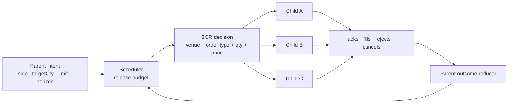
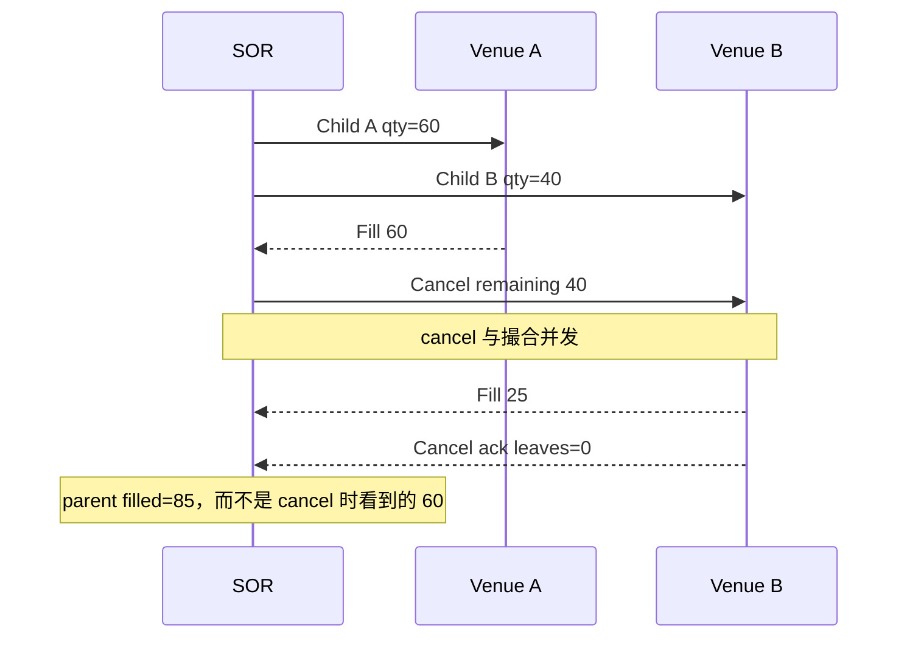

多个 venue 同时显示可成交价格时，把订单送到“当前最便宜”的地方，看上去已经足够聪明。真实执行却会立刻遇到反例：最优报价只有一小笔且已经陈旧；便宜的 venue 延迟更高、拒单更多、费用更贵；一笔大单如果立即扫完全部深度，会暴露意图并产生市场冲击；为了提高成交率同时挂到多个 venue，又可能在撤单返回前被全部成交而 overfill。

本文的中心结论是：**智能路由不是寻找一个静态最优 venue，而是在 parent intent、市场证据、执行反馈、风险和合规约束下持续生成、裁决并审计 child orders。** SOR 决定某一时刻把可执行 slice 放到哪里；TWAP、VWAP、POV、Implementation Shortfall 等执行算法决定 parent order 随时间释放多少。两者都只能在明确的数据切点和约束下优化，不能保证未来成交结果。

本文是交易系统学习路径的 Chapter 26，承接 [市场微观结构与成交质量](/signal-grid-blog/posts/market-microstructure-execution-quality/) 对 spread、queue、market impact 与 execution benchmark 的定义；下一章 [订单簿做市](/signal-grid-blog/posts/market-making-mechanics-and-strategies/) 会把这里的主动执行问题转向持续双边报价、库存风险和逆向选择。

本文使用 FIX Trading Community、SEC/FINRA、欧盟法规、公开 venue 规范与原始论文建立一般工程模型，资料核对截止 2026-08-27。`NBBO`、Rule 611、MiFID II best execution、期货 venue 规则和数字资产路由没有统一法律含义；任何评分因子、路由许可、客户指令优先级、self-match 控制与记录保留期都必须绑定交易主体、产品、venue、司法辖区和当期规则。本文不是投资、法律或合规意见。

## Parent intent 是合同，Child order 只是执行尝试

客户或策略真正提交的是 parent intent：在价格、数量、时间、参与率、venue、风险和信息暴露约束下完成一项经济目标。路由器随后生成的每张 child order 只是实现该目标的一次可撤销尝试。若 child 状态反过来覆盖 parent 约束，算法在重试、改单和故障恢复时会逐渐改变用户意图。



Parent 至少冻结这些字段：

```text
ParentIntent {
  parentId, clientInstructionVersion,
  account, instrument, side,
  targetQty, limitPrice?, startTime, deadline,
  benchmark, urgency, maxParticipation?,
  allowedVenues, prohibitedVenues,
  settlementAndCurrencyConstraints,
  overfillPolicy, riskPolicyVersion
}
```

Child 必须引用 parent 与 decision：

```text
ChildOrder {
  childId, parentId, parentVersion,
  decisionId, venue, venueSession,
  type, tif, price, qty,
  reservationId, idempotencyKey,
  state, venueOrderId?
}
```

核心数量关系不是简单的 `parentFilled = sum(childFilled)`，而是对去重且修正后的 active fills 求和。订单入口与 Drop Copy 重复、trade bust/correct、跨 venue ID 碰撞都必须先由 OMS 处理。Parent reducer 只消费业务事实，不根据 socket write 或 cancel request 猜测 child 终态。

Parent 的 `deadline` 也不是“到点后保证完成”。它定义算法何时停止创建风险、是否进入更激进阶段，以及未完成量最终是取消、返回、转人工还是按客户允许的方式收尾。不能为了命中目标量自动突破 limit price、venue restriction 或风险限额。

[FIXatdl](https://www.fixtrading.org/standards/fixatdl-online/)可以机器可读地描述算法参数、验证规则和 FIX New/Cancel/Replace 接口，但它定义的是算法订单接口，不替执行引擎规定优化目标或安全语义。内部 parent contract 仍应独立于特定经纪商 algo 名称与 GUI 字段。

## Venue 归一化必须保留差异，而不是制造虚假统一

路由器要比较 venue，首先必须把不同 instrument identity、价格单位、lot、order type、market state、fee 和时钟映射到一个 canonical decision model。但 canonical 不能是最小公分母；若抹掉 Post-Only、minimum notional、auction、hidden quantity、cancel/replace priority 或 self-match 规则，评分再精确也会把不可执行订单排在第一名。

一个 venue capability snapshot 可以包含：

```text
VenueCapability {
  venue, environment, adapterVersion,
  rawInstrument, canonicalInstrument,
  tickRuleVersion, lotRuleVersion,
  supportedOrderTypes, tifSet,
  sessionState, tradingCapabilities,
  priceBandVersion, feeScheduleVersion,
  cancelReplaceSemantics,
  stpScopeAndInstruction,
  settlementAndCurrencyScope
}
```

每个报价也必须保留来源与时间：

```text
VenueQuote {
  venue, bookGeneration, sourceCursor,
  sourceTime?, receiveMonotonicTime,
  publishMonotonicTime,
  bidLevels[], askLevels[], validity
}
```

跨 venue 的“同一产品”经常并不可替代：合约 multiplier、到期日、交割资产、结算币种或监管市场不同；数字资产同名 symbol 还可能对应不同链、托管安排和 quote currency。只有 instrument master 明确建立 fungibility/hedge relation，路由器才可把它们纳入同一个 parent；可对冲不等于可直接替代。

状态也不能压成 `isOpen`。一个 venue 可能只允许撤单、进入 auction、禁止 market order、价格带生效或订单入口降级。路由 admissibility 应先过滤：

```text
eligible =
  instrument identity proven
  && market state permits this child action
  && parent allows venue
  && account/session has entitlement
  && price/qty conform to current rules
  && market data is valid and fresh enough
  && settlement/currency constraints match
```

只有 `eligible=true` 的候选才进入评分。把不可下单 venue 赋一个很差分数仍不够安全：评分 bug、NaN 或 fallback 可能把它选中；能力约束必须作为 hard gate。

## 最优价格只是路由决策的一项输入

对于买单，某 venue ask 更低并不自动意味着执行成本更低。路由器面对的是有限深度、排队概率、费用、延迟、拒单和市场移动。一个诊断性评分可以写成：

```text
expectedAllInCost(v, q) =
    expectedSweepPrice(v, q)
  + explicitFees(v, accountTier, liquidityRole, q)
  + expectedSlippage(v, latency, volatility, q)
  + rejectAndRetryCost(v)
  + settlementOrFundingCost(v)
  + riskPenalty(v)
  - expectedRebate(v)
```

这个式子不是跨资产的法规公式，而是提醒系统把量纲和证据写清楚。Maker rebate 只有在成交概率模型成立时才是收益；深度价格只有在目标量可达且数据新鲜时才有意义；低延迟也可能伴随更高 adverse selection。

`NBBO` 是美国 NMS stocks 的特定市场结构概念，不是全球跨资产最优价的同义词。即使在美国股票语境，price protection 也不等于完整 best execution。[SEC Regulation NMS 最终规则](https://www.sec.gov/files/rules/final/34-51808.pdf)明确指出 Rule 611 不减轻 broker-dealer 的 best-execution duty；[FINRA Rule 5310](https://www.finra.org/rules-guidance/rulebooks/finra-rules/5310)要求考虑市场特征、订单大小、可访问性、成交概率、速度、交易成本等因素。

规则状态还会变化。截至 2026-08-27，[SEC 于 2026-06-11 提议撤销 Rule 611](https://www.sec.gov/rules-regulations/2026/06/s7-2026-20)，该页面仍标为 Proposed Rule。工程实现不能把某次法规状态编译成永久逻辑；应让 jurisdiction policy 带 effective date、approval status 和 rule version，并由合规流程激活。

欧盟语境也不同。[MiFID II Article 27](https://eur-lex.europa.eu/eli/dir/2014/65/2024-03-28/eng/pdf)要求考虑价格、成本、速度、执行与结算可能性、规模和性质等因素；对 retail client 又强调 total consideration。它没有要求所有订单使用同一加权公式。客户具体指令、execution policy 与适用主体都会改变决策边界。

因此每次路由都应生成可解释的 `DecisionRecord`：候选集为何被纳入/排除、使用哪一时刻的 market snapshot、各成本模型版本是什么、最终为何选择某 venue。没有这个记录，事后只能用成交后的行情为当时决策“补理由”。

## SOR 选择场所，执行算法管理时间与数量

SOR 与 execution algo 经常被统称为“算法交易”，但它们回答不同问题：

```text
execution schedule: 在时间 t 释放多少 parent quantity？
SOR:               对当前 released quantity，送到哪个 venue、用什么 child 参数？
```

四种常见 schedule 的目标与失败方式不同：

| 策略                     | 释放规则                               | 主要依赖                                         | 典型偏差                                        |
| ------------------------ | -------------------------------------- | ------------------------------------------------ | ----------------------------------------------- |
| TWAP                     | 按时间桶近似均匀释放                   | 时钟、deadline、可交易窗口                       | 忽略真实成交量形状；规律切片可暴露意图          |
| VWAP                     | 按预测市场成交量曲线分配               | historical/forecast volume curve                 | 临时事件使预测曲线失真；不能保证成交 VWAP       |
| POV                      | 以观察到市场量的比例动态参与           | 及时、去重的 market volume                       | volume feed 迟到/修正会追涨杀跌；低量时无法完成 |
| Implementation Shortfall | 在预期冲击、机会成本与价格风险之间优化 | arrival price、impact/volatility model、风险偏好 | 模型错配、未观测流动性和 regime change          |

TWAP 示例不是每分钟无条件下一笔，而是每个控制周期计算：

```text
targetByNow = schedule(now, parent)
behindQty   = max(0, targetByNow - economicallyFilledQty - committedLiveQty)
releaseQty  = min(behindQty, riskBudget, venueCapacity, parentRemaining)
```

VWAP 的 volume curve 必须带市场日历、auction 和半日市版本；POV 的 denominator 必须定义纳入哪些 venue、打印和修正，不能把同一成交在 consolidated feed 与 direct feed 计算两次。Implementation Shortfall 的 arrival price 也必须在 parent 被系统接收的明确切点冻结，不能在成交后挑一个更有利 benchmark。

[Bertsimas 与 Lo 的原始论文](https://web.mit.edu/Alo/www/Papers/bertlo98.html)把大单执行建模为在有限时间内、给定 price-impact 与市场状态下最小化预期成本的动态策略；[Almgren 与 Chriss 的原始论文](https://doi.org/10.21314/JOR.2001.041)进一步把预期执行成本与成本不确定性放在同一风险调整框架。它们提供思考工具，不是可直接部署的万能参数：真实 venue 离散订单、队列、费用、限流和合规约束仍需进入执行系统。

Scheduler 生成的是 `release budget`，不是一张必然下出的订单。SOR 仍需根据当时可执行 venue 和 parent hard constraints 分解 child；如果没有合格候选，应保留未完成量并按 parent 的降级合同处理，而不是为追 schedule 突破 limit。

## 并发成交、Overfill 与 Cancel race 必须由数量预占约束

为了提高成交率，路由器可能把 parent 的剩余量同时挂在多个 venue。如果剩余 100，却在 A、B 各挂 100，两边同时成交就得到 200。事后立刻撤单不能消除已经发生的 fill；反向“修平”还会产生新的市场风险、费用和合规事件。



控制量至少拆成：

```text
economicFilledQty   // 去重并处理修正后的实际成交
liveReservedQty     // 已获准且可能成交的 child 剩余量
unknownReservedQty  // 发送/撤单结果未知的最坏剩余量
availableToRoute = targetQty - economicFilledQty
                   - liveReservedQty - unknownReservedQty
```

创建 child 时要原子占用 parent route budget；venue reject、被证明未发送或权威终态才释放。Cancel requested 不释放，因为 cancel 在途仍可成交。核心不变量是：

```text
economicFilledQty + liveReservedQty + unknownReservedQty
  <= targetQty + configuredOverfillBudget
```

`configuredOverfillBudget` 默认应为 0；若某策略明确允许多 venue passive replication，它必须有独立授权、上限、实时对冲能力和失败语义，不能藏在路由器内部。即使预算为 0，异步修正、venue 行为或外部人工订单仍可能产生异常 overfill，所以系统还要定义 `OVERFILLED` 事实与人工/自动处置，而不是截断 `filledQty` 让报表看起来刚好。

IOC sweep 可以让各 child 数量之和不超过 remaining，降低 overfill 窗口；但 partial fill、timeout 和 late report 仍会制造 Unknown。只有订单入口、Drop Copy 和查询完成裁决，reservation 才能释放并重新路由。生成新 child 前必须读取同一 parent 的最新 authoritative reducer state，而不是各 venue adapter 缓存的局部 remaining。

## 风控、自成交与合规约束必须先于评分

SOR 的“最优”只能在被允许的集合里成立。Parent 在入口已经通过准入，不代表每个 child 自动合法：行情、价格带、账户可用量、position、消息限额和 venue 状态会变化，拆单本身还可能提高 gross notional 或并发挂单暴露。

Child admission 至少重新验证：

```text
parent permission still current
instrument/venue capability version current
child price, qty, notional and message rate within limits
aggregate parent + sibling exposure within reserved budget
account is entitled and not fenced
no prohibited self-match / wash-trade interaction
jurisdiction and client routing policy permit venue and order type
```

Self-match 不能只靠单 venue 的 STP。两个算法、两个 session、关联账户或内部化流可能在 venue scope 之外相遇。[CME Globex SMP FAQ](https://www.cmegroup.com/solutions/market-access/globex/trade-on-globex/faq-self-match.html)明确其 SMP ID、cancel instruction、共同所有权范围与 implied-order 限制；这是 CME 的功能边界，不代表其他 venue 拥有相同 scope，也不把所有相互成交自动判定为违法。

内部冲突检测应使用受益所有人、账户组、策略、产品和 venue rule 共同定义的 `SelfMatchDomain`。发生冲突时的 cancel aggressor/passive/both、reprice 或 reject 必须由 policy 决定，并保留 reason。不能为了提高 fill rate 绕过 STP，也不能把“同一公司”简单等同于所有订单都必须互斥。

法规要求同样依主体和法域变化。[SEC Rule 15c3-5](https://www.sec.gov/rules-regulations/2011/06/risk-management-controls-brokers-or-dealers-market-access)要求适用 broker-dealer 的市场接入控制防止超限、错误或受限订单进入，并确保监督人员获得及时成交报告；[EU RTS 6](https://eur-lex.europa.eu/eli/reg_del/2017/589/oj/eng/pdf)则覆盖算法测试、pre-trade controls、监控、kill functionality 和记录。两者都不能被一句“路由模型得分最高”覆盖。

Policy gate 应输出版本化允许/拒绝事实，score engine 只在允许集合中排序。这样模型替换、费用优化或机器学习不会意外获得扩大合规边界的权限。

## 执行反馈要校准未来决策，而不是证明过去最优

成交后看到另一个 venue 价格更好，不足以证明当时路由错误：那份报价可能在 decision time 不可见、不可访问、数量不足或在网络途中已经消失。反过来，成交价格恰好很好也不能证明路由政策长期有效。评价必须绑定当时可用证据，并在足够样本上比较可执行替代方案。

每个 decision 应冻结：

```text
decisionTimeMonotonic + synchronizedWallTime
marketSnapshotRefs per venue
eligibleCandidateSet and exclusion reasons
fee/risk/latency/model versions
selected action and score decomposition
parent benchmark and customer instruction version
```

随后用执行事实计算互补指标：

| 指标                                 | 回答的问题                         | 主要混淆因素                                  |
| ------------------------------------ | ---------------------------------- | --------------------------------------------- |
| Fill rate / completion               | 路由是否得到数量                   | 订单 aggressiveness、市场状态、selection bias |
| Effective spread / price improvement | 相对当时基准的成交成本             | NBBO/benchmark 时间对齐、订单方向             |
| Realized spread / markout            | 成交后价格如何移动                 | horizon 选择、行情源、共同市场冲击            |
| Implementation shortfall             | 相对 arrival decision 的总执行损失 | 未成交 opportunity cost、parent 变更          |
| Reject/cancel latency                | venue 操作可靠性                   | session state、限流、消息类型                 |
| Fees/rebates/funding                 | 显式全成本                         | account tier、maker/taker 判定、结算币种      |

[SEC 2026 Rule 605 FAQ](https://www.sec.gov/rules-regulations/staff-guidance/trading-markets-frequently-asked-questions/frequently-asked-questions-rule-605-regulation-nms)强调 order receipt time 对 effective spread、price improvement 和 execution speed 统计的重要性，并要求使用 plan processor 分配的 NBBO 时间，而不是各系统各选一个观察时间。它是美国 NMS Rule 605 的具体报告规则，但揭示了通用测量原则：benchmark cut 不可事后漂移。

校准还要防止幸存者偏差：只看 filled child 会高估被选择 venue；未成交、reject、timeout 和机会成本都属于执行结果。A/B 或 champion/challenger 模型必须受同一风险和合规 gate 约束，记录分配规则，并避免在同一 parent 上制造不可解释的相互干扰。

模型更新不能自动改写历史评分。新 model generation 先用历史决策日志离线 replay，再小流量 shadow/challenger，最后由治理流程激活。通过证据是按 instrument/order cohort 的成本、完成率、尾部风险和约束违例同时改善，而不是一个总体平均值更好。

## 故障时应安全降级，并能重放每次路由裁决

执行算法依赖行情、时钟、主数据、风险、OMS、多个 venue session 和持久化日志。任一输入失真，继续“智能”评分往往比停止更危险。降级策略应从 parent 合同推导，而不是统一重试。

| 故障                          | 不安全行为                  | 安全降级                                                      |
| ----------------------------- | --------------------------- | ------------------------------------------------------------- |
| 某 venue 行情 stale/gap       | 沿用旧最优价继续下单        | 从候选集中隔离；只在其他 venue 仍满足 parent 时路由           |
| consolidated/direct feed 冲突 | 选对自己有利的一份          | 标记 benchmark/decision 不确定，按 policy 暂停或缩量          |
| venue session 断线            | 立即把 child 视为失败并转单 | 将 working/sent child 置 Unknown，保留 reservation 并恢复裁决 |
| risk service 不可用           | 使用最后额度无限下单        | 停止新增风险；撤单/kill 走预留容量                            |
| fee/model service 不可用      | 默认费用为 0                | 使用经批准的保守 generation 或停止相关候选                    |
| deadline 到达仍未完成         | 突破 limit 追量             | 执行 parent 定义的 cancel/return/escalate 终局                |

路由器需要一条 append-only decision log，而不是只保存最终 child：

```text
ParentAccepted
ScheduleBudgetReleased
CandidateSetBuilt
VenueExcluded(reason, evidenceRef)
RouteDecision(modelGeneration, inputsHash, output)
ChildReserved / ChildSent
Ack / Fill / Reject / Cancel / Unknown
ParentReplanned(reason)
ParentCompleted / Expired / Canceled / Overfilled
```

确定性 replay 读取相同 parent version、market snapshots、capability/risk/fee generations、时钟事件和随机种子，应生成相同候选集与 child decisions。它不能证明模型在真实市场“最优”，却能证明某次生产行为由哪份输入和代码产生，并检测发布后逻辑漂移。

故障注入应覆盖多 venue 同时 fill、cancel ack 之前 late fill、行情 Gap、模型超时、risk fence 变化、session reconnect、重复 Drop Copy、fee generation 切换和 deadline 边界。通过条件是 parent hard constraints 从未被评分突破，reservation/filled 不变量成立，Unknown 不被重复路由放大，审计 replay 与生产 decision records 一致。

## 好的执行不是单次“选对”，而是受约束的闭环

Parent intent 冻结经济目标和不可突破的边界；scheduler 决定随时间释放多少；SOR 只在身份、市场状态、风险和合规均允许的 venue 中比较全成本；OMS 的成交、拒绝和撤单事实再反馈给 parent reducer。并发 child 通过数量 reservation 限制 overfill，Unknown 在裁决前不释放，成交质量以不可漂移的 benchmark cut 持续校准。

这套系统可以证明每张 child 为什么被创建、使用了哪些市场证据、哪些限制生效、故障时怎样降级。它不能保证未来流动性、价格或模型预测正确，也不能把某一法域的 best-execution 规则推广到所有资产。下一章讨论做市时，这个边界仍然成立：**路由器优化如何完成既定 parent，做市系统则持续决定是否、在哪里以及以什么库存风险主动提供双边流动性。**

### 一手资料

- [FIX Trading Community：FIXatdl](https://www.fixtrading.org/standards/fixatdl-online/)——算法订单参数、验证规则和 New/Cancel/Replace 接口的机器可读标准。
- [FINRA Rule 5310](https://www.finra.org/rules-guidance/rulebooks/finra-rules/5310)——美国证券 best execution 的 reasonable diligence、execution quality review 与考虑因素。
- [SEC：Regulation NMS Final Rule](https://www.sec.gov/files/rules/final/34-51808.pdf) 与 [2026 Rule 611 proposal](https://www.sec.gov/rules-regulations/2026/06/s7-2026-20)——price protection、best-execution 边界与当前规则变更状态。
- [SEC：2026 Rule 605 FAQ](https://www.sec.gov/rules-regulations/staff-guidance/trading-markets-frequently-asked-questions/frequently-asked-questions-rule-605-regulation-nms)——order receipt、NBBO cut、execution speed、effective/realized spread 的报告口径。
- [MiFID II Article 27](https://eur-lex.europa.eu/eli/dir/2014/65/2024-03-28/eng/pdf)——价格、成本、速度、执行/结算可能性、规模和客户指令等 execution factors。
- [EU RTS 6](https://eur-lex.europa.eu/eli/reg_del/2017/589/oj/eng/pdf)——算法系统测试、pre-trade controls、监控、kill functionality 与记录要求。
- [SEC Rule 15c3-5](https://www.sec.gov/rules-regulations/2011/06/risk-management-controls-brokers-or-dealers-market-access)——适用市场接入的财务、监管与授权控制边界。
- [CME Group：Globex Self-Match Prevention FAQ](https://www.cmegroup.com/solutions/market-access/globex/trade-on-globex/faq-self-match.html)——SMP identity、scope、cancel instruction 与场所限制案例。
- [Bertsimas & Lo：Optimal Control of Execution Costs](https://web.mit.edu/Alo/www/Papers/bertlo98.html)——有限时间、大单、price impact 与动态最小成本原始模型。
- [Almgren & Chriss：Optimal Execution of Portfolio Transactions](https://doi.org/10.21314/JOR.2001.041)——预期成本与执行风险权衡的原始论文。
