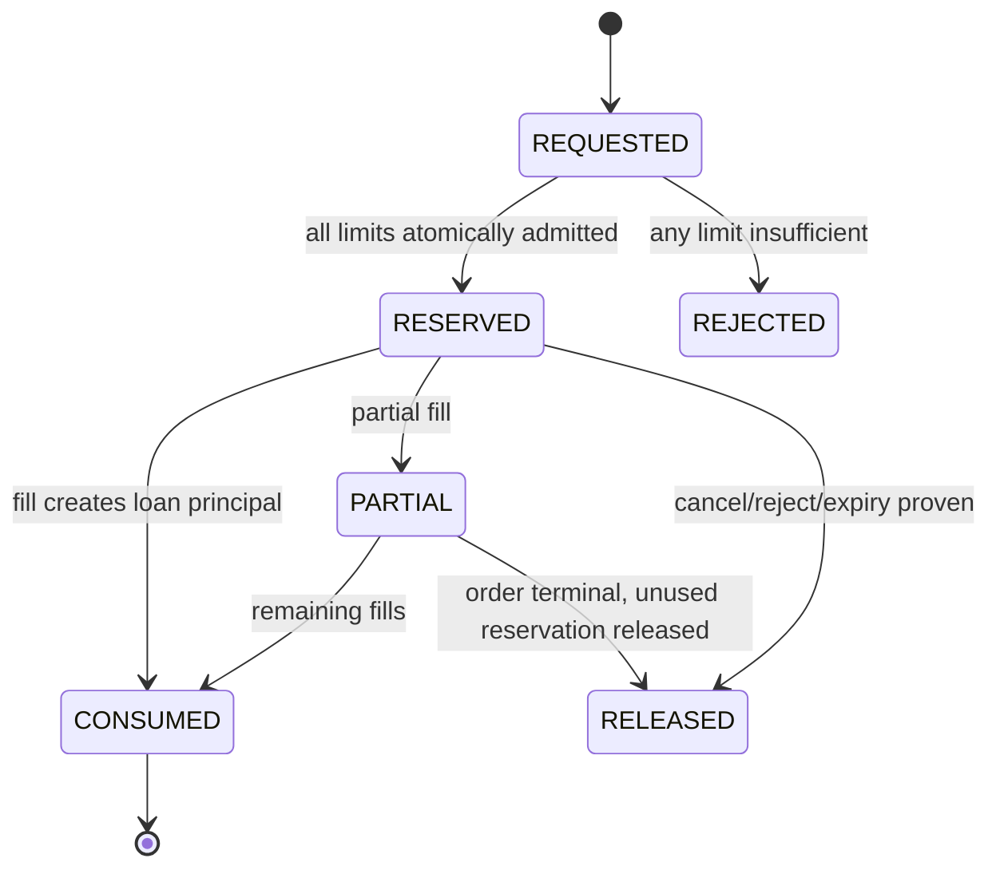
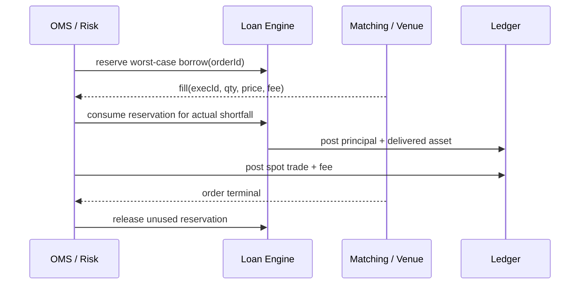
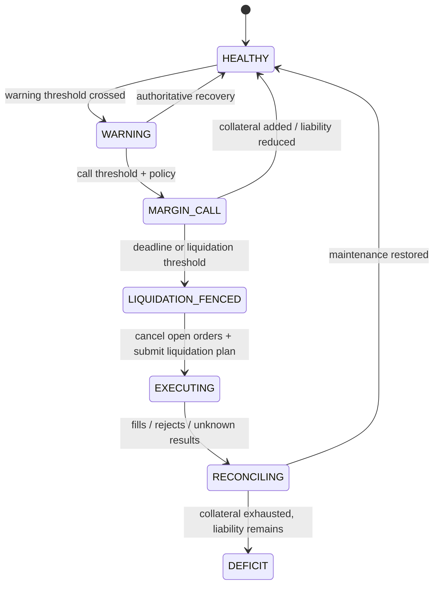

“允许余额变成负数”看起来就能实现现货保证金：用户没有 USDT 仍可以买币，没有 BTC 仍可以卖出，之后再把负余额补回来。但负数只是一个投影，它没有回答谁借给谁、何时开始计息、资产所有权怎样变化、哪部分抵押品被占用，也没有说明价格下跌或资金池枯竭时谁承担损失。

本文的论点是：**现货保证金融资是一组版本化借贷合同、成交驱动的资产转移和抵押品控制，而不是普通现货账户上的一个负余额开关。** 安全实现必须让 principal、accrued interest、抵押品、可借额度、订单预占和强平义务各自拥有权威状态，再用账本和外部资金池对账证明它们没有在并发与恢复中分叉。

这是 Trading 路径 Chapter 21。前一章 [期权估值与波动率曲面](/signal-grid-blog/posts/options-valuation-greeks-volatility-surface/) 建立风险输入；下一章 [逐仓与全仓保证金](/signal-grid-blog/posts/isolated-and-cross-margin/) 讨论不同风险域怎样共享或隔离抵押品。本文只讨论系统建模，不假定任何 venue 的借款费率、计息周期、清算阈值或资产处置权跨产品通用。

> 本文不构成交易、投资、信贷、法律、税务或会计建议。借贷关系、资产所有权、担保权益、客户资产隔离、利率披露、清算权和破产待遇受法域、合同与账户模式约束；具体实现必须由适用条款和专业意见确认。

## 负余额不是合同：先明确借款事实、资产与所有权

普通现货成交是两项资产的交换；保证金现货还增加了一项融资事实。以“借入 1 BTC 后卖出”为例，系统不能只把 `BTC balance = -1`、`USDT balance += proceeds`，而应形成至少四类状态：

```text
LoanPrincipal(asset=BTC, amount=1, lenderPool, borrowerAccount)
BorrowedAssetDelivered(asset=BTC, amount=1)
SpotTrade(base=-1 BTC, quote=+proceeds USDT)
CollateralEncumbrance(eligible assets, policy version, risk domain)
```

这些状态回答不同问题：借款 principal 是未来必须偿还的同种资产义务；成交所得是账户资产；抵押品可能仍在客户账户，却受到处置权或转移限制；平台资金池则减少了可贷资产并增加对借款人的应收。把它们都压成净权益，无法在清算、破产或对账时还原权利链。

从平台运营主体的视角，一个简化的放款 Journal 可以表达为：

```text
Dr loan_receivable:{borrower}:BTC          1
Cr user_available:{borrower}:BTC           1
```

这里的 `loan_receivable` 是平台资产，`user_available` 是平台对客户的 BTC 负债；平台总托管资产没有因为内部放款凭空增加。`poolLendable` 的减少属于资金池库存/风险投影，不能再伪装成第二组总账分录而重复确认同一笔债权。分录科目与借贷方向仍需服从实际会计政策，示意的重点是**放款与随后卖出是两个独立事实**。卖出成交再在买卖双方的 BTC、USDT 负债科目之间按资产分别平衡，并引用同一个 Fill。若卖单最终未成交，是否已经产生 principal 取决于产品是在下单前显式借款、成交时按 Fill 借款，还是允许某种授信负债；不能由负余额事后猜测。

[OKX Margin Trading User Agreement](https://www.okx.com/en-gb/help/okx-margin-trading-user-agreement)是一个 venue-specific 例子：其条款把服务表述为借入数字资产进行交易，并分别描述抵押、利息、部分或全部偿还。这个例子说明产品合同可能显式区分资产、贷款和 margin；它不意味着其他 venue 具有相同法律关系或账务顺序。

最小借贷身份应稳定跨越重试与恢复：

```text
LoanLot {
  loanId, accountId, riskDomain,
  assetKey, principalAtoms,
  lenderPoolId, contractVersion,
  openedAt, valueDate,
  rateScheduleRef, roundingRuleRef,
  outstandingPrincipal, accruedInterest,
  status, lastAccrualCursor
}
```

即使 UI 只展示聚合负债，底层仍要能说明每一段 principal 适用哪版利率和合同。否则费率调整后无法确定历史利息，也无法证明部分还款先冲利息还是 principal。

## 可借额度是多重约束的原子交集，不是一个静态上限

下单前的 `maxBorrowable` 通常同时受客户信用、产品风险、资金池库存和并发占用约束：

```text
admissibleBorrow
  = min(
      customerCreditLimit - customerCreditUsed,
      assetBorrowLimit - assetBorrowUsed,
      riskTierLimit - tierExposure,
      poolLendable - poolReserved,
      collateralSupportedBorrow - currentLiabilityValue
    )
```

公式中的每一项都要带版本和时间。某资产的名义 credit limit 很高，但资金池没有可贷币，订单仍不能以“之后再借”为由通过；资金池充足，客户 KYC/credit profile 或集中度上限不足，也不能借。

[OKX 的现货保证金说明](https://www.okx.com/en-gb/help/ii-introduction-of-margin)公开示例把最大可借量限制为用户借款限额、资产分层仓位限额与资金池限额中的较小者。这是具体 venue 的当前产品规则，不是通用公式；工程上值得借鉴的是：**显示额度来自多个责任域，任何一个域变化都可能降低可借量。**

并发订单使“查询后扣减”不安全。两个 gateway 同时看到剩余可借 100，各自放行 80，最终超借 60。正确流程要为潜在 principal 做原子预占：



预占的量还取决于最坏成交口径。市价买单需要把报价资产、手续费和滑点保护纳入；借币卖出则要按最大可成交 base 数量预占 principal。订单超时为 `UNKNOWN` 时，不能释放尚可能在 venue 生效的占用。只有订单终态和全部 fill 已经对账，未使用部分才可回收。

额度热更新也应是新版本对新决策生效；降低额度不会自动删除已有借款。已有暴露超过新上限时，系统需要定义 `GRANDFATHERED`、限制新增、要求减仓或进入 margin call 的明确策略，而不是让历史记录套用新规则重算后凭空变成非法。

## 利息是带时间边界和舍入规则的账本事实

一个看似简单的利息式子：

```text
interest = principal × rate × elapsed
```

至少隐藏了七个合同问题：rate 是年化、小时还是离散档位；按 UTC 还是业务时区切窗；借入 1 秒是否收整小时；费率在窗口开始还是结束生效；部分还款怎样分段；小数精度和最小收费是多少；舍入是逐 loan、逐账户还是汇总后执行。

生产计算应以离散 accrual window 和稳定 cursor 为权威：

```text
InterestAccrualFact {
  accrualId,
  loanId,
  windowStart,
  windowEnd,
  principalBasis,
  rateVersion,
  rateNumerator,
  rateDenominator,
  rawInterestRational,
  roundedInterestAtoms,
  roundingRuleVersion,
  priorAccrualCursor
}
```

`rawInterestRational` 或等价的精确中间量用于审计，最终按资产最小单位入账；不要使用二进制浮点数累积后再“修正到 UI 数字”。同一窗口必须由 `accrualId` 幂等提交，重启重跑不能再收一次。

venue 规则差异很大。以 [OKX Unified Account FAQ](https://www.okx.com/en-us/help/xii-ua-faq)当前公开示例为例，某些账户模式按整点计算和扣收，部分模式关闭时先还利息再还负债；[OKX 还款说明](https://www.okx.com/en-sg/help/how-to-pay-for-coins-and-interest)也区分交易模式的自动还款行为。这些只用于证明“计息时钟和还款顺序是产品合同”，不能复制为所有平台默认值。

部分还款需要确定分配顺序：

```text
repayment 40 units
  -> accrued interest 3
  -> fees 1
  -> principal 36
```

若合同另有顺序，就以该版本执行。每次还款保存 allocation 明细，不能只覆盖 `outstanding=old-40`；否则无法证明本金基数何时下降，后续利息也会漂移。

## 自动借还必须跟随成交事实，而不是订单意图

自动借款的便利性最容易掩盖状态边界。用户下一个买单并不等于已经借款；订单接受也不等于产生完整 principal；只有每个权威 fill 及其费用事实，才能确定实际缺口。

一种成交时借款模型可以表示为：



这里的关键身份是 `execId` 或 venue 定义的 fill key。重复回报不得重复产生借款；trade bust/correct 也不能简单删除旧 principal，而要根据更正链生成逆向或差额事实。

自动还款同样不能把“卖出资产”与“债务已结清”画等号。成交所得可能先进入冻结、结算或合规状态，数量可能因 fee/slippage 不足，还款指令发送后也可能结果未知。应区分：

```text
assetAcquired
repaymentRequested
repaymentApplied
principalReduced
collateralReleased
```

只有权威 `repaymentApplied` 事实提交后才减少 outstanding principal；只有 principal、interest、fee 都满足合同条件后才释放对应抵押品。如果还款服务超时，系统保留资产与 repayment request 的幂等身份，不可再次任意卖出抵押品或重复扣款。

显式借款和成交时借款也不能混用同一隐式算法。显式借款已经把资产交给账户，即使用户从未成交，也可能开始计息；成交时借款只对实际缺口建 loan lot。账户模式切换前必须结清或迁移现有合同，不能仅切换一个 feature flag。

## 抵押品折扣把市值变成可承受负债，但 LTV 不是唯一风险率

抵押品的市场价值不等于可借价值。风险引擎通常按资产质量、流动性、集中度和价格置信度应用 haircut：

```text
discountedCollateralValue
  = Σ_i quantity_i × conservativePrice_i × collateralFactor_i(tier, concentration)

liabilityValue
  = Σ_j (principal_j + accruedInterest_j + fees_j)
      × conservativeLiabilityPrice_j

LTV = liabilityValue / discountedCollateralValue
```

有些产品用 margin ratio、maintenance margin requirement 或 equity/borrowed value 的其他定义。名称不通用，分子、分母、方向和阈值必须跟规则版本一起保存。即使都叫 LTV，`80%` 可能表示不同风险程度。

风险计算还需要处理：

- 抵押品价格缺失、过期或跨 venue 分歧；
- 借入资产价格暴涨导致 liability value 增加；
- 抵押品与负债高度相关，在压力时同时恶化；
- 分层折扣：持仓越大，边际 collateral factor 越低；
- 未成交订单、待结算资产、提现 pending 是否可抵押；
- 应计未入账利息与预计强平费用。

安全默认不是沿用最后一笔陈旧价格，而是按 `priceConfidence` 和产品合同降权、冻结新增或进入保护模式。风险率更新也应可重放：保存所用持仓 commit、负债 cursor、价格版本、haircut 版本和计算结果。只有一个当前 `marginRatio` 无法解释为什么系统在某一时刻触发 margin call。

抵押品折扣不能改变账本资产数量。`10 ETH × 70%` 只是在风险投影中贡献 `7 ETH` 等价价值，并不把客户余额记成 7 ETH；把 haircut 直接写回账本会混淆资产所有权与风险认定。

## Margin Call 与强平是受控处置协议，不是阈值触发的市价单

风险率穿过阈值只产生处置输入。真正的状态机还要处理价格更新、通知、订单撤销、借款偿还、成交滑点与结果未知：



`LIQUIDATION_FENCED` 首先阻止账户继续扩大风险，并给强平执行者一个递增 epoch。旧执行者恢复后若 epoch 落后，不得继续卖出抵押品。否则两个实例都认为自己负责清算，可能超卖客户资产。

强平计划应以**恢复安全所需的最小处置**为目标，而不是机械清空所有资产；但具体规则由产品合同决定。执行时必须把订单身份、最大数量、价格保护、有效期和目的（偿还哪种 liability）写入 durable plan。提交超时后订单为 `UNKNOWN`，在私有回报或查询裁决前不能重新发一张不相关市价单。

Margin call 通知与强平权也不能互相替代。有的合同可能允许无通知立即处置，有的法域或产品要求特定通知和宽限；系统必须记录适用规则、触发证据、通知尝试与截止时间。通知成功不证明客户已收到或补资，通知失败也不能自动改变合同赋予的平台权利。

强平成交后还需按顺序分配 proceeds：费用、利息、principal、剩余抵押品如何处理必须按合同入账。订单完成但还款失败时，账户仍处于 `RECONCILING`，不能因市场仓位已卖出就宣称清算完成。

## 资金池枯竭与坏账属于平台风险，不能藏在客户负余额里

现货保证金除了客户信用风险，还有 lender pool 流动性风险。资金池资产可能被借出、冻结提现、跨链在途或因市场拥堵无法补充；账面资产大于借款需求，仍可能没有立即可放款的同种币。

```text
poolLendable
  = canonicalAvailable
  - withdrawalReserve
  - operationalReserve
  - alreadyReservedForOrders
  - restrictedOrPendingAssets
```

当 `poolLendable` 下降时，安全降级是拒绝新借、降低订单额度或只允许减负债交易，而不是创造没有资产交付的 loan principal。已有借款是否可被提前召回取决于合同，不能由流动性告警擅自决定。

强平后仍有负债即形成 deficit：

```text
deficit = outstandingPrincipalValue
        + accruedInterestValue
        + liquidationCosts
        - recoverableCollateralValue
```

谁吸收 deficit 可能是保险基金、平台资本、保证人、lender pool 或某种法定破产程序。任何 socialized loss、ADL 或 haircut 都必须有明确产品与法律依据；技术系统不能把差额随手分摊给其他客户以恢复总账平衡。

坏账状态至少要保留原资产单位的 principal，不应只在某个时点转换成 USD 后丢失原债务。后续追偿、价格变化和资产追回都需要原合同、清算版本与每次回收分录。写一个 `badDebt=true` 既不能停止利息，也不能说明权利是否已核销。

## 账本、贷款台账与资金池必须在同一恢复位点重新闭合

恢复后的正确性不能由三个服务各自“启动成功”证明。系统必须在一个一致 cut 上验证：loan lots 的 outstanding、客户负债科目、资金池 receivable、抵押品锁定和订单预占彼此相等。

核心不变量可以写成：

```text
Σ loan.outstandingPrincipal(asset)
  = borrowerLedger.loanPrincipalPayable(asset)
  = poolLedger.loanReceivable(asset)

Σ activeBorrowReservation(asset)
  <= poolLedger.reservedForBorrow(asset)

releasedCollateral(account, loanId)
  only if outstandingPrincipal + accruedInterest + dueFees
          satisfies contract release condition
```

故障恢复要围绕这些不变量建立证据：

| 故障窗口                   | 危险结果                    | 恢复依据                              | 通过条件                                     |
| -------------------------- | --------------------------- | ------------------------------------- | -------------------------------------------- |
| 额度预占后、订单发送前崩溃 | 永久占用或重启后超借        | order command journal + reservationId | 未发送则释放；可能发送则保留到订单裁决       |
| fill 落盘、loan 分录前崩溃 | 资产已买卖但 principal 缺失 | fill key + atomic/inbox cursor        | 同一 fill 恰好产生一次借款与成交分录         |
| 计息批次提交后响应丢失     | 重复收息                    | accrualId + ledger commit             | 相同窗口只有一条有效 accrual                 |
| 自动还款超时               | 重复扣资产或过早释放抵押品  | repaymentId + allocation result       | principal 只按权威 applied 金额减少          |
| 强平执行者切换             | 双执行者超卖                | liquidation epoch + venue orders      | 旧 epoch 被 fencing，全部 unknown 订单先对账 |
| 资金池报表与链上资产不符   | 无资产却继续借              | custody reconciliation cut            | 新借冻结，差异按稳定身份解释后恢复           |

对账差异不得用无来源 adjustment 抹平。每次调整必须引用 loan、fill、accrual、repayment 或 custody 证据，写成新分录并保留审批。只有投影可以重建，历史事实不原地覆盖。

这一章建立了现货保证金融资的保证边界：信用额度允许的是一项有条件的借款决策，不是资产已经可用；成交可以形成或减少资产缺口，不会自动裁决借贷合同；风险率触发的是受 fencing 和对账约束的处置流程，不是任意市价交易。只有 principal、利息、抵押品、订单占用、强平回报与资金池资产在同一恢复位点闭合，平台才有资格说明一笔负债为什么存在、何时开始计息，以及是否真的已经偿还。

下一章 [逐仓与全仓保证金](/signal-grid-blog/posts/isolated-and-cross-margin/) 将继续回答：这些资产与负债被放入不同风险域后，损失能否跨仓位、资产和策略传播。
