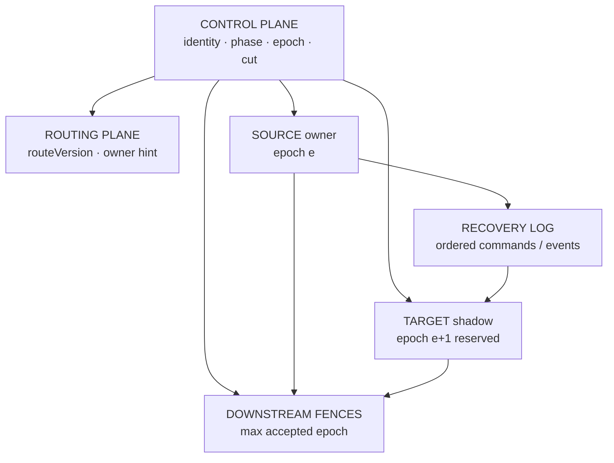
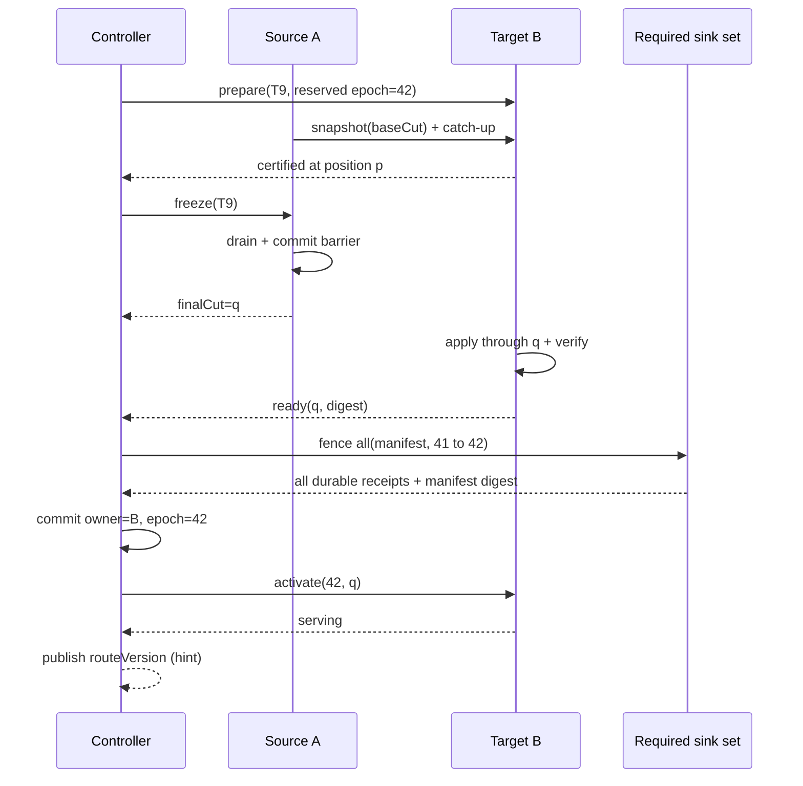

“把 shard 的数据复制到新机器，再把路由指过去”听起来像一次普通的数据搬运。真正执行时，它却会立即撞上几个不能靠复制解决的问题：旧节点可能因为长暂停而晚到，新节点可能只追到了一个看似接近的位置，网关仍缓存着旧路由，已经接收的请求还在途中，下游数据库也未必知道所有权已经改变。

如果新旧节点在这些窗口里都能产生权威副作用，迁移得到的就不是更多容量，而是两个合法写者和两条互相分叉的历史。

本文的中心论点是：**状态迁移不是把字节从 A 复制到 B，而是用单调代际把某个状态单元的唯一写权，从一个所有者安全转交给另一个所有者。** Snapshot 与 Catch-up 负责重建状态；Handoff 负责定义不可歧义的切点；Epoch 与 Fencing 负责让旧所有者即使还活着，也无法继续改变真实世界。

本文是“有状态系统可靠性”学习路径的 Chapter 12，讨论一种通用的、偏一致性的单写者模型：一个 shard 在任一 ownership epoch 中只有一个权威 owner，owner 可以是一台进程，也可以是内部已经复制的一个 replica group。它不讲怎样选择 shard key，不展开 Flink rescaling、Kubernetes 调度或某一种交易分片实现；这些系统可以使用本文的不变量，但不能反过来替代所有权协议。

阅读上建议先掌握[分布式时间中的 Lease 与 Fencing](/signal-grid-blog/posts/distributed-systems-time-clocks-ordering-and-leases/)、[消息序列号与恢复位点](/signal-grid-blog/posts/distributed-message-sequencing/)，再结合紧邻前文[过载也是故障](/signal-grid-blog/posts/overload-backpressure-admission-control-retry-budget-load-shedding/)理解迁移流量为什么必须受容量约束。本文之后的[分布式快照与一致检查点](/signal-grid-blog/posts/distributed-snapshots-consistent-checkpoints-barriers-recovery-cursors/)会进一步解释一致切面与恢复游标。

## 1. 迁移的正确性合同不是“目标已有一份数据”

先把迁移对象写成一个状态机，而不是一批文件。设 shard `s` 的命令日志为：

```text
L_s = c0, c1, c2, ...

State(s, p) = Fold(initialState, L_s[0, p))
```

`p` 使用 **next position** 语义：状态已经包含所有位置 `< p` 的命令，下一条待执行命令位于 `p`。这种半开区间表示法能避免“offset 指最后一条已处理，还是下一条待处理”的歧义。

一次安全迁移至少要维持五条不变量。

### 唯一写权

对同一个 shard，在任意时刻都只有一个 `(owner, epoch)` 能让副作用通过最终权威资源的检查；不能只排除“同 epoch 两个 owner”，却允许旧、新 epoch 在不同资源上重叠生效：

```text
Accept(effect, s, owner, epoch, t)
  => (owner, epoch) = Authority(s, t)
```

这里的 `Authority` 不能只表示“进程自认为 Leader”。它必须约束数据库、日志、对象存储提交器或外部副作用网关最终会接受谁的写入。协议还要分别证明：新代际激活前只有旧 owner 可以产生新意图；任一 required sink 安装 `e+1` 后永久拒绝 `< e+1`；所有 required sinks 完成 Fence 前，新 owner 不产生对应副作用；测试会主动生成 `A/e` 与 `B/e+1` 交叠的迟到请求。

### 状态前缀等价

目标节点在代际 `e + 1` 开放写入之前，它的权威状态必须等价于源节点在激活切点 `finalCut` 的状态：

```text
TargetState(finalCut)
  = Fold(Snapshot(baseCut), Log[baseCut, finalCut))
```

“目标 lag 只有 12 ms”不是等价证明。必须同时比较精确位置、代码与配置版本，以及能发现状态分歧的摘要或业务不变量。

### 已确认结果不丢失

源 owner 在冻结屏障之前已经确认的每个命令，都必须进入 `finalCut` 之前的权威历史，并能在目标状态或对应的持久结果中找到。超时请求可以处于结果未知，但不能被直接当成失败后重新创造另一份业务意图。

### 旧代际不再产生新副作用

一旦任意权威下游接受了 epoch `e + 1`，它必须永久拒绝 epoch `< e + 1` 的后续写入。墙钟时间、进程启动时间和“路由应该已经刷新”都不能替代这个比较。

### 恢复材料不能提前回收

源快照、增量日志、请求去重记录和旧路由信息必须保留到迁移已经形成新的恢复闭包。目标能服务流量，不等于旧材料已经可以删除；删除是另一项需要恢复前沿证明的操作。

这五条合同把“迁移成功”从一个进度百分比改写成可证伪的状态。复制速度、停写时长和资源成本都很重要，但它们必须在 safety 之后讨论。

## 2. Shard、Owner、Epoch 与 Cut 必须共同成为权威状态

只在服务发现里保存 `shard-7 -> node-b` 不够。这个映射没有说明它是哪一次分配、目标恢复到了哪里，也没有阻止之前的 `node-a` 继续工作。

一个最小的所有权记录至少包含下面这些字段：

```java
import java.util.Objects;
import java.util.Set;

enum TransferPhase {
    IDLE,
    PREPARING,
    COPYING,
    CATCHING_UP,
    FROZEN,
    FENCING,
    ACTIVATING,
    FINALIZED,
    ABORTED
}

enum OwnerStatus { SERVING, FROZEN, RETIRED }
enum TargetStatus { NONE, SHADOW, READY, SERVING }

record Cut(long nextSequence) {
    Cut {
        if (nextSequence < 0) throw new IllegalArgumentException("negative cut");
    }
}

record OwnershipRecord(
        String shardId,
        String transferId,
        TransferPhase transferPhase,
        OwnerStatus sourceStatus,
        TargetStatus targetStatus,
        String ownerId,
        String sourceId,
        String targetId,
        long ownershipEpoch,
        long routeVersion,
        Cut baseCut,
        Cut finalCut,
        String stateDigest,
        String codeVersion,
        String configVersion,
        String requiredSinkManifestDigest,
        Set<String> installedFences) {

    OwnershipRecord {
        Objects.requireNonNull(shardId);
        Objects.requireNonNull(transferPhase);
        Objects.requireNonNull(sourceStatus);
        Objects.requireNonNull(targetStatus);
        Objects.requireNonNull(ownerId);
        installedFences = Set.copyOf(installedFences);
    }
}
```

这只是协议模型，不是要求每个系统照抄字段名。字段的职责必须保持分离。尤其 `TransferPhase=COPYING/CATCHING_UP` 与 `sourceStatus=SERVING` 可以同时成立：前者描述迁移工作，后者描述谁仍在接流；Target 此时是 `SHADOW`，不能因为“正在迁移”就获得写权。

### Identity 回答“正在迁移哪份状态”

`shardId` 是迁移过程中的稳定身份，不应由机器名或当前路由地址推导。它还需要绑定 key range、hash range 或逻辑实体集合的定义版本。

若迁移同时发生 split 或 merge，就不再是“同一个 shard 换 owner”：旧 shard 与新 shard 应有不同身份，并记录 lineage，例如：

```text
S7@rangeVersion=4
  -> split into S19, S20 @rangeVersion=5
```

否则一份属于旧边界的快照可能被错误安装到新边界上。本文后续以“不改变逻辑边界，只改变 owner”为主；重分片必须额外证明边界映射与跨边界操作的正确性。

### Owner 回答“谁可以作出权威决定”

`ownerId` 应指向稳定的执行身份，而不是一个会复用的 IP。若 owner 本身是 Raft group，`ownerId` 指的是 group，group 内谁当 Leader 由它自己的复制协议解决；不要把组内选主和 shard 跨组迁移揉成同一个 epoch。

### Epoch 回答“这是第几代写权”

`ownershipEpoch` 必须单调增加，允许跳号但绝不能回退或复用。它由一个可线性化的控制面通过共识日志或 compare-and-set 分配：

```text
CAS(
  expected = {shard=S7, epoch=41, phase=FENCING, transfer=T9},
  update   = {shard=S7, epoch=42, owner=B, phase=ACTIVATING}
)
```

重复的控制器命令必须携带同一个 `transferId`。如果提交响应丢失，控制器先查询权威记录，而不是盲目再分配一次 epoch。

### Cut 回答“目标状态精确包含到哪里”

`baseCut` 绑定 snapshot；`finalCut` 绑定最终激活状态。二者都必须位于同一个日志与序列域，不能拿 Kafka offset、数据库 LSN、Aeron Position 和业务 sequence 直接互相比较。跨组件系统需要一个 manifest 明确记录各自位置及其因果关系。



路由记录可以通过缓存异步传播，因为过期路由只应导致额外跳转或拒绝；它不能授予写权。真正的 authority 是所有权记录、精确恢复切点和最终资源的 fencing 共同形成的闭包。

## 3. 正常 Handoff 把大复制放在后台，把唯一切点放进提交记录

直接停止源节点、复制全部状态、再启动目标节点，协议最容易理解，却会让停写时间与数据量成正比。更实用的方案是先在后台复制绝大多数状态，只把最后一小段增量和写权切换留在短暂停写窗口。

[Viewstamped Replication Revisited](https://pmg.csail.mit.edu/papers/vr-revisited.pdf) 在重配置讨论中给出同样的工程方向：新节点可以在正式重配置前先做 state transfer，接近最新状态后再进入会暂停客户端请求的切换阶段。[Spanner 论文](https://research.google/pubs/spanner-googles-globally-distributed-database-2/)描述的 `Movedir` 也把大部分数据放在后台移动，只在尾部用事务原子迁移剩余数据并更新两个 Paxos group 的元数据。

### Phase A：Prepare 只创建候选者，不授予写权

控制面以当前 `{shardId, ownerId, epoch}` 为前置条件创建 `transferId`，登记 source、target 和预留的新 epoch。Target 此时只能接收恢复流量：

- 不接受权威写请求；
- 不产生不可逆外部副作用；
- 不向服务发现宣称自己是 owner；
- 失败后可以按同一个 `transferId` 恢复或重新初始化。

这与 etcd 将新成员先加入为 learner、追上 Leader 日志后才允许 promote 的理由相似：[etcd 3.6 运行时重配置文档](https://etcd.io/docs/v3.6/op-guide/runtime-configuration/)明确拒绝尚未追平日志的 learner promotion。Learner 改变的是复制组成员，本文改变的是业务状态 owner；二者不是同一个协议，但都体现了“数据就绪先于权力提升”。

### Phase B：Snapshot 必须原子绑定 baseCut

源 owner 创建一致 snapshot，并把 `baseCut`、schema、代码、配置和摘要写入不可变 manifest。Snapshot 必须恰好表示 `State(s, baseCut)`：

```text
snapshot manifest = {
  shardId,
  transferId,
  baseCut,
  schemaVersion,
  codeVersion,
  configVersion,
  objectHashes,
  stateDigest
}
```

复制普通文件时“前后只差几毫秒”不够。若状态仍在修改，必须使用 copy-on-write、存储引擎 snapshot、日志一致检查点或等价机制，把内容与 cut 原子绑定。

目标先验证 manifest 与每个对象的完整性，再恢复 snapshot。若日志保留窗口已经越过 `baseCut`，这次迁移只能重新做 snapshot，不能猜测缺失的增量。

### Phase C：Catch-up 只重建状态，不重复真实副作用

目标从 `baseCut` 开始消费增量日志，持续推进自己的 `nextSequence`。如果日志记录的是业务命令，shadow 执行器必须抑制外部调用；更稳妥的模型是让日志包含已经裁决的状态事件与持久结果，让目标只重建确定状态。

在若干共同 cut 上，源与目标比较：

```text
same nextSequence
+ same code/config/schema version
+ same canonical state digest
+ same business invariants
= certified catch-up point
```

摘要不一致时隔离目标并保存证据，不能因为 lag 已归零就继续切换。

### Phase D：Freeze 用日志屏障定义 finalCut

当目标 lag 已低于停写预算，源 owner 进入 `FROZEN`。关闭 admission 与追加 drain barrier 必须共享同一个线性化点：可以由同一 event loop、锁、CAS 状态机或日志序列器完成，不能让请求在检查时获准、却在 barrier 之后才取得日志位置。

1. 在权威命令序列器内提交 `Freeze(transferId)`；这条记录同时关闭新命令 admission，并作为 drain barrier；
2. 以该记录之后的 `nextSequence` 作为 `finalCut`，请求是否被接受由其权威 append position 是否 `< finalCut` 决定；
3. 等待所有 `< finalCut` 的命令进入明确终态或持久的结果未知记录；
4. barrier durable 后才返回 Freeze ACK，并把 source barrier receipt、cut 与 topology/config digest 写入迁移记录；
5. 保持强写与强读 admission 关闭，等待目标追到同一个 `finalCut`。

“收到请求”与“接受请求”必须分开。Freeze 线性化点之后才取得 append 位置的请求返回可重试拒绝；此前已经 durable-accepted 的请求必须出现在 barrier 之前，不能静默丢弃。仅用 `closeAdmission(); wait(inFlight); appendBarrier()` 三个互不串行化的动作，无法证明这条边界。

### Phase E：Fence、Commit、Activate 的顺序不能互换

`finalCut` 提交前，控制面必须从已提交的输出拓扑、代码和配置生成不可变 required-sink manifest，并保存 version/digest。每份 Fence receipt 都绑定 `(shardId, transferId, nextEpoch, sinkIdentity, sinkGeneration, manifestDigest)`；迁移期间输出拓扑变化必须让当前 certification 失效，或由独立协议完成变更，不能悄悄漏掉一个 Sink。

目标到达 `finalCut`、验证 manifest 且生成 target-ready certificate 后，控制面进入不可逆的 `FENCING` 阶段：先让 manifest 中所有 required sinks 永久拒绝旧 epoch，再提交新 owner，最后才开放目标流量。



任何一个强制下游已经安装新 fence 后，都不能再“撤销迁移并让 A 继续用 epoch 41”。此后即使目标激活失败，也只能向前完成，或以更高 epoch 再迁回 A。把 metadata 改回旧值会复活已经被拒绝的旧请求，并破坏代际单调性。

[Vitess 25.0 Reshard 文档](https://vitess.io/docs/25.0/reference/vreplication/reshard/)给出了一个具体实现参照：先复制并检查数据，切写时暂时令 source primary 只读，等待 target catch up 到停写点，再 `SwitchTraffic`；切换后还能建立反向复制以支持 `ReverseTraffic`。这些动作说明复制、追赶、切流和清理是不同阶段。本文的通用协议进一步要求每个阶段都绑定 ownership epoch 与下游 fencing，不能把产品命令本身当成完整证明。

## 4. 路由与 In-flight 请求必须服从同一个所有权代际

控制面已经提交 `owner=B, epoch=42` 后，仍会有网关缓存 `A`，连接池里仍有旧连接，客户端也可能在超时后重试。要求“所有路由同时刷新”既昂贵，也无法被异步网络证明。

安全做法是把路由当作 **hint**，把 epoch 检查当作 **authority**。

### 每个写请求都携带稳定意图与观察到的代际

请求至少包含：

```text
{
  shardId,
  requestId,       // 稳定业务意图的幂等键
  routeVersion,    // 网关观察到的路由版本
  ownershipEpoch,  // 网关认为的 owner 代际
  command
}
```

节点只在 `ownershipEpoch == localActiveEpoch`、`ownerId == localNodeId`，并且它对应的角色状态允许服务时接受写入：Source 要求 `sourceStatus=SERVING`，Target 要求 `targetStatus=SERVING`。迁移可以同时处于 `COPYING/CATCHING_UP`，此时 Source 仍可服务而 Target 保持 `SHADOW`。收到旧 epoch 时返回结构化的 `STALE_OWNER`，附带它已知的新 route version；收到未来 epoch 时返回 `NOT_READY` 并触发控制面重新同步，而不是猜测自己应该接管。

客户端或网关重试时必须复用同一个 `requestId`。关于“响应丢失后究竟发生了什么”，应使用[结果未知、幂等与 Outbox/Inbox](/signal-grid-blog/posts/cross-system-side-effects-idempotency-outbox-inbox-2pc-saga/)中的结果查询与去重协议，而不是生成一个新请求 ID。

### Freeze 必须界定三类 In-flight

在 `finalCut` 周围，请求只能进入三类可解释状态：

| 请求状态            | 迁移时的处理                            | 恢复证据                               |
| ------------------- | --------------------------------------- | -------------------------------------- |
| 已 durable-accepted | 必须位于 drain barrier 前并进入目标状态 | 命令位置、持久结果、`requestId`        |
| 已到达但未接受      | 明确拒绝，允许以同一意图重试到新 owner  | admission 结果与客户端 history         |
| 已执行但响应未知    | 查询原结果；必要时幂等重放              | result record、outbox/inbox 或下游回执 |

如果实现只有一个内存计数器 `inFlight == 0`，进程崩溃后就无法证明第一类请求去了哪里。Drain 状态、barrier 与最终 cut 必须进入持久历史。

### 旧 Owner 可以 Redirect，但不能继续代写

新 ownership record 生效后，A 收到旧路由请求可以：

- 返回 `STALE_OWNER` 和新路由提示；
- 在读取到权威新 owner 后，用独立、认证的 forwarding envelope 代理请求：保留原 `requestId` 与 command digest，同时附加代理观察到的当前 owner/epoch；
- 对明确允许陈旧读取的 API 返回 `asOf=finalCut` 的只读结果。

它不能继续以 epoch 41 接受写入，也不能在本地接收后异步转发并提前 ACK。把原始 epoch=41 的 envelope 原样交给 B 会被正确拒绝；代理只能增加可验证的转发身份，不能篡改客户端的观察证据。代理若超时，仍要把结果未知暴露给调用者；代理身份不能改变原始 `requestId`。

强一致读取同样需要权威证明，不能只比较节点本地 epoch。Freeze 持久化后，Source 在迁移未决期间必须关闭强读 admission；若在首个 Fence 前持久 abort，可用新的 read-lease generation 重新授予 Source，不能复用旧租约。Ownership commit/retire 后，Source 对旧代际的强读才永久关闭。否则网络分区中的旧 A 与旧网关可能都仍相信 epoch=41，并在 B/42 激活后返回“当前”旧状态。故障接管还需要可撤销的读 Lease、线性化 ownership read/read barrier，或等待旧 Lease 的有界失效后再激活新 Owner。无法建立这些条件时，Retired Source 即使保存完整旧状态，也只能提供明确带 `asOf=finalCut` 的陈旧读。

路由因此可以最终收敛，而写权仍保持立即受控：过期缓存损害的是可用性和额外跳数，不应损害安全性。

## 5. Fencing 必须抵达真正产生副作用的下游

最危险的旧 owner 往往不是一直运行的进程，而是一条延迟很久才抵达数据库的旧请求。进程 A 可以在 epoch 41 时发送写入，然后暂停；B 获得 epoch 42 并完成新写；最后 A 的网络包才到达。如果数据库不认识 epoch，它仍可能接受旧写。

[Chubby 论文](https://www.usenix.org/legacy/event/osdi06/tech/full_papers/burrows/burrows_html/index.html)专门描述了这个问题：锁持有者取得包含 lock generation 的 sequencer，把它随请求传给最终服务；接收方验证 sequencer，不再有效的请求必须被拒绝。只在协调服务里选出新主，而不让被保护资源检查代际，锁仍然只是 advisory lock。

### 数据库 Fence 必须和业务写原子检查

若副作用落在关系数据库，可以为每个 shard 保存 guard：

```sql
BEGIN;

UPDATE shard_fence
   SET epoch = :next_epoch,
       owner_id = :target_owner,
       transfer_id = :transfer_id
 WHERE shard_id = :shard_id
   AND epoch = :current_epoch
   AND owner_id = :source_owner
RETURNING epoch, owner_id, transfer_id;

-- 若 UPDATE 返回零行，则在同一事务读取 guard：
SELECT epoch, owner_id, transfer_id
  FROM shard_fence
 WHERE shard_id = :shard_id
 FOR UPDATE;

-- 若已经是 (:next_epoch, :target_owner, :transfer_id)，
-- 说明上一次提交成功但响应丢失，按同一操作成功重建 receipt；
-- 其余值才是冲突并 fail closed。
COMMIT;
```

所有 Owner 的每次业务写，也必须在**同一个数据库事务**里验证 guard、取得幂等 claim、修改业务状态并保存结果：

```sql
BEGIN;

SELECT epoch, owner_id
  FROM shard_fence
 WHERE shard_id = :shard_id
 FOR UPDATE;

-- 应用层断言 epoch=:request_epoch 且 owner_id=:request_owner。

INSERT INTO effect_result(
    shard_id, request_id, intent_hash, epoch, status)
VALUES (
    :shard_id, :request_id, :intent_hash, :request_epoch, 'CLAIMED')
ON CONFLICT (shard_id, request_id) DO NOTHING
RETURNING request_id;

-- 只有 INSERT RETURNING 得到本次 claim，才执行业务状态写入，
-- 随后把同一行更新为 DONE 并保存 result_payload。
-- 若发生冲突，则读取既有行并校验 intent_hash；相同意图直接
-- 返回已保存结果，绝不再次执行业务写；不同意图复用 key 则拒绝。
COMMIT;
```

事务中任一步失败都会回滚 claim 与业务变化，因而不会留下“占了 key 却没有结果”的永久半状态。先在缓存里检查 epoch、随后无条件写数据库存在 TOCTOU 窗口；只用 `ON CONFLICT DO NOTHING` 跳过去重行，却仍执行后续业务 SQL，也会重复副作用。Fence、dedup claim、intent hash、实际副作用与结果必须由同一个权威事务、日志条件写或等价的 compare-and-set 保护。

### 多个下游会把切换变成一组显式证据

一个 shard 可能同时写数据库、Kafka topic、对象存储和第三方 API。它们的能力并不相同：

| 下游能力                   | 能得到的安全边界                                                    | Handoff 要求                                                                                                     |
| -------------------------- | ------------------------------------------------------------------- | ---------------------------------------------------------------------------------------------------------------- |
| 原子校验 epoch 并写入      | 可直接拒绝旧代际                                                    | 激活前保存 durable fence receipt                                                                                 |
| 事务日志 / fenced producer | 代际只在该日志身份域内有效                                          | 稳定 `transactional.id` 的新实例先 `initTransactions()` 取得新 producer epoch；不覆盖其他 ID、非事务写或外部系统 |
| 仅支持幂等键               | 只能去重同一意图，不能拒绝旧 Owner 的另一个迟到意图或维持跨意图顺序 | 顺序敏感副作用经可 fencing 的单一 relay，或在 residual unknown 全部裁决前阻止 Target 产生竞争副作用              |
| 既不 fencing 也不幂等      | 无法给出通用 exactly-once                                           | 串行人工裁决，或修改集成边界                                                                                     |

多个 fence 无法原子安装时，系统可能经历“数据库已拒绝旧 epoch，外部 API 尚未完成切换”的中间状态。安全策略不是假装它们同时完成，而是：Source 已冻结、Target 尚不产生该类副作用、控制面按 required-sink manifest 持久记录每个 receipt，恢复控制器反复向前完成。此阶段牺牲可用性，保留唯一权威。

这也形成一个不可逆边界：抽象协议在安装第一个外部 Fence 前通常可以安全 abort；安装之后只能 forward-recover。实现还必须覆盖“Sink 已提交、响应丢失”：本文的 reducer 先持久 `beginFencing` intent，再允许发出任何 Fence 请求，并从这一刻起保守地禁止 abort。这样即使 receipt 尚未写回控制面，也不会错误复活旧 Owner。对只能幂等、不能 fencing 的外部副作用，如果没有单一 fenced relay 或“未知集合清零后再激活”的门禁，只能承诺可检测、可对账；它不属于本文的 single-authority/effect-order 保证。既不 fencing 也不幂等的接口更不能获得无条件 exactly-once。

## 6. 计划迁移与故障接管共享不变量，却不是同一条流程

计划迁移有一个合作的 source：它可以创建新 snapshot、持续提供增量、主动 drain，并明确写出 `finalCut`。故障接管恰恰失去了这些条件。

把两者都命名为“failover”会掩盖完全不同的恢复依据。

### 计划迁移从当前状态主动建立切点

计划迁移的来源通常是扩容、缩容、硬件维护、负载再平衡或放置策略变化。它可以使用：

```text
live source
  -> consistent snapshot
  -> continuous catch-up
  -> cooperative freeze
  -> explicit finalCut
  -> downstream fence
  -> ownership commit
```

它的 RTO 主要是受控停写窗口，目标是通过预热把窗口压缩到最后 backlog 的追赶与 fencing 时间。所谓“零停机”必须说明写请求是被缓冲、拒绝、代理，还是由一个更强的原子移动协议继续处理；不能因为客户端没有立即报错就宣称没有停顿。

### 故障接管只能从最后一个已认证前缀出发

若 source 在迁移期间崩溃，控制器不能把“target 昨晚已经复制了 99.9%”当成接管资格。它必须重新回答：

- 哪个日志前缀已经提交并满足 ACK 合同；
- 哪个 snapshot manifest 完整且未损坏；
- target 精确应用到了哪个 next position；
- 是否存在只在 source 内存、却已经向客户端 ACK 的请求；
- 旧 source 如何被新 epoch 在所有下游 fence。

故障接管选择的是 `recoveryCut`，它来自持久提交前缀与认证快照，不来自 source 最后一次心跳时间。若 ACK 合同允许一部分确认只存在于故障机本地，RPO 就可能大于零；新的 owner 不能凭空恢复不存在的事实。

### 同一份所有权状态机要显式区分入口

计划迁移与故障接管可以共享 `shardId`、epoch、fence 和激活不变量，但 command 不应混用：

```text
BeginPlannedTransfer(expectedEpoch, source, target)
BeginFailureTakeover(expectedEpoch, recoveryEvidence, target)
```

前者在安装任何 Fence 前，可以持久 abort 回原 Owner，或基于已提交证据转入 failure takeover；后者通常要求先隔离或 fence 旧 Owner，并可能直接进入恢复模式。若 Source 在首个 Fence 之后失联，已经越过不可逆边界，不能中止或回滚：控制器必须沿同一 reserved epoch 补齐剩余 Fence 与 ownership commit。若 Target 也无法恢复，只能先安全收敛当前中间状态，再分配更高 epoch。任何分支都不能跳过证据检查继续点“完成”。

Raft 的 Leader 变化、复制组 membership reconfiguration 与这里的 shard ownership 迁移也要分层。Raft 保证某个 replica group 内的提交前缀和领导权；它不会自动替应用决定哪个 group 拥有 `shard-7`，更不会替所有外部数据库安装 fencing token。关于组内协议边界见 [Raft 论文精读](/signal-grid-blog/posts/raft-consensus-leader-election-log-replication-and-safety/)。

## 7. Rebalancing 先消耗容量，再创造容量

再平衡常被当作扩容动作，但在完成之前，它会同时向 source、网络、target、日志和控制面增加工作。迁移启动过多，可能让原本只是“不均衡”的集群进入全面过载。

### Catch-up 能否结束由速率差决定

设 source 对该 shard 的状态变更速率为 `λ`，target 的实际重放速率为 `μ`，backlog 为 `B`。复制完成后的追赶阶段近似满足：

```text
dB/dt = λ - μ
```

只有 `μ > λ`，backlog 才会持续下降。若 `μ <= λ`，等待更久不会让 target 追平；必须降低写入速率、增加 target 资源、改变复制路径，或接受更长的冻结窗口。

当 source freeze 后，新业务写入速率降为零，理论追赶下限近似为：

```text
freezeCatchUpTime >= B_freeze / μ
```

真正的停写时间还包括 drain、最后校验、每个下游 fence、所有权提交和 target readiness。切换门槛应由允许的最大停写预算倒推出 `B_freeze`，而不是使用一个没有容量含义的“lag 小于 1 秒”。Vitess 在 `SwitchTraffic` 前检查 VReplication lag，Kafka 官方也为 partition reassignment 提供 replication throttle；这些都是避免后台迁移吞掉前台容量的具体例子。

### 迁移预算必须覆盖五种放大

一次迁移至少产生：

- source snapshot 读取与缓存污染；
- source 到 target 的网络带宽；
- target 写入、校验与 replay CPU；
- 为保证 catch-up 而延长的日志和去重记录保留；
- 路由变化带来的连接重建、redirect 与 retry。

容量控制不能只有一个全局“同时迁移 10 个 shard”。更合理的 admission key 包括 source host、target host、磁盘、rack/zone、网络路径和租户优先级。一次 source 故障后，大量 shard 同时恢复尤其危险：幸存节点已经承担额外前台负载，此时应先恢复最小可服务集合，再逐步重平衡，而不是立即追求完美分布。

### 迁移控制器本身也需要背压

控制器至少应观察：

```text
copy throughput
catch-up backlog / oldest backlog age
source and target saturation
retained-log headroom
predicted freeze duration
fence latency per sink
route stale-request rate
```

当 backlog 不再收敛、日志保留空间不足或 source 前台尾延迟越界时，正确动作是暂停新迁移、节流已有 copy，必要时在不可逆边界前 abort。进入 `FENCING` 后则不能随意 abort；控制器必须保留完成该迁移所需的恢复容量，并优先向前完成。

迁移期间客户端 retry 也要受预算约束。旧路由请求被拒绝后若所有网关立即刷新并无限重试，会把一次局部切换放大成控制面和 target 的同步流量尖峰。Deadline、指数退避和 retry budget 必须延续前文过载协议，而不是在迁移代码里另造一套无界重试。

## 8. Failure Matrix 与可执行模型决定协议能否恢复

一条 migration happy path 只能证明演示跑通。协议是否完整，要看每个持久化边界前后崩溃时，恢复控制器能否仅凭权威记录作出唯一动作。

### 不可逆边界之前：Source 仍是唯一 Owner

| 故障点                         | 权威事实                                 | 恢复动作                                            | 禁止动作                       |
| ------------------------------ | ---------------------------------------- | --------------------------------------------------- | ------------------------------ |
| Target 在 copy 中崩溃          | Source 仍为 `SERVING(e)`                 | 按 manifest 恢复 copy，或用同一 transfer 重新初始化 | 提升不完整 target              |
| 增量日志出现 gap               | Target 状态不可认证                      | 在保留窗口内补齐；否则重新 snapshot                 | 跳过缺口继续追赶               |
| 共同 cut 的 digest 不同        | 两份状态至少一份不可信                   | 隔离 target，保留输入与摘要证据                     | 只看位置相同就切换             |
| Controller 写 phase 后响应丢失 | 权威记录可能已经提交                     | 查询 `{transferId, phase, epoch}` 后幂等续做        | 新建 transfer 猜测结果         |
| Source 在 freeze 前崩溃        | 计划迁移前提消失                         | 进入 failure takeover，从 committed frontier 恢复   | 用“接近最新”的 target 直接接管 |
| Source frozen、尚未安装 fence  | Source 停写，旧 epoch 仍是记录中的 owner | 控制器按记录完成或持久 abort；失联时 fail closed    | 任一节点自行恢复写入           |

### 安装第一个外部 Fence 之后：只能向前恢复

| 故障点                            | 权威事实                             | 恢复动作                            | 禁止动作                      |
| --------------------------------- | ------------------------------------ | ----------------------------------- | ----------------------------- |
| 部分下游已到 epoch `e+1`          | 全局处于安全但不可完全服务的 FENCING | 重放幂等 fence，收集剩余 receipt    | 让 source 用 epoch `e` 恢复   |
| Owner commit 成功但响应丢失       | 控制面记录决定 owner                 | 查询记录，再向 target 重发 activate | 回写旧 owner/epoch            |
| Target 在 commit 后、serve 前崩溃 | 新 epoch 已生效，暂时无可服务 owner  | 恢复 target，或用更高 epoch 接管    | 复活旧 source 的旧代际        |
| 旧路由仍向 Source 发写            | Source 已 retired                    | 拒绝或代理，同一 `requestId` 重试   | Source 本地接受再异步同步     |
| Source 的延迟包到达下游           | 下游已保存更高 epoch                 | 拒绝并记录 stale-owner 证据         | 依据请求发送时间放行          |
| 外部 API 返回结果未知             | 是否发生不能由 timeout 判断          | 用稳定 key 查询、对账或幂等重试     | 将 timeout 记成失败并新建意图 |

这些行的共同点是：恢复动作由 durable phase、epoch、cut 和 receipt 决定，不由“哪个进程看起来比较健康”决定。

### 用确定性 Reducer 拒绝非法跳转

控制器最好把迁移决策实现成纯 reducer：命令只有在 expected state 精确匹配时才产生下一条记录。下面省略业务字段，只展示不可逆边界：

```java
record FenceReceipt(
        String shardId,
        String transferId,
        long epoch,
        String sinkId,
        long sinkGeneration,
        String manifestDigest,
        String receiptDigest) {
    FenceReceipt {
        java.util.Objects.requireNonNull(shardId);
        java.util.Objects.requireNonNull(transferId);
        java.util.Objects.requireNonNull(sinkId);
        java.util.Objects.requireNonNull(manifestDigest);
        java.util.Objects.requireNonNull(receiptDigest);
        if (epoch < 0 || sinkGeneration < 0) {
            throw new IllegalArgumentException("negative receipt generation");
        }
    }
}

record TransferState(
        String shardId,
        String transferId,
        TransferPhase phase,
        long currentEpoch,
        long reservedEpoch,
        Cut finalCut,
        String sourceBarrierReceiptDigest,
        String targetReadyCertificateDigest,
        String requiredSinkManifestDigest,
        java.util.Map<String, Long> requiredFences,
        java.util.Map<String, FenceReceipt> installedFences) {

    TransferState {
        requiredFences = java.util.Map.copyOf(requiredFences);
        installedFences = java.util.Map.copyOf(installedFences);
    }

    TransferState freeze(
            Cut cut,
            String barrierReceipt,
            String sinkManifestDigest,
            java.util.Map<String, Long> requiredSinkGenerations) {
        if (phase != TransferPhase.CATCHING_UP
                || cut == null
                || barrierReceipt == null
                || sinkManifestDigest == null) {
            throw new IllegalStateException("freeze requires source barrier evidence");
        }
        return new TransferState(
                shardId,
                transferId,
                TransferPhase.FROZEN,
                currentEpoch,
                reservedEpoch,
                cut,
                barrierReceipt,
                null,
                sinkManifestDigest,
                java.util.Map.copyOf(requiredSinkGenerations),
                installedFences);
    }

    TransferState certifyTargetReady(String readyCertificate) {
        if (phase != TransferPhase.FROZEN || readyCertificate == null) {
            throw new IllegalStateException("target must prove finalCut and versions");
        }
        return new TransferState(
                shardId,
                transferId,
                phase,
                currentEpoch,
                reservedEpoch,
                finalCut,
                sourceBarrierReceiptDigest,
                readyCertificate,
                requiredSinkManifestDigest,
                requiredFences,
                installedFences);
    }

    TransferState beginFencing() {
        if (phase != TransferPhase.FROZEN
                || targetReadyCertificateDigest == null
                || requiredSinkManifestDigest == null) {
            throw new IllegalStateException("target and sink manifest not certified");
        }
        return new TransferState(
                shardId,
                transferId,
                TransferPhase.FENCING,
                currentEpoch,
                reservedEpoch,
                finalCut,
                sourceBarrierReceiptDigest,
                targetReadyCertificateDigest,
                requiredSinkManifestDigest,
                requiredFences,
                installedFences);
    }

    TransferState recordFence(FenceReceipt receipt) {
        if (phase != TransferPhase.FENCING) {
            throw new IllegalStateException("fence outside fencing phase");
        }
        if (targetReadyCertificateDigest == null
                || requiredSinkManifestDigest == null) {
            throw new IllegalStateException("target and sink manifest not certified");
        }
        if (!receipt.shardId().equals(shardId)
                || !receipt.transferId().equals(transferId)
                || receipt.epoch() != reservedEpoch
                || !receipt.manifestDigest().equals(requiredSinkManifestDigest)
                || !java.util.Objects.equals(
                    requiredFences.get(receipt.sinkId()),
                    receipt.sinkGeneration())) {
            throw new IllegalArgumentException("receipt is outside certified transfer");
        }
        var next = new java.util.HashMap<>(installedFences);
        var previous = next.putIfAbsent(receipt.sinkId(), receipt);
        if (previous != null && !previous.equals(receipt)) {
            throw new IllegalStateException("conflicting receipt for sink");
        }
        return new TransferState(
                shardId,
                transferId,
                TransferPhase.FENCING,
                currentEpoch,
                reservedEpoch,
                finalCut,
                sourceBarrierReceiptDigest,
                targetReadyCertificateDigest,
                requiredSinkManifestDigest,
                requiredFences,
                next);
    }

    TransferState commitOwnership(String currentTopologyDigest) {
        if (phase != TransferPhase.FENCING
                || !installedFences.keySet().equals(requiredFences.keySet())
                || !requiredSinkManifestDigest.equals(currentTopologyDigest)) {
            throw new IllegalStateException("fences and current topology must match");
        }
        return new TransferState(
                shardId,
                transferId,
                TransferPhase.ACTIVATING,
                reservedEpoch,
                reservedEpoch,
                finalCut,
                sourceBarrierReceiptDigest,
                targetReadyCertificateDigest,
                requiredSinkManifestDigest,
                requiredFences,
                installedFences);
    }

    TransferState abortBeforeFence() {
        if (!installedFences.isEmpty()
                || (phase != TransferPhase.COPYING
                    && phase != TransferPhase.CATCHING_UP
                    && phase != TransferPhase.FROZEN)) {
            throw new IllegalStateException("cannot abort after external fencing");
        }
        return new TransferState(
                shardId,
                transferId,
                TransferPhase.ABORTED,
                currentEpoch,
                reservedEpoch,
                finalCut,
                sourceBarrierReceiptDigest,
                targetReadyCertificateDigest,
                requiredSinkManifestDigest,
                requiredFences,
                installedFences);
    }
}
```

真正实现还必须把 reducer 输出提交到共识日志，并用 log index/version 做 compare-and-set。`currentTopologyDigest` 必须来自同一份已应用的版本化控制日志；拓扑或配置在 Freeze 后改变，会让 commit CAS 失败并使旧 ready certificate 失效。`FenceReceipt` 进入 reducer 前，还必须由受信任的 Sink adapter 验证签名、认证通道或可查询的权威 receipt identity；`receiptDigest` 不是自行生成的信任来源。纯函数的价值是让重复命令、乱序命令和 crash replay 都能在确定状态上测试，不是让一个 JVM 内存对象变成控制面。

### 测试要攻击不变量，而不是只等待 `COMPLETED`

沿每个 durable transition 放置 failpoint，并生成这些时序：

- Snapshot 写完数据、尚未写 manifest 时断电；
- Target 应用到 cut 前后重复、丢失或乱序增量；
- Freeze 后延迟旧请求，Commit 后才送达；
- 让 `A/e` 与 `B/e+1` 的请求跨 Fence 和 Activate 交叠抵达每个 required sink；
- 每个 fence 请求在“服务端已提交、响应未返回”处断开；
- 在 Freeze 前后热更输出拓扑，验证 manifest digest 变化会使旧 certification 失效；
- Ownership CAS 成功后杀死 Controller；
- Route cache 长时间不刷新，并发发送相同 `requestId`；
- Target 在激活前后崩溃；
- 高写入率下让 `μ <= λ`，再触发磁盘不足或日志截断。

每条 trace 的 oracle 至少断言：

```text
1. 每个已接受副作用的 (owner, epoch) 都等于该时刻的 Authority(s,t)；
2. Target 激活状态等于权威日志在 finalCut 的 fold；
3. 所有已 ACK 命令都存在于目标状态或持久结果；
4. 任一 required sink 安装 epoch e+1 后永久拒绝 e，全部 receipt 前 Target 不产生相应副作用；
5. 每次中断最终只能收敛到安全 SERVING，或保持显式不可用；
6. Source 数据与去重记录只在恢复闭包成立后回收。
```

若 API 声称线性一致，还应记录完整 invocation/response history，让 checker 搜索是否存在一个合法线性化点；只比较迁移前后行数无法证明并发请求没有跨切点丢失或重复。故障生成、trace replay 和证据矩阵的完整方法见[如何证明恢复协议真的可靠](/signal-grid-blog/posts/recovery-protocol-verification-failpoints-simulation-history-checking/)。

## 9. 迁移真正保证的是权威连续性

安全迁移把四件事连成一条因果链：稳定 shard identity 决定迁移对象，snapshot 与 catch-up 重建某个精确日志前缀，durable handoff record 提交新的 owner 与 epoch，最终资源用 fencing 拒绝旧代际。路由只负责把请求尽快送到正确位置，不能单独授予权力。

这套协议能够保证的是：在既定故障模型与持久化前提下，目标从一个可证明的 cut 继续权威历史，旧 Owner 的迟到写不能越过新 epoch，控制器崩溃后可以从 transfer phase、serving status、cut、manifest 与 receipt 继续恢复。它不自动保证零停写、不自动解决跨 shard 原子事务；不能 fencing 的 Sink 若没有单一 fenced relay 或 residual-clear 门禁，也不属于 single-authority/effect-order 保证，更不会仅凭幂等键获得无条件 exactly-once。

计划迁移可以用预复制缩短冻结窗口；故障接管只能从最后认证前缀恢复。二者共享唯一写权、状态前缀与代际单调不变量，却必须保留不同的入口和证据。至于什么时候能删除旧状态、日志与 dedup 记录，还需要单独建立 recovery frontier，而不能以“新节点已经起来了”作为回收证明。

## 原始论文与官方资料

- Leslie Lamport、Dahlia Malkhi、Lidong Zhou，[Vertical Paxos and Primary-Backup Replication](https://www.microsoft.com/en-us/research/wp-content/uploads/2009/05/podc09v6.pdf)
- Barbara Liskov、James Cowling，[Viewstamped Replication Revisited](https://pmg.csail.mit.edu/papers/vr-revisited.pdf)
- Mike Burrows，[The Chubby Lock Service for Loosely-Coupled Distributed Systems](https://www.usenix.org/legacy/event/osdi06/tech/full_papers/burrows/burrows_html/index.html)
- James C. Corbett 等，[Spanner: Google’s Globally-Distributed Database](https://research.google/pubs/spanner-googles-globally-distributed-database-2/)
- etcd v3.6，[Runtime reconfiguration](https://etcd.io/docs/v3.6/op-guide/runtime-configuration/)
- Vitess 25.0，[Reshard](https://vitess.io/docs/25.0/reference/vreplication/reshard/)
- Apache Kafka 4.3，[Basic Kafka Operations](https://kafka.apache.org/43/operations/basic-kafka-operations/)
