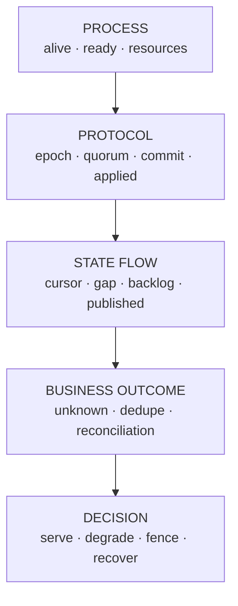
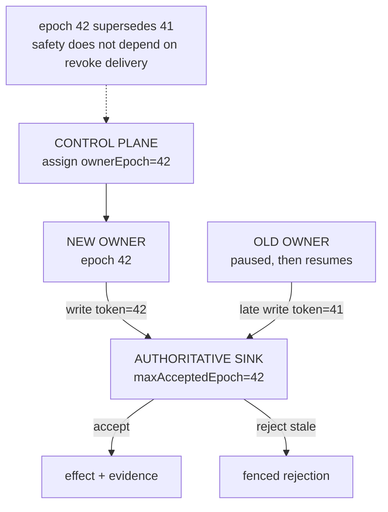
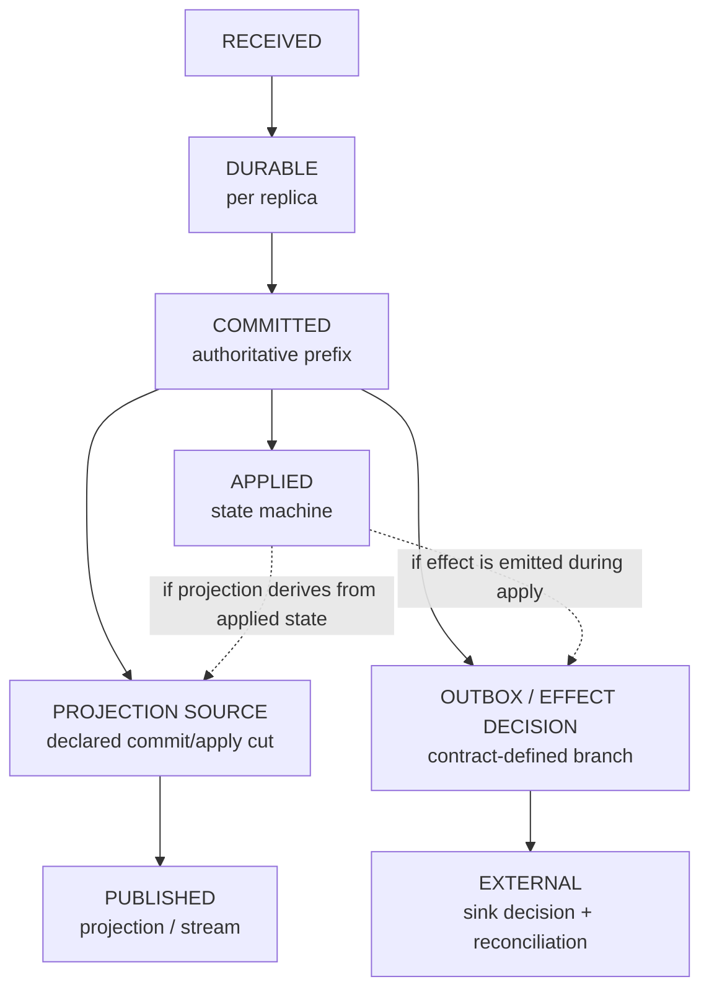
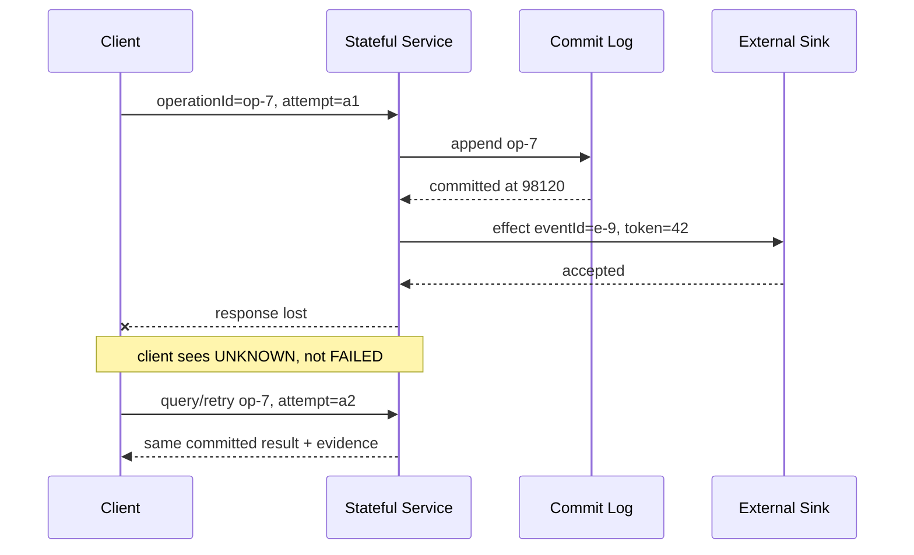
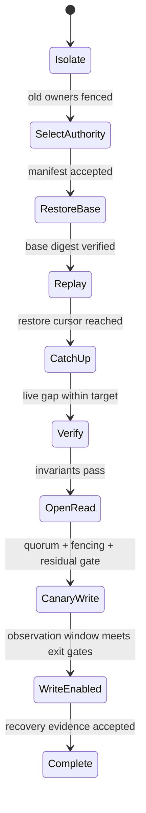

凌晨两点，三个进程都在，健康检查全是绿色，CPU 只有 20%，请求也还能返回；但旧 Leader 正在写一套已经失效的历史，Follower 的状态机落后于提交位置，搜索索引停在昨天，另外 327 个超时请求究竟有没有扣款仍无人知道。

这不是“监控覆盖率不够”，而是观测模型错了。进程存活只能证明某个探针收到了响应，无法证明当前节点拥有写入权、已持久化的前缀已经提交、提交的命令已经应用、对外投影已经发布，或者灾难恢复已经到达允许重新接流的边界。

有状态系统的可观测性必须回答一组可执行的问题：**谁现在有权决定，权威历史推进到哪里，每个副本和投影追到哪里，哪些业务结果仍然未知，恢复处于什么阶段，以及哪份证据允许控制面执行下一步。** 指标、日志和 Trace 只是承载这些答案的媒介；如果它们没有映射到协议状态、不变量与决策规则，再漂亮的 Dashboard 也只是运行时装饰。

本文是“有状态系统可靠性”学习路径的 Chapter 16，也是一篇协议观测与工程方法文章。它承接 [Raft 中的 term、commitIndex 与 lastApplied](/signal-grid-blog/posts/raft-consensus-leader-election-log-replication-and-safety/)、[应用序列号与恢复游标](/signal-grid-blog/posts/distributed-message-sequencing/)、[分布式快照中的 State + Cursor](/signal-grid-blog/posts/distributed-snapshots-consistent-checkpoints-barriers-recovery-cursors/)、[灾难恢复中的 RPO/RTO 证据](/signal-grid-blog/posts/backup-pitr-disaster-recovery-and-restore-drills/) 和 [恢复协议验证方法](/signal-grid-blog/posts/recovery-protocol-verification-failpoints-simulation-history-checking/)，把散落在各章的“应该观测什么”收束成一套统一模型。

边界也先说清：本文不写 Prometheus、OpenTelemetry 或某个日志平台的安装教程，不讨论 JVM、GC、CPU Profiling 等性能观测，也不把某个产品的指标名冒充跨系统标准。示例字段是教学协议；落地时必须以自己的 ACK 合同、复制协议、分片模型与外部副作用边界为准。

## 1. `process_up` 只能证明探针成功，不能证明状态正确

传统服务通常从四类信号开始：请求速率、错误、延迟和资源饱和度。它们仍然重要，却只能描述服务表现与资源症状。对有状态系统，还必须观察**权威性、进度、连续性和收敛性**。

Google SRE 在讨论分布式共识系统时特别区分了“成员进程健康”和“成员处于什么协议状态”：一个进程可以运行，却因为磁盘、网络或恢复追赶而无法推进；成员也可能是 Leader、正在恢复的副本或持续落后的副本。etcd 的官方指标同样分别暴露 Leader 存在性、已提交提案、已应用提案和 pending proposal，而不是用一个健康布尔值概括集群。

先把四层事实分开：

| 层次   | 典型问题                              | 一份绿色信号能证明什么 | 不能证明什么                   |
| ------ | ------------------------------------- | ---------------------- | ------------------------------ |
| 进程层 | 线程是否运行、探针是否可达            | 当前进程能执行这次检查 | 有 quorum、状态新鲜、拥有写权  |
| 资源层 | CPU、内存、磁盘、网络是否饱和         | 可能的性能或容量约束   | 某条命令已经提交或恢复正确     |
| 协议层 | term、epoch、commit、applied 是否推进 | 权威与状态机进度       | 外部 Sink 已经产生同一结果     |
| 业务层 | 订单、余额、投影、对账是否收敛        | 对外承诺是否兑现       | 未被模型覆盖的隐藏状态一定正确 |



上图不是“多采几类指标”的清单，而是一条证据依赖链：只有下层事实成立，上层结论才有意义。进程不可达当然值得处理；但进程可达时，协议和业务仍可能错误。

### 先写 Claim，再找信号

每个 Dashboard 面板和告警都应能还原成一句待验证的主张。例如：

- “Shard 17 当前只有 epoch 42 的 Owner 可以写入”；
- “所有已返回 `QUORUM_COMMITTED` 的操作都位于恢复后的提交前缀内”；
- “余额投影最多落后权威账本 2 秒，并且差距正在缩小”；
- “所有结果未知的扣款仍位于去重保留窗口内，能够安全查询或重试”；
- “恢复任务已完成旧 Owner 隔离、重放和对账，因此允许开放写流量”。

如果一个指标无法支持任何主张，它最多是诊断线索；如果一个主张没有对应的权威字段和失败动作，它还不是可操作的可靠性合同。

### 同一个数值必须带上观测实体与代际

`commit_position=98120` 单独出现时几乎不可解释。它至少需要绑定：

```text
ObservationScope(
  systemId,
  stateDomain,        // cluster / shard / partition / account domain
  memberId,
  processIncarnation, // 进程重启后变化
  clusterIncarnation, // 灾难恢复或新集群重建后变化
  protocolVersion,
  observedAt
)
```

单调位置通常只在某个 domain 和 incarnation 内可比较。进程重启会让内存 Counter 清零；PITR 后的新 Timeline 可能从旧位置分叉；分片迁移会改变 Owner；同名集群从备份重建后也不应与被替换的旧集群直接拼接折线。

因此，Metric Label 只能使用经过基数预算验证、取值集合稳定且有限的维度。cluster 与固定角色通常可以直接分组；shard、member 是否安全取决于部署上界，process/cluster incarnation 则会随重启或恢复持续制造新时间序列，更适合进入状态查询、结构化日志、Trace 与 Evidence Manifest。Counter 重置用 `process_start_time` 和遥测后端的 reset 语义解释。若为了“方便关联”把每个业务 ID 做成 Metric Label，可观测系统本身会先遭遇基数和成本故障。

## 2. Epoch、Term 与 Owner 先回答“谁有资格推进历史”

在比较任何进度之前，必须先确定这些进度是否属于同一份权威历史。`lastApplied=1000` 的旧 Leader 不能因为比新 Leader 的 `lastApplied=980` 大，就重新获得写入权。

常见的代际字段至少有四种：

| 字段                 | 排序对象                     | 典型来源                     | 不能替代                |
| -------------------- | ---------------------------- | ---------------------------- | ----------------------- |
| `clusterIncarnation` | 一次集群创建或恢复产生的历史 | Restore Manifest、启动元数据 | Raft term、业务版本     |
| `configEpoch`        | 成员或路由配置代际           | 共识成员变更、控制面配置     | 当前写 Owner            |
| `leaderTerm`         | 共识协议的领导任期           | Raft term、KRaft epoch       | 外部资源的 fencing 校验 |
| `ownerEpoch`         | 某 state domain 的写入所有权 | 租约/协调服务、迁移协议      | 日志内具体命令位置      |

它们可能取相同数值类型，却不是同一个序列。Raft term 主要保护共识日志的领导代际；外部数据库、对象存储或交易通道若不理解这个 term，就不会自动拒绝旧 Leader。对外写入仍需携带最终资源可以验证的 fencing token、条件版本，或通过唯一权威代理执行。



这里真正值得观测的不是“当前 Leader 名字”，而是一组互相约束的事实：

- 控制面声明的当前 Owner 与 `ownerEpoch`；
- 每个候选执行者自认的角色、term/epoch 和最后续约位置；
- Router 实际把写流量送给谁；
- 权威 Sink 在写入原子边界记录的 fencing 决议：resource/domain、presented token、接受前后的最大 token、Sink commit sequence 与 accept/reject outcome；
- 旧 token 被拒绝的次数、来源和最后一次发生时间；
- 是否曾出现**旧 token 被接受**——该结论必须来自 Sink 决议或离线 Checker，而不是节点自报 Gauge；一旦成立，它不是普通错误率，而是安全不变量已经破坏。

两个执行者同时自报 Active 也只能作为保守隔离触发器：样本必须带 freshness 与 incarnation，过期 Gauge 不能证明两个 Owner 此刻仍在并发写。真正的 Fencing 不依赖控制面撤销消息抵达旧进程，而依赖最终资源对每次副作用做原子校验。

### “有 Leader”与“Leader 能提交”是两个状态

某个成员自报 `isLeader=1`，只说明它的本地角色。它可能已与多数派隔离，仍在暂停恢复后的短窗口内认为自己是 Leader。更有意义的观测要把角色与进展绑定：

```text
AuthorityView(
  leaderId,
  leaderTerm,
  lastQuorumEvidence(
    term,
    confirmedPosition,
    method,             // commit / explicit read barrier / quorum round-trip
    observedAtMonotonic,
    status              // CONFIRMED_WITHIN_BUDGET / STALE / UNKNOWN
  ),
  commitPosition,
  commitAdvanceAge,
  configEpoch
)
```

节点并不知道一个永恒为真的 `quorumReachable` 布尔值，只能保存最近一次法定人数证据及其年龄。证据可以来自当前 term 的成功多数派往返、提交，或显式只读屏障；超过预算后应变成 `STALE/UNKNOWN`，而不是继续显示绿色。空闲系统的 commit 不前进也不能证明 quorum 丢失：只有存在写需求却无法提交，或主动 barrier/当前 term quorum round-trip 失败时，停滞才是可执行的活性证据。墙钟时间用于跨系统审计，证据年龄与 timeout 应尽可能由同一进程的单调时钟测量；[分布式时间章节](/signal-grid-blog/posts/distributed-systems-time-clocks-ordering-and-leases/) 已解释 timeout 只能产生怀疑，不能证明远端死亡。

### 代际不一致比数值落后更危险

落后副本通常可以追赶；代际冲突则意味着比较本身非法。控制面应优先识别：

```text
same stateDomain
AND different active ownerEpoch
AND both sides still report write capability
```

此时不应先算谁的 offset 更大，也不应等待“持续五分钟再告警”。安全动作是停止或隔离有争议的写路径，确认权威代际，并让最终资源执行 fencing。持续时间门槛适合过滤短暂性能抖动，不适合延迟一个已经被观察到的不变量违反。

## 3. Durable、Commit、Applied 与 Published 必须分层记录

有状态系统最常见的观测错误，是把所有“位置”都叫 offset。事实上，一条命令从接收到对外可见，至少会跨越多个不同的确认点：



每个位置回答的问题不同：

| 位置                    | 含义                                           | 主要证据                                                 | 尚未保证                   |
| ----------------------- | ---------------------------------------------- | -------------------------------------------------------- | -------------------------- |
| `received`              | 入口见过请求                                   | 接收事件、attemptId                                      | 已持久、不会丢             |
| `durable[member]`       | 某副本按声明介质模型保存到此                   | WAL/flush 完成、record identity                          | 已形成 quorum commit       |
| `commit`                | 协议决定此前缀不会被合法未来历史推翻           | term/index、quorum 规则                                  | 本副本已执行到此           |
| `applied[member]`       | 状态机已执行到此                               | lastApplied、state version                               | 状态自身已持久、下游已发布 |
| `published[projection]` | 投影声明的来源前缀已原子反映到查询模型或事件流 | projection generation、source cursor、state/batch digest | 外部第三方已最终执行       |
| `reconciled[boundary]`  | 外部权威与本地决定已完成比对                   | reconciliation run + residual set                        | 未来不会再出现新事实       |

Raft 论文明确区分 `commitIndex` 与 `lastApplied`：已提交条目仍需按顺序应用到状态机。Applied 状态也可能只是可由日志重建的内存状态，并不自动获得独立耐久性。Projection 更不是固定的下一阶段：它可以直接消费 committed log，也可以从 applied state 生成；一条命令还可能产生零条或多条投影事件。每个系统都必须声明 Publish 的来源 cut，并把 `(projectionGeneration, sourceCursor, projectionState/batchDigest)` 原子提交。外部副作用通常沿 Outbox 或另一条已定义分支推进，不能把它们画成唯一全序。etcd 官方指标分别暴露 committed 与 applied，Kafka KRaft 同时提供 current epoch、high watermark 与 log end offset，恰好说明这些事实不能被折成一个数。

### 位置必须来自产生该语义的组件

不要让 API Gateway 根据成功响应数猜 commit，也不要让 Consumer 根据内存计数猜 durable cursor。每个阶段应由掌握该事实的 Owner 发布：

- WAL Writer 发布本地 durable position；
- 共识模块发布 term、commit position 和 quorum 状态；
- 状态机执行器发布 applied position 与规范化 state digest；
- Projection/Consumer 发布 source cursor、projection generation 和最后完成批次；
- 外部对账器发布 reference cut、local cut、完成状态与 residual 分类。

这些位置还要带上足以判定可比性的身份。最低限度通常包括历史 incarnation/timeline、协议代际与位置；若系统要检测同一位置的分叉，再记录协议实际提供的 entry identity 或内容摘要，而不是假设所有实现都暴露逐条 hash。快照覆盖的前缀则用 `(snapshotGeneration, lastIncludedPosition, stateDigest, schemaVersion)` 与后续日志衔接。

### 端到端延迟必须标明在哪个确认点停止

一条写入可以同时拥有多种延迟：

```text
receiveToDurable
receiveToCommit
receiveToApply
receiveToPublish
receiveToExternalDecision
receiveToClientResponse
```

只报告 `write_latency` 会让局部优化破坏合同。例如提前回复可以让 client response 变快，却把尚未 durable 的工作伪装成已经接受；异步 Projection 可以让核心提交保持低延迟，却让读取落后。正确做法不是强迫所有阶段同步，而是分别命名、分别承诺，并让 API 返回的 ACK class 对应一个明确位置。

## 4. Cursor、Lag、Backlog 与 Age 描述的是不同债务

有了可比较的位置，才可以定义 Lag。最小形式是：

```text
replicationLag = leaderLogEnd - followerMatch
applyLag       = commitPosition - appliedPosition
projectionLag  = projectionSourceHead - projectionConsumedCursor
restoreGap     = restoreTarget - restoredPosition
```

这些减法只有在两边属于同一 source domain、incarnation、position codec 和历史分支时才成立。`appliedPosition` 与 `publishedPosition` 若来自不同日志或一对多映射，就不能相减；此时只能报告投影自身的 source head 与 consumed cursor，或者使用有明确映射的业务 version gap/oldest age。PITR 后不同 Timeline、迁移前后的不同 Owner Epoch，或者 Kafka 不同 Partition 的 offset，都不能直接相减。

### Lag 是距离，Backlog 是工作，Age 是业务等待

三者经常相关，却不能互相替代：

| 信号                     | 回答的问题               | 主要盲点                       |
| ------------------------ | ------------------------ | ------------------------------ |
| Position Lag             | 距离权威位置还差多少     | 每个位置的处理成本可能不同     |
| Backlog Count/Bytes/Cost | 还欠多少工作或资源       | 不知道最老工作等了多久         |
| Oldest Age               | 最老未完成事实已等待多久 | 一个超老异常项可能掩盖主体分布 |
| Drain Rate               | 债务正在扩大还是缩小     | 短窗口会受批处理和抖动影响     |
| Estimated Catch-up Time  | 以当前净处理能力多久追平 | 处理率和入口率可能继续变化     |

容量规划时，可以在工作单位一致、入口与回放容量近似稳定的短窗口内估算：

```text
catchUpTime ≈ backlogWork / (replayCapacity - liveIngressWork)
```

只有 `replayCapacity > liveIngressWork` 时这个值才有限。这只是规划近似，不是告警阈值或 RTO 证明；优先使用实测净 drain rate，并把下载、校验、应用和接流门禁时间单列。因此，“Lag 稳定”不一定健康：它可能稳定在一个已经超过新鲜度 SLO 的高位；“Lag 下降”也不一定可以接流：恢复速度可能仍赶不上 RTO。

Kafka 官方文档提醒，consumer 的 `records-lag-max` 基于 current offset，而非 committed offset。这是一个典型边界：它适合描述当前消费实例的获取进度，却不能单独证明崩溃后从哪里恢复。应用还需要把已处理业务状态与 committed/recovery cursor 置于同一提交边界。

### Age 必须声明时间来源

队列中的本地等待可以用单调时钟计算；跨进程、跨重启的 durable backlog age 往往需要权威事件时间或接收时间。两者不能混用：

- `queueAgeMonotonic`：同一进程内从入队到当前的经过时间，适合 timeout 与本地调度；
- `oldestCommittedAtAge`：权威提交时间到当前墙钟的近似年龄，需要记录时间同步状态与误差；
- `businessEventAge`：业务事实发生时间的年龄，可能受迟到数据和来源时钟影响；
- `recoveryPhaseAge`：恢复控制面为当前 attempt 持久记录的阶段开始时间。

若时钟同步失联，不应把负 Age clamp 成 0 后继续假装精确。保留原始时间、Observed Time、同步不确定度和 position；在无法满足误差假设时，把基于墙钟的结论标为 degraded 或 unknown。

### 聚合会隐藏最危险的 Domain

全局平均 Lag 对分片系统尤其危险：999 个空闲分片可以把一个关键账户分片的长时间停滞稀释掉。至少同时保留：

- 最坏 domain 的 Lag、Age 与身份；
- 超过业务新鲜度目标的 domain 数量和权重；
- Lag 分布，而不是只有平均数；
- 按优先级、租户或业务类型计算的 backlog cost；
- 无入口时是否仍无法推进——这比高峰时轻微落后更接近故障。

但也不能把无界 shardId 直接做成永久高基数指标。Metric 侧可以使用固定槽位的 Top-K、超限数量与聚合分布，槽位只表示排名而不把轮换的 domain ID 变成新标签；完整 domain 身份放入可查询状态表，告警触发时附上查询快照或证据 URI。

## 5. Unknown、去重窗口与对账残留必须成为一等状态

客户端 timeout 只说明它没有按时拿到确定答案。命令可能尚未到达、已经 durable、已经 commit、已经执行但响应丢失，甚至外部副作用已经发生。[跨系统副作用章节](/signal-grid-blog/posts/cross-system-side-effects-idempotency-outbox-inbox-2pc-saga/) 已展开结果未知与幂等机制；在可观测模型里，关键是不能把 `timeout_total` 当成普通失败计数后丢掉身份。

一项业务操作应至少拥有三个不同身份：

```text
operationId  // 稳定业务意图，所有安全重试复用
attemptId    // 某次网络/进程执行尝试，每次可变化
eventId      // 已提交后产生的业务事实或副作用身份
```

`traceId` 也不能替代它们：Trace 可能采样、切断或因异步批处理形成多对多关系，而 operationId 必须在去重与查询生命周期内稳定。



### Unknown Set 必须可以被枚举、老化和收敛

仅有 `unknown_total` Counter 不够。它只会增长，重启还可能清零；它无法回答当前还有谁没解决。控制面需要一份有界、可查询的 residual set：

```text
UnknownOperation(
  operationId,
  firstSeenAt,
  lastAttemptAt,
  evidence { received?, durable?, committed?, applied?, external? },
  outcomeKnowledge,    // UNKNOWN / COMMITTED / NOT_COMMITTED / EXTERNAL_CONFIRMED / MANUAL
  authorityEpoch,
  commandPosition?,
  dedupeFrontier { kind: TIME | SEQUENCE | GENERATION, value, authority },
  reconciliationState,
  nextDecision
)
```

由此派生的信号才可操作：

- unresolved operation 数量、最老年龄和按业务风险加权的金额/影响；
- outcomeKnowledge 分布、缺少哪类独立证据，以及多久没有新证据；
- 只有 Unknown 与 dedupe frontier 位于同一坐标域时，才计算两者之间的安全余量；
- query/retry 收敛率、永久无法自动判断的数量；
- Unknown 是否跨过了升级、迁移或灾备代际。

这些证据构成部分序，而不是统一的 `highest stage`：外部 Sink 可能已经接受，而本地 apply 证据尚未恢复；不同副作用也可能独立决议。去重边界同样不总是墙钟 TTL，它可能是安全回收序号或 generation frontier。当 Unknown 即将越过同坐标的去重前沿时，正确动作不是继续自动重试，而是暂停清理、扩展所需证据保留，并进入权威查询或人工对账。过早删除会把一个旧操作重新解释成新操作。

### Reconciliation 的零残留也需要完成证据

对账器输出 `difference_count=0` 并不能单独证明一致。它可能根本没有运行、只扫描了一半，或者比较了两个不同时间切面。一次有效对账至少绑定：

```text
ReconciliationRun(
  runId,
  localAuthorityCut,
  externalAuthorityCut,
  cutMappingVersion,
  lineageDigest,
  ruleVersion,
  startedAt,
  completedAt,
  scannedCount,
  residualCountByType,
  residualDigest,
  status // COMPLETE / PARTIAL / FAILED
)
```

Residual 不应只有总数。至少区分本地有而外部缺、外部有而本地缺、金额/状态不一致、身份无法映射、仍在允许决议窗口内。Local cut 与 external cut 通常不是可直接比较的数字；二者必须各自完整、可重放，并由版本化 mapping/rule 绑定到同一业务边界。只有 `status=COMPLETE`、cut lineage 与映射关系已验证、规则版本已知且 residual 满足业务门槛时，“零差异”才是一份证据。

## 6. 恢复是一台有门禁的状态机，不是一次重启动作

[PITR 与灾难恢复章节](/signal-grid-blog/posts/backup-pitr-disaster-recovery-and-restore-drills/) 已把 RTO 终点定义为安全接流，而非进程启动。要让这一定义可观测，恢复不能散落在几条日志里；它必须拥有独立 `recoveryAttemptId`、目标、阶段和不可逆决策记录。



推荐的阶段不是产品标准，真正重要的是每条边都拥有明确的前置证据：

| 转移                          | 必须成立的事实                                           | 失败时动作                   |
| ----------------------------- | -------------------------------------------------------- | ---------------------------- |
| Isolate → SelectAuthority     | 旧 Owner 无法继续改变权威状态                            | 保持流量隔离，不进入 Restore |
| SelectAuthority → RestoreBase | Restore Manifest、timeline/incarnation 与目标 RPO 已选定 | 拒绝拼接“各组件最新”         |
| RestoreBase → Replay          | Base checksum、schema、key 与 snapshot cursor 一致       | 更换恢复材料或新建 attempt   |
| Replay → CatchUp              | 日志连续，无未知坏尾，state 与 cursor 原子推进           | 停止在最后合法前缀           |
| CatchUp → Verify              | 与权威目标的 Lag 落入约定范围且继续收敛                  | 限制入口或提高恢复容量       |
| Verify → OpenRead             | 状态摘要、业务不变量和读语义通过                         | 保持控制面可达，业务流量关闭 |
| OpenRead → CanaryWrite        | 当前 Owner 有 fencing，Unknown/Residual 可解释           | 只开放允许的读，禁止写       |
| CanaryWrite → WriteEnabled    | 受限流量在规定窗口内满足错误预算、尾延迟与进度门槛       | 关闭 Canary 或开始新 attempt |
| WriteEnabled → Complete       | 恢复退出证据被权威控制面接受                             | 保持受限流量并继续观察       |

这张表是恢复协议的 transition contract，不是泛化上线清单。实现可以多出 Download、Decrypt、Schema Migration 或 Projection Rebuild 阶段，但不能用“脚本退出码为 0”替代状态证据。

### 阶段必须持久化，且不能悄悄倒退

恢复协调器重启后，应从权威记录读回：

```text
RecoveryState(
  recoveryAttemptId,
  sourceIncarnation,
  targetIncarnation,
  targetRecoveryCut, // state/source/projection/outbox cursors + manifest digest
  currentPhase,
  phaseStartedAt,
  acceptedEvidenceDigest,
  activeOwnerEpoch,
  allowedTrafficMode,
  lastDecisionBy
)
```

若新证据推翻旧判断，不要把已经到达的 `CanaryWrite/WriteEnabled` 原地改回 `Replay` 并覆盖历史；先关闭或限制流量，结束当前 attempt 为 failed/revoked，再启动新的 attempt。这样才能解释某个时间窗口内为何曾允许写入，也能把操作员决策纳入审计。

### Readiness 应表达可服务语义，而不是一个布尔值

同一恢复实例可能适合查询历史，却不适合接受新写；可以提供只读投影，却不能提供线性一致读。控制面内部至少区分：

| 模式                      | 允许流量                    | 必需证据                                      |
| ------------------------- | --------------------------- | --------------------------------------------- |
| `CONTROL_ONLY`            | 健康、状态和恢复管理接口    | 进程可达，身份可信                            |
| `BOUNDED_STALE_READ`      | 明确携带 version/age 的读取 | published cursor 与最大陈旧合同               |
| `AUTHORITATIVE_READ`      | 权威读取                    | quorum/read barrier 与 applied 位置           |
| `WRITE_ENABLED`           | 新业务命令                  | 当前 Owner、fencing、commit 能推进            |
| `EXTERNAL_EFFECT_ENABLED` | 向第三方产生副作用          | outbox/reconciliation 与下游 fencing/幂等边界 |

对负载均衡器仍可映射成 readiness，但内部决策不能先丢掉这份类型信息。否则一个“读已恢复”的绿色探针会过早开放写流量。

## 7. 告警、Trace 与证据保留必须服务于同一个决策

协议观测的完成条件不是面板齐全，而是异常发生时能做出安全且有证据的动作。告警首先要区分三种东西：

1. **用户症状**：承诺的延迟、可用性或新鲜度已经受损；
2. **协议风险**：commit 停滞、apply lag 增长、Unknown 临近去重前沿；
3. **不变量违反**：旧 token 被接受、同一 position 出现不同 command、apply 越过 commit。

Prometheus 官方建议面向用户症状保持少而可行动的 Page，这是正确的默认；但协议安全违反不能等到用户错误率显著上升才处理。它应触发立即隔离、冻结自动迁移或关闭写路径，同时保存证据。

### 每条告警都要对应一个决定

| 条件                                                           | 分类        | 首要动作                            | 解除依据                               |
| -------------------------------------------------------------- | ----------- | ----------------------------------- | -------------------------------------- |
| 有写需求时无法提交，或当前 term barrier/quorum round-trip 失败 | 可用性/活性 | 停止承诺新写，保护控制与恢复流量    | 新 term 下形成新 quorum 证据并持续推进 |
| apply lag 持续增长                                             | 协议进度    | 限制昂贵读写，定位 apply bottleneck | Lag 与 oldest age 回落且状态机推进     |
| Projection 超过新鲜度合同                                      | 业务症状    | 标记 stale、切权威读或拒绝          | published cursor 达到目标 cut          |
| freshness/incarnation 有效的两个 Active Owner 信号             | 安全风险    | 保守隔离争议路由，查询权威并 fence  | 最终资源只接受当前 token               |
| 旧 fencing token 被权威 Sink 接受                              | 不变量违反  | 立即停写并按分叉/副作用事故处理     | 完成影响范围重建与对账，不是计数归零   |
| Unknown 接近 dedupe retention frontier                         | 结果风险    | 停止清理并执行查询/对账             | 每个 operation 收敛或进入明确人工状态  |
| Recovery phase 超过预算                                        | RTO 风险    | 保留现场，诊断该阶段依赖            | 新 attempt 安全接流或风险被接受        |

对短暂性能抖动可以使用持续时间、进入/退出滞回和 burn rate，避免频繁抖动；对一次即可证明安全性破坏的事件，不应设置 `for: 10m`。同样，自动重启不是通用修复：它可能清掉内存证据、重置 Counter，并让旧 Owner 再次竞争。

### Trace 用于串起因果导航，不用于定义权威顺序

W3C Trace Context 与 OpenTelemetry 可以让请求跨服务传播 `traceId`，OpenTelemetry 日志模型也允许记录 TraceId/SpanId 做关联。这解决的是“怎样找到同一次执行相关的遥测”，不解决“哪条业务历史已经提交”。

有状态链路建议同时保留：

| 身份/位置           | 生命周期                     | 用途                         |
| ------------------- | ---------------------------- | ---------------------------- |
| `traceId/spanId`    | 一次同步或异步执行图         | 导航调用、等待和错误路径     |
| `operationId`       | 一次稳定业务意图及其所有重试 | 去重、查询结果未知           |
| `attemptId`         | 一次具体尝试                 | 区分 timeout、重试和入口节点 |
| `eventId`           | 一条已产生的业务事实         | Outbox/Inbox 与对账          |
| `term/ownerEpoch`   | 一次权威代际                 | 识别旧 Owner、fencing        |
| `commandPosition`   | 权威日志中的位置             | commit、apply、replay        |
| `sourceCursor`      | 某投影消费位置               | 新鲜度与恢复                 |
| `recoveryAttemptId` | 一次恢复决议                 | 串联阶段、证据和操作员动作   |

异步队列、Batch 和 Fan-in/Fan-out 不一定形成简单父子 Span 树。一次 Batch 可能包含多个 operation，一个 operation 也可能经历多个 Trace；可用 Span Link 或业务字段表达关联，但不要强行把业务身份改造成 traceId。

此外，Trace 可以被采样。OpenTelemetry 规范明确区分 recording 与 sampled；标准导出路径通常不会导出未采样 Span，`RECORD_ONLY` 仍可能供本地 SpanProcessor 使用。故而“搜索不到 Trace”不能证明请求没有执行，关键 ACK、fencing rejection、恢复阶段和外部副作用决议必须进入独立、耐久的证据通道。

### 证据保留期来自协议窗口，不来自磁盘预算拍脑袋

不同 Claim 依赖不同证据集合。应当**对每一类证据**取所有相关协议窗口的最大下界，再叠加 legal hold、incident freeze、恢复验证与介质完整性要求，而不是给全部遥测套一个统一 TTL：

```text
max(
  clientRetryAndQueryWindow,
  dedupeRetention,
  replayAndPitrWindow,
  expectedIncidentDetectionDelay,
  reconciliationAndSettlementWindow,
  upgradeAndRollbackEvidenceWindow,
  regulatoryOrAuditRequirement
)
```

不同证据可以分层存储：高频 Metric 保留聚合趋势，结构化事件保留决议与异常身份，完整 Trace 按采样策略保留，安全与财务审计进入不可变或受控归档。但任何降采样、压缩和删除都要保留其影响：采样率、缺失区间、Collector/Exporter backlog、丢弃计数和最后成功归档位置。

Metrics 本身通常不是持久业务记录。etcd 官方文档就明确说明其 metrics 在成员重启后会重置。长期决策因此不能依赖“Counter 从部署开始永不清零”的假设；要么在遥测后端处理 reset，要么直接从权威状态派生当前 Gauge。process incarnation 放进可查询状态与 Evidence Manifest，而不是让每次重启永久新增 Metric Label。

### 用故障矩阵验证“看得见且做得对”

可观测性也需要故障注入。验收对象不是“告警有没有响”，而是信号、结论和动作是否一致：

| 注入                            | 应观察到的协议证据                                                              | 合法决策                           | 失败判据                        |
| ------------------------------- | ------------------------------------------------------------------------------- | ---------------------------------- | ------------------------------- |
| Leader 与多数派隔离，旧进程仍活 | 本地角色可能未立即改变；当前 term quorum 证据过期，写请求/显式 barrier 无法提交 | 停止新写承诺，等待合法选举         | 只因 `process_up=1` 继续 ACK    |
| 旧 Owner 暂停后恢复并写入       | stale token rejection 与当前 ownerEpoch                                         | 拒绝旧写，保留事件                 | 旧 token 被权威 Sink 接受       |
| Apply 线程停顿，复制仍正常      | commit 前进、applied 不前进、apply lag/age 增长                                 | 降级读取或限流                     | 把副本报告为 fully ready        |
| Projection Sink 不可用          | 核心 commit 正常、published cursor 停滞                                         | 标记投影 stale，不谎报核心提交失败 | 用总错误率掩盖具体落后层        |
| ACK 丢失后客户端重试            | 同 operationId、多 attempt、单一结果                                            | 查询/返回相同结果                  | 重复产生业务副作用              |
| 对账任务扫描一半失败            | status=PARTIAL、cut 与 scanned count 保留                                       | 不接受 zero residual               | `difference_count=0` 被当成通过 |
| 恢复协调器重启                  | 同 recoveryAttemptId 与阶段证据恢复                                             | 从已提交阶段继续或新建 attempt     | 阶段丢失却直接进入 WriteEnabled |
| 遥测 Exporter 阻塞              | dropped/backlog 与证据缺口可见                                                  | 阻止依赖缺失证据的自动门禁         | 信号消失被解释为故障消失        |

这里最后一行尤其关键：可观测管线故障不一定要求立即关闭一个仍能安全运行的服务，但它必须阻止那些**以观测证据为前提**的自动切主、恢复放流、历史清理和对账完成判断。没有证据时，正确结果是 `INCONCLUSIVE`，不是绿色。

## 8. 可观测性的产物是一份可审计决策，而不是更多图表

有状态系统无法靠 `process_up` 证明正确，也不能靠任意一个 Lag 或 Error Rate 证明恢复。可信的观测模型沿着协议因果链逐层建立结论：

1. 用 cluster incarnation、term、config/owner epoch 确认正在观察哪份历史，以及谁有资格继续写；
2. 把 durable、commit、applied、published 和 external outcome 分成不同位置，避免提前扩大 ACK 的含义；
3. 只有在同一 domain 与代际内计算 Cursor 差，并同时观察 backlog cost、oldest age、drain rate 与追赶时间；
4. 把 Unknown、去重保留前沿和 reconciliation residual 建成可枚举、可老化、可收敛的状态；
5. 让恢复以持久化阶段和证据门禁推进，只有 fencing、cursor、digest、invariant 与 residual 同时满足时才开放相应流量；
6. 用 traceId 导航执行，用 operationId、epoch、position 和 recoveryAttemptId 证明业务与协议事实，并把采样与遥测缺口留在证据里；
7. 让每条告警对应一个安全决定，让每次决定保留版本、位置、责任人和解除依据。

这套方法能保证的是：在已声明的故障模型、ACK 合同、位置语义和证据保留窗口内，控制面不会仅凭“进程活着”就错误宣布权威、完成或恢复，并且每次开放、降级、fence 和恢复决策都可以追溯。

它不能保证遥测没有实现 Bug，不能让采样 Trace 变成完整审计日志，也不能仅靠观测证明所有可能 History 都正确。最终可信度仍来自权威状态、协议不变量、故障注入、历史检查与真实恢复演练共同交叉。下一章 [恢复协议验证](/signal-grid-blog/posts/recovery-protocol-verification-failpoints-simulation-history-checking/) 会进一步说明，如何把这些字段变成 simulator、failpoint、History Checker 与 RPO/RTO Oracle 的输入。

## 原始论文、规范与官方资料

- Diego Ongaro、John Ousterhout：[In Search of an Understandable Consensus Algorithm](https://raft.github.io/raft.pdf)
- Google SRE Book：[Managing Critical State: Distributed Consensus for Reliability](https://sre.google/sre-book/managing-critical-state/)
- Mike Burrows：[The Chubby Lock Service for Loosely-Coupled Distributed Systems](https://research.google/pubs/the-chubby-lock-service-for-loosely-coupled-distributed-systems/)
- etcd 3.7：[Metrics](https://etcd.io/docs/v3.7/metrics/)
- etcd 3.7：[API 与 ResponseHeader 中的 Revision、Raft Term](https://etcd.io/docs/v3.7/learning/api/)
- etcd 3.7：[KV API Guarantees 与 timeout 结果未知](https://etcd.io/docs/v3.7/learning/api_guarantees/)
- Apache Kafka 4.3：[Monitoring](https://kafka.apache.org/43/operations/monitoring/)
- Apache Kafka 4.3：[Checking Consumer Position](https://kafka.apache.org/43/operations/basic-kafka-operations/#basic_ops_consumer_group)
- W3C：[Trace Context Recommendation](https://www.w3.org/TR/trace-context/)
- OpenTelemetry：[Trace SDK 与 Sampling](https://opentelemetry.io/docs/specs/otel/trace/sdk/)
- OpenTelemetry：[Logs Data Model 与 Trace Correlation](https://opentelemetry.io/docs/specs/otel/logs/data-model/)
- Prometheus：[Alerting Practices](https://prometheus.io/docs/practices/alerting/)
- Prometheus：[Alerting Rules、`for` 与 `keep_firing_for`](https://prometheus.io/docs/prometheus/latest/configuration/alerting_rules/)
- NIST SP 800-34 Rev. 1：[Contingency Planning Guide for Federal Information Systems](https://csrc.nist.gov/pubs/sp/800/34/r1/upd1/final)
