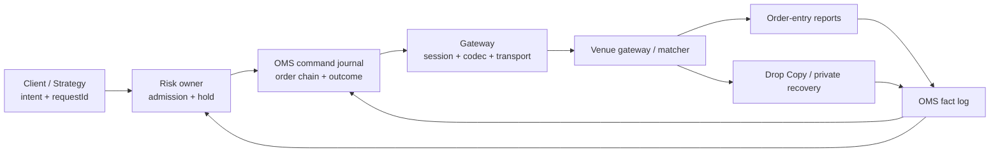
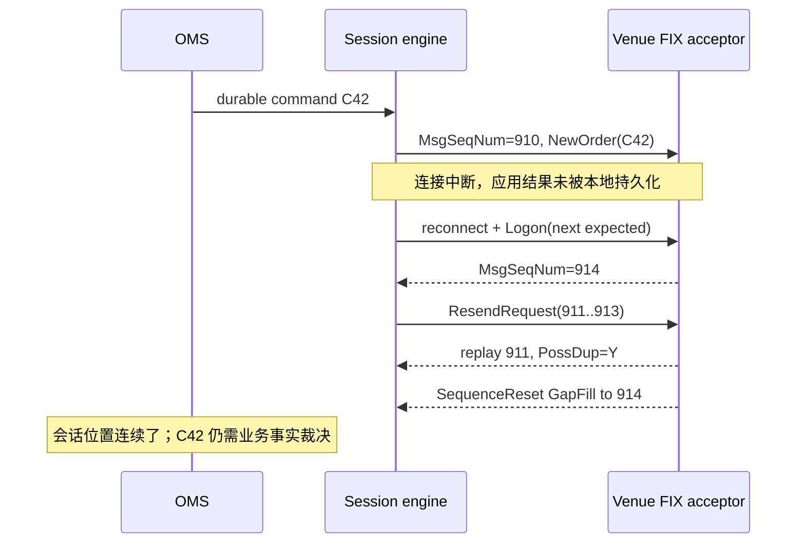
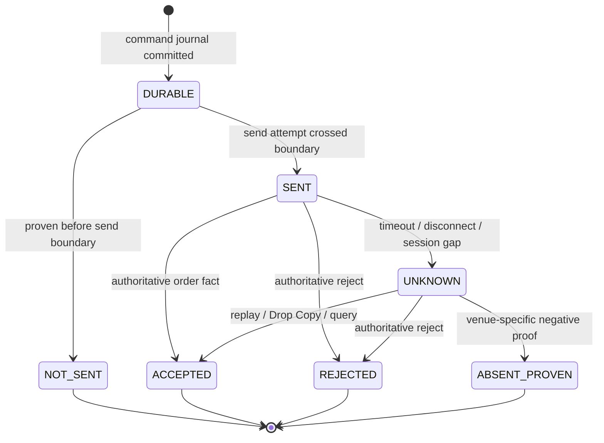
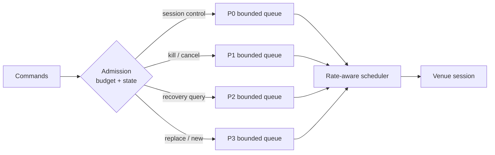
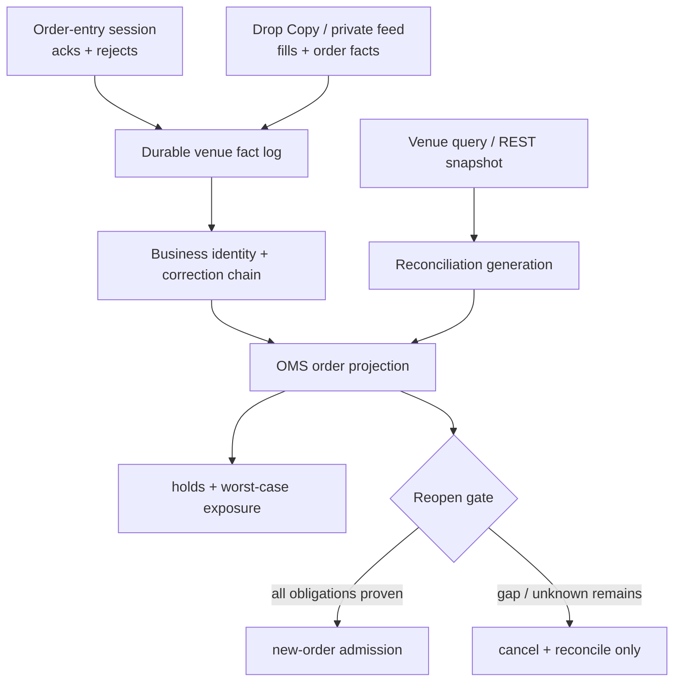

一条 TCP 连接重新建立、FIX Logon 成功、心跳恢复正常，交易客户端却仍然无法回答最重要的问题：断线前最后一张订单究竟有没有被交易场所接受？如果把“socket 已连接”“协议序列连续”和“订单状态已裁决”压成一个 `CONNECTED`，系统就会在恢复最快的时候做出最危险的动作——把结果未知的订单当成失败重发，或者在尚有场内挂单时重新开放交易。

本文的中心结论是：**网络连接正常不代表订单已被接受；Session 连续性与业务裁决必须分开。** 接入网关负责可靠地建立、维持和恢复一条受身份约束的消息会话，OMS 负责订单命令与 venue 事实，Risk 负责准入和风险占用。会话恢复只能恢复“哪些协议位置已经交换”，不能单独证明“哪些业务副作用已经发生”。

本文是交易系统学习路径的 Chapter 06，承接 [交易订单语义](/signal-grid-blog/posts/order-types-and-execution-strategies/) 对命令与订单状态的定义；下一章 [交易前风控与订单准入](/signal-grid-blog/posts/pre-trade-risk-and-order-admission/) 会把这里的可靠命令入口接到账户、客户、产品限额和原子资金预占。

文中以 [FIX Trading Community 的 FIX Session Layer](https://www.fixtrading.org/standards/fix-session-layer-online/)、[FIXP](https://www.fixtrading.org/standards/fixp-online/) 与公开 venue 规范建立一般模型，资料核对截止 2026-08-27。FIX、FIXP、SBE、REST 只是协议家族，不替任何交易场所统一规定序列重置、消息重放、订单幂等、限流或 Cancel-on-Disconnect。生产实现必须绑定 venue、环境、市场、会话类型和协议版本。

## 网关、OMS 与 Risk 必须拥有不同的权威状态

交易接入常被画成一个“Gateway”方框，里面同时做认证、解析、风控、订单状态和重连。这样看似减少了组件，实质上却消灭了所有权边界：重连代码可以覆盖订单状态，OMS 可以绕过风险占用直接重发，风控也可能把本地拒绝误写成 venue reject。

更稳健的边界是让三者分别回答不同问题：

| 所有者                   | 权威问题                                             | 必须持久化的状态                                                         | 不得自行宣称               |
| ------------------------ | ---------------------------------------------------- | ------------------------------------------------------------------------ | -------------------------- |
| Gateway / Session engine | 哪个身份、哪个会话代际、哪些入出站序列已建立或恢复？ | session identity、epoch、`nextIn/nextOut`、原始帧、发送尝试              | 订单已接受、已撤销或已成交 |
| OMS                      | 哪条业务命令对应哪条订单链，venue 已经裁决了什么？   | command journal、client/venue order identity、ExecutionReport / 私有事实 | 风控预算已安全预占或释放   |
| Risk                     | 该命令在某个规则版本下是否获准，最坏暴露是多少？     | decision、hold、limit utilization、policy generation                     | venue 已收到或执行命令     |



正常路径应先持久化本地准入、风险占用和待发送命令，再由网关发送；返回的 venue 事实先进入耐久事实日志，随后推进 OMS 投影和风险结转。网关重启只重建 session engine 的状态，不直接把 `SENT` 改成 `ACCEPTED`。

这条边界可以写成三条不变量：

```text
G1: sessionConnected == true 不能推出 venueOrderAccepted == true
G2: 每个可重试业务命令都有稳定 commandId 与不可变 payloadHash
G3: 任何释放风险占用的动作都必须引用 venue 终态或经过定义的缺席证明
```

网络层可以证明字节有没有进入本地 socket；会话层可以证明序列有没有缺口；只有应用事实才能裁决订单。后续所有恢复动作都以这三层证据分离为前提。

## FIX、FIXP、SBE 与 REST 的身份和序列不在同一个域

协议名不能替代身份模型。最常见的错误是把 TCP 连接、FIX session、SBE message、REST request 和订单 ID 都塞进一个全局自增序列，再假定数值更大就是“更新”。它们的所有者、寿命和恢复规则完全不同。

| 层次                  | 典型身份                                                               | 典型顺序                                     | 主要作用                                    |
| --------------------- | ---------------------------------------------------------------------- | -------------------------------------------- | ------------------------------------------- |
| 传输连接              | 本地/远端地址、connection epoch                                        | 字节流位置或 datagram                        | 搬运字节；重连会创建新物理实例              |
| FIX tag-value session | `BeginString + SenderCompID + TargetCompID`，并受 session profile 约束 | 双向独立 `MsgSeqNum(34)`                     | Logon、心跳、缺口检测与 resend              |
| FIXP session          | negotiated session ID、flow、session version                           | Recoverable / Idempotent 等 flow 的 sequence | 高性能会话建立、恢复与流语义                |
| SBE                   | schema ID、template ID、schema version、block length                   | **没有通用 session sequence**                | 二进制编码与兼容解码                        |
| REST 调用             | credential/account、endpoint、client request ID                        | 通常没有跨调用的通用序列                     | 请求/响应；幂等和一致性由 endpoint 契约定义 |
| 业务订单              | `ClOrdID/clientOrderId`、venue `OrderID`、订单链版本                   | venue 业务事件顺序                           | 订单接受、成交、撤改和终态                  |

[FIXP 标准](https://www.fixtrading.org/standards/fixp-online/)明确把 session layer 与 message encoding 分开：FIXP 可以承载 SBE，也可以承载双方约定的其他编码；SBE 负责怎样把字段放进字节，不负责 Logon、心跳、恢复或订单幂等。因此“我们用了 SBE，所以消息不会重复”没有协议依据。

内部键必须带上真实作用域，而不是保存裸序列号：

```text
SessionKey = (
  venue, environment, protocolProfile,
  senderIdentity, targetIdentity, logicalSessionId
)

SessionCursor = (sessionKey, sessionEpoch, direction, sequence)

BusinessCommandKey = (
  venue, accountScope, clientOrderIdScope, commandId
)
```

同一 FIX session 的 `MsgSeqNum=1042` 与 Drop Copy session 的 `1042` 没有顺序关系；REST 查询返回的 `updatedAt` 也不能覆盖一条更晚到达但业务上更早生效的 FIX ExecutionReport。跨通道归并必须依赖订单身份、venue 事件 ID、修正引用和明确的业务版本，而不是比较异构 cursor 的数值。

协议 profile 还应冻结这些可变事实：交易日边界是否重置序列、哪些应用消息可以重放、SBE schema 怎样协商、REST `clientOrderId` 唯一性保留多久、凭证与会话身份如何绑定。缺少 profile 时，适配器应拒绝启动，而不是采用“行业通常如此”的默认值。

## Logon、Heartbeat、Resend 与 GapFill 只恢复会话连续性

FIX Logon 建立的是一条受双方身份和序列状态约束的连接。Heartbeat/TestRequest 证明对端会话处理器仍可响应；收到过高的 `MsgSeqNum` 则暴露缺口，接收方用 `ResendRequest` 请求区间。发送方可以重发允许重放的应用消息，也可以用 `SequenceReset` 且 `GapFillFlag(123)=Y` 跳过不应重发的位置。



[FIX Session Layer](https://www.fixtrading.org/standards/fix-session-layer-online/)规定，重放消息使用原序列并设置 `PossDupFlag(43)=Y`；Logon、Heartbeat、TestRequest、ResendRequest 等 session messages 通常以 GapFill 跨过，而不是逐条重发。它还明确指出，发送方选择不重发应用消息并以 GapFill 跳过时，要对应用层后果负责。

这意味着：

- Heartbeat 正常，只证明 session liveness，不证明 OMS 消费没有积压；
- `nextIn == peerNextOut`，只证明按 profile 处理了会话序列，不证明所有订单事实均可重放；
- GapFill 不是“这些业务动作没有发生”，而是“这些序列位置不会通过本次 session resend 交付”；
- 强制 sequence reset 不是删除 Unknown 的魔法，反而可能切断最后一条恢复证据。

session engine 需要同时记录 `received` 与 `applied`。FIX Header 的 [`LastMsgSeqNumProcessed(369)`](https://fiximate.fixtrading.org/en/FIX.Latest/tag369.html) 可以由发送方报告“已收到并被下游应用处理”的最后序列，用来暴露对手方 backlog；但它是可选的对手方声明，不是本地持久化证明，也不能替代 OMS 自己的 durability cursor。如果网络线程已收到 10 万条回报、OMS 只持久化到 9 万，心跳完全可能仍然健康。可交易状态必须考虑应用 backlog 和 durability cursor，而不是只看 socket 或对手方字段。

## 重复消息要在会话层识别，也要在业务层幂等

会话重放天然会产生重复，但 `PossDupFlag=Y` 只是一条传输元数据。它不能替 OMS 决定两条消息是否代表同一业务事实，也不能让出站命令自动获得 exactly-once 副作用。

入站处理至少分两层：

```text
session dedup:
  key = (sessionKey, epoch/sequence-generation, direction, MsgSeqNum)
  purpose = 避免同一会话位置被 session processor 重复推进

business dedup:
  key = venueProfile.businessEventKey(rawMessage)
  purpose = 避免同一接受、成交、取消或修正事实重复改变投影和账本
```

两者不能互相替代。venue 可能在 Drop Copy 与订单入口各发送一份相同成交；它们 session key 不同，业务上却应归并为同一 `fillId/tradeId`。反过来，trade correction 或 bust 可能引用旧成交并使用新事件身份；若只按 `tradeId` 去重，就会错误丢掉合法修正。

出站命令则需要稳定的 `commandId`、不可变 payload 哈希和 venue 要求的客户端身份：

| 情况                                      | 本地处理                       | 是否重新生成业务身份 |
| ----------------------------------------- | ------------------------------ | -------------------- |
| 同 `commandId`、同 payload 再次调用       | 返回原命令与当前裁决           | 否                   |
| 同 `commandId`、不同 payload              | `IDEMPOTENCY_CONFLICT`         | 否，必须拒绝         |
| 已证明未越过发送边界                      | 可重试原命令                   | 否                   |
| 已发送但未获得权威结果                    | 标记 `UNKNOWN` 并恢复查询/回报 | 否                   |
| venue 证明原命令不存在且 profile 允许重试 | 按恢复规则推进                 | 由明确规则决定       |

FIX 对 `ClOrdID` 的唯一性要求不是“重复 ClOrdID 一定返回原结果”的幂等服务承诺；REST 的 HTTP 方法语义也不能替 endpoint 定义订单副作用。网关必须把 venue 的重复处理规则作为版本化 profile，OMS 则在 venue 之外先建立自己的命令幂等。

幂等记录的保留期不能短于所有可能重放、查询、Drop Copy 延迟和人工修正窗口。否则旧 `commandId` 过期后，迟到重试可能被当成新单。保留期不是缓存调优参数，而是恢复合同的一部分。

## 会话恢复期间，订单必须保留 Unknown 而不是猜测失败

一条新单从本地发送到首条 venue ack 之间断线，可能落在四个不可区分的窗口：字节没离开进程、对端读到但未处理、venue 已接受但回报丢失、回报已到网关但 OMS 尚未持久化。除非系统拥有更强的边界证据，否则客户端观察到的都是超时。



恢复状态应至少拆开：

```text
sessionState   = DISCONNECTED | LOGGING_ON | RESENDING | CURRENT | FENCED
orderConfidence = LIVE | UNKNOWN | RECONCILING | GAP
venueOrderState = PENDING_NEW | WORKING | PARTIALLY_FILLED | TERMINAL | UNSEEN
```

`sessionState=CURRENT` 不会自动把 `orderConfidence` 改成 `LIVE`。通过条件应是：session gap 已按 profile 处理，所有入站事实已持久到已知 cursor，断线窗口内命令已通过订单回报、Drop Copy 或查询完成裁决，开放订单集合与 venue 快照对齐，风险占用与最坏可能暴露一致。

| 故障窗口               | 错误捷径         | 安全状态                         | 裁决证据                                                                                       |
| ---------------------- | ---------------- | -------------------------------- | ---------------------------------------------------------------------------------------------- |
| 本地日志后、发送前崩溃 | 当成已发送       | `NOT_SENT`，前提是有明确发送栅栏 | 实现保证 `SendAttempt` 先持久化、后触碰 socket，且该命令未获 attempt/fence；否则仍按 `UNKNOWN` |
| send 后、ack 前断线    | 换新 ID 重发     | `UNKNOWN`                        | 原 ID 查询、回放、Drop Copy、venue reject/accept                                               |
| cancel 在途时断线      | 释放全部 hold    | 原订单仍可能工作或成交           | cancel ack、订单终态、fills 与开放订单查询                                                     |
| GapFill 跨过应用消息   | 当成消息从未发生 | `RECONCILING`                    | 另一恢复通道或业务 snapshot                                                                    |
| 查询返回“未找到”       | 立即判定不存在   | 取决于查询一致性和身份保留期     | venue profile 定义的强负面证明                                                                 |

Unknown 期间，Risk 通常要保留保守占用：既考虑订单仍挂在场内，也考虑它已经产生最大可能成交。具体计算依产品、持仓模式和准入模型而异，但“超时即失败、失败即释放”不是安全默认值。

## 限流、背压与优先级决定恢复会不会雪崩

断线恢复会同时制造三类负载：session resend、订单状态查询和积压业务命令。如果所有请求进入一个 FIFO，旧新单和行情订阅可能堵住撤单；如果每个超时都立即重试，恢复流量会把刚恢复的 venue session 再次打垮。

Gateway 应将容量建模为多个有界预算，而不是一个“每秒请求数”：

```text
capacity envelope = (
  bytesPerSecond,
  messagesPerWindow,
  inFlightCommands,
  resendBacklog,
  unknownOrders,
  durableQueueBytes
)
```

准入发生在命令写入发送队列之前。队列满时，新风险请求应被明确拒绝或延后，不能先接受再静默丢弃。一个常见的安全优先级是：session 控制与对端要求的恢复消息最高；随后是 kill/mass-cancel、单笔撤单和必要的成交/订单恢复；replace 与新单更低。但具体顺序必须同时服从 venue 的独立限流桶和业务风险——某些场所把管理消息、撤单和新单放在不同配额，不能假定撤单永远免费或绝不会被限流。



[CME Globex Messaging Efficiency Program](https://www.cmegroup.com/solutions/market-access/globex/trade-on-globex.html)就是 venue-specific 的反例：它按产品组、消息类型与成交量计算消息效率，并可在更细的账户、Operator ID 或 session 范围采取措施。系统不能只在客户端设置一个固定 QPS 就宣称符合场所限制。

恢复完成的证据也应包括队列，而不是只包括连接：P0/P1 无饥饿，send queue 与 resend backlog 有界下降，Unknown 数量单调收敛，没有因为 429/session reject 产生无界重试。若容量不足以同时恢复和接新风险，正确降级是暂停新单、继续撤单与对账，而不是让所有请求一起变慢直到失控。

## 认证轮换必须同时轮换凭证，并栅栏旧 Session 所有者

TLS、API key、FIX password 或 HMAC key 轮换解决的是“谁能认证”；它们不会自动解决“谁有权作为当前 session writer”。如果旧进程与新进程都持有可用凭证，并同时认为自己拥有同一个逻辑 session，就会出现双写、序列分叉和重复订单。

安全切换需要三个不同代际：

```text
credentialGeneration  // 哪版密钥或证书
sessionEpoch          // 哪次逻辑会话建立/恢复
ownerFence            // 哪个实例当前有权发送业务命令
```

一次轮换可以采用以下因果顺序：新凭证先分发但不授予 writer 权限；新实例完成连接与恢复；权威协调点原子推进 `ownerFence`；旧实例所有未发送命令被拒绝，旧连接主动 Logout/关闭；最后撤销旧凭证。若 venue 只允许同一 session 单连接，新连接建立本身可能踢掉旧连接，但本地仍需 fence，不能把交易所断开行为当成分布式锁。

[CME iLink 3 的公开 session 说明](https://cmegroupclientsite.atlassian.net/wiki/spaces/EPICSANDBOX/pages/714145834)提供了一个具体案例：会话通过 HMAC 对协商/建立消息认证，并以 UUID 参与 session 生命周期；协商新 UUID 时双向序列重置。这个规则不能推广到所有 FIXP venue，但它说明凭证、session identity 和 sequence generation 必须共同保存。

Gateway 在每次发送前应验证当前 fence，而不是只在启动时验证：

```text
send(command):
  require ownerFence == durableCurrentFence(sessionKey)
  require command.boundFence == ownerFence
  require sessionState == CURRENT
  append SendAttempt(commandId, ownerFence, sessionEpoch, nextOut)
  encode and send
```

旧 owner 即使因 GC pause、网络分区或进程恢复重新运行，也会在第一条业务发送前被 fence 拒绝。认证成功只允许进入恢复状态；只有 fence、序列、Unknown 裁决和风险门禁共同通过，才允许重新开放新单。

## OMS、订单入口与 Drop Copy 共同形成恢复闭环

只依赖订单入口回报存在共同故障风险：同一网关故障可能同时切断命令和 ack。独立 Drop Copy、私有成交流或 venue 查询可以提供第二条证据路径，但它们也有自己的 session、sequence、保留窗口和缺口，不能被神化成绝对真相。

[CME Globex Drop Copy](https://www.cmegroup.com/solutions/market-access/globex/trade-on-globex/faq-drop-copy.html)是一个边界清晰的场所案例：它通过独立会话实时复制 iLink 的 Execution Report、acknowledgement 和 trade bust 等消息，用于监控订单与成交；Drop Copy 本身不能提交撤单。CME 还为 Drop Copy 定义独立 resend 和应用恢复规则。因此它适合作为交叉证据，不是订单控制面。



恢复闭环需要满足的不是一张通用检查清单，而是一组可以由故障测试证明的 obligation：

| 证明义务         | 通过证据                                                                           |
| ---------------- | ---------------------------------------------------------------------------------- |
| 会话连续         | 每个 session 的 generation 与 inbound/outbound cursor 符合 profile，没有未解释 gap |
| 命令唯一         | 同一 `commandId + payloadHash` 最多形成一个业务意图；重放不会生成第二张订单        |
| 成交唯一且可修正 | 相同 venue event 只结转一次，bust/correct 通过引用产生显式反向或替代事实           |
| 开放订单完整     | OMS working set 与 venue/Drop Copy/查询在同一 reconciliation generation 下对齐     |
| 风险保守         | 每个 working/Unknown 订单都有对应 hold 或更保守的 exposure；终态只释放一次         |
| 旧 owner 被隔离  | 旧 fence 的任何发送尝试均被拒绝并留下审计证据                                      |

测试应覆盖 ack 前断线、resend 中再次断线、GapFill 跨应用位置、Drop Copy 迟到/重复、credential rotation 时双实例竞争、恢复查询被限流等组合。通过条件不是“最终页面看起来正常”，而是事实日志可重放到相同订单投影、风险不变量不破坏、旧 owner 永远不能重新发单、Unknown 在有界策略下收敛或保持安全降级。

## 连接恢复之后，业务恢复才刚刚开始

接入网关能保证的是：在一个明确身份、代际和协议 profile 内建立消息会话，检测缺口，执行规定的 resend/GapFill，并用有界队列和 owner fence 防止失控与双写。它不能仅凭 Logon、Heartbeat、TCP success 或 session cursor 宣称订单已经被接受、撤销或成交。

OMS 以稳定命令身份和 venue 事实裁决订单；Risk 在 Unknown 期间保留保守暴露；Drop Copy 与查询提供独立但同样需要连续性证明的恢复证据。只有会话、业务事实、开放订单和风险占用同时对齐，新单入口才重新开放。这正是下一章讨论交易前准入事务的前置条件：**可靠传输只能把命令送到边界，安全准入还必须证明资源已经被权威地保留。**

### 一手资料

- [FIX Trading Community：FIX Session Layer](https://www.fixtrading.org/standards/fix-session-layer-online/)——会话身份、Logon、Heartbeat、ResendRequest、PossDup、SequenceReset 与 GapFill 的规范语义。
- [FIX Trading Community：FIX Session Layer Test Cases](https://www.fixtrading.org/standards/fix-session-testcases-online/)——缺口、重放、序列过高/过低和会话恢复测试场景。
- [FIX Trading Community：FIX Performance Session Layer](https://www.fixtrading.org/standards/fixp-online/)——Recoverable、Unsequenced、Idempotent flow 以及 session/encoding 分层。
- [FIX Trading Community：Simple Binary Encoding](https://www.fixtrading.org/standards/sbe-online/)——SBE schema、template、version 与二进制编码边界；SBE 本身不是业务会话协议。
- [CME Group：iLink Binary Order Entry Session Layer](https://cmegroupclientsite.atlassian.net/wiki/spaces/EPICSANDBOX/pages/714145834)——UUID、HMAC、双向序列和 CME 特定 session 生命周期。
- [CME Group：Drop Copy FAQ](https://www.cmegroup.com/solutions/market-access/globex/trade-on-globex/faq-drop-copy.html) 与 [Drop Copy 4.0](https://cmegroupclientsite.atlassian.net/wiki/spaces/EPICSANDBOX/pages/665190402/Drop%2BCopy%2B4.0%2BService%2Bfor%2BiLink)——独立监控通道、消息范围、resend 与不能下撤单的边界。
- [CME Group：Globex Messaging Efficiency Program](https://www.cmegroup.com/solutions/market-access/globex/trade-on-globex.html)——venue-specific 消息效率、产品组和更细粒度限制案例。
