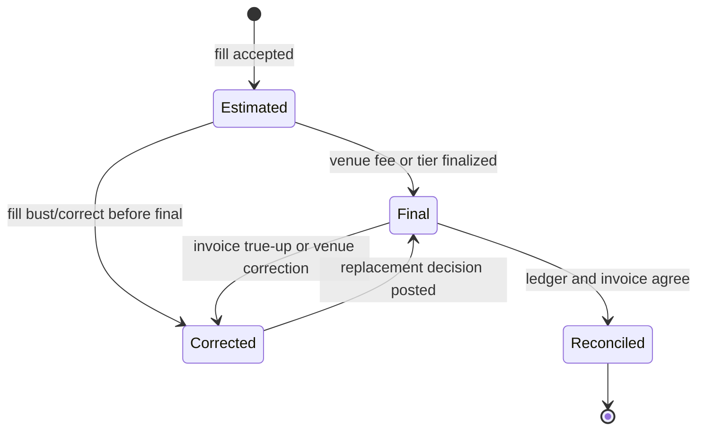
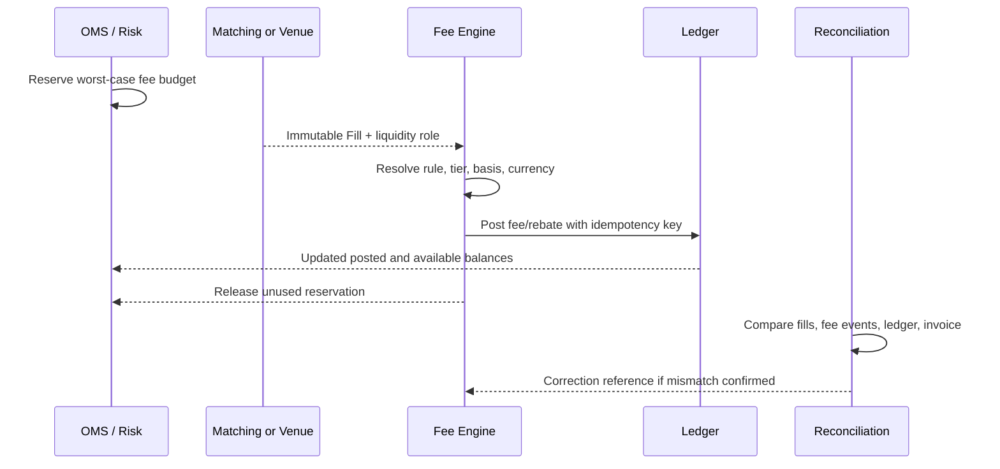

“成交额乘一个费率”只描述了最简单的一行算术，没有描述生产系统真正要裁决的事实：一张订单的不同 Fill 可以分别是 maker 和 taker；客户档位可能在日中变化；现货、线性合约、反向合约和期权的费用基数与币种不同；返佣可以让费率为负；交易所月末账单还可能对历史成交做更正。

本文的中心论点是：**费用不是订单上的静态属性，而是以 Fill 为输入、以版本化规则作裁决、以账本和外部账单作证据的经济事件。** 只有把预估、最终费用、返佣、入账和对账分开，系统才可能在重放时得到相同结果。

本文是交易系统学习路径的 Chapter 16。上一章 [永续合约资金费率](/signal-grid-blog/posts/perpetual-funding-rate/) 处理多空之间的周期现金流；本文讨论由 venue、产品、客户与流动性角色共同决定的交易费用。下一章 [交易账本与双重记账](/signal-grid-blog/posts/trading-ledger-double-entry-accounting-and-reconciliation/) 再把这些费用与返佣变成可冲正、可追溯的分录。

> 本文讨论费用系统的一般工程模型，不构成商业、会计、税务或交易建议。费率、档位、币种、监管征费、返佣条件与生效时间均以目标 venue、法律实体和客户合同的当期规则为准；Nasdaq、SEC、Coinbase、Kraken 与 OKX 仅作为 venue-specific 证据，不是跨市场统一公式。

## Maker/Taker 角色要由每笔 Fill 裁决

Maker/Taker 描述成交发生时哪一侧提供了订单簿流动性，不是“限价单/市价单”的别名。一个可立即成交的 Limit Order 仍可能是 taker；一张没有 `post-only` 约束的订单可以先主动成交一部分，剩余数量挂入订单簿，之后又以 maker 身份成交。

因此费用引擎的最小输入不是 Order，而是不可变的 Fill：

```text
FeeInput {
  fillId, tradeId, venueId, legalEntityId,
  accountId, instrumentId, productVersion,
  orderId, liquidityRole, side,
  fillPriceAtoms, fillQuantityAtoms,
  matchSequence, executedAt
}
```

`liquidityRole` 应来自撮合或 venue execution report 的权威字段，而不是 OMS 根据订单类型重新猜测。Coinbase 的当前交易规则明确允许同一订单一部分按 taker、另一部分按 maker 计费；Nasdaq 则用 execution liquidity code 区分 add、remove、route 与不同激励。二者都说明，费用角色附着在**执行结果**上。

Fill 本身也不能被费用计算反向修改。成交数量与价格是市场事实；费用是由该事实派生的独立经济事件。若费用服务暂时不可用，应保留待裁决状态或最保守的资金预占，而不是把已经发生的 Fill 改成失败。

## 费率是多维规则决议，不是一张二维表

常见费率表只展示“30 日成交量档位 × maker/taker”，生产决议却往往还依赖：

| 规则维度         | 例子                                   | 必须冻结的事实                           |
| ---------------- | -------------------------------------- | ---------------------------------------- |
| Venue 与法律实体 | 同一品牌不同地区、交易所或经纪商       | `venueId`、`legalEntityId`、适用规则版本 |
| 产品             | 现货、期货、期权、特定交易对或产品组   | `instrumentId`、`productGroupVersion`    |
| 客户             | 普通/VIP、会员类别、做市计划、合同折扣 | `accountFeeProfileVersion`               |
| 流动性角色       | maker、taker、auction、route、block    | execution liquidity code                 |
| 时间             | 生效区间、业务日、月度或滚动窗口       | `executedAt` 与 fee calendar             |
| 监管和税费       | 卖方征费、司法辖区附加费               | 法律实体、方向、费种版本                 |

一个可解释的决议应返回规则轨迹，而不只是最终数值：

```text
FeeDecision {
  feeDecisionId, decisionVersion, scopedFillKey,
  feeRuleVersion, tierSnapshotId,
  matchedRuleIds[], liquidityRole,
  feeType, payer, beneficiary, chargeScope,
  basisType, basisAmount, rate,
  feeCurrency, roundingRuleId,
  estimatedAmount, decisionStatus
}
```

规则优先级必须确定，例如“监管费 → venue 产品规则 → 客户合同覆盖 → 活动优惠”，并拒绝同一优先级的冲突命中。不要依赖配置文件排列顺序制造隐含优先级；同一输入在重启和历史重放后必须选择同一组规则。

## Notional、币种与舍入决定费用金额

只有先确定 `basisType`，费率才有意义。不同产品的常见候选基数如下，表中公式只是模型分类，不是任何 venue 的通用计费合同。

| 产品          | 可能的费用基数                                           | 主要歧义                           |
| ------------- | -------------------------------------------------------- | ---------------------------------- |
| 现货          | `baseQuantity × fillPrice` 的 quote notional，或成交数量 | 买卖侧是否用不同币种扣费           |
| 线性期货/永续 | `contracts × multiplier × fillPrice`                     | multiplier 是基础资产还是其他单位  |
| 反向合约      | 固定 quote contract value，再换算为结算币                | 换算价格与舍入顺序                 |
| 期权          | Premium notional、底层 notional 或每张固定费用           | 是否有 premium cap、最低费与行权费 |
| 股票          | 每股固定费用或美元成交额                                 | 低价股、route 与监管征费分支       |

费用计算应在整数原子或确定精度的十进制域中完成：

```text
rawFee = signedRate × feeBasis
postedFee = roundToQuantum(rawFee, feeQuantum, roundingMode)
```

需要明确 `rate` 是比例、基点、每股金额还是每张金额；`feeBasis` 的币种和量纲必须能与之相乘。`feeQuantum` 是合同允许的最小费用增量，它可以来自费用币种的记账精度，也可以是 venue 另行规定的最小单位；因此不能只拿通用币种小数位数代替合同规则。若费用币种不同，还要冻结汇率 ID、价格时间与换算顺序。

逐 Fill 舍入与先聚合后舍入不会总得到相同结果：

```text
Σ round(fillFee) ≠ round(Σ fillFee)
```

所以 `roundingScope` 必须属于规则：per fill、per order、per day 或 invoice period。账本不能为了“看起来对齐”在末尾随意补一分钱；差额必须落到明确的 rounding adjustment 事件并能追溯到规则。

## 分层费率使预估与最终费用必须分开

交易量档位常依赖过去 30 日成交量、自然月 ADV、资产余额、会员资格或特定产品贡献。Kraken、Coinbase 和 OKX 的公开规则都提供按历史活动分层的案例，Nasdaq 的部分奖励还依赖会员占 consolidated volume 的比例。这些阈值在结算周期结束前可能尚未最终确定。

系统要先回答四个问题：

1. 窗口按 `executedAt`、trade date 还是 settlement date 归属；
2. 统计 gross volume 还是扣除 bust/correct 后的 eligible volume；
3. 跨账户、子账户、产品和法律实体如何聚合；
4. 档位在成交前固定、每日重算，还是期末回溯确定。

如果 venue 在 Fill 时就返回最终费用，内部系统应把该外部 fee event 作为权威结果，内部计算只是校验。如果合同规定期末 true-up，则成交时只能记 `estimatedFee` 或 accrual，周期关闭后再发布 `finalFee` 与差额调整。用一个字段 `fee` 同时承载两者，会让账户余额、PnL 与客户账单在周期中无从解释。



状态迁移只能追加版本。期末档位变化不应覆盖成交时给用户展示过的预估，而应保存从预估到最终值的差异原因。

## 负费率是返佣，应保留独立经济语义

当 maker rate 为负时，数学上的 `rawFee < 0` 表示 venue 向参与者支付返佣，而不是一笔“负数手续费”可以在所有下游随意取反。账本和报表最好分别使用：

- `TRADING_FEE_EXPENSE`：客户或会员应付费用；
- `LIQUIDITY_REBATE_INCOME`：提供流动性获得的返佣；
- `AFFILIATE_COMMISSION`：渠道或推荐计划分成；
- `REGULATORY_ASSESSMENT`：依法传递的外部征费；
- `FEE_ADJUSTMENT`：经确认的更正或周期 true-up。

这样可以避免把 maker rebate、经纪商折扣和 affiliate kickback 混成一个净数。Kraken 与 OKX 当前公开费率都能看到某些高档位或产品的负 maker rate；Nasdaq 的 add-liquidity rebate 则经常以每股 credit 表示。案例说明“返佣存在”，不代表资格、费率或预算跨 venue 相同。

返佣还可能受月度上限、做市义务、最小报价时间、关联账户或异常交易审查约束。引擎应先计算 `earned`，再由计划规则决定 `eligible` 与 `payable`。自成交或被 bust 的成交若不符合资格，要用引用原始 rebate event 的冲正处理，不能静默删掉收入。

## 从资金预占到最终入账是一条反馈链

订单准入时，系统通常还不知道最终 maker/taker 比例，也不知道会成交多少。若费用会影响可用余额，Risk/OMS 应按规则预占一个保守上界；每笔 Fill 到达后，费用引擎结算实际金额并释放未使用预占。



关键幂等关系可以写成：

```text
scopedFillKey = (venueId, environment, fillIdNamespace, fillId)
feeEconomicKey = (scopedFillKey, feeType, payer, beneficiary, chargeScope)
feeDecisionKey = (feeEconomicKey, decisionVersion)
```

`fillId` 只在它的 venue、环境和号码域内有意义；`chargeScope` 则区分每 Fill 费用、订单级费用、日终费用等经济事实。同一个经济键只能有一个当前有效的 decision 版本；`feeRuleVersion` 属于该版本的计算证据，而不能成为允许同一 Fill 再扣一遍的身份维度。规则或账单更正应以新 decision supersede 旧版本，不能创建第二个并行经济键。数据库超时后，调用方查询该经济键，而不是生成新的随机 ID 再扣一次。订单撤销只释放未成交部分的预占，不能冲回已成交 Fill 的最终费用。

对于外部 venue，内部“已计算”也不等于外部“已收取”。应分别保存 `calculated`、`posted internally`、`reported by venue` 和 `invoiced/settled`，以便在结果未知时继续对账而不是伪造最终态。

## 规则版本与生效时间是历史重放的边界

费率变更可以发生在日中，venue 还可能提前公告未来生效版本。一个安全的规则记录至少包含：

```text
FeeRuleVersion {
  versionId, venueId, legalEntityId,
  productSelector, customerSelector,
  liquidityRole, basisDefinition,
  rateOrTierTable, feeCurrencyRule,
  roundingRule, validFrom, validTo,
  publishedAt, sourceDocumentId
}
```

选择规则用 `executedAt` 与业务日历，不用“当前时间”；系统延迟收到昨天的 Fill 时，仍应命中昨天有效的版本。规则文件可以晚到，但不能无证据地追溯覆盖已经 final 的费用。确有 venue correction 时，发布引用旧 decision 的 replacement，并保存权威通知。

必须持续成立的恢复不变量是：

- 同一 scoped Fill、费种、付款方、受益人和 charge scope 最多有一个当前有效的费用版本，规则更正只能替代它；
- 费用更正不修改 Fill 的价格、数量或 maker/taker 事实；
- 任何 posted amount 都可追到 fee basis、rate、币种、舍入和规则来源；
- 规则重放使用历史 tier snapshot，不用今天的客户等级；
- 冲正与替代的净额等于当前 final fee，历史版本仍可审计；
- 订单预占总额始终不小于未最终裁决 Fill 与剩余订单所需的规则上界。

这些不变量比“重新跑一遍数字一样”更强，因为它们还证明了结果为何一样，以及不一样时是哪一个外部更正改变了事实。

## 四方对账把费用变成可证明的最终事实

费用闭环至少比较四个来源：撮合 Fill、venue fee report、内部账本 posting、周期 invoice/settlement。只对“内部计算值”和“账本值”做自洽检查，无法发现 venue 使用了另一档位或另一个舍入范围。

| 差异类型             | 诊断证据                                | 合法修复                             |
| -------------------- | --------------------------------------- | ------------------------------------ |
| 缺少 fee event       | Fill 存在，venue report/ledger 不存在   | 按原经济键补算或向 venue 查询        |
| 重复扣费             | 同一经济键有多个有效 posting            | 冲正重复版本，保留来源               |
| Tier 不同            | 内部 tier snapshot 与 invoice tier 不同 | 确认窗口和资格，发布 true-up         |
| 币种或换算不同       | amount 接近但 currency/FX ID 不同       | 使用权威 fee currency 与 FX 版本更正 |
| 舍入尾差             | 逐 Fill 合计与 invoice 聚合差异         | 按合同 rounding scope 记调整项       |
| Fill 被 bust/correct | invoice 引用新 trade version            | 冲正旧费用并对替代 Fill 重算         |

SEC Section 31 费率公告还展示了另一类版本风险：监管征费可以在财政年度内按明确生效日变化。它不应塞进“venue taker fee”里；单独建模费种、方向与生效版本，才能解释为何两个相邻交易日的相同成交产生不同总费用。

这套引擎保证的是：给定 Fill、客户档位、产品、venue 与规则版本，可以重建同一笔可解释费用，并让更正最终收敛到账本和外部账单。它不保证预估等于期末发票，不保证 maker 永远比 taker 便宜，也不保证内部计算能替代 venue 或监管机构的最终裁决。

### 官方参考

- [Coinbase Exchange Trading Rules](https://www.coinbase.com/legal/trading_rules)——maker/taker 按成交部分应用、不同订单簿费率与历史交易量折扣的 venue-specific 规则。
- [Nasdaq：Trading Price List](https://www.nasdaqtrader.com/Trader.aspx?id=PriceListTrading2)——add/remove liquidity、liquidity code、按 ADV/TCV 分层及 route 费用的一手价目表。
- [Kraken：Fee Schedule](https://www.kraken.com/features/fee-schedule)——滚动交易量档位、产品隔离与负 maker rate 示例。
- [OKX：Trading Fee Rules FAQ](https://www.okx.com/en-sg/help/trading-fee-rules-faq)——maker/taker 判定、现货/期货/期权费用基数和币种差异。
- [OKX：Fee Details](https://www.okx.com/en-gb/help/fee-details)——主子账户聚合、产品类别与动态客户档位的 venue-specific 规则。
- [SEC：Section 31 Transaction Fee Rate Advisory for FY 2026](https://www.sec.gov/rules-regulations/fee-rate-advisories/2026-2)——监管交易费率及精确生效日会发生版本变化的官方证据。
