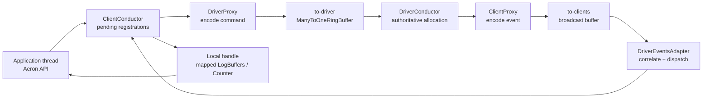
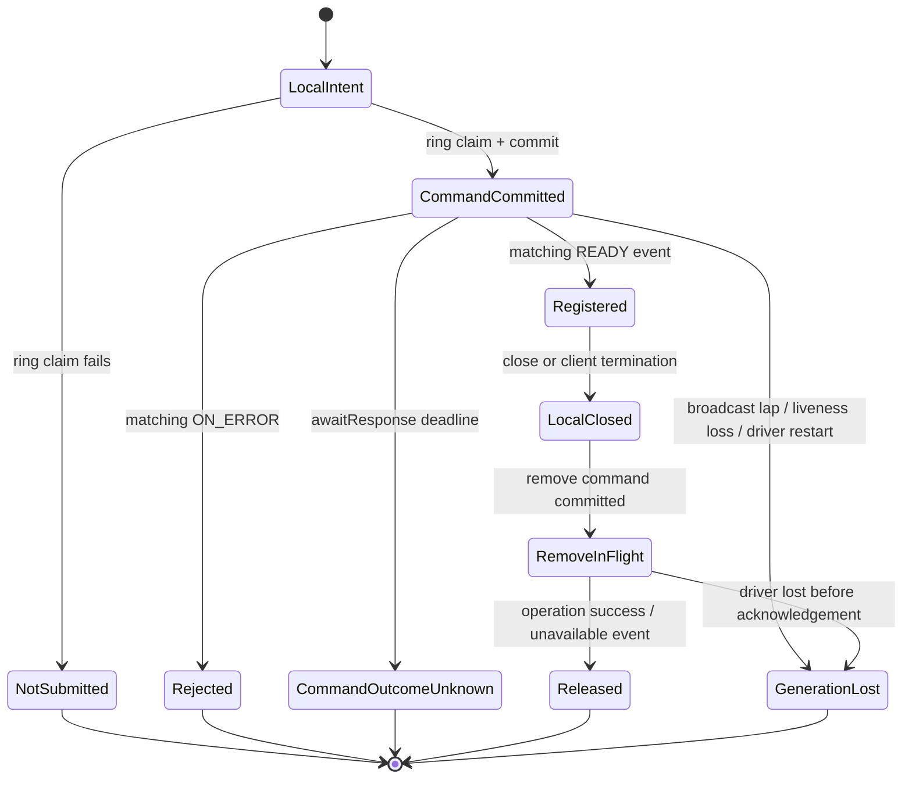

`aeron.addPublication(...)` 返回一个 Java 对象，很容易让人以为它只是在当前进程构造了一个发送器。实际上，可共享的 Publication、Subscription、Counter、端点和 Log Buffer 都受 Media Driver 管理；Java Client 只能先通过 `cnc.dat` 提交带 `correlationId` 的命令，等 Driver 发布完成事件后，再把共享内存和映射文件组装成本地 handle。

本文的中心结论是：**Aeron Client 控制面是一条绑定 Driver 实例代际的异步资源注册协议；它的正确性不来自某个 API 已返回，而来自命令与回复的相关、资源所有权的闭合，以及控制事件序列失真、存活超时或重启后不再使用旧代 handle。** 单笔 `awaitResponse` 截止只会让该命令结果变成未知，不能单凭它断言整个 Driver 代际已经消失。Counters 可以观测这条协议，却不是业务提交日志。

本文固定在 **Aeron 1.52.2 Java Client/Java Media Driver 与其使用的 Agrona 2.5.0**。C Media Driver 遵循同一类 CnC 边界，但内部实现与错误路径仍应以同版本 C 源码为准；本文不把 Java 内部类当成跨语言规范。这是 Aeron 学习路径的 Chapter 24，承接 [Cluster 故障实验室](/signal-grid-blog/posts/aeron-cluster-failure-lab-snapshot-election-backup-recovery/) 对代际、超时和恢复证据的验收；下一章 [Recording Position 与业务时间线](/signal-grid-blog/posts/aeron-recording-position-business-timeline-index-checkpoint-range-replay-rebuild/) 会把这条控制面生命周期接到可重放的业务位置。

## 控制面必须异步，因为 Driver 才能裁决共享资源

一个客户端线程无法独立决定某个 channel/stream 是否已有可共享 Publication，某个 session id 是否冲突，端点是否已绑定，或者 Counter 槽位是否可用。这些事实横跨多个客户端甚至多个进程，只有 Driver Conductor 能按统一顺序裁决。

1.52.2 的 Java 路径可简化为：



`DriverProxy` 先从 to-driver ring buffer 取一个 `correlationId`，`tryClaim` 成功后编码并 commit 命令。如果 ring buffer 没有空间，它会在命令尚未 commit 时立即抛错，而不是往无界队列里继续堆积。Driver Conductor 解析命令、进行冲突检查、创建或共享底层资源，然后通过 Driver 广播发回 ready、success 或 error 事件。

所谓“同步注册”并没有改变这条协议。`addPublication` 只是在提交命令后，让 `ClientConductor.awaitResponse` 持续 service Driver 事件，直到匹配的 correlation 完成或 response deadline 到期。`asyncAddPublication` 则把中间状态暴露给调用方。因此同步 API 是异步协议的等待包装，不是另一条本地快捷路径。

## `cnc.dat` 的 ready、版本与心跳共同界定可连接的 Driver

CnC 文件存在不等于 Driver 可用。Driver 启动时会先创建并映射文件，填充各区长度、client liveness timeout、启动时间、PID 与 page size，初始化 counters 和依赖组件，设置 to-driver consumer heartbeat，最后才以 volatile write 将 CnC version 从 `0` 发布为 `0.2.0`。这个 version write 是 ready publication point，不是普通配置字段。

1.52.2 的 `cnc.dat` 按以下顺序容纳六个区域：

| 区域                  | 作用                                               | 不能推导的事实                                |
| --------------------- | -------------------------------------------------- | --------------------------------------------- |
| Metadata              | layout version、各区长度、timeout、start time、PID | 当前命令已完成，或业务连接已建立              |
| To-driver ring buffer | 多客户端向 Driver 提交控制命令                     | 无界排队或命令持久化                          |
| To-clients broadcast  | Driver 广播 ready、error、Image 和 Counter 事件    | 可任意慢读的持久日志                          |
| Counters metadata     | record state、type id、key、label、回收时限        | Counter value 是业务权威事实                  |
| Counters values       | value、registration id、owner id、reference id     | 多个 Counter 属于同一事务快照                 |
| Distinct error log    | 聚合 Driver 内部错误观测                           | 某个 correlation 的注册结果，或可回放的错误流 |

客户端 attach 时会等待文件至少容纳 metadata，再等 version 非零，检查声明的各区总长度没有超出真实文件，并等待 to-driver ring buffer 中 Driver consumer heartbeat 非零且未超过 `driverTimeoutMs`。所以“文件在”、“version 对”与“Driver 活着”是三个必须组合的条件。

版本边界也必须说精确。`CncFileDescriptor.checkVersion` 比较 CnC major；1.52.2 的 attach 路径还会拒绝同 major 但 minor 低于当前 Client 的文件。这只说明 CnC layout 可读，不说明所有控制命令都可用。`ClientConductor` 另外读取 control protocol version system counter，1.52.2 只用它为 `nextSessionId` 等具体能力选择路径。不能由“CnC major 相同”泛化出完整的混合版本支持。

最后，Publication 和 Image 的 term Log Buffer 是 Driver 目录中另外的映射文件，Driver 会在 ready/Image 事件中传回文件名；它们不在 CnC buffers 里。CnC 更不是 Archive，Driver 退出后不能靠它恢复业务消息历史。

## `correlationId` 把一次 API 调用变成可判定的注册状态机

`correlationId` 由共享 to-driver ring buffer 分配，用于在同一 Driver 实例下把命令和回复对齐。它是控制协议的消息身份，不是一个永久的业务 ID，也不应脱离 Driver 代际被存储和比较。

一次注册的主要状态是：



这四种失败不能合并。`NotSubmitted` 的 command record 没有 commit，可以在另一个 correlation 下重新声明资源。单笔同步调用超过 `awaitResponse` deadline 时，1.52.2 只抛 `DriverTimeoutException`，并不会因此自动把 `ClientConductor` 标为 terminating；Driver heartbeat 仍可能健康，且原命令可能已经生效，只是匹配回复没有在期限内到达，所以这是 `CommandOutcomeUnknown`，不是“已证明 Driver 重启”。若应用没有该资源的独立查询 / 撤销协议，安全收敛策略是停止暴露这笔声明、关闭并重建当前 `Aeron` Client，而不是携带旧 correlation 盲重试。

`GenerationLost` 则表示 Client 已失去完整控制事件序列，或 Driver liveness / ClientConductor service 已失败；1.52.2 会终止 conductor 并强制关闭本地资源。Aeron 不会自动 remap 新 CnC 或自动重建注册。Driver 代际消失后，新 Driver 也不会继承旧资源；应用必须废弃旧 correlation 与 handles，在新 Client 代际重新声明期望状态。

不同字段又位于不同身份域：

| 身份                         | 作用域与含义                                                                           |
| ---------------------------- | -------------------------------------------------------------------------------------- |
| `clientId`                   | 当前 Driver 为一个 Aeron Client 分配的所有者 ID                                        |
| command `correlationId`      | 一条控制命令与 ready/error/success 回复的相关身份                                      |
| Publication `registrationId` | 当前 Client 对 Publication 的兴趣注册                                                  |
| `originalRegistrationId`     | 底层共享 Publication 最初创建时的注册；非原始 ConcurrentPublication 可与自己的 ID 不同 |
| Image `correlationId`        | Driver 创建的 Image/发送源实例身份，还需与 Subscription registration 一起解释          |
| Counter `counterId`          | CnC 中可回收的物理槽位号，不是经济或业务身份                                           |
| Counter `registrationId`     | 资源关联 ID；dynamic counter 等于创建 correlation，static 时由用户在 type scope 指定   |

同步 API 会在内部跑这个状态机。对需要在自己事件循环中管理延迟的应用，1.52.2 的异步 API 可以让这个边界变得显式：

```java
static ConcurrentPublication awaitPublication(
    Aeron aeron, String channel, int streamId, IdleStrategy idle)
{
    final long registrationId = aeron.asyncAddPublication(channel, streamId);
    idle.reset();

    while (true)
    {
        // pending 时返回 null；Driver 拒绝时抛 RegistrationException。
        final ConcurrentPublication publication = aeron.getPublication(registrationId);
        if (null != publication)
        {
            return publication;
        }

        idle.idle();
    }
}
```

`isCommandActive(id) == false` 只能说命令已不在 active set，不能单独证明成功；异步 error 会被按 registration id 保存，随后由 `getPublication/getSubscription/getCounter` 抛出。上面的等待循环还应有应用 deadline：`getPublication` 没有把“Driver heartbeat 健康但这笔 ready 永远未到”自动裁决为注册失败。超时后的策略必须按 `CommandOutcomeUnknown` 处理。

此外，available image/counter 等回调正在 ClientConductor 上下文中运行，1.52.2 会拒绝在这些回调内重入注册或关闭 API。回调应捕获事实并移交给自己的队列，不应在里面做阻塞 I/O 或嵌套控制操作。

## Driver 广播完成的是注册，不是端到端业务就绪

Driver 不是只回一个布尔值。`ON_PUBLICATION_READY` 携带 command correlation、底层 publication registration、session/stream、publisher limit counter、channel status counter 和 log file name。ClientConductor 只有收到该事件后才映射 Log Buffers、绑定 counter 并构造 `ConcurrentPublication` 或 `ExclusivePublication`。

Subscription 的两段式生命周期更能说明边界：`ON_SUBSCRIPTION_READY` 只表示 Driver 已登记该 interest 并返回 channel status counter。某个匹配发送源实际出现后，Driver 才另行发布 `ON_AVAILABLE_IMAGE`，携带 Image correlation、subscriber position counter、log file 和 source identity；离开时再发 `ON_UNAVAILABLE_IMAGE`。

各种事件的证明力不同：

| 事件/观测                   | 能证明                                                   | 不能证明                                         |
| --------------------------- | -------------------------------------------------------- | ------------------------------------------------ |
| `ON_PUBLICATION_READY`      | Driver 接受注册，Client 可映射对应 Log Buffer            | 已有 subscriber、某条消息已发出或被处理          |
| `Publication.isConnected()` | 该 Publication 最近观测到 active subscriber              | 下一次 `offer` 必成功，或远端应用已消费          |
| `ON_SUBSCRIPTION_READY`     | Driver 已登记 channel/stream interest                    | 已有 Image，已收到数据，或从历史起点开始         |
| `ON_AVAILABLE_IMAGE`        | 某个匹配发送源的 Image、位置 counter 与 log mapping 可用 | 应用已追上，消息无缺口，或每条消息已产生业务效果 |
| `ON_COUNTER_READY`          | Counter record 已分配并可按元数据解码                    | Counter value 是持久状态或权威业务结论           |
| `ON_OPERATION_SUCCESS`      | Driver 已处理相关 remove/destination 等控制命令          | 远端网络或业务副作用已完成                       |

Driver 回复使用 Agrona broadcast buffer，它不为每个 Client 保留一份持久副本。慢 Client 可被 transmitter 套圈并丢失事件；Java Client 使用 `CopyBroadcastReceiver` 在复制前后检测覆盖，发现 `unable to keep up with broadcast` 后会把 DriverEventsAdapter 标记为 invalid，终止当前 ClientConductor 并关闭 handle。这不是“丢了一个监控点”，而是当前控制序列已无法证明完整，必须放弃这一代 Client。

`ON_ERROR` 也必须和 Distinct Error Log 分开。前者携带 offending command correlation，能裁决同步或异步注册；后者用于聚合 Driver 内部异常。Channel endpoint error 和 publication error frame 还会走各自的异步 handler。只查 ErrorStat，或只看某个 registration 不再 active，都不足以还原一笔命令的结果。

## Counter 的身份是一组元数据，它的数值只是观测

CnC 中的 Counter 由一条 metadata record 和一条 values record 组成。metadata 包含 `recordState/typeId/freeForReuseDeadline/key/label`，values 包含 `value/registrationId/ownerId/referenceId`。这些字段不是冗余装饰，而是为了防止把同一物理槽位的不同生命当成同一对象。

Counter 的身份应按下列分工理解：

| 字段             | 正确用途                                                                                         |
| ---------------- | ------------------------------------------------------------------------------------------------ |
| `counterId`      | 定位 CnC 槽位；槽位可从 `ALLOCATED` 进入 `RECLAIMED`，等 reuse deadline 后再分配                 |
| `typeId`         | 定义 key/value 的语义 schema；Aeron Java API 建议应用自定义类型使用 `1000+`，避开 Aeron 保留空间 |
| `key`            | 给机器解码的稳定身份维度，例如 session/stream/channel identity 或业务定义的键                    |
| `label`          | 给人阅读的诊断文本；可追加、截断或随版本改进，不应作唯一键                                       |
| `registrationId` | 关联 Counter 与注册 / 资源；可帮助识别复用，但不是每次 allocation 都唯一的通用 generation        |
| `ownerId`        | 把 Counter 绑定到生命周期所有者；普通 Client Counter 的 owner 是 `clientId`                      |
| `referenceId`    | 把位置/status Counter 关联到 Publication、Subscription 或 Image 等外部资源身份                   |

Agrona 2.5.0 中 `CountersManager.free` 先把 record 发布为 `RECLAIMED`，设置 free-for-reuse deadline，等超时后才可复用 `counterId`。Aeron 1.52.2 Driver 的默认回收等待为 1 秒，但这只缩小过早复用窗口，没有把槽位号变成永久身份。`registrationId` 也不是通用 allocation generation：同一 Subscription 先后连接两个 Images 时，两个 subscriber-position Counters 可以拥有相同 type、subscription registration 与 `ownerId`，而由 `referenceId=Image correlationId` 和 type-specific key 区分。采集器要在读取前后重复校验完整的预期 identity tuple：

```java
record ExpectedCounter(
    int typeId,
    long registrationId,
    long ownerId,
    long referenceId,
    byte[] encodedKey) {}

static OptionalLong readSameIdentity(
    CountersReader counters,
    int counterId,
    ExpectedCounter expected)
{
    if (!sameIdentity(counters, counterId, expected))
    {
        return OptionalLong.empty();
    }

    final long value = counters.getCounterValue(counterId);

    return sameIdentity(counters, counterId, expected) ?
        OptionalLong.of(value) : OptionalLong.empty();
}

static boolean sameIdentity(
    CountersReader counters,
    int counterId,
    ExpectedCounter expected)
{
    return CountersReader.RECORD_ALLOCATED == counters.getCounterState(counterId) &&
        expected.typeId() == counters.getCounterTypeId(counterId) &&
        expected.registrationId() == counters.getCounterRegistrationId(counterId) &&
        expected.ownerId() == counters.getCounterOwnerId(counterId) &&
        expected.referenceId() == counters.getCounterReferenceId(counterId) &&
        keyMatches(counters, counterId, expected.encodedKey());
}

// expectedKey 必须是该 type schema 规定长度的规范编码，不是 label 文本。
static boolean keyMatches(CountersReader counters, int counterId, byte[] expectedKey)
{
    if (expectedKey.length > CountersReader.MAX_KEY_LENGTH)
    {
        return false;
    }

    final DirectBuffer metadata = counters.metaDataBuffer();
    final int offset = CountersReader.metaDataOffset(counterId) + CountersReader.KEY_OFFSET;
    for (int i = 0; i < expectedKey.length; i++)
    {
        if (metadata.getByte(offset + i) != expectedKey[i])
        {
            return false;
        }
    }

    return true;
}
```

这段代码只是拒绝已知身份变化的 best-effort 双读，不是 Agrona 提供的 seqlock，也不能在 identity tuple 被原样复用时给出绝对 ABA 保证；调用方仍必须在外层绑定 Driver incarnation，并保证 `encodedKey` 来自该 `typeId` 的固定 schema。它不会把多个 Counter 读取变成原子事务快照，也不能证明该 value 代表的业务事实已持久。例如 subscriber position 说明 Client 把 Image 消费到哪个字节位置，不说明该位置前的业务状态已提交到数据库。

普通 `addCounter` 创建的 Counter 属于当前 Client：Driver 把 `ownerId` 设为 `clientId`，建立 `CounterLink`，Client 关闭或超时后发布 unavailable 并回收。`addStaticCounter` 则以 `(typeId, user registrationId)` 查找或创建 owner 为 `NULL_VALUE` 的 Counter；若已命中 static Counter，1.52.2 会直接返回已有 `counterId`，不会比较或更新本次请求携带的 key / label。因此，把 key 当身份契约的应用必须在返回后自行按 type schema 校验 metadata，不能把“add 成功”理解成 Driver 接受了新 key / label。关闭本地 static `Counter` handle 不会释放 CnC 槽位。但“static”只是脱离某个 Aeron Client 生命，它仍位于当前 Driver 的 CnC 中，不是跨 Media Driver 重启的磁盘状态。

## Publication、Subscription 与 Image 的 close 是所有权退出，不是立即删除全部底层资源

Aeron 将“本地 Java handle”、“Client 在 Driver 中的 interest link”和“可共享的底层 resource”分成三层。不先分层，就会把 `close()` 错解为“立刻删掉文件和端点”，或者因为底层资源仍在 linger 而继续使用已关闭 handle。

| 资源                   | 所有权与共享关系                                                                          | close/unavailable 后的路径                                                                                       |
| ---------------------- | ----------------------------------------------------------------------------------------- | ---------------------------------------------------------------------------------------------------------------- |
| `Aeron` Client         | 拥有 ClientConductor、CnC mapping 与本 Client 创建的 handles                              | 终止 conductor，强制关闭本地资源，尝试发 `CLIENT_CLOSE`，然后解除 Context/CnC 映射                               |
| Concurrent Publication | 每次 add 形成自己的 registration link；匹配现有发布时可共享底层 Publication 和 Log Buffer | 本地 handle 先 closed，remove command 异步删除该 link；Driver 引用计数归零后底层 Publication 才进入结束路径      |
| Exclusive Publication  | 专属 session/Log Buffer，`correlationId == originalRegistrationId` 是 1.52.2 客户端检查   | 关闭自己的唯一 link；仍要经过 Driver 清理与 Log Buffer 安全退出                                                  |
| Subscription           | 拥有一个 registration，并在本地维护当前 Images 快照                                       | close 清空并关闭 Images、通知 unavailable handler，再异步移除 Driver interest                                    |
| Image                  | 由 Driver 事件创建，属于 Subscription；应用没有公开 `Image.close()` 所有权                | unavailable 或 Subscription close 冻结 final position/EOS/revoked 状态，释放 subscriber position 与 mapping 引用 |
| Dynamic Counter        | Client-owned，Driver 中有 CounterLink                                                     | `Counter.close()` 幂等地关闭本地 view 并异步请求 Driver 回收                                                     |
| Static Counter         | Driver-owned 槽位，多个 Client 可用 `(typeId, registrationId)` 重新取得                   | 关闭 handle 只移除本地 view，当前 Driver 生命内槽位仍存在                                                        |

客户端还会对映射的 `LogBuffers` 做引用计数。一个底层 registration 的最后本地引用释放后，mapping 不会在同一条调用栈上立即 unmap，而是进入 lingering list，等到截止时间后由 ClientConductor 关闭。这个窗口是为了让回调和并发读者退出共享内存，不是允许应用在 `isClosed == true` 后继续 offer/poll。

1.52.2 在显式关闭 Publication/Subscription 时对相关映射使用 1 秒本地 linger；普通 unavailable resource 走 Context 的 `resourceLingerDurationNs`，默认为 3 秒。这些是 1.52.2 实现值，不是业务等待时间，也不是关闭已被远端确认的证明。显式 `Publication.close()`、`Subscription.close()` 和 dynamic `Counter.close()` 会异步发 remove；static Counter 只关闭本地 view，不发 Driver remove。需要有序停机证据时，可在 Driver 仍健康的前提下等待 `aeron.hasActiveCommands()` 返回 false，但这仍只是已跟踪的 Driver 控制命令结束。若配置了 `useConductorAgentInvoker(true)`，调用方还必须持续 `invoke()` 推进 ClientConductor；`hasActiveCommands()` 本身不会 service Driver 广播，单独忙等可能永远没有进展。

## Client timeout 或 Driver 重启会废弃整个 handle 代际

Aeron 的存活检测是双向的，且两个方向观测的不是同一个值：

- ClientConductor 读取 to-driver ring buffer 的 consumer heartbeat，判断 Driver Conductor 是否仍在消费命令；
- Driver 为每个 `clientId` 分配 heartbeat timestamp Counter，ClientConductor 定期写入，Driver 用 CnC metadata 中的 client liveness timeout 判断 Client 是否已死；
- ClientConductor 自己还检查 duty cycle 间隔；如果超过从 CnC 读取的 inter-service timeout，它会把自己视为 zombie，关闭全部本地资源并抛 `ConductorServiceTimeoutException`。

1.52.2 的 Java Client 默认每 500 ms 进入一次 keepalive/liveness 路径，客户端和 Driver 默认 timeout 均是 10 s 量级。这些值可配置，但关系必须保持：keepalive interval 要显著小于 liveness/inter-service timeout，且最坏 GC pause、CPU 被抢占、阻塞 callback 和 invoker 调度间隔都必须落在预算内。如果显式使用 conductor `AgentInvoker`，调用方就是 duty cycle 的所有者，忘记 invoke 与线程卡死在协议上没有区别。

常见失败可以用下表区分：

| 触发条件                                         | 1.52.2 中的直接证据                                                            | 安全状态与恢复                                                                  |
| ------------------------------------------------ | ------------------------------------------------------------------------------ | ------------------------------------------------------------------------------- |
| CnC 存在但 version 仍为 `0`                      | attach 等待，超时报“created but not initialised”                               | 不读后续 buffers，等待该 Driver 完成启动或判定启动失败                          |
| CnC layout 足够但 Driver consumer heartbeat 过旧 | `DriverTimeoutException` 带 heartbeat age                                      | 拒绝 attach；先确认 Driver 实例，不对旧文件盲目发命令                           |
| to-driver ring claim 失败                        | `DriverProxy` 在 commit 前抛“failed to write ... command”                      | 该命令未提交；限制控制面突发并用新 correlation 有界重试                         |
| Driver 明确拒绝注册                              | 匹配 correlation 的 `ON_ERROR` / `RegistrationException`                       | 记录错误码和声明输入；不生成 handle，只在修正原因后重新注册                     |
| Driver heartbeat 尚新，但同步命令等待超时        | `awaitResponse` 抛 `DriverTimeoutException`，conductor 未自动 terminating      | 把该命令标为 `UNKNOWN`；停止使用该声明，按应用协议撤销 / 查询或关闭 Client 收敛 |
| Client 跟不上 Driver 广播                        | `unable to keep up with broadcast`，adapter invalid                            | 当前事件序列不完整；终止 Client、丢弃全部 handles，从新 Client 代际重建         |
| ClientConductor 长时间未 service                 | `ConductorServiceTimeoutException`，所有本地资源被强制关闭                     | 修正 GC/CPU/callback/invoker 调度；不使用还存在引用的旧 handles                 |
| Driver 判定 Client heartbeat 超时                | Client timeout system counter、`ON_CLIENT_TIMEOUT`、owned counters unavailable | Driver 回收该 Client 的 Publication/Subscription/Counter links；Client 整代作废 |
| Media Driver 在同一目录重启                      | start timestamp/PID 与 heartbeat 改变，旧 mapping 不再更新                     | 关闭旧 `Aeron`，等新 CnC ready，重新 connect 并重新声明所有期望资源             |

Media Driver 重启时，文件路径可不变，但旧 Client 持有的 mapping、clientId、registrationId、counterId 和 Log Buffer 都属于旧代。PID 与 CnC start timestamp 可用于建立诊断性 Driver fingerprint，但它们不是 Driver 颁发的持久 fencing token。稳妥恢复是关闭整个旧 `Aeron`，连接新 CnC，用新 correlation 重建 Publication、Subscription 和 dynamic Counters，并等待新 Images 出现。

这个过程不会自动找回断线期间的数据。新 live Subscription 从哪个 position 开始，是数据面与 Archive/replay 协议的问题；ClientConductor 只能重建兴趣和 handle，不能为业务时间线填补缺口。

## 可观测证据必须绑定代际，并停在它能证明的边界

一条可重放的控制面证据，不应只有“我调了 add”或一张 AeronStat 截图。它至少要把以下层次组织起来：

```text
DriverIncarnation {
  aeronDirectory, cncVersion, driverStartTimestampMs, driverPid
}

ClientCommand {
  driverIncarnation, clientId, correlationId,
  commandType, canonicalInput, submittedAt,
  completionType, errorCode, completedAt
}

ResourceBinding {
  driverIncarnation, clientId,
  registrationId, originalRegistrationId?,
  sessionId?, streamId?, channelStatusId?,
  imageCorrelationId?, counterIdentity?, logFileName?
}
```

`canonicalInput` 不是为了用日志重放 Driver 内部，而是为了证明某个 ready/error 究竟回应了什么声明。Channel 可能经解析、补默认值和名称解析，运维数据库应同时保留应用输入和 Driver/counter 暴露的 canonical identity，不要用 label 字符串反向当 parser。

对这条协议最有价值的证明义务是：

| 声称                         | 需要的证据                                                                                | 仍未被证明的事                                            |
| ---------------------------- | ----------------------------------------------------------------------------------------- | --------------------------------------------------------- |
| Client 连接到一个可用 Driver | CnC ready/version/length 通过，consumer heartbeat 在 timeout 内，incarnation 已记录       | UDP 路径可达、订阅者存在或业务服务可用                    |
| 一笔注册成功                 | 当前 Client/Driver 代际内相同 correlation 的 READY，handle 元数据可校验                   | 端到端传输、消费或持久化                                  |
| Counter 样本属于预期对象     | state/type/key/registration/owner/reference 符合当前分配，读前读后未变                    | 该值与其他 counters 是一致快照，或业务已提交              |
| 资源已有序关闭               | handle closed，remove correlation 不再 active，对应 unavailable/Driver 清理可观测         | 远端应用收到 EOS，或所有在途 UDP 包都已消失               |
| Driver 重启后 Client 恢复    | 新 incarnation 下的新 clientId/registrations、所有期望 handle ready、旧 handle 全部不可用 | 断线期间无数据缺口；这需要 recording position/replay 证据 |

故障测试应直接围绕上述声称：在 command commit 后、ready 前终止 Driver；让 ClientConductor 故意超过 inter-service timeout；用小 broadcast buffer 与停顿 Client 触发 lap；在 pending subscription/counter 时 close；重启 Driver 后检查旧 handles 全部关闭、新代身份全部重建。通过条件不是“最后又能发消息”，而是以下不变量同时成立：

```text
C1: READY 之前不向应用暴露可用 handle。
C2: 每个 command correlation 在当前 Client 代际只裁决一次。
C3: 任何 Counter value 都与当前 Driver 代际及完整 identity tuple 一起解释。
C4: Client 超时或 Driver 代际变化后，旧 handles 永不再进入业务路径。
C5: 新代控制资源 ready 不代替数据缺口、重放起点和业务副作用的单独验收。
```

## 控制面完成的是资源协商，不是业务提交

CnC ready 与 Driver heartbeat 决定 Client 能否进入某一 Driver 代际；correlationId 使一条异步命令可以被 ready 或 error 精确裁决；ClientConductor 再把 Driver 返回的 counters 和 Log Buffer 映射成本地 handle。这三步构成了注册协议，而不是 Java 对象构造的实现细节。

Counter 的 type/key/registration/owner/reference 防止槽位复用混淆对象，PublicationLink、Subscription 与 Image 的所有权则决定 close、引用计数和 linger 的次序。它们能证明资源属于谁、何时可用、何时已退出，但不能证明业务消息已持久或副作用已完成。

一旦 ClientConductor 丢失 Driver 广播、超过 duty-cycle timeout，或 Media Driver 更换代际，可证明的动作不是把旧 handle 指向新文件，而是废弃整个旧 Client，在新 CnC 下重新声明期望资源。控制面恢复到这里便已完成自己的责任；下一章将继续回答它留下的问题：新 Image 应从哪个 [Recording Position 和业务时间线](/signal-grid-blog/posts/aeron-recording-position-business-timeline-index-checkpoint-range-replay-rebuild/) 继续。

### 一手资料

- [Aeron 1.52.2 `CncFileDescriptor`](https://github.com/aeron-io/aeron/blob/1.52.2/aeron-client/src/main/java/io/aeron/CncFileDescriptor.java)——CnC layout、`0.2.0` version、ready volatile write 与长度校验。
- [Aeron 1.52.2 `Aeron`](https://github.com/aeron-io/aeron/blob/1.52.2/aeron-client/src/main/java/io/aeron/Aeron.java)——connect/attach、同步与异步 API、static counter、Conductor 配置和默认 linger 边界。
- [Aeron 1.52.2 `ClientConductor`](https://github.com/aeron-io/aeron/blob/1.52.2/aeron-client/src/main/java/io/aeron/ClientConductor.java)——pending resource maps、await response、callback、liveness、force close 与 LogBuffers 引用计数。
- [Aeron 1.52.2 `DriverProxy`](https://github.com/aeron-io/aeron/blob/1.52.2/aeron-client/src/main/java/io/aeron/DriverProxy.java) 与 [`DriverEventsAdapter`](https://github.com/aeron-io/aeron/blob/1.52.2/aeron-client/src/main/java/io/aeron/DriverEventsAdapter.java)——to-driver command claim/commit、Driver 广播相关与异步错误。
- [Aeron 1.52.2 `DriverConductor`](https://github.com/aeron-io/aeron/blob/1.52.2/aeron-driver/src/main/java/io/aeron/driver/DriverConductor.java)、[`AeronClient`](https://github.com/aeron-io/aeron/blob/1.52.2/aeron-driver/src/main/java/io/aeron/driver/AeronClient.java)、[`CounterLink`](https://github.com/aeron-io/aeron/blob/1.52.2/aeron-driver/src/main/java/io/aeron/driver/CounterLink.java) 与 [`StreamCounter`](https://github.com/aeron-io/aeron/blob/1.52.2/aeron-driver/src/main/java/io/aeron/driver/status/StreamCounter.java)——Driver 权威分配、client heartbeat、owner / reference / stream key 绑定与超时清理。
- [Aeron 1.52.2 `Publication`](https://github.com/aeron-io/aeron/blob/1.52.2/aeron-client/src/main/java/io/aeron/Publication.java)、[`Subscription`](https://github.com/aeron-io/aeron/blob/1.52.2/aeron-client/src/main/java/io/aeron/Subscription.java)、[`Image`](https://github.com/aeron-io/aeron/blob/1.52.2/aeron-client/src/main/java/io/aeron/Image.java) 与 [`Counter`](https://github.com/aeron-io/aeron/blob/1.52.2/aeron-client/src/main/java/io/aeron/Counter.java)——公开 handle 的身份、close 和所有权边界。
- [Agrona 2.5.0 `CountersReader`](https://github.com/aeron-io/agrona/blob/2.5.0/agrona/src/main/java/org/agrona/concurrent/status/CountersReader.java) 与 [`CountersManager`](https://github.com/aeron-io/agrona/blob/2.5.0/agrona/src/main/java/org/agrona/concurrent/status/CountersManager.java)——Counter record layout、state、registration/owner/reference 与槽位回收。
- [Aeron 1.52.2 Javadoc](https://javadoc.io/doc/io.aeron/aeron-client/1.52.2/index.html)——Client API 合同与公开生命周期边界。
- [Aeron 官方：Media Driver](https://aeron.io/docs/aeron/media-driver/)——Driver/Client Conductor 责任、Driver directory 与 CnC/Log Buffer 边界。
- [Aeron 官方：Client Concurrency Model](https://github.com/aeron-io/aeron/wiki/Client-Concurrency-Model)——多 Client、CnC command/broadcast 与双向心跳模型。
- [Aeron 官方：Monitoring and Debugging](https://github.com/aeron-io/aeron/wiki/Monitoring-and-Debugging)——AeronStat、system/stream counters 的观测用途。
