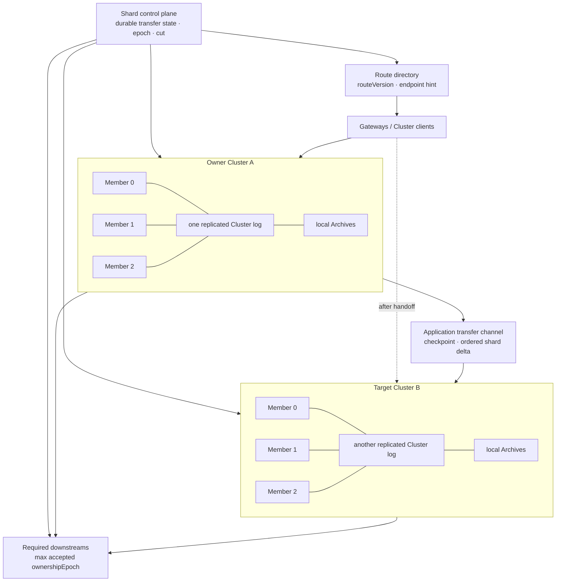
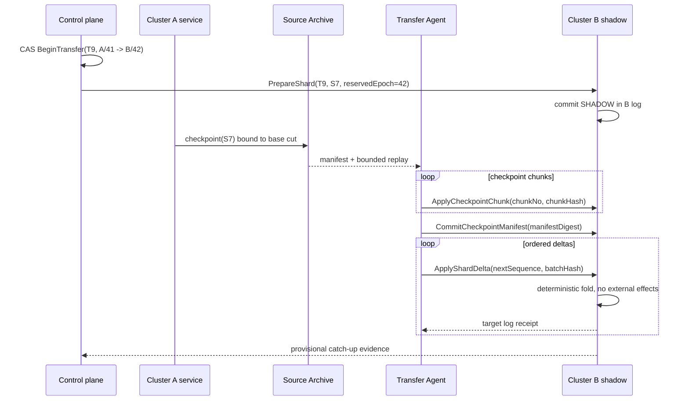
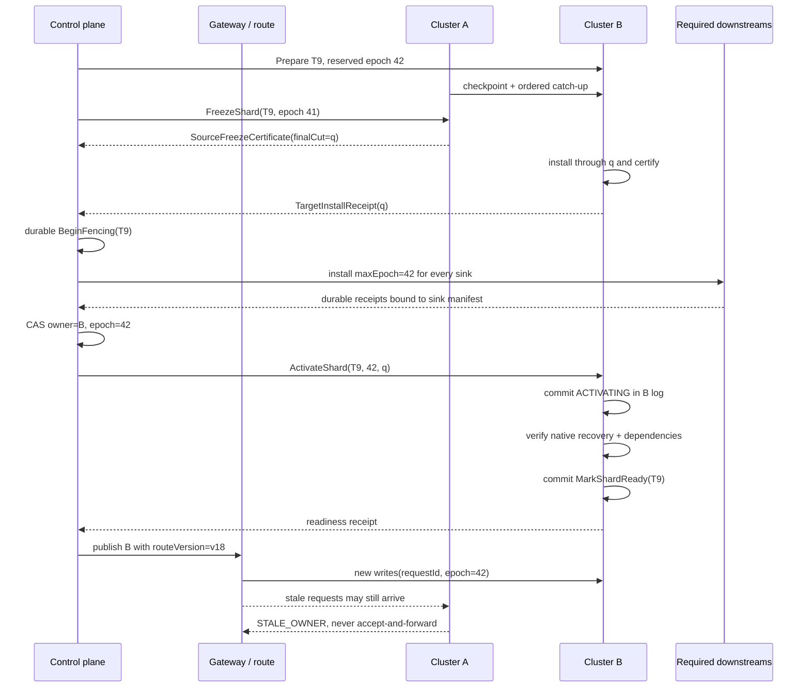

开始设计多 Cluster 迁移之前，必须先读 [Availability 路径的状态所有权迁移协议](/signal-grid-blog/posts/state-ownership-migration-shard-catchup-handoff-fencing/)。本文不是它的缩写版，而是把那篇文章定义的 shard identity、final cut、ownership epoch、downstream fence 与 rollback frontier，具体映射到 **Aeron 1.52.2** 的 Cluster log、Archive recording、Snapshot、Client 和 Gateway 边界。

如果方案仍能被概括成“把 Source 的 recording 复制到 Target，然后修改路由”，它还没有解决迁移。复制只能建立一份候选状态；路由只能提示请求应该发往哪里。真正必须转交的是某个 shard 的唯一写权，而且旧 Cluster 即使从长暂停、网络分区或旧 Snapshot 中复活，也必须无法再改变权威状态。

这是 Aeron 系统工程路径的 Chapter 26，也是本路径终章。前一章[从 Recording Position 到业务时间线](/signal-grid-blog/posts/aeron-recording-position-business-timeline-index-checkpoint-range-replay-rebuild/)解决“某段业务状态对应哪一段 recording、checkpoint 与 replay range”；本章在此之上回答“怎样把这个可重建前缀交给另一个独立 Cluster，并证明权威历史没有分叉”。

本文固定讨论两个彼此独立、各自拥有 Consensus Module、成员集合、Cluster log、Archive 与 Clustered Service 的 Aeron Cluster。Aeron Cluster 在一个复制组内提供日志排序、Quorum 提交、选举、成员 Catch-up 和恢复基础；Aeron Archive 可以记录、重放或复制流，Cluster Backup 可以复制某个 Cluster 的 log 与 snapshots 以支持冷灾备或重建成员。**Aeron 1.52.2 本身不提供跨两个独立 Cluster 的自动 shard 状态所有权迁移保证**：placement、epoch、跨 Cluster 状态导入、下游 fencing、路由发布与迁移恢复都属于应用层协议。

## 1. 单个 Aeron Cluster 的共识不会替你决定跨 Cluster 的 Owner

先把两个经常混淆的控制域分开。Cluster A 内从 Member 0 切换到 Member 2 当 Leader，改变的是 A 的 `leadershipTermId`；shard 仍由 Cluster A 所有。让落后 Follower Catch-up，或按静态 `clusterMembers` 配置重建 / 替换一个成员，处理的也是同一复制组的日志与进度。只有把 shard 从 Cluster A 交给独立的 Cluster B，才需要新的应用级 `ownershipEpoch`。

| 问题       | 单个 Aeron Cluster 内                           | 多 Cluster shard 控制面                           |
| ---------- | ----------------------------------------------- | ------------------------------------------------- |
| 权威对象   | 一份 Cluster log 及其复制状态机                 | `shardId` 的 owner 与迁移状态                     |
| 参与者身份 | `clusterId`、`memberId`、Leader/Follower        | 稳定的 `ownerClusterId`、Source、Target           |
| 代际       | `leadershipTermId`，用于该 Cluster 的选举与日志 | `ownershipEpoch`，用于 shard 写权与下游 fencing   |
| 追赶       | Follower 追同一份 Cluster log                   | Target 导入 Source 的 shard checkpoint 与增量     |
| 恢复位置   | 本 Cluster 的 term、log position、recording     | Source cut 与 Target install receipt 的映射       |
| 客户端去向 | Aeron Cluster Client 发现当前 Leader            | Gateway 根据 `routeVersion` 选择 owner Cluster    |
| 外部副作用 | 由应用服务自行集成                              | 每个 required sink 必须接受新 epoch、拒绝旧 epoch |

Aeron 官方 Cluster README 把 Cluster 描述为：客户端流被聚合、排序进一份日志，由成员复制并归档，服务在多数派安全记录后消费。这个保证的边界是**这一份日志和这一组成员**。1.52.2 的开源 Cluster Backup 文档还明确说明没有 live update cluster members 的机制；在线替换节点要复用静态配置中的成员条目。它属于同一复制组的恢复，不是动态 membership 更不是 shard handoff。官方 On Sharding 文档讨论了不分片、拆出跨 shard 风控、建立额外 Cluster、或者在同一日志上运行多个 Clustered Service 的权衡；它没有定义把一个正在服务的 shard 从独立 Cluster A 自动搬到 B 的协议。



控制面本身必须有可线性化的持久日志或 compare-and-set；它可以由另一套 Aeron Cluster 实现，也可以由满足同等合同的协调存储实现，但不能只是几台 Controller 进程各自的内存。否则两个 Controller 就可能同时把同一 shard 分配给不同 Target。

还有一个更早的架构问题：shard 边界是否真的封闭。若按 symbol 分片，却要求所有 symbol 共用严格、同步的客户信用限额，单独迁移一个 symbol shard 不能保留原来的原子性。此时要么把信用裁决放入明确的独立权威服务，要么改变可接受的一致性合同；Ownership Migration 不会消除跨 shard 不变量。

## 2. 权威记录必须绑定 Cluster、Epoch 与两边各自的位置域

`ownerClusterId` 不能取当前 Leader 的 `memberId`，也不能取一个会复用的 IP。它表示一个稳定的独立复制组身份，并映射到经验证的 Aeron `clusterId`、ingress endpoints、应用版本与故障域。A 内发生多少次选举，都不应让 shard 的 `ownershipEpoch` 增长；只有控制面完成一次业务所有权交接，epoch 才单调前进。

一份最小记录需要同时回答“谁有权写”“Source 精确停在哪里”“Target 已把那一前缀安装到哪里”和“外部世界已经拒绝谁”：

```java
record ClusterCommitCut(
        String ownerClusterId,
        int aeronClusterId,
        long leadershipTermId,
        long termBaseLogPosition,
        long logPosition) {}

record ArchiveRangeRef(
        String archiveNamespace,
        int sourceMemberId,
        long recordingId,
        long startPosition,
        long stopPositionExclusive,
        String recordingDescriptorDigest) {}

record ShardCut(
        String shardId,
        long shardNextSequence,
        ClusterCommitCut sourceCommitCut,
        String stateDigest,
        String schemaVersion,
        String codeVersion,
        String configVersion) {}

record ShardCheckpoint(
        ShardCut cut,
        List<ArchiveRangeRef> sourceMaterial,
        String manifestDigest) {}

record TargetInstallReceipt(
        String shardId,
        String transferId,
        String targetClusterId,
        long reservedOwnershipEpoch,
        String sourceCertificateDigest,
        long sourceShardNextSequence,
        long targetLeadershipTermId,
        long targetLogPosition,
        String installedStateDigest,
        String installedRecoveryContractDigest,
        String receiptDigest) {}

record OwnershipRecord(
        String shardId,
        String transferId,
        String phase,
        String ownerClusterId,
        String sourceClusterId,
        String targetClusterId,
        long ownershipEpoch,
        long reservedNextEpoch,
        long routeVersion,
        ShardCheckpoint baseCheckpoint,
        ShardCut finalCut,
        TargetInstallReceipt targetReceipt,
        String requiredSinkManifestDigest) {}
```

这些位置不能压成一个含糊的 `cursor=1234`：

| 证据                                    | 所在身份域                   | 它证明什么                                         | 它不能证明什么                                |
| --------------------------------------- | ---------------------------- | -------------------------------------------------- | --------------------------------------------- |
| Source `leadershipTermId + logPosition` | Cluster A                    | Freeze/命令位于 A 的哪一提交前缀                   | B 已安装相同业务状态                          |
| `ArchiveRangeRef`                       | A 的某成员 Archive namespace | 可从哪条 recording 的哪个范围读取字节              | 这条 ID 在另一成员或另一 Archive 仍相同       |
| `shardNextSequence`                     | 应用定义的 shard 历史        | 已应用所有序号小于该值的 shard 事件                | A、B 的原生 Cluster log position 可以直接比较 |
| Checkpoint manifest                     | 指定 shard 与 transfer       | 状态、schema、代码、配置和 cut 的不可变绑定        | Target 已通过自己 Cluster 的共识安装          |
| Target install receipt                  | Cluster B                    | B 在自己的日志位置提交了指定 Source cut 的安装结果 | Source 可以恢复写入                           |
| `ownershipEpoch`                        | 应用控制面与 required sinks  | 哪一代写权应被接受                                 | Gateway 已经刷新路由                          |
| `routeVersion`                          | 路由目录与缓存               | endpoint 提示是哪一版                              | 持有写权                                      |

Aeron 1.52.2 的 `RecordingLog` 按 leadership terms 和 snapshots 组织某个 Cluster 的恢复计划；最新状态来自最近 Snapshot 加后续日志。这个模型非常适合证明 A 或 B **各自**怎样恢复，却不产生一个天然的跨 Cluster 全局 position。`leadershipTermId + logPosition` 属于复制组的逻辑提交域；`recordingId + position` 则属于某个成员连接的 Archive Catalog。两者必须通过 `ArchiveRangeRef` 绑定，不能把 member-local `recordingId` 写进组级 cut 后假装所有成员共享它。即便 Archive replication 把一条 recording 复制到另一个 Archive，目标 recording ID 及其目录身份也属于目标 Archive；更重要的是，复制完成不会把其中的业务状态自动提交进 B 的复制状态机。

因此跨 Cluster 的规范游标通常是应用定义的 `shardNextSequence`，并用 manifest 同时绑定 Source 原生位置与 Target 安装回执。若 A 的全局 Cluster log 交错记录许多 shard，Range Replay 可以扫描一段全局 position 并按 `shardId` 过滤，但不能跳过该 shard 的序号缺口。若无法证明从 base checkpoint 的 next sequence 到 final cut 的 next sequence 连续，Target 就没有接管资格。

## 3. Prepare 与 Catch-up 只建立候选状态，绝不建立第二写者

控制面以当前记录 `{shard=S7, owner=A, epoch=41, phase=SERVING}` 为前置条件，CAS 创建稳定 `transferId=T9`，登记 Target B 并预留 epoch 42。重复 BeginTransfer 必须返回同一个 T9；不允许因为 RPC 超时再创建 T10。

Target B 随后通过自己的 Cluster ingress 提交 `PrepareShard(T9, S7, 42)`。B 的 Clustered Service 创建 `SHADOW` 状态，并把 transfer identity 写入自己的可恢复状态。SHADOW 的能力被刻意限制：

- 可以接收并校验 checkpoint 与增量；
- 可以执行确定性的状态 fold、生成 digest 和业务不变量；
- 不接受普通写请求，不出现在权威 route 中；
- 不发真实订单、扣款、通知或其他外部副作用；
- B 内发生 Leader 选举后，可以从 B 的 Snapshot 与 log 恢复同一 transfer。

### 状态搬运要区分传输介质与安装协议

有三种容易混淆的材料：

1. **应用 checkpoint**：只包含 S7 的领域状态、dedup/result table、pending timer/outbox 等恢复所需内容，并原子绑定 `baseShardNextSequence`；
2. **增量 transfer stream**：按稳定 sequence 传输 S7 在 checkpoint 之后的已裁决事件或命令结果；
3. **Aeron recording**：可以承载或保存上述流，也可以从 Source Archive replay/replicate，但它本身只是可定位的字节历史。

Cluster Backup 的官方用途是复制一个运行中 Cluster 的 log 和 snapshots，用于冷 DR 或重建同一 Cluster 的成员。把 Backup 目录启动成一个新节点，和让一个已经独立运行的 Cluster B 接管 S7，不是同一操作。前者恢复原 Cluster 的历史；后者必须把 S7 的应用状态映射进 B 自己的历史和所有权代际。

一种可审计的实现是：Source 导出内容寻址 checkpoint；Transfer Agent 从 Source Archive 的受控 range replay 读取 shard 增量；B 的 Cluster Client 把有界 chunk / batch 提交给 B；B 的日志记录 `ApplyCheckpointChunk(T9, chunkNo, chunkHash)` 与 `ApplyShardDelta(T9, firstSeq, lastSeq, batchHash)`，Clustered Service 只在 chunk manifest 完整、序号连续且 hash 匹配时应用。

大对象可以在日志外预置以节省传输，但**仅把 `InstallCheckpoint(manifestDigest)` 写进 B 的日志并不够**：不能让 Leader 独自加载本机文件，也不能让每个 Clustered Service 在日志回调里各自读取一个未证明相同的远端对象。要么 checkpoint bytes 通过 B 的确定日志分块安装；要么另建协议，先让需要执行该状态的成员对同一不可变对象产生 member-scoped digest receipt，再由确定命令只安装已经认证的 manifest，并尽快生成 B-native Snapshot。无论采用哪条路径，安装结果和每个 batch 的接受结果都必须进入 B 自己的可恢复历史。



Source A 在这整个阶段仍是唯一写者。所谓“双跑”只能表示“A 正常服务、B shadow 验证”；它不能表示 Gateway 同时向 A 与 B 写，再依赖事后对账选赢家。若 B 的 digest 与 A 在同一 `shardNextSequence` 不一致，正确结果是隔离 B、保留 replay 输入和版本证据，而不是看两边 position 都在增长就继续。

Catch-up 也必须有容量前提。若 S7 的新增状态速率为 `lambda`，B 实际校验与应用速率为 `mu`，只有 `mu > lambda` 时 backlog 才会收敛。迁移控制器要限制并发 transfer、Archive replay 带宽、B ingress batch 和重试；否则一次为扩容而发起的迁移，会先把 A、B 和网络一起推入过载。

## 4. Source Freeze 与 Target Certification 共同定义唯一 Handoff Cut

“B 距离 A 只差 20 毫秒”不是接管证据。计划迁移必须让 A 合作写出一个不可歧义的 `finalCut`，然后让 B 证明自己恰好恢复到了这一 cut。

控制面向 A 提交 `FreezeShard(T9, S7, expectedEpoch=41)`。它必须像普通业务命令一样经过 A 的 Cluster log，由确定性服务状态机关闭 S7 的新写 admission。Freeze 应产生一条持久 barrier：

```text
SourceFreezeCertificate {
  shardId = S7
  transferId = T9
  ownerClusterId = A
  ownershipEpoch = 41
  sourceAeronClusterId
  sourceLeadershipTermId
  sourceTermBaseLogPosition
  freezeLogPosition
  finalShardNextSequence
  resultTableHighWatermark
  outboxHighWatermark
  baseCheckpointManifestDigest
  sourceArchiveMaterialManifestDigest
  stateDigest
  schemaVersion
  dedupAndResultDigest
  pendingTimerDigest
  outboxDigest
  residualEffectSetDigest
  codeVersion
  configVersion
}
```

certificate 的字段与 digest 必须进入 A 的可恢复服务状态 / result table，并由 `transferId + requestId` 重查；Controller 收到的那次响应不能是唯一副本。这样即使 Freeze 已提交而 response 丢失，新 Leader 也能返回同一 certificate，而不是再生成一个 cut。

Freeze 之后仍可能有业务消息已经进入 A 的全局日志。服务不能凭到达时间猜测，而要按已提交的迁移状态确定性裁决：在服务顺序中位于 barrier 之前、已被状态机接受的 S7 命令必须进入 `finalShardNextSequence` 前的状态和结果；barrier 后的命令即使出现在 Cluster log 中，也只能得到持久的 `MIGRATING/STALE_OWNER` 拒绝，不能修改 S7。

迁移窗口中的请求因此分成四类：

| 请求状态                           | Source 的处理              | Target 接管后的处理                        |
| ---------------------------------- | -------------------------- | ------------------------------------------ |
| barrier 前已提交并成功             | 纳入 final cut，结果可查询 | 状态与 dedup/result 必须存在               |
| barrier 后才被服务裁决             | 持久拒绝，不产生状态变化   | 客户端用同一 `requestId` 重试              |
| Gateway offer 成功但未收到业务结论 | 标记结果未知，不能推断失败 | 先查询，再以同一意图幂等重试               |
| 外部 effect 已发送但响应未知       | 进入 residual-effect 集合  | 对账或由 fenced relay 查询，不能重发新意图 |

此时 B 从最后的 provisional cursor 继续追到 `finalShardNextSequence`，并同时验证：

```text
same shardNextSequence
+ same canonical state digest
+ same schema/code/config version
+ same dedup/result, pending timer and outbox digests
+ same residual-effect set digest
+ no unaccounted sequence gap
= certified target at final cut
```

B 把 `CertifyFinalCut(T9, sourceCertificateDigest)` 写入自己的 Cluster log，返回 Target install receipt。这个 receipt 必须绑定 `shardId + transferId + reservedOwnershipEpoch + sourceCertificateDigest`，同时包含 Source 的 `finalShardNextSequence`、安装后的完整恢复合同摘要，以及 B 自己提交 certification 的 `targetLeadershipTermId/targetLogPosition`。否则旧 transfer 的 receipt 可能被误用于新一轮迁移。两边 position 不相等也不需要相等；需要相等的是它们绑定的 shard 状态与恢复合同。

Target certification 仍不等于 Serving。A 保持 FROZEN，B 保持 SHADOW。系统在这里宁可暂时没有写者，也不能允许两个写者。

## 5. 先安装 Epoch Fence，再建立 Readiness，最后发布 Route

目标已追平后，切换顺序必须固定为：

```text
Prepare
  -> Source Cut / Freeze
  -> Target Certified Catch-up
  -> BeginFencing intent
  -> Install all required downstream fences
  -> Commit ownerClusterId=B, ownershipEpoch=42
  -> Target Activate (admission still closed)
  -> Commit Target Ready + Readiness receipt
  -> Publish routeVersion
  -> Drain / Reconcile / GC
```



### Fence 必须落在真正接受副作用的地方

每个 required sink 保存 S7 的最大可接受 `ownershipEpoch`，并让 epoch 校验、幂等 claim、业务写和结果保存处于同一个原子边界。只在 Controller 里把 A 标成 RETIRED 不够：A 在 epoch 41 发出、长时间延迟的数据库请求，仍可能在 B/42 激活后到达。

若某个外部 API 只有 idempotency key，它只能去重同一业务意图，不能拒绝 A/41 的另一个迟到意图。对顺序敏感的副作用，要么经过一个可以 fencing 的单一 relay，要么把所有 residual unknown effect 裁决清零后，才允许 B 发同类副作用。否则只能承诺“可检测、可对账”，不能承诺跨 Cluster single-authority effect ordering。

### Readiness 是提交后的可恢复状态，不是进程健康

所有 sink receipt 齐全后，控制面 CAS 提交 `ownerClusterId=B, ownershipEpoch=42`。B 再把 `ActivateShard` 写入自己的日志，但先进入 admission 与 effect emission 都关闭的 `ACTIVATING`，收到 epoch 42 的直连请求仍返回 `NOT_READY`。当 B 已生成或验证可从自身 Snapshot + log 恢复的 native recovery point，dedup/result、effect relay 与容量门槛也满足后，再提交 `MarkShardReady(T9, ownerRecordVersion, sourceCertificateDigest, sinkManifestDigest)`；该记录把状态切成 `SERVING`，其提交位置就是 readiness receipt 的事实来源。这样即使 receipt 响应丢失，控制器也能按 T9 查询 B 的日志恢复，而不会把一次进程 health check 当成接管证据。

HTTP health check、Aeron Publication connected 或 B 当前 Leader 存活都不足以替代 readiness。receipt 至少要绑定 control-plane owner record version、source certificate、target activation / ready log position、required-sink manifest 与 B-native recovery point；缺一项都只能说明“某个组件此刻在线”，不能说明迁移后状态已经形成独立恢复闭包。

路由在 readiness **之后**发布。写请求携带：

```text
shardId
requestId
routeVersion
ownershipEpoch
commandDigest
```

`routeVersion` 只是 Gateway 的缓存版本；`ownershipEpoch` 才参与权威校验。旧 Gateway 把 epoch 41 的请求送到 A，A 必须拒绝或返回新 route hint，不能在本地接受后异步转发并提前 ACK。代理若被允许，也要保留原 `requestId` 和 command digest，并在结果未知时如实返回未知。

读路由必须与写权分开。B 上的强一致“当前读”需要经过当前 owner 的序列化/read barrier 或等价机制；A 退休后最多提供明确标注 `asOf=finalCut, epoch=41` 的历史读。若 Gateway 持有本地 projection，Aeron 官方 Client Consistency 文档也明确把 eventual/strong client data consistency 留给应用设计；缓存 route 刷新不能自动让 projection 变成强一致。

## 6. 结果未知、旧 Source 复活与外部 Effect 划定恢复方向

多 Cluster 迁移最难的不是正常顺序，而是控制器在每个外部调用处都可能只得到 timeout。恢复决策必须由 durable phase、稳定 `transferId`、CAS version、cut 和 receipt 决定，不能由“哪台机器看起来还活着”决定。

| 故障点                                 | 已知的权威事实                   | 唯一安全动作                                      | 禁止动作                         |
| -------------------------------------- | -------------------------------- | ------------------------------------------------- | -------------------------------- |
| B 在 Prepare/Copy 中崩溃               | A/41 仍 SERVING                  | 用 T9 恢复或重建 SHADOW                           | 提升未认证的 B                   |
| 控制面 phase CAS 响应丢失              | 可能已经提交                     | 查询 T9 当前记录后幂等续做                        | 新建 transfer 猜结果             |
| A 在 Freeze 前换 Leader                | 仍是 Cluster A/41                | 由 A 的 log 恢复迁移状态                          | 把 Aeron term 当 ownership epoch |
| A 在 Freeze 后整组不可用               | 只有持久 Source certificate 可用 | 从已认证 final cut 续做；证据不足则停住           | 用“lag 很小”猜 final cut         |
| BeginFencing 后首个 sink timeout       | sink 可能已接受 42               | 查询/重放同一 fence，向前完成                     | Abort 并恢复 A/41                |
| 只有部分 sinks 返回 receipt            | 全局安全但暂不可服务             | 保持 A frozen、B shadow，补齐 receipt             | 让任一方绕过未 fenced sink       |
| Owner CAS 成功但响应丢失               | 控制面记录可能已是 B/42          | 查询记录，再幂等 Activate B                       | 把 owner 写回 A/41               |
| B 在 Owner commit 后、readiness 前崩溃 | B/42 已是 owner，但暂不可用      | 恢复 B，或以后用更高 epoch 迁移                   | 复活 A 的旧 epoch                |
| 旧 A 从旧 Snapshot 复活                | 本地可能只知道 A/41              | 启动时向控制面校准；不确定则 frozen；sink 永拒 41 | 因 A 内选出 Leader 就恢复写      |
| A 的迟到 effect 在 B 激活后抵达        | required sink 已保存 42          | 拒绝并留下 stale-epoch 证据                       | 按发送时间或旧 ACK 放行          |

### Rollback frontier 从发出可能生效的 Fence 开始

在 Source Freeze 后、任何 Fence 请求发出前，控制面可以持久提交 `AbortTransfer(T9)`，让 A 以同一 epoch 41 重新开放；B 的 SHADOW 被丢弃。为了覆盖“sink 已提交但响应丢失”，控制面必须先持久写入 `BeginFencing(T9)`，再向任何 sink 发请求。**从 BeginFencing intent 起就保守地关闭 rollback**：即使尚未收到第一份 receipt，也不能证明外部世界仍只接受 41。

越过这个 frontier 后只能 forward-recover：补齐 fences、提交 B/42、恢复 B；若 B 永久不可恢复，也要先闭合当前状态，再以 epoch 43 把 shard 迁往新的 Target。把 metadata 改回 41 会破坏 epoch 单调性，并可能让已被部分 sinks 拒绝的 Source 产生永久分叉。

### Aeron 内部恢复不能复活应用级旧权力

A 从日志恢复、重新选举并追到自己的 commit position，只能证明 Cluster A 内部再次一致。Source 的 Freeze/Retire 状态必须进入 A 的可恢复服务状态；启动时还必须读取当前 ownership record 或取得新一代、可校验的服务许可，网络不确定时 fail closed。即使操作员错误地回滚了 A 的本地介质，required sinks 的 `maxEpoch=42` 仍是最后一道强制防线。

跨 Cluster effect 使用稳定 `requestId` 和 intent hash。B 导入 A 的状态时，必须同时导入已完成结果和 residual unknown set；它不能因为 replay 到同一业务命令就重新调用第三方。结果未知由 Outbox/Inbox、fenced relay、外部查询或人工对账闭合，而不是用一个新 request ID 再试一次。

## 7. Route Drain、Reconciliation 与 GC 是迁移协议的后半段

Gateway 开始向 B 发新流量，只说明快速路径已经切换。旧 route 缓存、长连接、排队命令、客户端 retry、Source recordings 和 dedup 结果仍决定旧 A 能否安全退役。

Drain 需要可观察的收敛条件，而不是固定睡眠 30 秒：

- routeVersion 低于 v18 的写请求只剩可解释的拒绝，并持续低于阈值；
- 所有有界 route TTL、Gateway lease 和旧会话最长存活期已经越过；
- A 不再拥有可提交 S7 新状态的 admission path；
- 每个结果未知请求都能在 A 的 result/outbox、B 的 imported result 或外部 sink 中找到唯一结论；
- B 已在 epoch 42 取得新的原生 checkpoint，并通过 B 自己的 Snapshot + log 完成过恢复演练。

随后做的是两条历史的**接缝对账**：

| 对账对象           | 必须成立的关系                                                        |
| ------------------ | --------------------------------------------------------------------- |
| Source final state | `digest(A, finalCut) = digest(B installed finalCut)`                  |
| 请求结果           | barrier 前 ACK 的每个 `requestId` 在 B 或持久结果中存在一次           |
| 增量序列           | `baseShardNextSequence .. finalShardNextSequence` 无 gap、无冲突 hash |
| 外部 effects       | 完成、拒绝、未知三类总数闭合；没有 A/41 在 fence 后被接受             |
| 控制面             | T9 的 phase、owner、epoch、sink receipts 与 routeVersion 因果一致     |
| Target 恢复        | B 的新 checkpoint 与后续 log 可独立恢复 epoch 42 状态                 |

只有形成新的 recovery frontier 后，Source 材料才可进入回收。可将条件写成：

```text
GcSafe(S7, T9) =
  targetNativeRecoveryCertificate binds
      (T9, finalShardNextSequence, installedStateDigest,
       targetCheckpointId, targetResumeLogPosition)
  && targetRestoreDrillDigest == installedStateDigest
  && controlPlaneRecoveryPoint includes owner=B/42 and all receipts
  && oldRouteAndReadLeasesExpired
  && dedupRetention covers every allowed retry
  && residualUnknownEffects == 0
  && auditEvidenceCopiedAndVerified
```

这里故意不用 `targetResumeLogPosition >= finalShardNextSequence`：前者是 B 的原生 Cluster log 域，后者是应用 shard sequence 域，数值没有可比性。Target native recovery certificate 的作用正是把两个坐标及同一 `installedStateDigest` 绑定，再由真实 restore drill 证明 B 能从自己的材料恢复该业务前缀。

这与[历史安全回收中的 Recovery Frontier](/signal-grid-blog/posts/history-retention-recovery-frontier-log-truncation-dedup-gc/)是同一原则。Target Serving 不是删除证明。

还要尊重 Aeron 存储的物理边界。若 A 的原生 Cluster log 交错承载许多 shard，就不能因为 S7 已迁移，直接按 S7 的 final cut truncate 共享 recording；该 recording 仍可能是其他 shard、Cluster 恢复或审计的必需历史。可以单独回收 T9 的应用 checkpoint/transfer recording，但 A 的 Cluster log、RecordingLog 和 Snapshot 保留由整个 Cluster 的 recovery frontier 决定。只有 A 上所有 shard 都已安全迁出，才进入整个 Source Cluster 的退役协议。

GC 顺序应当可恢复：先标记候选、验证 B 与控制面有独立恢复闭包、等待保留窗口，再删除 transfer 临时对象；最后才由既有 Archive retention 机制处理不再被任何恢复计划引用的 segment。任何一步崩溃，都必须能区分“尚未删除”“已删除”和“删除结果未知”，避免一边重试 purge、一边仍把旧 recording 当恢复来源。

## 8. Safety、Liveness 与故障证据共同定义“迁移成功”

迁移完成不能只看 `phase=COMPLETED`。控制器实现、Clustered Service、Gateway、Transfer Agent 和 sink adapter 必须共同满足下面的不变量。

### Safety invariants

| 编号               | 可执行断言                                                                                 |
| ------------------ | ------------------------------------------------------------------------------------------ |
| S1 唯一权威        | 任一时刻 S7 至多有一个 `(ownerClusterId, ownershipEpoch)` 可以提交权威业务写；允许暂时为零 |
| S2 代际单调        | 控制面和每个 sink 的 epoch 只增不减，Aeron `leadershipTermId` 不能替代或回退它             |
| S3 状态连续        | B 激活前的状态等于 A 在 final cut 的 checkpoint 加完整增量 fold                            |
| S4 ACK 保留        | barrier 前已确认的命令，在 B 状态或持久结果中恰好存在一次                                  |
| S5 Shadow 无副作用 | B 在 `MarkShardReady` 提交前不接受业务写，也不产生权威 external effect                     |
| S6 路由不授权      | 任意 `routeVersion` 都不能绕过 owner/epoch 检查；旧 A 只能拒绝或返回历史读                 |
| S7 Fence 永久      | 任一 sink 安装 epoch 42 后永久拒绝 41，即使 A 重新选举、重启或回滚本地 Snapshot            |
| S8 回收安全        | Source 数据、dedup 和 transfer evidence 只在新的 recovery frontier 后删除                  |

### Liveness invariants

Safety 允许系统在部分 fencing 时停住；Liveness 说明它在什么前提下能继续：

- 若控制面、A/B 各自 quorum、Transfer Agent 与 required sinks 最终可用，且 B 的 `mu > lambda`，计划迁移最终到达 `B/42 SERVING`，或在 BeginFencing 前到达持久 `ABORTED`；
- BeginFencing 后的重复 Fence、Owner CAS、Activate、MarkReady 和 Route Publish 都是按 T9 幂等的，恢复器最终向前闭合，而不是无限创造新代际；
- 过载时 admission 会暂停新 transfer、限制 replay 与 retry，但为已经越过 rollback frontier 的迁移保留完成预算；
- 任何无法满足前提的迁移保持显式 `FROZEN/FENCING/UNAVAILABLE`，不通过双写伪造可用性。

### 证据要同时来自两个 Cluster 和外部世界

一个最小故障实验拓扑包含两个三成员 Aeron Cluster、一个持久控制面、带旧缓存的多个 Gateway、可注入延迟/结果未知的 Transfer Agent，以及至少一个真正执行 epoch 条件写的 sink emulator。每条 trace 保存：

```text
control-plane log index / record version / transferId
source and target clusterId / memberId / leadershipTermId
commit position / service position / recording descriptors
checkpoint, batch and state digests
source freeze certificate / target install and readiness receipts
sink manifest / every fence receipt
routeVersion observations
client invocation, response, timeout and stable requestId history
external effect ledger
```

故障注入必须跨越持久边界，而不只杀一次 Leader：

- A 在 Freeze 命令提交前后分别换 Leader；
- Source certificate 已提交但 Controller 未收到响应；
- B 在 checkpoint 安装中选举，或在 certification 后丢失当前 Leader；
- 每个 sink 在“已经提交 Fence、响应尚未返回”处断线；
- Owner CAS 成功后杀死 Controller，B `MarkShardReady` 提交后丢失 readiness 响应；
- 让 A/41 的写和 effect 长时间延迟，直到 B/42 已经对外服务；
- Route cache 长时间不刷新，并发重试相同 requestId；
- 修改一个 checkpoint chunk、制造 shard sequence gap 或让 code/config digest 不同；
- 把 replay 限速到 `mu <= lambda`，再制造 Archive 磁盘压力与 retry amplification；
- B/42 稳定后，从 B 的本地 Snapshot + log 恢复，并证明不再依赖 A 的临时 transfer 文件。

Oracle 不只检查最终余额或行数，还要逐条断言 S1–S8、请求三态、sink epoch 历史、Source/Target digest 和 liveness 前提。若接口声称线性一致，还要把完整 invocation/response history 交给线性化检查器；最终状态相同并不能发现 cut 周围一次丢失又一次重复的请求。

本章最终把三种坐标的边界固定下来：Aeron Transport / Archive position 在给定 recording identity 后定位字节前缀；Cluster log position 在给定复制组与 leadership term 后定位提交历史；应用 `shardNextSequence` 才描述跨 Cluster handoff 的业务前缀。三者只能由 certificate / manifest 绑定，不能直接比较或互相替代。Ownership Migration 再用 epoch 和 sink fence 把两个独立恢复域接成一条不分叉的权威历史。Aeron 提供高性能、可记录、可恢复的机制，跨组所有权正确性则必须由这份可证伪的应用协议建立。

## 官方资料与版本依据

- [Aeron 1.52.2：Aeron Cluster README](https://github.com/aeron-io/aeron/blob/1.52.2/aeron-cluster/README.md)
- [Aeron Cluster：On Sharding](https://aeron.io/docs/aeron-cluster/on-sharding/)
- [Aeron Cluster：Efficient Business Logic](https://aeron.io/docs/aeron-cluster/efficient-business-logic/)
- [Aeron Cluster：Cluster Backup](https://aeron.io/docs/aeron-cluster/cluster-backup/)
- [Aeron Cluster：Client Consistency](https://aeron.io/docs/aeron-cluster/client-consistency/)
- [Aeron Cluster：Operating Aeron Cluster](https://aeron.io/docs/aeron-cluster/operating-aeron-cluster/)
- [Aeron Archive：Overview 与 Recording Replication](https://aeron.io/docs/aeron-archive/overview/)
- [Aeron 1.52.2：RecordingLog.java](https://github.com/aeron-io/aeron/blob/1.52.2/aeron-cluster/src/main/java/io/aeron/cluster/RecordingLog.java)
