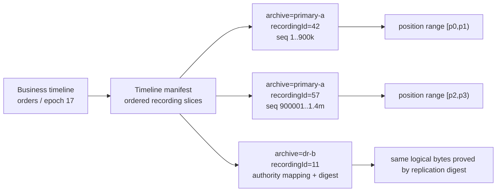
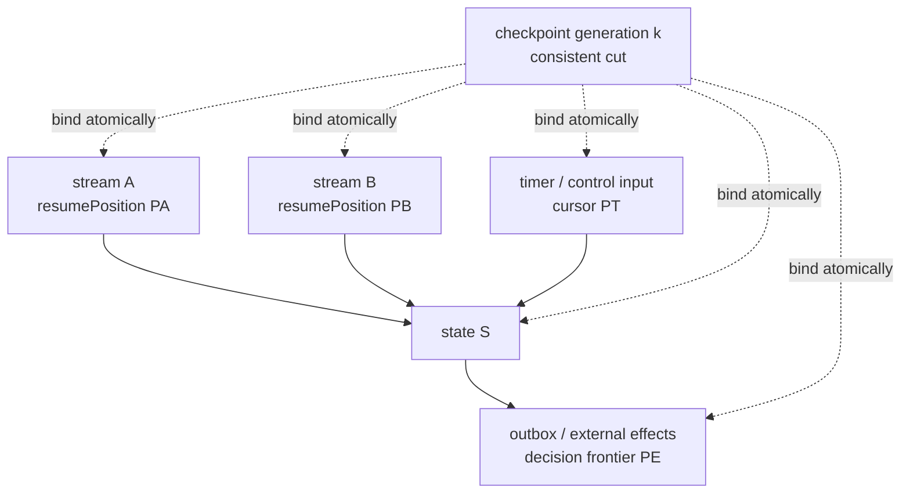
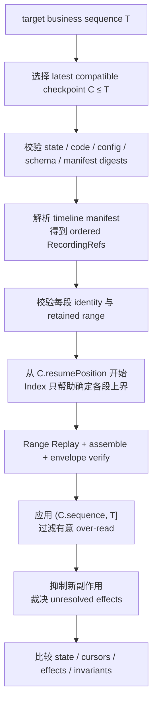

最危险的恢复代码，往往从一句看似自然的话开始：

> “业务序号 8,000,000 对应 Aeron position 3,427,811,328，所以从这个 position replay 就能回到那一刻。”

这句话把三个不同对象压成了一个数字：Archive 里某条 recording 的**传输字节边界**、业务协议定义的**事件顺序**，以及状态机已经完成的**业务效果**。三者可能相关，却绝不天然相等。消息大小、MTU、frame header、padding 与分片都会改变 position；Publication 重启会产生新的 session / Image；一个业务操作还可能跨输入流，并在数据库、交易所或支付系统留下结果未知的外部效果。

本文的中心论点是：**Aeron position 只回答“某条 recording 读到哪个传输边界”，可靠重建必须另外建立稳定的 Recording Identity、业务序列 Index、绑定状态与全部输入游标的 Checkpoint manifest、显式 Range Replay planner，以及外部副作用的恢复裁决。** Index 可以丢失后重建，Checkpoint 才是恢复证据；单流 position 也绝不自动构成分布式 consistent cut。

本文固定到 **Aeron 1.52.2**，Archive API、descriptor 与 position 语义以该版本官方文档、Javadoc 和源码为准。业务序列、索引格式、manifest 与 planner 是应用层协议，不是 Aeron 内置功能。本文是 Aeron 系列 Chapter 25：前一章[控制面与资源生命周期](/signal-grid-blog/posts/aeron-client-control-plane-cnc-client-conductor-counters-resource-lifecycle/)解释命令、counter 和资源所有权；下一章[多 Cluster 分片、所有权与迁移](/signal-grid-blog/posts/aeron-multi-cluster-sharding-ownership-migration/)会把这里的恢复边界扩展到多个权威域。

## 1. Position 只标记传输字节，不标记业务完成

[Aeron 官方 Position 文档](https://aeron.io/docs/aeron/aeron-understanding-position/)把 position 定义在特定 channel、`streamId`、`sessionId` 的 stream 上。它随 term 轮换连续推进，增加量不只有应用 payload，还包括 frame header、对齐 padding；消息超过 MTU 可承载 payload 后又会被拆成多个 fragments，于是同一条业务消息占用的 position-space 字节数会随编码和传输参数变化。

因此下列等式都没有普遍成立：

```text
position != payloadBytes
position != messageCount
position != businessSequence
position != eventTime
position != committedBusinessState
```

假设业务事件 `seq=1042` 的 payload 是 2 KiB。它可能被一个 frame 承载，也可能因 MTU 被拆成多个 fragments；之前还可能存在 PAD frame。即使业务事件数不变，改变 MTU 或消息编码也会改变后续 position。反过来，一条 heartbeat 或控制消息可以推进 position，却不推进订单序号。

还必须区分四层身份：

| 对象                  | 它标识什么                                        | 生命周期与可比较范围                                                      | 不能推出什么                             |
| --------------------- | ------------------------------------------------- | ------------------------------------------------------------------------- | ---------------------------------------- |
| `Image`               | Subscription 看到的一个 source Publication 会话   | 当前 Subscription 内由 `sessionId` 辨认；`correlationId` 标识驱动侧 Image | 不是持久业务流，也不是 Archive 目录项    |
| transport `sessionId` | channel / stream 上的一次传输 session             | 可随 Publication 重建而改变；只在 Subscription / source 上下文内有意义    | 不能单独定位长期历史                     |
| Archive `recordingId` | Catalog 中的一条 recording                        | 在一个 Archive Catalog 内持久；一次匹配到的 Image 通常形成一条 recording  | 不是跨 Archive 全局 ID，也不是业务 epoch |
| position              | 该 recording / stream position-space 中的字节边界 | 只能与兼容的 term、channel、stream、session / recording 上下文一起解释    | 不是墙钟、业务序号或副作用完成证明       |

表里的“由 `sessionId` 辨认”不能扩大成全局身份：它只在相应 Subscription / source 生命周期与 channel、`streamId` 上下文中解释；`Image.correlationId()` 也只是驱动侧 Image 实例身份，不是跨进程业务 ID。一个不限定 session 的 recording subscription 可以先后匹配多个 Images，并得到多个 `recordingId`；`extendRecording` 则可让一条已停止的 recording 继续增长。由此可见，“同一个业务主题”既可能横跨多个 recording，也可能在同一 recording 下经历新的 source session。只持久化一个裸 `long position`，恢复时甚至无法回答它属于哪一段历史。

业务系统需要的是另一个坐标：例如 `(tenant, instrument, businessEpoch, sequence)`。它由业务协议规定单调性、缺口、重复和重置规则，再通过应用层证据映射到 Archive。Aeron 不会替业务决定“交易日切换是否重置序号”“更正事件是否占用新序号”，也不会把 UTC 时间戳变成无歧义顺序。

## 2. 稳定 Recording Identity 才能让位置长期有意义

`recordingId=42, position=8 MiB` 只在产生它的 Catalog 里有意义。另一台 Archive、一次从冷备恢复出的 Catalog，甚至测试环境都可能拥有自己的 `recordingId=42`。应用至少要给 Archive 实例一个稳定命名空间，并把 business timeline 与 recording 的关系持久化成显式 manifest，而不是启动时“找最后一条 channel 相似的 recording”。



一个可持久化的引用可以分成两层：

```text
RecordingRef = {
  archiveNamespace,
  recordingId,
  originStartPosition,
  originDigest,       // 创建后不应改变的身份 / 兼容字段摘要
  catalogViewDigest,  // planner 观察到的完整 descriptor 快照摘要
  businessTimelineId,
  businessEpoch
}
```

`originStartPosition` 保存首次绑定该 recording 时的起点；`originDigest` 可以覆盖 `archiveNamespace`、`recordingId`、`initialTermId`、`segmentFileLength`、`termBufferLength`、`mtuLength`、`streamId` 与规范化 original channel 等身份 / 几何属性。当前 `startPosition` 不能混进这组不变量：`detachSegments` / `purgeSegments` 会把 retained start 向前推进，而尚存的 detached segment 经 `attachSegments` 验证后又可能把它向后移。`extendRecording` 会把 `stopPosition` / `stopTimestamp` 重新置空，并把 descriptor 的当前 `sessionId` 更新成新 Image 的 session；`truncateRecording` 可把已停止 recording 的 `stopPosition` 向前截短。完整的 `purgeRecording` 更不是“移动起点”，而是把 Catalog entry 标为 `DELETED`，使该 `recordingId` 不再是可查询的有效 recording。

因此，`startPosition`、`stopPosition`、`stopTimestamp`、当前 `sessionId` 等可变字段进入 `catalogViewDigest`。[`RecordingDescriptorConsumer` 1.52.2 Javadoc](https://javadoc.io/doc/io.aeron/aeron-all/1.52.2/io/aeron/archive/client/RecordingDescriptorConsumer.html)列出了 Catalog descriptor 返回的完整字段。把两类摘要分开，是因为合法 extension、retention、attach 与 truncate 都会改变视图；不能把合法变化误判成“身份被替换”，也不能对所有变化毫无警觉。

planner 读取活跃 recording 时还要冻结一个 `readLimitPosition`。它表示本次计划允许使用的已录制前缀，不等于 recording 永久终点。计划执行前后重新读取 descriptor：

- `originDigest` 不同：身份冲突，直接拒绝；
- 只有 recording 尾部继续增长：可接受，但本次仍不得越过冻结上界；
- 当前 `startPosition` 改变：重新证明请求区间仍位于 retained range；若它已因 `detachSegments` / `purgeSegments` 越过所需位置，本副本不再满足恢复材料；
- 当前 `stopPosition` 已被 truncate 到冻结上界之前，或 descriptor 已不存在 / 为 `DELETED`：原计划失效，必须换权威副本或重新选择 checkpoint；
- 出现新 `recordingId`：只有 timeline manifest 明确证明前一段终点、后一段起点和业务序列连续，才能拼接；
- 切换到复制 Archive：必须有权威映射和内容证据，不能假定目标端 `recordingId` 与源端相同。

稳定身份解决的是“这些字节是谁的历史”，还没有解决“哪条业务事件在哪里”。下一层才是 Index。

## 3. 业务 Index 是可重建的加速结构，不是第二份真相

Archive 接受的是 position，调用者查找的往往是 `orderId`、业务 `sequence`、事件时间或交易日。最直接的桥是业务 Index：解码录制时，从业务 envelope 取 key，把它映射到**完整消息开始前的安全 resume position**。

不要让索引指向任意对齐字节。Aeron 接收端默认交付 fragments；[`FragmentAssembler` 1.52.2 Javadoc](https://javadoc.io/doc/io.aeron/aeron-all/1.52.2/io/aeron/FragmentAssembler.html)说明它把分片消息重组成完整消息，而传给 delegate 的 header 对应最后一个 fragment。1.52.2 的 `BufferBuilder.completeHeader` 保留首 fragment 的 term 坐标，并把整条消息占用的所有 fragments 长度写入 assembled header，因此 `header.position()` 得到的是完整消息末 fragment 之后的位置。它适合表示“完整消息处理后，下一次从哪里继续”；当前消息的安全起点则应由顺序扫描器保存的“上一条完整消息结束位置”获得。第一条消息的安全起点是 recording 的 `startPosition`。这个数值只有在 envelope 校验、确定性状态应用与 cursor / checkpoint 发布协议成功后才成为持久恢复证据；收到 callback 本身不证明状态已经 durable。

```java
record SafeAnchor(
    long firstBusinessSequence,
    long resumeBeforePosition,
    long previousBusinessSequence,
    byte[] envelopeDigest) {}

record IndexSegment(
    String timelineId,
    long businessEpoch,
    RecordingRef recording,
    long minSequence,
    long maxSequence,
    long scanStartPosition,
    long scanStopPosition,
    List<SafeAnchor> anchors,
    byte[] segmentDigest) {}
```

若每条事件都建索引，写放大、缓存占用和恢复时的索引一致性成本可能超过收益。更常见的是两级结构：

1. 每隔 `N` 条业务事件、每个时间桶或每个业务分区写一个 sparse anchor；
2. 把 anchors 组成不可变 index segment，记录它覆盖的业务与 position 范围；
3. 一个原子发布的 root manifest 只引用已经写完并校验摘要的 segments；
4. 查询先找不大于目标 key 的最近 anchor，再顺序 replay、解码和过滤。

Index 必须显式记录业务序列规则。若上游允许重复序号、按 instrument 各自递增，或更正消息复用原业务 ID，就不能只存一个全局 `long`；key 应扩展成 `(partition, epoch, sequence, revision)`，并把比较器版本写入 index generation。

最关键的性质是：**Index 可由 retained recording 重放后重新生成，业务状态却不能由 Index 本身证明。** 建索引时可以先写 segment 临时对象、校验单调性和摘要，再原子替换 root manifest。崩溃留下的孤儿 segment 不可见；root 尾部损坏则退回上一个有效 generation。从可信 recording 起点顺序扫描，可以重建 retained history 的索引；从 checkpoint cursor 开始则只能重建该 cursor 之后的 suffix generation，不能凭空恢复已经删除或未扫描的历史前缀。要查询更早业务 key，必须仍有覆盖该区间的 recording 或更早可信恢复材料。

如果扫描发现 `sequence` 逆序、非协议允许的 gap、重复内容摘要不一致，或 anchor 不能从安全位置解出完整 envelope，应把该 index segment 判坏并向前退到更早的安全 anchor。不能为了让查询继续而“修正 position”；Archive 字节与业务 envelope 才是证据，Index 只是派生物。

## 4. Checkpoint 必须把状态和所有输入游标一起冻结

Index 回答“去哪里读得快”，Checkpoint 才回答“哪些输入已经成为当前状态”。一个可靠 checkpoint 不是单独的状态文件，也不是单独的 Aeron position，而是由一个已完成 manifest 原子引用的证据集合：

```yaml
checkpointId: cp-2026-08-28-0042
businessTimelineId: order-service/eu/epoch-17
lastAppliedBusinessSequence: 8200000
state:
  blob: s3://immutable/checkpoints/cp-0042.bin
  schemaVersion: 19
  stateDigest: sha256:...
execution:
  codeArtifactDigest: sha256:...
  configDigest: sha256:...
  indexGeneration: index-113
sources:
  - archiveNamespace: archive-primary-a
    recordingId: 42
    recordingOriginDigest: sha256:...
    catalogViewDigest: sha256:...
    resumePosition: 3427811328 # 第一条尚未应用消息的位置
    lastAppliedSourceSequence: 8200000
    retainedStartPositionAtPublish: 0
    frozenReadLimitPosition: 3428843520 # 本次证据允许读取的 exclusive 上界
externalEffects:
  outboxCommittedThrough: 8199988
  inboxDedupGeneration: dedup-77
  unresolvedEffectIds: [effect-391]
manifestDigest: sha256:...
```

这里的 `resumePosition` 明确定义成**第一条尚未应用消息的位置**；`lastAppliedBusinessSequence` 是已经进入 state 的最后一条业务事件。若字段叫含糊的 `position` 或 `lastOffset`，恢复实现很容易多读一条或跳过一条。状态 blob、source cursors 和 manifest 也要遵守发布顺序：先写不可变对象并校验摘要，最后原子发布 manifest；没有被完成 manifest 引用的对象只是孤儿，不是可恢复 checkpoint。

单输入时，`state + resumePosition` 仍只描述这条流。现实状态机还可能消费参考数据、定时器、控制命令和第二条业务流。仅保存 source A 的 position，完全不能证明 source B 的因果前提已经收入，也不能说明 A→B 的在途消息归谁。



[《分布式快照与一致检查点》](/signal-grid-blog/posts/distributed-snapshots-consistent-checkpoints-barriers-recovery-cursors/)给出的核心条件在这里仍成立：全局恢复材料必须形成 consistent cut，跨越切面的 in-flight message 还要有明确归属。单条 Aeron recording 的 position 只是一条输入的局部 cursor，**不等于 consistent cut**。多输入服务必须借助同一 barrier generation、共识提交位置、事务边界，或能够显式捕获在途输入的快照协议，把所有 source cursors 与状态绑定。

外部输出又是第三条边。若交易所请求已经成功，但进程在 checkpoint 完成前崩溃，仅凭 Archive replay 无法知道是否该重发。manifest 至少要绑定 Outbox / Inbox / dedup frontier 和 unresolved effect IDs；恢复时对这些效果做外部查询或幂等裁决，而不是把 replay handler 再执行一遍网络调用。

## 5. Range Replay 用字节范围读取，再按业务边界裁剪

`AeronArchive.startReplay(recordingId, position, length, ...)` 的 `position` 与 `length` 都属于 Aeron position-space。[`ReplayParams` 1.52.2 Javadoc](https://javadoc.io/doc/io.aeron/aeron-all/1.52.2/io/aeron/archive/client/ReplayParams.html)区分显式长度、follow 与“按请求到达时上界停止”等模式；[Working with Recordings](https://aeron.io/docs/aeron-archive/working-with-recordings/)则说明活跃 recording 的 `stopPosition` 为 `NULL_POSITION`，并要求请求位置落在当前可用范围内。

Archive 对 replay 起点要求 32-byte frame alignment、位于当前 retained range，并在 recording 内部时指向有效 frame；这些条件仍不能证明它是完整业务消息边界。有限 `length` 也不是任意字节上的强制切刀：1.52.2 [`ReplaySession` 源码](https://github.com/aeron-io/aeron/blob/1.52.2/aeron-archive/src/main/java/io/aeron/archive/ReplaySession.java)按完整 aligned frame 发布，若调用者给出的终点切进某个 frame，session 可能交付整个 frame 后才发现 `replayPosition >= replayLimit`。所以 planner 的上下界至少必须是 Archive frame boundary；要作为状态 resume / stop 证据，还必须是完整消息边界，并对实际收到的 `header.position()` 做冻结上界检查。

对应用 planner，最清楚的模型仍是半开区间：

```text
transport range = [startPosition, stopExclusive)
length          = stopExclusive - startPosition
business target = (checkpoint.lastAppliedSequence, targetSequence]
```

但 `targetSequence` 通常不会恰好告诉你 `stopExclusive`。稀疏索引的正确用法是**有意多读到目标之后的下一个安全 anchor**，再按业务 envelope 过滤，而不是猜测目标 payload 长度：

```text
startPosition = checkpoint.resumePosition
stopExclusive = index.firstSafeBoundaryAfter(targetSequence)
stopExclusive = min(stopExclusive, frozenReadLimitPosition)
appliedResumePosition = checkpoint.resumePosition
reachedTarget = false

for each assembled message in replay(startPosition, stopExclusive - startPosition):
    require header.position() <= stopExclusive // 否则计划边界切进 frame，fail closed
    event = decodeAndVerify(message)
    if event.sequence <= checkpoint.lastAppliedSequence:
        reject duplicate unless protocol explicitly allows it
    if event.sequence <= targetSequence:
        applyDeterministically(event)
        appliedResumePosition = header.position()
        reachedTarget = event.sequence == targetSequence
    else:
        decode and verify, but do not apply or advance the state cursor

require reachedTarget and all sequence invariants
result.sourceResumePosition = appliedResumePosition
```

例如 anchors 位于序号 100、200、300 的消息之前，目标是 125，planner 可以把序号 200 之前的安全边界作为 `stopExclusive`：126..199 会被读取和验证，却不进入目标状态。这个 over-read 是业务 planner 主动扩大 transport range 的结果；它不授权调用者给出一个切进 frame 的长度，再依赖 ReplaySession 的 frame-level overshoot 获得完整消息。**transport read cursor 与 state source cursor 必须分开**；前者可以走到 200 之前，后者只能停在已应用序号 125 之后，否则下次恢复会跳过 126..199。

若索引没有目标之后的 anchor，可把查询时的 `getMaxRecordedPosition` 或停止 recording 的 `stopPosition` 冻结为上界；对活跃录制，也可使用 `REPLAY_ALL_AND_STOP` 在 Archive 处理请求时拍下可用上界。要注意，活跃 recording 上“给一个有限 `length`”本身不等于快照：若请求终点高于请求到达时的 recording counter，ReplaySession 会等待 recording 延伸，直到达到该 replay limit 或 recording 停止。要固定本次证据，显式终点必须不超过已冻结 counter，或使用 `REPLAY_ALL_AND_STOP`；前者还应把上界写入 manifest，便于审计。若冻结上界落在一个尚未完整录制的业务消息中，assembler 不会产生完整回调；planner 必须证明目标消息已经完整出现，否则只能报告 `TARGET_NOT_RECORDED`，不能把“读到当前尾部”当作重建成功。

`maxConcurrentReplays` 还会让正确的 range 因 Archive 容量门限而被拒绝。这是 admission / deadline 问题：调用者可以在原计划和原冻结上界不变的前提下排队或退避，不能为了“挤进去”而扩大、缩小或改写目标业务范围。

起点必须位于完整消息边界。未经组装的 fragment position 只能证明一个 fragment 被消费；只有应用在完整业务消息处理成功后保存的 `header.position()`，才适合作为下一次 resume point。官方 [Archive replication sample](https://aeron.io/docs/aeron-archive/replication-sample/)也展示了收到消息后保存 `header.position()`，再从该位置取得下一条消息。若自研索引误指向一条 fragmented message 中间，即使数值满足 32-byte alignment，也不具备业务可恢复性，应退到更早的完整消息边界并重建索引。

上界也要区分“录到了”和“业务可接受”。Archive 当前 position 推进到 `P`，只说明 recording 前缀可供相应 replay 读取；它不证明该前缀已经通过 checksum、业务 envelope digest、序号规则或状态不变量。Range Replay 是取证路径，不是自动承诺。

## 6. Planner 从兼容 Checkpoint 走到目标业务序列

重建 planner 的任务不是调用一次 `startReplay`，而是把目标业务坐标转换成一组可验证、无缺口、不会跳过状态转移的 recording ranges。最容易犯的错误是从靠近目标的 sparse anchor 起读：如果 checkpoint state 只包含到序号 8,200,000，而 anchor 位于 8,250,000，直接从后者开始就永久跳过了 50,000 个状态转移。



一个 fail-closed planner 可以写成以下伪代码：

```java
RebuildPlan plan(TimelineId timeline, long targetSequence) {
    Checkpoint cp = checkpoints.latestCompatibleAtOrBefore(timeline, targetSequence);
    verifyManifestAndStateDigests(cp);
    verifyExecutionArtifact(cp.codeDigest(), cp.configDigest(), cp.schemaVersion());

    List<RecordingSlice> slices = timelineManifest.covering(
        cp.sourceCursors(), targetSequence);

    long expectedSequence = cp.lastAppliedBusinessSequence() + 1;
    for (RecordingSlice slice : slices) {
        RecordingDescriptor current = archive.describe(slice.recordingId());
        requireOriginIdentity(current, slice.recordingOriginDigest());
        requireRetained(current, slice.requiredStartPosition(), slice.frozenStopExclusive());
        requireBusinessContinuity(slice, expectedSequence);
        expectedSequence = slice.expectedLastSequence() + 1;
    }

    // 第一段必须从 checkpoint 的 first-unread cursor 开始。
    // Index 只能选择不早于 target 的安全 stop boundary，不能跳过中间事件。
    return rangesFromCheckpointCursorWithIndexedUpperBounds(cp, slices, targetSequence);
}
```

选择 checkpoint 时，“最新”之前还有“兼容”：代码 artifact、状态 schema、配置语义、业务比较器和 timeline epoch 都必须匹配。若当前代码不能解释旧状态，应启动声明支持该 manifest 的旧 artifact，或先运行有证明的状态迁移；不能为了省事忽略 digest。

跨 recording 拼接还需要业务连续性证据。前一段最后一个 envelope 可以包含 `lastSequence` 与 tail digest，后一段第一条包含 `previousSequence` / previous digest；timeline manifest 再签入二者。允许 gap 的协议则必须把 gap 原因写成权威事件。仅因两条 recordings 的 channel 与 streamId 相同，就把它们首尾相连，会把录制空洞包装成合法历史。

## 7. 故障恢复先裁决身份和副作用，再继续重放

恢复系统的价值体现在坏路径。下面的矩阵不按“报错后重试”分类，而按证据是否仍足以唯一决定下一步分类：

| 故障窗口 / 现象                                          | 仍可信的证据                                  | 安全决议                                                                      | 不能做的事                                |
| -------------------------------------------------------- | --------------------------------------------- | ----------------------------------------------------------------------------- | ----------------------------------------- |
| Index tail 丢失，recording 与上个 root generation 完整   | recording bytes、旧 index root、业务 envelope | 从最后可信 safe boundary 顺序 replay，重建新 generation                       | 把缺失 key 当成业务事件不存在             |
| Index anchor 指进 fragment 或摘要不匹配                  | 更早 safe anchor、recording                   | 隔离坏 segment，退回更早边界重扫                                              | 只把 position 向上取 32-byte 对齐         |
| state blob 已写但 checkpoint manifest 未发布             | 上一个 completed manifest                     | 把新 blob 当孤儿，仍从旧 checkpoint 恢复                                      | 按文件修改时间选择“最新快照”              |
| manifest 存在但 state / config / code digest 不匹配      | 其他已完成兼容 checkpoint                     | 拒绝该 checkpoint；使用兼容 artifact、迁移或更早可用点                        | 忽略 digest 强行反序列化                  |
| recording 被 extension，尾部比计划更长                   | origin identity、冻结 read limit              | 允许合法增长，但本次只读冻结前缀；记录新 catalog view                         | 让一次重建悄悄滑入后来事件                |
| recording 被 truncate，`stopPosition` 早于冻结上界       | 旧 manifest、其他 Archive / 不可变备份        | 使原计划失效；切换到仍保留该前缀的权威材料                                    | 把缩短后的 stop 当作原计划自然终点        |
| `purgeRecording` 后 descriptor 不再有效                  | timeline manifest、其他权威副本               | 报告本 Archive 缺失材料并切换已验证副本                                       | 把相同裸 `recordingId` 映射到别的历史     |
| Publication 重建后出现新 recordingId                     | timeline manifest、两端业务连续性摘要         | 按显式 recording slices 过段                                                  | 用 `findLastMatchingRecording` 猜后继     |
| purge / detach 后 `currentStartPosition > requiredStart` | checkpoint、其他 Archive / 不可变备份         | 换到保留所需前缀的权威副本，或使用 resume 已不早于新起点的更晚完整 checkpoint | 改小请求位置、使用更早 checkpoint 重试    |
| 多输入 cursors 不属于同一 cut                            | 各输入局部 position，但缺全局完成证据         | 拒绝作为恢复点，回到上一 completed consistent checkpoint                      | 用最小或最大 position“对齐”不同流         |
| replay 重做了一段状态后再次崩溃                          | 原 completed checkpoint、确定性输入           | 从原 checkpoint 重做；新 checkpoint 完成前不提升权威 frontier                 | 把内存中最后看到的 sequence 当持久 cursor |
| 外部请求已发送，结果为 `UNKNOWN`                         | 稳定 effect ID、Outbox / Inbox、外部查询接口  | 查询权威结果或以同一幂等键重试，完成后推进 effect frontier                    | 在 replay handler 中换新 ID 盲目再发      |

其中最容易被反向处理的是 retention 故障：若 checkpoint 需要从 position `P` 恢复，而 recording 当前 `startPosition` 已前移到 `P` 之后，**更早 checkpoint 只会需要更多已删除历史**。可行替代是保留该范围的另一权威副本，或一个更晚、完整且 consistent、其 `resumePosition` 已落在 retained range 内的 checkpoint。

重放模式也必须与实时模式隔离。纯状态转换可以再次执行；发送订单、扣款、邮件等 effect emission 应在 rebuild 时被抑制，只重建 Outbox / intent，再让 effect reconciler 根据稳定 effect ID 查询或去重。Archive 能证明命令字节出现过，不能证明外部世界已执行、未执行或只执行一次。

## 8. 重建等价由状态、游标和效果边界共同证明

“进程启动成功”“replay 到了目标 position”“订单数量相同”都不足以证明重建正确。应先定义状态 `T` 上的等价关系：

```text
Equivalent(reference, rebuilt, T) :=
    reference.stateDigest              == rebuilt.stateDigest
 && reference.lastBusinessSequence     == rebuilt.lastBusinessSequence
 && reference.sourceCursorMap          == rebuilt.sourceCursorMap
 && reference.outboxFrontier           == rebuilt.outboxFrontier
 && reference.inboxDedupFrontier        == rebuilt.inboxDedupFrontier
 && reference.unresolvedEffectSet       == rebuilt.unresolvedEffectSet
 && allDomainInvariants(rebuilt.state)
```

`stateDigest` 必须来自规范化状态表示，不能依赖 HashMap 遍历顺序、对象地址或本地墙钟。若系统允许多种等价物理表示，就比较规范化业务投影与不变量，而不是要求文件逐字节相同。源 cursor map 要覆盖所有输入；effect frontiers 则防止“内存状态一样，外部订单却多发了一次”的伪等价。

证明来自重复实验，而不是一张成功截图。以同一 immutable input corpus 建立 reference run，然后在每条完整消息前后、fragment 边界、index segment 发布、state blob 写完、manifest 发布和外部效果各阶段注入崩溃；随机损坏 index、替换 descriptor、截断 retained range、延伸 recording，再使用保存的 seed 与 fault schedule 重放。每次恢复都必须到同一目标 `T`，比较上述等价关系，并验证余额守恒、订单状态迁移合法、序号连续等领域不变量。

还要做“跨进程、同 artifact”的 golden replay，以及“声明兼容的新 artifact”对旧 checkpoint 的双版本 replay。若新旧代码产生不同状态 digest，差异必须由版本化迁移或业务规则变更解释；不能把“JVM 版本不同”当作默认免责理由。Archive checksum 可帮助发现介质损坏，但不能替代业务 envelope digest、checkpoint digest 与外部对账。

在下列前提同时满足时，这套协议能够保证：从一个 completed consistent checkpoint 出发，使用身份已验证、范围仍被保留的 recordings，在指定代码 / schema / 配置下按确定顺序重放，并裁决所有外部效果后，重建出目标业务序列 `T` 上与 reference 等价的状态、输入游标与效果 frontier。

它不保证以下事情：

- 一个裸 position 能表示业务时间、业务序号或跨流全局顺序；
- 单流 cursor 自动构成 consistent cut；
- Archive position 推进就等于断电持久、介质无损或业务已提交；
- replay 过的外部副作用天然 exactly-once；
- 不稳定墙钟可以唯一选择“某时刻”的业务状态；
- 已被所有副本和备份删除的历史仍能凭 Index 或 manifest 恢复。

这就是从 Recording Position 到业务时间线真正跨过的边界：**position 提供可寻址字节，Index 提供可重建定位，Checkpoint 提供恢复证据，planner 提供范围与版本裁决，外部对账补上 Archive 看不见的世界。** 下一章将把同一套身份、cursor 与 checkpoint 约束带进[多 Cluster 分片、所有权与迁移](/signal-grid-blog/posts/aeron-multi-cluster-sharding-ownership-migration/)：当一条业务时间线跨越多个 authority，谁有权发布下一段历史，比从哪里 replay 更先决定正确性。

### 官方参考

- [Aeron 1.52.2 Javadoc](https://javadoc.io/doc/io.aeron/aeron-all/1.52.2/)
- [Understanding Aeron Position](https://aeron.io/docs/aeron/aeron-understanding-position/)
- [Working with Recordings](https://aeron.io/docs/aeron-archive/working-with-recordings/)
- [`AeronArchive` 1.52.2 Javadoc](https://javadoc.io/doc/io.aeron/aeron-all/1.52.2/io/aeron/archive/client/AeronArchive.html)
- [`ReplayParams` 1.52.2 Javadoc](https://javadoc.io/doc/io.aeron/aeron-all/1.52.2/io/aeron/archive/client/ReplayParams.html)
- [`RecordingDescriptorConsumer` 1.52.2 Javadoc](https://javadoc.io/doc/io.aeron/aeron-all/1.52.2/io/aeron/archive/client/RecordingDescriptorConsumer.html)
- [`Header` 1.52.2 Javadoc](https://javadoc.io/doc/io.aeron/aeron-all/1.52.2/io/aeron/logbuffer/Header.html)
- [`FragmentAssembler` 1.52.2 Javadoc](https://javadoc.io/doc/io.aeron/aeron-all/1.52.2/io/aeron/FragmentAssembler.html)
- [Aeron 1.52.2 `BufferBuilder` source](https://github.com/aeron-io/aeron/blob/1.52.2/aeron-client/src/main/java/io/aeron/BufferBuilder.java)
- [Aeron 1.52.2 `Catalog` source](https://github.com/aeron-io/aeron/blob/1.52.2/aeron-archive/src/main/java/io/aeron/archive/Catalog.java)
- [Aeron 1.52.2 `ArchiveConductor` source](https://github.com/aeron-io/aeron/blob/1.52.2/aeron-archive/src/main/java/io/aeron/archive/ArchiveConductor.java)
- [Aeron 1.52.2 `ReplaySession` source](https://github.com/aeron-io/aeron/blob/1.52.2/aeron-archive/src/main/java/io/aeron/archive/ReplaySession.java)
- [Aeron Archive replication sample](https://aeron.io/docs/aeron-archive/replication-sample/)
