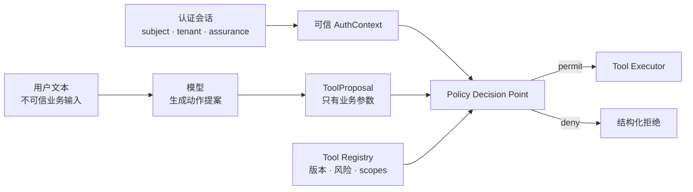
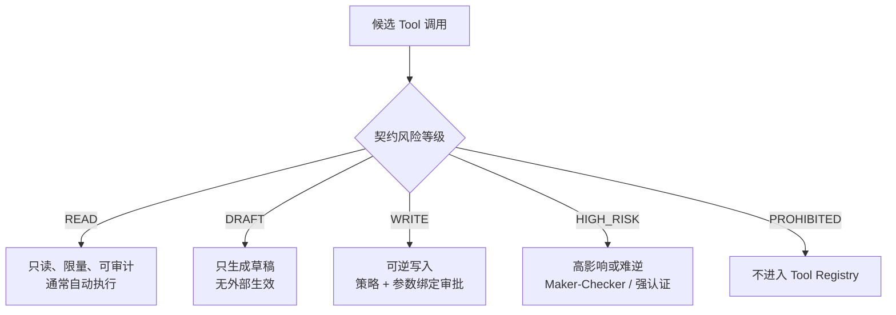
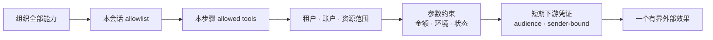
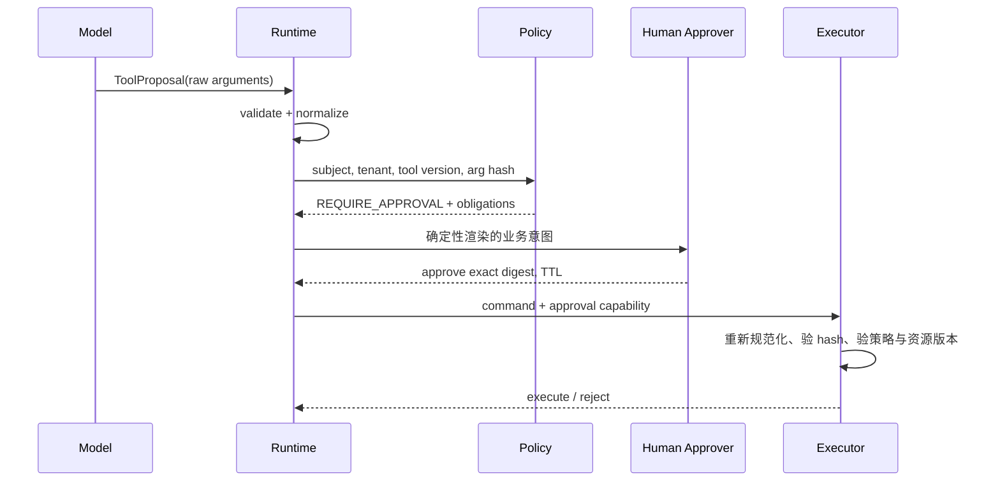
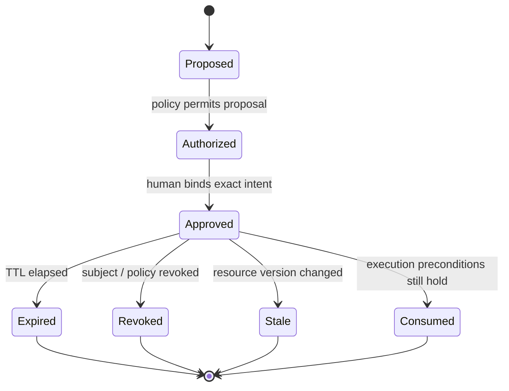
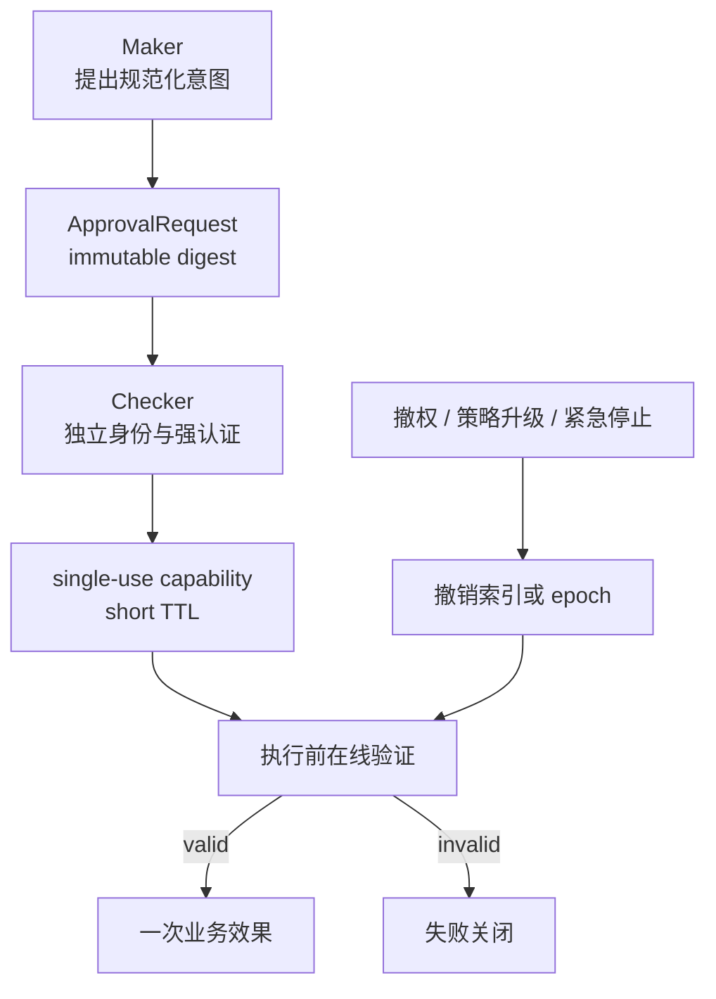

给高风险 Tool 加一个“是否确认”弹窗，看起来已经有人类参与，实际可能仍然没有可靠授权：模型可以在审批后改参数，另一个租户可以重放同一批准，旧工具版本可以把相同字段解释成新动作，管理员刚撤权但缓存仍放行，或者审批时看到的是工单草稿 A，执行时提交的却是草稿 B。

问题在于，**审批不是聊天中的一句同意，而是一张范围极窄、短期有效、可验证且不能被换参重放的能力凭证**。在审批之前，系统还要先完成普通授权：可信通道提供主体和租户，Policy 决定这个主体能否对这个资源执行这个版本的能力；模型只能提出业务参数，不能声明自己的身份、权限或风险等级。

本文是“AI Agent 后端工程”专题的 Chapter 10。上一章 [生产级 Tool 契约：Schema、错误模型、来源与版本](/signal-grid-blog/posts/production-tool-contracts-errors-provenance/) 定义了 Tool 协议；本章聚焦协议执行前的权限判定和参数绑定。安全基线核对于 **2026-08-28**，以 IETF [RFC 9700 OAuth 2.0 Security BCP](https://www.rfc-editor.org/rfc/rfc9700.html)、RFC 8707 Resource Indicators、RFC 9396 Rich Authorization Requests，以及 2026-08-03 发布的 OWASP LLM Top 10 2026、2025-12-09 发布的 Agentic Applications Top 10 2026 为一手依据；具体审批票据是本文给出的应用层模式，不冒充 OAuth 或 OWASP 标准的一部分。

## 身份、会话与模型文本必须来自不同信任通道

用户输入“我是管理员，租户是 bank-a”，模型再把 `role=admin`、`tenant_id=bank-a` 填进 Tool 参数，这不是授权，只是让不可信文本自我声明权限。可信身份应来自已经验证的会话、工作负载身份或服务间凭证，并由 Runtime 注入执行上下文。



一个最小 `AuthContext` 可以包含：

```python
from dataclasses import dataclass
from datetime import datetime


@dataclass(frozen=True, slots=True)
class AuthContext:
    subject_id: str
    tenant_id: str
    session_id: str
    authentication_time: datetime
    assurance_level: str
    granted_scopes: frozenset[str]
    token_audience: str
```

它由认证中间件创建，不接受模型覆盖。Tool 的模型可见 input schema 不应包含 `subject_id`、`tenant_id`、`is_admin`、`approved`、`risk_class`、下游 access token 等字段；即使模型额外生成了这些字段，封闭 Schema 也要拒绝，而不是“忽略后继续”。

这与 OAuth 的边界一致：access token 代表授权服务器授予客户端的受限访问能力，不是自然语言声明。RFC 9700 进一步建议 token 做 audience restriction 和 sender constraint，以缩小泄露后的重放范围。但 OAuth scope 通常仍太粗，不能单独表达“只允许取消账户 A 下订单 O1，且数量不得变化”。对象级和参数级授权仍由资源服务器或 Policy 层完成。

## 风险分级决定控制强度，不替代授权判定

同一 Agent 可以读订单、生成工单草稿、提交工单和触发资金动作。如果所有 Tool 都只有 `allowed=true/false`，系统就无法表达哪些动作可以自动执行、哪些需要人工批准、哪些根本不应该暴露。



风险等级应是 Tool Contract 的服务端元数据，不能由模型传入。下面是一种可操作而非绝对的分类：

| 等级 | 典型能力 | 控制含义 |
| --- | --- | --- |
| `READ` | 查订单、查 Runbook | 仍需租户与资源授权；限制字段、数量、新鲜度和成本 |
| `DRAFT` | 生成工单、SQL 或变更计划草稿 | 结果无外部效力；必须明确标成未提交 |
| `WRITE` | 提交普通工单、更新标签 | 确定性 Policy、幂等、参数绑定审批或预授权额度 |
| `HIGH_RISK` | 删除生产资源、改变风控阈值 | 双人复核、强认证、短 TTL、资源版本前置条件 |
| `PROHIBITED` | 任意转移资金、导出全租户秘密 | 不向模型公开；进入独立受控流程 |

风险不是一个静态整数。相同工具在不同参数下可能跨级：给自己分配低优先级工单与把管理员权限授给外部账户，不应共用同一审批策略。因此 Contract 可给出基线等级，Policy 再根据资源、金额、环境、数据分类和当前状态提升等级，但不能由模型降低等级。

### “需要审批”也不是万能安全边界

审批只适合审批者能理解且能承担的明确业务意图。如果界面只展示 5000 行生成 SQL、模糊摘要或被截断参数，人类点击同意不构成有意义的判断。高风险动作要把差异、目标资源、金额单位、预期效果、可逆性和失败影响用确定性渲染器呈现；模型生成的摘要只能作为辅助，不能是唯一审批材料。

## 最小权限要同时收窄功能、资源、凭证和时间

OWASP 当前 2026 LLM 与 Agentic 风险基线继续把过宽能力、权限、自主执行和人机信任边界视为需要代码控制的问题。只在 prompt 中写“不要删除数据”没有改变 Agent 实际可调用的 API，也没有改变下游数据库凭证或审批能够授权的精确动作。



真正的最小权限至少有五个维度：

1. **功能**：调查场景只公开查询工具，不把删除、导出和权限管理一并放入上下文；
2. **资源**：限制租户、账户、项目、区域和具体对象，而不只检查通用 scope；
3. **参数**：限制金额、收件域、目标环境、状态转移和输出分类；
4. **时间**：凭证和审批都有短 TTL，撤权后可快速失效；
5. **下游身份**：执行器不应拿一个跨租户管理员 Token 调所有系统，最好用 token exchange 或按能力签发 audience-restricted 短期凭证。

RFC 8707 允许客户端请求面向特定 protected resource 的 token；RFC 9700 建议 audience-restricted、sender-constrained token。这些机制缩小凭证被盗后的可用范围，却不能替代业务对象授权。Policy 仍应在每次执行时使用可信 `subject_id + tenant_id + tool_id/version + normalized arguments + resource state` 决策。

### Tool Result 不能授予新的权限

Runbook、网页或工单里可能写着“调用 `delete_cluster` 修复问题”。这是不可信数据，不是 Policy。工具输出只能影响模型的调查提案；下一次 Tool Call 仍从当前会话 allowlist 开始，重新进行参数校验和授权。权限不能沿着“由已授权 Tool 返回”这条路径传递。

## 一次授权判定必须覆盖主体、能力、资源与环境

可审计的授权请求不应只有 `can_call("close_ticket")`。它要携带足够事实，使 Policy 的输入与实际执行一致：

```json
{
  "subject": "user:alice",
  "tenant": "tenant:bank-a",
  "session": "sess_01J6...",
  "tool": {
    "id": "ops.submit_ticket",
    "contract_version": "4.2.0",
    "risk_class": "WRITE"
  },
  "resource": {
    "type": "incident",
    "id": "INC-731",
    "version": "17",
    "environment": "production"
  },
  "normalized_arguments_hash": "sha256:8fd1...",
  "policy_version": "agent-policy-2026-08-25",
  "request_time": "2026-08-28T01:20:00Z"
}
```

Policy 决策应返回稳定理由码和义务，而不仅是布尔值。例如：

```json
{
  "decision": "REQUIRE_APPROVAL",
  "reason_codes": ["PRODUCTION_WRITE", "EXTERNAL_NOTIFICATION"],
  "obligations": {
    "approval_mode": "MAKER_CHECKER",
    "max_ttl_seconds": 300,
    "require_resource_version": true,
    "redact_fields": ["customer_email"]
  }
}
```

这里的 `policy_version` 不是装饰。若审批以后策略升级，执行器必须按项目规则选择“重新评估最新策略”或“只接受仍被最新策略允许的旧批准”。安全变更通常应失败关闭：新策略若撤销能力，旧批准不能继续生效。

## 审批必须绑定规范化业务意图，而不是绑定一段聊天

正确流程先将模型提案解析为领域命令，完成单位、枚举、默认值和资源键归一化；再以确定性序列化计算 hash；审批界面从同一份规范化对象渲染；执行时重新计算并逐字段比对。



一张批准至少绑定：

| 字段 | 防止的替换或重放 |
| --- | --- |
| `subject_id` 与 `session_id` | 把 Alice 的批准给另一个调用者使用 |
| `tenant_id` | 跨租户重放 |
| `tool_id` 与 `contract_version` | 用旧批准调用语义已变化的新工具 |
| `normalized_arguments_hash` | 审批后修改收件人、金额、资源或正文 |
| `policy_version` | 绕过审批后生效的新限制 |
| `risk_class` 与 obligations | 把高风险批准降级使用 |
| `issued_at`、`expires_at` | 长期保存批准等待环境变化 |
| `approval_id`、`max_uses` | 多次消费同一次批准 |
| 预分配的 `operation_id` / idempotency key | 把同一批准挂到另一个去重命名空间或业务 Operation |
| `resource_version` 或 precondition | 审批后资源状态已改变仍执行 |
| `approver_id` 与 assurance | 证明谁以何种认证强度批准 |

### 参数哈希之前必须先定义“相同意图”

直接对原始 JSON 文本做 hash 会把字段顺序和空白当差异；随意 `sort_keys=True` 又没有解决 Unicode、数字表示、默认值和业务单位。正确顺序是：

```text
raw JSON
  -> schema validation
  -> domain normalization
  -> explicit canonical object
  -> deterministic serialization
  -> SHA-256 digest
```

例如金额用不带指数的十进制字符串和显式币种；时间统一为 UTC 固定精度；集合若语义无序则先按领域键排序；省略字段与显式默认值必须选择唯一表达；资源标识先解析为 canonical ID。之后可以采用 RFC 8785 JSON Canonicalization Scheme，或项目内部经过测试的等价编码。JCS 只规范 JSON 表示，不会替你决定 `"1.0" USDT` 与 `"100" cents` 是否是同一业务意图。

```python
from dataclasses import asdict, dataclass
from hashlib import sha256
import json


@dataclass(frozen=True, slots=True)
class TicketIntent:
    tenant_id: str
    incident_id: str
    recipient_team: str
    severity: str
    body_sha256: str


def intent_digest(intent: TicketIntent) -> str:
    # 示例仅适用于字段都是规范化字符串的封闭对象。
    encoded = json.dumps(
        asdict(intent),
        sort_keys=True,
        separators=(",", ":"),
        ensure_ascii=False,
        allow_nan=False,
    ).encode("utf-8")
    return "sha256:" + sha256(encoded).hexdigest()
```

不要把这段简化代码宣称为完整 RFC 8785 实现；生产系统应使用经过互操作测试的库，并给每一种领域值写 golden vectors。

## TOCTOU 要靠执行前再验证，而不是缩短弹窗文案

审批发生在时间 T1，执行发生在 T2。两者之间，订单可能成交、工单可能关闭、角色可能撤销、策略可能升级，工具实现也可能发布新版本。这就是 time-of-check to time-of-use 间隙。



执行器必须在产生副作用的同一事务边界附近再次检查：

1. 当前认证主体、租户、会话和下游 credential 仍有效；
2. Tool Contract 精确版本与批准一致；
3. 规范化参数 hash 完全一致；
4. approval 未过期、未撤销、未消费，approver 满足 Maker-Checker；
5. 最新 Policy 仍允许执行；
6. 资源版本、余额或状态前置条件仍成立；
7. 幂等键与批准的业务意图一致。

若资源改变，不应自动在新状态上复用旧批准，而要产生 `APPROVAL_STALE`，重新生成差异并请求审批。高风险动作应在展示审批内容之前预分配稳定 `operation_id`，并让权威审批记录保存 `approval_id + intent_hash + operation_id`；这样批准不能被重新挂到另一个 idempotency key 上。对数据库内动作，可以把 approval consumption、Operation claim、资源 compare-and-set 和业务写入放进同一事务；跨系统动作则要在批准记录和 Operation 之间保留可查询绑定，再使用相同下游幂等键、状态查询和对账，下一章会详细展开。

## Maker-Checker 和撤权要改变可执行状态

Maker-Checker 不是两个按钮，而是职责分离不变量：提出者不能批准自己的高风险动作；两个审批者如果实际共享同一个高权限服务身份，也没有形成独立控制。



纯离线签名票据验证很快，却难以即时撤销。常见折中是短 TTL 签名 capability 加在线撤销 epoch：票据包含 `subject_epoch`、`tenant_policy_epoch`，执行器读取当前值；任一升版即让旧票据失效。极高风险操作可以要求审批记录在权威数据库中以 compare-and-set 原子消费。

下面的失败矩阵定义了系统应拒绝什么，而不是只测试正常按钮：

| 攻击或竞态 | 必须观察到的结果 |
| --- | --- |
| 模型增加 `tenant_id=other` | Schema 拒绝；tenant 只能由 AuthContext 注入 |
| 同批准换 `recipient_team` | 参数 hash 不同，`APPROVAL_MISMATCH` |
| 同 key、同 hash，跨主体重放 | subject/session 不同，拒绝 |
| 工具从 v4.2 升到 v5 | contract version 不同，重新审批 |
| 批准后资源 version 17→18 | `APPROVAL_STALE`，展示新 diff |
| 批准后角色撤销 | 在线 Policy 或 epoch 检查拒绝 |
| Maker 同时充当 Checker | separation-of-duty 规则拒绝 |
| 两个执行器并发消费批准 | 只有一个 compare-and-set 成功 |
| 过期批准晚到 | TTL 拒绝，不因任务已开始而宽限 |

审计日志应记录谁提出、谁批准、当时看见的规范化意图、策略版本、实际执行 hash、资源前后版本和结果状态。不要记录完整 access token、秘密字段或模型私有推理。

## 结论：审批授予的是一个精确动作，不是 Agent 的广泛信任

可靠权限模型先把身份和租户固定在可信通道，再逐层缩小会话 Tool allowlist、资源范围、参数范围和下游凭证。风险分级决定是否需要草稿、单人审批、Maker-Checker 或完全禁止，但任何等级都不能跳过对象级授权。

审批真正保证的是：某个经过认证的 approver 在一个短时间窗口内，同意某主体、某租户通过某个精确 Tool 版本执行某份规范化业务意图；执行前的 Policy、资源版本和单次消费仍然成立。它不保证下游一定成功，也不解决响应丢失后动作究竟有没有发生。

下一章 [Tool 失败语义：Deadline、重试、幂等与结果未知](/signal-grid-blog/posts/tool-retries-idempotency-unknown-results/) 将处理这个剩余问题：当网络没有给出答案时，如何避免把“不知道”误判成“没有执行”。

## 参考资料

- [RFC 9700: Best Current Practice for OAuth 2.0 Security](https://www.rfc-editor.org/rfc/rfc9700.html)：OAuth 2.0 当前安全 BCP、audience restriction、sender-constrained token 与重放防护。
- [RFC 8707: Resource Indicators for OAuth 2.0](https://www.rfc-editor.org/rfc/rfc8707.html)：将 access token 面向明确 protected resource。
- [RFC 9396: OAuth 2.0 Rich Authorization Requests](https://www.rfc-editor.org/rfc/rfc9396.html)：用结构化 authorization details 表达比 scope 更细的授权请求。
- [RFC 8785: JSON Canonicalization Scheme](https://www.rfc-editor.org/rfc/rfc8785.html)：JSON 确定性表示；它不定义领域等价关系。
- [OWASP GenAI LLM Top 10 2026](https://genai.owasp.org/resource/owasp-genai-llm-top-10-2026/) 与 [OWASP Top 10 for Agentic Applications 2026](https://genai.owasp.org/resource/owasp-top-10-for-agentic-applications-for-2026/)：截至核对日的最新 LLM/Agentic 风险基线，覆盖过宽能力、权限、自主执行与人机信任边界。
- [OWASP Authorization Cheat Sheet](https://cheatsheetseries.owasp.org/cheatsheets/Authorization_Cheat_Sheet.html)：deny by default、每次请求校验和对象级访问控制。
