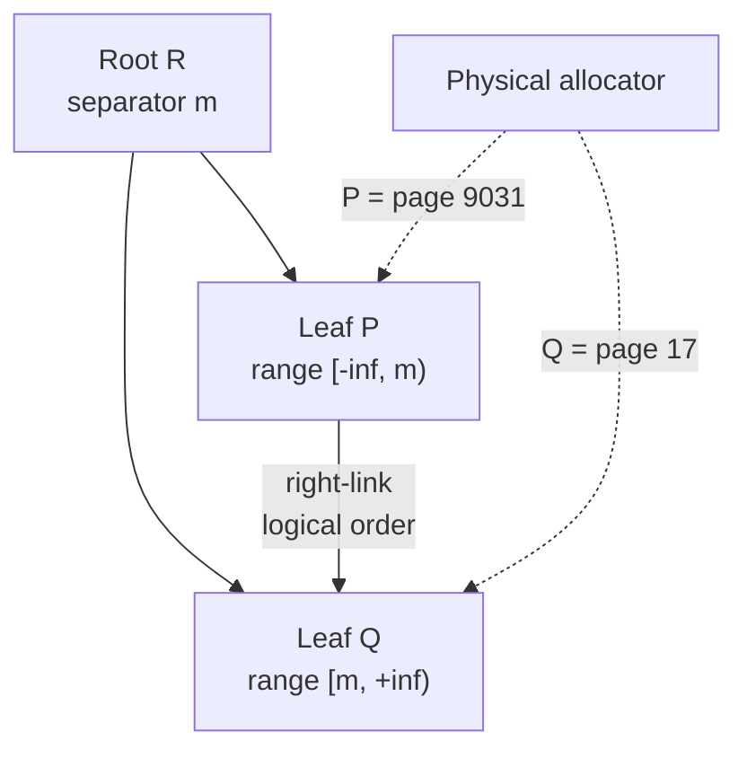
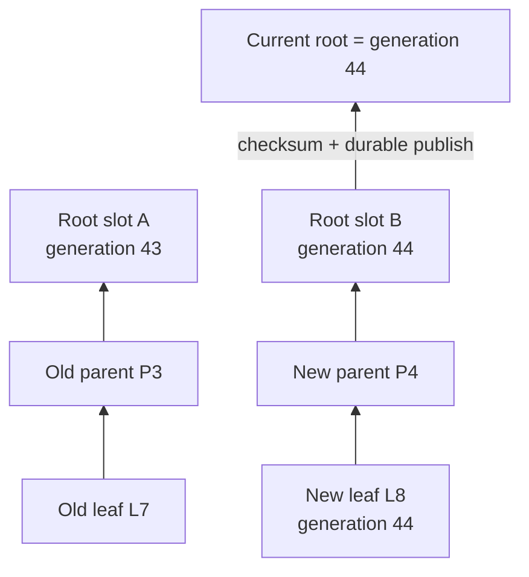

教科书里的 B+Tree 常停留在一张静态图：内部节点保存分隔键，叶子保存有序记录，节点满了就“一分为二”。真正的数据库却必须回答动态问题：搜索线程刚从父页读到 child pointer，子页就被并发分裂怎么办？父节点尚未补上新 separator 时，新右页是否已经可达？事务回滚是否应撤销一次页分裂？范围扫描跨页期间发生插入、删除或 Copy-on-Write 换代，究竟允许看到什么？

本文的中心论点是：**B+Tree 的正确性对象不是一棵每时每刻都完美平衡的物理树，而是一个持续覆盖逻辑键空间、允许安全的结构中间态、并能在并发与崩溃后恢复的有序访问协议。** Page split、high key、right-link、Latch、WAL 或 CoW root publication 都在维护这份协议；它们不替代事务锁、MVCC 或范围扫描的隔离合同。

本文承接 [《存储引擎全景》](/signal-grid-blog/posts/storage-engine-pages-buffer-pool-wal-manifest-recovery-boundaries/)，默认读者已经区分 Visible、Durable 与 Recoverable。这里用抽象的半开区间 `[low, high)` 表达 fence key，便于推理；具体实现可能采用不同边界约定、separator 截断和重复键编码，不能照搬符号当页格式。

本文并列讨论的是两类可选设计：B-link 通常用 high key/right-link 容忍原地分裂后的 stale parent，CoW 则以不可变 generation 与 root publication 提交新路径。它们可以经过专门协议组合，却不是 B+Tree 必须同时采用的组件；后文会分别给出证明义务。

## 树的合同是逻辑键序，不是物理页号

B+Tree 首先需要一个对内部键的**稳定全序**。若用户键可以重复，只按 `userKey` 比较还不足以唯一定位记录；常见做法是把记录身份、tuple ID 或 sequence 作为 tie-breaker：

```text
InternalKey = (UserKey, TieBreaker)
compare(InternalKey a, InternalKey b) -> total order
```

比较器的空值顺序、排序方向、collation 和编码版本都属于持久格式合同。升级后若相同字节得到不同顺序，页仍能通过 checksum，却不再是一棵可搜索的树。因此，格式元数据必须绑定 comparator identity/version；不兼容升级需要重建或明确迁移，而不是原地换函数。

在这条全序上，B+Tree 承诺的核心性质是：

```text
I1  每个已发布叶页只保存其 fence range 内的 InternalKey
I2  从 published root 出发，路由与允许的修正边构成对全部 live key range 的覆盖
I3  叶级逻辑顺序单调；沿 right-link 或等价游标前进不会形成环
I4  一个已提交 InternalKey 在指定读视图中恰好出现一次，或按删除/版本规则不可见
I5  pageId 复用不会让旧引用命中新对象：要么旧读者已退出，要么 generation 检查使其重试
```

这些性质没有要求页号连续。页 `17` 分裂后可能分配页 `9031`，CoW 更新还可能把逻辑相邻页放在完全不同的文件偏移。`pageId + 1` 只是物理猜测，不能实现范围扫描。甚至针对全文件的维护扫描也必须处理“分裂把记录移到已经扫过的低页号”这类竞态；PostgreSQL 的官方 [`nbtree/README`](https://github.com/postgres/postgres/blob/master/src/backend/access/nbtree/README) 就为物理顺序 VACUUM 单独维护 split-cycle 处理。

结构正确也不等于事务隔离。索引能够把 `[a, z)` 中的键按顺序找出来，不说明扫描期间的并发插入是可见、不可见还是应该阻塞。Point lookup、statement snapshot、serializable range scan 是三种上层合同，不能由“叶子有链表”自动推出。

## Page fence 把父路由与真实所有权分开

为了允许父节点短暂落后，页回收协议必须阻止旧引用命中新对象：若页号可能在旧引用尚存时复用，页引用应区分 `(pageId, generation)`；实现也可以通过 Pin、Epoch 或更保守的延迟复用建立等价保证。每个 B-link 风格页面还需要自己的 key range 上界与右向修正边。下面的推理模型显式使用 generation，但它不是某个产品的磁盘结构：

```text
PageHeader {
  PageRef self;          // pageId + generation
  Level level;           // 0 = leaf
  InternalKey highKey;   // 本文抽象为 range 的 exclusive upper bound
  PageRef rightLink;
  LSN pageLsn;           // 采用 WAL 的实现才需要等价字段
  Flags state;           // LIVE / SPLIT_INCOMPLETE / HALF_DEAD ...
  Checksum checksum;
}
```



父页的 separator 是进入某个 key range 的快速路由；页面自己的 high key 与 right-link 则允许线程发现：“我根据旧父页走到了一个已经不再拥有目标键的页面。” 搜索键 `k >= highKey(P)` 时，线程向右移动，必要时重复多次，直到进入覆盖 `k` 的页面。

这是一项重要的权威划分：**父节点可以暂时 stale，但不能把键空间变成不可达；right-link 可以修正旧路由，但必须朝全序严格前进。** 若 separator、high key 与页面内容采用不同 comparator，或者 right-link 指回较小 fence，算法就失去终止性和覆盖证明。

根页或其他页引用若允许复用，也必须携带 generation 或受等价的复用屏障保护。只保存可并发复用的裸页号会产生 ABA：读者记住 `page 42`，该页被回收后又分配给另一棵子树，读者的地址仍“合法”却指向错误代际。Pin、epoch-based reclamation、hazard pointer 或 reader transaction 都可以延迟复用；不论使用哪一种，复用前沿必须是协议的一部分。

## B-link 搜索修正旧父页，范围扫描仍要绑定读语义

下面的伪代码只展示结构路由，省略 Buffer Pool I/O、错误处理和事务可见性。它假设调用方在整次遍历中持有 reader epoch，使已经读出的 child/right `PageRef` 不会在下一次 pin 前被复用；没有这种回收屏障的实现必须先安全 pin 下一页再释放当前页。代码使用页 generation 检测身份错误，并把“向右修正”留在每一层：

```text
seek(rootGeneration, target):
  ref = publishedRoot(rootGeneration)
  loop:
    page = pinAndReadLatch(ref)
    if page.self != ref:
      restartFromRoot()

    if target >= page.highKey:
      ref = page.rightLink
      unlatchAndUnpin(page)
      continue

    if page.isLeaf:
      return leafLowerBound(page, target)

    ref = chooseChild(page, target)
    unlatchAndUnpin(page)
```

伪代码里的 `restartFromRoot` 与 `return` 是控制流缩写，不是资源管理许可：重启前必须释放当前 latch/pin；返回时必须复制稳定的逻辑位置后释放资源，或把 pin/latch 的所有权显式转交给游标。生产实现不能泄漏 latch，也不能在释放页保护后把裸 slot 指针交给上层。

Lehman–Yao 的 B-link tree 通过 high key 和额外 link 让搜索从并发分裂造成的旧位置恢复。[原论文](https://doi.org/10.1145/319628.319663)在其存储模型中避免读锁；真实数据库仍可能需要短暂 page read latch，因为多个线程共享同一个内存 frame。PostgreSQL 的 `nbtree` 源码说明正是这种改造：right-link/high key 修正树结构，shared buffer 上的 page latch 保护线程读取期间的物理字节。

### 正向扫描不能只“保存 nextPage”

范围扫描通常先 `seek(startKey)`，再沿叶级逻辑顺序返回记录。并发分裂可能移动记录、插入一个新右页，删除则可能让页进入 half-dead 状态。一个稳健游标至少保存：

```text
Cursor = {
  snapshotOrReadView,
  lastReturnedInternalKey,
  currentPageRef,
  observedPageGeneration
}
```

页 latch 只保证扫描当前页的短时间内结构不变。释放后若 generation、fence 或 link 已变化，游标应以 `lastReturnedInternalKey` 为下界重定位，并过滤 `<= lastReturnedInternalKey` 的重复候选。这样结构重试不会把“页曾经移动过”暴露为重复业务记录。若产品允许重复用户键，游标必须保存完整 InternalKey；只保存 `userKey` 会漏掉同键不同记录。

right-link 解决的是结构可达性，不决定以下三种扫描语义：

| 扫描合同                  | 需要的额外机制                                                   | right-link 单独能否保证 |
| ------------------------- | ---------------------------------------------------------------- | ----------------------- |
| 弱游标 / 明确允许变化     | 定义重复、遗漏与并发插入的容许范围；以 last key 去重或重定位     | 不能                    |
| Statement / MVCC snapshot | 固定 read timestamp/sequence，并按版本可见性过滤                 | 不能                    |
| Serializable range        | Predicate/key-range lock、SSI 或等价串行化验证，防止非法 phantom | 不能                    |

下一篇 MVCC 会解释 snapshot 与 visibility。此处必须记住：结构层证明“目标范围仍能导航”，版本层才证明“这个读视图应看到哪些版本”。

反向扫描更复杂，因为 left-link 可能在并发分裂后落后。PostgreSQL 的实现会在向左后再向右校验，直到找到 right-link 确实指回当前页的兄弟。把 `leftLink` 与 `rightLink` 当作瞬时双向链表、要求二者每个 CPU 指令间都一致，既降低并发，也不是该算法实际证明的性质。

## Latch、Pin 与事务 Lock 保护三种生命周期

“给 B+Tree 加锁”容易把三层机制混为一谈：

| 机制               | 典型持有时间                | 保护对象                                       | 等待时的主要风险                        |
| ------------------ | --------------------------- | ---------------------------------------------- | --------------------------------------- |
| Pin / reader epoch | 访问 frame 或 snapshot 期间 | 页不被淘汰、释放或复用                         | 内存/旧 generation 无法回收             |
| Page latch         | 数十条指令至一次短结构操作  | 页内 slot、fence、link、separator 的物理一致性 | convoy、cache-line 争用、Latch deadlock |
| Transaction lock   | 通常直到事务结束            | 键、记录、间隙或谓词的逻辑隔离                 | 业务死锁、长事务阻塞                    |

一次搜索可以在每层取得 shared latch，读出 child ref 后释放；一次插入可能使用 latch crabbing：自顶向下 latch parent/child，在确认 child 对本次操作“安全”后尽早释放 ancestor。这里的 safe 不是没有 bug 的泛称，而是“该 child 此次插入不会分裂，或算法允许在没有 parent latch 时完成并修复结构”。

如果必须等待 transaction lock，不应长期占着无关 page latch。否则一个业务锁等待会冻结 Buffer Pool 热页，并把毫秒级事务冲突放大成索引全局尾延迟。常见协议是先观察候选 key、释放结构 latch、取得逻辑锁，再凭 page generation/record identity 重新验证；验证失败就重试。

Latch 顺序必须由具体算法固定。例如某个实现可规定 descent 时 parent-before-child、同层结构修改只 left-to-right，并禁止持有右页再等待左页；另一个实现可能使用 optimistic read 与 version counter。规则可以不同，但同一条路径不能临时反向获取。故障注入应把每个 latch 获取前后都设为调度点，才能暴露只在罕见 split/merge 交错下发生的环。

事务 Lock 同样不能由 leaf latch 替代。Latch 在页操作结束后释放，另一个事务随后仍可插入相邻键；若隔离级别禁止 phantom，就需要 key-range/predicate 语义，ARIES/KVL、next-key locking 或 SSI 是不同方案，不是 B+Tree 定义的一部分。

## 分裂分两次发布，仍可保持键空间连续

设叶页 `P` 原本覆盖 `[a, z)`，插入后溢出，选择 split key `m` 并创建右页 `Q`。B-link 风格原地更新可以把结构修改分成两个可恢复原子动作：先让新页通过 sibling link 可达，再把父路由补齐。

```mermaid
stateDiagram-v2
  [*] --> POwnsAll: P owns [a,z)
  POwnsAll --> QPrepared: allocate Q; not reachable yet
  QPrepared --> RightPublished: P.high=m; P.right=Q
  RightPublished --> ParentInstalled: install separator m to Q
  ParentInstalled --> SplitComplete: clear incomplete marker
  SplitComplete --> [*]
```



真正的发布顺序应更精确：

1. 在预期 latch 与 generation 下分配 `Q`，完整初始化其 `[m, z)` 内容、旧 high key 和旧 right-link；此时它尚未进入权威树，也不要求为了线程内可见性先单独把 `Q` 强制落盘。
2. 把 `Q` 的初始化、`P` 收缩为 `[a, m)`、`P.rightLink=Q` 以及必要的兄弟元数据纳入同一个可恢复结构动作，再对并发读者发布。WAL 实现可以先生成覆盖该动作的日志记录再修改内存页，但只需在相关页写入稳定数据文件前 force 日志；CoW 实现则需要等价的持久依赖闭包。从内存发布起，即使父页仍指向 `P`，`k >= m` 也能向右找到 `Q`。
3. 在父页加入 `separator m -> Q`。父页满时递归分裂，但子层键空间已经连续。
4. 清除 `SPLIT_INCOMPLETE`，或让 parent-install record 与标记清除属于同一可恢复动作。

这条顺序的核心不是“先复制哪一半”，而是任何可观察中间态都满足以下二选一：新页尚未发布，旧页仍拥有完整范围；或旧页已经收缩，新页可由 right-link 到达。绝不能先从 `P` 删除 `[m, z)`，随后才让 `Q` 可达。

### Split 是结构事务，不随用户事务回滚

用户插入可以 Abort，但已经完成的页分裂通常作为 system transaction 保留。回滚只移除或标记用户记录，不强迫树立即合并回原布局。因为 split 改变的是物理表示，不改变已提交键集合；让任意用户 Abort 反向重做合并会扩大 latch 范围、制造新的恢复中间态。

[ARIES/IM](https://doi.org/10.1145/130283.130338)系统化区分了用户事务锁与索引 structure modification operation。PostgreSQL 的 `nbtree` 是一个可读的具体实现：同一层的 page split 由一条 WAL record 覆盖，向父层插 downlink 是后续动作；崩溃若落在两者之间，搜索仍可沿 right-link 找到新页，并由 `INCOMPLETE_SPLIT` 支持后续完成。这个例子证明中间态可以设计成安全且可修复，不表示所有引擎必须采用相同 record layout。

根页分裂没有旧 parent 可以补 separator。原地 B-link 实现可以先按普通页分裂发布两个 sibling，再创建包含两条 downlink 的新 root，最后通过 metapage/control record 发布 root generation；在新 root 发布前已经进入旧 root 的搜索仍须能沿 right-link 修正。新 root 指针与页面初始化分别属于哪些 WAL action、崩溃后选哪个 root，也必须明确，不能把“更新全局变量”留在恢复协议之外。

### 分裂点是性能选择，也受正确性约束

50/50 split、右侧增长优化、前缀截断和重复键压缩影响空间利用率与未来写放大。无论策略如何，split key 必须在持久 comparator 下把两侧范围区分开；separator 截断后仍要满足 routing invariant。重复用户键若跨页，tie-breaker 必须参与 high key，否则 `k == highKey` 应向左还是向右会失去唯一答案。

## Copy-on-Write 把提交点移到 root publication

原地页更新用 WAL 证明“日志先于脏页”，Copy-on-Write 则不覆盖当前 generation 的页面：更新叶页后，沿叶到根复制受影响路径，最后发布一个新 root。旧读者继续沿旧 root 观察不可变 generation，新读者从新 root 出发。



一条最小 CoW 持久化不变量是：

```text
C1  新 parent 只引用身份已确定、属于同一发布闭包的 immutable child；未解析别名不得入树
C2  root generation g 被发布前，从 root(g) 可达的所有新页都已跨过持久化屏障
C3  root publication 本身可原子识别：generation、rootRef、checksum 与格式版本一致
C4  恢复沿权威 root publication 链选择最新完整 generation，而不是扫描裸页号取数值最大者；未被引用的新页是 orphan
C5  old generation 在最老 reader/snapshot 退出前不得回收或复用
```

实现可以使用双 meta page、append-only root record、原子块或 Manifest/CURRENT，但必须说明设备和文件系统层面的原子性。若 root pointer 已稳定而 child page 仍在易失缓存中，CoW 不是“少恢复一点”，而是发布了一个断裂的权威世界。相反，新路径全部写完但 root 尚未发布时崩溃，旧 root 仍是合法数据库，新页只形成可回收 orphan。

CoW 也不自动等于 latch-free。写者之间仍要序列化 root generation、解决并发更新冲突，或通过 CAS 让失败者重基于新 root 重做。Microsoft 的 [Bw-Tree](https://www.microsoft.com/en-us/research/publication/bw-tree-latch-free-b-tree-log-structured-flash-storage/)采用 mapping table 与 delta record 的 CAS 发布，是另一种带间接层的设计，不应把它简化为“把整条路径复制一遍”。

### Leaf sibling link 是 CoW 中的困难边

若 `L7` 的前驱页保存直接 right-link，复制 `L7 -> L8` 后还要更新前驱；复制前驱又可能要求更新它的前驱，形成级联。可选设计包括：

- 让 range cursor 保存 parent path，叶末从父层寻找后继，而不依赖持久双向链；
- sibling link 带 generation，读者发现跨代后按 last key 从 root 重定位；
- 用稳定 page ID 到当前物理页的 indirection table 原子换代；
- 采用专门为 shadowing 设计的树算法，而不是给原地 B-link tree 机械加 CoW。

Ohad Rodeh 的 [B-trees, Shadowing, and Clones](https://research.ibm.com/publications/b-trees-shadowing-and-clones)专门讨论 shadowing 与 B-tree 并发的冲突。工程上最危险的做法是同时宣称“页不可变”和“直接 sibling pointer 总是最新”，却没有为 predecessor 更新、跨代扫描和旧页回收给出协议。

## Crash cut 与并发调度必须共享同一组不变量

结构恢复不能只验证“启动成功”。它要判断 crash 落在 split、parent repair、root publication 或 page reuse 的任何位置时，键空间是否仍连续、旧读者是否仍安全。

| 故障或交错                                           | 合法结果                                                     | 证明义务                           |
| ---------------------------------------------------- | ------------------------------------------------------------ | ---------------------------------- |
| `Q` 已初始化，`P.right` 尚未发布                     | 旧 `P` 仍拥有完整范围；`Q` 是 orphan                         | 没有记录先从 `P` 消失              |
| `P.right=Q` 已发布，父 separator 尚未安装            | 旧父路由到 `P`，搜索按 high key 向右到 `Q`                   | right-link 单调且 `Q` 内容可恢复   |
| 父 separator 已安装，完成标记尚未清除                | 恢复/下一写者幂等识别 separator 已存在，再清标记             | 不重复插入 downlink                |
| WAL 已稳定，split 页尚未写回                         | REDO 重建同一层原子动作                                      | pageLSN 与 redo 幂等               |
| split 页写回，但对应 WAL 尚未稳定                    | 该执行路径必须被 Write-Ahead Rule 阻止                       | failpoint 命中即测试失败           |
| CoW 新路径稳定，root 尚未发布                        | 使用旧 generation；新页待回收                                | 旧 root 依赖闭包仍完整             |
| root 已发布，任一新 child 未稳定                     | 非法状态；恢复应拒绝，协议测试必须证明发布顺序不可能         | durable dependency closure         |
| 扫描持有旧 `PageRef(42,7)` 时 allocator 复用 page 42 | allocator 必须等待 reader frontier，或新 generation 触发重启 | 不发生 ABA 与跨树读取              |
| split 与反向扫描交错                                 | 扫描校验 sibling 关系，必要时向右修正或按 last key 重定位    | 结果满足声明的 snapshot/range 合同 |

### Reference model 验证逻辑，结构检查器验证物理

测试模型应是一个按同一 comparator 排序的 multimap，记录完整 InternalKey 与提交 sequence。随机 workload 至少包含 insert、delete、duplicate key、abort、point seek、正反向 range scan，并故意把 page capacity 降到很小，使 split/merge 高频发生。

每一步正常执行和每次恢复后，分别验证两组属性：

```text
Logical:
  engine.scan(snapshot, a, b) == model.scan(snapshot, a, b)
  engine.seek(snapshot, k) == model.seek(snapshot, k)

Structural:
  every live leaf range is reachable from published root or legal right correction
  leaf fences cover the keyspace without an unreachable gap
  every item satisfies lowFence <= key < highFence
  right-link fences strictly increase and terminate
  no referenced page is FREE, wrong-generation, or checksum-invalid
```

这里的“没有 gap”不要求父 separator 在 split 中间已经完美反映所有叶页，而要求旧路由加修正边构成完整覆盖。结构检查器若只自顶向下跟 parent pointer，会把合法 incomplete split 误报成损坏；它应按实现允许的中间态同时验证修复路径。

### 确定性调度器比压测更会找协议错误

把以下位置设为可重放 yield point：读 parent 后、pin child 前、写 `Q` 后、发布 `P.right` 前后、插 parent separator 前后、获取 transaction lock 前、释放 page latch 后、发布 root 前后。确定性调度器枚举或基于 seed 采样线程交错，并保存完整 trace。

对 point operation，可以在实现声明线性化语义时做 linearizability check；对 snapshot range scan，则把结果与固定 read sequence 的模型比较；对 serializable scan，还必须把并发写入纳入事务 history，而不是逐 API 调用检查。三者的 oracle 不同，把所有测试都叫“线性一致”只会隐藏扫描合同。

持久化测试还应在每个 WAL force、page write、root/Manifest sync 后杀进程，并允许恢复过程再次崩溃。合格结果不是“返回值看起来差不多”，而是：所有 durable ACK 的逻辑效果（包括 insert、update 与 delete）都反映在恢复视图，Abort 的逻辑效果不可见，恢复结果对应某个合同允许的提交前缀，重复恢复得到同一逻辑状态，结构检查器仍能证明 range coverage。

## 可演化的 B+Tree 保持的是路由证明

B+Tree 的静态排序性质只解释了无并发时如何搜索。进入数据库内核后，真正的保证来自一条更长的因果链：稳定 comparator 定义逻辑全序，page fence 声明局部所有权，high key/right-link 修正 stale parent，短时 latch 保护物理变更，事务 lock 或 MVCC 定义读写隔离，WAL split protocol 或 CoW root publication 再把结构中间态变成可恢复历史。

这条链能保证键空间在页分裂和恢复期间仍可达，却不自动保证 snapshot visibility、phantom prevention、旧版本回收或用户事务串行化。范围扫描必须携带 read view 与 last InternalKey；CoW 必须证明 root 的持久依赖闭包和旧 generation 的回收前沿。只有 reference model、结构检查器、确定性调度和 crash-cut 测试同时通过，“树能查到数据”才升级为一份可信的索引合同。

下一篇 [《MVCC：版本链、Snapshot、Visibility、Vacuum 与长事务》](/signal-grid-blog/posts/mvcc-version-chains-snapshots-visibility-vacuum-long-transactions/) 将接过结构层刻意没有回答的问题：同一逻辑键存在多个物理版本时，一个事务究竟应看见哪一个，以及最老快照如何约束版本回收。

### 一手论文与官方实现资料

- R. Bayer、E. McCreight，[Organization and Maintenance of Large Ordered Indexes](https://doi.org/10.1007/BF00288683)
- P. Lehman、S. Bing Yao，[Efficient Locking for Concurrent Operations on B-Trees](https://doi.org/10.1145/319628.319663)
- C. Mohan、F. Levine，[ARIES/IM: An Efficient and High Concurrency Index Management Method Using Write-Ahead Logging](https://doi.org/10.1145/130283.130338)
- Goetz Graefe，[A Survey of B-tree Logging and Recovery Techniques](https://doi.org/10.1145/2109196.2109197)
- Ohad Rodeh，[B-trees, Shadowing, and Clones](https://research.ibm.com/publications/b-trees-shadowing-and-clones)
- Microsoft Research，[The Bw-Tree: A Latch-Free B-Tree for Log-Structured Flash Storage](https://www.microsoft.com/en-us/research/publication/bw-tree-latch-free-b-tree-log-structured-flash-storage/)
- PostgreSQL，[`src/backend/access/nbtree/README`](https://github.com/postgres/postgres/blob/master/src/backend/access/nbtree/README) 与 [`src/include/access/nbtree.h`](https://github.com/postgres/postgres/blob/master/src/include/access/nbtree.h)
