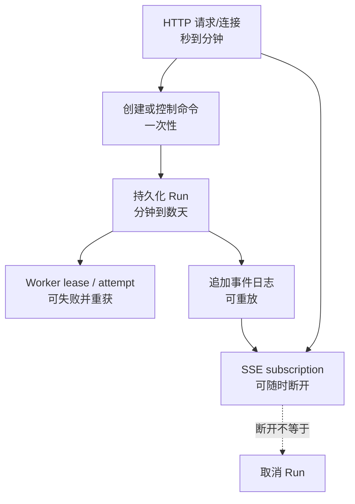
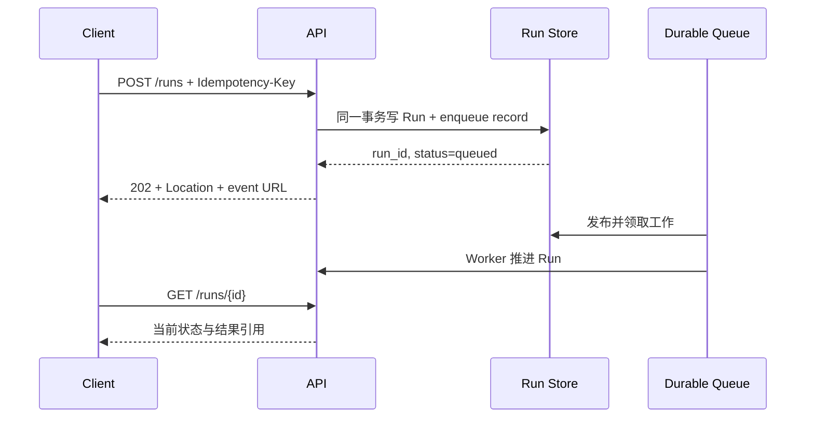
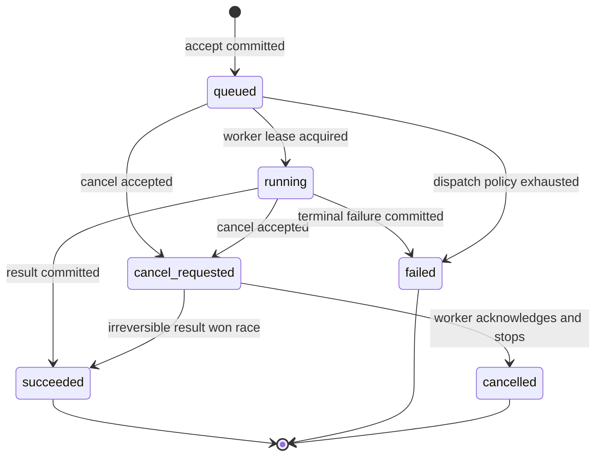
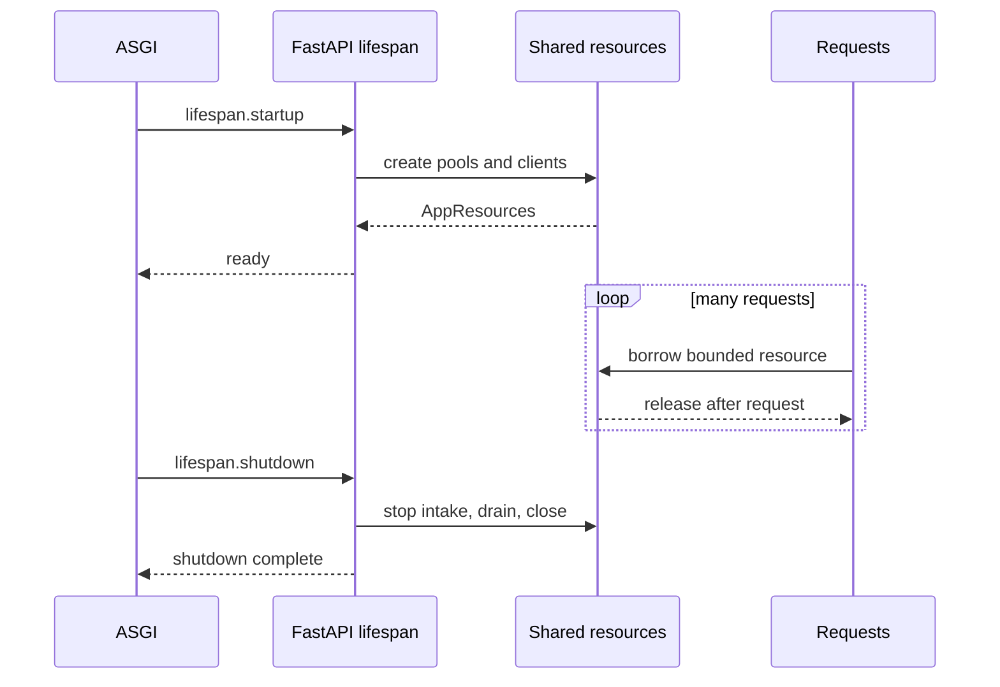
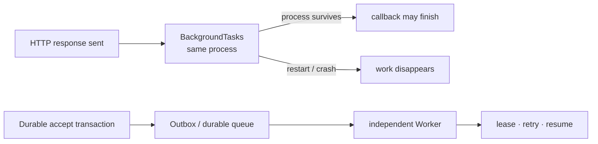
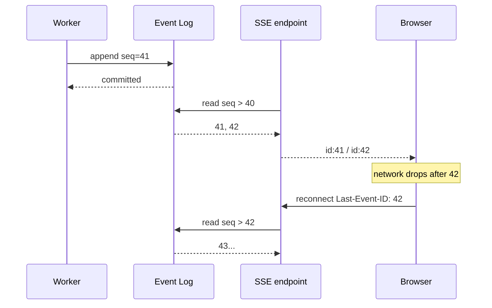

普通 CRUD 接口的生命周期很直观：请求到达，事务完成，响应返回。但一次 Agent Run 可能持续几十秒，调用多个模型和 Tool，期间客户端会休眠、网络会切换、网关会超时，服务进程也可能滚动发布。

如果把 Run 的生命绑在一条 HTTP 连接上，任何网络抖动都可能变成业务取消；如果简单把工作扔进 `BackgroundTasks`，进程重启又会让“已接受”悄悄变成丢失。

长任务 API 的核心设计是：**HTTP 请求只创建、查询或订阅 Run；Run 与事件由持久化状态机拥有；Worker 推进状态；SSE 只是事件日志的可重连视图，而不是任务本身。** 只有把四者分开，断线、取消、重试和部署才有明确语义。

本文是“AI Agent 后端工程”专题的 Chapter 04。上一章 [asyncio 可靠并发：Deadline、取消、限流与部分失败](/signal-grid-blog/posts/python-asyncio-deadlines-cancellation-backpressure/) 讨论了进程内 Task 的所有权；本章把长期所有权移交给可恢复 Run。

版本基线核对于 **2026-08-28**：当前稳定版为 [Python 3.14.7](https://www.python.org/downloads/release/python-3147/)、[FastAPI 0.141.1](https://fastapi.tiangolo.com/release-notes/#01411-2026-07-29)、[Starlette 1.6.0](https://starlette.dev/release-notes/#160-august-8-2026) 和 [HTTPX 0.28.1](https://pypi.org/project/httpx/0.28.1/)。HTTPX 1.0.dev5 仍是预发布版本。FastAPI 从 0.135.0 起原生提供 SSE；本文使用 `fastapi.sse.EventSourceResponse`，不再照搬旧教程的手工字符串拼接。实际项目仍应锁定整棵依赖，而不是分别安装“最新”。

## 一条 HTTP 连接不是一个 Run

客户端发起请求时，系统里至少产生三种寿命不同的对象：



它们的所有权不能混用：

| 对象 | 权威所有者 | 结束条件 | 断线后的含义 |
| --- | --- | --- | --- |
| HTTP 请求 | ASGI server | 响应完成或连接终止 | 本次交互结束 |
| Run | Run Store/状态机 | 进入终态 | 与某条连接无关 |
| Worker attempt | 调度器、租约 | 完成、失败或 lease 失效 | 由恢复协议决定是否重试 |
| SSE subscription | 当前响应 Task | 客户端断开或服务端结束流 | 只停止观察 |
| Run event | 追加事件日志 | 按保留策略删除 | 可被后续连接重放 |

因此“客户端断开是否取消后端任务”没有统一答案：对于没有持久状态、纯粹为当前页面生成临时预览的流，断开可以取消计算；对于已经返回 Run ID、可能产生副作用或需要审计的工作，断开只能取消订阅，真正取消必须走授权的控制命令。

## 创建接口必须先持久接受，再返回 202

[RFC 9110](https://www.rfc-editor.org/rfc/rfc9110.html#name-202-accepted) 对 `202 Accepted` 的定义很克制：请求已被接受处理，但处理尚未完成，最终甚至可能失败。HTTP 没有稍后“补发”最终状态的机制，所以响应应告诉客户端去哪里查询。

一组稳定的长任务资源可以这样分工：

```text
POST   /runs                    幂等创建 Run
GET    /runs/{run_id}           读取当前权威状态
GET    /runs/{run_id}/events    订阅或重放事件
POST   /runs/{run_id}/cancellation  请求取消
```



最关键的顺序是：**先在权威存储中创建 Run 和待派发记录，再返回 202。** 如果先返回再写队列，进程可能在两步之间崩溃，客户端拿到一个永远不存在的任务；如果直接向队列发送再写数据库，又可能留下无法查询的孤儿消息。常见解法是同一数据库事务内写 Run 与 Transactional Outbox，再由 relay 发布。

幂等键也不是简单的唯一字符串。服务端至少保存 `(tenant_id, idempotency_key, request_hash, run_id)`：

- 同租户、同 key、同规范化请求，返回原 `run_id`；
- 同租户、同 key、不同请求，返回 `409 Conflict`，不能悄悄复用；
- 幂等记录的保留时间必须覆盖客户端可能重试的时间窗；
- 身份和租户来自认证上下文，不能从请求体接受。

```python
from typing import Annotated

from fastapi import Depends, FastAPI, Header, Response, status
from pydantic import BaseModel, ConfigDict, Field

app = FastAPI()


class CreateRun(BaseModel):
    model_config = ConfigDict(extra="forbid", strict=True)
    task: str = Field(min_length=1, max_length=20_000)


class RunAccepted(BaseModel):
    run_id: str
    status: str
    status_url: str
    events_url: str


@app.post("/runs", response_model=RunAccepted, status_code=status.HTTP_202_ACCEPTED)
async def create_run(
    command: CreateRun,
    response: Response,
    idempotency_key: Annotated[str, Header(min_length=16, max_length=128)],
    principal: Annotated["Principal", Depends(authenticated_principal)],
    service: Annotated["RunService", Depends(run_service)],
) -> RunAccepted:
    run = await service.accept(
        tenant_id=principal.tenant_id,
        actor_id=principal.actor_id,
        idempotency_key=idempotency_key,
        command=command,
    )
    response.headers["Location"] = f"/runs/{run.run_id}"
    return RunAccepted(
        run_id=run.run_id,
        status=run.status,
        status_url=f"/runs/{run.run_id}",
        events_url=f"/runs/{run.run_id}/events",
    )
```

示例里的路径是 API 自身路径，不是博客链接；反向代理存在前缀时，生产代码应通过路由反解或配置生成绝对 URL。Run ID 也必须在查询层再次绑定租户，不能因为它“看起来随机”就把它当授权凭据。

## Run 状态机决定查询、重试和取消的答案

状态不能只有 `running: bool`。至少需要区分尚未领取、正在执行、取消请求已经记录和确定终止：



`cancel_requested` 和 `cancelled` 必须分开：API 只能记录意图；Worker 可能正处于不可中断的远端调用，也可能已经提交成功。若成功提交与取消并发，数据库里的条件更新、版本号或 compare-and-set 决定唯一合法终态。

查询响应应是状态投影，不是把整个内部 Trace 暴露出去。典型字段包括：

```python
from datetime import datetime
from typing import Literal

from pydantic import BaseModel

RunStatus = Literal[
    "queued", "running", "cancel_requested", "succeeded", "failed", "cancelled"
]


class RunView(BaseModel):
    run_id: str
    status: RunStatus
    version: int
    created_at: datetime
    updated_at: datetime
    last_event_id: int
    result: dict[str, object] | None = None
    error_code: str | None = None
```

`version` 允许客户端做条件刷新和识别倒退；`last_event_id` 连接查询视图与事件流。错误对外使用稳定 code，详细堆栈留在受控 Trace。若结果很大，返回带授权的资源引用，而不是让每次轮询重复传输整份内容。

### 取消本身也是幂等命令

`POST /runs/{id}/cancellation` 比 `DELETE /runs/{id}` 更能表达“记录取消请求而非删除资源”。重复调用应返回相同取消意图；已进入终态则返回当前状态，不应把已经成功的 Run 改写为 cancelled。

授权检查和状态转换要在同一服务边界内完成，Worker 通过持久化标志、消息或租约心跳观察取消。即使本地向正在执行的 Task 调用了 `cancel()`，远端模型或 Tool 是否停止仍取决于协议；结果未知时必须继续查询或对账。

## Lifespan 管资源，依赖注入管每次请求的能力

数据库池、HTTP client、事件通知器和 Worker dispatcher 适合在 ASGI lifespan 中创建和清理。FastAPI 当前推荐传入 `lifespan` async context manager；一旦提供它，旧式 `startup`/`shutdown` handlers 就不会再同时执行。



```python
from collections.abc import AsyncIterator
from contextlib import asynccontextmanager
from dataclasses import dataclass

import httpx
from fastapi import FastAPI, Request


@dataclass(slots=True)
class AppResources:
    runs: "RunRepository"
    events: "EventRepository"
    http: httpx.AsyncClient


@asynccontextmanager
async def lifespan(app: FastAPI) -> AsyncIterator[None]:
    database = await open_database_pool()
    http = httpx.AsyncClient(timeout=httpx.Timeout(20.0, connect=3.0))
    app.state.resources = AppResources(
        runs=SqlRunRepository(database),
        events=SqlEventRepository(database),
        http=http,
    )
    try:
        yield
    finally:
        await stop_accepting_local_work()
        await http.aclose()
        await database.close()


app = FastAPI(lifespan=lifespan)


def resources(request: Request) -> AppResources:
    return request.app.state.resources
```

Lifespan 的作用域是**一个应用进程实例**。启动四个 server worker 就会有四个 pool 和四次初始化；它不是分布式 singleton，也不能替代 leader election。FastAPI 文档还提醒，挂载的 sub-application 不会自动获得主应用 lifespan 事件。

依赖注入则把当前请求允许使用的能力传入 endpoint，并天然适合测试替换。带 `yield` 的 dependency 何时释放资源，必须按当前 scope 语义理解：FastAPI 0.118.0 恢复了“响应发送后再执行退出代码”的默认行为；0.121.0 起，默认 `Depends(scope="request")` 仍覆盖完整响应周期，显式 `scope="function"` 才会在 endpoint 返回后、响应发送前提前退出。这段版本史对 `StreamingResponse` 尤其重要，因为过早关闭 session 会让流在发送过程中失去资源。

即使默认 request scope 可能覆盖更长时间，也不要把请求借出的 ORM entity 或数据库 session 当成长任务的所有权。响应后的后台工作应只接收不可变 ID 和必要的可信上下文，再创建自己的资源与事务作用域；否则任务寿命会被一个容易随框架 scope、异常路径和测试方式变化的请求细节绑住。

## `BackgroundTasks` 是响应后的进程内回调，不是可靠队列

FastAPI 的 `BackgroundTasks` 会在响应发送后，于同一应用进程执行函数。它很适合短小、允许随进程丢失且无需独立恢复的工作，例如写一条非关键本地日志；它不提供持久化、跨进程调度、重试、租约或崩溃恢复。



因此不能先写 `background_tasks.add_task(run_agent, ...)`，再向客户端承诺“任务已可靠接受”。FastAPI 官方也把重计算、多进程和多服务器场景指向更完整的队列系统。具体产品可以是 Celery、任务编排器或自研 Worker，但契约必须至少包含持久接受、唯一操作标识、可见状态和恢复所有权。

更隐蔽的问题是依赖寿命：把 ORM entity 或 request-scoped session 传给后台回调，会在回调执行时遇到已关闭资源或过期对象。只传不可变 ID 和重新鉴权所需的可信上下文；后台回调自行开启事务并加载当前状态。

## SSE 是事件日志的传输视图，不是消息队列

SSE 使用 `text/event-stream`，始终按 UTF-8 解码。每个事件由 `data`、可选 `event`、`id`、`retry` 等字段组成，以空行结束。浏览器 `EventSource` 会在连接意外结束后重连，并在已记录 event ID 非空时发送 `Last-Event-ID` 请求头。

FastAPI 0.135.0 起可以直接返回 `ServerSentEvent`：

```python
from collections.abc import AsyncIterable
from typing import Annotated

from fastapi import Depends, Header
from fastapi.sse import EventSourceResponse, ServerSentEvent


@app.get("/runs/{run_id}/events", response_class=EventSourceResponse)
async def stream_run_events(
    run_id: str,
    principal: Annotated["Principal", Depends(authenticated_principal)],
    event_service: Annotated["EventService", Depends(event_service_dependency)],
    last_event_id: Annotated[int | None, Header(ge=0)] = None,
) -> AsyncIterable[ServerSentEvent]:
    cursor = last_event_id or 0
    async for item in event_service.follow(
        tenant_id=principal.tenant_id,
        run_id=run_id,
        after=cursor,
    ):
        yield ServerSentEvent(
            id=str(item.sequence),
            event=item.event_type,
            data=item.public_payload,
            retry=3000,
        )
```

当前 FastAPI 实现还会处理 no-cache、针对 Nginx 的 buffering header，并在空闲约 15 秒时发送 comment ping。但这些便利不改变可靠性边界：event 必须先进入持久化日志，SSE handler 再按 `(run_id, sequence)` 读取。

浏览器原生 `EventSource` 不能像 `fetch()` 那样任意设置 `Authorization` header。常见选择是同源、Secure、HttpOnly cookie，或使用能解析 SSE 的 fetch client；不要把长期 Bearer Token 放进 URL 和访问日志。无论凭据怎样传，服务端都必须在每次连接时校验 Run 的租户与读取权限，重连游标不能充当授权凭据。



`Last-Event-ID` 只是客户端带回的游标，不是持久化和 exactly-once 证明：

- 服务端必须保留游标之后的事件，否则应返回一个明确的“游标已过期”结果，让客户端重新读取 Run 快照；
- 事件 ID 必须在单个 Run 内稳定递增，不能用当前进程内数组下标；
- 网络可在发送和客户端处理之间断开，客户端更新 UI 时仍应按 ID 去重；
- 多实例 API 必须从共享日志读取，不能依赖发布事件的那台进程内 Queue；
- 慢订阅者不能无限占用内存，缓冲上限、断开和重连策略要明确。

正确的 `follow()` 通常循环执行“从数据库读取 `sequence > cursor` → 发送完已存在事件 → 等待通知或短轮询 → 再查数据库”。通知只负责唤醒，日志才是事实源；这样即使通知恰好发生在查询和等待之间，下一次查询仍能找到事件。

### 事件粒度应描述业务进展，而不是泄露内部 Token

SSE `event` 可以是 `run.started`、`step.completed`、`output.delta`、`run.failed` 等稳定公开类型。不要把供应商私有流事件原样穿透给前端，也不要把模型隐藏推理、Secrets 或完整 Tool 参数写入公开 event log。

终态事件与 `GET /runs/{id}` 的终态必须来自同一提交或可证明的顺序。SSE 页面只是低延迟提示；刷新后的权威答案仍由 Run 查询接口给出。

## 断开只取消订阅，显式命令才改变 Run

当客户端断开 SSE 时，ASGI server 会结束响应 Task，异步生成器会收到取消或关闭信号。生成器必须尽快释放当前数据库 cursor/通知订阅；它不应顺手把 Run 标记为 cancelled。

```python
from collections.abc import AsyncIterator


async def follow_events(run_id: str, cursor: int) -> AsyncIterator["RunEvent"]:
    subscription = await notifier.subscribe(run_id)
    try:
        while True:
            batch = await events.read_after(run_id, cursor, limit=100)
            for item in batch:
                cursor = item.sequence
                yield item
            if batch and batch[-1].terminal:
                return
            await subscription.wait(timeout=15.0)
    finally:
        await subscription.close()
```

这里的 `wait(timeout=...)` 是示意端口，不是 `asyncio.Event.wait()` 的原生签名。真实实现要把等待放进 Chapter 03 的端到端 Deadline/取消边界。

只有纯临时、无持久 Run、无不可逆副作用的“边生成边消费”接口，才可以把连接所有权与模型 Task 所有权绑定。即使如此，也要确认上游 provider 是否真的收到取消，以及断线后的 usage 和费用怎样记录。

## 测试必须区分应用契约、ASGI 生命周期和真实网络

一个只调用 endpoint 函数的单元测试证明不了 HTTP header、状态码、SSE framing 和 disconnect；一个只跑真实 server 的测试又很难稳定覆盖状态机竞态。合适的证据来自分层测试：

| 层次 | 主要证明 | 不能单独证明 |
| --- | --- | --- |
| 领域单元测试 | Run 状态转换、幂等冲突、事件 sequence | ASGI 和序列化 |
| `TestClient` | 路由、依赖、错误映射、lifespan | 多进程和真实代理缓冲 |
| HTTPX `ASGITransport` | async 调用链、数据库 async fixture | 自动运行 lifespan、真实 socket 时序 |
| 真实 Uvicorn 集成 | 流式 framing、断线、代理/超时配置 | 生产基础设施全部行为 |
| 故障注入 | crash/restart、Outbox、lease、游标恢复 | 模型质量 |

FastAPI 官方要求用 context manager 进入 `TestClient` 才会运行 lifespan：

这里还有一个截至本文日期的依赖迁移细节：Starlette 1.6.0 的 `TestClient` 优先使用独立的 `httpx2` 包，只把传统 `httpx` 保留为带弃用警告的兼容回退；FastAPI 0.141.1 的 standard extra 仍声明稳定 `httpx<1.0.0`。不要把“各项目最新版本”手工拼装成测试环境，应使用 FastAPI 项目锁定的整棵依赖，并把同步 `TestClient` 与下面直接使用 HTTPX 0.28.1 `ASGITransport` 的异步测试视为两条不同路径。

```python
from fastapi.testclient import TestClient


def test_idempotent_create(app: FastAPI) -> None:
    fake = FakeRunService()
    previous = app.dependency_overrides.copy()
    app.dependency_overrides[run_service] = lambda: fake
    app.dependency_overrides[authenticated_principal] = lambda: FakePrincipal(
        tenant_id="tenant-1", actor_id="user-1"
    )
    try:
        with TestClient(app) as client:
            headers = {"Idempotency-Key": "test-key-00000001"}
            body = {"task": "summarize account activity"}
            first = client.post("/runs", headers=headers, json=body)
            second = client.post("/runs", headers=headers, json=body)

        assert first.status_code == 202
        assert second.status_code == 202
        assert first.json()["run_id"] == second.json()["run_id"]
        assert first.headers["location"].endswith(first.json()["run_id"])
        assert fake.created_count == 1
    finally:
        app.dependency_overrides.clear()
        app.dependency_overrides.update(previous)
```

异步测试可以使用 HTTPX：

```python
import httpx
import pytest
from asgi_lifespan import LifespanManager


@pytest.mark.anyio
async def test_run_not_found(app: FastAPI) -> None:
    transport = httpx.ASGITransport(app=app)
    async with LifespanManager(app):
        async with httpx.AsyncClient(
            transport=transport,
            base_url="http://testserver",
        ) as client:
            response = await client.get("/runs/missing")
    assert response.status_code == 404
```

HTTPX 官方明确说明 `ASGITransport` 不负责触发 lifespan，因此示例显式加入 `LifespanManager`。SSE 的逐块到达时间和客户端断开最好再启动真实 Uvicorn 测试；部分内存 ASGI transport 会缓冲响应，不能用它的行为推断真实网络流式性。

### 最有价值的是竞态不变量

长任务 API 的故障测试应对最终状态和证据作出明确判定：

| 竞态/故障 | 必须成立的性质 |
| --- | --- |
| POST 提交后、202 返回前进程崩溃 | 同 key 重试得到同一 Run，或事务完全未提交 |
| Worker 完成与取消请求并发 | 只有一个合法终态，版本单调增加 |
| SSE 在 event 42 后断线 | 以 42 重连只读取之后事件；重复到达不会重复应用 |
| API 实例滚动重启 | Run 与事件仍可由另一实例查询和重放 |
| Worker lease 过期后旧 Worker 恢复 | fencing/version 阻止旧 attempt 提交新状态 |
| 事件已超出保留窗口 | 客户端得到明确过期语义并重建快照，不静默漏事件 |

这些测试证明的是运行协议。它们不证明输出内容可靠；模型不确定性与事实边界是下一章的主题。

## 结论：连接负责传输，状态机负责真相

FastAPI 能简洁地表达 API、依赖和 SSE，但可靠长任务来自框架之下的所有权划分：

1. `202 Accepted` 只说明已接受，必须在返回前持久创建 Run，并给出查询位置；
2. Run 状态机是权威事实，Worker attempt、HTTP 请求和 SSE subscription 都只是短寿命执行单元；
3. `BackgroundTasks` 是同进程响应后回调，不能替代持久队列和恢复协议；
4. `Last-Event-ID` 让客户端携带游标，持久事件日志、稳定 sequence 和去重才让重连有意义；
5. 客户端断开默认只结束观察，改变 Run 必须通过显式、授权且幂等的取消命令；
6. TestClient、ASGITransport 和真实 server 分别证明不同层次，任何一个都不是完整生产证据。

下一章 [LLM 后端心智模型：Token、上下文、Embedding 与不确定性](/signal-grid-blog/posts/llm-backend-token-context-embeddings-uncertainty/) 会进入 Run 内部最不确定的组件：模型究竟消费什么、生成什么，以及后端为何不能把相似、流畅和真实混为一谈。

## 参考资料

- [FastAPI 0.141.1 Release Notes](https://fastapi.tiangolo.com/release-notes/#01411-2026-07-29) 与 [FastAPI PyPI](https://pypi.org/project/fastapi/)：当前稳定版本和依赖范围。
- [FastAPI Server-Sent Events](https://fastapi.tiangolo.com/tutorial/server-sent-events/)：0.135.0 起的 `EventSourceResponse`、`ServerSentEvent`、ping 与 buffering 行为。
- [WHATWG Server-sent events](https://html.spec.whatwg.org/multipage/server-sent-events.html)：`text/event-stream`、UTF-8、字段解析、自动重连与 `Last-Event-ID` 的规范语义。
- [RFC 9110: 202 Accepted](https://www.rfc-editor.org/rfc/rfc9110.html#name-202-accepted)：异步接受响应的 HTTP 保证边界。
- [FastAPI Lifespan Events](https://fastapi.tiangolo.com/advanced/events/) 与 [Testing Events](https://fastapi.tiangolo.com/advanced/testing-events/)：资源生命周期和 `TestClient` 上下文语义。
- [FastAPI Background Tasks](https://fastapi.tiangolo.com/tutorial/background-tasks/) 与 [Advanced Dependencies](https://fastapi.tiangolo.com/advanced/advanced-dependencies/)：响应后回调、重计算边界和 `yield` dependency 资源寿命。
- [FastAPI Async Tests](https://fastapi.tiangolo.com/advanced/async-tests/) 与 [HTTPX Transports](https://www.python-httpx.org/advanced/transports/)：ASGITransport、AsyncClient 和 lifespan 的测试边界。
- [ASGI Lifespan Specification](https://asgi.readthedocs.io/en/latest/specs/lifespan.html)：应用启动、关闭及每事件循环状态的底层协议。
