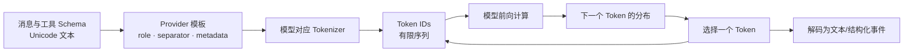
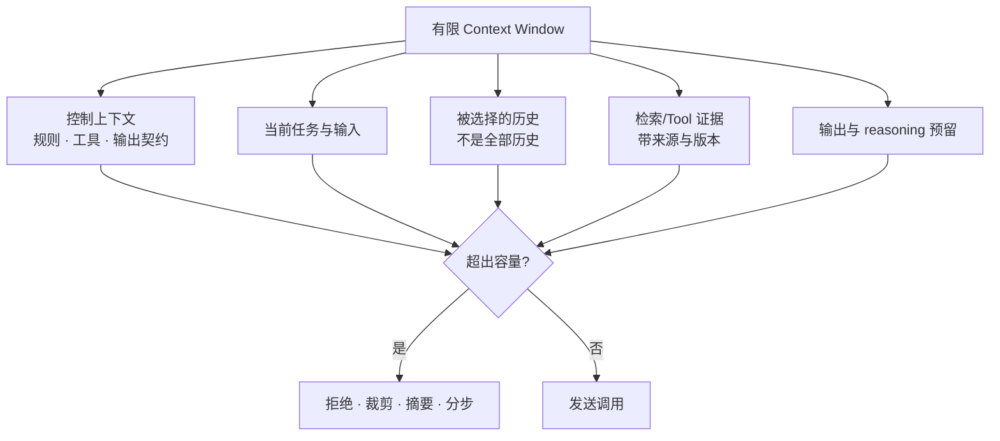
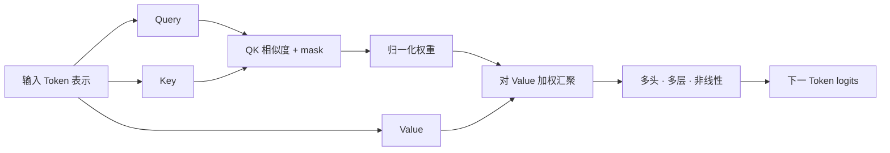
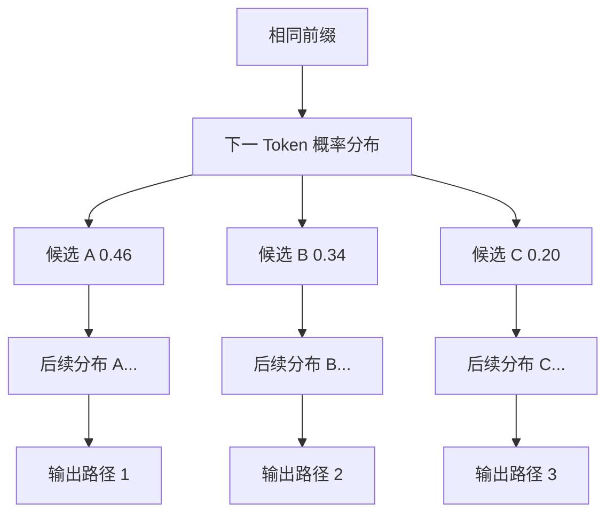
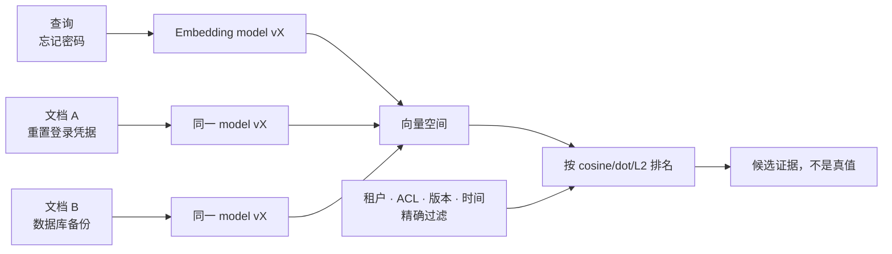
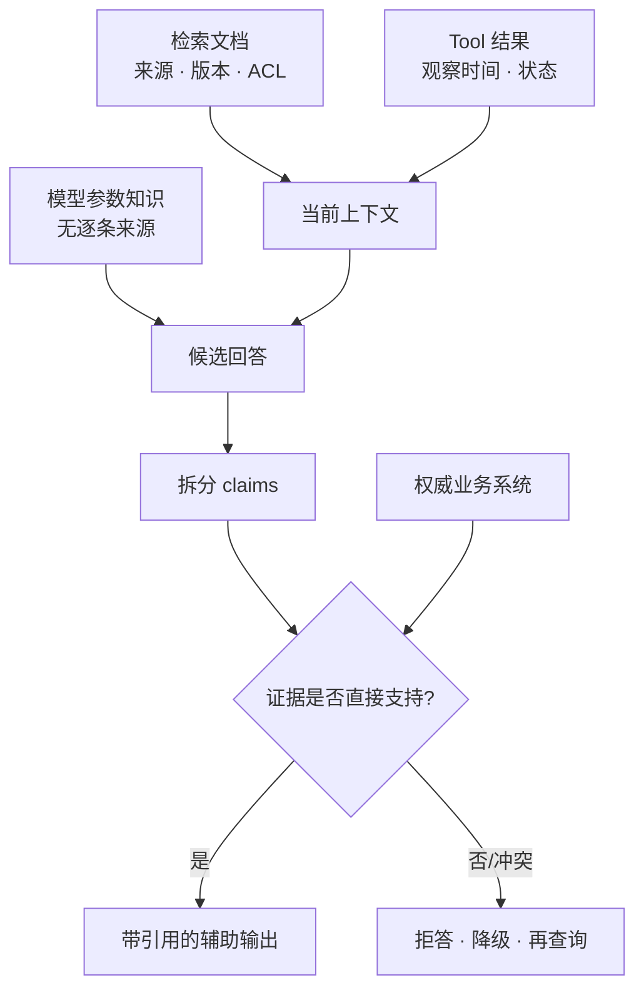
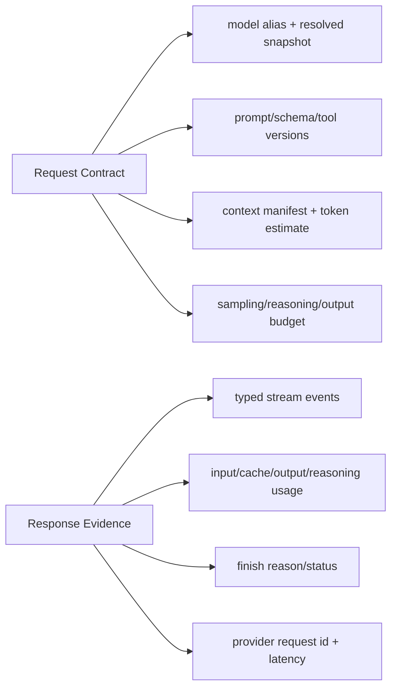

后端工程师很容易用传统服务的直觉理解大语言模型：输入一段字符串，调用一个函数，得到一个字符串。这个接口形状没有错，却隐藏了决定成本、延迟和可靠性的全部机制。

模型实际接收的是 Token 序列；有限上下文同时容纳指令、历史、工具定义、证据和输出预算；每个输出 Token 来自一个条件概率分布；Embedding 只编码某种统计相关性；一段流畅文字也可能没有任何权威事实支持。

因此本章的论点是：**LLM 不是返回真值的远程函数，而是受有限上下文条件约束的概率序列生成器。后端必须分别治理预算、生成不确定性、语义相似度和事实证据，不能用“模型很强”把四者合并。**

本文是“AI Agent 后端工程”专题的 Chapter 05。上一章 [FastAPI 长任务接口：SSE、生命周期与可测试边界](/signal-grid-blog/posts/fastapi-long-running-tasks-sse-testing/) 建立了可靠 Run 外壳；本章解释其中模型调用的工程语义。

资料基线核对于 **2026-08-28**。当前 OpenAI 模型目录已经同时列出模型的 Context Window、Max Output、Knowledge Cutoff 和 Usage 细分，Responses API 还区分 input、cached input、output 与 reasoning tokens；这些具体上限会随模型变化。正文不把某个供应商的数字写成普遍规律，而以当前 [OpenAI Models](https://developers.openai.com/api/docs/models)、[Responses API](https://developers.openai.com/api/reference/resources/responses/methods/create)、[Embeddings API](https://developers.openai.com/api/reference/resources/embeddings/methods/create) 及 Transformer 论文和 NIST GenAI Profile 为语义依据。

## 模型看到的不是字符串，而是带边界的 Token 序列

Tokenizer 把文本编码成词表中的整数 ID。一个 Token 可能是完整单词、词的一部分、标点、空格组合或若干字节；它不是稳定的“一个字”或“一个单词”。同一段文本换模型或 tokenizer 后，边界和数量都可能改变。



这带来几个容易被字符计数掩盖的后果：

- 中文、英文、代码、Emoji 和随机标识符的 Token/字符比例不同；
- 消息 role、工具 JSON Schema、结构化输出 Schema 和供应商模板也占输入；
- 多模态输入可能按 patch、帧或其他模型规则折算，不是“图片零 Token”；
- 流式 API 只是更早交付已生成片段，不会减少生成所需计算；
- 客户端 tokenizer 估算适合准入，服务端 response usage 才是本次请求的权威计量。

不要用 `len(text) / 4` 一类经验公式做硬边界。准入时应调用供应商的 token-count endpoint，或使用与**确切模型/编码版本**匹配的 tokenizer；仍要给消息模板和工具定义保留余量。OpenAI 当前 Responses API 已提供 input token count 接口，这比拿旧模型 tokenizer 猜新模型可靠。

### Token 还是协议边界

原始网络字节块可能切在 UTF-8 码点中间，但 Provider SDK/Adapter 完成 SSE、JSON 与字符解码后，暴露给业务层的 `delta: str` 不应包含半个 Unicode 码点。即便如此，一个用户感知的字形仍可能由跨 delta 的组合字符或 Emoji 序列组成，JSON 转义、JSON token、Tool 参数字段和字符串结尾也都可能跨多个增量。应用必须按供应商事件类型累积，并在明确的“结构完成”事件后解析；不能对每个文本 delta 单独 `json.loads()`，更不能把底层 byte chunk 直接冒充业务文字事件。

Token usage 也要保留分类，而不是只存 `total_tokens`。缓存输入、非缓存输入、可见输出和内部 reasoning 的价格与限制可能不同；某些 API 的 `max_output_tokens` 同时约束可见输出与 reasoning tokens。统一模型网关必须保留这些差异，下一章会专门设计事件与 Usage 契约。

## Context Window 是一次计算的容量，不是长期记忆

上下文窗口描述一次模型计算能够接收和生成的 Token 范围。它不意味着模型会永久记住内容，也不意味着窗口内每个位置都被同等有效利用。

一次调用的容量账本可以写成：

```text
上下文占用
= 固定指令
+ 当前输入
+ 被选择的会话历史
+ Tool 定义与输出 Schema
+ 检索文档和 Tool 结果
+ 多模态输入折算
+ 生成所需预算
+ Provider/模型特有开销
```

其中最后两项必须以具体模型文档为准；对于 reasoning 模型，还要明确 reasoning tokens 怎样计入输出上限和 Usage。不能只比较“用户 Prompt 字数”。



OpenAI 当前 Responses API 仍描述 `truncation=disabled/auto` 的兼容语义，但该参数已经标为 **Deprecated**：`disabled` 超出模型上下文会以 400 失败；`auto` 则可能从对话开头丢弃 item 以适配窗口。自动截断是传输策略，不是语义正确性，更不应成为长期依赖的接口。若开头包含授权约束、用户确认或关键证据，静默丢弃会改变任务含义。

正确做法是应用自己维护 Context Manifest，记录每个片段的：

| 字段 | 回答的问题 |
| --- | --- |
| `kind` | 系统规则、用户输入、历史、检索证据还是 Tool 结果 |
| `source_id/version` | 从哪里来，哪个版本 |
| `observed_at` | 何时观察到 |
| `authority` | 它是事实源、辅助材料还是模型摘要 |
| `token_count` | 使用哪个 tokenizer 得到的预算 |
| `retention_policy` | 超预算时能否删除、摘要或必须保留原文 |

这个 Manifest 不能让模型“记得更多”，但能让后端解释为什么某份信息进入或离开本次调用。

### 大窗口仍然需要选择

Attention 让一个位置的表示根据上下文中其他位置加权更新，但它不是数据库索引，也不会承诺自动找到窗口里的每个细节。长上下文会增加计算和传输成本；相互矛盾、过期或恶意片段也会一起进入判断。

“Lost in the Middle” 一类研究还表明，模型对长输入中相关信息的位置可能敏感。具体模型持续变化，因此不能把某篇论文的准确率当永久常数；工程结论是必须用本业务语料测试位置、长度、干扰项和引用忠实度，不能只测“请求没有超过最大 Token”。

## Attention 解释条件化生成，不提供事实查询保证

Transformer 的 self-attention 可以粗略理解为：每个 Token 生成 query，与其他 Token 的 key 计算相关权重，再汇聚 value。多层、多头计算让表示随上下文变化。



这张图是工程心智模型，不是完整训练教程。需要保留的边界有三条：

第一，输出依赖**当前序列**。修改系统指令、文档顺序、Tool Schema 或一个空格，都可能改变后续概率分布。

第二，Attention 权重不是可靠解释。某个位置权重大，不等于它因果上决定了结论，更不等于结论为真。后端审计应记录可见输入、Tool 调用和外部证据，而不是把内部 attention map 当业务理由。

第三，Reasoning 是调用时使用更多推理计算和中间表示的一类能力/接口。它可以提高某些任务成功率，也会改变延迟和 Token 账本；它不是数学证明或事实数据库。是否增加 reasoning effort，必须由代表性 Eval 的质量—延迟—成本曲线决定。

## 生成是逐 Token 条件分布，低温也不是真值开关

自回归模型在第 `t` 步估计：

```text
P(token_t | token_1, token_2, ..., token_{t-1}, context)
```

模型先输出每个候选 Token 的 logit。Temperature 常被实现为在 softmax 前缩放 logits：

```text
p_i(T) = exp(z_i / T) / Σ_j exp(z_j / T)
```

较高 Temperature 通常让分布更平，较低 Temperature 让高 logit 候选更集中。`top_p` 则从累计概率达到阈值的候选集合中采样。供应商 API 的具体支持范围会变化，官方文档通常也建议不要同时大幅调 temperature 和 top_p，否则很难解释变化来自哪里。



早期一个不同 Token 会改变所有后续条件，所以两个输出可能迅速分叉。Temperature=0 往往趋近选择最高概率候选，但不能把它当跨时间、跨硬件和跨服务端版本的字节级确定性保证：并列/近似 logits、并行浮点计算、路由和模型更新都可能改变结果。

随机种子也不是跨端点保证。OpenAI 当前 Chat Completions 仍把 `seed` 标成 **Beta 且 Deprecated**，只承诺 best effort；配套的 `system_fingerprint` 响应字段同样已标 Deprecated。当前 Responses Create 契约并没有等价的 `seed` 参数。因此后端只能把 seed 视为某个端点、模型和时点上的实验控制量，不能把旧 Cookbook 示例或一次相同 fingerprint 提升为可复现协议。需要稳定回归时，保存固定输入、模型快照/路由和输出 corpus，再用容差明确的 Eval 判断，而不是断言两次生成逐字相同。

下面的纯 Python 实验只演示 temperature 怎样重塑一个固定 logits 分布，不是任何供应商的真实 sampler。它先减去最大值避免指数溢出，再用固定种子让教学输出可复核：

```python
from collections import Counter
from math import exp
from random import Random
from collections.abc import Sequence


def softmax(logits: Sequence[float], temperature: float) -> list[float]:
    if not logits or temperature <= 0:
        raise ValueError("logits must be non-empty and temperature must be positive")
    scaled = [value / temperature for value in logits]
    peak = max(scaled)
    weights = [exp(value - peak) for value in scaled]
    total = sum(weights)
    return [weight / total for weight in weights]


def sample_counts(temperature: float, samples: int = 10_000) -> Counter[str]:
    labels = ["A", "B", "C"]
    probabilities = softmax([2.0, 1.5, 0.5], temperature)
    rng = Random(20260828)
    return Counter(rng.choices(labels, weights=probabilities, k=samples))


focused = sample_counts(0.3)
diverse = sample_counts(1.2)
assert focused["A"] > diverse["A"]
assert sum(focused.values()) == 10_000
```

因此测试模型系统不应把完整字符串 equality 当唯一 oracle。更可靠的层次是：

- 协议测试用 Fake/recording 固定事件，验证确定性代码；
- Schema 测试验证输出可解析、字段约束和拒绝路径；
- 质量 Eval 在冻结的数据集、模型 snapshot、Prompt 版本和参数下统计通过率；
- 模型升级比较分布、失败簇、延迟和 usage，不只比较平均分；
- 高风险动作始终由确定性策略、权限和业务不变量决定。

### 概率不是置信度

下一个 Token 的概率描述模型在当前条件下对语言延续的分布，不是“这句话为真的概率”。即使 API 返回 logprobs，它也不能自动成为事实置信度、风险评分或拒绝阈值。若业务需要校准置信度，必须定义有标签任务并单独验证 calibration。

## Embedding 编码相似性，不判断事实真假

Embedding 模型把输入映射为固定维度向量。距离或相似度可用于检索、聚类、推荐、异常检测和分类；OpenAI 当前仍把 `text-embedding-3-large` 定义为其最强的通用文本 Embedding，并允许 `text-embedding-3` 系列选择输出维度。



最常见的 cosine similarity 是：

```text
cos(a, b) = (a · b) / (||a|| ||b||)
```

一个可检查的纯 Python 实现如下：

```python
from math import sqrt
from collections.abc import Sequence


def cosine_similarity(left: Sequence[float], right: Sequence[float]) -> float:
    if len(left) != len(right) or not left:
        raise ValueError("vectors must have the same non-zero dimension")
    left_norm = sqrt(sum(value * value for value in left))
    right_norm = sqrt(sum(value * value for value in right))
    if left_norm == 0 or right_norm == 0:
        raise ValueError("cosine similarity is undefined for a zero vector")
    dot = sum(a * b for a, b in zip(left, right, strict=True))
    return dot / (left_norm * right_norm)
```

这个分数只能解释为“在这个模型、预处理、维度和距离函数下，两段输入的向量方向有多接近”。它不是：

- 文档支持某个具体 claim 的概率；
- 文档为最新版本的证明；
- 用户有权限读取文档的证明；
- 两个实体相同或两条记录应该 JOIN 的主键；
- 跨 Embedding 模型可直接比较的全局尺度。

索引必须把 `embedding_model`、snapshot/版本、维度、归一化方式、chunker 版本和 distance metric 作为物理契约。升级模型时重建到新索引并做离线/影子评测，不能把新旧向量静默混入同一空间。

### 相似度阈值必须在任务数据上校准

`0.8` 没有脱离语料的普遍含义。短 FAQ、长法律条款、代码和多语言文档会形成不同分布；top-k 也只保证返回排名靠前者，即使所有候选都很差。

检索 Eval 至少区分：相关文档是否进入候选集（Recall）、靠前程度（MRR/nDCG）、权限与元数据过滤是否正确，以及最终回答中的 claim 是否被候选原文支持。最后一项不是向量分数能代替的。

## 参数知识、上下文证据和业务事实是三种不同来源

模型参数在训练中吸收了统计模式，可以产生广泛知识，但模型通常不能给每个参数化记忆附上来源、版本和观察时间。所谓 knowledge cutoff 只是模型资料边界的一项说明，不保证 cutoff 之前每个事实正确，也不意味着之后的事实一定未知。

RAG 文档和 Tool 结果进入当前上下文后，模型可以据此回答；但“进入上下文”仍不等于“被正确引用”。文档可能过期、互相冲突或被恶意内容污染，Tool 也可能失败、返回部分结果或观察到不同时间点。



NIST AI 600-1 使用 **confabulation** 描述生成式系统自信地产生错误或虚假内容，也包括偏离来源输入和前后矛盾。它不是偶发网络错误，而是统计生成系统必须治理的风险。

后端不能靠一句“不要幻觉”消除它，而要把输出拆成不同契约：

| 输出用途 | 可接受来源 | 必要控制 |
| --- | --- | --- |
| 创意草案 | 模型生成 | 内容安全与人工编辑 |
| 文档摘要 | 指定文档 | claim—citation 忠实度、覆盖率 |
| 实时账户状态 | 权威 Tool/数据库 | 身份、租户、观察时间、失败关闭 |
| 外部动作建议 | 多源证据 | 风险策略、审批、参数再绑定 |
| 实际副作用 | 领域服务 | 确定性校验、幂等、审计、对账 |

Structured Output 能保证结构更容易解析，不能保证字段里的事实正确；RAG 能提供材料，不能保证模型忠实使用；让另一个模型“复核”也不天然独立，因为两者可能共享缺陷和污染上下文。

## 模型调用契约必须记录足够信息解释结果

把模型当普通 `str -> str` 函数，会丢失定位成本、截断和行为漂移所需的证据。一个供应商中立的调用记录至少分成四组：



下面的模型不是某一家 SDK 的复制，而是业务层需要保留的最小证据：

```python
from dataclasses import dataclass
from typing import Literal


@dataclass(frozen=True, slots=True)
class TokenUsage:
    input_tokens: int
    cached_input_tokens: int
    output_tokens: int
    reasoning_tokens: int | None


@dataclass(frozen=True, slots=True)
class ModelCallEvidence:
    provider: str
    requested_model: str
    resolved_model: str | None
    prompt_version: str
    context_manifest_hash: str
    status: Literal["completed", "incomplete", "failed", "cancelled"]
    finish_reason: str | None
    usage: TokenUsage | None
    provider_request_id: str | None
```

记录这些字段并不意味着复制完整 Prompt。生产 Trace 需要对个人信息、Secrets、Tool 输出和文档内容做分级、脱敏与保留期限控制；可以记录 manifest hash、来源 ID 和版本，而不是无限保存原文。

### 预算必须在调用前准入，在调用后对账

调用前用 tokenizer 估计输入、预留输出/reasoning、检查 Run 的剩余 Token 和金额预算；调用后用 provider usage 入账。估计和实际差异本身要监控，因为它可能意味着模板、工具 Schema 或模型编码发生变化。

预算拒绝不是模型失败。它应有独立错误码，让上层选择缩短证据、降低输出、换模型或请求用户确认，而不是在重试中不断消耗同一配额。

## 结论：相似、流畅、可重复和真实彼此独立

一个可用的 LLM 后端心智模型应保留以下边界：

1. Token 是模型和计费协议的基本单位，不等于字符；模型对应的计数与最终 usage 才能支撑预算；
2. Context Window 是一次计算的有限容量，不是长期记忆；裁剪与摘要是语义决策，不能交给静默截断；
3. 自回归生成从条件分布逐 Token 选择，低 Temperature 和 seed 只能收窄变化，不能提供事实或跨版本确定性；
4. Embedding 适合召回语义候选，分数不是正确率、权限或事实支持度；模型/维度/预处理变化要求版本化重建；
5. 参数知识、文档证据、Tool 观察和权威业务事实有不同信任等级，最终动作仍由确定性系统校验；
6. 记录模型、Prompt、Context Manifest、参数、Usage 和完成状态，才能解释一次输出为何如此昂贵、为何截断、为何漂移。

下一章 [Model Gateway：流式事件、限流、预算与可替换模型](/signal-grid-blog/posts/model-gateway-streaming-rate-limits-fake-model/) 会把这些概念变成代码契约：如何统一 provider adapter，又不丢失流事件、Usage、Rate Limit 和错误细节。

## 参考资料

- [Attention Is All You Need](https://arxiv.org/abs/1706.03762)：Transformer、自注意力与自回归建模的基础论文。
- [OpenAI Models](https://developers.openai.com/api/docs/models) 与 [Model Comparison](https://developers.openai.com/api/docs/models/compare)：当前模型的上下文、最大输出、knowledge cutoff 与能力字段。
- [OpenAI Responses API](https://developers.openai.com/api/reference/resources/responses/methods/create) 与 [Input Token Count](https://developers.openai.com/api/reference/resources/responses/subresources/input_tokens)：truncation、输出上限、Usage 和调用前计数语义。
- [OpenAI Embeddings](https://developers.openai.com/api/reference/resources/embeddings/methods/create)、[`text-embedding-3-large`](https://developers.openai.com/api/docs/models/text-embedding-3-large)：向量、输入限制、可选维度与模型定位。
- [OpenAI Chat Completions Create](https://developers.openai.com/api/reference/resources/chat/subresources/completions/methods/create)：当前 `seed` 的 Beta/Deprecated 标记、best-effort 语义，以及已弃用的 `system_fingerprint` 字段；与 Responses 契约对照可见其端点边界。
- [Lost in the Middle](https://aclanthology.org/2024.tacl-1.9/)：长上下文中信息位置与利用效果的实证研究。
- [NIST AI 600-1: Generative AI Profile](https://doi.org/10.6028/NIST.AI.600-1)：confabulation、信息完整性与生成式 AI 风险管理。
- [PyTorch Reproducibility](https://docs.pytorch.org/docs/stable/notes/randomness.html)：跨版本、平台和设备不能假定完全可复现的底层计算边界。
