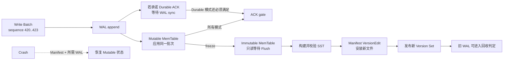

LSM Tree 常被概括成一句话：“先顺序写内存和日志，攒够后刷成 SSTable，后台再合并。”这句话描述了数据流向，却没有给出正确性边界。崩溃时，WAL 与 MemTable 谁覆盖谁？十个 SSTable 都有同一个键时，哪个版本获胜？Compaction 生成一半新文件便掉电，恢复后该相信输入文件还是输出文件？删除墓碑何时才能真正消失而不让旧值复活？

本文的中心论点是：**LSM Tree 不是一堆按层摆放的排序文件，而是一份由全序版本、不可变 Run、版本化元数据和原子 Compaction 安装共同维持的状态机；顺序写只带来写路径机会，Snapshot、删除与崩溃正确性取决于 Version Set 和回收证明。**

本文承接[MVCC：版本链、Snapshot、Visibility、Vacuum 与长事务](/signal-grid-blog/posts/mvcc-version-chains-snapshots-visibility-vacuum-long-transactions/)建立的版本可见性与回收前沿。通用模型来自 O'Neil 等人的 LSM Tree 原始论文；RocksDB/LevelDB 官方文档用作现代实现实例。RocksDB 的 Column Family、配置项和文件命名不是 LSM 的普遍定律，本文也不会写成 RocksDB API 百科。

## 1. LSM 的权威状态是“版本顺序 + 当前文件集合”

一个最小 LSM 引擎必须先声明四条不变量：

```text
I1. 每个写入批次在一个历史代际内拥有唯一、全序的 sequence。
I2. Read(snapshot) 对所有内存与磁盘 Run 做同一套版本/墓碑裁决。
I3. Compaction 改变物理布局，不改变任何受支持 Snapshot 的逻辑结果。
I4. Crash 后只恢复 Manifest 已安装的 SST 集合，再用所需 WAL 补齐其后状态。
```

第一条让“较新”不依赖文件修改时间；第二条让读取不因数据位于 MemTable 或 SSTable 而改变；第三条把 Compaction 定义成语义保持变换；第四条确定恢复时谁有资格宣布文件存活。

可以把内部键抽象为：

```text
InternalKey = (userKey, sequence DESC, kind)
kind        = VALUE | POINT_TOMBSTONE | RANGE_TOMBSTONE
```

同一 `userKey` 下先看较大 `sequence`，再解释 `kind`。真实引擎还要编码批次边界、Column Family、事务准备/提交状态、Merge Operand 或 Timestamp；但绝不能只按 `userKey` 排序后任意保留一条。

“当前数据库”同样不是目录里所有 `.sst` 文件的并集，而是元数据声明的一个 **Version Set**：哪些 SST 属于哪个 Sorted Run/Level，各文件覆盖什么 Key Range，哪些 WAL 仍需恢复，最新分配的 Sequence 是多少。目录里存在却未安装的文件只是 Orphan；Manifest 引用却缺失或校验失败的文件是损坏，不能把它们都当成普通空数据。

## 2. WAL、Mutable MemTable 与 Immutable MemTable 组成一次写入交接

前台写入的常见路径是：先为 Write Batch 分配 Sequence Range，将可恢复记录追加到 WAL，再把同一批变化应用到当前 Mutable MemTable。是否必须等 WAL Sync 后才 ACK，取决于公开的耐久级别；若只完成 OS `write` 或明确禁用 WAL，崩溃承诺就更弱。

Mutable MemTable 达到阈值后不会继续被并发改写，而是被**冻结**为 Immutable MemTable；新的 Mutable MemTable 与新的/当前 WAL 接管后续写入。后台把 Immutable MemTable 按内部键顺序生成 SSTable。只有 SST 完整写出、持久化并被 Manifest 安装后，覆盖该 MemTable 的旧 WAL 才可能进入回收判定。



[RocksDB MemTable 文档](https://github.com/facebook/rocksdb/wiki/MemTable)明确区分当前 MemTable 与等待 Flush 的 Immutable MemTable；[RocksDB Overview](https://github.com/facebook/rocksdb/wiki/RocksDB-Overview)则把 MemTable、SST File 和 Log File 列为基本构件。这一写入交接有几个容易漏掉的顺序约束：

- WAL 中可重放的批次必须先于“Durable ACK”；
- SST 不能只写完 Data Block 就算完成，Footer、Index、Filter、Checksum 与文件长度都要可验证；
- 在本文采用的“已安装 SST 是恢复基线”契约中，Manifest 安装不能先于 SST 持久化；若产品允许更弱的文件持久性，就必须继续保留可重建输出的旧 SST/WAL，并把这条替代恢复路径写入协议；
- WAL 删除不能早于所有依赖它的 MemTable 都由已安装 SST 覆盖；跨多个 Column Family 的 Atomic Flush 还需要共同安装点；
- Sequence 分配不能在恢复后倒退，否则新值可能被旧 SST 中较大的 Sequence 遮蔽。

因此，MemTable 是写缓冲和最新读源，却不是唯一恢复事实；WAL 是未 Flush 状态的恢复材料，却不负责枚举当前 SST 集合；Manifest 负责文件拓扑，却不能替代仍未物化的 WAL 内容。

## 3. SSTable 把顺序读写转化成一次多路可见性合并

SSTable 是不可变、有序的键值 Run。典型 Block-based SST 会包含 Data Block、稀疏 Index、可选 Filter、压缩与校验元数据。不可变让缓存、并发读和后台重写更容易推理，但它不意味着一次查询只访问一个文件。

### Point Get 必须查遍所有可能含有更新版本的 Run

一次 `Get(K, snapshot=500)` 的概念路径是：

1. 查询 Mutable MemTable 和仍存活的 Immutable MemTable；
2. 查询可能包含 `K` 的 L0 文件；L0 文件的 Key Range 常可重叠，不能假设只命中一个；
3. 对每个后续 Leveled Run，用文件边界与 Index 定位候选 SST；
4. 在所有 `sequence <= 500` 的候选中选择最高版本；若它是有效 Tombstone，则返回 Not Found；
5. 若遇到事务 Intent、Merge Operand 或范围墓碑，进入产品定义的额外裁决，而不是把其当普通 Value。

Bloom Filter 可以排除“一定不含该键”的 SST，阳性仍需实际读取验证。正确 Filter 允许 False Positive，不允许 False Negative；损坏 Filter 若被静默信任，可能把存在的较新版本跳过，返回旧值而非单纯降低性能。安全实现要么验证 Filter 完整性，要么在 Filter 不可信时绕过它并读取权威 Index/Data Block；无法安全降级时才 Fail Closed。[RocksDB Bloom Filter 文档](https://github.com/facebook/rocksdb/wiki/RocksDB-Bloom-Filter)也将 Filter 定位为避免无效读取的概率结构，而不是键是否存在的权威索引。

### Range Scan 不是多个 Point Get 的简单循环

范围扫描要为所有相交 Run 建立 Iterator，用 Merge Heap 按 `(userKey, sequence)` 做多路归并。每个逻辑键只输出 Snapshot 可见的当前版本；Point/Range Tombstone 必须在覆盖范围内压制更老值。若底层 Level 保证文件 Key Range 不重叠，可以只打开相交文件；Tiered 或 L0 有多个重叠 Run 时，读放大更高。

Filter 对大范围遍历帮助有限，Index 也只能定位每个 Run 的起点。一次慢扫描的原因可能不是数据量本身，而是 Run 数、墓碑密度、被 Snapshot 固定的旧版本以及块缓存污染。LSM 把前台随机写转为顺序追加，同时把一部分整理工作和查询复杂度推迟到了读路径与 Compaction。

## 4. Manifest 的原子安装点决定一次 Compaction 是否存在

Compaction 会读取一组输入 SST，合并版本与 Tombstone，生成一组输出 SST。新旧文件在构建期间可能同时存在；目录状态本身无法告诉恢复器哪组代表最后一个完整数据库。

[RocksDB MANIFEST 文档](https://github.com/facebook/rocksdb/wiki/MANIFEST)把元数据组织为 `CURRENT` 指向某个 Manifest Log，Manifest 内是一系列 Version Edit。每个 Edit 描述文件增加/删除、日志号与 Sequence 等状态变化；重启时通过它重建最新一致 Version。这个实例揭示了一个通用协议：

```text
1. Pin input Version Vn
2. Build output SSTs in private/uninstalled state
3. Finish + verify + persist every output file
4. Append and persist one VersionEdit:
     remove {inputs}, add {outputs}, advance metadata
5. Publish Vn+1 to new readers
6. After no reader pins Vn, delete obsolete input files
```

步骤 4 是逻辑安装点。崩溃发生在它之前，恢复器应继续使用旧 Version，完整但未引用的输出是可清理 Orphan；发生在它之后，恢复器应使用新 Version，输入文件即使尚未物理删除也不再属于当前状态。若 Version Edit 被撕裂，应由长度/Checksum/日志尾规则识别为未完成，而不是拼出一半新旧集合。

具体 `fsync`、目录同步、文件 Rename 和 `CURRENT` 切换顺序依赖文件系统与产品实现；不能从“Rename 通常原子”推导跨文件事务。正确性规格应直接写成：**恢复只允许选出 Vn 或完整 Vn+1，绝不能选出缺少一部分输入又缺少一部分输出的混合 Version。**

### 读者 Pin 的是 Version，Snapshot Pin 的是逻辑历史

两类生命周期也不能混为一谈：

- 一个正在执行的 Iterator 可能 Pin 旧 Version Set，因此输入 SST 即使已从 Current Version 删除，也要等 Iterator 释放后才能 Unlink；
- 一个数据库 Snapshot Pin 某个 Sequence，因此未来 Compaction 即使不再保留原 SST 文件，也必须在新输出里保存该 Snapshot 仍能看到的旧键版本。

[RocksDB Live SST 文档](https://github.com/facebook/rocksdb/wiki/How-we-keep-track-of-live-SST-files)说明 Get/Iterator 会在生命周期内使用其取得的 Version；[RocksDB Snapshot 文档](https://github.com/facebook/rocksdb/wiki/Snapshot)则说明 Compaction 会保留现存 Snapshot 可见的键版本。前者保护物理文件引用，后者保护逻辑可见性。RocksDB 的普通 Snapshot 本身是进程内对象、不会跨 DB Restart 存续；若产品承诺可恢复的 Time Travel Token，还需要把逻辑前沿与保留策略持久化，不能把这个具体 API 的生命周期扩张成通用承诺。

## 5. Leveled、Tiered 与 Universal 选择不同的放大分布

Compaction 策略不改变“较新版本获胜”这条语义，却决定每次写要重写多少旧数据、一次读要合并多少 Run、稳定态和瞬时需要多少空间。

| 策略族               | Run 组织                                                                   | 主要收益                                           | 主要代价                                                          |
| -------------------- | -------------------------------------------------------------------------- | -------------------------------------------------- | ----------------------------------------------------------------- |
| Leveled              | L1 以后通常每层一个按 Key Range 分片的非重叠 Run；小层与下一层重叠范围合并 | Point/Range Read 的候选 Run 少，稳定态空间放大较低 | 数据可能随着层级和重叠范围被多次重写，写放大较高                  |
| Size-tiered / Tiered | 允许多个相近大小的 Run，积累到阈值后合并                                   | 减少对大 Run 的频繁重写，写放大通常较低            | 读需查更多 Run，旧版本/墓碑滞留更久，Major Merge 空间和流量尖峰大 |
| Tiered + Leveled     | 上层积累多个 Run，较大层转为 Leveled                                       | 在读、写、空间放大之间取中间点                     | 调度与容量模型更复杂，边界层可能成为瓶颈                          |

[RocksDB Compaction 文档](https://github.com/facebook/rocksdb/wiki/Compaction)将其 Level Style 描述为 Tiered+Leveled，把 Universal Style 归入 Tiered 家族；[Universal Compaction](https://github.com/facebook/rocksdb/wiki/Universal-Compaction)明确说明它以更低写放大换取更高读/空间放大，并可能形成尖峰。**Universal 是 RocksDB 的产品命名，不是所有 Tiered 算法的同义词。**

选择策略前要先给工作负载建模：

- 更新是均匀分布还是集中在少数热 Key Range？
- Point Get、长 Range Scan、写入和删除各占多少？
- SSD 持续带宽、并发 Compaction I/O 与可用临时空间是多少？
- Snapshot 最长存活多久，是否存在海量旧版本？
- 业务允许多大的 L0 文件数、Immutable MemTable 数和写停顿？

当 Flush 产生 Run 的速度长期高于 Compaction 消化速度，差值会形成 Compaction Debt。引擎最终必须减速或停止前台写入，否则 Run 数和临时空间无界增长。下一篇会专门量化这种 Read、Write、Space Amplification 与 Compaction Stall；本节只建立因果关系，不靠几个 RocksDB 默认参数代替容量设计。

## 6. Tombstone 只有穿透全部旧值后才可以消失

删除在 LSM 中通常也是一条带 Sequence 的记录。`Delete(K)@700` 的语义不是“当前文件里没有 K”，而是“对 Snapshot ≥ 700，所有更老的 `K@sequence<700` 都被遮蔽”。Range Tombstone 则把同一负面事实覆盖到一个 Key Interval。

若 Compaction 在上层看到 Tombstone 就立即丢弃，而更低层仍有 `K@300=V`，下一次读取会越过已经消失的 Tombstone，重新看见 `V`。这就是经典的数据复活。

安全丢弃一条 Tombstone 至少要证明：

```text
SafeToDrop(tombstone, outputRange) =
    NoPinnedSnapshotNeedsPreDeleteView(tombstone.sequence)
    && AllOlderOverlappingRunsAreIncludedOrProvenAbsent(outputRange)
    && DeleteDecisionIsDurableAndInstalled
    && NoExternalHistoryContractDependsOnCompactedBytes
```

第二项是 LSM 特有的“到底层”证明：对该 Key/Range，Compaction 已经纳入所有可能包含更旧值的 Run，或通过文件边界和 Version Set 证明下面不存在重叠值。仅仅“输出到了 Lmax”也未必足够，若 Subcompaction、分片边界、外部文件 Ingest 或不同 Keyspace 允许遗漏重叠数据，仍须逐范围证明。

最后一项不能被泛化成“只要有副本就永远保留本地 Tombstone”。若副本从 WAL/变更流重放，副本落后通常约束的是日志保留或重新建基线，而不是当前节点每个 SST 中的墓碑；只有复制、备份或 Time Travel 直接依赖这组 Compaction 输入/输出字节时，它们才进入本地 Tombstone 的回收证明。不同坐标系的 Frontier 必须通过 Checkpoint/Manifest 映射，不能直接取一个最小 Sequence。

Snapshot 又增加一维。假设 Snapshot `S=650` 仍存活，`Delete(K)@700` 对它不可见；Compaction 必须保留 `K@300`，让 `S` 继续读到旧值，同时让新 Snapshot 被 Tombstone 遮蔽。RocksDB 的 [DeleteRange Implementation](https://github.com/facebook/rocksdb/wiki/DeleteRange-Implementation)把版本按相邻 Snapshot 之间的 Sequence Stripe 处理，展示了范围墓碑与文件边界为何比 Point Delete 更复杂。

TTL 和 Compaction Filter 还要额外谨慎。若“过期”依赖墙钟，重放、备份恢复与时钟回拨可能让同一值在不同节点得到不同结果。可靠设计应把过期裁决固化为版本化事件/时间戳语义，并声明旧 Snapshot 是看见过期前状态、收到过期错误，还是不支持时间旅行。后台 Compaction 不应擅自发明业务删除事实。

## 7. 恢复从 Manifest 开始，再用 WAL 补齐未 Flush 状态

一次有边界的 LSM Crash Recovery 可以按以下依赖顺序推导：

1. 读取 `CURRENT` 或等价指针，选择一个可解析且校验通过的 Manifest Generation；
2. 重放完整 Version Edit，构造最后安装的 Version Set；
3. 校验每个被引用 SST 的存在性、Footer/格式版本、长度与校验元数据；
4. 根据 Manifest 中的 Log Number/Flush 覆盖关系，选择仍需重放的 WAL；
5. 丢弃未完成的日志尾，从完整 Write Batch 重建 MemTable；
6. 将下一个 Sequence 推进到 Manifest、SST 和 WAL 已知最大值之后；
7. 只有在 Current Version 与 MemTable 共同形成一致读视图后才接受请求；
8. 最后依据权威 Version Set 清理未引用文件，不能在确定权威集合前“整理目录”。

[RocksDB WAL File Format](https://github.com/facebook/rocksdb/wiki/Write-Ahead-Log-File-Format)使用分片、长度与校验来识别日志记录；Manifest 则恢复文件集合。两者保护的对象不同，所以“WAL 可解析”不能证明所有 SST 都存在，“SST 都能打开”也不能证明最后几个已确认写入已 Flush。

### 丢文件与未安装文件的语义相反

- **完整但未被 Manifest 引用的 SST**：通常是安装前崩溃留下的 Orphan；确认无旧 Version/Checkpoint Pin 后才可删除。
- **被 Manifest 引用但缺失的 SST**：权威状态的一部分已经丢失；必须 Fail Closed 或从副本/备份修复。只有更早 Generation 连同其全部 SST 与后续连续 WAL 被显式保留为可验证恢复基座、且产品接受相应 RPO 时，才能执行受控回退；不能扫描目录后擅自挑一个较旧 Manifest 打开。
- **Checksum 失败的 SST**：它可能只影响某个 Block，也可能损坏 Index/Filter；修复必须从权威副本重建，并验证 Logical Range，而不是关闭校验继续服务。
- **Manifest 尾部不完整**：只接受最后一个完整 Edit/Atomic Group，不能根据目录猜测缺失字段。

Checkpoint/Backup 也应绑定一个 Version Generation、该 Version 的所有 Live SST、Manifest/CURRENT，以及覆盖未物化状态所需的 WAL 或一次受控 Flush。RocksDB 的 [Checkpoint 文档](https://github.com/facebook/rocksdb/wiki/Checkpoints)会复制 Manifest/CURRENT，并在同一文件系统上为 SST 建 Hard Link；这是一种具体实现，不意味着任意时刻复制数据库目录都能得到一致备份。

## 8. Compaction 的正确性要用全 Snapshot 等价来证明

只验证最新 `Get` 会漏掉最危险的问题：Compaction 可能对当前状态正确，却破坏旧 Snapshot、Range Scan 或 Tombstone。参考模型应保留一个简单的版本化 Map，不做物理分层；被测引擎则随机执行 Flush、Leveled/Tiered Compaction 和文件切分。

```text
Reference[key] = [(sequence, kind, value)] ordered by sequence DESC

ReadAt(key, snapshot) =
  first record with sequence <= snapshot,
  interpreted with point/range tombstones
```

对同一随机历史，在每次物理重写前后枚举所有存活 Snapshot 和若干 Key Range，要求结果完全相同：

```text
ObservationalEquivalence:
  for every pinned snapshot S and query Q,
  Q(versionBefore, S) == Q(versionAfter, S)

SortedUniqueScan:
  range scan is user-key ordered and emits at most one visible value per key

NoDeleteResurrection:
  dropping a tombstone never reveals a version hidden for that snapshot

InstalledFilesComplete:
  every file referenced by current Manifest is complete and checksum-valid

RecoveryCoverage:
  installed SST state + required WAL equals one legal durable write prefix
```

### Failpoint 要覆盖文件创建与元数据发布之间的每条边

在以下位置逐点 Kill/Power-loss Simulation：WAL Fragment 写到一半、WAL Sync 前后、MemTable Freeze 后、SST Data Block/Footer/Sync 后、Manifest Edit Append/Sync 前后、`CURRENT` 切换前后、旧文件 Unlink 前后。每次重启都比较完整 Durable Prefix，而不是只检查进程能启动。

还要注入语义损坏：

- 篡改 SST Data Block，必须由 Checksum 检出；
- 篡改 Index Separator，Range Scan 参考模型必须发现漏键；
- 让 Bloom Filter 产生人为 False Negative，参考模型必须暴露漏键；若校验可识别损坏，引擎应绕过 Filter 读取权威块，或在无法安全降级时 Fail Closed，不能把漏读解释成合法的 Not Found；
- 在 Compaction 输出边界切开 Range Tombstone，验证两侧都不会漏掉遮蔽范围；
- 保持一个旧 Snapshot/Iterator，同时重复 Compact 和删除文件，验证逻辑版本与物理 Pin 分别生效；
- 制造相同 Sequence、倒退 Sequence 或 Manifest 引用缺文件，启动必须 Fail Closed。

性能实验和正确性实验也要分开。吞吐、P99、写放大和 Stall Duration 说明策略在某种负载下的成本；参考模型、Fault Schedule 与恢复前缀说明它是否保存语义。不能用“跑了 24 小时 YCSB 没报错”替代后者。

## 9. LSM 的收益来自推迟整理，而债务最终必须偿还

LSM Tree 通过 WAL 与 MemTable 把前台小写聚合为不可变 Sorted Run，再由 Compaction 批量整理，因此能减少随机写并提高持续写入机会。但它不消灭工作：查询要在多个 Run 间执行版本裁决，Manifest 要原子发布文件集合，Tombstone 要一直保留到旧值和旧 Snapshot 都失去资格，后台 Compaction 还必须追上前台产生新 Run 的速度。

可信边界由三份证据闭合：Version Set 证明哪些文件构成当前状态；Snapshot/Tombstone Frontier 证明哪些历史仍不能丢；Manifest + SST + WAL 的恢复测试证明崩溃后能回到某个合法 Durable Prefix。离开这些约束，“顺序写很快”只是一条局部性能描述。

下一篇[放大与尾延迟：Read、Write、Space Amplification 与 Compaction Stall](/signal-grid-blog/posts/storage-amplification-tail-latency-compaction-stalls/)会进一步回答：当 Run 数、重叠率、Snapshot Age 和后台带宽发生变化时，这份被推迟的整理工作怎样转化成写放大、空间峰值、读放大与前台停顿。

### 一手论文与官方实现资料

- Patrick O'Neil、Edward Cheng、Dieter Gawlick、Elizabeth O'Neil：[The Log-Structured Merge-Tree](https://dsf.berkeley.edu/cs286/papers/lsm-acta1996.pdf)，LSM Tree 的原始论文与滚动 Merge 模型。
- RocksDB 官方文档：[RocksDB Overview](https://github.com/facebook/rocksdb/wiki/RocksDB-Overview)与[MemTable](https://github.com/facebook/rocksdb/wiki/MemTable)，MemTable、SST、WAL、Snapshot 与 Flush 的基本关系。
- RocksDB 官方文档：[MANIFEST](https://github.com/facebook/rocksdb/wiki/MANIFEST)与[How We Keep Track of Live SST Files](https://github.com/facebook/rocksdb/wiki/How-we-keep-track-of-live-SST-files)，Version Edit、Current Version 与文件生命周期。
- RocksDB 官方文档：[Compaction](https://github.com/facebook/rocksdb/wiki/Compaction)、[Leveled Compaction](https://github.com/facebook/rocksdb/wiki/Leveled-Compaction)与[Universal Compaction](https://github.com/facebook/rocksdb/wiki/Universal-Compaction)，Leveled、Tiered 与混合策略的取舍。
- RocksDB 官方文档：[DeleteRange Implementation](https://github.com/facebook/rocksdb/wiki/DeleteRange-Implementation)，Range Tombstone、Snapshot Stripe 和文件边界。
- RocksDB 官方文档：[Bloom Filter](https://github.com/facebook/rocksdb/wiki/RocksDB-Bloom-Filter)与[Write-Ahead Log File Format](https://github.com/facebook/rocksdb/wiki/Write-Ahead-Log-File-Format)，读路径过滤与日志完整性。
- LevelDB 官方实现说明：[Implementation Notes](https://github.com/google/leveldb/blob/main/doc/impl.md)，SST Level、Compaction 与恢复元数据的经典实现轮廓。
