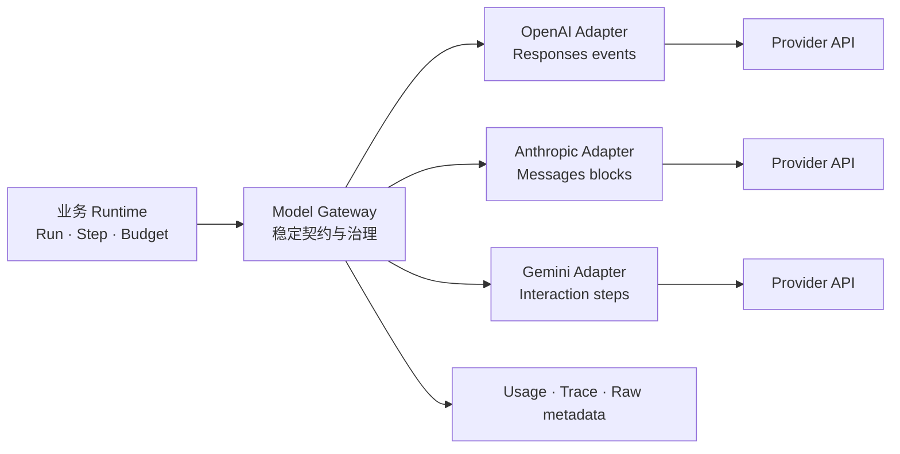
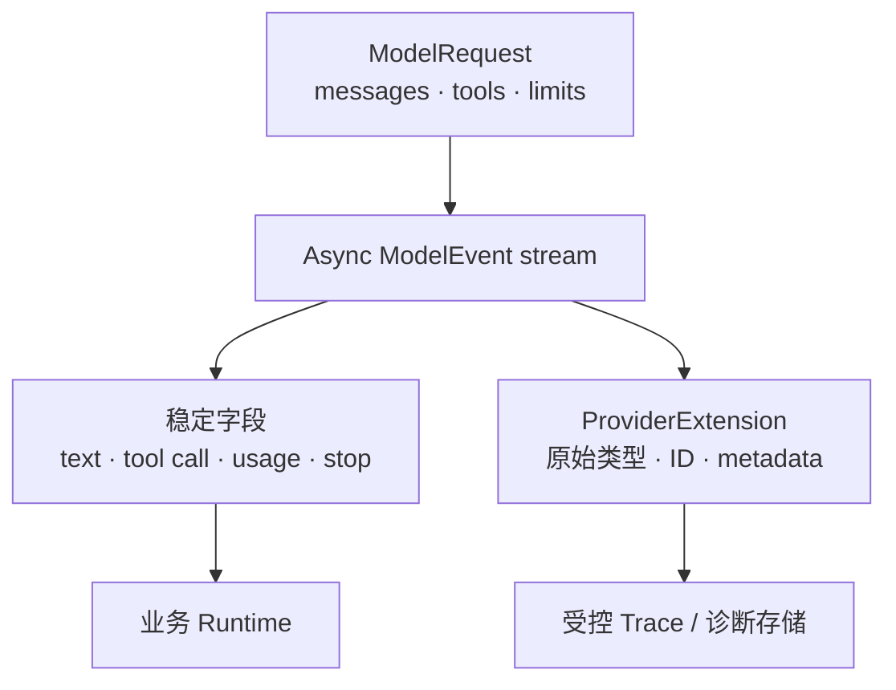
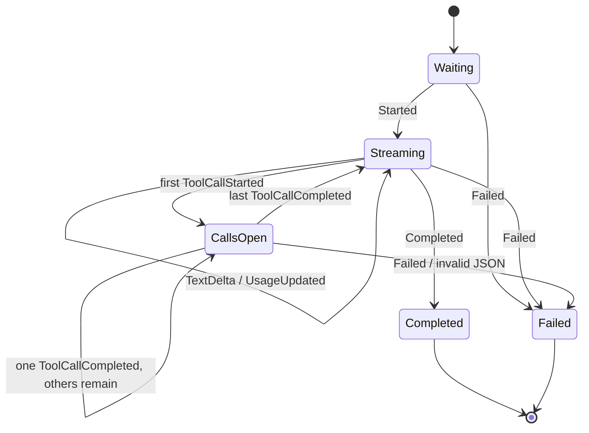
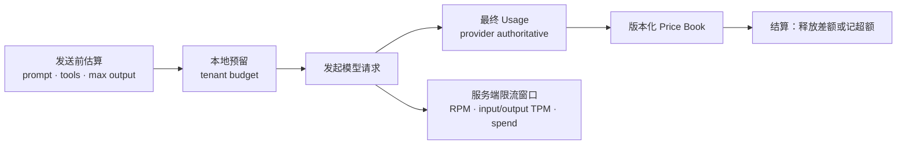
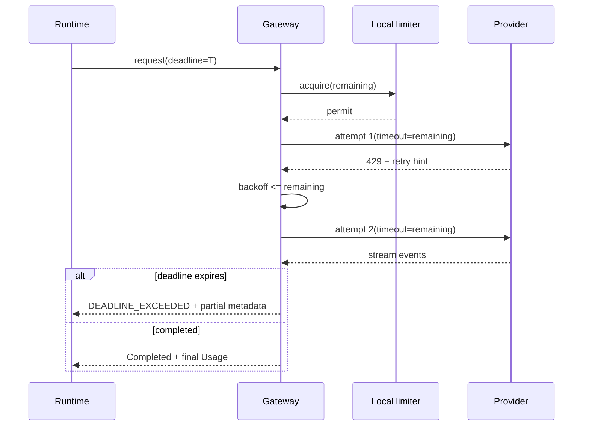
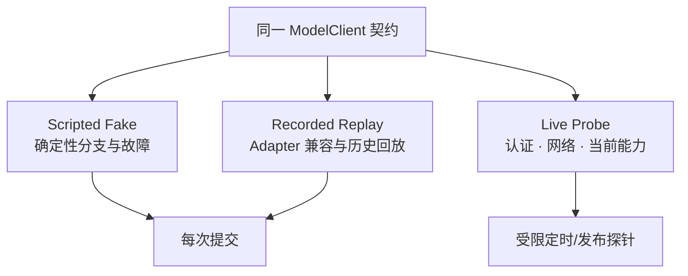
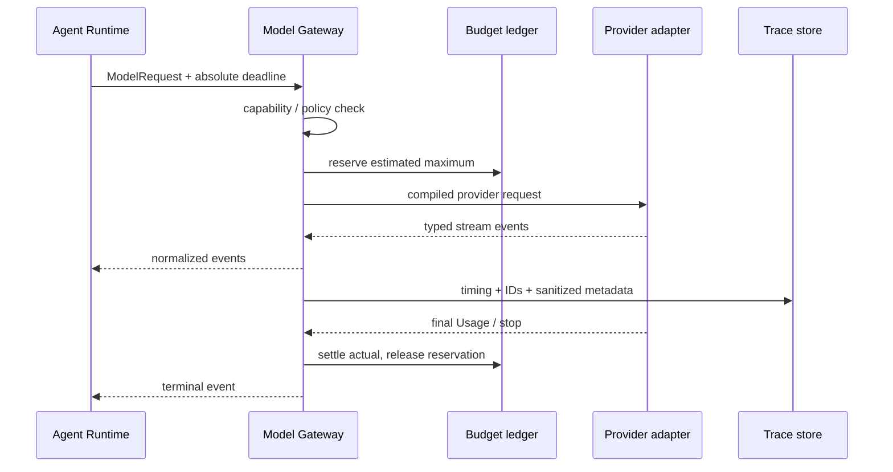

在业务代码里直接调用某家模型 SDK，最初通常很省事：传入消息，遍历文字片段，最后读取 Token 数量。但只要系统同时需要流式 Tool Call、租户预算、超时、重试、审计和测试，这种“薄封装”很快就会泄漏供应商协议。调用方开始判断某家的事件名、读取另一家的限流 Header，并在第三家的响应对象里寻找停止原因。

真正的 Model Gateway 不是把三个 SDK 方法改成同一个名字，而是建立一条**由应用拥有的模型调用协议**：业务层只依赖稳定的请求、事件、Usage、错误和能力；Adapter 保留并翻译供应商差异；Gateway 负责 Deadline、并发、预算和记录。无法无损统一的能力必须显式暴露，不能偷偷降级。

本文是“AI Agent 后端工程”专题的 Chapter 06。上一篇 [LLM 后端心智模型：Token、上下文、Embedding 与不确定性](/signal-grid-blog/posts/llm-backend-token-context-embeddings-uncertainty/) 解释了模型调用为什么具有不确定的延迟、成本与输出；本章把这些不确定量收进可观测、可替换的边界。Tool Loop 会留到 Chapter 08，本章的 Gateway 不执行任何业务工具。

文档语义核对于 **2026-08-28**：OpenAI 当前主推 Responses API 的类型化流式事件；Anthropic Messages 流使用 `message_start`、content block delta、`message_delta` 与 `message_stop`，Tool 参数以 `input_json_delta` 片段到达；Google Gemini 当前把 Interactions API 列为面向 Agent 工作流的推荐原语，并以 step 事件表达文字和函数调用。三者仍不是同一种协议，所以正文以供应商中立模型为主，厂商字段只作为 Adapter 例证。

## Gateway 的目标是隔离变化，而不是制造虚假的共同能力

“可切换模型”经常被误解为修改一行配置便能得到相同行为。模型的 Tool Calling、结构化输出、上下文、流式细粒度、Usage 口径、数据地域和错误语义都可能不同；就算两个端点接受相同 JSON，输出质量也不是可替换的。

合理的边界分成三层：



- **业务 Runtime** 决定为什么调用模型、把哪些 Tool 提供给这一轮，以及结果如何推进 Run；
- **Gateway** 统一能稳定定义的语义，实施模型白名单、预算、限流、Deadline 和观测；
- **Provider Adapter** 负责认证、请求编码、事件拼装、错误分类和原始响应保留。

Gateway 不应把供应商的全部功能压缩成最低公分母。更合适的做法是定义显式能力：

```python
from dataclasses import dataclass
from enum import StrEnum


class Capability(StrEnum):
    TEXT_STREAM = "text_stream"
    TOOL_CALLS = "tool_calls"
    PARALLEL_TOOL_CALLS = "parallel_tool_calls"
    STRICT_TOOL_SCHEMA = "strict_tool_schema"
    STRUCTURED_OUTPUT = "structured_output"


@dataclass(frozen=True, slots=True)
class ModelProfile:
    route: str
    capabilities: frozenset[Capability]
    context_limit: int

    def require(self, *required: Capability) -> None:
        missing = set(required) - self.capabilities
        if missing:
            names = ", ".join(sorted(item.value for item in missing))
            raise ValueError(f"route {self.route} lacks: {names}")
```

路由选择必须先验证能力，再发请求。如果首选路由不支持严格 Schema，Gateway 应拒绝或选择事先批准且通过评测的备用路由，而不是静默改成“尽量输出 JSON”。模型切换还必须通过离线 Eval；`Capability` 只证明协议能力，不证明业务质量等价。

## 稳定契约要统一语义，同时保留原始证据

供应商中立协议至少需要五类对象：请求、内容、Tool 定义、流式事件、Usage/错误。它们应使用应用自己的版本，不直接导出某个 SDK 类。



下面是一组最小核心类型。`provider_data` 只允许进入受控观测层，业务状态机不得根据其中的临时字段分支。

```python
from collections.abc import AsyncIterator
from dataclasses import dataclass, field
from typing import Any, Literal, Protocol


@dataclass(frozen=True, slots=True)
class Message:
    role: Literal["instruction", "user", "assistant", "tool_result"]
    content: str
    correlation_id: str | None = None


@dataclass(frozen=True, slots=True)
class ToolDefinition:
    name: str
    description: str
    input_schema: dict[str, Any]


@dataclass(frozen=True, slots=True)
class ModelRequest:
    request_id: str
    route: str
    messages: tuple[Message, ...]
    tools: tuple[ToolDefinition, ...] = ()
    max_output_tokens: int = 512
    temperature: float | None = None


@dataclass(frozen=True, slots=True)
class Usage:
    input_tokens: int
    output_tokens: int
    cached_input_tokens: int = 0
    reasoning_tokens: int = 0
    provider_data: dict[str, Any] = field(default_factory=dict)


class ModelClient(Protocol):
    def stream(
        self, request: ModelRequest, *, deadline: float
    ) -> "AsyncIterator[ModelEvent]": ...
```

`instruction` 是应用内部概念，不声称等于每家的 `system` 或 `developer` 角色。Adapter 必须按目标 API、模型和当前能力编译消息，并记录编译器版本。比如 OpenAI 的 developer/system 指令、Anthropic 的 top-level system 与仅部分模型/端点支持的 system message、Gemini 的 `system_instruction` 并非可直接互换的字面字段。Model Profile 没有声明对应能力时，Gateway 应拒绝或改走已评测路由，不能假定同一家供应商的所有模型都支持同一种指令位置。

同理，统一 Usage 只保留跨供应商确实稳定的最小集合。缓存写入、缓存命中、图像、音频、内部推理和服务端 Tool 可能有独立计费口径，应该放进带命名空间的扩展或单独的明细表，不能为凑一个 `total_tokens` 而丢失账单依据。

## 流不是字符串迭代器，而是一条有顺序的类型化事件日志

如果 Gateway 只暴露 `AsyncIterator[str]`，它无法表示拒绝、Tool Call、Usage、错误和停止原因，也无法区分“最后一个文字片段已到达”与“整个响应已经成功完成”。更稳妥的核心事件是：

| 事件 | 稳定含义 | 关键不变量 |
| --- | --- | --- |
| `Started` | 上游接受调用并分配请求身份 | 每次调用至多一次且先于内容 |
| `TextDelta` | 某个输出内容项新增文字 | 片段只用于展示，最终文本由顺序拼接得到 |
| `ToolCallStarted` | 一个 Tool Call 获得名称和关联 ID | `call_id` 在本次响应中唯一 |
| `ToolArgumentsDelta` | 参数 JSON 的字符串片段 | 片段可能不是合法 JSON，不得提前执行 |
| `ToolCallCompleted` | 参数边界闭合并已解析 | Schema 校验通过后才可交给 Runtime |
| `UsageUpdated` | 当前可见的累计或最终 Usage | 标明 `is_final`，避免把累计值相加 |
| `Completed` | 响应以明确停止原因结束 | 成功终态只出现一次 |
| `Failed` | 流内错误或协议错误 | 与 HTTP 建连前错误使用同一分类模型 |



### Tool 参数必须按 Call 独立拼装

并行 Tool Call 的片段可能交错到达，不能用一个全局字符串缓冲区。每个 `call_id` 都要拥有自己的名称、字节上限和参数缓冲区；只有完成事件到达后才执行 `json.loads` 和 Tool Schema 验证。

```python
import json
from dataclasses import dataclass, field
from typing import Any


class StreamProtocolError(RuntimeError):
    pass


@dataclass(slots=True)
class PendingCall:
    name: str
    chunks: list[str] = field(default_factory=list)
    utf8_bytes: int = 0


class ToolCallAssembler:
    def __init__(self, max_argument_bytes: int = 64 * 1024) -> None:
        self._pending: dict[str, PendingCall] = {}
        self._seen_call_ids: set[str] = set()
        self._max_argument_bytes = max_argument_bytes

    def start(self, call_id: str, name: str) -> None:
        if type(call_id) is not str or not call_id or len(call_id) > 128:
            raise StreamProtocolError("call id must be 1..128 characters")
        if type(name) is not str or not name or len(name) > 128:
            raise StreamProtocolError("tool name must be 1..128 characters")
        if call_id in self._seen_call_ids:
            raise StreamProtocolError(f"duplicate call id: {call_id}")
        self._seen_call_ids.add(call_id)
        self._pending[call_id] = PendingCall(name=name)

    def append(self, call_id: str, fragment: str) -> None:
        call = self._pending.get(call_id)
        if call is None:
            raise StreamProtocolError(f"delta before start: {call_id}")
        call.utf8_bytes += len(fragment.encode("utf-8"))
        if call.utf8_bytes > self._max_argument_bytes:
            raise StreamProtocolError("tool arguments exceed byte budget")
        call.chunks.append(fragment)

    def finish(self, call_id: str) -> tuple[str, dict[str, Any]]:
        call = self._pending.pop(call_id, None)
        if call is None:
            raise StreamProtocolError(f"finish before start: {call_id}")

        def reject_non_json_constant(value: str) -> None:
            raise ValueError(f"non-standard JSON constant: {value}")

        def reject_duplicate_keys(
            pairs: list[tuple[str, Any]],
        ) -> dict[str, Any]:
            result: dict[str, Any] = {}
            for key, value in pairs:
                if key in result:
                    raise ValueError(f"duplicate JSON object key: {key}")
                result[key] = value
            return result

        try:
            value = json.loads(
                "".join(call.chunks),
                parse_constant=reject_non_json_constant,
                object_pairs_hook=reject_duplicate_keys,
            )
        except (json.JSONDecodeError, ValueError) as error:
            raise StreamProtocolError("completed tool arguments are invalid JSON") from error
        if not isinstance(value, dict):
            raise StreamProtocolError("tool arguments must be an object")
        return call.name, value

    def assert_closed(self) -> None:
        if self._pending:
            raise StreamProtocolError(
                f"stream ended with open calls: {sorted(self._pending)}"
            )
```

这段代码刻意不对半截 JSON 做业务解释。关联 ID 保持 opaque，但 Adapter 仍拒绝空值、非字符串和异常长度；`_seen_call_ids` 在调用完成后也不清空，因此同一响应不能复用已经闭合的 ID。`parse_constant` 关闭 Python 标准库为 JavaScript 兼容而默认接受的 `NaN`、`Infinity` 和 `-Infinity`，`object_pairs_hook` 则拒绝重复对象键，避免不同 Parser、签名器和审计器对同一字节串得到不同结果。随后仍要执行 Tool Schema 与领域校验。

Anthropic 当前文档明确把 `input_json_delta.partial_json` 定义为字符串片段，并建议在 content block 完成后解析；OpenAI Responses 有 function-call arguments delta/done 事件；Gemini Interactions 也把 `arguments_delta` 作为片段。三家事件名不同，但“**闭合前不可执行**”是 Gateway 可以稳定拥有的不变量。

流式连接还可能在已经显示一部分文字后失败。UI 可以保留“未完成预览”，但领域层不能把它当成功答案。Gateway 应给这段文字标记 `partial=true`，以 `Failed` 或非成功 stop reason 结束，而不是自行补发 `Completed`。

## Usage、费用与限流是三套相关但不相同的账

Token Usage 是供应商对一次调用的计量结果；费用是 Usage 乘以当时生效且版本化的价格规则；限流则是服务端在时间窗口内接受多少请求或 Token。它们不能互相替代。



### 预算必须先预留，再按最终 Usage 结算

发送请求前只能估算输入 Token，并知道允许的最大输出；最终 Usage 通常在响应末尾或最终对象中才完整。因此并发请求不能都先检查“余额还够”，完成后再扣款，否则它们会共同透支。

设租户剩余预算为 `B`，第 `i` 个在途调用预留 `R_i`，可接纳条件是：

\[
R_{new} \le B - \sum R_i
\]

调用完成后，用权威 Usage 对应的实际费用 `A_i` 结算：释放 `R_i - A_i`；如果 `A_i > R_i`，记录超额并阻止后续调用。取消客户端流也不能假设账单为零：上游可能已经生成或执行服务端工具，仍要等待最终 Usage、查询请求状态，或以“费用待定”对账。

### 429 不是一个无限重试信号

限流可能按请求、输入 Token、输出 Token、项目、模型或费用分别计算。Anthropic 当前 Messages 文档列出 RPM、ITPM 和 OTPM，并在可重试的 429 上返回 `retry-after`；Gemini 文档说明限制按项目和模型等维度计算，且任何一个窗口超限都可能得到 429。具体数字随层级与账户变化，不能硬编码进业务协议。

Gateway 应同时保留：

- 规范化类别，例如 `RATE_LIMITED`、`OVERLOADED`、`QUOTA_EXHAUSTED`；
- 建议最早重试时间；
- 供应商请求 ID 和原始错误码；
- 本地限流器观察到的队列等待；
- 是否允许由当前调用者重试。

“日配额耗尽”“费用上限触发”和“瞬时窗口拥塞”可能都表现为 429，但只有最后一类适合短退避。Adapter 必须先分类，Gateway 才能做策略。

## Deadline 要覆盖排队、重试和读取整个流

常见的超时实现给每次 HTTP 尝试 30 秒，再允许三次重试。这样一个“30 秒请求”可能执行 90 秒以上，还没算本地排队和退避。正确的 Deadline 是从入口继承的绝对单调时钟时刻，所有阶段消耗同一余额。



下面的辅助函数使用 `loop.time()`，不会被系统时间校准影响。退避只在重试仍能留出一次实际尝试时发生。

```python
import asyncio
import random


def remaining_seconds(deadline: float) -> float:
    return max(0.0, deadline - asyncio.get_running_loop().time())


def retry_delay(
    *, attempt: int, retry_after: float | None, deadline: float, rng: random.Random
) -> float | None:
    remaining = remaining_seconds(deadline)
    if remaining <= 0.05:
        return None
    exponential = min(8.0, 0.25 * (2**attempt))
    hinted = max(0.0, retry_after or 0.0)
    delay = max(hinted, rng.uniform(0.0, exponential))
    # 至少保留 50 ms 给下一次尝试；真实系统应按网络 SLO 设更大下限。
    return delay if delay <= remaining - 0.05 else None


async def wait_before_retry(delay: float, deadline: float) -> None:
    async with asyncio.timeout_at(deadline):
        await asyncio.sleep(delay)
```

本地并发限制和服务端限流解决的也不是同一个问题。本地信号量保护连接池、内存和进程队列；Provider 限流保护远端配额。等待本地 permit 必须计入 Deadline，并向上暴露排队时间，否则观测面会把拥塞误判为“模型首 Token 变慢”。

如果消费者读取事件过慢，Gateway 还要有有界缓冲。文字 Delta 可以在不破坏顺序的情况下合并，但 `ToolCallCompleted`、Usage、Failed 和 Completed 不能丢弃。缓冲满时应暂停读取、取消上游或让整次调用失败；无限队列只会把流式背压变成内存事故。

## Fake、Recorded Replay 和真实模型证明的是不同性质

“测试时 mock 一下 SDK”通常只证明方法被调用，无法证明事件顺序、参数片段、取消和 Usage 结算。模型边界至少需要三种替身：



### Scripted Fake 是可编程状态机

Fake 应按请求特征返回完整事件脚本，而不是永远返回一句固定文本。测试可以表达：两个 Tool 参数流交错、Usage 只在末尾出现、文字后连接失败、收到取消但仍返回最终计费等情况。

```python
from collections.abc import AsyncIterator, Callable
from dataclasses import dataclass
from typing import TypeAlias


@dataclass(frozen=True, slots=True)
class Started:
    provider_request_id: str


@dataclass(frozen=True, slots=True)
class TextDelta:
    text: str


@dataclass(frozen=True, slots=True)
class Completed:
    stop_reason: str


ModelEvent: TypeAlias = Started | TextDelta | Completed
Script = Callable[[ModelRequest], tuple[ModelEvent, ...]]


class ScriptedFakeModel:
    def __init__(self, script: Script) -> None:
        self._script = script
        self.requests: list[ModelRequest] = []

    async def stream(
        self, request: ModelRequest, *, deadline: float
    ) -> AsyncIterator[ModelEvent]:
        self.requests.append(request)
        for event in self._script(request):
            if remaining_seconds(deadline) <= 0:
                raise TimeoutError("fake observed expired deadline")
            await asyncio.sleep(0)
            yield event
```

### Recorded Replay 是有版本的协议样本，不是缓存答案

Replay 记录应该包含规范化请求指纹、Gateway 协议版本、Adapter 版本、模型快照或别名、事件序列和去敏后的原始元数据。匹配请求时要忽略真正非确定的 trace ID，却不能忽略消息、Tool Schema、参数和路由，否则错误测试也会命中旧录像。

录制文件不能包含 API Key、用户隐私、隐藏推理或未经授权的 Tool 结果。供应商返回的加密思维状态若协议要求回传，应作为不透明敏感字段原样传递，不解析，也不进入普通 Fixture。

三种测试的证明边界如下：

| 替身 | 能证明 | 不能证明 |
| --- | --- | --- |
| Scripted Fake | Runtime 对所有合法/故障事件序列的处理；预算、终止、取消分支 | Adapter 仍兼容真实 API；模型质量 |
| Recorded Replay | 固定历史样本的解析与归一化；未知事件兼容 | 今日端点、限流与模型行为仍相同 |
| Live Probe | 当前认证、网络、模型名称和一条能力路径可用 | 生产流量分布下的质量、尾延迟和容量 |

因此“可替换模型”不是单元测试里换一个 Fake 就完成了。上线切换还要对同一版本化数据集做 Shadow/Eval，并检查 Schema 成功率、Tool 选择、成本和延迟分布。

## 一次调用要留下足够证据，又不能把 Provider 细节变成业务状态

从入口到结算，一次 Gateway 调用应形成下面的因果链：



建议把时间至少拆成：本地排队、DNS/连接、首事件、首可见文字、流持续时间和总时间。首事件可能只是 `Started`，首可见文字也可能永远不出现——模型可能直接给 Tool Call、拒绝或错误，所以不能只测“首 Token”。

错误模型也应回答“这次尝试之后是否安全重试”，而不只是复刻 HTTP 状态：

| 规范类别 | 典型含义 | Gateway 默认行为 |
| --- | --- | --- |
| `INVALID_REQUEST` | 编译后的参数或 Schema 不受支持 | 不重试，修复调用方或路由 |
| `AUTHENTICATION` / `PERMISSION` | 凭证或项目权限问题 | 不在请求路径内重试，告警 |
| `RATE_LIMITED` | 短窗口耗尽且有恢复时间 | 在 Deadline 与重试预算内退避 |
| `QUOTA_EXHAUSTED` | 日配额、费用上限等长期限制 | 拒绝或走已批准降级，不盲重试 |
| `OVERLOADED` | 远端瞬时容量不足 | 有界抖动退避，可熔断 |
| `DEADLINE_EXCEEDED` | 整体时间预算耗尽 | 终止；费用与上游状态可能待确认 |
| `PROTOCOL_ERROR` | 事件乱序、参数未闭合、未知必需字段 | 失败关闭并保留去敏证据 |

流协议应对新增的**可忽略**事件前向兼容。Anthropic 明确说明未来可能增加事件类型，客户端要能优雅处理未知事件。Gateway 可以把未知事件记入扩展 Trace 后跳过；但如果它改变内容边界、Usage 或完成语义，就必须由新 Adapter 版本理解，否则失败关闭。

## 结论：真正可替换的是受控边界，不是模型行为

一个成熟的 Model Gateway 能保证：业务 Runtime 不依赖供应商 SDK 对象；流式文字、Tool Call、Usage、失败和完成具有稳定事件语义；预算在并发前预留，Deadline 覆盖排队到结束；Fake、Replay 与 Live Probe 分别提供清晰的测试证据。

它不能保证不同模型质量相同，也不能把供应商独有能力无损翻译成共同接口。Capability、原始扩展和版本化 Eval 正是用来保留这条边界的。

下一篇 [Prompt 不是接口：Structured Output、JSON Schema 与版本演进](/signal-grid-blog/posts/structured-outputs-json-schema-prompt-versioning/) 将继续收紧 Gateway 的输出：先区分 JSON 格式、Schema 形状和业务语义，再讨论 Prompt 与 Schema 如何独立版本化。

## 参考资料

- [OpenAI Streaming API Responses](https://developers.openai.com/api/docs/guides/streaming-responses) 与 [Responses Streaming Events](https://platform.openai.com/docs/api-reference/responses-streaming)：Responses API 的 SSE、文字、拒绝、函数参数和完成事件。
- [OpenAI Function Calling](https://developers.openai.com/api/docs/guides/function-calling)：Tool 定义、严格模式、并行调用及 `call_id` 关联。
- [Anthropic Streaming Messages](https://platform.claude.com/docs/en/build-with-claude/streaming)：message/content block 事件顺序、累计 Usage、错误事件与 Tool 参数片段。
- [Anthropic Rate Limits](https://platform.claude.com/docs/en/api/rate-limits)：RPM、ITPM、OTPM、`retry-after`、费用上限与加速限制。
- [Gemini API Streaming](https://ai.google.dev/gemini-api/docs/streaming)：Interactions 的 step 事件、`arguments_delta` 与最终 Usage。
- [Gemini API Rate Limits](https://ai.google.dev/gemini-api/docs/rate-limits)：项目级多维窗口、模型差异和费用速率限制。
- [Gemini API Reference](https://ai.google.dev/api)：Interactions 与 Generate Content 等端点的当前定位。
